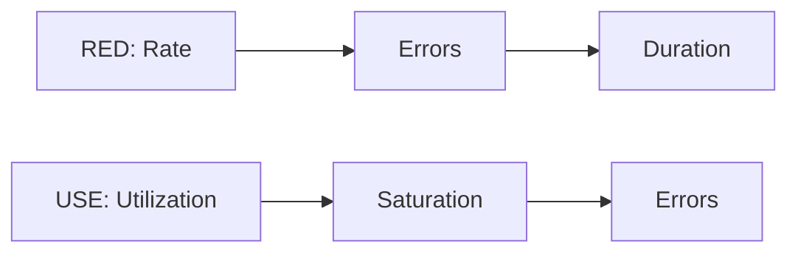
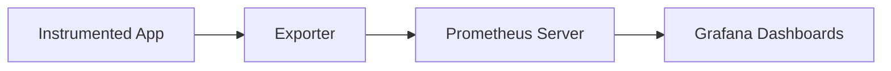

**Excellent. Day 2 is here.** Time to hand things over to Felix—the metrics purist who thinks everything is measurable, especially your lies.

This one’s all about **metrics**: structured, repeatable, precise. We’ll give your learners:
- 🔍 Definitions they’ll remember  
- 🧠 Visuals they can explain  
- 💥 A problem they can’t solve without real metrics  
- 🪓 Pitfalls they’ll walk into unless we stop them  

---

# 🧱 **Day 2: Metrics & Instrumentation**

**Character:** Felix – Berlin  
**Style:** Analytical. Thinks in time-series. No patience for guesswork.  
**Vibe:** “Your dashboards are pretty. But are they right?”

---

## 🎯 Learning Objectives

### 🔍 Beginner
- Understand metric types: counter, gauge, histogram, summary
- Apply RED and USE monitoring models

### 🧩 Intermediate
- Design metric labels and naming standards
- Compose Prometheus-style queries to monitor live services

### 💡 SRE-Level
- Architect scalable, low-cardinality metrics pipelines
- Implement meaningful SLIs from metrics

---

## 💥 Incident Hook: The Case of the Slow POST

> “A dev team was getting paged for timeouts. But CPU, memory? All normal.  
> Logs said ‘200 OK’. Devs said, ‘must be the network’.  
> I pulled one graph: `request_duration_seconds`.  
> It told the whole story: 90th percentile latencies doubling every 5 minutes.”

---

## 🧠 Core Concepts

### 🔹 Metric Types

```mermaid
flowchart TD
  A(Counter) --> B[Total Number of Events (e.g., requests)]
  C(Gauge) --> D[Point-in-time Value (e.g., CPU, memory)]
  E(Histogram) --> F[Latency Buckets (e.g., requests <500ms)]
  G(Summary) --> H[Statistical quantiles (p90, p95)]
```

🧠 **Counters** only go up.  
🧠 **Gauges** fluctuate.  
🧠 **Histograms** break up distributions into buckets.  
🧠 **Summaries** try to do stats—but are harder to aggregate.

---

### 🔹 RED and USE Models



- **RED** = Track service-level health  
- **USE** = Track resource-level saturation

> Example: A REST API → RED  
> A database host → USE

---

### 🔹 Metrics Flow (Prometheus Model)



Labels can explode your cardinality. Keep `user_id`, `uuid`, and `trace_id` *out* of metric labels.

---

## 🧪 Simulation Exercise

> You are handed a dashboard screenshot (provided as PNG). You see:
> - `api_requests_total` is increasing normally
> - `request_duration_seconds_bucket{le="0.5"}` is dropping
> - `rate(errors_total{code="500"}[5m])` is spiking

📌 **Question:**
- What’s happening?
- What signal would trigger a page?
- Is it a system issue, or a user pattern?

---

## 🛠 Tool Concepts (No Installation Needed)

### Instrumentation:
```python
# Python with prometheus_client
from prometheus_client import Counter, Summary

REQUEST_COUNT = Counter('api_requests_total', 'Total requests')
REQUEST_LATENCY = Summary('request_latency_seconds', 'Request latency')

@route("/")
def handler():
    REQUEST_COUNT.inc()
    with REQUEST_LATENCY.time():
        return do_work()
```

🧠 This code exposes metrics at `/metrics`, ready for Prometheus to scrape.

---

## 🕳️ Common Pitfalls

- Slapping `user_id` on everything → cardinality explosion
- Tracking errors without rate or percent context
- Confusing p95 latency with “most users”
- No retention plan → Prometheus chokes after a month

---

## 📜 Felix’s Commandments

1. “If you’re measuring everything, you’re learning nothing.”  
2. “Latency without distribution is like uptime without users.”  
3. “Dashboards don’t fix outages—questions do.”

---

## 🤝 Handoff to Tomorrow

> “Logs are what you read when metrics aren't enough. Asha’s got a journal full of weird ones. She’ll show you how structure turns chaos into clues.”

---

## 📦 Artifacts for Day 2

- ✅ Mermaid diagrams:
  - Metric Types
  - RED/USE Models
  - Prometheus Pipeline
- ✅ Prometheus-style queries (in comments or mock screenshots)
- ✅ Code block for Python instrumentation
- ✅ Simulated alert scenario
- ✅ Tiered objectives + pitfalls + commandments

