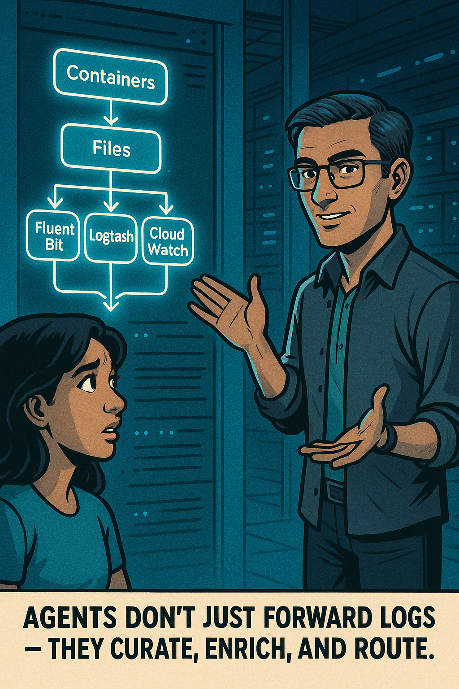
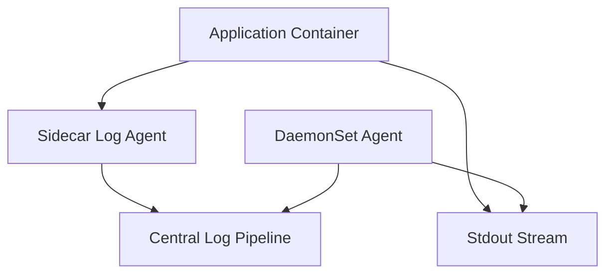
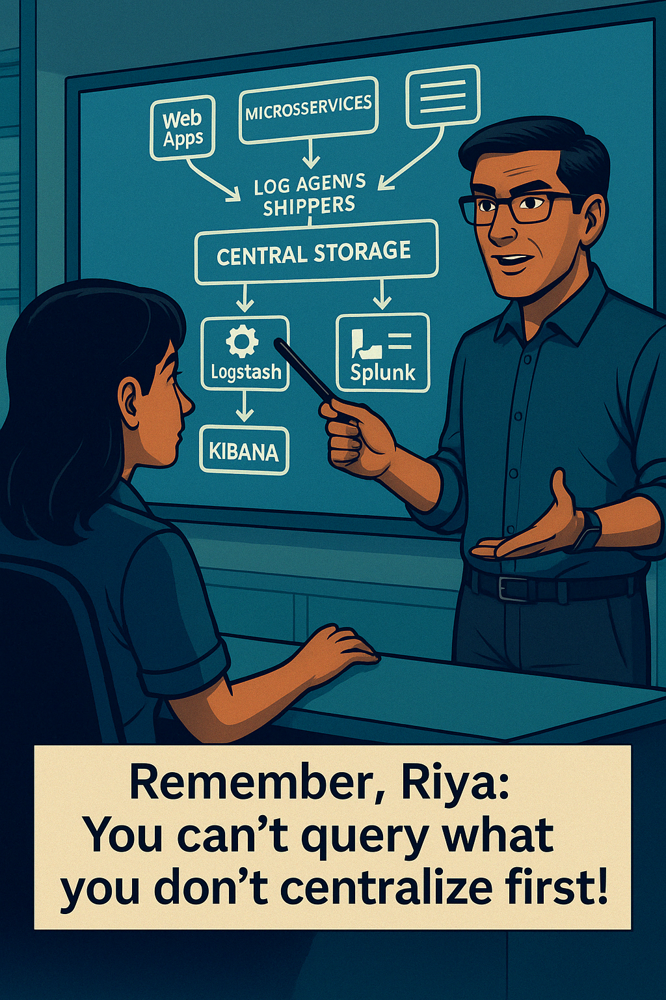

**Day 3: Intermediate Level - Log Collection, Centralization & Analysis**

_"You can't fix what you can't find. And you can't find what you didn't log right." — Deepak Bhargava_

---

### **Section 1: Log Collection & Shipping**

{width=450px}

> _“You don’t always control where logs come from. But you can control how they’re shipped.” — Deepak_

#### 📦 Why Collection Matters

Logs are born noisy and fragile. They live in many places — files, streams, memory buffers. If you don’t reliably collect them:
- You miss critical clues
- Your observability gaps widen
- Your alerting fails silently

> _“Imagine during a fraud outage, our logs silently stopped collecting because a disk filled up. We had alerts for fraud patterns. None for collector failure. Never again.” — Deepak_

#### 🚚 Common Collection Mechanisms

| Method | Use Case |
|--------|----------|
| **Log files** | Most common. Agents tail files (e.g., `/var/log/app.log`). |
| **Stdout/stderr** | Default for containerized apps (Docker, K8s). Logs captured by runtime. |
| **Direct API calls** | Apps emit logs directly via HTTP/gRPC to a collector (e.g., Fluentd). |
| **Syslog protocol** | Traditional servers, routers, and firewalls. Still common in hybrid infra. |

#### 🧠 Deepak Explains: Planning for Resilience
> _"Always design your logging path like a supply chain. Redundancy matters. What if the file gets locked? What if stdout is dropped? Good observability plans for failure, not perfection."_

#### 🔧 Sample Fluent Bit Config
```ini
[INPUT]
  Name tail
  Path /var/log/app.log
  Tag app.logs
  Parser json

[OUTPUT]
  Name  es
  Match *
  Host  opensearch.local
  Port  9200
```

---

### **Section 2: Log Shippers & Agent Patterns**

Log shippers do more than ship — they parse, enrich, throttle, buffer, and forward logs to one or more destinations.

Popular tools:
- **Fluent Bit / Fluentd**
- **Logstash**
- **Vector.dev**
- **CloudWatch Agent**
- **Datadog Agent**
- **Splunk Forwarder**

---

#### 🧩 Deployment Topologies


| Pattern | Pros | Cons |
|--------|------|------|
| **Sidecar** | Fine-grained control, isolation | More config overhead per pod |
| **DaemonSet** | Simpler to deploy, consistent across nodes | Can miss intra-container details |
| **Standalone** | Ideal for legacy systems | No awareness of K8s pods, harder to manage at scale |

#### 🧠 Deepak Explains: Choosing Wisely
> _"Use Sidecars when granularity matters—especially for noisy services. Use DaemonSets when speed and simplicity are key. Don’t forget to log from the log shipper itself."_

---

### **Section 3: Centralized Logging Platforms**

{width=500px}

#### 🗄️ Why Centralize?
- One source of truth
- Correlation across services
- Consistent retention and access policies
- Faster RCA and postmortem support

#### 🧱 Platform Components

| Component | Description | Tools |
|----------|-------------|--------|
| **Ingest & Buffer** | Temporarily store logs before processing | Kafka, Fluentd, Logstash |
| **Index & Store** | Searchable log storage | OpenSearch, Elasticsearch, Loki, Splunk, CloudWatch |
| **Query Engine** | Search logs using filters, keywords, fields | Kibana, Grafana, Splunk Search, CloudWatch Insights |
| **Visualization** | Dashboards, charts, graphs | Grafana, Kibana, Datadog |

#### 🧠 Deepak Explains: Real-World Pitfalls
> _"A centralized system with no retention policy is a liability. I once saw a team lose 30TB of logs because they assumed 'delete never'. Always define TTLs and cold storage transitions."_

---

### **Section 4: Effective Querying Techniques**

> _“Logs are noisy by default. Smart filters are your flashlight.” — Deepak_

When using a tool like **Grafana Loki** or **Splunk**, your goal is to filter out the hay and find the needle.

#### 🔎 Essential Techniques
- **Field Filtering**
  - e.g., `service="checkout" AND status="500"`
- **Time Range Selection**
  - Narrow scope to 15-minute windows or spike events.
- **Boolean Logic**
  - Combine filters with AND, OR, NOT
- **Regex Matching**
  - Advanced filtering (e.g., URL patterns or status code ranges)
- **Group By / Aggregations**
  - Count errors by host, user, endpoint

#### 🧪 Example Queries

**Loki:**
```bash
{service="payments", level="error"} |= "timeout"
```

**Splunk:**
```spl
index=prod_logs service=payments level=error "timeout"
```

#### 🛠️ Troubleshooting Pattern
| Symptom | Likely Cause | Fix |
|---------|--------------|------|
| No logs returned | Field mismatch | Check tag names, index config |
| Slow search | No index on fields | Use structured logs with indexed fields |
| Missing logs | Shipper crash or buffer overflow | Monitor agent logs and disk usage |

#### 🧠 Deepak Debug Tip:
> _"Start with `level=ERROR`, then pivot by `request_id`. Nine times out of ten, the trace writes its own story. You just have to follow it."_

---

### **Deepak’s Wrap-Up for Intermediate Learners**

> _"Structured logs were step one. Now, you know how to collect, shape, route, and interrogate them."_

By now, you’ve moved from understanding *what logs are* to understanding *how they move*, *where they go*, and *how to query them for answers*. You’ve also seen:
- The tradeoffs of sidecars vs. DaemonSets
- The anatomy of a centralized logging pipeline
- Real-world querying tips from someone who’s debugged systems at 3 AM
- Practical config, error patterns, and platform architecture

Next, we’ll explore how to turn logs into **proactive tools** with **metrics extraction**, **alerting**, and **triage workflows**.

Stay sharp. The logs are speaking. You’re ready to listen.

---

**End of Intermediate Section — Day 3: Logs**

**Up Next: Advanced Level — Optimization, Automation & Integration**

