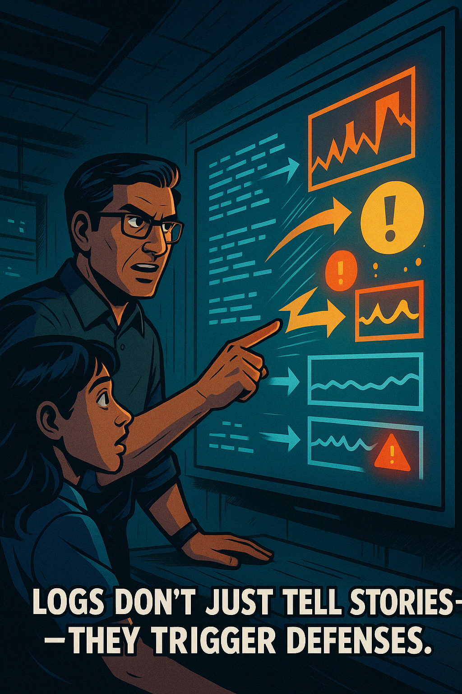
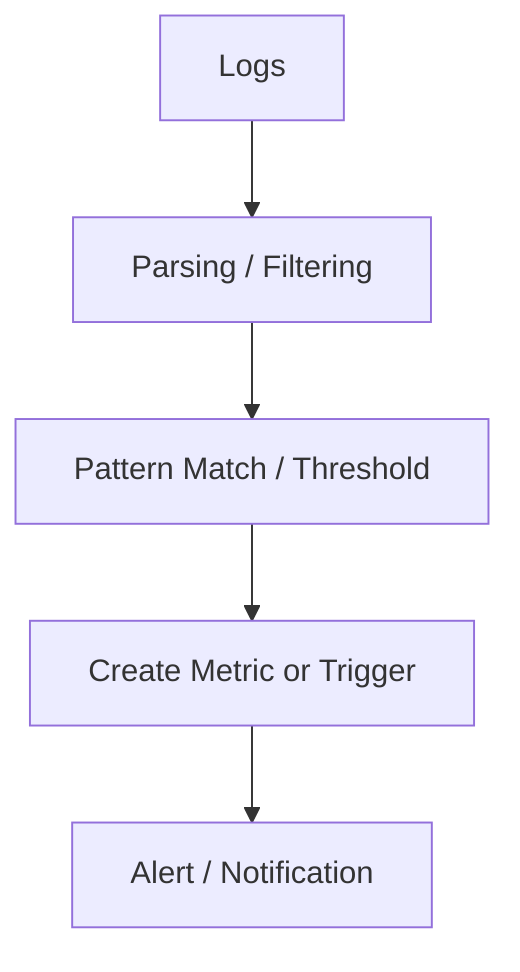
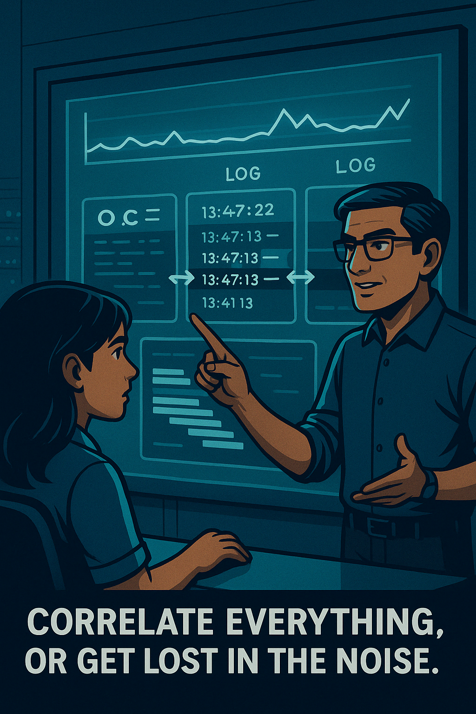
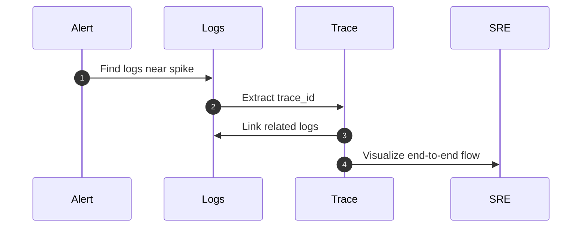

# **Day 3: Advanced Level — Optimization, Automation & Integration**

> *"If logs are the memory of your system, then metrics are your heartbeat—and alerts are the reflexes. Let’s wire them together." — Deepak*

---

## **Logs as a Source for Metrics & Alerting**

{width=500px}

#### 🔄 Deriving Metrics from Logs

Structured logs contain rich, granular data that can be **aggregated into metrics**. For example:

- Count all `HTTP 500` errors → error rate per minute
- Average `response_time_ms` field → latency over time
- Count logs by `user_id` → usage patterns or abuse detection

#### Tools for Log-Based Metrics

- **Grafana Loki** — LogQL queries can be wrapped in `rate()` or `count_over_time()`
- **CloudWatch Metric Filters** — Create metrics from log patterns
- **Datadog** — Log-based metrics and monitors
- **Kibana Lens/TSVB** — Graphs based on JSON log fields

```logql
rate({app="api", status="500"}[5m])
```

```bash
aws logs put-metric-filter \
  --log-group-name "payments-logs" \
  --filter-pattern '{ $.status = 500 }' \
  --metric-transformations metricName=HTTP500s,metricNamespace=App/Metrics,metricValue=1
```

#### 🔔 Log-Based Alerting



| Type                | Example                       | Use When                   |
| ------------------- | ----------------------------- | -------------------------- |
| **Count-based**     | “10 errors in 5 mins”         | For bursts/spikes          |
| **Threshold-based** | “response\\_time\\_ms > 500ms” | When field data is numeric |
| **Pattern-based**   | “payment failed” regex        | For semantic alerting      |

📘 **Deepak Explains: Logs vs. Metrics for Alerting**

> *"Use logs when you need depth. Use metrics when you need speed. Logs are like witnesses; metrics are smoke detectors."*

---

## **Correlation & Observability**

#### 🧪 Activity: Trace it Back

> **Scenario:** A metric spike in payment latency occurred at 12:31 PM. Use the provided log set to find the relevant trace ID, isolate the root cause, and identify which service failed.

**Steps:**
1. Search for error logs within the 12:30–12:32 PM window
2. Extract the `request_id` or `trace_id`
3. Correlate upstream/downstream logs across services
4. Identify root cause and recovery time

> *"A trace is a story. A log is a page. A metric is the title." — Deepak*

{width=500px}

#### 🔁 Trace IDs as Correlation Keys

Logs enriched with `trace_id`, `span_id`, and `request_id` allow:

- Request-scoped log tracing across services
- Linking logs to distributed traces
- Multi-layered debugging (e.g., DB + API + cache)

```json
{
  "timestamp": "2024-04-20T14:03:01Z",
  "service": "checkout",
  "level": "error",
  "request_id": "r123-abcd",
  "trace_id": "trace-001a",
  "message": "fraud check failed"
}
```

#### 🧩 Correlation Workflow



---

## **Log Volume, Cost Management & Sampling**

📘 **Deepak Explains: Logs Are Not Free**

> *“You pay for logs in storage, in ingestion, in query latency, and in alerting noise. Discipline pays off.”*

#### 💰 Strategies to Reduce Cost

| Strategy                | Description                                               |
| ----------------------- | --------------------------------------------------------- |
| **Log Levels**          | Use INFO, WARN, ERROR appropriately. Avoid DEBUG in prod. |
| **Filtering at Source** | Drop logs at the agent that don’t match patterns.         |
| **Sampling**            | Log only 10% of successful events.                        |
| **Retention Policies**  | Keep 90 days hot, archive after.                          |
| **Tiered Storage**      | OpenSearch hot/cold tiers, S3 archival.                   |

#### 🔍 Example Fluent Bit Filter

```ini
[FILTER]
  Name grep
  Match *
  Regex level ERROR
```

#### 🧪 Activity: Cost Optimization Simulation

> Use real ingestion numbers. Ask: What happens to cost if you drop 30% of verbose INFO logs? What if you sample 200 OK logs at 5%?

---

## **Security & Compliance Considerations**

#### ⚠️ PII and Sensitive Data

- Never log credit cards, passwords, or PII.
- Use scrubbing/redaction in pipelines.
- Hash sensitive fields if analysis is needed.

```json
{
  "user_email": "[REDACTED]",
  "credit_card": "[MASKED]",
  "ip_address": "192.168.1.5"
}
```

#### 🧠 Deepak’s Security Checklist:

- [ ] Redact or hash all PII and secrets in logs
- [ ] Apply log encryption at rest and in transit
- [ ] Ensure logs are immutable (append-only audit logs)
- [ ] Enable access controls and audit access logs
- [ ] Rotate and retain logs based on compliance needs

#### 📚 Audit Logs

Audit logs show:

- Who accessed what data
- When sensitive actions were taken
- Authentication events

---

## **Wrap-Up and Final Takeaways**

📸 **Insert Image Here:** DALL·E panel of Deepak in a war room surrounded by dashboards. Metrics, logs, and traces glow behind him as he connects the pieces like a puzzle.

**Prompt:** “Comic book panel showing Deepak in a war room, with logs, metrics, and traces glowing behind him on a giant dashboard. He gestures to all three as puzzle pieces connecting. Caption: ‘Structured. Centralized. Correlated. That’s the SRE mindset.’”

> *“Logs are no longer your last resort. They’re your first response tool.” — Deepak*

You’ve now mastered:

- Deriving metrics and alerts from logs
- Correlating logs with traces and metrics
- Reducing log volume and managing cost
- Securing logs and preparing for compliance

> Logs are your **always-on source of truth**—but only if you shape them well, store them wisely, and query them surgically.


