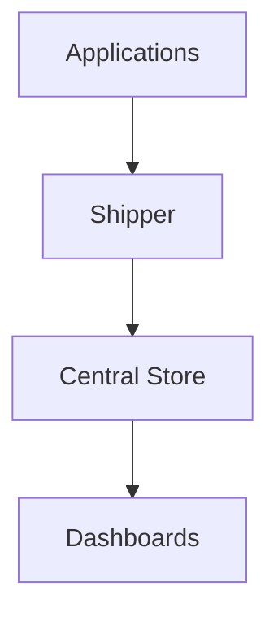
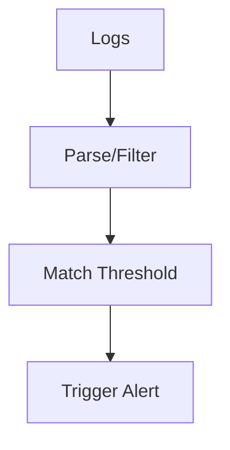

# **Day 3 Quiz Answer Sheet — Logs in Site Reliability Engineering**

---

## Answer 1: [Logs Basics]

🔍 Beginner | Multiple Choice

**Question:** Which of the following best describes a *structured log*?  
A. A log entry written in natural language  
B. A JSON-formatted log with consistent fields  
C. A log without timestamps  
D. A syslog message containing device status

**Correct Answer:** B – A JSON-formatted log with consistent fields

**Explanation:** Structured logs follow a predictable schema (often JSON) that includes key-value pairs like timestamp, level, message, and metadata. This structure allows for reliable parsing, filtering, and correlation.

**Why others are wrong:**
- **A:** Natural language logs are unstructured and difficult to query.
- **C:** Missing timestamps hinder chronological analysis and are not structured.
- **D:** Syslog may be structured but isn’t necessarily consistent or JSON-formatted.

---

## Answer 2: [Log Purpose]

🔍 Beginner | True/False

**Question:** Logs can only be used for debugging applications, not for auditing or security purposes.  
A. True  
B. False

**Correct Answer:** B – False

**Explanation:** Logs serve multiple purposes beyond debugging, including security auditing, performance analysis, and compliance tracking. SREs often use logs for root cause analysis, behavior insight, and alerting.

**Why others are wrong:**
- **A:** This is a narrow interpretation and ignores the broader uses of logs.

---

## Answer 3: [Log Types]

🔍 Beginner | Matching

**Question:** Match each log type (Column A) with the correct log message example (Column B). Write your answers as A–?, B–?, C–?.

**Correct Answer:**
- A – 3. `ERROR: payment declined`
- B – 1. `GET /api/products 200`
- C – 2. `auth failure for user root`

**Explanation:**  
Application logs describe system or app behaviors and errors. Access logs record endpoint access and HTTP statuses. Security logs capture events like authentication failures or privilege escalations.

**Why others are wrong:**
- Mislabeling any of these disrupts alerting, RCA, or compliance visibility.

---

## Answer 4: [Unstructured vs Structured]

🔍 Beginner | Fill-in-the-Blank

**Question:** A log entry that uses a consistent key-value format, such as JSON, is known as a __________ log.

**Correct Answer:** Structured

**Explanation:** Structured logs are designed for machine readability and consistent field-based analysis. JSON is the most common format.

---

## Answer 5: [Observability Pillars]

🔍 Beginner | Multiple Choice

**Question:** Which pillar of observability is best described as “telling you why something happened”?  
A. Metrics  
B. Logs  
C. Traces  
D. Alerts

**Correct Answer:** B – Logs

**Explanation:** Logs contain the contextual, narrative-level detail that helps teams identify the root cause of incidents. They describe what happened, when, and why.

**Why others are wrong:**
- **A:** Metrics show trends, not causes.
- **C:** Traces show request flow, not root context.
- **D:** Alerts are symptoms, not diagnostic data.

---

## Answer 6: [Structured Logging]

🔍 Beginner | True/False

**Question:** Structured logging helps enable faster searching, filtering, and correlation of log data.  
A. True  
B. False

**Correct Answer:** A – True

**Explanation:** Structured logs include fields like request_id, service, and timestamp, making them easy to parse and analyze. This accelerates root cause analysis and enhances automation.

**Why others are wrong:**
- **B:** False implies unstructured logs are more efficient, which is incorrect.

---

## Answer 7: [Log Collection]

🧩 Intermediate | Multiple Choice

**Question:** Which of the following is a common method of log collection in containerized environments?  
A. Direct SQL extraction  
B. Tailing log files via cron jobs  
C. Capturing stdout/stderr via log agents  
D. Manually uploading logs via FTP

**Correct Answer:** C – Capturing stdout/stderr via log agents

**Explanation:** In containerized environments like Kubernetes, logs are usually captured from stdout/stderr streams and collected by agents like Fluent Bit or Fluentd. This method ensures log data flows without modifying applications.

**Why others are wrong:**
- **A:** SQL is not a log collection method.
- **B:** Cron-based tailing is outdated and brittle.
- **D:** Manual upload is not scalable or reliable.

---

## Answer 8: [Log Pipeline]

🧩 Intermediate | Diagram-Based

**Question:** Refer to the diagram:

Which stage is responsible for parsing and filtering the logs?  
A. App  
B. Agent  
C. Store  
D. UI

**Correct Answer:** B – Agent

**Explanation:** The agent (log shipper) is responsible for parsing and transforming log data. Tools like Fluent Bit and Logstash perform this step before forwarding logs to storage.

**Why others are wrong:**
- **A:** Applications emit raw logs.
- **C:** Storage is passive.
- **D:** Dashboards visualize, not process.

---

## Answer 9: [Agent Deployment]

🧩 Intermediate | Multiple Choice

**Question:** What is a key benefit of deploying log shippers as a DaemonSet?  
A. Complete isolation of logs  
B. Easy deployment across Kubernetes nodes  
C. Higher cost per pod  
D. Increased granularity per app

**Correct Answer:** B – Easy deployment across Kubernetes nodes

**Explanation:** DaemonSets deploy one log agent per node, simplifying log collection across pods. This pattern is efficient and scales well in Kubernetes environments.

**Why others are wrong:**
- **A:** Isolation is better with sidecars.
- **C:** DaemonSets are cost-effective.
- **D:** Granularity is lower than sidecars.

---

**Day 3 Quiz Answer Sheet — Logs in Site Reliability Engineering**

---

[Previous Answers 1–9...]

---

## Answer 10: [Centralization]

🧩 Intermediate | Fill-in-the-Blank

**Question:** A __________ logging platform provides a single source of truth by aggregating logs from across the system.

**Correct Answer:** Centralized

**Explanation:** Centralized logging platforms like OpenSearch or Splunk aggregate logs from many sources into one interface. This supports correlation, RCA, and unified alerting.

---

## Answer 11: [Querying Logs]

🧩 Intermediate | True/False

**Question:** Querying structured logs is slower than unstructured logs because structured logs require more storage.  
A. True  
B. False

**Correct Answer:** B – False

**Explanation:** Structured logs are faster to query because they allow indexed field-based filtering. While storage size may increase, query performance improves due to predictability.

**Why others are wrong:**
- **A:** Structured logs are faster, not slower.

---

## Answer 12: [Tooling]

🧩 Intermediate | Matching

**Question:** Match each tool to its role:

| Tool           | Function                  |
|----------------|---------------------------|
| A. Fluent Bit  | 1. Log shipping           |
| B. OpenSearch  | 2. Log storage and query  |
| C. Grafana     | 3. Visualization          |

**Correct Answer:**
- A – 1. Log shipping
- B – 2. Log storage and query
- C – 3. Visualization

**Explanation:** Fluent Bit is a lightweight log shipper. OpenSearch stores and indexes logs. Grafana is a UI for visualizing time-series data and logs.

**Why others are wrong:**
- Incorrect pairings misrepresent the tool’s core purpose.

---

## Answer 13: [Troubleshooting]

🧩 Intermediate | Multiple Choice

**Question:** What would likely cause a log search to return no results?  
A. Insufficient permissions  
B. Malformed JSON logs  
C. Field mismatch in the query  
D. All of the above

**Correct Answer:** D – All of the above

**Explanation:** Each listed factor can break log searches. Permissions may block access. Malformed logs may fail to index. Query field mismatches prevent retrieval.

**Why others are wrong:**
- **A, B, C:** Individually correct, but incomplete.

---

## Answer 14: [Log Metrics]

💡 Advanced | Multiple Choice

**Question:** Which field would you most commonly use to generate latency metrics from structured logs?  
A. `error_code`  
B. `user_agent`  
C. `response_time_ms`  
D. `log_level`

**Correct Answer:** C – `response_time_ms`

**Explanation:** The `response_time_ms` field captures how long a request took to complete, making it ideal for calculating latency metrics.

**Why others are wrong:**
- **A:** `error_code` tracks errors, not time.
- **B:** `user_agent` identifies clients.
- **D:** `log_level` indicates severity, not duration.

---

## Answer 15: [Alerting]

💡 Advanced | Diagram-Based

**Question:** Refer to the alerting flow diagram:

Where would you define a regex for "payment failed"?  
A. Logs  
B. Parse  
C. Match  
D. Alert

**Correct Answer:** B – Parse

**Explanation:** Regex filtering is part of parsing logic, where the log content is evaluated before any alerting logic is applied. This stage extracts or matches patterns.

**Why others are wrong:**
- **A:** Logs contain data but don’t interpret it.
- **C:** Match evaluates thresholds, not content.
- **D:** Alerts are downstream triggers.

---

## Answer 16: [Correlation]

💡 Advanced | Ordering

**Question:** Place the steps of trace correlation in the correct order:
1. Extract `trace_id` from log  
2. Filter logs during spike  
3. Link logs across services  
4. Visualize full trace

**Correct Answer:**
2 → 1 → 3 → 4

**Explanation:** Start by identifying the window of failure, extract the `trace_id`, use it to join logs across services, then visualize the distributed trace.

---

## Answer 17: [Cost Optimization]

💡 Advanced | Multiple Choice

**Question:** Which of the following strategies best reduces log ingestion costs?  
A. Increasing log verbosity  
B. Logging all 200 OK responses  
C. Sampling high-volume logs  
D. Removing request IDs from logs

**Correct Answer:** C – Sampling high-volume logs

**Explanation:** Sampling reduces volume by logging a representative subset, especially for high-frequency success events. This cuts cost without losing key signals.

**Why others are wrong:**
- **A:** Increases cost.
- **B:** Adds noise.
- **D:** Harms traceability.

---

## Answer 18: [Security]

💡 Advanced | True/False

**Question:** Storing raw credit card numbers in logs is acceptable if logs are encrypted.  
A. True  
B. False

**Correct Answer:** B – False

**Explanation:** Even encrypted logs must comply with privacy and data handling standards (e.g., PCI DSS). Sensitive data should never be logged in plaintext or encrypted form.

**Why others are wrong:**
- **A:** Violates security best practices.

---

## Answer 19: [Compliance]

💡 Advanced | Fill-in-the-Blank

**Question:** Audit logs must be __________ to ensure a verifiable record of system activity.

**Correct Answer:** Immutable

**Explanation:** Audit logs must not be alterable to ensure trust and traceability in security investigations and compliance audits.

---

## Answer 20: [Tradeoffs]

💡 Advanced | Multiple Choice

**Question:** What is a tradeoff of log-based alerting compared to metric-based alerting?  
A. Faster triggering  
B. Simpler logic  
C. Higher latency and complexity  
D. Lower noise

**Correct Answer:** C – Higher latency and complexity

**Explanation:** Log-based alerts often have more latency due to ingestion and parsing. They are flexible but slower and more complex than direct metric alerts.

**Why others are wrong:**
- **A:** Metrics trigger faster.
- **B:** Metrics are simpler.
- **D:** Log alerts may be noisier without filters.

---

✅ End of Day 3 Quiz Answer Sheet

