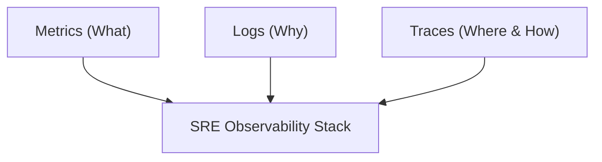
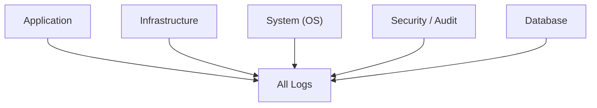
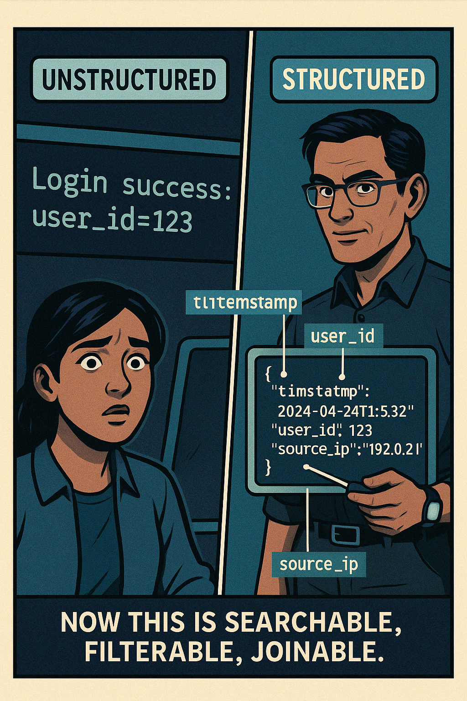

# Day 3: Beginner Level — The Foundation of Logging

_"Not all logs are created equal." — Deepak Bhargava_

---

## Welcome to Day 3: Understanding Logs

As you step into Day 3 of your SRE Core journey, you'll notice a shift. Metrics — the numbers, thresholds, and counters we explored on Day 2 — are brilliant at telling you *what* happened. But when the pager goes off at 2:13 AM and the dashboard is glowing red, you need a way to understand *why*. That’s where logs come in.

🧠 _"Metrics give you the vital signs. Logs give you the autopsy." — Deepak_

Today, we’re going to move beyond the idea of logs as “a bunch of messages” and begin treating them as a structured, queryable, and strategic asset. Your guide is Deepak Bhargava, our fictional (but very realistic) SRE legend known as **The Log Curator**. Deepak will guide us through the foundations of logging with his insights, anecdotes, and strong opinions forged in the fire of real outages.

Let’s begin.

---

## Section 1: Recap & Framing

> _"You’ve used logs to chase bugs. That’s good. Today, we level up. We use logs to architect reliability." — Deepak_

We started Day 1 by learning about the three pillars of observability: **Metrics, Logs, and Traces**. Yesterday, we focused on Metrics — high-level trends, counts, and aggregates that alert you when something is wrong.

But logs are your narrative. They are the **primary evidence trail** when you need to dig into the details. If Metrics are the security camera outside the building, Logs are the witness interviews and access logs showing who went where, when.

#### Observability Pillars Diagram


As SREs, we don’t just "read logs." We design how logs are written, structured, collected, stored, and queried. More importantly, we use them *proactively*, not just in postmortems.

---

## Section 2: What Are Logs & Why Do They Matter?

> _"Logs are event streams, not diaries. Treat them like a system’s memory—reliable, structured, retrievable." — Deepak_

At their core, **logs are timestamped event records**. Each log entry represents something that happened: a user logged in, a service failed, a database query timed out.

From an SRE standpoint, logs serve six primary purposes:

1. **Debugging & Root Cause Analysis (RCA)**
   - The classic use case. Track down the exact line of failure by following logs upstream or downstream.
   - Deepak’s Tip: _"If your logs don’t capture the request ID, you’re flying blind during incident response."_

2. **Monitoring System Health**
   - Unexpected errors, increased warning frequency, or volume anomalies can show system degradation.

3. **Security & Audit Trail**
   - Who did what, when, from where? Logs are often the only record of critical security operations.

4. **Performance Analysis**
   - Logs can reveal slow endpoints, bottlenecks, retry storms, or resource contention.

5. **User Behavior Insight**
   - What flows do users take? Where do they drop off? How often are features used?

6. **Log-Based Alerting**
   - Systems like CloudWatch Logs or Datadog can trigger alerts based on log pattern frequency.

> _"Every log line is a breadcrumb. But only if you bake them right." — Deepak_

---

## Section 3: Types of Logs

As you dive deeper into observability, you'll encounter several types of logs:

#### Log Types Tree Diagram


| Type | Description |
|------|-------------|
| **Application Logs** | Logs emitted by business logic or app frameworks. Usually include user IDs, request paths, response codes. |
| **System Logs** | OS-level logs: syslog, journald, dmesg. Useful for hardware, memory, and kernel events. |
| **Infrastructure Logs** | Cloud platform logs (e.g., AWS CloudTrail, Azure Monitor). Provide visibility into provisioning, scaling, failures. |
| **Access Logs** | Every request to a web server (e.g., NGINX, Apache). Helpful for traffic analysis, debugging auth issues. |
| **Security/Audit Logs** | Authentication, privilege escalation, data access. Crucial for compliance and forensics. |
| **Database Logs** | Query logs, slow logs, deadlock info. Often ignored, often gold. |

> _"Don’t log everything. Log the **things you’d miss if you didn’t**." — Deepak_

---

## Section 4: The Problem with Unstructured Logs

{width=400}

Let’s get real for a second. Most of us learned to log like this:

```bash
[ERROR] Something went wrong!
```

Or maybe:

```bash
User login failed.
```

But when your system is producing **thousands of lines per second**, these logs are:
- Hard to parse
- Impossible to filter reliably
- Unaggregatable
- Missing context (user ID? request? source?)

Here’s a more chaotic real example:

```bash
ERROR: Payment declined. UserID: -
```

> _“This log tells me an error occurred. It doesn’t tell me **why**, **where**, or **for whom**.” — Deepak_

### 🛠️ Activity: Find the Signal in the Noise

Provide learners with a 20-line sample of unstructured logs. Include inconsistent timestamps, vague messages, and missing identifiers.

**Questions:**
- How many times did user X log in?
- What failed first — the payment service or the fraud-check?

**Debrief:** Show how difficult and slow it is. This pain fuels the transition to structured logging.

---

## Section 5: Structured Logging — The SRE Superpower

{width=450}

> _"Structure is not a luxury. It’s a requirement for scale." — Deepak_

Structured logging means emitting logs in a machine-readable, consistent format. The most common format is **JSON**.

Here’s a transformation example:

**Unstructured:**
```bash
Login success: user_id=123
```

**Structured (JSON):**
```json
{
  "timestamp": "2024-04-13T03:14:01Z",
  "event": "login",
  "status": "success",
  "user_id": "123",
  "source_ip": "192.168.1.24"
}
```

> _"Now this is searchable, filterable, joinable. This log has **structure**, **context**, and **query potential**." — Deepak_

#### Benefits of Structured Logging
- **Reliable Parsing**: Easily ingested by tools like Fluent Bit, OpenSearch, or Datadog.
- **Filter by Fields**: `WHERE user_id = 123 AND status = 'error'`
- **Aggregate**: `COUNT errors BY service_name`
- **Correlate**: Use `request_id` to trace through logs across services.
- **Faster Searches**: Indexed JSON makes retrieval near-instant.

#### Anatomy of a Structured Log

| Field | Why It Matters |
|-------|----------------|
| `timestamp` | For sequencing and latency tracking |
| `level` | DEBUG, INFO, WARN, ERROR — enables noise control |
| `request_id` | Core for tracing a single request through microservices |
| `service_name` | Useful in multi-service architectures |
| `user_id` | Ties logs to users — critical for RCA & compliance |
| `message` | Human-readable event summary |

#### Logging Pipeline Flow
```mermaid
flowchart LR
  A[Raw Logs] --> B[Structured (JSON)]
  B --> C[Enriched + Redacted]
  C --> D[Centralized Store (OpenSearch)]
  D --> E[Query / Alert]
```

---

## Deepak’s Final Word (for now)

> _“You don’t need more logs. You need **better logs**. Logs that speak to your platform and your future self during a 3 AM incident.”_

As you close out this beginner session, take a breath — and take stock. What kind of logs are your systems emitting *right now*? Are they verbose but vague? Sparse but mysterious?

Tomorrow, we’ll begin constructing pipelines that **collect, enrich, and centralize** these logs. But first, ensure that what you log is **worth** collecting.

Because the **true cost of logging isn’t storage** — it’s **your time** during a crisis.

---

**End of Beginner Section — Day 3: Logs**

**Up Next: Intermediate Level — Log Collection, Centralization & Analysis**

