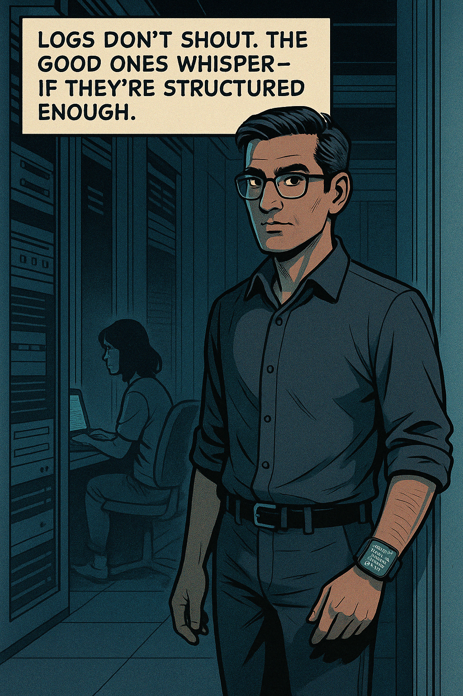
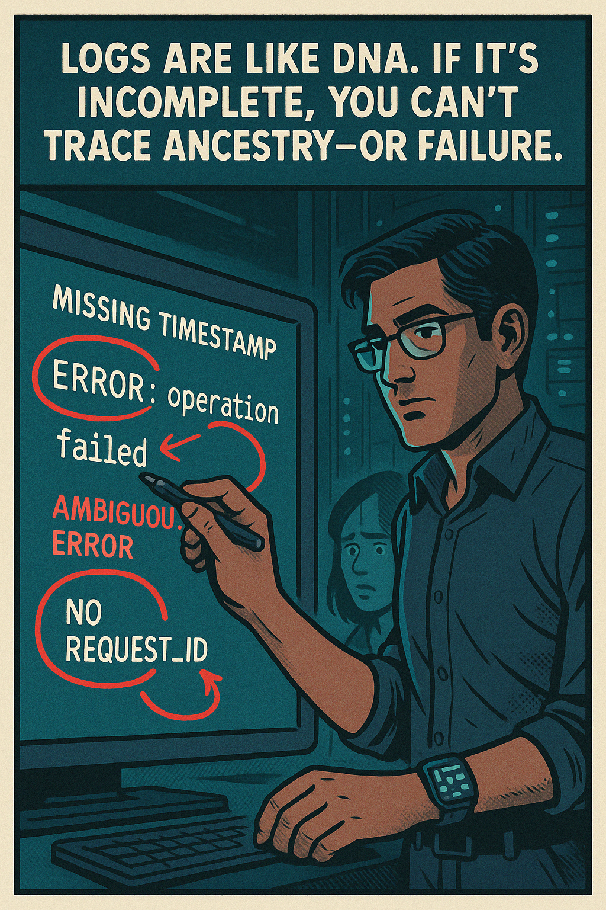
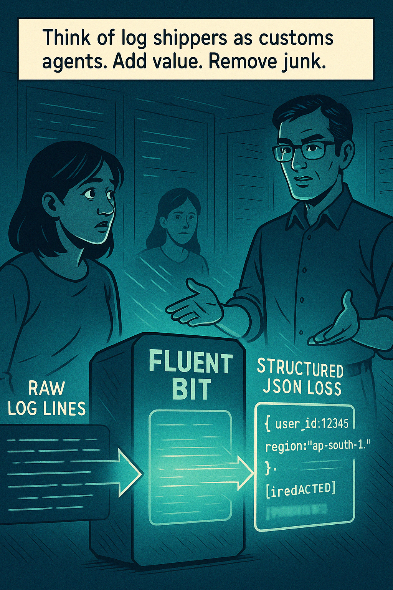
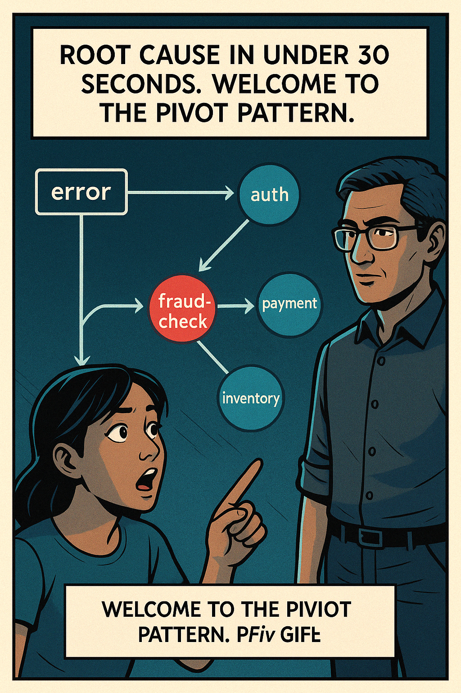
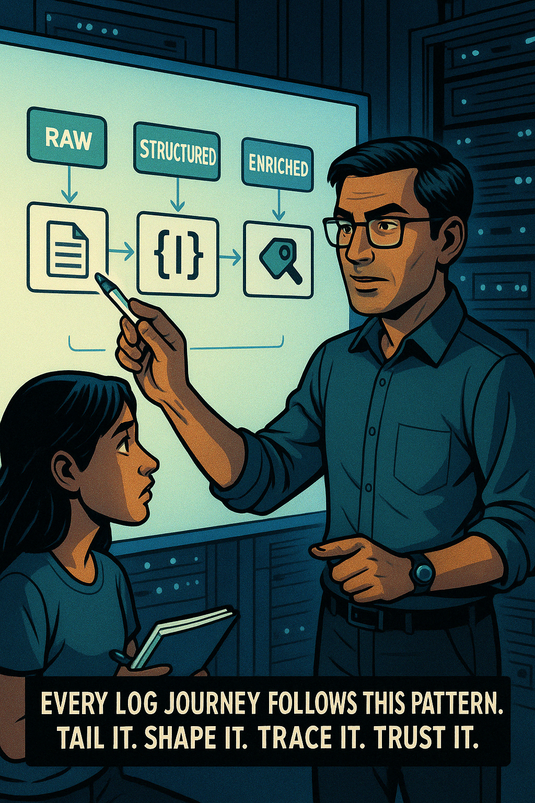
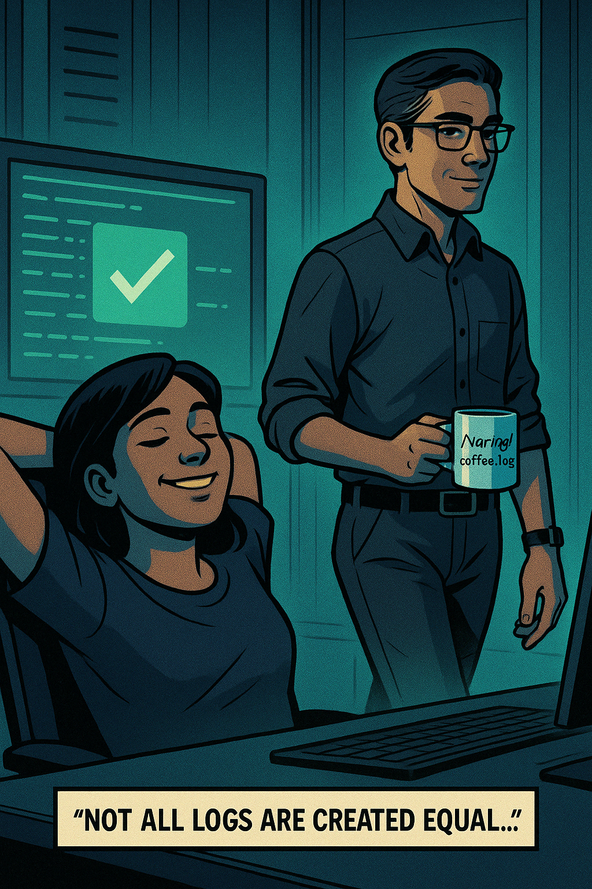

# 🎬 **Introduction: "The Logstorm"**  
 
**Goal:** Introduce SRE learners to structured logging, context importance, querying, and log design mindset via storytelling.

---

### **🟥 “The Scroll of Doom”**

>Riya’s crisis kicks off the lesson on structured logging

{ width=400px }

## **Deepak's monologue:**  
> *“Every SRE has faced it — the logstorm. Signal buried in noise. Clues scattered like leaves in the wind.”*

---

### **🟦“The Entrance”**

{width=400px}

## **Narration (Deepak):**  
> *“Most logs are written for humans. In a crisis, you need logs written for machines.”*

---

### **🟨“Junk DNA”**

>“Junk DNA” Deepak’s red‑ink critique shows exactly why bad logs break the lineage of troubleshooting. 

{width=400px}

**Teaching Moment (Narration):**  
> *“Every production log should answer: WHEN, WHERE, WHO, WHAT. Time. Source. Context. Meaning.”*

---

### **🟩“Structured Truth”**

>“Structured Truth” nails the comparison: raw chaos vs. clear context, with Deepak highlighting the structured side. Ready whenever you are for the next panel or any tweaks!

{width=700px}

**Teaching Hook (Deepak):**  
> “Metadata is luggage tags for your log events. Never let one travel alone.”

---

### **🟧“The Enrichment Layer”**

>“The Enrichment Layer” visualizes Fluent Bit transforming raw feed into valuable, secure JSON—exactly the flow learners need to grasp. 

{width=450px}

**Real Facts:**  
> *“The real world is messy. Pipelines bring order. Enrich, redact, normalize.”*

---

### **🟫 “Query the Storm”**

> “Query the Storm” captures the power of structured filtering: chaotic noise folds into a single trace‑drillable entry while Riya watches in amazement. Let me know if we keep rolling to the finale!

{width=450}

**Teaching Point (Narration):**  
> *“The goal isn’t just storage. It’s retrieval. Fast, focused, forensic-grade retrieval.”*

---

### **⬛ “The Pivot”**

>“The Pivot” completes the diagnostic arc: one request pivots across services right to a glowing fraud‑check root cause. Perfect for illustrating trace‑driven RCA. 

{width=450}

**Narration:**  
> *“Logs tell stories. Your job is to ask better questions.”*

---

### **🟦 “Doctrine of Logging”**

>“Doctrine of Logging” is now on the whiteboard: Raw → Structured → Enriched → Queried. A neat visual to cement Deepak’s four‑stage mental model for the cohort!

{width=450}

**Teaching Tip (Narration):**  
> *“Don’t just collect logs. Curate them.”*

---

### **🟥 “The Afterglow”**
>“The Afterglow” wraps the sequence: dashboards green, stress gone, and Deepak logging off with his mug. The log‑wisdom tagline closes the loop!

{width=450}

**Caption (Bottom):**  
> ✅ **Day 3 Begins: Learn the discipline behind logging that works—under pressure.**

---
