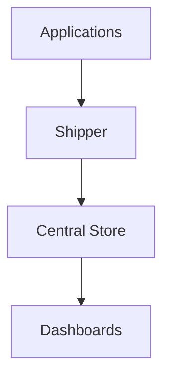
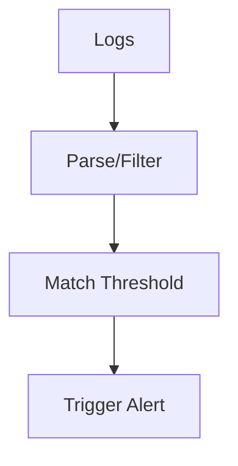

**Day 3 Quiz — Logs in Site Reliability Engineering**

---

### 🔍 Beginner Questions

**1. [Logs Basics] Multiple Choice**  
Which of the following best describes a *structured log*?
- A. A log entry written in natural language
- B. A JSON-formatted log with consistent fields
- C. A log without timestamps
- D. A syslog message containing device status

---

**2. [Log Purpose] True/False**  
Logs can only be used for debugging applications, not for auditing or security purposes.
- A. True
- B. False

---

**3. [Log Types] Matching**  
Match each log type (Column A) with the correct log message example (Column B). Write your answers as A–?, B–?, C–?.

**Column A – Log Type**  
A. Application Log  
B. Access Log  
C. Security Log

**Column B – Example**  
1. `GET /api/products 200`  
2. `auth failure for user root`  
3. `ERROR: payment declined` `ERROR: payment declined` |

---

**4. [Unstructured vs Structured] Fill-in-the-Blank**  
A log entry that uses a consistent key-value format, such as JSON, is known as a __________ log.

---

**5. [Observability Pillars] Multiple Choice**  
Which pillar of observability is best described as “telling you why something happened”?
- A. Metrics
- B. Logs
- C. Traces
- D. Alerts

---

**6. [Structured Logging] True/False**  
Structured logging helps enable faster searching, filtering, and correlation of log data.
- A. True
- B. False

---

### 🧩 Intermediate Questions

**7. [Log Collection] Multiple Choice**  
Which of the following is a common method of log collection in containerized environments?
- A. Direct SQL extraction
- B. Tailing log files via cron jobs
- C. Capturing stdout/stderr via log agents
- D. Manually uploading logs via FTP

---

**8. [Log Pipeline] Diagram-Based**  
Refer to the diagram:

Which stage is responsible for parsing and filtering the logs?
- A. App
- B. Agent
- C. Store
- D. UI

---

**9. [Agent Deployment] Multiple Choice**  
What is a key benefit of deploying log shippers as a DaemonSet?
- A. Complete isolation of logs
- B. Easy deployment across Kubernetes nodes
- C. Higher cost per pod
- D. Increased granularity per app

---

**10. [Centralization] Fill-in-the-Blank**  
A __________ logging platform provides a single source of truth by aggregating logs from across the system.

---

**11. [Querying Logs] True/False**  
Querying structured logs is slower than unstructured logs because structured logs require more storage.
- A. True
- B. False

---

**12. [Tooling] Matching**  
Match each tool to its role:

| Tool           | Function                  |
|----------------|---------------------------|
| A. Fluent Bit  | 1. Log shipping           |
| B. OpenSearch  | 2. Log storage and query  |
| C. Grafana     | 3. Visualization          |

---

**13. [Troubleshooting] Multiple Choice**  
What would likely cause a log search to return no results?
- A. Insufficient permissions
- B. Malformed JSON logs
- C. Field mismatch in the query
- D. All of the above

---

### 💡 Advanced Questions

**14. [Log Metrics] Multiple Choice**  
Which field would you most commonly use to generate latency metrics from structured logs?
- A. `error_code`
- B. `user_agent`
- C. `response_time_ms`
- D. `log_level`

---

**15. [Alerting] Diagram-Based**  
Refer to the alerting flow diagram:

Where would you define a regex for "payment failed"?
- A. Logs
- B. Parse
- C. Match
- D. Alert

---

**16. [Correlation] Ordering**  
Place the steps of trace correlation in the correct order:
1. Extract `trace_id` from log
2. Filter logs during spike
3. Link logs across services
4. Visualize full trace

---

**17. [Cost Optimization] Multiple Choice**  
Which of the following strategies best reduces log ingestion costs?
- A. Increasing log verbosity
- B. Logging all 200 OK responses
- C. Sampling high-volume logs
- D. Removing request IDs from logs

---

**18. [Security] True/False**  
Storing raw credit card numbers in logs is acceptable if logs are encrypted.
- A. True
- B. False

---

**19. [Compliance] Fill-in-the-Blank**  
Audit logs must be __________ to ensure a verifiable record of system activity.

---

**20. [Tradeoffs] Multiple Choice**  
What is a tradeoff of log-based alerting compared to metric-based alerting?
- A. Faster triggering
- B. Simpler logic
- C. Higher latency and complexity
- D. Lower noise

