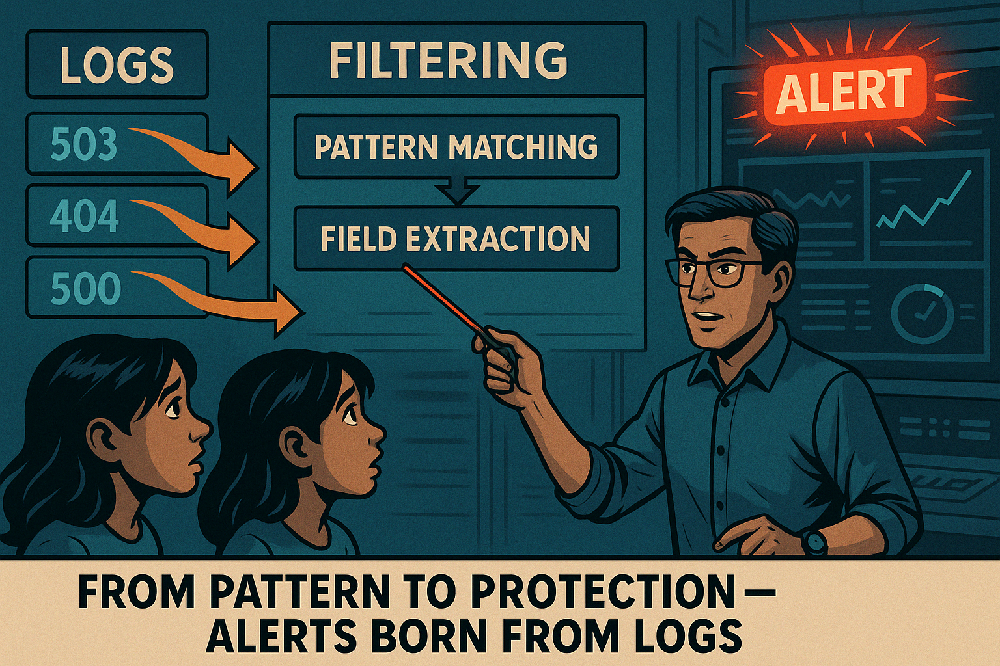
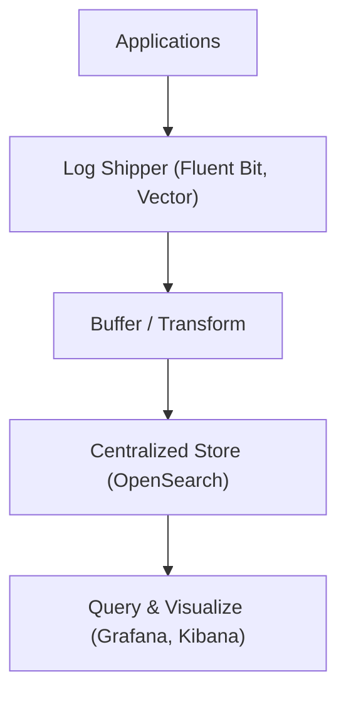
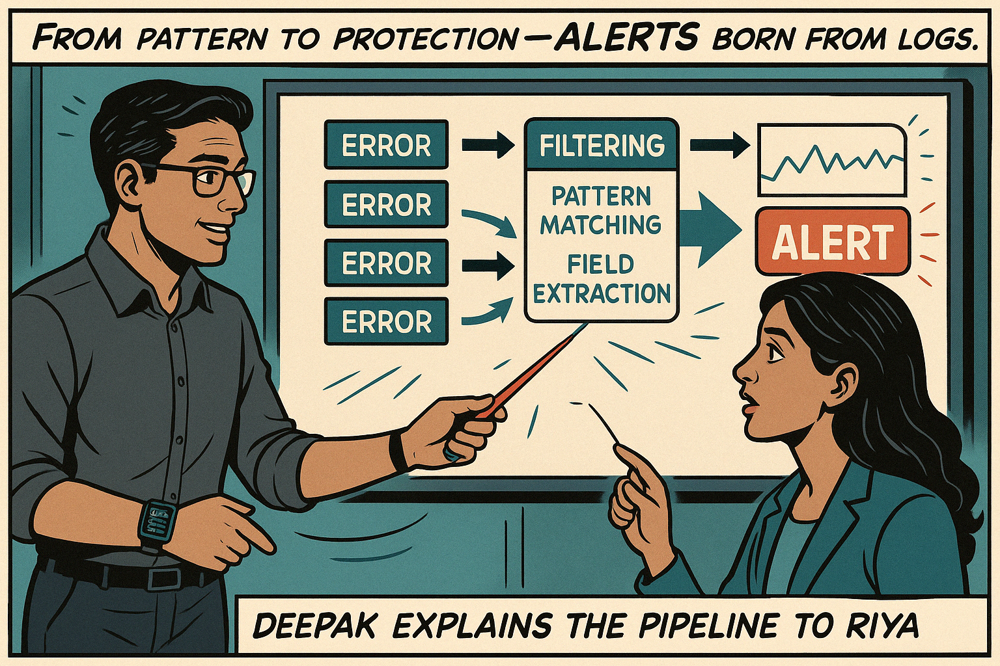
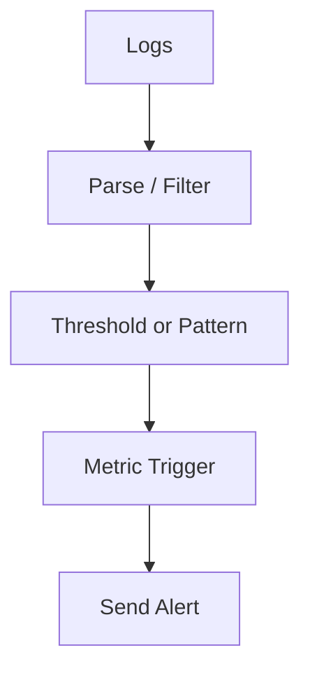
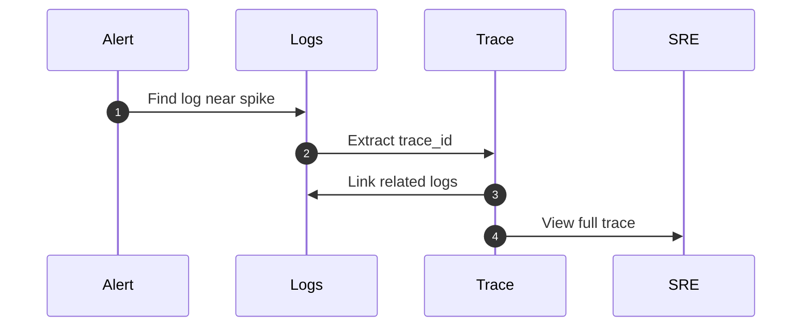

# **Day 3 Summary & Cheat Sheet: Logs in Site Reliability Engineering**

>_"Structured. Centralized. Correlated. That’s the SRE mindset." — Deepak Bhargava_

---

## 🧱 **Log Foundations: Beginner Level**

### 🔍 What Are Logs?
| Term | Description |
|------|-------------|
| Log | A timestamped event record. Tells you what happened, when, and where. |
| Unstructured Log | Free-text, difficult to parse consistently. |
| Structured Log | JSON-formatted, machine-readable, easily filterable. |

### 🎯 Why Logs Matter to SREs
| Purpose | Use Case |
|---------|----------|
| Debugging | RCA during incidents |
| Monitoring | Observe app behavior, error trends |
| Auditing | Who did what and when |
| Performance | Latency analysis, resource contention |
| Behavior Analysis | Feature usage patterns |

### 🧩 Anatomy of a Structured Log
```json
{
  "timestamp": "2024-04-20T14:03:01Z",
  "level": "error",
  "service": "checkout",
  "request_id": "r123-abcd",
  "user_id": "u789",
  "message": "checkout failure"
}
```

### ❌ Unstructured vs ✅ Structured Logs
| Example | Strength |
|---------|----------|
| `Error: something failed` | ❌ No context |
| `{ "status": 500, "user": "u42" }` | ✅ Filterable, parseable |

{width=400px}

---

## 🚚 **Log Shipping & Centralization: Intermediate Level**

{width=400}


### 🔄 Log Flow Pipeline



### ⚙️ Shipper Deployment Options
| Type | Description | Use When |
|------|-------------|----------|
| Sidecar | Separate container for logs | Per-app isolation |
| DaemonSet | Node-wide agent | Simpler setup in Kubernetes |
| Standalone | Classic agent on VMs | Legacy/Hybrid environments |

### 🧰 Example Fluent Bit Config
```ini
[INPUT]
  Name tail
  Path /var/log/app.log
  Parser json
[OUTPUT]
  Name es
  Match *
  Host opensearch
  Port 9200
```

### 🔍 Querying Logs (Loki & Splunk)
```logql
{service="api", level="error"} |= "timeout"
```
```spl
index=prod_logs service=api level=error "timeout"
```

---

## 🚨 **Log-Based Metrics, Alerting, & Correlation: Advanced Level**

{width=400px}

### 📊 Metrics from Logs
| Log Pattern | Metric Output |
|-------------|---------------|
| `status=500` | Error rate |
| `response_time_ms` | Latency average |
| `user_id` | Usage by user |

### 📈 Alert Flow


### 📌 Log vs Metric Alerting
| Use Logs When... | Use Metrics When... |
|------------------|---------------------|
| You need context or payload | You need speed & scale |
| Rare events | Common thresholds |
| Granular filters | Global counters |

### 🧠 Correlation Model


### 🔐 Security & Compliance
| Checklist | Status |
|-----------|--------|
| Redact secrets/PII | ✅ |
| Encrypt logs | ✅ |
| RBAC on log access | ✅ |
| Define retention | ✅ |

### 🧪 Sampling Strategy
| Event Type | Sampling Rate |
|------------|----------------|
| 200 OK | 10% |
| 500 Errors | 100% |
| Auth Success | 5% |
| Auth Failures | 100% |

---

## ✅ **Day 3 Key Takeaways**
- Structured logs are essential for observability at scale.
- Use agents to centralize, enrich, and route logs.
- Build log-derived metrics and alerts for rapid detection.
- Correlate logs with traces and metrics for full visibility.
- Control volume and protect data with smart policies.

>📘 _“Don’t just collect logs. Curate them.” — Deepak_


