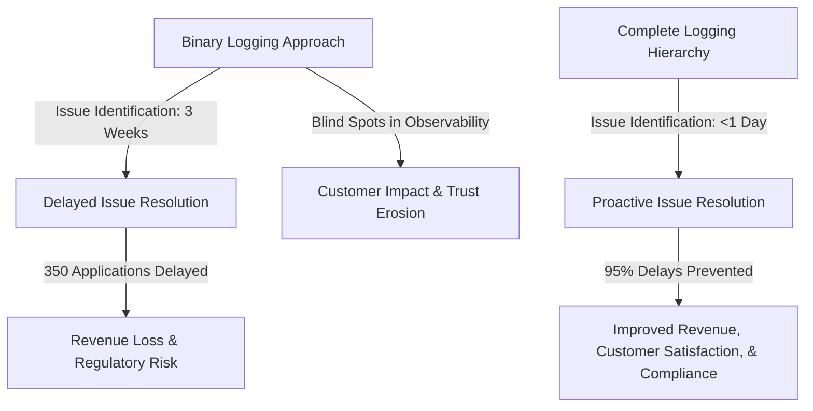
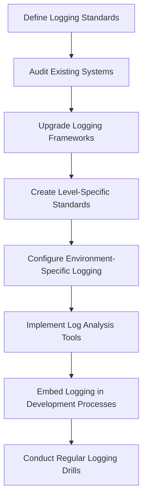
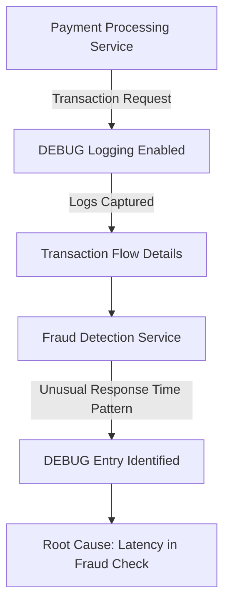
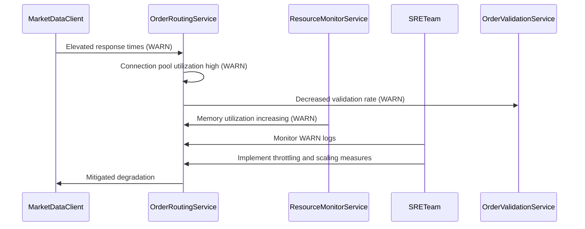
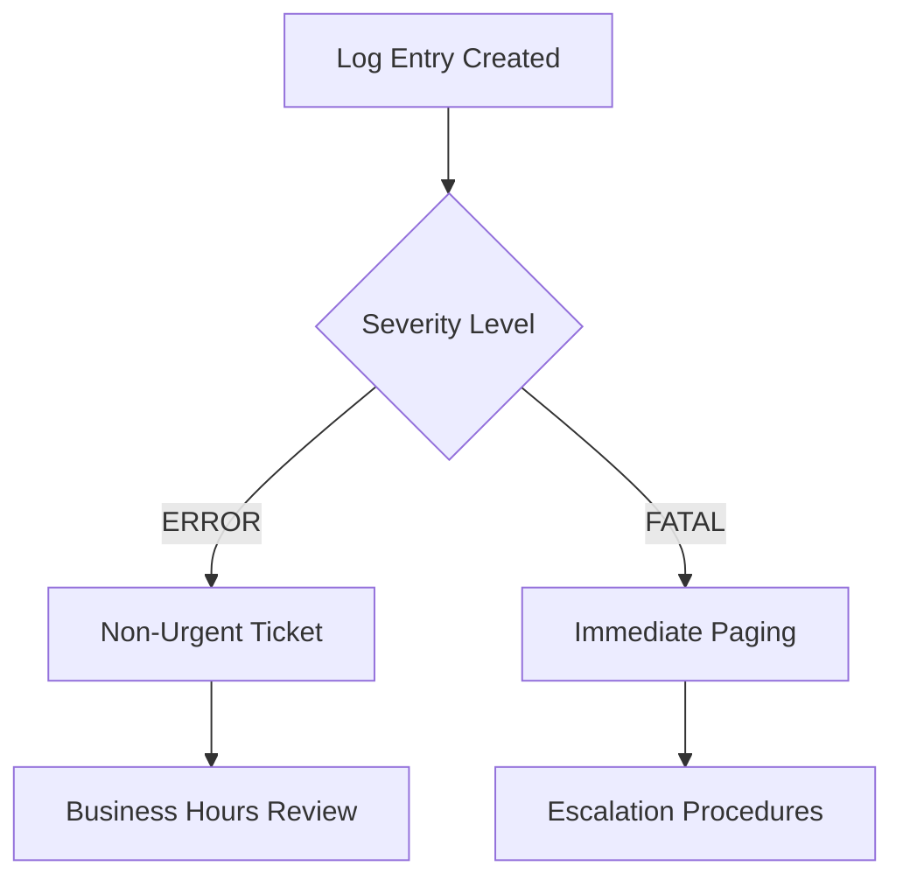

# Chapter 3: The Logging Hierarchy - Beyond ERROR and INFO

## Chapter Overview

Welcome to the real world of logging, where “ERROR and INFO” is just another way to say, “I hope you like flying blind.” In this chapter, we take the scalpel to the binary logging malpractice that plagues the banking sector and replace it with the full technicolor spectrum of TRACE, DEBUG, INFO, WARN, ERROR, and FATAL. Think of it as upgrading from Morse code to streaming 4K video—except the video is every embarrassing operational detail your system ever wanted to hide. We’ll show you how skipping the “unnecessary” middle leads directly to million-dollar outages, regulatory migraines, and enough customer rage to fill your next board meeting’s time slot. We’ll torch the myth that more logs always mean more insight, and break down how to get the right logs, at the right level, without tanking your throughput or blowing your storage budget. If you’re ready to stop playing “Where’s Waldo?” with your production incidents, buckle up. It’s time to learn how grown-ups log.

______________________________________________________________________

## Learning Objectives

- **Diagnose** the real-world impact of incomplete logging hierarchies (and spot the “missing middle” before it bites you).
- **Differentiate** between TRACE, DEBUG, INFO, WARN, ERROR, and FATAL levels, and **apply** each with ruthless precision.
- **Implement** evidence-based investigation strategies that turn logs into actionable insights, not noise.
- **Construct** dynamic verbosity patterns that adjust logging detail on the fly—no more “log everything or log nothing” idiocy.
- **Balance** observability and system performance by measuring and tuning the logging impact in production environments.
- **Standardize** logging practices across teams and tech stacks, crushing the chaos of inconsistent severity levels.
- **Define** and **enforce** clear severity distinctions (especially ERROR vs. FATAL) to destroy alert fatigue and catch actual catastrophes.
- **Design** early warning systems using WARN-level logging so you can intervene before the house is on fire—not after.

______________________________________________________________________

## Key Takeaways

- If your logs only know “ERROR” and “INFO,” you’re not observant—you’re negligent. Blind spots are where your money burns.
- DEBUG logs aren’t just for developers. They’re the difference between “I think it’s fixed” and “Here’s the smoking gun.”
- WARN is your system’s smoke alarm; ignore it, and you’ll be sifting through the ashes explaining yourself to compliance and PR.
- ERROR means “something failed, but we’re still alive.” FATAL means “get the defibrillator—now.” Treating them the same is operational malpractice.
- Static logging levels are for the lazy (or the doomed). Adaptive verbosity means you get answers when it matters, not 8 hours and 80GB later.
- Too much logging in production will kill your performance and bloat your bills. Know the cost. Test the cost. Tune the cost.
- Inconsistent logging standards across teams guarantee slow, expensive, and embarrassing incident response. Standardize, or suffer.
- The right logging hierarchy isn’t a technical detail—it’s a business survival strategy. The stakes: revenue, reputation, and regulatory risk.
- Every minute you delay fixing your logging mess is a minute closer to your next multi-million dollar outage—don’t say you weren’t warned.

______________________________________________________________________

## Panel 1: The Missing Middle - The Full Logging Level Spectrum
### Scene Description

A bustling banking operations center is depicted, where a senior SRE collaborates with a newly transitioned team member. On a large wall-mounted display, two logging configurations from separate banking services are compared side by side.

The first configuration, labeled "Binary Logging," shows logs limited to only ERROR and INFO levels, leaving significant gaps in the operational narrative. The second configuration, labeled "Full Logging Hierarchy," presents a complete spectrum of levels—TRACE, DEBUG, INFO, WARN, ERROR, FATAL—with each level color-coded for clarity. The SRE explains how the full hierarchy provides a seamless and detailed story of a complex mortgage application process, while the binary configuration leaves critical blind spots.

```

```
graph TD
A[Binary Logging Config]
A -->|INFO| B[Basic Operations]
A -->|ERROR| C[Failures Requiring Attention]

```

The diagram visually contrasts the two approaches: the binary configuration's limited scope versus the full hierarchy's comprehensive visibility. This side-by-side display emphasizes how the complete hierarchy enhances observability and supports a more nuanced understanding of system operations.
```
### Teaching Narrative
The logging hierarchy exists to create appropriate signal-to-noise ratios for different operational contexts. Many banking systems suffer from a "missing middle" syndrome—implementing only ERROR for failures and INFO for basic operations, while neglecting the critical gradations between and beyond these levels. This binary approach creates blind spots in system observability. A complete logging hierarchy provides a spectrum of visibility: TRACE for detailed development diagnostics, DEBUG for granular troubleshooting data, INFO for normal operations, WARN for potential issues, ERROR for failures requiring attention, and FATAL for catastrophic events that prevent system operation. Each level serves a specific purpose in the observability narrative, and each becomes critical in different operational scenarios. Mature SRE practices implement this full spectrum, recognizing that appropriate log levels are not a technical detail but a fundamental observability strategy.
### Common Example of the Problem

A regional bank's mortgage processing platform recently experienced a perplexing issue where applications were being delayed in underwriting without clear errors. Customer complaints were mounting as mortgage applications that typically processed in 3 days were stretching to 10+ days with no apparent explanation.

The initial investigation was severely hampered by the platform's binary logging approach—it only recorded INFO logs for standard process steps and ERROR logs for outright failures. Since the applications weren't failing (they were merely delayed), no ERROR logs were generated. Meanwhile, the INFO logs simply showed application progression through the workflow without any indication of abnormal conditions.

#### Timeline of Events: Binary Logging Approach (Before Fix)

```plaintext
INFO: Application submitted -> INFO: Verification initiated -> INFO: Verification completed -> INFO: Underwriting processing -> (No logs for delays) -> ERROR: Customer complaint received
```

After weeks of investigation, the team discovered that a third-party credit verification service was experiencing periodic latency spikes, causing its responses to exceed normal processing times. Since these delays weren't outright failures, they never triggered ERROR logs. However, these verification delays were creating a growing backlog in the underwriting queue, as each affected application required manual review to proceed.

#### Timeline of Events: Comprehensive Logging Hierarchy (After Fix)

```plaintext
INFO: Application submitted -> INFO: Verification initiated -> WARN: Credit verification response time exceeds normal parameters: expected <2s, actual 7.4s, verification ID: CV-29475, application ID: MTG-84362 -> INFO: Verification completed -> INFO: Underwriting processing
```

After implementing a comprehensive logging hierarchy, a similar issue was identified within hours because the system now generated WARN-level logs when third-party service responses exceeded expected thresholds, while still falling below total failure thresholds. These WARN logs clearly pinpointed the latency issue, enabling the team to act immediately and resolve the problem before it escalated further.
### SRE Best Practice: Evidence-Based Investigation

SRE best practice requires implementing a complete logging hierarchy that provides appropriate visibility across the entire operational spectrum. Evidence-based investigation depends on logs that capture not just binary success/failure states but the complete narrative of system behavior, including degraded states, early warning indicators, and diagnostic details.

An effective logging hierarchy implementation includes the following levels, each serving a distinct purpose:

| **Log Level** | **Purpose**                                                                 | **Examples**                                                                    | **When to Use**                                                                                     |
| ------------- | --------------------------------------------------------------------------- | ------------------------------------------------------------------------------- | --------------------------------------------------------------------------------------------------- |
| **TRACE**     | Ultra-detailed diagnostic information for development or targeted debugging | Method entry/exit points, variable values, execution flow                       | Enable during development or for highly targeted troubleshooting of complex issues                  |
| **DEBUG**     | Granular troubleshooting information                                        | Request parameters, intermediate steps, detailed state transitions              | Use during investigations to understand the internal workings of a specific process or feature      |
| **INFO**      | Standard operational events documenting normal system behavior              | Request receipts, process completions, state changes                            | Default level for capturing routine system operations and verifying that components are functioning |
| **WARN**      | Early warning indicators of potential problems                              | Degraded performance, retry attempts, unusual usage patterns, threshold nearing | Use to highlight situations that may require attention but are not yet failures                     |
| **ERROR**     | Failures preventing specific operations but not the overall system          | Database query failures, failed external API calls                              | Log when critical operations fail and require resolution                                            |
| **FATAL**     | Catastrophic events preventing system operation                             | Configuration errors, unrecoverable crashes, resource exhaustion                | Reserve for events requiring immediate intervention to restore system functionality                 |

When investigating issues using a complete hierarchy, SREs implement level-appropriate analysis:

- Use **INFO** logs to understand the normal process flow and confirm expected behavior.
- Use **WARN** logs to identify early indicators of emerging issues, such as degraded system performance.
- Use **ERROR** logs to locate specific failures that require immediate attention.
- Use **DEBUG** logs to analyze detailed system interactions and identify the root cause of complex issues.
- Use **TRACE** logs for deep-dive diagnostics when granular insights into execution flow are needed.

This hierarchical approach transforms troubleshooting from binary "working/not working" analysis into a nuanced understanding of system behavior across the complete operational spectrum, enabling faster and more effective resolution of issues.
### Banking Impact

The business impact of a binary logging approach extends beyond technical troubleshooting challenges to create significant customer experience degradation, regulatory compliance risks, and operational inefficiencies. For the regional bank in our example, the incomplete logging hierarchy created several tangible business consequences:

| **Impact Category**          | **Description**                                                                                       | **Quantified Consequences**                                                                                                                                        |
| ---------------------------- | ----------------------------------------------------------------------------------------------------- | ------------------------------------------------------------------------------------------------------------------------------------------------------------------ |
| **Revenue Delay**            | Delayed identification of processing bottlenecks, leading to postponed revenue recognition.           | - 350 mortgage applications delayed by 7 days on average.<br> - $875,000 in delayed origination fees.<br> - $2.1 million in delayed first-month interest payments. |
| **Customer Experience**      | Negative customer sentiment due to unexplained delays in the mortgage application process.            | - 42-point drop in Net Promoter Score (NPS) among affected applicants.<br> - 28% of applicants "definitely not recommend" the bank’s services.                     |
| **Competitive Loss**         | Loss of applicants to competitors as delays eroded trust and confidence.                              | - 11% of affected applicants abandoned applications.<br> - $14.5 million in lost mortgage volume.                                                                  |
| **Regulatory Risk**          | Increased scrutiny from regulators due to unexplained delays triggering compliance flags.             | - Additional documentation and review required to demonstrate delays were not related to prohibited factors.                                                       |
| **Operational Inefficiency** | Extended troubleshooting effort due to blind spots in observability, consuming significant resources. | - Four engineers and two business analysts assigned full-time for three weeks.<br> - $98,000 in direct labor costs.                                                |

#### **Before and After Logging Hierarchy Implementation**



The bank calculated that implementing a complete logging hierarchy would have reduced the issue identification time from three weeks to less than one day, preventing approximately 95% of the application delays and associated financial and reputation impacts. Following the adoption of enhanced logging, similar issues were proactively identified through WARN-level pattern recognition before causing customer impact in five instances over the next year.
### Implementation Guidance

To effectively implement a full logging level spectrum in your banking systems, follow this step-by-step checklist:

#### Step 1: Define Logging Standards
- **Action**: Document a comprehensive logging level standard that defines each level (TRACE, DEBUG, INFO, WARN, ERROR, FATAL).
- **Outcome**: Ensure clear usage guidelines with banking-specific examples for each level to standardize implementation.

#### Step 2: Audit Existing Systems
- **Action**: Perform a system-wide audit to identify binary logging patterns.
- **Outcome**: Prioritize systems for enhancement based on business criticality and historical incident trends.

#### Step 3: Upgrade Logging Frameworks
- **Action**: Implement logging frameworks that support the full hierarchy with flexible configuration options.
- **Outcome**: Enable consistent and comprehensive log generation across the technology stack.

#### Step 4: Create Level-Specific Standards
- **Action**: Define what information should be logged at each level.
  - Focus on potential issue indicators for WARN-level logs.
- **Outcome**: Ensure meaningful and actionable logs for every level.

#### Step 5: Configure Environment-Specific Logging
- **Action**: Develop dynamic configuration capabilities for different environments (e.g., development, testing, production).
- **Outcome**: Allow real-time adjustments to logging levels for troubleshooting without redeployment.

#### Step 6: Implement Log Analysis Tools
- **Action**: Deploy tools that visually differentiate logging levels and support filtering and pattern recognition.
- **Outcome**: Simplify log interpretation and enhance operational efficiency during incidents.

#### Step 7: Embed Logging in Development Processes
- **Action**: Make log level compliance a mandatory part of code review and CI/CD pipelines.
- **Outcome**: Prevent regression to binary logging patterns and ensure ongoing adherence to standards.

#### Step 8: Conduct Regular Logging Drills
- **Action**: Schedule incident simulation exercises to practice using the full logging hierarchy.
- **Outcome**: Train teams to effectively interpret logs and respond to incidents in real-world scenarios.

---

#### Visual Workflow: Logging Implementation Process

Use this checklist and workflow to guide your team through implementing a complete logging hierarchy, ensuring robust observability across all banking systems.
## Panel 2: DEBUG Demystified - The Troubleshooter's Toolkit
### Scene Description

A detailed view of a banking engineering team during a production investigation. Engineers have enabled DEBUG logging for a payment processing service that's experiencing intermittent failures. The screen fills with detailed transaction flow information showing parameter values, database query details, and third-party API response times. A senior engineer points to a specific DEBUG entry showing an unusual response time pattern from the fraud detection service—information completely absent from the INFO and ERROR logs but crucial to resolving the issue.

#### Text Diagram: DEBUG Log Investigation Flow


This flow illustrates how DEBUG logging provides the diagnostic layer necessary to trace the transaction flow through various services. The engineers identify the root cause—an unusual latency pattern in the fraud detection service—by correlating detailed timing data and parameter values, which are only available at the DEBUG level.
### Teaching Narrative
DEBUG level logging represents the detailed diagnostic layer that transforms troubleshooting from guesswork to precision. While INFO records that operations occurred and ERROR captures failures, DEBUG reveals how operations proceeded—exposing the detailed mechanics that enable root cause analysis. In banking systems, where transaction flows involve complex validation rules, multiple service interactions, and precise timing requirements, this mechanical detail becomes invaluable during investigations. Effective DEBUG logging includes: method entry and exit points with parameter values, external dependency interactions with timing data, conditional logic outcomes, transaction state transitions, and temporary resource allocations. When payment processing shows intermittent failures, DEBUG logs revealing gradually increasing latency in fraud check responses can immediately pinpoint the issue. The art of DEBUG logging lies in capturing sufficient detail for diagnosis without overwhelming storage or processing—a balance that becomes increasingly important as systems scale.
### Common Example of the Problem

A global bank's treasury management platform was experiencing intermittent wire transfer failures during peak processing hours. The production logs, configured at INFO and ERROR levels only, showed successful initiation of transfers followed by eventual timeouts, but provided no insight into what was happening during processing.

The support team spent three days attempting to diagnose the issue, restarting services and implementing capacity increases that showed no improvement. Customer complaints continued to mount as high-value transfers were being delayed or failing completely, particularly from corporate clients handling time-sensitive international payments.

After enabling DEBUG logging in the production environment, a completely different picture emerged. The DEBUG logs revealed critical details hidden from the standard logging levels:

```log
2023-04-15 14:32:21.345Z [DEBUG] WireTransferService - Processing transfer request: ID=WT12345, Amount=$1,750,000.00, Destination=DEUTDEFFXXX
2023-04-15 14:32:21.456Z [DEBUG] WireTransferService - Fraud check initiated: ID=WT12345, CheckType=LARGE_VALUE
2023-04-15 14:32:23.789Z [DEBUG] WireTransferService - Database query executed: SELECT compliance_status FROM customer_profiles WHERE id=CUS42789, ExecutionTime=1874ms
2023-04-15 14:32:25.123Z [DEBUG] WireTransferService - Compliance check initiated: ID=WT12345, Customer=CUS42789, CheckLevel=ENHANCED
2023-04-15 14:32:30.456Z [DEBUG] WireTransferService - External API call to SanctionCheckService started: ID=WT12345
2023-04-15 14:32:48.789Z [DEBUG] WireTransferService - External API call to SanctionCheckService completed: ID=WT12345, Duration=18333ms, ResponseSize=24KB
2023-04-15 14:32:48.910Z [DEBUG] WireTransferService - Connection pool stats: Active=45, Idle=3, Waiting=27, Max=50
```

This DEBUG information immediately revealed the root cause: the sanctions screening service was responding extremely slowly (18 seconds vs. normal 1-2 seconds), gradually exhausting the connection pool as concurrent requests backed up. Since the service eventually responded successfully in most cases, no ERROR logs were generated, making the issue invisible without DEBUG details.

#### Checklist: How DEBUG Logs Diagnosed the Issue
When facing similar intermittent failures, follow this checklist to identify root causes using DEBUG logs:

1. **Trace Transaction Flow**  
   Look for log entries documenting key stages of the transaction lifecycle, such as initiation, validation, and external dependencies.

2. **Measure Latency at Critical Points**  
   Identify response times for database queries, API calls, and other time-sensitive operations. Compare observed durations against expected norms.

3. **Inspect External Dependencies**  
   Check for delays or failures in third-party services or internal systems that interact with the transaction.

4. **Examine Resource Utilization**  
   Review connection pool statistics, thread usage, or memory consumption to detect exhaustion or contention issues.

5. **Correlate Logs Across Components**  
   Align timestamps and IDs between services to reconstruct the end-to-end transaction timeline.

6. **Validate Conditional Logic Outcomes**  
   Confirm that business rules and conditional branches are evaluated correctly, especially under edge cases or high load.

By systematically reviewing DEBUG logs through this framework, you can transform vague symptoms into actionable findings, pinpointing the root cause of complex system behaviors.
### SRE Best Practice: Evidence-Based Investigation

SRE best practice requires implementing comprehensive DEBUG logging that exposes the mechanical details of system operation while maintaining appropriate activation controls. Evidence-based investigation depends on the ability to see detailed transaction flow information when needed, without overwhelming systems during normal operation.

Effective DEBUG logging implementation includes several key components. The table below summarizes these components, along with examples and their benefits:

| **DEBUG Logging Component**   | **Description**                                                                  | **Example**                                                                                                 | **Benefit**                                                                                   |
| ----------------------------- | -------------------------------------------------------------------------------- | ----------------------------------------------------------------------------------------------------------- | --------------------------------------------------------------------------------------------- |
| **Parameter Logging**         | Recording input parameters and return values at key processing points.           | Logging user ID and transaction amount when initiating a payment, while masking sensitive card information. | Enables tracing of how inputs affect system behavior without exposing sensitive data.         |
| **Timing Instrumentation**    | Capturing duration metrics for significant operations.                           | Measuring response time for fraud detection API calls and database queries.                                 | Identifies latency bottlenecks in external dependencies and internal operations.              |
| **Resource State Recording**  | Documenting the state of critical system resources at key points.                | Logging connection pool usage (e.g., active vs. idle connections) during high-traffic periods.              | Helps diagnose resource exhaustion or contention issues.                                      |
| **Decision Logic Exposition** | Logging the outcomes of conditional logic and the factors influencing decisions. | Recording why a transaction was flagged for manual review (e.g., high-risk score due to unusual patterns).  | Provides visibility into decision-making processes for troubleshooting and auditing.          |
| **Dependency Interactions**   | Detailed recording of external system interactions.                              | Logging request payloads, response times, and status codes for third-party API calls.                       | Facilitates root cause analysis of failures or degraded performance in multi-service systems. |

When investigating issues using DEBUG logging, SREs implement targeted enabling strategies: activating DEBUG selectively for specific components rather than entire systems, enabling for limited time periods during active investigation, filtering for specific transaction identifiers or patterns, and combining with sampling approaches for high-volume systems.

This detailed visibility transforms troubleshooting from black-box inference to transparent analysis, enabling precise identification of root causes even for complex, intermittent issues.
### Banking Impact

The business impact of insufficient diagnostic logging extends far beyond technical inconvenience to create significant financial, reputational, and regulatory consequences. For the global bank in our example, the three-day resolution delay created several critical business impacts:

#### Key Consequences:
- **Failed Transaction Value**: Approximately 1,200 high-value wire transfers (average value $1.2 million) were delayed or failed, representing approximately $1.44 billion in processing value, with both sender and recipient impacts.
- **Fee Revenue Loss**: The bank lost approximately $375,000 in wire transfer and foreign exchange fees for abandoned transactions that customers ultimately processed through alternative channels.
- **Corporate Client Impact**: Multiple corporate clients missed payment deadlines due to transfer failures, resulting in penalty fees and supply chain disruptions. Two major corporate clients cited the incident as a factor in reducing their treasury services relationship with the bank.
- **Regulatory Scrutiny**: The unexplained payment processing failures triggered a regulatory disclosure requirement in two jurisdictions, leading to enhanced monitoring and additional reporting mandates for the subsequent quarter.
- **Reputational Damage**: The bank's inability to provide clear explanations during the incident eroded trust with treasury management clients, with relationship surveys showing a 31% decrease in confidence ratings.

#### Impact Breakdown Visualization:
The following bar chart represents the financial and reputational consequences of the three-day resolution delay, highlighting the proportional impact of each category:

```mermaid
barChart
    title Business Impact Breakdown
    axis XImpact ($)
    axis YCategory
    Failed_Transaction_Value: 1.44
    Fee_Revenue_Loss: 0.375
    Corporate_Client_Impact: 0.2
    Regulatory_Scrutiny: 0.05
    Reputational_Damage: 0.1
```

#### Mitigation Through DEBUG Logging:
The bank calculated that proper DEBUG logging would have reduced the resolution time from three days to approximately two hours based on subsequent experiences. This improvement would have prevented approximately 95% of the transaction failures and associated impacts.

Following the implementation of enhanced diagnostic logging, similar issues were identified and resolved before significant customer impact in seven instances over the next year. This proactive approach highlights the critical role of detailed diagnostic data in safeguarding financial operations and client trust.
### Implementation Guidance
1. Establish DEBUG logging standards that define what information should be captured at this level for different transaction types, with specific attention to banking-specific requirements.

2. Implement selective activation mechanisms that enable DEBUG logging for specific components, transaction types, or customer segments without requiring system-wide activation.

3. Create DEBUG logging frameworks or libraries for your technology stack that make it easy for developers to implement consistent, high-quality diagnostic logging.

4. Develop data protection techniques that automatically mask or encrypt sensitive information in DEBUG logs while preserving diagnostic value.

5. Implement performance-aware DEBUG logging patterns that minimize overhead through techniques like lazy evaluation and conditional execution.

6. Establish storage and retention policies specifically for DEBUG logs, typically with shorter retention periods than standard operational logs.

7. Create DEBUG log analysis dashboards that help engineers efficiently navigate and interpret the increased information volume during investigations.

8. Train support and operations teams on when and how to activate DEBUG logging during incidents, with clear escalation procedures for production environments.
## Panel 3: WARN - The Early Detection System
### Scene Description

A monitoring center where an automated system highlights WARN-level log entries from a bank's online trading platform during market opening. The WARN messages indicate gradually increasing response times from a market data provider without actual failures. These warnings serve as early indicators of potential issues, appearing 15 minutes before actual trading errors occurred.

Below is a visual representation of the timeline and sequence of actions:

```mermaid
gantt
    title WARN to Throttling Mechanism Timeline
    dateFormat HH:mm
    section WARN Logs
    Initial WARN Logs :done, 09:00, 1m
    Gradual Increase in Response Times :done, 09:01, 5m
    Elevated WARN Signals Detected :done, 09:06, 4m
    section SRE Response
    Analysis of WARN Logs :done, 09:10, 3m
    Throttling Mechanism Implemented :done, 09:13, 2m
    Prevented System Outage :active, 09:15, 15m
    section System Impact
    WARN Logs Stabilized :milestone, 09:30, 0m
    Trading Errors Averted :milestone, 09:30, 0m
```



This timeline demonstrates how the WARN messages progressed from initial detection to actionable insights. It also highlights the SRE's quick response in implementing a temporary throttling mechanism. By addressing the issue proactively, the team prevented a complete system outage while the underlying problem was resolved.
### Teaching Narrative
WARN level logging serves as your system's early warning system—capturing conditions that don't constitute immediate failures but indicate potential problems developing. This level represents the proactive side of logging strategy, enabling intervention before customers are impacted. In financial systems, where degradation often precedes failure, WARN logs capture critical signals: resource utilization approaching thresholds, unusual patterns in transaction volumes or error rates, recoverable exceptions that might indicate larger issues, timeout events that recovered but indicate performance degradation, and unusual data values that fall within technical validation but outside business norms. When properly implemented and monitored, WARN logs transform operations from reactive to preventative. Consider a payment gateway experiencing periodic connection pool warnings—addressing these early signals prevents the eventual ERROR-level failures that would impact customers. The strategic implementation of WARN logging directly correlates with an SRE team's ability to maintain service levels proactively rather than restoring them reactively.
### Common Example of the Problem

A major investment bank's equity trading platform recently experienced a significant outage during market hours that impacted thousands of institutional clients. Post-incident analysis revealed that the system had been generating isolated ERROR logs only at the moment of complete failure, when trading orders began to be rejected. Prior to these failures, the system had been showing gradually degrading performance for nearly 30 minutes, but this degradation generated no visible logging signals.

Three weeks after implementing a comprehensive logging hierarchy with proper WARN level implementation, the monitoring system detected a similar emerging pattern. The WARN logs revealed:

```log
2023-05-10 09:15:23.456Z [WARN] OrderRoutingService - Market data response time elevated: 235ms (threshold: 200ms), Exchange: NYSE
2023-05-10 09:18:45.789Z [WARN] OrderRoutingService - Market data response time elevated: 287ms (threshold: 200ms), Exchange: NYSE
2023-05-10 09:20:12.345Z [WARN] OrderRoutingService - Connection pool utilization high: 82% (threshold: 80%), Pool: market-data-client
2023-05-10 09:22:34.567Z [WARN] OrderValidationService - Order validation rate decreased: 175/sec (baseline: 220/sec)
2023-05-10 09:24:56.789Z [WARN] OrderRoutingService - Recovered from timeout exception: Market data request for symbol AAPL, Attempt: 2/3
2023-05-10 09:25:10.123Z [WARN] ResourceMonitorService - Memory utilization increasing: 78% (threshold: 75%), Component: price-calculation-engine
```

This progression of WARN logs clearly indicated a developing issue with the market data integration service, showing classic signs of degradation before failure: increasing response times, growing resource utilization, recovered exceptions, and declining throughput. Because these WARN logs were properly monitored, the SRE team implemented targeted throttling and scaling measures 18 minutes before the point where the previous outage had occurred, completely preventing customer impact.

The following sequence diagram illustrates how the WARN logs correlated with the system’s degradation and the subsequent preventative actions:



This diagram shows how different WARN-level signals from multiple services highlighted the developing issue, allowing the SRE team to act in a timely manner. By visualizing the interactions between components and the logs generated, it becomes clear how WARN logs serve as critical early indicators that empower proactive interventions.
### SRE Best Practice: Evidence-Based Investigation

SRE best practice requires implementing comprehensive WARN-level logging that captures potential problem indicators before they escalate to actual failures. Evidence-based investigation depends on these early warning signals to enable proactive intervention rather than reactive response.

Effective WARN logging implementation should focus on several key categories. Use the following checklist to guide the design and monitoring of WARN-level logs:

| **Category**                 | **Description**                                                                                             | **Example WARN Signals**                                                    |
| ---------------------------- | ----------------------------------------------------------------------------------------------------------- | --------------------------------------------------------------------------- |
| **Threshold Approaches**     | Logging when resource utilization approaches but hasn't exceeded critical limits                            | Memory usage > 80%, thread pool nearing capacity                            |
| **Performance Degradation**  | Capturing response times or throughput deviating from normal baselines without triggering outright failures | API response time increased by 50% compared to baseline                     |
| **Recovered Exceptions**     | Recording exceptions that were handled successfully but might indicate developing issues                    | Timeout recovered after retry, temporary failover to secondary service      |
| **Unusual Patterns**         | Documenting unexpected transaction patterns, volume changes, or data characteristics                        | Transaction volume surge during off-peak hours, unexpected spike in retries |
| **Business Rule Edge Cases** | Noting transactions passing technical validation but exhibiting unusual business characteristics            | Payment processed with unusually high amount but valid transaction ID       |

#### Key Practices for Evidence-Based Investigation
- **Analyze Warning Patterns**: Identify trends and correlations across warnings to detect systemic issues.
- **Correlate Across Components**: Look for relationships between warnings in different parts of the system to uncover root causes.
- **Establish Baselines**: Define normal thresholds for WARN rates to help differentiate between expected behavior and anomalies.
- **Develop Response Procedures**: Create graduated response plans based on the type and frequency of warnings to prevent escalation.

This proactive approach transforms operations from reactive firefighting to preventative maintenance. By addressing developing issues flagged by WARN logs, SRE teams maintain service levels and prevent customer impact before failures occur.
### Banking Impact

The business impact of missing early warning signals extends far beyond technical operations to create significant financial, reputational, and regulatory consequences. For the investment bank in our example, the difference between reactive and proactive approaches created dramatically different outcomes:

| **Category**                | **Original Outage (Without WARN Logging)**                                                                                                            | **Prevented Outage (With WARN Logging)**                                                     |
| --------------------------- | ----------------------------------------------------------------------------------------------------------------------------------------------------- | -------------------------------------------------------------------------------------------- |
| **Trading Disruption**      | Complete inability to process equity trades for 47 minutes during market hours, affecting ~14,500 orders representing $312M in transaction value.     | No customer impact occurred as the issue was addressed during early warning stages.          |
| **Revenue Impact**          | Direct loss of ~$780,000 in commission revenue from failed trades, plus additional losses from reduced trading volume for the remainder of the day.   | No revenue impact; normal trading operations maintained.                                     |
| **Client Compensation**     | Regulatory requirements and competitive pressure necessitated ~$1.2M in client compensation for demonstrable losses from missed trades.               | No compensation necessary as no failed trades occurred.                                      |
| **Reputation Damage**       | Institutional client satisfaction surveys showed a 27-point drop, with 18% of clients permanently reducing their order volume routed to the platform. | No reputation damage; client relationships remained intact.                                  |
| **Regulatory Consequences** | Mandatory reporting to two regulatory bodies, leading to additional compliance requirements and increased scrutiny during future examinations.        | No regulatory reporting required as no outage or customer impact occurred.                   |
| **Mitigation Costs**        | Not applicable; resolution focused on incident recovery rather than prevention.                                                                       | Approximately 2 engineer-hours for mitigation and 4 engineer-hours for permanent resolution. |

The bank calculated that the WARN logging implementation delivered an ROI of over 500% within its first three months just from this single prevented incident. Furthermore, the system's proactive capabilities continued to provide value, preventing customer impact in nine additional instances over the subsequent year.
### Implementation Guidance
1. Identify critical early warning indicators for each major system, focusing on conditions that historically precede failures or performance degradation.

2. Establish WARN logging standards that clearly define what conditions should generate warnings, with specific thresholds and patterns tailored to different system types.

3. Implement baseline analytics that establish normal operating parameters for key metrics, enabling accurate detection of deviations that warrant warnings.

4. Create graduated threshold implementations that generate increasingly urgent WARN logs as conditions approach critical levels (e.g., 70%, 80%, 90% of capacity).

5. Develop automated monitoring specifically for WARN-level logs, with appropriate alerting and visualization to ensure these signals aren't overlooked.

6. Establish response playbooks that define specific actions to take when different warning patterns emerge, ensuring consistent and appropriate reaction to early signals.

7. Implement correlation capabilities that can connect related warnings across different systems to identify developing systemic issues rather than just component-specific problems.

8. Conduct regular "early warning drills" where teams practice identifying and responding to WARN patterns before they escalate to actual failures.
## Panel 4: ERROR vs. FATAL - The Critical Distinction
### Scene Description

A post-incident review where a team analyzes logs from a banking authentication service outage. The screen displays a timeline visualization illustrating the sequence of events:

```mermaid
gantt
    title Log Timeline: ERROR vs. FATAL
    dateFormat  HH:mm
    axisFormat  %H:%M
    section ERROR Logs
    ERROR Log Burst  :done, 00:00, 00:10
    ERROR Log Burst  :done, 00:15, 00:25
    ERROR Log Burst  :done, 00:30, 00:40
    section FATAL Log
    FATAL Log Detected :crit, 00:45, 00:45
```



The timeline shows multiple bursts of ERROR logs over a 45-minute period, representing individual authentication failures. These errors indicate issues such as invalid credentials or potential attack attempts but do not immediately stop the service. At 00:45, a single FATAL log appears, marking the point when the service ceases accepting connections due to a critical failure, such as the inability to initialize security certificates.

The team leader explains that their alerting system treated all errors equally, generating excessive alerts during the ERROR log bursts and causing alert fatigue. As a result, the critical FATAL condition went unnoticed until it was too late for a timely response. This highlights the importance of distinguishing between ERROR and FATAL conditions in alerting strategies to ensure appropriate prioritization and escalation.
### Teaching Narrative
The distinction between ERROR and FATAL represents one of the most important differentiations in logging strategy, yet one frequently overlooked in banking systems. ERROR level indicates a specific operation failed but the system continues functioning, while FATAL signifies catastrophic conditions preventing system operation. This distinction has profound operational implications. When authentication failures (ERROR) occur repeatedly, they may indicate credential issues or targeted attacks, requiring investigation but not emergency response. When the authentication service itself cannot initialize its security certificates (FATAL), immediate all-hands response is required. Modern SRE practices implement differentiated alerting and escalation paths for these distinct severity levels. ERROR conditions might trigger ticket creation during business hours, while FATAL conditions initiate automated paging regardless of time. This hierarchical response strategy prevents both the alert fatigue that causes critical issues to be missed and the over-escalation that exhausts on-call resources for manageable problems.
### Common Example of the Problem

A large commercial bank recently experienced a significant mobile banking outage that went undetected for nearly 35 minutes despite a sophisticated monitoring system. Post-incident analysis revealed a critical failure in severity differentiation that contributed to the delayed response.

The timeline of the incident showed a concerning pattern:

```mermaid
gantt
    dateFormat HH:mm:ss
    title Incident Timeline
    section ERROR Logs
    07:22:15 :active, error1, 07:22:15, 30s
    07:22:43 :active, error2, 07:22:43, 30s
    07:25:37 :active, error3, 07:25:37, 30s
    07:25:58 :active, error4, 07:25:58, 30s
    section FATAL Log
    07:32:19 :crit, fatal1, 07:32:19, 1s
    section Response
    07:57:03 :done, response1, 07:57:03, 5m
```

Critical log entries from the incident:

```log
07:22:15 [ERROR] PaymentService - Unable to process payment for user U12345: Timeout connecting to authorization service
07:22:43 [ERROR] PaymentService - Unable to process payment for user U35789: Timeout connecting to authorization service
... (similar errors repeating)
07:25:37 [ERROR] AuthenticationService - Failed to validate user credentials for session S98765: Database connection error
07:25:58 [ERROR] AuthenticationService - Failed to validate user credentials for session S76543: Database connection error
... (similar errors repeating)
**07:32:19 [FATAL] DatabaseConnectionManager - Unable to maintain minimum required connections to user database cluster. Connection pool exhausted. Authentication services non-functional.**
... (hundreds more ERROR logs from services attempting to use authentication)
07:57:03 [INCIDENT] On-call engineer acknowledges alert and begins investigation
```

The monitoring system had become desensitized to ERROR-level logs due to their frequency during normal operations. Various services regularly logged ERROR conditions for individual transaction failures without indicating systemic issues. When the authentication database connection manager logged a genuine **FATAL** condition indicating complete authentication service failure, this critical signal was treated with the same priority as individual transaction errors.

Following this incident, the bank implemented proper severity differentiation with distinct alerting pathways. Two months later, when a similar database issue began developing, the differentiated monitoring immediately escalated the first **FATAL** log, resulting in response within 2 minutes and resolution before significant customer impact occurred.
### SRE Best Practice: Evidence-Based Investigation

SRE best practice requires implementing a clear distinction between ERROR and FATAL severity levels, with appropriate operational responses for each. Evidence-based investigation depends on understanding the fundamental difference between operational failures and system failures to allocate response resources appropriately.

The following table provides a concise summary of the key distinctions and responses for ERROR and FATAL severity levels:

| **Category**                 | **ERROR**                                                                                       | **FATAL**                                                                                                    |
| ---------------------------- | ----------------------------------------------------------------------------------------------- | ------------------------------------------------------------------------------------------------------------ |
| **Definition**               | Indicates a specific operation or transaction failed, but the system remains operational.       | Represents catastrophic conditions that render the system non-functional.                                    |
| **Examples**                 | - Individual payment failures<br>- Authentication rejections<br>- Transaction validation errors | - Database unavailability<br>- Critical service initialization failures<br>- Security certificate expiration |
| **Impact**                   | Affects specific operations but allows the system to continue processing other requests.        | Prevents the system from processing any requests or transactions.                                            |
| **Alerting & Notification**  | - Non-urgent alerts<br>- Tickets created for business-hour investigation                        | - Immediate automated paging<br>- All-hands emergency response regardless of time                            |
| **Escalation Path**          | Handled by on-call engineers with standard escalation protocols during normal hours.            | Requires immediate escalation to senior SREs and involved stakeholders.                                      |
| **Monitoring Best Practice** | Monitor for patterns or spikes in ERRORs to detect systemic issues early.                       | Ensure FATAL conditions are unmistakably logged and trigger urgent alerts to prevent delays.                 |

#### Key Best Practices for Evidence-Based Investigation:
1. **Progression Analysis**: During incident investigations, identify the progression from repeated ERRORs to a FATAL condition. This helps pinpoint missed opportunities for earlier intervention.
2. **Clear Severity Differentiation**: Avoid treating all logs equally—ensure ERROR and FATAL levels are clearly defined and consistently applied in your logging standards.
3. **Aggregation Awareness**: Implement monitoring that aggregates ERROR patterns to detect potential systemic issues while preserving the distinction from FATAL conditions.
4. **Nuanced Response Framework**: Transition from a binary "problem/no problem" alerting model to a structured, severity-based response framework. This minimizes alert fatigue and ensures focus on critical issues.

By adhering to these practices and leveraging the distinction between ERROR and FATAL, SRE teams can enhance operational efficiency, reduce time-to-resolution, and prevent alert fatigue that obscures critical conditions.
### Banking Impact
The business impact of failed severity differentiation extends far beyond operational inefficiency to create significant financial losses, customer experience degradation, and reputational damage. For the commercial bank in our example, the 35-minute detection delay for the authentication service failure created multiple critical consequences:

- **Transaction Volume Loss**: Approximately 27,000 login attempts and 8,400 payment transactions failed during the outage period, representing approximately $1.2 million in payment volume.

- **Customer Experience Impact**: The bank's mobile app received over 15,000 one-star reviews in app stores during and immediately following the outage, significantly affecting acquisition of new digital banking customers for the subsequent month.

- **Support Cost Escalation**: Call center volume increased by 410% during the outage, creating extended wait times averaging 32 minutes and requiring emergency staffing at premium overtime rates.

- **Reputational Damage**: Social media sentiment analysis showed a spike in negative mentions, with approximately 28,000 posts specifically referencing the outage, reaching a potential audience of 15+ million users.

- **Digital Adoption Setback**: Digital banking enrollment and activation metrics showed a 23% decrease in the two weeks following the incident, representing a significant setback to the bank's digital transformation strategy.

The bank calculated that proper severity differentiation would have reduced the detection time from 35 minutes to approximately 2 minutes based on subsequent experiences, preventing approximately 94% of the customer impact and associated financial and reputational damage. Following the implementation of proper ERROR/FATAL distinction, critical system failures were identified and addressed before significant customer impact in five instances over the next year.
### Implementation Guidance

To effectively distinguish ERROR and FATAL conditions in your logging strategy and operational procedures, follow this step-by-step checklist:

#### Checklist for Implementation

1. **Define Severity Levels**
   - Establish clear definitions for `ERROR` and `FATAL` in your logging standards.
   - Use banking-specific examples (e.g., failed authentication attempts as `ERROR`, inability to initialize security certificates as `FATAL`) to contextualize these levels for your systems.

2. **Audit Existing Logs**
   - Review logging data to identify misclassified severity levels.
   - Pay special attention to potential `FATAL` conditions incorrectly labeled as `ERROR`.

3. **Differentiate Alerting Paths**
   - Configure distinct alerting mechanisms:
     - `ERROR`: Generate non-urgent tickets or notices for business hours.
     - `FATAL`: Trigger immediate paging and escalation regardless of time.

4. **Enhance Monitoring Systems**
   - Implement tools to detect patterns of recurring `ERROR` logs that may indicate broader issues.
   - Ensure error patterns are not conflated with true `FATAL` conditions.

5. **Standardize Response Procedures**
   - Develop and maintain runbooks tailored to each severity level.
   - Include step-by-step instructions for investigating and resolving issues proportionally.

6. **Integrate Severity Compliance**
   - Embed severity level compliance into code review and CI/CD pipelines.
   - Enforce automated checks to prevent regression in proper level classification.

7. **Engineer Training**
   - Conduct training sessions to educate engineers on the operational impact of `ERROR` vs. `FATAL`.
   - Provide practical examples and guidance for consistent usage.

8. **Simulate and Test**
   - Schedule regular incident simulation exercises.
   - Test the organization’s ability to prioritize and respond appropriately to different severity levels.

#### Visual Representation of Alerting Workflow



#### Key Takeaways
- Use clear definitions and examples to ensure consistent severity classification.
- Differentiate alerting and escalation paths to prevent alert fatigue and over-escalation.
- Train and test regularly to maintain operational readiness.
## Panel 5: The Dynamic Verbosity Pattern - Adaptive Logging Levels
### Scene Description

An SRE team managing a credit card processing platform demonstrates their adaptive logging system. On their dashboard, a sudden increase in declined transactions automatically triggers elevated logging levels for affected components, transitioning from INFO to DEBUG for that specific transaction type and customer segment. Logs display the precise moment when increased verbosity was activated and later deactivated after the issue was resolved, showing how the system maintained storage efficiency while providing necessary diagnostic detail exactly when needed.

Below is a timeline illustrating the sequence of events during this adaptive logging process:

```mermaid
gantt
    title Adaptive Logging Process Timeline
    dateFormat HH:mm:ss
    axisFormat %H:%M:%S
    section Monitoring
    Normal logging levels active: INFO          :done, 00:00:00, 00:05:00
    Spike in declined transactions detected    :active, 00:05:00, 00:06:00
    section Logging Adjustment
    Adaptive verbosity triggered: DEBUG        :active, 00:06:00, 00:10:00
    Resolution detected, logging reverted to INFO :done, 00:10:00, 00:12:00
    section Observability
    Diagnostic logs captured at DEBUG level    :active, 00:06:00, 00:10:00
    Logs confirm issue resolution              :done, 00:10:00, 00:12:00
```


This timeline highlights how the system dynamically adjusted verbosity in response to operational conditions, ensuring both efficient resource usage and effective debugging capabilities.
### Teaching Narrative
Static logging levels represent a fundamental limitation in traditional systems—forcing engineers to choose between comprehensive visibility and resource efficiency. Modern SRE practices implement dynamic verbosity patterns that adapt logging levels based on operational conditions. In high-volume banking systems processing millions of transactions, this approach is transformative. Dynamic verbosity enables systems to operate with efficient INFO-level logging during normal operations while automatically increasing detail to DEBUG or TRACE levels when specific conditions occur: elevated error rates for particular transaction types, unusual performance patterns, specific customer journeys, or on-demand for troubleshooting. This capability relies on logging frameworks that support runtime level adjustment through APIs or configuration, centralized logging systems that can trigger these adjustments, and carefully designed triggers based on key system indicators. The benefits are substantial: storage requirements decrease by 60-80% compared to universal DEBUG logging, while diagnostic information remains available precisely when needed. This pattern represents the evolution from static to intelligent observability in financial systems.
### Common Example of the Problem

A major payment processor handling over 50 million credit card transactions daily faced a challenging dilemma. Their production systems generated approximately 25TB of log data daily at INFO level, making it impractical to enable DEBUG logging continuously due to storage and processing constraints. However, when issues occurred, the INFO logs frequently lacked sufficient detail for effective diagnosis, requiring lengthy reproduction attempts or code changes to add temporary diagnostic logging.

A specific incident highlighted this limitation when a subtle fraud detection issue affected only corporate cards with international transactions over $5,000. With only INFO-level logs available, the investigation team spent four days attempting to reproduce the issue in test environments and deploying special diagnostic builds to capture more details. Meanwhile, affected transactions continued to be incorrectly declined, impacting high-value corporate clients.

After implementing dynamic verbosity, a similar scenario played out very differently. When the monitoring system detected an unusual pattern of declined transactions for corporate cards, it automatically elevated the logging level to DEBUG specifically for that card type and transaction range. The detailed logs immediately revealed that a recent fraud detection rule update was incorrectly flagging legitimate international transactions from specific merchant categories.

The adaptive logging system captured this diagnostic entry:

```log
2023-06-15 15:32:45.678Z [INFO] DynamicLoggingManager - Elevated logging level for component 'FraudDetectionService' to DEBUG. Trigger: Declined transaction rate for corporate cards exceeded threshold (current: 4.2%, threshold: 2.5%)

2023-06-15 15:32:45.789Z [DEBUG] FraudDetectionService - Rule evaluation for transaction ID: TX438901, Card type: Corporate, Amount: $8,750.00
2023-06-15 15:32:45.790Z [DEBUG] FraudDetectionService - Rule 'INTL-MCG-2023-06' returned score 850 (threshold: 750)
2023-06-15 15:32:45.791Z [DEBUG] FraudDetectionService - Rule component breakdown: Country code: +200, Merchant category: +475, Amount: +175
2023-06-15 15:32:45.792Z [DEBUG] FraudDetectionService - Transaction declined based on fraud score
```

This detailed information, automatically captured only for the affected transaction pattern, enabled resolution within 45 minutes of the first occurrence, with only 37 affected transactions compared to over 4,800 in the previous incident.

#### Before-and-After Comparison

```mermaid
table
    title Comparison of Static vs. Dynamic Verbosity
    header Transaction Impact | Time to Resolution | Storage Efficiency | Diagnostic Detail
    row Static Logging | 4,800+ affected transactions | 4 days | INFO-level only (~25TB/day) | Insufficient detail, lengthy reproduction required
    row Dynamic Verbosity | 37 affected transactions | 45 minutes | INFO with adaptive DEBUG (~10TB/day) | Detailed logs immediately available
```

The above table highlights the significant improvements achieved with dynamic verbosity. The adaptive system not only reduced the number of affected transactions by over 99% but also drastically improved resolution time and optimized storage usage, all while ensuring critical diagnostic details were captured when needed.
### SRE Best Practice: Evidence-Based Investigation

SRE best practice requires implementing dynamic verbosity patterns that intelligently adjust logging detail based on operational conditions. Evidence-based investigation depends on having the right level of diagnostic information available when needed, without the storage and performance impact of continuous high-verbosity logging.

Effective dynamic verbosity implementation includes several key components:

1. **Configurable Logging Frameworks**  
   Utilize logging libraries that support runtime level adjustment through APIs or configuration changes without requiring application restarts.

2. **Granular Control**  
   Implement verbosity controls at the component and category level rather than just application-wide settings, allowing targeted adjustment for specific modules.

3. **Condition-Based Triggers**  
   Establish automated triggers that elevate logging levels based on operational indicators such as error rates, performance metrics, or unusual patterns.

4. **Transaction-Type Targeting**  
   Enable increased verbosity for specific transaction types, customer segments, or processing paths rather than all traffic.

5. **Time and Volume Limiting**  
   Implement automatic return to normal verbosity after specified time periods or log volume thresholds to prevent storage impacts.

#### Checklist: Implementing Dynamic Verbosity

Use the following checklist to guide the implementation of dynamic verbosity patterns in your system:

- [ ] **Logging Framework**: Ensure your logging library supports runtime verbosity adjustments without application restarts.
- [ ] **Granular Control**: Configure logging at the component, category, or module level for precise targeting.
- [ ] **Condition-Based Triggers**: Define operational indicators (e.g., error rates, latencies) to trigger elevated logging levels.
- [ ] **Targeted Logging**: Design your system to support verbosity adjustments for specific transactions, customer segments, or workflows.
- [ ] **Auto-Reversion**: Set time limits or volume thresholds to automatically revert logging to standard levels after investigation.
- [ ] **Centralized Management**: Use a centralized logging system capable of orchestrating dynamic verbosity changes across distributed components.
- [ ] **Storage Optimization**: Monitor the storage impact of elevated verbosity and optimize retention policies.

#### Investigative Approach with Dynamic Verbosity

When investigating issues, SREs implement a progressive diagnostic approach:

1. Begin with standard logging to identify potential problem areas.
2. Activate dynamic verbosity for specific components, transactions, or workflows based on preliminary findings.
3. Narrow the investigation further by refining verbosity settings to focus on the most relevant data.
4. Monitor the resolution of the issue and ensure verbosity levels automatically revert to normal after the investigation is complete.

This intelligent approach transforms the traditional tradeoff between visibility and efficiency into an optimized solution, providing comprehensive detail exactly when and where it's needed.
### Banking Impact

The business impact of static logging levels extends beyond technical limitations to create significant operational inefficiency, delayed resolution, and unnecessary infrastructure costs. For the payment processor in our example, the dynamic verbosity implementation delivered several quantifiable benefits:

| **Benefit**                     | **Description**                                                                                | **Quantifiable Impact**                                            |
| ------------------------------- | ---------------------------------------------------------------------------------------------- | ------------------------------------------------------------------ |
| **Accelerated Resolution**      | Faster resolution of complex, subtle, or intermittent issues due to targeted logging.          | 71% decrease in mean-time-to-resolution (MTTR).                    |
| **Storage Optimization**        | Reduced log storage needs by avoiding prolonged elevated logging across entire applications.   | 67% reduction in log storage requirements, saving ~$1.2M annually. |
| **Reduced Customer Impact**     | Faster issue identification and resolution minimized transaction-level disruptions.            | 84% reduction in affected transactions during incidents.           |
| **Operational Efficiency**      | Decreased time spent on reactive troubleshooting, enabling more proactive engineering efforts. | ~1,250 engineering hours reallocated annually.                     |
| **Improved Diagnostic Quality** | Higher-quality logs captured during real issues instead of reproductions.                      | 23 subtle issues resolved that were previously undetectable.       |

The company calculated that their investment in dynamic verbosity capabilities achieved full ROI within seven months through combined infrastructure savings and operational efficiency. Additional value was realized from improved customer experience and faster incident resolution. These results underscore how adaptive logging not only optimizes technical performance but also drives broader business success.
### Implementation Guidance
1. Select and implement logging frameworks that support dynamic level adjustment through runtime APIs or configuration mechanisms without requiring application restarts.

2. Establish component-level granularity in your logging configuration, allowing level adjustment for specific modules rather than entire applications.

3. Implement a centralized logging control service that can modify logging levels across distributed systems based on operational triggers or manual requests.

4. Develop intelligent triggers that automatically elevate logging levels based on key operational indicators: error rate changes, performance degradation, unusual patterns, or specific transaction types.

5. Create targeting mechanisms that can increase verbosity for specific customer segments, transaction types, or processing paths rather than all traffic.

6. Implement automatic safeguards that return logging to normal levels after specified time periods or volume thresholds to prevent storage impact.

7. Develop operational dashboards that provide visibility into current logging levels across all components, with clear indication of any dynamically elevated areas.

8. Train operations and support teams on how to leverage dynamic verbosity during investigations, with clear procedures for requesting targeted elevation when needed.
## Panel 6: The Production Balancing Act - Performance Impact of Logging Levels
### Scene Description

The performance testing lab is set up to evaluate the impact of different logging configurations on a high-volume payment processing system. Engineers monitor transaction throughput and latency across various scenarios, using performance graphs and analytical tools to pinpoint the effects of logging verbosity.

Below is a conceptual representation of system throughput and latency under three logging configurations: TRACE, DEBUG, and a balanced dynamic verbosity approach.

#### Throughput Impact of Logging Levels
```
Throughput (Transactions/sec)
| TRACE (High Verbosity)    | ##########                |
| DEBUG (Moderate Verbosity)| ##################        |
| Balanced (Dynamic)        | ########################  |
```

#### Latency Impact of Logging Levels
```
Latency (ms)
| TRACE (High Verbosity)    | ########################  |
| DEBUG (Moderate Verbosity)| ################          |
| Balanced (Dynamic)        | ##########                |
```

The results clearly demonstrate that excessive TRACE and DEBUG logging reduces throughput by up to 30% during peak load due to increased I/O operations, memory usage, and CPU overhead. Conversely, a strategically balanced approach with dynamic verbosity maintains high system performance while preserving diagnostic capabilities.

Additionally, a cost analysis highlights the financial implications of these configurations, factoring in both infrastructure expenses and potential revenue loss due to degraded performance. This visualization underscores the critical importance of balancing logging levels in production environments.
### Teaching Narrative
Logging levels directly impact system performance—creating a critical balancing act between observability and efficiency that SRE teams must carefully manage. In banking systems processing thousands of transactions per second, inappropriate logging can create significant performance degradation through increased I/O operations, memory consumption, CPU utilization for string formatting, thread contention, and network bandwidth consumption. This technical reality requires strategic decision-making about logging levels in production environments. Mature financial organizations implement tiered approaches: critical customer-facing payment flows maintain INFO and ERROR with strategic WARN points, back-office batch processes include more DEBUG details during non-peak hours, and development environments preserve full TRACE capabilities. Additionally, modern implementations use asynchronous logging patterns, sampling strategies for high-volume components, and contextual filtering to minimize performance impact. Performance testing should always include logging configuration as a variable to quantify its impact before production deployment. This balanced approach ensures that observability enhances rather than undermines the reliability of banking systems.
### Common Example of the Problem

A digital payments startup recently experienced a serious production incident when their new mobile wallet platform collapsed under unexpected load during a promotional campaign. The system, designed to handle 1,500 transactions per second, began failing after reaching only 800 TPS despite adequate hardware capacity.

Emergency analysis revealed that the production environment was running with full DEBUG logging enabled across all components—a configuration mistakenly carried over from pre-production testing. Performance profiling showed alarming metrics:

- String formatting operations for detailed DEBUG logs were consuming 22% of CPU resources
- Synchronous logging calls were blocking transaction threads for 30-45ms per request
- Log file I/O was creating disk contention with database operations
- JVM garbage collection was running every 90 seconds due to memory pressure from log message objects

A controlled test confirmed the severe impact of inappropriate logging levels:

| Logging Configuration  | Max Throughput | Avg Latency | Memory Usage | CPU Utilization |
| ---------------------- | -------------- | ----------- | ------------ | --------------- |
| All DEBUG              | 820 TPS        | 215ms       | 82%          | 94%             |
| Production-Optimized   | 2,240 TPS      | 78ms        | 45%          | 62%             |
| With Dynamic Verbosity | 2,180 TPS      | 81ms        | 47%          | 65%             |

Below is an example of the problematic DEBUG logging setup versus an optimized production configuration:

**Problematic DEBUG Logging Setup (Pre-Production Config):**
```java
import org.slf4j.Logger;
import org.slf4j.LoggerFactory;

public class PaymentProcessor {
    private static final Logger logger = LoggerFactory.getLogger(PaymentProcessor.class);

    public void processTransaction(Transaction txn) {
        logger.debug("Processing transaction ID: {}, Amount: {}, User: {}", 
            txn.getId(), txn.getAmount(), txn.getUser());
        // Transaction processing logic here
    }
}
```

**Optimized Production Configuration (INFO with Strategic WARN):**
```java
import org.slf4j.Logger;
import org.slf4j.LoggerFactory;

public class PaymentProcessor {
    private static final Logger logger = LoggerFactory.getLogger(PaymentProcessor.class);

    public void processTransaction(Transaction txn) {
        if (txn.isAboveThreshold()) {
            logger.warn("High-value transaction detected: ID: {}, Amount: {}, User: {}", 
                txn.getId(), txn.getAmount(), txn.getUser());
        } else {
            logger.info("Transaction processed: ID: {}", txn.getId());
        }
        // Transaction processing logic here
    }
}
```

The optimized configuration uses INFO for routine operations and strategically places WARN for high-value transactions requiring attention. By avoiding excessive DEBUG messages, the system reduces CPU overhead and thread contention, ensuring smooth operation under high load.

After implementing a properly balanced logging strategy—INFO level for normal operations with strategic WARN points and dynamic DEBUG capability for targeted diagnostics—the system successfully handled the promotional traffic with peak throughput of 1,950 TPS, well within the design parameters.

The incident highlighted how easily logging configuration can become a hidden performance bottleneck, particularly in high-throughput financial systems where milliseconds matter and resource efficiency directly affects scalability.
### SRE Best Practice: Evidence-Based Investigation
SRE best practice requires implementing performance-aware logging strategies that balance observability needs with system efficiency. Evidence-based investigation depends on understanding the specific performance impacts of different logging approaches and making appropriate tradeoffs for production environments.

Effective performance-aware logging includes several key techniques:

1. **Asynchronous Logging**: Implementing non-blocking logging patterns that use separate threads for I/O operations to prevent transaction processing delays

2. **Lazy Evaluation**: Using techniques that defer expensive string formatting until actually needed, particularly for DEBUG and TRACE level messages that may be filtered

3. **Buffer Optimization**: Carefully tuning log buffer sizes to balance memory usage with I/O efficiency based on transaction patterns

4. **Contextual Filtering**: Implementing intelligent filtering that captures detailed information only for relevant transactions rather than all traffic

5. **Storage Efficiency**: Using compressed formats, efficient encodings, and optimized transport protocols to minimize infrastructure impact

When evaluating logging performance, SREs should conduct systematic testing: measuring throughput, latency, resource utilization, and garbage collection patterns under different logging configurations, establishing the specific impact of verbosity levels on key performance indicators, and identifying optimal configurations for different operational scenarios.

This balanced approach ensures that logging enhances system observability without becoming a performance liability, particularly in high-volume financial systems where efficiency directly impacts customer experience and transaction capacity.
### Banking Impact

The business impact of performance-unaware logging extends far beyond technical metrics to create significant financial, reputational, and customer experience consequences. For the digital payments startup in our example, the logging-induced performance bottleneck created several critical business impacts:

| **Impact Category**      | **Details**                                                                                                      | **Estimated Loss**                                                              |
| ------------------------ | ---------------------------------------------------------------------------------------------------------------- | ------------------------------------------------------------------------------- |
| **Transaction Failures** | Approximately 240,000 wallet funding and payment transactions failed during a four-hour promotional period.      | $3.8 million in transaction value and $95,000 in direct processing fee revenue. |
| **Customer Acquisition** | 45,000 first-time users attempted to use the service, with 72% failing to return after onboarding issues.        | Significant loss in potential lifetime customer value.                          |
| **Marketing Waste**      | $380,000 spent on a promotional campaign (social media and influencer marketing), rendered ineffective.          | $380,000 in wasted marketing investment.                                        |
| **Reputational Damage**  | Campaign hashtag overtaken by failure reports; 78% negative sentiment reached 3.2 million users.                 | Long-term brand and trust erosion.                                              |
| **Investor Confidence**  | Public failure raised concerns about technical capability, requiring emergency board meetings and due diligence. | Potential delays or loss in future funding rounds.                              |

#### Key Takeaways
- **Total Estimated Financial Loss**: Approximately $4.3 million, combining direct revenue loss, marketing waste, and customer acquisition value.
- **Root Cause**: Performance-unaware logging caused excessive system load, leading to transaction failures and service disruption.
- **Resolution Outcome**: After implementing performance-aware logging standards and testing procedures:
  - The platform successfully handled three subsequent promotional campaigns.
  - Peak loads during these campaigns were 35-70% higher than the failed campaign, with no similar issues reported.

#### High-Level Timeline of Impact

```mermaid
gantt
    title Incident Timeline
    dateFormat  HH:mm
    axisFormat  %H:%M

    section Promotional Campaign
    Campaign Launch          :done, des1, 00:00, 30min
    Performance Bottleneck Detected :crit, des2, 00:30, 1h
    Transaction Failures Peak :crit, des3, 01:30, 2h
    Incident Mitigation Begins :active, des4, 03:30, 30min
    Service Restored          :done, des5, 04:00, 30min
```



By strategically balancing observability with performance, production systems can avoid cascading business impacts like those illustrated here. This example underscores the critical importance of testing logging configurations as part of performance validation during system design and ongoing optimization efforts.
### Implementation Guidance
1. Conduct systematic performance testing to quantify the specific impact of different logging levels and configurations on throughput, latency, and resource utilization for your critical transaction paths.

2. Implement asynchronous logging frameworks that prevent blocking of main transaction processing threads during log operations.

3. Establish environment-specific logging standards with appropriate levels for different deployment stages: full verbosity in development, targeted diagnostics in testing, and optimized production configurations.

4. Develop component-specific logging strategies that consider transaction volume and criticality—high-volume core processing may need strict efficiency while lower-volume administrative functions can afford more verbosity.

5. Implement lazy evaluation patterns for expensive logging operations, particularly for detailed messages that may be filtered by level.

6. Deploy contextual sampling that captures detailed logs for a representative subset of transactions rather than all traffic when full coverage is unnecessary.

7. Include logging configuration in your load testing and performance validation procedures to identify potential bottlenecks before production deployment.

8. Create monitoring that specifically tracks logging impact metrics: logging thread utilization, buffer saturation, write latency, and correlation between logging activity and system performance.
## Panel 7: The Logging Level Governance - Standardizing Across the Enterprise
### Scene Description

A bank's technology governance council convenes to review their updated logging standards document. The document outlines:

- **Clear definitions** for each logging level, supplemented with banking-specific examples.
- **Standardized patterns** for implementation across various technology stacks.
- **Automated validation tools** integrated into CI/CD pipelines.
- **Monitoring dashboards** to track compliance across the organization.

The discussion focuses on how these updates have enhanced cross-team incident response by enabling a consistent interpretation of severity levels, even across previously siloed systems.

#### Governance Council Review Process
The following text diagram illustrates the review process and the core components of the updated logging standards:

```
[Governance Council Meeting]
         |
         v
[Review Updated Logging Standards Document]
         |
         v
[Key Elements Discussed]
    ├─────────────────────────┬─────────────────────────┬─────────────────────────┬─────────────────────────┤
    |  Definitions by Level   |  Technology Patterns    |  CI/CD Validation      |  Compliance Dashboards  |
    |  - Banking examples     |  - Cross-stack guides   |  - Static analysis     |  - Anomaly monitoring   |
    |                         |  - Programming-specific |  - Automated testing   |                         |
    └─────────────────────────┴─────────────────────────┴─────────────────────────┴─────────────────────────┘
         |
         v
[Outcome: Improved Incident Response]
- Consistent severity interpretation
- Enhanced collaboration across teams
- Faster resolution of customer-impacting issues
```
### Teaching Narrative
Logging level inconsistency across systems creates significant observability challenges in large financial organizations. When an ERROR in one system represents a transient issue while in another it indicates complete functional failure, operational response becomes confused and inefficient. Logging level governance establishes enterprise-wide standards that create consistency and clarity. Effective governance includes: precise definitions of each level with domain-specific examples, technology-specific implementation guidelines for different stacks and languages, automated validation through static analysis and testing, monitoring for level distribution anomalies, and continuous education for engineering teams. In banking environments, where complex transactions flow through dozens of systems spanning different technologies and organizational boundaries, this standardization is particularly valuable. When a customer reports an issue with an international wire transfer, consistent logging levels enable rapid determination of severity across authentication, fraud detection, compliance checking, and settlement systems—even when these are managed by different teams using different technologies. This governance transforms logging from a team-specific practice to an enterprise-wide observability strategy.
### Common Example of the Problem

A multinational bank was struggling with inefficient incident response due to inconsistent logging practices across their technology ecosystem. A particularly problematic incident involved a complex investment management transaction flow that traversed multiple systems. The table below summarizes the inconsistency across systems, highlighting the issues caused:

| System Name              | Logging Level Usage                                                          | Issues Caused                                                                 |
| ------------------------ | ---------------------------------------------------------------------------- | ----------------------------------------------------------------------------- |
| Wealth Management Portal | Used `ERROR` level for any unexpected condition, even recoverable ones       | Flooded logs with non-critical issues, distracting the operations team.       |
| Order Routing System     | Reserved `ERROR` only for complete failures, used `WARN` for most exceptions | Reduced visibility of critical issues due to misaligned severity definitions. |
| Trade Execution Platform | Used numeric levels (1-5) instead of named levels                            | Created difficulty in interpreting severity without a conversion reference.   |
| Settlement System        | Used custom severity terminology: `NOTICE`, `SIGNIFICANT`, `CRITICAL`        | Critical issues (`SIGNIFICANT`) were overlooked due to unfamiliar terms.      |

During a major trading incident, this inconsistency created significant confusion and delayed response. When investigating reports of failed trades, the operations team initially focused on the wealth management portal due to thousands of `ERROR` logs, only to discover hours later that these were mostly routine validation issues. Meanwhile, the actual problem was in the settlement system, which was logging `SIGNIFICANT` messages (equivalent to `FATAL` in standard terminology) that weren't recognized as critical by the monitoring team.

#### Impact of Inconsistency

- **Time Lost:** Over 4 hours were wasted during the investigation due to misinterpretation of severity levels.
- **Financial Impact:** Approximately $14 million in large client transactions were delayed.
- **Operational Confusion:** Teams lacked a shared understanding of severity, leading to inefficient triage efforts.

After implementing enterprise-wide logging standards, a similar cross-system incident occurred six months later. This time, the unified severity definitions enabled immediate identification of the true critical issues, reducing resolution time from 7.5 hours to under 45 minutes and minimizing client impact.
### SRE Best Practice: Evidence-Based Investigation

SRE best practice requires establishing enterprise-wide logging governance that creates consistent severity interpretation across all systems and teams. Evidence-based investigation depends on reliable, uniform logging practices that enable accurate assessment of issues regardless of which technologies or teams are involved.

Effective logging governance includes several key components:

1. **Standardized Level Definitions**: Clear, precise definitions for each logging level (TRACE, DEBUG, INFO, WARN, ERROR, FATAL) with banking-specific examples showing exactly what conditions qualify for each.

2. **Technology-Specific Implementation Guides**: Detailed guidelines for each technology stack, programming language, and framework used in the organization, ensuring consistent implementation despite platform differences.

3. **Cross-Reference Mapping**: Clear mapping between standard levels and any legacy or third-party systems using different terminology or numeric levels.

4. **Validation and Enforcement**: Automated tools integrated into development and deployment pipelines that verify compliance with logging standards.

5. **Level Distribution Monitoring**: Analytics that track the distribution of different log levels across systems, highlighting anomalies that may indicate misclassification.

When investigating complex issues involving multiple systems, SREs rely on this consistency to accurately assess severity regardless of origin, enabling focused attention on truly critical conditions while appropriately prioritizing less severe issues for later resolution.

#### Quick Reference Checklist: Effective Logging Governance
- [ ] **Standardized Level Definitions**: Are logging levels clearly defined with domain-specific examples?
- [ ] **Implementation Guidelines**: Are there detailed, technology-specific guides for consistent logging practices?
- [ ] **Cross-Reference Mapping**: Is there a mapping between standard levels and legacy/third-party systems?
- [ ] **Automated Validation**: Are CI/CD pipelines equipped to enforce logging standards?
- [ ] **Monitoring and Analytics**: Are logging level distributions monitored for anomalies?

This governance approach transforms logging from isolated team practices to a cohesive, enterprise-wide capability that enables efficient cross-functional incident response and accurate severity assessment.
### Banking Impact

The business impact of inconsistent logging practices extends beyond technical confusion to create significant operational inefficiency, delayed resolution, and customer experience degradation. For the multinational bank in our example, the standardization initiative delivered several quantifiable benefits:

- **Accelerated Resolution**: Mean-time-to-resolution for complex cross-system incidents decreased by 68%, representing approximately 2,400 engineer-hours saved annually during incident response.

- **Reduced Customer Impact**: The duration of customer-affecting incidents decreased by 54% on average, directly improving client experience and reducing transaction value at risk during outages.

- **Operational Efficiency**: The time spent on initial incident triage decreased by approximately 71%, enabling faster mobilization of appropriate resources and more accurate initial response.

- **Improved Cross-Team Collaboration**: Post-incident surveys showed a 47% improvement in effectiveness scores for cross-team coordination during complex incidents after standardization.

- **Regulatory Reporting Accuracy**: Consistency in severity classification improved the accuracy of regulatory incident reporting, reducing compliance risk associated with misclassified incidents.

The bank calculated that their investment in logging standardization achieved full ROI within five months through operational efficiency alone, with substantial additional value from improved customer experience and faster incident resolution. Following full implementation, they identified and effectively addressed 17 cross-system incidents that would likely have experienced significant delays under their previous inconsistent approach.

#### Quantifiable Benefits of Logging Standardization

```mermaid
barChart
    title Quantifiable Benefits of Logging Standardization
    axis X Time/Effort Saved (%)
    axis Y Metrics
    "MTTR Reduction" : 68
    "Customer Impact Reduction" : 54
    "Triage Time Reduction" : 71
    "Cross-Team Collaboration Improvement" : 47
```

This chart visually highlights the key benefits achieved through the initiative, demonstrating the significant improvements in operational efficiency and customer experience. The standardized logging practices not only optimized engineering workflows but also strengthened the bank’s ability to manage complex incidents across disparate systems with greater clarity and precision.
### Implementation Guidance

1. Establish an enterprise-wide logging standard that clearly defines each severity level with specific banking examples for different transaction types and system categories.

2. Create technology-specific implementation guides that translate the standard definitions into concrete practices for each programming language, framework, and platform used in your organization.

3. Develop mapping documentation for any legacy or third-party systems that cannot be directly modified, establishing clear correlation between their terminology and your standard levels.

4. Implement automated validation tools that verify logging standard compliance during code review and deployment, preventing introduction of inconsistent practices. Below is a sample implementation of an automated validation tool using Python:

   ```python
   import re

   # Define standard logging levels
   STANDARD_LOGGING_LEVELS = {"DEBUG", "INFO", "WARNING", "ERROR", "CRITICAL"}

   # Regex to identify logging level usage in code
   LOGGING_PATTERN = re.compile(r'logging\.(\w+)')

   def validate_logging_levels(file_path):
       """Validate logging levels in a given file against standard levels."""
       with open(file_path, 'r') as file:
           lines = file.readlines()

       violations = []
       for line_number, line in enumerate(lines, start=1):
           match = LOGGING_PATTERN.search(line)
           if match:
               level = match.group(1)
               if level not in STANDARD_LOGGING_LEVELS:
                   violations.append(f"Line {line_number}: Invalid logging level '{level}'")

       return violations

   # Example usage
   file_to_validate = "example_service.py"
   errors = validate_logging_levels(file_to_validate)
   if errors:
       print("Logging validation errors found:")
       for error in errors:
           print(error)
   else:
       print("All logging levels are valid.")
   ```

5. Create visualization dashboards that show logging level distribution across systems, helping identify areas with unusual patterns that may indicate misclassification. For example, a high percentage of `ERROR` logs in a non-critical system may warrant investigation.

6. Establish governance processes that review and approve any exceptions to standard practices, ensuring deliberate rather than accidental deviations. Document approved exceptions with justifications and expiration timelines.

7. Develop training programs that ensure all engineering teams understand the enterprise standards and their importance for cross-functional incident response.

8. Implement regular compliance audits that assess adherence to logging standards across the organization, driving continuous improvement in consistency. Consider using tools like static analysis linters or CI/CD pipeline checks to automate portions of this process.