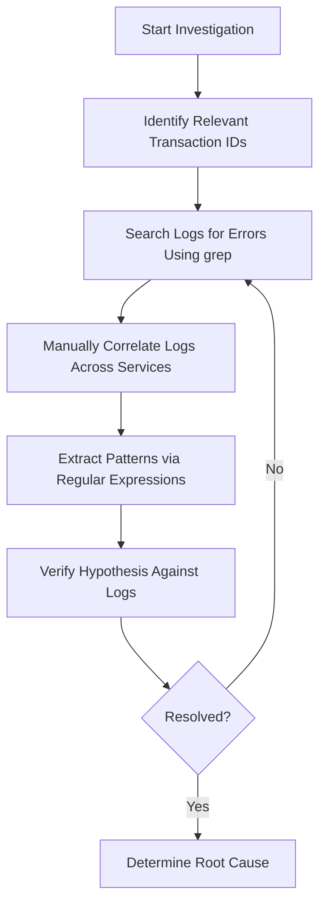
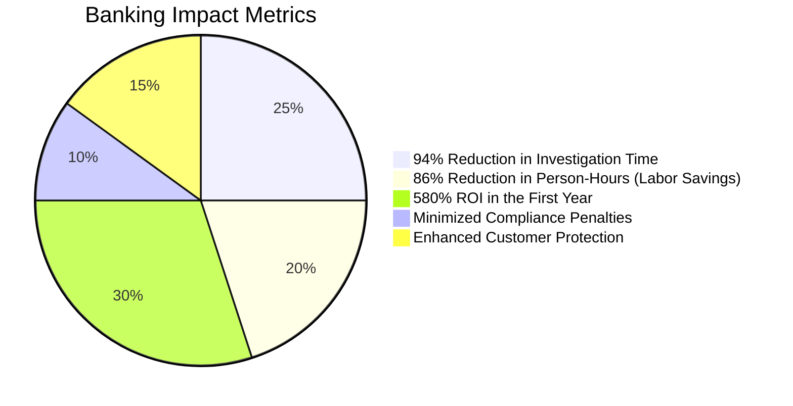
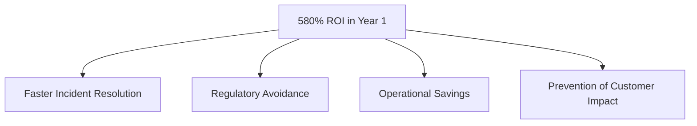
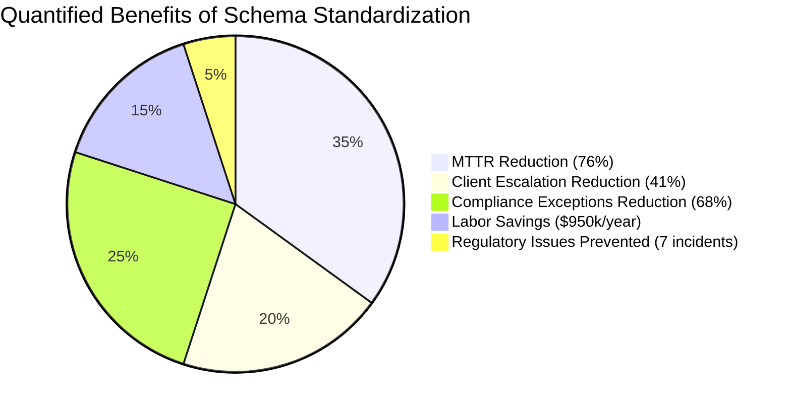
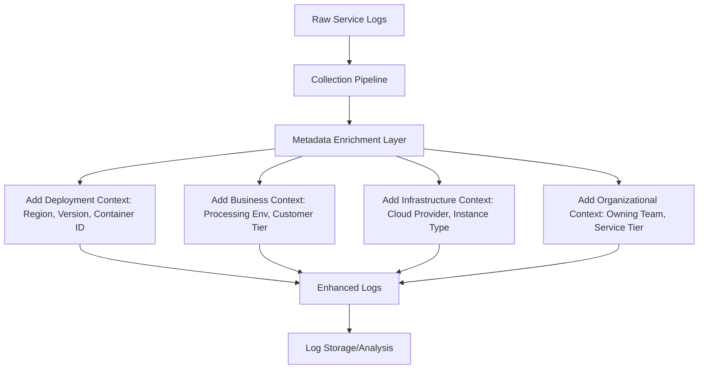
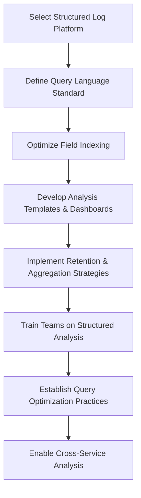
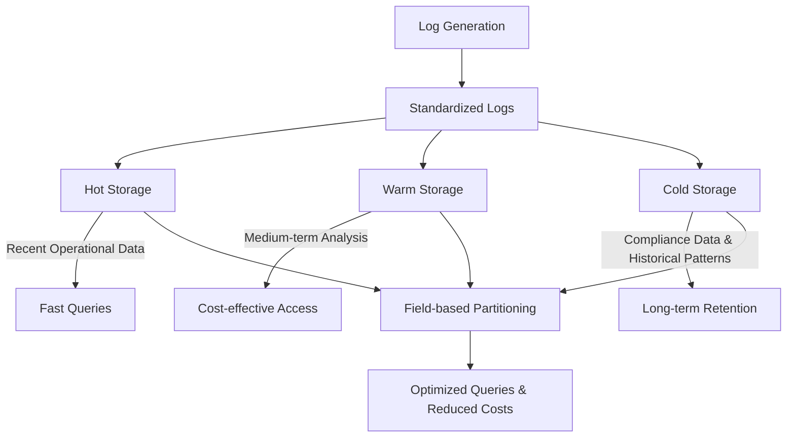
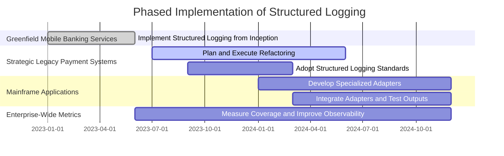
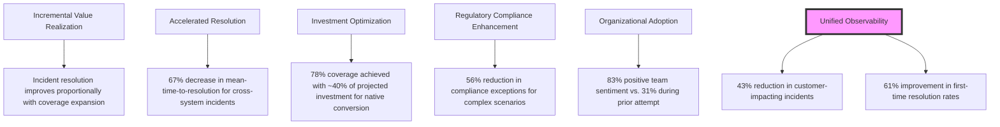
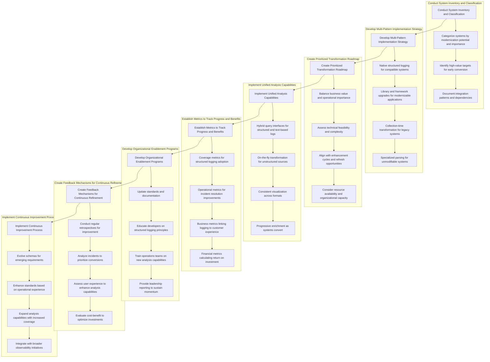

# Chapter 4: Structured Logging - Bringing Order to Chaos

## Chapter Overview

Welcome to the dark underbelly of logging: where unstructured text is the minotaur and your engineers are the hapless heroes, lost in a maze of grep commands and homegrown awk-fu. This chapter is your torch—shining a pitiless light on why text dump logs are a business liability, not just an SRE pain. We’ll tear down the myth that “logs are just for humans” and show how structured logging turns your operational chaos into a data-driven powerhouse. Forget sifting through haystacks for needles—learn how to build a log system where the needles jump out and wave. We’ll cover the technical and business realities: schema wars, metadata enrichment, analysis that actually works, storage that’s both compliant and affordable, and—most importantly—how to drag your legacy zombie systems into the future without losing your sanity or your shirt. If you’re tired of heroics and want results, start here. Structured logging isn’t just a nice-to-have—it’s survival.

______________________________________________________________________

## Learning Objectives

- **Identify** the crippling limitations of unstructured logging and the operational/business carnage it causes.
- **Design** structured logging schemas that balance consistency, analytical power, and domain flexibility.
- **Implement** organization-wide standards, libraries, and tooling for generating and validating structured logs.
- **Enrich** logs automatically with critical metadata at collection time to obliterate manual correlation.
- **Query** and **analyze** logs using structured data approaches—think SQL, not grep.
- **Architect** storage strategies that deliver long-term retention, compliance, and cost control via modern data lakes and partitioning.
- **Lead** pragmatic transformation efforts, prioritizing systems for structured logging adoption without derailing the business.
- **Measure** and **demonstrate** the ROI and business impact of modern logging approaches to keep the C-suite happy and the auditors off your back.

______________________________________________________________________

## Key Takeaways

- Unstructured logs are tech debt with interest—every minute you spend grepping is money burnt and customers lost.
- Structured logs turn fire drills into data science. If you’re wrangling regex, you’re already behind.
- Schema chaos is almost as bad as no schema. Don’t let every team roll their own “standard.”
- Business context and metadata in your logs = instant root cause. Without them, you’re playing “Guess Who?” with production.
- Analysis is a joke unless you can aggregate, bucket, and correlate—ditch text search, embrace real queries.
- Storage isn’t just about hoarding data. Structured logs mean you can actually afford retention *and* compliance without mortgaging your future.
- Transformation is a journey, not a weekend project. If you try a big bang, bring a helmet (and a resume).
- Incremental wins matter—each system you convert saves real time, money, and customer trust.
- The best logging systems pay for themselves in incident reduction, regulatory avoidance, and faster releases. Show the business the numbers.
- If your logs aren’t structured, queryable, and enriched, you’re not running a modern bank—you’re running a liability factory.

______________________________________________________________________

## Panel 1: The Text Labyrinth - Limitations of Unstructured Logging
### Scene Description

A bustling banking operations center teeters on the edge of chaos as a critical payment processing outage unfolds. Engineers, visibly stressed, scramble between multiple monitors displaying unstructured logs in inconsistent formats. One screen shows logs beginning with timestamps, another sorted by severity levels, while others lack any clear separation of data fields. The room is filled with the sounds of frantic typing as an exhausted engineer executes a convoluted grep command, attempting to pinpoint failed high-value transactions.

Below is a simplified representation of the scene:

```
+-------------------------------------------------------+
|       Banking Operations Center - Outage Scene        |
+-------------------------------------------------------+
|  [ Screen 1: Logs with timestamps first ]             |
|  2023-10-12 14:32:45 INFO Transaction completed       |
|  2023-10-12 14:32:46 ERROR Payment failed             |
|                                                       |
|  [ Screen 2: Logs with severity first ]               |
|  ERROR: Payment failed at 14:32:46                    |
|  INFO: Transaction completed at 14:32:45             |
|                                                       |
|  [ Screen 3: Unstructured Logs ]                      |
|  Payment failed - 14:32:46                            |
|  Success | Amount: $5000 | Timestamp: 14:32:45        |
|                                                       |
|  [ Engineer's Terminal ]                              |
|  grep -E 'Payment failed|High-Value Transaction' logs |
|                                                       |
|  [ Clock Display ]                                    |
|  Outage Duration: 00:37:12                            |
+-------------------------------------------------------+
```

The clock on the wall looms over the engineers, its ticking a constant reminder of the escalating outage duration. Time-sensitive customer payments remain unprocessed, amplifying the pressure. The scene underscores the inefficiency of unstructured logging, where critical information is buried in a sea of inconsistent formats, requiring engineers to decode the chaos instead of resolving the issue.
### Teaching Narrative
Unstructured logging, characterized by human-readable but machine-unfriendly text formats, creates a fundamental limitation in observability capabilities. In banking systems processing millions of daily transactions, these limitations become critical barriers to reliability. Unstructured logs typically combine different data elements into line-oriented text, mixing timestamps, severity levels, transaction data, and system states in formats that require complex parsing to analyze. This approach fundamentally constrains analysis capabilities by necessitating text-based pattern matching instead of data processing. When a payment processor experiences issues affecting specific transaction types or amounts, unstructured logs force engineers to create complex regular expressions, maintain custom parsing tools, and manually interpret results—transforming what should be simple queries into complex text mining operations. This limitation directly impacts incident resolution time, with each minute of delay translating to business impact through failed transactions, customer frustration, and potential regulatory consequences.
### Common Example of the Problem

A major retail bank recently experienced a critical incident when their wire transfer system began rejecting certain international payments. Customer complaints were escalating as high-value transfers to specific countries remained unprocessed, creating both financial impacts and compliance concerns regarding settlement timeframes.

The operations team immediately began investigating logs, but faced a significant challenge due to unstructured logging formats across their payment processing stack. Below is a sample of the problematic logs encountered, annotated to highlight key issues:

```plaintext
[05/15/2023 14:32:21] PaymentService - Processing international wire transfer #TRX291748365 for customer ID 583921 to SWIFT: DEUTDEFFXXX for EUR 250,000.00
    └─ Inconsistent date format (MM/DD/YYYY), verbose service name
[2023-05-15T14:32:22.456Z] INFO: TransactionValidator validating transaction with ID TRX291748365
    └─ ISO 8601 timestamp format, lacks transaction status clarity
May 15 14:32:23.789 | ROUTING | Determining correspondent bank for destination DEUTDEFFXXX
    └─ Different timestamp format, unclear severity level (no standardization)
2023/05/15 14:32:25.123 ERROR FundingService: Unable to complete transaction TRX291748365. Reason: NSF
    └─ Yet another timestamp format, critical error buried in unrelated details
14:32:26 [NOTIFICATION] Failed to notify customer 583921 about transaction status via preferred channel
    └─ Missing date entirely; ambiguous scope of failure
```

These inconsistencies forced the investigation team to spend over three hours crafting increasingly complex `grep` commands, `awk` scripts, and manual correlation attempts to understand the pattern of failures. Below is a simplified representation of their investigative workflow:



After six hours of investigation, they finally determined that transfers to German banks exceeding €100,000 were being incorrectly flagged by a recently updated compliance filter due to a configuration issue. This resolution came only after manually reviewing thousands of log entries and building correlation spreadsheets to identify the pattern—a process that could have taken minutes with properly structured logs.
### SRE Best Practice: Evidence-Based Investigation

SRE best practice requires implementing structured logging formats that transform logs from textual narrative to queryable data. Evidence-based investigation depends on the ability to reliably extract, filter, and analyze log content without complex parsing or manual correlation.

An effective structured logging approach includes several key components:

1. **Consistent Field Organization**: Establishing clear, consistent field ordering and separation that enables reliable extraction of specific data elements.

2. **Field Identification**: Implementing explicit field labeling that eliminates ambiguity about what each data element represents.

3. **Standard Formats**: Using widely-supported data interchange formats like JSON or XML that provide native parsing capabilities.

4. **Type Consistency**: Maintaining consistent representation of common data types like timestamps, numeric values, and identifiers.

5. **Schema Definition**: Documenting the expected structure of log entries to enable automated validation and processing.

To help implement these principles effectively, the following checklist provides a practical guide for structured logging:

#### Checklist for Structured Logging Implementation
- [ ] Define a **logging schema** that outlines all required fields, their data types, and expected formats.
- [ ] Use a **standardized log format** (e.g., JSON, XML) that supports machine-readable structure and parsing.
- [ ] Ensure **uniform field names and order** across all logs to maintain consistency.
- [ ] Label each field explicitly (e.g., `timestamp`, `severity`, `transaction_id`) to avoid ambiguity.
- [ ] Validate log entries against the schema to detect misformatted or incomplete logs early.
- [ ] Include precise **timestamps** with clear timezone information for accurate correlation.
- [ ] Use unique **identifiers** (e.g., transaction IDs) to link related events across systems.
- [ ] Maintain **type consistency** for numeric values, strings, and other data types to simplify downstream analysis.
- [ ] Periodically review and update the schema to accommodate new use cases or system changes.
- [ ] Train engineers on the purpose and usage of structured logs to ensure adoption and proper implementation.

When investigating issues using structured logs, SREs can implement data-oriented analysis: filtering logs based on specific field values rather than text patterns, aggregating entries by categorical fields to identify patterns, performing quantitative analysis on numeric values, and joining related events using common identifiers.

This structured approach transforms troubleshooting from archaeological text excavation to data-driven analysis, dramatically reducing the time and expertise required to extract meaningful insights from log data.
### Banking Impact

The business impact of unstructured logging extends far beyond technical inconvenience to create direct financial, regulatory, and reputational consequences. For the retail bank in our example, the six-hour investigation delay created several critical impacts:

| **Impact Area**              | **Details**                                                                                                                                                                        | **Quantified Loss**                                                      |
| ---------------------------- | ---------------------------------------------------------------------------------------------------------------------------------------------------------------------------------- | ------------------------------------------------------------------------ |
| **Transaction Delays**       | Approximately 175 high-value international wire transfers remained unprocessed during the investigation period, creating financial impacts for recipients and reputational damage. | €48 million in delayed transactions                                      |
| **Compliance Risk**          | Missed critical settlement windows and regulatory reporting deadlines necessitated special exception processes, increasing compliance exposure in two jurisdictions.               | Non-compliance fines and increased scrutiny (unquantified but high-risk) |
| **Customer Experience**      | Over 80 escalated complaints from high-net-worth clients, with three major corporate customers reconsidering their banking relationships due to the incident.                      | Potential loss of high-value clients and reputational damage             |
| **Operational Inefficiency** | Five senior engineers spent six hours investigating, diverting resources from strategic work, while manual methods increased potential for human error.                            | €6,000 in direct labor costs plus opportunity cost                       |
| **Resolution Quality Risk**  | Manual correlation methods increased the likelihood of human error, leading to possible incorrect conclusions or missed insights that could cause recurring issues.                | Risk of future incidents and recurring operational inefficiencies        |

The bank calculated that structured logging would have reduced the investigation time from six hours to approximately 15 minutes based on subsequent experience. This improvement would have prevented virtually all customer impact and compliance issues. Following the implementation of structured logging, similar issues were identified and resolved before significant customer impact in seven instances over the next year.
### Implementation Guidance
1. Establish a structured logging standard for your organization that defines required format, field definitions, and implementation approaches across different technology stacks.

2. Implement logging libraries or middleware that automatically generate properly structured logs in consistent formats (typically JSON) across all services.

3. Create field naming conventions that ensure consistency across services, regardless of underlying technology or development team.

4. Develop logging frameworks that enforce type consistency for common fields like timestamps, transaction IDs, and monetary amounts.

5. Establish schema documentation that clearly defines the expected structure and fields for different log categories to enable consistent implementation.

6. Implement log validation in your CI/CD pipelines to catch structure violations before production deployment.

7. Create centralized logging infrastructure specifically designed for structured formats, with appropriate parsing, indexing, and query capabilities.

8. Develop visualization and analysis tools that leverage structured data to enable efficient filtering, aggregation, and pattern identification.
## Panel 2: The Structured Revolution - Key-Value and JSON Formats
### Scene Description

The scene contrasts two incident response scenarios within the same banking system, presented side-by-side to highlight the transformation brought by structured logging.

#### Before Structured Logging:
- Engineers are seen using complex text parsing tools to analyze unstructured logs.
- Logs appear as raw, freeform text with inconsistent formatting, making it difficult to extract actionable insights.
- Example log snippet:
  ```
  ERROR: Transaction declined. Card: ****1234. Amount: $10,500. Region: US-East.
  ```
- Engineers manually search for relevant data, leading to extended resolution times and increased frustration.

#### After Structured Logging:
- Engineers use a modern log analysis platform with structured data formatted in JSON.
- Logs are displayed with clearly defined fields, nested structures, and consistent formatting.
- Example log snippet:
  ```json
  {
    "transaction_id": "abc123",
    "status": "declined",
    "amount": 10500,
    "currency": "USD",
    "region": "US-East",
    "card_last4": "1234"
  }
  ```
- The engineer enters a simple query:
  ```
  SELECT * FROM logs WHERE amount > 10000 AND status = "declined" AND region = "US-East"
  ```
- The result is instantly filtered and displayed, dramatically reducing mean-time-to-resolution.

#### Side-by-Side Comparison:
```
+---------------------+----------------------------------+
| Unstructured Logs   | Structured Logs                 |
+---------------------+----------------------------------+
| Raw text data       | JSON-formatted data             |
| Inconsistent fields | Clearly defined fields          |
| Manual parsing      | Query-based filtering           |
| High resolution time| Reduced resolution time         |
| Frustration         | Efficiency and clarity          |
+---------------------+----------------------------------+
```

This visual and textual comparison underscores the transformative power of structured logging, enabling faster, more accurate analysis and turning logs into actionable data.
### Teaching Narrative
Structured logging transforms logs from text to be read into data to be processed—a paradigm shift that fundamentally changes what's possible with log analysis. In modern structured logging, information is organized into well-defined fields with consistent names and data types, often using formats like JSON or key-value pairs. This structured approach provides several critical advantages: field-based filtering without complex text parsing, consistent data types for numerical and categorical analysis, support for nested data structures that represent complex banking transactions, and seamless integration with data processing tools. The impact in banking environments is transformative—queries that were previously impossible or required custom tools become simple operations: "Show me all wire transfers over $50,000 with response times exceeding 2 seconds," or "Find all mobile check deposits with specific validation errors from the fraud detection service." This capability doesn't just improve troubleshooting efficiency—it enables entirely new categories of analysis, turning logs from troubleshooting tools into business intelligence assets.
### Common Example of the Problem

An investment bank's trading platform recently faced a critical incident where certain equity trades were being incorrectly priced, creating both financial and regulatory implications. The incident investigation contrasted the dramatic difference between unstructured and structured logging approaches within the same organization.

#### Unstructured Logging Example:
```log
[2023-06-08 09:45:23.456] OrderProcessor - Processing order ID ORD-3947582 for customer ACCT-58294 for symbol AAPL quantity 5000 price market executed at 186.47 exchange NYSE status COMPLETED with commission 250.00 USD
[2023-06-08 09:47:12.789] OrderProcessor - Processing order ID ORD-3947591 for customer ACCT-62385 for symbol MSFT quantity 2500 price market executed at 337.22 exchange NASDAQ status COMPLETED with commission 175.00 USD
[2023-06-08 09:48:35.123] OrderProcessor - Processing order ID ORD-3947606 for customer ACCT-71945 for symbol GOOGL quantity 1000 price market executed at 124.67 exchange NASDAQ status COMPLETED with commission 125.00 USD
```

#### Structured JSON Logging Example:
```json
{
  "timestamp": "2023-06-08T09:45:23.123Z",
  "level": "INFO",
  "service": "PricingEngine",
  "transaction_id": "PRICE-59271634",
  "correlation_id": "ORD-3947582",
  "request": {
    "symbol": "AAPL",
    "quantity": 5000,
    "order_type": "market",
    "account_type": "institutional"
  },
  "response": {
    "price": 186.47,
    "market": "NYSE",
    "liquidity_indicator": "high",
    "pricing_model": "institutional-tier1",
    "benchmark_variance": -0.02
  },
  "performance": {
    "execution_time_ms": 12,
    "price_source": "primary",
    "quote_age_ms": 47
  }
}
```

#### Comparison of Unstructured vs. Structured Logging

| **Aspect**              | **Unstructured Logging**                                                                    | **Structured Logging**                                                                                           |
| ----------------------- | ------------------------------------------------------------------------------------------- | ---------------------------------------------------------------------------------------------------------------- |
| **Format**              | Plain text with inconsistent structure.                                                     | JSON with well-defined fields and nested structure.                                                              |
| **Parsing Effort**      | Requires custom scripts and manual processing to extract information.                       | Simple queries can directly target specific fields.                                                              |
| **Error Detection**     | Difficult to programmatically identify issues due to lack of consistent field organization. | Abnormalities like benchmark variance can be automatically flagged and filtered.                                 |
| **Analysis Complexity** | High complexity, requiring significant manual effort to normalize and analyze data.         | Low complexity, supports field-based filtering and advanced analysis tools natively.                             |
| **Time to Resolution**  | 4.5 hours to identify root cause.                                                           | 17 minutes to identify root cause with greater confidence.                                                       |
| **Data Enrichment**     | Limited ability to add metadata or contextual information for transactions.                 | Supports enriched metadata (e.g., liquidity indicators, execution time, benchmark variance) for deeper insights. |

When investigating the pricing discrepancy, the team faced a stark contrast in analysis capability. For the unstructured logs, they spent hours building text processing scripts to extract price information, with significant manual effort to normalize formats and filter relevant transactions. For the structured logs, a simple query immediately identified all trades with abnormal benchmark variance, revealing that a specific pricing model was applying an incorrect discount factor for certain institutional clients.

The resolution time difference was dramatic: **4.5 hours for the unstructured logging system versus 17 minutes for the structured logging system**, with the latter providing much more comprehensive analysis capabilities and confidence in the resolution.
### SRE Best Practice: Evidence-Based Investigation

SRE best practice requires implementing structured logging formats that transform logs from narrative text into queryable data structures. Evidence-based investigation depends on the ability to filter, sort, aggregate, and analyze log data using standard data processing tools rather than custom text parsing.

Effective structured logging implementations include several key components:

1. **JSON or Key-Value Formatting**: Using standard data interchange formats that provide clear field separation and native parsing support in most analysis tools.
2. **Schema Definition**: Establishing consistent field names, types, and structures that enable reliable querying and analysis.
3. **Hierarchical Organization**: Implementing nested structures that logically group related information while maintaining queryability.
4. **Type-Specific Formatting**: Using appropriate data types for different fields (strings, numbers, booleans, timestamps) to enable type-specific operations.
5. **Field Standardization**: Creating consistent field names and structures across different services to enable cross-component analysis.

#### Checklist for Effective Structured Logging

Use this checklist to ensure your logging implementation supports evidence-based investigation:

- [ ] Use JSON or key-value formats for structured log entries.
- [ ] Define a schema with consistent field names, types, and structures.
- [ ] Organize related data hierarchically for clarity and query efficiency.
- [ ] Apply type-specific formatting (e.g., timestamps, booleans, numbers) for accurate analysis.
- [ ] Standardize field naming conventions across all services in your system.
- [ ] Validate log entries against the schema to enforce consistency.
- [ ] Ensure logs are indexed and queryable in your chosen log analysis platform.

#### Data-Oriented Analysis Methodologies

When investigating issues using structured logs, SREs implement data-oriented analysis methodologies:

- **Field-Based Filtering**: Use standard query languages to filter logs on specific fields (e.g., `status: "declined"` or `amount > 10000`).
- **Statistical Analysis**: Perform numeric field analysis (e.g., average response times, frequency distributions).
- **Hierarchical Filtering**: Drill down into nested structures to isolate specific events or flows.
- **Cross-Service Correlation**: Join related events across services using shared identifiers (e.g., transaction IDs).
- **Pattern Detection**: Identify trends and anomalies by applying advanced data processing techniques.

This structured approach transforms troubleshooting from manual text processing to data analysis, enabling precise identification of patterns and anomalies through standard database-like queries.
### Banking Impact

The business impact of structured logging extends beyond technical convenience to create significant operational efficiency, accelerated resolution, and enhanced analytical capabilities. For the investment bank in our example, the contrast between structured and unstructured components created a clear business case for modernization:

#### Key Metrics Summary



- **Resolution Time Efficiency**: A 94% reduction in investigation time (4.5 hours to 17 minutes) directly minimized financial exposure, resolving approximately $2.8M in potentially affected trades before market close instead of requiring complex post-trade reconciliation.

- **Regulatory Compliance**: The structured logs enabled precise identification and documentation of the pricing issue, ensuring accurate regulatory reporting within required timeframes. This avoided penalties that typically start at $250,000 for late or incomplete disclosures.

- **Customer Experience Protection**: Rapid resolution limited customer impact, with only 23 clients experiencing pricing discrepancies compared to an estimated 400+ during a prolonged investigation.

- **Operational Cost Reduction**: Across all trading-related incidents in the six months following structured logging implementation, the bank documented an 86% reduction in person-hours spent on investigation, representing approximately $420,000 in direct labor savings.

- **Enhanced Business Intelligence**: Beyond troubleshooting, structured logs enabled new analytics capabilities, such as trading pattern analysis, performance optimization, and client behavior insights, all of which were previously impossible with unstructured data.

#### ROI Breakdown



The bank calculated an ROI of 580% in the first year for their structured logging initiative, with the majority of benefits stemming from faster incident resolution and the prevention of regulatory and financial impacts. After full implementation across their trading platform, they identified and addressed 17 potential issues before they could affect customers, leveraging analysis capabilities that were impossible with unstructured data.
### Implementation Guidance
1. Select and standardize on a structured logging format across your organization, typically JSON for its widespread support and flexible structure.

2. Develop language-specific logging libraries or adopt existing frameworks that automatically generate properly structured logs with consistent field naming and organization.

3. Create a schema registry that documents the expected structure, field names, and data types for different log categories to ensure consistency across services.

4. Implement log structure validation in your CI/CD pipeline to prevent deployment of services with non-compliant logging formats.

5. Deploy log collection and analysis infrastructure specifically designed for structured formats, with appropriate parsing, indexing, and query capabilities.

6. Establish field naming conventions and hierarchical organization patterns that create logical grouping while maintaining queryability.

7. Develop transition strategies for legacy systems that cannot be immediately updated, including log transformation during collection or parsing at analysis time.

8. Create training and documentation that helps teams understand structured logging best practices and how to leverage the enhanced analysis capabilities.
## Panel 3: The Schema Evolution - Consistency and Flexibility
### Scene Description

A financial technology development team gathers to review their logging schema documentation. On a large screen, they examine a visualization of their structured log schema, which is organized into three tiers:

- **Core Fields:** Required across all services, these include fundamental attributes such as `timestamp`, `level`, `transaction ID`, and `service name`.
- **Domain-Specific Fields:** Standardized within banking functions like payments, accounts, and investments. Examples include `transaction type`, `amount`, and `instrument ID`.
- **Extensible Attributes:** Flexible fields introduced to accommodate evolving service-specific needs while maintaining compatibility.

The visualization also includes a timeline that illustrates the schema's evolution over time. It highlights key milestones, such as the addition of new domain-specific fields for emerging business capabilities and updates to ensure backward compatibility.

Below the visualization, an example schema diagram offers further clarity:

```
+-------------------+
| Core Fields       |
| (All Systems)     |
+-------------------+
         |
         v
+-------------------+
| Domain-Specific   |
| Fields            |
| (Banking Domains) |
+-------------------+
         |
         v
+-------------------+
| Extensible        |
| Attributes        |
| (Service-Specific)|
+-------------------+
```

Sample logs displayed on the screen demonstrate how this tiered schema approach achieves both consistency for cross-system analysis and flexibility for domain-specific investigations. The team discusses how maintaining this balance ensures the logs remain analytically valuable as systems and business needs evolve.
### Teaching Narrative
Effective structured logging requires balancing consistency for reliable analysis with flexibility for domain-specific needs—a balance achieved through thoughtful schema design. In banking systems spanning diverse domains from retail accounts to investment platforms, a rigid one-size-fits-all approach fails, while complete schema freedom creates analytical chaos. Modern SRE practices implement tiered schema approaches: core fields mandated across all systems (timestamp, severity, correlation IDs, service identifier), domain-specific fields standardized within banking functions (transaction type, amount, instrument ID), and extensible attributes for service-specific details. This approach enables both consistent cross-system analysis and rich domain-specific investigation. Equally important is schema governance: documented field definitions with examples, validation tools integrated into CI/CD pipelines, and controlled evolution processes that maintain backward compatibility. When implemented effectively, this schema approach ensures that logs remain analytically valuable as systems evolve—preventing the data fragmentation that undermines observability in rapidly changing financial platforms.
### Common Example of the Problem

A global financial services company with diverse business units—retail banking, wealth management, and capital markets—struggled with balancing standardization and flexibility in their logging schema. This challenge became critical during a cross-division incident involving a high-net-worth client's portfolio restructuring that triggered trading activity, fund transfers, and account adjustments across multiple systems.

Initially, each division had independently developed structured logging with dramatically different approaches, which are summarized in the table below:

| Division          | Logging Approach       | Strengths                                                                              | Weaknesses                                                                           | Example Highlights                                                                                      |
| ----------------- | ---------------------- | -------------------------------------------------------------------------------------- | ------------------------------------------------------------------------------------ | ------------------------------------------------------------------------------------------------------- |
| Retail Banking    | Rigid Standardization  | High consistency; easy cross-service comparisons                                       | Inflexible; lacks support for domain-specific nuances                                | Fixed fields for all transactions (e.g., `type`, `source_account`, `destination_account`)               |
| Wealth Management | Free-Form Schema       | Maximum flexibility; highly customizable for domain-specific needs                     | No consistency; difficult to correlate across services                               | No standard naming conventions (e.g., `ts` vs. `timestamp`, `svc` vs. `service`, nested portfolio data) |
| Capital Markets   | Domain-Specific Schema | Balances consistency within the domain while supporting key domain-specific attributes | Minimal shared fields across domains; limited cross-division analytical capabilities | Detailed domain-specific fields (e.g., `instrument`, `yield`, `execution.strategy`)                     |

When the client reported inconsistencies in their portfolio after the restructuring, the investigation team faced significant challenges correlating activities across these divisions. Despite all three using structured JSON logging, the incompatible schemas created analytical barriers almost as severe as completely unstructured logs:

**Retail Banking Example:**

```json
{
  "timestamp": "2023-04-12T10:23:45.678Z",
  "service": "funds-transfer",
  "transaction_id": "FT-372859461",
  "customer_id": "C-48291756",
  "status": "completed",
  "amount": 1250000.00,
  "currency": "USD",
  "type": "internal",
  "source_account": "ACCT-11426378",
  "destination_account": "ACCT-21785943"
}
```

**Wealth Management Example:**

```json
{
  "ts": "2023-04-12T10:25:12Z",
  "svc": "portfolio-management",
  "tid": "PM-59274836",
  "cid": "48291756",
  "portfolio": {
    "id": "PF-85923147",
    "action": "rebalance",
    "advisor": "ADV-4821",
    "model": "BALANCED-GROWTH-7",
    "adjustments": [
      {"asset_class": "fixed_income", "target_allocation": 0.35},
      {"asset_class": "equities", "target_allocation": 0.55},
      {"asset_class": "alternatives", "target_allocation": 0.10}
    ]
  }
}
```

**Capital Markets Example:**

```json
{
  "timestamp": "2023-04-12T10:28:37.123Z",
  "level": "INFO",
  "application": "trading-platform",
  "component": "order-execution",
  "session_id": "OS-7629153",
  "client_ref": "C-48291756",
  "order": {
    "id": "ORD-629587341",
    "instrument": "US-T-10Y",
    "action": "BUY",
    "quantity": 1000000,
    "price": 96.875,
    "yield": 3.625,
    "execution": {
      "venue": "primary-dealer",
      "time_ms": 457,
      "strategy": "block-principal"
    }
  }
}
```

The investigation team spent over three days creating custom correlation scripts to map between these incompatible schemas, eventually determining that a timing discrepancy between a bond purchase and a fund transfer had created a temporary negative balance that triggered an automated risk management action. This resolution came only after extensive manual mapping effort that could have been avoided with a balanced schema approach.
### SRE Best Practice: Evidence-Based Investigation

SRE best practice requires implementing a tiered schema strategy that balances standardization for core fields with flexibility for domain-specific needs. Evidence-based investigation depends on both consistent correlation capabilities across all systems and rich contextual details appropriate to specific domains.

Effective schema design includes several key components:

1. **Core Field Standardization**: Establishing mandatory fields with consistent names and formats across all services, including timestamps, correlation identifiers, service information, and basic transaction details.

2. **Domain-Specific Standards**: Creating standardized field structures for specific business domains (e.g., payments, trading, account management) while maintaining consistency with core fields.

3. **Extension Mechanisms**: Implementing structured approaches for service-specific additions that don't interfere with core or domain standards.

4. **Schema Documentation**: Maintaining comprehensive documentation of all schema elements with clear examples, validation rules, and usage guidance.

5. **Evolution Management**: Establishing controlled processes for schema changes that maintain backward compatibility and prevent analytical disruption.

To help teams implement these principles effectively, use the following **Schema Design Checklist**:

- [ ] **Core Field Consistency**: Have we defined and enforced consistent core fields across all services?
- [ ] **Domain Alignment**: Are domain-specific fields standardized and aligned with core fields?
- [ ] **Extensibility**: Is there a clear, structured mechanism for adding service-specific fields without breaking schema integrity?
- [ ] **Documentation**: Is schema documentation complete, including examples, validation rules, and usage guidelines?
- [ ] **Backward Compatibility**: Are schema evolution processes in place to ensure backward compatibility and avoid disruptions?

When investigating issues spanning multiple domains, SREs leverage this balanced approach to implement both broad correlation and deep domain-specific analysis: using core fields to connect related events across all systems, domain standards to analyze specific business functions, and extended attributes to understand service-specific details.

This tiered strategy transforms cross-domain troubleshooting from manual correlation to integrated analysis, enabling both broad system-wide visibility and deep domain-specific understanding.
### Banking Impact

The business impact of unbalanced schema approaches extends beyond technical inconvenience to create significant operational inefficiency, delayed incident resolution, and limited analytical capabilities. For the global financial services company in our example, the subsequent implementation of a balanced schema strategy delivered several quantifiable benefits:



- **Accelerated Resolution**: Mean-time-to-resolution for cross-division incidents decreased by 76% after implementation, with the original three-day investigation timeframe reduced to hours or minutes for similar scenarios.

- **Client Satisfaction Protection**: Faster resolution of cross-domain issues directly impacted high-value client relationships, with relationship manager surveys showing a 41% reduction in client escalations related to multi-product transactions.

- **Regulatory Compliance Enhancement**: The ability to quickly correlate activities across domains improved regulatory reporting accuracy and timeliness, reducing compliance exceptions by 68% for complex cross-product scenarios.

- **Operational Efficiency**: The time spent on manual data correlation across divisions decreased by approximately 3,800 hours annually, representing approximately $950,000 in direct labor savings that could be redirected to proactive improvements.

- **Advanced Analytics Enablement**: The standardized core fields combined with rich domain-specific attributes enabled new cross-domain analytics previously impossible, including customer journey analysis, product relationship insights, and risk pattern identification.

The company calculated an ROI of 375% in the first year for their schema standardization initiative, with benefits accelerating as coverage expanded across their technology landscape. Perhaps most significantly, they identified seven potential regulatory issues through cross-domain pattern analysis that would have been invisible with their previous fragmented approach, preventing potential compliance penalties typically starting at $500,000 per incident.
### Implementation Guidance
1. Develop a tiered schema strategy that explicitly defines:

   - Core fields required across all systems
   - Domain-specific standards for different business functions
   - Extension mechanisms for service-specific needs

2. Create a schema registry that documents all standard fields with clear definitions, examples, and validation rules, serving as the authoritative reference.

3. Implement schema validation in your CI/CD pipeline to enforce compliance with core and domain standards while allowing appropriate extensions.

4. Establish a schema governance process that reviews and approves changes, ensuring backward compatibility and analytical consistency.

5. Develop transition strategies for existing systems, including incremental adoption approaches and transformation during collection for legacy systems.

6. Create centralized analysis capabilities that leverage the standardized schema to enable both cross-system correlation and domain-specific investigation.

7. Implement version tracking for schema evolution, ensuring that analysis tools can adapt to schema changes over time.

8. Conduct regular schema reviews to identify improvement opportunities, emerging patterns, and potential consolidation of extension fields into domain standards.
## Panel 4: The Metadata Enhancement - Enriching Logs at Collection Time
### Scene Description

A banking observability platform where log entries are visibly transformed as they flow through the collection pipeline. The visualization shows raw service logs being automatically enhanced with critical context: deployment information (region, version, container ID), business context (processing environment, customer tier), infrastructure details (cloud provider, instance type), and organizational metadata (owning team, service tier). Below is a diagram that illustrates the metadata enrichment process:



A real-time demonstration shows how enriched metadata enables precise filtering during incident investigations. For example, an engineer can immediately focus on logs from a specific version deployment in the North American payment processing environment without requiring manual correlation.
### Teaching Narrative
Structured logging enables a powerful capability often missing in traditional approaches: automatic metadata enrichment during collection. Rather than requiring each developer to include every relevant contextual element in their logging code, modern pipelines enhance logs with critical metadata as they're collected and transported. In banking environments, where context is crucial for effective analysis, this enhancement layer adds multiple dimensions of valuable information: infrastructure context (data center, cloud region, instance details), deployment context (version, deployment ID, configuration), organizational context (service owner, tier, compliance classification), and business context (processing environment, market segment). This capability transforms structured logs from isolated data points into contextually rich intelligence. When investigating transaction anomalies, enhanced logs enable immediate narrowing by specific versions, regions, or customer segments without manual correlation steps. This approach also reduces implementation burden on development teams, who can focus on core transaction logging while the collection infrastructure handles environmental context—improving both consistency and developer productivity in complex financial environments.
### Common Example of the Problem

A major financial institution was struggling with troubleshooting their credit card authorization platform, which spanned multiple data centers, cloud regions, and deployment versions. When unusual transaction decline patterns emerged, the investigation team faced a critical challenge: the application logs contained detailed transaction information but lacked critical environmental context needed to isolate the pattern.

This created a classic example of the "works on my machine" problem at enterprise scale. The operations team had reliable logs showing increased declines for a specific transaction type, but couldn't determine if the issue was related to a particular deployment version, infrastructure region, or customer segment without extensive manual correlation.

The following table illustrates the stark difference between the original logs and the enriched logs after implementing metadata enhancement. The added metadata drastically reduces the manual steps required to identify and remediate issues:

| **Aspect**                              | **Original Application Log**                                                                                                                                                                                                                                                                                                                                           | **Enhanced Log After Collection**                                                                                                                                                                                                                                                                                                                                                                                                                                                                                                                                                                                                                                                                                                                                                                                                                                                       |
| --------------------------------------- | ---------------------------------------------------------------------------------------------------------------------------------------------------------------------------------------------------------------------------------------------------------------------------------------------------------------------------------------------------------------------- | --------------------------------------------------------------------------------------------------------------------------------------------------------------------------------------------------------------------------------------------------------------------------------------------------------------------------------------------------------------------------------------------------------------------------------------------------------------------------------------------------------------------------------------------------------------------------------------------------------------------------------------------------------------------------------------------------------------------------------------------------------------------------------------------------------------------------------------------------------------------------------------- |
| **Raw Log Example**                     | ```json {"timestamp": "2023-07-12T15:42:37.123Z", "level": "ERROR", "service": "authorization-service", "transaction_id": "AUTH-47295834", "card_type": "platinum", "amount": 1240.50, "currency": "USD", "merchant_category": "travel", "response_code": "54", "response_message": "Expired card", "processing_time_ms": 245 }```                                     | ```json {"timestamp": "2023-10-25T16:28:42.456Z", "level": "ERROR", "service": "authorization-service", "transaction_id": "AUTH-58293471", "card_type": "platinum", "amount": 2340.75, "currency": "USD", "merchant_category": "travel", "response_code": "54", "response_message": "Expired card", "processing_time_ms": 267, "metadata": { "deployment": { "version": "3.5.2", "build_id": "20231022-1432", "configuration_set": "prod-standard" }, "infrastructure": { "region": "us-west-2", "zone": "us-west-2b", "instance_type": "m5.xlarge", "environment": "production" }, "organization": { "business_unit": "consumer_cards", "team": "authorization-platform", "service_tier": "critical-tier1", "pager_rotation": "auth-team-west" }, "business": { "processing_region": "north_america", "customer_segment": "high_net_worth", "product_line": "premium_rewards" } } }``` |
| **Required Steps to Investigate Issue** | 1. Query deployment records to identify which versions were running in which regions <br> 2. Cross-reference infrastructure inventories to map transactions to physical or cloud environments <br> 3. Consult multiple customer databases to determine segment and product information <br> 4. Manually build correlation tables linking all this information together | A single query directly identifies all errors for the specific version, region, and customer segment, eliminating the need for manual correlation efforts.                                                                                                                                                                                                                                                                                                                                                                                                                                                                                                                                                                                                                                                                                                                              |

After nearly 8 hours of investigation, using the original logs, the team finally determined that the issue affected only a specific card processing service version deployed in their US-WEST region for platinum cardholders—representing just 3% of overall traffic but containing high-value customers.

In contrast, after implementing a metadata enrichment pipeline, a similar investigation months later took just 12 minutes. The enriched logs provided immediate visibility into critical context, enabling rapid isolation and targeted remediation that prevented significant customer impact.
### SRE Best Practice: Evidence-Based Investigation

SRE best practice requires implementing metadata enrichment that automatically enhances logs with environmental and organizational context during collection rather than at the source. Evidence-based investigation depends on contextually rich logs that can be filtered and analyzed across multiple dimensions without requiring manual correlation with external systems.

Effective metadata enrichment strategies include several key components:

1. **Layered Enhancement**: Implementing a pipeline that adds context at different stages of collection and processing, building a comprehensive metadata profile.

2. **Multi-Dimensional Enrichment**: Adding different contextual categories including infrastructure, deployment, organization, and business context.

3. **Source-Appropriate Mechanisms**: Using different enrichment techniques based on source capabilities—HTTP headers for API calls, environment variables for containerized services, configuration lookup for traditional applications.

4. **Centralized Management**: Maintaining enrichment rules and reference data in centralized systems to ensure consistency and ease of update.

5. **Preservation of Original Content**: Enhancing logs without modifying the original application data, typically by adding metadata in specific structured fields.

#### Checklist: Implementing Effective Metadata Enrichment

To ensure your metadata enrichment strategy supports evidence-based investigations, use the following checklist:

- [ ] **Define Context Categories**: Identify and document the key metadata dimensions required for your environment (e.g., infrastructure, deployment, business, organizational).
- [ ] **Standardize Enrichment Fields**: Establish consistent field names and formats for enriched metadata to enable reliable filtering and analysis.
- [ ] **Leverage Source-Specific Techniques**: Map appropriate enrichment mechanisms to each log source (e.g., environment variables, headers, or configuration lookups).
- [ ] **Build a Layered Pipeline**: Design a collection pipeline that applies enrichment progressively across stages.
- [ ] **Centralize Rules and Data**: Use a centralized system to manage enrichment rules and reference data for ease of maintenance and updates.
- [ ] **Preserve Raw Logs**: Ensure original log entries remain intact by appending enriched metadata in separate, structured fields.
- [ ] **Validate Enrichment**: Regularly test enriched logs to confirm metadata is complete, accurate, and aligned with investigation needs.
- [ ] **Document Use Cases**: Provide clear examples of how enriched metadata supports common investigation scenarios, such as filtering by deployment version or isolating regional anomalies.

When investigating issues using enhanced logs, SREs implement context-based analysis methodologies: filtering across multiple metadata dimensions to isolate patterns, comparing behavior between different environments or versions, identifying organizational boundaries for efficient escalation, and understanding business context to assess impact and prioritization.

This enrichment approach transforms troubleshooting from manual correlation to context-rich analysis, enabling precise issue isolation without extensive cross-reference with external systems.
### Banking Impact
The business impact of metadata-poor logs extends beyond technical inefficiency to create significant operational delays, customer experience degradation, and missed pattern identification. For the financial institution in our example, the metadata enrichment initiative delivered several quantifiable benefits:

- **Accelerated Resolution**: Mean-time-to-resolution for environment-specific issues decreased by 94% after implementation, from hours to minutes for typical scenarios, directly reducing customer impact duration.

- **Targeted Remediation**: The ability to precisely identify affected environments, versions, and customer segments enabled highly targeted fixes that minimized change risk, with selective deployment to only affected components rather than global rollbacks.

- **High-Value Customer Protection**: Rapid identification of issues affecting premium customer segments enabled prioritized resolution and proactive communication for high-value relationships, protecting approximately $42 million in annual revenue from "at-risk" customer attrition.

- **Pattern Recognition Enhancement**: The enriched metadata enabled new pattern detection capabilities that identified subtle correlations across environments and configurations, with 23 potential issues proactively identified before significant customer impact in the first year.

- **Operational Efficiency**: The time spent on manual correlation and environment mapping decreased by approximately 5,200 hours annually, representing approximately $1.3 million in direct labor savings.

The institution calculated an ROI of 430% in the first year for their metadata enrichment initiative, with the most significant benefits coming from accelerated resolution of critical issues affecting high-value customer segments and the prevention of customer attrition through proactive issue identification. The rapid isolation capability also enabled more confident deployment practices, increasing their release velocity by 35% while simultaneously reducing production incidents by 42%.
### Implementation Guidance

Below is a flow diagram summarizing the key steps for implementing metadata enrichment, followed by detailed guidance for each step:

```plaintext
[Identify Critical Metadata] --> [Design Metadata Pipeline] --> [Build Reference Sources] --> [Define Consistent Schema] --> [Enable Visualization Tools] --> [Establish Governance] --> [Implement Validation] --> [Provide Training]
```

1. **Identify Critical Metadata Dimensions**  
   Pinpoint the key metadata required for your environment to ensure logs are contextually rich. Common dimensions include:
   - **Infrastructure context**: Regions, zones, instance types
   - **Deployment information**: Versions, build IDs, configurations
   - **Organizational data**: Teams, service tiers, support routes
   - **Business context**: Processing regions, customer segments, product lines

2. **Design Metadata Enrichment Pipeline**  
   Develop a pipeline that enhances logs at collection time. Use appropriate techniques based on the source type:
   - HTTP headers for API services
   - Environment variables for containerized applications
   - Agent configuration for traditional systems
   - Lookup services for static correlation

3. **Build Centralized Reference Sources**  
   Establish authoritative data sources for metadata mapping:
   - Deployment registries
   - Infrastructure inventories
   - Service catalogs
   - Business domain maps

4. **Define a Consistent Schema**  
   Create a structured schema that separates original log content from enriched metadata. Use nested structures or metadata sections to maintain clarity.

5. **Enable Visualization and Analysis Tools**  
   Integrate tools that utilize enriched metadata for advanced operations, such as:
   - Multi-dimensional filtering (e.g., by region, version, or team)
   - Comparative analysis
   - Pattern recognition

6. **Establish Governance Processes**  
   Implement governance mechanisms to ensure metadata accuracy:
   - Regular updates during organizational or infrastructure changes
   - Processes for maintaining compliance during business restructuring

7. **Implement Metadata Validation**  
   Introduce validation mechanisms to detect and alert on:
   - Missing metadata attributes
   - Inconsistent or stale metadata

8. **Provide Training and Documentation**  
   Develop resources to educate teams on:
   - The importance of metadata enrichment
   - Best practices for utilizing enriched logs in troubleshooting
   - How the enrichment pipeline integrates with their workflows
## Panel 5: The Analysis Transformation - From Text Search to Data Queries
### Scene Description

A financial services operations center illustrates two contrasting approaches to log analysis:

```
+-----------------------------+        +------------------------------------+
| Text-Based Search Station  |        | Structured Query Station          |
+-----------------------------+        +------------------------------------+
| - Engineer uses text-based  |        | - Analyst uses structured query   |
|   search tools and complex  |        |   language to analyze log data.   |
|   regular expressions.      |        |                                  |
| - Focus is on finding       |        | - Performs advanced operations:   |
|   specific lines in logs    |        |   - Filtering by transaction type |
|   containing keywords or    |        |   - Grouping by response time     |
|   patterns.                 |        |   - Aggregating error counts by   |
|                             |        |     API endpoint                 |
| - Example: Search for       |        |   - Visualizing trends over time  |
|   "transaction error"       |        |                                  |
+-----------------------------+        +------------------------------------+
```

The text-based station relies on manual exploration, where the engineer uses complex regular expressions to identify transaction issues. In contrast, the structured query station empowers the analyst with tools for filtering, grouping, aggregating, and visualizing data—transforming raw logs into actionable insights.

Large monitors at the structured query station display interactive dashboards, highlighting patterns like payment processing trends or a degrading third-party service. These structured insights immediately reveal issues that would remain obscured in the text-based approach, such as a gradual increase in authentication latency for specific customer segments.
### Teaching Narrative
Structured logging fundamentally transforms analytical capabilities from simplistic text searching to sophisticated data querying—an evolution that expands the questions you can answer with your logs. With unstructured logging, analysis is limited to pattern matching: "Find lines containing these words." With structured logging, analysis becomes true data processing: "Show transaction failure rates by customer segment over time, filtered by amounts over $5,000." This transformation enables entirely new analytical categories: aggregation operations (count transactions by type, sum amounts by status), mathematical operations (calculate percentiles for response times, identify statistical anomalies), grouping and segmentation (analyze patterns by customer tier, region, or channel), temporal analysis (identify time-based patterns, compare to historical baselines), and complex correlations (relate authentication failures to subsequent transaction patterns). For financial institutions, these capabilities directly enhance reliability by revealing patterns invisible in text searches. A gradual increase in authentication latency for specific customer segments becomes immediately visible through structured analysis, enabling proactive intervention before customer impact occurs—a capability simply impossible with text-based approaches.
### Common Example of the Problem

A regional bank was experiencing intermittent performance issues with their online banking platform during peak usage periods. Customer complaints about slow response times and occasional timeouts were increasing, but the operations team struggled to identify the root cause despite extensive log data.

#### Text-Based Analysis Phase
The initial investigation relied on traditional text-based log analysis tools, searching for error messages and timeout indicators with increasingly complex regular expressions:

```bash
grep -E "timeout|exceeded|slow|latency" banking-service.log | grep -v "debug" | sort -k1,2
```

This approach produced thousands of matching lines but offered no clear pattern. Engineers attempted more sophisticated text processing with awk and sed scripts, yet no coherent trend emerged. Weeks passed without progress, with engineers manually inspecting log lines for anomalies.

#### Transition to Structured Logging
After three weeks of inconclusive investigation, the bank implemented structured logging alongside a proper analytics platform. Within the first day of data collection, an analyst ran a simple structured query:

```sql
SELECT 
  time_bucket('5 minutes', timestamp) AS time_period,
  AVG(response_time_ms) AS avg_response,
  PERCENTILE_CONT(0.95) WITHIN GROUP (ORDER BY response_time_ms) AS p95_response,
  COUNT(*) AS request_count
FROM transaction_logs
WHERE service = 'account-service'
GROUP BY time_period
ORDER BY time_period
```

The query results immediately provided actionable insights. A visualization revealed a clear pattern: response times were degrading during specific 15-minute windows corresponding to the bank's core banking system's batch processing schedule. A second query correlating database connection pool metrics with these periods identified a connection leak during specific transaction types, gradually depleting available connections until the pool refreshed.

#### Timeline of Events
The following timeline illustrates the progression from the initial investigation to resolution:

```mermaid
gantt
    title Investigation Timeline
    dateFormat HH:mm
    section Text-Based Analysis Phase
    Initial Logs Review: done, a1, 0d
    Regular Expression Refinement: active, a2, after a1, 2w
    Manual Pattern Matching: active, a3, after a2, 1w
    section Transition to Structured Logging
    Structured Logging Implementation: done, b1, after a3, 1d
    Initial Query Execution: done, b2, after b1, 30m
    Root Cause Identified: done, b3, after b2, 30m
    Resolution Applied: done, b4, after b3, 4h
```

#### Conclusion
This analysis—impossible with text-based tools—took approximately 30 minutes with structured query capabilities to uncover both the root cause and the specific transactions triggering the issue. The resolution was implemented within hours, immediately addressing the performance degradation that had persisted for weeks under the text-based approach.
### SRE Best Practice: Evidence-Based Investigation

SRE best practice requires implementing log analysis capabilities that leverage the full potential of structured data through proper database-like query operations. Evidence-based investigation depends on the ability to process logs as data rather than text, enabling sophisticated analytical techniques impossible with pattern matching alone.

#### Key Capabilities for Structured Log Analysis

1. **Field-Based Filtering**: Implement precise filtering on specific fields and values rather than text pattern matching.
2. **Aggregation Operations**: Use mathematical and statistical functions to summarize data across multiple dimensions (COUNT, SUM, AVG, PERCENTILE).
3. **Temporal Analysis**: Apply time-based functions such as bucketing, windowing, and trend analysis to identify patterns over time.
4. **Comparative Analysis**: Perform relative comparisons across different time periods, customer segments, or transaction types.
5. **Correlation Capabilities**: Establish relationships between different event types, services, or transaction flows.

#### Checklist for Evidence-Based Investigation Using Structured Logs

- [ ] **Define the Problem**: Clearly articulate the issue, including affected systems, symptoms, and potential impact.
- [ ] **Formulate Precise Questions**: Break down the problem into specific analytical questions (e.g., "What is the failure rate for transactions over $5,000 by region?").
- [ ] **Select Key Fields**: Identify relevant log fields (e.g., transaction type, response time, customer segment) to focus your investigation.
- [ ] **Construct Structured Queries**: Translate analytical questions into structured queries that leverage filtering, grouping, and aggregation.
- [ ] **Apply Statistical Techniques**: Use statistical functions (e.g., percentiles, averages, anomaly detection) to analyze trends and deviations.
- [ ] **Visualize Data**: Generate charts or dashboards to reveal patterns, trends, and potential root causes.
- [ ] **Iterate and Refine**: Continuously refine your queries and visualizations as new insights emerge.
- [ ] **Correlate Events**: Link related logs or metrics to identify causal relationships and cross-service dependencies.
- [ ] **Document Findings**: Record intermediate steps, outcomes, and conclusions to create a clear trail of evidence.

#### Transforming Troubleshooting Through Structured Analysis

This analytical approach transforms troubleshooting from simplistic keyword searching to sophisticated data analysis. By following the checklist and leveraging structured logging capabilities, SREs can uncover patterns and relationships that remain invisible in text-based approaches. For example, a gradual increase in authentication latency for specific customer segments can be detected and addressed proactively, preventing downstream failures and minimizing customer impact.
### Banking Impact

The business impact of limited analytical capabilities extends far beyond technical frustration to create significant customer experience degradation, missed pattern identification, and inefficient resource utilization. For the regional bank in our example, the implementation of structured analysis capabilities delivered several quantifiable benefits:

| **Benefit Category**           | **Description**                                                                                 | **Quantified Impact**                                                                                             |
| ------------------------------ | ----------------------------------------------------------------------------------------------- | ----------------------------------------------------------------------------------------------------------------- |
| **Accelerated Resolution**     | Reduced time to investigate and resolve issues.                                                 | Investigation duration decreased from 3 weeks to 30 minutes, minimizing customer-impacting performance issues.    |
| **Customer Experience**        | Improved satisfaction and retention through faster resolution and proactive prevention.         | Online banking satisfaction scores increased by 28 points; account closure risk reduced by 15% for digital users. |
| **Operational Efficiency**     | Reduced manual effort by engineers through streamlined analysis capabilities.                   | Saved 340 engineer-hours, equating to $85,000 in direct labor cost savings.                                       |
| **Proactive Identification**   | Detected issues early, avoiding customer impact and service degradation.                        | Seven emerging issues identified and mitigated, preventing 42 hours of degraded service in 6 months.              |
| **Resource Optimization**      | Enabled precise scaling to address resource constraints without overprovisioning.               | Achieved $230,000 in annual infrastructure savings through targeted capacity adjustments.                         |
| **Return on Investment (ROI)** | Combined financial and customer experience benefits from the implementation of structured logs. | Calculated ROI of 410% within the first year.                                                                     |

The enhanced visibility provided by structured analysis also enabled more confident feature releases and proactive operations:

- **Increased Deployment Velocity**: Digital banking enhancement velocity improved by 40%.
- **Reduced Incident Frequency**: Incident frequency decreased by 35% due to better monitoring and faster issue resolution.

These results demonstrate the transformative potential of structured logging for financial institutions, maximizing reliability, operational efficiency, and customer satisfaction.
### Implementation Guidance

To successfully transition from text-based search to structured data queries, follow these step-by-step guidelines. The process is outlined below with an accompanying flowchart to clarify the sequence and dependencies of each step.



1. **Select Structured Log Platform**  
   Implement a log storage and analysis platform specifically designed for structured data. Ensure it includes proper indexing, robust query capabilities, and visualization tools to support advanced analysis.

2. **Define Query Language Standard**  
   Establish a query language standard for your organization. Typically, this would be SQL or a SQL-like dialect that offers extensive analytical functionality and is accessible to your teams.

3. **Optimize Field Indexing**  
   Develop field-specific indexing strategies tailored to your environment’s common query patterns. This optimization enhances query performance and supports efficient data retrieval.

4. **Develop Analysis Templates & Dashboards**  
   Create reusable templates and interactive dashboards for common investigative scenarios. These tools help accelerate troubleshooting and empower less technical teams to perform self-service analysis.

5. **Implement Retention & Aggregation Strategies**  
   Design retention and aggregation strategies to manage data growth while maintaining query performance. Techniques like time-based partitioning and summarization are critical as data volumes increase.

6. **Train Teams on Structured Analysis**  
   Develop training programs to ensure a smooth transition from text-based search to structured data analysis. Focus on teaching teams how to formulate analytical questions and use structured queries effectively.

7. **Establish Query Optimization Practices**  
   Introduce best practices for query optimization to sustain performance as analysis complexity and data volumes grow. Regularly review query execution plans and refine indexes as necessary.

8. **Enable Cross-Service Analysis**  
   Build capabilities for cross-service analysis to correlate data from different systems. Ensure these processes respect the unique data structures of each system while providing unified insights.

By following this structured implementation process, your organization can unlock the full potential of structured logging and transform its analytical capabilities.
## Panel 6: The Storage Revolution - Log Data Lakes and Retention Strategies
### Scene Description

A bank's technology architecture review meeting where a team presents their structured logging storage evolution. Diagrams contrast their previous approach (storing text logs in limited retention systems) with their new structured data lake architecture. The architecture shows how standardized logs flow into tiered storage with different retention policies: hot storage for recent operational data, warm storage for medium-term analysis, and cold storage for compliance and historical pattern analysis. Cost projections demonstrate how field-level partitioning and compression, enabled by structured formats, deliver both longer retention and lower costs while meeting regulatory requirements.



This diagram illustrates the flow of structured logs from generation to tiered storage layers. Logs are first standardized, enabling efficient handling. From there, they are routed to:
- **Hot Storage** for recent operational data, supporting fast queries.
- **Warm Storage** for medium-term analysis, balancing cost and access efficiency.
- **Cold Storage** for compliance data and historical pattern analysis, ensuring long-term retention at minimal cost.

Field-based partitioning is applied across all tiers, optimizing query performance and reducing storage costs. This approach highlights how the new architecture transforms logging into a strategic asset, addressing operational, analytical, and regulatory needs.
### Teaching Narrative

Structured logging transforms not just how logs are created and analyzed, but fundamentally changes optimal storage approaches—enabling capabilities especially valuable in regulated financial environments. By treating logs as structured data rather than text, organizations can implement advanced storage strategies that deliver both economic and operational benefits. These strategies include:

- **Field-Based Partitioning**  
  Partition logs at a field level (e.g., transaction ID, customer region) to accelerate query performance and reduce storage costs by enabling targeted data scans.

- **Tiered Storage**  
  Implement a tiered approach to storage:
  - **Hot Storage:** High-performance, low-latency storage for recent operational data.
  - **Warm Storage:** Medium-performance storage for analytical workloads over medium-term data.
  - **Cold Storage:** Cost-optimized storage for long-term retention and compliance use cases.

- **Compression Techniques**  
  Leverage structured formats (e.g., Parquet, ORC) to achieve higher compression ratios, taking advantage of consistent schema and data types.

- **Retention Policies at Field Level**  
  Define retention rules at a granular level. For example, personal identifiers can be securely stored with restricted access, while retaining broader transaction patterns for analytics.

- **Immutable Storage for Compliance**  
  Utilize immutable storage solutions to meet non-repudiation requirements, ensuring logs cannot be altered while maintaining query performance.

These strategies are particularly transformative for financial institutions, where regulatory requirements often mandate multi-year retention of transaction data. By adopting these advanced approaches, organizations can shift from treating logs as operational byproducts to leveraging them as strategic data assets. This enables not only operational reliability but also regulatory compliance, business intelligence, and the long-term pattern analysis required in sophisticated financial environments.

#### Checklist: Key Storage Strategies for Structured Logging
- [ ] Implement field-based partitioning for faster queries and cost efficiency.
- [ ] Design tiered storage with hot, warm, and cold layers based on data age and usage.
- [ ] Use structured data formats to optimize compression and storage efficiency.
- [ ] Apply retention policies at the field level to balance security and analytics needs.
- [ ] Ensure compliance with immutable storage solutions for non-repudiation.
### Common Example of the Problem

A large financial services company was facing a critical data retention challenge with their transaction logging infrastructure. Regulatory requirements mandated 7-year retention of financial transaction records, but their traditional text-based logging system made this economically infeasible at their scale of operations. They were forced to implement aggressive log rotation and archiving policies that severely limited their analytical capabilities.

The limitations of their existing approach created multiple operational challenges:

1. **Limited Retention**: Hot storage retained only 14 days of full log data due to volume constraints
2. **Expensive Archives**: Cold archives stored compressed text logs for regulatory compliance, but were essentially unsearchable
3. **All-or-Nothing Retention**: No ability to retain different elements for different durations—either keeping or discarding entire log entries
4. **Query Degradation**: Performance decreased dramatically for queries spanning more than a few days of data
5. **Compliance Risk**: Restoring archived logs for regulatory investigations took 3-5 days, putting them at risk of missing response deadlines

A specific compliance investigation highlighted these limitations when regulators requested three years of transaction history for a specific customer's account. The process required:

- Identifying and restoring dozens of archive files from offline storage
- Implementing custom parsing scripts to extract relevant information
- Manually correlating data across hundreds of log files
- Building ad-hoc analysis tools to identify patterns

This process took 17 days to complete, creating significant regulatory exposure and requiring approximately 240 person-hours of specialized engineering time.

---

#### Before and After: Compliance Investigation Workflow

```mermaid
flowchart TD
    A[Regulator Requests Data] --> B[Identify Relevant Archives]
    B --> C[Restore Archive Files]
    C --> D[Custom Parsing and Extraction]
    D --> E[Manual Correlation of Logs]
    E --> F[Build Ad-Hoc Analysis Tools]
    F --> G[Complete Investigation]
    style A fill:#fbb,stroke:#333,stroke-width:2px;
    style G fill:#fbb,stroke:#333,stroke-width:2px;
    subgraph Before (Traditional Logging)
        A --> G
    end

    subgraph After (Structured Logging Data Lake)
        A2[Regulator Requests Data] --> H[Run Unified Query]
        H --> I[Retrieve Results Across Tiers]
        I --> J[Complete Investigation]
        style A2 fill:#b4fbb8,stroke:#333,stroke-width:2px;
        style J fill:#b4fbb8,stroke:#333,stroke-width:2px;
    end
```

---

After implementing a structured logging data lake with field-level partitioning and tiered storage, a similar investigation six months later was completed in less than 4 hours. The new architecture enabled:

1. **Field-Level Retention**: Storing customer identifiers for 2 years in line with privacy regulations while keeping anonymized transaction patterns for 7+ years
2. **Tiered Performance**: Maintaining 30 days in high-performance hot storage, 13 months in query-optimized warm storage, and 7+ years in cost-effective cold storage
3. **Unified Query Interface**: Providing seamless query capabilities across all storage tiers with appropriate performance expectations
4. **Efficient Compression**: Achieving 27:1 compression ratios through structure-aware compression versus 8:1 with generic text compression
5. **Regulatory Compliance**: Maintaining immutable storage with cryptographic verification for non-repudiation requirements

This transformation dramatically improved both their operational capabilities and compliance posture while actually reducing total storage costs by 34% despite retaining substantially more data.
### SRE Best Practice: Evidence-Based Investigation

SRE best practice requires implementing storage architectures specifically designed for structured log data that optimize for both operational needs and compliance requirements. Evidence-based investigation depends on the ability to efficiently store, retain, and query log data across appropriate timeframes for different use cases.

Effective structured log storage strategies include several key components:

1. **Tiered Storage Architecture**: Implementing multiple storage layers optimized for different access patterns and retention requirements. The following table provides a detailed comparison of the characteristics of hot, warm, and cold storage tiers:

   | **Storage Tier** | **Primary Purpose**                   | **Retention Period** | **Performance** | **Cost** | **Typical Use Cases**                              |
   | ---------------- | ------------------------------------- | -------------------- | --------------- | -------- | -------------------------------------------------- |
   | **Hot Storage**  | Recent operational data               | 15-60 days           | High            | Higher   | Real-time troubleshooting, incident response       |
   | **Warm Storage** | Medium-term analytical data           | 3-18 months          | Balanced        | Moderate | Trend analysis, service performance investigations |
   | **Cold Storage** | Long-term compliance and pattern data | 2-7+ years           | Lower           | Lowest   | Regulatory compliance, historical pattern analysis |

2. **Field-Level Management**: Implementing strategies that handle different data elements according to their specific requirements:

   - Retention policies that maintain different fields for appropriate durations based on regulatory and operational needs
   - Access controls that restrict visibility to sensitive fields based on purpose and authorization
   - Encryption approaches that provide additional protection for personally identifiable information

3. **Partitioning Strategies**: Optimizing data organization for common query patterns:

   - Time-based partitioning for efficient temporal analysis
   - Service-based partitioning for focused troubleshooting
   - Transaction-type partitioning for domain-specific analysis

4. **Compression Optimization**: Leveraging structured formats for efficient storage:

   - Schema-aware compression that understands field types and values
   - Dictionary encoding for repeated values common in logs
   - Delta encoding for time-series data with regular patterns

When implementing investigations that span historical data, SREs leverage these capabilities to balance performance, compliance, and cost: using hot storage for recent operational issues, warm storage for pattern analysis and trend investigation, and cold storage for compliance requirements and long-term analysis.

This architectural approach transforms log storage from a costly operational burden to a strategic asset that supports multiple business functions while meeting regulatory requirements.
### Banking Impact
The business impact of limited log retention extends far beyond technical constraints to create significant compliance risk, analytical limitations, and operational inefficiency. For the financial services company in our example, the structured storage implementation delivered several quantifiable benefits:

- **Compliance Risk Reduction**: The ability to respond to regulatory inquiries within hours rather than weeks dramatically reduced their exposure to compliance penalties, which typically start at $500,000 for missed deadlines in their regulatory environment.

- **Operational Efficiency**: The time required for compliance investigations decreased by 98%, from 17 days to less than 4 hours, representing approximately $60,000 in direct labor savings per major investigation.

- **Enhanced Analytics**: The ability to query historical transaction patterns spanning years rather than days enabled new fraud detection capabilities that identified approximately $3.2 million in potentially fraudulent transactions in the first year.

- **Storage Cost Optimization**: Despite increasing actual data retention, total storage costs decreased by 34% (approximately $1.8 million annually) through more efficient compression, appropriate tiering, and field-level retention.

- **Privacy Compliance**: The field-level management capabilities enabled compliance with GDPR, CCPA, and other privacy regulations without sacrificing analytical capabilities, avoiding potential privacy penalties that can reach 4% of global revenue.

The company calculated an ROI of 580% in the first year for their structured storage implementation, with benefits distributed across compliance risk reduction, operational efficiency, and direct cost savings. Perhaps most significantly, the enhanced analytical capabilities enabled by longer retention unlocked new business intelligence that was previously impossible, directly contributing to product development and risk management improvements with substantial revenue impact.
### Implementation Guidance

To implement a structured logging storage strategy effectively, follow this checklist:

#### **1. Design a Tiered Storage Architecture**
- [ ] Define retention periods for each storage tier based on access patterns and compliance needs.
- [ ] Select appropriate storage technologies for hot, warm, and cold tiers.
- [ ] Enable seamless query capabilities across storage tiers, defining performance expectations per tier.

#### **2. Develop Field-Level Management Strategies**
- [ ] Classify fields to identify regulatory, privacy, and operational requirements.
- [ ] Apply retention policies at the field level rather than entire records.
- [ ] Implement granular access controls to restrict field visibility based on user roles and purpose.

#### **3. Optimize Partitioning Strategies**
- [ ] Use time-based partitioning for efficient historical queries.
- [ ] Implement service- or component-based partitioning for targeted troubleshooting.
- [ ] Apply transaction-type partitioning for domain-specific investigations.

#### **4. Leverage Compression Techniques**
- [ ] Utilize schema-aware compression that aligns with field types and common values.
- [ ] Adopt column-oriented storage for fields with high cardinality.
- [ ] Employ dictionary encoding for fields with repetitive values to save space.

#### **5. Ensure Compliance with Immutable Storage**
- [ ] Use Write-Once-Read-Many (WORM) storage to meet regulatory non-repudiation requirements.
- [ ] Incorporate cryptographic verification for record integrity.
- [ ] Maintain tamper-evident audit trails for all access and modifications.

#### **6. Automate Lifecycle Management**
- [ ] Implement automated workflows to transition data between storage tiers based on age and access patterns.
- [ ] Minimize manual interventions with policy-based lifecycle management.

#### **7. Optimize Query Performance Across Tiers**
- [ ] Define indexing strategies tailored to each tier's common query patterns.
- [ ] Enable query federation to span multiple storage systems seamlessly.
- [ ] Use caching mechanisms to accelerate access to frequently queried historical data.

#### **8. Monitor Costs and Refine Continuously**
- [ ] Establish cost monitoring processes to track storage usage and expenses.
- [ ] Regularly analyze usage patterns and adjust storage strategies to ensure efficiency.
- [ ] Incorporate feedback loops to align storage evolution with evolving operational and regulatory requirements.

This checklist ensures a systematic approach to implementing structured logging storage architectures, balancing performance, cost, and compliance.
## Panel 7: The Implementation Journey - Transitioning from Unstructured to Structured
### Scene Description

A banking technology transformation program office where roadmap visualizations outline the phased implementation of structured logging across their systems. A visual timeline illustrates the progression:



The timeline highlights different approaches for key components. Greenfield mobile banking services implement structured logging from inception, ensuring observability is built in from the start. Strategic legacy payment systems transition through planned refactoring, adopting structured logging standards as part of their modernization. Mainframe applications are integrated using specialized adapters that transform their unstructured outputs into structured formats. Progress metrics track increasing coverage of structured logging across the enterprise, showcasing improvements in incident resolution times and proactive issue detection. This structured approach provides a clear roadmap for transitioning from unstructured chaos to a unified, analyzable data ecosystem.
### Teaching Narrative

Transitioning from unstructured to structured logging in established banking environments requires strategic planning across multiple dimensions—technology, process, and people. Few organizations have the luxury of implementing structured logging from scratch across all systems simultaneously. Instead, successful transitions follow progressive approaches: implementing structured logging standards for all new development, prioritizing critical transaction processing systems for refactoring, creating adapters for legacy systems that transform their outputs into structured formats, establishing centralized parsing for systems that cannot be modified, and developing hybrid analysis capabilities during transition periods.

This technical strategy must be paired with organizational elements: updated standards and documentation, developer education on structured logging principles, updated incident response processes that leverage new capabilities, and metrics that track both implementation progress and realized benefits. The journey is iterative rather than binary, with each converted system enhancing overall observability. For financial institutions with complex technology landscapes spanning modern cloud platforms to legacy mainframes, this progressive approach delivers incremental benefits while working toward the comprehensive structured logging vision—transforming chaotic text into ordered, analyzable data that enhances reliability across the enterprise.

#### Checklist for Transitioning to Structured Logging

To make this transformation actionable, use the following checklist to guide your journey:

**Technical Steps**
1. **Define Standards**: Establish enterprise-wide structured logging standards, including field formats, naming conventions, and schemas.
2. **Greenfield Development**: Enforce structured logging for all new applications and systems from inception.
3. **Prioritize Critical Systems**: Identify and refactor high-impact legacy systems, such as transaction processing or payment systems.
4. **Develop Adapters**: Create adapters to transform outputs from unmodifiable legacy systems into structured formats.
5. **Centralized Parsing**: Implement centralized parsing and transformation pipelines for systems that cannot be directly modified.
6. **Hybrid Analysis**: Build tools and processes that support hybrid analysis of structured and unstructured data during the transition period.

**Organizational Steps**
7. **Update Documentation**: Revise standards, playbooks, and system documentation to reflect structured logging requirements.
8. **Educate Teams**: Train developers, SREs, and incident responders on structured logging principles and tools.
9. **Adapt Incident Response**: Update incident response processes to leverage structured logging for faster diagnostics and resolution.
10. **Monitor Progress**: Define metrics to track implementation progress, such as system coverage, data quality, and incident resolution improvements.

**Iterative Process**
11. **Test and Validate**: Continuously test logging implementations in staging environments to ensure data accuracy and usability.
12. **Refine and Scale**: Use feedback from initial implementations to refine processes and scale adoption across the enterprise.

By following this checklist, organizations can systematically transition to structured logging, enhancing observability and operational reliability in even the most complex environments.
### Common Example of the Problem

A global banking organization with over 300 applications spanning three decades of technology evolution faced a daunting challenge in modernizing their logging infrastructure. Their environment included:

- Modern cloud-native microservices for digital banking channels
- Java and .NET applications for mid-tier processing
- Mainframe COBOL systems for core banking functions
- Dozens of third-party commercial applications with limited customization options
- Multiple acquisitions with different technology standards and practices

Their initial attempt at structured logging transformation failed when they tried to implement a "big bang" approach requiring all systems to simultaneously adopt new standards. The project stalled after consuming significant resources and creating organizational resistance, with only 8% of applications successfully converted after 9 months.

A specific incident highlighted the consequences of this fragmented approach when a customer-reported issue with international payments required investigation across multiple systems. Engineers had to switch between:

1. Modern services with fully structured JSON logs
2. Traditional applications with partially structured key-value logs
3. Legacy systems with entirely unstructured text logs
4. Third-party applications with proprietary log formats

This fragmentation severely hampered the investigation, requiring specialized tools and approaches for each system and manual correlation between different formats. The resolution took 14 hours despite having partial structured logging implementation, as the benefits were undermined by the inconsistent coverage.

After resetting their approach to focus on progressive transformation with pragmatic integration strategies, they achieved 78% effective coverage within 12 months, with significant improvements in operational capabilities. A similar incident a year later was resolved in 47 minutes, with engineers able to use consistent analysis techniques despite the underlying systems having different native logging capabilities.

The key to this success was adopting a multi-faceted strategy:

1. **Greenfield Standard**: All new development implemented structured logging from inception
2. **Prioritized Refactoring**: High-value existing systems were updated during planned enhancement cycles
3. **Transformation Adapters**: Legacy systems were integrated through log transformation during collection
4. **Hybrid Analysis Capabilities**: Tooling supported both structured and text-based logs during the transition

#### Comparison of Approaches

| Factor                                | "Big Bang" Approach                            | Progressive Transformation Strategy          |
| ------------------------------------- | ---------------------------------------------- | -------------------------------------------- |
| **Coverage Achieved (Initial Phase)** | 8% after 9 months                              | 78% after 12 months                          |
| **Incident Resolution Time**          | 14 hours (due to fragmentation)                | 47 minutes (due to consistent analysis)      |
| **Organizational Resistance**         | High (disruption across all teams)             | Low (phased adoption with incremental gains) |
| **Resource Utilization**              | Inefficient (wasted effort on stalled systems) | Efficient (focused on high-impact areas)     |
| **Implementation Timeline**           | Delayed and unpredictable                      | Steady and iterative                         |
| **Adaptability to Legacy Systems**    | Poor (required full system overhauls)          | High (used adapters and hybrid tooling)      |
| **Value Realization**                 | Deferred until full conversion                 | Incremental throughout the journey           |

This balanced and phased approach delivered incremental benefits throughout the journey rather than requiring complete transformation before value realization.
### SRE Best Practice: Evidence-Based Investigation

SRE best practice requires implementing a progressive structured logging transformation strategy that balances ideal end-state architecture with practical reality. Evidence-based investigation depends on both strategic vision and tactical approaches that deliver incremental value throughout the transformation journey.

Effective transformation strategies include several key components:

1. **System Classification**: Categorizing applications based on their modernization potential and operational importance:

   - Greenfield systems that can implement structured logging from inception
   - Modern systems that can be refactored with reasonable effort
   - Legacy systems that require collection-time transformation
   - End-of-life systems where investment may not be justified

2. **Multi-Pattern Implementation**: Deploying different approaches based on system classification:

   - Native structured logging for compatible systems
   - Library/framework upgrades for modernizable applications
   - Log transformation during collection for legacy systems
   - Specialized parsing for systems that cannot be modified

   **Example of Structured Logging Implementation in JSON Format:**

   ```json
   {
       "timestamp": "2023-10-15T12:34:56Z",
       "level": "ERROR",
       "service": "payment-service",
       "environment": "production",
       "transactionId": "abc123",
       "customerId": "987654",
       "message": "Transaction failed due to insufficient funds",
       "errorDetails": {
           "errorCode": "INSUFFICIENT_FUNDS",
           "retryable": false
       }
   }
   ```

   This format ensures logs are machine-readable and can be indexed efficiently for downstream analysis.

3. **Prioritization Framework**: Focusing efforts where they deliver maximum operational value:

   - Customer-facing transaction systems with high business impact
   - Systems with frequent incident involvement
   - Components with complex troubleshooting requirements
   - Integration points between different technology generations

4. **Unified Analysis Layer**: Creating analytical capabilities that work across structured and unstructured formats during transition:

   - Hybrid query interfaces supporting multiple log types
   - Transformation during analysis for unstructured sources
   - Progressive enrichment as systems are converted
   - Consistent visualization regardless of source format

   **Example Workflow for Unified Analysis Layer:**

   ```mermaid
   graph TD
       A[Log Collection] --> B{Log Type?}
       B -->|Structured| C[Direct Ingestion to Analysis System]
       B -->|Unstructured| D[Transform Logs to Structured Format]
       D --> C
       C --> E[Unified Query Interface]
       E --> F[Incident Investigation Tools]
   ```

When investigating issues during transition, SREs leverage these capabilities to implement consistent analysis despite underlying format differences: using structured queries where available, falling back to text analysis where necessary, and correlating across formats through common identifiers or temporal alignment.

This progressive approach transforms logging capabilities incrementally rather than requiring complete conversion before value realization, delivering benefits throughout the journey while working toward the structured logging vision.
### Banking Impact

The business impact of a pragmatic structured logging transformation extends beyond technical improvement to create significant operational efficiency, accelerated incident resolution, and enhanced compliance capabilities. For the global banking organization in our example, the revised transformation strategy delivered several quantifiable benefits:



- **Incremental Value Realization**: Unlike the failed "big bang" approach, the progressive strategy delivered measurable benefits throughout the journey, with incident resolution metrics improving proportionally with coverage expansion.

- **Accelerated Resolution**: Mean-time-to-resolution for complex cross-system incidents decreased by 67% after achieving 78% effective coverage, directly improving customer experience and reducing operational costs.

- **Investment Optimization**: By focusing on high-value systems and implementing cost-effective adapters for legacy components, the organization achieved 78% effective coverage with approximately 40% of the investment projected for complete native conversion.

- **Regulatory Compliance Enhancement**: The ability to implement consistent compliance monitoring across the technology landscape improved regulatory reporting accuracy and timeliness, reducing compliance exceptions by 56% for complex scenarios.

- **Organizational Adoption**: The pragmatic approach drove significantly higher organizational acceptance, with implementation team surveys showing 83% positive sentiment compared to 31% during the initial "big bang" attempt.

The organization calculated an ROI of 320% for their structured logging transformation in the first year, with ongoing benefits as coverage continued to expand. By the 18-month mark, they had achieved 92% effective coverage, with structured analysis capabilities spanning virtually all critical systems despite the underlying technology diversity.

This unified observability significantly contributed to a 43% reduction in customer-impacting incidents and a 61% improvement in first-time resolution rates, demonstrating the transformative value of a structured and incremental approach to logging.
### Implementation Guidance

