# Chapter 5: Centralized Logging Architecture - From Silos to Systems

## Chapter Overview

Welcome to the grim reality of centralized logging, where the only thing worse than not having logs is having them scattered across a digital archipelago of misery. This chapter is your guided tour of what happens when enterprises—especially banks—keep their logs stuffed into every server, mainframe, and cloud dashboard like digital hoarders. Investigating incidents in this environment? Think less "CSI" and more "lost at sea with a leaky boat and a broken compass." We’ll dissect the horror stories, expose the business carnage, and lay out the blueprint for building a logging architecture that actually works—scalable, secure, and just compliant enough to keep the auditors off your back. If you’re ready to stop treating logs like radioactive waste and start extracting actual value, keep reading. Just don’t expect any sugar-coating.

______________________________________________________________________

## Learning Objectives

- **Diagnose** the operational and business risks of log fragmentation across enterprise environments.
- **Design** a centralized logging architecture that actually scales and doesn’t implode during peak loads.
- **Implement** robust log collection pipelines that survive flaky networks, legacy platforms, and regulatory nightmares.
- **Normalize** and **enrich** raw logs from hellish formats into something an SRE (or regulator) can actually use.
- **Engineer** a multi-tier storage strategy that balances cost, performance, and compliance—without bankrupting the company.
- **Query** and **visualize** log data at enterprise scale, turning terabytes of chaos into actionable insights in seconds, not hours.
- **Enforce** access controls that keep regulators and customers happy (and engineers out of handcuffs).
- **Integrate** real-time alerting and monitoring to catch issues before they hit the headlines.
- **Scale** logging architecture horizontally across continents and business units without sacrificing performance or sanity.
- **Navigate** real-world implementation hurdles with phased, value-driven rollout strategies that don’t destroy morale or budgets.

______________________________________________________________________

## Key Takeaways

- Fragmented logs aren’t just a technical hassle—they’re business torpedoes. Want a four-hour incident investigation and a seven-figure regulatory fine? Keep those logs in silos.
- Centralized logging is not optional if you want to survive audits, resolve incidents before customers riot, or just sleep at night.
- Log collection is only as reliable as your weakest branch office or that one mainframe the vendor swore would be “easy to integrate.”
- If your log transport can’t handle a market crash, congratulations—you just turned your observability platform into a single point of failure.
- Parsing and enrichment are not “nice to haves.” If you can’t standardize timestamps or map “acct_holder” to “customer_id,” good luck correlating anything across systems.
- Storage is where the CFO and the CISO come to fight. Tier your data, or get ready to pay through the nose—or worse, lose data regulators care about.
- A fast query engine isn’t just a technical flex; it’s the difference between a blameless postmortem and a career-limiting incident report.
- Access control is for more than just show. Get it wrong and you’ll make headlines for all the wrong reasons—probably right after a regulator visits.
- Logs sitting in storage are just digital landfill. Real value comes when alerting turns them into actionable intelligence, catching fraud and outages before the business bleeds.
- Scaling isn’t a checkbox—it’s a survival requirement. If your architecture can’t handle the next Black Friday or flash crash, you’re building a time bomb.
- “Big bang” implementation is a myth. Phased, prioritized, and value-driven rollouts are the only way to avoid the graveyard of failed logging projects.

> If you’re not ready to treat cent>ralized logging as a first-class citizen in your reliability arsenal, go back to grepping through server logs at 2 a.m. Everyone else—welcome to the grown-up table.

______________________________________________________________________

## Panel 1: The Fragmentatblem - When Logs Live Everywhere

### Scene Description

A chaotic banking incident war room brims with activity as engineers scramble to investigate a failed payment processing batch. The room is a tangled web of tools and tasks: some engineers SSH into production servers, scrolling endlessly through raw text logs; others navigate arcane mainframe interfaces with proprietary formats; still others juggle multiple cloud dashboards, trying to correlate events. Sticky notes with handwritten server credentials are plastered across monitors, while a whiteboard serves as an improvised tracking system, listing the 30+ systems that need to be checked. The incident timer looms ominously, displaying over an hour of downtime as engineers attempt to manually piece together the issue. Below is a conceptual illustration of the fragmented environment:


The chaotic scene illustrates the challenges of fragmented logging: data dispersed across physical locations, inconsistent formats, and disjointed access methods. Engineers are forced into a reactive, fragmented workflow, delaying resolution and compounding operational impact.

### Teaching Narrative

Fragmented logging creates an existential barrier to effective observability in complex banking environments. When logs exist as isolated islands of information—text files on individual servers, proprietary formats in mainframe systems, separate cloud logging services—investigations become archaeological expeditions rather than data analysis. This fragmentation manifests in multiple dimensions: physical location (logs distributed across servers, data centers, and cloud platforms), access mechanisms (different credentials, tools, and interfaces), format inconsistency (varying timestamp formats, field orders, and terminology), and retention misalignment (some systems keeping logs for days, others for months). In banking environments, where a single customer transaction might touch dozens of systems, this fragmentation exponentially increases incident response time. When payment processing fails, engineers must manually reconstruct transaction flows across web servers, application servers, message queues, database systems, and external integrations—a time-consuming process that directly impacts customer experience and business operations. Centralized logging architecture addresses this core problem by creating a unified, accessible repository of log data that transforms fragmented archaeological digs into cohesive data analysis.

### Common Example of the Problem

A multinational bank recently experienced a critical incident during end-of-quarter payment processing when their corporate banking platform began showing payment failures across multiple client accounts. The initial customer reports indicated various error messages with no obvious pattern, but all affected high-value international wire transfers for corporate clients.

The incident response team immediately faced a nightmare scenario of log fragmentation spanning their entire technology stack:

1. **Web and Mobile Interfaces**: Logs stored in Cloudwatch across three AWS regions
2. **API Gateway**: Logs contained in Elastic Container Services with 30-day retention
3. **Authentication Services**: Logs in Splunk with a separate access mechanism
4. **Payment Processing**: On-premises servers with local log files requiring SSH access
5. **Core Banking Platform**: IBM mainframe with proprietary logging access through ISPF
6. **Fraud Detection**: Third-party service with a dedicated portal for log access
7. **International Messaging**: SWIFT interface with its own logging mechanism
8. **Database Layer**: Oracle logs accessible only through DBA tools

When the team attempted to trace specific failed transactions, they faced insurmountable barriers. A typical investigation sequence involved:

1. Finding the transaction ID in the customer-facing system
2. Manually searching for this ID in API logs using different credentials
3. Looking for related events in the processing platform using SSH and grep
4. Asking the mainframe team to search core banking logs with different identifiers
5. Requesting access to fraud detection logs from a different team
6. Attempting to correlate events using timestamps that were in different formats and time zones

The timeline below illustrates the sequence of events, delays, and inefficiencies caused by log fragmentation during this incident:

```mermaid
gantt
    title Incident Investigation Timeline
    dateFormat  HH:mm
    axisFormat  %H:%M
    section Investigation Steps
    Customer reports payment failures:done, 00:00, 00:15
    Find transaction ID in customer system:active, 00:15, 00:30
    Search API logs in Cloudwatch:active, 00:30, 00:45
    Check logs on payment platform via SSH:active, 00:45, 01:15
    Mainframe team investigates core banking logs:active, 01:15, 02:00
    Request fraud detection logs:active, 02:00, 02:30
    Correlate events across systems:active, 02:30, 03:45
    Identify root cause (fraud detection misconfiguration):done, 03:45, 04:00
```



After four hours of frantic investigation with 12 engineers and multiple escalations, they finally identified the root cause: a configuration change in the fraud detection system was incorrectly flagging legitimate transactions from specific countries due to a truncation error in country codes.

The bank calculated that a centralized logging architecture would have reduced the investigation time from 4+ hours to less than 15 minutes, as the pattern would have been immediately obvious when viewing correlated logs across systems.

### SRE Best Practice: Evidence-Based Investigation

SRE best practice requires implementing centralized logging architecture that consolidates disparate log sources into a unified, searchable repository. Evidence-based investigation depends on having a complete view of system behavior across all components, accessible through consistent, standardized interfaces.

An effective centralized logging approach includes several key components, summarized in the following checklist:

| **Key Component** | **Description** | **Actionable Steps** |
| -------------------------- | ---------------------------------------------------------------------------- | -------------------------------------------------------------------------------------------------------------------------------------------------------- |
| **Unified Collection** | Gather logs from all relevant systems, regardless of technology or location. | - Implement log collection agents for servers, mainframes, and cloud services.<br>- Ensure coverage across all tiers (web, application, database, etc.). |
| **Standardized Access** | Enable a single access point with secure and consistent authorization. | - Use role-based access controls (RBAC).<br>- Eliminate the need for multiple credentials/tools by consolidating access via a shared platform. |
| **Consistent Formatting** | Normalize logs into a unified structure to enable cohesive analysis. | - Standardize timestamp formats, field names, and field orders.<br>- Use log parsers or transformation pipelines to enforce consistency. |
| **Correlation Capability** | Link logs from different systems using common identifiers or timestamps. | - Implement transaction IDs or UUIDs that propagate across systems.<br>- Use time synchronization protocols (e.g., NTP) to ensure timestamp accuracy. |
| **Appropriate Retention** | Align log retention policies with operational and regulatory requirements. | - Define retention periods based on system criticality and compliance needs.<br>- Configure automated log rotation and archival mechanisms. |

#### Workflow for Evidence-Based Investigation

When investigating issues using centralized logging, follow this structured workflow:

1. **Search for Transaction Identifiers**: Begin by locating transaction IDs or identifiers tied to the issue (e.g., failed payment ID).
2. **Trace Across Systems**: Use the centralized repository to follow the transaction's journey across components, correlating logs by ID or timestamps.
3. **Establish Chronology**: Construct a precise timeline of events by analyzing logs from upstream and downstream systems.
4. **Analyze Patterns**: Compare related logs for anomalies, error patterns, or deviations from expected behavior.
5. **Identify Root Cause**: Pinpoint the root cause based on patterns, errors, or system-specific indicators without manual cross-referencing.

This centralized approach transforms troubleshooting from an archaeological expedition to a structured data analysis process, dramatically reducing the time and expertise required to resolve complex, multi-system incidents.

### Banking Impact

The business impact of fragmented logging extends far beyond technical inconvenience to create significant financial, regulatory, and reputational consequences. For the multinational bank in our example, the four-hour investigation delay created several critical business impacts, summarized in the table below:

| **Impact Area** | **Details** | **Quantified Effect** |
| ------------------------ | ------------------------------------------------------------------------------------------------------------------------------------------- | ---------------------------------------------------------------- |
| **Transaction Delays** | High-value corporate wire transfers remained unprocessed during the investigation period. | 840 transactions totaling $1.2 billion delayed. |
| **Settlement Risk** | Missed same-day settlement windows required exceptional processing and created overnight exposure. | 142 transactions, $345 million in overnight settlement risk. |
| **Regulatory Reporting** | Mandatory incident reporting to financial regulators in multiple jurisdictions due to payment system availability and settlement impacts. | Reports filed in 3 jurisdictions. |
| **Customer Experience** | Escalations from large corporate clients to executive relationship managers; significant decrease in satisfaction among affected customers. | 37-point drop in satisfaction scores. |
| **Operational Cost** | Prolonged investigation required significant engineering resources and emergency vendor support, delaying other critical work. | $12,000 in direct labor costs plus vendor and opportunity costs. |

The bank calculated that centralized logging would have reduced the investigation time from four hours to approximately 15 minutes. This improvement would have prevented virtually all customer impact and compliance issues. Following the implementation of centralized logging architecture, similar issues were identified and resolved before significant customer impact in nine instances over the next year, demonstrating the ongoing value of the investment.

### Implementation Guidance

#### Step-by-Step Implementation Flowchart


#### Detailed Steps

1. **Inventory Log Sources**\
   Conduct a comprehensive inventory of all log sources across your banking environment:

   - Identify systems, formats, and access mechanisms.
   - Review retention policies and determine business criticality.

2. **Design Centralized Logging Architecture**\
   Develop an architecture tailored to your environment:

   - Choose appropriate collection mechanisms for various sources.
   - Implement security and compliance controls.
   - Design for scalability, performance, and regulatory adherence.

3. **Phased Rollout Strategy**\
   Implement a structured rollout:

   - Start with high-value systems, such as customer-facing and payment processing components.
   - Gradually integrate core banking and support systems.
   - Address legacy platforms with specialized approaches.
   - Ensure integration with third-party services.

4. **Create Normalization Layer**\
   Standardize and normalize log data for consistency:

   - Align timestamp formats and time zones.
   - Normalize severity levels and terminology.
   - Define consistent field naming and ordering.
   - Incorporate schema evolution controls.

5. **Develop Correlation Capabilities**\
   Enable cross-system event correlation:

   - Use consistent correlation identifier propagation.
   - Apply time-based correlation for systems lacking explicit identifiers.
   - Leverage pattern matching for limited-integration legacy systems.
   - Build visualization tools to highlight related events.

6. **Establish Access Controls and Security**\
   Secure log data access:

   - Implement role-based access control (RBAC).
   - Maintain audit trails for all log access and queries.
   - Ensure compliance with data protection regulations.
   - Use field-level security for sensitive data like PII.

7. **Build Dashboards and Reports**\
   Utilize consolidated log data for operational insights:

   - Create investigation templates for recurring incidents.
   - Develop cross-system visualization capabilities.
   - Set up alerting for correlated patterns.
   - Provide executive-level reporting on system health and performance.

8. **Ongoing Governance**\
   Maintain and evolve the logging system:

   - Monitor collection completeness and reliability.
   - Continuously onboard new systems and sources.
   - Periodically review and update normalization rules.
   - Validate ongoing compliance with regulatory standards.

## Panel 2: The Collection Challenge - Getting Logs from Source to Center

### Scene Description


The infrastructure for log collection at a multinational bank is inherently complex, involving diverse log sources such as cloud services, on-premises data centers, branch systems, and ATM networks. These sources feed into specialized collectors tailored for each type, which implement critical capabilities like local buffering to handle network interruptions, compression to minimize bandwidth usage, and secure transmission to protect sensitive financial data. The logs are ultimately transmitted to central storage, ensuring delivery guarantees and observability completeness.

Engineers actively monitor the health of this pipeline via dashboards that track key metrics, including log volume, latency, and delivery guarantees across regions. A closer examination of a payment processing system illustrates how logs are buffered locally during network disruptions and securely transmitted to central storage with encryption and compression, ensuring both reliability and compliance.

### Teaching Narrative

Log collection—the process of gathering logs from their points of origin into a centralized system—forms the foundation of any effective logging architecture. In diverse banking environments spanning legacy mainframes to cloud-native microservices, this collection layer must address significant challenges: diversity of sources (operating systems, application frameworks, commercial banking packages), network complexity (spanning branch networks, data centers, and cloud providers), reliability requirements (preventing log loss during network or system disruption), and performance constraints (collecting terabytes of daily log data without impacting production systems). Modern collection architectures implement specialized agents for different source types—lightweight shippers for operating system logs, application instrumentation for service-specific data, API integrations for cloud services, and specialized adapters for legacy banking systems. These collectors must implement critical capabilities: local buffering to handle network interruptions, compression to minimize bandwidth consumption, secure transmission to protect sensitive financial data, and delivery guarantees to ensure observability completeness. The effectiveness of this collection layer directly impacts both operational capabilities (how quickly and completely you can access log data) and compliance requirements (ensuring complete audit trails for regulatory purposes).

### Common Example of the Problem

A regional bank with over 200 branches and a growing digital banking presence faced significant challenges with their log collection infrastructure during a critical security investigation. Following reports of potential unauthorized access attempts, the security team needed comprehensive authentication logs from across their technology landscape to identify any successful breaches.

The collection limitations immediately created multiple barriers to effective investigation:

| **Challenge** | **Description** | **Impact** | **Resulting Gaps** |
| ------------------------------------ | --------------------------------------------------------------------------------------------------- | ------------------------------------------------------------------------ | ----------------------------------------------------------------------------------------- |
| **Branch System Gaps** | Outdated or misconfigured collection agents in 30% of branch systems. | Sporadic or missing log data from branch systems. | Authentication logs missing for 47 branches during key timeframes. |
| **Network Interruption Data Loss** | Frequent failures in log collection during network outages, with no buffering for later forwarding. | Logs permanently lost during connectivity disruptions. | Gaps coinciding with network maintenance windows, creating permanent data loss. |
| **Mainframe Collection Challenges** | Core banking logs collected once daily in a batch process. | Delayed visibility into critical security events by up to 24 hours. | Blind spot prevented timely investigation of core banking access logs. |
| **Cloud Infrastructure Limitations** | Separate logging systems for Azure-hosted services with no integration to the primary platform. | Disjointed investigation processes requiring multiple tools and formats. | Slower analysis due to fragmented log access between different platforms. |
| **Performance Impacts** | Increased collection load during investigations caused production system performance degradation. | Risk of impacting critical services while troubleshooting. | Limited ability to increase collection for detailed analysis without service disruptions. |

When attempting to trace specific suspicious access patterns, the security team found critical gaps in their data that prevented definitive conclusions:

- Authentication logs were missing for 47 branches during key timeframes due to collection failures.
- Several periods of suspected activity coincided with network maintenance windows, creating permanent gaps.
- Core banking access logs were delayed by up to 24 hours, preventing timely investigation.
- Cloud service logs required separate analysis with different tools and formats.

After two weeks of investigation, the team was unable to conclusively determine whether an actual breach had occurred due to these collection gaps, ultimately requiring a costly outside security consultant and mandatory regulatory disclosure based on the assumption that a breach might have occurred, despite no definitive evidence.

The bank subsequently implemented a comprehensive collection architecture that addressed these challenges. Six months later, during a similar investigation, the team completed their analysis in under 3 hours with definitive conclusions due to complete log availability.

### SRE Best Practice: Evidence-Based Investigation

SRE best practice requires implementing a robust log collection architecture that ensures complete, reliable gathering of log data from all relevant sources. Evidence-based investigation depends on having comprehensive data with no critical gaps, collected without impacting production system performance.

Effective log collection strategies include several key components:

1. **Source-Appropriate Collection**: Implementing specialized collection approaches for different source types:

   - Lightweight agents for server operating systems
   - Native API integration for cloud services
   - Application instrumentation for custom software
   - Specialized adapters for commercial banking packages
   - Batch collection with validation for legacy systems

2. **Reliability Engineering**: Ensuring delivery guarantees through robust design:

   - Local buffering during network interruptions
   - Persistent queuing for collection endpoint failures
   - Automatic retry mechanisms with backoff strategies
   - Delivery acknowledgment and validation
   - Monitoring for collection completeness

3. **Performance Optimization**: Minimizing production impact through efficient design:

   - Resource throttling to limit CPU and memory usage
   - Efficient transport protocols to reduce network impact
   - Compression to minimize bandwidth requirements
   - Batching to reduce connection overhead
   - Asynchronous processing to prevent blocking

4. **Security Controls**: Protecting sensitive financial data during collection:

   - Encrypted transmission from source to destination
   - Authentication for all collection endpoints
   - Authorization controls for different data types
   - Audit trails for collection configuration changes
   - Data minimization where appropriate

#### Evidence-Based Log Collection Checklist

To ensure a comprehensive log collection strategy, use the following checklist:

- **Source Coverage**:

  - [ ] Have all relevant sources been identified (e.g., servers, applications, cloud services, legacy systems)?
  - [ ] Are appropriate collection mechanisms in place for each source type?

- **Reliability**:

  - [ ] Is local buffering configured to handle temporary network disruptions?
  - [ ] Are persistent queues and retry mechanisms implemented for failure handling?
  - [ ] Are delivery acknowledgments and validation processes in place?

- **Performance**:

  - [ ] Is resource usage (CPU, memory) throttled for collection agents?
  - [ ] Are transport protocols optimized to reduce network impact?
  - [ ] Are compression and batching being leveraged effectively?

- **Security**:

  - [ ] Is all log data encrypted during transmission?
  - [ ] Are authentication and authorization controls enforced at all endpoints?
  - [ ] Are audit trails enabled for collection configuration and changes?

- **Validation**:

  - [ ] Are completeness checks performed to ensure no data is missing?
  - [ ] Are gaps in collection identified and addressed proactively?

When investigating issues where complete log data is critical, SREs should validate data completeness across all relevant sources, address any identified gaps through alternative means, and qualify conclusions based on the data's limitations. This comprehensive approach transforms investigations from partial analysis with significant uncertainty to definitive conclusions based on complete evidence.

### Banking Impact

The business impact of unreliable log collection extends far beyond technical limitations to create significant security risks, regulatory exposure, and operational inefficiencies. For the regional bank in our example, the collection limitations created several critical business impacts:


- **Regulatory Disclosure Requirements**: The inability to conclusively determine whether a breach had occurred triggered mandatory regulatory reporting in two jurisdictions, requiring customer notifications and credit monitoring services for approximately 28,000 potentially affected customers at a cost of $840,000.

- **Reputation Damage**: The potential breach disclosure created significant media attention in the bank's operating regions, with customer sentiment analysis showing a 22% increase in security concerns and a 14% increase in customers considering changing banks.

- **Investigation Costs**: The two-week investigation required four full-time security analysts plus an external security consulting firm at a total cost of approximately $165,000.

- **Operational Uncertainty**: The inconclusive results created ongoing security concerns, resulting in additional preventative measures that increased operational complexity and customer friction without clear justification.

- **Regulatory Scrutiny**: The incident triggered enhanced supervisory attention from banking regulators, requiring additional reporting and controls validation at a cost of approximately $230,000 in the subsequent year.

The cascading impacts of unreliable log collection are clear: delays in investigations lead to unnecessary disclosures and costs, while operational uncertainty and heightened regulatory attention further erode business stability. The bank calculated that robust log collection would have enabled definitive investigation conclusions within hours rather than weeks, potentially avoiding unnecessary disclosure if no actual breach had occurred. Following the implementation of comprehensive collection architecture, they successfully handled six security investigations in the subsequent year with conclusive results within hours, avoiding similar unnecessary disclosures and costs.

### Implementation Guidance

1. Conduct a comprehensive assessment of your log sources, identifying:

   - All systems generating relevant log data
   - Volume, format, and characteristics of each source
   - Network connectivity and reliability considerations
   - Security and compliance requirements
   - Performance constraints and limitations

2. Design a collection architecture that addresses your specific environment:

   - Select appropriate collection mechanisms for different source types
   - Implement necessary reliability controls
   - Address performance requirements and constraints
   - Ensure regulatory compliance and security

3. Develop a phased implementation strategy that prioritizes critical sources:

   - Begin with security-relevant and customer-facing systems
   - Progressively incorporate core banking platforms
   - Establish specialized approaches for legacy systems
   - Create integration mechanisms for third-party services

4. Implement reliability engineering throughout the collection pipeline:

   - Deploy local buffering for network interruption protection
   - Establish persistent queuing for downstream failures
   - Create proper backpressure mechanisms to prevent cascade failures
   - Develop monitoring that validates collection completeness

   **Example Configuration: Local Buffering with Filebeat**

   ```yaml
   filebeat.inputs:
     - type: log
       enabled: true
       paths:
         - /var/log/app/*.log
       fields:
         environment: production
       fields_under_root: true
       ignore_older: 48h

   filebeat.registry.path: /var/lib/filebeat/registry
   filebeat.spool_size: 2048
   filebeat.queue.mem:
     events: 8192
     flush.min_events: 512

   output.logstash:
     hosts: ["logstash.example.com:5044"]
     ssl:
       certificate_authorities: ["/etc/pki/tls/certs/ca.crt"]
   ```

5. Address performance considerations for production environments:

   - Implement resource limiting to prevent system impact
   - Deploy efficient compression to reduce bandwidth requirements
   - Utilize batching to optimize transmission efficiency
   - Create configurable throttling for different operational conditions

   **Example Configuration: Log Compression with Fluentd**

   ```yaml
   <match **>
     @type compress
     compress_algorithm gzip
     <store>
       @type forward
       <server>
         host log-center.example.com
         port 24224
       </server>
     </store>
   </match>
   ```

6. Establish comprehensive security controls:

   - Implement encryption for all log transmission
   - Create proper authentication and authorization for collection endpoints
   - Develop audit mechanisms for all collection configuration changes
   - Apply data minimization where appropriate for sensitive information

   **Example Configuration: Secure Transmission with Fluent Bit**

   ```properties
   [SERVICE]
   Flush        1
   Daemon       Off
   Log_Level    info

   [INPUT]
   Name         tail
   Path         /var/log/secure
   Tag          secure_logs

   [OUTPUT]
   Name         forward
   Match        secure_logs
   Host         log-center.example.com
   Port         24284
   tls          On
   tls.verify   On
   tls.ca_file  /etc/ssl/certs/ca-certificates.crt
   ```

7. Deploy monitoring and alerting specifically for the collection infrastructure:

   - Create dashboards showing collection health and performance
   - Implement alerting for collection gaps or failures
   - Develop trend analysis for volume patterns and anomalies
   - Establish capacity planning processes based on growth trends

8. Create validation procedures to verify collection completeness:

   - Implement regular completeness testing across critical sources
   - Develop reconciliation processes that validate delivery
   - Create alerting for unexpected collection gaps
   - Establish regular reviews of collection coverage and effectiveness

## Panel 3: The Transportation Layer - Reliable, Scalable Log Movement

### Scene Description

A financial data center where engineers analyze the log transportation infrastructure during a simulated disaster recovery exercise. The environment features visualization screens displaying the flow of log data through a robust architecture designed for reliability and scalability. Key components include redundant message queues with guaranteed delivery, automatic failover mechanisms between geographically distributed data centers, and throttling systems that prevent overload during traffic spikes.

Performance dashboards provide real-time insights into crucial metrics such as throughput, backpressure, and delivery latency across regional processing centers. Engineers monitor these displays closely, ensuring the system maintains log delivery even under extreme conditions like simulated network partitions or server failures. A team member demonstrates the seamless continuation of log flow, emphasizing how the system ensures continuous observability during major incidents.

Below is a high-level representation of the log transportation infrastructure:

```mermaid
graph TD
    Source[Log Sources<br>(Applications, Services)] --> MQ1[Message Queue<br>(Region A)]
    Source --> MQ2[Message Queue<br>(Region B)]
    MQ1 -->|Guaranteed Delivery| Failover[Failover Mechanism]
    MQ2 -->|Guaranteed Delivery| Failover
    Failover --> Throttle[Throttling Mechanism]
    Throttle --> Process[Processing Centers<br>(Regional Dashboards)]
    Process --> Storage[Centralized Storage<br>(Audit Trail)]
    Process --> Monitor[Performance Dashboards]

    subgraph "Key Features"
        MQ1
        MQ2
        Failover
        Throttle
    end
```

This diagram illustrates the flow of logs from source systems through the transportation layer, highlighting critical components such as message queues, failover mechanisms, throttling systems, and regional processing centers. The setup ensures no logs are lost, even during infrastructure disruptions, and guarantees continuous system visibility for the engineering team.

### Teaching Narrative

The transportation layer—responsible for reliably moving logs from collection points to storage and processing systems—forms a critical link in the centralized logging chain. In financial services environments with zero-downtime requirements and regulatory mandates for complete audit trails, this layer must provide guarantees far beyond simple data movement. Modern log transportation implements message queue architectures with critical reliability features, as summarized in the table below:

| **Feature** | **Purpose** | **Example Mechanism** |
| --------------------------- | ------------------------------------------------------------------ | ----------------------------------------- |
| Guaranteed Message Delivery | Ensures no logs are lost, even during infrastructure failures | Acknowledgments, retries, and replication |
| Persistent Queuing | Buffers data when downstream systems are unavailable | Disk-based storage in queues |
| Flow Control | Prevents system overload during traffic spikes or log storms | Backpressure, rate limiting |
| Prioritization | Ensures critical logs (e.g., transaction data) are processed first | Priority-based routing |
| Multi-Region Replication | Addresses geographical failover and ensures data availability | Region-aware brokers and replicas |
| Data Residency Routing | Complies with regulatory requirements for localized data storage | Geolocation-based routing policies |
| Compression and Batching | Optimizes bandwidth usage and improves throughput | Message compression and batch aggregation |

For global banking operations, these features collectively enable the transportation layer to address geographical challenges and operational complexities while maintaining high reliability and throughput. Specialized messaging systems like Kafka, RabbitMQ, and Pulsar are designed to implement these capabilities, making them suited for financial environments with strict performance and compliance requirements.

When properly implemented, the transportation layer becomes invisible infrastructure—silently ensuring log data flows reliably without loss, delay, or system impact, even during the most challenging operational conditions.

### Common Example of the Problem

A global investment bank with operations across North America, Europe, and Asia Pacific experienced a significant observability failure during a critical market volatility event. As trading volumes spiked to 3x normal levels during an unexpected market drop, their log transportation infrastructure began to collapse under the increased load, creating both operational blindness and regulatory compliance risks.

The transportation limitations created multiple cascading failures, which can be visualized as follows:


#### Step-by-Step Breakdown of Failures:

1. **Pipeline Congestion**: As log volumes increased dramatically across all trading systems, the transportation layer became congested, creating growing backlogs at collection points.
2. **Buffer Overflows**: As local buffers filled, collection agents began dropping logs to prevent impact to production trading systems, creating permanent data loss.
3. **Priority Inversion**: Critical transaction audit logs competed with verbose debug information for limited pipeline capacity, with no prioritization mechanism to ensure important data was preserved.
4. **Regional Isolation**: Network congestion between data centers prevented proper replication, creating fragmented visibility with logs trapped in their originating regions.
5. **Cascading Failures**: As primary transportation nodes became overloaded, failover mechanisms activated but couldn't handle the accumulated backlog, creating a cascade of failures across the infrastructure.

When post-event regulatory reports were required, the bank discovered significant gaps in their trade audit logs, with approximately 14% of transactions having incomplete or missing log data. This created both regulatory exposure with potential penalties and internal risk management challenges as trade reconciliation became difficult or impossible for affected transactions.

The bank subsequently implemented a robust transportation architecture designed for extreme scale, with a similar market event six months later handled flawlessly—maintaining complete log delivery despite even higher volumes and providing comprehensive visibility throughout the event.

### SRE Best Practice: Evidence-Based Investigation

SRE best practice requires implementing a resilient log transportation layer that ensures reliable, scalable movement of log data from collection points to storage and processing systems. Evidence-based investigation depends on the guaranteed delivery of all relevant log data, even during high-volume incidents when observability is most critical.

Effective log transportation architectures include several key components:

1. **Message-Oriented Design**: Implementing asynchronous messaging patterns that decouple producers and consumers.
2. **Reliability Engineering**: Ensuring guaranteed delivery through robust design.
3. **Flow Control Mechanisms**: Preventing system overload during volume spikes.
4. **Prioritization Capabilities**: Ensuring critical data receives appropriate handling.

#### Checklist: Implementing a Resilient Log Transportation Layer

Use the following checklist to guide the design and validation of a robust log transportation system:

- **Message-Oriented Design**

  - [ ] Implement persistent queuing mechanisms that survive infrastructure failures.
  - [ ] Support publish-subscribe models to enable multiple consumers.
  - [ ] Ensure durable storage preserves messages until they are processed.
  - [ ] Use acknowledgment protocols to confirm message delivery.

- **Reliability Engineering**

  - [ ] Configure high availability with automatic failover mechanisms.
  - [ ] Use redundant storage to prevent data loss during infrastructure failures.
  - [ ] Replicate data across multiple data centers for disaster resilience.
  - [ ] Implement transaction semantics to ensure atomic operations.

- **Flow Control Mechanisms**

  - [ ] Incorporate backpressure signaling to slow producers during congestion.
  - [ ] Apply rate limiting to maintain system stability during high loads.
  - [ ] Use dynamic resource allocation to handle traffic spikes.
  - [ ] Design for graceful degradation to prevent catastrophic failure.

- **Prioritization Capabilities**

  - [ ] Classify messages based on content and source importance.
  - [ ] Utilize priority queues to differentiate handling of critical and non-critical data.
  - [ ] Establish separate processing paths for high-priority content.
  - [ ] Reserve resources specifically for critical log data flows.

#### Performance Modeling and Testing

When designing log transportation for financial environments:

- [ ] Simulate expected and peak volumes to assess system scalability.
- [ ] Test failure scenarios and validate recovery mechanisms.
- [ ] Stress-test delivery guarantees under extreme conditions.
- [ ] Implement operational monitoring to provide early warnings of issues (e.g., backpressure, latency spikes).

This structured approach ensures the log transportation layer evolves from a potential failure point to a reliable, invisible foundation for observability, even during critical incidents when visibility is most valuable.

### Banking Impact

The business impact of unreliable log transportation extends far beyond technical failures to create significant regulatory exposure, operational blindness, and compliance risks. For the global investment bank in our example, the transportation failures created several critical business impacts, summarized in the table below:

| **Impact Area** | **Description** | **Quantitative Impact** |
| ------------------------------------ | ------------------------------------------------------------------------------------------------ | ----------------------------------------------------------- |
| **Regulatory Compliance Violations** | Incomplete trade audit logs triggered regulatory inquiries in three jurisdictions. | Potential penalties starting at **$500,000 per violation**. |
| **Trade Reconciliation Challenges** | Missing log data required manual intervention for approximately 12,400 transactions. | Estimated operational cost of **$310,000**. |
| **Risk Management Uncertainty** | Limited visibility into trading positions during market volatility created significant exposure. | Potential risk exposure of **$14.5 million**. |
| **Client Dispute Resolution** | Insufficient audit logs complicated dispute resolution for institutional clients. | Goodwill adjustments estimated at **$1.8 million**. |
| **Operational Inefficiency** | Post-event investigation and remediation required significant cross-functional efforts. | Approximately **1,800 person-hours** costing **$450,000**. |

The bank calculated that robust log transportation would have prevented virtually all of these impacts by maintaining complete audit trails throughout the market event. Following the implementation of resilient transportation architecture, they successfully maintained complete observability through three subsequent high-volatility events, demonstrating the critical value of this infrastructure in regulated financial environments.

### Implementation Guidance

1. Select appropriate transportation technology based on your specific requirements:

   - Evaluate message-oriented middleware options (Kafka, RabbitMQ, Pulsar, etc.)
   - Consider managed services versus self-hosted infrastructure
   - Assess performance characteristics under expected and peak loads
   - Evaluate operational complexity and support requirements

2. Design for reliability first, considering all potential failure scenarios:

   - Implement redundancy at all levels (brokers, storage, network paths)
   - Create high availability configurations with automatic failover
   - Establish cross-region replication for disaster resilience
   - Develop proper recovery mechanisms for all failure types

3. Address scalability requirements for your log volumes:

   - Design for your peak volume plus a substantial safety margin (typically 3-5x normal)
   - Implement horizontal scaling capabilities for all components
   - Create proper partitioning strategies for high-throughput performance
   - Establish capacity planning processes based on growth projections

4. Implement flow control and prioritization mechanisms:

   - Design appropriate backpressure signals throughout the pipeline
   - Create message classification based on source and content
   - Establish priority queues for different data categories
   - Develop routing rules that ensure appropriate handling

5. Address geographical and regulatory requirements:

   - Implement region-specific routing for data residency compliance
   - Establish cross-region replication where permitted
   - Create data segregation mechanisms for regulated information
   - Ensure appropriate encryption and security controls

6. Develop comprehensive monitoring specifically for the transportation layer:

   - Monitor queue depths and latency across all components
   - Create dashboards showing throughput and backlog metrics
   - Implement alerting for delivery delays or transportation issues
   - Establish end-to-end delivery validation mechanisms

7. Create operational playbooks for transportation-specific scenarios:

   - Develop procedures for managing increased log volumes during incidents
   - Establish protocols for recovering from transportation failures
   - Create capacity expansion procedures for unexpected growth
   - Document troubleshooting approaches for common transportation issues

8. Establish regular testing and validation of the transportation layer:

   - Conduct simulated disaster recovery exercises
   - Perform periodic chaos engineering experiments
   - Implement regular load testing to validate capacity
   - Create continuous delivery validation mechanisms

## Panel 4: The Parsing and Enrichment Engine - Transforming Raw Logs to Valuable Data

### Scene Description

An observability platform monitoring center where logs visibly transform as they flow through processing pipelines. The visualization begins with raw, inconsistently formatted logs from diverse banking systems entering the pipeline. These logs are then processed in three distinct stages: normalization into consistent formats, enrichment with metadata (service catalog information, deployment details, business context), and enhancement with derived fields (parsed error codes, transaction categories, performance brackets). Engineers are shown configuring specialized parsing rules for a newly integrated mortgage processing system, highlighting how the platform automatically extracts structured fields from semi-structured logs and standardizes formats to match the enterprise taxonomy.

Below is a diagram illustrating the flow of logs through the transformation pipeline:


This process demonstrates how raw, heterogeneous logs are systematically transformed into a consistent, enriched data model that powers enterprise-wide observability.

### Teaching Narrative

Log parsing and enrichment transforms raw log entries into standardized, context-rich data assets—a critical transformation that enables consistent analysis across diverse banking systems. This processing layer addresses several fundamental challenges: format normalization across heterogeneous sources (standardizing timestamps, severity levels, and field names), structural extraction from semi-structured data (identifying fields within free-text messages), metadata enrichment from external sources (adding service catalog information, deployment context, organizational ownership), and derived field creation (calculating duration metrics, categorizing transactions, classifying errors). For financial institutions with complex system landscapes spanning multiple generations of technology, this transformation layer is particularly crucial—it creates analytical consistency across systems that were never designed to work together. When a credit card authorization service generates timestamp fields as "epochMillis" while a fraud detection system uses ISO-8601 format, the parsing layer normalizes these into a consistent format enabling cross-system temporal analysis. Similarly, when mainframe core banking logs contain critical transaction data but in proprietary formats, specialized parsers extract and standardize this information. This transformation layer ultimately determines the analytical potential of your centralized logging platform—converting raw, heterogeneous logs into a consistent data model that enables enterprise-wide observability.

### Common Example of the Problem

A large retail bank faced significant challenges analyzing customer experience across their omnichannel banking platform due to inconsistent log formats and missing context. When investigating a pattern of abandoned mortgage applications, the analysis team encountered fundamental parsing and enrichment limitations that prevented effective root cause identification.

The raw logs from different channels presented multiple challenges, summarized in the table below:

| **Challenge** | **Description** | **Examples** |
| --------------------------- | ------------------------------------------------------------------------------------------- | ----------------------------------------------------------------------------------------------------------------------------------------------------------------------------------------------------------------------------------------------------------------------------- |
| **Format Inconsistency** | Logs across channels used different structures and timestamp formats. | - Mobile app: JSON structured logs with millisecond timestamps<br>- Web banking: Semistructured key-value pairs with ISO-8601 timestamps<br>- Call center: Proprietary format with MM/DD/YYYY HH:MM:SS timestamps<br>- Branch systems: Plain text logs with minimal structure |
| **Missing Context** | Logs lacked critical information needed to correlate events and analyze issues effectively. | - No channel identification in many logs<br>- Inconsistent customer identifiers across systems<br>- Missing product information for many interactions<br>- No service or component mapping for technical events |
| **Terminology Differences** | Similar concepts were represented differently across systems, leading to confusion. | - "application_submitted" vs "app_created" vs "new_mortgage_initiated"<br>- "customer_id" vs "client_number" vs "acct_holder"<br>- "validation_error" vs "ver_fail" vs "check_exception" |

When analyzing the abandonment pattern, the team spent over three weeks manually normalizing data from different sources, creating correlation spreadsheets, and attempting to map technical events to business processes—only to reach inconclusive results due to the inconsistencies and contextual gaps.

After implementing a comprehensive parsing and enrichment layer, a similar analysis six months later was completed in less than two days, yielding definitive insights: the abandonment was occurring specifically when income verification required additional documentation, with a key error message in the document upload component being displayed inconsistently across channels.

This clear result was only possible because the enrichment layer had normalized terminology, standardized formats, and added critical business context that connected technical errors to specific steps in the customer journey.

### SRE Best Practice: Evidence-Based Investigation

SRE best practice requires implementing a robust parsing and enrichment layer that transforms raw, heterogeneous logs into standardized, context-rich data. Evidence-based investigation depends on consistent, normalized data that enables unified analysis across diverse systems and technologies.

Effective parsing and enrichment architectures include several key components:

1. **Format Normalization**: Creating consistent structure across diverse sources:

   - Standardizing timestamp formats and timezones
   - Normalizing field names and data types
   - Creating consistent severity levels and categories
   - Establishing uniform representations for common concepts

2. **Structural Extraction**: Converting semi-structured or unstructured content to structured data:

   - Pattern-based parsing for consistent formats
   - Regular expression extraction for variable content
   - Tokenization for complex text formats
   - Specialized parsers for proprietary systems

3. **Context Enrichment**: Adding valuable metadata from external sources:

   - Service catalog information (service name, owner, tier)
   - Deployment context (version, environment, region)
   - Organizational mapping (team, department, business unit)
   - Business context (product, channel, customer segment)

4. **Field Derivation**: Creating calculated fields that enhance analytical value:

   - Duration calculations for performance analysis
   - Transaction categorization based on characteristics
   - Error classification using standardized taxonomies
   - Pattern recognition for known event sequences

#### SRE Parsing and Enrichment Checklist

To help SREs design and maintain effective parsing and enrichment systems, consider the following checklist:

- **Normalization**:

  - [ ] Ensure timestamps are standardized across all logs (e.g., ISO-8601 or epoch).
  - [ ] Use consistent field names and data types across sources.
  - [ ] Map severity levels into clear, enterprise-wide categories.
  - [ ] Establish uniform representations for recurring concepts (e.g., status codes, transaction types).

- **Extraction**:

  - [ ] Define patterns or rules for parsing consistent log formats.
  - [ ] Use regular expressions or tokenization for semi-structured or free-text logs.
  - [ ] Develop or acquire specialized parsers for proprietary or legacy systems.

- **Enrichment**:

  - [ ] Integrate metadata from service catalogs (e.g., ownership, service tiers).
  - [ ] Add deployment details (e.g., version, environment, region) to logs.
  - [ ] Map logs to organizational structures (e.g., teams, departments).
  - [ ] Include business context (e.g., high-value customer segments or channels).

- **Derivation**:

  - [ ] Implement duration calculations for performance and latency analysis.
  - [ ] Create transaction categories for business-level insights.
  - [ ] Classify errors using standardized taxonomies or machine learning models.
  - [ ] Identify and tag patterns in event sequences for operational intelligence.

When designing parsing and enrichment for financial environments, SREs should implement progressive enhancement: starting with essential normalization to enable basic cross-system analysis, adding critical business context to connect technical events to business processes, developing derived insights that support specific analytical needs, and continuously evolving the enrichment layer based on investigation requirements.

This transformation approach creates a unified observability layer across diverse systems, enabling consistent analysis regardless of the original log sources and formats.

### Banking Impact

The business impact of inadequate parsing and enrichment extends far beyond technical limitations to create significant analytical blind spots, delayed insight, and missed improvement opportunities. For the retail bank in our example, the enhanced parsing and enrichment capabilities delivered several quantifiable benefits:


#### Key Benefits Delivered:

- **Accelerated Analysis**: The time required for cross-channel customer journey analysis decreased from three weeks to less than two days, representing approximately 90% reduction in analysis time and effort.

- **Identification of Abandonment Causes**: The ability to precisely identify the document upload issues causing mortgage application abandonment enabled targeted improvements that reduced abandonment rates by 28%, representing approximately $42 million in additional annual mortgage volume.

- **Channel Experience Optimization**: The normalized data revealed significant performance and user experience differences between channels, enabling targeted improvements that increased mobile completion rates by 34% and web completion rates by 22%.

- **Operational Efficiency**: The standardized data model reduced the time required for recurring customer experience analyses by approximately 1,800 hours annually, representing approximately $450,000 in direct labor savings.

- **Regulatory Reporting Enhancement**: The enriched context enabled more comprehensive fair lending and customer treatment analyses, reducing compliance risks associated with regulatory scrutiny in mortgage processing.

The bank calculated an ROI of 640% in the first year for their parsing and enrichment implementation, with the most significant benefits coming from reduced abandonment rates and increased conversion. The ability to rapidly identify and address customer experience issues across channels created substantial competitive advantage, directly contributing to a 3.2% increase in market share for mortgage originations in their operating regions.

### Implementation Guidance

1. Conduct a comprehensive assessment of your log sources and analytical requirements:

   - Inventory all log formats and structures across your environment
   - Identify critical business and technical entities requiring normalization
   - Document key analytical use cases and required data elements
   - Determine essential context needed for effective analysis

2. Develop a standardized data model for your normalized logs:

   - Create consistent field naming conventions
   - Establish standard formats for common elements (timestamps, identifiers, etc.)
   - Define taxonomy for categorical fields like severity and status
   - Create hierarchical structures for complex relationships

3. Implement parsing capabilities appropriate for your source formats:

   - Deploy pattern-based parsing for consistent formats
   - Develop regular expression extraction for variable content
   - Create specialized parsers for proprietary systems
   - Establish validation mechanisms to ensure parsing accuracy

   **Example: Basic Parsing Rule Using Python**

   ```python
   import re
   from datetime import datetime

   # Sample log entry
   log_entry = "2023-10-24T12:45:30Z - ERROR - Transaction failed for ID=12345"

   # Parsing rule to extract timestamp, log level, and transaction ID
   pattern = r"(?P<timestamp>[\d\-T:Z]+) - (?P<level>[A-Z]+) - .*ID=(?P<transaction_id>\d+)"
   match = re.match(pattern, log_entry)

   if match:
       parsed_log = {
           "timestamp": datetime.strptime(match.group("timestamp"), "%Y-%m-%dT%H:%M:%SZ"),
           "level": match.group("level"),
           "transaction_id": match.group("transaction_id"),
       }
       print(parsed_log)
   else:
       print("Failed to parse log entry.")
   ```

4. Design a comprehensive enrichment strategy:

   - Identify external context sources (service catalogs, CMDBs, etc.)
   - Establish lookup mechanisms for context retrieval
   - Create caching strategies for frequently used context
   - Develop fallback approaches when context is unavailable

   **Example: Metadata Enrichment with External Lookup**

   ```python
   # Sample external metadata source
   service_metadata = {
       "12345": {"service_name": "Payments", "owner": "FinanceOps"},
   }

   # Enrich parsed log with metadata
   if parsed_log["transaction_id"] in service_metadata:
       parsed_log.update(service_metadata[parsed_log["transaction_id"]])
   else:
       parsed_log["service_name"] = "Unknown"
       parsed_log["owner"] = "Unassigned"

   print(parsed_log)
   ```

5. Create derived intelligence that enhances analytical value:

   - Implement calculations for performance metrics
   - Develop categorization rules for transactions and errors
   - Create pattern recognition for known sequences
   - Establish relationship mappings between related events

   Example: Categorizing Errors

   ```python
   # Categorize log levels into severity groups
   severity_map = {
       "INFO": "Low",
       "WARNING": "Medium",
       "ERROR": "High",
   }

   parsed_log["severity_category"] = severity_map.get(parsed_log["level"], "Unknown")
   print(parsed_log)
   ```

6. Address operational considerations for production environments:

   - Optimize parsing performance for high-volume sources
   - Implement error handling for unexpected formats
   - Create monitoring for parsing and enrichment operations
   - Establish continuous validation of output quality

7. Develop governance processes for ongoing management:

   - Create structured approaches for parser updates and additions
   - Establish validation procedures for format changes
   - Develop documentation for field definitions and normalization rules
   - Implement version control for all parsing and enrichment configurations

8. Build progressive implementation strategies:

   - Begin with core normalization for essential fields
   - Prioritize high-value context additions
   - Develop source-specific enhancements for critical systems
   - Create continuous improvement processes based on analytical needs

## Panel 5: The Storage Strategy - Balancing Performance, Cost, and Compliance

### Scene Description

A financial technology architecture review where teams examine their tiered log storage implementation. The discussion focuses on how log data flows through specialized storage layers: high-performance hot storage for operational troubleshooting, cost-effective warm storage for trend analysis, and compliant cold storage for long-term retention. To clarify this architecture, the following Mermaid diagram illustrates the tiered storage data flow:


Performance benchmarks demonstrate query response times for different scenarios, highlighting trade-offs between storage tiers. Cost analysis showcases optimizations through compression, field-level retention policies, and automated archival, ensuring efficient use of resources. Compliance officers review how the architecture meets regulatory requirements such as immutable storage, encryption, and multi-year retention periods across various log categories, ensuring adherence to financial regulations.

### Teaching Narrative

Log storage strategy addresses the fundamental tension between competing requirements: operational needs demanding high-performance access to recent data, analytical needs requiring longer retention for trend analysis, and regulatory mandates enforcing multi-year preservation of financial records. Modern centralized logging platforms implement tiered storage architectures to address these competing concerns: hot storage providing high-performance, high-cost access to recent operational data (typically days to weeks), warm storage offering balanced performance and cost for medium-term retention (typically weeks to months), and cold storage delivering cost-effective, compliance-focused archival (months to years). For banking institutions, this architecture must also address specialized regulatory requirements: immutable storage preventing alteration of financial transaction logs, encryption protecting sensitive customer information, access controls enforcing separation of duties, and retention policies aligned with regulatory mandates (7+ years for many financial records). Beyond these foundational capabilities, advanced storage strategies implement additional optimizations: index-focused architectures that accelerate common query patterns, field-level retention policies that preserve transaction details while discarding verbose debugging data, and compression techniques that reduce storage requirements without sacrificing analytical capabilities. This strategic approach to storage ensures that centralized logging meets both immediate operational needs and long-term regulatory requirements while optimizing the significant costs associated with enterprise-scale log retention.

### Common Example of the Problem

A mid-sized regional bank faced a critical challenge balancing their operational logging needs with regulatory requirements and cost constraints. Their traditional approach of maintaining all logs in a single-tier storage system created significant problems across multiple dimensions:

| **Dimension** | **Before: Single-Tier Storage** | **After: Tiered Storage Architecture** |
| --------------- | -------------------------------------------------------------------------------------------------------------------- | ----------------------------------------------------------------------------------------------------------------------------- |
| **Performance** | Query performance degraded as log volume grew to over 6TB daily, with troubleshooting queries taking 5-10 minutes. | Hot storage tier reduced query times to seconds for recent operational data (14 days). |
| **Cost** | High-performance storage for all logs led to 40-50% annual budget increases, forcing tradeoffs in observability. | Tiered storage optimized costs by using warm and cold tiers for medium- and long-term retention, respectively. |
| **Retention** | Limited to 30 days due to cost constraints, impacting trend analysis and compliance with regulatory retention rules. | Retention extended to 90 days in warm storage for analysis and 7+ years in cold storage for compliance with regulatory needs. |
| **Compliance** | Missing immutability, encryption, and chain-of-custody tracking created regulatory risks and gaps. | Regulatory requirements met with specialized controls, including immutability, encryption, and access limitations. |

A specific regulatory examination highlighted these limitations when examiners requested 12 months of transaction logs for specific account activities. The bank's limited retention meant they could only provide the most recent 30 days, triggering a regulatory finding and potential penalties.

After implementing a tiered storage architecture, a similar request six months later was fulfilled completely within hours, with proper compliance controls and reasonable costs. The new strategy included:

1. **Hot Storage Tier**: 14 days of high-performance storage for operational troubleshooting.
2. **Warm Storage Tier**: 90 days of balanced storage for medium-term analysis.
3. **Cold Compliance Tier**: 7+ years of cost-optimized storage for regulated transaction data.
4. **Field-Level Policies**: Different retention periods for different data elements.
5. **Specialized Controls**: Immutability, encryption, and access limitations for regulated data.

This balanced approach enabled comprehensive operational visibility, full regulatory compliance, and sustainable costs—requirements that were impossible to satisfy with their previous single-tier approach.

### SRE Best Practice: Evidence-Based Investigation

SRE best practice requires implementing a strategic storage architecture that balances performance, cost, and compliance requirements through specialized tiers and intelligent data management. Evidence-based investigation depends on having appropriate access to historical data with performance aligned to different use cases.

Effective storage strategies include several key components:

1. **Tiered Architecture**: Implementing specialized storage layers for different access patterns and retention needs:

   - Hot storage: High-performance, higher-cost storage for recent operational data (typically 7-30 days)
   - Warm storage: Balanced performance and cost for medium-term analytical data (typically 1-3 months)
   - Cold storage: Cost-optimized, lower-performance storage for long-term compliance and pattern analysis (typically 1-7+ years)

2. **Data Lifecycle Management**: Automatically moving data between tiers based on age and access patterns:

   - Time-based transitions from hot to warm to cold
   - Automated archival and retrieval processes
   - Selective promotion of historical data when needed
   - Intelligent caching of frequently accessed data

3. **Field-Level Management**: Implementing policies at the field rather than record level:

   - Different retention periods for different data elements
   - Selective field archival based on compliance requirements
   - Transformation during tier transitions (aggregation, anonymization)
   - Metadata preservation while reducing detail volume

4. **Compliance Controls**: Implementing specialized mechanisms for regulated data:

   - Immutable storage preventing alteration or deletion
   - Encryption protecting sensitive information
   - Access controls limiting visibility based on purpose
   - Audit trails documenting all access and operations

#### Practical Checklist for Effective Storage Strategies

Use the following checklist to guide your storage strategy design and implementation:

- [ ] **Analyze Use Cases**: Identify operational, analytical, and regulatory requirements.
- [ ] **Implement Tiered Storage**: Ensure hot, warm, and cold storage tiers are appropriately configured.
- [ ] **Automate Data Lifecycle**: Set up policies for time-based transitions and automated archival.
- [ ] **Optimize Field-Level Retention**: Define retention policies at the field level to balance compliance and storage efficiency.
- [ ] **Ensure Compliance**: Verify immutability, encryption, access controls, and auditability for regulated data.
- [ ] **Monitor and Tune**: Continuously evaluate performance, cost, and compliance alignment, making adjustments as needed.

When designing storage for financial environments, SREs should implement requirement-based tiering: analyzing different use cases and their performance needs, mapping retention requirements to appropriate tiers, implementing specialized controls for regulated data, and establishing automated lifecycle management that minimizes operational overhead.

This strategic approach transforms log storage from a technical challenge to a business enabler—satisfying immediate operational needs, enabling longer-term analysis, and meeting regulatory requirements without unsustainable costs.

### Banking Impact

The business impact of strategic storage architecture extends far beyond technical efficiency to create significant operational improvements, compliance assurance, and cost optimization. For the regional bank in our example, the tiered storage implementation delivered several quantifiable benefits:

- **Operational Efficiency**: Query performance for recent data improved from 5-10 minutes to under 10 seconds, reducing mean-time-to-resolution for incidents by approximately 47% and directly improving customer experience during outages.

- **Compliance Assurance**: The ability to maintain 7+ years of immutable transaction logs eliminated regulatory findings related to record retention, avoiding potential penalties typically starting at $250,000 per violation in their regulatory environment.

- **Cost Optimization**: Despite increasing total retention from 30 days to 7+ years for compliance data, the tiered approach reduced overall storage costs by 34% through appropriate technology selection and data lifecycle management.

- **Analytical Enhancement**: The extended retention in warm storage enabled new pattern analysis capabilities, identifying subtle fraud patterns that occurred over 60-90 day periods and preventing approximately $1.2 million in potential fraud losses in the first year.

- **Audit Efficiency**: Regulatory and internal audit requests that previously required emergency data restoration projects could be fulfilled within hours, reducing audit support costs by approximately $280,000 annually.

The interconnected benefits of this tiered storage strategy are summarized below:

```mermaid
graph TD
    A[Strategic Storage Architecture] --> B[Operational Efficiency]
    A --> C[Compliance Assurance]
    A --> D[Cost Optimization]
    B --> E[47% Faster Incident Resolution]
    B --> F[Improved Customer Experience]
    C --> G[Regulatory Findings Eliminated]
    C --> H[Penalty Avoidance: $250K+ Per Violation]
    D --> I[34% Lower Storage Costs]
    D --> J[Technology Selection + Lifecycle Management]
    A --> K[Analytical Enhancement]
    K --> L[Fraud Detection ($1.2M Saved)]
    K --> M[Customer Insights from Extended Retention]
    A --> N[Audit Efficiency]
    N --> O[Hours to Fulfill Audit Requests]
    N --> P[Annual Savings: $280K]
```

The bank calculated an ROI of 410% in the first year for their storage optimization initiative, with benefits distributed across cost savings, compliance risk reduction, and operational improvements. The enhanced analytical capabilities enabled by longer retention also created significant business value through fraud reduction and customer experience insights that were previously impossible with limited retention.

### Implementation Guidance

1. Analyze your specific requirements across different dimensions:

   - Operational needs for troubleshooting and analysis
   - Regulatory requirements for different data types
   - Performance expectations for different use cases
   - Cost constraints and optimization opportunities

2. Design a tiered architecture aligned with your requirements:

   - Select appropriate technologies for each storage tier
   - Define retention periods based on use cases and requirements
   - Establish performance expectations for different query types
   - Create seamless query capabilities across tiers

3. Implement intelligent data lifecycle management:

   - Develop automated transitions between storage tiers
   - Create field-level policies for selective retention
   - Establish transformation rules for tier transitions
   - Define promotion capabilities for historical analysis

   #### Example: Automating Tier Transitions with Pseudocode

   ```python
   from datetime import datetime, timedelta
   import storage_api  # hypothetical storage API

   # Configuration for tier retention periods
   HOT_TIER_RETENTION_DAYS = 14
   WARM_TIER_RETENTION_DAYS = 180

   def transition_data_to_tier(record):
       now = datetime.now()
       record_age = now - record['timestamp']

       if record_age <= timedelta(days=HOT_TIER_RETENTION_DAYS):
           storage_api.move_to_tier(record, 'hot')
       elif record_age <= timedelta(days=WARM_TIER_RETENTION_DAYS):
           storage_api.move_to_tier(record, 'warm')
       else:
           storage_api.move_to_tier(record, 'cold')

   # Example batch processing of log records
   logs = storage_api.fetch_logs()
   for log in logs:
       transition_data_to_tier(log)
   ```

   #### Example: Transformation Rule Representation

   ```plaintext
   [Log Record] --> Add Compression --> Strip Debug Fields --> Transition to Warm Tier
   ```

4. Address regulatory and compliance requirements:

   - Implement immutability controls for regulated data
   - Establish appropriate encryption for sensitive information
   - Create access controls based on purpose and authorization
   - Develop comprehensive audit trails for compliance verification

5. Optimize for cost efficiency:

   - Deploy appropriate compression for different data types
   - Implement aggregation for historical trend preservation
   - Create field-level retention to minimize unnecessary storage
   - Establish automated cleanup for non-essential data

6. Develop operational processes for the storage architecture:

   - Create monitoring for storage utilization and growth
   - Establish alerting for lifecycle management failures
   - Implement validation for compliance control effectiveness
   - Develop capacity planning based on growth trends

7. Build query optimization for different tiers:

   - Create appropriate indexing strategies for each storage layer
   - Implement query routing based on time ranges and data types
   - Develop caching mechanisms for common analytical queries
   - Establish performance expectations for different query types

8. Create a continuous evaluation process:

   - Regularly review retention requirements against actual needs
   - Analyze query patterns to optimize performance
   - Evaluate new storage technologies for potential improvements
   - Refine lifecycle policies based on usage patterns

## Panel 6: The Query Engine - Turning Log Volumes into Actionable Insights

### Scene Description

A banking operations center during a critical incident investigation. Analysts interact with a powerful query interface, filtering billions of log entries to isolate a specific customer's failed mortgage payment. The process of query refinement is depicted below, illustrating how the analysts progressively narrow their search to pinpoint the issue:


Performance metrics show sub-second response times despite the massive data volume, with specialized indices accelerating common banking query patterns. Visualization tools further enhance the process by highlighting unusual patterns in the transaction flow, helping analysts identify root causes and actionable insights efficiently.

### Teaching Narrative

Query capabilities determine whether your centralized logs become actionable intelligence or simply a larger haystack in which to search for needles. In banking environments generating billions of log entries daily, the query engine must transform overwhelming volume into targeted insights through several key capabilities: high-performance filtering that quickly narrows massive datasets to relevant subsets, flexible query languages supporting both simple searches and complex analytical operations, field-based operations enabled by structured data models, and visualization tools that reveal patterns invisible in raw data. Modern query engines implement specialized optimizations for logging use cases: inverted indices that accelerate text and field searches, time-series optimizations that improve performance for temporal analysis, and caching mechanisms that enhance responsiveness for common query patterns. For financial services organizations, these capabilities directly impact operational effectiveness: the difference between identifying the root cause of a failed payment batch in minutes versus hours, or detecting fraud patterns across transaction logs in real-time versus after customer impact. Beyond technical capabilities, effective query interfaces must balance power and accessibility—enabling both simple searches for frontline support teams and complex analytical operations for specialized SRE investigations. This balance transforms centralized logging from a technical storage solution into an operational intelligence platform serving diverse banking functions from customer support to risk management.

### Common Example of the Problem

A large consumer bank was experiencing growing frustration with their centralized logging platform despite having successfully collected logs from across their environment. While the logs contained the necessary data, their query capabilities created significant barriers to extracting meaningful insights during critical incidents.

The query limitations manifested in multiple ways:

1. **Performance Challenges**: Complex queries against high-volume data frequently timed out or took 10+ minutes to complete, creating unacceptable delays during customer-impacting incidents.

2. **Usability Barriers**: The complex query syntax required specialized expertise, limiting effective use to a small group of "log gurus" who became bottlenecks during investigations.

3. **Limited Analytical Depth**: The engine supported basic text searching but lacked capabilities for aggregation, trend analysis, and pattern detection needed for complex financial transactions.

4. **Visualization Gaps**: Raw results were presented as text lists with thousands of entries, making pattern identification virtually impossible without manual post-processing.

A specific incident highlighted these limitations when a batch of credit card payments failed for approximately 1,200 customers. Support teams could see the failures happening but couldn't identify the pattern through their logging platform. The investigation required:

1. Manually extracting samples of failed transactions
2. Copying data to spreadsheets for comparison analysis
3. Writing custom scripts to identify patterns across thousands of log entries
4. Creating ad-hoc visualizations to present the findings

This process took nearly 7 hours, during which customers remained unable to make payments and contact centers were overwhelmed with calls. When the pattern was finally identified—a specific combination of card BIN range, transaction amount pattern, and merchant category code triggering an overly restrictive fraud rule—the fix took only 15 minutes to implement.

After deploying an advanced query engine with appropriate capabilities, a similar incident six months later was diagnosed in under 20 minutes through a progressive query approach:

- Filtering to the relevant time period and transaction type
- Aggregating failure rates by card BIN range to identify patterns
- Comparing successful vs. failed transactions to identify distinguishing characteristics
- Visualizing the pattern through interactive dashboards that immediately highlighted the correlation

This 95% reduction in diagnosis time directly translated to minimized customer impact and operational disruption.

#### Before-and-After Summary

| Aspect | Previous System (Before) | Advanced Query Engine (After) |
| ------------------------------- | ------------------------------------------------------------ | --------------------------------------------------- |
| **Query Performance** | 10+ minutes for complex queries; frequent timeouts | Sub-second response times, even for large datasets |
| **Usability** | Required specialized knowledge; bottlenecks with "log gurus" | Accessible to broader teams with intuitive tools |
| **Analytical Depth** | Basic text searches; no aggregation or trend analysis | Advanced aggregation, trend detection, and analysis |
| **Visualization** | Raw text lists; manual processing required | Interactive dashboards highlighting patterns |
| **Incident Investigation Time** | ~7 hours to diagnose | \<20 minutes to diagnose |
| **Customer Impact** | Prolonged outage and call center overload | Minimal disruption with rapid resolution |

This comparison illustrates how advanced query capabilities transform centralized logging from a reactive tool into a proactive operational intelligence platform, enabling faster root cause analysis and reducing the impact of critical incidents.

### SRE Best Practice: Evidence-Based Investigation

SRE best practice requires implementing a query engine that transforms vast log volumes into actionable insights through high-performance, flexible, and accessible capabilities. Evidence-based investigation depends on the ability to quickly identify relevant data, recognize meaningful patterns, and extract insights that drive resolution actions.

Effective query engine implementation includes several key components:

#### Evidence-Based Investigation Checklist:

- **Performance Optimization:**

  - Utilize specialized indexing strategies for common query patterns.
  - Employ distributed query processing for horizontal scalability.
  - Implement tiered execution to deliver initial results quickly while refining deeper analysis.
  - Leverage caching mechanisms to accelerate repeated or similar queries.

- **Query Language Flexibility:**

  - Enable simple text-based searches for quick investigations.
  - Support structured field-based queries for precise filtering.
  - Provide advanced analytical operations for complex pattern analysis.
  - Include aggregation capabilities to identify trends and anomalies.

- **Progressive Refinement Workflow:**

  - Start with broad initial filtering to establish context.
  - Narrow focus iteratively based on observed data patterns.
  - Perform comparative analysis between success and failure cases.
  - Use drill-down capabilities to move from patterns to specific details.

- **Visualization Integration:**

  - Offer temporal visualizations for understanding time-based trends.
  - Provide relationship diagrams to map event connections.
  - Highlight anomalies through statistical visualizations.
  - Enable interactive dashboards for dynamic exploration without repeated queries.

#### Recommended Query-Driven Workflow:


When investigating incidents, SREs follow a systematic evidence-based approach:

1. Begin by establishing broad context through initial filtering.
2. Refine queries iteratively based on observed patterns.
3. Conduct comparative analysis to identify key differences between success and failure scenarios.
4. Utilize visualizations to uncover non-obvious relationships and anomalies.

This structured, query-driven methodology transforms troubleshooting from blind searching to evidence-based analysis, significantly reducing the time and expertise required to derive actionable insights from massive log volumes.

### Banking Impact

The business impact of advanced query capabilities extends far beyond technical efficiency to create significant operational improvements, customer experience protection, and risk mitigation. For the consumer bank in our example, the query engine enhancement delivered several quantifiable benefits:

#### Key Benefits and Metrics:


- **Accelerated Resolution**: Mean-time-to-diagnosis for complex incidents decreased from hours to minutes, with the example payment failure incident resolution time reducing from 7 hours to under 20 minutes—a 95% improvement that directly reduced customer impact duration.

- **Broader Utilization**: The more accessible query interface increased the number of staff effectively using the logging platform from 12 specialized engineers to over 120 across operations, support, and development teams, creating distributed analytical capabilities.

- **Customer Experience Protection**: The faster diagnosis of customer-impacting issues directly protected revenue and reputation, with an estimated prevention of 14,500 customer support contacts and 820 escalated complaints in the first year based on reduced incident duration.

- **Operational Efficiency**: The time spent on manual log analysis decreased by approximately 4,800 hours annually, representing approximately $1.2 million in direct labor savings that could be redirected to proactive improvements.

- **Pattern Recognition**: The enhanced analytical capabilities enabled new pattern detection use cases, identifying subtle fraud patterns and performance trends that prevented an estimated $3.7 million in potential fraud losses in the first year.

#### ROI Summary:

```mermaid
bar
    title Query Engine ROI (First Year)
    axis X Benefits
    axis Y Value (Millions)
    "Operational Efficiency" : 1.2
    "Fraud Prevention" : 3.7
    "Customer Experience Protection" : 2.5
```

The bank calculated an ROI of 640% in the first year for their query engine investment, with benefits distributed across operational efficiency, customer experience protection, and fraud reduction. The democratization of log analysis beyond specialized engineers created a particularly significant impact, enabling frontline teams to resolve issues independently that previously required escalation and specialized expertise.

### Implementation Guidance

A well-designed query engine implementation ensures centralized logs become actionable intelligence for diverse user personas. The following step-by-step approach, enhanced with a visual flowchart, provides structured guidance for effective deployment:


1. **Define your query requirements based on specific use cases and user personas:**

   - Identify common investigation scenarios requiring query support.
   - Document needed query capabilities for different user roles.
   - Establish performance expectations for different query types.
   - Determine visualization requirements for effective analysis.

2. **Select and implement a query engine aligned with your requirements:**

   - Evaluate technology options against your specific needs.
   - Consider the balance between power and accessibility.
   - Address scalability requirements for your log volumes.
   - Ensure compatibility with your storage architecture.

3. **Optimize performance for your common query patterns:**

   - Implement specialized indexing strategies for frequent queries.
   - Establish data partitioning aligned with typical filtering dimensions.
   - Create appropriate caching mechanisms for repeated queries.
   - Develop distributed processing capabilities for large-scale analysis.

4. **Create appropriate interfaces for different user personas:**

   - Develop simple search interfaces for basic operational needs.
   - Implement advanced query capabilities for specialized investigations.
   - Create saved query libraries for common investigation scenarios.
   - Establish query templates that simplify complex analytical patterns.

5. **Implement visualization capabilities that enhance pattern recognition:**

   - Deploy temporal visualizations for trend analysis.
   - Create comparative views for pattern identification.
   - Develop relationship diagrams for event correlation.
   - Implement interactive dashboards for exploration without coding.

6. **Address operational considerations for production use:**

   - Establish query governance to prevent performance impact.
   - Implement resource limits for different query types.
   - Create monitoring for query performance and usage patterns.
   - Develop optimization guidance for common query scenarios.

7. **Build progressive implementation strategies:**

   - Begin with core capabilities for critical use cases.
   - Extend functionality based on usage patterns and feedback.
   - Continuously enhance performance based on observed bottlenecks.
   - Develop specialized optimizations for high-value query types.

8. **Create educational resources that enable effective utilization:**

   - Develop role-specific training for different user personas.
   - Create query pattern libraries for common investigation scenarios.
   - Establish best practices documentation for query optimization.
   - Implement knowledge sharing mechanisms for effective patterns.

By following these structured steps, organizations can transform their centralized logging infrastructure into a powerful operational intelligence platform that serves diverse banking functions efficiently and effectively.

## Panel 7: The Access Control Framework - Balancing Visibility and Security

### Scene Description

A banking platform compliance review where security officers evaluate the logging platform's access control mechanisms. Visual displays illustrate their multi-layered security model, emphasizing the relationships between key access control strategies:


This model integrates role-based access to determine which teams can view specific log types, field-level masking to automatically redact sensitive data like account numbers and PINs, and purpose-based workflows that ensure access is granted only with documented justification. Comprehensive audit trails provide a complete record of every access action, ensuring accountability and compliance.

A demonstration highlights practical applications: customer support can view transaction statuses without accessing full account details, while fraud investigation teams access complete transaction logs through an approved and documented workflow. This layered approach ensures compliance with regulatory requirements while balancing visibility and security.

### Teaching Narrative

Access control for banking logs goes beyond standard security practices—becoming a regulatory requirement with specific compliance implications. Regulations establish explicit mandates for protecting sensitive information with appropriate controls, including principles like least privilege access, segregation of duties, purpose limitation, and comprehensive audit trails. For financial institutions, these requirements transform access control from good practice to compliance necessity. Modern implementations address these requirements through layered approaches: role-based access control aligning log visibility with specific job functions and regulatory entitlements, attribute-based controls further restricting access based on data classification and sensitivity, purpose-based access requiring documented justification for viewing regulated information, field-level security permitting partial access to logs while protecting sensitive elements, and comprehensive audit logging creating immutable records of all access activity. These controls are particularly critical for balancing competing regulatory obligations—providing necessary access for legitimate functions like fraud investigation and regulatory reporting while protecting sensitive customer information with appropriate restrictions. A fraud analyst investigating suspicious patterns needs transaction details typically restricted under privacy regulations, requiring specialized access workflows that document legitimate purpose and scope. For financial institutions, these capabilities aren't security enhancements—they're regulatory compliance controls subject to audit and examination, with significant consequences for inadequate implementation.

### Common Example of the Problem

A multinational bank faced a significant compliance challenge when their internal audit team conducted a review of their centralized logging platform. The findings revealed serious access control deficiencies that created both regulatory exposure and security risks across multiple dimensions. Below is a summary of the identified issues and the implemented solutions:

| **Deficiency** | **Description** | **Solution** |
| ------------------------------- | ------------------------------------------------------------------------------------------------------------------------------------------- | ------------------------------------------------------------------------------------------------------------------------- |
| **Excessive Access** | Simplistic access model allowed 140 technical staff unrestricted visibility to sensitive customer transaction data. | Implemented **Role-Based Access** to enforce granular controls aligning log visibility with specific job functions. |
| **Insufficient Protection** | Customer PII (e.g., account numbers, transaction details, and authentication data) was visible in plaintext within logs. | Introduced **Field-Level Security** with automatic masking of sensitive data based on user roles and purpose. |
| **Purpose Limitation Failures** | No mechanisms restricted access based on legitimate business purposes; users could query any data without justification. | Enforced **Purpose-Based Workflows** requiring documented justification for accessing protected information. |
| **Inadequate Audit Trails** | Log access activities were insufficiently tracked, making it impossible to determine who accessed customer information or for what purpose. | Established **Comprehensive Audit Trails** with immutable records tracking all access activity and purpose documentation. |

These deficiencies created immediate regulatory exposure, leading to mandatory reporting to financial regulators in two jurisdictions. The bank faced potential penalties starting at $500,000 for inadequate data protection controls, with additional exposure if unauthorized access had occurred but couldn't be detected due to poor logging practices.

After implementing a comprehensive access control framework, a follow-up audit six months later found full compliance with all regulatory requirements. The new approach balanced operational access needs with rigorous compliance controls, achieving capabilities that were impossible under the previous all-or-nothing access model.

### SRE Best Practice: Evidence-Based Investigation

SRE best practice requires implementing a comprehensive access control framework that balances operational needs with security and compliance requirements. Evidence-based investigation depends on having appropriate access to necessary log data while maintaining proper protection for sensitive information.

Effective access control implementations include several key components:

1. **Multi-Dimensional Access Model**: Implementing controls across multiple factors:

   - Role-based access control aligned with job functions
   - Attribute-based restrictions considering data sensitivity
   - Purpose limitation requiring documented justification
   - Time-bound access for specific investigations
   - Location-based restrictions for highly sensitive data

2. **Field-Level Protection**: Implementing security at the data element rather than record level:

   - Dynamic masking of sensitive fields based on user attributes
   - Tokenization of identifying information with controlled revelation
   - Encryption of regulated data with appropriate key management
   - Aggregation or anonymization for analytical use cases

3. **Purpose-Based Workflows**: Establishing explicit processes for legitimate access:

   - Justification documentation requirements
   - Approval workflows for sensitive access
   - Limited-time entitlements for specific investigations
   - Purpose restriction enforcement through technical controls

4. **Comprehensive Audit Capabilities**: Creating immutable evidence of all access:

   - Detailed logging of all access attempts and activities
   - Purpose documentation for all sensitive data access
   - Immutable storage for audit records
   - Regular review and analysis of access patterns

To ensure successful implementation of these practices, SREs can leverage the following checklist:

#### Access Control Implementation Checklist

- [ ] Define and enforce role-based access aligned to specific job functions.
- [ ] Configure attribute-based restrictions based on data classification and sensitivity.
- [ ] Establish purpose-based access controls with documented justification and approval workflows.
- [ ] Implement time-bound and location-based restrictions for sensitive investigations.
- [ ] Apply dynamic masking, tokenization, and encryption for field-level protection.
- [ ] Aggregate or anonymize data for analytics while preserving compliance.
- [ ] Maintain detailed logs of all access attempts and activities.
- [ ] Store audit logs immutably with regular reviews for suspicious patterns.
- [ ] Enforce technical controls for purpose-based restrictions.
- [ ] Conduct periodic compliance audits to verify adherence to regulatory requirements.

When implementing access controls for financial environments, SREs should develop balanced frameworks: providing sufficient visibility for legitimate operational needs, implementing appropriate protection for sensitive information, establishing documented justification for regulatory compliance, and creating comprehensive audit trails for examination readiness.

This balanced approach transforms access control from a security barrier to an operational enabler—providing appropriate visibility while ensuring regulatory compliance and data protection.

### Banking Impact

The business impact of comprehensive access controls extends far beyond regulatory compliance to create significant risk reduction, operational enablement, and customer trust protection. For the multinational bank in our example, the access control implementation delivered several quantifiable benefits:

#### Quantified Benefits Overview

The following infographic summarizes the key benefits of the access control framework:


#### Detailed Impact Breakdown

- **Regulatory Compliance**: The enhanced controls satisfied regulatory requirements across multiple jurisdictions, avoiding potential penalties typically starting at $500,000 per violation for inadequate data protection.

- **Risk Reduction**: The principle of least privilege approach reduced the number of staff with access to sensitive customer data by approximately 74%, directly decreasing the risk surface for potential data misuse or breach.

- **Operational Enablement**: Despite more restrictive controls, the purpose-based workflows enabled legitimate access for investigations and support, with appropriate documentation to satisfy regulatory requirements.

- **Audit Efficiency**: The comprehensive access logging reduced the time required for compliance reviews by approximately 70%, as auditors could easily verify appropriate access controls and legitimate purpose documentation.

- **Customer Trust Protection**: The enhanced protection for sensitive customer information aligned with the bank's customer privacy commitments, protecting their reputation and trust in an increasingly privacy-sensitive market.

#### Measurable Value

The bank calculated that the access control framework delivered a risk-adjusted value of approximately $3.8 million in the first year through regulatory penalty avoidance, breach risk reduction, and operational efficiency. Perhaps most significantly, the controls enabled them to expand log data utilization for legitimate business purposes while maintaining compliance—creating new opportunities for customer experience enhancement and fraud detection that were previously constrained by privacy concerns.

### Implementation Guidance

#### Step-by-Step Framework for Implementing Access Control:


1. **Conduct a comprehensive assessment of your regulatory requirements and data sensitivity**:

   - Identify all applicable regulations and their specific access control mandates.
   - Classify log data based on sensitivity and protection requirements.
   - Map legitimate access needs across different roles and functions.
   - Document compliance requirements for audit trails and purpose limitation.

2. **Design a multi-dimensional access control model**:

   - Create role definitions aligned with job functions and minimum necessary access.
   - Establish attribute-based rules considering data types and sensitivity.
   - Develop purpose limitation frameworks requiring justification documentation.
   - Implement time-bound access for special investigations.

3. **Implement field-level protection mechanisms**:

   - Deploy dynamic masking for sensitive fields based on user context.
   - Establish tokenization for identifying information.
   - Create encryption capabilities for highly regulated data.
   - Implement anonymization for analytical use cases.

4. **Develop purpose-based access workflows**:

   - Create justification documentation processes.
   - Establish approval requirements for sensitive access.
   - Implement time limitation for special access grants.
   - Develop audit mechanisms for purpose verification.

5. **Create comprehensive logging for all access activities**:

   - Log all access attempts, including successes and failures.
   - Record detailed context such as user, time, and purpose.
   - Implement immutable storage for access logs.
   - Create alerting for suspicious access patterns.

6. **Address operational considerations for legitimate use cases**:

   - Develop streamlined workflows for common scenarios.
   - Create emergency access procedures with appropriate controls.
   - Establish regular access review processes.
   - Implement continuous monitoring for access patterns.

7. **Establish governance processes for ongoing management**:

   - Create regular access review procedures.
   - Develop compliance validation mechanisms.
   - Establish exception handling processes.
   - Implement continuous improvement based on operational feedback.

8. **Build educational resources for organizational adoption**:

   - Develop role-specific training on access responsibilities.
   - Create documentation for purpose justification requirements.
   - Establish clear guidance for handling sensitive data.
   - Implement awareness programs for regulatory requirements.

#### Summary Workflow for Implementation:


## Panel 8: The Alerting and Monitoring Integration - From Passive Storage to Active Intelligence

### Scene Description

A bank's security operations center is bustling with activity, centered around automated log analysis driving real-time alerting. Large dashboards dominate the room, displaying the outputs of pattern detection algorithms analyzing authentication logs across digital banking platforms. These dashboards highlight flagged unusual access patterns, immediately drawing the attention of security analysts.

Below is a conceptual flow of the process visualized as a sequence:

```mermaid
graph TD
    A[Authentication Logs from Digital Platforms] --> B[Centralized Logging Platform]
    B --> C[Pattern Detection Algorithms]
    C -->|Detect Unusual Access Patterns| D[Generate Alerts]
    D --> E[Visualization on Dashboards]
    E -->|Correlate with Monitoring Metrics| F[Timeline Visualization]
    F --> G[Combined Signals]
    G -->|Identify Sophisticated Fraud Patterns| H[Security Analyst Investigation]
    H --> I[Detailed Log Analysis]
    I --> J[Cross-System Activity Correlation]
```

Timeline visualizations on the dashboards provide a synchronized view, correlating log-based alerts with traditional monitoring metrics like error rates and latency trends. This combined intelligence reveals patterns of a sophisticated fraud attempt that would have gone unnoticed by isolated monitoring systems. Security analysts, seated at their workstations, demonstrate how they rapidly pivot from receiving an alert to conducting a detailed log investigation. By utilizing the centralized logging platform, they trace the suspicious activity trail seamlessly across multiple banking systems.

This integrated setup empowers the team to act proactively, leveraging real-time alerts and context-rich logs to stay ahead of potential threats in the dynamic financial ecosystem.

### Teaching Narrative

Centralized logging delivers its full value when it evolves from passive storage to active intelligence through integration with alerting and monitoring systems. This integration transforms logs from historical records consulted after incidents into proactive detection mechanisms that identify issues before significant impact. Modern implementations connect logging and monitoring through bidirectional integration: logs generating alerts based on pattern detection, keyword matching, anomaly identification, and threshold violations, while monitoring alerts providing direct links to relevant logs for immediate investigation context. For financial institutions, this integration enables critical capabilities: security threat detection identifying unusual authentication or transaction patterns, performance degradation alerts spotting increasing error rates or latency trends, compliance violation notifications flagging potential regulatory issues, and customer experience monitoring detecting unusual abandonment patterns in digital journeys. The most sophisticated implementations apply machine learning to this integration—establishing behavioral baselines for normal operations and automatically detecting deviations that warrant investigation. This evolution from passive to active logging fundamentally changes operational posture from reactive to proactive, enabling issues to be identified and addressed before they impact customers or business operations—a transformation particularly valuable in banking environments where incidents directly affect financial transactions and customer trust.

### Common Example of the Problem

A digital-first bank was experiencing recurring fraud losses despite having both extensive logs and sophisticated monitoring systems. The fundamental problem was a critical integration gap between these systems—while both contained valuable signals, they operated as separate silos with no correlation or combined analysis capabilities.

This limitation created multiple operational challenges:

1. **Delayed Detection**: Fraudulent activities were typically identified only after customer reports or financial reconciliation, often days after the actual events, allowing fraudsters to extract funds before detection.
2. **Fragmented Investigation**: When fraud was detected, investigators had to manually correlate information between monitoring alerts and transaction logs, creating lengthy investigation timelines and allowing fraud patterns to continue.
3. **Missed Subtle Patterns**: Sophisticated fraud schemes deliberately operating below individual alert thresholds went undetected despite creating visible patterns when monitoring and log data were combined.
4. **Alert Fatigue**: Monitoring systems generated numerous false positive alerts due to limited context, causing legitimate warnings to be missed among the noise.

#### Attack Timeline and Challenges

| **Stage** | **Pre-Integration Challenges** | **Post-Integration Improvements** |
| ----------------------------- | -------------------------------------------------------------- | --------------------------------------------------------------- |
| **Reconnaissance** | Unnoticed credential validation attempts during business hours | Slightly elevated failed logins detected and correlated early |
| **Account Takeover** | Successful logins from unusual IPs or devices went unnoticed | Geographic and device anomalies flagged for investigation |
| **Fraudulent Transactions** | Atypical transactions below alert thresholds bypass detection | Suspicious navigation and transaction patterns identified early |
| **Customer Reports & Losses** | Fraud detected only after $380,000 in losses | Threats neutralized before financial transactions occurred |

#### Case Study: Coordinated Account Takeover Attack

A specific incident highlighted this gap when a coordinated account takeover attack affected approximately 40 customer accounts over a three-week period. The attack deliberately used techniques to avoid detection:

1. Performing credential validation during normal business hours to blend with legitimate traffic
2. Keeping individual transaction amounts below suspicious activity thresholds
3. Targeting accounts across different customer segments to avoid pattern detection
4. Using a distributed network of devices and IPs to prevent traditional correlation

Despite having both the authentication logs showing unusual access patterns and the transaction monitoring showing atypical transfer behaviors, the correlation was only discovered after customers reported unauthorized transactions totaling approximately $380,000.

#### Post-Integration Success

After implementing integrated log-based alerting, a similar attack pattern was detected within hours of initial reconnaissance activities—well before any financial transactions occurred. The integrated approach automatically correlated subtle signals across systems:

1. Slightly elevated failed login attempts across multiple accounts
2. Successful logins from unusual geographic locations or device types
3. Atypical navigation patterns within the digital banking platform
4. Changed payment beneficiary information followed by waiting periods

The timeline below illustrates the stark contrast between pre- and post-integration outcomes:

```mermaid
gantt
    dateFormat  YYYY-MM-DD
    title Attack Detection Timeline

    section Pre-Integration
    Reconnaissance: done, des1, 2023-01-01, 7d
    Account Takeover: done, des2, 2023-01-08, 7d
    Fraudulent Transactions: done, des3, 2023-01-15, 14d
    Customer Reports & Losses: done, des4, 2023-01-29, 3d

    section Post-Integration
    Reconnaissance Detected: active, des5, 2023-02-01, 1d
    Account Takeover Prevented: active, des6, 2023-02-02, 1d
    Fraudulent Transactions Neutralized: active, des7, 2023-02-03, 1d
```

This early detection prevented any financial losses and protected customer accounts before compromise, demonstrating the critical value of integrated log-based alerting.

### SRE Best Practice: Evidence-Based Investigation

SRE best practice requires implementing integrated alerting that transforms centralized logs from passive storage to active intelligence. Evidence-based investigation depends on automated analysis that identifies important patterns and anomalies across massive log volumes, enabling proactive response rather than reactive discovery.

Effective log-based alerting includes several key components:

1. **Pattern Detection Capabilities**: Automatically identifying significant patterns in log data:

   - Keyword and phrase matching for known issue signatures
   - Threshold monitoring for error rates and performance metrics
   - Frequency analysis for unusual event volumes or patterns
   - Statistical anomaly detection for deviations from baselines

2. **Cross-System Correlation**: Connecting related signals across different sources:

   - Temporal correlation linking events by time relationships
   - Identifier-based correlation connecting related operations
   - Context correlation identifying related activities across systems
   - Pattern correlation recognizing similar behaviors across platforms

3. **Alert Management Integration**: Creating actionable notifications from log insights:

   - Appropriate severity classification based on business impact
   - Context-rich alerts with direct links to relevant logs
   - Deduplication preventing alert storms for related issues
   - Routing to appropriate teams based on detected patterns

4. **Investigation Acceleration**: Enabling rapid transition from alert to analysis:

   - Direct linking from alerts to relevant log contexts
   - Suggested queries based on detected patterns
   - Automated context gathering for common scenarios
   - Visualization of the event patterns triggering alerts

______________________________________________________________________

#### Checklist for Implementing Evidence-Based Investigation

- [ ] **Define Pattern Detection Rules**: Develop rules for detecting keywords, thresholds, and anomalies relevant to your use case.
- [ ] **Enable Cross-System Correlation**: Set up mechanisms to connect logs across systems using timestamps, identifiers, and common patterns.
- [ ] **Integrate Alert Management**: Configure alerts with appropriate severity levels, context links, and team routing to reduce response time.
- [ ] **Establish Investigation Workflows**: Automate common queries, gather contextual data, and implement visualizations for faster analysis.
- [ ] **Iterate and Improve**: Regularly refine detection and correlation rules based on operational feedback and incident reviews.

______________________________________________________________________

#### Example: Log-Based Alerting Implementation

Below is a Python-based example using the Elastic Stack for log-based alerting:

```python
from elasticsearch import Elasticsearch
from datetime import datetime, timedelta

# Connect to Elasticsearch
es = Elasticsearch(["http://localhost:9200"])

# Define time range for log analysis
end_time = datetime.utcnow()
start_time = end_time - timedelta(minutes=15)

# Search for error logs above a threshold
query = {
    "query": {
        "bool": {
            "must": [
                {"match": {"log_level": "ERROR"}},
                {"range": {"@timestamp": {"gte": start_time, "lt": end_time}}}
            ]
        }
    },
    "aggs": {
        "error_count": {
            "value_count": {"field": "log_level"}
        }
    }
}

# Execute the search query
response = es.search(index="bank-logs", body=query)

# Check if error count exceeds threshold
threshold = 50
error_count = response["aggregations"]["error_count"]["value"]

if error_count > threshold:
    print(f"ALERT: High error rate detected ({error_count} errors in the last 15 minutes)")
    # Include additional alerting logic here (e.g., send to PagerDuty, Slack, etc.)
else:
    print("System operating within normal parameters")
```

______________________________________________________________________

When designing log-based alerting for financial environments, SREs should implement a progressive approach: starting with known pattern detection for common scenarios, developing correlation capabilities for cross-system visibility, implementing anomaly detection for novel pattern identification, and establishing continuous improvement based on operational feedback.

This integrated approach transforms centralized logging from passive record-keeping to active intelligence, enabling proactive identification of issues before significant customer or business impact.

### Banking Impact

The business impact of integrated log-based alerting extends far beyond technical efficiency to create significant fraud prevention, security enhancement, and operational improvements. For the digital bank in our example, the alerting integration delivered several quantifiable benefits:

| **Benefit Category** | **Key Outcome** | **Quantified Impact** |
| ----------------------------- | ---------------------------------------------------------------------- | ---------------------------------------------------------------------------- |
| **Fraud Prevention** | Early detection of suspicious patterns during reconnaissance phases | Prevented an estimated $1.8M in potential fraud losses in the first year |
| **Accelerated Detection** | Reduced mean-time-to-detection for security incidents | Incidents identified 94% earlier in the attack lifecycle |
| **Operational Efficiency** | Automated correlation reduced investigation time | Saved ~3,600 hours annually (~$900K in direct labor savings) |
| **Reduced False Positives** | Contextual alerting lowered false positive rates | 68% reduction in false positives, reducing alert fatigue and improving focus |
| **Customer Trust Protection** | Strengthened customer trust and confidence in digital banking security | 22% increase in active digital banking users due to enhanced platform trust |

The bank calculated a **return on investment (ROI) of 840%** in the first year for their alerting integration initiative, with the most significant benefits coming from **fraud prevention** and **earlier attack detection**. Additionally, the improved security posture facilitated more confident feature releases and customer experience enhancements. This proactive approach to security directly safeguarded customer trust, a cornerstone of digital banking adoption and growth.

### Implementation Guidance

#### Step-by-Step Implementation Flow

To guide the implementation of integrated alerting and monitoring using centralized logs, the following structured flow provides a clear progression from initial scenario identification to full operational integration:

```mermaid
flowchart TD
    A[Identify High-Value Alerting Scenarios] --> B[Implement Pattern Detection Capabilities]
    B --> C[Build Cross-System Correlation Capabilities]
    C --> D[Design Effective Alert Management Integration]
    D --> E[Develop Investigation Acceleration Capabilities]
    E --> F[Address Operational Considerations for Production Environments]
    F --> G[Build Progressive Implementation Strategies]
```

#### Detailed Steps for Implementation

1. **Identify High-Value Alerting Scenarios Based on Business Impact and Operational Needs**:

   - Document critical patterns requiring immediate detection.
   - Identify subtle indicators that precede significant issues.
   - Map correlation opportunities across different systems.
   - Establish detection priorities based on business risk.

2. **Implement Pattern Detection Capabilities Appropriate for Different Scenarios**:

   - Deploy keyword and phrase matching for known issue signatures.
   - Create threshold monitoring for error rates and performance indicators.
   - Develop frequency analysis for unusual event patterns.
   - Implement statistical anomaly detection for baseline deviations.

3. **Build Cross-System Correlation Capabilities**:

   - Create identifier-based correlation using transaction IDs and session IDs.
   - Implement temporal correlation for time-related events.
   - Develop contextual correlation for related activities.
   - Establish pattern matching across different systems.

4. **Design Effective Alert Management Integration**:

   - Create severity classification based on business impact.
   - Implement context-rich alert formats with direct log links.
   - Develop deduplication to prevent alert storms.
   - Establish routing rules for different detection patterns.

5. **Develop Investigation Acceleration Capabilities**:

   - Implement direct linking from alerts to relevant log context.
   - Create suggested query templates for common patterns.
   - Develop automated context gathering for typical scenarios.
   - Build visualization tools for complex event sequences.

6. **Address Operational Considerations for Production Environments**:

   - Establish alert tuning processes to reduce false positives.
   - Create validation procedures for new detection patterns.
   - Implement alert effectiveness metrics and feedback loops.
   - Develop escalation procedures for different alert types.

7. **Build Progressive Implementation Strategies**:

   - Begin with high-value, well-understood detection patterns.
   - Incrementally add correlation capabilities as value is demonstrated.
   - Progressively implement anomaly detection for more subtle patterns.
   - Continuously refine and expand detection capabilities based on operational feedback.

## Panel 9: The Scaling Challenge - Architecture for Enterprise Financial Institutions

### Scene Description

A global bank's technology architecture review comparing their logging infrastructure before and after implementing scalable centralized architecture.

**Before:** Fragmented systems struggled with reliability and performance issues during peak transaction periods, creating bottlenecks that impacted critical business operations. Logs were collected inconsistently, processing was siloed, and storage lacked the necessary scalability and compliance features.

**After:** A resilient, distributed architecture now handles millions of transactions across multiple continents with consistent performance. The new architecture features:

- A distributed collection network spanning branch systems and data centers, ensuring reliable log ingestion without bottlenecks.
- Horizontally scalable processing clusters that automatically expand during high-volume periods, enabling efficient log transformation and processing.
- Geographically distributed storage systems that maintain compliance with data residency regulations while supporting global search capabilities.

Performance metrics show sub-second query responsiveness even during high-load events like month-end processing peaks. The architecture’s scalability and resilience directly enable operational success.

Below is a visual representation of the architecture using a Mermaid diagram:

```mermaid
flowchart TD
    subgraph Branch Systems & Data Centers
        A[Branch Systems] -->|Log Data| B[Collection Network]
        C[Data Centers] -->|Log Data| B
    end

    B -->|Ingested Logs| D[Processing Clusters]

    subgraph Processing Clusters
        D1[Cluster Node 1]
        D2[Cluster Node 2]
        D3[Cluster Node n]
        D --> D1
        D --> D2
        D --> D3
    end

    D -->|Processed Logs| E[Distributed Storage]

    subgraph Distributed Storage
        E1[Region 1 Storage]
        E2[Region 2 Storage]
        E3[Region n Storage]
        E --> E1
        E --> E2
        E --> E3
    end

    E -->|Query Access| F[Global Search Interface]
```

This diagram illustrates how the architecture integrates distributed log collection, scalable processing, and geographically distributed storage to achieve reliability, performance, and compliance at an enterprise scale.

### Teaching Narrative

Scale fundamentally changes the nature of logging architecture—approaches that work perfectly for individual applications fail completely at enterprise financial institution scale. Banks processing millions of daily transactions across global operations face unique scaling challenges: volume scale handling terabytes or petabytes of daily log data, geographic scale spanning multiple countries and regulatory jurisdictions, organizational scale crossing business units and technology teams, and temporal scale balancing real-time operational needs with long-term retention requirements. Meeting these challenges requires specialized architectural approaches: horizontally scalable collection networks that reliably gather logs from diverse sources without creating chokepoints, distributed processing clusters that parallelize the transformation workload, sharded storage architectures balancing performance and cost across data lifecycles, and federated query capabilities that maintain responsiveness despite massive data volumes.

For global financial institutions, these architectural decisions directly impact both operational capabilities and cost structures—inadequate scaling leads to performance degradation during critical periods like trading hours or month-end processing, while inefficient implementation creates unsustainable infrastructure costs. The most effective implementations balance architectural sophistication with operational simplicity through managed scaling that automatically adjusts capacity to match changing workloads, and abstracted interfaces that shield users from the underlying complexity. This balanced approach delivers the comprehensive visibility required by modern financial institutions without creating unsustainable operational or financial burdens.

The table below summarizes the key scaling dimensions and their corresponding architectural solutions:

| **Scaling Dimension** | **Challenges** | **Architectural Solutions** |
| ------------------------ | ---------------------------------------------------------------------------------- | --------------------------------------------------------------------------------------------------------- |
| **Volume Scale** | Handling terabytes or petabytes of daily log data. | Horizontally scalable collection networks and distributed processing clusters that parallelize workloads. |
| **Geographic Scale** | Spanning multiple countries and ensuring compliance with regulatory jurisdictions. | Geographically distributed storage supporting data residency and global search capabilities. |
| **Organizational Scale** | Crossing multiple business units and technology teams. | Abstracted interfaces and centralized yet scalable logging platforms for unified visibility. |
| **Temporal Scale** | Balancing real-time operational needs with long-term retention requirements. | Sharded storage architectures optimized for cost and performance across data lifecycles. |

This structured overview reinforces the importance of aligning scaling challenges with purpose-built architectural strategies to achieve reliable, efficient, and globally compliant logging systems at enterprise scale.

### Common Example of the Problem

A global banking organization with operations across 30+ countries faced critical scaling challenges with their logging infrastructure during a major market volatility event. As transaction volumes across their trading, payments, and core banking platforms increased to 4x normal levels, their centralized logging architecture began to collapse under the load, creating both operational blindness and regulatory compliance risks.

The scaling limitations manifested across multiple dimensions:

1. **Collection Bottlenecks**: Regional collection points became overwhelmed with the increased log volume, creating backpressure that caused log drops at source systems or impacted production performance.

2. **Processing Saturation**: The centralized parsing and enrichment cluster reached 100% CPU utilization, creating growing backlogs that delayed log availability by hours and eventually caused buffer overflows.

3. **Storage Performance Degradation**: As log volumes grew beyond design parameters, index fragmentation and resource contention caused query performance to degrade from seconds to minutes or timeouts.

4. **Query Capacity Limitations**: The query engine became overwhelmed with concurrent requests during the incident, with investigation queries competing with automated dashboards and causing system-wide slowdowns.

5. **Cross-Region Limitations**: Regional data residency requirements prevented efficient global search capabilities, requiring manual correlation across multiple logging instances.

#### Cascading Impact of Scaling Issues

Below is a simplified text flow diagram illustrating the cascading failure points during the incident:

```
Collection Bottlenecks
   ↓
Processing Saturation
   ↓
Storage Degradation
   ↓
Query Limitations
   ↓
Operational Blindness
```

During the peak of the market event, these limitations created a perfect storm of observability failure. Key trading systems experienced concerning patterns, but the operations team was effectively blind due to multi-hour delays in log availability and query timeouts that prevented effective investigation. Post-event analysis revealed that early warning signals were present in the logs but couldn't be accessed in time to prevent customer impact.

Following this failure, the bank implemented a completely redesigned architecture with appropriate scaling capabilities:

1. **Distributed Collection** with regional processing that prevented central bottlenecks.
2. **Horizontally Scalable Processing** that automatically expanded during volume spikes.
3. **Sharded Storage** optimized for both write volume and query performance.
4. **Federated Query** enabling global search while respecting data residency.
5. **Automatic Scaling** that adjusted capacity based on actual workloads.

When a similar market event occurred six months later with even higher volumes, the new architecture performed flawlessly—maintaining log availability within seconds, query performance under 3 seconds, and complete global visibility while operating within expected resource parameters.

### SRE Best Practice: Evidence-Based Investigation

SRE best practice requires implementing a scalable logging architecture that maintains performance, reliability, and compliance at enterprise scale. Evidence-based investigation depends on consistent log availability and query performance regardless of transaction volumes or operational conditions.

Effective large-scale architecture includes several key components:

1. **Distributed Collection Network**: Implementing regional processing to prevent central bottlenecks:

   - Hierarchical collection with local aggregation points
   - Regional processing that minimizes cross-region data movement
   - Load balancing across collection endpoints
   - Automatic routing adjustments during regional issues

2. **Horizontally Scalable Processing**: Enabling dynamic capacity adjustment based on volume:

   - Containerized processing components that scale independently
   - Stateless design enabling seamless expansion and contraction
   - Workload distribution across processing nodes
   - Automatic scaling based on backlog and performance metrics

3. **Sharded Storage Architecture**: Optimizing for both write performance and query efficiency:

   - Time-based sharding aligning with common query patterns
   - Service-based partitioning for focused troubleshooting
   - Tiered storage strategies balancing performance and cost
   - Appropriate replication for reliability without excessive overhead

4. **Federated Query Capabilities**: Maintaining responsiveness across distributed storage:

   - Query distribution across storage shards
   - Results aggregation from multiple sources
   - Parallel execution for performance optimization
   - Query routing based on data locality

#### Actionable Checklist for SREs

To implement and maintain a scalable logging architecture, SREs should ensure:

- **Distributed Collection Network**:

  - [ ] Configure hierarchical aggregation points to reduce central dependencies.
  - [ ] Minimize cross-region data movement by enabling regional processing.
  - [ ] Implement load balancing across all collection endpoints.
  - [ ] Set up automatic routing to handle regional disruptions.

- **Horizontally Scalable Processing**:

  - [ ] Use containerized, stateless processing components for independent scaling.
  - [ ] Distribute workloads evenly across all processing nodes.
  - [ ] Enable automatic scaling based on backlog thresholds and performance metrics.

- **Sharded Storage Architecture**:

  - [ ] Use time-based sharding to match query patterns and improve write efficiency.
  - [ ] Implement service-based partitioning for focused debugging and analysis.
  - [ ] Design a tiered storage system to balance performance with cost.
  - [ ] Apply appropriate replication strategies to ensure reliability without excessive overhead.

- **Federated Query Capabilities**:

  - [ ] Enable query distribution across storage shards for efficiency.
  - [ ] Aggregate query results from multiple distributed sources.
  - [ ] Optimize performance with parallel execution of queries.
  - [ ] Route queries based on data locality to minimize latency.

#### Performance Modeling Essentials

When designing for enterprise scale, SREs should incorporate performance modeling by:

- [ ] Establishing baseline requirements for critical operational scenarios.
- [ ] Stress testing scaling capabilities under extreme transaction volumes.
- [ ] Validating performance across the entire transaction lifecycle.
- [ ] Creating additional capacity to accommodate unexpected growth or spikes.

This scalable approach transforms logging architecture from a potential bottleneck into a resilient foundation that delivers consistent observability, regardless of organizational scale, transaction volumes, or operational conditions.

### Banking Impact

The business impact of scalable architecture extends far beyond technical performance to create significant operational resilience, regulatory compliance, and cost efficiency. For the global banking organization in our example, the scaling enhancements delivered several quantifiable benefits:

- **Operational Visibility**: Consistent log availability within seconds even during 5x normal volume events enabled proactive issue identification and rapid resolution, reducing mean-time-to-resolution for critical incidents by 64%.

- **Regulatory Compliance**: Complete and timely log availability ensured compliance with recordkeeping requirements across all jurisdictions, avoiding potential penalties typically starting at $500,000 per violation for recordkeeping failures.

- **Cost Efficiency**: Despite handling significantly higher volumes, the dynamic scaling approach reduced overall infrastructure costs by 28% through efficient resource utilization that expanded and contracted with actual demand.

- **Performance Predictability**: Query performance remained consistent regardless of system load, with 99th percentile query times under 3 seconds even during peak events, enabling reliable investigation without frustrating delays.

- **Global Visibility**: The federated architecture enabled authorized global searches while maintaining regional data residency compliance, creating unified visibility that was previously impossible with siloed regional implementations.

The bank calculated an ROI of 370% in the first year for their scalable architecture implementation, with benefits distributed across operational efficiency, compliance risk reduction, and infrastructure optimization. The enhanced resilience proved particularly valuable during subsequent unexpected market events, enabling the organization to maintain full operational capabilities while competitors with less scalable architectures experienced observability degradation.

### Implementation Guidance

1. Conduct a comprehensive assessment of your scaling requirements:

   - Document peak and average log volumes across all sources.
   - Identify performance requirements for different operational scenarios.
   - Map geographical distribution and data residency requirements.
   - Establish concurrency expectations for different user personas.

2. Design a distributed collection architecture aligned with your operational footprint:

   - Create hierarchical collection with regional aggregation.
   - Implement appropriate load balancing and failover.
   - Establish backpressure mechanisms to prevent cascading failures.
   - Design cross-region transmission optimized for your network topology.

   ```mermaid
   graph TD
       A[Log Sources] --> B[Regional Collectors]
       B --> C[Central Aggregators]
       C --> D[Processing Clusters]
       C --> E[Backup Storage]
       D --> F[Primary Storage]
       D --> G[Query Interface]
   ```

3. Implement horizontally scalable processing capabilities:

   - Deploy containerized processing components.
   - Create stateless design for seamless scaling.
   - Establish workload distribution mechanisms.
   - Implement automatic scaling based on performance metrics.

   Example Kubernetes configuration for auto-scaling processing components:

   ```yaml
   apiVersion: apps/v1
   kind: Deployment
   metadata:
     name: log-processor
   spec:
     replicas: 3
     selector:
       matchLabels:
         app: log-processor
     template:
       metadata:
         labels:
           app: log-processor
       spec:
         containers:
         - name: log-processor
           image: log-processor:latest
           resources:
             requests:
               memory: "512Mi"
               cpu: "500m"
             limits:
               memory: "1Gi"
               cpu: "1"
     ---
   apiVersion: autoscaling/v2
   kind: HorizontalPodAutoscaler
   metadata:
     name: log-processor-hpa
   spec:
     scaleTargetRef:
       apiVersion: apps/v1
       kind: Deployment
       name: log-processor
     minReplicas: 3
     maxReplicas: 10
     metrics:
     - type: Resource
       resource:
         name: cpu
         target:
           type: Utilization
           averageUtilization: 75
   ```

4. Develop a storage architecture optimized for scale:

   - Design appropriate sharding aligned with query patterns.
   - Implement tiered storage for cost-performance optimization.
   - Create suitable replication for reliability without excessive overhead.
   - Establish retention and lifecycle management at scale.

   Example configuration for sharded storage with tiered data retention:

   ```json
   {
     "shards": [
       {
         "id": "shard1",
         "region": "us-east",
         "replicas": 3,
         "retention": "30d",
         "tier": "hot"
       },
       {
         "id": "shard2",
         "region": "us-west",
         "replicas": 2,
         "retention": "90d",
         "tier": "cold"
       }
     ],
     "lifecyclePolicy": {
       "hotToWarmTransitionDays": 30,
       "warmToColdTransitionDays": 90,
       "deleteAfterDays": 365
     }
   }
   ```

5. Build federated query capabilities that maintain performance:

   - Implement query distribution across storage shards.
   - Create results aggregation from multiple sources.
   - Design parallel execution for performance optimization.
   - Develop query routing based on data locality.

6. Address operational considerations for enterprise environments:

   - Create comprehensive monitoring for the logging infrastructure itself.
   - Establish capacity planning processes based on growth projections.
   - Develop scaling thresholds and alerts for proactive management.
   - Design failure modes that degrade gracefully rather than catastrophically.

   Example Prometheus alert for scaling threshold:

   ```yaml
   groups:
   - name: scaling_alerts
     rules:
     - alert: HighCPUUsage
       expr: avg(rate(container_cpu_usage_seconds_total[5m])) > 0.8
       for: 2m
       labels:
         severity: warning
       annotations:
         summary: "High CPU usage detected"
         description: "Container CPU usage is above 80% for more than 2 minutes"
   ```

7. Implement automatic scaling capabilities:

   - Deploy dynamic resource allocation based on actual workloads.
   - Create predictive scaling based on historical patterns.
   - Establish appropriate scaling limits and safety mechanisms.
   - Design cost controls that prevent unintended resource consumption.

8. Validate scaling capabilities through rigorous testing:

   - Conduct load testing at multiples of expected peak volumes.
   - Perform failure scenario testing for different components.
   - Verify performance under concurrent query loads.
   - Validate recovery capabilities after capacity or component failures.

   Example: Load testing with a distributed load generation tool (e.g., Locust):

   ```python
   from locust import HttpUser, TaskSet, task, between

   class LogQueryTaskSet(TaskSet):
       @task
       def query_logs(self):
           self.client.get("/logs?query=transaction_id:12345")

   class LogQueryUser(HttpUser):
       tasks = [LogQueryTaskSet]
       wait_time = between(1, 5)
   ```

## Panel 10: The Implementation Journey - From Fragmentation to Federation

### Scene Description

A banking digital transformation program where teams review their centralized logging roadmap and progress. The implementation follows a phased approach, represented below in a timeline diagram, outlining key milestones and maturity stages:

```mermaid
timeline
    title Centralized Logging Implementation Roadmap
    section Phase 1: Initial Implementation
        Critical customer-facing systems onboarded: Q1 2023
        Basic centralized storage established: Q2 2023
    section Phase 2: Progressive Expansion
        Supporting services integrated: Q3 2023
        Standardized parsing and enrichment introduced: Q4 2023
    section Phase 3: Specialized Integration
        Mainframe core banking platforms onboarded: Q1 2024
        Cross-system transaction tracing enabled: Q2 2024
    section Phase 4: Advanced Capabilities
        Machine learning for anomaly detection piloted: Q3 2024
        Full-scale advanced analytics deployed: Q4 2024
```

Progress metrics highlight both technical achievements, such as the percentage of systems integrated and query performance improvements, and business outcomes, including reduced incident resolution times and improved regulatory reporting efficiency. By the final stages, the roadmap envisions a unified logging landscape augmented with machine learning for automated anomaly detection, delivering enhanced visibility and operational intelligence across the organization.

### Teaching Narrative

Implementing centralized logging in established banking environments requires a strategic, progressive approach that balances immediate value delivery with long-term architectural vision. Few organizations can implement comprehensive solutions in a single initiative—instead, successful implementations follow evolutionary paths aligned with business priorities: beginning with critical customer-facing transaction systems where visibility directly impacts experience, progressively expanding to supporting services and infrastructure, developing specialized approaches for legacy platforms like mainframes, and gradually enhancing capabilities from basic centralization to advanced analytics. This phased approach requires architectural foresight—establishing foundations that support future growth while delivering immediate value. Technical implementation typically progresses through maturity stages: starting with basic collection and centralized storage, advancing to standardized parsing and enrichment, implementing sophisticated query and visualization capabilities, and ultimately deploying advanced analytics and automation. Throughout this journey, successful programs maintain dual focus on technical implementation and organizational adoption—deploying the architecture while simultaneously developing the skills, processes, and practices needed to extract value from centralized logging. For financial institutions with complex technology landscapes, this balanced approach transforms logging from fragmented technical implementations to a federated enterprise capability that enhances reliability, security, compliance, and customer experience across the organization.

### Common Example of the Problem

A regional bank with both traditional and digital banking operations faced significant challenges implementing centralized logging across their diverse technology landscape. Their initial approach attempted a "big bang" implementation requiring all systems to simultaneously adopt new standards and integrate with the central platform.

After six months, the project was significantly behind schedule and over budget, with multiple implementation challenges. The table below summarizes the key challenges and the corresponding solutions implemented during their reset strategy:

| **Challenge** | **Description** | **Solution** |
| --------------------------------- | ------------------------------------------------------------------------------------------------------------------------------------------------------ | ----------------------------------------------------------------------------------------------------------------------------------------------------------------- |
| **Technology Diversity Barriers** | Diverse systems including cloud services, Java applications, .NET systems, mainframe platforms, and commercial packages required different approaches. | Developed technology-appropriate integration patterns tailored to each system type rather than enforcing a single, uniform implementation method. |
| **Organizational Resistance** | Teams perceived the initiative as a technical mandate rather than a value-driven effort, leading to low adoption and conflicting priorities. | Aligned the implementation roadmap with business priorities, starting with customer-facing systems to demonstrate immediate value and gain organizational buy-in. |
| **Legacy System Limitations** | Core banking platforms had restrictive architectures that blocked direct implementation of standard approaches. | Designed specialized integration techniques for legacy systems, ensuring compatibility while maintaining progress on modern platforms. |
| **Value Timing Disconnects** | Required extensive groundwork before any business value was delivered, leading to dwindling executive support. | Adopted a phased approach, starting with systems where immediate business value could be demonstrated (e.g., digital banking and payments). |
| **Skills and Knowledge Gaps** | Centralized logging required new skills across teams, causing bottlenecks and quality issues. | Established training programs and cross-team collaboration initiatives to develop necessary skills and ensure consistent implementation quality. |

The reset strategy focused on progressive value delivery and incremental implementation, which led to dramatically improved outcomes:

- **First production implementation**: Achieved within 8 weeks, reducing incident resolution time for digital banking issues.
- **Progressive adoption**: Expanded coverage to 94% of critical banking systems over 18 months.
- **Capability evolution**: Advanced from basic centralization to cross-system analytics, enabling comprehensive insights and improved operational efficiency.

This phased approach not only accelerated implementation but also secured long-term support by continuously demonstrating value across the organization.

### SRE Best Practice: Evidence-Based Investigation

SRE best practice requires implementing a strategic, progressive approach to centralized logging that balances immediate value delivery with long-term architectural vision. Evidence-based investigation depends on both a clear implementation roadmap and practical execution strategies that adapt to the realities of complex banking environments.

Effective implementation strategies include several key components:

1. **Business-Aligned Prioritization**: Focusing initial efforts where visibility delivers maximum value:

   - Customer-facing transaction systems with direct experience impact
   - Frequently involved components in incident scenarios
   - Revenue-generating services with business criticality
   - Regulatory-sensitive systems with compliance requirements

2. **Technology-Appropriate Integration**: Developing different approaches for different system types:

   - Native integration for modern applications and services
   - Agent-based collection for traditional systems
   - API-based integration for commercial packages
   - Specialized adapters for legacy platforms

3. **Progressive Capability Evolution**: Building advanced features on stable foundations:

   - Starting with basic collection and centralization
   - Advancing to standardized parsing and enrichment
   - Implementing sophisticated query and visualization
   - Deploying advanced analytics and automation

4. **Organizational Enablement**: Developing the human capabilities alongside technology:

   - Training programs for different user personas
   - Process integration with incident management
   - Practice development for effective utilization
   - Knowledge sharing to accelerate adoption

______________________________________________________________________

#### Implementation Checklist for Centralized Logging

Use this checklist to ensure a comprehensive and effective implementation:

- **Roadmap Development**

  - Define clear value milestones for phased progress.
  - Align roadmap with organizational priorities and readiness.

- **Prioritization**

  - Identify high-impact systems for initial integration.
  - Focus on components critical to incident resolution and compliance.

- **Integration Strategy**

  - Select appropriate integration methods based on system architecture.
  - Test and validate integrations to ensure reliability.

- **Capability Evolution**

  - Begin with foundational data collection and storage.
  - Gradually expand to advanced querying, visualization, and analytics.

- **Organizational Preparedness**

  - Develop training tailored to users' roles (e.g., SREs, developers, analysts).
  - Establish processes to integrate logging into incident management.
  - Foster knowledge sharing and continuous improvement.

- **Adaptability**

  - Review and adjust plans as technologies and requirements evolve.
  - Maintain flexibility to respond to emerging business needs.

______________________________________________________________________

When planning centralized logging implementations, SREs should develop realistic roadmaps: establishing clear value milestones throughout the journey, creating technology-specific integration approaches, building progressive capability evolution aligned with organizational readiness, and maintaining flexibility to adapt as requirements and technologies evolve.

This strategic approach transforms centralized logging from a technical project to a business capability evolution—delivering value throughout the implementation journey rather than requiring complete deployment before benefits realization.

### Banking Impact

The business impact of strategic implementation extends far beyond technical success to create accelerated value delivery, sustainable adoption, and progressive capability enhancement. For the regional bank in our example, the revised implementation approach delivered several quantifiable benefits:

- **Accelerated Value Realization**: The phased approach delivered the first production implementation within 8 weeks instead of the original 9-month timeline, with immediate business value through improved digital banking incident resolution.

- **Sustainable Adoption**: The progressive implementation maintained executive support and funding through continuous value demonstration, allowing the program to successfully complete while similar "big bang" initiatives at peer institutions failed to reach production.

- **Cost Efficiency**: The technology-appropriate integration approach reduced implementation costs by approximately 40% compared to the original plan by avoiding over-engineering for legacy systems with limited lifespan.

- **Organizational Capability Development**: The focus on skills and processes alongside technology created sustainable capabilities, with 140+ staff across multiple teams effectively utilizing the platform within the first year.

- **Compliance Enhancement**: The prioritization of regulatory-sensitive systems early in the implementation improved compliance posture and simplified audit responses, reducing compliance support costs by approximately $280,000 annually.

The bank calculated an ROI of 310% for their centralized logging implementation by the 18-month mark, with value continuing to accelerate as coverage expanded and capabilities matured. The phased approach also created significant risk reduction compared to the original plan, with incremental successes providing confidence in the approach and allowing adjustments based on lessons learned in early phases.

#### Quantifiable Benefits Summary

| **Metric** | **Value** | **Details** |
| ----------------------------------- | ------------------ | -------------------------------------------------------------------------- |
| **Time to First Production** | 8 weeks | Achieved through a phased approach compared to the original 9-month plan. |
| **Implementation Cost Reduction** | ~40% savings | Avoided over-engineering for legacy systems nearing end-of-life. |
| **Staff Adoption** | 140+ staff trained | Teams effectively utilizing the platform within the first year. |
| **Compliance Cost Savings** | $280,000 annually | Reduced audit response efforts and enhanced regulatory posture. |
| **Return on Investment (ROI)** | 310% at 18 months | Value accelerated with expanded system coverage and maturing capabilities. |
| **Incident Resolution Improvement** | Reduced by ~35% | Enabled faster resolution of digital banking incidents. |

The above metrics illustrate the tangible benefits achieved through disciplined execution and a phased implementation strategy, ensuring both immediate value delivery and long-term scalability. These outcomes demonstrate how a balanced approach transforms centralized logging from a technical initiative into a cornerstone of enterprise-wide operational excellence.

### Implementation Guidance

Below is a sequential roadmap outlining the key components of the implementation journey. Each phase builds on the previous, ensuring a progressive evolution of capabilities and organizational alignment.

```mermaid
flowchart TD
    A[Develop Strategic Roadmap] --> B[Design Integration Approaches]
    B --> C[Plan Capability Evolution]
    C --> D[Build Organizational Enablement]
    D --> E[Implement Value-Driven Expansion]
    E --> F[Establish Governance]
    F --> G[Manage Organizational Change]
    G --> H[Continuously Evaluate and Adapt]

    subgraph Phase1[Develop Strategic Roadmap]
        A1[Prioritize systems by business value]
        A2[Create value milestones]
        A3[Define measurable outcomes]
        A4[Build realistic timelines]
    end
    A --> A1
    A --> A2
    A --> A3
    A --> A4

    subgraph Phase2[Design Integration Approaches]
        B1[Assess system integration methods]
        B2[Develop reference architectures]
        B3[Specialize for legacy systems]
        B4[Establish consistency standards]
    end
    B --> B1
    B --> B2
    B --> B3
    B --> B4

    subgraph Phase3[Plan Capability Evolution]
        C1[Start with collection and storage]
        C2[Add parsing and enrichment]
        C3[Implement query and visualization tools]
        C4[Deploy analytics and automation]
    end
    C --> C1
    C --> C2
    C --> C3
    C --> C4

    subgraph Phase4[Build Organizational Enablement]
        D1[Develop training programs]
        D2[Integrate with operational processes]
        D3[Establish communities of practice]
        D4[Align skill development with maturity]
    end
    D --> D1
    D --> D2
    D --> D3
    D --> D4

    subgraph Phase5[Implement Value-Driven Expansion]
        E1[Showcase early implementation successes]
        E2[Leverage adopters as advocates]
        E3[Document value realization]
        E4[Build momentum through successes]
    end
    E --> E1
    E --> E2
    E --> E3
    E --> E4

    subgraph Phase6[Establish Governance]
        F1[Create lightweight standards]
        F2[Develop progressive guides]
        F3[Set up validation mechanisms]
        F4[Build improvement processes]
    end
    F --> F1
    F --> F2
    F --> F3
    F --> F4

    subgraph Phase7[Manage Organizational Change]
        G1[Engage key stakeholders]
        G2[Demonstrate value to address resistance]
        G3[Create incentives for adoption]
        G4[Celebrate successes]
    end
    G --> G1
    G --> G2
    G --> G3
    G --> G4

    subgraph Phase8[Continuously Evaluate and Adapt]
        H1[Review progress against roadmap]
        H2[Adjust priorities for emerging needs]
        H3[Refine integration approaches]
        H4[Preserve architectural integrity]
    end
    H --> H1
    H --> H2
    H --> H3
    H --> H4
```

This roadmap provides a structured, step-by-step visualization of the implementation guidance, emphasizing both technical and organizational aspects necessary for a successful centralized logging transformation. Each phase is interdependent, ensuring alignment with business priorities and maintaining adaptability for long-term success.

## Panel 2: The Collection Challenge - Getting Logs from Source to Center

### Scene Description

A network operations diagram illustrates the intricate log collection infrastructure of a multinational bank. The diagram showcases a diverse array of log sources, including cloud services, on-premises data centers, branch systems, and ATM networks. Specialized collectors are deployed for each source type, ensuring reliable and efficient log ingestion. Engineers are depicted monitoring dashboards that display the health of the collection pipelines, tracking key metrics such as log volume, latency, and delivery guarantees across geographically distributed regions.

Below is a simplified representation of this infrastructure using a Mermaid diagram to visualize the relationships and data flow between components:

```mermaid
graph TD
    subgraph Sources
        A[Cloud Services]
        B[On-Prem Data Centers]
        C[Branch Systems]
        D[ATM Networks]
    end

    subgraph Collectors
        E[Lightweight Shippers]
        F[App Instrumentation]
        G[API Integrations]
        H[Legacy Adapters]
    end

    subgraph Central Storage
        I[Central Log Storage]
    end

    subgraph Monitoring
        J[Dashboards]
        K[Metrics: Volume, Latency, Delivery Guarantees]
    end

    A --> E
    B --> F
    C --> G
    D --> H
    E --> I
    F --> I
    G --> I
    H --> I
    I --> J
    J --> K
```

Additionally, a zoomed-in view highlights the payment processing system's log collection process. Logs are securely gathered at the source, buffered locally during network interruptions, and transmitted to central storage with encryption and compression mechanisms to ensure security and reliability. This robust architecture guarantees that logs are collected efficiently and without data loss, meeting both operational and compliance requirements.

### Teaching Narrative

Log collection—the process of gathering logs from their points of origin into a centralized system—forms the foundation of any effective logging architecture. In diverse banking environments spanning legacy mainframes to cloud-native microservices, this collection layer must address significant challenges: diversity of sources (operating systems, application frameworks, commercial banking packages), network complexity (spanning branch networks, data centers, and cloud providers), reliability requirements (preventing log loss during network or system disruption), and performance constraints (collecting terabytes of daily log data without impacting production systems). Modern collection architectures implement specialized agents for different source types—lightweight shippers for operating system logs, application instrumentation for service-specific data, API integrations for cloud services, and specialized adapters for legacy banking systems. These collectors must implement critical capabilities: local buffering to handle network interruptions, compression to minimize bandwidth consumption, secure transmission to protect sensitive financial data, and delivery guarantees to ensure observability completeness. The effectiveness of this collection layer directly impacts both operational capabilities (how quickly and completely you can access log data) and compliance requirements (ensuring complete audit trails for regulatory purposes).

### Common Example of the Problem

A regional bank with over 200 branches and a growing digital banking presence faced significant challenges with their log collection infrastructure during a critical security investigation. Following reports of potential unauthorized access attempts, the security team needed comprehensive authentication logs from across their technology landscape to identify any successful breaches.

The collection limitations immediately created multiple barriers to effective investigation:

| **Collection Limitation** | **Impact** | **Gap** |
| ------------------------------------ | ---------------------------------------------------------------------------------------------------- | ----------------------------------------------------------------------------------------- |
| **Branch System Gaps** | Outdated or misconfigured agents caused sporadic or missing log data in 30% of branch systems. | Missing logs from key branch systems during critical time periods. |
| **Network Interruption Data Loss** | Logs were lost during network interruptions and not buffered for later forwarding. | Permanent log loss during connectivity issues, leaving blind spots in investigations. |
| **Mainframe Collection Challenges** | Logs from the core banking platform were only available via a daily batch process. | A 24-hour delay in accessing critical security event logs. |
| **Cloud Infrastructure Limitations** | Azure-hosted services used a separate collection system with no integration to the primary platform. | Required parallel investigations with differing tools and formats, increasing complexity. |
| **Performance Impacts** | Increased log collection during investigations degraded performance on production systems. | Trade-off between investigation needs and system availability during critical incidents. |

When attempting to trace specific suspicious access patterns, these gaps resulted in critical data being unavailable:

- Authentication logs were missing for 47 branches during key timeframes due to collection failures.
- Several periods of suspected activity coincided with network maintenance windows, creating permanent gaps.
- Core banking access logs were delayed by up to 24 hours, preventing timely investigation.
- Cloud service logs required separate analysis with different tools and formats, slowing down the process.

After two weeks of investigation, the team was unable to conclusively determine whether an actual breach had occurred due to these collection gaps. This ultimately necessitated hiring a costly outside security consultant and making a mandatory regulatory disclosure based on the assumption that a breach might have occurred, despite no definitive evidence.

The bank subsequently implemented a comprehensive collection architecture that addressed these challenges. A similar investigation conducted six months later was completed in under 3 hours with definitive conclusions due to complete log availability.

### SRE Best Practice: Evidence-Based Investigation

SRE best practice requires implementing a robust log collection architecture that ensures complete, reliable gathering of log data from all relevant sources. Evidence-based investigation depends on having comprehensive data with no critical gaps, collected without impacting production system performance.

Effective log collection strategies include several key components:

1. **Source-Appropriate Collection**: Implementing specialized collection approaches for different source types:

   - Lightweight agents for server operating systems
   - Native API integration for cloud services
   - Application instrumentation for custom software
   - Specialized adapters for commercial banking packages
   - Batch collection with validation for legacy systems

2. **Reliability Engineering**: Ensuring delivery guarantees through robust design:

   - Local buffering during network interruptions
   - Persistent queuing for collection endpoint failures
   - Automatic retry mechanisms with backoff strategies
   - Delivery acknowledgment and validation
   - Monitoring for collection completeness

3. **Performance Optimization**: Minimizing production impact through efficient design:

   - Resource throttling to limit CPU and memory usage
   - Efficient transport protocols to reduce network impact
   - Compression to minimize bandwidth requirements
   - Batching to reduce connection overhead
   - Asynchronous processing to prevent blocking

4. **Security Controls**: Protecting sensitive financial data during collection:

   - Encrypted transmission from source to destination
   - Authentication for all collection endpoints
   - Authorization controls for different data types
   - Audit trails for collection configuration changes
   - Data minimization where appropriate

When investigating issues where complete log data is critical, SREs should implement collection verification: validating completeness across all relevant sources, identifying and addressing any gaps through alternative means, understanding the limitations of available data, and properly qualifying conclusions based on data completeness.

#### Checklist: Key Components of Effective Log Collection Strategies

Use this checklist to ensure your log collection architecture meets critical requirements:

- **Source-Appropriate Collection**

  - [ ] Lightweight agents deployed for operating system logs
  - [ ] Native API integration set up for cloud service logs
  - [ ] Application instrumentation added for custom software logs
  - [ ] Specialized adapters used for commercial banking systems
  - [ ] Batch collection implemented for legacy systems with validation

- **Reliability Engineering**

  - [ ] Local buffering enabled for network interruptions
  - [ ] Persistent queuing configured for endpoint failures
  - [ ] Automatic retries with backoff strategies in place
  - [ ] Delivery acknowledgment and validation mechanisms active
  - [ ] Monitoring dashboards tracking collection completeness

- **Performance Optimization**

  - [ ] Resource throttling configured to limit resource usage
  - [ ] Transport protocols optimized for efficiency
  - [ ] Compression enabled to reduce bandwidth usage
  - [ ] Batching implemented to minimize connection overhead
  - [ ] Asynchronous processing used to avoid system blocking

- **Security Controls**

  - [ ] Encrypted transmission configured for all log data
  - [ ] Authentication mechanisms enforced for endpoints
  - [ ] Authorization rules defined for sensitive data types
  - [ ] Audit trails enabled for configuration changes
  - [ ] Data minimization applied where appropriate

By following these practices and using this checklist, SREs can transform investigations from partial analysis with significant uncertainty to definitive conclusions based on complete evidence.

### Banking Impact

The business impact of unreliable log collection extends far beyond technical limitations to create significant security risks, regulatory exposure, and operational inefficiencies. For the regional bank in our example, the collection limitations created several critical business impacts:

- **Regulatory Disclosure Requirements**: The inability to conclusively determine whether a breach had occurred triggered mandatory regulatory reporting in two jurisdictions, requiring customer notifications and credit monitoring services for approximately 28,000 potentially affected customers at a cost of $840,000.

- **Reputation Damage**: The potential breach disclosure created significant media attention in the bank's operating regions, with customer sentiment analysis showing a 22% increase in security concerns and a 14% increase in customers considering changing banks.

- **Investigation Costs**: The two-week investigation required four full-time security analysts plus an external security consulting firm at a total cost of approximately $165,000.

- **Operational Uncertainty**: The inconclusive results created ongoing security concerns, resulting in additional preventative measures that increased operational complexity and customer friction without clear justification.

- **Regulatory Scrutiny**: The incident triggered enhanced supervisory attention from banking regulators, requiring additional reporting and controls validation at a cost of approximately $230,000 in the subsequent year.

The cascading effects of unreliable log collection can be visualized as follows:

```mermaid
flowchart TD
    A[Unreliable Log Collection] --> B[Collection Gaps]
    B --> C[Delayed or Inconclusive Investigations]
    C --> D[Regulatory Reporting]
    C --> E[Ongoing Security Concerns]
    D --> F[Customer Notifications & Credit Monitoring Costs]
    D --> G[Reputation Damage]
    E --> H[Increased Operational Complexity]
    E --> I[Enhanced Regulatory Scrutiny]
    F --> J[Financial Losses]
    G --> J
    H --> J
    I --> J
    J[Overall Business Impact]
```

The bank calculated that robust log collection would have enabled definitive investigation conclusions within hours rather than weeks, potentially avoiding unnecessary disclosure if no actual breach had occurred. Following the implementation of comprehensive collection architecture, they successfully handled six security investigations in the subsequent year with conclusive results within hours, avoiding similar unnecessary disclosures and costs.

### Implementation Guidance

1. Conduct a comprehensive assessment of your log sources, identifying:

   - All systems generating relevant log data
   - Volume, format, and characteristics of each source
   - Network connectivity and reliability considerations
   - Security and compliance requirements
   - Performance constraints and limitations

2. Design a collection architecture that addresses your specific environment:

   - Select appropriate collection mechanisms for different source types
   - Implement necessary reliability controls
   - Address performance requirements and constraints
   - Ensure regulatory compliance and security

3. Develop a phased implementation strategy that prioritizes critical sources:

   - Begin with security-relevant and customer-facing systems
   - Progressively incorporate core banking platforms
   - Establish specialized approaches for legacy systems
   - Create integration mechanisms for third-party services

4. Implement reliability engineering throughout the collection pipeline:

   - Deploy local buffering for network interruption protection:

     ```python
     import os
     from queue import Queue
     import time

     # Example: Local buffering using a file-based queue
     class LocalBuffer:
         def __init__(self, buffer_file):
             self.buffer_file = buffer_file
             self.queue = Queue()

         def write_to_buffer(self, log_entry):
             with open(self.buffer_file, 'a') as f:
                 f.write(log_entry + '\n')

         def read_from_buffer(self):
             with open(self.buffer_file, 'r') as f:
                 logs = f.readlines()
             os.remove(self.buffer_file)
             return logs

     # Usage
     buffer = LocalBuffer('local_buffer.log')
     buffer.write_to_buffer('Example log entry...')
     while not network_available():
         time.sleep(5)  # Wait for network recovery
     logs_to_send = buffer.read_from_buffer()
     send_logs_to_central(logs_to_send)
     ```

   - Establish persistent queuing for downstream failures:

     ```python
     from kafka import KafkaProducer, KafkaAdminClient
     from kafka.errors import KafkaError

     # Example: Persistent queuing with Kafka
     producer = KafkaProducer(bootstrap_servers='kafka-broker:9092')

     try:
         producer.send('logs', key=b'source-id', value=b'Log message payload').get(timeout=10)
     except KafkaError as e:
         print(f"Failed to enqueue log: {e}")
     finally:
         producer.close()
     ```

   - Create proper backpressure mechanisms to prevent cascade failures

   - Develop monitoring that validates collection completeness

5. Address performance considerations for production environments:

   - Implement resource limiting to prevent system impact

   - Deploy efficient compression to reduce bandwidth requirements:

     ```python
     import gzip

     # Example: Compress logs before transmission
     def compress_logs(log_data):
         compressed_data = gzip.compress(log_data.encode('utf-8'))
         return compressed_data

     # Usage
     compressed_payload = compress_logs('Example log entry...')
     send_to_central(compressed_payload)
     ```

   - Utilize batching to optimize transmission efficiency:

     ```python
     def batch_logs(logs, batch_size):
         for i in range(0, len(logs), batch_size):
             yield logs[i:i + batch_size]

     # Usage
     log_entries = ['log1', 'log2', 'log3', 'log4']
     for batch in batch_logs(log_entries, batch_size=2):
         send_batch_to_central(batch)
     ```

   - Create configurable throttling for different operational conditions

6. Establish comprehensive security controls:

   - Implement encryption for all log transmission:

     ```python
     from cryptography.fernet import Fernet

     # Example: Encrypt logs before transmission
     key = Fernet.generate_key()
     cipher = Fernet(key)

     def encrypt_log(log_entry):
         return cipher.encrypt(log_entry.encode('utf-8'))

     # Usage
     encrypted_log = encrypt_log('Sensitive log data...')
     send_to_central(encrypted_log)
     ```

   - Create proper authentication and authorization for collection endpoints

   - Develop audit mechanisms for all collection configuration changes

   - Apply data minimization where appropriate for sensitive information

7. Deploy monitoring and alerting specifically for the collection infrastructure:

   - Create dashboards showing collection health and performance
   - Implement alerting for collection gaps or failures
   - Develop trend analysis for volume patterns and anomalies
   - Establish capacity planning processes based on growth trends

8. Create validation procedures to verify collection completeness:

   - Implement regular completeness testing across critical sources
   - Develop reconciliation processes that validate delivery
   - Create alerting for unexpected collection gaps
   - Establish regular reviews of collection coverage and effectiveness

## Panel 3: The Transportation Layer - Reliable, Scalable Log Movement

### Scene Description

A financial data center where engineers analyze the log transportation infrastructure during a simulated disaster recovery exercise. The room is dominated by large visualization screens that depict the flow of log data through the system. One screen displays a high-level architecture diagram showing redundant message queues, failover mechanisms, and data pathways between regional data centers. Another screen visualizes real-time metrics, such as throughput, backpressure, and delivery latency, across multiple processing centers.

Below is a text-based representation of the system's components and interactions during the exercise:

```
                         +--------------------+
                         |   Data Producers   |
                         +--------------------+
                                   |
                                   v
                        +----------------------+
                        |  Message Queues (MQ) |
                        |  - Redundant Queues  |
                        |  - Guaranteed Delivery|
                        +----------------------+
                                   |
                  +----------------+----------------+
                  |                                 |
        +------------------+             +------------------+
        | Regional Center 1|             | Regional Center 2|
        | - Performance     |             | - Performance     |
        |   Dashboards      |             |   Dashboards      |
        +------------------+             +------------------+
                  |                                 |
                  +---------------+-----------------+
                                  |
                          +---------------+
                          |   Storage &   |
                          |   Processing  |
                          +---------------+
```

A team member demonstrates the system's resilience during a simulated network partition. As a link failure is introduced, the failover mechanisms seamlessly reroute data between regional centers, ensuring no log messages are lost. Concurrently, throttling mechanisms activate to handle a simulated traffic spike, preventing system overload. The engineers monitor these operations in real-time, confirming continuous log delivery and complete observability despite the simulated failures. This setup highlights how the transportation layer remains robust and reliable, even under challenging conditions.

### Teaching Narrative

The transportation layer—responsible for reliably moving logs from collection points to storage and processing systems—forms a critical link in the centralized logging chain. In financial services environments with zero-downtime requirements and regulatory mandates for complete audit trails, this layer must provide guarantees far beyond simple data movement. Modern log transportation implements message queue architectures with critical reliability features: guaranteed message delivery ensuring no logs are lost even during infrastructure failures, persistent queuing that buffers data during downstream system unavailability, flow control mechanisms that prevent system overload during incident-related log storms, and prioritization capabilities that ensure critical transaction logs are processed before less important debugging information. For global banking operations, this layer must also address geographical challenges through multi-region replication, data residency routing to meet regulatory requirements, and bandwidth optimization through compression and batching. Transportation architectures typically implement specialized messaging systems (Kafka, RabbitMQ, Pulsar) designed for these high-reliability, high-throughput scenarios. When properly implemented, this transportation layer becomes invisible infrastructure—silently ensuring log data flows reliably without loss, delay, or system impact, even during the most challenging operational conditions.

### Common Example of the Problem

A global investment bank with operations across North America, Europe, and Asia Pacific experienced a significant observability failure during a critical market volatility event. As trading volumes spiked to 3x normal levels during an unexpected market drop, their log transportation infrastructure began to collapse under the increased load, creating both operational blindness and regulatory compliance risks.

The transportation limitations created multiple cascading failures. The sequence of events unfolded as follows:

```mermaid
sequenceDiagram
    participant TradingSystems as Trading Systems
    participant CollectionAgents as Collection Agents
    participant TransportLayer as Transportation Layer
    participant DataCenters as Regional Data Centers
    participant FailoverNodes as Failover Nodes

    TradingSystems->>CollectionAgents: 3x spike in log volume
    CollectionAgents->>TransportLayer: Log pipelines congested
    TransportLayer-->>CollectionAgents: Backpressure builds
    CollectionAgents->>CollectionAgents: Local buffers overflow
    CollectionAgents-->>TradingSystems: Drop logs to protect trading systems
    Note over CollectionAgents: Permanent data loss

    TransportLayer->>TransportLayer: Priority inversion occurs
    Note over TransportLayer: Critical transaction logs delayed

    TransportLayer->>DataCenters: Attempt to replicate logs
    DataCenters-->>TransportLayer: Network congestion prevents replication
    Note over DataCenters: Logs trapped in originating regions

    TransportLayer->>FailoverNodes: Failover mechanisms activate
    FailoverNodes->>FailoverNodes: Overload due to accumulated backlog
    Note over FailoverNodes: Cascading infrastructure failures
```

#### Key Failures and Their Impacts:

1. **Pipeline Congestion**: As log volumes increased dramatically across all trading systems, the transportation layer became congested, creating growing backlogs at collection points.

2. **Buffer Overflows**: As local buffers filled, collection agents began dropping logs to prevent impact to production trading systems, creating permanent data loss.

3. **Priority Inversion**: Critical transaction audit logs competed with verbose debug information for limited pipeline capacity, with no prioritization mechanism to ensure important data was preserved.

4. **Regional Isolation**: Network congestion between data centers prevented proper replication, creating fragmented visibility with logs trapped in their originating regions.

5. **Cascading Failures**: As primary transportation nodes became overloaded, failover mechanisms activated but couldn't handle the accumulated backlog, creating a cascade of failures across the infrastructure.

When post-event regulatory reports were required, the bank discovered significant gaps in their trade audit logs, with approximately 14% of transactions having incomplete or missing log data. This created both regulatory exposure with potential penalties and internal risk management challenges as trade reconciliation became difficult or impossible for affected transactions.

The bank subsequently implemented a robust transportation architecture designed for extreme scale. A similar market event six months later was handled flawlessly—maintaining complete log delivery despite even higher volumes and providing comprehensive visibility throughout the event.

### SRE Best Practice: Evidence-Based Investigation

SRE best practice requires implementing a resilient log transportation layer that ensures reliable, scalable movement of log data from collection points to storage and processing systems. Evidence-based investigation depends on the guaranteed delivery of all relevant log data, even during high-volume incidents when observability is most critical.

To build and operate a reliable log transportation architecture, SREs should follow these guidelines:

#### Checklist for Resilient Log Transportation

1. **Message-Oriented Design**: Decouple producers and consumers with robust messaging patterns.

   - [ ] Use persistent queuing mechanisms that survive infrastructure failures.
   - [ ] Implement publish-subscribe models to support multiple consumers.
   - [ ] Ensure durable storage that preserves messages until processed.
   - [ ] Include acknowledgment protocols to confirm message delivery.

2. **Reliability Engineering**: Guarantee delivery through fault-tolerant systems.

   - [ ] Configure high availability with automatic failover.
   - [ ] Implement redundant storage to prevent data loss during failures.
   - [ ] Enable multi-region replication for disaster resilience.
   - [ ] Design transaction semantics for atomic operations.

3. **Flow Control Mechanisms**: Prevent overload and maintain stability during traffic spikes.

   - [ ] Apply backpressure signaling to slow down producers when needed.
   - [ ] Use rate limiting to avoid system instability under heavy load.
   - [ ] Enable dynamic resource allocation during peak traffic.
   - [ ] Plan for graceful degradation to avoid catastrophic failure.

4. **Prioritization Capabilities**: Ensure critical data is processed first.

   - [ ] Classify messages based on content and source importance.
   - [ ] Utilize priority queues for high-value data categories.
   - [ ] Separate processing paths for critical and non-critical data types.
   - [ ] Reserve system resources for handling high-priority data flows.

5. **Performance Modeling and Testing**: Validate the system's reliability and scalability.

   - [ ] Simulate expected and peak traffic volumes.
   - [ ] Test failure scenarios and recovery mechanisms thoroughly.
   - [ ] Stress-test delivery guarantees under high-load conditions.
   - [ ] Monitor operational performance to detect and resolve issues early.

By adhering to this checklist, SREs can ensure their log transportation systems are resilient, scalable, and able to support evidence-based investigations during critical incidents. This approach transforms the transportation layer into a reliable foundation for continuous observability, even under the most challenging conditions.

### Banking Impact

The business impact of unreliable log transportation extends far beyond technical failures to create significant regulatory exposure, operational blindness, and compliance risks. For the global investment bank in our example, the transportation failures created several critical business impacts:

| **Impact Area** | **Description** | **Estimated Cost** |
| ----------------------------- | --------------------------------------------------------------------------------------------------- | ----------------------- |
| **Regulatory Compliance** | Incomplete trade audit logs triggered regulatory inquiries in three jurisdictions. | $500,000+ per violation |
| **Trade Reconciliation** | Missing log data required manual intervention for approximately 12,400 transactions. | $310,000 |
| **Risk Management** | Incomplete visibility into trading positions during volatility created potential exposure. | $14.5 million |
| **Client Dispute Resolution** | Insufficient audit logs complicated resolution of disputed trades with large institutional clients. | $1.8 million |
| **Operational Inefficiency** | Post-event investigation required 1,800 person-hours across multiple teams. | $450,000 |

The total estimated financial impact of these failures exceeded **$17.56 million**, highlighting the criticality of robust log transportation in financial services.

Following the implementation of resilient transportation architecture, the bank successfully maintained complete observability through three subsequent high-volatility events. This ensured compliance, operational efficiency, and client trust, demonstrating the indispensable value of this infrastructure in regulated financial environments.

### Implementation Guidance

The following step-by-step process and flowchart outline the implementation of a reliable and scalable log transportation layer:

#### Step-by-Step Process

1. **Select Transportation Technology:**

   - Evaluate message-oriented middleware options (e.g., Kafka, RabbitMQ, Pulsar).
   - Decide between managed services or self-hosted infrastructure.
   - Assess performance characteristics under both expected and peak loads.
   - Analyze operational complexity and ongoing support requirements.

2. **Design for Reliability:**

   - Implement redundancy across brokers, storage, and network paths.
   - Configure high availability with automatic failover mechanisms.
   - Establish cross-region replication to ensure disaster resilience.
   - Develop recovery protocols for all identified failure scenarios.

3. **Plan for Scalability:**

   - Design for peak volume with a 3-5x safety margin.
   - Enable horizontal scaling for brokers, consumers, and storage.
   - Develop partitioning strategies to optimize throughput.
   - Perform capacity planning based on growth projections.

4. **Implement Flow Control and Prioritization:**

   - Design backpressure mechanisms to prevent overloading.
   - Classify messages by source and content.
   - Establish priority queues to ensure critical data is processed first.
   - Define routing rules for handling various data categories.

5. **Address Geographical and Regulatory Constraints:**

   - Implement region-specific routing for compliance with data residency laws.
   - Configure cross-region replication in alignment with regulations.
   - Create segregation mechanisms for regulated data.
   - Apply encryption and security controls to ensure confidentiality.

6. **Develop Comprehensive Monitoring:**

   - Track queue depths, latency, and throughput across components.
   - Build dashboards visualizing backlog and performance metrics.
   - Configure alerts for delays or transportation failures.
   - Validate end-to-end message delivery with automated checks.

7. **Create Operational Playbooks:**

   - Document procedures for handling traffic spikes during incidents.
   - Establish recovery protocols for transportation failures.
   - Develop capacity expansion guides for unanticipated growth.
   - Provide troubleshooting documentation for common issues.

8. **Test and Validate Regularly:**

   - Conduct disaster recovery simulations.
   - Perform chaos engineering experiments to identify vulnerabilities.
   - Execute periodic load testing to validate scaling capabilities.
   - Automate continuous delivery validation for transportation processes.

#### Flowchart: Log Transportation Implementation

```mermaid
flowchart TD
    A[Start: Define Requirements] --> B[Evaluate Technology Options]
    B --> C[Select Middleware]
    C --> D[Design for Reliability]
    D --> E[Plan for Scalability]
    E --> F[Implement Flow Control & Prioritization]
    F --> G[Address Geo/Regulatory Constraints]
    G --> H[Develop Monitoring & Alerting]
    H --> I[Create Operational Playbooks]
    I --> J[Test & Validate Regularly]
    J --> K[Deploy Transportation Layer]
    K --> L[Monitor & Optimize Continuously]
    L --> End[Maintain & Evolve]
```

This structured approach ensures that the transportation layer is designed and implemented to meet high-reliability and scalability standards, addressing both technical and regulatory requirements.

## Panel 4: The Parsing and Enrichment Engine - Transforming Raw Logs to Valuable Data

### Scene Description

An observability platform monitoring center where logs visibly transform as they flow through processing pipelines. The scene is represented as a flow diagram, illustrating the journey of raw logs from diverse banking systems through each stage of the pipeline.

1. **Input Stage**: Logs from multiple systems (e.g., credit card authorization, fraud detection, mortgage processing) are ingested. These logs are inconsistently formatted, with varying timestamp formats, field names, and structures.
2. **Parsing Stage**: Specialized parsers extract structured fields from semi-structured or unstructured log data. For example:
   - A mainframe system’s proprietary transaction format is parsed to extract transaction details.
   - Free-text error messages are analyzed to identify and isolate error codes.
3. **Normalization Stage**: Parsed fields are standardized to match enterprise taxonomy:
   - Timestamps are converted to a consistent ISO-8601 format.
   - Severity levels are mapped to a unified scale (e.g., "Critical", "Warning", "Info").
4. **Enrichment Stage**: Metadata is appended to logs, such as:
   - Service catalog information (e.g., application name, team ownership).
   - Deployment details (e.g., environment, version, region).
   - Business context (e.g., transaction categories, customer impact level).
5. **Derived Fields Stage**: Additional fields are calculated or inferred, including:
   - Duration metrics for transaction performance analysis.
   - Classification of errors into predefined categories.
   - Performance brackets for system health monitoring.

Below is a text-based representation of the transformation flow:

```
[Raw Logs] --> [Parsing] --> [Normalization] --> [Enrichment] --> [Derived Fields] --> [Transformed Logs]
```

Engineers are shown configuring parsing rules for a newly integrated mortgage processing system. The visualization highlights how the platform automatically extracts structured fields from semi-structured logs and normalizes them, ensuring they align with enterprise taxonomy. This transformation process is critical for enabling consistent, enterprise-wide observability across disparate systems.

### Teaching Narrative

Log parsing and enrichment transforms raw log entries into standardized, context-rich data assets—a critical transformation that enables consistent analysis across diverse banking systems. This processing layer addresses several fundamental challenges: format normalization across heterogeneous sources (standardizing timestamps, severity levels, and field names), structural extraction from semi-structured data (identifying fields within free-text messages), metadata enrichment from external sources (adding service catalog information, deployment context, organizational ownership), and derived field creation (calculating duration metrics, categorizing transactions, classifying errors). For financial institutions with complex system landscapes spanning multiple generations of technology, this transformation layer is particularly crucial—it creates analytical consistency across systems that were never designed to work together. When a credit card authorization service generates timestamp fields as "epochMillis" while a fraud detection system uses ISO-8601 format, the parsing layer normalizes these into a consistent format enabling cross-system temporal analysis. Similarly, when mainframe core banking logs contain critical transaction data but in proprietary formats, specialized parsers extract and standardize this information. This transformation layer ultimately determines the analytical potential of your centralized logging platform—converting raw, heterogeneous logs into a consistent data model that enables enterprise-wide observability.

### Common Example of the Problem

A large retail bank faced significant challenges analyzing customer experience across their omnichannel banking platform due to inconsistent log formats and missing context. When investigating a pattern of abandoned mortgage applications, the analysis team encountered fundamental parsing and enrichment limitations that prevented effective root cause identification.

The raw logs from different channels presented multiple challenges, as illustrated in the table below:

| **Challenge** | **Example** | **Impact** |
| --------------------------- | ---------------------------------------------------------------------- | ----------------------------------------------------------------------------------------------------- |
| **Format Inconsistency** | - Mobile app: JSON structured logs with millisecond timestamps | Difficult to correlate logs across channels due to differing formats and timestamp standards. |
| | - Web banking: Semistructured key-value pairs with ISO-8601 timestamps | |
| | - Call center: Proprietary format with MM/DD/YYYY HH:MM:SS timestamps | |
| | - Branch systems: Plain text logs with minimal structure | |
| **Missing Context** | - No channel identification in many logs | Logs lacked business-critical metadata, making it hard to link technical events to business outcomes. |
| | - Inconsistent customer identifiers across systems | |
| | - Missing product information for many interactions | |
| | - No service or component mapping for technical events | |
| **Terminology Differences** | - "application_submitted" vs "app_created" vs "new_mortgage_initiated" | Required manual mapping of terminology across systems, delaying analysis. |
| | - "customer_id" vs "client_number" vs "acct_holder" | |
| | - "validation_error" vs "ver_fail" vs "check_exception" | |

When analyzing the abandonment pattern, the team spent over three weeks manually normalizing data from different sources, creating correlation spreadsheets, and attempting to map technical events to business processes—only to reach inconclusive results due to the inconsistencies and contextual gaps.

The table below highlights the transformation enabled by implementing a comprehensive parsing and enrichment layer:

| **Before Enrichment** | **After Enrichment** |
| ---------------------------------------------------------------- | ----------------------------------------------------------------------------- |
| Logs in inconsistent formats across channels | Unified log format standard across all channels |
| Missing metadata like channel, customer, and product information | Enriched logs with channel IDs, normalized customer IDs, and product metadata |
| Terminology differences requiring manual mapping | Standardized terminology aligned to enterprise taxonomy |
| Weeks to analyze with inconclusive results | Analysis completed in 2 days with definitive insights |

After implementing the enrichment layer, a similar analysis six months later revealed actionable insights: the abandonment was occurring specifically when income verification required additional documentation, with a key error message from the document upload component displayed inconsistently across channels.

This clear result was only possible because the enrichment layer had normalized terminology, standardized formats, and added critical business context, enabling the team to connect technical errors to specific steps in the customer journey.

### SRE Best Practice: Evidence-Based Investigation

SRE best practice requires implementing a robust parsing and enrichment layer that transforms raw, heterogeneous logs into standardized, context-rich data. Evidence-based investigation depends on consistent, normalized data that enables unified analysis across diverse systems and technologies.

#### Step-by-Step Guide to Effective Parsing and Enrichment

Follow this step-by-step guide to design and implement an effective parsing and enrichment architecture:

1. **Assess Log Sources and Formats**:

   - Identify all log sources and their formats (structured, semi-structured, unstructured).
   - Document inconsistencies in data types, timestamp formats, and field naming conventions.

2. **Implement Format Normalization**:

   - Standardize timestamp formats (e.g., ISO-8601) and ensure consistent timezones.
   - Normalize field names, data types, and severity levels.
   - Create unified representations for common concepts (e.g., status codes, event types).

3. **Develop Structural Extraction**:

   - Use pattern-based parsing for predictable formats (e.g., JSON, CSV).
   - Apply regular expressions or tokenization for variable or free-text data.
   - Build and test specialized parsers for proprietary or legacy system formats.

4. **Incorporate Context Enrichment**:

   - Add metadata from external sources:
     - **Service catalog information**: service name, owner, tier.
     - **Deployment context**: version, environment, region.
     - **Organizational mapping**: team, department, business unit.
     - **Business context**: product, channel, customer segment.
   - Automate updates to enrichment data to reflect changes in service ownership or deployment settings.

5. **Create Derived Fields**:

   - Define calculated fields for enhanced analysis:
     - Performance metrics (e.g., request durations, latency percentiles).
     - Transaction categorizations based on known characteristics.
     - Error classifications using standard taxonomies.
     - Event sequence patterns for anomaly detection.

6. **Validate and Iterate**:

   - Continuously validate enriched data against investigation use cases.
   - Collect feedback from SREs and analysts to identify gaps or limitations.
   - Refine parsing rules, enrichment logic, and derived field definitions as new requirements emerge.

#### Checklist: Key Components of Parsing and Enrichment

Use the following checklist to ensure comprehensive parsing and enrichment:

- [ ] **Format Normalization**:

  - [ ] Timestamps standardized.
  - [ ] Field names and data types normalized.
  - [ ] Severity levels categorized uniformly.
  - [ ] Common concepts represented consistently.

- [ ] **Structural Extraction**:

  - [ ] Parsing rules defined for all log sources.
  - [ ] Regular expressions validated for accuracy.
  - [ ] Proprietary parsers tested for reliability.

- [ ] **Context Enrichment**:

  - [ ] Metadata sources integrated (service catalog, deployment info, etc.).
  - [ ] Enrichment logic automated for updates.
  - [ ] Business context fields aligned with organizational taxonomy.

- [ ] **Field Derivation**:

  - [ ] Key performance metrics calculated.
  - [ ] Transaction categories defined.
  - [ ] Errors mapped to standardized taxonomies.

- [ ] **Validation and Evolution**:

  - [ ] Regular audits of normalized data quality.
  - [ ] Feedback loop established with investigation teams.
  - [ ] Continuous improvement process implemented.

#### Progressive Enhancement Approach

For financial environments, SREs should adopt a progressive enhancement strategy:

1. **Start with Essentials**: Normalize logs to enable basic cross-system analysis.
2. **Add Business Context**: Map technical events to business processes and organizational structures.
3. **Develop Insights**: Create derived fields to support specific analytical needs.
4. **Evolve Continuously**: Adapt enrichment rules and parsing strategies as new systems are integrated or investigation requirements change.

This structured approach ensures a unified observability layer across diverse systems, enabling consistent analysis and effective evidence-based investigation in even the most complex environments.

### Banking Impact

The business impact of inadequate parsing and enrichment extends far beyond technical limitations to create significant analytical blind spots, delayed insight, and missed improvement opportunities. For the retail bank in our example, the enhanced parsing and enrichment capabilities delivered several quantifiable benefits:

- **Accelerated Analysis**: The time required for cross-channel customer journey analysis decreased from three weeks to less than two days, representing approximately 90% reduction in analysis time and effort.

- **Identification of Abandonment Causes**: The ability to precisely identify the document upload issues causing mortgage application abandonment enabled targeted improvements that reduced abandonment rates by 28%, representing approximately $42 million in additional annual mortgage volume.

- **Channel Experience Optimization**: The normalized data revealed significant performance and user experience differences between channels, enabling targeted improvements that increased mobile completion rates by 34% and web completion rates by 22%.

- **Operational Efficiency**: The standardized data model reduced the time required for recurring customer experience analyses by approximately 1,800 hours annually, representing approximately $450,000 in direct labor savings.

- **Regulatory Reporting Enhancement**: The enriched context enabled more comprehensive fair lending and customer treatment analyses, reducing compliance risks associated with regulatory scrutiny in mortgage processing.

The bank calculated an ROI of 640% in the first year for their parsing and enrichment implementation, with the most significant benefits coming from reduced abandonment rates and increased conversion. The ability to rapidly identify and address customer experience issues across channels created substantial competitive advantage, directly contributing to a 3.2% increase in market share for mortgage originations in their operating regions.

### Implementation Guidance

Below is a structured guide to implementing an effective parsing and enrichment engine. The sequential flow of steps is summarized in a text-based process diagram, followed by detailed explanations.

#### High-Level Process Flow:

```
[1. Assess Log Sources and Requirements] --> [2. Develop Standardized Data Model] --> [3. Implement Parsing Capabilities]
                --> [4. Design Enrichment Strategy] --> [5. Create Derived Intelligence]
                --> [6. Address Operational Considerations] --> [7. Establish Governance]
                --> [8. Build Progressive Implementation Strategies]
```

#### Step-by-Step Guidance:

1. **Conduct a comprehensive assessment of your log sources and analytical requirements:**

   - Inventory all log formats and structures across your environment.
   - Identify critical business and technical entities requiring normalization.
   - Document key analytical use cases and required data elements.
   - Determine essential context needed for effective analysis.

2. **Develop a standardized data model for your normalized logs:**

   - Create consistent field naming conventions.
   - Establish standard formats for common elements (timestamps, identifiers, etc.).
   - Define taxonomy for categorical fields like severity and status.
   - Create hierarchical structures for complex relationships.

3. **Implement parsing capabilities appropriate for your source formats:**

   - Deploy pattern-based parsing for consistent formats.
   - Develop regular expression extraction for variable content.
   - Create specialized parsers for proprietary systems.
   - Establish validation mechanisms to ensure parsing accuracy.

4. **Design a comprehensive enrichment strategy:**

   - Identify external context sources (service catalogs, CMDBs, etc.).
   - Establish lookup mechanisms for context retrieval.
   - Create caching strategies for frequently used context.
   - Develop fallback approaches when context is unavailable.

5. **Create derived intelligence that enhances analytical value:**

   - Implement calculations for performance metrics.
   - Develop categorization rules for transactions and errors.
   - Create pattern recognition for known sequences.
   - Establish relationship mappings between related events.

6. **Address operational considerations for production environments:**

   - Optimize parsing performance for high-volume sources.
   - Implement error handling for unexpected formats.
   - Create monitoring for parsing and enrichment operations.
   - Establish continuous validation of output quality.

7. **Develop governance processes for ongoing management:**

   - Create structured approaches for parser updates and additions.
   - Establish validation procedures for format changes.
   - Develop documentation for field definitions and normalization rules.
   - Implement version control for all parsing and enrichment configurations.

8. **Build progressive implementation strategies:**

   - Begin with core normalization for essential fields.
   - Prioritize high-value context additions.
   - Develop source-specific enhancements for critical systems.
   - Create continuous improvement processes based on analytical needs.

#### Detailed Process Representation in Mermaid:

```mermaid
flowchart TD
    A[1. Assess Log Sources and Requirements]
    B[2. Develop Standardized Data Model]
    C[3. Implement Parsing Capabilities]
    D[4. Design Enrichment Strategy]
    E[5. Create Derived Intelligence]
    F[6. Address Operational Considerations]
    G[7. Establish Governance]
    H[8. Build Progressive Implementation Strategies]

    A --> B --> C --> D --> E --> F --> G --> H
```

This flow illustrates how each implementation phase builds on the previous one, creating a structured path to transform raw logs into valuable, enriched data assets.

## Panel 5: The Storage Strategy - Balancing Performance, Cost, and Compliance

### Scene Description

A financial technology architecture review where teams examine their tiered log storage implementation. The discussion focuses on how log data flows through specialized storage layers: high-performance hot storage for operational troubleshooting, cost-effective warm storage for trend analysis, and compliant cold storage for long-term retention. To visualize this, the following diagram illustrates the data flow and key characteristics of each tier in the storage architecture:

```mermaid
flowchart TD
    A[Log Ingestion Pipeline] --> B[Hot Storage]
    B --> C[Warm Storage]
    C --> D[Cold Storage]

    B:::hotTier
    C:::warmTier
    D:::coldTier

    classDef hotTier fill:#ffcccb,stroke:#d9534f,stroke-width:2px;
    classDef warmTier fill:#ffeb99,stroke:#f0ad4e,stroke-width:2px;
    classDef coldTier fill:#d5f5e3,stroke:#5cb85c,stroke-width:2px;

    B --> B1[Operational Troubleshooting]
    C --> C1[Trend Analysis]
    D --> D1[Compliance Archival]

    B1:::hotTier
    C1:::warmTier
    D1:::coldTier
```

Performance benchmarks further demonstrate query response times for different scenarios, highlighting the trade-offs between speed and cost across these tiers. Cost analysis showcases optimizations such as compression, field-level retention policies, and automated archival mechanisms. Compliance officers also review how the architecture adheres to regulatory requirements, ensuring immutability, encryption, and appropriate retention periods for various log categories. This multi-faceted evaluation ensures the storage strategy balances performance, cost, and compliance effectively.

### Teaching Narrative

Log storage strategy addresses the fundamental tension between competing requirements: operational needs demanding high-performance access to recent data, analytical needs requiring longer retention for trend analysis, and regulatory mandates enforcing multi-year preservation of financial records. Modern centralized logging platforms implement tiered storage architectures to address these competing concerns: hot storage providing high-performance, high-cost access to recent operational data (typically days to weeks), warm storage offering balanced performance and cost for medium-term retention (typically weeks to months), and cold storage delivering cost-effective, compliance-focused archival (months to years). For banking institutions, this architecture must also address specialized regulatory requirements: immutable storage preventing alteration of financial transaction logs, encryption protecting sensitive customer information, access controls enforcing separation of duties, and retention policies aligned with regulatory mandates (7+ years for many financial records). Beyond these foundational capabilities, advanced storage strategies implement additional optimizations: index-focused architectures that accelerate common query patterns, field-level retention policies that preserve transaction details while discarding verbose debugging data, and compression techniques that reduce storage requirements without sacrificing analytical capabilities. This strategic approach to storage ensures that centralized logging meets both immediate operational needs and long-term regulatory requirements while optimizing the significant costs associated with enterprise-scale log retention.

### Common Example of the Problem

A mid-sized regional bank faced a critical challenge balancing their operational logging needs with regulatory requirements and cost constraints. Their traditional approach of maintaining all logs in a single-tier storage system created significant problems across multiple dimensions:

1. **Performance Degradation**: As log volume grew to over 6TB daily, query performance steadily degraded, with operational troubleshooting queries taking 5-10 minutes instead of seconds, directly impacting incident resolution time.

2. **Cost Escalation**: Storing all log data in high-performance storage created unsustainable costs, with the annual logging budget growing 40-50% year over year, forcing difficult tradeoffs between observability and other technology investments.

3. **Retention Limitations**: Cost constraints forced short retention periods for all data (30 days), creating both operational limitations for trend analysis and compliance risks for regulatory requirements requiring longer retention.

4. **Compliance Gaps**: The system lacked specialized controls required for regulated data, including immutability guarantees, encryption, and chain-of-custody tracking, creating significant regulatory risk.

A specific regulatory examination highlighted these limitations when examiners requested 12 months of transaction logs for specific account activities. The bank's limited retention meant they could only provide the most recent 30 days, triggering a regulatory finding and potential penalties.

After implementing a tiered storage architecture with appropriate controls, a similar request six months later was fulfilled completely within hours, with proper compliance controls and reasonable costs. The new strategy included:

1. **Hot Storage Tier**: 14 days of high-performance storage for operational troubleshooting
2. **Warm Storage Tier**: 90 days of balanced storage for medium-term analysis
3. **Cold Compliance Tier**: 7+ years of cost-optimized storage for regulated transaction data
4. **Field-Level Policies**: Different retention periods for different data elements
5. **Specialized Controls**: Immutability, encryption, and access limitations for regulated data

This balanced approach enabled comprehensive operational visibility, full regulatory compliance, and sustainable costs—requirements that were impossible to satisfy with their previous single-tier approach.

#### Summary of Before-and-After Storage Strategy

| **Aspect** | **Before** | **After** |
| ---------------------- | ---------------------------------------------------------------------------------- | ------------------------------------------------------------------------------------------------------ |
| **Performance** | Query times of 5-10 minutes for troubleshooting | Sub-second query responses in hot storage |
| **Cost** | 40-50% annual cost growth due to reliance on high-performance storage for all data | Stable, predictable costs with tiered storage balancing performance and cost |
| **Retention** | 30-day retention for all logs due to cost constraints | 14 days (hot), 90 days (warm), 7+ years (cold) retention aligned with operational and regulatory needs |
| **Compliance** | Lacked immutability, encryption, and chain-of-custody controls | Full compliance: immutability, encryption, role-based access, and retention policies |
| **Operational Impact** | Limited visibility, delayed troubleshooting, and compliance risks | Comprehensive visibility and compliance with rapid incident resolution |

### SRE Best Practice: Evidence-Based Investigation

SRE best practice requires implementing a strategic storage architecture that balances performance, cost, and compliance requirements through specialized tiers and intelligent data management. Evidence-based investigation depends on having appropriate access to historical data with performance aligned to different use cases.

Effective storage strategies include several key components:

1. **Tiered Architecture**: Implementing specialized storage layers for different access patterns and retention needs:

   - Hot storage: High-performance, higher-cost storage for recent operational data (typically 7-30 days)
   - Warm storage: Balanced performance and cost for medium-term analytical data (typically 1-3 months)
   - Cold storage: Cost-optimized, lower-performance storage for long-term compliance and pattern analysis (typically 1-7+ years)

2. **Data Lifecycle Management**: Automatically moving data between tiers based on age and access patterns:

   - Time-based transitions from hot to warm to cold
   - Automated archival and retrieval processes
   - Selective promotion of historical data when needed
   - Intelligent caching of frequently accessed data

3. **Field-Level Management**: Implementing policies at the field rather than record level:

   - Different retention periods for different data elements
   - Selective field archival based on compliance requirements
   - Transformation during tier transitions (aggregation, anonymization)
   - Metadata preservation while reducing detail volume

4. **Compliance Controls**: Implementing specialized mechanisms for regulated data:

   - Immutable storage preventing alteration or deletion
   - Encryption protecting sensitive information
   - Access controls limiting visibility based on purpose
   - Audit trails documenting all access and operations

#### Practical Checklist for Evidence-Based Storage Design

To ensure an effective evidence-based storage strategy, SREs should review the following checklist:

- **Tiered Storage Implementation**:

  - [ ] Define tiered architecture aligned to operational, analytical, and compliance needs.
  - [ ] Configure hot, warm, and cold storage with appropriate performance and cost trade-offs.

- **Data Lifecycle Automation**:

  - [ ] Enable automatic tier transitions based on data age and use patterns.
  - [ ] Implement archival and retrieval workflows for long-term storage.
  - [ ] Configure intelligent caching for frequently accessed data.

- **Field-Level Policies**:

  - [ ] Define retention rules for critical and non-critical fields.
  - [ ] Apply selective field retention to meet compliance and cost objectives.
  - [ ] Establish transformation processes for data anonymization or aggregation.

- **Compliance Mechanisms**:

  - [ ] Use immutable storage for regulated financial data.
  - [ ] Encrypt sensitive customer and transaction data.
  - [ ] Enforce role-based access controls to separate duties.
  - [ ] Maintain comprehensive audit trails for all data access and modifications.

- **Performance Alignment**:

  - [ ] Map key use cases (e.g., alerting, trend analysis, audits) to storage tiers.
  - [ ] Benchmark query response times across storage layers.
  - [ ] Optimize indexing to support common query patterns.

When designing storage for financial environments, SREs should implement requirement-based tiering: analyzing different use cases and their performance needs, mapping retention requirements to appropriate tiers, implementing specialized controls for regulated data, and establishing automated lifecycle management that minimizes operational overhead.

This strategic approach transforms log storage from a technical challenge to a business enabler—satisfying immediate operational needs, enabling longer-term analysis, and meeting regulatory requirements without unsustainable costs.

### Banking Impact

The business impact of strategic storage architecture extends far beyond technical efficiency to create significant operational improvements, compliance assurance, and cost optimization. For the regional bank in our example, the tiered storage implementation delivered several quantifiable benefits:

| **Category** | **Benefit** | **Quantifiable Impact** |
| -------------------------- | --------------------------------------------------------------------------------- | ----------------------------------------------------------------------------------------------------------- |
| **Operational Efficiency** | Query performance for recent data improved from 5-10 minutes to under 10 seconds. | Reduced mean-time-to-resolution (MTTR) for incidents by ~47%, improving customer experience during outages. |
| **Compliance Assurance** | Maintained 7+ years of immutable transaction logs. | Avoided regulatory penalties (starting at $250,000 per violation) by eliminating record retention findings. |
| **Cost Optimization** | Increased retention from 30 days to 7+ years while minimizing storage costs. | Reduced overall storage costs by 34% through tiered storage and data lifecycle management. |
| **Analytical Enhancement** | Enabled detection of fraud patterns over 60-90 day periods. | Prevented ~$1.2 million in potential fraud losses in the first year. |
| **Audit Efficiency** | Improved response times for audit and regulatory data requests. | Reduced audit support costs by ~$280,000 annually by eliminating emergency data restoration projects. |

The bank calculated an ROI of 410% in the first year for their storage optimization initiative, with benefits distributed across cost savings, compliance risk reduction, and operational improvements. The enhanced analytical capabilities enabled by longer retention also created significant business value through fraud reduction and customer experience insights that were previously impossible with limited retention.

### Implementation Guidance

#### Step-by-Step Flow Diagram of the Implementation Process

```mermaid
flowchart TD
    A[Analyze Requirements] --> B[Design Tiered Architecture]
    B --> C[Implement Data Lifecycle Management]
    C --> D[Address Regulatory and Compliance Requirements]
    D --> E[Optimize for Cost Efficiency]
    E --> F[Develop Operational Processes]
    F --> G[Build Query Optimization]
    G --> H[Create Continuous Evaluation Process]
```

#### Detailed Steps for Implementation

1. **Analyze your specific requirements across different dimensions:**

   - Operational needs for troubleshooting and analysis
   - Regulatory requirements for different data types
   - Performance expectations for different use cases
   - Cost constraints and optimization opportunities

2. **Design a tiered architecture aligned with your requirements:**

   - Select appropriate technologies for each storage tier
   - Define retention periods based on use cases and requirements
   - Establish performance expectations for different query types
   - Create seamless query capabilities across tiers

3. **Implement intelligent data lifecycle management:**

   - Develop automated transitions between storage tiers
   - Create field-level policies for selective retention
   - Establish transformation rules for tier transitions
   - Define promotion capabilities for historical analysis

4. **Address regulatory and compliance requirements:**

   - Implement immutability controls for regulated data
   - Establish appropriate encryption for sensitive information
   - Create access controls based on purpose and authorization
   - Develop comprehensive audit trails for compliance verification

5. **Optimize for cost efficiency:**

   - Deploy appropriate compression for different data types
   - Implement aggregation for historical trend preservation
   - Create field-level retention to minimize unnecessary storage
   - Establish automated cleanup for non-essential data

6. **Develop operational processes for the storage architecture:**

   - Create monitoring for storage utilization and growth
   - Establish alerting for lifecycle management failures
   - Implement validation for compliance control effectiveness
   - Develop capacity planning based on growth trends

7. **Build query optimization for different tiers:**

   - Create appropriate indexing strategies for each storage layer
   - Implement query routing based on time ranges and data types
   - Develop caching mechanisms for common analytical queries
   - Establish performance expectations for different query types

8. **Create a continuous evaluation process:**

   - Regularly review retention requirements against actual needs
   - Analyze query patterns to optimize performance
   - Evaluate new storage technologies for potential improvements
   - Refine lifecycle policies based on usage patterns

## Panel 6: The Query Engine - Turning Log Volumes into Actionable Insights

### Scene Description

A banking operations center during a critical incident investigation. Analysts interact with a powerful query interface, filtering billions of log entries to isolate a specific customer's failed mortgage payment. The progression of their search refinement is illustrated below, showing how they systematically narrow down the data:

```mermaid
flowchart TD
    A[Billions of Log Entries] --> B[Filter by System and Time Range]
    B --> C[Filter by Transaction Type and Status]
    C --> D[Filter by Specific Error Codes]
    D --> E[Compare Failed Transaction with Similar Successful Transactions]

    style A fill:#f9f,stroke:#333,stroke-width:2px
    style E fill:#cff,stroke:#333,stroke-width:2px
```

This iterative process highlights the power of the query engine in transforming overwhelming log volumes into actionable insights. Performance metrics demonstrate sub-second response times despite the massive data volume, enabled by specialized indices that accelerate common banking query patterns. Visualization tools further enhance the investigation by highlighting unusual patterns in the transaction flow, allowing analysts to quickly identify anomalies and pinpoint root causes.

### Teaching Narrative

Query capabilities determine whether your centralized logs become actionable intelligence or simply a larger haystack in which to search for needles. In banking environments generating billions of log entries daily, the query engine must transform overwhelming volume into targeted insights through several key capabilities: high-performance filtering that quickly narrows massive datasets to relevant subsets, flexible query languages supporting both simple searches and complex analytical operations, field-based operations enabled by structured data models, and visualization tools that reveal patterns invisible in raw data. Modern query engines implement specialized optimizations for logging use cases: inverted indices that accelerate text and field searches, time-series optimizations that improve performance for temporal analysis, and caching mechanisms that enhance responsiveness for common query patterns. For financial services organizations, these capabilities directly impact operational effectiveness: the difference between identifying the root cause of a failed payment batch in minutes versus hours, or detecting fraud patterns across transaction logs in real-time versus after customer impact. Beyond technical capabilities, effective query interfaces must balance power and accessibility—enabling both simple searches for frontline support teams and complex analytical operations for specialized SRE investigations. This balance transforms centralized logging from a technical storage solution into an operational intelligence platform serving diverse banking functions from customer support to risk management.

### Common Example of the Problem

A large consumer bank was experiencing growing frustration with their centralized logging platform despite having successfully collected logs from across their environment. While the logs contained the necessary data, their query capabilities created significant barriers to extracting meaningful insights during critical incidents.

The query limitations manifested in multiple ways:

1. **Performance Challenges**: Complex queries against high-volume data frequently timed out or took 10+ minutes to complete, creating unacceptable delays during customer-impacting incidents.

2. **Usability Barriers**: The complex query syntax required specialized expertise, limiting effective use to a small group of "log gurus" who became bottlenecks during investigations.

3. **Limited Analytical Depth**: The engine supported basic text searching but lacked capabilities for aggregation, trend analysis, and pattern detection needed for complex financial transactions.

4. **Visualization Gaps**: Raw results were presented as text lists with thousands of entries, making pattern identification virtually impossible without manual post-processing.

A specific incident highlighted these limitations when a batch of credit card payments failed for approximately 1,200 customers. Support teams could see the failures happening but couldn't identify the pattern through their logging platform. The investigation required:

- Manually extracting samples of failed transactions
- Copying data to spreadsheets for comparison analysis
- Writing custom scripts to identify patterns across thousands of log entries
- Creating ad-hoc visualizations to present the findings

This process took nearly 7 hours, during which customers remained unable to make payments and contact centers were overwhelmed with calls. When the pattern was finally identified—a specific combination of card BIN range, transaction amount pattern, and merchant category code triggering an overly restrictive fraud rule—the fix took only 15 minutes to implement.

After deploying an advanced query engine with appropriate capabilities, a similar incident six months later was resolved far more efficiently. Below is a side-by-side comparison illustrating the differences in workflows and outcomes:

| Aspect | Legacy Query Engine Workflow | Advanced Query Engine Workflow |
| -------------------------------- | ------------------------------------------------------------------------------------------------- | ------------------------------------------------------------------------------------------------------------------------------------------ |
| **Time for Diagnosis** | ~7 hours | ~20 minutes |
| **Steps Involved** | 1. Sample extraction<br>2. Export to spreadsheets<br>3. Custom scripts<br>4. Manual visualization | 1. Filter by time/transaction type<br>2. Aggregate failure rates<br>3. Compare successful vs. failed transactions<br>4. Visualize patterns |
| **Specialized Expertise Needed** | High—required "log gurus" and custom scripting | Low—intuitive interface enabled broader team usage |
| **Output Format** | Text lists requiring post-processing | Interactive dashboards highlighting patterns |
| **Customer Impact Duration** | Extended—contact centers overwhelmed for hours | Significantly reduced—issue resolved in minutes |

The new query engine allowed analysts to work progressively and interactively:

1. Filtering to the relevant time period and transaction type
2. Aggregating failure rates by card BIN range to identify patterns
3. Comparing successful vs. failed transactions to identify distinguishing characteristics
4. Visualizing the pattern through interactive dashboards that immediately highlighted the correlation

This 95% reduction in diagnosis time directly translated to minimized customer impact and operational disruption, demonstrating the transformative impact of modern query capabilities.

### SRE Best Practice: Evidence-Based Investigation

SRE best practice requires implementing a query engine that transforms vast log volumes into actionable insights through high-performance, flexible, and accessible capabilities. Evidence-based investigation depends on the ability to quickly identify relevant data, recognize meaningful patterns, and extract insights that drive resolution actions.

Effective query engine implementation includes several key components:

1. **Performance Optimization**: Enabling rapid response even for complex queries against large datasets.
2. **Query Language Flexibility**: Supporting diverse investigation approaches, from simple searches to advanced analytics.
3. **Progressive Refinement**: Facilitating iterative investigation through systematic query enhancement.
4. **Visualization Integration**: Transforming data into actionable visual insights for faster comprehension.

To make evidence-based investigation more actionable, SREs can follow this step-by-step checklist:

______________________________________________________________________

#### **Checklist: Evidence-Based Investigation**

1. **Establish Context: Broad Filtering**

   - Start with a wide query to capture all relevant data (e.g., by system, time range, or transaction type).
   - Validate the dataset size and ensure it includes both expected and anomalous entries.

2. **Iteratively Narrow Scope**

   - Apply filters progressively to refine your dataset:
     - Drill down by error codes, transaction statuses, or user identifiers.
     - Exclude known successful patterns to isolate anomalies.
   - Validate intermediate results after each step for accuracy and relevance.

3. **Perform Comparative Analysis**

   - Compare failed transactions against successful ones:
     - Identify shared characteristics (e.g., system interactions, timestamps, or amounts).
     - Contrast differences that may indicate failure causes.
   - Use aggregation queries (e.g., counts, averages) to identify trends or outliers.

4. **Leverage Visualizations**

   - Use temporal graphs to identify patterns over time (e.g., spikes in failures).
   - Analyze relationships between events via diagrams or flow representations.
   - Highlight statistical anomalies that may be invisible in raw data.

5. **Validate Findings**

   - Cross-check insights with operational metrics or external data sources.
   - Ensure identified patterns align with known system behaviors or failure scenarios.

6. **Document and Share Insights**

   - Summarize findings with clear evidence and associated queries.
   - Share visual outputs and query steps with stakeholders to drive resolution.

______________________________________________________________________

By following this checklist, SREs can systematically transform log data into actionable insights. This query-driven approach ensures investigations are thorough, repeatable, and grounded in evidence, significantly reducing the time and effort required to resolve incidents. Below is a simplified flowchart representing the investigation process:

```mermaid
graph TD
    A[Start: Broad Filtering] --> B[Apply Progressive Filters]
    B --> C[Compare Success vs Failure]
    C --> D[Visualize Patterns]
    D --> E[Validate Findings]
    E --> F[Document and Share Insights]
    F --> G[Resolution Actions]
```

### Banking Impact

The business impact of advanced query capabilities extends far beyond technical efficiency to create significant operational improvements, customer experience protection, and risk mitigation. For the consumer bank in our example, the query engine enhancement delivered several quantifiable benefits:

- **Accelerated Resolution**: Mean-time-to-diagnosis for complex incidents decreased from hours to minutes, with the example payment failure incident resolution time reducing from 7 hours to under 20 minutes—a 95% improvement that directly reduced customer impact duration.

- **Broader Utilization**: The more accessible query interface increased the number of staff effectively using the logging platform from 12 specialized engineers to over 120 across operations, support, and development teams, creating distributed analytical capabilities.

- **Customer Experience Protection**: The faster diagnosis of customer-impacting issues directly protected revenue and reputation, with an estimated prevention of 14,500 customer support contacts and 820 escalated complaints in the first year based on reduced incident duration.

- **Operational Efficiency**: The time spent on manual log analysis decreased by approximately 4,800 hours annually, representing approximately $1.2 million in direct labor savings that could be redirected to proactive improvements.

- **Pattern Recognition**: The enhanced analytical capabilities enabled new pattern detection use cases, identifying subtle fraud patterns and performance trends that prevented an estimated $3.7 million in potential fraud losses in the first year.

The bank calculated an ROI of 640% in the first year for their query engine investment, with benefits distributed across operational efficiency, customer experience protection, and fraud reduction. The democratization of log analysis beyond specialized engineers created a particularly significant impact, enabling frontline teams to resolve issues independently that previously required escalation and specialized expertise.

#### Summary of Banking Impact

```mermaid
pie
    title Banking Impact Breakdown
    "Accelerated Resolution (95% faster)": 25
    "Broader Utilization (10x more users)": 20
    "Customer Experience Protection (14,500 fewer contacts)": 20
    "Operational Efficiency ($1.2M savings)": 15
    "Pattern Recognition ($3.7M fraud prevented)": 20
```

By visualizing these benefits, the transformative impact of the query engine becomes clear. The combination of accelerated diagnosis, broader accessibility, and actionable insights not only drives measurable ROI but also enhances the bank's ability to respond to issues and uncover opportunities proactively.

### Implementation Guidance

```mermaid
flowchart TD
    A[Define Query Requirements] --> B[Select Query Engine]
    B --> C[Optimize Performance]
    C --> D[Create User Interfaces]
    D --> E[Implement Visualization Capabilities]
    E --> F[Address Operational Considerations]
    F --> G[Build Progressive Strategies]
    G --> H[Create Educational Resources]

    subgraph Step1[Define Query Requirements]
        A1[Identify common scenarios] --> A2[Document needed capabilities]
        A2 --> A3[Set performance expectations]
        A3 --> A4[Determine visualization needs]
    end

    subgraph Step2[Select Query Engine]
        B1[Evaluate technology options] --> B2[Balance power and accessibility]
        B2 --> B3[Address scalability]
        B3 --> B4[Ensure storage compatibility]
    end

    subgraph Step3[Optimize Performance]
        C1[Implement indexing strategies] --> C2[Align data partitioning]
        C2 --> C3[Create caching mechanisms]
        C3 --> C4[Develop distributed processing]
    end

    subgraph Step4[Create User Interfaces]
        D1[Develop simple search interfaces] --> D2[Add advanced query tools]
        D2 --> D3[Create saved query libraries]
        D3 --> D4[Establish query templates]
    end

    subgraph Step5[Implement Visualization Capabilities]
        E1[Deploy temporal visualizations] --> E2[Create comparative views]
        E2 --> E3[Develop relationship diagrams]
        E3 --> E4[Build interactive dashboards]
    end

    subgraph Step6[Address Operational Considerations]
        F1[Establish query governance] --> F2[Set resource limits]
        F2 --> F3[Monitor performance and usage]
        F3 --> F4[Develop optimization guidance]
    end

    subgraph Step7[Build Progressive Strategies]
        G1[Start with core capabilities] --> G2[Extend functionality]
        G2 --> G3[Enhance performance iteratively]
        G3 --> G4[Add specialized optimizations]
    end

    subgraph Step8[Create Educational Resources]
        H1[Role-specific training] --> H2[Query pattern libraries]
        H2 --> H3[Best practices documentation]
        H3 --> H4[Knowledge sharing mechanisms]
    end
```

1. **Define your query requirements based on specific use cases and user personas:**

   - Identify common investigation scenarios requiring query support
   - Document needed query capabilities for different user roles
   - Establish performance expectations for different query types
   - Determine visualization requirements for effective analysis

2. **Select and implement a query engine aligned with your requirements:**

   - Evaluate technology options against your specific needs
   - Consider the balance between power and accessibility
   - Address scalability requirements for your log volumes
   - Ensure compatibility with your storage architecture

3. **Optimize performance for your common query patterns:**

   - Implement specialized indexing strategies for frequent queries
   - Establish data partitioning aligned with typical filtering dimensions
   - Create appropriate caching mechanisms for repeated queries
   - Develop distributed processing capabilities for large-scale analysis

4. **Create appropriate interfaces for different user personas:**

   - Develop simple search interfaces for basic operational needs
   - Implement advanced query capabilities for specialized investigations
   - Create saved query libraries for common investigation scenarios
   - Establish query templates that simplify complex analytical patterns

5. **Implement visualization capabilities that enhance pattern recognition:**

   - Deploy temporal visualizations for trend analysis
   - Create comparative views for pattern identification
   - Develop relationship diagrams for event correlation
   - Implement interactive dashboards for exploration without coding

6. **Address operational considerations for production use:**

   - Establish query governance to prevent performance impact
   - Implement resource limits for different query types
   - Create monitoring for query performance and usage patterns
   - Develop optimization guidance for common query scenarios

7. **Build progressive implementation strategies:**

   - Begin with core capabilities for critical use cases
   - Extend functionality based on usage patterns and feedback
   - Continuously enhance performance based on observed bottlenecks
   - Develop specialized optimizations for high-value query types

8. **Create educational resources that enable effective utilization:**

   - Develop role-specific training for different user personas
   - Create query pattern libraries for common investigation scenarios
   - Establish best practices documentation for query optimization
   - Implement knowledge sharing mechanisms for effective patterns

## Panel 7: The Access Control Framework - Balancing Visibility and Security

### Scene Description

A banking platform compliance review where security officers evaluate the logging platform's access control mechanisms. Visual displays show their multi-layered security model, which includes the following components:

- **Role-Based Access Control (RBAC)**: Restricts which teams or roles can view specific log types.
- **Field-Level Masking**: Automatically redacts sensitive data such as account numbers and PINs.
- **Purpose-Based Access Workflows**: Requires documented justification for viewing customer transaction logs.
- **Comprehensive Audit Trails**: Tracks and records every log access for compliance and accountability.

The demonstration highlights a practical implementation of these controls:

- **Customer Support Teams** can view transaction statuses without accessing full account details.
- **Fraud Investigation Teams** can access complete transaction data through an approved and carefully documented workflow.

Below is a text-based representation of the multi-layered security model and its interactions:

```
+---------------------------+
| Multi-Layered Security    |
| Model for Log Access      |
+---------------------------+
          |
          v
+---------------------------+
| Role-Based Access Control |
| (Restricts access by team |
|  or role)                 |
+---------------------------+
          |
          v
+---------------------------+
| Field-Level Masking       |
| (Redacts sensitive data)  |
+---------------------------+
          |
          v
+---------------------------+
| Purpose-Based Access      |
| Workflows                 |
| (Requires justification)  |
+---------------------------+
          |
          v
+---------------------------+
| Comprehensive Audit Trails|
| (Tracks all access)       |
+---------------------------+
```

This structured approach ensures sensitive information is protected while allowing legitimate access for critical functions like fraud investigation and regulatory reporting.

### Teaching Narrative

Access control for banking logs goes beyond standard security practices—becoming a regulatory requirement with specific compliance implications. Regulations establish explicit mandates for protecting sensitive information with appropriate controls, including principles like least privilege access, segregation of duties, purpose limitation, and comprehensive audit trails. For financial institutions, these requirements transform access control from good practice to compliance necessity.

Modern implementations address these requirements through layered approaches, summarized below:

| **Access Control Approach** | **Description** | **Compliance Benefits** | **Use Cases** |
| ----------------------------------------- | ------------------------------------------------------------------------------ | ------------------------------------------------------------------------------------------------- | ---------------------------------------------------------------------------------------------- |
| **Role-Based Access Control (RBAC)** | Aligns log visibility with specific job functions and regulatory entitlements. | Enforces least privilege access by limiting users to only the data needed for their roles. | Customer support teams can view transaction status without accessing full account details. |
| **Attribute-Based Access Control (ABAC)** | Further restricts access based on data classification and sensitivity. | Enhances security by ensuring only authorized users can access sensitive or classified data. | Restricts access to sensitive fields like account numbers or PINs based on user attributes. |
| **Purpose-Based Access** | Requires documented justification for viewing regulated information. | Ensures data is accessed only for legitimate, documented purposes, supporting purpose limitation. | Fraud analysts accessing transaction logs for suspicious activity investigations. |
| **Field-Level Security** | Permits partial access to logs while protecting sensitive data elements. | Protects sensitive information while allowing functionality, aligning with segregation of duties. | Redacts sensitive details like account numbers while allowing viewing of transaction statuses. |
| **Comprehensive Audit Logging** | Creates immutable records of all access activity. | Provides accountability and enables audits by tracking who accessed what data and when. | Logs all access to regulated data for compliance reporting and internal/external audits. |

These controls are particularly critical for balancing competing regulatory obligations—providing necessary access for legitimate functions like fraud investigation and regulatory reporting while protecting sensitive customer information with appropriate restrictions. For example, a fraud analyst investigating suspicious patterns needs transaction details typically restricted under privacy regulations. This requires specialized access workflows that document legitimate purpose and scope.

For financial institutions, these capabilities are not optional security enhancements—they are regulatory compliance controls subject to audit and examination. Inadequate implementation can result in significant consequences, highlighting the importance of a robust access control framework.

### Common Example of the Problem

A multinational bank faced a significant compliance challenge when their internal audit team conducted a review of their centralized logging platform. The findings revealed serious access control deficiencies that created both regulatory exposure and security risks across multiple dimensions:

1. **Excessive Access**: The platform used a simplistic access model where engineers either had complete access to all logs or no access at all, resulting in approximately 140 technical staff having unrestricted visibility to sensitive customer transaction data.

2. **Insufficient Protection**: Customer personally identifiable information (PII) including account numbers, transaction details, and authentication data was fully visible in plaintext within logs, creating compliance issues with financial privacy regulations.

3. **Purpose Limitation Failures**: The system had no mechanisms to restrict access based on legitimate business purpose, allowing any authorized user to query any data for any reason without justification.

4. **Inadequate Audit Trails**: Log access activities were themselves insufficiently logged, making it impossible to determine who had accessed specific customer information or for what purpose.

These deficiencies created immediate regulatory exposure, with the audit findings triggering mandatory reporting to financial regulators in two jurisdictions. The bank faced potential penalties starting at $500,000 for inadequate data protection controls, with additional exposure if unauthorized access had occurred but couldn't be detected due to insufficient audit trails.

A timeline of the problem's progression and resolution is visualized below:

```mermaid
timeline
    title Compliance Challenges and Resolution Timeline
    section Initial Deficiencies
        Internal audit reveals excessive access and plaintext PII: 2022-01
        Reporting to financial regulators due to deficiencies: 2022-02
        Potential penalties and regulatory scrutiny begin: 2022-03
    section Framework Implementation
        Design and implementation of role-based access control: 2022-05
        Deployment of field-level masking for sensitive data: 2022-06
        Introduction of purpose-based workflows with justification requirements: 2022-07
        Comprehensive audit trail logging activated: 2022-08
    section Follow-Up and Compliance
        Follow-up audit confirms full regulatory compliance: 2022-11
        Regulatory reporting shows no further deficiencies: 2022-12
```

After implementing a comprehensive access control framework, the bank achieved full compliance within six months. The new approach included:

1. **Role-Based Access**: Granular controls aligning log visibility with specific job functions.
2. **Field-Level Security**: Automatic masking of sensitive data based on user roles and purpose.
3. **Purpose-Based Workflows**: Documented justification requirements for accessing protected information.
4. **Comprehensive Audit Trails**: Immutable records of all access with purpose documentation.

This balanced framework enabled both necessary operational access and regulatory compliance—capabilities that were impossible with their previous all-or-nothing approach.

### SRE Best Practice: Evidence-Based Investigation

SRE best practice requires implementing a comprehensive access control framework that balances operational needs with security and compliance requirements. Evidence-based investigation depends on having appropriate access to necessary log data while maintaining proper protection for sensitive information.

#### Checklist for Effective Access Control Implementations

1. **Multi-Dimensional Access Model**:

   - [ ] Role-based access control aligned with job functions
   - [ ] Attribute-based restrictions considering data sensitivity
   - [ ] Purpose limitation requiring documented justification
   - [ ] Time-bound access for specific investigations
   - [ ] Location-based restrictions for highly sensitive data

2. **Field-Level Protection**:

   - [ ] Dynamic masking of sensitive fields based on user attributes
   - [ ] Tokenization of identifying information with controlled revelation
   - [ ] Encryption of regulated data with appropriate key management
   - [ ] Aggregation or anonymization for analytical use cases

3. **Purpose-Based Workflows**:

   - [ ] Justification documentation requirements
   - [ ] Approval workflows for sensitive access
   - [ ] Limited-time entitlements for specific investigations
   - [ ] Purpose restriction enforcement through technical controls

4. **Comprehensive Audit Capabilities**:

   - [ ] Detailed logging of all access attempts and activities
   - [ ] Purpose documentation for all sensitive data access
   - [ ] Immutable storage for audit records
   - [ ] Regular review and analysis of access patterns

#### Sample Implementation Snippet: Dynamic Masking in Logs

Below is a pseudocode snippet demonstrating how to dynamically mask sensitive fields in logs based on user attributes:

```python
def mask_sensitive_fields(log_entry, user_role):
    # Define sensitive fields and masking rules
    sensitive_fields = {
        "account_number": "****-****-****-{last4}",
        "pin": "****",
        "ssn": "***-**-{last4}"
    }

    # Check user role for masking permissions
    if user_role in ["customer_support", "readonly"]:
        for field, mask in sensitive_fields.items():
            if field in log_entry:
                log_entry[field] = apply_mask(log_entry[field], mask)
    return log_entry

def apply_mask(value, mask):
    # Apply masking logic (e.g., reveal only the last 4 characters)
    if "{last4}" in mask:
        return mask.replace("{last4}", value[-4:])
    return mask

# Example Usage
user_role = "customer_support"
log_entry = {
    "account_number": "1234-5678-9012-3456",
    "pin": "1234",
    "ssn": "123-45-6789"
}

masked_log = mask_sensitive_fields(log_entry, user_role)
print(masked_log)
# Output: {'account_number': '****-****-****-3456', 'pin': '****', 'ssn': '***-**-6789'}
```

#### Balanced Framework for Financial Environments

When implementing access controls for financial environments, SREs should:

- Develop frameworks providing sufficient visibility for legitimate operational needs.
- Implement layered protection for sensitive information.
- Enforce documented justification and purpose-based access for regulatory compliance.
- Create comprehensive audit trails for examination readiness.

This balanced approach transforms access control from a security barrier to an operational enabler—offering appropriate visibility while ensuring regulatory compliance and robust data protection.

### Banking Impact

The business impact of comprehensive access controls extends far beyond regulatory compliance to create significant risk reduction, operational enablement, and customer trust protection. For the multinational bank in our example, the access control implementation delivered several quantifiable benefits:

- **Regulatory Compliance**: The enhanced controls satisfied regulatory requirements across multiple jurisdictions, avoiding potential penalties typically starting at $500,000 per violation for inadequate data protection.

- **Risk Reduction**: The principle of least privilege approach reduced the number of staff with access to sensitive customer data by approximately 74%, directly decreasing the risk surface for potential data misuse or breach.

- **Operational Enablement**: Despite more restrictive controls, the purpose-based workflows enabled legitimate access for investigations and support, with appropriate documentation to satisfy regulatory requirements.

- **Audit Efficiency**: The comprehensive access logging reduced the time required for compliance reviews by approximately 70%, as auditors could easily verify appropriate access controls and legitimate purpose documentation.

- **Customer Trust Protection**: The enhanced protection for sensitive customer information aligned with the bank's customer privacy commitments, protecting their reputation and trust in an increasingly privacy-sensitive market.

The bank calculated that the access control framework delivered risk-adjusted value of approximately $3.8 million in the first year through regulatory penalty avoidance, breach risk reduction, and operational efficiency. Perhaps most significantly, the controls enabled them to expand log data utilization for legitimate business purposes while maintaining compliance—creating new opportunities for customer experience enhancement and fraud detection that were previously constrained by privacy concerns.

### Implementation Guidance

#### Step-by-Step Checklist for Access Control Framework Implementation

1. **Assess Regulatory Requirements and Data Sensitivity**

   - [ ] Identify all applicable regulations and their specific access control mandates.
   - [ ] Classify log data based on sensitivity and protection requirements.
   - [ ] Map legitimate access needs across different roles and functions.
   - [ ] Document compliance requirements for audit trails and purpose limitation.

2. **Design a Multi-Dimensional Access Control Model**

   - [ ] Define roles aligned with job functions and minimum necessary access.
   - [ ] Establish attribute-based rules considering data types and sensitivity.
   - [ ] Develop purpose limitation frameworks requiring justification documentation.
   - [ ] Configure time-bound access for special investigations.

3. **Implement Field-Level Protection Mechanisms**

   - [ ] Deploy dynamic masking for sensitive fields based on user context.
   - [ ] Establish tokenization for identifying information.
   - [ ] Create encryption capabilities for highly regulated data.
   - [ ] Implement anonymization for analytical use cases.

4. **Develop Purpose-Based Access Workflows**

   - [ ] Create processes for justification documentation.
   - [ ] Establish approval requirements for sensitive access.
   - [ ] Implement time limitations for special access grants.
   - [ ] Develop audit mechanisms for purpose verification.

5. **Create Comprehensive Logging for Access Activities**

   - [ ] Log all access attempts including successes and failures.
   - [ ] Record detailed context including user, time, and purpose.
   - [ ] Implement immutable storage for access logs.
   - [ ] Configure alerts for suspicious access patterns.

6. **Address Operational Considerations for Legitimate Use Cases**

   - [ ] Develop streamlined workflows for common scenarios.
   - [ ] Create emergency access procedures with appropriate controls.
   - [ ] Establish regular access review processes.
   - [ ] Implement continuous monitoring for access patterns.

7. **Establish Governance Processes for Ongoing Management**

   - [ ] Create regular access review procedures.
   - [ ] Develop compliance validation mechanisms.
   - [ ] Establish exception handling processes.
   - [ ] Implement continuous improvement based on operational feedback.

8. **Build Educational Resources for Organizational Adoption**

   - [ ] Develop role-specific training on access responsibilities.
   - [ ] Create documentation for purpose justification requirements.
   - [ ] Establish clear guidance for handling sensitive data.
   - [ ] Implement awareness programs for regulatory requirements.

#### High-Level Flowchart of Implementation Steps

```mermaid
graph TD
    A[Start: Assess Requirements] --> B[Design Access Control Model]
    B --> C[Implement Field-Level Protection]
    C --> D[Develop Purpose-Based Workflows]
    D --> E[Create Comprehensive Logging]
    E --> F[Address Operational Considerations]
    F --> G[Establish Governance Processes]
    G --> H[Build Educational Resources]
    H --> I[Review & Improve Continuously]
```

#### Summary Table of Key Actions

| Step | Key Actions |
| ------------------------------- | ---------------------------------------------------------------------------- |
| Assess Requirements | Identify regulations, classify data, document needs, and audit requirements. |
| Design Access Control Model | Define roles, attribute-based rules, and time-bound access. |
| Implement Field Protection | Use masking, tokenization, encryption, and anonymization. |
| Develop Purpose-Based Workflows | Justify, approve, and limit access with audits for validation. |
| Create Logging | Log access attempts, store immutably, and configure alerts. |
| Address Operational Use Cases | Streamline workflows, create emergency procedures, and monitor access. |
| Establish Governance | Review access, validate compliance, and handle exceptions. |
| Build Educational Resources | Train teams, create documentation, and raise awareness. |

## Panel 8: The Alerting and Monitoring Integration - From Passive Storage to Active Intelligence

### Scene Description

A bank's security operations center is the hub of activity where automated log analysis drives real-time alerting and response. On one side of the room, dashboards display pattern detection algorithms actively analyzing authentication logs across digital banking platforms, highlighting unusual access patterns for investigation. On another screen, a timeline visualization correlates log-based alerts with traditional monitoring metrics, showcasing how combined insights detected a sophisticated fraud attempt that individual systems overlooked.

The process of correlation and investigation can be represented as follows:

```mermaid
graph TD
    A[Authentication Logs] -->|Pattern Detection| B[Unusual Access Patterns]
    C[Monitoring Metrics] -->|Threshold Violations| D[Performance Alerts]
    B --> E[Combined Alert]
    D --> E
    E --> F[Timeline Visualization]
    F --> G[Fraud Detection]
    G --> H[Investigation via Centralized Logs]

    H --> I[Multi-System Trace]
    I --> J[Incident Resolution]
```

Security analysts demonstrate how they rapidly pivot from alerts to detailed log investigations. Using the centralized logging platform, they trace the suspicious activity trail across multiple banking systems. This capability enables them to identify the root cause and mitigate risks effectively, all while maintaining real-time situational awareness. The integration of timeline visualizations and correlation tools transforms the scene from reactive monitoring to proactive threat detection, exemplifying the power of active intelligence in modern banking environments.

### Teaching Narrative

Centralized logging delivers its full value when it evolves from passive storage to active intelligence through integration with alerting and monitoring systems. This integration transforms logs from historical records consulted after incidents into proactive detection mechanisms that identify issues before significant impact. Modern implementations connect logging and monitoring through bidirectional integration: logs generating alerts based on pattern detection, keyword matching, anomaly identification, and threshold violations, while monitoring alerts providing direct links to relevant logs for immediate investigation context. For financial institutions, this integration enables critical capabilities: security threat detection identifying unusual authentication or transaction patterns, performance degradation alerts spotting increasing error rates or latency trends, compliance violation notifications flagging potential regulatory issues, and customer experience monitoring detecting unusual abandonment patterns in digital journeys. The most sophisticated implementations apply machine learning to this integration—establishing behavioral baselines for normal operations and automatically detecting deviations that warrant investigation. This evolution from passive to active logging fundamentally changes operational posture from reactive to proactive, enabling issues to be identified and addressed before they impact customers or business operations—a transformation particularly valuable in banking environments where incidents directly affect financial transactions and customer trust.

### Common Example of the Problem

A digital-first bank was experiencing recurring fraud losses despite having both extensive logs and sophisticated monitoring systems. The fundamental problem was a critical integration gap between these systems—while both contained valuable signals, they operated as separate silos with no correlation or combined analysis capabilities.

This limitation created multiple operational challenges:

1. **Delayed Detection**: Fraudulent activities were typically identified only after customer reports or financial reconciliation, often days after the actual events, allowing fraudsters to extract funds before detection.

2. **Fragmented Investigation**: When fraud was detected, investigators had to manually correlate information between monitoring alerts and transaction logs, creating lengthy investigation timelines and allowing fraud patterns to continue.

3. **Missed Subtle Patterns**: Sophisticated fraud schemes deliberately operating below individual alert thresholds went undetected despite creating visible patterns when monitoring and log data were combined.

4. **Alert Fatigue**: Monitoring systems generated numerous false positive alerts due to limited context, causing legitimate warnings to be missed among the noise.

______________________________________________________________________

#### Timeline of a Coordinated Account Takeover Attack

The following timeline illustrates how a coordinated account takeover attack unfolded, highlighting the gaps in detection before integration and the proactive detection after integration:

```mermaid
gantt
    title Account Takeover Attack Timeline
    dateFormat  HH:mm
    section Pre-Integration (Reactive Detection)
    Credential Validation: done, val1, 09:00, 2h
    Transfers Below Threshold: done, trans1, 11:30, 2h
    Customer Reports Fraud: done, report1, 15:00, 6h
    Correlation Investigation Begins: done, invest1, 21:30, 12h

    section Post-Integration (Proactive Detection)
    Elevated Failed Logins Detected: crit, login1, 09:00, 30min
    Unusual Geographic Logins Flagged: crit, geo1, 09:30, 30min
    Atypical Navigation Patterns Identified: crit, nav1, 10:00, 1h
    Alerts Triggered, Accounts Protected: crit, alert1, 11:00, 1h
```

______________________________________________________________________

A specific incident highlighted this gap when a coordinated account takeover attack affected approximately 40 customer accounts over a three-week period. The attack deliberately used techniques to avoid detection:

1. Performing credential validation during normal business hours to blend with legitimate traffic.
2. Keeping individual transaction amounts below suspicious activity thresholds.
3. Targeting accounts across different customer segments to avoid pattern detection.
4. Using a distributed network of devices and IPs to prevent traditional correlation.

Despite having both the authentication logs showing unusual access patterns and the transaction monitoring showing atypical transfer behaviors, the correlation was only discovered after customers reported unauthorized transactions totaling approximately $380,000.

After implementing integrated log-based alerting, a similar attack pattern was detected within hours of the initial reconnaissance activities—well before any financial transactions occurred. The integrated approach automatically correlated subtle signals across systems:

1. Slightly elevated failed login attempts across multiple accounts.
2. Successful logins from unusual geographic locations or device types.
3. Atypical navigation patterns within the digital banking platform.
4. Changed payment beneficiary information followed by waiting periods.

This early detection prevented any financial losses and protected customer accounts before compromise, demonstrating the critical value of integrated log-based alerting.

### SRE Best Practice: Evidence-Based Investigation

SRE best practice requires implementing integrated alerting that transforms centralized logs from passive storage to active intelligence. Evidence-based investigation depends on automated analysis that identifies important patterns and anomalies across massive log volumes, enabling proactive response rather than reactive discovery.

#### Checklist: Key Components of Effective Log-Based Alerting

| **Component** | **Description** | **Examples** |
| ------------------------------ | ---------------------------------------------------------- | -------------------------------------------------------------------------------------------------------------------------- |
| **Pattern Detection** | Automatically identifying significant patterns in log data | - Keyword matching for known issue signatures<br>- Threshold monitoring for error rates<br>- Statistical anomaly detection |
| **Cross-System Correlation** | Connecting related signals across different sources | - Temporal correlation by time relationships<br>- Context correlation across systems<br>- Identifier-based linking |
| **Alert Management** | Creating actionable, context-rich notifications | - Severity classification based on impact<br>- Deduplication to prevent alert storms<br>- Routing alerts to teams |
| **Investigation Acceleration** | Enabling rapid transition from alerts to detailed analysis | - Direct links to relevant logs<br>- Suggested queries for detected patterns<br>- Automated context gathering |

#### Steps for Progressive Implementation in Financial Environments

1. **Start with Known Patterns**:

   - Deploy keyword matching and threshold-based alerts for common issues.
   - Identify frequently recurring problems to build initial detection rules.

2. **Develop Cross-System Correlation**:

   - Integrate logs from multiple systems and establish relationships between events.
   - Use temporal and identifier-based correlation to link related activities.

3. **Incorporate Anomaly Detection**:

   - Leverage statistical and machine learning techniques to identify deviations from normal baselines.
   - Focus on novel patterns indicative of emerging threats or performance issues.

4. **Continuously Improve Through Feedback**:

   - Regularly review alert performance, refine detection rules, and incorporate operational feedback.
   - Use incident postmortems to identify gaps and improve correlation logic.

#### Example Workflow for Evidence-Based Investigation

```mermaid
graph TD
    A[Alert Triggered] --> B[Direct Link to Relevant Logs]
    B --> C[Suggested Queries Based on Pattern]
    C --> D[Gather Context Automatically]
    D --> E[Visualize Event Patterns]
    E --> F[Detailed Investigation by Analyst]
```

This integrated approach transforms centralized logging from passive record-keeping to active intelligence. By combining automated analysis, cross-system correlation, and actionable alerts, SREs can proactively identify and address issues before they escalate, ensuring minimal impact on customers and business operations.

### Banking Impact

The business impact of integrated log-based alerting extends far beyond technical efficiency to create significant fraud prevention, security enhancement, and operational improvements. For the digital bank in our example, the alerting integration delivered several quantifiable benefits, summarized below:

| **Impact Area** | **Description** | **Quantifiable Benefit** |
| ----------------------------- | ---------------------------------------------------------------------------------------------------- | ----------------------------------------------------------------------- |
| **Fraud Prevention** | Early detection of suspicious patterns before financial transactions. | $1.8 million in potential fraud losses prevented in the first year. |
| **Accelerated Detection** | Reduced mean-time-to-detection for security incidents, identifying attacks earlier in the lifecycle. | 94% faster detection, reducing impact and compromise risk. |
| **Operational Efficiency** | Automated correlation shortening security investigation times. | 3,600 hours saved annually, equating to $900,000 in labor cost savings. |
| **Reduced False Positives** | Context-rich analysis minimizing alert fatigue and prioritizing legitimate issues. | 68% reduction in false positives. |
| **Customer Trust Protection** | Prevented account compromises, boosting confidence in the platform. | Directly contributed to a 22% increase in active digital banking users. |

```mermaid
graph TD
    A[Integrated Log-Based Alerting] --> B[Fraud Prevention]
    B --> C[$1.8M Prevented Losses]
    A --> D[Accelerated Detection]
    D --> E[94% Faster Attack Detection]
    A --> F[Operational Efficiency]
    F --> G[3,600 Hours Saved Annually]
    F --> H[$900K Labor Cost Savings]
    A --> I[Reduced False Positives]
    I --> J[68% Fewer False Positives]
    A --> K[Customer Trust Protection]
    K --> L[22% Increase in Active Users]
```

The bank calculated an ROI of 840% in the first year for their alerting integration initiative. Fraud prevention and earlier attack detection were the most significant contributors, while the enhanced security posture enabled more confident feature releases and customer experience improvements. This, in turn, fostered greater trust, solidifying the bank's reputation as a secure and innovative digital platform.

### Implementation Guidance

To guide the implementation of alerting and monitoring integration, follow this structured approach. The process is illustrated in the flow diagram below:

```mermaid
graph TD
    A[Identify High-Value Alerting Scenarios] --> B[Implement Pattern Detection Capabilities]
    B --> C[Build Cross-System Correlation Capabilities]
    C --> D[Design Effective Alert Management Integration]
    D --> E[Develop Investigation Acceleration Capabilities]
    E --> F[Address Operational Considerations for Production]
    F --> G[Build Progressive Implementation Strategies]
```

1. **Identify high-value alerting scenarios based on business impact and operational needs:**

   - Document critical patterns requiring immediate detection.
   - Identify subtle indicators that precede significant issues.
   - Map correlation opportunities across different systems.
   - Establish detection priorities based on business risk.

2. **Implement pattern detection capabilities appropriate for different scenarios:**

   - Deploy keyword and phrase matching for known issue signatures.
   - Create threshold monitoring for error rates and performance indicators.
   - Develop frequency analysis for unusual event patterns.
   - Implement statistical anomaly detection for baseline deviations.

3. **Build cross-system correlation capabilities:**

   - Create identifier-based correlation using transaction IDs and session IDs.
   - Implement temporal correlation for time-related events.
   - Develop contextual correlation for related activities.
   - Establish pattern matching across different systems.

4. **Design effective alert management integration:**

   - Create severity classification based on business impact.
   - Implement context-rich alert formats with direct log links.
   - Develop deduplication to prevent alert storms.
   - Establish routing rules for different detection patterns.

5. **Develop investigation acceleration capabilities:**

   - Implement direct linking from alerts to relevant log context.
   - Create suggested query templates for common patterns.
   - Develop automated context gathering for typical scenarios.
   - Build visualization tools for complex event sequences.

6. **Address operational considerations for production environments:**

   - Establish alert tuning processes to reduce false positives.
   - Create validation procedures for new detection patterns.
   - Implement alert effectiveness metrics and feedback loops.
   - Develop escalation procedures for different alert types.

7. **Build progressive implementation strategies:**

   - Begin with high-value, well-understood detection patterns.
   - Incrementally add correlation capabilities as value is demonstrated.
   - Progressively implement anomaly detection for more subtle patterns.
   - Continuously refine detection and alerting processes based on feedback.

By following this step-by-step approach, organizations can evolve their logging systems from passive storage to active intelligence, enabling proactive detection and resolution of critical issues.

## Panel 9: The Scaling Challenge - Architecture for Enterprise Financial Institutions

### Scene Description

A global bank's technology architecture review comparing their logging infrastructure before and after implementing a scalable centralized architecture.

#### Before

- Fragmented systems struggling with reliability and performance issues during peak transaction periods.
- Logging silos across branch systems and data centers, leading to inconsistent visibility and delays in troubleshooting.

#### After

- A resilient, distributed architecture handling millions of transactions across multiple continents with consistent performance.
- Horizontally scalable collection networks reliably ingesting logs from diverse sources.
- Processing clusters automatically expanding during high-volume periods.
- Geographically distributed storage ensuring data residency compliance and enabling global search capabilities.
- Sub-second query responsiveness demonstrated even during month-end processing peaks.

#### Architecture Overview

The following diagram provides a high-level representation of the distributed architecture:

```mermaid
graph TD
    subgraph Branch Systems
        A[Branch 1 Logs] --> B[Log Collector]
        C[Branch 2 Logs] --> B
        D[Branch N Logs] --> B
    end

    subgraph Data Centers
        E[Data Center Logs] --> B
    end

    B --> F[Horizontally Scalable Processing Clusters]

    subgraph Geographically Distributed Storage
        F --> G1[Region 1 Storage]
        F --> G2[Region 2 Storage]
        F --> G3[Region N Storage]
    end

    G1 --> H[Global Search Capability]
    G2 --> H
    G3 --> H
```

This architecture demonstrates:

- **Distributed Collection Network**: Log collectors aggregate data from branch systems and data centers without creating bottlenecks.
- **Horizontal Scalability**: Processing clusters dynamically adjust to workload variations, ensuring seamless performance during peak periods.
- **Geographic Distribution**: Storage systems are sharded across regions to maintain compliance with data residency regulations while enabling fast, federated queries.

#### Performance Highlights

- Sub-second query responsiveness ensures operational efficiency during critical periods like trading hours and month-end processing.
- The architecture balances performance and cost, scaling automatically to align with workload demands while maintaining simplicity for operational teams.

### Teaching Narrative

Scale fundamentally changes the nature of logging architecture—approaches that work perfectly for individual applications fail completely at enterprise financial institution scale. Banks processing millions of daily transactions across global operations face unique scaling challenges that require specialized architectural solutions. The table below summarizes these challenges and their corresponding solutions, providing a clear reference for addressing scaling needs in enterprise logging systems:

| **Scaling Challenge** | **Description** | **Architectural Solution** |
| ------------------------ | ------------------------------------------------------------------------------- | --------------------------------------------------------------------------------------------------------------------------------- |
| **Volume Scale** | Handling terabytes or petabytes of daily log data. | Horizontally scalable collection networks that reliably gather logs from diverse sources without chokepoints. |
| **Geographic Scale** | Spanning multiple countries and regulatory jurisdictions. | Geographically distributed storage architectures maintaining data residency compliance while enabling global search capabilities. |
| **Organizational Scale** | Crossing business units and technology teams with diverse logging requirements. | Abstracted interfaces that shield users from underlying complexity, enabling unified access across teams. |
| **Temporal Scale** | Balancing real-time operational needs with long-term retention requirements. | Sharded storage architectures that balance performance and cost across data lifecycles. |

Meeting these challenges is critical for global financial institutions as architectural decisions directly impact both operational capabilities and cost structures. Inadequate scaling can lead to performance degradation during critical periods like trading hours or month-end processing, while inefficient implementations result in unsustainable infrastructure costs.

The most effective implementations balance architectural sophistication with operational simplicity. This is achieved through managed scaling that automatically adjusts capacity to match changing workloads and federated query capabilities that maintain responsiveness despite massive data volumes. By adopting this balanced approach, financial institutions gain the comprehensive visibility required to support modern operations without incurring unsustainable operational or financial burdens.

### Common Example of the Problem

A global banking organization with operations across 30+ countries faced critical scaling challenges with their logging infrastructure during a major market volatility event. As transaction volumes across their trading, payments, and core banking platforms increased to 4x normal levels, their centralized logging architecture began to collapse under the load, creating both operational blindness and regulatory compliance risks.

The scaling limitations manifested across multiple dimensions and followed this cascading failure sequence:

```mermaid
flowchart TB
    A[Increased Transaction Volume<br>(4x Normal Levels)] --> B[Collection Bottlenecks<br>Regional collectors overwhelmed<br>Log drops at source systems]
    B --> C[Processing Saturation<br>Parsing cluster at 100% CPU<br>Backlogs and buffer overflows]
    C --> D[Storage Performance Degradation<br>Index fragmentation<br>Query timeouts]
    D --> E[Query Capacity Limitations<br>System-wide slowdowns<br>Investigation delays]
    E --> F[Cross-Region Limitations<br>Manual correlation required<br>Global visibility lost]
    F --> G[Operational Blindness<br>Delayed log availability<br>Missed early warnings]
```

1. **Collection Bottlenecks**: Regional collection points became overwhelmed with the increased log volume, creating backpressure that caused log drops at source systems or impacted production performance.

2. **Processing Saturation**: The centralized parsing and enrichment cluster reached 100% CPU utilization, creating growing backlogs that delayed log availability by hours and eventually caused buffer overflows.

3. **Storage Performance Degradation**: As log volumes grew beyond design parameters, index fragmentation and resource contention caused query performance to degrade from seconds to minutes or timeouts.

4. **Query Capacity Limitations**: The query engine became overwhelmed with concurrent requests during the incident, with investigation queries competing with automated dashboards and causing system-wide slowdowns.

5. **Cross-Region Limitations**: Regional data residency requirements prevented efficient global search capabilities, requiring manual correlation across multiple logging instances.

During the peak of the market event, these limitations created a perfect storm of observability failure. Key trading systems experienced concerning patterns, but the operations team was effectively blind due to multi-hour delays in log availability and query timeouts that prevented effective investigation. Post-event analysis revealed that early warning signals were present in the logs but couldn't be accessed in time to prevent customer impact.

Following this failure, the bank implemented a completely redesigned architecture with appropriate scaling capabilities:

1. **Distributed Collection** with regional processing that prevented central bottlenecks.
2. **Horizontally Scalable Processing** that automatically expanded during volume spikes.
3. **Sharded Storage** optimized for both write volume and query performance.
4. **Federated Query** enabling global search while respecting data residency.
5. **Automatic Scaling** that adjusted capacity based on actual workloads.

When a similar market event occurred six months later with even higher volumes, the new architecture performed flawlessly—maintaining log availability within seconds, query performance under 3 seconds, and complete global visibility while operating within expected resource parameters.

### SRE Best Practice: Evidence-Based Investigation

SRE best practice requires implementing a scalable logging architecture that maintains performance, reliability, and compliance at enterprise scale. Evidence-based investigation depends on consistent log availability and query performance regardless of transaction volumes or operational conditions.

Effective large-scale architecture includes several key components:

1. **Distributed Collection Network**: Implementing regional processing to prevent central bottlenecks.

   - Hierarchical collection with local aggregation points
   - Regional processing that minimizes cross-region data movement
   - Load balancing across collection endpoints
   - Automatic routing adjustments during regional issues

2. **Horizontally Scalable Processing**: Enabling dynamic capacity adjustment based on volume.

   - Containerized processing components that scale independently
   - Stateless design enabling seamless expansion and contraction
   - Workload distribution across processing nodes
   - Automatic scaling based on backlog and performance metrics

3. **Sharded Storage Architecture**: Optimizing for both write performance and query efficiency.

   - Time-based sharding aligning with common query patterns
   - Service-based partitioning for focused troubleshooting
   - Tiered storage strategies balancing performance and cost
   - Appropriate replication for reliability without excessive overhead

4. **Federated Query Capabilities**: Maintaining responsiveness across distributed storage.

   - Query distribution across storage shards
   - Results aggregation from multiple sources
   - Parallel execution for performance optimization
   - Query routing based on data locality

When designing for enterprise scale, SREs should implement performance modeling: establishing baseline requirements for different operational scenarios, testing scaling capabilities under extreme conditions, validating performance across the complete transaction lifecycle, and creating headroom that accommodates unexpected growth or volume spikes.

#### Implementation Checklist: Evidence-Based Investigation

To ensure a scalable and reliable logging architecture for enterprise environments, use the following checklist:

- **Distributed Collection Network**

  - [ ] Set up hierarchical collection layers with local aggregation points.
  - [ ] Optimize regional processing to minimize cross-region data movement.
  - [ ] Implement load balancing across collection endpoints.
  - [ ] Configure automatic routing adjustments for regional issues.

- **Horizontally Scalable Processing**

  - [ ] Use containerized, stateless processing components.
  - [ ] Design processing nodes to enable seamless scaling up or down.
  - [ ] Distribute workloads evenly across processing clusters.
  - [ ] Implement auto-scaling based on backlog and performance metrics.

- **Sharded Storage Architecture**

  - [ ] Adopt time-based sharding schemes for common query patterns.
  - [ ] Use service-based partitioning to isolate troubleshooting efforts.
  - [ ] Employ tiered storage strategies to balance performance and cost.
  - [ ] Ensure appropriate replication to maintain reliability.

- **Federated Query Capabilities**

  - [ ] Design queries for distributed execution across storage shards.
  - [ ] Aggregate query results from multiple sources effectively.
  - [ ] Optimize performance with parallel query execution.
  - [ ] Route queries based on data locality to reduce latency.

This checklist provides a practical framework for implementing evidence-based investigation at enterprise scale, transforming logging systems into resilient, high-performing platforms that deliver consistent observability across operational conditions.

### Banking Impact

The business impact of scalable architecture extends far beyond technical performance to create significant operational resilience, regulatory compliance, and cost efficiency. For the global banking organization in our example, the scaling enhancements delivered several quantifiable benefits:

- **Operational Visibility**: Consistent log availability within seconds even during 5x normal volume events enabled proactive issue identification and rapid resolution, reducing mean-time-to-resolution for critical incidents by 64%.

- **Regulatory Compliance**: Complete and timely log availability ensured compliance with recordkeeping requirements across all jurisdictions, avoiding potential penalties typically starting at $500,000 per violation for recordkeeping failures.

- **Cost Efficiency**: Despite handling significantly higher volumes, the dynamic scaling approach reduced overall infrastructure costs by 28% through efficient resource utilization that expanded and contracted with actual demand.

- **Performance Predictability**: Query performance remained consistent regardless of system load, with 99th percentile query times under 3 seconds even during peak events, enabling reliable investigation without frustrating delays.

- **Global Visibility**: The federated architecture enabled authorized global searches while maintaining regional data residency compliance, creating unified visibility that was previously impossible with siloed regional implementations.

The bank calculated an ROI of 370% in the first year for their scalable architecture implementation, with benefits distributed across operational efficiency, compliance risk reduction, and infrastructure optimization. The enhanced resilience proved particularly valuable during subsequent unexpected market events, enabling the organization to maintain full operational capabilities while competitors with less scalable architectures experienced observability degradation.

### Implementation Guidance

1. Conduct a comprehensive assessment of your scaling requirements:

   - Document peak and average log volumes across all sources.
   - Identify performance requirements for different operational scenarios.
   - Map geographical distribution and data residency requirements.
   - Establish concurrency expectations for different user personas.

   ```python
   # Example: Analyzing log volumes
   import pandas as pd

   # Sample log volume data
   log_data = {
       "source": ["app_A", "app_B", "app_C"],
       "peak_volume": [100000, 250000, 150000],
       "average_volume": [50000, 120000, 80000],
   }
   df = pd.DataFrame(log_data)

   # Analyze peak-to-average ratios
   df["peak_to_avg_ratio"] = df["peak_volume"] / df["average_volume"]
   print(df)
   ```

2. Design a distributed collection architecture aligned with your operational footprint:

   - Create hierarchical collection with regional aggregation.
   - Implement appropriate load balancing and failover.
   - Establish backpressure mechanisms to prevent cascading failures.
   - Design cross-region transmission optimized for your network topology.

   ```mermaid
   graph TD
       A[Log Sources] -->|Regional Logs| B[Regional Aggregators]
       B -->|Aggregated Logs| C[Central Processing Cluster]
       A -->|Fallback or Failover| C
   ```

3. Implement horizontally scalable processing capabilities:

   - Deploy containerized processing components.
   - Create stateless design for seamless scaling.
   - Establish workload distribution mechanisms.
   - Implement automatic scaling based on performance metrics.

   ```yaml
   # Example: Kubernetes Horizontal Pod Autoscaler
   apiVersion: autoscaling/v2
   kind: HorizontalPodAutoscaler
   metadata:
     name: log-processor-hpa
   spec:
     scaleTargetRef:
       apiVersion: apps/v1
       kind: Deployment
       name: log-processor
     minReplicas: 2
     maxReplicas: 10
     metrics:
     - type: Resource
       resource:
         name: cpu
         target:
           type: Utilization
           averageUtilization: 70
   ```

4. Develop a storage architecture optimized for scale:

   - Design appropriate sharding aligned with query patterns.
   - Implement tiered storage for cost-performance optimization.
   - Create suitable replication for reliability without excessive overhead.
   - Establish retention and lifecycle management at scale.

   ```python
   # Example: Sharding logs into storage buckets
   import hashlib

   def shard_log_entry(log_entry, num_shards):
       hash_val = int(hashlib.md5(log_entry.encode()).hexdigest(), 16)
       return hash_val % num_shards

   logs = ["transaction1", "transaction2", "transaction3"]
   num_shards = 10
   shards = [shard_log_entry(log, num_shards) for log in logs]
   print("Shards:", shards)
   ```

5. Build federated query capabilities that maintain performance:

   - Implement query distribution across storage shards.
   - Create results aggregation from multiple sources.
   - Design parallel execution for performance optimization.
   - Develop query routing based on data locality.

   ```python
   # Example: Federated query distribution
   from concurrent.futures import ThreadPoolExecutor

   def query_shard(shard_id):
       # Simulate querying a shard
       return f"Results from shard {shard_id}"

   shard_ids = [0, 1, 2, 3]
   with ThreadPoolExecutor() as executor:
       results = list(executor.map(query_shard, shard_ids))
   print("Aggregated Results:", results)
   ```

6. Address operational considerations for enterprise environments:

   - Create comprehensive monitoring for the logging infrastructure itself.
   - Establish capacity planning processes based on growth projections.
   - Develop scaling thresholds and alerts for proactive management.
   - Design failure modes that degrade gracefully rather than catastrophically.

   ```yaml
   # Example: Prometheus alert for high log processing latency
   groups:
   - name: log-processing-alerts
     rules:
     - alert: HighLogProcessingLatency
       expr: avg_over_time(log_processing_latency_seconds[5m]) > 2
       for: 2m
       labels:
         severity: warning
       annotations:
         summary: "Log processing latency is above threshold"
         description: "Log processing latency has exceeded 2 seconds for the last 5 minutes."
   ```

7. Implement automatic scaling capabilities:

   - Deploy dynamic resource allocation based on actual workloads.
   - Create predictive scaling based on historical patterns.
   - Establish appropriate scaling limits and safety mechanisms.
   - Design cost controls that prevent unintended resource consumption.

   ```python
   # Example: Predictive scaling based on historical data
   from sklearn.linear_model import LinearRegression
   import numpy as np

   # Historical workload data
   historical_load = np.array([[1], [2], [3], [4], [5]])  # Hours
   resource_usage = np.array([50, 80, 120, 160, 200])  # CPU usage

   # Train predictive model
   model = LinearRegression().fit(historical_load, resource_usage)
   predicted_usage = model.predict([[6]])  # Predict for hour 6
   print("Predicted Resource Usage:", predicted_usage[0])
   ```

8. Validate scaling capabilities through rigorous testing:

   - Conduct load testing at multiples of expected peak volumes.
   - Perform failure scenario testing for different components.
   - Verify performance under concurrent query loads.
   - Validate recovery capabilities after capacity or component failures.

   ```bash
   # Example: Load testing with Apache Benchmark (ab)
   ab -n 100000 -c 1000 http://example.com/log-endpoint
   ```

## Panel 10: The Implementation Journey - From Fragmentation to Federation

### Scene Description

A banking digital transformation program where teams review their centralized logging roadmap and progress. The implementation journey is depicted as a phased timeline, highlighting key milestones and deliverables:

```mermaid
gantt
    title Centralized Logging Implementation Timeline
    dateFormat  YYYY-MM
    section Phase 1: Initial Implementation
    Critical Customer-Facing Systems         :done, milestone1, 2022-01, 3m
    Centralized Storage & Basic Collection   :done, milestone2, 2022-03, 3m
    section Phase 2: Progressive Expansion
    Supporting Services Integration          :done, milestone3, 2022-06, 6m
    Standardized Parsing & Enrichment        :active, milestone4, 2022-12, 6m
    section Phase 3: Specialized Integration
    Mainframe Platform Integration           :active, milestone5, 2023-06, 6m
    Cross-System Transaction Tracing         :milestone6, 2023-12, 6m
    section Phase 4: Advanced Capabilities
    Machine Learning for Anomaly Detection   :milestone7, 2024-06, 6m
    Advanced Automation & Predictive Insights:milestone8, 2024-12, 6m
```

Progress metrics are reviewed at each phase, showcasing both technical achievements (e.g., percentage of systems integrated, query performance improvements) and business outcomes (e.g., reduced incident resolution time, improved regulatory reporting efficiency). Each phase builds upon the previous, culminating in a unified logging landscape with advanced capabilities like automated anomaly detection and predictive insights. This roadmap illustrates how the organization transforms logging from fragmented implementations to a federated enterprise capability, driving reliability, security, compliance, and enhanced customer experiences.

### Teaching Narrative

Implementing centralized logging in established banking environments requires a strategic, progressive approach that balances immediate value delivery with long-term architectural vision. Few organizations can implement comprehensive solutions in a single initiative—instead, successful implementations follow evolutionary paths aligned with business priorities: beginning with critical customer-facing transaction systems where visibility directly impacts experience, progressively expanding to supporting services and infrastructure, developing specialized approaches for legacy platforms like mainframes, and gradually enhancing capabilities from basic centralization to advanced analytics. This phased approach requires architectural foresight—establishing foundations that support future growth while delivering immediate value. Technical implementation typically progresses through maturity stages: starting with basic collection and centralized storage, advancing to standardized parsing and enrichment, implementing sophisticated query and visualization capabilities, and ultimately deploying advanced analytics and automation. Throughout this journey, successful programs maintain dual focus on technical implementation and organizational adoption—deploying the architecture while simultaneously developing the skills, processes, and practices needed to extract value from centralized logging. For financial institutions with complex technology landscapes, this balanced approach transforms logging from fragmented technical implementations to a federated enterprise capability that enhances reliability, security, compliance, and customer experience across the organization.

### Common Example of the Problem

A regional bank with both traditional and digital banking operations faced significant challenges implementing centralized logging across their diverse technology landscape. Their initial approach attempted a "big bang" implementation requiring all systems to simultaneously adopt new standards and integrate with the central platform.

After six months, the project was significantly behind schedule and over budget, with multiple implementation challenges. The table below summarizes these challenges, their impacts, and the resolutions that led to a successful outcome:

| **Problem** | **Impact** | **Resolution** |
| --------------------------------- | ------------------------------------------------------------------------------------------------- | ------------------------------------------------------------------------------------------------------------------------------------------------------------ |
| **Technology Diversity Barriers** | Integration issues across modern cloud services, Java, .NET, mainframes, and commercial packages. | Developed technology-appropriate integration approaches tailored to each system type instead of forcing a one-size-fits-all pattern. |
| **Organizational Resistance** | Teams viewed logging as a technical overhead, causing adoption delays and priority conflicts. | Aligned the initiative with business priorities, showcasing immediate customer experience value to gain buy-in and foster collaboration. |
| **Legacy System Limitations** | Core banking platforms couldn't directly implement the standard approach, creating roadblocks. | Designed specialized integration strategies for legacy systems, leveraging proxies and intermediate adapters where needed. |
| **Value Timing Disconnects** | Lack of visible value early in the project caused waning executive support and funding issues. | Adopted a phased approach starting with high-impact systems, delivering incremental business value to maintain momentum and stakeholder confidence. |
| **Skills and Knowledge Gaps** | Teams lacked the expertise needed for centralized logging, leading to delays and errors. | Provided targeted training, built internal expertise, and established cross-functional collaboration to ensure smooth implementation and consistent quality. |

By resetting their implementation strategy to focus on progressive value delivery, the bank achieved dramatically improved results:

- **Business-Aligned Prioritization**: The new approach began with customer-facing digital banking and payment systems, delivering immediate value through improved issue resolution times.
- **Progressive Capability Evolution**: Starting with basic centralized logging, the bank gradually added advanced features, such as cross-system analytics, as the implementation matured.
- **Value-Driven Expansion**: Early successes demonstrated clear business outcomes, building momentum and support for subsequent phases.
- **Organizational Enablement**: Skills, processes, and practices were developed alongside technical implementation, ensuring sustained adoption and effective usage.

This revised approach delivered the first production implementation within 8 weeks, demonstrating clear business value through reduced digital banking incident resolution times. Over the following 18 months, the implementation expanded to cover 94% of critical banking systems, evolving from basic centralization to advanced cross-system analytics.

### SRE Best Practice: Evidence-Based Investigation

SRE best practice requires implementing a strategic, progressive approach to centralized logging that balances immediate value delivery with long-term architectural vision. Evidence-based investigation depends on both a clear implementation roadmap and practical execution strategies that adapt to the realities of complex banking environments.

#### Checklist for Effective Implementation Strategies

Use this checklist to ensure your centralized logging implementation aligns with SRE best practices and delivers consistent value at every stage:

1. **Business-Aligned Prioritization**: Focus initial efforts on high-impact areas.

   - [ ] Identify customer-facing transaction systems with direct experience impact.
   - [ ] Pinpoint frequently involved components in incident scenarios.
   - [ ] Prioritize revenue-generating services with high business criticality.
   - [ ] Address regulatory-sensitive systems to meet compliance requirements.

2. **Technology-Appropriate Integration**: Tailor approaches to the diverse systems in your environment.

   - [ ] Leverage native integration for modern applications and services.
   - [ ] Employ agent-based collection for traditional systems.
   - [ ] Use API-based integration for commercial packages.
   - [ ] Develop specialized adapters for legacy platforms.

3. **Progressive Capability Evolution**: Build advanced features on stable foundations.

   - [ ] Start with basic collection and centralized storage.
   - [ ] Implement standardized parsing and enrichment.
   - [ ] Enable sophisticated query and visualization capabilities.
   - [ ] Deploy advanced analytics and automation tools.

4. **Organizational Enablement**: Develop human and operational capabilities alongside technical implementations.

   - [ ] Design tailored training programs for different user personas.
   - [ ] Integrate centralized logging into incident management workflows.
   - [ ] Foster practice development for effective utilization of logging data.
   - [ ] Promote knowledge sharing to accelerate organization-wide adoption.

#### Key Roadmap Considerations

When planning centralized logging implementations, ensure your roadmap incorporates the following principles:

- [ ] Define clear value milestones aligned with business priorities.
- [ ] Create system-specific integration approaches for diverse technologies.
- [ ] Build capabilities progressively, aligned with organizational readiness.
- [ ] Maintain flexibility to adapt to evolving requirements and technologies.

This strategic approach transforms centralized logging from a technical project into a business capability evolution—delivering value iteratively throughout the implementation journey rather than requiring complete deployment before benefits realization.

### Banking Impact

The business impact of strategic implementation extends far beyond technical success to create accelerated value delivery, sustainable adoption, and progressive capability enhancement. For the regional bank in our example, the revised implementation approach delivered several quantifiable benefits:

- **Accelerated Value Realization**: The phased approach delivered the first production implementation within 8 weeks instead of the original 9-month timeline, with immediate business value through improved digital banking incident resolution.

- **Sustainable Adoption**: The progressive implementation maintained executive support and funding through continuous value demonstration, allowing the program to successfully complete while similar "big bang" initiatives at peer institutions failed to reach production.

- **Cost Efficiency**: The technology-appropriate integration approach reduced implementation costs by approximately 40% compared to the original plan by avoiding over-engineering for legacy systems with limited lifespan.

- **Organizational Capability Development**: The focus on skills and processes alongside technology created sustainable capabilities, with 140+ staff across multiple teams effectively utilizing the platform within the first year.

- **Compliance Enhancement**: The prioritization of regulatory-sensitive systems early in the implementation improved compliance posture and simplified audit responses, reducing compliance support costs by approximately $280,000 annually.

The bank calculated an ROI of 310% for their centralized logging implementation by the 18-month mark, with value continuing to accelerate as coverage expanded and capabilities matured. The phased approach also created significant risk reduction compared to the original plan, with incremental successes providing confidence in the approach and allowing adjustments based on lessons learned in early phases.

#### Centralized Logging Impact Summary

```mermaid
graph TD
    A[Strategic Implementation] --> B[Accelerated Value Realization]
    A --> C[Sustainable Adoption]
    A --> D[Cost Efficiency]
    A --> E[Organizational Capability Development]
    A --> F[Compliance Enhancement]

    B --> G[First production in 8 weeks]
    C --> H[Continuous value demonstration]
    D --> I[~40% cost reduction]
    E --> J[140+ trained staff in year 1]
    F --> K[$280k annual compliance savings]

    G --> L[Improved incident resolution]
    H --> M[Program completion vs peer failures]
    I --> N[Optimized legacy integration]
    J --> O[Sustainable skills/processes]
    K --> P[Improved audit responses]

    A --> Q[310% ROI in 18 months]
    Q --> R[Risk reduction via phased approach]
    Q --> S[Accelerating value over time]
```

### Banking Impact

The business impact of strategic implementation extends far beyond technical success to create accelerated value delivery, sustainable adoption, and progressive capability enhancement. For the regional bank in our example, the revised implementation approach delivered several quantifiable benefits:

- **Accelerated Value Realization**: The phased approach delivered the first production implementation within 8 weeks instead of the original 9-month timeline, with immediate business value through improved digital banking incident resolution.

- **Sustainable Adoption**: The progressive implementation maintained executive support and funding through continuous value demonstration, allowing the program to successfully complete while similar "big bang" initiatives at peer institutions failed to reach production.

- **Cost Efficiency**: The technology-appropriate integration approach reduced implementation costs by approximately 40% compared to the original plan by avoiding over-engineering for legacy systems with limited lifespan.

- **Organizational Capability Development**: The focus on skills and processes alongside technology created sustainable capabilities, with 140+ staff across multiple teams effectively utilizing the platform within the first year.

- **Compliance Enhancement**: The prioritization of regulatory-sensitive systems early in the implementation improved compliance posture and simplified audit responses, reducing compliance support costs by approximately $280,000 annually.

The bank calculated an ROI of 310% for their centralized logging implementation by the 18-month mark, with value continuing to accelerate as coverage expanded and capabilities matured. The phased approach also created significant risk reduction compared to the original plan, with incremental successes providing confidence in the approach and allowing adjustments based on lessons learned in early phases.

### Implementation Guidance

#### Implementation Roadmap Flowchart

```mermaid
flowchart TD
    A[Develop Strategic Implementation Roadmap] --> B[Design Technology-Appropriate Integration Approaches]
    B --> C[Plan for Progressive Capability Evolution]
    C --> D[Build Organizational Enablement Alongside Technology]
    D --> E[Implement Value-Driven Expansion Strategies]
    E --> F[Establish Appropriate Governance Without Bureaucratic Barriers]
    F --> G[Manage Organizational Change Aspects Effectively]
    G --> H[Continuously Evaluate and Adapt Implementation Approach]
```

1. **Develop a strategic implementation roadmap with clear business alignment:**

   - Prioritize systems based on customer impact and business value.
   - Create explicit value milestones throughout the journey.
   - Establish measurable outcomes for each implementation phase.
   - Build a realistic timeline that acknowledges organizational constraints.

2. **Design technology-appropriate integration approaches:**

   - Assess each system type for appropriate integration methods.
   - Develop reference architectures for different technology categories.
   - Create specialized approaches for legacy and commercial systems.
   - Establish consistency standards that allow for necessary variation.

3. **Plan for progressive capability evolution:**

   - Start with foundational collection and storage capabilities.
   - Add standardized parsing and enrichment as the foundation matures.
   - Implement advanced query and visualization capabilities progressively.
   - Deploy analytics and automation as organizational readiness permits.

4. **Build organizational enablement alongside technology:**

   - Develop training programs for different user personas.
   - Create process integration with incident management and operations.
   - Establish communities of practice for knowledge sharing.
   - Build progressive skill development aligned with capability evolution.

5. **Implement value-driven expansion strategies:**

   - Use successful early implementations to demonstrate business value.
   - Leverage initial adopters as advocates for subsequent phases.
   - Document and communicate value realization throughout the journey.
   - Build momentum through visible successes and continuous improvement.

6. **Establish appropriate governance without bureaucratic barriers:**

   - Create lightweight standards that enable consistency without stifling progress.
   - Develop progressive implementation guides for different systems.
   - Establish validation mechanisms that ensure quality without creating bottlenecks.
   - Build continuous improvement processes based on implementation learnings.

7. **Manage the organizational change aspects effectively:**

   - Identify and engage key stakeholders throughout the journey.
   - Address resistance through value demonstration rather than mandate.
   - Create incentives for adoption and effective utilization.
   - Celebrate successes and recognize contributions across teams.

8. **Continuously evaluate and adapt the implementation approach:**

   - Regularly review progress against the roadmap and value expectations.
   - Adjust priorities based on emerging business needs and lessons learned.
   - Refine integration approaches as techniques and technologies evolve.
   - Maintain flexible execution while preserving architectural integrity.

## Panel 2: The Collection Challenge - Getting Logs from Source to Center

### Scene Description

A network operations diagram illustrates the complex log collection infrastructure of a multinational bank, highlighting the diversity of log sources and the specialized collectors deployed for each environment. Below is a representation of the architecture, visualized using a Mermaid diagram:

```mermaid
flowchart TD
    subgraph Sources["Log Sources"]
        CloudServices["Cloud Services"]
        DataCenters["On-Premises Data Centers"]
        BranchSystems["Branch Systems"]
        ATMNetworks["ATM Networks"]
    end

    subgraph Collectors["Collectors"]
        LightweightShippers["Lightweight Shippers (OS Logs)"]
        AppInstrumentation["Application Instrumentation"]
        APIAdapters["API Adapters (Cloud Services)"]
        LegacyAdapters["Legacy System Adapters"]
    end

    subgraph CentralStorage["Central Storage"]
        SecureStorage["Encrypted Central Log Storage"]
    end

    subgraph Monitoring["Monitoring Dashboards"]
        HealthMetrics["Pipeline Health Metrics"]
        VolumeMetrics["Log Volume"]
        LatencyMetrics["Latency"]
        DeliveryMetrics["Delivery Guarantees"]
    end

    Sources --> Collectors
    Collectors -->|Buffered, Compressed, Encrypted| CentralStorage
    Collectors --> Monitoring
```

This diagram encapsulates how logs flow from their points of origin—spanning cloud services, on-premises data centers, branch systems, and ATM networks—through specialized collectors designed for each source type. Engineers monitor dashboards displaying collection pipeline health, with metrics tracking log volume, latency, and delivery guarantees across regions.

A zoomed-in view of the payment processing system's log collection highlights critical features: logs are securely collected, buffered locally during network interruptions, compressed to reduce bandwidth usage, encrypted for secure transmission, and reliably delivered to central storage. These capabilities ensure observability completeness and compliance with regulatory requirements, even in the face of network disruptions.

### Teaching Narrative

Log collection—the process of gathering logs from their points of origin into a centralized system—forms the foundation of any effective logging architecture. In diverse banking environments spanning legacy mainframes to cloud-native microservices, this collection layer must address significant challenges: diversity of sources (operating systems, application frameworks, commercial banking packages), network complexity (spanning branch networks, data centers, and cloud providers), reliability requirements (preventing log loss during network or system disruption), and performance constraints (collecting terabytes of daily log data without impacting production systems). Modern collection architectures implement specialized agents for different source types—lightweight shippers for operating system logs, application instrumentation for service-specific data, API integrations for cloud services, and specialized adapters for legacy banking systems. These collectors must implement critical capabilities: local buffering to handle network interruptions, compression to minimize bandwidth consumption, secure transmission to protect sensitive financial data, and delivery guarantees to ensure observability completeness. The effectiveness of this collection layer directly impacts both operational capabilities (how quickly and completely you can access log data) and compliance requirements (ensuring complete audit trails for regulatory purposes).

### Common Example of the Problem

A regional bank with over 200 branches and a growing digital banking presence faced significant challenges with their log collection infrastructure during a critical security investigation. Following reports of potential unauthorized access attempts, the security team needed comprehensive authentication logs from across their technology landscape to identify any successful breaches.

The collection limitations immediately created multiple barriers to effective investigation:

| **Challenge** | **Impact** | **Resolution Implemented** |
| ------------------------------------ | ------------------------------------------------------------------------------------------------------ | -------------------------------------------------------------------------------------------------------------- |
| **Branch System Gaps** | 30% of branch systems had outdated or misconfigured agents, resulting in sporadic or missing log data. | Automated agent deployment and monitoring to ensure all branch systems used up-to-date configurations. |
| **Network Interruption Data Loss** | Logs from remote locations were permanently lost during network interruptions. | Local buffering implemented to securely store logs during outages and forward them once connectivity restored. |
| **Mainframe Collection Challenges** | Daily batch processes created a 24-hour blind spot for critical events. | Real-time adapters developed to stream mainframe logs continuously into the central logging platform. |
| **Cloud Infrastructure Limitations** | Azure services used a separate system, requiring parallel investigations with mismatched formats. | Unified integration layer added to centralize and standardize cloud log collection alongside other sources. |
| **Performance Impacts** | Increased logging during investigations degraded production system performance. | Resource-efficient collection agents configured to prioritize system performance without compromising logs. |

______________________________________________________________________

When attempting to trace specific suspicious access patterns, the security team found critical gaps in their data that prevented definitive conclusions:

- Authentication logs were missing for 47 branches during key timeframes due to collection failures.
- Several periods of suspected activity coincided with network maintenance windows, creating permanent gaps.
- Core banking access logs were delayed by up to 24 hours, preventing timely investigation.
- Cloud service logs required separate analysis with different tools and formats.

After two weeks of investigation, the team was unable to conclusively determine whether an actual breach had occurred due to these collection gaps, ultimately requiring a costly outside security consultant and mandatory regulatory disclosure based on the assumption that a breach might have occurred, despite no definitive evidence.

Following this incident, the bank implemented a comprehensive collection architecture to address these challenges. During a similar investigation six months later, the improved system enabled the team to complete their analysis in under 3 hours with definitive conclusions due to complete and reliable log availability.

### SRE Best Practice: Evidence-Based Investigation

SRE best practice requires implementing a robust log collection architecture that ensures complete, reliable gathering of log data from all relevant sources. Evidence-based investigation depends on having comprehensive data with no critical gaps, collected without impacting production system performance.

Effective log collection strategies include several key components:

1. **Source-Appropriate Collection**: Implementing specialized collection approaches for different source types:

   - Lightweight agents for server operating systems
   - Native API integration for cloud services
   - Application instrumentation for custom software
   - Specialized adapters for commercial banking packages
   - Batch collection with validation for legacy systems

2. **Reliability Engineering**: Ensuring delivery guarantees through robust design:

   - Local buffering during network interruptions
   - Persistent queuing for collection endpoint failures
   - Automatic retry mechanisms with backoff strategies
   - Delivery acknowledgment and validation
   - Monitoring for collection completeness

3. **Performance Optimization**: Minimizing production impact through efficient design:

   - Resource throttling to limit CPU and memory usage
   - Efficient transport protocols to reduce network impact
   - Compression to minimize bandwidth requirements
   - Batching to reduce connection overhead
   - Asynchronous processing to prevent blocking

4. **Security Controls**: Protecting sensitive financial data during collection:

   - Encrypted transmission from source to destination
   - Authentication for all collection endpoints
   - Authorization controls for different data types
   - Audit trails for collection configuration changes
   - Data minimization where appropriate

#### Checklist: Key Components of Effective Log Collection Strategies

Use this checklist to ensure your log collection architecture adheres to best practices:

- [ ] **Source-Appropriate Collection**

  - [ ] Lightweight agents deployed for server operating systems
  - [ ] Cloud services integrated via native APIs
  - [ ] Application instrumentation implemented for custom software
  - [ ] Adapters configured for commercial banking packages
  - [ ] Validation mechanisms in place for legacy system batch collection

- [ ] **Reliability Engineering**

  - [ ] Local buffering enabled for network interruptions
  - [ ] Persistent queuing for endpoint failures
  - [ ] Retry mechanisms with backoff strategies implemented
  - [ ] Delivery acknowledgment and validation processes configured
  - [ ] Monitoring dashboards tracking collection completeness

- [ ] **Performance Optimization**

  - [ ] Resource throttling configured to limit CPU and memory usage
  - [ ] Efficient transport protocols selected to reduce network impact
  - [ ] Compression enabled to minimize bandwidth usage
  - [ ] Batching optimized to reduce connection overhead
  - [ ] Asynchronous processing implemented to avoid blocking

- [ ] **Security Controls**

  - [ ] End-to-end encryption configured for data in transit
  - [ ] Authentication enforced for all collection endpoints
  - [ ] Authorization rules applied for sensitive data types
  - [ ] Audit trails maintained for configuration changes
  - [ ] Data minimization practices followed where applicable

When investigating issues where complete log data is critical, SREs should implement collection verification: validating completeness across all relevant sources, identifying and addressing any gaps through alternative means, understanding the limitations of available data, and properly qualifying conclusions based on data completeness.

This comprehensive collection approach transforms investigations from partial analysis with significant uncertainty to definitive conclusions based on complete evidence.

### Banking Impact

The business impact of unreliable log collection extends far beyond technical limitations to create significant security risks, regulatory exposure, and operational inefficiencies. For the regional bank in our example, the collection limitations created several critical business impacts:

- **Regulatory Disclosure Requirements**: The inability to conclusively determine whether a breach had occurred triggered mandatory regulatory reporting in two jurisdictions, requiring customer notifications and credit monitoring services for approximately 28,000 potentially affected customers at a cost of $840,000.

- **Reputation Damage**: The potential breach disclosure created significant media attention in the bank's operating regions, with customer sentiment analysis showing a 22% increase in security concerns and a 14% increase in customers considering changing banks.

- **Investigation Costs**: The two-week investigation required four full-time security analysts plus an external security consulting firm at a total cost of approximately $165,000.

- **Operational Uncertainty**: The inconclusive results created ongoing security concerns, resulting in additional preventative measures that increased operational complexity and customer friction without clear justification.

- **Regulatory Scrutiny**: The incident triggered enhanced supervisory attention from banking regulators, requiring additional reporting and controls validation at a cost of approximately $230,000 in the subsequent year.

The cascading effects of unreliable log collection can be visualized as follows:

```mermaid
flowchart TD
    A[Unreliable Log Collection] --> B[Inability to Detect or Investigate Incidents]
    B --> C[Regulatory Disclosure Requirements]
    B --> D[Prolonged Investigations]
    C --> E[Customer Notifications and Credit Monitoring Costs]
    D --> F[Increased Investigation Costs]
    B --> G[Operational Uncertainty]
    G --> H[Preventative Measures and Customer Friction]
    B --> I[Enhanced Regulatory Scrutiny]
    I --> J[Increased Compliance Costs]
    E --> K[Reputation Damage]
```

The bank calculated that robust log collection would have enabled definitive investigation conclusions within hours rather than weeks, potentially avoiding unnecessary disclosure if no actual breach had occurred. Following the implementation of comprehensive collection architecture, they successfully handled six security investigations in the subsequent year with conclusive results within hours, avoiding similar unnecessary disclosures and costs.

### Implementation Guidance

1. Conduct a comprehensive assessment of your log sources, identifying:

   - All systems generating relevant log data
   - Volume, format, and characteristics of each source
   - Network connectivity and reliability considerations
   - Security and compliance requirements
   - Performance constraints and limitations

2. Design a collection architecture that addresses your specific environment:

   - Select appropriate collection mechanisms for different source types
   - Implement necessary reliability controls
   - Address performance requirements and constraints
   - Ensure regulatory compliance and security

3. Develop a phased implementation strategy that prioritizes critical sources:

   - Begin with security-relevant and customer-facing systems
   - Progressively incorporate core banking platforms
   - Establish specialized approaches for legacy systems
   - Create integration mechanisms for third-party services

4. Implement reliability engineering throughout the collection pipeline:

   - Deploy local buffering for network interruption protection
   - Establish persistent queuing for downstream failures
   - Create proper backpressure mechanisms to prevent cascade failures
   - Develop monitoring that validates collection completeness

   ```yaml
   # Example: Fluentd configuration for local buffering and secure transmission
   @type forward
   <buffer>
     path /var/log/fluentd/buffer
     flush_interval 5s
     retry_limit 17
     retry_wait 1s
     chunk_limit_size 8MB
     queued_chunks_limit_size 64
   </buffer>
   <transport tls>
     version TLS1_2
     ca_path /path/to/ca-certificates.crt
     cert_path /path/to/client-cert.pem
     private_key_path /path/to/client-key.pem
   </transport>
   ```

5. Address performance considerations for production environments:

   - Implement resource limiting to prevent system impact
   - Deploy efficient compression to reduce bandwidth requirements
   - Utilize batching to optimize transmission efficiency
   - Create configurable throttling for different operational conditions

   ```yaml
   # Example: Fluent Bit configuration for compression and batching
   [OUTPUT]
       Name  es
       Match *
       Host  logs.example.com
       Port  9200
       Compress gzip
       Retry_Limit 5
       Buffer_Size 8MB
       Flush 5
   ```

6. Establish comprehensive security controls:

   - Implement encryption for all log transmission
   - Create proper authentication and authorization for collection endpoints
   - Develop audit mechanisms for all collection configuration changes
   - Apply data minimization where appropriate for sensitive information

7. Deploy monitoring and alerting specifically for the collection infrastructure:

   - Create dashboards showing collection health and performance
   - Implement alerting for collection gaps or failures
   - Develop trend analysis for volume patterns and anomalies
   - Establish capacity planning processes based on growth trends

   ```mermaid
   flowchart TD
       A[Log Source] --> B[Agent/Collector]
       B --> C[Buffer]
       C -->|Monitored| D[Central Storage]
       C -->|Alert on Failure| E[Monitoring System]
   ```

8. Create validation procedures to verify collection completeness:

   - Implement regular completeness testing across critical sources
   - Develop reconciliation processes that validate delivery
   - Create alerting for unexpected collection gaps
   - Establish regular reviews of collection coverage and effectiveness

## Panel 3: The Transportation Layer - Reliable, Scalable Log Movement

### Scene Description

A financial data center where engineers analyze the log transportation infrastructure during a simulated disaster recovery exercise. The room is equipped with visualization screens displaying the end-to-end flow of log data through the system. A simplified architecture diagram is projected on one of the screens, showcasing key components of the infrastructure:

```
       +---------+       +------------------+       +---------------+
       | Log     |       | Message Queue    |       | Processing    |
       | Sources | ----> | (Redundant with  | ----> | Systems       |
       | (Apps,  |       | Failover)        |       | (Regional and |
       | Servers)|       +------------------+       | Centralized)  |
       +---------+              |                    +---------------+
                                 |
                                 v
                        +----------------+
                        | Persistent     |
                        | Queues (Buffer |
                        | During Failures|
                        +----------------+
```

The diagram highlights redundant message queues with guaranteed delivery, automatic failover mechanisms between data centers, and persistent queuing for buffering during downstream unavailability.

Performance dashboards track critical metrics such as throughput, backpressure, and delivery latency across regional processing centers, displayed on adjacent screens. Engineers monitor these metrics while simulating network partitions and server failures. A team member demonstrates how throttling mechanisms prevent system overload during traffic spikes, ensuring that log delivery continues seamlessly.

The scene emphasizes how the infrastructure guarantees continuous observability, even under major incident conditions, by leveraging advanced flow control, failover strategies, and prioritized log processing.

### Teaching Narrative

The transportation layer—responsible for reliably moving logs from collection points to storage and processing systems—forms a critical link in the centralized logging chain. In financial services environments with zero-downtime requirements and regulatory mandates for complete audit trails, this layer must provide guarantees far beyond simple data movement. Modern log transportation implements message queue architectures with critical reliability features, which can be summarized as follows:

| **Feature** | **Description** | **Key Benefit** |
| ---------------------------- | ------------------------------------------------------------------------------------------------------------------- | ----------------------------------------------------------------------------------------------- |
| **Guaranteed Delivery** | Ensures no logs are lost, even during infrastructure failures, through mechanisms like acknowledgments and retries. | Maintains audit trail completeness and regulatory compliance under all conditions. |
| **Persistent Queuing** | Buffers data when downstream systems are unavailable, preventing data loss or system backpressure. | Enables graceful recovery and sustained operation during outages or maintenance. |
| **Flow Control** | Dynamically manages message rates to prevent system overload during traffic spikes. | Protects system stability and prevents cascading failures during high-load scenarios. |
| **Prioritization** | Assigns higher priority to critical logs (e.g., transaction data) over less important messages. | Ensures timely processing of essential data, preserving operational integrity during incidents. |
| **Multi-Region Replication** | Replicates data across geographically distributed regions to ensure availability and redundancy. | Supports disaster recovery and compliance with data residency regulations. |
| **Compression and Batching** | Optimizes bandwidth by compressing and grouping messages for efficient transmission. | Reduces network costs and improves throughput across long-distance data transfers. |

For global banking operations, these features address unique challenges, such as regulatory requirements for data residency and the need for seamless failover between regions. Transportation architectures typically implement specialized messaging systems (Kafka, RabbitMQ, Pulsar) designed for high-reliability, high-throughput scenarios.

The following text diagram illustrates how these features interact within the transportation layer:

```
[Log Collection Points] 
       |
       v
[Message Queues with Guaranteed Delivery]
       |
       v
[Persistent Queuing & Flow Control] ---> [Prioritization Engine]
       |
       v
[Multi-Region Replication & Bandwidth Optimization]
       |
       v
[Storage & Processing Systems]
```

When properly implemented, this transportation layer becomes invisible infrastructure—silently ensuring log data flows reliably without loss, delay, or system impact, even during the most challenging operational conditions.

### Common Example of the Problem

A global investment bank with operations across North America, Europe, and Asia Pacific experienced a significant observability failure during a critical market volatility event. As trading volumes spiked to 3x normal levels during an unexpected market drop, their log transportation infrastructure began to collapse under the increased load, creating both operational blindness and regulatory compliance risks.

The transportation limitations created multiple cascading failures, illustrated in the following timeline of events:

```mermaid
timeline
    title Log Transportation Failure Timeline
    section Event Timeline
    Start of Market Volatility: Increased trading volumes spike log generation rates.
    Peak Log Traffic: Transportation pipelines become congested, creating backlogs at collection points.
    Buffer Overflows: Local log buffers fill and begin dropping logs, leading to permanent data loss.
    Priority Inversion: Critical transaction logs compete with verbose debug logs, causing delays in critical data delivery.
    Regional Isolation: Network congestion isolates regional data centers, preventing log replication across regions.
    Cascading Failures: Overloaded primary nodes trigger failover mechanisms, which are overwhelmed by accumulated backlogs.
    Post-Event Discovery: Regulatory reports reveal significant log gaps, affecting 14% of transaction records.
```

#### Key Failure Points

1. **Pipeline Congestion**: As log volumes increased dramatically across all trading systems, the transportation layer became congested, creating growing backlogs at collection points.

2. **Buffer Overflows**: As local buffers filled, collection agents began dropping logs to prevent impact to production trading systems, creating permanent data loss.

3. **Priority Inversion**: Critical transaction audit logs competed with verbose debug information for limited pipeline capacity, with no prioritization mechanism to ensure important data was preserved.

4. **Regional Isolation**: Network congestion between data centers prevented proper replication, creating fragmented visibility with logs trapped in their originating regions.

5. **Cascading Failures**: As primary transportation nodes became overloaded, failover mechanisms activated but couldn't handle the accumulated backlog, creating a cascade of failures across the infrastructure.

When post-event regulatory reports were required, the bank discovered significant gaps in their trade audit logs, with approximately 14% of transactions having incomplete or missing log data. This created both regulatory exposure with potential penalties and internal risk management challenges as trade reconciliation became difficult or impossible for affected transactions.

The bank subsequently implemented a robust transportation architecture designed for extreme scale, with a similar market event six months later handled flawlessly—maintaining complete log delivery despite even higher volumes and providing comprehensive visibility throughout the event.

### SRE Best Practice: Evidence-Based Investigation

SRE best practice requires implementing a resilient log transportation layer that ensures reliable, scalable movement of log data from collection points to storage and processing systems. Evidence-based investigation depends on the guaranteed delivery of all relevant log data, even during high-volume incidents when observability is most critical.

Effective log transportation architectures include several key components:

1. **Message-Oriented Design**: Implementing asynchronous messaging patterns that decouple producers and consumers:

   - Persistent queuing mechanisms that survive infrastructure failures
   - Publish-subscribe models that enable multiple consumers
   - Durable storage that preserves messages until processed
   - Acknowledgment protocols that ensure delivery confirmation

2. **Reliability Engineering**: Ensuring guaranteed delivery through robust design:

   - High availability configurations with automatic failover
   - Redundant storage preventing data loss during failures
   - Replication across data centers for disaster resilience
   - Transaction semantics ensuring atomic operations

3. **Flow Control Mechanisms**: Preventing system overload during volume spikes:

   - Backpressure signaling to slow producers when necessary
   - Rate limiting to maintain system stability
   - Dynamic resource allocation during peak loads
   - Graceful degradation rather than catastrophic failure

4. **Prioritization Capabilities**: Ensuring critical data receives appropriate handling:

   - Message classification based on content and source
   - Priority queues for different data categories
   - Separate processing paths for high-priority content
   - Resource reservation for critical data flows

When designing log transportation for financial environments, SREs should implement performance modeling: simulating expected and peak volumes, testing failure scenarios and recovery mechanisms, validating delivery guarantees under stress conditions, and establishing operational monitoring that provides early warning of transportation issues.

______________________________________________________________________

#### Resilient Log Transportation Checklist

Use this checklist to ensure your log transportation layer is robust, reliable, and scalable:

- **Message-Oriented Design**:

  - [ ] Persistent queues survive infrastructure failures.
  - [ ] Publish-subscribe models support multiple consumers.
  - [ ] Messages are durably stored until processed.
  - [ ] Acknowledgment protocols confirm delivery.

- **Reliability Engineering**:

  - [ ] High availability configurations with automatic failover are implemented.
  - [ ] Redundant storage is in place to prevent data loss.
  - [ ] Cross-data center replication ensures disaster resilience.
  - [ ] Transaction semantics guarantee atomic operations.

- **Flow Control Mechanisms**:

  - [ ] Backpressure signaling prevents producer overload.
  - [ ] Rate limiting stabilizes system behavior during spikes.
  - [ ] Resources dynamically scale for peak loads.
  - [ ] Graceful degradation is configured to avoid catastrophic failures.

- **Prioritization Capabilities**:

  - [ ] Messages are classified by content and source.
  - [ ] Priority queues handle critical vs. non-critical data.
  - [ ] High-priority messages have dedicated processing paths.
  - [ ] Critical data flows have reserved resources.

- **Performance Modeling and Testing**:

  - [ ] Simulations validate expected and peak volume handling.
  - [ ] Failure scenarios and recovery mechanisms are tested.
  - [ ] Delivery guarantees are validated under stress conditions.
  - [ ] Operational monitoring provides early issue warnings.

This checklist serves as a practical guide to align your log transportation architecture with SRE best practices, ensuring reliability and scalability even under the most challenging operational conditions.

### Banking Impact

The business impact of unreliable log transportation extends far beyond technical failures to create significant regulatory exposure, operational blindness, and compliance risks. For the global investment bank in our example, the transportation failures created several critical business impacts. These impacts are summarized in the table below:

| **Category** | **Impact Description** | **Estimated Cost** |
| ------------------------------------ | --------------------------------------------------------------------------------------------------------------------------------------- | ---------------------- |
| **Regulatory Compliance Violations** | Incomplete trade audit logs triggered regulatory inquiries in three jurisdictions. Potential penalties start at $500,000 per violation. | $1.5 million (minimum) |
| **Trade Reconciliation Challenges** | Missing log data required manual intervention for ~12,400 transactions. | $310,000 |
| **Risk Management Uncertainty** | Limited visibility into trading positions during volatile markets created significant risk exposure. | $14.5 million |
| **Client Dispute Resolution** | Insufficient audit logs complicated resolution of institutional client disputes, leading to goodwill adjustments. | $1.8 million |
| **Operational Inefficiency** | Post-event investigation and remediation required ~1,800 person-hours across multiple teams. | $450,000 |

In total, the estimated financial impact exceeded $18.56 million for this single incident, excluding potential long-term reputational damage.

The bank calculated that robust log transportation would have prevented virtually all of these impacts by maintaining complete audit trails throughout the market event. Following the implementation of resilient transportation architecture, they successfully maintained complete observability through three subsequent high-volatility events, demonstrating the critical value of this infrastructure in regulated financial environments.

### Implementation Guidance

#### Step-by-Step Flowchart: Reliable and Scalable Log Transportation

```mermaid
flowchart TD
    A[Start: Define Requirements] --> B[Technology Selection]
    B --> C[Design for Reliability]
    C --> D[Plan for Scalability]
    D --> E[Implement Flow Control and Prioritization]
    E --> F[Address Geographic and Regulatory Needs]
    F --> G[Develop Monitoring Strategy]
    G --> H[Create Operational Playbooks]
    H --> I[Test and Validate Regularly]
    I --> J[End: Operational Readiness]
```

1. **Define Requirements:**

   - Identify your primary use cases (e.g., audit trails, debugging, transactional logs).
   - Quantify expected log volumes, peak traffic, and growth estimates.
   - Assess regulatory, geographic, and compliance constraints.

2. **Technology Selection:**

   - Evaluate message-oriented middleware options (Kafka, RabbitMQ, Pulsar, etc.).
   - Decide between managed services or self-hosted deployments based on operational needs.
   - Benchmark performance under both expected and stress-test conditions.
   - Consider ease of integration with existing systems and operational complexity.

3. **Design for Reliability:**

   - Build redundancy at all levels: brokers, storage, and network paths.
   - Configure high availability (HA) setups with automated failover mechanisms.
   - Implement cross-region replication for disaster recovery.
   - Develop recovery protocols for hardware, software, and network failure scenarios.

4. **Plan for Scalability:**

   - Design for peak traffic loads with a 3-5x safety margin.
   - Enable horizontal scaling for brokers, producers, and consumers.
   - Implement partitioning strategies to optimize throughput.
   - Establish a continuous capacity planning process.

5. **Implement Flow Control and Prioritization:**

   - Design backpressure mechanisms to handle log storms.
   - Classify messages by type (e.g., transactions, debugging, metrics).
   - Use priority queues to ensure critical logs are processed before non-critical ones.
   - Develop routing rules to ensure efficient and appropriate handling.

6. **Address Geographic and Regulatory Needs:**

   - Implement region-specific routing for data residency compliance.
   - Establish cross-region replication (where permitted by regulations).
   - Segregate regulated data to ensure legal compliance.
   - Apply encryption and access controls to secure log data.

7. **Develop Monitoring Strategy:**

   - Monitor key metrics, including queue depths, delivery latency, and throughput.
   - Create dashboards to provide visibility into system performance.
   - Set up alerts for anomalies, such as delivery delays or high backlog.
   - Validate end-to-end delivery to ensure logs are reliably transported.

8. **Create Operational Playbooks:**

   - Design procedures for handling surges in log volume.
   - Document recovery protocols for transportation failures.
   - Develop capacity expansion workflows for unexpected growth.
   - Include troubleshooting steps for common issues.

9. **Test and Validate Regularly:**

   - Conduct disaster recovery simulations to test reliability.
   - Perform chaos engineering experiments to validate fault tolerance.
   - Use load testing to confirm the transportation layer can handle peak scenarios.
   - Implement continuous delivery validation for ongoing reliability assurance.

## Panel 4: The Parsing and Enrichment Engine - Transforming Raw Logs to Valuable Data

### Scene Description

Imagine an observability platform monitoring center where the transformation of logs is vividly illustrated. Incoming raw logs, inconsistently formatted and sourced from diverse banking systems, flow into a processing pipeline. As they progress, you see them undergo a series of transformations:

- **Raw Logs**: Logs enter the pipeline in varied formats (e.g., `epochMillis` timestamps, free-text messages, proprietary formats).
- **Normalization**: Logs are standardized into consistent formats, aligning timestamps, severity levels, and field names.
- **Metadata Enrichment**: Contextual metadata is added, such as service catalog details, deployment information, and business ownership.
- **Derived Fields**: Additional insights are created, like parsed error codes, transaction categories, and performance brackets.

Below is a conceptual flow of this transformation process:

```mermaid
graph TD
    A[Raw Logs] -->|Diverse Formats| B[Normalization]
    B -->|Standardized Formats| C[Metadata Enrichment]
    C -->|Contextual Data Added| D[Derived Fields]
    D -->|Enriched Logs| E[Consistent, Valuable Data]
```

As part of the demonstration, engineers configure specialized parsing rules for a newly integrated mortgage processing system. The platform intelligently extracts structured fields from semi-structured logs and ensures the output adheres to the enterprise taxonomy, enabling seamless cross-system analysis. This dynamic transformation highlights the critical role of the parsing and enrichment engine in converting disparate raw logs into actionable, context-rich datasets.

### Teaching Narrative

Log parsing and enrichment transforms raw log entries into standardized, context-rich data assets—a critical transformation that enables consistent analysis across diverse banking systems. This processing layer addresses several fundamental challenges: format normalization across heterogeneous sources (standardizing timestamps, severity levels, and field names), structural extraction from semi-structured data (identifying fields within free-text messages), metadata enrichment from external sources (adding service catalog information, deployment context, organizational ownership), and derived field creation (calculating duration metrics, categorizing transactions, classifying errors). For financial institutions with complex system landscapes spanning multiple generations of technology, this transformation layer is particularly crucial—it creates analytical consistency across systems that were never designed to work together. When a credit card authorization service generates timestamp fields as "epochMillis" while a fraud detection system uses ISO-8601 format, the parsing layer normalizes these into a consistent format enabling cross-system temporal analysis. Similarly, when mainframe core banking logs contain critical transaction data but in proprietary formats, specialized parsers extract and standardize this information. This transformation layer ultimately determines the analytical potential of your centralized logging platform—converting raw, heterogeneous logs into a consistent data model that enables enterprise-wide observability.

### Common Example of the Problem

A large retail bank faced significant challenges analyzing customer experience across their omnichannel banking platform due to inconsistent log formats and missing context. When investigating a pattern of abandoned mortgage applications, the analysis team encountered fundamental parsing and enrichment limitations that prevented effective root cause identification.

The raw logs from different channels presented multiple challenges, summarized in the table below:

| **Challenge** | **Details** | **Examples** |
| --------------------------- | ------------------------------------------------------------------------------------------------------------------------------------- | --------------------------------------------------------------------------------------------------------------------------------------------------------------------------------------- |
| **Format Inconsistency** | Different logging approaches across channels made it impossible to directly compare data. | - Mobile app: JSON logs with millisecond timestamps<br>- Web banking: Key-value pairs with ISO-8601<br>- Call center: Proprietary MM/DD/YYYY HH:MM:SS<br>- Branch systems: Plain text |
| **Missing Context** | Logs lacked critical business and operational metadata, making it difficult to correlate technical issues with customer interactions. | - No channel identification in many logs<br>- Inconsistent customer identifiers (e.g., `customer_id` vs `client_number`)<br>- Missing product information and service/component mapping |
| **Terminology Differences** | Variations in terminology for the same concept caused confusion and required manual mapping. | - "application_submitted" vs "app_created" vs "new_mortgage_initiated"<br>- "validation_error" vs "ver_fail" vs "check_exception" |

The impact of these issues was significant. When analyzing the abandonment pattern, the team spent over three weeks manually normalizing data from different sources, building correlation spreadsheets, and mapping technical events to business processes. Despite this effort, the inconsistencies and contextual gaps led to inconclusive results.

To illustrate the transformation enabled by a comprehensive parsing and enrichment layer, consider the same analysis six months after implementation. The enriched logs resolved these challenges:

- **Normalized Formats**: All timestamps were standardized across channels, and structured fields replaced free-text formats.
- **Consistent Context**: Metadata such as channel identifiers, customer IDs, and product details were added automatically.
- **Unified Terminology**: Terms like "application_submitted" and "app_created" were mapped to a single taxonomy.

This time, the analysis was completed in under two days, yielding clear insights: the abandonment was occurring specifically when income verification required additional documentation, with a key error message in the document upload component being inconsistently displayed across channels. This result was only possible because the enrichment layer standardized the data, enabling accurate correlation of technical errors with specific steps in the customer journey.

### SRE Best Practice: Evidence-Based Investigation

SRE best practice requires implementing a robust parsing and enrichment layer that transforms raw, heterogeneous logs into standardized, context-rich data. Evidence-based investigation depends on consistent, normalized data that enables unified analysis across diverse systems and technologies.

#### Checklist: Designing an Effective Parsing and Enrichment Layer

Follow this step-by-step guide to ensure your parsing and enrichment architecture supports evidence-based investigation effectively:

1. **Define Normalization Standards**:

   - [ ] Standardize timestamp formats (e.g., ISO-8601 or epochMillis) and timezones.
   - [ ] Normalize field names (e.g., "userID" vs. "user_id") and ensure consistent data types.
   - [ ] Establish uniform severity levels (e.g., "INFO," "WARN," "ERROR") and categories.
   - [ ] Create standard representations for common concepts (e.g., transaction states, regions).

2. **Implement Structural Extraction**:

   - [ ] Use pattern-based parsers for logs with predictable structures.
   - [ ] Apply regular expressions for extracting fields from semi-structured or free-text messages.
   - [ ] Tokenize complex text formats (e.g., JSON arrays, key-value pairs).
   - [ ] Develop or procure specialized parsers for proprietary or legacy systems.

3. **Incorporate Context Enrichment**:

   - [ ] Integrate service catalog metadata (e.g., service name, owner, criticality tier).
   - [ ] Add deployment context (e.g., version, environment, region) for operational insights.
   - [ ] Map logs to organizational structure (e.g., team, department, business unit).
   - [ ] Enrich logs with business-relevant metadata (e.g., product name, customer segment).

4. **Derive Analytical Fields**:

   - [ ] Calculate durations (e.g., request latency, transaction processing time) for performance analysis.
   - [ ] Categorize transactions based on characteristics (e.g., loan types, transaction sizes).
   - [ ] Classify errors using standardized taxonomies for easier troubleshooting.
   - [ ] Identify patterns or event sequences that indicate known operational states.

5. **Adopt Progressive Enhancement**:

   - [ ] Start with foundational normalization to enable basic cross-system analysis.
   - [ ] Add essential business and operational metadata to connect logs to higher-level processes.
   - [ ] Gradually include derived fields that align with specific investigative and analytical needs.
   - [ ] Continuously evolve parsers and enrichment rules based on new system integrations or incident learnings.

#### Practical Flowchart: Parsing and Enrichment Workflow

```mermaid
graph TD
    A[Raw Logs] --> B[Format Normalization]
    B --> C[Structural Extraction]
    C --> D[Context Enrichment]
    D --> E[Derived Field Creation]
    E --> F[Standardized, Context-Rich Logs]
    F --> G[Unified Analysis & Investigation]
```

This structured approach ensures your parsing and enrichment layer evolves alongside your system landscape, creating a unified observability layer that enables consistent and actionable insights across diverse systems, regardless of their original log formats.

### Banking Impact

The business impact of inadequate parsing and enrichment extends far beyond technical limitations to create significant analytical blind spots, delayed insight, and missed improvement opportunities. For the retail bank in our example, the enhanced parsing and enrichment capabilities delivered several quantifiable benefits:

- **Accelerated Analysis**: The time required for cross-channel customer journey analysis decreased from three weeks to less than two days, representing approximately 90% reduction in analysis time and effort.

- **Identification of Abandonment Causes**: The ability to precisely identify the document upload issues causing mortgage application abandonment enabled targeted improvements that reduced abandonment rates by 28%, representing approximately $42 million in additional annual mortgage volume.

- **Channel Experience Optimization**: The normalized data revealed significant performance and user experience differences between channels, enabling targeted improvements that increased mobile completion rates by 34% and web completion rates by 22%.

- **Operational Efficiency**: The standardized data model reduced the time required for recurring customer experience analyses by approximately 1,800 hours annually, representing approximately $450,000 in direct labor savings.

- **Regulatory Reporting Enhancement**: The enriched context enabled more comprehensive fair lending and customer treatment analyses, reducing compliance risks associated with regulatory scrutiny in mortgage processing.

The bank calculated an ROI of 640% in the first year for their parsing and enrichment implementation, with the most significant benefits coming from reduced abandonment rates and increased conversion. The ability to rapidly identify and address customer experience issues across channels created substantial competitive advantage, directly contributing to a 3.2% increase in market share for mortgage originations in their operating regions.

### Implementation Guidance

Below is a step-by-step process for implementing a robust parsing and enrichment engine. The flowchart provides a high-level overview to complement the detailed steps.

```mermaid
flowchart TD
    A[Assess Log Sources & Requirements] --> B[Develop Standardized Data Model]
    B --> C[Implement Parsing Capabilities]
    C --> D[Design Enrichment Strategy]
    D --> E[Create Derived Intelligence]
    E --> F[Address Operational Considerations]
    F --> G[Develop Governance Processes]
    G --> H[Build Progressive Implementation Strategies]
```

1. **Conduct a comprehensive assessment of your log sources and analytical requirements:**

   - Inventory all log formats and structures across your environment.
   - Identify critical business and technical entities requiring normalization.
   - Document key analytical use cases and required data elements.
   - Determine essential context needed for effective analysis.

2. **Develop a standardized data model for your normalized logs:**

   - Create consistent field naming conventions.
   - Establish standard formats for common elements (timestamps, identifiers, etc.).
   - Define taxonomy for categorical fields like severity and status.
   - Create hierarchical structures for complex relationships.

3. **Implement parsing capabilities appropriate for your source formats:**

   - Deploy pattern-based parsing for consistent formats.
   - Develop regular expression extraction for variable content.
   - Create specialized parsers for proprietary systems.
   - Establish validation mechanisms to ensure parsing accuracy.

4. **Design a comprehensive enrichment strategy:**

   - Identify external context sources (service catalogs, CMDBs, etc.).
   - Establish lookup mechanisms for context retrieval.
   - Create caching strategies for frequently used context.
   - Develop fallback approaches when context is unavailable.

5. **Create derived intelligence that enhances analytical value:**

   - Implement calculations for performance metrics.
   - Develop categorization rules for transactions and errors.
   - Create pattern recognition for known sequences.
   - Establish relationship mappings between related events.

6. **Address operational considerations for production environments:**

   - Optimize parsing performance for high-volume sources.
   - Implement error handling for unexpected formats.
   - Create monitoring for parsing and enrichment operations.
   - Establish continuous validation of output quality.

7. **Develop governance processes for ongoing management:**

   - Create structured approaches for parser updates and additions.
   - Establish validation procedures for format changes.
   - Develop documentation for field definitions and normalization rules.
   - Implement version control for all parsing and enrichment configurations.

8. **Build progressive implementation strategies:**

   - Begin with core normalization for essential fields.
   - Prioritize high-value context additions.
   - Develop source-specific enhancements for critical systems.
   - Create continuous improvement processes based on analytical needs.

## Panel 5: The Storage Strategy - Balancing Performance, Cost, and Compliance

### Scene Description

A financial technology architecture review where teams examine their tiered log storage implementation. The discussion focuses on how log data flows through specialized storage layers: high-performance hot storage for operational troubleshooting, cost-effective warm storage for trend analysis, and compliant cold storage for long-term retention. Performance benchmarks demonstrate query response times for different scenarios, while cost analysis highlights storage optimization through compression, field-level retention policies, and automated archival. Compliance officers review how the architecture meets regulatory requirements for immutability, encryption, and retention periods across different log categories.

```mermaid
flowchart TD
    A[Log Data Ingestion] -->|High Performance| B[Hot Storage<br>Operational Troubleshooting<br>(Days to Weeks)]
    B -->|Balanced Performance| C[Warm Storage<br>Trend Analysis<br>(Weeks to Months)]
    C -->|Cost-Effective, Compliant| D[Cold Storage<br>Long-Term Retention<br>(Months to Years)]
    B --> E[Query Performance Benchmarks]
    C --> E
    D --> E
    E[Performance Benchmarks] --> F[Cost Analysis and Optimization]
    F --> G[Compliance Review]
    G -->|Validation| H[Regulatory Alignment]
```

This diagram illustrates the tiered storage architecture, showing how log data flows through the different storage layers and how performance, cost, and compliance are evaluated at each stage.

### Teaching Narrative

Log storage strategy addresses the fundamental tension between competing requirements: operational needs demanding high-performance access to recent data, analytical needs requiring longer retention for trend analysis, and regulatory mandates enforcing multi-year preservation of financial records. Modern centralized logging platforms implement tiered storage architectures to address these competing concerns: hot storage providing high-performance, high-cost access to recent operational data (typically days to weeks), warm storage offering balanced performance and cost for medium-term retention (typically weeks to months), and cold storage delivering cost-effective, compliance-focused archival (months to years). For banking institutions, this architecture must also address specialized regulatory requirements: immutable storage preventing alteration of financial transaction logs, encryption protecting sensitive customer information, access controls enforcing separation of duties, and retention policies aligned with regulatory mandates (7+ years for many financial records). Beyond these foundational capabilities, advanced storage strategies implement additional optimizations: index-focused architectures that accelerate common query patterns, field-level retention policies that preserve transaction details while discarding verbose debugging data, and compression techniques that reduce storage requirements without sacrificing analytical capabilities. This strategic approach to storage ensures that centralized logging meets both immediate operational needs and long-term regulatory requirements while optimizing the significant costs associated with enterprise-scale log retention.

### Common Example of the Problem

A mid-sized regional bank faced a critical challenge balancing their operational logging needs with regulatory requirements and cost constraints. Their traditional approach of maintaining all logs in a single-tier storage system created significant problems across multiple dimensions:

1. **Performance Degradation**: As log volume grew to over 6TB daily, query performance steadily degraded, with operational troubleshooting queries taking 5-10 minutes instead of seconds, directly impacting incident resolution time.

2. **Cost Escalation**: Storing all log data in high-performance storage created unsustainable costs, with the annual logging budget growing 40-50% year over year, forcing difficult tradeoffs between observability and other technology investments.

3. **Retention Limitations**: Cost constraints forced short retention periods for all data (30 days), creating both operational limitations for trend analysis and compliance risks for regulatory requirements requiring longer retention.

4. **Compliance Gaps**: The system lacked specialized controls required for regulated data, including immutability guarantees, encryption, and chain-of-custody tracking, creating significant regulatory risk.

A specific regulatory examination highlighted these limitations when examiners requested 12 months of transaction logs for specific account activities. The bank's limited retention meant they could only provide the most recent 30 days, triggering a regulatory finding and potential penalties.

After implementing a tiered storage architecture with appropriate controls, a similar request six months later was fulfilled completely within hours, with proper compliance controls and reasonable costs. The transformation is summarized below:

#### Before-and-After Comparison of Storage Strategy

```text
+-------------------------------+-------------------------------+
|         Dimension             |            Before            |
|                               |            After             |
+-------------------------------+-------------------------------+
| Performance                   | Query times: 5-10 minutes    |
|                               | Query times: Seconds         |
+-------------------------------+-------------------------------+
| Cost                          | 40-50% annual budget growth  |
|                               | Sustainable cost growth      |
+-------------------------------+-------------------------------+
| Retention                     | 30 days                     |
|                               | Hot: 14 days                |
|                               | Warm: 90 days               |
|                               | Cold: 7+ years              |
+-------------------------------+-------------------------------+
| Compliance                    | Missing critical controls:   |
|                               | immutability, encryption,    |
|                               | chain of custody            |
|                               | Full compliance:            |
|                               | immutability, encryption,    |
|                               | field-level retention        |
+-------------------------------+-------------------------------+
```

The new strategy included:

1. **Hot Storage Tier**: 14 days of high-performance storage for operational troubleshooting.
2. **Warm Storage Tier**: 90 days of balanced storage for medium-term analysis.
3. **Cold Compliance Tier**: 7+ years of cost-optimized storage for regulated transaction data.
4. **Field-Level Policies**: Different retention periods for different data elements.
5. **Specialized Controls**: Immutability, encryption, and access limitations for regulated data.

This balanced approach enabled comprehensive operational visibility, full regulatory compliance, and sustainable costs—requirements that were impossible to satisfy with their previous single-tier approach.

### SRE Best Practice: Evidence-Based Investigation

SRE best practice requires implementing a strategic storage architecture that balances performance, cost, and compliance requirements through specialized tiers and intelligent data management. Evidence-based investigation depends on having appropriate access to historical data with performance aligned to different use cases.

Effective storage strategies include several key components:

1. **Tiered Architecture**: Implementing specialized storage layers for different access patterns and retention needs:

   - Hot storage: High-performance, higher-cost storage for recent operational data (typically 7-30 days)
   - Warm storage: Balanced performance and cost for medium-term analytical data (typically 1-3 months)
   - Cold storage: Cost-optimized, lower-performance storage for long-term compliance and pattern analysis (typically 1-7+ years)

2. **Data Lifecycle Management**: Automatically moving data between tiers based on age and access patterns:

   - Time-based transitions from hot to warm to cold
   - Automated archival and retrieval processes
   - Selective promotion of historical data when needed
   - Intelligent caching of frequently accessed data

3. **Field-Level Management**: Implementing policies at the field rather than record level:

   - Different retention periods for different data elements
   - Selective field archival based on compliance requirements
   - Transformation during tier transitions (aggregation, anonymization)
   - Metadata preservation while reducing detail volume

4. **Compliance Controls**: Implementing specialized mechanisms for regulated data:

   - Immutable storage preventing alteration or deletion
   - Encryption protecting sensitive information
   - Access controls limiting visibility based on purpose
   - Audit trails documenting all access and operations

______________________________________________________________________

#### SRE Checklist: Building an Effective Storage Strategy

- [ ] **Analyze Use Cases and Access Patterns:**

  - Identify operational, analytical, and compliance requirements.
  - Determine appropriate tier mappings for each use case.

- [ ] **Design Tiered Architecture:**

  - Implement tiers for hot, warm, and cold storage based on performance and cost requirements.
  - Ensure flexibility in transitioning data between tiers.

- [ ] **Automate Data Lifecycle Management:**

  - Enable time-based tier transitions and caching mechanisms.
  - Define policies for archival and selective data promotion.

- [ ] **Implement Field-Level Retention Policies:**

  - Define retention and transformation rules at the field level.
  - Preserve critical metadata while reducing storage volumes.

- [ ] **Enforce Compliance Controls:**

  - Enable immutability and ensure encryption of sensitive data.
  - Configure access controls and maintain detailed audit trails.

- [ ] **Monitor and Optimize:**

  - Continuously evaluate storage performance and costs.
  - Optimize compression and indexing to improve efficiency.
  - Adapt strategies to align with evolving regulatory requirements.

______________________________________________________________________

When designing storage for financial environments, SREs should implement requirement-based tiering: analyzing different use cases and their performance needs, mapping retention requirements to appropriate tiers, implementing specialized controls for regulated data, and establishing automated lifecycle management that minimizes operational overhead.

This strategic approach transforms log storage from a technical challenge to a business enabler—satisfying immediate operational needs, enabling longer-term analysis, and meeting regulatory requirements without unsustainable costs.

### Banking Impact

The business impact of strategic storage architecture extends far beyond technical efficiency to create significant operational improvements, compliance assurance, and cost optimization. For the regional bank in our example, the tiered storage implementation delivered several quantifiable benefits:

| **Impact Area** | **Description** | **Quantified Benefit** |
| -------------------------- | -------------------------------------------------------------------------------------------------- | ------------------------------------------------------------------------------------------- |
| **Operational Efficiency** | Query performance for recent data improved significantly, reducing mean-time-to-resolution (MTTR). | Query time reduced from 5-10 minutes to under 10 seconds; MTTR lowered by ~47%. |
| **Compliance Assurance** | Ensured adherence to regulatory requirements for log retention and immutability. | Avoided penalties starting at $250,000 per violation; eliminated prior regulatory findings. |
| **Cost Optimization** | Leveraged tiered storage to balance long-term retention with reduced storage expenses. | Overall storage costs reduced by 34%, despite extending retention from 30 days to 7+ years. |
| **Analytical Enhancement** | Enabled new fraud detection capabilities through extended retention in warm storage. | Prevented ~$1.2 million in fraud losses during the first year. |
| **Audit Efficiency** | Streamlined audit processes by providing quicker data access for regulatory and internal reviews. | Reduced audit support costs by ~$280,000 annually; restored data within hours. |

The bank calculated an ROI of 410% in the first year for their storage optimization initiative, with benefits distributed across cost savings, compliance risk reduction, and operational improvements. The enhanced analytical capabilities enabled by longer retention also created significant business value through fraud reduction and customer experience insights that were previously impossible with limited retention.

### Implementation Guidance

1. Analyze your specific requirements across different dimensions:

   - Operational needs for troubleshooting and analysis
   - Regulatory requirements for different data types
   - Performance expectations for different use cases
   - Cost constraints and optimization opportunities

2. Design a tiered architecture aligned with your requirements:

   - Select appropriate technologies for each storage tier
   - Define retention periods based on use cases and requirements
   - Establish performance expectations for different query types
   - Create seamless query capabilities across tiers

3. Implement intelligent data lifecycle management:

   - Develop automated transitions between storage tiers
   - Create field-level policies for selective retention
   - Establish transformation rules for tier transitions
   - Define promotion capabilities for historical analysis

   Example pseudocode for automated tier transition:

   ```yaml
   lifecycle_policies:
     - tier: hot
       retention_period: "7d"
       transition_to: warm
       transition_rule:
         condition: "age > 7d"
         actions:
           - compress: true
           - transform_fields:
               remove: ["debug_logs", "verbose_metadata"]
     - tier: warm
       retention_period: "90d"
       transition_to: cold
       transition_rule:
         condition: "age > 90d"
         actions:
           - archive: true
           - encrypt: true
     - tier: cold
       retention_period: "7y"
       transition_to: delete
       transition_rule:
         condition: "age > 7y"
         actions:
           - delete: true
   ```

4. Address regulatory and compliance requirements:

   - Implement immutability controls for regulated data
   - Establish appropriate encryption for sensitive information
   - Create access controls based on purpose and authorization
   - Develop comprehensive audit trails for compliance verification

   Example configuration for immutable storage:

   ```bash
   # Configure Write Once Read Many (WORM) settings for compliance
   aws s3api put-bucket-versioning --bucket my-compliance-bucket --versioning-configuration Status=Enabled
   aws s3api put-object-lock-configuration --bucket my-compliance-bucket --object-lock-configuration \
     ObjectLockEnabled=Enabled,Rule={DefaultRetention={Mode=COMPLIANCE,Days=2555}}
   ```

5. Optimize for cost efficiency:

   - Deploy appropriate compression for different data types
   - Implement aggregation for historical trend preservation
   - Create field-level retention to minimize unnecessary storage
   - Establish automated cleanup for non-essential data

   Example compression rule:

   ```yaml
   compression:
     - tier: warm
       method: gzip
       exclude_fields: ["timestamps", "transaction_ids"]
     - tier: cold
       method: zstd
       level: 9
   ```

6. Develop operational processes for the storage architecture:

   - Create monitoring for storage utilization and growth
   - Establish alerting for lifecycle management failures
   - Implement validation for compliance control effectiveness
   - Develop capacity planning based on growth trends

   Example monitoring setup:

   ```bash
   # Monitor storage metrics using Prometheus
   - job_name: "storage_metrics"
     scrape_interval: "30s"
     static_configs:
       - targets: ["storage-layer-monitor.local:9090"]
   ```

7. Build query optimization for different tiers:

   - Create appropriate indexing strategies for each storage layer
   - Implement query routing based on time ranges and data types
   - Develop caching mechanisms for common analytical queries
   - Establish performance expectations for different query types

   Example query routing logic:

   ```python
   def route_query(query):
       if query.time_range < "7d":
           return "hot_storage"
       elif query.time_range < "90d":
           return "warm_storage"
       else:
           return "cold_storage"
   ```

8. Create a continuous evaluation process:

   - Regularly review retention requirements against actual needs
   - Analyze query patterns to optimize performance
   - Evaluate new storage technologies for potential improvements
   - Refine lifecycle policies based on usage patterns

## Panel 6: The Query Engine - Turning Log Volumes into Actionable Insights

### Scene Description

A banking operations center during a critical incident investigation. Analysts interact with a powerful query interface, filtering billions of log entries to isolate a specific customer's failed mortgage payment. The visualization shows how they progressively refine their search through the following steps:

```mermaid
graph TD
    A[Start: All Log Entries] --> B[Filter by System and Time Range]
    B --> C[Filter by Transaction Type and Status]
    C --> D[Filter by Specific Error Codes]
    D --> E[Compare Failed Transaction with Similar Successful Ones]
    E --> F[Isolated Root Cause of Failed Mortgage Payment]
```

Performance metrics highlight sub-second response times despite the massive data volume. Specialized indices accelerate common banking query patterns, while visualization tools dynamically highlight unusual patterns in the transaction flow, enabling analysts to quickly identify anomalies and refine their investigation.

### Teaching Narrative

Query capabilities determine whether your centralized logs become actionable intelligence or simply a larger haystack in which to search for needles. In banking environments generating billions of log entries daily, the query engine must transform overwhelming volume into targeted insights through several key capabilities: high-performance filtering that quickly narrows massive datasets to relevant subsets, flexible query languages supporting both simple searches and complex analytical operations, field-based operations enabled by structured data models, and visualization tools that reveal patterns invisible in raw data. Modern query engines implement specialized optimizations for logging use cases: inverted indices that accelerate text and field searches, time-series optimizations that improve performance for temporal analysis, and caching mechanisms that enhance responsiveness for common query patterns. For financial services organizations, these capabilities directly impact operational effectiveness: the difference between identifying the root cause of a failed payment batch in minutes versus hours, or detecting fraud patterns across transaction logs in real-time versus after customer impact. Beyond technical capabilities, effective query interfaces must balance power and accessibility—enabling both simple searches for frontline support teams and complex analytical operations for specialized SRE investigations. This balance transforms centralized logging from a technical storage solution into an operational intelligence platform serving diverse banking functions from customer support to risk management.

### Common Example of the Problem

A large consumer bank was experiencing growing frustration with their centralized logging platform despite having successfully collected logs from across their environment. While the logs contained the necessary data, their query capabilities created significant barriers to extracting meaningful insights during critical incidents.

The query limitations manifested in multiple ways:

1. **Performance Challenges**: Complex queries against high-volume data frequently timed out or took 10+ minutes to complete, creating unacceptable delays during customer-impacting incidents.

2. **Usability Barriers**: The complex query syntax required specialized expertise, limiting effective use to a small group of "log gurus" who became bottlenecks during investigations.

3. **Limited Analytical Depth**: The engine supported basic text searching but lacked capabilities for aggregation, trend analysis, and pattern detection needed for complex financial transactions.

4. **Visualization Gaps**: Raw results were presented as text lists with thousands of entries, making pattern identification virtually impossible without manual post-processing.

A specific incident highlighted these limitations when a batch of credit card payments failed for approximately 1,200 customers. Support teams could see the failures happening but couldn't identify the pattern through their logging platform. The investigation required:

- Manually extracting samples of failed transactions
- Copying data to spreadsheets for comparison analysis
- Writing custom scripts to identify patterns across thousands of log entries
- Creating ad-hoc visualizations to present the findings

This process took nearly 7 hours, during which customers remained unable to make payments and contact centers were overwhelmed with calls. When the pattern was finally identified—a specific combination of card BIN range, transaction amount pattern, and merchant category code triggering an overly restrictive fraud rule—the fix took only 15 minutes to implement.

The table below illustrates the stark differences in incident response time and process complexity before and after deploying an advanced query engine:

| **Aspect** | **Before Advanced Query Engine** | **After Advanced Query Engine** |
| -------------------------- | ---------------------------------------------------------------------------------------------------------------------- | --------------------------------------------------------------------------------------------------------------------------------------------------------------------------------------- |
| **Time to Diagnose Issue** | ~7 hours | ~20 minutes |
| **Steps Involved** | - Manually extract data<br>- Use spreadsheets for analysis<br>- Write custom scripts<br>- Create manual visualizations | - Filter relevant time period and transaction type<br>- Aggregate failure rates by key fields<br>- Compare failed vs. successful transactions<br>- Use dashboards to visualize patterns |
| **Customer Impact** | Prolonged outage: 1,200 customers unable to make payments for hours | Minimal disruption: Issue identified and resolved in under 30 minutes |
| **Team Efficiency** | Bottlenecks due to reliance on "log gurus" and manual workflows | Self-service capabilities for analysts with intuitive query tools |
| **Pattern Identification** | Manual, error-prone, and time-consuming | Automated, visual, and immediate |

In the improved scenario, a similar incident six months later was diagnosed in under 20 minutes using the advanced query engine:

1. Filtering to the relevant time period and transaction type
2. Aggregating failure rates by card BIN range to identify patterns
3. Comparing successful vs. failed transactions to identify distinguishing characteristics
4. Visualizing the pattern through interactive dashboards that immediately highlighted the correlation

This 95% reduction in diagnosis time directly translated to minimized customer impact and operational disruption.

### SRE Best Practice: Evidence-Based Investigation

SRE best practice requires implementing a query engine that transforms vast log volumes into actionable insights through high-performance, flexible, and accessible capabilities. Evidence-based investigation depends on the ability to quickly identify relevant data, recognize meaningful patterns, and extract insights that drive resolution actions.

#### Key Components for Effective Query Engines

| **Component** | **Description** | **Examples** |
| ------------------------------ | ------------------------------------------------------------------------- | ---------------------------------------------------------------------------------------------------------------------- |
| **Performance Optimization** | Ensures rapid response even for complex queries against large datasets. | - Specialized indexing strategies<br>- Distributed query processing<br>- Tiered execution<br>- Caching mechanisms |
| **Query Language Flexibility** | Supports diverse investigative and analytical use cases. | - Simple text-based searches<br>- Structured field-based queries<br>- Advanced analytics<br>- Aggregation capabilities |
| **Progressive Refinement** | Facilitates iterative investigation through successive query enhancement. | - Broad initial filtering<br>- Narrowing based on patterns<br>- Comparative analysis<br>- Drill-down capabilities |
| **Visualization Integration** | Transforms query results into actionable visual insights. | - Temporal visualizations<br>- Relationship diagrams<br>- Anomaly detection charts<br>- Interactive dashboards |

#### Checklist for Evidence-Based Investigation

1. **Establish Context**:

   - Perform a broad initial filter to define the scope (e.g., system, time range, transaction type).
   - Identify all potential error patterns or anomalies.

2. **Progressively Narrow Focus**:

   - Refine queries to isolate specific subsets of data based on observed patterns.
   - Compare failure cases with successful cases to identify root causes.

3. **Leverage Visualization**:

   - Use visual tools to highlight trends, anomalies, and relationships (e.g., temporal patterns, error clusters).
   - Explore interactive dashboards to dive deeper into filtered datasets.

4. **Validate Findings**:

   - Cross-check results through comparative analysis of different query outputs.
   - Ensure insights align with operational or business outcomes.

#### Application in Incident Investigation

When investigating incidents using advanced query capabilities, SREs follow a systematic, evidence-based workflow:

```mermaid
graph TD
    A[Start Investigation] --> B[Establish Context]
    B --> C[Progressive Query Refinement]
    C --> D[Leverage Visualization]
    D --> E[Validate Findings]
    E --> F[Extract Actionable Insights]
```

This query-driven approach transforms troubleshooting from blind searching to systematic analysis, dramatically reducing the time and expertise required to extract actionable insights from massive log volumes.

### Banking Impact

The business impact of advanced query capabilities extends far beyond technical efficiency to create significant operational improvements, customer experience protection, and risk mitigation. For the consumer bank in our example, the query engine enhancement delivered several quantifiable benefits, summarized below:

#### Key Metrics at a Glance:

```mermaid
pie title Banking Impact Distribution
    "Accelerated Resolution (95% MTTR Improvement)": 25
    "Broader Utilization (10x Staff Adoption)": 20
    "Customer Experience Protection (Reduced Complaints)": 15
    "Operational Efficiency ($1.2M in Labor Savings)": 25
    "Pattern Recognition ($3.7M Fraud Loss Prevention)": 15
```

#### Detailed Benefits:

- **Accelerated Resolution**: Mean-time-to-diagnosis for complex incidents decreased from hours to minutes, with the example payment failure incident resolution time reducing from 7 hours to under 20 minutes—a 95% improvement that directly reduced customer impact duration.

- **Broader Utilization**: The more accessible query interface increased the number of staff effectively using the logging platform from 12 specialized engineers to over 120 across operations, support, and development teams, creating distributed analytical capabilities.

- **Customer Experience Protection**: The faster diagnosis of customer-impacting issues directly protected revenue and reputation, with an estimated prevention of 14,500 customer support contacts and 820 escalated complaints in the first year based on reduced incident duration.

- **Operational Efficiency**: The time spent on manual log analysis decreased by approximately 4,800 hours annually, representing approximately $1.2 million in direct labor savings that could be redirected to proactive improvements.

- **Pattern Recognition**: The enhanced analytical capabilities enabled new pattern detection use cases, identifying subtle fraud patterns and performance trends that prevented an estimated $3.7 million in potential fraud losses in the first year.

#### ROI Visualization:

```mermaid
bar
    title ROI Breakdown by Category (First Year)
    "Operational Efficiency": $1.2M
    "Customer Experience Protection": $820K
    "Fraud Reduction": $3.7M
```

The bank calculated an ROI of 640% in the first year for their query engine investment, with benefits distributed across operational efficiency, customer experience protection, and fraud reduction. The democratization of log analysis beyond specialized engineers created a particularly significant impact, enabling frontline teams to resolve issues independently that previously required escalation and specialized expertise.

### Implementation Guidance

#### Step-by-Step Process Overview

To aid in implementing an effective query engine for turning log volumes into actionable insights, follow these steps:

```mermaid
flowchart TD
    A[Define Query Requirements] --> B[Select and Implement Query Engine]
    B --> C[Optimize Performance]
    C --> D[Create User Interfaces]
    D --> E[Enable Visualization Capabilities]
    E --> F[Address Operational Considerations]
    F --> G[Build Progressive Strategies]
    G --> H[Develop Educational Resources]
```

#### Step-by-Step Guidance

1. **Define Your Query Requirements**\
   Understand and document the specific needs of your environment:

   - Identify common investigation scenarios requiring query support.
   - Document query capabilities needed for different user roles (e.g., support teams, SREs).
   - Establish performance expectations for different query types.
   - Determine visualization requirements for effective analysis.

2. **Select and Implement a Query Engine**\
   Choose technology aligned to your use cases:

   - Evaluate technology options against your requirements.
   - Balance power and accessibility for diverse user personas.
   - Address scalability requirements for your log volumes.
   - Ensure compatibility with current storage architecture.

3. **Optimize Performance for Common Query Patterns**\
   Enhance efficiency by tailoring the system to your data and usage patterns:

   - Implement specialized indexing strategies for frequent queries.
   - Partition data based on typical filtering dimensions (e.g., time, system).
   - Introduce caching mechanisms for repeated queries.
   - Develop distributed processing for large-scale analysis.

4. **Create User Interfaces for Different Personas**\
   Design interfaces that meet the needs of both basic and advanced users:

   - Provide simple search interfaces for frontline support teams.
   - Offer advanced query tools for in-depth investigations by SREs.
   - Develop saved query libraries for recurring investigation scenarios.
   - Provide query templates to simplify complex analytical patterns.

5. **Enable Visualization Capabilities**\
   Use visual tools to uncover patterns and insights:

   - Deploy temporal visualizations for trend analysis (e.g., time-series charts).
   - Create comparative views to identify anomalies or similarities.
   - Develop relationship diagrams for event correlation.
   - Offer interactive dashboards for non-technical exploration.

6. **Address Operational Considerations**\
   Ensure the system supports production-level usage:

   - Establish governance to prevent performance-impacting queries.
   - Apply resource limits for different query types.
   - Monitor query performance and adapt based on usage trends.
   - Provide optimization guidance for frequent query scenarios.

7. **Build Progressive Strategies**\
   Roll out capabilities incrementally to maximize value:

   - Begin with core features for critical use cases.
   - Expand functionality based on real-world feedback and usage patterns.
   - Continuously enhance performance by identifying and resolving bottlenecks.
   - Tailor specialized optimizations for high-value queries.

8. **Develop Educational Resources**\
   Empower users to fully leverage the system:

   - Create role-specific training materials for different user personas.
   - Develop query pattern libraries for common investigation scenarios.
   - Document best practices for query optimization.
   - Establish knowledge-sharing channels to promote effective usage patterns.

## Panel 7: The Access Control Framework - Balancing Visibility and Security

### Scene Description

A banking platform compliance review is underway, where security officers evaluate the logging platform's access control mechanisms. Visual displays illustrate a multi-layered security model, emphasizing key components:

1. **Role-Based Access Control (RBAC)**: Restricts which teams can view specific log types, ensuring visibility aligns with job functions.
2. **Field-Level Masking**: Automatically redacts sensitive data like account numbers and PINs, protecting customer privacy.
3. **Purpose-Based Access Workflows**: Requires documented justification for viewing sensitive customer transaction logs, ensuring access is both necessary and accountable.
4. **Comprehensive Audit Trails**: Tracks every log access, creating an immutable record for compliance and forensic analysis.

Below is a conceptual text diagram representing the multi-layered security model:

```
+------------------------------------+
|         Multi-Layered Security     |
+------------------------------------+
| Role-Based Access Control (RBAC)   |
| - Team-specific log visibility     |
+------------------------------------+
| Field-Level Masking                |
| - Redact sensitive fields          |
+------------------------------------+
| Purpose-Based Access Workflows     |
| - Justify and document access      |
+------------------------------------+
| Comprehensive Audit Trails         |
| - Track and log all access         |
+------------------------------------+
```

The demonstration highlights practical use cases of these controls:

- **Customer Support Teams** can view transaction statuses without accessing full account details, maintaining customer privacy.
- **Fraud Investigation Teams** gain complete transaction data through an approved and documented workflow, enabling legitimate investigative functions.

This layered approach ensures the platform balances visibility and security, meeting both operational needs and regulatory compliance.

### Teaching Narrative

Access control for banking logs goes beyond standard security practices—becoming a regulatory requirement with specific compliance implications. Regulations establish explicit mandates for protecting sensitive information with appropriate controls, including principles like least privilege access, segregation of duties, purpose limitation, and comprehensive audit trails. For financial institutions, these requirements transform access control from good practice to compliance necessity.

Modern implementations address these requirements through layered approaches, as summarized below:

| Access Control Approach | Description | Compliance Implications |
| ------------------------------- | ------------------------------------------------------------------------------ | ----------------------------------------------------------------------------------------------------------- |
| **Role-Based Access Control** | Aligns log visibility with specific job functions and regulatory entitlements. | Ensures only authorized roles access data, supporting least privilege and segregation of duties principles. |
| **Attribute-Based Control** | Further restricts access based on data classification and sensitivity. | Provides granular control to meet regulatory requirements for protecting sensitive information. |
| **Purpose-Based Access** | Requires documented justification for viewing regulated information. | Demonstrates compliance with purpose limitation and audit requirements by tracking access intent. |
| **Field-Level Security** | Permits partial access to logs while protecting sensitive elements like PII. | Balances visibility and security, adhering to privacy regulations and reducing exposure of sensitive data. |
| **Comprehensive Audit Logging** | Creates immutable records of all access activity. | Supports compliance audits and ensures accountability by providing a transparent access history. |

These controls are particularly critical for balancing competing regulatory obligations—providing necessary access for legitimate functions like fraud investigation and regulatory reporting while protecting sensitive customer information with appropriate restrictions. For example, a fraud analyst investigating suspicious patterns may require transaction details typically restricted under privacy regulations. In such cases, specialized access workflows document the legitimate purpose and scope of access while ensuring compliance with regulatory mandates.

For financial institutions, these capabilities aren't security enhancements—they're regulatory compliance controls subject to audit and examination, with significant consequences for inadequate implementation.

### Common Example of the Problem

A multinational bank faced a significant compliance challenge when their internal audit team conducted a review of their centralized logging platform. The findings revealed serious access control deficiencies that created both regulatory exposure and security risks across multiple dimensions:

1. **Excessive Access**: The platform used a simplistic access model where engineers either had complete access to all logs or no access at all, resulting in approximately 140 technical staff having unrestricted visibility to sensitive customer transaction data.

2. **Insufficient Protection**: Customer personally identifiable information (PII) including account numbers, transaction details, and authentication data was fully visible in plaintext within logs, creating compliance issues with financial privacy regulations.

3. **Purpose Limitation Failures**: The system had no mechanisms to restrict access based on legitimate business purpose, allowing any authorized user to query any data for any reason without justification.

4. **Inadequate Audit Trails**: Log access activities were themselves insufficiently logged, making it impossible to determine who had accessed specific customer information or for what purpose.

These deficiencies created immediate regulatory exposure, with the audit findings triggering mandatory reporting to financial regulators in two jurisdictions. The bank faced potential penalties starting at $500,000 for inadequate data protection controls, with additional exposure if unauthorized access had occurred but couldn't be detected due to insufficient audit trails.

#### Key Deficiencies and Solutions Checklist

| **Deficiency** | **Impact** | **Solution** |
| --------------------------- | ------------------------------------------------------------------ | --------------------------------------------------------------------------------------------- |
| Excessive Access | Unrestricted visibility to sensitive customer data | Implement **Role-Based Access** to limit log visibility based on specific job functions. |
| Insufficient Protection | Full visibility of PII in plaintext, violating privacy regulations | Enforce **Field-Level Security** to automatically mask sensitive fields like account numbers. |
| Purpose Limitation Failures | No restrictions or justification for data access | Require **Purpose-Based Workflows** to document and approve access to regulated information. |
| Inadequate Audit Trails | Inability to track or verify access activities | Implement **Comprehensive Audit Trails** with immutable records and purpose documentation. |

After implementing a comprehensive access control framework, a follow-up audit six months later found full compliance with all regulatory requirements. The new approach included:

1. **Role-Based Access**: Granular controls aligning log visibility with specific job functions.
2. **Field-Level Security**: Automatic masking of sensitive data based on user roles and purpose.
3. **Purpose-Based Workflows**: Documented justification requirements for accessing protected information.
4. **Comprehensive Audit Trails**: Immutable records of all access with purpose documentation.

This balanced framework enabled both necessary operational access and regulatory compliance—capabilities that were impossible with their previous all-or-nothing approach.

### SRE Best Practice: Evidence-Based Investigation

SRE best practice requires implementing a comprehensive access control framework that balances operational needs with security and compliance requirements. Evidence-based investigation depends on having appropriate access to necessary log data while maintaining proper protection for sensitive information.

Effective access control implementations include several key components:

1. **Multi-Dimensional Access Model**: Implementing controls across multiple factors:

   - Role-based access control aligned with job functions
   - Attribute-based restrictions considering data sensitivity
   - Purpose limitation requiring documented justification
   - Time-bound access for specific investigations
   - Location-based restrictions for highly sensitive data

2. **Field-Level Protection**: Implementing security at the data element rather than record level:

   - Dynamic masking of sensitive fields based on user attributes
   - Tokenization of identifying information with controlled revelation
   - Encryption of regulated data with appropriate key management
   - Aggregation or anonymization for analytical use cases

   **Example: Dynamic Masking Implementation**

   Below is a Python-based pseudocode example of implementing dynamic field-level masking for sensitive log fields based on user role and attributes:

   ```python
   from typing import Dict

   # Example configuration for roles and masking rules
   MASKING_RULES = {
       "support_agent": {"fields_to_mask": ["account_number", "pin"]},
       "fraud_analyst": {"fields_to_mask": []},  # Full access
       "auditor": {"fields_to_mask": ["pin"]}
   }

   def mask_field(field_value: str, mask_char: str = "*") -> str:
       """Apply masking to a field value."""
       return mask_char * len(field_value)

   def apply_dynamic_masking(log_entry: Dict, user_role: str) -> Dict:
       """Dynamically mask fields in a log entry based on user role."""
       rules = MASKING_RULES.get(user_role, {})
       masked_entry = log_entry.copy()

       for field in rules.get("fields_to_mask", []):
           if field in masked_entry:
               masked_entry[field] = mask_field(masked_entry[field])

       return masked_entry

   # Example log entry and user role
   log_entry = {
       "transaction_id": "12345",
       "account_number": "987654321",
       "pin": "1234",
       "transaction_status": "Completed"
   }
   user_role = "support_agent"

   # Apply masking based on the user's role
   masked_log = apply_dynamic_masking(log_entry, user_role)
   print(masked_log)  # Output: {'transaction_id': '12345', 'account_number': '*********', 'pin': '****', 'transaction_status': 'Completed'}
   ```

3. **Purpose-Based Workflows**: Establishing explicit processes for legitimate access:

   - Justification documentation requirements
   - Approval workflows for sensitive access
   - Limited-time entitlements for specific investigations
   - Purpose restriction enforcement through technical controls

4. **Comprehensive Audit Capabilities**: Creating immutable evidence of all access:

   - Detailed logging of all access attempts and activities
   - Purpose documentation for all sensitive data access
   - Immutable storage for audit records
   - Regular review and analysis of access patterns

When implementing access controls for financial environments, SREs should develop balanced frameworks: providing sufficient visibility for legitimate operational needs, implementing appropriate protection for sensitive information, establishing documented justification for regulatory compliance, and creating comprehensive audit trails for examination readiness.

This balanced approach transforms access control from a security barrier to an operational enabler—providing appropriate visibility while ensuring regulatory compliance and data protection.

### Banking Impact

The business impact of comprehensive access controls extends far beyond regulatory compliance to create significant risk reduction, operational enablement, and customer trust protection. For the multinational bank in our example, the access control implementation delivered several quantifiable benefits:

- **Regulatory Compliance**: The enhanced controls satisfied regulatory requirements across multiple jurisdictions, avoiding potential penalties typically starting at $500,000 per violation for inadequate data protection.

- **Risk Reduction**: The principle of least privilege approach reduced the number of staff with access to sensitive customer data by approximately 74%, directly decreasing the risk surface for potential data misuse or breach.

- **Operational Enablement**: Despite more restrictive controls, the purpose-based workflows enabled legitimate access for investigations and support, with appropriate documentation to satisfy regulatory requirements.

- **Audit Efficiency**: The comprehensive access logging reduced the time required for compliance reviews by approximately 70%, as auditors could easily verify appropriate access controls and legitimate purpose documentation.

- **Customer Trust Protection**: The enhanced protection for sensitive customer information aligned with the bank's customer privacy commitments, protecting their reputation and trust in an increasingly privacy-sensitive market.

The bank calculated that the access control framework delivered risk-adjusted value of approximately $3.8 million in the first year through regulatory penalty avoidance, breach risk reduction, and operational efficiency. Perhaps most significantly, the controls enabled them to expand log data utilization for legitimate business purposes while maintaining compliance—creating new opportunities for customer experience enhancement and fraud detection that were previously constrained by privacy concerns.

### Implementation Guidance

#### Implementation Checklist

**1. Assess Regulatory Requirements and Data Sensitivity:**

- [ ] Identify all applicable regulations and their specific access control mandates.
- [ ] Classify log data based on sensitivity and protection requirements.
- [ ] Map legitimate access needs across different roles and functions.
- [ ] Document compliance requirements for audit trails and purpose limitation.

**2. Design a Multi-Dimensional Access Control Model:**

- [ ] Create role definitions aligned with job functions and minimum necessary access.
- [ ] Establish attribute-based rules considering data types and sensitivity.
- [ ] Develop purpose limitation frameworks requiring justification documentation.
- [ ] Implement time-bound access for special investigations.

**3. Implement Field-Level Protection Mechanisms:**

- [ ] Deploy dynamic masking for sensitive fields based on user context.
- [ ] Establish tokenization for identifying information.
- [ ] Create encryption capabilities for highly regulated data.
- [ ] Implement anonymization for analytical use cases.

**4. Develop Purpose-Based Access Workflows:**

- [ ] Create justification documentation processes.
- [ ] Establish approval requirements for sensitive access.
- [ ] Implement time limitation for special access grants.
- [ ] Develop audit mechanisms to verify access purposes.

**5. Establish Comprehensive Logging for Access Activities:**

- [ ] Log all access attempts, including successes and failures.
- [ ] Record detailed context such as user, time, and purpose.
- [ ] Implement immutable storage for access logs.
- [ ] Create alerting for suspicious access patterns.

**6. Address Operational Considerations for Legitimate Use Cases:**

- [ ] Develop streamlined workflows for common scenarios.
- [ ] Create emergency access procedures with appropriate controls.
- [ ] Establish regular access review processes.
- [ ] Implement continuous monitoring for access patterns.

**7. Establish Governance Processes for Ongoing Management:**

- [ ] Create regular access review procedures.
- [ ] Develop compliance validation mechanisms.
- [ ] Establish exception handling processes.
- [ ] Implement continuous improvement based on operational feedback.

**8. Build Educational Resources for Organizational Adoption:**

- [ ] Develop role-specific training on access responsibilities.
- [ ] Create documentation for purpose justification requirements.
- [ ] Establish clear guidance for handling sensitive data.
- [ ] Implement awareness programs for regulatory requirements.

#### Suggested Workflow Representation

```mermaid
flowchart TD
    A[Assess Requirements] --> B[Design Access Control Model]
    B --> C[Implement Field-Level Protection]
    C --> D[Develop Purpose-Based Workflows]
    D --> E[Establish Comprehensive Logging]
    E --> F[Address Operational Considerations]
    F --> G[Establish Governance Processes]
    G --> H[Build Educational Resources]
```

## Panel 8: The Alerting and Monitoring Integration - From Passive Storage to Active Intelligence

### Scene Description

A bustling bank's security operations center is depicted, where automated log analysis powers real-time alerting. Large dashboards dominate the space, showcasing pattern detection algorithms analyzing authentication logs across digital banking platforms. These dashboards highlight unusual access patterns flagged for immediate investigation. A timeline visualization spans one of the displays, correlating log-based alerts with traditional monitoring metrics. This timeline reveals how the combined signals pinpointed a sophisticated fraud attempt that individual monitoring systems alone would have missed.

Below the main screens, security analysts are seen actively collaborating. They rapidly pivot from alerts to detailed log investigations, following the suspicious activity trail across multiple banking systems through the centralized logging platform. The investigation flow can be visualized as follows:

```mermaid
graph TD
    A[Log-Based Alert] --> B[Centralized Logging Platform]
    B --> C{Anomaly Detected?}
    C -->|Yes| D[Behavioral Analysis]
    C -->|No| E[Alert Archived]
    D --> F[Correlate with Monitoring Metrics]
    F --> G[Investigate Suspicious Activity Trail]
    G --> H[Identify Root Cause]
    H --> I[Mitigate Threat]
```

This integration of real-time analysis, centralized logging, and collaborative investigation transforms the security operations center into a dynamic hub of proactive threat detection and resolution.

### Teaching Narrative

Centralized logging delivers its full value when it evolves from passive storage to active intelligence through integration with alerting and monitoring systems. This integration transforms logs from historical records consulted after incidents into proactive detection mechanisms that identify issues before significant impact. Modern implementations connect logging and monitoring through bidirectional integration: logs generating alerts based on pattern detection, keyword matching, anomaly identification, and threshold violations, while monitoring alerts providing direct links to relevant logs for immediate investigation context. For financial institutions, this integration enables critical capabilities: security threat detection identifying unusual authentication or transaction patterns, performance degradation alerts spotting increasing error rates or latency trends, compliance violation notifications flagging potential regulatory issues, and customer experience monitoring detecting unusual abandonment patterns in digital journeys. The most sophisticated implementations apply machine learning to this integration—establishing behavioral baselines for normal operations and automatically detecting deviations that warrant investigation. This evolution from passive to active logging fundamentally changes operational posture from reactive to proactive, enabling issues to be identified and addressed before they impact customers or business operations—a transformation particularly valuable in banking environments where incidents directly affect financial transactions and customer trust.

### Common Example of the Problem

A digital-first bank was experiencing recurring fraud losses despite having both extensive logs and sophisticated monitoring systems. The fundamental problem was a critical integration gap between these systems—while both contained valuable signals, they operated as separate silos with no correlation or combined analysis capabilities.

This limitation created multiple operational challenges:

1. **Delayed Detection**: Fraudulent activities were typically identified only after customer reports or financial reconciliation, often days after the actual events, allowing fraudsters to extract funds before detection.
2. **Fragmented Investigation**: When fraud was detected, investigators had to manually correlate information between monitoring alerts and transaction logs, creating lengthy investigation timelines and allowing fraud patterns to continue.
3. **Missed Subtle Patterns**: Sophisticated fraud schemes deliberately operating below individual alert thresholds went undetected despite creating visible patterns when monitoring and log data were combined.
4. **Alert Fatigue**: Monitoring systems generated numerous false positive alerts due to limited context, causing legitimate warnings to be missed among the noise.

#### Table: Challenges vs. Outcomes Before and After Integration

| **Challenge** | **Before Integration** | **After Integration** |
| ---------------------------- | -------------------------------------------------------------------------------------------------- | ----------------------------------------------------------------------------------------- |
| **Delayed Detection** | Fraudulent activities identified days after occurrence, post customer complaints or reconciliation | Early detection of reconnaissance activities within hours, preventing financial losses |
| **Fragmented Investigation** | Manual correlation of monitoring alerts and transaction logs, prolonging investigations | Automated correlation across systems, enabling immediate identification of fraud patterns |
| **Missed Subtle Patterns** | Fraud schemes below individual alert thresholds went undetected | Combined analysis revealed subtle patterns like unusual login and transaction behaviors |
| **Alert Fatigue** | High false positive rates overwhelmed analysts, leading to missed legitimate warnings | Context-rich alerts reduced noise and highlighted critical threats |

#### Timeline: Attack Sequence and Response Comparison

```mermaid
gantt
    title Attack Sequence and Response: Pre- and Post-Integration
    dateFormat  YYYY-MM-DD
    section Pre-Integration
    Credential Validation  :done, 2023-01-01, 3d
    Fraudulent Logins      :done, 2023-01-04, 5d
    Unauthorized Transfers :done, 2023-01-09, 2d
    Customer Reports       :done, 2023-01-11, 3d
    Investigation Begins   :done, 2023-01-14, 5d
    Fraud Confirmed        :done, 2023-01-19, 3d
    Loss Mitigation        :done, 2023-01-22, 3d
    section Post-Integration
    Credential Validation Detected :active, 2023-02-01, 1d
    Recon Activities Alerted       :active, 2023-02-02, 1d
    Fraud Pattern Correlated       :active, 2023-02-03, 1d
    Threat Neutralized             :active, 2023-02-04, 1d
```

A specific incident highlighted the gap when a coordinated account takeover attack affected approximately 40 customer accounts over a three-week period. The attack deliberately used techniques to avoid detection:

1. Performing credential validation during normal business hours to blend with legitimate traffic
2. Keeping individual transaction amounts below suspicious activity thresholds
3. Targeting accounts across different customer segments to avoid pattern detection
4. Using a distributed network of devices and IPs to prevent traditional correlation

Despite having authentication logs showing unusual access patterns and transaction monitoring showing atypical transfer behaviors, the correlation was only discovered after customers reported unauthorized transactions totaling approximately $380,000.

After implementing integrated log-based alerting, a similar attack pattern was detected within hours of initial reconnaissance activities—well before any financial transactions occurred. The integrated approach automatically correlated subtle signals across systems:

1. Slightly elevated failed login attempts across multiple accounts
2. Successful logins from unusual geographic locations or device types
3. Atypical navigation patterns within the digital banking platform
4. Changed payment beneficiary information followed by waiting periods

This early detection prevented any financial losses and protected customer accounts before compromise, demonstrating the critical value of integrated log-based alerting.

### SRE Best Practice: Evidence-Based Investigation

SRE best practice requires implementing integrated alerting that transforms centralized logs from passive storage to active intelligence. Evidence-based investigation depends on automated analysis that identifies important patterns and anomalies across massive log volumes, enabling proactive response rather than reactive discovery.

Effective log-based alerting includes several key components:

1. **Pattern Detection Capabilities**: Automatically identifying significant patterns in log data:

   - Keyword and phrase matching for known issue signatures
   - Threshold monitoring for error rates and performance metrics
   - Frequency analysis for unusual event volumes or patterns
   - Statistical anomaly detection for deviations from baselines

2. **Cross-System Correlation**: Connecting related signals across different sources:

   - Temporal correlation linking events by time relationships
   - Identifier-based correlation connecting related operations
   - Context correlation identifying related activities across systems
   - Pattern correlation recognizing similar behaviors across platforms

3. **Alert Management Integration**: Creating actionable notifications from log insights:

   - Appropriate severity classification based on business impact
   - Context-rich alerts with direct links to relevant logs
   - Deduplication preventing alert storms for related issues
   - Routing to appropriate teams based on detected patterns

4. **Investigation Acceleration**: Enabling rapid transition from alert to analysis:

   - Direct linking from alerts to relevant log contexts
   - Suggested queries based on detected patterns
   - Automated context gathering for common scenarios
   - Visualization of the event patterns triggering alerts

______________________________________________________________________

#### Checklist: Designing Effective Log-Based Alerting

To implement evidence-based investigation effectively, use the following checklist:

- [ ] Define key detection patterns (e.g., keywords, thresholds, anomalies).
- [ ] Establish baselines for normal operational behavior.
- [ ] Configure cross-system correlation rules for multi-platform consistency.
- [ ] Set up severity levels aligned with business impact priorities.
- [ ] Ensure alerts include actionable context (e.g., log links, metadata).
- [ ] Implement deduplication to reduce noise and prevent alert fatigue.
- [ ] Automate common investigation queries and context gathering.
- [ ] Use visualization tools to illustrate triggering patterns.

______________________________________________________________________

#### Example Code Snippet: Log Pattern Detection with Python

Below is a code snippet demonstrating keyword-based pattern detection using Python and a common log analysis library:

```python
import re

# Define log patterns to detect
patterns = {
    "auth_error": r"Authentication failed for user \w+",
    "transaction_threshold": r"Transaction amount exceeds limit: \d+",
    "anomaly_event": r"Anomaly detected: \w+"
}

# Simulated log entries
logs = [
    "2023-10-01 10:15:30 Authentication failed for user admin",
    "2023-10-01 10:16:00 Transaction amount exceeds limit: 5000",
    "2023-10-01 10:17:45 Anomaly detected: Unusual IP activity"
]

# Scan logs for patterns
for log in logs:
    for pattern_name, pattern in patterns.items():
        if re.search(pattern, log):
            print(f"Alert triggered for {pattern_name}: {log}")
```

Output:

```
Alert triggered for auth_error: 2023-10-01 10:15:30 Authentication failed for user admin
Alert triggered for transaction_threshold: 2023-10-01 10:16:00 Transaction amount exceeds limit: 5000
Alert triggered for anomaly_event: 2023-10-01 10:17:45 Anomaly detected: Unusual IP activity
```

______________________________________________________________________

When designing log-based alerting for financial environments, SREs should implement a progressive approach: starting with known pattern detection for common scenarios, developing correlation capabilities for cross-system visibility, implementing anomaly detection for novel pattern identification, and establishing continuous improvement based on operational feedback.

This integrated approach transforms centralized logging from passive record-keeping to active intelligence, enabling proactive identification of issues before significant customer or business impact.

### Banking Impact

The business impact of integrated log-based alerting extends far beyond technical efficiency to create significant fraud prevention, security enhancement, and operational improvements. For the digital bank in our example, the alerting integration delivered several quantifiable benefits:

| **Key Impact Area** | **Description** | **Quantified Benefit** |
| ----------------------------- | ----------------------------------------------------------------------------- | ----------------------------------------------------------------- |
| **Fraud Prevention** | Early detection of suspicious patterns during reconnaissance phases. | Prevented an estimated $1.8M in potential fraud losses in Year 1. |
| **Accelerated Detection** | Reduced mean-time-to-detection (MTTD) for security incidents. | 94% earlier detection in attack lifecycle, from days to minutes. |
| **Operational Efficiency** | Automated correlation and streamlined investigation workflows. | Saved 3,600 hours annually (~$900K in labor reallocation). |
| **Reduced False Positives** | Context-rich alerts combining multiple signals to improve accuracy. | Decreased false positives by 68%, reducing alert fatigue. |
| **Customer Trust Protection** | Prevention of account compromises, directly safeguarding customer confidence. | Enabled a 22% increase in active digital banking users. |

#### ROI Infographic (Text Representation)

```mermaid
pie showData
    title ROI Breakdown - Alerting Integration
    "Fraud Prevention": 55
    "Operational Efficiency": 30
    "Earlier Detection": 10
    "Other Benefits": 5
```

The bank calculated an ROI of **840%** in the first year for their alerting integration initiative, with the majority of value driven by **fraud prevention (55%)** and **operational efficiency (30%)**. This enhanced security posture not only safeguarded financial transactions but also enabled more confident feature releases and customer experience improvements. The resulting increase in customer trust solidified the bank’s reputation, directly contributing to the platform’s growth in user adoption.

### Implementation Guidance

To effectively integrate alerting and monitoring with centralized logging, follow these step-by-step implementation phases. The following flowchart outlines the process:

```mermaid
graph TD
    A[Identify High-Value Scenarios] --> B[Implement Pattern Detection]
    B --> C[Build Cross-System Correlation]
    C --> D[Design Alert Management]
    D --> E[Develop Investigation Acceleration]
    E --> F[Address Operational Considerations]
    F --> G[Build Progressive Strategies]
```

#### 1. Identify High-Value Alerting Scenarios

- Document critical patterns requiring immediate detection.
- Identify subtle indicators that precede significant issues.
- Map correlation opportunities across different systems.
- Establish detection priorities based on business risk.

#### 2. Implement Pattern Detection Capabilities

- Deploy keyword and phrase matching for known issue signatures.
- Create threshold monitoring for error rates and performance indicators.
- Develop frequency analysis for unusual event patterns.
- Implement statistical anomaly detection for baseline deviations.

#### 3. Build Cross-System Correlation

- Create identifier-based correlation using transaction IDs and session IDs.
- Implement temporal correlation for time-related events.
- Develop contextual correlation for related activities.
- Establish pattern matching across different systems.

#### 4. Design Effective Alert Management Integration

- Create severity classification based on business impact.
- Implement context-rich alert formats with direct log links.
- Develop deduplication to prevent alert storms.
- Establish routing rules for different detection patterns.

#### 5. Develop Investigation Acceleration Capabilities

- Implement direct linking from alerts to relevant log context.
- Create suggested query templates for common patterns.
- Develop automated context gathering for typical scenarios.
- Build visualization tools for complex event sequences.

#### 6. Address Operational Considerations for Production Environments

- Establish alert tuning processes to reduce false positives.
- Create validation procedures for new detection patterns.
- Implement alert effectiveness metrics and feedback loops.
- Develop escalation procedures for different alert types.

#### 7. Build Progressive Implementation Strategies

- Begin with high-value, well-understood detection patterns.
- Incrementally add correlation capabilities as value is demonstrated.
- Progressively implement anomaly detection for more subtle patterns.
- Continuously refine processes based on feedback and operational insights.

## Panel 9: The Scaling Challenge - Architecture for Enterprise Financial Institutions

### Scene Description

A global bank's technology architecture review comparing their logging infrastructure before and after implementing scalable centralized architecture.

Before: fragmented systems struggling with reliability and performance issues during peak transaction periods.

After: a resilient, distributed architecture handling millions of transactions across multiple continents with consistent performance.

The architecture can be visualized as follows:

```mermaid
flowchart TD
    subgraph Branch_Systems["Branch Systems"]
        A1[Branch 1]
        A2[Branch 2]
        A3[Branch N]
    end

    subgraph Data_Centers["Data Centers"]
        D1[Data Center 1]
        D2[Data Center 2]
        D3[Data Center N]
    end

    subgraph Collection_Network["Distributed Collection Network"]
        Branch_Systems --> C1[Collection Layer]
        Data_Centers --> C1
    end

    subgraph Processing_Clusters["Horizontally Scalable Processing Clusters"]
        C1 --> P1[Processing Node 1]
        C1 --> P2[Processing Node 2]
        C1 --> Pn[Processing Node N]
        P1 --> S1[Sharded Storage 1]
        P2 --> S2[Sharded Storage 2]
        Pn --> Sn[Sharded Storage N]
    end

    subgraph Storage["Geographically Distributed Storage"]
        S1 --> Q1[Query Layer]
        S2 --> Q2[Query Layer]
        Sn --> Qn[Query Layer]
    end

    Query["Federated Query Interface"] --> Storage
```

This system features:

- **Distributed Collection Network:** A network spanning branch systems and data centers to gather logs from diverse sources reliably, avoiding chokepoints.
- **Horizontally Scalable Processing Clusters:** Clusters that automatically expand during high-volume periods to parallelize the transformation workload.
- **Geographically Distributed Storage:** Sharded architectures maintaining data residency compliance while enabling global search capabilities.

Performance metrics demonstrate sub-second query responsiveness, even during peak periods like month-end processing, highlighting the system's resilience and efficiency.

### Teaching Narrative

Scale fundamentally changes the nature of logging architecture—approaches that work perfectly for individual applications fail completely at enterprise financial institution scale. Banks processing millions of daily transactions across global operations face unique scaling challenges: volume scale handling terabytes or petabytes of daily log data, geographic scale spanning multiple countries and regulatory jurisdictions, organizational scale crossing business units and technology teams, and temporal scale balancing real-time operational needs with long-term retention requirements. Meeting these challenges requires specialized architectural approaches: horizontally scalable collection networks that reliably gather logs from diverse sources without creating chokepoints, distributed processing clusters that parallelize the transformation workload, sharded storage architectures balancing performance and cost across data lifecycles, and federated query capabilities that maintain responsiveness despite massive data volumes. For global financial institutions, these architectural decisions directly impact both operational capabilities and cost structures—inadequate scaling leads to performance degradation during critical periods like trading hours or month-end processing, while inefficient implementation creates unsustainable infrastructure costs. The most effective implementations balance architectural sophistication with operational simplicity through managed scaling that automatically adjusts capacity to match changing workloads, and abstracted interfaces that shield users from the underlying complexity. This balanced approach delivers the comprehensive visibility required by modern financial institutions without creating unsustainable operational or financial burdens.

### Common Example of the Problem

A global banking organization with operations across 30+ countries faced critical scaling challenges with their logging infrastructure during a major market volatility event. As transaction volumes across their trading, payments, and core banking platforms increased to 4x normal levels, their centralized logging architecture began to collapse under the load, creating both operational blindness and regulatory compliance risks.

The sequence of failures during the event can be visualized as follows:

```mermaid
sequenceDiagram
    participant Source as Source Systems
    participant Collect as Collection Layer
    participant Process as Processing Cluster
    participant Storage as Storage Layer
    participant Query as Query Engine
    participant Ops as Operations Team

    Source->>Collect: Surge in log volumes (4x normal levels)
    Collect->>Collect: Regional bottlenecks (log drops, backpressure)
    Collect-->>Source: Backpressure impacts system performance
    Collect->>Process: Increased log traffic
    Process->>Process: CPU saturation (100%)
    Process-->>Collect: Backlogs and buffer overflows
    Process->>Storage: Overloaded with massive log writes
    Storage->>Storage: Index fragmentation and contention
    Storage-->>Query: Degraded query performance (timeouts)
    Query->>Ops: Investigation delays (multi-hour backlogs)
    Ops-->>Ops: Effective operational blindness
```

The scaling limitations manifested across multiple dimensions:

1. **Collection Bottlenecks**: Regional collection points became overwhelmed with the increased log volume, creating backpressure that caused log drops at source systems or impacted production performance.
2. **Processing Saturation**: The centralized parsing and enrichment cluster reached 100% CPU utilization, creating growing backlogs that delayed log availability by hours and eventually caused buffer overflows.
3. **Storage Performance Degradation**: As log volumes grew beyond design parameters, index fragmentation and resource contention caused query performance to degrade from seconds to minutes or timeouts.
4. **Query Capacity Limitations**: The query engine became overwhelmed with concurrent requests during the incident, with investigation queries competing with automated dashboards and causing system-wide slowdowns.
5. **Cross-Region Limitations**: Regional data residency requirements prevented efficient global search capabilities, requiring manual correlation across multiple logging instances.

During the peak of the market event, these limitations created a perfect storm of observability failure. Key trading systems experienced concerning patterns, but the operations team was effectively blind due to multi-hour delays in log availability and query timeouts that prevented effective investigation. Post-event analysis revealed that early warning signals were present in the logs but couldn't be accessed in time to prevent customer impact.

To address these issues, the bank implemented a completely redesigned architecture with appropriate scaling capabilities:

- **Distributed Collection** with regional processing that prevented central bottlenecks
- **Horizontally Scalable Processing** that automatically expanded during volume spikes
- **Sharded Storage** optimized for both write volume and query performance
- **Federated Query** enabling global search while respecting data residency
- **Automatic Scaling** that adjusted capacity based on actual workloads

When a similar market event occurred six months later with even higher volumes, the new architecture performed flawlessly:

```plaintext
Key Metrics During Event:
- Log Availability: Within seconds
- Query Performance: Under 3 seconds
- Global Visibility: Achieved seamlessly
- Resource Usage: Within expected parameters
```

This transformation showcased the importance of scalable, distributed logging architectures in maintaining operational visibility and compliance for enterprise financial institutions.

### SRE Best Practice: Evidence-Based Investigation

SRE best practice requires implementing a scalable logging architecture that maintains performance, reliability, and compliance at enterprise scale. Evidence-based investigation depends on consistent log availability and query performance regardless of transaction volumes or operational conditions.

Effective large-scale architecture includes several key components:

1. **Distributed Collection Network**: Implementing regional processing to prevent central bottlenecks:

   - Hierarchical collection with local aggregation points
   - Regional processing that minimizes cross-region data movement
   - Load balancing across collection endpoints
   - Automatic routing adjustments during regional issues

2. **Horizontally Scalable Processing**: Enabling dynamic capacity adjustment based on volume:

   - Containerized processing components that scale independently
   - Stateless design enabling seamless expansion and contraction
   - Workload distribution across processing nodes
   - Automatic scaling based on backlog and performance metrics

3. **Sharded Storage Architecture**: Optimizing for both write performance and query efficiency:

   - Time-based sharding aligning with common query patterns
   - Service-based partitioning for focused troubleshooting
   - Tiered storage strategies balancing performance and cost
   - Appropriate replication for reliability without excessive overhead

4. **Federated Query Capabilities**: Maintaining responsiveness across distributed storage:

   - Query distribution across storage shards
   - Results aggregation from multiple sources
   - Parallel execution for performance optimization
   - Query routing based on data locality

______________________________________________________________________

#### Checklist: Key Components for Scalable Logging Architecture

- **Distributed Collection Network**:

  - [ ] Local aggregation points for efficient data gathering
  - [ ] Regional processing to reduce cross-region dependencies
  - [ ] Load balancing to ensure even distribution across endpoints
  - [ ] Automatic failover configurations for regional issues

- **Horizontally Scalable Processing**:

  - [ ] Use of containerized, stateless components for modular scaling
  - [ ] Dynamic scaling policies based on real-time performance metrics
  - [ ] Efficient workload distribution across processing nodes
  - [ ] Stress-tested scaling for extreme transaction volumes

- **Sharded Storage Architecture**:

  - [ ] Time-based sharding aligned with common query patterns
  - [ ] Partitioning strategies for isolating troubleshooting efforts
  - [ ] Tiered storage for balancing cost and performance
  - [ ] Reliable replication without excessive resource overhead

- **Federated Query Capabilities**:

  - [ ] Effective query routing based on data locality
  - [ ] Parallel query execution for faster results
  - [ ] Aggregation mechanisms for distributed sources
  - [ ] Performance modeling to validate query responsiveness

______________________________________________________________________

When designing for enterprise scale, SREs should implement performance modeling: establishing baseline requirements for different operational scenarios, testing scaling capabilities under extreme conditions, validating performance across the complete transaction lifecycle, and creating headroom that accommodates unexpected growth or volume spikes.

This scalable approach transforms logging architecture from a potential bottleneck to a resilient foundation that delivers consistent observability regardless of organizational scale, transaction volumes, or operational conditions.

### Banking Impact

The business impact of scalable architecture extends far beyond technical performance to create significant operational resilience, regulatory compliance, and cost efficiency. For the global banking organization in our example, the scaling enhancements delivered several quantifiable benefits:

| Key Metrics | Before Scaling Architecture | After Scaling Architecture | Improvement/Impact |
| ------------------------------ | --------------------------------------------------------------------------------------------- | ------------------------------------------------------------------------------------ | -------------------------------------------------------------- |
| **Operational Visibility** | Logs delayed by minutes to hours during peak events, hindering issue resolution | Consistent log availability within seconds, even during 5x normal volume events | Reduced mean-time-to-resolution for critical incidents by 64% |
| **Regulatory Compliance** | Incomplete and delayed logs risked penalties starting at $500,000 per violation | Complete and timely log availability ensuring compliance across jurisdictions | Avoided regulatory fines and ensured audit readiness |
| **Cost Efficiency** | Over-provisioned static infrastructure led to high costs during low usage periods | Dynamic scaling reduced overall infrastructure costs by 28% | Efficient resource utilization aligned with demand |
| **Performance Predictability** | Query times exceeded acceptable thresholds during peak loads (10+ seconds at 99th percentile) | Sub-3-second query times at 99th percentile, regardless of load | Reliable investigation without delays, even during peak events |
| **Global Visibility** | Siloed regional implementations prevented unified searches | Federated architecture enabled global searches while maintaining regional compliance | Unified global visibility across operations |

The bank calculated an ROI of 370% in the first year for their scalable architecture implementation, with benefits distributed across operational efficiency, compliance risk reduction, and infrastructure optimization. The enhanced resilience proved particularly valuable during subsequent unexpected market events, enabling the organization to maintain full operational capabilities while competitors with less scalable architectures experienced observability degradation.

### Implementation Guidance

1. Conduct a comprehensive assessment of your scaling requirements:

   - Document peak and average log volumes across all sources
   - Identify performance requirements for different operational scenarios
   - Map geographical distribution and data residency requirements
   - Establish concurrency expectations for different user personas

2. Design a distributed collection architecture aligned with your operational footprint:

   - Create hierarchical collection with regional aggregation
   - Implement appropriate load balancing and failover
   - Establish backpressure mechanisms to prevent cascading failures
   - Design cross-region transmission optimized for your network topology

   Example configuration for a distributed log collection agent (e.g., Fluent Bit):

   ```yaml
   service:
     flush: 5
     log_level: info

   inputs:
     - name: forward
       tag: logs.*
       listen: 0.0.0.0
       port: 24224

   outputs:
     - name: es
       match: logs.*
       host: elasticsearch.local
       port: 9200
       index: logs-${tag}-${date}
       buffer:
         type: memory
         size: 32M
       retry_limit: 5
   ```

3. Implement horizontally scalable processing capabilities:

   - Deploy containerized processing components
   - Create stateless design for seamless scaling
   - Establish workload distribution mechanisms
   - Implement automatic scaling based on performance metrics

   Example Kubernetes configuration for auto-scaling processing nodes:

   ```yaml
   apiVersion: apps/v1
   kind: Deployment
   metadata:
     name: log-processor
   spec:
     replicas: 2
     selector:
       matchLabels:
         app: log-processor
     template:
       metadata:
         labels:
           app: log-processor
       spec:
         containers:
         - name: processor
           image: log-processor:latest
           resources:
             requests:
               cpu: "500m"
               memory: "512Mi"
             limits:
               cpu: "1"
               memory: "1Gi"
   ---
   apiVersion: autoscaling/v2beta2
   kind: HorizontalPodAutoscaler
   metadata:
     name: log-processor-hpa
   spec:
     scaleTargetRef:
       apiVersion: apps/v1
       kind: Deployment
       name: log-processor
     minReplicas: 2
     maxReplicas: 10
     metrics:
     - type: Resource
       resource:
         name: cpu
         target:
           type: Utilization
           averageUtilization: 75
   ```

4. Develop a storage architecture optimized for scale:

   - Design appropriate sharding aligned with query patterns
   - Implement tiered storage for cost-performance optimization
   - Create suitable replication for reliability without excessive overhead
   - Establish retention and lifecycle management at scale

5. Build federated query capabilities that maintain performance:

   - Implement query distribution across storage shards
   - Create results aggregation from multiple sources
   - Design parallel execution for performance optimization
   - Develop query routing based on data locality

   Example simplified query routing logic (Python/SQL):

   ```python
   def route_query(query, shard_map):
       for shard, range in shard_map.items():
           if query.target in range:
               return f"SELECT * FROM {shard} WHERE {query.condition}"

   # Example shard map
   shard_map = {
       "shard_1": range(0, 1000),
       "shard_2": range(1000, 2000),
   }
   query = Query(target=1500, condition="timestamp > NOW() - INTERVAL 1 DAY")
   routed_query = route_query(query, shard_map)
   print(routed_query)
   ```

6. Address operational considerations for enterprise environments:

   - Create comprehensive monitoring for the logging infrastructure itself
   - Establish capacity planning processes based on growth projections
   - Develop scaling thresholds and alerts for proactive management
   - Design failure modes that degrade gracefully rather than catastrophically

7. Implement automatic scaling capabilities:

   - Deploy dynamic resource allocation based on actual workloads
   - Create predictive scaling based on historical patterns
   - Establish appropriate scaling limits and safety mechanisms
   - Design cost controls that prevent unintended resource consumption

8. Validate scaling capabilities through rigorous testing:

   - Conduct load testing at multiples of expected peak volumes
   - Perform failure scenario testing for different components
   - Verify performance under concurrent query loads
   - Validate recovery capabilities after capacity or component failures

## Panel 10: The Implementation Journey - From Fragmentation to Federation

### Scene Description

A banking digital transformation program where teams review their centralized logging roadmap and progress. Below is a visual representation of the phased approach and progress metrics:

```mermaid
timeline
    title Centralized Logging Implementation Journey
    section Phase 1: Initial Implementation
        Focus on critical customer-facing systems: Q1 2022
        Deliver visibility for key transactions: Q2 2022
    section Phase 2: Progressive Expansion
        Integrate supporting services: Q3 2022
        Improve query performance and coverage: Q4 2022
    section Phase 3: Specialized Integration
        Address mainframe core banking platforms: Q1 2023
        Develop custom solutions for legacy systems: Q2 2023
    section Phase 4: Advanced Capabilities
        Enable cross-system transaction tracing: Q3 2023
        Enhance regulatory reporting efficiency: Q4 2023
        Plan machine learning for anomaly detection: Q1 2024
```

This timeline highlights the program's step-by-step progression:

- **Phase 1:** Initial implementation prioritizes customer-facing systems, delivering immediate visibility into critical transactions that directly impact user experience.
- **Phase 2:** Expansion focuses on integrating supporting services and improving overall query performance, ensuring broader system coverage.
- **Phase 3:** Specialized efforts address challenges posed by legacy platforms, particularly mainframe core banking systems, through tailored solutions.
- **Phase 4:** Advanced capabilities include cross-system transaction tracing and enhanced reporting. The final stages plan for machine learning integration, enabling automated anomaly detection across the unified logging landscape.

Progress metrics showcase both technical achievements (e.g., percentage of systems integrated, query performance improvements) and business outcomes (e.g., reduced incident resolution time, improved regulatory reporting efficiency), demonstrating the program's value at each stage.

### Teaching Narrative

Implementing centralized logging in established banking environments requires a strategic, progressive approach that balances immediate value delivery with long-term architectural vision. Few organizations can implement comprehensive solutions in a single initiative—instead, successful implementations follow evolutionary paths aligned with business priorities: beginning with critical customer-facing transaction systems where visibility directly impacts experience, progressively expanding to supporting services and infrastructure, developing specialized approaches for legacy platforms like mainframes, and gradually enhancing capabilities from basic centralization to advanced analytics. This phased approach requires architectural foresight—establishing foundations that support future growth while delivering immediate value. Technical implementation typically progresses through maturity stages: starting with basic collection and centralized storage, advancing to standardized parsing and enrichment, implementing sophisticated query and visualization capabilities, and ultimately deploying advanced analytics and automation. Throughout this journey, successful programs maintain dual focus on technical implementation and organizational adoption—deploying the architecture while simultaneously developing the skills, processes, and practices needed to extract value from centralized logging. For financial institutions with complex technology landscapes, this balanced approach transforms logging from fragmented technical implementations to a federated enterprise capability that enhances reliability, security, compliance, and customer experience across the organization.

### Common Example of the Problem

A regional bank with both traditional and digital banking operations faced significant challenges implementing centralized logging across their diverse technology landscape. Their initial approach attempted a "big bang" implementation requiring all systems to simultaneously adopt new standards and integrate with the central platform.

After six months, the project was significantly behind schedule and over budget, with multiple implementation challenges:

| **Challenge** | **Description** | **Solution** |
| --------------------------------- | ----------------------------------------------------------------------------------------------------------------------------------------------------------------------------------------------------- | ------------------------------------------------------------------------------------------------------------------------------------------------------------ |
| **Technology Diversity Barriers** | The environment included modern cloud services, traditional Java applications, .NET systems, mainframe core banking, and various commercial packages—each requiring different integration approaches. | Develop tailored integration approaches suited to each system type, avoiding a "one-size-fits-all" strategy to account for the diverse technology landscape. |
| **Organizational Resistance** | Multiple teams viewed the initiative as an imposed technical requirement rather than a business value driver, creating adoption challenges and priority conflicts. | Align priorities with business objectives, demonstrating clear value to stakeholders to gain buy-in from teams and leadership. |
| **Legacy System Limitations** | Core banking platforms had fundamental restrictions that prevented direct implementation of the standard approach, creating significant integration barriers. | Implement specialized solutions for legacy systems, leveraging middleware or custom integrations where necessary to bridge capability gaps. |
| **Value Timing Disconnects** | The implementation plan required extensive work across all systems before delivering any business value, making it difficult to maintain executive support and funding. | Focus on phased delivery of business value, starting with high-impact systems to showcase early successes and maintain momentum for subsequent phases. |
| **Skills and Knowledge Gaps** | The centralized approach required new skills across multiple teams, creating bottlenecks and implementation quality issues. | Invest in team enablement through targeted training, documentation, and cross-team knowledge-sharing to build the required expertise. |

After resetting their approach with a strategic, phased implementation focused on progressive value delivery, the bank achieved dramatically better results. The new approach included:

1. **Business-Aligned Prioritization**: Beginning with customer-facing digital banking and payment systems where visibility delivered immediate customer experience value.
2. **Technology-Appropriate Integration**: Developing different approaches for different system types rather than forcing a single pattern across all technologies.
3. **Progressive Capability Evolution**: Starting with basic centralization and gradually adding advanced features as the foundation matured.
4. **Value-Driven Expansion**: Using successful early implementations to demonstrate business value and build momentum for subsequent phases.
5. **Organizational Enablement**: Developing skills, processes, and practices alongside the technical implementation.

This revised approach delivered the first production implementation within 8 weeks, with clear business value demonstration through reduced incident resolution time for digital banking issues. Over the subsequent 18 months, the implementation progressively expanded to cover 94% of critical banking systems, with capabilities evolving from basic centralization to advanced cross-system analytics.

### SRE Best Practice: Evidence-Based Investigation

SRE best practice requires implementing a strategic, progressive approach to centralized logging that balances immediate value delivery with long-term architectural vision. Evidence-based investigation depends on both a clear implementation roadmap and practical execution strategies that adapt to the realities of complex banking environments.

Effective implementation strategies include several key components:

1. **Business-Aligned Prioritization**: Focusing initial efforts where visibility delivers maximum value:

   - Customer-facing transaction systems with direct experience impact
   - Frequently involved components in incident scenarios
   - Revenue-generating services with business criticality
   - Regulatory-sensitive systems with compliance requirements

2. **Technology-Appropriate Integration**: Developing different approaches for different system types:

   - Native integration for modern applications and services
   - Agent-based collection for traditional systems
   - API-based integration for commercial packages
   - Specialized adapters for legacy platforms

3. **Incremental Value Delivery**: Structuring implementation to deliver measurable benefits at each phase:

   - Establish milestones that demonstrate progress and value
   - Use early wins to build momentum and sustain stakeholder buy-in
   - Iterate based on lessons learned to refine subsequent phases

4. **Organizational Capability Development**: Building skills and processes alongside technical implementation:

   - Train teams on effective log querying, visualization, and analysis
   - Establish operational playbooks and shared best practices
   - Foster collaboration between development, operations, and compliance teams

To make these strategies actionable, use the following checklist to guide implementation:

#### Evidence-Based Investigation Checklist

- [ ] **Define Critical Systems**: Identify high-priority systems for initial integration based on business impact and risk.
- [ ] **Assess Technology Landscape**: Determine the appropriate integration method for each system type (e.g., native, agent-based, API, or adapter).
- [ ] **Set Phased Milestones**: Outline measurable goals for each phase, such as reducing incident resolution time, improving compliance reporting, or increasing system coverage.
- [ ] **Establish Feedback Loops**: Create mechanisms to capture lessons learned from each phase and adapt the roadmap accordingly.
- [ ] **Develop Training Plans**: Ensure relevant teams have the knowledge and tools to leverage the centralized logging platform effectively.
- [ ] **Monitor ROI Metrics**: Track key performance indicators (KPIs) like cost savings, compliance improvements, and operational efficiency gains.

#### Example Outcomes from a Phased Implementation

For the regional bank in our example, the revised implementation approach delivered several quantifiable benefits:

- **Accelerated Value Realization**: The phased approach delivered the first production implementation within 8 weeks instead of the original 9-month timeline, with immediate business value through improved digital banking incident resolution.
- **Sustainable Adoption**: Continuous value demonstration maintained executive support and funding, ensuring program completion while similar "big bang" initiatives at peer institutions failed.
- **Cost Efficiency**: A technology-appropriate integration strategy reduced implementation costs by approximately 40%, avoiding over-engineering for legacy systems with limited lifespan.
- **Organizational Capability Development**: Training and process enhancements enabled 140+ staff across multiple teams to effectively utilize the platform within the first year.
- **Compliance Enhancement**: Early prioritization of regulatory-sensitive systems improved compliance posture and simplified audit responses, reducing compliance support costs by approximately $280,000 annually.

The bank calculated an ROI of 310% for their centralized logging implementation by the 18-month mark, with value continuing to accelerate as coverage expanded and capabilities matured. The phased approach also mitigated risks, with incremental successes providing confidence in the strategy and allowing for adjustments based on early-phase insights.

### Implementation Guidance

1. Develop a strategic implementation roadmap with clear business alignment:

   - Prioritize systems based on customer impact and business value
   - Create explicit value milestones throughout the journey
   - Establish measurable outcomes for each implementation phase
   - Build a realistic timeline that acknowledges organizational constraints

2. Design technology-appropriate integration approaches:

   - Assess each system type for appropriate integration methods
   - Develop reference architectures for different technology categories
   - Create specialized approaches for legacy and commercial systems
   - Establish consistency standards that allow for necessary variation

3. Plan for progressive capability evolution:

   - Start with foundational collection and storage capabilities
   - Add standardized parsing and enrichment as the foundation matures
   - Implement advanced query and visualization capabilities progressively
   - Deploy analytics and automation as organizational readiness permits

4. Build organizational enablement alongside technology:

   - Develop training programs for different user personas
   - Create process integration with incident management and operations
   - Establish communities of practice for knowledge sharing
   - Build progressive skill development aligned with capability evolution

5. Implement value-driven expansion strategies:

   - Use successful early implementations to demonstrate business value
   - Leverage initial adopters as advocates for subsequent phases
   - Document and communicate value realization throughout the journey
   - Build momentum through visible successes and continuous improvement

6. Establish appropriate governance without bureaucratic barriers:

   - Create lightweight standards that enable consistency without stifling progress
   - Develop progressive implementation guides for different systems
   - Establish validation mechanisms that ensure quality without creating bottlenecks
   - Build continuous improvement processes based on implementation learnings

7. Manage the organizational change aspects effectively:

   - Identify and engage key stakeholders throughout the journey
   - Address resistance through value demonstration rather than mandate
   - Create incentives for adoption and effective utilization
   - Celebrate successes and recognize contributions across teams

8. Continuously evaluate and adapt the implementation approach:

   - Regularly review progress against the roadmap and value expectations
   - Adjust priorities based on emerging business needs and lessons learned
   - Refine integration approaches as techniques and technologies evolve
   - Maintain flexible execution while preserving architectural integrity

This expanded scaffold follows the chapter_layout.md structure, adding the common examples, SRE best practices, banking impact analysis, and implementation guidance for each panel. I've maintained the 85/15 balance between core SRE content and supporting narrative throughout.
