# Chapter 6: Contextual Intelligence - Correlation IDs and Transaction Tracing

## Chapter Overview

Welcome to the dark art of connecting the dots in distributed, high-stakes banking systems. If you’ve ever tried to untangle a business-critical transaction failure and ended up staring at a pile of useless, isolated logs, congratulations: you’ve met the context abyss. This chapter is your weapon against that abyss. We’re talking correlation IDs, transaction tracing, context propagation, and the hard reality that your “observability” is just a bunch of noise unless you can stitch the story together.

Think of your banking platform as a crime scene spread across half the city, with each department hoarding their own clues and nobody sharing the case file. Correlation IDs are your detective badge—letting you walk through every locked door, follow the victim’s steps, and finally collar the real culprit. But be warned: implementing this isn’t just slapping an ID in a header and calling it a day. The devil’s in the propagation, the business context, the hierarchy, and—oh yes—avoiding regulatory landmines that’ll nuke your logs if you’re sloppy.

By the end of this chapter, you’ll have the tools to stop playing Whac-A-Mole with your incidents and start running real investigations. You’ll also learn how to turn your logs from a liability into an asset, and maybe even impress compliance—if you don’t get the whole thing shut down first.

---

## Learning Objectives

- **Identify** where and why context breaks down in distributed transaction flows—and what it really costs you.
- **Design** correlation ID strategies that actually stick across every system, not just the shiny new microservices.
- **Implement** technology-specific propagation for HTTP, queues, databases, and the ancient mainframe relics nobody wants to touch.
- **Enrich** logs with business context, so you stop flying blind and start seeing the bigger (and more profitable) picture.
- **Construct** multi-level context hierarchies for both helicopter views and surgical debugging.
- **Instrument** request lifecycles with timing data to catch performance rot before your customers do.
- **Balance** privacy and observability, so you don’t end up on the wrong end of a regulator’s wrath.
- **Adopt** distributed tracing and visualization that actually helps, not hinders, troubleshooting.
- **Integrate** context across logs, metrics, and traces for unified observability—no more “island syndrome.”
- **Drive** implementation with pragmatic, incremental strategies that deliver value before the next re-org kills your funding.

---

## Key Takeaways

- Correlation IDs are not optional—they’re the difference between finding the root cause and blaming the intern.
- If your context breaks at system boundaries, so does your ability to fix anything fast. Propagation gaps are where incidents go to hide.
- Business context in logs isn’t just nice to have—it’s the only way to understand impact and prioritize like an adult.
- Multi-level context isn’t over-engineering; it’s your best shot at not spending your weekends digging through session logs.
- Lifecycle timing data turns “the system is slow” from a complaint into a diagnosis (and a ticket for the right team).
- Privacy isn’t just a checkbox. Over-logging gets you lawsuits; under-logging gets you fired. Balance or burn.
- Distributed tracing visualizations are the difference between “I think it’s the database” and “here’s the exact bottleneck, fixed.”
- Unified observability means your incident response isn’t a scavenger hunt—just follow the context breadcrumbs.
- Rolling this out is a marathon, not a hackathon. Start with what matters, show value fast, and keep momentum or die by committee.
- If you’re not connecting logs, metrics, and traces, you’re not doing observability—you’re just collecting expensive clutter.

> Now, go correlate like your revenue (and your sanity) depends on it—because it does.

---

## Panel 1: The Missing Links - The Distributed Transaction Challenge
### Scene Description

A bustling banking operations center where a critical customer issue is under investigation. Screens display fragmented logs from multiple systems involved in a failed international wire transfer. Engineers frantically switch between dashboards for the online banking portal, authentication service, fraud detection system, compliance screening, and payment gateway—each showing isolated parts of the transaction but with no clear way to connect them. A frustrated team leader points at the disconnected logs and exclaims, "We know something failed, but we can't see the complete journey to identify where!"


The diagram above illustrates the fragmented flow of a transaction across distributed systems. Each service generates its own isolated logs, represented as separate nodes, with no explicit links to reconstruct the end-to-end journey. This lack of context leaves engineers struggling to piece together the complete transaction narrative, as depicted in the chaotic scene at the operations center.
### Teaching Narrative
Modern banking systems create a fundamental observability challenge: transactions are no longer atomic operations within a single system but complex journeys spanning dozens of distributed services. When a customer initiates a wire transfer through a mobile app, that single business transaction might traverse authentication services, fraud detection systems, compliance screening, core banking platforms, partner bank gateways, and settlement networks—often implemented as separate services in different technologies and managed by different teams. Without explicit connections between these components, logs from each system exist as isolated islands of information, making it impossible to reconstruct the complete transaction flow. This fragmentation creates critical blindspots that extend troubleshooting time from minutes to hours or days, directly impacting customer experience and business operations. The core problem is missing context—the inability to reliably identify all log entries associated with a specific transaction across system boundaries. Correlation IDs and transaction tracing solve this problem by creating explicit links between these distributed components, transforming disconnected logs into coherent transaction narratives.
### Common Example of the Problem

A global bank recently experienced a critical incident when high-value corporate customers reported international wire transfers failing unpredictably with inconsistent error messages. The operations team immediately initiated an investigation that demonstrated the distributed transaction challenge in stark terms.

The customer journey crossed multiple distributed systems. Below is a summary table of the systems involved, their technologies, and the specific issues encountered during the investigation:

| **System**                       | **Technology**        | **Issue Encountered**                                                                |
| -------------------------------- | --------------------- | ------------------------------------------------------------------------------------ |
| Corporate web portal             | Java-based            | Logs showed successful payment submission but lacked downstream context.             |
| API gateway                      | Node.js microservices | Logs indicated successful routing but had no details on downstream processing.       |
| Authentication and authorization | Python                | Successful validation logged, but referenced a different transaction ID.             |
| Fraud detection system           | Third-party SaaS      | Returned approval codes using proprietary reference formats, preventing correlation. |
| Sanctions screening              | Mainframe subsystem   | Logs required manual lookup by customer name; no automated correlation available.    |
| Core banking platform            | Legacy system         | Showed some failures but couldn’t reliably link to specific customer requests.       |
| SWIFT messaging gateway          | Specialized system    | Used completely different identifier nomenclature, hindering traceability.           |
| Partner bank API integration     | External system       | No direct visibility into logs or errors due to external system constraints.         |

#### Investigation Summary
When investigating specific failed transactions, engineers encountered disconnected information across these systems. After 18 hours of investigation involving teams from across the organization, they discovered the root cause: the sanctions screening system was rejecting certain transactions based on a country code validation error. However, this result couldn’t be traced back to the original customer requests without extensive manual correlation.

#### Flow Representation of the Disconnected Systems
Here is a simplified text-based representation of the transaction flow and visibility gaps encountered:

```
Customer Request 
   ↓ (Submission logged)
Corporate Web Portal (Java-based) 
   ↓ (Routing logged)
API Gateway (Node.js) 
   ↓ (Validation logged, mismatched ID)
Authentication Service (Python)
   ↓ (Approval logged, proprietary format)
Fraud Detection (3rd-party SaaS)
   ↓ (Country code validation failed, no correlation)
Sanctions Screening (Mainframe)
   ↓ 
Core Banking System (Legacy, partial failure logged)
   ↓ (ID mismatch)
SWIFT Gateway (Specialized, different IDs)
   ↓ 
Partner Bank API (No direct logs available)
```

The disconnected systems created a "visibility gap" that transformed what should have been a 15-minute diagnosis into an 18-hour marathon with significant customer impact.
### SRE Best Practice: Evidence-Based Investigation

SRE best practice requires implementing a distributed tracing strategy that creates explicit connections between components involved in business transactions. Evidence-based investigation depends on establishing these connections through consistent identifiers propagated across all system boundaries.

#### Distributed Tracing Implementation Checklist

To build an effective distributed tracing architecture, ensure the following key elements are in place:

1. **Correlation Identifier Generation**
   - Generate unique identifiers at the entry point of each business transaction.
   - Ensure these identifiers remain consistent throughout the transaction lifecycle.

2. **Consistent Propagation**
   - Propagate correlation identifiers across all system boundaries, including:
     - API calls (e.g., through HTTP headers).
     - Message queues (e.g., via message properties).
     - Database operations and batch jobs.

3. **Standard Format Adoption**
   - Use a consistent identifier format (e.g., UUIDs) that can be generated, processed, and preserved by all systems.

4. **Cross-Technology Mechanisms**
   - Implement propagation methods suitable for various interface types:
     - HTTP headers for REST APIs.
     - Custom fields for proprietary protocols.
     - Metadata fields for asynchronous messaging systems.

5. **Standardized Logging**
   - Ensure all systems log the correlation identifier in a consistent format.
   - Enable reliable searching and filtering of logs based on these identifiers.

#### Investigating Distributed Transactions

When conducting evidence-based investigations, follow these steps to troubleshoot and resolve issues effectively:

1. **Start with the Customer-Facing Identifier**
   - Begin with the identifier available from the customer-facing system (e.g., transaction ID).

2. **Trace the Transaction Journey**
   - Follow the unique correlation identifier through all involved systems.
   - Reconstruct a timeline of processing across component boundaries.

3. **Pinpoint Failures and Deviations**
   - Identify where failures or delays occurred within the transaction flow.
   - Analyze logs to understand the context of each step.

4. **Leverage Full Context**
   - Use the connected transaction narrative to isolate root causes and understand their impact across the system.

This connected, transaction-focused approach transforms troubleshooting from fragmented, system-specific analysis to a cohesive investigation. By reducing blind spots and improving visibility, SREs can significantly decrease the time and effort required to resolve complex, multi-system issues.
### Banking Impact

The business impact of disconnected transactions extends far beyond technical inconvenience to create significant financial, customer experience, and regulatory consequences. For the global bank in our example, the lack of distributed tracing created several critical business impacts:

#### Key Metrics and Consequences

| Impact Area                  | Metric/Outcome                                                                                    |
| ---------------------------- | ------------------------------------------------------------------------------------------------- |
| **Extended Resolution Time** | 18-hour investigation (7200% increase over the 15-minute target resolution time with tracing).    |
| **Transaction Failures**     | 420 high-value wire transfers (avg. $1.2M each) disrupted, impacting corporate client operations. |
| **Customer Experience**      | 31-point drop in Net Promoter Score (NPS) among affected corporate clients.                       |
| **Operational Cost**         | $27,000 in direct labor costs due to 12 SMEs working 18 hours, plus substantial opportunity cost. |
| **Regulatory Impact**        | Incident reports filed with two financial regulators, adding compliance overhead and scrutiny.    |

#### Financial and Operational Impact Visualization


#### Key Insights from Distributed Tracing Implementation

The bank calculated that implementing distributed tracing would have reduced resolution time to approximately 15 minutes based on subsequent experiences with similar issues. This improvement would have prevented virtually all customer impact and financial consequences. Following the deployment of correlation identifiers, the bank observed the following outcomes over the next quarter:

- **Seven similar issues** were identified and resolved within minutes, avoiding extended disruptions.
- **Customer satisfaction stabilized**, with no further significant NPS drops among corporate clients.
- **Operational efficiency improved**, freeing engineering resources to focus on proactive system enhancements.

This case demonstrates the critical role of distributed tracing in mitigating cascading impacts across financial, operational, and customer experience domains.
### Implementation Guidance

1. **Design a Correlation ID Strategy**  
   Define standard formats, generation approaches, and propagation mechanisms appropriate for your distributed architecture. A common format is a unique identifier (UUID) with a consistent prefix to indicate its purpose (e.g., `txn-<UUID>` for transaction-level identifiers).

2. **Develop Technology-Specific Propagation Patterns**  
   Define how correlation IDs are passed across different interface types in your ecosystem:

   - **HTTP Headers for REST API Calls**  
     Use a dedicated header, such as `X-Correlation-ID`, to propagate the identifier.  
     Example:
     ```python
     # Example: Python Flask middleware to propagate correlation ID
     from flask import request, g
     import uuid

     def correlation_id_middleware(app):
         @app.before_request
         def inject_correlation_id():
             correlation_id = request.headers.get('X-Correlation-ID', str(uuid.uuid4()))
             g.correlation_id = correlation_id

         @app.after_request
         def add_correlation_id_to_response(response):
             response.headers['X-Correlation-ID'] = g.correlation_id
             return response
     ```

   - **Message Properties for Queuing Systems**  
     Embed the correlation ID in message metadata.  
     Example:
     ```javascript
     // Example: Node.js with RabbitMQ (amqplib)
     const amqp = require('amqplib');

     async function sendMessage(queue, message, correlationId) {
         const connection = await amqp.connect('amqp://localhost');
         const channel = await connection.createChannel();
         await channel.assertQueue(queue);
         channel.sendToQueue(queue, Buffer.from(message), {
             correlationId: correlationId || generateCorrelationId(),
         });
         await channel.close();
         await connection.close();
     }

     function generateCorrelationId() {
         return `txn-${Math.random().toString(36).substr(2, 9)}`;
     }
     ```

   - **Database Fields for Data Persistence**  
     Store the correlation ID as part of the transaction record schema. For example, add a `correlation_id` column in relevant tables to associate log entries with database operations.

   - **File Headers for Batch Processing**  
     Include the correlation ID as a metadata entry in file headers or as a prefixed record in the file content.

   - **Custom Fields for Proprietary Protocols**  
     Embed the correlation ID in protocol-specific fields or payload metadata.

3. **Implement Standardized Logging Practices**  
   Ensure all systems include the correlation identifier in a consistent format within log entries.  
   Example:
   ```json
   {
       "timestamp": "2023-10-01T12:34:56.789Z",
       "level": "INFO",
       "message": "Transaction validated",
       "correlation_id": "txn-123e4567-e89b-12d3-a456-426614174000"
   }
   ```

4. **Create Adapter Mechanisms for Legacy or Third-Party Systems**  
   For systems that cannot directly propagate correlation IDs, develop intermediary adapters to map or inject identifiers.  
   Example: For a legacy mainframe system, create a middleware service to intercept and enrich messages with correlation IDs before passing them downstream.

5. **Develop Visualization and Query Capabilities**  
   Leverage correlation identifiers to present unified transaction views spanning multiple components. Use tools like distributed tracing platforms (e.g., OpenTelemetry) or log aggregation systems to connect and visualize the entire transaction flow.

   Example of a simplified transaction trace using **Mermaid**:
   ```mermaid
   sequenceDiagram
       participant MobileApp
       participant AuthService
       participant FraudDetection
       participant PaymentGateway

       MobileApp->>AuthService: HTTP Request (X-Correlation-ID: txn-123)
       AuthService->>FraudDetection: API Call (X-Correlation-ID: txn-123)
       FraudDetection->>PaymentGateway: Message Queue (correlationId: txn-123)
       PaymentGateway-->>MobileApp: Response (X-Correlation-ID: txn-123)
   ```
## Panel 2: The Correlation ID - Creating Digital Transaction DNA
### Scene Description

An architectural review unfolds as the banking platform engineering team designs their correlation ID implementation. On interactive screens, they collaboratively trace a mortgage application journey through the system. A unique identifier—visibly highlighted in each log entry—connects the application as it moves across the following stages:

- **Web Portal**: The mortgage application is initiated, and the correlation ID is generated.
- **Document Processing**: The system ingests and validates uploaded documents.
- **Credit Verification**: The applicant's credit score and history are assessed.
- **Underwriting**: Risk and eligibility are analyzed using the provided details.
- **Pricing**: Custom loan terms and interest rates are calculated.
- **Approval Systems**: The final decision is made, and the application is approved or declined.

Below is a simplified representation of this flow, with the correlation ID (`97e2ff82-fa24-4bb6-b4e8-f0c4c19a3d94`) highlighted at each stage:


The demonstration highlights how this single identifier allows engineers to filter logs across all systems instantly, revealing the complete mortgage journey. Team members note how this capability reduces investigation time from hours to seconds, transforming troubleshooting from a painstaking process into a streamlined query.
### Teaching Narrative

A correlation ID functions as a transaction's digital DNA—a unique identifier that connects all activities related to a specific business operation across system boundaries. This identifier, typically a UUID or similarly unique value, is generated at the entry point of a transaction and propagated through all subsequent systems and operations. In banking environments, where complex operations like mortgage applications involve dozens of processing steps across multiple systems over extended periods, this digital thread becomes invaluable. It transforms troubleshooting from a complex archaeological expedition into a simple query: "Show me all logs with correlation ID 97e2ff82-fa24-4bb6-b4e8-f0c4c19a3d94." The power of this approach lies in its simplicity—a single value creates relationships between otherwise disconnected systems.

Proper implementation requires disciplined propagation: each system must extract the correlation ID from incoming requests, include it in all log entries, and pass it to all downstream services. This creates an unbroken chain of context that preserves transactional relationships regardless of system boundaries, enabling comprehensive visibility into complex banking operations that would otherwise remain opaque.

For example, consider the following simplified code snippet illustrating how a correlation ID might be generated and propagated in a distributed system:

```python
import uuid
import logging
from flask import Flask, request, g

app = Flask(__name__)

# Middleware to generate or propagate the correlation ID
@app.before_request
def set_correlation_id():
    correlation_id = request.headers.get('X-Correlation-ID', str(uuid.uuid4()))
    g.correlation_id = correlation_id
    request.headers['X-Correlation-ID'] = correlation_id

# Example endpoint that logs the correlation ID
@app.route('/process', methods=['POST'])
def process_request():
    correlation_id = g.correlation_id
    logging.info(f"Processing request with Correlation ID: {correlation_id}")
    # Simulate passing the correlation ID downstream
    downstream_service(correlation_id)
    return "Request processed", 200

def downstream_service(correlation_id):
    logging.info(f"Downstream service received Correlation ID: {correlation_id}")
    # Further processing using the correlation ID

if __name__ == "__main__":
    logging.basicConfig(level=logging.INFO)
    app.run()
```

In this example:

1. A middleware function checks for the presence of a correlation ID in the incoming HTTP headers. If it is absent, a new UUID is generated.
2. The correlation ID is stored in the request context (`g` in Flask) and propagated to downstream services via headers.
3. Every log entry includes the correlation ID, ensuring transactional traceability across services.

This approach demonstrates how disciplined propagation and consistent logging practices ensure the correlation ID maintains its integrity as the "digital DNA" of a transaction.
### Common Example of the Problem

A large retail bank experienced significant challenges with their mortgage application processing platform due to visibility gaps created by disconnected systems. When high-priority applications experienced delays or failures, investigations were hampered by the inability to trace transactions across boundaries.

#### Case Study: Visibility Gaps in a Critical Mortgage Application

A specific high-profile incident highlighted this challenge. A prominent local business owner applied for a commercial mortgage through the bank's premium service channel, with explicit timeline commitments from the relationship manager. After two weeks with no updates, the customer escalated to senior management when they were unable to get clear status information. This triggered an urgent investigation into what should have been a high-priority application.

The investigation team faced a complex landscape of disconnected systems:

1. Customer-facing web portal where the application was initiated
2. Document management system storing submitted materials
3. Credit verification service checking business financials
4. Property valuation system for collateral assessment
5. Underwriting platform for risk evaluation
6. Pricing engine for rate determination
7. Workflow management system for process orchestration

Each system used different identifiers, adding significant complexity to the investigation process:

| System                 | Identifier Example         |
| ---------------------- | -------------------------- |
| Customer-facing portal | Application #A12345        |
| Document management    | Case ID: DOC-78901         |
| Credit verification    | Business Reference B-45678 |
| Property valuation     | Appraisal Request V-98765  |
| Underwriting           | Risk Assessment R-56789    |
| Pricing engine         | Rate Quote Q-65432         |
| Workflow management    | Process Instance P-34567   |

After 14 hours of investigation involving seven different teams manually correlating these identifiers through timestamps and customer information, they discovered the root cause: the document management system had flagged a missing signature on one form, but this status was never properly reflected in the customer-facing portal or communicated to the relationship manager. The application had been effectively stalled in an undetermined state for over a week.

#### Impact of Correlation ID Implementation

Following the incident, the bank implemented a correlation ID strategy where a single UUID was generated at application initiation and propagated through all systems. To illustrate the difference in outcomes, the following table compares the pre- and post-correlation ID scenarios:

| Metric                    | Pre-Correlation ID         | Post-Correlation ID     |
| ------------------------- | -------------------------- | ----------------------- |
| Investigation Time        | 14 hours                   | Under 5 minutes         |
| Teams Involved            | 7                          | 1                       |
| Root Cause Identification | Manual correlation of logs | Single query using UUID |
| Customer Escalation       | Yes                        | No                      |
| Resolution Time           | Over 1 week                | Immediate               |
| Customer Impact           | High                       | None                    |

Six months after implementing the correlation ID strategy, a similar document issue was identified and resolved in under 5 minutes through a simple correlation ID search, preventing any customer impact or escalation. This transformation underscores the value of treating the correlation ID as the transaction's "digital DNA," seamlessly connecting disparate systems and enabling rapid troubleshooting across the entire process.
### SRE Best Practice: Evidence-Based Investigation

SRE best practice requires implementing a robust correlation ID strategy that creates consistent, reliable connections between distributed system components. Evidence-based investigation depends on this continuous digital thread to enable efficient transaction tracing across all boundaries.

An effective correlation ID implementation includes several key elements:

1. **Generation Standards**: Creating identifiers with specific characteristics:
   - Guaranteed uniqueness across the entire organization
   - Sufficient length and entropy to prevent collisions
   - Structure that enables deterministic validation
   - Format compatible with all systems in the transaction path

2. **Entry Point Discipline**: Ensuring consistent generation at transaction origin:
   - Customer-facing system responsibility for initial creation
   - Failure handling when no identifier is present
   - Consistent application across all channels and entry points
   - Clear ownership of identifier generation

3. **Propagation Mechanisms**: Establishing reliable transmission across boundaries:
   - Explicit header standards for synchronous calls
   - Message property definitions for asynchronous operations
   - Database field requirements for persistent storage
   - File format standards for batch processes

4. **Logging Standards**: Creating consistent inclusion in all log entries:
   - Standard field names across all logging implementations
   - Required inclusion in every transaction-related log
   - Consistent formatting and representation
   - Indexing for efficient searching

#### Checklist for Effective Correlation ID Implementation

Use the following checklist to ensure your correlation ID implementation aligns with SRE best practices:

- [ ] **Guarantee Uniqueness**: Verify that all generated IDs are unique across the organization.
- [ ] **Validate ID Structure**: Ensure IDs meet deterministic validation rules and are compatible with all systems.
- [ ] **Assign Entry Point Ownership**: Confirm responsibility for ID creation at all customer-facing entry points.
- [ ] **Handle Missing IDs**: Implement fallback mechanisms for transactions without an originating ID.
- [ ] **Ensure Consistent Propagation**: Define and enforce header, message property, and database field standards for ID transmission.
- [ ] **Standardize Logging**: Include correlation IDs in all transaction-related logs with consistent naming and formatting.
- [ ] **Optimize for Search**: Index logs by correlation ID for rapid retrieval during investigations.

#### Investigative Workflow for SREs

When investigating issues with correlation IDs, SREs use the following forensic workflow:

1. Search for the unique identifier across all distributed systems.
2. Establish an accurate timeline of events based on processing order.
3. Identify precursor events that may have contributed to failures.
4. Connect related operations across functional and system boundaries.

This correlation-first approach transforms troubleshooting from system-specific analysis to comprehensive transaction investigation, enabling rapid resolution of even the most complex distributed transaction issues.
### Banking Impact

The business impact of correlation ID implementation extends far beyond technical convenience to create significant operational efficiency, customer experience, and regulatory benefits. For the retail bank in our example, the correlation ID strategy delivered several quantifiable improvements:

```mermaid
barChart
    title Banking Impact Metrics
    axis X Benefits
    axis Y Impact
    "Resolution Time Reduction" : 98
    "Customer Satisfaction Increase" : 28
    "Annual Labor Savings ($k)" : 850
    "Mortgage Processing Time Reduction (%)" : 22
    "Application Volume Increase (%)" : 14
```

- **Accelerated Resolution**: Mean-time-to-resolution for cross-system issues decreased from hours or days to minutes, with the example mortgage issue resolution time reducing from 14 hours to under 5 minutes—a 98% improvement.

- **Customer Experience Enhancement**: The ability to provide immediate, accurate status information for complex transactions like mortgage applications improved customer satisfaction metrics by 28 points, with particular improvement in "transparency" and "communication" dimensions.

- **Operational Efficiency**: The time spent on cross-system investigations decreased by approximately 3,400 hours annually, representing approximately $850,000 in direct labor savings that could be redirected to proactive improvements.

- **Regulatory Compliance**: The enhanced visibility improved compliance with consumer protection regulations requiring timely processing and communication for mortgage applications, reducing regulatory findings in subsequent examinations.

- **Process Improvement**: The transaction visibility enabled process optimization by identifying bottlenecks and inefficiencies, reducing average mortgage processing time by 22% in the year following implementation.

The bank calculated an ROI of 540% in the first year for their correlation ID initiative, with benefits distributed across operational efficiency, customer experience, and process improvement. Most significantly, the elimination of "black holes" in transaction visibility substantially improved customer trust, directly contributing to a 14% increase in mortgage application volume through improved reputation and referrals.
### Implementation Guidance

#### Step-by-Step Process for Implementing Correlation IDs

```mermaid
flowchart TD
    A[Transaction Entry Point] -->|Generate Unique Correlation ID| B[System A]
    B -->|Propagate ID (Headers/Properties)| C[System B]
    C -->|Propagate ID (Headers/Properties)| D[System C]
    D -->|Log with Correlation ID| E[Centralized Logging System]
    E -->|Query and Visualize Logs| F[Monitoring and Alerting Tools]
```

1. **Define a Comprehensive Correlation ID Standard**
   - Specify ID format and structure (e.g., UUID v4).
   - Define generation responsibilities and transaction entry points.
   - Document propagation mechanisms for synchronous and asynchronous interfaces.
   - Standardize logging requirements and field naming conventions.

2. **Implement the Generation and Propagation Pattern**
   - Initiate transactions by generating a unique correlation ID.
   - Use header-based propagation for synchronous calls (e.g., HTTP headers).
   - Use property-based propagation for asynchronous communication (e.g., message queues).
   - Ensure storage mechanisms support long-running processes, associating IDs with persisted data.

3. **Build a Centralized Logging Architecture**
   - Design logs to include correlation IDs in a consistent format.
   - Optimize log indexing for fast correlation ID queries.
   - Implement visualization tools to trace transaction paths across systems.
   - Configure alerting systems to monitor events linked by correlation IDs.

4. **Integrate Systems That Cannot Directly Participate**
   - Develop middleware adaptors to inject and extract correlation IDs.
   - Use gateway services to maintain correlation across legacy or external system boundaries.
   - Create mapping services to align external identifier schemes with internal correlation IDs.
   - Perform batch reconciliation for systems operating in disconnected or offline modes.

5. **Establish Governance and Validation Processes**
   - Automate testing to verify proper correlation ID propagation.
   - Monitor for breaks in the correlation chain and alert on anomalies.
   - Conduct regular audits to ensure system compliance with the correlation ID standard.
   - Incorporate feedback loops for continuous improvement based on operational insights.

#### Example Workflow for a Mortgage Application

```plaintext
1. User submits mortgage application on the web portal.
   - Correlation ID 97e2ff82-fa24-4bb6-b4e8-f0c4c19a3d94 is generated.

2. Application data is sent to Document Processing (System A) with the ID.
   - System A logs the ID: [INFO] Correlation ID: 97e2ff82-fa24-4bb6-b4e8-f0c4c19a3d94

3. Credit Verification (System B) receives the data and propagates the ID.
   - System B logs the ID: [INFO] Correlation ID: 97e2ff82-fa24-4bb6-b4e8-f0c4c19a3d94

4. Underwriting (System C) processes the data, logs the ID, and forwards it to Pricing.
   - System C logs: [INFO] Correlation ID: 97e2ff82-fa24-4bb6-b4e8-f0c4c19a3d94

5. Centralized logging aggregates all logs using the correlation ID.
   - Investigators query: "Show all logs with Correlation ID 97e2ff82-fa24-4bb6-b4e8-f0c4c19a3d94"

6. Visualization tools display the complete transaction path for monitoring or debugging.
```
## Panel 3: The Propagation Challenge - Maintaining Context Across Boundaries
### Scene Description

A financial system architecture review where engineers analyze correlation flow across their transaction processing ecosystem. Diagrams illustrate various propagation mechanisms across different interfaces: HTTP headers carrying correlation IDs between web services, message properties maintaining context in asynchronous queues, database fields preserving IDs during persistence, and specialized adapters injecting identifiers into legacy mainframe transactions.

To enhance clarity, the following Mermaid diagram represents the color-coded flow map, highlighting systems with different levels of propagation implementation:


This visualization clearly highlights the propagation status across the system. Robust propagation is shown in green, partial implementation in yellow, and gaps in red. These gaps in propagation (red nodes) are directly tied to the most challenging troubleshooting scenarios, emphasizing the importance of achieving consistent context preservation across all interfaces.
### Teaching Narrative
Propagation—the consistent passing of correlation identifiers across system boundaries—represents the most challenging aspect of implementing effective transaction tracing. In banking architectures with heterogeneous technologies spanning modern cloud services to legacy mainframes, this challenge becomes particularly acute. Each interface type requires specific propagation mechanisms: REST APIs typically use HTTP headers (X-Correlation-ID), messaging systems leverage message properties, batch processes employ filename or configuration parameters, and database operations require explicit columns. The implementation challenge grows exponentially with system diversity, especially when integrating legacy platforms with limited extensibility. Modern propagation strategies address these challenges through multiple approaches: standard conventions for identifier field names across all systems, middleware that automatically handles propagation for supported technologies, specialized adapters for legacy systems, and context preservation during asynchronous operations and scheduled processes. Banking institutions with mature implementations often develop propagation pattern libraries that development teams can incorporate into new services, ensuring consistent context preservation regardless of technology stack. This propagation discipline fundamentally determines the completeness of your transactional visibility—gaps in the chain directly translate to blindspots in observability.
### Common Example of the Problem

A major card issuer experienced significant challenges maintaining correlation context across their payment authorization ecosystem. The system included a mix of technologies that created propagation barriers at multiple boundaries:

1. Modern microservices handling card tokenization (Kubernetes-based)
2. Message queues for asynchronous processing (RabbitMQ)
3. Traditional Java applications for core authorization
4. Mainframe systems for account management
5. Third-party services for fraud detection
6. Batch processes for settlement

When investigating a pattern of intermittent authorization failures, the team encountered multiple propagation gaps:

- Correlation IDs generated in the API gateway were properly included in HTTP headers between microservices but lost when transactions moved to the queuing system
- Messages retrieved from queues didn't preserve the original context when calling the core authorization systems
- The Java applications didn't propagate identifiers when calling mainframe services
- Mainframe systems had no mechanism to maintain external identifiers
- Third-party fraud services received correlation IDs but didn't return them in responses
- Batch settlement processes operated with completely separate identification schemes

The following text-based flow illustrates the transaction process and highlights where context propagation breaks occurred:

```plaintext
API Gateway (generates Correlation ID)
    |
    v
Microservices ---> Message Queue (context lost)
    |                     |
    v                     v
Core Authorization ---> Mainframe (context lost)
    |                     |
    v                     v
Fraud Services <---> Batch Process (context lost)
```

When a high-profile customer experienced a declined transaction during an international trip despite having notified the bank in advance, the investigation took over 9 hours and involved manually reconstructing the transaction flow across these disconnected systems. They eventually discovered that the fraud detection service had correctly approved the transaction, but due to a timing issue in the asynchronous messaging system, a timeout was incorrectly interpreted as a decline—a problem that would have been immediately obvious with proper context propagation.

After implementing a comprehensive propagation strategy with appropriate mechanisms for each interface type, a similar incident six months later was diagnosed in under 10 minutes through a single correlation ID search that revealed the exact point where context was dropped and processing deviated from the expected path.
### SRE Best Practice: Evidence-Based Investigation

SRE best practice requires implementing technology-appropriate propagation mechanisms that maintain correlation context across all system boundaries. Evidence-based investigation depends on continuous context preservation regardless of the interfaces and technologies involved in transaction processing.

An effective propagation strategy includes several key elements:

#### Key Elements Checklist for Propagation Strategy

- **Interface-Specific Mechanisms**: Ensure appropriate techniques for maintaining context across different boundary types:
  - HTTP Header standards for REST API calls (e.g., `X-Correlation-ID`).
  - Message property definitions for queuing systems.
  - Database column requirements for persistent storage.
  - File header formats for batch processing.
  - Protocol-specific fields for proprietary interfaces.

- **Technology Adapters**: Develop or integrate solutions tailored to your technology landscape:
  - Framework-level integration for modern applications.
  - Middleware components for legacy systems.
  - Gateway services for third-party integration.
  - Agent-based instrumentation for commercial packages.
  - Manual mapping for unchangeable systems.

- **Asynchronous Preservation**: Maintain context across time-disconnected operations:
  - Enforce message property standards to preserve original context.
  - Implement correlation persistence for long-running processes.
  - Define conventions for scheduled job parameters.
  - Enable context rehydration for multi-stage processing workflows.

- **Fallback Mechanisms**: Prepare recovery strategies for scenarios where propagation fails:
  - Reconstruct context from available information.
  - Use secondary identifiers for correlation.
  - Apply timestamp-based matching when appropriate.
  - Explicitly log propagation failures for further analysis.

#### Systematic Boundary Analysis Process

To investigate propagation issues systematically, SREs can follow this structured approach:

1. **Identify All Boundary Interfaces**: Map out all system boundaries in transaction flows, including synchronous, asynchronous, and persistent interfaces.
2. **Validate Context Preservation**: Confirm that correlation identifiers are properly propagated across each boundary.
3. **Detect Breakpoints**: Pinpoint where context propagation breaks down or is incomplete.
4. **Implement Remediation**: Apply targeted fixes based on the boundary type and technology constraints.

#### Propagation Flow Diagram Example (Text Representation)

Below is an example of a propagation flow through a heterogeneous system:

```
[Client Request] --(X-Correlation-ID)--> [API Gateway] --(X-Correlation-ID)--> [Microservice A]
                     |                                                        |
                     |                                                        v
                     v                                                    [Queue]
             [Legacy System] --(Custom Adapter)--> [Microservice B] --(DB Column)--> [Database]
```

This structured approach ensures that correlation context flows seamlessly across all system boundaries, enabling complete transaction visibility regardless of the underlying technology diversity.
### Banking Impact
The business impact of effective context propagation extends far beyond technical observability to create significant operational efficiency, customer experience, and risk management benefits. For the card issuer in our example, the comprehensive propagation strategy delivered several quantifiable improvements:

- **Accelerated Resolution**: Mean-time-to-resolution for complex authorization issues decreased from over 9 hours to under 15 minutes, representing a 97% improvement that directly reduced customer impact duration.

- **Customer Experience Protection**: Faster identification and resolution of transaction issues prevented approximately 4,200 false declines monthly due to timeout or propagation errors, preserving approximately $1.8 million in monthly transaction volume that would otherwise be lost.

- **Fraud Management Enhancement**: The ability to correlate authorization decisions with fraud assessments improved fraud detection accuracy by 18% while decreasing false positives by 23%, creating both better customer experience and reduced fraud losses.

- **Operational Efficiency**: The time spent on cross-system investigations decreased by approximately 5,800 hours annually, representing approximately $1.45 million in direct labor savings that could be redirected to proactive improvements.

- **Risk Reduction**: The comprehensive visibility reduced operational risk by enabling complete transaction auditing, supporting regulatory requirements for transaction monitoring and dispute resolution.

The card issuer calculated an ROI of 620% for their propagation implementation in the first year, with benefits distributed across operational efficiency, customer experience, and fraud reduction. The most significant impact came from the preservation of customer trust through reduced false declines and faster resolution of transaction issues, directly supporting their brand promise of reliable card authorization anywhere in the world.
### Implementation Guidance

1. **Conduct a comprehensive inventory of all interface types in your transaction ecosystem:**

   - Document synchronous and asynchronous interfaces
   - Identify different technology stacks and frameworks
   - Map integration points with legacy and third-party systems
   - Catalog batch processes and scheduled operations

2. **Develop technology-specific propagation patterns for different interface types:**

   The table below maps common interface types to recommended propagation patterns and adaptation mechanisms:

   | **Interface Type**       | **Recommended Propagation Pattern**               | **Adaptation Mechanisms**                                                      |
   | ------------------------ | ------------------------------------------------- | ------------------------------------------------------------------------------ |
   | HTTP (REST APIs)         | Use `X-Correlation-ID` in HTTP headers            | Middleware for automatic header injection; standardized API gateway features   |
   | Messaging Queues         | Add correlation identifiers in message properties | Custom message serializers; middleware for message property enrichment         |
   | Database Operations      | Store correlation IDs in dedicated columns        | ORM extensions for automatic ID handling; migration scripts for schema updates |
   | Batch Processes          | Include correlation data in filenames or headers  | Custom batch file parsers; header injection tooling                            |
   | Scheduled Jobs           | Pass identifiers via job parameters               | Scheduler extensions; job configuration templates                              |
   | Mainframe Transactions   | Inject context through specialized adapters       | Gateway services; custom protocol extensions                                   |
   | Third-party Integrations | Map identifiers to/from external formats          | Mapping services; API wrappers for third-party SDKs                            |
   | Proprietary Protocols    | Extend protocol to carry correlation data         | Protocol-specific extensions; custom instrumentation                           |

3. **Implement specialized adaptation mechanisms for challenging systems:**

   - Deploy middleware that handles propagation automatically
   - Create gateway services that maintain context across legacy boundaries
   - Develop mapping services for third-party integration
   - Build instrumentation agents for commercial packages
   - Design context reconstruction for unchangeable systems

4. **Establish governance and validation processes:**

   - Create automated testing for context propagation
   - Implement monitoring for correlation breaks
   - Develop alerting for propagation failures
   - Build continuous validation into operational processes

5. **Provide implementation support for development teams:**

   - Create reusable libraries that handle common propagation patterns
   - Develop reference implementations for different technology stacks
   - Establish standards and documentation for consistent implementation
   - Build validation tools that verify proper propagation
## Panel 4: Beyond Single IDs - The Context Hierarchy
### Scene Description

A banking platform development session where architects design an enhanced contextual logging framework. Whiteboard diagrams outline a multi-level context hierarchy, breaking down the relationships between different identifiers:

- **Global Correlation IDs**: Track end-to-end customer journeys (e.g., an entire mortgage application process).
- **Session IDs**: Group related user activities within specific interaction periods (e.g., a customer's online banking session).
- **Request IDs**: Represent individual operations (e.g., specific API calls or transactions).
- **Business Context IDs**: Capture domain-specific relationships (e.g., loan application IDs or payment batch identifiers).

Below is a conceptual representation of the hierarchy:

```
Global Correlation ID
└── Session ID(s)
    ├── Request ID(s)
    │   └── Business Context ID(s)
    └── Request ID(s)
```

A demonstration showcases how this layered approach supports both macro views (e.g., analyzing all activities in a mortgage application) and micro views (e.g., investigating a specific document verification step). Each context level offers distinct analytical capabilities, enabling teams to trace issues across both high-level workflows and granular operations. This visualization emphasizes the importance of designing structured, hierarchical context objects for robust analytical frameworks in complex banking environments.
### Teaching Narrative
While basic correlation IDs create fundamental transaction connections, advanced implementations recognize that single identifiers cannot capture the full complexity of banking operations. Modern contextual frameworks implement multi-level hierarchies that capture different relationship types: Global Correlation IDs connecting all activities within large-scale business processes (entire mortgage application journey), Session IDs grouping user activities within interaction periods (a customer's online banking session), Request IDs tracking individual operations (specific API calls or transactions), and Business Context IDs capturing domain-specific relationships (loan application numbers or payment batch identifiers). This hierarchical approach enables both high-level and detailed visibility as needed. When investigating a failed mortgage application, teams might start with the application ID to view the entire process, then focus on specific sessions or requests where issues occurred. Implementation requires standardized context structures that maintain these relationships—typically as structured objects that include multiple identifiers rather than single values. While more complex to implement than basic correlation IDs, these hierarchical approaches deliver substantially more analytical power, particularly in complex financial domains where business processes span days or weeks and involve numerous discrete operations.
### Common Example of the Problem

A digital-first bank struggled with customer support effectiveness due to limited visibility into complex banking journeys despite having basic correlation IDs implemented. While they could track individual requests, they couldn't easily connect these into meaningful customer sessions or business processes.

#### Timeline of Disconnected Operations

Below is a timeline representing the sequence of operations in a common customer journey and how the lack of a contextual hierarchy obscured the relationships between these events:

```mermaid
gantt
    dateFormat HH:mm
    axisFormat %H:%M
    section Customer Journey
    Login Session :done, l1, 00:00, 15min
    Template Creation Request :done, t1, after l1, 20min
    Beneficiary Validation Calls :done, b1, after t1, 10min
    Banking Code Verification Calls :done, b2, after b1, 10min
    Template Storage Operation :done, s1, after b2, 5min
    Scheduled Transfer Setup :done, st1, after s1, 15min
    Payment Authorization :done, p1, after st1, 10min
    Recurring Schedule Configuration :done, r1, after p1, 10min
    section Failure Event
    Failed Scheduled Transfer :crit, f1, 48:00, 15min
```

#### Breakdown of the Problem

A specific high-impact incident highlighted the limitations of their existing framework. A premium customer attempted to set up an international wire transfer template in their online banking portal, followed by scheduling a high-value recurring transfer using this template. The journey involved numerous distinct operations:

1. Customer login session
2. Template creation request
3. Multiple beneficiary validation calls
4. Banking code verification calls
5. Template storage operation
6. Scheduled transfer setup
7. Payment authorization
8. Recurring schedule configuration

When the first scheduled transfer failed two days later, the customer contacted support for assistance. The support team could see the failed payment request with its correlation ID, but they couldn't easily connect this to the template creation process or understand the complete customer journey that led to the failure. Each support specialist only saw fragments of the overall process:

- The payments team saw the failed transfer attempt
- The templates team could see the stored template information
- The digital banking team had records of the user session
- The authorization team held the payment validation attempt

#### Resolution Challenges

Despite having correlation IDs for individual requests, the bank lacked the contextual hierarchy needed to connect these discrete operations into a coherent customer journey and business process. The investigation required four different teams and nearly 6 hours to manually reconstruct the sequence of events.

The root cause was eventually identified: the customer had entered a valid but uncommon intermediary bank code during template creation that passed initial validation but was rejected during actual payment processing due to additional compliance rules. Without a contextual hierarchy, this connection between template creation and payment failure wasn't visible.

#### Impact of Contextual Hierarchy

After implementing a contextual hierarchy with session, journey, and business process identifiers layered above individual request IDs, a similar incident was resolved in under 10 minutes. Support teams could immediately trace from the failed payment through the template creation process to identify the specific field causing the rejection. The new framework enabled seamless navigation across different context levels, providing clarity and reducing resolution times dramatically.
### SRE Best Practice: Evidence-Based Investigation

SRE best practice requires implementing a multi-level context hierarchy that captures different relationship types rather than relying on single-dimension correlation. Evidence-based investigation depends on this layered approach to enable both broad process visibility and detailed operation analysis.

An effective context hierarchy includes several key elements:

1. **Business Process Context**: Connecting all activities related to specific business functions:
   - Application identifiers for processes like mortgage applications
   - Case numbers for customer service interactions
   - Transaction identifiers for complex financial operations
   - Campaign IDs for marketing-driven customer journeys

2. **Session Context**: Grouping user activities within specific interaction periods:
   - User session identifiers for web or mobile interactions
   - Service session contexts for API-driven interactions
   - Batch processing groups for scheduled operations
   - Interaction periods for conversation-based services

3. **Request Context**: Tracking individual operations within sessions or processes:
   - API call identifiers for specific service requests
   - Transaction IDs for atomic operations
   - Message identifiers for queue-based operations
   - Event IDs for specific system activities

4. **Domain-Specific Context**: Capturing specialized relationships for particular banking functions:
   - Payment references for financial transactions
   - Document identifiers for content management
   - Account references for financial operations
   - Instrument identifiers for trading activities

#### Checklist: Key Elements for Effective Context Hierarchies
Use the following checklist to validate the design and implementation of your context hierarchy:

- [ ] **Business Process Context** is established to provide end-to-end visibility for large-scale processes (e.g., mortgage applications, case numbers).
- [ ] **Session Context** is implemented to group user activities within logical interaction periods (e.g., user sessions, batch processing).
- [ ] **Request Context** is defined to track individual operations or transactions (e.g., API calls, message identifiers).
- [ ] **Domain-Specific Context** includes identifiers tailored to banking functions (e.g., payment references, account identifiers).
- [ ] Context relationships are maintained in structured formats (e.g., nested objects, composite keys) to preserve hierarchy integrity.
- [ ] Context identifiers are consistently logged at all system and service levels to ensure traceability.

When investigating issues with a context hierarchy, SREs implement multi-dimensional analysis:
- Start with **Business Process Context** to understand the overall customer journey.
- Drill down to **Session Context** to identify user interactions or system behaviors.
- Examine **Request Context** to pinpoint technical failures at the operation level.
- Leverage **Domain-Specific Context** for detailed insights into specialized banking functions.

This layered approach transforms troubleshooting from flat, one-dimensional analysis to rich, multi-level investigation that seamlessly connects business processes, user sessions, technical requests, and domain-specific operations.
### Banking Impact
The business impact of a context hierarchy extends far beyond technical convenience to create significant customer experience, operational efficiency, and business intelligence benefits. For the digital bank in our example, the multi-level context implementation delivered several quantifiable improvements:

- **Customer Support Effectiveness**: Mean-time-to-resolution for complex journey issues decreased from 6+ hours to under 15 minutes, representing a 96% improvement that directly enhanced customer satisfaction during support interactions.

- **First-Contact Resolution**: The percentage of issues resolved during the first customer contact increased from 37% to 82% after implementation, as support representatives could immediately see the complete context of customer journeys.

- **Customer Experience Insights**: The ability to analyze complete journeys rather than isolated transactions enabled identification of experience friction points, leading to user interface improvements that reduced abandoned processes by 34%.

- **Operational Efficiency**: The time spent on cross-team investigations decreased by approximately 4,200 hours annually, representing approximately $1.05 million in direct labor savings across support and operations teams.

- **Business Intelligence Enhancement**: The hierarchical context enabled new analytics capabilities focused on customer journeys rather than isolated transactions, supporting personalization initiatives that increased product adoption by 28%.

The bank calculated an ROI of 580% for their context hierarchy implementation in the first year, with benefits distributed across operational efficiency, customer experience, and business intelligence. The most significant impact came from the transition to journey-based customer support, which transformed both resolution effectiveness and overall satisfaction with the digital banking experience.
### Implementation Guidance

1. Design a comprehensive context hierarchy that addresses your specific banking operations:

   - Define the business process contexts relevant to your institution.
   - Establish session context standards appropriate for different channels.
   - Maintain request-level identification consistent with existing practices.
   - Develop domain-specific identifiers for specialized banking functions.

2. Implement context propagation mechanisms for the hierarchy:

   - Create structured context objects that maintain relationships between levels.
   - Establish header standards for passing multi-level context.
   - Develop message formats for asynchronous operations.
   - Design storage models for persistent context.

   Example of a structured context object in JSON format:

   ```json
   {
       "globalCorrelationId": "123e4567-e89b-12d3-a456-426614174000",
       "sessionId": "abc123-session-456",
       "requestId": "req7890-op-001",
       "businessContext": {
           "domain": "mortgage",
           "applicationId": "mortgageApp-98765",
           "step": "documentVerification"
       },
       "timestamp": "2023-10-25T14:48:00Z"
   }
   ```

   This JSON object shows how different context levels are represented and related. Each identifier is clearly defined, and the `businessContext` field captures domain-specific details.

3. Develop logging and observability integration:

   - Create standardized logging that includes all context levels.
   - Implement indexing optimized for different hierarchy levels.
   - Build visualization tools that can navigate between context levels.
   - Design queries that can operate across the hierarchy.

   Example log entry incorporating the structured context object:

   ```
   [2023-10-25T14:48:00Z] INFO - Operation: documentVerification
   GlobalCorrelationId: 123e4567-e89b-12d3-a456-426614174000
   SessionId: abc123-session-456
   RequestId: req7890-op-001
   BusinessContext: { Domain: mortgage, ApplicationId: mortgageApp-98765, Step: documentVerification }
   ```

   This log entry demonstrates how the hierarchy provides detailed, traceable data for troubleshooting and analysis.

4. Create analytical capabilities that leverage the context hierarchy:

   - Develop journey-based analysis for customer experience optimization.
   - Build process-level monitoring for business operations.
   - Implement session analysis for channel effectiveness.
   - Design request-level diagnostics for technical troubleshooting.

5. Establish training and adoption programs:

   - Educate support teams on leveraging the context hierarchy.
   - Train operations staff on multi-level troubleshooting.
   - Support development teams implementing the hierarchy.
   - Guide analytics teams in journey-based analysis.
## Panel 5: The Request Lifecycle Context - Capturing the Complete Timeline
### Scene Description

A financial technology operations center where engineers analyze performance issues in a payment processing system. Specialized logging displays show complete request lifecycles with automatically captured timing data for each processing stage. Visual timelines highlight duration for authentication, fraud checks, funds availability verification, and settlement handoff—immediately revealing a growing latency issue in the fraud detection service. Performance trend graphs show how this timing data enabled early detection of the degradation pattern before it impacted customers, with calculation of precise performance metrics for each transaction stage.


### Teaching Narrative

Beyond simple identification, mature contextual logging captures comprehensive lifecycle information that transforms basic connectivity into performance intelligence. Request lifecycle context automatically tracks and logs critical timing data throughout transaction processing: request initiation timestamps, duration for each processing stage, handoff times between systems, and total transaction completion time. In banking environments, where transactions like payments have strict performance requirements, this timing context enables both troubleshooting and proactive optimization. When customers report slow funds transfers, lifecycle context immediately identifies which specific processing stage is introducing delays. Even more valuable is trend analysis that reveals gradually increasing latency in specific components before it becomes customer-impacting—enabling proactive intervention.

#### Checklist: Key Elements for Implementing Lifecycle Context

- **Standardized Timestamps:**
  - Consistently formatted start and end timestamps for all requests.
  - Synchronized time sources across systems to ensure accuracy.

- **Duration Tracking:**
  - Explicitly log the duration for each critical processing phase.
  - Capture handoff times between interconnected systems.

- **Derived Metrics:**
  - Automatically calculate metrics such as:
    - Percentage of total transaction time spent in each stage.
    - Average and peak durations for each processing phase.
  - Enable trend analysis to identify gradual performance degradations.

- **Implementation Best Practices:**
  - Use structured logging formats (e.g., JSON) to ensure machine readability.
  - Avoid reliance on external instrumentation systems by embedding timing data directly in logs.
  - Design logs to trace transactions across diverse technology boundaries seamlessly.

By following this checklist, logs are transformed from simple event records into comprehensive performance monitoring tools. This approach is especially valuable in banking environments where traditional APM tools often struggle to trace transactions across complex, heterogeneous systems.
### Common Example of the Problem

A leading payment processor experienced mounting customer complaints about inconsistent mobile payment performance despite technical monitoring showing all systems operational. The customer experience team reported that certain transactions would take 5-10 seconds to complete while others processed nearly instantly, creating user confusion and abandonment.

The operations team faced a significant challenge investigating these intermittent performance issues because their logging only captured basic event occurrence without comprehensive timing context:

```log
2023-07-15 14:32:21.345 INFO PaymentService - Processing payment request for user U12345
2023-07-15 14:32:24.789 INFO FraudCheckService - Evaluating transaction risk for payment P67890
2023-07-15 14:32:25.012 INFO AuthorizationService - Authorizing payment P67890
2023-07-15 14:32:25.987 INFO SettlementService - Finalizing payment P67890
```

These logs confirmed transactions were completing successfully but provided no visibility into where time was being spent in the process. Without explicit duration tracking, engineers couldn't determine which components were contributing to the variable performance.

After multiple unsuccessful investigation attempts using traditional monitoring, the team implemented comprehensive lifecycle context logging that automatically captured detailed timing information for each processing phase:

```log
2023-07-15 14:32:21.345 INFO PaymentService - Processing payment request for user U12345, paymentId=P67890, requestStartTime=2023-07-15T14:32:21.345Z
2023-07-15 14:32:21.456 INFO TokenizationService - Beginning card tokenization, paymentId=P67890, phaseStartTime=2023-07-15T14:32:21.456Z
2023-07-15 14:32:21.678 INFO TokenizationService - Completed card tokenization, paymentId=P67890, duration=222ms
2023-07-15 14:32:21.679 INFO FraudCheckService - Beginning risk evaluation, paymentId=P67890, phaseStartTime=2023-07-15T14:32:21.679Z
2023-07-15 14:32:24.521 INFO FraudCheckService - Completed risk evaluation, paymentId=P67890, duration=2842ms
2023-07-15 14:32:24.522 INFO AuthorizationService - Beginning authorization, paymentId=P67890, phaseStartTime=2023-07-15T14:32:24.522Z
2023-07-15 14:32:24.987 INFO AuthorizationService - Completed authorization, paymentId=P67890, duration=465ms
2023-07-15 14:32:24.988 INFO SettlementService - Beginning settlement, paymentId=P67890, phaseStartTime=2023-07-15T14:32:24.988Z
2023-07-15 14:32:25.543 INFO SettlementService - Completed settlement, paymentId=P67890, duration=555ms
2023-07-15 14:32:25.544 INFO PaymentService - Completed payment processing, paymentId=P67890, totalDuration=4199ms
```

To better illustrate how lifecycle context logging provides actionable insights, the following text-based timeline compares the sequence and durations of processing phases from the enhanced logs:

```
| Phase               | Start Time           | Duration | Notes                          |
|---------------------|----------------------|----------|--------------------------------|
| Request Initiation  | 14:32:21.345        | -        | Initial request received       |
| Tokenization Start  | 14:32:21.456        | 222ms    | Card tokenization completed    |
| Fraud Check Start   | 14:32:21.679        | 2842ms   | Bottleneck identified here     |
| Authorization Start | 14:32:24.522        | 465ms    | Authorization completed        |
| Settlement Start    | 14:32:24.988        | 555ms    | Settlement completed           |
| Total Duration      | 14:32:25.544        | 4199ms   | Entire process complete        |
```

This enhanced logging immediately revealed that the fraud check service was introducing variable latency, with some evaluations completing in milliseconds while others took several seconds. Further investigation showed that a recent rule change was causing certain transaction patterns to take a secondary evaluation path with significantly higher processing time.

The issue was resolved within hours of implementing the lifecycle context logging, compared to weeks of unsuccessful investigation with basic event logging. More importantly, the same lifecycle data enabled proactive monitoring that could detect similar performance degradations before they impacted customers.
### SRE Best Practice: Evidence-Based Investigation
SRE best practice requires implementing comprehensive lifecycle context that captures precise timing information throughout transaction processing. Evidence-based investigation depends on this temporal data to identify performance bottlenecks, track degradation trends, and enable proactive optimization.

An effective lifecycle context implementation includes several key elements:

1. **Standardized Timestamp Capture**: Recording precise timing data at critical points:

   - Request initiation timestamps for overall transaction start
   - Phase boundary timestamps for processing stage transitions
   - Completion timestamps for final transaction disposition
   - Consistent high-precision format (typically millisecond or microsecond)

2. **Explicit Duration Tracking**: Calculating and logging time spent in each processing phase:

   - Component-specific processing time
   - Time spent in external dependencies
   - Queue or wait time between processing stages
   - Total end-to-end transaction duration

3. **Derived Metric Calculation**: Automatically generating performance insights:

   - Percentage of time spent in each processing phase
   - Comparison to established performance baselines
   - Identification of deviations from normal patterns
   - Processing efficiency metrics for different transaction types

4. **Comprehensive Coverage**: Ensuring timing context across all critical processing points:

   - Customer-facing interaction components
   - Internal processing services
   - External dependency calls
   - Database and data access operations
   - Asynchronous processing handoffs

When investigating performance issues with lifecycle context, SREs implement methodical timing analysis: creating visual timeline representations of transaction processing, identifying stages with disproportionate duration, comparing performance across different transaction types and conditions, and establishing trends that indicate developing problems before they become critical.

This lifecycle approach transforms performance analysis from guesswork to precise diagnosis, enabling both effective incident resolution and proactive optimization of transaction processing.
### Banking Impact

The business impact of comprehensive lifecycle context extends far beyond technical diagnostics to create significant customer experience, capacity optimization, and competitive differentiation benefits. For the payment processor in our example, the lifecycle context implementation delivered several quantifiable improvements:

| **Benefit Area**                | **Impact**                                                                                                                |
| ------------------------------- | ------------------------------------------------------------------------------------------------------------------------- |
| **Customer Experience**         | Transaction abandonment rates decreased by 32%, recovering approximately $4.7M in monthly payment volume.                 |
| **Proactive Optimization**      | Prevented 14 potential customer-impacting incidents in the first year, protecting revenue and reputation.                 |
| **Capacity Planning**           | Reduced infrastructure costs by 28% through targeted investments, while improving overall performance.                    |
| **Competitive Differentiation** | Enabled consistent "instant payments," driving a 14% increase in transaction volume from performance-sensitive merchants. |
| **SLA Compliance**              | Improved SLA adherence, reducing penalties by $280,000 annually through early detection of potential violations.          |

The payment processor calculated an ROI of 780% for their lifecycle context implementation in the first year, with benefits distributed across customer experience, operational efficiency, and competitive positioning. The ability to maintain consistent sub-second payment processing became a key market differentiator, directly contributing to increased transaction volumes from high-demand sectors such as quick-service restaurants and transportation.
### Implementation Guidance

Use the following checklist to guide your implementation of comprehensive request lifecycle context logging and analysis:

#### 1. Design a Comprehensive Lifecycle Context Model
- [ ] Identify and document critical processing phases requiring timing capture.
- [ ] Define standard timestamp and duration fields for each phase.
- [ ] Establish derived metrics for performance analysis (e.g., percentage of time spent in each phase).
- [ ] Develop visualization models for timeline representation of request processing.

#### 2. Implement Standardized Timing Capture
- [ ] Ensure consistent timestamp recording at all phase boundaries.
- [ ] Implement automated duration calculations for each processing phase.
- [ ] Design mechanisms to propagate timing data across all systems and services.
- [ ] Standardize logging formats to include all temporal elements (timestamps, durations, etc.).

#### 3. Build Analytical Capabilities
- [ ] Create visualization tools that display end-to-end processing timelines.
- [ ] Develop trend analysis tools to identify performance patterns over time.
- [ ] Implement anomaly detection systems to flag unusual timing signatures.
- [ ] Design comparative analysis features for different transaction scenarios (e.g., peak vs. off-peak conditions).

#### 4. Establish Baseline Performance Expectations
- [ ] Collect timing data across a representative range of transaction scenarios.
- [ ] Build statistical models to define normal performance baselines.
- [ ] Define and configure alert thresholds for significant deviations from the baseline.
- [ ] Implement long-term trend monitoring to detect gradual performance degradation.

#### 5. Develop Operational Integration
- [ ] Create dashboards that highlight key performance metrics and processing stages.
- [ ] Set up alerting mechanisms based on timing anomalies and SLA breaches.
- [ ] Automate reporting to track SLA compliance and performance trends.
- [ ] Integrate timing data into capacity planning tools to forecast resource needs based on timing distributions.
## Panel 6: The Business Context Enrichment - From Technical to Meaningful
### Scene Description

A customer service resolution scenario where representatives and engineering teams collaborate on a disputed transaction. Their unified dashboard displays logs enriched with business context beyond technical details—showing the transaction type (credit card payment), amount ($1,249.50), merchant information (AirlineBookings.com), customer tier (Platinum), channel (mobile app), and previous attempt history. This enriched view enables immediate understanding of both technical issues and business impact, with filtering capabilities that support analysis patterns relevant to business operations rather than just technical troubleshooting.

Below is a simplified flow illustrating how the enriched dashboard connects technical logs to business context:


This diagram demonstrates how raw technical logs are processed through a central enrichment service to add business context. The enriched data is then presented in a unified dashboard, enabling tailored views for customer service, engineering, and business operations, with relevant details for each audience.
### Teaching Narrative

Technical context like correlation IDs creates transaction connectivity, but business context enrichment transforms these connections into meaningful intelligence. Business context adds domain-specific information to logging that gives technical events business meaning: transaction types (payment, transfer, loan application), financial details (amount, currency, instruments), customer information (tier, relationship length, risk profile), channel data (web, mobile, branch, ATM), product context (account types, service packages), and market information (region, country, regulatory jurisdiction). In banking environments, this enrichment is particularly valuable—elevating logs from technical troubleshooting tools to business intelligence assets.

When investigating transaction failures, business context instantly answers critical questions: Are high-value transactions affected more than low-value ones? Is the issue specific to a particular customer segment? Which channels show the highest failure rates? Effective implementation requires close collaboration between engineering and business teams to identify relevant contextual elements, standardize their representation in logs, and ensure appropriate handling of sensitive information. Centralized enrichment services that automatically add business context based on transaction characteristics are particularly effective, as they reduce the implementation burden on individual services while ensuring consistency. This enrichment strategy fundamentally changes how logs are used—extending their value beyond engineering teams to business operations, customer service, and product management.

#### Implementation Checklist for Business Context Enrichment

To implement business context enrichment effectively, follow these key steps:

1. **Collaborate Across Teams**
   - Partner with business stakeholders to identify domain-specific data elements that add meaningful context (e.g., transaction type, customer segment).
   - Engage security and compliance teams to address sensitive data handling and privacy requirements.

2. **Define Contextual Data Standards**
   - Standardize the representation of contextual elements (e.g., consistent formats for transaction types, customer tiers, and channels).
   - Establish governance to ensure data consistency across all services.

3. **Implement Centralized Enrichment Services**
   - Design or adopt centralized services that automatically enrich logs using predefined rules and transaction attributes.
   - Ensure scalability to handle high transaction volumes without degradation.

4. **Integrate Enrichment Across Services**
   - Update logging mechanisms in individual services to incorporate the centralized enrichment layer.
   - Validate that enriched logs maintain technical accuracy while adding meaningful business context.

5. **Test and Validate**
   - Conduct end-to-end testing to confirm that enriched logs provide actionable insights for both technical and business teams.
   - Simulate real-world scenarios to evaluate the impact of enrichment on troubleshooting and decision-making.

6. **Monitor and Iterate**
   - Continuously monitor the effectiveness of enrichment in addressing business and technical needs.
   - Collect feedback from users (e.g., customer service and product teams) to refine enrichment rules and add new contextual elements as needed.

By following this checklist, organizations can ensure that business context enrichment not only enhances technical logs but also transforms them into valuable assets for decision-making across the enterprise.
### Common Example of the Problem
A retail bank was experiencing a surge in customer complaints about declined transactions, but their technical logs provided limited insight into the business impact and patterns. When support representatives needed to assist customers with failed transactions, they faced a frustrating disconnect between customer descriptions and technical log data.

The operations team struggled to perform effective analysis due to missing business context in their technical logs:

```log
2023-08-24 09:45:32.123 ERROR PaymentService - Transaction declined, transactionId=T1234567, errorCode=INSUFFICIENT_FUNDS
2023-08-24 10:12:43.456 ERROR PaymentService - Transaction declined, transactionId=T1234568, errorCode=INSUFFICIENT_FUNDS
2023-08-24 11:37:21.789 ERROR PaymentService - Transaction declined, transactionId=T1234569, errorCode=INSUFFICIENT_FUNDS
```

These logs confirmed transactions were being declined for insufficient funds, but provided no business context to understand potential patterns or customer impact. Support representatives had to manually gather information from multiple systems to understand the complete situation:

1. Query the core banking system to identify the customer account
2. Check the customer relationship system to determine customer tier
3. Access the transaction database to find amount and merchant details
4. Review interaction history from the channel systems
5. Check account balances and recent activity

This fragmented process typically took 8-12 minutes per customer inquiry, creating both customer frustration during support calls and inability to perform meaningful pattern analysis.

After implementing business context enrichment, the same transaction logs provided comprehensive information:

```log
2023-08-24 09:45:32.123 ERROR PaymentService - Transaction declined, transactionId=T1234567, errorCode=INSUFFICIENT_FUNDS, 
businessContext: {
  "transactionType": "card_payment",
  "amount": 782.50,
  "currency": "USD",
  "merchant": {
    "name": "United Airlines",
    "category": "travel",
    "country": "US"
  },
  "customer": {
    "id": "C987654",
    "segment": "premium",
    "relationshipYears": 7,
    "lifetimeValue": "high"
  },
  "channel": "mobile_app",
  "product": "platinum_rewards_card",
  "accountBalance": 621.35,
  "previousAttempts": 0
}
```

This enriched data immediately enabled support representatives to understand the complete transaction context without consulting multiple systems, reducing resolution time to under 2 minutes. More importantly, it revealed critical business patterns: high-value premium customers were experiencing travel-related declines immediately after making other large purchases, suggesting an opportunity to modify authorization rules for this specific scenario.

The issue was addressed within days of implementing business context enrichment, compared to months of undetected patterns with technical-only logging. Additionally, the same enriched data enabled new business intelligence capabilities that identified multiple opportunities for experience enhancement across customer segments.
### SRE Best Practice: Evidence-Based Investigation

SRE best practice requires implementing comprehensive business context enrichment that transforms technical logs into meaningful business intelligence. Evidence-based investigation depends on this domain-specific information to understand patterns, impacts, and trends from a business perspective rather than just technical diagnostics.

An effective business context implementation includes several key elements:

1. **Transaction Classification**: Adding domain-specific categorization:

   - Transaction types that reflect business operations
   - Product context for different banking services
   - Operation classification for analytical segmentation
   - Business process identification for workflow understanding

2. **Financial Context**: Including monetary and instrument information:

   - Transaction amounts for value-based analysis
   - Currency details for international operations
   - Financial instrument identification for investment activities
   - Fee and revenue information for business impact assessment

3. **Customer Information**: Adding appropriate customer context:

   - Segment or tier information for service differentiation
   - Relationship data for customer importance understanding
   - Historical patterns for behavioral context
   - Profile characteristics for demographic analysis

4. **Channel and Interaction Details**: Including origination information:

   - Access channel identification (web, mobile, branch, etc.)
   - Device type for digital interactions
   - Location context where appropriate
   - Interface version for experience correlation

When investigating issues with business context, SREs implement business-oriented analysis: filtering and aggregating based on business dimensions rather than technical characteristics, identifying patterns across customer segments or transaction types, correlating technical issues with business impact, and communicating findings in business-relevant terms.

#### Comparison of Traditional Logs vs. Enriched Logs

| **Dimension**             | **Traditional Logs**                                                  | **Enriched Logs**                                                                        |
| ------------------------- | --------------------------------------------------------------------- | ---------------------------------------------------------------------------------------- |
| **Customer Context**      | Absent or limited to technical identifiers                            | Includes customer tier, relationship data, and behavioral history                        |
| **Transaction Details**   | Basic technical data (e.g., correlation IDs, timestamps)              | Transaction types, financial details (amount, currency), and product context             |
| **Analysis Capabilities** | Focused on technical diagnostics                                      | Enables business impact analysis, customer segmentation, and operational prioritization  |
| **Channel Information**   | Limited to technical origins (e.g., IP address, hostnames)            | Detailed origination data like channel type, device, location, and interface version     |
| **Business Insights**     | Requires manual correlation and external tools for business relevance | Directly supports business intelligence by embedding domain-specific information in logs |

This enriched approach transforms troubleshooting from technical diagnosis to business impact analysis, enabling more effective prioritization, targeted remediation, and meaningful business intelligence.
### Banking Impact

The business impact of comprehensive context enrichment extends far beyond technical convenience to create significant customer experience, operational efficiency, and business intelligence benefits. For the retail bank in our example, the business context implementation delivered several quantifiable improvements:

- **Support Efficiency**: Mean-time-to-resolution for transaction inquiries decreased from 8-12 minutes to under 2 minutes, representing an 80%+ improvement that enhanced both customer satisfaction and support center capacity.

- **Customer Experience Protection**: The identification of the premium traveler decline pattern enabled targeted rule adjustments that prevented approximately 1,800 false declines monthly for high-value customers, preserving approximately $2.4 million in monthly transaction volume and protecting premium customer relationships.

- **Operational Intelligence**: The enriched data enabled new cross-channel analysis capabilities, identifying multiple experience friction points that were previously invisible, with corresponding enhancements increasing successful transaction completion by 14%.

- **Business Strategy Insights**: Transaction pattern analysis enabled by business context directly informed product feature development, leading to the creation of a "travel notification" feature in the mobile app that reduced travel-related declines by 68%.

- **Revenue Protection**: The ability to identify and address decline patterns for specific merchant categories increased overall authorization rates by 3.2%, representing approximately $8.7 million in additional annual transaction volume.

The bank calculated an ROI of 840% for their business context implementation in the first year, with benefits distributed across operational efficiency, customer experience, and revenue enhancement. The most significant impact came from the transformation of logs from technical artifacts to strategic business intelligence assets that informed product, service, and risk management decisions.

#### Summary of Quantifiable Benefits


### Implementation Guidance

#### 1. Identify Relevant Business Context Dimensions
- Define transaction classification taxonomy.
- Establish customer segmentation model for context.
- Document channel and interaction dimensions.
- Create product and service context framework.

#### 2. Design Appropriate Implementation Approaches
- Develop direct context inclusion in application logging.
- Create centralized enrichment services for consistent enhancement.
- Establish business system integration for reference data.
- Implement secure handling for sensitive business information.

#### 3. Build Analytical Capabilities That Leverage Business Context
- Create business-oriented dashboards and visualizations.
- Develop segment-based filtering and comparison tools.
- Implement pattern recognition across business dimensions.
- Design impact analysis capabilities for business metrics.

#### 4. Establish Governance and Security Controls
- Create appropriate handling for sensitive business information.
- Implement field-level security for customer details.
- Develop purpose-based access controls.
- Build comprehensive audit for context access.

#### 5. Develop Cross-Functional Integration
- Create business user interfaces for context-rich data.
- Establish integration with customer support systems.
- Build connections to business intelligence platforms.
- Develop executive reporting leveraging enriched data.

#### 6. Data Enrichment Flow Diagram
The following flow diagram illustrates the implementation process for enriching raw logs with business context and integrating them into business intelligence systems:

```mermaid
flowchart LR
    A[Raw Logs] -->|Captured from Applications| B[Centralized Enrichment Service]
    B -->|Adds Business Context (e.g., Customer Tier, Transaction Type)| C[Enriched Logs]
    C -->|Distributed to| D[Business Intelligence Systems]
    C -->|Distributed to| E[Customer Support Tools]
    D -->|Used for Analysis| F[Business Dashboards & Reports]
    E -->|Used for Resolution| G[Customer Service Interfaces]
    F -->|Feedback Loop| B
    G -->|Feedback Loop| B
```
This flow ensures a seamless pipeline where raw logs are enriched with business-relevant dimensions, transforming them into actionable insights utilized across various functional teams.
## Panel 7: The Privacy and Security in Contextual Logging - The Regulatory Balance
### Scene Description

A compliance review session where banking security officers and engineers assess their contextual logging implementation against regulatory requirements. Documentation shows their balanced approach: pseudonymized customer identifiers replacing actual account numbers, tiered access controls restricting who can correlate technical and customer information, field-level encryption for sensitive financial data, and purpose-based access workflows for investigations requiring full context.

The following workflows illustrate how access is controlled based on context and purpose:

#### Workflow 1: Customer Service Troubleshooting
```text
Customer Service Request --> Access Tier: Limited Context
  - Pseudonymized Identifiers Only
  - No Access to Financial Details
  - Transaction Metadata Available (e.g., timestamps, status)
  - Purpose: Transaction troubleshooting
```

#### Workflow 2: Fraud Investigation
```text
Fraud Alert --> Access Tier: Full Context
  - Full Access to Pseudonymized and Financial Data
  - Field-Level Decryption for Sensitive Fields
  - Access Requires Authorization and Justification
  - Comprehensive Audit Logs Generated
  - Purpose: Fraud detection and resolution
```

A demonstration highlights the contrast between these workflows: customer service agents can troubleshoot transaction status without accessing sensitive financial details, while fraud investigation teams can access the complete context through authorized, audited workflows. These tiered access and purpose-based workflows exemplify the institution's commitment to balancing operational effectiveness with regulatory compliance.
### Teaching Narrative
Contextual logging in financial services creates an inherent tension between observability and privacy/security requirements. Comprehensive context enables powerful troubleshooting but potentially exposes sensitive customer and financial information to inappropriate access. Regulatory frameworks like GDPR, PCI-DSS, and financial privacy laws establish strict requirements for handling this information in logs. Mature implementations address this challenge through balanced approaches: data minimization that captures necessary context without excessive detail, pseudonymization that replaces direct identifiers with opaque references, tokenization of sensitive financial information, field-level access controls that restrict visibility based on user roles, purpose-based access requiring documented justification for viewing sensitive context, and comprehensive audit trails tracking context access. These strategies enable financial institutions to maintain robust observability while meeting regulatory requirements. Development teams can access technical context for troubleshooting without seeing customer details, while authorized fraud investigators can access complete context when needed. This balance directly impacts compliance posture—inadequate controls create regulatory exposure, while excessive restrictions undermine operational effectiveness. The most successful implementations view this balance as an architectural requirement rather than an afterthought, designing contextual systems that embed privacy and security by design rather than retrofit them later.
### Common Example of the Problem

A regional bank faced a significant compliance challenge when internal auditors reviewed their newly implemented contextual logging system. Despite the operational benefits, the audit revealed serious privacy and security deficiencies that created regulatory exposure. These issues, coupled with their remediations, are summarized below:

| **Deficiency**                 | **Description**                                                                                             | **Remediation**                                                                                        |
| ------------------------------ | ----------------------------------------------------------------------------------------------------------- | ------------------------------------------------------------------------------------------------------ |
| **Excessive Personal Data**    | Logs contained unnecessary customer details, including full account numbers, SSNs, and financial histories. | Implement data minimization by capturing only essential customer context with appropriate granularity. |
| **Inadequate Access Controls** | All technical staff had unrestricted access to full logs, exposing sensitive customer information.          | Enforce field-level security with role-based and attribute-based access controls.                      |
| **Missing Purpose Limitation** | No mechanism to restrict access based on legitimate business purposes, allowing unrestricted queries.       | Require documented justification for accessing sensitive data through purpose limitation workflows.    |
| **Insufficient Audit Trails**  | No comprehensive logging of access to sensitive contextual information, preventing accountability.          | Maintain immutable, comprehensive audit trails logging all access to protected information.            |
| **Data Retention Issues**      | Uniform 2-year retention for all logs, regardless of data sensitivity, increasing privacy risks.            | Apply tiered retention policies with varying durations based on the sensitivity of the data.           |

These deficiencies created immediate compliance exposure, triggering a mandatory remediation plan with regulatory oversight and potential penalties starting at $250,000 for inadequate privacy controls. As a result, all expanded logging capabilities were temporarily disabled while solutions were developed.

After implementing a comprehensive privacy and security framework, a follow-up audit six months later found full compliance with all regulatory requirements. The balanced approach allowed the bank to maintain the operational benefits of contextual logging while satisfying regulatory requirements, preserving both observability capabilities and compliance posture.
### SRE Best Practice: Evidence-Based Investigation

SRE best practice requires implementing a balanced approach to privacy and security that maintains effective observability while meeting regulatory requirements. Evidence-based investigation depends on having appropriate access to necessary context while ensuring proper protection for sensitive information.

An effective privacy and security implementation for contextual logging includes several key elements:

1. **Data Minimization Strategies**: Capturing only essential information:
   - Appropriate abstraction of detailed personal data
   - Truncation or masking of sensitive identifiers
   - Summarization of financial details when exact values aren't needed
   - Exclusion of unnecessary sensitive context

2. **Pseudonymization Techniques**: Replacing direct identifiers with references:
   - Tokenization of account numbers and identifiers
   - Consistent hashing for correlation while preventing reversal
   - Reference mapping available only to authorized functions
   - Separate storage of mapping tables with enhanced security

3. **Tiered Access Controls**: Implementing appropriate restrictions:
   - Role-based access aligned with job responsibilities
   - Attribute-based controls for field-level protection
   - Purpose-based workflows requiring justification
   - Time-limited access for specific investigations

4. **Comprehensive Audit Mechanisms**: Tracking all context access:
   - Immutable logging of all access attempts
   - Purpose documentation for sensitive data access
   - Regular review of access patterns
   - Alerting for unusual or unauthorized access attempts

To make these practices actionable, SREs can follow the checklist below when designing and operating contextual logging systems:

#### Checklist for Privacy and Security in Contextual Logging:
- [ ] **Data Minimization**: Verify that only essential data is captured and sensitive details are truncated or abstracted.
- [ ] **Pseudonymization**: Implement tokenization or hashing for identifiers and ensure mapping tables are securely stored.
- [ ] **Access Controls**: Align access permissions with roles and responsibilities, and enforce purpose-based workflows.
- [ ] **Field-Level Protections**: Apply attribute-based controls to restrict visibility of sensitive fields.
- [ ] **Time-Limited Access**: Ensure temporary access is granted only when necessary for specific investigations.
- [ ] **Audit Mechanisms**: Maintain immutable logs of access attempts and review patterns for anomalies.
- [ ] **Regulatory Integration**: Include privacy and security requirements in the system architecture from the beginning.
- [ ] **Governance**: Establish clear procedures for regular reviews and updates to logging controls.

When implementing contextual logging in regulated environments, SREs should adopt privacy-by-design principles: considering regulatory requirements during initial architecture rather than as afterthoughts, embedding security controls into the core design, establishing clear boundaries between technical and personal information, and creating appropriate governance procedures for ongoing management.

This balanced approach enables financial institutions to maintain comprehensive observability while meeting regulatory requirements—providing appropriate access for legitimate operational needs while protecting sensitive customer information.
### Banking Impact

The business impact of balanced privacy and security controls extends beyond regulatory compliance to create trust, operational effectiveness, and risk reduction benefits. For the regional bank in our example, the comprehensive privacy framework delivered several quantifiable improvements:

| **Impact Area**               | **Description**                                                                                          | **Quantifiable Benefit**                                                  |
| ----------------------------- | -------------------------------------------------------------------------------------------------------- | ------------------------------------------------------------------------- |
| **Regulatory Compliance**     | Enhanced controls satisfied regulatory frameworks (GDPR, GLBA, CCPA), avoiding costly penalties.         | Avoided penalties starting at $250,000 per violation.                     |
| **Operational Continuity**    | Balanced approach ensured contextual logging capabilities remained operational without disruption.       | Prevented complete shutdown due to unresolved compliance issues.          |
| **Risk Reduction**            | Least privilege principles reduced data misuse/breach risk by limiting sensitive data access.            | 87% fewer staff with access to sensitive customer information.            |
| **Customer Trust Protection** | Aligned privacy protections with customer commitments and regulatory obligations, preserving reputation. | Strengthened trust in a privacy-sensitive market.                         |
| **Operational Effectiveness** | Purpose-based workflows provided authorized access for investigations and support without overexposure.  | Maintained operational visibility with regulatory-compliant restrictions. |
| **Risk-Adjusted Value**       | Combined benefits from penalty avoidance, risk reduction, and operational preservation.                  | Delivered $2.2 million in value during the first year.                    |

The bank's ability to balance privacy and operational needs not only ensured compliance but also protected its reputation and created a foundation for future innovation. This approach enabled the expansion of contextual logging capabilities in full regulatory alignment, unlocking opportunities to enhance customer experience and operational effectiveness that would have otherwise been constrained by unresolved privacy challenges.
### Implementation Guidance

To effectively implement contextual logging that balances privacy, security, and observability, follow this structured approach:

1. **Conduct a Comprehensive Assessment of Applicable Regulations and Requirements**
   - Identify all privacy regulations affecting your organization.
   - Document specific requirements for different data types.
   - Map legitimate access needs across different roles.
   - Establish appropriate handling for various sensitivity levels.

2. **Implement Data Minimization and Pseudonymization**
   - Apply appropriate abstraction to sensitive personal information.
   - Implement tokenization for account numbers and identifiers.
   - Create reference mapping controls with proper security.
   - Develop field-level strategies based on sensitivity classification.

3. **Design Multi-Layered Access Controls**
   - Implement role-based restrictions aligned with job responsibilities.
   - Create attribute-based controls for field-level protection.
   - Develop purpose limitation workflows with justification requirements.
   - Establish time-bound access for specialized investigations.

4. **Build Comprehensive Audit and Governance**
   - Create immutable logging of all sensitive data access.
   - Implement regular review of access patterns and justifications.
   - Develop alerting for unusual or potentially unauthorized access.
   - Establish governance procedures for ongoing compliance.

5. **Establish Privacy-Aware Retention Strategies**
   - Create tiered retention based on data sensitivity.
   - Implement field-level retention where appropriate.
   - Develop automated archival and deletion workflows.
   - Ensure compliance with minimum retention requirements.

#### Visual Representation of the Implementation Process


## Panel 8: The Distributed Tracing - Beyond Correlation to Visualization
### Scene Description

A banking platform engineering center with advanced observability displays showing distributed trace visualizations of customer transactions. On one screen, a trace diagram illustrates a loan application flowing through dozens of microservices, with timing, dependencies, and hotspots highlighted through intuitive visual cues. Below the trace diagram, a timeline view compares current traces with historical baselines, immediately revealing an abnormal latency pattern in the credit verification process. Engineers leverage this combined view to pinpoint the issue and assess its impact across the transaction flow.

Here’s a simplified text-based representation of the trace visualization and timeline view:

```
Trace Diagram:
+-------------------+       +-------------------+       +-------------------+
| Frontend Service  | ----> | Auth Service      | ----> | Loan Service       |
+-------------------+       +-------------------+       +-------------------+
                                      |
                                      v
                          +-------------------+
                          | Credit Service    |
                          +-------------------+
                                      |
                                      v
                          +-------------------+
                          | Notification      |
                          | Service           |
                          +-------------------+

Hotspots:  
- Credit Service: Latency spike detected (500ms, above baseline of 200ms)

Timeline View:
Time (ms)     0     100     200     300     400     500
--------------------------------------------------------
Frontend       |-------|
Auth                  |-------|
Loan                        |-------|
Credit                             |---------------| (Spike)
Notification                                |-------|
```

This visualization demonstrates how engineers transitioned from basic text logs with correlation IDs to sophisticated tools that provide detailed insights into timing, dependencies, and bottlenecks. These tools have driven significant improvements in troubleshooting efficiency and proactive optimization capabilities.
### Teaching Narrative
Distributed tracing represents the evolution of correlation IDs into sophisticated visualization and analysis capabilities—transforming raw contextual logs into intuitive representations of transaction flows. While correlation IDs connect related events, distributed tracing systems like OpenTelemetry, Jaeger, and Zipkin provide specialized collection, analysis, and visualization capabilities that elevate observability to new levels. These systems create trace visualizations showing the exact path a transaction takes through distributed services, with timing information, dependency relationships, and performance characteristics visually represented. For banking platforms with complex transaction flows, these visualizations transform troubleshooting from abstract analysis to intuitive understanding—immediately revealing bottlenecks, errors, and unusual patterns. Implementation typically involves specialized instrumentation libraries that automatically handle context propagation and timing capture, central collection systems that aggregate trace data, and visualization platforms that render these complex relationships. While requiring more specialized infrastructure than basic correlation IDs, modern tracing platforms deliver substantial improvements in both reactive troubleshooting and proactive optimization. Financial institutions with mature implementations use these capabilities not just for incident response but for continuous improvement—regularly analyzing trace data to identify optimization opportunities before they impact customers.
### Common Example of the Problem

A digital bank was facing persistent but intermittent performance issues with their account opening process. Despite implementing basic correlation IDs, the operations team struggled to identify the root causes due to limited visibility into the complex service interactions.

The account opening journey involved numerous distributed services:

1. Customer onboarding portal (React frontend)
2. Application API gateway (Node.js)
3. Identity verification service (Java)
4. Document processing service (Python)
5. Credit check integration (third-party API)
6. Fraud assessment engine (proprietary system)
7. Account provisioning service (Java)
8. Customer notification service (Node.js)
9. Multiple database systems and message queues

Below is a simplified flowchart illustrating the key interactions in the account opening process:


While correlation IDs connected the logs from these systems, the engineering team still faced significant challenges:

1. **Visual Complexity**: Even with connected logs, understanding the complete transaction flow required mental mapping of dozens of interrelated calls.
2. **Timing Opacity**: The sequence and duration of operations wasn't immediately visible in text-based logs.
3. **Dependency Blindness**: The impact of service dependencies was hidden in the raw log data.
4. **Pattern Obscurity**: Subtle performance patterns remained invisible without visualization.

After several weeks of inconclusive investigation using correlation IDs alone, the bank implemented distributed tracing with specialized visualization. The difference was immediately apparent when investigating the same performance issues:

1. **Flow Visualization**: Trace diagrams showed the exact path of each account application through all services.
2. **Timing Representation**: Color-coded spans clearly displayed the duration of each operation.
3. **Dependency Mapping**: The visualization revealed the complete dependency tree for each transaction.
4. **Comparative Analysis**: Current traces could be compared against historical baselines.

Within hours of deploying the tracing visualization, engineers identified multiple contributing factors that were nearly impossible to see in raw logs:

1. A cascading dependency pattern where delays in identity verification triggered retries in multiple downstream services.
2. A "thundering herd" problem where multiple services simultaneously called the credit check API during peak periods.
3. An inefficient document processing sequence that performed redundant operations.

These insights enabled targeted optimization that reduced average account opening time from over 3 minutes to under 45 seconds, substantially improving customer conversion rates and satisfaction scores.
### SRE Best Practice: Evidence-Based Investigation

SRE best practice requires implementing distributed tracing capabilities that transform correlation data into intuitive visualizations of transaction flows. Evidence-based investigation depends on these visual representations to understand complex service interactions, identify performance bottlenecks, and recognize dependency patterns.

#### Checklist for Effective Distributed Tracing Implementation

1. **Comprehensive Instrumentation**:
   - Ensure automatic context propagation across all services.
   - Create spans for significant operations and events.
   - Capture timing data to enable precise performance analysis.
   - Attach relevant metadata for enhanced contextual understanding.

2. **Centralized Collection**:
   - Standardize trace data formatting across diverse technologies.
   - Deploy scalable ingestion pipelines to handle high trace volumes.
   - Implement efficient sampling strategies to balance data granularity and system performance.
   - Establish mechanisms to correlate related traces across distributed systems.

3. **Sophisticated Visualization**:
   - Design timeline views to show operation sequences and durations.
   - Use hierarchy diagrams to map service dependencies.
   - Incorporate heat maps to highlight performance bottlenecks.
   - Enable comparative analysis with baseline visualizations.

4. **Analytical Capabilities**:
   - Leverage statistical tools to analyze performance metrics.
   - Implement anomaly detection systems for identifying unusual patterns.
   - Track trends to monitor gradual changes in system behavior.
   - Assess the impact of dependencies on overall performance.

#### Applying Distributed Tracing in Investigations

When investigating issues, SREs should follow a systematic visual analysis methodology:

- **Trace Flow Analysis**: Examine visualizations to map out the transaction path through services.
- **Outlier Identification**: Use timeline views to pinpoint performance deviations.
- **Bottleneck Recognition**: Analyze hierarchy diagrams to locate dependency-related slowdowns.
- **Baseline Comparisons**: Contrast current traces with historical data to detect unexpected changes.

This visualization-driven approach transforms troubleshooting from text-heavy log analysis to intuitive comprehension, reducing cognitive load and enabling faster resolution of issues in complex distributed systems.
### Banking Impact
The business impact of distributed tracing extends far beyond technical troubleshooting to create significant customer experience, operational efficiency, and architectural optimization benefits. For the digital bank in our example, the tracing implementation delivered several quantifiable improvements:

- **Customer Experience Enhancement**: The reduction in account opening time from 3+ minutes to under 45 seconds increased application completion rates by 34%, representing approximately 4,200 additional accounts opened monthly that would otherwise have been abandoned due to process friction.

- **Operational Efficiency**: The time required to diagnose and resolve complex performance issues decreased by 85%, with the average investigation reduced from multiple days to hours or minutes through the intuitive trace visualization.

- **Infrastructure Optimization**: The identification of inefficient service interactions enabled targeted optimization that reduced overall infrastructure costs by 28% while simultaneously improving performance, representing approximately $420,000 in annual savings.

- **Release Confidence**: The ability to compare trace patterns before and after deployments enabled more confident release validation, reducing post-deployment incidents by 63% through early identification of performance regressions.

- **Architectural Improvement**: The dependency visualization informed architectural decisions that reduced cross-service coupling, improving both performance and system resilience while enabling more agile development practices.

The bank calculated an ROI of 780% for their distributed tracing implementation in the first year, with benefits distributed across customer acquisition, operational efficiency, and infrastructure optimization. The most significant impact came from the increased account completion rate, which directly contributed to core business growth through expanded customer base and associated lifetime value.
### Implementation Guidance

1. **Select and implement appropriate tracing technology**:

   - Evaluate open standards like OpenTelemetry or specialized platforms like Jaeger or Zipkin.
   - Consider compatibility with your existing technology stack.
   - Assess performance impact and overhead requirements.
   - Determine appropriate sampling strategies for your transaction volume.

   | Technology        | Pros                                                                                                                    | Cons                                                                                                             | Use Cases                                                                                          |
   | ----------------- | ----------------------------------------------------------------------------------------------------------------------- | ---------------------------------------------------------------------------------------------------------------- | -------------------------------------------------------------------------------------------------- |
   | **OpenTelemetry** | - Open standard supported by major vendors<br>- Broad language and framework support<br>- Extensible and vendor-neutral | - Requires setup of separate backend for storage and visualization<br>- Steeper learning curve for customization | Best for organizations seeking flexibility and vendor-neutrality. Ideal for long-term scalability. |
   | **Jaeger**        | - End-to-end distributed tracing solution<br>- Built-in visualization UI<br>- Open-source and free to use               | - Higher resource consumption at scale<br>- Limited customization compared to OpenTelemetry                      | Suitable for teams needing a complete, standalone tracing solution with minimal setup.             |
   | **Zipkin**        | - Lightweight and simple to deploy<br>- Well-suited for low latency environments<br>- Strong community support          | - Limited advanced analysis features<br>- Visualization UI less sophisticated than Jaeger                        | Best for small-scale systems or teams prioritizing simplicity and low overhead.                    |

2. **Develop comprehensive instrumentation across your service landscape**:

   - Implement auto-instrumentation where supported by frameworks.
   - Create custom instrumentation for specialized components.
   - Establish consistent conventions for span naming and structure.
   - Design appropriate metadata enrichment for business context.

3. **Build centralized collection and storage**:

   - Deploy scalable trace collection infrastructure.
   - Implement appropriate retention strategies for different trace types.
   - Create efficient indexing for performance analysis.
   - Design security controls for sensitive trace data.

4. **Implement advanced visualization and analysis**:

   - Deploy intuitive trace visualization interfaces.
   - Create comparative analysis capabilities for baseline evaluation.
   - Develop specialized views for different investigation scenarios.
   - Build integration with existing observability platforms.

   ```mermaid
   graph TD
       A[Distributed Services] -->|Trace Data| B[Centralized Trace Collector]
       B -->|Store & Index| C[Trace Storage Backend]
       C -->|Visualize| D[Visualization Platform]
       D -->|Analyze| E[Insights & Optimization]
   ```

5. **Establish operational integration and adoption**:

   - Create investigation workflows that leverage trace visualization.
   - Train engineering teams on visual analysis techniques.
   - Integrate tracing into release validation processes.
   - Develop continuous optimization practices based on trace insights.
## Panel 9: The Implementation Strategies - From Theory to Banking Reality (continued)
### Banking Impact
The business impact of strategic implementation extends far beyond technical success to create accelerated value delivery, sustainable adoption, and progressive capability enhancement. For the regional bank in our example, the revised implementation approach delivered several quantifiable benefits:

- **Accelerated Value Realization**: The phased approach delivered the first production implementation within 6 weeks instead of the original 9-month timeline, with immediate business value through improved payment processing visibility.

- **Incident Resolution Improvement**: Mean-time-to-resolution for complex cross-system incidents decreased by 76% after achieving effective coverage, with the example mortgage payment issue resolution time potentially reducing from 3 days to under 2 hours.

- **Customer Experience Protection**: The improved visibility into critical customer journeys enabled proactive identification of potential issues, reducing customer-impacting incidents by 42% in the first year after implementation.

- **Operational Efficiency**: The time spent on cross-system investigations decreased by approximately 5,200 hours annually, representing approximately $1.3 million in direct labor savings that could be redirected to proactive improvements.

- **Sustainable Adoption**: The progressive implementation maintained executive support and funding through continuous value demonstration, achieving 85% coverage of critical systems within 12 months versus the 7% achieved through the original approach.

The bank calculated an ROI of 380% for their contextual logging implementation by the 12-month mark, with value continuing to accelerate as coverage expanded and capabilities matured. The phased approach also created significant risk reduction compared to the original plan, with incremental successes providing confidence in the approach and allowing adjustments based on lessons learned in early phases.
### Implementation Guidance
1. Develop a strategic implementation roadmap with clear business alignment:

   - Prioritize systems based on customer impact and business value
   - Create explicit value milestones throughout the journey
   - Establish measurable outcomes for each implementation phase
   - Build a realistic timeline that acknowledges organizational constraints

2. Design technology-appropriate integration approaches:

   - Assess each system type for appropriate integration methods
   - Develop reference architectures for different technology categories
   - Create specialized approaches for legacy and third-party systems
   - Establish consistency standards that allow for necessary variation

3. Plan for progressive capability evolution:

   - Start with foundational correlation identifiers in high-priority systems
   - Add business context enrichment as the foundation matures
   - Implement performance and timing data where valuable
   - Deploy advanced visualization capabilities as organizational readiness permits

4. Build organizational enablement alongside technology:

   - Develop implementation guidance for different teams
   - Create investigation workflows leveraging contextual capabilities
   - Establish knowledge sharing for effective practices
   - Build progressive skill development aligned with capability evolution

5. Implement value-driven expansion strategies:

   - Use successful early implementations to demonstrate business value
   - Document and communicate benefits throughout the journey
   - Build momentum through visible successes and continuous improvement
   - Create adoption incentives based on realized business outcomes
## Panel 10: The Future Frontier - Unified Observability Through Context
### Scene Description

A financial services command center showcasing an integrated observability platform where contextual intelligence connects all telemetry types. The setup is represented by a central visualization hub surrounded by interconnected components, each corresponding to logs, metrics, and traces. These components are linked through shared correlation identifiers, forming a cohesive system for unified observability.

Below is a conceptual diagram to illustrate this integration:


An incident demonstration highlights how engineers pivot seamlessly between these elements: starting from performance dashboards showing unusual payment processing latency, to correlated logs revealing specific error patterns, and finally to distributed traces identifying the exact transaction path and bottleneck. This interconnected workflow, powered by shared context identifiers, transforms separate observability signals into a coherent narrative that enables comprehensive visibility across complex monitoring systems.
### Teaching Narrative
The ultimate value of contextual intelligence extends beyond logging to create unified observability across all telemetry types. Advanced implementations use correlation identifiers to connect logs, metrics, and traces into integrated views of system behavior—transforming separate monitoring signals into cohesive narratives. When performance dashboards show increasing payment processing latency, these identifiers enable immediate correlation with relevant logs showing specific error patterns and traces visualizing exact transaction flows—creating a comprehensive understanding impossible with isolated observability systems. Implementation requires standardized context propagation not just in logs but across all telemetry: metrics tagged with the same correlation identifiers used in logs, traces sharing consistent identification with both logs and metrics, and dashboards designed to pivot between these different signal types based on shared context. For financial institutions with complex monitoring ecosystems often developed as separate initiatives, this unification through shared context delivers transformative capabilities: faster incident resolution through comprehensive visibility, more effective pattern analysis by correlating different signal types, and improved proactive optimization by connecting technical indicators to business outcomes. This integrated approach represents the highest evolution of contextual intelligence—transforming isolated monitoring tools into a unified observability platform that provides complete visibility into complex banking operations.
### Common Example of the Problem

A global financial services company with substantial investments in monitoring and observability tools struggled with effective incident resolution due to disconnected telemetry systems despite having robust individual capabilities:

1. A sophisticated metrics platform monitoring thousands of performance indicators
2. Comprehensive application and infrastructure logging
3. Transaction tracing across their distributed services
4. Business KPI dashboards tracking customer experience metrics

Despite these investments, these systems existed as separate islands of information with limited integration. A critical incident highlighted this disconnection when their mobile banking platform experienced intermittent performance degradation.

Below is a timeline comparing the fragmented investigation process before implementing unified contextual observability and the streamlined process after implementation.

#### Timeline: Fragmented Investigation Process

```mermaid
gantt
    dateFormat  HH:mm
    title Incident Timeline: Fragmented Process
    section Incident Trigger
    Performance Alert Triggered :done, alert, 00:00, 1min
    section Metrics Investigation
    Identify Latency Trends in Metrics Platform :active, metrics, 00:01, 15min
    section Logs Investigation
    Search Logs for Errors in Approximate Timeframe :active, logs, 00:16, 45min
    section Traces Investigation
    Attempt to Find Relevant Traces :active, traces, 01:01, 60min
    section Business Impact Correlation
    Manually Connect Customer Impact Data from Business Dashboards :active, business, 02:01, 90min
    section Resolution
    Identify Root Cause and Business Impact :milestone, resolution, 03:31, 30min
```



This fragmented investigation process required engineers to manually switch between systems, correlating information through timestamps and educated guessing. The overall resolution time exceeded four hours, with significant delays in identifying the root cause and understanding its business impact.

#### Timeline: Unified Observability Process


After implementing unified contextual observability, a similar incident six months later demonstrated dramatically improved capabilities:

- The same performance alert triggered, showing latency increases
- Engineers pivoted seamlessly from metrics to correlated log events using shared context identifiers
- The logs linked directly to relevant transaction traces
- The traces visually revealed a database connection bottleneck
- Business impact was automatically correlated through the same identifiers

This integrated approach reduced resolution time from four hours to under 15 minutes, enabling immediate identification of both the technical root cause and business impact through the contextual connections between different telemetry types. The contrast highlights the transformative power of unified observability in streamlining incident response and improving operational efficiency.
### SRE Best Practice: Evidence-Based Investigation

SRE best practice requires implementing unified observability that connects logs, metrics, and traces through shared contextual intelligence. Evidence-based investigation depends on this integration to provide comprehensive visibility across different signal types, enabling complete understanding of complex system behavior.

#### Checklist for Unified Observability Implementation

| **Category**                       | **Key Elements**                                                                                                                                                                                                             | **Actionable Practices**                                                                                                                                      |
| ---------------------------------- | ---------------------------------------------------------------------------------------------------------------------------------------------------------------------------------------------------------------------------- | ------------------------------------------------------------------------------------------------------------------------------------------------------------- |
| **Shared Context Propagation**     | - Consistent identifiers across logs, metrics, and traces<br>- Business context propagation to all signals<br>- Standardized tagging and labeling<br>- Common taxonomy for telemetry dimensions                              | - Define and enforce shared context identifiers<br>- Implement consistent tagging policies<br>- Use domain-driven taxonomy for telemetry                      |
| **Cross-Signal Correlation**       | - Metrics-to-logs correlation through shared identifiers<br>- Logs-to-traces linkage for transaction analysis<br>- Traces-to-metrics connections for performance context<br>- Business metrics linked to technical telemetry | - Design pipelines to propagate identifiers<br>- Automate linking of telemetry in observability tools<br>- Integrate business KPIs with technical metrics     |
| **Integrated Visualization**       | - Unified dashboards with multiple telemetry types<br>- One-click pivoting between related signals<br>- Context preservation when transitioning views<br>- Timeline correlation across data                                  | - Build dashboards supporting cross-signal navigation<br>- Enable contextual transitions in monitoring tools<br>- Synchronize timelines across signals        |
| **Holistic Analysis Capabilities** | - Multi-dimensional investigation across telemetry<br>- Pattern recognition spanning signals<br>- Combined anomaly detection<br>- Root cause analysis using all context                                                      | - Train teams in multi-signal investigation techniques<br>- Implement AI/ML for cross-signal pattern insights<br>- Use integrated telemetry for RCA workflows |

#### Incident Investigation Workflow

When investigating issues using unified observability, SREs follow these steps to ensure evidence-based analysis:

1. **Start with the initial signal**: Begin with whichever signal (dashboard, log, metric, or trace) first indicates a problem.
2. **Pivot seamlessly**: Use shared context identifiers to navigate between related signals, such as metrics to logs or logs to traces.
3. **Build a comprehensive view**: Combine insights from multiple telemetry types to understand the system behavior holistically.
4. **Correlate technical and business impact**: Use unified observability to link technical indicators (e.g., latency, error rates) with business outcomes (e.g., payment failures).
5. **Identify root cause**: Leverage all available contextual intelligence for precise root cause analysis.

#### Example Workflow Representation


This unified approach transforms troubleshooting from fragmented analysis across separate tools to integrated investigation leveraging all available signals—dramatically reducing the time and effort required to understand complex system behavior.
### Banking Impact

The business impact of unified observability extends far beyond technical convenience to create significant operational efficiency, customer experience protection, and proactive optimization capabilities. For the financial services company in our example, the contextual integration delivered several quantifiable benefits:

| **Key Impact Area**            | **Metric/Outcome**                                                                                            | **Benefit**                                                                                       |
| ------------------------------ | ------------------------------------------------------------------------------------------------------------- | ------------------------------------------------------------------------------------------------- |
| **Accelerated Resolution**     | Mean-time-to-resolution (MTTR) for complex incidents decreased from 4 hours to under 15 minutes (94% faster). | Minimized customer impact duration and enhanced incident response efficiency.                     |
| **Proactive Detection**        | Customer-affecting incidents reduced by 58% in the first year.                                                | Early warning signal correlation enabled issue identification before significant customer impact. |
| **Operational Efficiency**     | 6,800 hours saved annually on incident investigation, equating to $1.7 million in labor savings.              | Resources redirected to proactive improvements and innovation.                                    |
| **Business Impact Visibility** | Enabled prioritization of responses based on customer and financial impact.                                   | Improved resource allocation and response effectiveness.                                          |
| **Root Cause Effectiveness**   | Repeat incidents reduced by 63% due to more accurate root cause identification and permanent remediation.     | Improved system reliability and reduced incident recurrence.                                      |
| **Return on Investment (ROI)** | ROI calculated at 720% in the first year.                                                                     | Benefits spanned operational efficiency, customer experience, and proactive optimization.         |

The most significant transformation came from the shift from reactive incident response to proactive issue prevention. By correlating early warning signals across previously disconnected monitoring systems, the financial institution achieved a comprehensive view of system behavior—turning observability into a strategic advantage that directly improved business outcomes.
### Implementation Guidance

To implement unified observability through context, follow this systematic step-by-step checklist. Each stage ensures consistent context propagation, seamless platform integration, and effective use of correlated telemetry:

---

#### **Step 1: Standardize Context Propagation**

- **Define and Extend Correlation Identifiers**: Establish a universal standard for correlation identifiers across logs, metrics, and traces.
- **Tagging and Labeling Conventions**: Implement consistent tagging schemas across all telemetry types to align data sources.
- **Incorporate Business Context**: Include business dimensions (e.g., transaction IDs, customer segments) in telemetry to support deeper analysis.
- **Create a Unified Taxonomy**: Define a shared taxonomy for observability data to ensure interoperability.

---

#### **Step 2: Integrate Observability Platforms**

- **Cross-System Referencing**: Build mechanisms to cross-reference logs, metrics, and traces across different systems.
- **Correlation Services**: Develop services to link related telemetry signals using shared context identifiers.
- **Shared Context Storage**: Implement a central repository or storage layer for context data accessible across tools.
- **API Integration**: Enable APIs to connect observability tools and facilitate data sharing.

---

#### **Step 3: Develop Unified Visualization and Navigation**

- **Integrated Dashboards**: Build dashboards that present correlated views of logs, metrics, and traces.
- **Context-Preserving Navigation**: Ensure users can pivot seamlessly between views without losing context.
- **Correlated Search Across Sources**: Implement search capabilities that span all telemetry types for rapid investigation.
- **Timeline Visualizations**: Develop visual timelines that integrate data from multiple signals into a cohesive narrative.

---

#### **Step 4: Enable Holistic Signal Analysis**

- **Cross-Signal Pattern Recognition**: Implement tools to identify patterns that span logs, metrics, and traces.
- **Anomaly Detection**: Leverage combined telemetry indicators for more accurate anomaly detection.
- **Technical-Business Metric Relationships**: Build analysis tools to correlate technical performance metrics with business outcomes.
- **Predictive Analytics**: Use aggregated context to predict issues and opportunities proactively.

---

#### **Step 5: Establish Practices for Unified Workflows**

- **Unified Investigation Procedures**: Standardize workflows that leverage integrated observability capabilities.
- **Training Programs**: Train engineers and analysts on cross-signal analysis and unified tools.
- **Documentation**: Maintain comprehensive guides for using unified observability systems effectively.
- **Continuous Improvement**: Regularly refine workflows and tools based on lessons learned from incident resolution and telemetry insights.

---

#### **Flowchart Overview of Implementation Steps**


By following this structured approach, financial institutions can transform isolated monitoring tools into a fully integrated observability platform. This enables faster incident resolution, deeper insights, and proactive system optimization.