# Chapter 7: Troubleshooting with Logs - The SRE Methodology

## Chapter Overview

Welcome to the SRE’s survival guide for log-based troubleshooting—a world where panic-driven log spelunking gets you nothing but gray hair, regulatory fines, and customer rage-tweets. This chapter rips apart the traditional “search and pray” circus and replaces it with a ruthless, evidence-driven methodology. Think CSI for banking systems, but with less blood and more existential dread about your org’s logging practices. Each panel is a shot of espresso for your incident response: from nailing the problem definition before you touch a keyboard, to building timelines that expose root causes instead of just symptoms, to extracting signals from mountains of useless log noise. We’ll show you how to turn chaos into clarity, individual heroics into institutional knowledge, and firefighting into prevention—because repeating outages is for amateurs and masochists. If you’re tired of “lucky” resolutions and want to stop losing millions every time something goes sideways, read on. This is log analysis for people who like to win.

______________________________________________________________________

## Learning Objectives

- **Transition** from random log searching to structured, evidence-based troubleshooting that actually produces answers (and fewer outages).
- **Define** incidents with razor-sharp clarity before wasting time digging through logs you don’t need.
- **Construct** cross-system timelines that expose the ugly, causal truth behind cascading failures.
- **Map** transaction flows visually to spotlight the real problem areas, not just the loudest logs.
- **Extract** signals from log noise using filtering, pattern recognition, and statistical analysis—no more drowning in “declined” messages.
- **Test** hypotheses like a scientist, not a gambler—validate root causes before “fixing” the wrong thing.
- **Link** technical failures directly to customer and business impact, because “99% uptime” is worthless if you’re torching your most valuable clients.
- **Capture** and share investigative knowledge so your team stops solving the same problem twice.
- **Leverage** advanced tools (anomaly detection, ML, visualization) to outpace both the attackers and your own system’s entropy.
- **Evolve** your org from heroic firefighting to preventive, automated reliability—because nobody wants to spend weekends on call forever.

______________________________________________________________________

## Key Takeaways

- Random log searching is the SRE equivalent of whistling in the dark. Structure or suffer.
- Defining the problem isn’t bureaucracy—it’s the difference between a 20-minute fix and a $2M outage.
- Timelines are your forensic scalpel. Without them, you’ll keep treating symptoms and missing the tumor.
- System mapping isn’t arts and crafts; it’s how you avoid three-hour blame-fests and lost revenue.
- If you can’t filter log noise, you’ll drown in “normal” errors while missing the one that matters. Bring a lifejacket or bring a plan.
- Hypothesis testing means no more whack-a-mole fixes that come back to haunt you during quarterly reviews.
- Only caring about technical error rates? Enjoy watching “minor” blips cost you millions and your best customers.
- Knowledge capture isn’t a nice-to-have—it’s how you stop paying for the same mistake over and over. Institutional memory > individual heroics.
- Tooling is not optional at scale. If you’re still grepping logs by hand, the attackers (or outages) will eat your lunch.
- Reactive troubleshooting is yesterday’s news. The future is preventive, automated, and quietly reliable—so you can finally get some damn sleep.

______________________________________________________________________

## Panel 1: The Reactive Trap - Moving Beyond "Search and Hope"
### Scene Description

To illustrate the contrast between two banking incident response approaches, imagine a split-screen scenario:

**Left Side: Chaos in Action**  
A frantic production support engineer is shown in a cluttered workspace, darting between multiple screens. Logs scroll endlessly as they enter random keywords, repeatedly change search terms, and switch between unrelated systems. The incident timer prominently displays over an hour of customer impact, with mortgage applications still failing. The engineer's frustration grows as their approach yields no clear progress, amplifying the sense of urgency and disarray.

**Right Side: Structured Precision**  
By contrast, an SRE operates in a methodical, focused environment. Steps are outlined on a whiteboard: defining the problem scope, identifying affected systems, establishing a timeline of events, and systematically narrowing the investigation. Each action is deliberate, backed by evidence and logical progression. The incident timer shows under ten minutes as the issue is resolved, with the SRE calmly documenting findings for future reference.

Below is a simplified flow representation of the two approaches:

```mermaid
flowchart LR
    subgraph Reactive_Approach [Reactive "Search and Hope"]
        A[Start: Incident Occurs] --> B[Random Keyword Searches]
        B --> C[Switch Between Systems]
        C --> D[Analysis Paralysis]
        D --> E[Extended Outage]
    end

    subgraph SRE_Approach [SRE Methodology]
        F[Start: Incident Occurs] --> G[Define Problem Scope]
        G --> H[Identify Affected Systems]
        H --> I[Establish Timeline]
        I --> J[Narrow Investigation]
        J --> K[Resolve Issue]
    end

    Reactive_Approach -->|Comparison| SRE_Approach
```

This visual highlights the stark difference between the chaotic, reactive approach and the structured, evidence-based SRE methodology. In critical banking environments, the latter ensures faster resolution, reduced outages, and a more reliable customer experience.
### Teaching Narrative
The fundamental difference between traditional support and SRE approaches to log analysis is the shift from reactive "search and hope" to methodical, evidence-based investigation. Traditional troubleshooting often follows patterns of panic: random keyword searches based on error messages, jumping between disparate systems without clear connections, and analysis paralysis as log volumes grow. This approach creates several critical problems: inconsistent resolution times depending on luck rather than skill, knowledge siloing where only specific individuals can solve certain issues, and extended outages as investigations follow unpredictable paths. SRE methodology transforms this chaos into structure through systematic investigation: clearly defining the problem scope before searching, establishing a factual timeline of events, identifying affected and unaffected components to narrow scope, and using progressive refinement to systematically eliminate possibilities rather than randomly exploring them. In banking environments where each minute of outage directly impacts customer experience and business operations, this methodical approach doesn't just improve engineer effectiveness—it fundamentally changes reliability by bringing scientific rigor to incident investigation.
### Common Example of the Problem

A major retail bank's payment gateway begins experiencing intermittent transaction failures during peak hours. The traditional support team immediately launches dozens of disconnected searches across multiple systems without a clear strategy. The chaotic sequence of events unfolds as follows:

```mermaid
timeline
    title Reactive Troubleshooting Process Timeline
    section Initial Detection
    0:00 - Incident begins during peak hours with customer complaints increasing.
    0:05 - Support team detects intermittent transaction failures but lacks clarity on scope or root cause.
    section Randomized Search
    0:10 - Engineers begin random log searches using terms like "error," "failed," and "payment rejection" across multiple systems.
    0:20 - Simultaneous checks initiated on database logs, application servers, network devices, and third-party connections with no prioritization.
    section Escalation Chaos
    0:45 - With no clear progress, multiple specialized teams are escalated, starting parallel but uncoordinated investigations.
    1:15 - Thousands of log entries reviewed but no actionable insights found.
    section Worsening Impact
    2:00 - Failure rate rises to 15%, customer complaints surge, and resources are stretched thin across disparate efforts.
```

This example highlights the chaotic and inefficient nature of reactive troubleshooting: random searches without context, a lack of prioritization, and uncoordinated team escalations. After two hours, the support team still has no clear understanding of the root cause, exacerbating customer dissatisfaction and prolonging the outage.
### SRE Best Practice: Evidence-Based Investigation

To resolve issues effectively, SRE teams rely on a structured, evidence-based investigation process. Below is a step-by-step breakdown of the methodology used to address the same payment gateway issue:

1. **Define the Problem Scope**:
   - Identify specific error messages (e.g., "TLS handshake failure").
   - Determine the affected transaction types (e.g., credit card payments only).
   - Note timing patterns (e.g., occurring every 3-5 minutes).
   - Assess the customer impact (e.g., 15% of transactions failing).

2. **Establish a Timeline**:
   - Pinpoint when the issue began (e.g., immediately following a routine certificate rotation).
   - Correlate system changes, deployments, or events with the start of the issue.

3. **Map the Transaction Flow**:
   - Break down the transaction journey into logical components (e.g., customer -> gateway -> processor nodes).
   - Identify boundaries where failures might occur.

4. **Systematically Investigate with Targeted Queries**:
   - Examine logs at each boundary using specific, hypothesis-driven queries.
   - Example: Search for "TLS handshake failures" within logs of the payment processor nodes.

5. **Progressive Refinement**:
   - Isolate affected components by comparing logs from both failing and non-failing transactions.
   - Narrow the scope further based on findings (e.g., identifying a specific payment processor node as the failure point).

6. **Identify Root Cause**:
   - Confirm the issue by matching the problem to evidence (e.g., TLS handshake failures occur intermittently when transactions route to a node with an outdated certificate).

7. **Implement Resolution**:
   - Deploy the updated certificate to the affected node.
   - Validate system recovery through monitoring and testing.

#### Text-Based Summary of the Workflow

```
Define Problem Scope --> Establish Timeline --> Map Transaction Flow --> 
Targeted Log Queries --> Progressive Refinement --> Identify Root Cause --> Implement Resolution
```

Using this evidence-based approach, the SRE team resolved the issue in just 12 minutes from identification to root cause, and deployed the fix 5 minutes later. This structured methodology ensures consistent, repeatable, and efficient incident response, minimizing customer impact and downtime.
### Banking Impact

To highlight the stark contrast between the reactive and SRE-driven approaches, the table below summarizes the key business impact metrics for each scenario:

| **Metric**                  | **Reactive Approach**                                 | **SRE Approach**                                        |
| --------------------------- | ----------------------------------------------------- | ------------------------------------------------------- |
| **Outage Duration**         | Over 2 hours                                          | 17 minutes                                              |
| **Lost Transaction Volume** | ~$2.3 million                                         | ~$180,000                                               |
| **Customer Experience**     | 3% increase in card abandonment over the next week    | Minimal awareness; most retry transactions successfully |
| **Support Center Impact**   | 211% spike in call volume causing extended wait times | Negligible increase in support contacts                 |
| **Reputational Damage**     | Significant, with public complaints on social media   | No measurable reputational impact                       |
| **Regulatory Attention**    | Triggered due to extended critical service disruption | None                                                    |

This comparison underscores the transformative value of adopting an SRE approach. By reducing outage duration and limiting downstream effects, the SRE methodology not only mitigates immediate financial losses but also safeguards customer trust, operational stability, and regulatory compliance in high-stakes banking environments.
### Implementation Guidance
To implement evidence-based investigation in your organization:

1. **Create structured problem definition templates** that capture critical dimensions: exact error messages, affected vs. unaffected transactions, timing patterns, and scope of impact. Train all engineers to complete this before beginning log searches.

2. **Develop system flow maps** for critical transaction types, documenting each component and integration point involved in processing. Use these as investigation guides for systematic checking rather than random searching.

3. **Implement a "timeline-first" approach** where the first investigation step is establishing when the issue started and what environmental changes (deployments, configuration changes, traffic patterns) occurred around that time.

4. **Build progressive refinement practices** where engineers start with broader log searches to identify affected components, then systematically narrow focus rather than jumping randomly between systems.

5. **Create investigation runbooks** for common failure patterns that document specific logs to check in sequence, with example queries for each step.

6. **Establish paired investigation protocols** where one engineer drives the systematic approach while another validates findings and prevents investigation "rabbit holes."

7. **Implement post-incident learning reviews** focused on investigation efficiency, identifying opportunities to improve the structured approach rather than just fixing the technical issue.
## Panel 2: The Problem Definition - Clarity Before Action
### Scene Description

A banking incident war room where an SRE facilitates the initial response to a reported payment processing issue. Rather than immediately diving into logs, they guide the team through a structured problem definition process. On a digital whiteboard, they document precise symptoms, impact scope, and timeline boundaries. The process looks like this:

```
Digital Whiteboard - Problem Definition

------------------------------------------------
| Symptoms                                    |
|---------------------------------------------|
| - Payment authorization failures            |
| - Error code: AUTH_503                      |
| - Affected regions: North America           |
| - Impacted transaction type: Credit Card    |
------------------------------------------------

------------------------------------------------
| Impact Scope                                |
|---------------------------------------------|
| - 25% of transactions affected              |
| - Customer segments: Retail Banking         |
| - Channels: Mobile App and Web Portal       |
------------------------------------------------

------------------------------------------------
| Timeline Boundaries                         |
|---------------------------------------------|
| - Issue began: 2023-10-15, 12:30 UTC        |
| - Related changes: Deployment at 12:00 UTC  |
| - Traffic patterns: 10% increase in requests|
------------------------------------------------
```

Team members contribute observations from different perspectives—customer service reporting specific error codes, operations noting affected services, and developers identifying recent deployments—creating a comprehensive problem definition before any log analysis begins.
### Teaching Narrative
Effective log analysis begins before viewing a single log entry—with precise problem definition that focuses investigation and prevents wasted effort. In complex banking environments with millions of daily transactions across dozens of interconnected systems, diving into logs without clear scope guarantees inefficiency. SRE methodology starts with structured problem definition capturing critical dimensions: symptoms described in specific, observable terms rather than interpretations ("payment authorization failures with error code AUTH_503" versus vague "payment issues"), impact scope defining the boundaries of the problem (affected transaction types, channels, customer segments, regions), and temporal context establishing when the issue began and relevant environmental changes (deployments, configuration changes, traffic patterns). This definition process often reveals immediate insights before logging analysis begins—patterns in affected transactions might immediately suggest specific components, or timeline correlation with recent changes might highlight probable causes. For banking organizations with complex service landscapes, this disciplined approach prevents the common failure mode of investigating the wrong systems or time periods based on incomplete understanding of the actual problem. The investment of 5-10 minutes in precise problem definition frequently saves hours of misdirected troubleshooting—directly improving both mean-time-to-resolution and customer experience during incidents.
### Common Example of the Problem

A major investment bank's trading platform begins experiencing elevated error rates. The traditional approach involves immediate reaction: trading support jumps directly into logs searching for "error," "failure," or "exception." Different team members investigate different components based on personal expertise—one checking order submission services, another examining market data feeds, while others review database and network logs. With no clear definition of what constitutes the actual problem, they pursue multiple theories simultaneously: Is it affecting all instruments or just equities? Are all clients impacted or only specific ones? Is it order submission or execution that's failing? Two hours into investigation, they've explored dozens of systems but still lack clarity on what specific functionality is actually failing for which users under what conditions, leading to scattered, inefficient troubleshooting.

#### Comparing Approaches: Scattered Investigation vs. Structured Problem Definition

| **Aspect**          | **Scattered Investigation**                                              | **Structured Problem Definition**                                       |
| ------------------- | ------------------------------------------------------------------------ | ----------------------------------------------------------------------- |
| **Initial Actions** | Teams dive into logs without clear guidance.                             | Teams collaboratively define symptoms, impact scope, and timeline.      |
| **Focus**           | Investigation follows personal expertise, leading to disjointed efforts. | Investigation focuses on clearly defined problem dimensions.            |
| **Time Spent**      | Significant time wasted investigating unrelated systems or theories.     | 5-10 minutes invested in focused problem definition upfront.            |
| **Clarity**         | Lack of clarity leads to overlapping efforts and redundant work.         | Clear understanding of the problem guides targeted investigation.       |
| **Outcome**         | After hours, teams still lack actionable insights or root cause clarity. | Early insights (e.g., patterns, correlations) often emerge immediately. |

This comparison highlights the inefficiency of the scattered approach and underscores the value of disciplined problem definition. By prioritizing clarity before action, teams can avoid wasted effort, align their investigation, and accelerate resolution.
### SRE Best Practice: Evidence-Based Investigation

The SRE approach begins with 7-10 minutes of structured problem definition before touching any logs. They gather precise information: the issue affects options trading only, specifically order validation for European instruments, with error code VAL-4302 ("Invalid strike price format"). They document that the issue impacts approximately 22% of options orders, began at 09:42 AM following a configuration deployment, and only affects orders submitted through the FIX API channel, not the web interface. This precise definition immediately focuses investigation on the options validation service configuration and its interaction with the FIX message parser. Log analysis starts with targeted queries for these specific components within the defined timeframe, quickly revealing a configuration change that modified expected decimal format handling for European-style options. The entire investigation takes 18 minutes from start to identification.

#### Checklist: Structured Problem Definition Process

Use this checklist to guide your initial problem definition before diving into log analysis:

1. **Identify Symptoms**:
   - What specific functionality or transaction type is failing?  
     *(e.g., "Options trading validation for European instruments.")*
   - Are there any error codes or messages?  
     *(e.g., "VAL-4302: Invalid strike price format.")*

2. **Define Impact Scope**:
   - What percentage of transactions or operations are affected?  
     *(e.g., "22% of options orders.")*
   - Which customer segments, channels, or regions are impacted?  
     *(e.g., "Only orders submitted via FIX API, not the web interface.")*

3. **Establish Timeline**:
   - When did the issue start?  
     *(e.g., "09:42 AM.")*
   - What significant events occurred around that time?  
     *(e.g., "A configuration deployment.")*

4. **Correlate Observations**:
   - What patterns emerge when symptoms, impact scope, and timeline are combined?  
     *(e.g., "Error patterns suggest issues with the options validation service configuration and FIX message parser.")*

5. **Define Next Steps**:
   - What targeted logs or systems should be analyzed first?  
     *(e.g., "Logs for the options validation service and its interaction with the FIX parser during the defined timeframe.")*

By following this structured checklist, you ensure your investigation is grounded in evidence and focused on the most relevant areas, reducing wasted effort and accelerating resolution.
### Banking Impact

The business impact difference between these approaches is substantial, as shown in the contrasting timelines below:

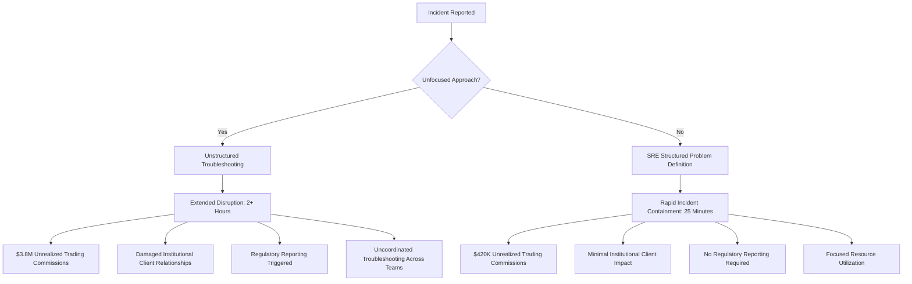

#### With the unfocused approach:
- Extended trading disruption lasting 2+ hours during market hours
- Approximately $3.8 million in unrealized trading commissions
- Damaged relationships with institutional clients who must route orders to competing platforms
- Regulatory reporting requirements triggered by the extended critical service disruption
- Resource drain as multiple teams are pulled from other work for uncoordinated troubleshooting

#### With the SRE evidence-based approach:
- Limited disruption resolved within 25 minutes
- Approximately $420,000 in unrealized trading commissions
- Minimal institutional client impact as most simply delay options trading briefly
- No regulatory reporting required for the brief, contained incident
- Focused resource utilization with only the necessary teams involved
### Implementation Guidance
To implement effective problem definition in your organization:

1. **Create a standardized problem definition template** with sections for symptoms (exact error messages, behaviors), scope (affected services, customers, transaction types), timing (start time, duration, patterns), and environmental context (recent changes, traffic patterns).

2. **Establish a "definition before action" protocol** requiring the template's completion before beginning log analysis, with escalation managers enforcing this discipline during incidents.

3. **Develop a multi-perspective gathering process** that collects observations from customer support (what users report), operations (what monitoring shows), and engineering (what recent changes might relate).

4. **Implement regular "definition reviews"** during extended incidents, where teams pause investigation to refine and validate the problem definition based on new evidence.

5. **Create a problem pattern library** documenting common issue signatures to accelerate accurate definition (e.g., "this error pattern typically indicates authentication chain issues").

6. **Build automated enrichment tools** that gather contextual information to support problem definition—recent deployments, configuration changes, traffic pattern shifts—without manual searching.

7. **Train teams on "symptom vs. cause" distinction** to ensure problem definitions describe observable issues rather than jumping to causal theories that narrow investigation prematurely.
## Panel 3: The Timeline Construction - Establishing the Factual Sequence
### Scene Description

A digital forensics-style investigation of a trading platform incident unfolds in a collaborative operations space. Large displays dominate the room, presenting a meticulously constructed timeline of the incident. This timeline is built from log timestamps collected across multiple systems, progressively refined to reveal the sequence of events. Key events are prominently marked:

- **Increased latency detected in market data feeds**
- **Authentication timeouts begin to occur**
- **Order submission failures are observed**
- **Complete platform unavailability ensues**

The timeline is color-coded to distinguish **confirmed facts** (e.g., verified log entries) from **assumptions** or **interpretations**. Engineers methodically analyze and add evidence as it's discovered, ensuring the timeline remains an evolving representation of the incident.

Below is a simplified text-based representation of the timeline progression and cascading failures:

```
[Market Data Latency ↑] --> [Authentication Timeouts] --> [Order Submission Failures] --> [Platform Unavailable]
     [Fact]                     [Fact]                          [Fact]                     [Fact]
       |                          |                               |                          |
  [Root Cause?]            [Cascading Effect]            [Cascading Effect]          [Final Symptom]
```

The team uses the timeline not just as a record but as a tool to trace cascading failures throughout the system. For example, they identify how delays in one service triggered downstream bottlenecks, culminating in complete platform failure. Instead of focusing solely on the final symptom reported by customers, the timeline helps establish clear cause-effect relationships.

This structured approach transforms a chaotic incident into a coherent narrative, enabling the team to focus on evidence-based troubleshooting and root cause analysis.
### Teaching Narrative
Timeline construction transforms isolated log entries into a coherent narrative that reveals cause-effect relationships. In banking systems where incidents often manifest as cascading failures across interconnected services, understanding the sequence of events becomes critical to identifying root causes rather than just symptoms. SRE methodology approaches timeline construction as a forensic discipline: collecting timestamp-based evidence from logs across all potentially relevant systems, organizing events in strict chronological order regardless of where they occurred, identifying correlation between events in different systems, distinguishing confirmed facts from assumptions or interpretations, and progressively refining the timeline as new information emerges. This chronological foundation enables critical analytical capabilities: distinguishing causes from effects by identifying which events preceded others, recognizing cascade patterns where failures in one system trigger issues in others, and correlating environmental changes (deployments, traffic patterns, batch processes) with the onset of problems. For financial platforms like trading systems, where milliseconds matter and complex interactions create non-obvious failure modes, this timeline discipline transforms troubleshooting from guesswork to evidence-based analysis. The resulting narrative doesn't just solve the immediate incident faster—it creates organizational learning about system behavior that improves future design and operation.
### Common Example of the Problem

A global bank's treasury management platform experiences a critical outage during end-of-day processing. The traditional investigation focuses exclusively on the most visible symptom: failed payment batch processing in the core banking system. Multiple teams spend hours examining core banking logs in isolation, finding numerous errors but no clear root cause. They eventually implement a workaround by restarting the payment processor and manually recovering transactions, resolving the immediate issue after four hours. However, the same failure recurs the following day because they never identified the actual trigger—treating only the final symptom rather than understanding the complete event sequence that led to it.

#### Sequence of Events Leading to the Incident

```mermaid
timeline
    title Incident Timeline: A Missed Root Cause Example
    section Day 1
    18:00: Batch process starts in core banking system: No issues detected
    18:05: Latency spike in upstream message queue: Unnoticed
    18:10: Timeout errors in treasury management service: Not investigated
    18:15: Payment batch processing failures: Symptom identified
    18:30: Core banking logs examined: Errors found but not root cause
    22:00: Workaround applied (payment processor restarted): Symptom resolved
    section Day 2
    18:00: Batch process starts in core banking system: No issues detected
    18:05: Latency spike in upstream message queue: Still unnoticed
    18:10: Timeout errors in treasury management service: Still uninvestigated
    18:15: Payment batch processing failures: Symptom recurs
```

This timeline illustrates how the investigation failed to connect the latency spike in the upstream message queue (the actual trigger) with the cascading failures that followed. By focusing solely on the final symptom, teams overlooked earlier events that could have revealed the root cause, leading to a repeat of the failure the next day. This underscores the importance of constructing a comprehensive timeline to capture the full sequence of events and uncover hidden dependencies.
### SRE Best Practice: Evidence-Based Investigation

The SRE approach begins by constructing a cross-system timeline spanning the 30 minutes before the visible failure. They methodically gather timestamped logs from all connected systems: authentication services, database clusters, messaging infrastructure, API gateways, and core banking components. By arranging these events chronologically, a clear cascade pattern emerges. Below is a text-based representation of the timeline, illustrating how events unfolded:

```
Timeline of Events:
[00:00] Scheduled report generation job starts.
[00:01] Database connection pool usage spikes due to the report job.
[00:03] Authentication service begins experiencing connection pool exhaustion.
[00:05] API gateways report increased response time due to authentication delays.
[00:07] Message queues start experiencing backpressure as API requests stall.
[00:10] Payment batch processing system reports timeouts due to queue buildup.
[00:15] Platform-wide latency increases; customer reports of unavailability begin.
```

This timeline reveals a clear sequence of cascading failures:

1. **Root Event**: The database connection pool exhaustion in the authentication service caused by the scheduled report job coinciding with peak end-of-day processing.
2. **Cascading Impact**: The connection pool issue propagated through the API layer, causing timeouts and backpressure in the messaging system.
3. **Final Symptom**: The payment batch processing failure, which led to platform-wide unavailability.

To visualize the causal links, the following Mermaid diagram represents the event flow:

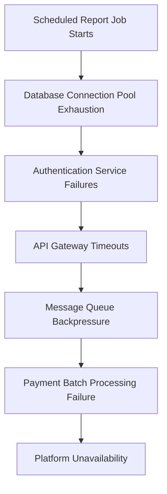

This comprehensive timeline and causal map identify the true root cause—insufficient connection pool capacity during overlapping batch operations—rather than focusing only on the final symptom. By adhering to this evidence-based methodology, the SRE team can resolve the incident effectively while uncovering systemic issues to prevent future occurrences.
### Banking Impact

The business impact difference between symptom-focused troubleshooting and timeline-based investigation is significant. The following table highlights key outcomes of each approach:

| **Criterion**                 | **Symptom-Focused Approach**                                | **Timeline-Based Investigation**                                 |
| ----------------------------- | ----------------------------------------------------------- | ---------------------------------------------------------------- |
| **Outages**                   | Repeated outages affecting multiple daily processing cycles | Single outage resolved with permanent fix after first occurrence |
| **Payment Settlement Delays** | ~$4.2 billion delayed across two days                       | Delays limited to one processing cycle                           |
| **Interest Penalties**        | ~$380,000 due to settlement delays                          | ~$120,000 due to minimized delays                                |
| **Manual Intervention**       | Significant, requiring after-hours staffing                 | Minimal manual intervention needed                               |
| **Customer Impact**           | Misreported cash positions to treasury clients              | Impact contained to a single reporting cycle                     |
| **Regulatory Scrutiny**       | Triggered by repeated critical service failures             | Reduced due to prompt permanent resolution                       |

By transitioning from a symptom-focused approach to a disciplined timeline-based investigation, financial institutions mitigate cascading failures more effectively, reduce operational costs, and minimize both customer impact and regulatory exposure.
### Implementation Guidance

To implement effective timeline construction in your organization, follow this actionable checklist:

#### Checklist for Effective Timeline Construction

1. **Centralized Timeline Tool**
   - Set up a centralized tool to collect and merge logs from multiple systems.
   - Normalize timestamps to a single standard (e.g., UTC) for accurate sequencing.

2. **Time-Window Analysis Before Symptom Onset**
   - Routinely examine logs from all relevant systems for at least 15-30 minutes preceding the first reported symptom.

3. **Visual Timeline Techniques**
   - Use collaborative tools to construct visual timelines, enabling team members to add events dynamically.
   - Employ color-coding for event types (e.g., errors, warnings, deployments, configuration changes).

4. **Fact vs. Interpretation Discipline**
   - Clearly distinguish between confirmed events and theoretical interpretations within the timeline.

5. **Cascade Pattern Recognition Training**
   - Train teams to recognize cascading failure patterns specific to your systems (e.g., database slowdowns → API timeouts → queue backups → processing failures).

6. **Correlation with Environmental Changes**
   - Implement practices to automatically detect and log system changes (deployments, configuration updates, scaling events) in the timeline.

7. **Regular Timeline Reviews**
   - During active incidents, schedule periodic reviews to collaboratively analyze chronological evidence and uncover cause-effect relationships.

8. **Post-Incident Timeline Archives**
   - Maintain archives of incident timelines to identify recurring patterns across incidents and support long-term learning.

---

#### Example Workflow for Using the Checklist

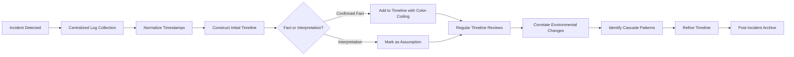

By following this structured checklist and workflow, teams can transform timeline construction into a disciplined, repeatable process that enhances incident response and fosters organizational learning.
## Panel 4: The System Mapping - Visualizing the Transaction Flow
### Scene Description

A banking platform architecture room where engineers develop a system map during a customer onboarding incident. The process begins with a simplified sketch of components involved in the customer journey, showing key systems like authentication, identity verification, fraud detection, and payment processing. This initial diagram serves as the foundation for iterative refinement.

As the investigation progresses, the engineers progressively enhance the map with detailed connection points, data flows, and dependency relationships. Log evidence reveals the transaction path, allowing them to annotate the map with the health status of each component:

- **Green**: Known-good systems (successfully logged transactions).
- **Red**: Problem areas (error logs).
- **Yellow**: Unknown status (insufficient logging).

Below is a conceptual example of the system map's evolution during the incident:

```mermaid
graph TB
    subgraph Initial Sketch
        A[Customer] -->|Onboarding Request| B[Authentication]
        B --> C[Identity Verification]
        C --> D[Core Banking]
        D --> E[Payment Gateway]
    end

    subgraph Enhanced Map with Annotations
        A1[Customer] -->|Onboarding Request| B1[Authentication]
        B1 -->|Success| C1[Identity Verification]
        C1:::problem -->|Error| D1[Core Banking]
        D1 -->|Pending| E1[Payment Gateway]
    end

    style B1 fill:#9fdf9f,stroke:#000,stroke-width:2px
    style C1 fill:#ff9999,stroke:#000,stroke-width:2px
    style D1 fill:#fff5ba,stroke:#000,stroke-width:2px
    style E1 fill:#fff5ba,stroke:#000,stroke-width:2px
```

This visual representation immediately focuses the investigation on the identity verification service (annotated in red), which is showing errors, rather than the downstream systems experiencing cascading effects most visible to customers. By iteratively refining the map, the team can clarify the relationships between systems, identify observability gaps, and prioritize remediation efforts effectively.
### Teaching Narrative
System mapping provides critical context for log analysis by visualizing the environmental relationships that raw logs often obscure. In complex banking architectures spanning dozens of interconnected services, understanding how components relate to each other is essential for effective troubleshooting. SRE methodology approaches system mapping as an iterative process during investigation: starting with a high-level diagram of the transaction flow related to the incident, progressively adding detail as understanding improves, mapping log evidence to specific components and interfaces, and visually distinguishing healthy components from problematic ones based on log data. This visual approach delivers several advantages over text-based analysis alone: immediately highlighting gaps in observability where logging is insufficient, revealing potential failure points at interface boundaries between systems, identifying unexpected dependencies not obvious in individual logs, and creating shared understanding across team members with different system knowledge. For banking platforms where transactions flow through numerous specialized systems (authentication, fraud detection, core banking, payment gateways), this mapping transforms abstract logs into a concrete representation of the customer experience journey. The resulting visualization doesn't just accelerate current incident resolution—it identifies observability gaps to address and architectural vulnerabilities to remediate, improving future reliability.
### Common Example of the Problem

A retail bank's digital mortgage application platform experiences elevated abandonment rates, with customers reporting they cannot complete the income verification step. Traditional troubleshooting begins with fragmented analysis: the web team reviews frontend logs, the application team examines their services, and the core banking team checks account systems. Each group finds some errors in isolation but struggles to connect them without understanding the complete transaction flow. After three hours, they've identified dozens of potential issues across various components but cannot determine which ones actually contribute to the customer-facing problem versus being unrelated background errors. Meantime, the bank continues losing mortgage applications worth millions in potential revenue.

#### Comparison of Approaches

| **Aspect**                      | **Fragmented Troubleshooting**                                                                 | **System Mapping Approach**                                                                                         |
| ------------------------------- | ---------------------------------------------------------------------------------------------- | ------------------------------------------------------------------------------------------------------------------- |
| **Initial Focus**               | Teams analyze logs independently in their respective domains.                                  | Teams collaboratively map the transaction flow, starting with a high-level system sketch.                           |
| **Cross-Team Coordination**     | Limited, leading to siloed efforts and incomplete understanding.                               | High collaboration, with shared visualization fostering common understanding.                                       |
| **Error Context**               | Errors are examined in isolation, making root cause unclear.                                   | Errors are visualized in the context of the entire transaction flow, clarifying dependencies and cascading impacts. |
| **Time to Identify Root Cause** | Hours to locate the problematic component due to scattered analysis.                           | Significantly reduced as the map highlights problematic areas early based on log evidence.                          |
| **Observability Gaps**          | Often unnoticed due to lack of systemic perspective.                                           | Immediately visible as unmapped or yellow (unknown) areas in the diagram.                                           |
| **Outcome**                     | Partial understanding of the issue after hours, with potential for misidentifying root causes. | Faster identification of the root cause, enabling quicker resolution and prevention of future issues.               |

#### Timeline of Troubleshooting

```mermaid
gantt
    title Troubleshooting Timeline: Fragmented vs. System Mapping
    dateFormat  HH:mm
    section Fragmented Troubleshooting
    Start Analysis               :done, a1, 00:00, 30min
    Isolated Log Review          :done, a2, after a1, 1h
    Cross-Team Discussions       :crit, a3, after a2, 1h
    Root Cause Still Unclear     :crit, a4, after a3, 30min
    section System Mapping
    Start System Mapping         :done, b1, 00:00, 30min
    Map Iteration with Logs      :done, b2, after b1, 30min
    Problematic Component Found  :done, b3, after b2, 30min
    Root Cause Identified        :done, b4, after b3, 30min
```

By contrasting these approaches, it becomes clear that system mapping not only accelerates troubleshooting but also builds a more comprehensive understanding of the issue, minimizing disruptions and revenue loss.
### SRE Best Practice: Evidence-Based Investigation

The SRE approach begins by creating a visual system map of the entire mortgage application journey: starting with the web frontend, flowing through the application orchestration layer, connecting to multiple verification services (identity, credit, income, property), and ultimately to document generation and submission systems. This map provides a high-level view of how the transaction flows through the system and serves as the foundation for evidence-based investigation.

To illustrate, consider the following simplified system map for the mortgage application journey:

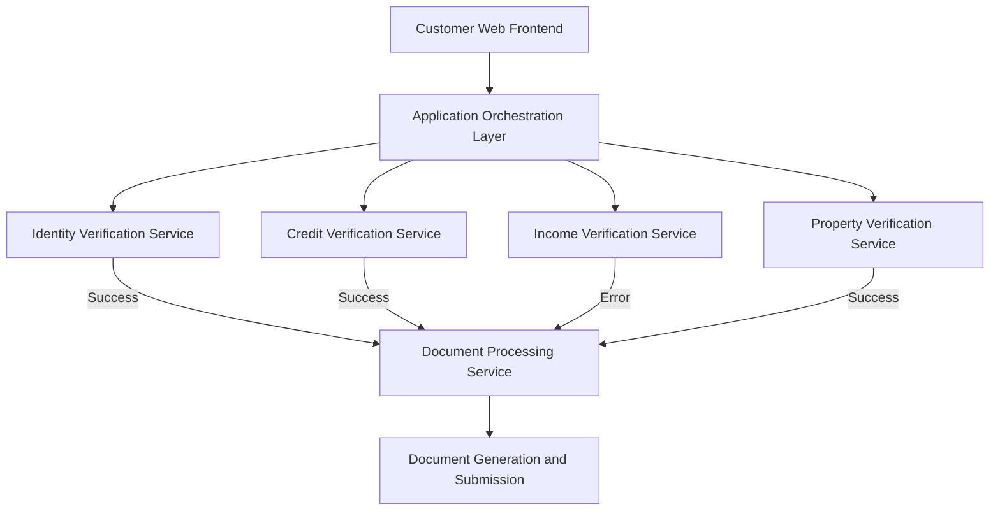

In this map:
- **Green paths** represent successful transaction steps (e.g., identity, credit, and property verification services).
- **Red paths** highlight where errors occur (e.g., income verification service).
- **Yellow annotations** (not shown here) could indicate missing or insufficient logging in specific components or interfaces.

As logs from each component are examined, the system map is annotated with status information: successful steps in green, errors in red, and missing or insufficient logging in yellow. In this example, the visualization quickly reveals that while customers experience failures at the income verification UI step, the actual errors originate in the document processing service that receives verification documents. The map shows that identity and credit verification complete successfully, but document classification is failing specifically for income verification documents, with errors then propagating back through the transaction flow.

This visual approach immediately focuses the investigation on the document processing component rather than the customer-facing symptoms. By iteratively refining the system map with log evidence, the team identifies the root cause more efficiently and gains insights into both observability gaps and architectural vulnerabilities to address for improved reliability in the future.
### Banking Impact

The business impact difference between fragmented analysis and the system mapping approach is significant. The following table provides a side-by-side comparison of key metrics to highlight these differences:

| Metric                        | Fragmented Analysis                             | System Mapping Approach             |
| ----------------------------- | ----------------------------------------------- | ----------------------------------- |
| **Resolution Time**           | 3+ hours during peak application hours          | 40 minutes                          |
| **Abandoned Applications**    | ~215 abandoned mortgage applications            | ~30 abandoned mortgage applications |
| **Potential Loan Value Lost** | ~$64 million                                    | ~$9 million                         |
| **Revenue Impact**            | ~$1.2 million in lost origination fees          | ~$170,000 in lost origination fees  |
| **Conversion Rate Impact**    | Decreased, affecting quarterly mortgage targets | Minimal impact on quarterly targets |
| **Customer Experience**       | Frustration leading to lower Net Promoter Score | Recoverable with follow-up outreach |

This comparison underscores how system mapping not only accelerates resolution but also significantly reduces customer impact, revenue losses, and operational disruption. By transforming fragmented log analysis into a cohesive visualization of the transaction flow, teams can swiftly isolate problem areas, mitigate cascading failures, and preserve customer trust during critical incidents.
### Implementation Guidance
To implement effective system mapping in your organization:

1. **Create baseline architecture maps** for critical transaction flows, documenting the expected components, interfaces, and dependencies involved in normal processing.

2. **Develop a standard visual language** for incident mapping with consistent symbols for different component types, interface mechanisms, and health status indicators.

3. **Implement collaborative visualization tools** that allow multiple team members to contribute to map development during incidents, with real-time updates as new information emerges.

4. **Establish regular "map validation" checkpoints** during incidents, where teams verify mapping accuracy and completeness based on available evidence.

5. **Train teams on "transaction flow thinking"** to focus on complete customer journeys rather than isolated components, with emphasis on following transactions across system boundaries.

6. **Build observability overlays** that can automatically project monitoring data onto system maps, showing real-time health indicators for each component.

7. **Create post-incident processes** that update baseline architecture maps based on discoveries during investigations, ensuring documentation remains current for future incidents.
## Panel 5: The Signal Extraction - Finding Patterns in Log Noise
### Scene Description

A financial data analytics lab where SREs apply advanced filtering techniques to massive log volumes from a credit card processing platform. Screens display progressive refinement of millions of log entries, represented as the following pipeline:

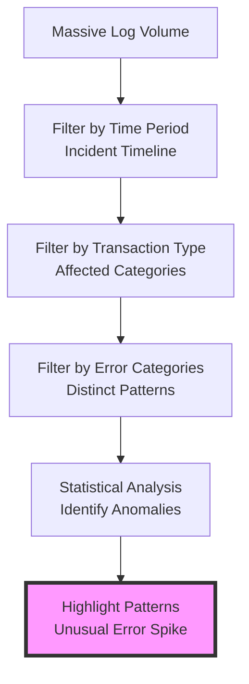

At each stage, irrelevant data is systematically removed, leaving behind actionable insights. For example, the final stage of analysis reveals a significant anomaly: an unusual error spike occurring exclusively for high-value international transactions processed through a specific payment gateway. Visualizations on the lab screens compare normal processing patterns with this anomalous behavior, showcasing how advanced filtering techniques uncover patterns that would remain hidden with simple keyword searching.
### Teaching Narrative

Signal extraction transforms overwhelming log volumes into actionable patterns by systematically separating relevant information from background noise. Banking systems generate millions of log entries daily—finding the critical signals that explain an incident requires methodical filtering and pattern recognition. SRE methodology approaches this challenge through progressive refinement, applying techniques that go beyond simple keyword searching to identify systemic patterns.

#### Step-by-Step Signal Extraction Process:
1. **Time-Based Filtering**
   - Align log analysis with the incident timeline to reduce the data set to relevant time periods.

2. **Define the Scope**
   - Narrow the focus based on key parameters:
     - Affected transaction types (e.g., high-value, international).
     - Channels or regions involved.
     - Specific payment gateways or subsystems.

3. **Isolate Error Patterns**
   - Identify error patterns distinct from normal operation:
     - Categorize errors into actionable groups.
     - Exclude expected errors (e.g., card declines, insufficient funds).

4. **Compare Against Historical Baselines**
   - Analyze how current behavior deviates from historical norms:
     - Look for anomalies in frequency, scale, or distribution.
     - Highlight uncommon patterns that indicate systemic issues.

5. **Apply Statistical Analysis**
   - Use statistical techniques to uncover hidden correlations or trends:
     - Detect temporal patterns (e.g., errors peaking during load spikes).
     - Identify relationships with environmental factors (e.g., dependencies, scaling events).

6. **Identify Systemic Patterns**
   - Move beyond individual error messages to reveal root causes:
     - Examine error distributions across transaction attributes.
     - Look for subtle precursors that signal impending failures.

#### Checklist for Effective Signal Extraction:
- [ ] Have you aligned log filtering with the incident timeline?
- [ ] Did you define the scope using clear problem parameters (transaction types, regions, channels)?
- [ ] Are error patterns categorized and separated from expected noise?
- [ ] Have you compared current behavior to historical baselines?
- [ ] Did you apply statistical methods to uncover non-obvious patterns?
- [ ] Have systemic patterns and root causes been identified, rather than isolated symptoms?

By following this structured process, SREs can transform troubleshooting from manual log inspection into a comprehensive system analysis. The goal is not just to find errors, but to extract insights that enable a deeper understanding of system behavior and root cause identification.
### Common Example of the Problem

A major credit card issuer experiences elevated decline rates during peak shopping hours. Traditional analysis begins with generic searches for "declined" or "failure" across processing logs, yielding hundreds of thousands of results—as thousands of legitimate declines occur normally each hour alongside the problematic ones. Analysts spend hours manually reviewing samples of these declines, struggling to identify meaningful patterns among overwhelming noise. They eventually resort to crude volume analysis showing overall increased declines, but cannot identify specific characteristics of the problematic transactions versus normal declines. After four hours, they implement broadly applied capacity increases across all processing components—an expensive overreaction that addresses symptoms without targeting the root cause.

#### Traditional Log Analysis vs. Signal Extraction Approach

```mermaid
flowchart TD
    A[Start: Elevated Decline Rates Detected] -->|Traditional Approach| B[Search Logs for "declined"/"failure"]
    B --> C[Return Hundreds of Thousands of Results]
    C --> D[Manually Sample Declines]
    D --> E[Struggle to Identify Patterns]
    E --> F[Perform Crude Volume Analysis]
    F --> G[Implement Broad Capacity Increase]
    G --> H[Symptoms Mitigated, Root Cause Unresolved]

    A -->|Signal Extraction Approach| I[Filter Logs by Incident Timeframe]
    I --> J[Narrow by Affected Transaction Types]
    J --> K[Isolate Errors by Transaction Attributes]
    K --> L[Apply Statistical and Historical Analysis]
    L --> M[Identify Root Cause: High-Value International Transactions via Specific Gateway]
    M --> N[Implement Targeted Fix]
    N --> O[Resolve Incident Efficiently]
```

The traditional approach emphasizes broad searches and manual analysis, leading to inefficiencies and overcorrection. In contrast, the signal extraction methodology systematically reduces noise by filtering logs based on relevant criteria, applying advanced pattern recognition techniques, and focusing on root cause identification. This approach not only resolves the issue more efficiently but also prevents unnecessary costs and resource usage.
### SRE Best Practice: Evidence-Based Investigation
The SRE approach applies systematic signal extraction to the same problem. They begin with temporal filtering, comparing decline rates during the incident window against historical baselines for the same time period, revealing a 34% increase above normal patterns. They add transaction attribute filtering, segmenting declines by card type, merchant category, transaction amount, and geography. This multi-dimensional analysis reveals a clear pattern invisible in aggregate data: declines are elevated specifically for contactless payments above $100 at merchants using a particular payment terminal type in the northeastern region. Further refinement shows these transactions all share a specific authorization path through a regional processing node. Log pattern analysis of these filtered transactions reveals timing anomalies where authorization requests timeout rather than receiving explicit declines. This progressive signal extraction identifies the precise issue: a capacity limitation in the high-value contactless authorization service for a specific region and terminal type.
### Banking Impact

The business impact difference between generalized analysis and the signal extraction approach is substantial. The table below summarizes the key differences:

| **Metric**                   | **Generalized Analysis**                                         | **Signal Extraction Approach**                      |
| ---------------------------- | ---------------------------------------------------------------- | --------------------------------------------------- |
| **Resolution Time**          | 4+ hours during holiday shopping peak                            | 50 minutes                                          |
| **Lost Transaction Volume**  | ~$14.2 million                                                   | ~$3.1 million                                       |
| **Lost Interchange Revenue** | ~$320,000                                                        | ~$70,000                                            |
| **Customer Impact**          | High frustration, card abandonment, and switching to competitors | Minimal abandonment with targeted communication     |
| **Infrastructure Costs**     | Over-provisioned, ~$45,000 increase monthly                      | Precisely targeted, ~$4,000 increase monthly        |
| **Merchant Relationships**   | Damaged due to unexplained failures                              | Preserved with specific explanations and resolution |

By transitioning to a signal extraction approach, the organization reduces financial losses, improves customer satisfaction, optimizes infrastructure spending, and maintains strong merchant relationships. This shift transforms incident management outcomes, highlighting the operational and business advantages of systematic log analysis and pattern recognition.
### Implementation Guidance
To implement effective signal extraction in your organization:

1. **Create multi-dimensional filtering frameworks** that enable progressive refinement based on transaction attributes: type, amount, geography, channel, customer segment, and processing path.

2. **Implement baseline comparison capabilities** that automatically contrast current patterns against historical norms for the same time periods, revealing deviations that warrant investigation.

3. **Build pattern recognition dashboards** that visualize error distributions across different dimensions, making unusual clusters immediately visible.

4. **Develop statistical analysis tooling** that identifies significant correlations between error patterns and specific attributes that might not be obvious through manual review.

5. **Establish temporal pattern analysis** techniques that examine how error rates and distributions change over time during incident windows.

6. **Train teams on "signal vs. noise" differentiation** for your specific systems, with examples of normal background errors versus meaningful anomalies.

7. **Create progressive investigation protocols** that start with broader filters and systematically narrow focus based on emerging patterns, rather than attempting to analyze all error data simultaneously.
## Panel 6: The Hypothesis Testing - From Patterns to Validation
### Scene Description

A banking incident response room where SREs have transitioned from observation to experimentation. The environment is dynamic and collaborative, with key information prominently displayed on whiteboards. These whiteboards are divided into clear sections:

- **Hypotheses**: Clearly articulated theories about the root cause of a mobile banking authentication issue, such as "Certificate expiration affecting specific authentication flows."
- **Supporting Evidence**: Specific log entries or patterns tied to each hypothesis, like timestamps of failed authentication attempts or error codes.
- **Testing Activities**: A list of systematically designed tests, including traffic rerouting plans, log comparisons from redundant systems, and pre-production reproduction attempts.

The team gathers around, discussing and prioritizing hypotheses in real time. Below is a simplified representation of the process evolving in the room:

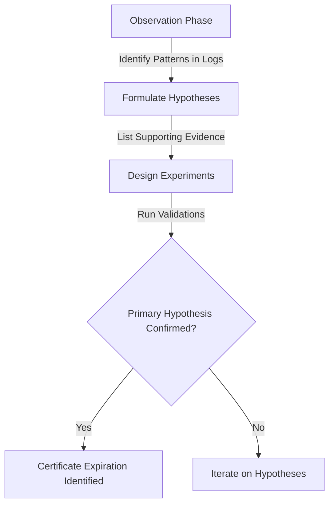

Team members work methodically to validate each hypothesis by:

1. **Temporarily rerouting traffic patterns** to isolate affected components.
2. **Examining logs** from redundant systems handling similar workloads to identify discrepancies.
3. **Analyzing behavior** across customer segments to pinpoint differences between affected and unaffected users.
4. **Reproducing the issue** in a controlled pre-production environment.

This active investigation transforms log analysis from passive observation to a systematic, experiment-driven process. Over time, the primary hypothesis—a certificate expiration impacting specific authentication flows—is confirmed, while several plausible alternatives are conclusively ruled out. The room reflects a disciplined approach, ensuring every step is grounded in evidence and collaboration.
### Teaching Narrative
Hypothesis testing transforms log analysis from passive observation to active investigation through deliberate experimentation and validation. After identifying patterns in logs, SRE methodology transitions to scientific hypothesis formulation and testing: developing clear, testable theories about root causes based on observed evidence, designing specific experiments or analyses to validate each hypothesis, establishing explicit criteria for confirmation or rejection, simultaneously considering multiple plausible explanations rather than anchoring on a single theory, and methodically eliminating possibilities through evidence rather than assumption. This approach prevents common troubleshooting pitfalls like confirmation bias (focusing only on evidence that supports initial theories) and premature conclusion (addressing symptoms without validating root causes). For banking systems where incidents may have multiple contributing factors, this disciplined approach ensures comprehensive understanding rather than superficial fixes. Effective hypothesis testing combines log analysis with active techniques: controlled reproduction attempts in test environments, A/B comparisons between affected and unaffected components, focused diagnostic logging temporarily enabled for specific components, and targeted configuration changes to validate behavioral theories. This experimental mindset transforms the SRE from passive log reader to active investigator—using logs as evidence in a systematic process that conclusively identifies root causes with confidence.
### Common Example of the Problem

A wealth management platform experiences intermittent client portfolio loading failures during market hours. Traditional troubleshooting approaches lead the team to jump immediately to the most obvious theory—database performance issues under load—after observing some database timeout errors in application logs. The troubleshooting process unfolds as follows:

```mermaid
gantt
    title Troubleshooting Sequence and Outcomes
    dateFormat  HH:mm
    section Observations
    Log analysis reveals database timeout errors  :done, 00:00, 00:30
    section Hypothesis 1: Database Issues
    Optimize database queries                    :active, h1, 00:30, 02:00
    Add indices                                  :done, after h1, 01:30
    Scale up database cluster (high cost)        :done, after h1, 02:00
    Result: No improvement in failures           :crit, milestone, 02:30
    section Hypothesis 2: Network Problems
    Reconfigure load balancers                   :active, h2, 02:30, 03:30
    Optimize connection management               :done, after h2, 01:00
    Result: No improvement in failures           :crit, milestone, 04:30
    section Discovery of Root Cause
    Chance observation of token validation issue :done, 04:30, 00:30
    Validate issue affecting specific clients    :done, after h2, 00:30
    Apply targeted fix                           :done, after h2, 01:00
    Result: Issue resolved                       :done, milestone, 05:30
```

This reactive approach costs the team over seven hours and significant resources, as they focus on implementing unvalidated changes based on assumptions. The actual issue—a problem with authentication token validation affecting specific client segments—was unrelated to their initial database and network theories. This inefficient process highlights the pitfalls of traditional troubleshooting: premature conclusions, lack of hypothesis validation, and failure to consider multiple plausible explanations. A structured hypothesis-testing framework could have identified the root cause much earlier, reducing both time and cost.
### SRE Best Practice: Evidence-Based Investigation

The SRE approach begins with pattern analysis that identifies several possible hypotheses: database performance issues, network connectivity problems, authentication service bottlenecks, or client-side rendering failures. Rather than immediately acting on any theory, they design specific validation tests for each: extracting performance metrics to correlate database load with failure patterns, comparing network behavior between successful and failed requests, analyzing authentication logs for token validation patterns, and examining client-side errors by affected user segments. This methodical testing quickly eliminates database and network theories while revealing strong evidence for the authentication hypothesis—failed requests correlate perfectly with token validation attempts for clients with portfolios above a certain size threshold. They confirm this theory through a controlled experiment: temporarily disabling an extra validation step for high-value portfolios, which immediately resolves all issues. Root cause is conclusively identified as a new security policy creating excessive token validation overhead specifically for high-value portfolios.

#### Evidence-Based Investigation Checklist

| **Hypothesis**                      | **Validation Test**                                                                | **Outcome**                                                                                   |
| ----------------------------------- | ---------------------------------------------------------------------------------- | --------------------------------------------------------------------------------------------- |
| Database performance issues         | Extract performance metrics to correlate database load with failure patterns       | No correlation found between database load and affected requests.                             |
| Network connectivity problems       | Compare network behavior between successful and failed requests                    | No significant network anomalies identified.                                                  |
| Authentication service bottlenecks  | Analyze authentication logs for token validation patterns                          | Failed requests correlate with token validation for high-value portfolio clients.             |
| Client-side rendering failures      | Examine client-side errors by affected user segments                               | No client-side errors identified for impacted users.                                          |
| Excessive token validation overhead | Temporarily disable extra validation step for high-value portfolios in test system | Issue resolved immediately, confirming root cause as excessive validation for specific users. |

#### Flow of Investigation

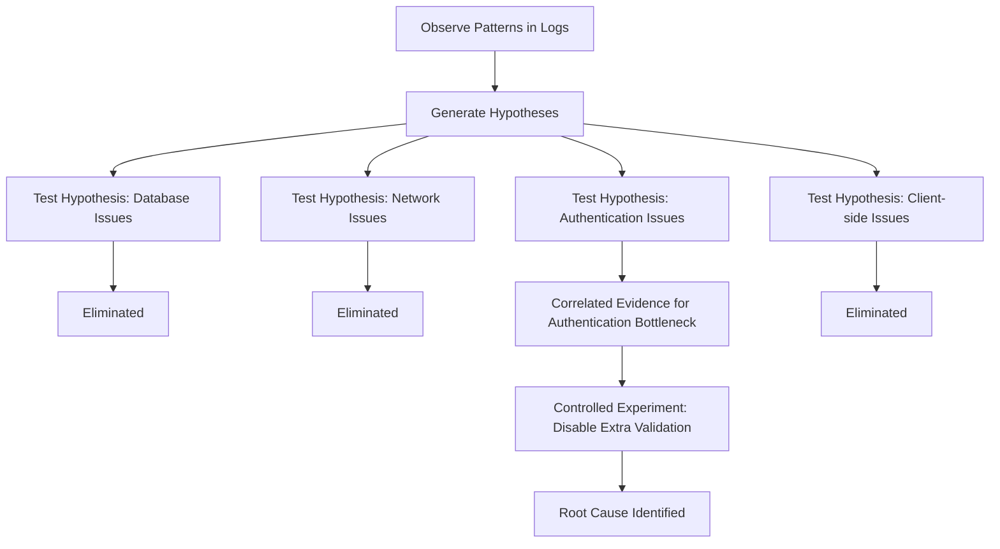

This checklist and flowchart encapsulate the systematic evidence-based approach, enabling SREs to methodically validate each hypothesis and conclusively identify the root cause. By structuring the investigation in this manner, the team avoids common pitfalls such as confirmation bias and premature conclusions, ensuring confidence in their findings.
### Banking Impact

The business impact difference between a theory-driven remediation approach and a hypothesis testing approach is substantial. The table below provides a side-by-side comparison, highlighting the outcomes of each approach:

| **Aspect**                          | **Theory-Driven Remediation**                                       | **Hypothesis Testing Approach**                           |
| ----------------------------------- | ------------------------------------------------------------------- | --------------------------------------------------------- |
| **Resolution Time**                 | Extended to 7+ hours during trading hours                           | Resolved within 75 minutes                                |
| **Infrastructure Changes**          | Unnecessary changes costing ~$25,000                                | No unnecessary changes                                    |
| **Ongoing Operational Costs**       | Increased costs of ~$8,000/month for unneeded database capacity     | No ongoing operational costs                              |
| **Affected High-Net-Worth Clients** | Approximately 240 clients unable to access portfolios               | Limited to ~35 clients                                    |
| **Lost Trading Commission Revenue** | Estimated $380,000 due to inaccessible portfolios                   | Impact contained to ~$45,000                              |
| **Client Relationship Impact**      | Damaged relationships with priority wealth management clients       | Minimal relationship impact                               |
| **Service Optimization**            | No targeted improvements; symptoms addressed without root cause fix | Properly targeted optimization of authentication services |

This comparison underscores the critical value of a disciplined hypothesis testing approach. By transitioning from assumptions to evidence-based investigation, teams can not only resolve incidents faster but also prevent unnecessary costs, minimize customer impact, and maintain trust with high-value clients.
### Implementation Guidance
To implement effective hypothesis testing in your organization:

1. **Create hypothesis documentation templates** that require clear articulation of each theory, supporting evidence, and specific criteria for validation or rejection.

2. **Establish a "multiple competing hypotheses" framework** where teams must develop at least 2-3 plausible explanations rather than anchoring on a single theory.

3. **Implement validation design practices** where specific tests are documented for each hypothesis before remediation actions are taken.

4. **Develop controlled experimentation capabilities** in production environments that allow safe testing of theories without customer impact (feature flags, traffic splitting, config toggles).

5. **Build A/B comparison analysis** techniques that systematically identify differences between working and non-working scenarios across multiple dimensions.

6. **Train teams on cognitive bias awareness**, specifically addressing confirmation bias, anchoring, and premature closure that commonly affect troubleshooting.

7. **Create "hypothesis review" checkpoints** during incidents where teams must present evidence for current theories and explain how alternative explanations have been ruled out.
## Panel 7: The Service-Level Perspective - Connecting Logs to Customer Experience
### Scene Description

A digital banking experience center showcases a real-time incident dashboard combining traditional technical metrics with customer journey analytics. The display is divided into split screens:

- **Left Screen:** Raw technical logs, such as error rates, latency metrics, and transaction failures.
- **Right Screen:** Customer impact visualizations, including:
  - Authentication error rates displayed as the percentage of affected login attempts.
  - Transaction failure metrics mapped to abandonment points along the customer journey.
  - Response time anomalies correlated with mobile app usage patterns.

Below the split screens, a **timeline visualization** connects technical issues to customer experience metrics. This timeline highlights when specific issues occurred, how they propagated, and their impact on key customer segments. For example:

```
Time --->   | API Latency Issue | Authentication Failures | Transaction Abandonments |
            |-------------------|-------------------------|--------------------------|
Customers   |     High-Value    |    Wealth Management    |        Casual Users      |
            |-------------------|-------------------------|--------------------------|
Impact      |    Delayed Large  |   Blocked Transfers     |     Session Timeouts     |
            |     Transfers     |                         |                          |
```

Specialists analyze these visualizations collaboratively, focusing on both technical failures and their downstream effects on customers. This approach reveals insights such as how a seemingly minor API latency issue disproportionately impacts high-value customers during peak usage periods. The scene emphasizes the integration of technical troubleshooting with customer experience analysis, driving decisions that prioritize business-critical impacts.
### Teaching Narrative
Service-level perspective elevates log analysis from technical troubleshooting to customer experience understanding by connecting technical indicators to business impact. Traditional log analysis often focuses exclusively on technical errors without translating them into meaningful service-level implications. SRE methodology bridges this gap by explicitly connecting logs to customer experience: mapping technical errors to specific customer journey steps, quantifying impact in terms meaningful to the business (affected transactions, monetary value, customer segments), distinguishing between technical errors and actual customer impact, identifying experience degradation that might not trigger traditional error logging, and prioritizing investigation based on business impact rather than just technical severity. This perspective transformation is particularly valuable in banking, where technical issues have direct financial and experience implications. An authentication service showing a 1% error rate might seem minor technically, but further analysis might reveal those errors are concentrated in high-value wealth management customers attempting large transfers—transforming a "minor technical issue" into a critical business incident. By maintaining this dual perspective throughout investigation, SREs ensure they address the customer experience problem, not just the technical symptoms—establishing reliability engineering as a business discipline rather than purely a technical function.
### Common Example of the Problem

A major retail bank's mobile check deposit service experiences elevated error rates. Traditional analysis focuses exclusively on technical metrics, identifying a 3% increase in image processing errors—considered "minor" by technical standards. Engineers determine the issue affects the image recognition algorithm for certain check formats, implement a targeted fix after several hours, and close the incident as resolved with minimal concern. However, they failed to account for the broader business context.

The table below highlights the contrast between the technical-only approach and a service-level perspective:

| **Aspect**                    | **Technical-Only Approach**                                     | **Service-Level Perspective**                                                                                |
| ----------------------------- | --------------------------------------------------------------- | ------------------------------------------------------------------------------------------------------------ |
| **Error Rate**                | 3% increase in image processing errors, deemed minor            | 3% error rate translates to 42% of high-value business banking deposits being impacted                       |
| **Customer Segment Impacted** | Not evaluated—focus on aggregate error metrics                  | Business banking customers depositing checks over $10,000 during month-end operations                        |
| **Business Impact**           | Viewed as a minor technical glitch with no broader implications | Significant cash flow disruptions for commercial clients, risking customer dissatisfaction and loss of trust |
| **Incident Priority**         | Low—addressed after several hours with minimal urgency          | High—critical for maintaining business client relationships and mitigating financial risks                   |
| **Resolution Success**        | Fix deployed, incident closed                                   | Fix deployed, but customer experience damage already occurred due to delayed prioritization                  |

This disconnect between technical analysis and business impact led to inappropriate prioritization and customer experience damage. While the technical issue was resolved, the lack of a service-level perspective meant the broader customer and business implications were overlooked, ultimately turning a "minor" issue into a significant operational failure.
### SRE Best Practice: Evidence-Based Investigation

The SRE approach analyzes the same mobile deposit errors but maintains dual technical and customer perspectives throughout. Beyond identifying the 3% overall error rate, they segment the analysis by customer type, transaction value, and business impact. This service-level perspective immediately reveals the disproportionate impact on business banking customers and high-value transactions. They translate technical metrics into business terms: $4.2 million in delayed deposits affecting approximately 140 business clients during critical month-end operations. This understanding completely changes incident prioritization and response: elevating it from minor technical issue to critical business impact, implementing immediate workarounds for affected business clients, engaging account managers for proactive communication, and expediting technical resolution through emergency deployment processes. The resolution addresses both technical root cause and customer experience impact through a coordinated, business-aware approach.

#### Checklist: Steps for Evidence-Based Investigation

1. **Define the Problem**
   - Gather initial logs and metrics to identify the technical issue.
   - Frame the problem in terms of both technical symptoms and potential customer impact.

2. **Segment the Data**
   - Analyze the issue across customer types, transaction values, and business-critical segments.
   - Look for patterns to identify disproportionate impact on specific customer groups.

3. **Quantify Business Impact**
   - Translate technical metrics into business terms (e.g., affected revenue, delayed transactions, impacted users).
   - Use clear, quantifiable measures to prioritize the issue.

4. **Prioritize Based on Customer Experience**
   - Determine whether the issue affects high-value customers or critical business operations.
   - Adjust incident response prioritization according to the severity of customer impact.

5. **Implement Immediate Mitigations**
   - Deploy temporary workarounds to minimize customer disruption.
   - Engage relevant stakeholders (e.g., account managers) for proactive communication with affected customers.

6. **Resolve the Root Cause**
   - Investigate and address the technical root cause of the issue.
   - Validate that the resolution eliminates both the technical problem and customer experience degradation.

7. **Post-Incident Analysis**
   - Review the incident to identify areas for improvement in monitoring, customer impact mapping, and response processes.
   - Share learnings with teams to enhance future service-level investigations.

By following this checklist, SREs ensure a structured approach to evidence-based investigation that prioritizes customer experience while resolving technical issues. This methodology reinforces the role of reliability engineering as a bridge between technical operations and business outcomes.
### Banking Impact

The business impact difference between the technical-only and service-level perspectives is substantial. The following table summarizes the key distinctions:

| **Aspect**               | **Technical-Only Perspective**                                                            | **Service-Level Perspective**                                                    |
| ------------------------ | ----------------------------------------------------------------------------------------- | -------------------------------------------------------------------------------- |
| **Issue Perception**     | Viewed as a minor technical issue with low urgency                                        | Assessed as a critical business problem with high urgency                        |
| **Resolution Timeline**  | Standard resolution timeline                                                              | Accelerated resolution informed by business impact awareness                     |
| **Customer Handling**    | No special handling for high-value business clients                                       | Implementation of manual processing workarounds for critical business clients    |
| **Financial Impact**     | Approximately $4.2 million in delayed deposits for business clients                       | Minimal cash flow disruption through expedited manual processing                 |
| **Affected Customers**   | Cash flow disruption for approximately 140 business customers during month-end operations | Proactive outreach to affected clients through account managers                  |
| **Client Relationships** | Relationship damage with commercial banking clients                                       | Preserved business banking relationships through transparent communication       |
| **Communication**        | No proactive communication or mitigation for affected customers                           | Clear, proactive communication with customers to mitigate experience degradation |
| **Prioritization**       | Prioritized based on technical severity                                                   | Prioritized based on actual customer and business impact                         |

By adopting the service-level perspective, the organization ensures that technical issues are addressed not only as operational defects but also as potential customer experience failures. This approach safeguards client relationships, minimizes financial disruption, and reinforces reliability engineering as a business-critical discipline.
### Implementation Guidance
To implement effective service-level perspective in your organization:

1. **Create customer journey maps** for critical banking services that connect technical components to specific customer experience steps, enabling quick translation between technical errors and user impact.

2. **Implement impact segmentation analysis** capabilities that automatically categorize technical issues by customer type, transaction value, and business significance.

3. **Develop dual metrics dashboards** that display both technical indicators (error rates, response times) and business impact measures (affected revenue, customer segments, journey abandonment) side-by-side.

4. **Establish "business translation" practices** where technical incidents are explicitly described in business terms (e.g., "3% image processing errors affecting 42% of business client deposits with estimated value of $4.2M").

5. **Build prioritization frameworks** that incorporate customer impact dimensions alongside technical severity when determining incident response levels.

6. **Train technical teams on business context** for the services they support, ensuring engineers understand the customer and financial implications of technical components.

7. **Create cross-functional incident response teams** that include both technical engineers and customer experience specialists to maintain dual perspective throughout resolution.
## Panel 8: The Knowledge Capture - Turning Incidents into Organizational Learning
### Scene Description

A post-incident review session where an SRE team transforms their troubleshooting journey into structured knowledge. Rather than simply documenting the solution, they methodically capture their entire investigative process. The session is structured around the following key steps:

- **Problem Definition**: Clearly articulate the observed issue and its impact.
- **Timeline Construction**: Reconstruct the sequence of events leading up to the incident.
- **System Mapping**: Identify affected services, dependencies, and interactions.
- **Log Analysis**: Highlight key patterns and logs that revealed critical insights.
- **Hypotheses Testing**: Document tested theories and their outcomes.
- **Key Queries**: Capture specific queries that proved valuable during debugging.
- **Observability Gaps**: Note areas where logging or metrics were insufficient.

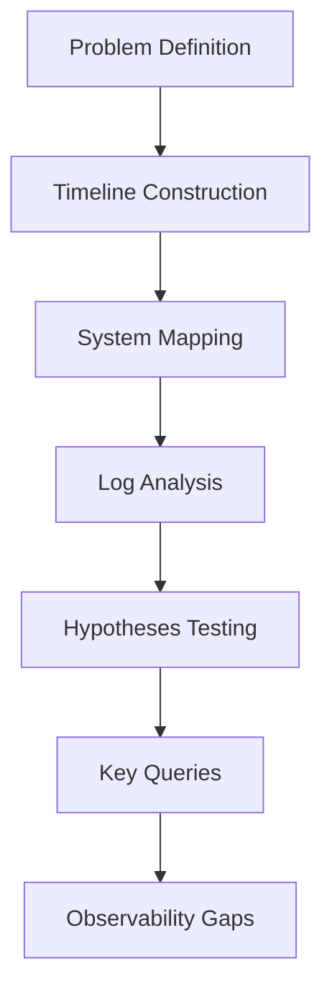

Engineers annotate log examples and queries for future reference, while also documenting observability gaps discovered during the investigation. The session concludes with specific action items to improve both system design and logging practices, turning a payment gateway incident into concrete reliability improvements.
### Teaching Narrative
Knowledge capture transforms individual troubleshooting successes into organizational capabilities by systematically preserving both solutions and investigative methods. Traditional incident approaches often focus solely on fixing the immediate problem, losing valuable insights discovered during investigation. SRE methodology emphasizes comprehensive knowledge capture: documenting the complete investigative journey rather than just the destination, preserving specific log patterns and queries that proved valuable, cataloging system behavior insights revealed during analysis, identifying observability gaps where logging was insufficient, and translating experience into concrete improvement actions for both system design and operational practices. This disciplined capture delivers several critical benefits: accelerating future troubleshooting by providing investigation patterns rather than just solutions, distributing expertise beyond individuals who participated in specific incidents, systematically addressing observability gaps revealed during incidents, and transforming reactive firefighting into proactive reliability improvement. For banking institutions where system stability directly impacts customer trust and business operations, this knowledge evolution represents a critical competitive advantage—continuously improving both technical systems and the organizational capability to maintain them. Effective knowledge capture doesn't just solve incidents faster—it progressively reduces their occurrence through systematic learning and improvement.
### Common Example of the Problem

A retail bank experiences a critical outage in their card authorization systems during peak shopping hours. After extensive troubleshooting, engineers identify a connection pool exhaustion issue triggered by a specific combination of transaction volume and timeout settings. They implement an immediate fix by increasing connection limits and restarting the affected systems, successfully resolving the incident. The traditional approach produces a brief post-incident report documenting the technical solution and basic timeline, which is filed away in the incident management system.

However, two months later, an almost identical issue occurs in a different but architecturally similar payment service. The new incident team spends hours rediscovering the same investigation path and solution pattern because the previous knowledge wasn't effectively captured or transferred—essentially solving the same problem twice and enduring another preventable outage.

| **Aspect**                      | **Traditional Approach**                                                      | **SRE Approach**                                                                                                |
| ------------------------------- | ----------------------------------------------------------------------------- | --------------------------------------------------------------------------------------------------------------- |
| **Incident Knowledge Captured** | Basic technical solution and timeline documented in a minimal report.         | Comprehensive documentation of the investigative journey, including system behavior, log patterns, and queries. |
| **Time to Resolve Recurrence**  | Hours spent rediscovering investigation steps and solutions.                  | Minimal time spent due to reusable knowledge and investigation patterns from prior incidents.                   |
| **Impact of Recurrence**        | Preventable outage occurs again, affecting customers and business operations. | Recurrence significantly reduced or avoided by addressing root causes and observability gaps.                   |
| **Observability Improvements**  | Rarely identified or addressed systematically.                                | Observability gaps cataloged and action items created to improve monitoring and logging capabilities.           |
| **Organizational Learning**     | Knowledge remains siloed with the incident team and is not disseminated.      | Knowledge shared across teams, enhancing collective expertise and accelerating future incident resolution.      |
| **Proactive Improvements**      | Limited to reactive fixes with no systemic changes implemented.               | Incident learnings translated into proactive reliability improvements for system design and operations.         |
### SRE Best Practice: Evidence-Based Investigation

The SRE approach handles the initial card authorization incident with the same technical resolution but follows with comprehensive knowledge capture. Beyond documenting the solution, they preserve the complete investigation methodology: the specific log queries that identified connection pool patterns, the system mapping that revealed dependencies between authorization components, the timeline analysis that connected the issue onset with traffic pattern changes, and the hypothesis testing process that confirmed connection pool configuration as the root cause. They also document three specific observability gaps: insufficient connection pool monitoring, inadequate logging of timeout cascades, and missing alerts for connection utilization thresholds. This knowledge is transformed into both immediate improvements for the affected system and a comprehensive design pattern applicable to all similar services.

When early warning signs appear in a different payment service two months later, engineers immediately recognize the pattern from the knowledge base and implement preventive measures before any customer impact occurs.

#### Knowledge Capture Checklist for Evidence-Based Investigation
To ensure comprehensive knowledge capture during incident reviews, use the following checklist:

- **Log Queries**: Record specific queries and log patterns that revealed critical insights (e.g., connection pool usage, error rates).
- **System Mapping**: Document system dependencies and interactions identified during investigation.
- **Timeline Analysis**: Construct a detailed timeline linking events, system behavior changes, and traffic patterns to the issue onset.
- **Hypotheses Tested**: List all hypotheses formulated, tested, and the methods used to confirm or eliminate them.
- **Observability Gaps**: Identify and document gaps in metrics, logging, or alerting (e.g., missing connection pool utilization thresholds).
- **Actionable Improvements**: Specify immediate fixes and broader design patterns for similar systems.
- **Lessons Learned**: Summarize key insights gained from the investigation for future reference.
- **Incident Pattern Recognition**: Catalog the incident pattern to facilitate faster recognition and resolution in similar future scenarios.

By following this systematic checklist, SRE teams can transform incident investigations into reusable organizational knowledge, enabling faster troubleshooting and fostering proactive reliability improvement.
### Banking Impact

The business impact difference between these approaches is substantial. Below is a comparison of the cascading effects of solution-only documentation versus comprehensive knowledge capture:

#### Solution-Only Documentation
```
+--------------------+      +-----------------------------+      
| Initial Incident   | ---> | Repeated Outage in Similar  |      
| Occurs             |      | System Two Months Later     |      
+--------------------+      +-----------------------------+      
                                   |                                  
                                   v                                  
                    +-----------------------------+                  
                    | $3.4M Lost Transaction      |                  
                    | Volume + Customer           |                  
                    | Experience Damage           |                  
                    +-----------------------------+                  
                                   |                                  
                                   v                                  
                    +-----------------------------+                  
                    | Engineering Resources       |                  
                    | Consumed Re-solving the     |                  
                    | Same Problem                |                  
                    +-----------------------------+                  
                                   |                                  
                                   v                                  
                    +-----------------------------+                  
                    | Public Reputation Impact    |                  
                    | + Increased Regulatory      |                  
                    | Scrutiny                    |                  
                    +-----------------------------+                  
```

#### Comprehensive Knowledge Capture
```
+--------------------+      +-----------------------------+      
| Initial Incident   | ---> | Proactive Remediation       |      
| Occurs             |      | Through Pattern Recognition |      
+--------------------+      +-----------------------------+      
                                   |                                  
                                   v                                  
                    +-----------------------------+                  
                    | Prevention of Repeated      |                  
                    | Outages                     |                  
                    +-----------------------------+                  
                                   |                                  
                                   v                                  
                    +-----------------------------+                  
                    | Customer Experience         |                  
                    | Protected                   |                  
                    +-----------------------------+                  
                                   |                                  
                                   v                                  
                    +-----------------------------+                  
                    | Engineering Resources       |                  
                    | Focused on New Challenges   |                  
                    +-----------------------------+                  
                                   |                                  
                                   v                                  
                    +-----------------------------+                  
                    | Reputation Preserved +      |                  
                    | Reduced Regulatory Concern  |                  
                    +-----------------------------+                  
```

#### Key Takeaways
- **Solution-Only Documentation** leads to repeated issues, financial losses, and reputational damage.
- **Comprehensive Knowledge Capture** prevents recurring problems, safeguards customer experience, and strengthens organizational resilience.
### Implementation Guidance
To implement effective knowledge capture in your organization:

1. **Create comprehensive incident documentation templates** that require preserving investigation methodology, not just technical solutions—including problem definition approach, system mapping, timeline analysis, and hypothesis testing steps.

2. **Implement a "query library"** that preserves specific log queries and analysis patterns that proved valuable during incident investigation, with annotations explaining their purpose and effectiveness.

3. **Establish an observability gap registry** where teams explicitly document logging and monitoring limitations discovered during incidents, with prioritized remediation plans.

4. **Develop pattern extraction practices** where incident responders must identify the generalizable lessons that could apply to other systems beyond the specific incident.

5. **Build a searchable knowledge repository** organizing insights by symptom patterns, architectural components, and investigation approaches rather than just incident categories.

6. **Create cross-team learning reviews** where incident knowledge is systematically shared with engineers responsible for similar systems that might face comparable issues.

7. **Implement "knowledge application" metrics** that track how effectively previous incident learnings are applied to prevent similar issues across the organization.
## Panel 9: The Tool-Enhanced Investigation - Beyond Manual Log Analysis
### Scene Description

A modern financial services operations center designed for enhanced log investigation, where SREs seamlessly integrate specialized tools to amplify their analytical capabilities. The operations center features a dynamic layout of visualization displays and collaborative workspaces, illustrating how these tools interconnect to streamline troubleshooting across complex systems.

#### Key Components:
- **Anomaly Detection Panel**: Highlights unusual error patterns in payment processing logs, using algorithms to automatically detect deviations from baseline behavior.
- **Correlation Dashboard**: Powered by machine learning models, this dashboard identifies performance issues crossing system boundaries, providing critical insights into subtle, large-scale relationships.
- **Transaction Path Visualizer**: Traces complex transaction flows across dozens of interdependent services, offering SREs an intuitive way to pinpoint bottlenecks and errors.
- **Automated Pattern Recognition Module**: Continuously scans system logs for emerging issues, flagging them before they escalate into customer-impacting incidents.
- **Historical Evolution Display**: A timeline-based dashboard that demonstrates the shift from manual log investigation to advanced tool-enhanced methodologies, emphasizing measurable improvements in resolution time and proactive detection.

#### Visual Representation:
Below is a simplified text diagram illustrating the interconnected setup of the operations center:

```
+------------------------+       +--------------------------+       +-------------------------+
| Anomaly Detection      |       | Correlation Dashboard    |       | Transaction Path Visualizer |
| Panel                 |<----->| (ML Models)             |<----->| (Service Flow Mapping)    |
+------------------------+       +--------------------------+       +-------------------------+
       ^                           ^                               ^
       |                           |                               |
       |                           +-------------------------------+
       |                                       |
+-----------------------+                +--------------------------+
| Pattern Recognition   |<--------------| Historical Evolution     |
| Module                |                | Display                 |
+-----------------------+                +--------------------------+
```

This interconnected system allows SREs to move seamlessly between tools, enhancing their ability to proactively identify, investigate, and resolve issues at scale. The visualization displays in the operations center not only facilitate faster problem-solving but also capture and evolve investigation patterns for future reuse, embodying the continuous improvement ethos critical in financial systems management.
### Teaching Narrative

Tool-enhanced investigation amplifies human analytical capabilities through specialized technologies designed for complex log analysis. While foundational troubleshooting methodology remains essential, modern SRE practices leverage advanced tooling to handle the scale and complexity of financial systems generating terabytes of log data daily. Effective tool augmentation includes several capability dimensions: anomaly detection identifying patterns that deviate from established baselines, visualization tools rendering complex relationships in intuitive formats, machine learning models recognizing subtle correlations across large datasets, automated timeline construction aligning events across distributed systems, and pattern matching capabilities that extend beyond simple keyword searching.

The most sophisticated implementations apply these tools throughout the incident lifecycle: proactively identifying potential issues through automated analysis, accelerating initial investigation through suggested starting points, enhancing human analysis with automated pattern recognition, and capturing investigation patterns for future reuse. For banking platforms handling millions of transactions across global infrastructure, these tools transform what's practically possible during troubleshooting—enabling analysis at scales beyond human capability while preserving the critical human judgment needed for complex financial systems. This augmented approach represents the evolution of log analysis from manual technique to sophisticated discipline combining human expertise with technological amplification.

#### Checklist: Key Tool Capabilities and Applications

- **Anomaly Detection**
  - Identify patterns that deviate from established baselines.
  - Highlight unusual error patterns in high-volume log data.

- **Visualization Tools**
  - Render complex system relationships in intuitive and interactive formats.
  - Trace transaction paths across distributed services.

- **Machine Learning Models**
  - Recognize subtle correlations across large, multi-dimensional datasets.
  - Correlate performance issues across system boundaries.

- **Automated Timeline Construction**
  - Align events chronologically across distributed systems.
  - Provide context for incident progression and root cause analysis.

- **Advanced Pattern Matching**
  - Extend beyond simple keyword searches with automated recognition of recurring log patterns.
  - Identify emerging issues proactively before customer impact.

- **Proactive Issue Detection**
  - Leverage automated analysis to identify potential system vulnerabilities.
  - Reduce mean time to detection (MTTD) for critical incidents.

- **Knowledge Capture and Reuse**
  - Record and replay investigation patterns for future incidents.
  - Build a repository of troubleshooting workflows for continuous improvement.

By integrating these capabilities, SREs can dramatically enhance their investigative efficiency and precision, ensuring that financial operations remain robust and reliable even at global scale.
### Common Example of the Problem

A global bank's fraud detection platform generates over 3 billion log entries daily across its distributed components. During a sophisticated fraud attack spanning multiple countries, traditional manual investigation proves overwhelming—analysts attempt to search through terabytes of logs using basic keywords and filters, but the attack patterns are too subtle and distributed to identify through manual techniques. Simple searches for "fraud" or "suspicious" yield millions of results that cannot be effectively reviewed manually, while the distributed nature of the attack with deliberately low transaction values keeps it below traditional alerting thresholds.

The following timeline illustrates the progression of the incident and the challenges faced during manual investigation:

```mermaid
gantt
    dateFormat  YYYY-MM-DD HH:mm
    title Fraud Attack Investigation Timeline

    section Fraud Activity
    Initial fraud transactions begin              :active, a1, 2023-06-01 08:00, 4h
    Fraud expands across multiple regions         :active, a2, 2023-06-01 12:00, 1d
    Fraudulent transactions continue undetected   :crit, a3, 2023-06-02 12:00, 36h

    section Manual Investigation
    Keyword searches initiated (e.g., "fraud")    :milestone, b1, 2023-06-02 12:00
    Analysts overwhelmed by high result volume    :crit, b2, 2023-06-02 14:00, 1d
    Distributed attack patterns remain undetected :crit, b3, 2023-06-03 14:00, 24h

    section Resolution
    Attack pattern identified after 3 days        :done, c1, 2023-06-04 14:00, 2h
    Significant financial damage already incurred :crit, c2, 2023-06-04 16:00, 0h
```

After three days of unsuccessful investigation and continued fraud losses, the team eventually identifies the pattern only after significant financial damage has occurred. The timeline highlights how manual techniques struggle to handle the scale, subtlety, and distributed nature of modern fraud attacks, underscoring the need for tool-enhanced investigation capabilities.
### SRE Best Practice: Evidence-Based Investigation

The tool-enhanced SRE approach leverages multiple specialized capabilities to address the challenges of complex investigations. For example, in a fraud investigation, these tools enable faster, more accurate identification of malicious patterns:

| Aspect                         | Manual Investigation                                                                                                  | Tool-Enhanced Investigation                                                                                                                                      |
| ------------------------------ | --------------------------------------------------------------------------------------------------------------------- | ---------------------------------------------------------------------------------------------------------------------------------------------------------------- |
| **Anomaly Detection**          | Relies on human intuition and manual searches to identify unusual patterns.                                           | Algorithms automatically detect deviations in authentication behavior, even when individual transactions appear normal.                                          |
| **Visualization**              | Requires manual aggregation and interpretation of logs, often limited to tabular or textual formats.                  | Specialized tools map transaction flows across services and geographical locations, revealing coordinated patterns invisible in isolated log analysis.           |
| **Pattern Recognition**        | Depends on individual expertise to recognize recurring elements or signatures in logs.                                | Machine learning models trained on historical fraud cases identify subtle signature elements, even when attackers attempt to evade detection.                    |
| **Correlation Across Systems** | Time-consuming and prone to human error when manually linking events across distributed systems.                      | Automated correlation identifies relationships between seemingly unrelated events, such as authentication, transaction processing, and withdrawals.              |
| **Speed of Investigation**     | Investigations may take days due to the manual effort involved in data aggregation, analysis, and hypothesis testing. | Tool-enhanced capabilities identify complete attack patterns within hours, dramatically reducing investigation time.                                             |
| **Knowledge Preservation**     | Relies on individual documentation practices, which are often inconsistent and may not be reusable.                   | Investigation platforms automatically capture and preserve identified patterns, enhancing future detection models and improving response capabilities over time. |

These tool-enhanced capabilities empower SREs to identify and address complex attack patterns with unprecedented speed and accuracy. For instance, coordinated account takeovers leading to distributed fraudulent transfers can be detected despite deliberate attempts to evade detection. By integrating anomaly detection, visualization, machine learning, automated correlation, and systematic pattern preservation, SRE teams transition investigations from reactive, manual techniques to a proactive, evidence-based discipline.
### Banking Impact
The business impact difference between these approaches is substantial:

With manual investigation:

- Extended detection time of 3+ days during active fraud attack
- Approximately $3.8 million in fraudulent transactions completed before pattern identification
- Significant manual effort from large analyst teams reviewing millions of log entries
- Limited pattern extraction for future prevention
- Regulatory reporting requirements triggered by significant fraud losses
- Reputational damage from widespread fraud affecting numerous customers

With tool-enhanced investigation:

- Pattern identification within 4 hours of attack initiation
- Fraud losses limited to approximately $340,000 before detection and blocking
- Efficient analyst utilization focused on pattern validation rather than manual discovery
- Comprehensive pattern capture improving future automated detection
- Reduced regulatory concerns through demonstration of effective detection capabilities
- Customer impact contained to a limited number of accounts with prompt resolution
### Implementation Guidance

To implement effective tool-enhanced investigation in your organization, follow these steps:

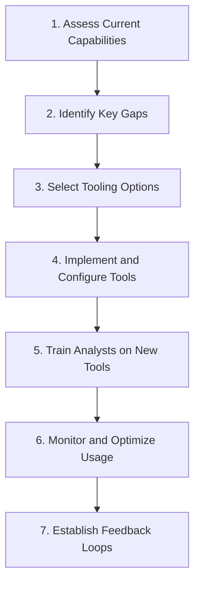

1. **Assess Current Capabilities**  
   Evaluate your existing log analysis workflows, tooling, and team expertise. Identify areas where manual processes are insufficient for handling scale, complexity, or speed requirements.

2. **Identify Key Gaps**  
   Pinpoint specific challenges (e.g., inability to detect anomalies, lack of visualization, or difficulty correlating events across systems). Prioritize gaps based on their impact on resolution times and proactive detection.

3. **Select Tooling Options**  
   Research and choose tools aligned to the identified gaps. Focus on platforms offering anomaly detection, machine learning-driven insights, advanced visualization, and automated correlation capabilities.

4. **Implement and Configure Tools**  
   Deploy selected tools and configure them to align with your systems, data pipelines, and operational needs. Ensure anomaly detection baselines and visualization parameters are tailored to your environment.

5. **Train Analysts on New Tools**  
   Develop structured training programs to help analysts effectively use the tools. Emphasize new capabilities like automated pattern recognition, investigation acceleration features, and advanced visualization techniques.

6. **Monitor and Optimize Usage**  
   Regularly review tool effectiveness through metrics such as reduced resolution times, increased proactive detection rates, and analyst adoption levels. Adjust configurations or processes as needed.

7. **Establish Feedback Loops**  
   Create mechanisms for capturing analyst insights and incident learnings to improve both tools and workflows. Build pattern libraries and refine machine learning models based on real-world usage.

By following this structured approach, your organization can effectively transition from manual log analysis to a tool-enhanced investigation framework, amplifying both speed and accuracy in troubleshooting.
## Panel 10: The Preventive Evolution - From Reactive to Proactive
### Scene Description

A banking reliability center illustrating the transformation from reactive troubleshooting to proactive prevention, supported by a timeline visualization of systematic log analysis evolution. The timeline highlights four distinct stages:

- **Reactive Investigation**: Responding to customer-reported incidents by analyzing logs to identify root causes after impact is experienced.
- **Early Detection**: Implementing monitoring to identify anomalies and issues early, reducing the time to detect potential problems.
- **Predictive Identification**: Leveraging pattern recognition in historical and real-time data to anticipate issues before they manifest.
- **Preventive Reliability**: Achieving fully automated remediation systems that proactively prevent customer impact and maintain seamless operations.

The timeline below conveys this progression:

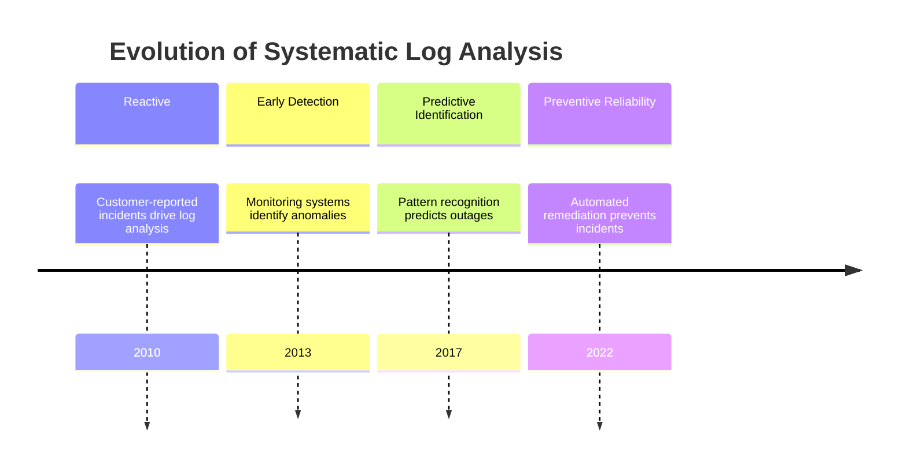

Current dashboards showcase how advanced systems automatically detect emerging patterns in authentication logs that have historically preceded outages. These systems adjust capacity and redirect traffic in real-time to prevent customer impact, enabling engineers to focus on addressing root causes rather than symptoms. Performance metrics prominently display dramatic improvements in customer experience, underscoring the organization's evolution from reacting to incidents to preventing them entirely.
### Teaching Narrative
The ultimate evolution of log-based troubleshooting is its transformation from reactive response to proactive prevention—a journey that fundamentally changes both technical systems and organizational posture. Mature SRE organizations evolve through distinct capability stages: starting with effective reactive investigation when incidents occur, advancing to early detection that identifies issues before significant customer impact, progressing to predictive capabilities that recognize patterns indicating future problems, and ultimately achieving preventive reliability through automated remediation and systemic improvement. This evolution requires integration of multiple disciplines: comprehensive logging providing the foundation for visibility, systematic analysis methodology establishing patterns and relationships, knowledge capture preserving insights for future use, and automated systems applying this intelligence to production operations. For financial institutions where system reliability directly impacts customer trust and business outcomes, this preventive capability delivers substantial competitive advantage: reducing outages and degradations that affect customer experience, limiting financial losses from transaction failures, improving regulatory compliance through operational stability, and freeing engineering resources to focus on innovation rather than firefighting. While reactive troubleshooting will always remain a necessary capability, the true measure of SRE maturity is how rarely it's needed—with logs evolving from troubleshooting tools to the intelligence foundation that prevents incidents before they impact customers.
### Common Example of the Problem

An investment bank's trading platform historically experiences 2-3 major outages quarterly, each lasting 1-2 hours and significantly impacting trading operations. The traditional approach follows a purely reactive cycle: waiting for outages to occur, responding with urgent troubleshooting, implementing immediate fixes, and then returning to normal operations until the next incident. While they eventually resolve each outage, the bank consistently experiences substantial financial and reputational damage from trading disruptions. Post-incident reviews focus primarily on specific technical fixes rather than systemic prevention, leaving the underlying reliability challenges unaddressed. This reactive cycle continues quarter after quarter, with similar patterns repeatedly causing customer impact despite successful resolution of individual incidents.

Below is a comparison of the reactive cycle versus the preventive approach to illustrate the shift in operational maturity:

| **Aspect**                 | **Reactive Cycle**                                          | **Preventive Approach**                                     |
| -------------------------- | ----------------------------------------------------------- | ----------------------------------------------------------- |
| **Trigger**                | Outages occur and are reported by customers.                | Emerging patterns in logs indicate potential future issues. |
| **Response Focus**         | Urgent troubleshooting to address symptoms.                 | Automated adjustments to mitigate risks before impact.      |
| **Resolution Speed**       | Hours or longer, depending on incident complexity.          | Often instantaneous through automated remediation.          |
| **Post-Incident Action**   | Fixes applied to the specific issue encountered.            | Root causes systematically addressed to prevent recurrence. |
| **Customer Impact**        | Significant disruptions to trading operations and trust.    | Minimal to no customer-facing impact.                       |
| **Organizational Outcome** | Repeated firefighting, diverting resources from innovation. | Freed resources for proactive improvements and innovation.  |

This table highlights how the preventive approach transforms incident handling from a cycle of recurring disruptions to a system of continuous reliability improvement, ultimately delivering better outcomes for both customers and the organization.
### SRE Best Practice: Evidence-Based Investigation

The SRE approach transforms the reactive cycle through a progressive evolution of reliability practices. This journey involves structured methodologies, data-driven insights, and automation to move from reactive responses to proactive prevention. Below is a practical checklist summarizing the key steps in this evolution, designed to aid organizations in applying these principles effectively:

#### Checklist: Evolution from Reactive to Preventive Practices

1. **Establish Comprehensive Logging and Visibility**
   - Implement detailed and centralized logging across systems.
   - Standardize log formats to facilitate consistent analysis.
   - Ensure logs capture sufficient context for root cause analysis.

2. **Adopt Structured Reactive Investigation**
   - Use systematic methods (e.g., causal analysis or 5 Whys) for incident investigation.
   - Identify and document root causes and contributing factors.
   - Capture post-incident knowledge in a shared repository for future reference.

3. **Enable Early Detection through Pattern Recognition**
   - Analyze historical incident data to identify recurring patterns.
   - Develop monitoring alerts based on early warning signs of degradation.
   - Implement dashboards to visualize emerging trends and anomalies.

4. **Develop Predictive Capabilities**
   - Leverage machine learning or statistical models to predict future issues from historical trends.
   - Correlate precursor patterns with potential failure scenarios.
   - Prioritize predictive models that deliver actionable insights for engineers.

5. **Achieve Preventive Reliability**
   - Automate remediation for common and well-understood failure patterns.
   - Address systemic weaknesses identified through trend analysis and incident reviews.
   - Design architectures with built-in resilience to prevent known failure modes.

6. **Continuously Measure and Improve**
   - Monitor performance metrics such as availability, mean time to resolution (MTTR), and customer impact.
   - Regularly review and refine detection, prediction, and prevention mechanisms.
   - Foster a culture of continuous learning and proactive improvement.

#### Progression Example: Banking Reliability Transformation
Over six quarters, a banking platform followed this evolution:
- Reduced quarterly major outages from 2-3 to zero.
- Achieved 99.98% availability with minimal customer impact.
  This transformation was driven not by faster responses to failures but by systematically preventing failures from occurring.

By following this checklist, SRE teams can build a robust foundation for evidence-based investigation and accelerate their journey from reactive troubleshooting to proactive prevention, ultimately delivering superior system reliability and customer experience.
### Banking Impact

The business impact difference between the reactive cycle and the preventive evolution is substantial. The table below highlights key metrics and outcomes for both approaches, showcasing the transformative benefits of moving towards preventive reliability:

| **Metric/Outcome**                  | **Reactive Cycle**                                                        | **Preventive Evolution**                                            |
| ----------------------------------- | ------------------------------------------------------------------------- | ------------------------------------------------------------------- |
| **System Availability**             | Frequent outages; 2-3 major incidents per quarter, each lasting 1-2 hours | Achieved 99.98% availability with minimal disruptions               |
| **Revenue Impact**                  | ~$2.8M in lost commission revenue per quarter due to trading disruptions  | Negligible revenue losses from disruptions                          |
| **Customer Confidence**             | Consistent frustration, leading to erosion of platform trust              | Enhanced confidence and reputation with reliable service            |
| **Engineering Resource Allocation** | Majority of resources dedicated to incident response                      | Resources redirected to feature innovation and systemic improvement |
| **Competitive Position**            | Clients frequently routing orders to more reliable platforms              | Competitive advantage from superior reliability                     |
| **Regulatory Scrutiny**             | Ongoing attention due to repeated service disruptions                     | Reduced scrutiny due to consistent operational stability            |

This comparison underscores the critical importance of evolving from reactive troubleshooting to preventive reliability. By reducing outages and improving service stability, financial institutions not only protect their revenue and reputation but also unlock engineering capacity for continuous innovation. This shift ultimately delivers a significant competitive advantage in a highly demanding market.
### Implementation Guidance
To implement preventive evolution in your organization:

1. **Create a reliability maturity roadmap** with clear progression stages from reactive excellence through early detection, prediction, and prevention, with specific capability requirements for each stage.

2. **Implement comprehensive pattern analysis** of historical incidents to identify common failure modes, precursor signals, and systemic weaknesses across the environment.

3. **Develop precursor monitoring** that automatically detects early warning signals identified from historical incident analysis before they progress to customer-impacting issues.

4. **Build automated remediation capabilities** for well-understood failure patterns, enabling systems to self-heal without human intervention for common issues.

5. **Establish feedback loops** between incident analysis and architectural planning, ensuring systemic weaknesses identified during incidents directly influence platform evolution.

6. **Create reliability metrics** that track the organization's progress from reactive to preventive, measuring both reactive capabilities (MTTR, incident resolution effectiveness) and preventive outcomes (reduction in incident frequency, early detection rates).

7. **Implement cultural reinforcement** that celebrates and rewards preventive excellence rather than focusing recognition primarily on heroic incident response, shifting organizational focus from "fixing problems quickly" to "preventing problems entirely."