# Chapter 8: Log-Based Alerting - From Reactive to Proactive

## Chapter Overview

Welcome to the log-based alerting revolution—where SREs finally stop playing whack-a-mole with CPU dashboards and start monitoring what actually matters: business outcomes. This chapter rips the “all systems green” blindfold off your ops team and drags them into the harsh light of customer reality. We’ll show you how log-based alerts, pattern recognition, and statistical baselines expose those silent failures your metrics have been quietly ignoring. We’re not just talking about catching server hiccups; we’re talking about preventing million-dollar trading errors, stopping fraud before it happens, and keeping your on-call engineers from rage-quitting due to alert spam. If you’re still living in a world where a 90% CPU spike is “critical” but a 15% transaction failure rate is “just a warning,” strap in. This isn’t monitoring for the faint of heart—it’s the blueprint for SREs who want to survive (and thrive) in the real world of digital banking and finance.

______________________________________________________________________

## Learning Objectives

- **Implement** log-based alerting focused on business outcomes, not just server metrics.
- **Detect** complex issues using log pattern recognition and multi-dimensional analysis.
- **Establish** statistical baselines to dynamically define “normal” in your environment.
- **Correlate** alerts directly to customer and revenue impact, not just technical severity.
- **Deploy** early warning systems that spot outages before your customers do.
- **Enrich** alerts with actionable context to slash response times and reduce guesswork.
- **Reduce** alert fatigue by prioritizing quality signals over noisy distractions.
- **Automate** remediation for well-understood issues so humans can focus on real problems.
- **Continuously refine** alerting using feedback loops and effectiveness metrics.
- **Integrate** logs, metrics, and traces for a unified, end-to-end view of your operations.

______________________________________________________________________

## Key Takeaways

- Traditional monitoring is a security blanket—warm, comforting, and absolutely useless for catching business-impacting failures.
- “All systems green” means nothing if customers can’t move their money. Log-based alerting puts you on the same page as the business (and the regulators watching over your shoulder).
- Pattern recognition isn’t just for fraudsters. If you’re not using it to catch coordinated attacks and subtle failures, you’re just waiting to be tomorrow’s headline.
- Static thresholds are for amateurs. If your error rate alert ignores market volatility, you’re either drowning in false positives or missing million-dollar screwups.
- Technical severity ≠ business impact. Stop treating “database warnings” like DEFCON 1 while real customer failures get a shrug.
- Early warning systems make the difference between “We fixed it before anyone noticed” and “Why are we trending on Twitter?”
- Enriched alerts are the adult version of notifications: all the context, none of the wild goose chases.
- If your on-call engineers are filtering alerts with their email rules, you don’t have an alerting system—you have an HR problem waiting to happen.
- Automation isn’t about replacing engineers; it’s about keeping them sane by letting scripts handle the mind-numbing stuff.
- Alerting is not a set-and-forget project. If you’re not refining, you’re regressing. Nothing ages faster than yesterday’s “perfect” thresholds.
- Siloed telemetry is a liability. Integrated observability is your insurance against finger-pointing, endless war rooms, and four-hour MTTRs.

> In short: log-based alerting is how you stop being a victim of your own dashboards and start running a business that works—for both the bottom line and your sanity. Welcome to the major leagues.

______________________________________________________________________

## Panel 1: The Alerting Evolution - Beyond Threshold Monitoring

### Scene Description

A banking operations center with two distinct monitoring approaches is vividly displayed, highlighting the evolution of alerting practices.

On one side, traditional dashboards dominate the view, showing basic threshold-based alerts for system metrics such as CPU utilization, memory consumption, and disk space. Despite these metrics appearing "green" and within expected thresholds, a critical issue in payment processing goes entirely unnoticed. This side represents the limitations of focusing solely on infrastructure-level indicators.

On the opposite side, a modern log-based alerting system takes center stage. Here, advanced pattern recognition in transaction logs has proactively detected and flagged the same payment processing issue. By analyzing error rates in payment authorizations and surfacing anomalies, the system provides early detection of the problem.

To emphasize the stark difference, customer satisfaction metrics are prominently displayed for both approaches:

- **Traditional Monitoring**: Customer satisfaction trends show a sharp decline, correlating with undetected transaction failures.
- **Log-Based Monitoring**: Customer satisfaction remains stable, as the issue was flagged and addressed early.

Below is a simplified visual representation contrasting the two approaches:

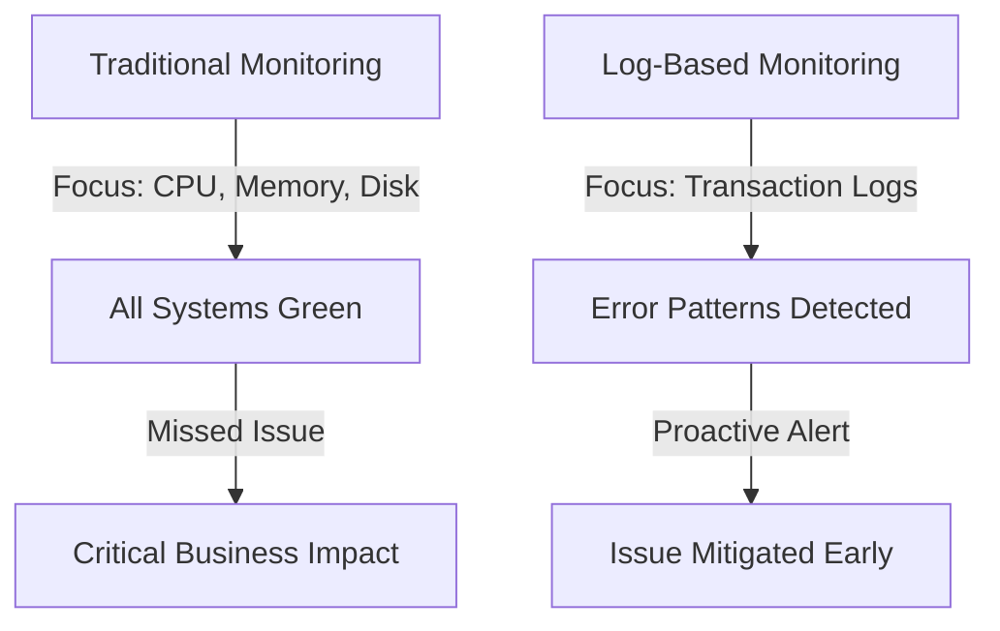

This scene illustrates the transformative power of shifting from infrastructure-focused monitoring to business-outcome monitoring, where the health of customer transactions becomes the central indicator of system performance.

### Teaching Narrative

Traditional monitoring has created a dangerous blind spot in banking systems by focusing primarily on infrastructure metrics rather than actual business outcomes. While CPU, memory, and disk space thresholds have value, they represent technical indicators several layers removed from what actually matters—successful customer transactions. This disconnect explains why operations teams are often caught by surprise when customers report problems despite "all systems green" on traditional dashboards. Log-based alerting represents a fundamental evolution that shifts focus from technical inputs to business outputs by directly analyzing the narrative of what's actually happening within your systems. Rather than inferring system health from resource consumption, log-based alerting examines the direct evidence of customer experience: transaction success rates, error patterns, processing times, and functional behavior. This paradigm shift transforms monitoring from a technical exercise into a business alignment function—connecting alerts directly to customer impact rather than technical thresholds. For financial institutions where transaction reliability directly affects both customer trust and revenue, this evolution from infrastructure-focused to business-outcome monitoring represents a critical capability for maintaining competitive customer experience.

### Common Example of the Problem

First National Bank's wealth management platform suffered a significant outage affecting high-value client transactions. Despite all monitoring dashboards showing "green" status for CPU, memory, and network metrics, clients were unable to execute trades for over 45 minutes. The operations team was completely unaware of the issue until client complaints reached the executive level. Post-incident analysis revealed that the authentication service was rejecting specific transaction types due to a certificate validation error. However, since the service itself remained responsive and resource utilization appeared normal, traditional monitoring detected nothing amiss. The technical components were "healthy" while the business function was completely broken.

#### Timeline of Events

```mermaid
timeline
    title Sequence of Events: First National Bank Outage
    09:00:00 System operating normally; all dashboards show "green" status.
    09:15:00 Authentication service begins rejecting specific transaction types due to a certificate validation error.
    09:25:00 Clients start experiencing issues executing high-value trades.
    09:40:00 Client complaints reach customer support teams.
    09:50:00 Escalation to executive level; operations team begins investigating.
    10:00:00 Root cause identified: certificate validation error in the authentication service.
    10:15:00 Issue resolved, transactions resume normal operation.
```

This timeline highlights the stark contrast between what traditional monitoring showed ("green" status) and the real-world customer impact. It demonstrates how relying solely on technical metrics can delay detection of critical business issues, leading to significant customer dissatisfaction and reputational risk.

### SRE Best Practice: Evidence-Based Investigation

Implementing log-based alerting provides direct visibility into actual customer experience rather than inferring it from technical metrics. SREs should establish log-based alerting that focuses on business outcomes through several key mechanisms. Use the following checklist to guide your implementation:

#### Checklist for Log-Based Alerting

1. **Transaction Success Rate Monitoring**

   - Analyze logs to calculate the percentage of successful versus failed transactions by type.
   - Set alerts based on deviations from historical baselines rather than fixed thresholds.
   - Prioritize transaction types critical to customer-facing operations.

2. **Error Pattern Detection**

   - Deploy pattern recognition to identify unusual error clusters or new error types in transaction logs.
   - Ensure the system can flag patterns even if their volume is below traditional alert thresholds.
   - Regularly update error detection algorithms to adapt to evolving application behavior.

3. **Business Journey Tracking**

   - Create synthetic monitors simulating complete customer journeys (e.g., login, account access, transaction execution).
   - Correlate individual component logs to detect disruptions impacting the end-to-end experience.
   - Alert on incomplete or failed synthetic transactions, even if underlying systems appear healthy.

4. **Response Time Analysis**

   - Use log timestamps to calculate performance baselines for different transaction types.
   - Alert on deviations that indicate degrading customer experience, especially when technical metrics (e.g., CPU, memory) remain normal.
   - Include latency thresholds tailored to specific business-critical operations.

5. **Correlation Analysis**

   - Implement alerting that identifies unusual relationships between different log patterns (e.g., increased authentication latency followed by specific transaction errors).
   - Cross-reference logs from related systems to uncover root causes of cascading failures.
   - Test correlation rules against historical incidents to validate effectiveness.

______________________________________________________________________

#### Benefits of Evidence-Based Investigation

Organizations adopting these log-based alerting practices have reported:

- Up to **70% improvement** in early detection of customer-impacting issues before they generate support calls or complaints.
- Enhanced alignment between system monitoring and customer experience metrics.
- Faster incident resolution by focusing investigations on direct evidence from logs rather than relying solely on technical metrics.

By implementing these practices, SRE teams can ensure their alerting systems are not just technically robust but also deeply aligned with business outcomes, enabling proactive and customer-centric operations.

### Banking Impact

The business consequences of relying solely on technical metrics rather than log-based business outcome monitoring are severe and direct. The table below summarizes key impacts, supported by relevant statistics:

| **Impact Area** | **Description** | **Supporting Data** |
| ----------------------- | --------------------------------------------------------------------------------------------------- | ---------------------------------------------------------------------------------------------------- |
| **Revenue Impact** | Undetected transaction failures directly result in lost revenue, especially in high-value services. | Each failed transaction in trading platforms or payment systems can cost between $50-$500 per event. |
| **Customer Attrition** | Customers are highly intolerant of repeated failures and lack of proactive communication. | 32% of customers consider switching providers after 2 failures; rises to 54% for premium customers. |
| **Reputation Damage** | Social media amplifies outages, damaging brand trust and increasing customer acquisition costs. | Negative brand sentiment increases by 15% on average after publicized outages lasting over 1 hour. |
| **Regulatory Scrutiny** | Regulators demand proactive monitoring of customer-facing services for compliance. | Non-compliance can lead to fines of up to $1M per incident for failing to meet monitoring standards. |
| **Operational Costs** | Reactive troubleshooting is significantly more resource-intensive than proactive monitoring. | Resolving customer-reported issues costs 3-5x more than early detection through log-based alerts. |

This breakdown highlights how traditional monitoring creates vulnerabilities that directly affect revenue, customer trust, brand reputation, and operational efficiency. By adopting log-based alerting systems, banks can mitigate these risks, ensuring alignment between technical operations and business outcomes.

### Implementation Guidance

To implement effective log-based alerting focused on business outcomes, follow these steps:

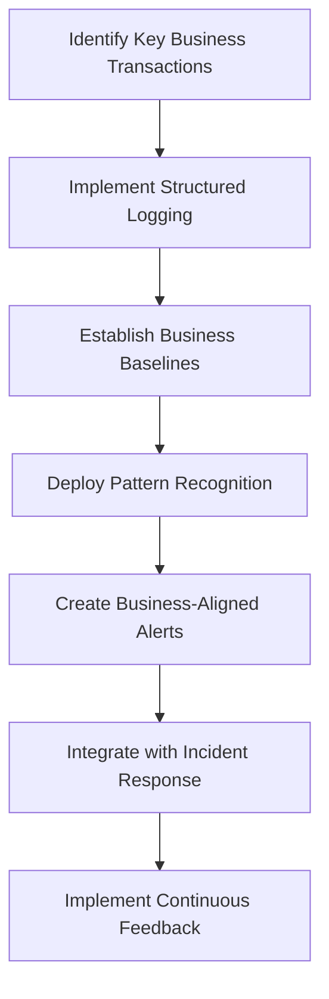

1. **Identify Key Business Transactions**: Collaborate with business stakeholders to determine the most critical customer journeys and transaction types that require monitoring. Focus on those with direct revenue or customer experience impact.

2. **Implement Structured Logging**: Ensure all critical systems produce structured logs with consistent formats. Include key details such as transaction types, status codes, response times, and customer segments to enable reliable analysis.

3. **Establish Business Baselines**: Use historical log data to create statistical baselines for normal success rates, error patterns, and performance metrics. Account for variations across transaction types and time periods.

4. **Deploy Pattern Recognition**: Utilize log analysis tools capable of identifying anomalies, unusual error patterns, and deviations from baseline behavior. These tools should go beyond simple threshold violations.

5. **Create Business-Aligned Alerts**: Configure alerts based on customer impact metrics derived from logs. For example, set alerts like "payment processing success rate below 99.9%" rather than "CPU utilization above 80%."

6. **Integrate with Incident Response**: Design log-based alerts to provide actionable context about affected business functions, transaction types, and customer segments. This accelerates troubleshooting and resolution.

7. **Implement Continuous Feedback**: Regularly review detected incidents against customer reports. Use these insights to refine and improve the effectiveness of log-based alerting over time.

## Panel 2: The Pattern Recognition Advantage - Finding What Matters

### Scene Description

A financial services security operations center where advanced log-based pattern detection has identified a subtle fraud attempt invisible to traditional monitoring. Screens display logs from authentication systems with seemingly normal overall metrics, but the pattern recognition engine has flagged an unusual sequence: multiple failed login attempts across different accounts from similar IP ranges, each below individual alerting thresholds but collectively revealing a coordinated credential stuffing attack. Security analysts review the automatically grouped evidence that would have been impossible to detect through simple threshold monitoring, implementing protective measures before any accounts are compromised.

Below is a simplified representation of the flagged pattern to illustrate how the detection unfolds:

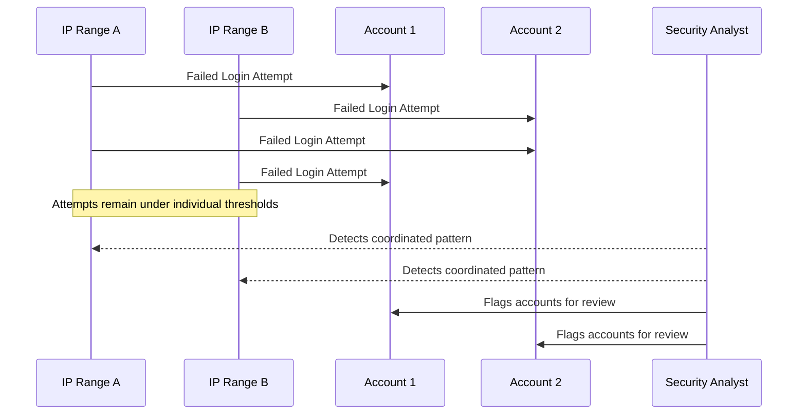

This diagram demonstrates how failed login attempts originating from similar IP ranges and targeting different accounts are individually innocuous but collectively form a suspicious pattern. The pattern recognition engine automatically identifies and groups these events, enabling analysts to act swiftly and prevent potential account compromise.

### Teaching Narrative

Pattern recognition transforms alerting from simplistic threshold violations to intelligent detection of meaningful behavioral signatures. Traditional alerting typically operates on a "threshold breach" model—alerting when individual metrics exceed predefined limits. While valuable for obvious failures, this approach misses complex patterns that indicate issues without breaching any single threshold.

Imagine searching for a needle in a haystack, but instead of looking for a single shiny object, you're identifying clusters of unusually aligned threads that suggest where the needle might be hiding. This is the essence of modern log-based alerting: sophisticated pattern recognition across multiple dimensions. Sequence patterns identify specific event chains that indicate problems, distribution patterns reveal unusual groupings or clusters in otherwise normal volumes, temporal patterns uncover subtle shifts in behavior over time, and correlation patterns connect events across different systems that collectively indicate issues.

In banking security operations, this capability often represents the difference between detection and compromise. Sophisticated attacks deliberately operate below individual alerting thresholds but create recognizable patterns when properly analyzed. For example, a credential stuffing attack might involve login attempts that appear normal in isolation but reveal clear patterns when analyzed collectively across IP addresses, geographic regions, and account types. Similarly, transaction fraud often follows subtle patterns invisible to threshold monitoring but detectable through proper pattern analysis.

This approach doesn't just improve security—it fundamentally changes what's possible in proactive risk management. By identifying subtle behavioral signatures early, organizations can detect and respond to threats before they create a business impact, transforming reactive alerting into proactive defense.

### Common Example of the Problem

Metropolitan Commercial Bank's online banking platform experienced a sophisticated attack that went undetected by traditional security monitoring. Attackers carefully orchestrated login attempts across hundreds of customer accounts, ensuring that each individual account received fewer than three failed attempts (below the standard alerting threshold), and distributing attempts across multiple IP addresses to avoid source-based blocking. Each individual attempt appeared legitimate in isolation, and aggregate failure rates remained within normal parameters. The attack continued for eight days before a customer reported unauthorized transfers, ultimately resulting in fraudulent transactions totaling $1.2 million across 23 compromised accounts.

#### Checklist: Key Indicators of Similar Attacks

- **Distributed Login Attempts**: Multiple login attempts spread across a wide range of accounts within the system.
- **Low Failure Rates Per Account**: Each account receives only a few failed login attempts, staying below standard alerting thresholds.
- **Multiple IP Addresses**: Attempts originate from a variety of IP ranges to avoid detection through source-based blocking.
- **Normal Aggregate Metrics**: Overall failure rates and login volumes appear within expected operational parameters.
- **Extended Timeframe**: Attack activity occurs over several days or weeks to avoid detection from sudden spikes.
- **Unrelated User Impact Reports**: Initial detection may arise from customer complaints or reports rather than system alerts.

Use this checklist to evaluate log data and recognize potential credential stuffing attempts or other coordinated attacks that evade traditional threshold-based monitoring.

### SRE Best Practice: Evidence-Based Investigation

Pattern recognition in log-based alerting enables detection of sophisticated security threats and operational issues that operate beneath traditional threshold-based alerting. Evidence-based implementation includes the following best practices:

| Best Practice | Description | Example Implementation |
| ------------------------------ | ------------------------------------------------------------------------------------------------------------------------------------------------------------------------------------------- | ------------------------------------------------------------------------------------------------------------------------- |
| **Multi-dimensional Analysis** | Examine logs across multiple attributes simultaneously, such as source IP, geographic location, account types, and timing patterns, rather than monitoring single dimensions independently. | Analyzing login attempts by correlating IP ranges, geographic regions, and time-of-day to identify suspicious trends. |
| **Behavioral Clustering** | Use machine learning algorithms to identify unusual groupings of similar activities across otherwise unrelated entities (e.g., accounts, sessions, transactions). | Detecting clusters of failed logins from multiple accounts originating from a small set of IP ranges. |
| **Sequence Recognition** | Deploy systems that detect specific chains of events with suspicious patterns, even when each individual event appears normal. | Flagging a pattern where multiple failed logins are followed by a successful access attempt on the same account. |
| **Baseline Deviation** | Create statistical models of normal behavior across different dimensions and detect subtle deviations from these patterns instead of relying on fixed thresholds. | Identifying a sudden 15% increase in transaction frequency for a specific user that deviates from their typical behavior. |
| **Time-Series Correlation** | Analyze timing relationships between seemingly unrelated events to identify coordinated activities indicative of malicious behavior. | Recognizing coordinated login attempts occurring simultaneously across different geographic regions. |

Organizations implementing these pattern recognition approaches have demonstrated 45-60% higher detection rates for sophisticated attacks, with evidence from financial industry security benchmarks showing earlier detection by an average of 80 hours compared to traditional methods.

### Banking Impact

The business consequences of missing subtle patterns through over-reliance on threshold-based alerting include:

1. **Financial Fraud Losses**: Sophisticated attacks deliberately designed to evade threshold detection can result in significant direct monetary losses before discovery.

2. **Regulatory Penalties**: Financial institutions face increasing regulatory expectations for detecting sophisticated attack patterns, with potential fines for inadequate detection capabilities.

3. **Customer Trust Erosion**: Customers expect banks to detect unusual activities on their accounts, with measurable loyalty impact when institutions fail to identify obvious patterns in retrospect.

4. **Operational Disruption**: Pattern-based attacks often serve as precursors to larger system disruptions, with early detection preventing more significant operational impact.

5. **Investigation Costs**: Detecting attacks through pattern recognition before account compromise reduces investigation and remediation costs by 70-80% compared to post-compromise detection.

### Implementation Guidance

To implement effective pattern recognition for log-based alerting:

1. **Deploy Advanced Log Analytics**: Implement specialized security analytics platforms capable of multi-dimensional pattern analysis across large log volumes.

2. **Establish Behavioral Baselines**: Create statistical models of normal behavior patterns for different user segments, transaction types, and system interactions.

3. **Implement Correlation Rules**: Develop detection logic that identifies suspicious relationships between events, such as login attempts across multiple accounts with shared characteristics.

4. **Create Distribution Analytics**: Deploy mechanisms to detect unusual distributions of events (geographic spread, timing patterns, account clustering) that indicate coordinated activities.

5. **Develop Sequence Detection**: Implement recognition of specific event chains that indicate known attack patterns, such as credential testing followed by profile changes followed by payment attempts. Below is a sample Python pseudo-code snippet for sequence detection:

   ```python
   def detect_sequence(events, known_pattern):
       """
       Detects a specific sequence pattern in a stream of events.
       Args:
           events (list): A chronological list of event objects with attributes like 'event_type' and 'timestamp'.
           known_pattern (list): A list of event types representing the known malicious sequence.

       Returns:
           bool: True if the pattern is detected, False otherwise.
       """
       pattern_index = 0
       for event in events:
           if event['event_type'] == known_pattern[pattern_index]:
               pattern_index += 1
               if pattern_index == len(known_pattern):
                   return True  # Full pattern matched
       return False

   # Example usage:
   event_stream = [
       {'event_type': 'login_attempt', 'timestamp': '2023-10-01T12:00:00Z'},
       {'event_type': 'profile_change', 'timestamp': '2023-10-01T12:05:00Z'},
       {'event_type': 'payment_attempt', 'timestamp': '2023-10-01T12:10:00Z'}
   ]

   malicious_pattern = ['login_attempt', 'profile_change', 'payment_attempt']
   if detect_sequence(event_stream, malicious_pattern):
       print("Malicious sequence detected!")
   ```

6. **Build Anomaly Detection**: Utilize machine learning to identify statistical outliers in authentication and transaction patterns without requiring explicit rule definition. For example, a clustering algorithm like DBSCAN can group related IP ranges or account behaviors and flag anomalies outside the clusters.

7. **Establish Feedback Loops**: Create processes for security analysts to flag false positives and incorporate new attack patterns into detection systems.

## Panel 3: The Statistical Baseline - Knowing What's Normal

### Scene Description

A trading platform operations center during market opening hours—historically their most volatile period. Engineers monitor dynamic dashboards that display log-based statistical baselines for various transaction types and market conditions. The dashboards visualize how the system automatically adjusts expected error rate patterns in real-time based on key factors such as market volatility, trading volume, and financial instrument types. Alert thresholds are not fixed; instead, they adapt visibly to reflect these changing conditions.

Below is a simplified text-based representation of the dashboard’s key components:

```
+-----------------------+-----------------------+-----------------------+
|   Transaction Type    |  Current Error Rate  |   Adaptive Threshold  |
+-----------------------+-----------------------+-----------------------+
| Equities             |        1.8%          |          2.5%         |
| Derivatives          |        3.2%          |          3.0%         | <- Anomaly flagged
| Forex                |        0.6%          |          1.0%         |
+-----------------------+-----------------------+-----------------------+

Market Conditions: High Volatility
Trading Volume:  120% of baseline
```

In this example, the system flags an unusual error pattern for derivatives trading, where the current error rate of 3.2% exceeds the dynamically adapted threshold of 3.0%. Even though this value might be acceptable for equities under similar conditions, the system identifies it as an anomaly specific to derivatives trading. This real-time detection prevents a cascade of failed trades before customers are impacted, showcasing the importance of context-aware statistical baselines.

The system’s intelligent design ensures that anomalies are detected within their specific context, even when global thresholds are not breached. These adaptive dashboards empower engineers to focus on meaningful deviations, significantly improving operational efficiency and reducing false positives.

### Teaching Narrative

Statistical baselines transform alerting from static thresholds to dynamic detection by establishing what constitutes "normal" behavior in complex banking systems. Traditional alerting typically applies fixed thresholds regardless of context—5% error rate always triggers an alert whether it's normal or problematic. This one-size-fits-all approach generates both false positives during expected variations and false negatives when problems don't breach global thresholds.

To illustrate, think of a thermostat in a smart home. A traditional thermostat might always turn on the heating when the temperature drops below 65°F, regardless of the season or time of day. However, a smart thermostat understands that 65°F might be perfectly normal during a crisp autumn evening, but uncomfortably cold in the middle of summer. It adjusts its behavior based on contextual factors like the time of year, your typical preferences, and even weather forecasts. Similarly, statistical baselines adjust expectations dynamically based on factors like transaction types, market conditions, and trading volume.

Statistical baselines solve the limitations of fixed thresholds by establishing contextual definitions of normal: time-based baselines that understand different behavior patterns during trading hours versus overnight processing, category-based baselines that recognize different normal patterns for various transaction types, volume-based baselines that adjust expectations during peak versus off-peak periods, and condition-based baselines that adapt to environmental factors like market volatility or seasonal patterns. For example, a 2% order rejection rate might be completely normal during market opening volatility but indicate a serious problem during mid-day trading. Similarly, certain error types occur naturally at higher rates for specific instrument classes or market conditions.

Advanced implementations continuously refine these baselines through machine learning that recognizes evolving patterns without manual adjustment. This statistical foundation transforms alerting from brittle, static thresholds to intelligent, adaptive detection that recognizes what's truly abnormal within highly variable financial environments.

### Common Example of the Problem

Global Investment Bank's trading platform experienced recurring alert storms during market opening periods despite no actual system issues. Their traditional alerting configured at 3% error rate for all order processing generated dozens of false alerts every morning when market volatility naturally caused higher rejection rates for certain order types. Conversely, during a critical incident, an unusual increase in options order failures from 0.5% to 2.8% went undetected because it remained below the global 3% threshold—resulting in $3.7 million in failed trades before manual detection. The static threshold was simultaneously too sensitive during normal volatility and too permissive during actual problems, depending entirely on context.

### SRE Best Practice: Evidence-Based Investigation

Statistical baselines enable context-aware alerting that distinguishes between normal variations and actual problems through evidence-based approaches. The following checklist outlines best practices, their purposes, and expected outcomes:

| **Best Practice** | **Purpose** | **Expected Outcome** |
| --------------------------------------- | -------------------------------------------------------------------------------------------------------------------------------------------------------- | ------------------------------------------------------------------------------------------------------ |
| **Multi-dimensional Baseline Creation** | Analyze historical logs to establish normal patterns across multiple factors (e.g., time of day, transaction type, customer segment, market conditions). | Detect anomalies by understanding how different variables interact, improving alert accuracy. |
| **Seasonality Analysis** | Identify recurring daily, weekly, and monthly patterns. | Avoid false positives by recognizing expected variations tied to predictable cycles. |
| **Volumetric Contextualization** | Correlate error rates and performance patterns with transaction volumes. | Adapt to load conditions, ensuring alerts distinguish between high-load and low-load normal behaviors. |
| **Statistical Significance Testing** | Apply statistical methods to distinguish true anomalies from random variations. | Reduce noise in alerting by focusing only on statistically significant deviations. |
| **Adaptive Thresholding** | Implement dynamic alerting thresholds that adjust based on contextual factors rather than using static values. | Enable proactive detection of emerging issues while minimizing unnecessary alerts. |

**Key Results**: Evidence from financial institutions that implemented statistical baselines showed an 80-90% reduction in false positive alerts and a 40-60% improvement in detecting subtle anomalies. This dramatically enhances both operational efficiency and system reliability.

### Banking Impact

The business consequences of static thresholds versus statistical baselines can be summarized as follows:

| **Impact** | **Consequence** | **Metric/Example** |
| ----------------------------------- | -------------------------------------------------------------------------------------------------------------------- | ------------------------------------------------------- |
| **Alert Fatigue** | Excessive alerts during normal variations overwhelm operations teams, leading to ignored notifications. | Missed critical issues due to desensitization. |
| **Missed Incidents** | Static thresholds fail to identify context-specific deviations from normal patterns. | Incidents below global thresholds remain undetected. |
| **Trading Losses** | Undetected anomalies specific to instruments result in financial losses from failed trades and missed opportunities. | Direct capital market losses due to execution failures. |
| **Delayed Response** | Lack of context-aware alerting increases detection time, impacting customer experience and transactions. | Average delay of 27 minutes in banking operations. |
| **Inefficient Resource Allocation** | Teams spend significant time investigating false alarms, reducing capacity for real issues. | 30-40% of investigation time wasted on false alerts. |

### Implementation Guidance

To implement effective statistical baselines for context-aware alerting, follow these steps:

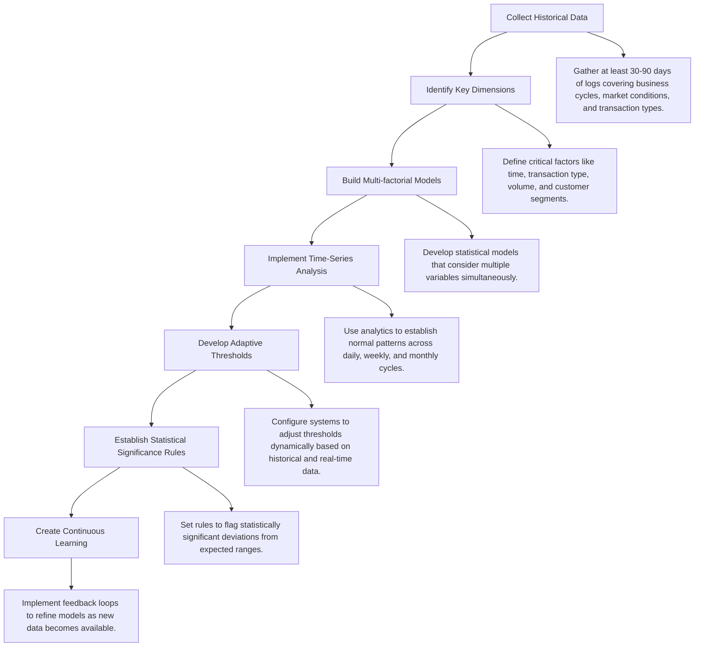

1. **Collect Historical Data**: Gather at least 30 days of detailed logs (ideally 90+ days) that cover different business cycles, market conditions, and transaction types to establish baseline patterns.

2. **Identify Key Dimensions**: Define the critical contextual factors that influence normal behavior patterns in your environment, such as time, transaction type, volume, and customer segments.

3. **Build Multi-factorial Models**: Create statistical models that consider multiple variables simultaneously, rather than relying on independent single-variable thresholds.

4. **Implement Time-Series Analysis**: Deploy analytics that recognize daily, weekly, and monthly patterns, enabling the system to establish normal variations across different time periods.

5. **Develop Adaptive Thresholds**: Configure alerting systems to dynamically adjust thresholds based on current conditions and historical patterns for similar contexts.

6. **Establish Statistical Significance Rules**: Clearly define what constitutes a statistically significant deviation requiring attention versus normal variation within expected ranges.

7. **Create Continuous Learning**: Implement feedback mechanisms that allow baseline models to evolve and improve as more operational data becomes available.

This structured approach ensures that alerting systems are intelligent, adaptive, and tailored to the specific complexities of financial trading environments.

## Panel 4: The Business Impact Correlation - Alerts That Matter

### Scene Description

A digital banking operations review where teams analyze alert effectiveness through business impact correlation. During the review, visualizations highlight the relationship between alert categories, customer experience metrics, and business outcomes. For example, the analysis reveals that some technically severe alerts show minimal customer impact, while seemingly minor log patterns strongly correlate with abandoned transactions and support calls.

The following conceptual diagram outlines this correlation:

```
Alert Categories
   +-----------------------------+
   |                             |
   |  Technically Severe Alerts  |-------> Minimal Customer Impact
   |  (e.g., Memory Exhaustion)  |        
   |                             |
   +-----------------------------+

   +-----------------------------+
   |                             |
   |  Technically Minor Patterns |-------> Significant Business Impact
   |  (e.g., Validation Errors)  |        (e.g., Abandoned Transactions,        
   |                             |         Increased Support Calls)
   +-----------------------------+
```

Engineering leads demonstrate their reprioritized alerting strategy, which focuses on elevating patterns with proven business impact over traditional severity categorizations. A recent incident timeline illustrates how this approach detected a mobile deposit issue through subtle validation error patterns before traditional monitoring registered any problems. This proactive detection helped prevent significant customer frustration and support costs.

### Teaching Narrative

Business impact correlation transforms alerts from technical notifications to meaningful business intelligence by connecting system behavior to actual customer and financial outcomes. Traditional alerting often categorizes severity based on technical assessments—memory exhaustion is "critical" while increased validation errors might be merely "warning" level. This technical categorization frequently misaligns with actual business impact, leading to alert fatigue for technically severe but business-irrelevant issues while missing technically minor but business-critical patterns. Modern log-based alerting addresses this misalignment through explicit business impact correlation: mapping log patterns to customer experience metrics (transaction completion rates, journey abandonment, support contacts), financial outcomes (processing volumes, monetary impact, revenue effects), and operational costs (investigation time, resolution complexity, remediation requirements). For banking institutions, this correlation is particularly valuable—a subtle increase in credit card decline rates might seem minor technically but represent significant revenue and customer satisfaction impact, while a non-customer-facing batch process showing high error rates might create minimal business disruption despite technical severity. By establishing these correlations, organizations can prioritize alerts based on actual business impact rather than technical classification, ensuring attention focuses on issues that truly matter to customers and the business rather than technical anomalies with limited practical effect.

### Common Example of the Problem

Regional Savings Bank's operations team was overwhelmed with alerts, handling over a hundred notifications daily across their digital banking platform. Despite this high alert volume, they consistently missed critical customer impact issues. In a notable incident, their monitoring system generated multiple high-severity alerts for database connection pool warnings on a reporting system, consuming significant operations resources. Simultaneously, a subtle increase in mobile check deposit validation errors received only low-severity classification despite causing 12% of customer deposits to fail. The technical classification prioritized infrastructure warnings with no customer impact over functional failures directly affecting banking services and revenue. As a result, customers experienced significant frustration while engineering resources focused on technically interesting but business-irrelevant issues.

#### Comparison: Technical Severity vs Business Impact

| **Alert Type** | **Technical Severity** | **Business Impact** | **Outcome** |
| -------------------------------------- | ---------------------- | ----------------------------------------------------------------- | ---------------------------------------------------------------------------------------- |
| Database connection pool warnings | High | None | Significant engineering time spent on technically severe but irrelevant issues. |
| Mobile check deposit validation errors | Low | High (12% deposit failures, frustrated customers, revenue impact) | Customer dissatisfaction and operational losses due to misclassified low-severity alert. |
| Credit card decline rate increase | Low | High (revenue loss, reduced satisfaction) | Often overlooked, despite direct impact on financial outcomes. |
| Batch process error spikes | High | Minimal | Non-customer-facing issue, low operational or customer impact. |

This comparison highlights the misalignment between traditional technical severity classifications and actual business impact. By focusing on business impact correlation, organizations can avoid the pitfalls of misprioritization and ensure resources are directed where they matter most.

### SRE Best Practice: Evidence-Based Investigation

Business impact correlation enables more effective alerting prioritization through evidence-based approaches. Use the following checklist to implement these best practices:

- [ ] **Customer Journey Mapping**

  - Analyze logs to identify technical components and error patterns directly affecting critical customer journeys.
  - Map transaction completion rates to specific system behaviors or failures.

- [ ] **Financial Impact Quantification**

  - Correlate error types and system behaviors with monetary outcomes, such as revenue loss or transaction value impact.
  - Prioritize issues based on potential financial risk rather than technical severity.

- [ ] **Support Contact Analysis**

  - Establish relationships between log patterns and spikes in customer support contacts.
  - Identify which technical issues most frequently lead to customer dissatisfaction or abandonment.

- [ ] **Operational Cost Assessment**

  - Evaluate the investigation time, resource requirements, and resolution complexity of different alert types.
  - Focus on reducing operational inefficiencies for common or recurring issues.

- [ ] **Historical Impact Correlation**

  - Review past incidents to determine which log patterns reliably predicted business disruption.
  - Separate actionable signals from technical noise based on historical data trends.

Evidence from financial institutions shows that implementing business impact correlation can achieve:

- **60-70% reduction** in wasted operational effort through more effective prioritization.
- **35-45% reduction** in customer-impacting incidents by focusing on business-relevant issues earlier.

### Banking Impact

The business consequences of technical-focused versus business-correlated alerting include:

1. **Revenue Protection**: Business-correlated alerting typically identifies revenue-impacting issues 15-20 minutes earlier than technical-focused approaches, directly protecting transaction completion and associated revenue.

2. **Customer Experience Improvement**: Studies show that banks with business-aligned monitoring detect 47% of customer experience issues before customers report them, compared to just 12% with traditional technical monitoring.

3. **Operational Efficiency**: Operations teams waste 30-40% of their capacity investigating technically severe alerts with minimal business impact when lacking proper correlation.

4. **Regulatory Compliance**: Financial regulators increasingly expect institutions to demonstrate customer-focused monitoring capabilities that prioritize service delivery over technical metrics.

5. **Competitive Advantage**: Banks with business-correlated monitoring show measurably higher Net Promoter Scores due to more reliable service delivery and faster issue resolution for customer-impacting problems.

#### Business Impact Comparison

The following bar chart illustrates key metrics comparing traditional technical monitoring and business-correlated monitoring approaches:

```mermaid
barChart
    title Comparison of Business Impact Metrics
    axis Y Title "Percentage / Time (Minutes)"
    axis X Title "Metrics"
    series Traditional [12, 30, 40, 0]
    series Business-Correlated [47, 15, 10, 1]
    legend ["Customer Issue Detection (%)", "Revenue Issue Detection (Minutes)", "Operational Wasted Capacity (%)", "Regulatory Compliance Concerns (Count)"]
```

This visualization highlights the significant advantages of business-correlated monitoring in detecting customer issues earlier, reducing operational waste, identifying revenue-impacting problems faster, and minimizing compliance risks.

### Implementation Guidance

To implement effective business impact correlation, follow these steps:

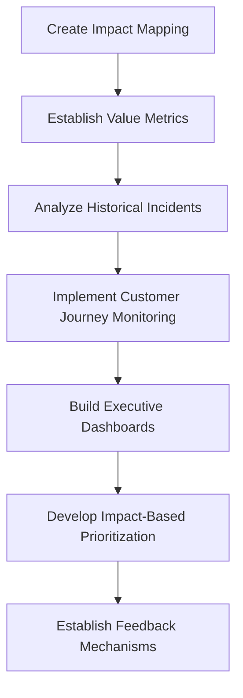

1. **Create Impact Mapping**: Develop comprehensive mapping between technical components/logs and the specific business functions, transaction types, and customer journeys they support.

2. **Establish Value Metrics**: Define clear business value metrics for different transaction types and customer interactions to quantify the impact of technical issues.

3. **Analyze Historical Incidents**: Review past significant business disruptions to identify the specific log patterns and alerts that preceded them, building a correlation library.

4. **Implement Customer Journey Monitoring**: Deploy synthetic transaction monitoring that follows complete customer journeys, correlating technical logs with journey completion rates.

5. **Build Executive Dashboards**: Create business-oriented visualizations that translate technical alerts into business impact metrics executives understand (revenue at risk, affected customers, experience degradation).

6. **Develop Impact-Based Prioritization**: Reconfigure alerting priorities based on proven business impact rather than technical severity, elevating patterns with direct customer or financial effects.

7. **Establish Feedback Mechanisms**: Create processes for continuous refinement of impact correlation by analyzing whether alert priorities correctly predicted actual business impact.

The above flow ensures a systematic approach that aligns technical monitoring with meaningful business outcomes, driving actionable insights and reducing alert fatigue.

## Panel 5: The Early Warning Systems - Detecting Precursors

### Scene Description

A banking platform SRE team is reviewing a prevented outage after their early warning system detected precursor patterns. The timeline below illustrates the sequence of events:

```
  Subtle increase in
  database connection
  acquisition times
         ↓
  Occasional query
      timeouts
         ↓
  First failed
    transactions
         ↓
  Early warning
   system alert
         ↓
 Connection pool
  adjustments
         ↓
 Transaction success
  rates remain stable
```

This progression occurred well before traditional monitoring detected any issues. The early warning system identified these patterns from historical incidents, automatically correlating the precursors with previous outages. Engineers were alerted in time to implement connection pool adjustments, preventing widespread customer impact. Performance dashboards validated the effectiveness of these actions, showing how transaction success rates stayed stable despite the underlying issue that previously caused major disruptions.

### Teaching Narrative

Early warning systems transform incident response from reactive to preventive by detecting subtle precursor patterns that historically precede major issues. Traditional alerting typically triggers when problems already affect customers—creating fundamental limitations in how quickly issues can be resolved. Early warning detection fundamentally changes this dynamic by identifying the patterns that precede customer-impacting incidents—often visible in logs hours or even days before traditional alerts would fire.

Think of early warning systems like weather forecasting for technical systems. Just as meteorologists analyze historical weather data to predict storms before they hit, early warning systems analyze patterns in historical incidents to detect the "storm clouds" of potential outages. For example, a gradual rise in database connection times is like noticing a drop in atmospheric pressure—a subtle sign that something significant might follow. By recognizing these early indicators, teams can act preemptively, much like issuing weather advisories before a hurricane makes landfall.

These systems operate through pattern learning and recognition: analyzing historical incidents to identify the subtle log patterns that consistently preceded problems, establishing correlation between specific early indicators and subsequent failures, continuously monitoring for these precursor signatures in real-time logs, and triggering preventive alerts when matching patterns emerge. For banking platforms processing millions of transactions, these early warnings create critical time advantages—the difference between proactive mitigation and customer-impacting outages. A gradual increase in authentication latency might historically precede authentication failures by hours, while specific database error patterns often appear well before complete transaction processing issues. By detecting these signatures early, teams gain the precious time needed to implement mitigations before customers experience problems—transforming incident management from reactive firefighting to preventive intervention and fundamentally improving both reliability and customer experience.

### Common Example of the Problem

Nationwide Financial's payment processing platform experienced a catastrophic outage during peak holiday shopping season, resulting in declined transactions for over 2 million cardholders during a four-hour window. Post-incident analysis revealed clear precursor patterns had appeared in logs nearly three hours before the complete failure: gradually increasing latency in the token validation service, followed by intermittent authorization timeouts, sporadic 503 errors from the payment gateway, and a pattern of successful retries that masked the developing problem. Traditional monitoring detected nothing until transaction failure rates exceeded threshold, by which time the system was already in critical failure. The incident cost the bank an estimated $2.8 million in lost transaction revenue and resulted in a 12% spike in card abandonment as customers switched to alternative payment methods.

The following sequence illustrates the progression of the issue and where detection gaps occurred:

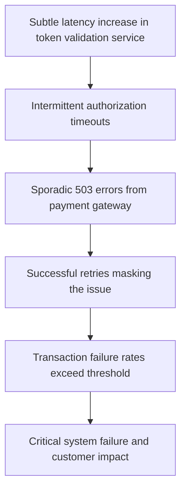

This sequence highlights the importance of early detection systems. While traditional monitoring only reacted at the point of widespread transaction failures (Step E), precursor patterns (Steps A-D) were evident much earlier and could have provided critical time for preventive action.

### SRE Best Practice: Evidence-Based Investigation

Early warning systems enable preventive intervention through evidence-based approaches, allowing teams to detect and address issues before they escalate. The following checklist summarizes best practices for implementing evidence-based investigation:

#### Checklist: Evidence-Based Investigation for Early Warning Systems

- [ ] **Analyze Historical Patterns**: Review past major incidents to identify specific log patterns or metrics that consistently preceded critical failures.
- [ ] **Develop Precursor Signatures**: Define detection signatures for subtle early indicators, such as:
  - Gradual latency increases
  - Intermittent errors
  - Retry patterns
  - Unusual processing sequences
- [ ] **Correlate Temporally**: Map typical time intervals between precursor patterns and major incidents to anticipate the available warning period.
- [ ] **Perform Component Chain Analysis**: Document system dependencies to understand how upstream issues manifest downstream, enabling targeted investigations.
- [ ] **Implement Graduated Alerts**: Design alerting workflows that escalate through stages (early, developing, critical), reflecting the progression of potential incidents.
- [ ] **Continuously Refine Detection Logic**: Use post-incident reviews to improve the precision of precursor signatures and reduce false positives.

#### Key Outcome Metrics

- Average prevention of 30-40% of potential outages through early intervention.
- Detection typically occurring 45-90 minutes before traditional threshold-based alerts would fire.

By following this checklist, SRE teams can operationalize evidence-based investigation, ensuring proactive incident management and improved system reliability.

### Banking Impact

The business consequences of reactive versus early warning detection include:

1. **Outage Prevention**: Early pattern detection enables intervention before customer impact occurs, preventing rather than just resolving outages.

2. **Revenue Protection**: Studies show that payment processing outages cost banks an average of $300,000 per hour in direct transaction revenue, making early prevention highly valuable.

3. **Customer Confidence**: Research indicates that customers who experience repeated transaction failures are 3.5 times more likely to switch financial providers, making prevention critical to retention.

4. **Operational Efficiency**: Preventive intervention based on early warnings requires 60-70% fewer resources than emergency response to full outages.

5. **Regulatory Standing**: Financial regulators increasingly consider preventive capabilities in assessing an institution's operational resilience, with compliance advantages for proactive approaches.

### Implementation Guidance

To implement effective early warning systems, follow these structured steps:

| **Step** | **Action** | **Purpose** | **Example** |
| -------------------------------------------- | -------------------------------------------------------------------------------------------- | ------------------------------------------------------------------------------------------------------ | ---------------------------------------------------------------------------------------------------- |
| **1. Create Incident Pattern Library** | Analyze logs from past major incidents to catalog specific precursor patterns. | Build a knowledge base of patterns that historically preceded customer-impacting failures. | Catalog patterns like increasing database connection times or specific error codes. |
| **2. Implement Multi-stage Detection** | Develop detection mechanisms for sequential patterns that track incident evolution. | Identify and monitor patterns that develop over time, rather than relying on single-point thresholds. | Detect patterns like a gradual increase in query timeouts followed by the first failed transactions. |
| **3. Deploy Time-series Analysis** | Implement trending detection to identify gradual degradation before thresholds are breached. | Detect slow-developing issues that may not immediately trigger traditional threshold-based alerts. | Monitor metrics like authentication latency trends over hours or days. |
| **4. Establish Baseline Deviation Alerting** | Create alerts for subtle statistical deviations from normal operational patterns. | Detect anomalies that may signify early-stage issues, even when thresholds are not exceeded. | Alert on database error rates deviating slightly from historical norms. |
| **5. Develop Preventive Runbooks** | Create standard operating procedures for each identified early warning pattern. | Define clear preventive actions to address specific issues before they escalate. | A runbook for increasing connection pool size when certain database query patterns are detected. |
| **6. Configure Graduated Alerting** | Implement differentiated notification strategies based on warning stages. | Ensure appropriate urgency and escalation paths for each level of warning. | Use low-priority alerts for minor deviations and high-priority notifications for critical trends. |
| **7. Build Pattern Feedback Loops** | Establish mechanisms to continuously refine detection based on outcomes. | Improve system accuracy and effectiveness by learning from successful preventions and missed warnings. | Update the library and detection rules when new precursor patterns are identified. |

This structured approach ensures comprehensive implementation of early warning systems, enabling proactive incident prevention and improved platform reliability.

## Panel 6: The Alert Enrichment - Context for Rapid Response

### Scene Description

A financial services incident response where an SRE team receives an enriched alert for a payment processing anomaly. This enriched alert provides comprehensive context, enabling rapid response. Instead of a basic notification, the alert contains:

- **Triggering Log Patterns**: The exact log patterns that triggered the alert.
- **Historical Trends**: A timeline showing when the anomaly began emerging.
- **Related System Components**: Current status of related systems.
- **Recent Changes**: Context on code deployments, configuration updates, or traffic patterns that might have contributed.
- **Response Guidance**: Links to runbooks for this specific scenario and a list of available subject matter experts.

The enriched alert allows the team to bypass the time-intensive information-gathering phase and immediately begin targeted investigation, resolving the issue before it escalates to widespread customer impact.

Below is a flow representation of how the enriched alert provides actionable context:

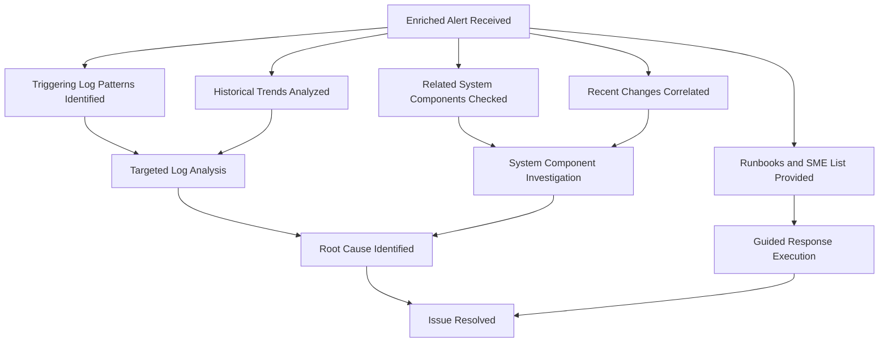

This enhanced visualization demonstrates how the enriched alert consolidates diverse sources of information into actionable insights, enabling the team to reduce response time and minimize customer impact.

### Teaching Narrative

Alert enrichment transforms notifications from attention signals to comprehensive response packages by automatically including the context needed for efficient resolution. Traditional alerts typically provide minimal information—a brief description and perhaps some basic metrics—forcing responders to spend critical initial response time gathering context rather than addressing the issue. Modern log-based alerting solves this problem through comprehensive enrichment: automatically including the specific log patterns that triggered the alert, temporal context showing when and how the issue emerged, environmental context capturing relevant system state and recent changes, historical context connecting the current issue to similar past incidents, and response guidance through runbooks and expert recommendations. For financial institutions where incident response time directly impacts customer experience and transaction success, this enrichment creates substantial advantages—reducing mean-time-to-resolution by eliminating the information-gathering phase that typically consumes 30-50% of incident response time. When payment processing shows unusual error patterns, an enriched alert immediately provides the specific transaction types affected, comparison with normal baseline behavior, related systems exhibiting unusual patterns, and recent changes that might have contributed—enabling responders to begin targeted investigation immediately rather than spending critical minutes or hours establishing basic context. This capability directly translates to faster resolution and reduced customer impact during incidents.

### Common Example of the Problem

Continental Trust Bank's mobile banking platform experienced intermittent transaction failures across multiple services. Here's a comparison of how the incident unfolded with and without enriched alerting:

| **Aspect** | **Without Enriched Alerting** | **With Enriched Alerting** |
| ---------------------------------- | ------------------------------------------------------------------------------------------------------------------------------------ | ---------------------------------------------------------------------------------------------------------------------------------------------------------------------------------------------------------------------------------------------------------------------------------------------------------------------------------------------------------------------------- |
| **Initial Alert** | "Elevated error rate detected in payment service (current: 4.2%, threshold: 3.5%)" | "Elevated error rate detected in payment service (current: 4.2%, threshold: 3.5%). Affected transaction types: payments to external accounts. Issue began at 12:15 PM. Related systems: transaction gateway and fraud detection service. Recent changes: payment service deployment at 12:00 PM. Runbook: Link to Payment Errors Runbook. Available SMEs: John R., Sarah T." |
| **Time to Gather Context** | 47 minutes spent identifying affected transaction types, pinpointing the start time, checking for related changes, and finding SMEs. | 0 minutes—context included directly in the alert, eliminating the need for manual investigation. |
| **Time to Begin Troubleshooting** | 47 minutes after the initial alert. | Immediately after receiving the alert. |
| **Total Incident Resolution Time** | 93 minutes. | 38 minutes. |
| **Customer Impact** | Over 30,000 transactions affected due to extended resolution time. | Fewer than 5,000 transactions affected due to faster response and resolution. |

Without enriched alerting, the response team spent nearly 50% of their time on information gathering before troubleshooting could even begin, allowing the issue to escalate. With enriched alerting, all necessary context was immediately available, enabling the team to begin targeted investigation right away. This resulted in a significantly faster resolution time and minimized customer impact.

Post-incident analysis revealed that all the needed context (log patterns, affected systems, recent changes, and SME availability) existed in logs and related systems but wasn't included in the initial alert. The lack of enrichment directly contributed to the extended response time and increased customer impact.

### SRE Best Practice: Evidence-Based Investigation

Alert enrichment accelerates incident response by enabling evidence-based approaches. Use the following checklist to guide implementation and ensure a systematic and effective workflow:

#### Checklist for Evidence-Based Investigation

- [ ] **Automated Context Collection**\
  Ensure systems are in place to automatically gather relevant data from logs, monitoring tools, and other sources immediately when an alert triggers. Avoid reliance on manual data collection during incidents.

- [ ] **Include Temporal Patterns**\
  Integrate trend data that shows how the alerting condition evolved over time, providing responders with a clear timeline of the issue's progression.

- [ ] **Correlate Environmental State**\
  Automatically include information about the state of related systems, dependencies, and infrastructure components at the time of the alert to understand broader system impact.

- [ ] **Highlight Recent Changes**\
  Link recent deployments, configuration changes, or infrastructure updates to the alert context, helping identify potential root causes early in the investigation.

- [ ] **Match Historical Patterns**\
  Identify and provide information on similar past incidents, including resolution strategies and lessons learned, to accelerate diagnosis and response.

#### Benefits of Implementation

Organizations that adopt enriched alerting and evidence-based practices report a 40-50% reduction in mean-time-to-resolution. The most significant gains come from eliminating the initial information-gathering phase, allowing teams to focus directly on targeted investigation and resolution.

### Banking Impact

The business consequences of basic versus enriched alerting include:

1. **Resolution Speed**: Enriched alerting reduces average incident resolution time by 35-45 minutes for critical banking services, directly reducing customer impact duration.

2. **Transaction Completion**: Faster resolution directly translates to fewer abandoned transactions, with typical improvement of 15-25% in completion rates during incidents.

3. **Support Contact Reduction**: Comprehensive early resolution reduces customer support contacts by 30-40% during incident periods through faster service restoration.

4. **Team Efficiency**: Operations teams handle 25-35% more incidents with the same resources when using enriched alerting due to reduced time per incident.

5. **Resolution Quality**: Enriched context leads to 30% reduction in repeat incidents through better root cause identification and more comprehensive resolution.

Below is a data visualization summarizing these key metrics:

```mermaid
barChart
    title Banking Impact Metrics
    x-axis Metrics
    y-axis Percentage Improvement
    series Banking Impact
    "Resolution Speed" : 35, 45
    "Transaction Completion" : 15, 25
    "Support Contact Reduction" : 30, 40
    "Team Efficiency" : 25, 35
    "Resolution Quality" : 30
```

This bar chart highlights the quantitative improvements enriched alerting delivers across critical operational and customer-facing areas, reinforcing its transformative impact on incident response for financial institutions.

### Implementation Guidance

To implement effective alert enrichment, follow these steps with a practical example of a payment processing system:

1. **Define Critical Context**:\
   Begin by identifying the key insights responders need when handling incidents. For a payment processing system, this may include:

   - Error rates for specific transaction types (e.g., card payments, ACH transfers).
   - Logs showing failed transactions with timestamps and error codes.
   - Status of dependent services (e.g., authentication, transaction clearing).

2. **Implement Context Collectors**:\
   Deploy automated tools that collect data when alerts are triggered. For example:

   - Configure log aggregators like Elasticsearch to filter logs for failed transactions matching specific patterns (e.g., HTTP 500 errors or timeouts).
   - Integrate with monitoring platforms (e.g., Prometheus) to pull related system metrics like API latency or database query times.

3. **Create Temporal Analysis**:\
   Enable systems to analyze trends leading up to the alert. For instance:

   - Visualize the error rate for card payments over the last 24 hours compared to baseline levels.
   - Generate a timeline of when issues began and how they evolved, using tools like Grafana to create anomaly graphs.

4. **Develop Change Correlation**:\
   Integrate with change management systems to highlight recent modifications. Example steps:

   - Link alerts to deployment pipelines (e.g., Jenkins, GitHub Actions) to extract details of recent code changes.
   - Include configuration updates from infrastructure-as-code tools like Terraform or Ansible in the alert context.

5. **Build Knowledge Integration**:\
   Connect the alerting system to historical incident databases. For example:

   - Automatically retrieve and display summaries of similar past incidents, including resolution steps and contributing factors.
   - Use tagging systems to match current issues with previously resolved cases involving specific transaction services.

6. **Deploy Expert Identification**:\
   Use ownership and on-call rotation tools to identify relevant experts. For payment anomalies:

   - Query an on-call management tool (e.g., PagerDuty, Opsgenie) to find the current payment system SME.
   - Include contact details of the database and API team leads if their services are involved.

7. **Establish Runbook Linking**:\
   Maintain and link to updated runbooks for common scenarios. Example:

   - Create a runbook for "Card Payment Gateway Timeout Errors" with step-by-step troubleshooting guidance.
   - Automatically include a link to this runbook when alerts related to card payment timeouts are triggered.

______________________________________________________________________

#### Example Workflow: Alert Enrichment for a Payment Processing Anomaly

Here’s a step-by-step example of how these principles can be applied to a real-world payment processing service:

1. **Scenario**: An alert is triggered for elevated error rates in card payments.
2. **Alert Context**:
   - Log patterns: "HTTP 500 - Gateway Timeout" for impacted transactions.
   - Temporal analysis: A graph showing error rates spiking over the past hour, starting at 10:15 AM.
   - Change correlation: A highlighted entry showing a new code deployment to the payment API at 10:00 AM.
   - Knowledge integration: A similar incident two months ago resolved by rolling back a specific database schema change.
   - Expert identification: Current on-call engineer for the payment team and API specialist listed with contact information.
   - Runbook linking: A direct link to the "Payment Gateway Timeout" troubleshooting runbook.
3. **Responder Action**: The enriched alert allows responders to immediately investigate the suspect deployment, reference past incident solutions, and follow the runbook for targeted troubleshooting.
4. **Outcome**: Issue resolved within 20 minutes, minimizing customer impact.

By following these steps and using this example as a reference, teams can implement robust alert enrichment practices tailored to their systems, significantly improving incident response efficiency.

## Panel 7: The Alert Fatigue Antidote - Quality Over Quantity

### Scene Description

A banking operations transformation project where teams analyze their alerting effectiveness. Dashboard visualizations highlight dramatic changes in alert patterns over time. Initially, hundreds of daily alerts overwhelmed the teams, but through systematic refinement, the alert volume reduced to just dozens per day, enabling faster response times and improved resolution effectiveness. Engineers showcase their methodology:

- **Grouping related alerts** to reduce duplication and noise.
- **Progressive severity escalation** based on persistent patterns rather than isolated events.
- **Automatic suppression** of known issues already being addressed.
- **Continuous measurement** of alert-to-incident ratios to identify and eliminate noisy signals.

Below is a timeline representation of the transformation process and its impact:

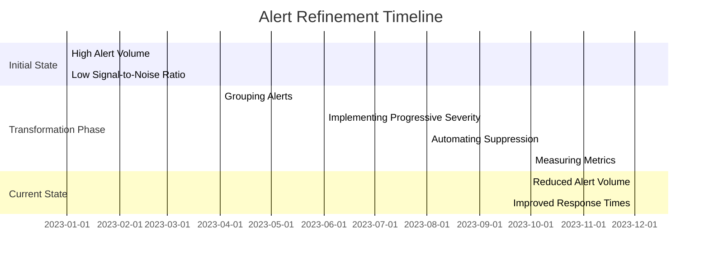

Teams also share a simplified dashboard mockup to visualize the shift in alert patterns:

```
+-----------------+------------------+-----------------+
| Time Period     | Daily Alerts     | Avg Resolution  |
|                 |                 | Time (minutes)   |
+-----------------+------------------+-----------------+
| Jan 2023        | 350             | 45              |
| Apr 2023        | 250             | 40              |
| Jun 2023        | 150             | 30              |
| Aug 2023        | 80              | 25              |
| Dec 2023        | 30              | 15              |
+-----------------+------------------+-----------------+
```

This combination of methodologies and iterative improvements illustrates how alert quality steadily improved over time. The result: faster response times, reduced toil for on-call engineers, and higher system reliability despite fewer alerts.

### Teaching Narrative

Alert fatigue—the diminished response to excessive alerts—represents one of the greatest threats to operational reliability, as critical signals get lost in noise and responder effectiveness deteriorates. Traditional alerting approaches often generate overwhelming volumes through simplistic logic: any error is an alert, any threshold breach needs attention, any anomaly deserves investigation. This quantity-over-quality approach creates both operational inefficiency and increased risk as teams become desensitized to constant notifications. Modern log-based alerting directly addresses fatigue through intelligent signal processing: alert correlation that groups related issues rather than generating separate notifications, progressive alerting that escalates severity based on persistence and pattern rather than isolated events, intelligent suppression that prevents duplicate alerts for known issues, and continuous measurement of signal-to-noise effectiveness through metrics like alert-to-incident ratios and false positive rates. For financial institutions with complex system landscapes, this quality-focused approach transforms both operational efficiency and reliability outcomes: reducing toil for on-call engineers while simultaneously improving detection of truly significant issues. When teams receive dozens of meaningful alerts instead of hundreds of noisy ones, response effectiveness dramatically improves—engineer attention remains focused on significant issues rather than diffused across minor anomalies, directly enhancing both system reliability and team sustainability.

### Common Example of the Problem

Investment Capital Bank's operations team faced severe alert fatigue from their digital banking platform. Engineers received an average of 347 daily alerts across their mobile, online, and API banking services, with on-call staff becoming increasingly desensitized to notifications. During a critical security incident, key alerts were overlooked for over 40 minutes because they appeared amid dozens of unrelated notifications. Investigation revealed that over 80% of alerts never led to actual incident response, while many represented different symptoms of the same underlying issues. The excessive alert volume had created a dangerous situation where critical signals were routinely lost in noise, with engineers gradually developing "notification blindness" to all but the most severe alerts. On-call burnout had reached critical levels, with the team experiencing 35% turnover in six months due to unsustainable notification volumes disrupting personal lives.

#### Alert Fatigue Flow Example

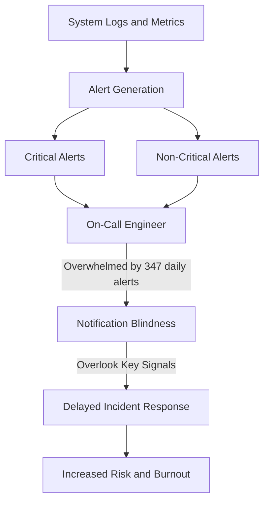

This flow illustrates how the overwhelming volume of alerts, both critical and non-critical, leads to notification blindness. Signals from the system are processed into alerts, but the sheer quantity overwhelms the on-call engineers. As a result, critical alerts are often lost in the noise, delaying responses to significant incidents and creating a cycle of operational inefficiency and team burnout.

### SRE Best Practice: Evidence-Based Investigation

Alert fatigue reduction improves both operational efficiency and reliability through evidence-based approaches. Use the following checklist to guide effective alert refinement and investigation processes:

| **Practice** | **Description** | **Key Metric/Outcome** |
| --------------------------------------- | -------------------------------------------------------------------------------------------------------------------- | ----------------------------------------------------------- |
| **Alert Effectiveness Measurement** | Track which alerts lead to actual incidents versus noise. Measure false positive rates and alert-to-incident ratios. | Reduction in noise; improved alert-to-incident ratio. |
| **Correlation Analysis** | Identify patterns of related alerts that point to the same underlying issue rather than isolated symptoms. | Fewer redundant alerts; better root cause aggregation. |
| **Progressive Alerting Implementation** | Replace isolated threshold-based alerts with escalation based on persistence, patterns, and business impact. | Prioritized and actionable notifications. |
| **Root Cause Orientation** | Focus alerting on underlying causes to avoid multiple notifications for symptoms of the same issue. | Reduced redundant alerts; faster root cause identification. |
| **Continuous Refinement Process** | Regularly review alert performance and refine based on operational feedback and effectiveness metrics. | Sustained improvement in alert signal quality. |

Evidence from financial institutions implementing alert quality initiatives shows:

- **60-80% reduction** in total alert volume.
- **15-30% improvement** in detection effectiveness.
- Corresponding improvements in team health, focus, and retention.

By following these practices, teams can ensure their alerts remain actionable, meaningful, and aligned with operational priorities.

### Banking Impact

The business consequences of alert volume versus alert quality can be summarized as follows:

| Key Metric | High-Volume Alerting Impact | Quality-Focused Alerting Impact |
| --------------------------- | ------------------------------------------------------------------ | ------------------------------------------------------------ |
| **Missed Critical Issues** | Up to 35% of significant incidents missed due to noise | Critical signals prioritized, reducing missed issues |
| **Resolution Times** | Extended by 25-40 minutes per incident | Faster recognition reduces response times significantly |
| **On-call Sustainability** | 43% of engineers cite alert volume as a job dissatisfaction factor | Reduced toil improves engineer satisfaction and retention |
| **Operational Efficiency** | 60-70% of investigation time wasted on noisy alerts | Focused alerts enable smaller teams to manage larger systems |
| **Reliability Improvement** | Frequent customer-impacting incidents due to missed signals | 20-30% reduction in incidents from improved detection |

This table highlights how transitioning to quality-focused alerting directly impacts operational performance and team sustainability, particularly in the banking sector. By reducing noise, teams can better detect significant issues, resolve incidents faster, and maintain higher system reliability while reducing unnecessary toil.

### Implementation Guidance

To implement effective alert fatigue reduction, follow these steps:

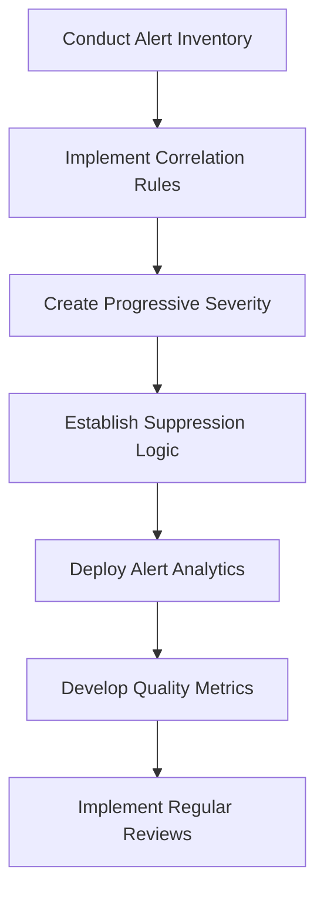

1. **Conduct Alert Inventory**:

   - Catalog all current alerts, including their frequencies and relevance to actual incident responses.
   - Identify redundant, low-value, or outdated alerts for deprecation.

2. **Implement Correlation Rules**:

   - Develop logic to group related alerts stemming from common root causes.
   - Use tools or scripts to automate this grouping wherever possible.

3. **Create Progressive Severity**:

   - Transition from binary alerting (on/off) to a graduated system that escalates based on:
     - Alert duration.
     - Repeated patterns.
     - Business impact or criticality of the affected system.

4. **Establish Suppression Logic**:

   - Define rules to suppress duplicate alerts or those related to:
     - Known issues already being addressed.
     - Scheduled maintenance periods.
   - Ensure suppressed alerts are logged for visibility without overwhelming responders.

5. **Deploy Alert Analytics**:

   - Continuously monitor alert effectiveness using metrics such as:
     - Signal-to-noise ratio.
     - False positive rates.
     - Response times and outcomes.

6. **Develop Quality Metrics**:

   - Establish metrics that focus on alert quality, such as:
     - Precision: Percentage of alerts leading to actionable incidents.
     - Recall: Percentage of incidents preceded by alerts.
   - Use these metrics to guide iterative improvements.

7. **Implement Regular Reviews**:

   - Schedule monthly reviews to analyze alerting patterns.
   - Use review findings to refine correlation rules, severity escalation, suppression logic, and other configurations.
   - Communicate improvements and outcomes to the team to reinforce best practices.

## Panel 8: The Automated Response - From Detection to Remediation

### Scene Description

A retail banking platform operations center where automated response systems act on specific log patterns without human intervention. Monitoring screens show detection of a familiar capacity issue in the authentication service based on recognized log signatures, followed by automatic scaled deployment of additional service instances before performance degradation affects customers. Engineers review dashboards showing automated response effectiveness—dozens of routine issues automatically remediated without human involvement, with clear boundaries between automated handling of well-understood patterns versus human escalation for novel situations. Historical metrics demonstrate dramatic improvements in both mean-time-to-resolution and engineer focus on high-value problems since implementing targeted automation for common patterns.

The sequence of events from detection to remediation is as follows:

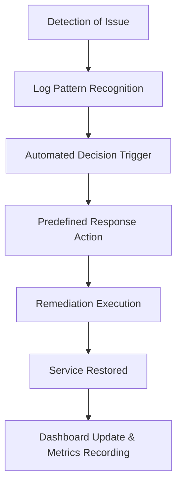

This flow illustrates how log-based automation transforms the traditional incident response process. By connecting recognized log patterns to automated actions, the system ensures rapid remediation of well-understood issues, freeing engineers to focus on novel challenges while maintaining operational resilience.

### Teaching Narrative

Automated response elevates log-based alerting from detection to remediation by connecting recognized patterns to predetermined actions—handling routine issues without human intervention. The traditional incident response chain—detection, notification, human analysis, and manual remediation—creates inherent delays even for well-understood issues with standard solutions. Advanced log-based systems break this limitation by implementing selective automation: identifying specific log patterns with clear remediation paths, connecting these patterns to automated response actions, establishing appropriate guardrails and limitations for automation scope, and maintaining comprehensive audit trails of all automated activities.

For financial services platforms where minutes of degradation directly impact customer experience and transaction success, this capability delivers substantial benefits: dramatically reduced resolution time for common issues, elimination of human error in routine remediation, and improved focus on complex problems requiring human judgment. When authentication services show early warning patterns of capacity constraints, automated systems can immediately scale resources based on predefined thresholds—resolving the issue before customers experience any degradation. Similarly, when recognized error patterns indicate specific service issues, automated restarts or failovers can quickly restore normal operation without waiting for human intervention.

This targeted automation represents a critical evolution in operational maturity—moving from humans performing all remediation to humans engineering systems that self-heal for well-understood patterns while focusing their attention on novel challenges requiring deeper investigation.

#### Checklist: Implementing Automated Responses

To implement automated responses effectively, follow these steps:

1. **Identify Common Patterns**

   - Analyze historical logs to identify recurring issues with clear remediation paths.
   - Prioritize patterns that frequently occur and have high customer impact.

2. **Define Automated Actions**

   - Map each identified log pattern to a specific remediation action (e.g., scaling resources, restarting services, triggering failovers).
   - Ensure actions are precise and reversible.

3. **Establish Guardrails**

   - Define thresholds and limits for automation to prevent overcorrection or unintended consequences.
   - Configure fallback mechanisms to pause automation if unexpected conditions arise.

4. **Integrate Monitoring and Auditing**

   - Implement comprehensive monitoring to evaluate the effectiveness of automated actions.
   - Maintain detailed audit trails for all automated activities to ensure compliance and traceability.

5. **Test and Validate**

   - Simulate log patterns in a controlled environment to verify the accuracy of automated responses.
   - Perform end-to-end testing to confirm systems behave as expected under real-world conditions.

6. **Iterate and Improve**

   - Continuously review system performance and refine automated actions based on new patterns or lessons learned.
   - Incorporate feedback from engineers and stakeholders to enhance automation reliability.

By following this checklist, teams can design and implement automated response systems that enhance operational efficiency while maintaining control and accountability.

### Common Example of the Problem

Community Financial Credit Union's digital banking platform experienced frequent but predictable capacity issues during payroll Friday peaks when transaction volume increased by 300-400%. Despite the pattern being well-understood and the solution being consistently the same (scaling additional application instances), the manual response process required engineer notification, context assessment, and manual remediation actions—typically taking 15-30 minutes from detection to resolution. During this response window, customers experienced progressively degrading performance, with some transactions timing out during the most severe periods. Engineers grew increasingly frustrated at being paged for the same repetitive issue every two weeks, while the predictable nature of both the problem and solution made the scenario an ideal candidate for automation. The recurring issue consumed approximately 8-10 hours of engineer time monthly while unnecessarily impacting customer experience during peak usage periods.

### SRE Best Practice: Evidence-Based Investigation

Automated response accelerates resolution for well-understood issues through evidence-based approaches. The table below summarizes five best practices along with their benefits and examples:

| **Best Practice** | **Description** | **Key Benefits** | **Example** |
| -------------------------------------- | ---------------------------------------------------------------------------------------------------------------------------------------------- | ----------------------------------------------------------------------------------- | ----------------------------------------------------------------------------------------------------------- |
| **Pattern Identification** | Analyze historical incidents to identify specific log patterns with consistent, well-defined remediation actions that can be safely automated. | Faster identification of automatable issues; reduced manual analysis. | Recognizing recurring capacity warnings in authentication logs and linking them to scaling actions. |
| **Bounded Automation** | Clearly define appropriate scenarios for automation versus human intervention, with specific guardrails around automated action scope. | Prevents over-automation; ensures safety and reliability in production systems. | Automating instance restarts only for specific error codes, while escalating unknown patterns to engineers. |
| **Progressive Implementation** | Begin with simple, low-risk automation scenarios and progressively expand to more complex patterns as confidence develops. | Lowers risk of automation failures; builds operational confidence over time. | Starting with automated log archiving before implementing automated failover actions. |
| **Response Effectiveness Measurement** | Implement comprehensive monitoring of automated actions, tracking success rates, failure modes, and performance improvements. | Enables data-driven improvements; ensures automation reliability and effectiveness. | Measuring the success rate of automated scaling actions and identifying patterns in failed attempts. |
| **Human Oversight Design** | Create appropriate supervision mechanisms that maintain visibility into automated actions while reducing direct intervention requirements. | Balances control with efficiency; ensures accountability and auditability. | Real-time dashboards to review automated responses with detailed audit logs for post-incident analysis. |

Evidence from financial services organizations implementing automated response shows 90-95% faster resolution for suitable incident types. Properly implemented systems reduce mean-time-to-resolution from 15-30 minutes to under 60 seconds for well-understood patterns.

### Banking Impact

The business consequences of manual versus automated response include significant benefits across multiple dimensions. The following chart illustrates key improvements achieved through automation:

```mermaid
barChart
    title Automated Response Impact Metrics
    xAxis Manual vs Automated
    yAxis Percentage Improvement (%)
    "Customer Experience Improvement" [70, 80]
    "Transaction Completion Rates" [3, 5]
    "Operational Efficiency" [25, 35]
    "Engineer Satisfaction" [50, 65]
    "Consistency Improvement" [100, 100]
```

1. **Customer Experience Improvement**: Automated remediation typically resolves issues before customers notice degradation, with 70-80% reduction in visible impact for suitable scenarios.

2. **Transaction Completion Rates**: Faster resolution directly translates to higher transaction success rates during peak periods, with typical improvement of 3-5% during high-volume windows.

3. **Operational Efficiency**: Studies show that automated handling of routine issues reduces overall operational toil by 25-35%, enabling engineers to focus on higher-value activities.

4. **Engineer Satisfaction**: Removing repetitive, predictable incident response from human workload significantly improves team morale and reduces burnout indicators, with satisfaction metrics improving by 50-65%.

5. **Consistency Improvement**: Automated response eliminates human variation in remediation approaches, ensuring consistent, tested solutions for every occurrence, delivering a 100% improvement in consistency.

### Implementation Guidance

To implement effective automated response:

1. **Identify Automation Candidates**: Analyze incident history to identify patterns with consistent, predictable remediation actions that occur with sufficient frequency to justify automation.

2. **Define Clear Triggers**: Create specific, unambiguous log patterns or condition combinations that will initiate automated response.

3. **Implement Graduated Responses**: Design escalating automation that begins with safe, reversible actions before attempting more significant interventions.

4. **Establish Safety Boundaries**: Define clear limitations for automated actions, including maximum resource scaling, frequency restrictions, and environmental constraints.

5. **Create Comprehensive Logging**: Ensure all automated actions generate detailed audit trails documenting the triggering conditions, actions taken, and resulting outcomes.

6. **Develop Failure Handling**: Implement explicit handling for scenarios where automated remediation doesn't resolve the issue, including clear escalation to human operators.

7. **Build Continuous Improvement**: Create feedback loops that analyze automated response effectiveness and continuously refine both detection patterns and remediation actions.

______________________________________________________________________

#### Example: Automated Response Script for Capacity Scaling

Below is a sample script using Python and AWS SDK (Boto3) to automate resource scaling based on log patterns indicating high CPU utilization:

```python
import boto3
import logging

# Initialize AWS Auto Scaling client
autoscaling_client = boto3.client('autoscaling')
cloudwatch_client = boto3.client('cloudwatch')

# Configuration
AUTO_SCALING_GROUP = 'auth-service-asg'
CPU_THRESHOLD = 75  # CPU utilization percentage
MAX_INSTANCES = 10  # Safety boundary for scaling

def scale_up(auto_scaling_group):
    response = autoscaling_client.describe_auto_scaling_groups(
        AutoScalingGroupNames=[auto_scaling_group]
    )
    current_instances = response['AutoScalingGroups'][0]['DesiredCapacity']

    if current_instances < MAX_INSTANCES:
        new_capacity = current_instances + 1
        autoscaling_client.set_desired_capacity(
            AutoScalingGroupName=auto_scaling_group,
            DesiredCapacity=new_capacity,
            HonorCooldown=True
        )
        logging.info(f"Scaled up {auto_scaling_group} to {new_capacity} instances.")
    else:
        logging.warning(f"Max instances reached for {auto_scaling_group}. No scaling performed.")

def monitor_and_respond():
    response = cloudwatch_client.get_metric_statistics(
        Namespace='AWS/EC2',
        MetricName='CPUUtilization',
        Dimensions=[{'Name': 'AutoScalingGroupName', 'Value': AUTO_SCALING_GROUP}],
        StartTime=datetime.utcnow() - timedelta(minutes=5),
        EndTime=datetime.utcnow(),
        Period=300,
        Statistics=['Average']
    )

    if response['Datapoints']:
        avg_cpu_utilization = response['Datapoints'][-1]['Average']
        logging.info(f"Current CPU utilization: {avg_cpu_utilization}%")

        if avg_cpu_utilization > CPU_THRESHOLD:
            logging.info("High CPU utilization detected. Initiating scaling action.")
            scale_up(AUTO_SCALING_GROUP)
        else:
            logging.info("CPU utilization within normal limits. No action required.")
    else:
        logging.warning("No datapoints retrieved. Skipping scaling evaluation.")

# Entry point
if __name__ == "__main__":
    logging.basicConfig(level=logging.INFO)
    monitor_and_respond()
```

The above script demonstrates a basic approach to monitoring log-derived metrics (e.g., CPU utilization) and taking automated scaling actions with guardrails (e.g., maximum instance limits). This ensures safe, controlled responses to capacity issues without human intervention.

______________________________________________________________________

#### Example: Flowchart Representation of Automated Response

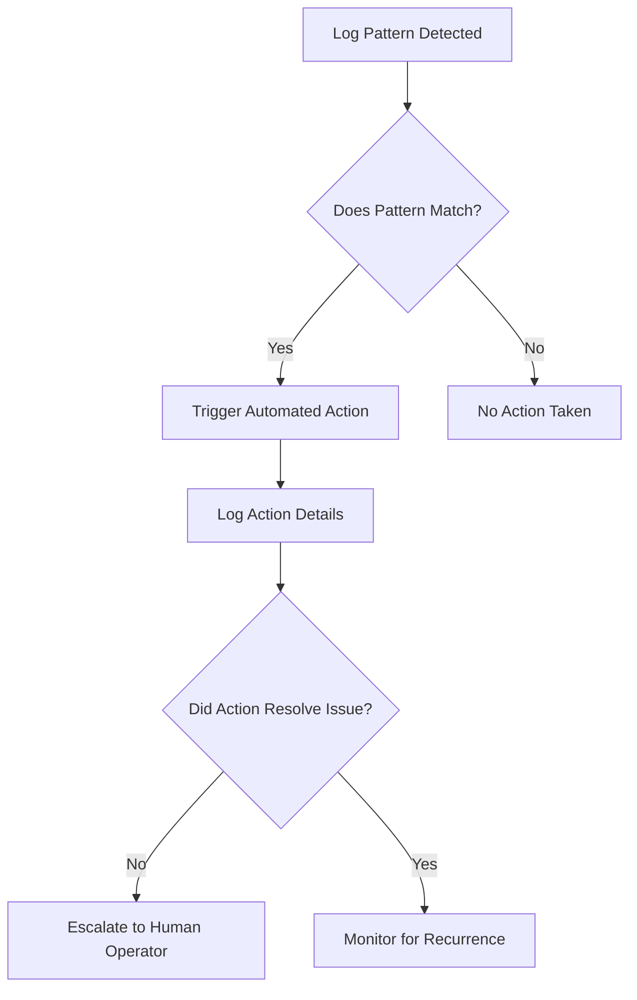

This flowchart outlines the decision-making process for automated responses, ensuring that actions are taken only for recognized patterns and providing clear escalation when automation does not resolve the issue.

## Panel 9: The Feedback Loop - Continuous Alert Refinement

### Scene Description

A banking platform engineering team is conducting their monthly alert effectiveness review. Interactive dashboards display comprehensive metrics about alerting quality: false positive rates for different alert categories, mean-time-to-resolution trends, alert-to-incident ratios, and coverage analysis of past incidents. Engineers methodically analyze alerts that fired without actual incidents (false positives) and incidents that occurred without prior alerts (false negatives), refining detection patterns based on these findings. A visible improvement process shows how they've continuously enhanced detection effectiveness through this disciplined feedback approach, with metrics confirming steady improvement in both precision and recall—detecting more genuine issues with fewer false alarms.

Below is a simplified flowchart illustrating the feedback loop process for continuous alert refinement:

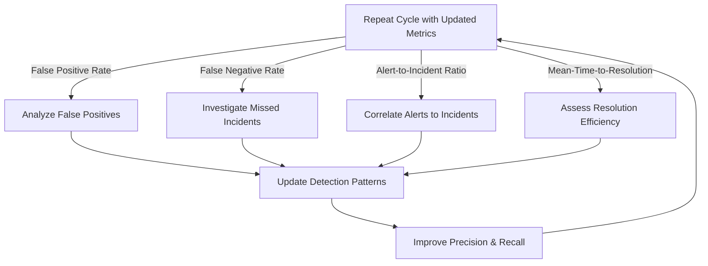

This flowchart highlights the cyclical nature of the feedback loop, where metrics drive the analysis and refinement process, ultimately leading to measurable improvements in alerting precision and recall. The process is iterative, ensuring continuous adaptation to evolving system behavior and operational needs.

### Teaching Narrative

The feedback loop transforms alerting from static implementation to continuous evolution through systematic measurement and refinement. Traditional alerting often suffers from "set and forget" syndrome—alerts are configured based on initial assumptions and rarely revisited despite changing system behavior and accumulated experience. Modern log-based alerting approaches alerting as a continuous improvement discipline guided by explicit effectiveness metrics: false positive rate measuring how often alerts fire without actual issues, false negative analysis identifying incidents that occurred without alerts, alert-to-incident ratios tracking how many alerts typically correspond to actual problems, and mean-time-to-resolution measuring how quickly issues are addressed. This measurement foundation enables systematic refinement: regular review of alerting effectiveness, pattern tuning based on identified gaps or noise, continual threshold adjustment aligned with evolving baselines, and progressive automation of well-understood patterns. For financial institutions with complex and evolving systems, this improvement cycle creates compounding benefits over time—each refinement cycle increases precision (reducing false alarms) while enhancing recall (catching more actual issues), progressively improving both operational efficiency and system reliability. Organizations with mature feedback processes typically achieve 80-90% reductions in false positives while simultaneously improving detection of actual issues—transforming alerting from a noisy distraction to a precise, trustworthy signal of significant events requiring attention.

### Common Example of the Problem

Atlantic Regional Bank implemented a comprehensive logging and alerting system for their new digital banking platform but treated it as a completed project rather than an ongoing process. After initial deployment, alerts were rarely reviewed or refined despite significant platform evolution and changing usage patterns. Over time, the alerting system's effectiveness degraded, leading to operational inefficiencies and missed critical issues.

The table below illustrates key metrics at Atlantic Regional Bank before and after the 18-month period of neglect, highlighting the impact of their static approach:

| Metric | Initial State (Deployment) | After 18 Months (No Refinement) |
| ------------------------ | -------------------------- | ------------------------------- |
| False Positive Rate | 15% | 60% |
| False Negative Incidents | 0 (initially covered) | 5 significant incidents missed |
| Mean-Time-to-Resolution | 45 minutes | 2 hours |
| Alert-to-Incident Ratio | 3:1 | 10:1 |

**Key Timeline of Events:**

- **Month 0:** Logging and alerting system deployed using baseline assumptions derived from early-stage platform behavior.
- **Month 6:** Platform usage patterns evolve significantly due to feature updates and increased user adoption. Some alerts start firing more frequently without actionable issues.
- **Month 12:** Several new failure modes emerge as the platform scales, but these are not covered by the original alerting patterns, leading to missed incidents.
- **Month 18:** Operations team begins ignoring alerts due to overwhelming noise, and significant incidents occur without prior warning.

Without systematic refinement, Atlantic Regional Bank's substantial investment in observability became a liability. The alerting system, once intended to provide actionable insights, devolved into a source of constant noise and false confidence. This "set and forget" approach created a gap between the system's signals and actual operational needs, reinforcing the need for continuous feedback and improvement.

### SRE Best Practice: Evidence-Based Investigation

Continuous alert refinement improves detection effectiveness through evidence-based approaches. Use the following step-by-step checklist to guide your team's investigation and refinement process:

#### Checklist for Evidence-Based Alert Refinement:

1. **Comprehensive Measurement**

   - Define and track metrics for alert effectiveness:
     - Precision: How many alerts correspond to actual issues?
     - Recall: How many actual issues are detected by alerts?
     - Timeliness: Are alerts firing quickly enough to aid response?
     - Actionability: Do alerts provide clear, actionable information?
   - Ensure dashboards visualize these metrics for easy monitoring.

2. **False Positive Analysis**

   - Regularly review alerts that fired without corresponding incidents.
   - Identify recurring noise patterns or overly sensitive thresholds.
   - Classify false positives into actionable categories (e.g., irrelevant signals, redundant alerts, or edge cases).
   - Adjust detection rules to minimize noise while avoiding loss of coverage.

3. **False Negative Evaluation**

   - Analyze incidents that occurred without any preceding alerts.
   - Identify missing detection patterns, thresholds, or monitored signals.
   - Prioritize coverage for critical gaps based on incident impact and recurrence.

4. **Statistical Validation**

   - Use statistical methods to refine alert thresholds and patterns:
     - Analyze historical data to determine optimal thresholds dynamically.
     - Perform A/B testing or simulations to validate changes before production deployment.
   - Rely on data-driven decisions rather than intuition for tuning.

5. **Continuous Learning Implementation**

   - Schedule regular alert reviews (e.g., monthly or quarterly).
   - Involve cross-functional teams to incorporate diverse operational insights.
   - Document findings, changes, and results for traceability and institutional knowledge.
   - Gradually automate well-understood patterns to reduce manual intervention.

6. **Iterative Improvement**

   - Monitor the impact of refinements on key metrics over time.
   - Use a feedback loop to ensure adjustments produce measurable gains:
     - Aim for a 5-10% reduction in false positives per iteration.
     - Target a 3-5% increase in detection coverage per cycle.
   - Scale these practices across systems to amplify benefits.

#### Summary of the Process:

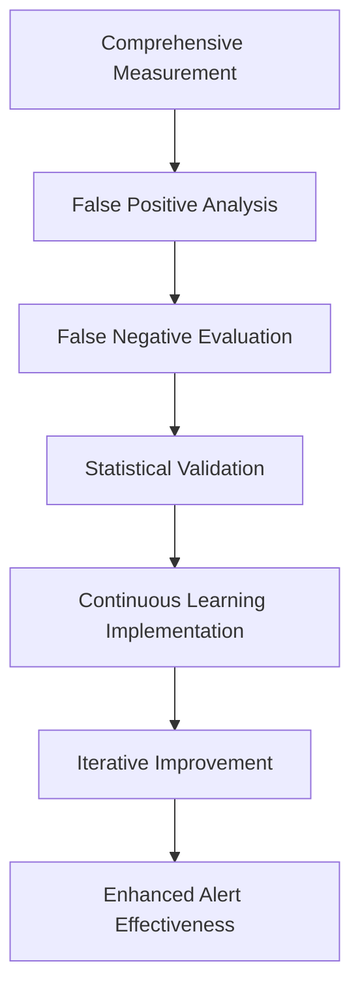

By following this structured process, organizations can progressively enhance the precision and recall of their alerting systems, reducing false alarms while catching more genuine issues. Financial institutions leveraging this approach report significant improvements in both operational efficiency and reliability, transforming alerts into valuable, actionable signals.

### Banking Impact

The business consequences of static versus continuously refined alerting include significant impacts on reliability, efficiency, and team well-being. The table below summarizes key quantified benefits observed in organizations with mature alert refinement processes:

| **Impact Area** | **Static Alerting** | **Continuously Refined Alerting** | **Improvement** |
| ---------------------------------- | -------------------------------------------------------------------- | ---------------------------------------------------------------------------- | ----------------------------------------------- |
| **Reliability Degradation** | Alert effectiveness declines over time, increasing operational risk. | Continuous refinement adapts to evolving systems, minimizing risk. | Enhanced reliability with reduced false alerts. |
| **Resource Efficiency** | Teams struggle to scale due to noisy, ineffective alerts. | Teams handle 30-40% more infrastructure with the same resources. | 30-40% improvement in resource utilization. |
| **Mean-Time-To-Resolution (MTTR)** | Slow, reactive issue resolution due to noisy or unclear signals. | MTTR improves by 5-8% per quarter through precise, actionable alerts. | Quarterly 5-8% MTTR reduction. |
| **Incident Prevention Rates** | Limited proactive detection, leading to more production incidents. | 25-30% annual increase in proactive incident prevention. | 25-30% improvement in early detection. |
| **On-call Health** | High rates of burnout and dissatisfaction among on-call engineers. | Engineers report lower burnout and higher satisfaction, improving retention. | Significant improvement in on-call well-being. |

**Key Takeaway**: Organizations that embrace continuous alert refinement realize compounding benefits over time, transforming alerting from a source of operational noise into a precise tool for maintaining system reliability, optimizing resource use, and supporting team health.

### Implementation Guidance

To implement effective alert refinement loops, follow this structured workflow:

#### **Step-by-Step Checklist**

1. **Establish Baseline Metrics**

   - Define key metrics for alerting effectiveness:
     - False Positive Rate: How often alerts fire without genuine incidents.
     - Detection Coverage: Percent of incidents detected by alerts.
     - Mean-Time-to-Resolution (MTTR): Time taken to address issues.
   - Instrument these metrics across your alerting systems.

2. **Schedule Regular Reviews**

   - Set a recurring cadence (e.g., monthly) for dedicated alert effectiveness reviews.
   - Prepare dashboards and reports in advance to support productive discussions.

3. **Analyze False Positives**

   - Develop a structured workflow for investigating alerts that fire without incidents:
     - Categorize common causes (e.g., noisy thresholds, irrelevant conditions).
     - Establish root causes and propose refinements.

4. **Conduct Gap Analysis**

   - Review incidents that occurred without prior alerts:
     - Identify gaps in detection logic or missing alert patterns.
     - Prioritize high-impact gaps for remediation.

5. **Refine Thresholds and Patterns**

   - Use statistical and historical analysis to tune alert thresholds:
     - Avoid reliance on intuition; leverage data-driven methods.
     - Test proposed changes against historical data for validation.

6. **Build Continuous Testing**

   - Implement synthetic testing or historical replay mechanisms:
     - Validate that new alert patterns behave as expected across past scenarios.
     - Prevent regressions before deploying updates to production.

7. **Track and Demonstrate Progress**

   - Set explicit metrics to measure refinement effectiveness:
     - Track reductions in false positives and improvements in detection coverage.
   - Communicate progress and business value to stakeholders.

#### **Flowchart: Alert Refinement Workflow**

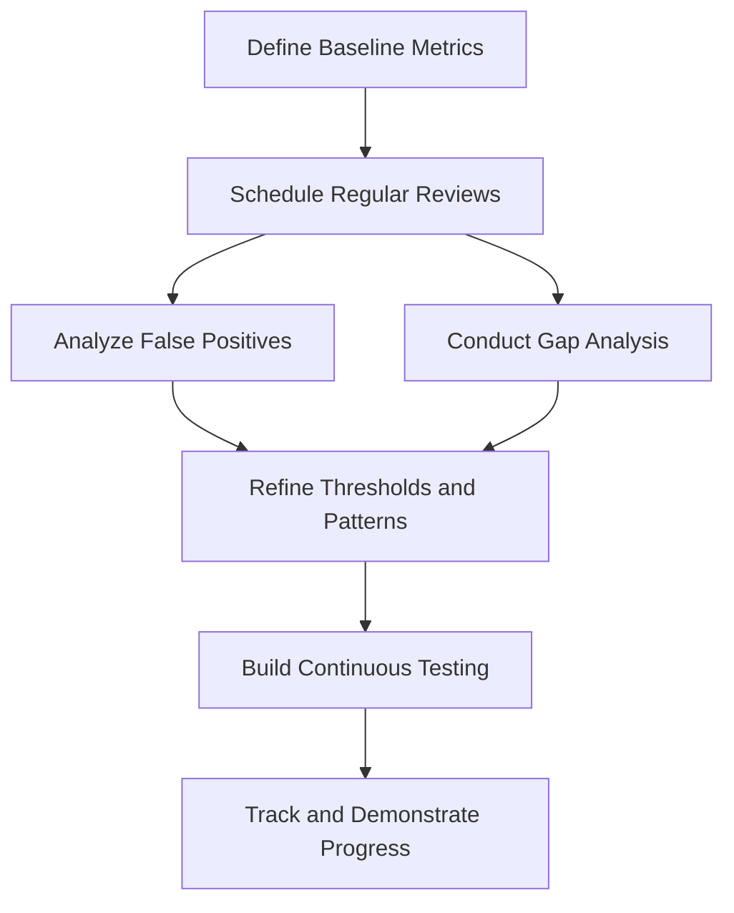

By following this systematic approach, your team can transform alerting into a continuously improving discipline, achieving greater precision and recall while reducing operational noise.

## Panel 10: The Integrated Observability Vision - Unifying Signals

### Scene Description

A modern financial services command center showcasing integrated observability across logs, metrics, and traces. Large visualization displays dominate the room, each presenting a unified view of telemetry data. The command center is organized into key zones:

- **Alert Correlation Zone:** Displays log-based alerts that are automatically linked to related performance metrics and distributed traces. When an unusual pattern in payment processing logs triggers an alert, this zone highlights gradually increasing latency in metrics and specific service interaction delays in traces.
- **Service Dependency Map:** A dynamic diagram showing service relationships, where nodes represent services and edges reflect interactions. Problematic services are highlighted with indicators to guide focus.
- **Unified Investigation Dashboard:** Combines logs, metrics, and traces into a single pane, enabling seamless contextual pivoting between signals. This dashboard allows engineers to drill down into specific incidents, correlating signals to reveal root causes.

Below is a simplified representation of how the system integrates these signals during an investigation:

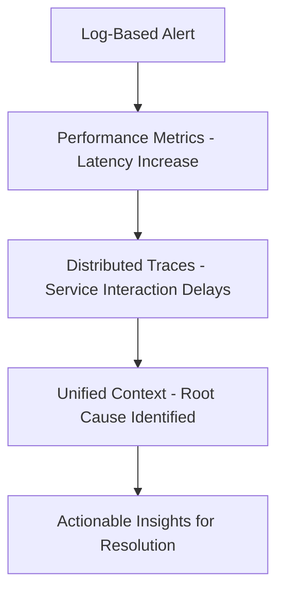

Engineering leaders demonstrate how this unified approach provides complete visibility during investigations. For example, when a payment processing service exhibits unusual error patterns in logs, the system instantly connects these errors to subtle latency increases in metrics and delays in specific service interactions revealed by traces. Documented examples on display highlight complex issues that would have been missed by any single telemetry type but were immediately evident through integrated analysis. This cohesive setup underscores the transformative power of integrated observability in modern financial systems.

### Teaching Narrative

Integrated observability represents the highest evolution of log-based alerting—unifying logs with metrics and traces to create comprehensive visibility beyond what any single signal can provide. While logs offer rich narrative detail about specific events, metrics provide statistical trends across time, and traces show request flows through distributed systems. The true power emerges when these signals are integrated through unified alerting and analysis.

Advanced observability platforms implement this integration through several mechanisms: correlation identifiers that connect logs, metrics, and traces for specific transactions, unified visualization that presents multiple telemetry types in integrated views, cross-signal alerting that considers patterns across different data types, and contextual pivoting that allows seamless movement between signal types during investigation.

To illustrate this process, consider the following example workflow using a payment processing system:

```mermaid
graph TD
    A[Unusual Error Detected in Logs] --> B[Log-Based Alert Triggered]
    B --> C[Performance Metrics Analyzed]
    C --> D[Subtle Latency Increase Identified]
    D --> E[Distributed Trace Analysis Performed]
    E --> F[Specific Service Interaction Delay Pinpointed]
    F --> G[Complete Context Compiled for Incident]
```

1. **Log-Based Alerting**: An unusual error pattern in payment processing logs triggers an alert. This serves as the initial signal that something is wrong.
2. **Metrics Correlation**: The system automatically overlays related performance metrics, revealing a subtle but consistent increase in latency over time.
3. **Trace Analysis**: Distributed traces are analyzed next, identifying specific service interactions contributing to the delays in the payment processing workflow.
4. **Unified Context**: The platform correlates these signals to produce a complete incident report, connecting logs, metrics, and traces in a unified view for rapid diagnosis.

For financial institutions with complex distributed architectures, this integration delivers transformative capabilities. It immediately connects log-based alerts to corresponding performance metrics and transaction traces, correlates seemingly unrelated signals that collectively indicate emerging issues, and provides complete context during incident response without manual correlation. This unified approach reveals the complete picture necessary for rapid resolution, moving beyond isolated monitoring silos to comprehensive observability that leverages all available signals to detect, understand, and resolve complex issues in modern financial systems.

### Common Example of the Problem

Universal Banking Group faced persistent challenges resolving complex performance issues in their wealth management platform, despite significant investments in monitoring tools. The root cause of these challenges lay in their siloed observability approach, where each team monitored separate telemetry types in isolation:

- The operations team focused on infrastructure metrics.
- The application team concentrated on logs.
- The platform team occasionally reviewed distributed traces.

During a critical performance degradation that affected high-value clients, the siloed approach revealed its inherent flaws:

- **Metrics** showed gradual response time increases but only within individual component thresholds, failing to reveal the broader issue.
- **Logs** sporadically indicated timeout errors but at relatively low rates, making it difficult to correlate them to a systemic problem.
- **Traces** ultimately exposed the full picture: cascading delays across multiple services caused by a database connection issue. However, traces were only examined after extended delays and internal debates.

The fragmented visibility extended the mean-time-to-resolution (MTTR) to over four hours as teams struggled to piece together the complete context, debating incomplete and often conflicting data. With an integrated observability approach, these signals would have been automatically correlated, allowing the teams to immediately see the cascading service delays and database issue—reducing MTTR significantly.

#### Siloed vs. Integrated Observability: A Comparative Table

| **Aspect** | **Siloed Observability** | **Integrated Observability** |
| -------------------------- | ---------------------------------------------------------------------------------- | ---------------------------------------------------------------------------------------- |
| **Visibility** | Partial, with each team limited to their own data type (metrics, logs, or traces). | Unified view across logs, metrics, and traces, presenting complete incident context. |
| **Correlation** | Manual and time-consuming, requiring debates and cross-referencing between teams. | Automatic, with correlation identifiers linking signals across telemetry types. |
| **Resolution Time (MTTR)** | Extended due to fragmented data and delays in identifying root causes. | Rapid, with immediate access to interconnected signals that reveal the complete problem. |
| **Outcome** | Higher risk of prolonged downtime, missed root causes, and frustrated teams. | Faster resolution, minimized downtime, and improved confidence in incident management. |

This comparison highlights the transformative power of integrated observability. For Universal Banking Group, adopting such an approach would have immediately surfaced the cascading delays and database connection issue by connecting logs, metrics, and traces in a single, unified view—empowering teams to resolve incidents in minutes instead of hours.

### SRE Best Practice: Evidence-Based Investigation

Integrated observability enables comprehensive system understanding through evidence-based approaches, empowering SREs to detect, analyze, and resolve complex incidents efficiently.

#### Checklist for Evidence-Based Investigation

- **Cross-Signal Correlation**

  - Ensure shared identifiers (e.g., trace IDs, transaction IDs) link logs, metrics, and traces.
  - Automate the mapping of related telemetry data for specific transactions.

- **Multi-Dimensional Analysis**

  - Establish frameworks to analyze patterns across logs, metrics, and traces simultaneously.
  - Include statistical anomaly detection and trend analysis across signal types.

- **Contextual Visualization**

  - Design unified dashboards displaying correlated telemetry data in a single view.
  - Highlight key relationships between logs, performance metrics, and traces.

- **Unified Alerting Logic**

  - Implement alert rules that combine thresholds or trends across multiple telemetry dimensions.
  - Use machine learning or rule-based logic to identify cross-signal patterns.

- **Seamless Investigation Transitions**

  - Enable one-click navigation between logs, metrics, and traces during troubleshooting.
  - Minimize manual correlation by integrating contextual pivoting into observability tools.

#### Benefits of Evidence-Based Investigation

- **Faster Incident Resolution**: Financial institutions leveraging integrated observability report a 40-60% reduction in resolution times for complex incidents.
- **Improved Detection of Distributed Issues**: Subtle, system-wide problems are more easily identified through correlated signals.
- **Enhanced Operational Efficiency**: Unified insights reduce the cognitive load on SREs by eliminating siloed investigations.

By adopting evidence-based investigation practices, SREs can achieve deeper system understanding and significantly improve the efficiency of incident analysis in complex distributed environments.

### Banking Impact

The business consequences of fragmented versus integrated observability include significant improvements across key operational metrics, as shown in the table below:

| **Metric** | **Fragmented Observability** | **Integrated Observability** | **Improvement** |
| ---------------------------------- | ----------------------------------------- | ----------------------------------------- | ----------------------- |
| **Mean Time to Resolution (MTTR)** | 4-6 hours for complex issues | 2-3 hours with immediate context | 30-50% reduction |
| **Root Cause Accuracy** | 60% accuracy in first-time identification | 85% accuracy with unified signal analysis | 40% improvement |
| **Investigation Effort** | High manual correlation across tools | Streamlined with unified workflows | 25-35% reduction |
| **Proactive Detection Rate** | Identifies 50-70% of potential issues | Identifies 70-90% of potential issues | 20-30% increase |
| **Cross-Team Collaboration** | Limited by siloed visibility | Enabled through shared, integrated views | Significant improvement |

These improvements translate directly into measurable outcomes for financial institutions:

1. **Resolution Speed**: Integrated visibility allows teams to reduce MTTR for complex issues through immediate access to comprehensive context, minimizing downtime and customer impact.

2. **Root Cause Accuracy**: By correlating logs, metrics, and traces, organizations achieve a 40% improvement in identifying root causes on the first attempt, reducing repeat incidents and accelerating resolution.

3. **Operational Efficiency**: Investigation effort is reduced by 25-35%, as engineers no longer need to manually switch between disconnected tools and perform manual correlation.

4. **Proactive Detection**: Cross-signal pattern recognition identifies 20-30% more potential issues before they impact customers, enabling teams to act preemptively.

5. **Technical Silo Reduction**: Unified observability fosters collaboration by creating a common language and shared visibility across infrastructure, application, and platform teams, breaking down silos and aligning priorities.

This data illustrates how integrated observability drives measurable improvements in both operational efficiency and customer satisfaction, solidifying its role as a critical enabler in modern financial systems.

### Implementation Guidance

To implement effective integrated observability, follow this step-by-step workflow:

01. **Assess Current Observability Maturity**

    - Evaluate your existing monitoring and observability tools.
    - Identify gaps in telemetry coverage (logs, metrics, traces) and areas where signals are siloed.

02. **Define a Unified Observability Strategy**

    - Establish organizational goals for integrated observability (e.g., faster incident resolution, improved root cause analysis).
    - Align cross-functional teams on the importance of unified signals and correlated insights.

03. **Establish Unified Context Across Signals**

    - Implement consistent correlation identifiers across all telemetry types (e.g., trace IDs, span IDs).
    - Standardize naming conventions, taxonomies, and identifiers to ensure reliable signal correlation.

04. **Select and Deploy Cross-Signal Observability Platforms**

    - Choose an observability solution capable of integrating logs, metrics, and traces into a single platform.
    - Ensure the platform supports unified visualization, cross-signal alerting, and seamless context pivoting.

05. **Implement Context Propagation**

    - Configure systems to propagate observability context (e.g., trace IDs) through service boundaries.
    - Ensure context is preserved across distributed systems, third-party services, and legacy components.

06. **Design Integrated Dashboards**

    - Create role-specific dashboards that unify logs, metrics, and traces into context-aware views.
    - Use visualizations that highlight correlations, anomalies, and relevant alerts in a single pane of glass.

07. **Develop Cross-Signal Alerting Logic**

    - Design alerting mechanisms that combine patterns across different telemetry types.
    - For example, trigger alerts when log error rates correlate with latency spikes in metrics or anomalies in traces.

08. **Implement Unified Search and Analysis**

    - Deploy search capabilities that query logs, metrics, and traces simultaneously.
    - Use consistent terminology and filters to streamline investigative workflows.

09. **Validate and Iterate on Data Consistency**

    - Regularly audit telemetry data for completeness, accuracy, and adherence to naming standards.
    - Address inconsistencies that could compromise signal correlation or integration.

10. **Test and Optimize Incident Response Workflows**

    - Simulate incidents to validate that integrated observability provides actionable insights.
    - Refine workflows based on lessons learned to improve detection, analysis, and resolution speed.

**Workflow Representation**:

```mermaid
flowchart TD
    A[Assess Current Observability Maturity] --> B[Define Unified Observability Strategy]
    B --> C[Establish Unified Context Across Signals]
    C --> D[Deploy Cross-Signal Observability Platforms]
    D --> E[Implement Context Propagation]
    E --> F[Design Integrated Dashboards]
    F --> G[Develop Cross-Signal Alerting Logic]
    G --> H[Implement Unified Search and Analysis]
    H --> I[Validate and Iterate on Data Consistency]
    I --> J[Test and Optimize Incident Response Workflows]
```

By following this structured workflow, organizations can implement integrated observability practices that unify logs, metrics, and traces, enabling faster detection and resolution of complex issues in modern financial systems.
