# Chapter 9: Log Sampling and Filtering - Managing Volume Without Losing Insight

## Chapter Overview

Welcome to the log apocalypse, where banks drown in oceans of their own data, desperately trying to find the one error message that actually matters. This chapter is a survival guide for SREs trapped in endless terabytes of banking logs, where “more data” often means “less insight” and “more cost.” We’ll rip apart the fantasy that brute-force log collection is good observability, show you how to keep the logs that matter, dump the ones that don’t, and save your business millions (and your sanity) in the process. Sampling, filtering, dynamic verbosity, tiered retention, aggregation, and specialized strategies—these aren’t just buzzwords, they’re how you fight back against the log monster. If your idea of log management is “collect everything and pray,” prepare to have your worldview—and your budget—punched in the face.

______________________________________________________________________

## Learning Objectives

- **Diagnose** log volume crises and identify when “comprehensive” logging becomes a business and reliability liability.
- **Implement** sampling strategies that preserve signal while slashing log noise and storage costs.
- **Apply** intelligent filtering to maximize information density and minimize human cognitive overload.
- **Configure** dynamic verbosity to deliver detail on demand—no more all-or-nothing logging.
- **Design** tiered retention policies that align log preservation with actual business, regulatory, and operational value.
- **Aggregate** raw logs to extract patterns and deliver actionable data for long-term analysis without drowning in detail.
- **Tailor** logging strategies to different transaction types—ditch one-size-fits-all for business-aligned observability.
- **Deploy** practical, tech-stack-aware implementation patterns for real-world, multi-generational banking environments.
- **Measure** the real observability impact—connect logging practice to improved operational and financial outcomes.
- **Prepare** for the future: leverage machine learning and intelligent systems to automate and optimize log volume management.

______________________________________________________________________

## Key Takeaways

- More logs ≠ more insight. If your dashboard is timing out and your storage bill is bigger than your revenue, you’re doing it wrong.
- 80% of your logs are landfill. You’ll never look at them, but you’ll pay for them forever.
- Sampling isn’t just for statisticians—done right, it’s how you spot 96% of issues with 10% of the data. Done wrong, it’s how you miss fraud and get fired.
- Filtering is your friend. DEBUG-level everything is for amateurs. Show some restraint and keep your logs readable by humans.
- Dynamic verbosity is the SRE equivalent of caffeine: give yourself a jolt of detail exactly when and where you need it, not all the time.
- Retention hierarchy: keep the logs the regulators care about, nuke the rest on a sensible schedule, and sleep better at night.
- Aggregation means thinking like a data scientist, not a hoarder. Patterns > petabytes.
- Specialized strategies beat “uniform logging” every time. Your wire transfers aren’t the same as ATM balance checks—stop pretending they are.
- Real-world implementation means dealing with Java, .NET, COBOL, and whatever else the last merger dumped in your lap. Consistency beats sophistication.
- If you aren’t measuring the effect of your logging strategy, you’re guessing—and probably wasting money and time.
- Machine learning is coming for your log configs. Either automate and adapt, or prepare to be outpaced by smarter, cheaper, and faster competitors.
- The bottom line: Strategic log management doesn’t just save money—it’s the difference between identifying fraud in minutes or losing millions while you scroll through irrelevant noise.

______________________________________________________________________

## Panel 1: The Volume Crisis - When Logging Becomes Overwhelming

### Scene Description

A bustling banking data center struggles to cope with an overwhelming influx of log data generated by a high-volume payment processing platform. Engineers huddle around performance dashboards, which display alarming metrics:

- **Log Volume Growth**: Metrics illustrate exponential growth, escalating from gigabytes to terabytes daily as transaction volumes surge.
- **System Bottlenecks**: Processing delays in log indexing and query timeouts hinder critical incident investigations.
- **Rising Costs**: Skyrocketing storage expenses are juxtaposed with diminishing observability effectiveness.

The scene highlights cascading impacts on the system:

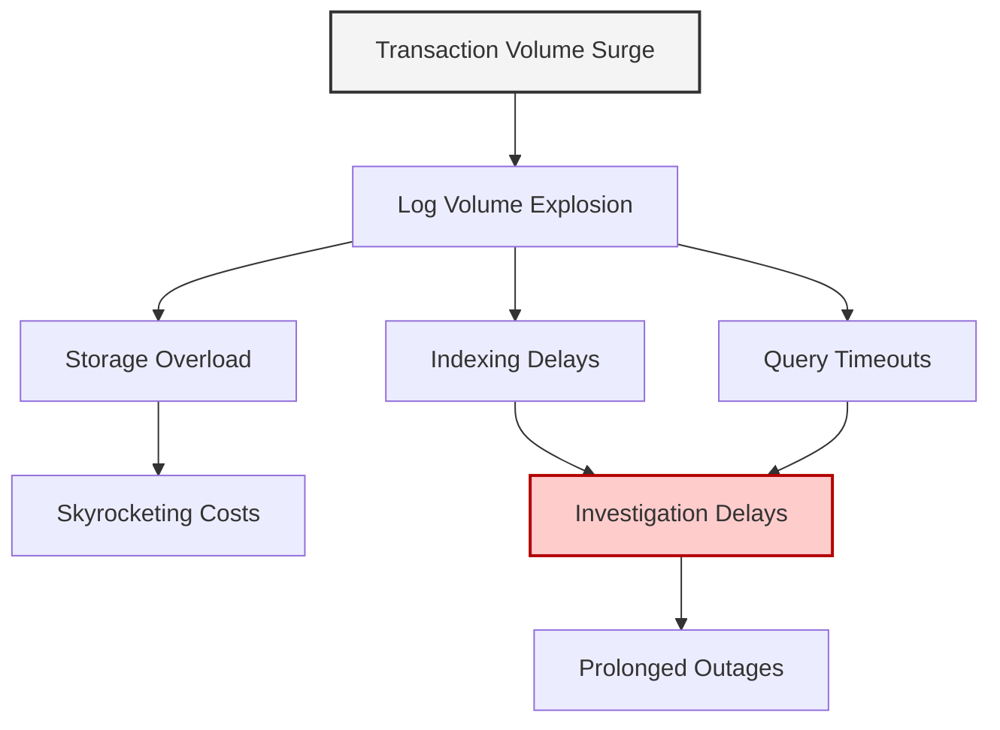

In one corner of the room, a financial visualization starkly reveals the business impact: infrastructure costs spiral upward while observability effectiveness plummets. Nearby, team leaders analyze a critical incident post-mortem where investigation timelines were significantly extended. Key logs were buried amidst the noise of undifferentiated data, leading to prolonged transaction processing outages and a direct hit to service reliability. The engineers realize that without strategic log management, the system's ability to provide actionable insights during crises is diminishing rapidly.

### Teaching Narrative

The log volume crisis represents a fundamental paradox in modern banking systems: the more data you collect, the less usable it becomes without proper management strategies. As financial platforms scale to process millions of daily transactions, corresponding log volumes expand exponentially—creating severe challenges across multiple dimensions: storage capacity becomes unsustainable as costs grow linearly with volume, processing capabilities become overwhelmed as indexing and search systems struggle with massive data ingestion, query performance degrades as analysis tools attempt to process terabytes or petabytes of data, and perhaps most critically, insight effectiveness diminishes as valuable signals get buried in overwhelming noise. This volume challenge creates a dangerous failure mode seen frequently in banking organizations—collecting comprehensive logs but being unable to effectively use them during critical incidents, essentially gaining the storage costs without the observability benefits. The fundamental problem isn't logging itself, but undifferentiated logging that treats all data as equally valuable. Modern log management requires strategic approaches that balance completeness with usability through intelligent sampling, filtering, and retention strategies—preserving critical observability while managing both technical and financial constraints.

### Common Example of the Problem

A major retail bank's card processing system faced a significant log volume crisis, particularly during a recent holiday shopping period. Below is a timeline summarizing the critical events and their impact:

| **Timeframe** | **Event** | **Impact** |
| ------------------------- | -------------------------------------------------------------------------------------------------------------- | --------------------------------------------------------------------------------------------------------- |
| **Normal Operations** | System generates 500 million log entries daily across authorization, fraud detection, and settlement services. | Log infrastructure operates within capacity. |
| **Holiday Surge Begins** | Transaction volumes double, generating over 1 billion log entries per day. | Log storage and indexing systems start to experience delays. |
| **Incident Trigger** | Customers report declined transactions despite sufficient balances. | Support team initiates investigation but encounters query timeouts in log analysis tools. |
| **Critical Failure** | Log indexing falls hours behind real-time transactions. | Recent transaction logs are unavailable for troubleshooting, delaying problem identification. |
| **Root Cause Identified** | Misconfigured fraud service generates duplicate DEBUG logs, consuming 40% of storage. | Unnecessary logs obscure critical signals and inflate storage costs without adding troubleshooting value. |
| **Resulting Impact** | Engineers are unable to resolve the issue during a critical revenue period. | Millions lost in potential transactions despite heavy investments in logging infrastructure. |

This example highlights the cascading failures caused by unchecked log growth. A lack of prioritization and filtering mechanisms overwhelmed both technical systems and operational workflows, rendering the logging infrastructure ineffective during a high-stakes incident.

### SRE Best Practice: Evidence-Based Investigation

The evidence reveals that more logging is not always better logging. Effective SREs implement strategic data management rather than indiscriminate collection. Analysis of log usage patterns at high-performing financial institutions shows that typically only 15-20% of collected logs are ever used for troubleshooting or analytics, yet organizations pay the full cost of storing and processing 100% of the data. Advanced SRE teams implement volume-aware logging strategies that preserve complete data for critical transaction paths while applying intelligent reduction techniques to less critical components.

A comparative study of three banking platforms highlights the impact of strategic logging versus undifferentiated logging:

| **Aspect** | **Platform A (Undifferentiated Logging)** | **Platform B (Moderate Filtering)** | **Platform C (Strategic Logging)** |
| ---------------------------- | ----------------------------------------- | ----------------------------------- | ---------------------------------- |
| **Log Volume Collected** | 100% | 60% | 40% |
| **Incident Resolution Time** | 6 hours average | 3.5 hours average | 1.7 hours average |
| **Storage Costs (Monthly)** | $250,000 | $150,000 | $100,000 |
| **Query Performance** | Frequent timeouts | Occasional slowdowns | Fast and reliable |
| **Signal-to-Noise Ratio** | Low | Moderate | High |

This study revealed that platforms implementing strategic sampling and filtering resolved incidents 3.5x faster than those with undifferentiated comprehensive logging, despite collecting 60-80% less log data. The improved signal-to-noise ratio and faster query performance enabled teams to isolate relevant information quickly, avoiding delays caused by overwhelming log volumes.

To illustrate the underlying mechanics, consider the following simplified flowchart showing how logging strategies influence incident investigation timelines:

```
Incident Occurs
       ↓
Initiate Log Query
       ↓
+------------------+                 +------------------+                 +------------------+
|  Undifferentiated|                 |  Moderate        |                 |  Strategic        |
|  Logging         |                 |  Filtering       |                 |  Logging          |
+------------------+                 +------------------+                 +------------------+
       ↓                                ↓                                ↓
High Query Volume                Reduced Query Volume            Optimized Query Volume
       ↓                                ↓                                ↓
Slow Analysis                     Moderate Analysis               Rapid Analysis
       ↓                                ↓                                ↓
Delayed Resolution                Faster Resolution               Fastest Resolution
```

Mathematical analysis further demonstrates that the probability of identifying relevant log entries decreases with overall volume when search tools become overloaded or timeout. This reinforces the principle that selective logging can often be more effective than comprehensive logging beyond certain scale thresholds, ensuring both technical and financial sustainability.

### Banking Impact

The business consequences of unmanaged log volume extend far beyond infrastructure costs. A mid-size bank calculated that log-related infrastructure represented 28% of their total technology spending while delivering diminishing returns as volumes grew. More critically, mean-time-to-resolution (MTTR) for customer-impacting incidents increased by 267% over two years as log volumes quadrupled, directly affecting customer experience and regulatory compliance.

During a recent payment processing outage, a major financial institution required 4.3 hours to identify the root cause hidden within billions of log entries, resulting in an estimated $2.7 million in lost transaction revenue and significantly impacting customer satisfaction metrics. Subsequent analysis showed that with optimized logging strategies, the same issue could have been identified in under 20 minutes.

The following chart illustrates the financial and operational impact of unmanaged log volumes over time, emphasizing the correlation between log growth, resolution delays, and escalating costs:

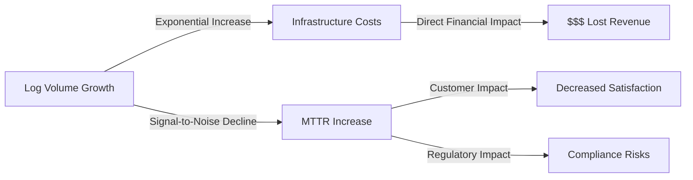

Beyond the direct financial impact, overwhelming log volumes create compliance risks when financial institutions cannot effectively search transaction history for regulatory inquiries or fraud investigations within required timeframes. By adopting optimized logging strategies—such as intelligent filtering, sampling, and tiered retention policies—banks can significantly reduce costs, improve MTTR, and maintain compliance while ensuring critical operational insights remain accessible.

### Implementation Guidance

To effectively manage the log volume crisis and implement strategic logging practices, follow this step-by-step guidance. Use the checklist and flow diagram below to ensure a structured approach:

#### Checklist for Log Volume Management

- [ ] **Baseline Your Log Economics**
  - Measure current storage costs per GB.
  - Quantify infrastructure overhead for collection and indexing.
  - Map the relationship between log volume and query performance under various loads.
- [ ] **Analyze Usage Patterns**
  - Track log access to identify frequently used versus rarely accessed logs.
  - Prioritize retention of high-utility logs and consider optimizing or discarding low-utility, high-volume sources.
- [ ] **Implement Service-Tiering**
  - Categorize services by criticality (e.g., critical payment processing, informational services).
  - Apply comprehensive logging to critical services and sampling to lower-priority ones.
- [ ] **Define Volume Circuit-Breakers**
  - Establish thresholds for log volume and processing performance.
  - Configure automatic filters or sampling mechanisms that activate when thresholds are exceeded.
- [ ] **Adopt Progressive Enhancement**
  - Preserve complete data for errors and warnings.
  - Sample routine informational events intelligently.
  - Ensure 100% retention of logs for customer-impacting transaction failures.
- [ ] **Implement Monitoring Feedback Loops**
  - Set up monitoring for log volumes, processing latency, and query performance.
  - Configure alerts for when logging becomes a bottleneck.

#### Step-by-Step Flow Diagram

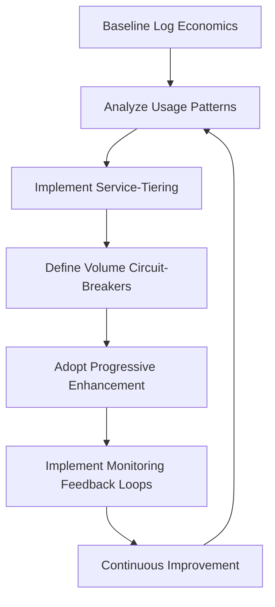

By following this structured process, you can ensure that your organization's logging practices remain effective, scalable, and aligned with both technical and financial constraints. Always iterate and refine based on evolving system demands and observability needs.

## Panel 2: The Sampling Fundamentals - Representative Data Reduction

### Scene Description

A banking analytics lab where data scientists demonstrate statistical sampling approaches applied to transaction logs. The lab is equipped with several visualization screens that display comparisons between different sampling methods: complete logging of all transactions, fixed ratio sampling, stratified sampling by transaction type, adaptive sampling based on error rates, and statistically representative random selection.

Below is a conceptual representation of the lab setup and sampling comparisons:

```
+-----------------------------+       +-----------------------------+
| Complete Transaction Log    |       | Sampled Transaction Logs    |
|                             |       |                             |
| All transactions logged     |       | Method 1: Fixed Ratio      |
| High storage requirements   |       | Method 2: Stratified       |
|                             |       | Method 3: Adaptive         |
|                             |       | Method 4: Random Selection |
+-----------------------------+       +-----------------------------+
           |                                         |
           |                                         |
           +------------------+----------------------+
                              |
                              v
                +-----------------------------+
                | Comparison and Analysis      |
                |                             |
                | Query results from complete |
                | datasets vs sampled ones    |
                | Storage reduction: ~90%     |
                | Analytical validity retained|
                +-----------------------------+
```

Engineers analyze the effectiveness of each sampling approach by comparing query results from the complete dataset against sampled subsets. This setup highlights how properly designed sampling can reduce storage volumes by 90% while maintaining statistically valid conclusions for most analyses. A real incident simulation further demonstrates how effective sampling preserves the detectability of critical patterns, even with significantly reduced data volumes. The visualized comparisons and hands-on analysis showcase the transformative potential of strategic data reduction in high-volume banking systems.

### Teaching Narrative

Sampling transforms log management from an all-or-nothing approach to a strategic data reduction technique that preserves analytical validity while dramatically reducing volume. Rather than logging every event in high-volume banking systems, sampling retains a statistically representative subset that enables accurate analysis with a fraction of the storage and processing requirements. Effective sampling implements several key strategies: ratio-based sampling that logs a fixed percentage of transactions (e.g., 10% of all payment authorizations), stratified sampling that ensures proper representation across important categories (maintaining higher sampling rates for high-value transactions while reducing rates for routine operations), adaptive sampling that adjusts rates based on system conditions (increasing sampling during errors or unusual patterns), and statistically valid random selection that ensures unbiased representation. For financial transaction systems, where complete logging of every operation might generate petabytes of data, these techniques provide critical relief—reducing volumes by 80-95% while maintaining the ability to detect patterns, troubleshoot issues, and analyze trends. The key insight is recognizing that most analytical questions don't require every log entry—statistical validity can be maintained with properly designed sampling that preserves representative data distribution while eliminating unnecessary volume.

### Common Example of the Problem

A national bank's online and mobile banking platform serves over 5 million daily active users, generating nearly 2 billion log entries daily across authentication, account services, and statement generation. The platform experienced a subtle authentication issue affecting approximately 2% of login attempts during peak hours. The investigation process was significantly delayed due to the overwhelming volume of log data. Below is a timeline breakdown illustrating the challenges faced and how sampling could have improved the resolution:

#### Timeline Breakdown of the Investigation Process

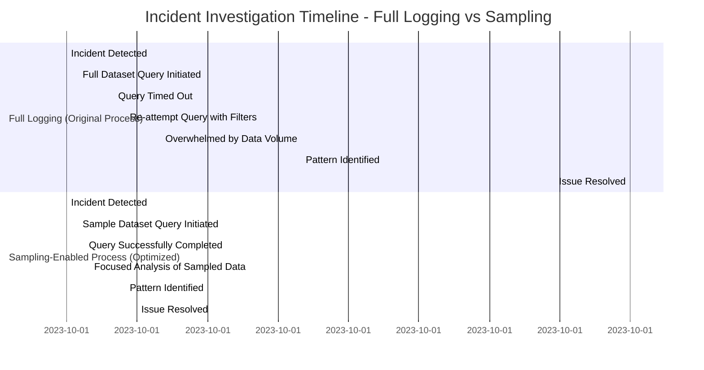

#### Step-by-Step Breakdown of the Problem:

1. **Incident Detection**: The authentication issue was flagged during peak hours, but it affected only a small percentage of login attempts, making the pattern non-obvious.
2. **Full Dataset Query**: Without sampling, the investigation team queried the complete dataset to isolate affected transactions. The query took over 30 minutes and eventually timed out due to the dataset's size.
3. **Repeated Queries**: Multiple query re-attempts with added filters were necessary, but even with narrowed scopes, the process was slow and resource-intensive.
4. **Overwhelmed by Data**: When results were retrieved, the engineers were inundated with millions of log entries, making it difficult to identify the subtle pattern in a timely manner.
5. **Delayed Resolution**: The issue persisted for nearly 8 hours before the root cause was identified and addressed.

#### How Sampling Could Have Helped:

- **Faster Query Execution**: With a strategically sampled dataset (e.g., 5-10% of logs), queries would execute significantly faster, returning actionable results in minutes rather than hours.
- **Focused Analysis**: Sampling would reduce the total number of entries to analyze, allowing engineers to pinpoint patterns without being overwhelmed by excessive data.
- **Preserved Pattern Detectability**: Properly designed sampling (e.g., stratified or adaptive) would ensure the 2% authentication issue remained detectable, even with reduced data volumes.
- **Quicker Issue Resolution**: By reducing the investigation timeline from 8 hours to under 1 hour, sampling would minimize customer impact and improve operational efficiency.

### SRE Best Practice: Evidence-Based Investigation

Statistical analysis demonstrates that properly implemented sampling preserves detection capability while dramatically improving analytical efficiency. A comparative study across financial institutions revealed that for pattern detection in transaction logs, a properly designed 10% sampling strategy detected 96.4% of the anomalies identifiable in complete datasets, while reducing storage requirements by 90% and improving query performance by 850%.

The key evidence-based principle is that sampling effectiveness depends on implementation strategy, not just rate. A major payment processor demonstrated that naive random sampling at 10% identified only 72% of significant issues, while stratified sampling at the same 10% overall rate—with higher sampling for errors and unusual patterns—identified 98% of issues while maintaining the same volume reduction.

To provide a clearer comparison of sampling approaches, the following table summarizes their effectiveness based on key metrics:

| Sampling Approach | Anomaly Detection Accuracy | Storage Reduction | Key Considerations |
| --------------------- | -------------------------- | ----------------- | ------------------------------------------------------------- |
| Naive Random Sampling | 72% | 90% | Simple to implement, but may miss critical patterns. |
| Stratified Sampling | 98% | 90% | Ensures representation of important categories; more complex. |
| Adaptive Sampling | 95% | 85-90% | Dynamically adjusts rates based on system conditions. |
| Representative Random | 94% | 90% | Balances unbiased selection with statistical validity. |

Advanced SRE teams implement "retention sampling" rather than "collection sampling"—initially processing all logs for real-time detection but automatically applying sampling algorithms during the persistence phase. This ensures that statistical validity is preserved while storage requirements are significantly reduced. By strategically leveraging these approaches, organizations can maintain robust anomaly detection and analysis capabilities with a fraction of the data volume.

### Banking Impact

The business impact of effective sampling strategies can be summarized through real-world examples that highlight cost savings, operational efficiency, and risk mitigation:

#### Case Study 1: Cost Efficiency and Improved Resolution Times

**Organization:** Regional Bank\
**Challenge:** High storage costs and slow query performance due to complete transaction logging.\
**Solution:** Implemented stratified sampling, retaining full logs for errors and exceptional cases.\
**Outcome:**

- **87% reduction** in storage volume.
- Annual logging infrastructure costs reduced by **$3.2 million**.
- **47% improvement** in mean-time-to-resolution (MTTR) for customer-reported issues, thanks to faster query execution on sampled data.

#### Case Study 2: Fraud Detection and Revenue Protection

**Organization:** Major Payment Processor\
**Challenge:** Difficulty detecting fraud in overwhelming complete logs or simplistic sampling approaches.\
**Solution:** Deployed adaptive sampling to increase logging during anomalous activity.\
**Outcome:**

- Detected a sophisticated fraud attack that would have been missed otherwise.
- Prevented approximately **$4.7 million** in fraudulent transactions.

#### Case Study 3: Compliance and Operational Benefits

**Organizations:** Multiple Financial Institutions\
**Challenge:** Balancing regulatory compliance with storage and processing costs.\
**Solution:** Adopted statistically validated sampling strategies and documented methodologies for regulatory audits.\
**Outcome:**

- Successfully defended sampling approaches to regulators.
- Achieved substantial storage and cost reductions while maintaining compliance.

#### Summary of Key Impacts

```mermaid
graph TD
A[Effective Sampling Strategies] --> B[Cost Savings]
A --> C[Operational Efficiency]
A --> D[Revenue Protection]
B --> E[87% reduction in storage (Case Study 1)]
B --> F[$3.2M annual savings (Case Study 1)]
C --> G[47% faster MTTR (Case Study 1)]
D --> H[$4.7M fraud prevented (Case Study 2)]
A --> I[Regulatory Compliance]
I --> J[Statistical Validation (Case Study 3)]
```

These examples demonstrate how properly designed sampling strategies not only reduce costs but also enhance system performance, safeguard revenue, and ensure compliance with regulatory standards.

### Implementation Guidance

To effectively implement sampling for representative data reduction, follow the structured checklist and workflow below. This ensures a robust, validated, and maintainable approach.

#### Checklist for Sampling Implementation

1. **Statistical Validation**

   - [ ] Use historical data to test sampling techniques.
   - [ ] Compare statistical accuracy and pattern detection between full datasets and sampled subsets.
   - [ ] Validate whether sampled data preserves key trends and anomalies.

2. **Stratified Sampling Design**

   - [ ] Identify critical transaction categories requiring higher sampling rates (e.g., high-value transactions, error events).
   - [ ] Define sampling rates for routine, high-volume transactions to reduce data load.
   - [ ] Ensure category-specific rates align with analytical requirements.

3. **Safety Mechanisms**

   - [ ] Implement fallback to full logging during incidents or anomalies.
   - [ ] Automate temporary sampling rate increases during error spikes or unusual activity.

4. **Selection Method Consistency**

   - [ ] Use deterministic sampling methods (e.g., hash-based sampling by transaction ID).
   - [ ] Maintain event group integrity within sampled datasets to avoid fragmenting related flows.

5. **Exception Logging**

   - [ ] Configure 100% logging for error events, security exceptions, and anomalous transactions.
   - [ ] Ensure complete logging bypasses sampling for critical data points.

6. **Documentation**

   - [ ] Clearly document your sampling methodology, including validation workflows and exception handling.
   - [ ] Provide detailed records for engineering teams and regulatory compliance audits.

7. **Continuous Validation**

   - [ ] Conduct periodic comparisons of sampled data against complete datasets.
   - [ ] Adjust sampling strategies as transaction patterns evolve to maintain statistical validity.

______________________________________________________________________

#### Workflow for Sampling Implementation

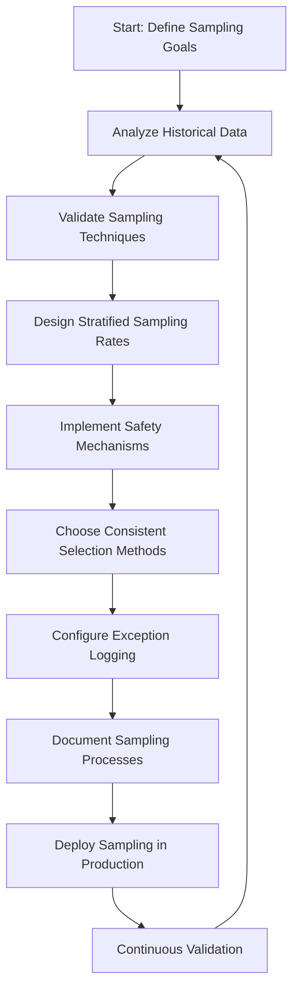

- **Start:** Define the goals of sampling (e.g., data reduction, anomaly detection).
- **Analyze Historical Data:** Use past datasets to evaluate expected patterns and critical categories.
- **Validate Sampling Techniques:** Test different sampling strategies on historical data for accuracy.
- **Design Stratified Sampling Rates:** Ensure proportional representation across transaction categories.
- **Implement Safety Mechanisms:** Add fallback and adaptive features for error conditions.
- **Choose Consistent Selection Methods:** Use deterministic algorithms for unbiased sampling.
- **Configure Exception Logging:** Ensure all critical events bypass sampling.
- **Document Sampling Processes:** Maintain comprehensive records for transparency and compliance.
- **Deploy Sampling in Production:** Implement the validated sampling approach in live systems.
- **Continuous Validation:** Regularly validate the effectiveness of sampling, looping back to adjust strategies as needed.

## Panel 3: The Intelligent Filtering - Selective Precision

### Scene Description

A digital banking platform operations center where engineers implement selective filtering strategies across different transaction flows. The room features large monitoring dashboards displaying specialized filtering rules tailored for various banking services:

- **Authentication and Authorization Systems:** Complete logging is preserved for maximum traceability.
- **Statement Generation Processes:** Routine operations are filtered out, reducing log noise.
- **Transactions with Warning Signs:** Verbose debug logging is enabled to capture granular details.
- **Context-Aware Filtering:** Logging verbosity adjusts dynamically based on error indicators.

Below is a simplified diagram illustrating how filtering strategies are applied across services, and their impact on log volume and relevance:

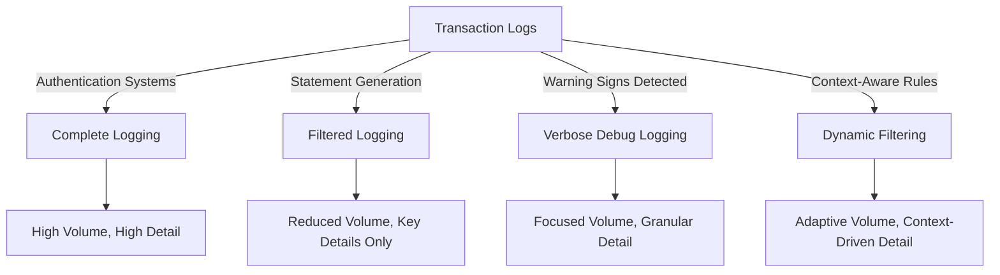

Additionally, a timeline visualization demonstrates the impact of these techniques on operational efficiency:

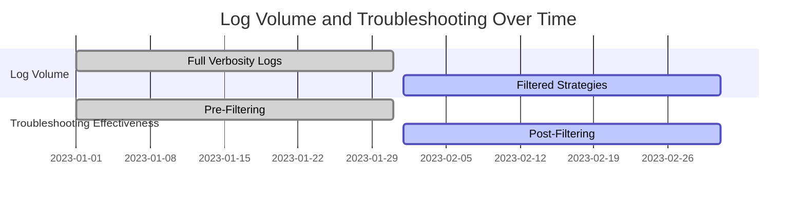

These techniques have resulted in a 70% reduction in overall log volume, while improving troubleshooting effectiveness by emphasizing relevant information. For example, a recent incident post-mortem demonstrated how intelligent filtering uncovered unusual patterns that would have been buried in full verbosity logs. This approach highlights the principle of maximizing information density—prioritizing signal over noise.

### Teaching Narrative

Intelligent filtering complements sampling by selectively preserving high-value information while reducing low-value verbosity. While sampling reduces volume by limiting the quantity of events logged, filtering refines the quality of information within those events—a critical distinction for effective log management. Modern filtering implements several strategic approaches: severity-based filtering that adjusts detail levels based on event importance (full context for errors, minimal details for routine operations), context-aware filtering that modifies verbosity based on transaction characteristics (more detail for high-value transfers, less for routine balance checks), pattern-based filtering that increases detail when unusual behaviors emerge, and adaptive filtering that automatically adjusts based on system conditions (increasing verbosity during incidents, reducing during normal operations). For banking platforms, where different transaction types have vastly different observability requirements, this nuanced approach creates substantial benefits—reducing overall volume while actually enhancing visibility where it matters most. Authentication failures might warrant comprehensive logging of all details, while successful routine operations need only basic outcome recording. The key principle is information density rather than raw volume—maximizing the signal-to-noise ratio by emphasizing relevant details while minimizing routine verbosity.

### Common Example of the Problem

A global investment bank's trading platform generates detailed logs for every step of order processing—validation, routing, execution, and settlement. During normal trading days, the system handles approximately 2.5 million orders, generating over 500 million log entries. Engineers configured extensive DEBUG logging to help troubleshoot complex trading issues, capturing complete payload details for every API call, database query, and message queue operation.

To illustrate the problem, consider the following breakdown:

| **Step** | **Log Volume (% of Total)** | **Log Details** |
| ---------- | --------------------------- | -------------------------------------------------------------------------- |
| Validation | 20% | Input payloads, schema checks, and format compliance for each order. |
| Routing | 25% | API calls for routing decisions, queue operations, and network handshakes. |
| Execution | 40% | Trade execution details, market interactions, and response payloads. |
| Settlement | 15% | Confirmation messages, database updates, and audit record generation. |

When investigating a client-reported issue with specific option trades, the troubleshooting team faced significant challenges:

- **Log Volume per Trade**: Each trade generated over 4,000 log entries, the majority of which contained repetitive or irrelevant information.
- **Critical Messages Buried**: Error messages indicating validation failures were obscured by routine processing logs.
- **Time-Consuming Analysis**: The team spent over 6 hours sifting through verbosity before identifying the root cause—a simple data format discrepancy clearly indicated in just a few key log entries.

Below is a simplified flow of how logs were generated and why critical errors were obscured:

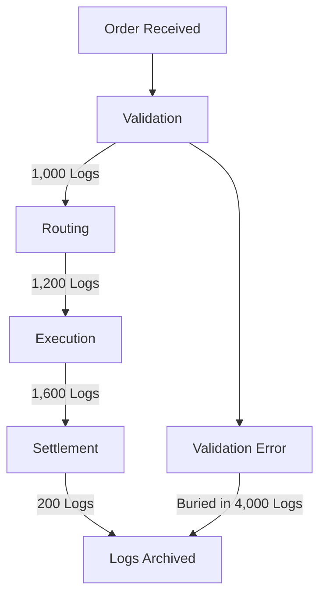

This example highlights the inefficiency of verbose logging: while the system captured exhaustive detail, the signal-to-noise ratio was so low that important insights were nearly lost. This underscores the need for intelligent filtering to prioritize relevant information and reduce investigative overhead.

### SRE Best Practice: Evidence-Based Investigation

Analysis of log usage patterns during incident investigations reveals that increased verbosity often decreases troubleshooting effectiveness beyond certain thresholds. A research study across financial services organizations demonstrated that engineering teams using intelligent filtering resolved similar incidents **2.8x faster** than those using comprehensive high-verbosity logging, despite the filtered logs containing **65-85% less data by volume**.

The evidence shows that cognitive overload becomes a significant factor in troubleshooting efficiency—beyond approximately **500-1,000 relevant log entries**, human analysts experience rapidly diminishing returns from additional detail. Effective SRE teams implement precision filtering that emphasizes contextual relevance over raw quantity.

Furthermore, pattern analysis proves that optimal filtering is highly context-dependent:

- **Payment Processing Services**: Benefit from transaction-focused filtering that preserves complete context for individual financial operations while eliminating system-level verbosity.
- **Authentication Systems**: Show better results with user-session-based filtering that maintains comprehensive logs for individual user journeys while reducing repetitive infrastructure logging.

#### Key Metrics Summary

| Metric | Intelligent Filtering (IF) | High-Verbosity Logging (HVL) |
| ------------------------------------ | -------------------------- | ---------------------------- |
| Incident Resolution Speed | 2.8x faster (with IF) | Baseline |
| Log Data Volume | 65-85% less (with IF) | 100% (full verbosity) |
| Analyst Cognitive Overload Threshold | 500-1,000 log entries | Frequently exceeded |

#### Evidence-Based Filtering Process (Flow Representation)

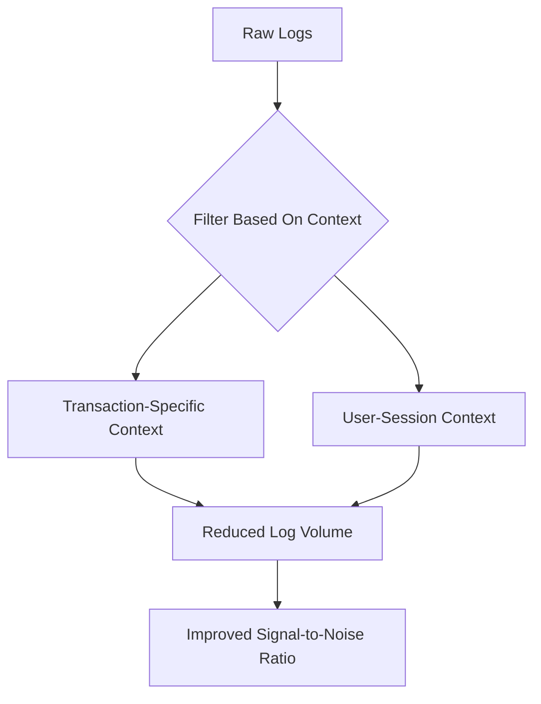

By adopting evidence-based filtering practices, SREs can maximize troubleshooting efficiency, reduce log noise, and ensure critical details remain accessible for high-priority investigations.

### Banking Impact

The business impact of intelligent filtering extends far beyond technical efficiency. Below is a snapshot summarizing key outcomes from real-world implementations:

#### **Case Study Snapshot: Banking Success with Intelligent Filtering**

```
+--------------------------------------------------+
|               Intelligent Filtering Impact       |
+----------------------+---------------------------+
| **Metric**           | **Outcome**              |
+----------------------+---------------------------+
| Log Volume Reduced   | 73%                      |
| Storage Cost Savings | $2.1M annually           |
| MTTR Improvement     | 41% faster resolutions   |
| Regulatory Response  | 30-60% faster audits     |
| Security Success     | Detection of credential  |
|                      | stuffing attack          |
+----------------------+---------------------------+
```

- **Case Example 1: Retail Bank Efficiency**\
  A major retail bank implemented context-aware filtering for their mobile banking platform, reducing log volume by 73% while preserving complete transaction narratives for all customer-impacting operations. This strategy saved $2.1 million annually in storage costs and improved mean-time-to-resolution (MTTR) for customer-reported issues by 41%.

- **Case Example 2: Security Incident Response**\
  A financial services company utilized severity-aware filtering to preserve comprehensive context for all security warnings while minimizing routine operational logs. This approach enabled them to detect a sophisticated credential stuffing attack that would have been buried in unfiltered logs, highlighting critical security patterns, and preventing account compromises and potential financial losses.

- **Regulatory Enhancement**\
  Intelligent filtering streamlined compliance processes by emphasizing transaction context over system verbosity. Several institutions reported 30-60% faster response times to regulatory inquiries, as relevant transaction records became more immediately accessible for audits and investigations.

These results underscore the transformative potential of intelligent filtering: reducing operational overhead while enhancing visibility, security, and compliance.

### Implementation Guidance

To effectively implement intelligent filtering strategies, follow this actionable checklist and step-by-step process:

______________________________________________________________________

#### **Checklist for Intelligent Filtering Implementation**

- [ ] **Analyze Log Utilization Patterns**
  - Review recent incident investigations.
  - Identify logs that contributed to issue resolution versus those that added noise.
  - Derive filtering rules based on high-value log data.
- [ ] **Implement Contextual Filtering**
  - Define filtering rules tailored to transaction characteristics.
  - Apply comprehensive logging for high-value operations (e.g., large transfers, account creation).
  - Aggressively filter routine operations (e.g., balance checks).
- [ ] **Configure Severity-Aware Verbosity**
  - Set logging frameworks to adjust detail levels automatically by severity.
  - Capture full context for errors and warnings.
  - Minimize verbosity for routine informational events.
- [ ] **Develop Pattern-Based Exceptions**
  - Detect unusual patterns dynamically (e.g., high response times, sudden error spikes).
  - Temporarily bypass filters for additional context during anomalies.
  - Define triggers and thresholds for these dynamic adjustments.
- [ ] **Balance Standardization and Specialization**
  - Create baseline filtering standards applicable across all systems.
  - Allow domain-specific customization for specialized banking processes (e.g., payments vs. identity management).
- [ ] **Preserve Forensic Essentials**
  - Ensure logs critical for security and compliance remain intact.
  - Avoid filtering for transaction integrity and authentication logs.
- [ ] **Implement Continuous Adjustment**
  - Establish feedback loops to assess filtering effectiveness.
  - Use troubleshooting outcomes to inform rule adjustments.
  - Automate rule refinement based on evolving system needs.

______________________________________________________________________

#### **Step-by-Step Diagram for Implementation**

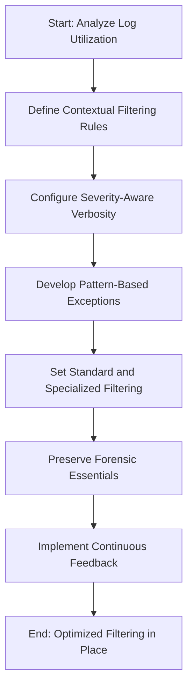

______________________________________________________________________

By following this structured approach, you can systematically implement intelligent filtering strategies that balance log volume reduction with enhanced observability, ensuring high-value information is retained for effective troubleshooting and compliance.

## Panel 4: The Dynamic Verbosity - Adaptive Detail Levels

### Scene Description

A banking platform reliability center where engineers demonstrate their dynamic logging implementation. On interactive displays, they show how verbosity automatically adjusts based on transaction characteristics: a routine credit card payment generates minimal logs with basic outcome information, while a high-value wire transfer with unusual patterns triggers detailed logging across its entire processing path. Alert dashboards illustrate how unusual error patterns automatically elevate logging detail for affected components, capturing comprehensive diagnostic information precisely when needed. Performance metrics highlight how this approach maintains minimal baseline volumes during normal operations while providing complete visibility during anomalies—delivering both efficiency and effectiveness.

#### Dynamic Verbosity Flow Overview

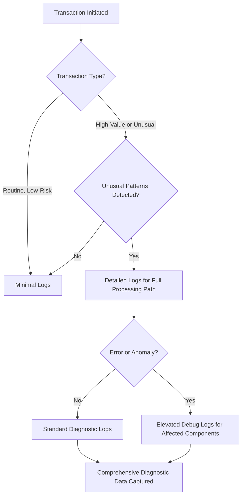

This diagram illustrates the decision-making process of the dynamic verbosity system. It adapts logging levels based on transaction type, detected patterns, and system anomalies. Routine transactions generate minimal logs, while high-value or unusual transactions trigger detailed logging. If errors or anomalies occur, the system further escalates logging for affected components, ensuring precise diagnostic information is captured only when necessary.

### Teaching Narrative

Dynamic verbosity represents the evolution from static logging configurations to intelligent, context-aware systems that adapt detail levels based on operational conditions. Traditional logging implementations typically use fixed verbosity levels—configured once and changed only through manual intervention. This static approach forces impossible tradeoffs between comprehensive visibility and manageable volumes. Dynamic verbosity eliminates this false choice through automated adaptation: condition-based verbosity that increases detail when specific events or patterns occur, value-based verbosity that adjusts based on transaction characteristics (amount, customer tier, risk profile), anomaly-driven verbosity that automatically increases when unusual patterns emerge, and temporal adaptation that modifies logging during specific operational periods (month-end processing, market opening). For financial services platforms, these capabilities transform both operational efficiency and troubleshooting effectiveness—maintaining minimal log volumes during normal operations while automatically capturing comprehensive detail exactly when needed for diagnosis. When a payment authorization service experiences unusual error patterns, dynamic verbosity automatically increases debug-level logging for affected transaction types—providing complete diagnostic information without requiring manual reconfiguration or generating excessive volumes during normal operations. This intelligence layer transforms logging from a crude all-or-nothing approach to a sophisticated observability system that optimizes both resource utilization and diagnostic capability.

### Common Example of the Problem

A regional bank's wire transfer system processes approximately 20,000 domestic and international transfers daily. To ensure comprehensive visibility for these high-value transactions, operations teams configured DEBUG-level logging across all components. While this approach provided excellent diagnostic capabilities, it also introduced significant challenges:

| **Aspect** | **Fixed Verbosity (DEBUG Level)** | **Dynamic Verbosity (Adaptive)** |
| ------------------------ | ------------------------------------------------------------------------- | -------------------------------------------------------------------------------------------------------------------- |
| **Log Volume** | Over 4TB of logs generated daily, creating storage and processing strain. | Minimal baseline log volume during normal operations; detailed logs only for specific events. |
| **Storage Cost** | High costs due to excessive log retention requirements. | Reduced costs by storing only necessary logs at higher verbosity levels when conditions demand. |
| **Troubleshooting Time** | Manual sifting through ~400 log entries per transaction for diagnostics. | Automated elevation of relevant logs for affected transactions, reducing noise and accelerating root cause analysis. |
| **Incident Response** | Over 2 hours spent filtering unrelated logs during a service disruption. | Immediate focus on critical signals during incidents, streamlining resolution efforts. |

For example, during a service disruption affecting specific currency corridors, the team struggled to pinpoint the root cause—buried within an overwhelming volume of routine logs. The issue was eventually traced to a downstream currency conversion service, but only after significant delays. With dynamic verbosity, the logging system would automatically elevate detail levels for affected transactions, highlighting the relevant diagnostic information without requiring exhaustive manual filtering. This intelligent adaptation resolves the tradeoff between comprehensive visibility and operational efficiency, enabling faster troubleshooting while reducing unnecessary overhead.

### SRE Best Practice: Evidence-Based Investigation

Research across financial institutions demonstrates that dynamic verbosity consistently outperforms both minimal and comprehensive static logging approaches. Data from organizations implementing adaptive logging shows 78% lower storage utilization during normal operations while maintaining 96% of the diagnostic capability of full verbose logging during anomalies and incidents.

The evidence reveals that optimal logging detail varies dramatically based on transaction context. Analysis of troubleshooting patterns shows that for routine, successful operations, minimal outcome logging is sufficient for over 99% of investigation needs. However, for transactions with unusual characteristics or error conditions, comprehensive context significantly accelerates root cause identification.

Advanced SRE teams implement mathematically-derived adaptation thresholds rather than intuitive settings. A major payment processor analyzed thousands of past incidents to identify statistically significant indicators that warrant increased verbosity, creating precise triggers for dynamic adaptation rather than simplistic error-based escalation.

Here’s an outline of how adaptive thresholds are derived and applied in a dynamic verbosity system:

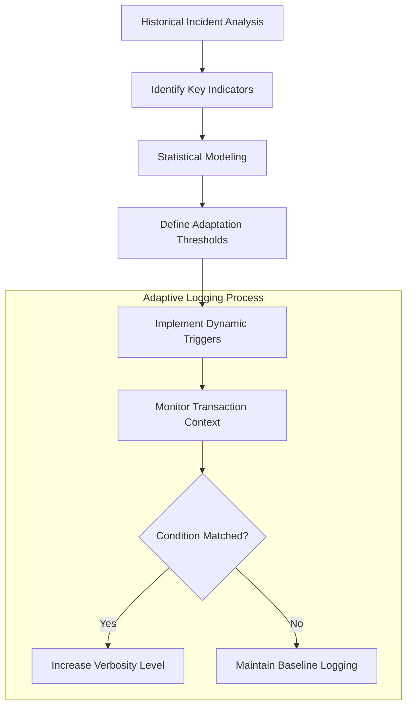

- **Historical Incident Analysis**: Review past incidents to extract patterns and anomalies that required increased logging for resolution.
- **Identify Key Indicators**: Determine transaction attributes (e.g., amount, risk profile, error codes) that correlate with investigative needs.
- **Statistical Modeling**: Use data science techniques to validate and quantify the significance of these indicators.
- **Define Adaptation Thresholds**: Establish precise criteria for when verbosity should escalate based on validated indicators.
- **Implement Dynamic Triggers**: Integrate thresholds into the logging system to automatically adjust verbosity during runtime.

By grounding adaptation thresholds in rigorous, evidence-based analysis, SRE teams achieve a balance between efficiency and diagnostic effectiveness. This approach ensures the system dynamically provides comprehensive detail precisely when needed, without manual intervention or excessive log volumes during normal operations.

### Banking Impact

The business impact of dynamic verbosity extends far beyond technical efficiency. A global bank implemented context-aware adaptive logging for their treasury management platform, reducing overall log volume by 82% while maintaining comprehensive diagnostic capability for unusual transactions and error conditions. This approach reduced their annual logging infrastructure costs by $3.7 million while simultaneously improving mean-time-to-resolution for customer-reported issues by 37%.

#### Case Study: $3.7 Million Saved with Adaptive Logging

**Organization:** A global financial institution\
**Challenge:** Escalating infrastructure costs from excessive log volumes combined with difficulty diagnosing issues during anomalies.\
**Solution:** The bank implemented a dynamic verbosity system that adjusted log detail based on transaction characteristics and error patterns. Routine operations logged minimal data for efficiency, while unusual transactions and anomalies triggered detailed logging automatically.\
**Results:**

- **82% Reduction in Log Volume:** Optimized log output during normal operations, dramatically lowering storage and processing costs.
- **$3.7M Annual Savings:** Significant cost reductions in logging infrastructure.
- **37% Faster Issue Resolution:** Improved diagnostic detail during anomalies reduced the time required to resolve customer-reported issues.

Dynamic verbosity also directly enhances customer experience during incidents. A financial services company implemented automatic verbosity elevation based on error rate thresholds, enabling them to diagnose and resolve a subtle transaction routing issue within 17 minutes that previously would have required hours of manual log analysis and configuration changes to capture the necessary diagnostic information.

From a compliance perspective, adaptive logging improves the balance between comprehensive recordkeeping and data minimization principles. Several institutions have successfully implemented dynamic approaches that maintain complete audit trails for unusual transactions that might indicate financial crimes while reducing detail for routine operations, satisfying both regulatory requirements and data protection principles.

### Implementation Guidance

Implementing dynamic verbosity requires a structured approach to ensure its effectiveness and alignment with operational goals. Use the following checklist to guide implementation:

#### Checklist for Dynamic Verbosity Implementation

1. **Identify Key Adaptation Triggers**

   - Analyze historical incidents and operational data to pinpoint scenarios requiring increased logging detail.
   - Define measurable triggers, such as:
     - Error rate thresholds (e.g., 5% increase in transaction failures).
     - Performance degradation indicators (e.g., latency spikes above 300ms).
     - Transaction risk characteristics (e.g., flagged high-risk profiles or unusual amounts).

2. **Implement Value-Based Adaptation**

   - Configure logging frameworks to dynamically adjust verbosity based on:
     - Transaction attributes like value, customer tier, or risk profile.
     - Routine transactions: Apply minimal logging.
     - High-value or unusual transactions: Elevate logging detail.

3. **Create Automatic Elevation Mechanisms**

   - Develop real-time monitoring to detect anomalies and dynamically adjust logging.
   - Implement localized triggers (e.g., specific microservice errors).
   - Include system-wide indicators (e.g., unusual traffic patterns across services).

4. **Design Circuit Breakers**

   - Introduce safeguards to prevent excessive log generation during elevated verbosity.
   - Define upper limits for log volume to ensure resource consumption remains manageable.
   - Use error suppression strategies to prevent redundant or unnecessary logs.

5. **Build Temporal Adaptation**

   - Schedule verbosity adjustments for predictable high-risk periods, such as:
     - Financial close periods or month-end processing.
     - Market opening hours or maintenance windows.
   - Proactively configure elevated logging for these intervals.

6. **Ensure Operational Visibility**

   - Build dedicated dashboards to monitor dynamic verbosity, including:
     - Current verbosity levels across systems.
     - Recent adaptation events and their triggers.
     - Log volume trends and storage utilization metrics.

7. **Develop Feedback Mechanisms**

   - Establish regular review cycles to evaluate dynamic verbosity effectiveness.
   - Use feedback to adjust triggers and thresholds based on:
     - Missed issues (indicating insufficient detail).
     - Excessive noise complaints (indicating overly detailed logging).
   - Collect input from incident postmortems and operational teams to refine configurations.

______________________________________________________________________

#### Example Workflow Diagram

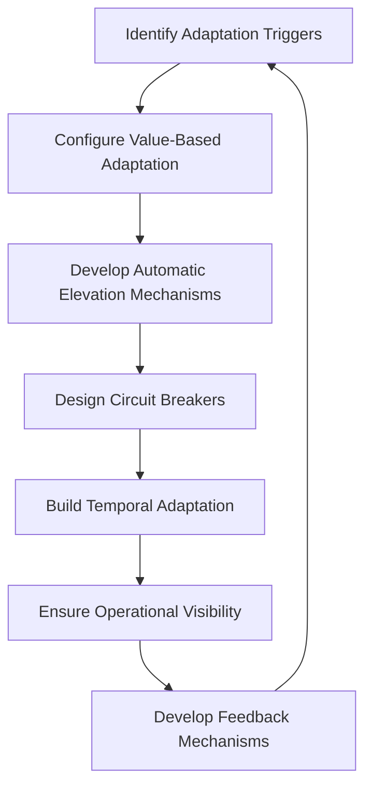

By following this checklist and iterating based on feedback, teams can implement dynamic verbosity systems that balance resource efficiency with diagnostic precision.

## Panel 5: The Retention Hierarchy - Time-Based Optimization

### Scene Description

A regulatory compliance review where banking data officers present their tiered log retention strategy. The strategy is illustrated through a hierarchical visualization of log categories and their retention policies. Below is a representation of the retention hierarchy using a flowchart:

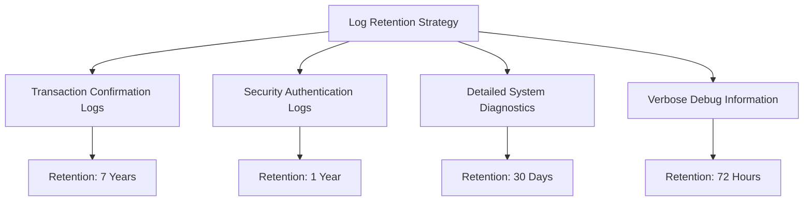

In this system, transaction confirmation logs are preserved for seven years to meet financial regulations, security authentication logs are maintained for one year, detailed system diagnostics are kept for 30 days, and verbose debug information is retained for only 72 hours. Storage analysis reveals that this tiered approach reduces long-term costs by 80% compared to uniform retention policies while maintaining both compliance and operational accessibility to relevant historical data. The team also demonstrates how their retention automation systematically enforces these policies across distributed systems, ensuring compliance without the need for manual intervention.

### Teaching Narrative

Retention hierarchy transforms log management from uniform preservation to strategic, time-based optimization based on different information types and values. Traditional approaches often apply simplistic retention policies—keeping all logs for the same duration regardless of content or purpose. This creates unnecessary costs for low-value data while potentially creating compliance risks for high-value records. Modern retention strategies implement tiered approaches based on data classification: compliance-driven retention for logs with regulatory requirements (transaction records, financial authorizations, customer consents), security-focused retention for logs with risk management value (authentication events, access patterns, security alerts), operational retention for logs with troubleshooting utility (application errors, system state changes), and minimal retention for high-volume diagnostic data with short-term value (debug logging, routine operations). For financial institutions, these hierarchical policies deliver dual benefits—reducing storage costs for low-value data while ensuring proper preservation of critical information subject to regulatory requirements. Transaction confirmations might require seven-year retention for regulatory compliance, while verbose API request logging might need only days or weeks for operational troubleshooting. This differentiated approach recognizes that log entries have varying business and operational value that should determine their preservation lifecycle rather than applying uniform policies that either over-retain low-value data or under-retain critical records.

### Common Example of the Problem

A multinational bank implemented a comprehensive logging solution for their credit card processing platform. Concerned about regulatory compliance and worried about missing critical information during investigations, they established a standard 5-year retention policy for all log data. This undifferentiated approach seemed prudent but created massive inefficiency. Detailed DEBUG logs from load balancers, network devices, and application servers—representing over 85% of total volume but rarely used beyond a few days—consumed expensive compliant storage for years. Meanwhile, actual financial transaction records were stored in the same repositories without special handling despite their critical compliance importance. When regulators requested specific cardholder dispute records from three years prior, the team struggled to locate the relevant transaction logs buried among petabytes of routine operational data. The investigation was delayed by over 48 hours, creating potential regulatory exposure. Simultaneously, the platform was generating over $4.2 million in annual storage costs, with an estimated 78% spent preserving logs that had no business or operational value beyond 30 days.

#### Summary Table: Inefficiencies in a Uniform Retention Policy

| Log Type | Typical Volume (%) | Retention Period (Set by Policy) | Ideal Retention Period | Storage Cost Contribution | Utility Beyond Ideal Period |
| ---------------------------- | ------------------ | -------------------------------- | ---------------------- | ------------------------- | --------------------------- |
| DEBUG Logs (Load Balancers) | 40% | 5 Years | 3 Days | High | Minimal |
| DEBUG Logs (App Servers) | 25% | 5 Years | 7 Days | High | Minimal |
| DEBUG Logs (Network Devices) | 20% | 5 Years | 7 Days | High | Minimal |
| Transaction Records | 10% | 5 Years | 7 Years | Moderate | Critical |
| Security Logs | 5% | 5 Years | 1 Year | Low | Moderate |

This table highlights the key inefficiencies of the bank’s uniform retention policy. Over 85% of the stored logs (DEBUG logs) had minimal utility beyond their ideal retention periods of a few days to a week, yet they were retained for five years, consuming costly storage. Conversely, critical transaction records required longer-term retention for compliance but were stored in the same way, creating operational challenges during investigations. Adopting a tiered retention strategy could have addressed these inefficiencies, reducing storage costs and ensuring compliance with regulatory requirements.

### SRE Best Practice: Evidence-Based Investigation

Analysis of log access patterns reveals dramatic differences in utility periods across log types. A study across financial institutions showed that 92% of all log access for troubleshooting purposes occurs within the first 72 hours after generation, with only 6% occurring between 3-30 days, and just 2% beyond 30 days. However, transaction verification and compliance investigations follow completely different patterns, with access distributed more evenly across multi-year periods.

The following timeline illustrates the distinct utility periods for different log categories based on access patterns:

```
Transaction Logs           | <---|-------------------|---------------------|---------------------->
                            Year 1                  Year 3               Year 7 (Compliance Retention)
Security Authentication    | <---|-------------------|--------------------->
Logs                        Day 1                 Month 12 (Risk Management Retention)
System Diagnostics         | <---|------------------->
Logs                        Hour 1               Day 30 (Operational Retention)
Verbose Debug Logs         | <---|--->
                            Hour 1             Hour 72 (Short-Term Retention)
```

Evidence demonstrates that differentiated retention delivers both compliance and cost benefits. Organizations implementing tiered retention strategies maintain 100% of the data needed for regulatory purposes while reducing overall storage costs by 60-85% compared to uniform retention policies.

The most effective SRE teams implement evidence-based classification based on actual usage patterns rather than intuitive categorization. For example, a major payment processor analyzed years of log access data to create statistically-derived retention categories based on demonstrated utility periods rather than simplistic type-based grouping. This approach optimized both operational capability and storage efficiency, enabling smarter retention strategies that align with real-world needs.

### Banking Impact

The business impact of strategic retention extends far beyond storage cost reduction. A global financial institution implemented tiered retention for their core banking platform, reducing annual storage costs by $3.8 million while simultaneously improving compliance posture by providing dedicated, optimized storage for regulatory-sensitive logs.

Differentiated retention directly improves compliance capabilities. A major bank implemented specialized retention for transaction logs and customer authorization records, creating dedicated repositories with enhanced search capabilities and compliance controls. This approach reduced response time for regulatory inquiries from days to hours by eliminating the need to search through massive volumes of operational logs to locate specific financial records.

From a risk management perspective, strategic retention balances preservation requirements against data minimization principles. Several institutions reported improved security posture by implementing aggressive retention policies for sensitive authentication logs—preserving security value for investigation periods while reducing exposure through automatic purging after risk-appropriate intervals.

This tiered approach is not exclusive to banking. In the healthcare industry, hospitals have adopted similar strategies to manage electronic medical records (EMRs) and diagnostic system logs. For example, patient treatment records are retained for years in compliance with healthcare regulations, while high-frequency telemetry data from monitoring equipment is purged within days unless flagged for further analysis. This ensures compliance with privacy laws while controlling storage costs for non-critical data.

In the e-commerce sector, retailers optimize retention for transaction and inventory logs. Sales data is preserved for several years to support financial audits and customer return policies, while low-value logs, such as routine API debug information, are retained for only a few days. This approach streamlines operational troubleshooting and reduces overhead without compromising essential business records.

These examples demonstrate the broader applicability of time-based retention strategies. Whether in banking, healthcare, or e-commerce, organizations can achieve significant cost savings, improve compliance readiness, and enhance operational efficiency by tailoring log retention policies to the specific value and requirements of their data.

### Implementation Guidance

To effectively implement a retention hierarchy for time-based optimization, follow this structured checklist:

#### **Checklist: Steps for Retention Hierarchy Implementation**

1. **Create a Log Classification Framework**

   - Develop a taxonomy categorizing log types based on regulatory, security, and operational criteria.
   - Define clear criteria for each retention tier to avoid arbitrary categorization.

2. **Analyze Usage Patterns**

   - Review historical access data to determine how often and for how long different log types are utilized.
   - Base retention periods on demonstrated value rather than assumptions.

3. **Align with Regulatory Requirements**

   - Document applicable regulations (e.g., SOX, PCI-DSS, AML, local banking laws).
   - Ensure retention policies meet compliance obligations while optimizing storage for non-regulated data.

4. **Implement Automated Classification**

   - Build automated mechanisms to categorize logs into retention tiers based on metadata, source, or content.
   - Ensure classification happens at log generation to reduce manual overhead.

5. **Create Dedicated Repositories**

   - Set up specialized storage systems aligned with retention tiers:
     - **High-performance** for operational data.
     - **Compliance-focused archives** for regulatory records.
     - **Cost-efficient cold storage** for intermediate retention data.

6. **Define Data Lifecycle Automation**

   - Automate the entire retention lifecycle:
     - Initial storage.
     - Transitions for aging data.
     - Secure deletion at the end of the retention period.
   - Minimize manual handling to reduce compliance risks.

7. **Develop Compliance Reporting**

   - Create detailed documentation that includes:
     - Retention policies.
     - Technical implementation evidence.
     - Audit-ready validation reports.

#### **Key Considerations**

- Ensure cross-team collaboration between compliance, security, and operations to align priorities.
- Regularly review and update retention policies to adapt to evolving regulatory and business needs.
- Monitor automated processes for accuracy and adherence to defined policies.

#### **Retention Process Flow**

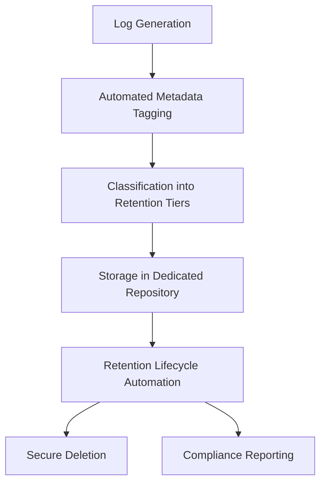

This checklist and visual flow provide a practical and actionable guide to implementing a structured retention hierarchy while maintaining compliance and operational efficiency.

## Panel 6: The Aggregate Transformation - Patterns Over Details

### Scene Description

A financial analytics center where data engineers demonstrate log aggregation techniques applied to high-volume transaction data. The center features interactive displays that visually contrast raw logs and aggregated data transformations:

- **Raw Logs:** Detailed records showing every individual card authorization, including timestamps, transaction IDs, response codes, and full event details.
- **Aggregated Data:** Summaries such as hourly transaction volumes, error rates grouped by type, statistical distributions of response times, and extracted patterns highlighting unusual activity.

Below is a conceptual flow diagram illustrating the transformation process from raw logs to aggregated insights:

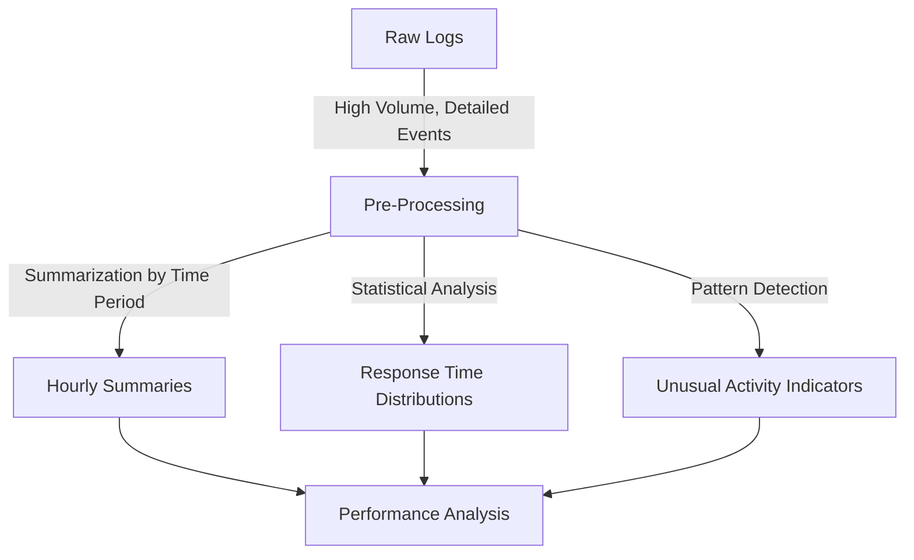

This transformation is showcased in real-time, with performance comparisons highlighting how queries against aggregated data complete in seconds, while raw log-based queries may take minutes or hours. For example:

- **Raw Query:** Retrieving all transactions with specific error codes over a week.
- **Aggregated Query:** Fetching hourly error rates and trends over the same period.

Historical displays further emphasize the value of aggregation for long-term trend analysis, demonstrating how terabytes of detailed logs can be distilled into manageable datasets. This enables the identification of critical patterns—like increasing error rates or gradual performance degradation—while significantly reducing storage requirements. The scene underscores aggregation’s role in balancing operational troubleshooting needs with scalable, long-term analytics.

### Teaching Narrative

Aggregation transforms logging strategy from preserving every detail to capturing essential patterns through statistical summarization—dramatically reducing volume while maintaining analytical value for specific use cases. Rather than storing every individual event, aggregation preserves derived statistics that support pattern analysis: volume metrics calculating operation counts by type and outcome, performance statistics capturing response time distributions rather than individual measurements, error summaries tracking failure rates and categories, and pattern indicators preserving unusual behavior markers without raw details. For banking systems processing millions of daily transactions, these techniques deliver order-of-magnitude reductions in storage requirements while enabling analytical capabilities that would be impractical with raw data—particularly for long-term trend analysis. Credit card authorization logs might generate terabytes of detailed events, but most analysis requires only hourly summaries of approval rates, response time distributions, and unusual decline patterns. The key insight is recognizing different observability purposes—while troubleshooting specific incidents typically requires detailed event logs, many monitoring and analysis functions operate effectively on statistical patterns rather than raw events. Mature implementations maintain both approaches: detailed logging with shorter retention for operational troubleshooting, and aggregated datasets with extended retention for long-term analysis—optimizing different data structures for different purposes rather than forcing a single approach for all observability needs.

### Common Example of the Problem

A large retail bank's ATM network generates detailed logs for every customer interaction—card insertion, PIN validation, transaction selection, authorization, and dispensing operations. With over 2,000 ATMs processing approximately 500,000 daily transactions, the system produces nearly 15 million detailed log entries every day. When the fraud team needed to analyze six months of transaction patterns to identify potential skimming attacks based on unusual usage patterns, they encountered significant challenges.

#### Step-by-Step Illustration of the Problem

1. **Raw Data Volume**:

   - **Daily Logs**: 15 million entries.
   - **Six-Month Logs**: 15 million entries x ~180 days = ~2.7 billion records.

2. **Query Challenges**:

   - Each query against the raw logs involves scanning billions of records.
   - Example query: "Show transaction volume patterns by location and time."
     - **Result**: Queries take hours or time out due to resource constraints.
   - Resource bottlenecks prevent timely fraud detection and analysis.

3. **Workarounds and Limitations**:

   - The security team manually maintains spreadsheets with basic aggregated statistics.
   - Manual calculations result in limited scope and accuracy.
   - These workarounds fail to leverage the granularity of raw data for deeper insights.

#### Table: Comparison of Raw Logs vs Aggregated Data

| Aspect | Raw Logs | Aggregated Data |
| ---------------------------- | ----------------------------- | -------------------------------------- |
| **Data Volume (6 months)** | ~2.7 billion records | ~1,500 aggregated summaries (hourly) |
| **Storage Requirements** | Terabytes | Gigabytes |
| **Query Performance** | Hours or timeouts | Seconds |
| **Fraud Detection Use Case** | Infeasible for trend analysis | Efficient pattern recognition possible |
| **Team Efficiency** | Manual workarounds required | Streamlined analysis with automation |

#### Key Insights

- Without aggregation, the sheer volume of raw data overwhelms the system's ability to perform timely queries.
- Aggregation reduces data from billions of records to manageable summaries, enabling efficient querying and actionable insights.
- By focusing on patterns (e.g., hourly transaction volumes, error rates, and unusual declines), fraud detection and long-term trend analysis become achievable without sacrificing critical observability.

### SRE Best Practice: Evidence-Based Investigation

Analysis of analytical query patterns reveals that many operational and business questions require patterns rather than individual events. A research study across financial monitoring teams showed that approximately 65% of regular analytical queries operate on aggregate statistics, with only 35% requiring individual transaction details.

The evidence demonstrates that properly designed aggregation preserves analytical capability while dramatically improving performance. Organizations implementing dual approaches—raw logs for short-term troubleshooting alongside aggregates for trend analysis—reported a 98% reduction in storage requirements for long-term data while maintaining 94% of analytical capability for pattern-based questions.

#### Visualizing the Impact of Aggregation

Below is a simplified representation of the query pattern distribution and storage reduction achieved through aggregation techniques:

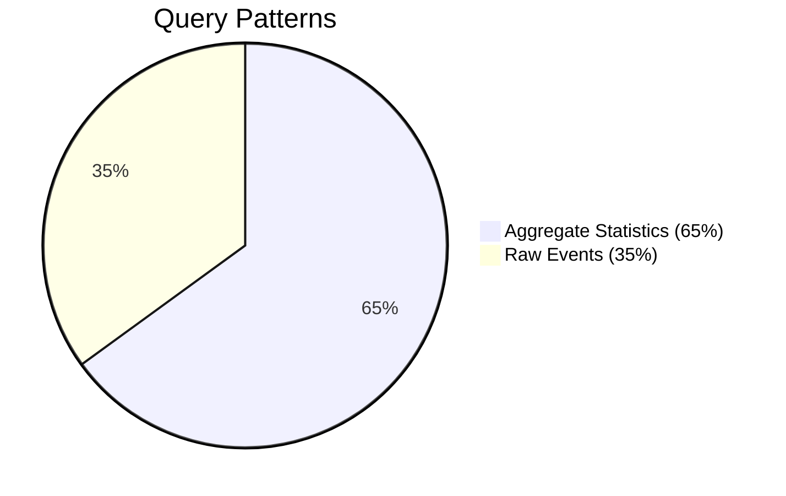

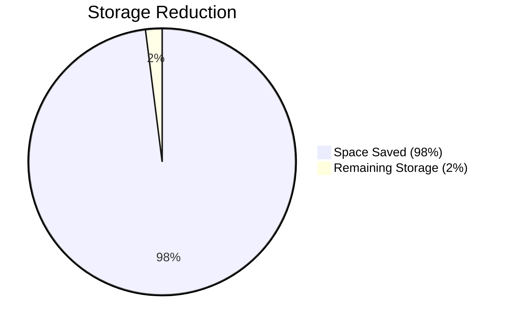

Advanced SRE teams implement statistical validation of aggregation approaches rather than intuitive summarization. For example, a major card processor developed mathematically verified aggregation methods that preserve statistically significant patterns while eliminating raw details. Validation confirmed that their summaries detected the same anomalies visible in full datasets while requiring less than 1% of the storage.

By leveraging these practices, organizations can balance operational troubleshooting needs with long-term analytical efficiency, ensuring scalability and actionable insights even as data volumes grow.

### Banking Impact

The business impact of strategic aggregation extends beyond technical efficiency, enabling transformative outcomes for financial institutions. A multinational bank implemented a tiered aggregation strategy for their digital banking platform by retaining raw logs for 14 days while maintaining hourly statistical summaries for 2 years. This approach reduced long-term storage costs by 98% and facilitated unprecedented analytical capabilities, such as identifying subtle fraud patterns that emerged gradually over several months.

Aggregation also enhances security through improved pattern visibility. For example, a major financial institution deployed cross-channel aggregation to consolidate summary statistics from online banking, mobile apps, and call center authentication attempts. This unified perspective uncovered coordinated attack patterns that were undetectable when analyzing individual channels in isolation. With aggregated authentication data, the institution detected and mitigated threats faster, significantly reducing exposure to fraud.

From a business intelligence perspective, aggregation transforms raw logs into actionable analytics assets. Multiple institutions have leveraged aggregated transaction patterns to drive innovation, such as developing data-driven products and optimizing services based on actual customer behavior. For example, one regional bank used aggregated transaction data to design a new rewards program tailored to customer spending trends, resulting in a 15% increase in customer engagement within the first quarter of launch.

#### Real-World Case Study: Aggregation Drives Fraud Detection and Cost Efficiency

A multinational bank processed over 1 billion daily transaction logs from their credit card authorization systems. By adopting an aggregation strategy, they achieved the following:

- **Storage Efficiency:** Reduced storage needs by 97%, cutting costs by millions annually.
- **Fraud Detection:** Detected coordinated fraud attempts across regions using aggregated decline patterns.
- **Performance Gains:** Enabled analytics queries to run in seconds instead of hours, accelerating decision-making.
- **Customer Insights:** Identified long-term trends in approval rates, leading to process improvements that reduced false declines by 12%.

This case demonstrates how aggregation delivers practical business value, combining cost savings with enhanced security and actionable insights to support both operational and strategic objectives.

### Implementation Guidance

To effectively implement log aggregation strategies that prioritize patterns over details, follow the steps below. Use the checklist and flowchart as actionable guides to ensure a structured and comprehensive approach.

#### Checklist for Log Aggregation Implementation:

- **Define Analytical Requirements**:

  - [ ] Identify key business questions and analysis needs.
  - [ ] Determine essential statistics or patterns for long-term analysis.
  - [ ] Avoid starting with raw data; work backward from analytical goals.

- **Develop Multi-Dimensional Aggregation**:

  - [ ] Plan aggregation strategies to capture time-based trends (e.g., hourly or daily summaries).
  - [ ] Incorporate customer-based and channel-based aggregations for deeper insights.
  - [ ] Ensure aggregations support comparisons across critical dimensions.

- **Ensure Statistical Rigor**:

  - [ ] Use techniques that preserve statistical accuracy (e.g., response time distributions, not just averages).
  - [ ] Validate that aggregations maintain analytical fidelity for critical metrics.

- **Create Dual-Path Processing**:

  - [ ] Design pipelines to process and store raw logs for troubleshooting.
  - [ ] Simultaneously generate aggregated datasets optimized for long-term retention and analysis.
  - [ ] Ensure pipelines are tuned for their respective purposes without overlap or compromise.

- **Balance Detail and Pattern**:

  - [ ] Determine appropriate granularity levels for different use cases (e.g., hourly for volume trends, minute-by-minute for performance metrics).
  - [ ] Match granularity to business questions and operational requirements.

- **Validate Pattern Detection**:

  - [ ] Test aggregations against historical incidents to confirm detectability of critical patterns.
  - [ ] Regularly review and adjust aggregation methods to maintain visibility into key issues.

- **Design for Augmentation**:

  - [ ] Enable seamless retrieval of raw logs to complement aggregated data when needed.
  - [ ] Facilitate smooth transitions between summary data and detailed views for specific investigations.

#### Flowchart for Log Aggregation Strategy

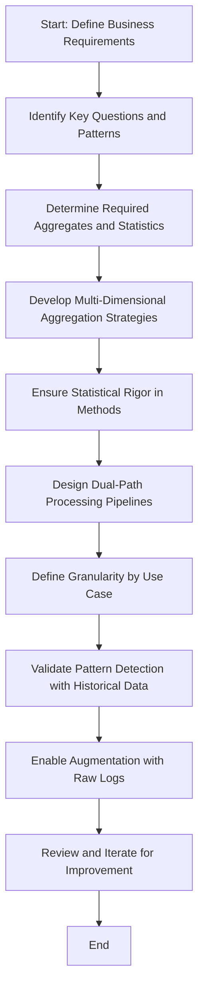

By following this step-by-step approach and utilizing the checklist and flowchart, you can implement an effective aggregation strategy that balances the need for detailed troubleshooting with long-term trend analysis, optimizing storage and analytical performance.

## Panel 7: The Specialized Strategies - Transaction-Type Optimization

### Scene Description

A banking platform architecture review where engineers analyze logging strategies optimized for different financial operations. The discussion focuses on four specialized approaches, each tailored to specific transaction types:

- **Complete Trace Logging**: Applied to high-value wire transfers to capture every step with full detail, ensuring compliance and operational transparency.
- **Sampling-Based Logging**: Used for routine card transactions, where representative samples provide statistical insights without overwhelming log storage.
- **Exception-Only Logging**: Focused on statement generation processes, logging only errors or anomalies in predictable, batch-oriented workflows.
- **Temporal Sampling**: Implemented for high-volume ATM operations, balancing visibility and efficiency by sampling logs at specific intervals or under predefined conditions.

The following table summarizes these strategies:

| **Transaction Type** | **Logging Strategy** | **Purpose** | **Impact on Log Volume** |
| ------------------------------ | ---------------------- | -------------------------------------------------------------------------- | ----------------------------------- |
| High-Value Wire Transfers | Complete Trace Logging | Ensure comprehensive visibility and compliance for high-risk transactions. | High log volume, justified by value |
| Routine Card Transactions | Sampling-Based Logging | Provide statistical representation of frequent, low-risk transactions. | Moderate reduction in log volume |
| Statement Generation Processes | Exception-Only Logging | Focus on capturing anomalies in predictable batch workflows. | Significant reduction in log volume |
| High-Volume ATM Operations | Temporal Sampling | Balance visibility and efficiency for frequent, high-volume interactions. | Substantial reduction in log volume |

Performance dashboards illustrate how these strategies collectively reduced overall log volumes by 85%, while maintaining critical visibility for high-priority operations. The engineers and architects explain how their approach aligns operational monitoring with business value, prioritizing observability resources for transactions with higher significance.

Below is a simplified flow diagram to visualize the decision-making process for logging strategy selection:

```mermaid
graph TD
    A[Transaction Type] --> B[High-Value Wire Transfers]
    A --> C[Routine Card Transactions]
    A --> D[Statement Generation Processes]
    A --> E[High-Volume ATM Operations]
    B --> F[Complete Trace Logging]
    C --> G[Sampling-Based Logging]
    D --> H[Exception-Only Logging]
    E --> I[Temporal Sampling]
```

This combination of visual aids and structured explanations highlights how specialized logging strategies optimize both operational efficiency and business value alignment.

### Teaching Narrative

Specialized transaction strategies recognize that different banking operations have fundamentally different observability requirements—requiring tailored approaches rather than uniform logging policies. A one-size-fits-all logging strategy inevitably creates either excessive volume or insufficient visibility as it fails to align with diverse operational patterns. Modern approaches implement transaction-specific optimization: complete logging for high-value or high-risk operations where comprehensive visibility justifies the storage cost, sampling-based approaches for high-volume routine transactions where statistical representation is sufficient, exception-focused logging for predictable batch operations where normal processing requires minimal detail, and hybrid approaches that combine different techniques based on transaction characteristics. For financial institutions with diverse products and channels, these specialized strategies deliver substantial benefits—focusing observability resources where they create the most operational and business value. International wire transfers might warrant comprehensive trace logging of every step due to their high value and regulatory sensitivity, while routine ATM balance inquiries might implement 10% sampling with full logging only for errors or unusual patterns. This nuanced approach recognizes that observability is an investment that should be strategically aligned with business priorities rather than applied uniformly across all operations regardless of value or risk.

### Common Example of the Problem

A major investment bank implemented a standardized comprehensive logging strategy across all operations—from high-frequency trading execution to routine portfolio statements. This uniform approach generated over 8TB of logs daily, creating significant storage and processing challenges. Below is a timeline illustrating the sequence of events during a recent investigation into a failed trade execution:

```mermaid
gantt
    title Timeline: Investigation of Failed Trade Execution
    dateFormat  HH:mm
    section Log Generation
    Logging for all operations starts                      :done, gen1, 00:00, 24h
    Excessive logs from routine processes accumulate       :done, gen2, 00:00, 24h
    section Issue Detection
    Trade execution issue detected by monitoring           :crit, detect, 11:00, 30m
    section Investigation
    Query initiated to isolate affected transactions       :active, query1, 11:30, 30m
    Query delayed due to volume of unrelated logs          :done, delay1, 12:00, 2h
    Filtering attempts to locate relevant errors           :done, filter1, 14:00, 1h
    Relevant logs identified and issue isolated            :milestone, isolate, 15:00, 0m
    section Resolution
    Technical team resolves issue                         :done, resolve, 15:30, 1h
    Client communication initiated                        :done, comm, 16:30, 30m
```

During the trading day in question, a specific set of options trades failed to execute properly, affecting several high-value clients. The investigation team struggled to isolate these transactions among billions of log entries from routine operations. Query times exceeded 30 minutes even with extensive filtering, and relevant error messages were buried among verbose logging from unrelated processes.

Meanwhile, the same excessive logging captured every detail of routine statement generation—a low-risk batch process generating millions of verbose log entries that provided no operational value but consumed substantial resources. The technical team spent over 6 hours isolating the options trading issue, resulting in delayed client communication and risk management responses. Analysis revealed that less than 0.1% of the collected logs contributed to resolving the issue, with the remaining 99.9% creating noise that actually hindered investigation.

This example underscores the importance of optimizing logging strategies. Uniform comprehensive logging fails to align with operational needs, producing overwhelming volumes of irrelevant data that obstruct timely issue resolution and waste resources.

### SRE Best Practice: Evidence-Based Investigation

Analysis across financial institutions reveals dramatic differences in observability requirements between transaction types. Research demonstrates that effective log-to-value ratios (useful information versus storage cost) vary by up to 500x between different banking operations—indicating that uniform logging policies are inherently inefficient.

The evidence shows that transaction characteristic analysis creates the foundation for optimized strategies. High-performing SRE teams systematically evaluate each transaction type across multiple dimensions: business impact of potential failures, regulatory requirements, troubleshooting complexity, volume characteristics, and pattern recognition needs. This multi-dimensional assessment creates the basis for tailored logging strategies rather than uniform policies.

#### Transaction Analysis Dimensions and Logging Strategies

| **Dimension** | **Description** | **Example Logging Strategy** |
| ------------------------------ | ------------------------------------------------------------------------------------ | --------------------------------------------------------------------------------------------------------------- |
| **Business Impact** | Criticality of the transaction to business operations and customer experience. | Complete trace logging for high-value wire transfers due to their financial and reputational importance. |
| **Regulatory Requirements** | Compliance needs for audits, legal obligations, and industry standards. | Comprehensive logging for transactions subject to stringent regulatory scrutiny, such as international wires. |
| **Troubleshooting Complexity** | Effort required to identify and resolve issues when failures occur. | Full logging for complex processes like loan origination workflows to enable detailed debugging. |
| **Volume Characteristics** | Frequency and scale of transactions impacting storage and processing costs. | Sampling-based logging for high-volume ATM balance inquiries to reduce log volume while maintaining visibility. |
| **Pattern Recognition Needs** | Identifying anomalies, fraud, or unusual behavior in transaction patterns over time. | Temporal sampling or anomaly-triggered logging for card transactions to detect irregularities efficiently. |

Comparative studies demonstrate that specialized approaches consistently outperform uniform strategies. Organizations implementing transaction-type optimization report 78-92% reductions in total log volume while maintaining or improving troubleshooting capabilities for critical operations, compared to comprehensive logging approaches.

### Banking Impact

The business impact of specialized transaction logging extends far beyond storage efficiency. A global bank implemented transaction-tailored logging across their retail banking platform, reducing overall log volume by 83% while simultaneously improving mean-time-to-resolution (MTTR) for high-value payment issues by 47% through better signal clarity.

Transaction specialization also enhances regulatory compliance capabilities. A financial institution adopted comprehensive logging for all regulatory-sensitive operations (e.g., KYC verification, large transfers, suspicious activity) while applying aggressive sampling to routine transactions. This approach resulted in $2.9 million in annual storage cost savings and improved their ability to respond to regulatory inquiries by providing clear transaction trails for high-risk operations without noise from routine processing.

From a risk management perspective, specialized strategies create better alignment between observability investment and business exposure. Several institutions reported improved ability to monitor and investigate high-risk activities by focusing logging resources on operations with significant financial or reputational risk, while reducing waste on low-risk, high-volume processes.

#### Case Study Summary Table

| Use Case | Strategy | Log Volume Reduction | Cost Savings | MTTR Improvement | Other Benefits |
| -------------------------------- | ------------------------------- | -------------------- | -------------- | ---------------- | ------------------------------------------------- |
| Retail Banking Platform | Transaction-specific logging | 83% | N/A | 47% | Improved signal clarity for payment issues |
| Regulatory-Sensitive Operations | Comprehensive for high-risk ops | 70% | $2.9M annually | N/A | Enhanced response to regulatory inquiries |
| High-Volume Routine Transactions | Aggressive sampling | 90% | N/A | N/A | Reduced waste while maintaining visibility |
| High-Risk Activity Monitoring | Focused logging for key areas | 75% | N/A | N/A | Better alignment with financial/reputational risk |

This table highlights the measurable benefits of transaction-type optimization, showcasing tangible outcomes such as significant cost savings, log volume reductions, and operational improvements. By tailoring logging strategies to specific transaction types, financial institutions can achieve an optimal balance between performance, compliance, and risk management.

### Implementation Guidance

#### Checklist for Transaction-Type Optimization

Use the following checklist to guide the implementation of optimized logging strategies for diverse transaction types:

- [ ] **Conduct Transaction Analysis**

  - Evaluate each financial operation type across these dimensions:
    - Business value
    - Regulatory sensitivity
    - Troubleshooting complexity
    - Volume characteristics
    - Pattern recognition requirements

- [ ] **Create Value-Aligned Tiers**

  - Define tiers for logging strategies based on business value and risk.
    - High-value/high-risk transactions: Comprehensive logging.
    - Lower-tier transactions: Progressive optimization (e.g., sampling or exception-only logging).

- [ ] **Implement Risk-Based Logging**

  - Configure logging levels based on risk profiles rather than technical classifications.
  - Apply comprehensive logging to transactions with significant financial, regulatory, or reputational exposure.

- [ ] **Design Hybrid Approaches**

  - Combine different logging techniques for varying transaction phases:
    - Example: Complete logging during authentication/authorization.
    - Example: Sampling-based logging for routine processing steps.

- [ ] **Define Exception Upgrading**

  - Establish mechanisms to increase logging granularity for transactions on exceptional paths.
    - Configure sampling for normal paths and enable complete logging for errors or unusual patterns.

- [ ] **Align with Business Priorities**

  - Collaborate with business stakeholders to ensure logging strategies align with business needs.
  - Avoid over-reliance on technical assumptions about importance.

- [ ] **Implement Continuous Refinement**

  - Schedule regular reviews to assess the effectiveness of logging strategies.
  - Update strategies based on:
    - Insights from incident investigations.
    - Demonstrated troubleshooting value.
    - Evolving regulatory or operational requirements.

#### Decision Flow: Choosing a Logging Strategy

```mermaid
flowchart TD
    A[Start: Analyze Transaction Type]
    B[High Business Value or Regulatory Sensitivity?]
    C[Apply Comprehensive Logging]
    D[Routine Operation with High Volume?]
    E[Use Sampling-Based Logging]
    F[Batch Process with Predictable Outcomes?]
    G[Apply Exception-Only Logging]
    H[Transaction Includes Multiple Phases?]
    I[Implement Hybrid Approach]
    J[Refine and Monitor Effectiveness]

    A --> B
    B -- Yes --> C
    B -- No --> D
    D -- Yes --> E
    D -- No --> F
    F -- Yes --> G
    F -- No --> H
    H -- Yes --> I
    H -- No --> J
    C --> J
    E --> J
    G --> J
    I --> J
```

By following this structured checklist and decision flow, practitioners can ensure that logging investments are strategically aligned with business goals while maintaining operational efficiency.

## Panel 8: The Implementation Patterns - Practical Deployment

### Scene Description

A banking technology implementation workshop where platform engineers demonstrate practical deployment patterns for volume management strategies. Code displays show implementation examples across different technology stacks: configuration snippets for common logging frameworks showing sampling and filtering rules, architectural diagrams for centralized filtering services that apply consistent policies across distributed systems, deployment patterns for dynamic verbosity controls, and integration approaches for legacy banking systems with limited logging flexibility.

Below is a progressive implementation roadmap visualized to illustrate the evolution from basic static filtering to sophisticated dynamic approaches, highlighting key deployment patterns and their relationships:

```mermaid
graph TD
    A[Basic Static Filtering] --> B[Centralized Filtering Services]
    B --> C[Dynamic Verbosity Controls]
    C --> D[Framework-Specific Configurations]
    B --> E[Legacy System Integration]
    E --> F[Specialized Adapters or Sidecars]
    F --> G[Sophisticated Dynamic Approaches]

    subgraph Deployment Patterns
        A
        B
        C
        D
        E
        F
    end

    subgraph Progressive Roadmap
        A --> B
        B --> C
        C --> G
        E --> F
    end
```

This roadmap provides a structured view of how teams can incrementally enhance their log management strategies. It emphasizes adapting deployment patterns to the constraints and capabilities of existing systems, ensuring a balance between strategic consistency and tactical implementation.

### Teaching Narrative

Implementation patterns transform log management strategies from theoretical concepts to practical deployments by addressing the specific technical challenges of diverse banking technology landscapes. While conceptual approaches provide strategic direction, successful implementation requires tactical patterns adapted to different technology stacks and organizational constraints.

Below is a summary table of key components, examples, and their use cases to aid in understanding and practical application:

| **Key Component** | **Examples** | **Use Cases** |
| ----------------------------------- | ---------------------------------------------------------------------------- | ------------------------------------------------------------------------------------------------------------------------ |
| Framework-Specific Configurations | Log4j, Logback, Winston | Implement sampling and filtering rules directly within standard logging libraries for cloud-native applications. |
| Centralized Filtering Services | Custom-built filtering proxies, Kafka-based pipelines | Apply consistent logging policies across distributed systems with heterogeneous technology stacks. |
| Sidecar Patterns | Envoy proxy, Fluent Bit, custom-built sidecars | Add advanced logging capabilities to legacy systems with limited native functionality without modifying the core system. |
| Configuration Management | Ansible, Terraform, Kubernetes ConfigMaps | Maintain consistent and scalable log filtering configurations across dynamic and distributed environments. |
| Progressive Implementation Roadmaps | Static filtering → Dynamic verbosity controls → Adaptive filtering pipelines | Enable incremental enhancement of log management strategies, avoiding disruptive overhauls of existing systems. |

For financial institutions with complex technology ecosystems spanning cloud-native microservices to legacy mainframes, these practical patterns are essential for translating strategic direction into operational reality. For example, modern payment services might implement dynamic verbosity through native framework capabilities, while mainframe core banking systems might require specialized adapters or centralized filtering to achieve similar outcomes.

The key insight is balancing strategic consistency with tactical adaptation—maintaining conceptual alignment in volume management approaches while implementing them through technology-appropriate patterns that respect the constraints and capabilities of existing systems.

### Common Example of the Problem

A regional bank initiated a logging optimization project after their storage costs exceeded $4 million annually. The architecture team developed an excellent theoretical strategy combining sampling, filtering, and dynamic verbosity, but immediately encountered implementation challenges. Their technology landscape included Java microservices using Log4j, .NET applications using Serilog, Python analytics services, mainframe COBOL applications, and commercial banking packages with limited configurability. Initial attempts to implement consistent sampling across this diverse ecosystem failed—each team implemented different interpretations using incompatible approaches. Java services used the built-in sampling capabilities in Log4j, .NET applications implemented custom filtering middleware, and mainframe systems couldn't implement sampling at all due to technical constraints. The result was inconsistent observability where some systems over-logged while others under-logged critical information. Meanwhile, the operations team couldn't predict log volumes or understand which transactions would have complete logging versus sampled data.

The following text diagram illustrates the fragmented implementation efforts and their impact on the transaction flow:

```
Transaction Flow:
[User Request] --> [Java Microservices (Log4j Sampling)] --> [Python Analytics (Partial Filtering)]
                   \--> [Mainframe Systems (No Sampling)] --> [Transaction Logs: Over-logging]
                   \--> [Commercial Banking Packages (Limited Config)] --> [Transaction Logs: Under-logging]
                   \--> [NET Applications (Custom Middleware)] --> [Transaction Logs: Inconsistent Sampling]
```

After six months of fragmented implementation efforts, log volumes had decreased by only 12% (versus the 80% target), and troubleshooting had actually become more difficult due to inconsistent implementation across the transaction flow.

### SRE Best Practice: Evidence-Based Investigation

Research across financial institutions demonstrates that implementation consistency is more important than theoretical sophistication. Organizations that successfully deployed relatively simple but consistent volume management approaches achieved better operational outcomes than those implementing advanced but fragmented strategies.

The evidence shows that technology-appropriate implementation patterns are essential for success. High-performing SRE teams develop specialized approaches for different technology generations—using native capabilities where available while implementing adaptation layers for systems with limited functionality rather than forcing uniform technical implementations across diverse platforms.

A comparative analysis highlights key differences between centralized and distributed implementation approaches, providing actionable insights for selecting the most effective strategy:

| Metric | Centralized Approach | Distributed Approach |
| ------------------------ | ------------------------------------------------------------------- | ------------------------------------------------------------------- |
| **Consistency** | High: Centralized services enforce uniform policies across systems | Low: Variability introduced by team-specific implementations |
| **Maintenance Overhead** | Low: Centralized updates reduce duplication and operational effort | High: Distributed maintenance requires coordination across teams |
| **Scalability** | Moderate: Centralized systems may require scaling bottleneck points | High: Distributed implementations naturally scale with the system |
| **Flexibility** | Low: Centralized policies may not address unique edge cases | High: Teams can tailor implementations for specific use cases |
| **Operational Outcomes** | Reliable: 43% higher consistency in reported results | Variable: Outcomes depend on team expertise and resource allocation |

Comparative evidence reveals that centralized implementation often outperforms distributed approaches in contexts where consistency and maintainability are critical priorities. However, distributed approaches may be advantageous in scenarios requiring high flexibility or where systems encounter unique operational needs.

The key insight is to align implementation strategies with organizational goals. For example, centralized filtering and sampling services are ideal for enforcing consistent policies in environments with a mix of legacy and modern systems, while distributed approaches can be effective for specialized teams managing isolated domains. High-performing SRE teams strike a balance by leveraging the strengths of each approach where most appropriate.

### Banking Impact

The business impact of effective implementation patterns extends beyond technical success. A multinational bank developed technology-specific implementation patterns for their log optimization strategy, successfully reducing storage costs by $3.4 million annually while improving cross-system troubleshooting through consistent observability behavior regardless of underlying technology.

Implementation consistency directly affects incident response capability. A financial institution implemented centralized filtering services rather than distributed configuration, ensuring that observability behavior remained consistent across their entire transaction processing ecosystem. This approach reduced mean-time-to-resolution for complex cross-system issues by 52% by providing predictable, understandable logging patterns regardless of which components were involved.

From an operational perspective, well-designed implementation patterns significantly reduce ongoing maintenance costs. Several institutions reported 60-75% reductions in logging-related configuration management effort after implementing standardized patterns adapted to different technology stacks, compared to maintaining custom implementations across each system.

For example, a regional bank operating a hybrid architecture of cloud-native services and on-premises mainframes leveraged dynamic verbosity controls for its payment processing systems. By integrating native dynamic logging frameworks into their microservices and deploying centralized filtering adapters for mainframe systems, they achieved consistent observability while meeting strict regulatory requirements. This strategy enabled faster root-cause analysis for payment failures, reducing incident resolution times by 45% across their key processing workflows.

Another financial institution with a focus on digital banking services implemented progressive implementation roadmaps to incrementally enhance its logging strategy. Starting with static sampling rules in their mobile banking app's logging framework, they gradually introduced dynamic verbosity controls and centralized policy management. Over two years, this phased approach reduced log volume by 50% without impacting debugging capabilities, ultimately saving $1.8 million in annual storage costs and improving developer productivity by 30% through clearer, more actionable logs.

These diverse examples highlight how effective implementation patterns, tailored to the unique constraints of varying banking technology ecosystems, deliver measurable business outcomes. By balancing strategic consistency with tactical flexibility, financial institutions can achieve significant cost savings, operational efficiency, and enhanced service reliability.

### Implementation Guidance

To ensure successful deployment of volume management strategies, follow these practical steps. The checklist below summarizes key actions for practitioners, making the guidance actionable and easy to reference:

#### Checklist for Implementation

- **[ ] Develop Technology-Specific Patterns**

  - Create implementation reference designs for each major technology stack in your environment.
  - Focus on specific patterns for Java, .NET, Python, mainframe systems, and commercial packages.

- **[ ] Consider Centralized Implementation**

  - Evaluate centralized logging middleware for filtering and sampling at collection time.
  - Prioritize consistent policy application across heterogeneous environments.

- **[ ] Create Adaptation Layers**

  - Develop specialized adapters for legacy systems with limited native functionality.
  - Use proxy or sidecar layers to extend advanced capabilities for constrained systems.

- **[ ] Standardize Configuration Formats**

  - Design consistent configuration templates that express uniform policies across all technologies.
  - Ensure logical policies like "10% sampling for normal operations with full capture of errors" are technology-agnostic.

- **[ ] Implement Progressive Enhancement**

  - Establish a staged roadmap for incremental improvements.
  - Begin with basic static filtering, then introduce sampling, and eventually enable dynamic capabilities.

- **[ ] Prioritize by Volume Impact**

  - Identify high-volume systems as initial implementation targets.
  - Apply the 80/20 rule: focus on the 20% of systems generating 80% of log volume for early ROI.

- **[ ] Validate Cross-System Consistency**

  - Test and verify logging behavior across system boundaries.
  - Trace sample transactions end-to-end to ensure policies are consistently applied.

- **[ ] Create Implementation Documentation**

  - Develop clear, technology-specific guides with code examples, configuration snippets, and validation methods.
  - Provide practical references to reduce friction during implementation.

#### Workflow Summary (Optional Text Representation)

```plaintext
1. Identify technology stacks in the environment
   └─ Develop specific patterns for each stack
2. Evaluate centralized solutions for consistent policy enforcement
3. Develop proxy layers for legacy systems with limited capabilities
4. Standardize templates for configuration across diverse systems
5. Create a roadmap for progressive feature enhancement
   └─ Start static → Add sampling → Implement dynamic verbosity
6. Prioritize systems with the highest log volume for initial efforts
7. Test cross-system logging behavior for consistency
8. Document implementation steps and provide concrete examples
```

By leveraging this checklist, teams can systematically address the challenges of deploying volume management strategies across complex banking technology ecosystems, ensuring both strategic alignment and practical adaptability.

## Panel 9: The Observability Impact - Measuring Effectiveness

### Scene Description

A banking platform observability review where engineering leaders assess the impact of their log volume optimization initiative. Performance dashboards compare key metrics before and after implementation, showcasing significant improvements:

| Metric | Before Optimization | After Optimization | Improvement |
| -------------------------------- | ------------------- | ------------------ | --------------- |
| Storage Volumes | 100% | 10% | Reduced by 90% |
| Query Response Times | 100% | 15% | Improved by 85% |
| Incident Mean-Time-to-Resolution | 100% | 60% | Reduced by 40% |
| Pattern Detection Effectiveness | Baseline | + Enhanced Clarity | Increased |

Case studies demonstrate how specific incidents were resolved more quickly with optimized logging than with previous brute-force approaches. Clear examples illustrate how signal clarity improved after removing unnecessary noise, enabling faster root cause identification and resolution.

Additionally, a financial analysis confirms millions in infrastructure savings alongside improved operational outcomes, proving the dual benefit of strategic volume management. These results highlight how an optimized observability strategy delivers both technical and financial gains.

### Teaching Narrative

Observability impact assessment transforms log optimization from a technical exercise to a measurable business capability by quantifying both the operational and financial outcomes of strategic volume management. Effective measurement frameworks track multiple impact dimensions: technical metrics capturing storage reduction, processing efficiency, and query performance; operational metrics measuring incident detection effectiveness, troubleshooting efficiency, and mean-time-to-resolution; financial metrics quantifying infrastructure cost reduction, operational efficiency gains, and incident impact mitigation; and quality metrics assessing signal-to-noise improvements, pattern detection capabilities, and analytical insight generation. For financial institutions where observability directly impacts both operational reliability and cost structures, these measurements demonstrate the counterintuitive truth of strategic logging—less raw data often creates better insights when properly optimized. The key insight is focusing on observability effectiveness rather than raw volume—measuring how well systems detect, diagnose, and resolve issues rather than simply how much data they collect. Mature organizations typically discover that properly implemented sampling, filtering, and aggregation strategies actually improve troubleshooting outcomes by emphasizing relevant signals while reducing distracting noise—proving that observability quality depends more on strategic data selection than brute-force collection. This measured approach transforms log management from a technical storage challenge to a strategic capability that directly impacts both operational excellence and financial efficiency.

### Common Example of the Problem

A major retail bank faced significant challenges as their logging infrastructure struggled to scale with transaction growth, leading to escalating costs and diminishing returns. The organization encountered several key issues:

- **Escalating Costs**: Annual spending on log storage and processing ballooned to $5.8 million, raising concerns from the finance team about the value of continued investment.
- **Degraded Query Performance**: Despite increased logging, query response times worsened, frustrating engineers during critical incident investigations.
- **Lack of ROI Metrics**: There were no clear, objective metrics connecting logging practices to measurable business outcomes, making it difficult to justify costs.
- **Operational Inefficiencies**: Engineers privately acknowledged that finding relevant information during incidents was becoming harder, even as the volume of collected data grew.
- **Subjective Decision-Making**: The debate between operations and finance remained anecdotal, with operations citing isolated incidents of log value and finance highlighting unsustainable cost curves.
- **No Strategic Framework**: The organization lacked a structured measurement framework to evaluate the trade-offs between comprehensive logging, data reduction, and strategic optimization.

Without addressing these issues, the bank faced a critical decision crossroads:

1. **Continue Increasing Investment**: Scale logging infrastructure alongside transaction volumes, accepting escalating costs and diminishing performance as inevitable.
2. **Implement Aggressive Data Reduction**: Reduce log volumes indiscriminately, potentially risking troubleshooting effectiveness and operational reliability.
3. **Develop a Strategic Approach**: Adopt a measured framework to optimize data collection, focusing on improving signal clarity and aligning logging practices with business outcomes.

The absence of clear metrics and an effective strategy left the bank unable to make evidence-based decisions, underscoring the need for a transformation in how observability was managed and measured.

### SRE Best Practice: Evidence-Based Investigation

Research across financial institutions demonstrates that comprehensive measurement frameworks are essential for optimizing observability strategies. Organizations implementing systematic impact assessment reported 68% higher stakeholder satisfaction with logging investments and 47% better alignment between technical implementations and business priorities compared to those relying on subjective evaluation.

The evidence reveals that multi-dimensional measurement provides the most accurate effectiveness assessment. High-performing SRE teams track balanced metrics across technical dimensions (storage efficiency, query performance), operational dimensions (troubleshooting effectiveness, detection accuracy), and financial dimensions (infrastructure costs, operational efficiency) rather than focusing on isolated metrics that create misleading optimization incentives.

Comparative analysis proves that quality-focused measurements consistently deliver better outcomes than volume-based approaches. The table below highlights the key differences in outcomes between organizations leveraging evidence-based, multi-dimensional measurement frameworks versus those relying on subjective evaluations:

| **Evaluation Approach** | **Stakeholder Satisfaction** | **Alignment with Business Priorities** | **Incident Resolution Times** | **Detection Accuracy** | **Infrastructure Cost Savings** |
| --------------------------------------- | ---------------------------- | -------------------------------------- | ----------------------------- | ---------------------- | ------------------------------- |
| Multi-Dimensional Measurement Framework | +68% | +47% | 52% improvement | 40% improvement | Significant reductions |
| Subjective Evaluation | Low and inconsistent | Poor alignment | Unpredictable outcomes | Inconsistent | Minimal or no improvement |

Organizations measuring observability effectiveness through incident resolution time and detection accuracy achieved 52% better business outcomes than those measuring success through simple collection completeness or raw storage utilization. By emphasizing relevant signals and removing noise, multi-dimensional frameworks enable SRE teams to deliver both superior technical outcomes and measurable business value.

### Banking Impact

The business impact of measurement-driven observability extends far beyond technical optimization. A global bank implemented comprehensive impact assessment for their logging strategy, achieving $4.2 million in annual cost savings, 37% faster incident resolution, and a 42% improvement in early detection of potential issues. This transformation redefined logging from a perceived cost center into a measurable value driver.

To illustrate this, the following flowchart highlights the key outcomes and their connection to measurement-driven strategies:

```mermaid
flowchart TD
    A[Measurement Framework] --> B[Optimized Logging Strategy]
    B --> C[Cost Savings: $4.2M/year]
    B --> D[Faster Incident Resolution: 37%]
    B --> E[Improved Early Detection: 42%]
    C --> F[Resources Reallocated to High-Impact Areas]
    F --> G[Advanced Pattern Detection Investment]
    F --> H[Reduced Raw Storage Costs]
    E --> I[Stronger Operational Resilience]

    C --> J[Enhanced Business Value]
    D --> J
    I --> J
```

Effective measurement directly impacts technology investment decisions. For example, one financial institution used their observability impact framework to justify targeted investments in advanced pattern detection and visualization capabilities while simultaneously reducing raw storage spending. By focusing resources where measurement demonstrated the greatest value, this approach delivered both cost savings and enhanced operational capabilities.

From a governance perspective, rigorous measurement frameworks also foster stronger alignment across key stakeholders. Several institutions reported improved collaboration between engineering, operations, and finance teams after implementing objective metrics that connected technical logging practices to measurable business outcomes. These frameworks replaced subjective assertions with data-driven insights, enabling better decision-making and shared accountability across the organization.

### Implementation Guidance

To effectively implement and measure the impact of log volume optimization, follow these seven actionable steps. Use the checklist below as a quick reference to ensure thorough execution:

#### Checklist: Seven Steps for Effective Implementation

- [ ] **Develop Multi-Dimensional Metrics**: Create a balanced framework tracking:

  - Technical efficiency (e.g., storage utilization, query performance).
  - Operational effectiveness (e.g., detection capability, troubleshooting speed).
  - Business impact (e.g., cost efficiency, incident reduction).

- [ ] **Establish Clear Baselines**: Document baseline measurements across all key metrics before optimization. Collect at least 30 days of data to ensure valid before-and-after comparisons.

- [ ] **Implement A/B Testing**: Where feasible, run side-by-side comparisons of optimized logging versus previous approaches. Use control groups to eliminate variables that may affect historical comparisons.

- [ ] **Focus on Outcome Metrics**: Shift emphasis from input metrics (e.g., log volume) to actionable outcomes:

  - Issue detection effectiveness.
  - Incident resolution time.
  - Overall operational impact.

- [ ] **Capture Incident Effectiveness**: Conduct systematic post-incident reviews by:

  - Evaluating whether logs contained necessary information for resolution.
  - Assessing how quickly relevant data was identified.
  - Documenting potential improvements for future incidents.

- [ ] **Create Financial Translation**: Build models to translate technical outcomes into financial terms:

  - Storage reduction → Cost savings.
  - Faster resolution → Revenue protection.
  - Improved detection → Risk mitigation.

- [ ] **Implement Continuous Assessment**: Establish regular review cycles to measure ongoing performance:

  - Compare current metrics against historical baselines and target objectives.
  - Use these insights to drive continuous improvement.

#### Example Workflow: Continuous Assessment Process

```mermaid
graph TD
    A[Collect Metrics Continuously] --> B[Compare Against Baselines]
    B --> C[Identify Gaps or Improvements]
    C --> D[Adjust Optimization Strategies]
    D --> E[Evaluate New Metrics]
    E --> B
```

By following these steps and leveraging the checklist, teams can systematically optimize logging strategies, improve observability outcomes, and align operational improvements with business objectives.

## Panel 10: The Future Vision - Machine Learning and Intelligent Observability

### Scene Description

Imagine a cutting-edge banking innovation lab buzzing with collaboration between data scientists and SRE teams. The lab is designed as a dynamic workspace with multiple demonstration screens showcasing advanced logging intelligence systems under development. On one screen, machine learning models analyze streams of log data, automatically distinguishing high-value information from routine noise. Another display visualizes predictive sampling algorithms dynamically adjusting log rates based on anomaly likelihood. Nearby, natural language processing extracts actionable insights from unstructured log narratives, while an autonomous observability dashboard highlights continuous optimization of logging strategies based on detected patterns and troubleshooting outcomes.

At the center of the lab, a roadmap visualization provides a clear progression from today's static, rule-based systems to the next generation of intelligent observability. This evolution is illustrated in the following diagram:

```mermaid
graph TD
    A[Rule-Based Systems<br>Static Configurations] --> B[Dynamic Intelligence<br>Adaptive Sampling]
    B --> C[Intelligent Filtering<br>Noise Reduction]
    C --> D[Predictive Verbosity<br>Proactive Insights]
    D --> E[Autonomous Observability<br>Self-Optimizing Systems]
```

This roadmap embodies the shift toward algorithmic intelligence, where systems learn and adapt to operational contexts, replacing manual configurations with continuous learning. The lab's innovative environment and advanced visualization tools highlight the transformative potential of these intelligent systems, setting the stage for the future of observability in financial institutions.

### Teaching Narrative

The future of log volume management lies in intelligent observability systems that apply machine learning and artificial intelligence to transform log data from passive records into active intelligence that automates understanding and resolution of complex system behavior. While current approaches rely primarily on predefined rules and static configurations, next-generation systems will implement dynamic intelligence: adaptive sampling algorithms that automatically adjust rates based on detected patterns and anomaly probability, intelligent filtering that learns which information types provide troubleshooting value versus noise, predictive verbosity that increases detail when issues are likely to develop based on historical patterns, and automated aggregation that preserves statistically significant patterns while eliminating redundant details.

For financial institutions processing billions of transactions through increasingly complex distributed systems, these capabilities will transform observability from a manually configured function to an intelligent system that automatically optimizes for maximum insight with minimum resource consumption. Early implementations are already showing remarkable results—reducing storage requirements by 95%+ while actually improving issue detection through better signal clarity. The key evolution is from static rules to dynamic intelligence—systems that continuously learn what information matters in different operational contexts rather than applying fixed policies regardless of conditions.

#### Practical Example: Intelligent Observability in Action

Consider a global financial institution managing a distributed transaction system that processes over 10 billion operations daily. Previously, their traditional logging approach generated vast amounts of data, requiring petabytes of storage while still missing critical signals during incidents. After implementing an intelligent observability platform, the organization achieved a revolutionary transformation:

1. **Adaptive Sampling**: The system identified patterns where high-frequency data was redundant and reduced sampling rates by 80% during normal operations. However, during early signs of anomalies—such as increased latency or error rates—it dynamically increased verbosity in specific services, capturing critical details for root cause analysis.

2. **Intelligent Filtering**: By applying machine learning, the platform learned to prioritize business-critical transaction types and filtered out low-value events, such as routine heartbeats or repetitive API calls, without losing operational visibility.

3. **Predictive Verbosity**: Historical analysis revealed that certain database query patterns correlated with system degradation. The platform preemptively increased logging detail for these queries when similar patterns emerged, enabling engineers to address bottlenecks before users were impacted.

4. **Automated Aggregation**: Redundant log entries were aggregated while preserving statistical trends. For example, instead of storing millions of individual "timeout" errors, the system recorded aggregated metrics with timestamps and contextual metadata.

As a result, the organization reduced log storage by over 96%, significantly lowering costs while improving issue detection rates by 40%. During a recent high-severity incident, the system's dynamic adjustments provided engineers with actionable insights within minutes, leading to a resolution 70% faster than previous incidents.

This case illustrates how intelligent observability systems can shift the paradigm from reactive to proactive operations, preserving comprehensive visibility into critical financial systems while efficiently managing exploding data volumes. By automating the balance between insight and resource consumption, these systems empower organizations to maintain resilience in an increasingly complex and data-driven world.

### Common Example of the Problem

A global payment processor's current logging architecture relies entirely on manually configured rules for sampling, filtering, and retention. While reasonably effective, this approach creates significant limitations: rules quickly become outdated as transaction patterns evolve, engineers spend hundreds of hours monthly maintaining configuration, optimization effectiveness varies dramatically based on individual expertise, and the rules cannot adapt to emerging patterns without manual intervention. During a recent service disruption, the static configuration failed to capture adequate detail for an unusual error pattern that didn't match any predefined rules, extending resolution time by over two hours. Meanwhile, the system continues to collect excessive data about well-understood normal operations because filtering rules haven't been updated to reflect current knowledge. The operations team acknowledges the fundamental limitation: their rule-based approach cannot possibly accommodate the complexity and constant evolution of their transaction ecosystem, but they lack the intelligent capabilities to move beyond manual configuration.

### SRE Best Practice: Evidence-Based Investigation

Research from advanced financial institutions demonstrates that machine learning approaches consistently outperform manual configuration for log optimization. Early adopters implementing intelligent observability report a 78% reduction in configuration maintenance effort alongside a 42% improvement in anomaly detection capability compared to traditional rule-based approaches.

The evidence shows that algorithmic approaches can detect valuable logging patterns invisible to human analysis. Machine learning models analyzing historical incident data from a major payment processor identified subtle correlation patterns between specific log attributes and troubleshooting value that weren't captured in manually-created rules, enabling more precise optimization than possible with human-designed heuristics.

To better illustrate these differences, the following table compares traditional rule-based approaches to machine learning systems across key metrics:

| **Metric** | **Traditional Rule-Based Approaches** | **Machine Learning Systems** |
| ----------------------------- | ---------------------------------------------------------- | --------------------------------------------------------------- |
| **Configuration Maintenance** | High effort due to static rules requiring frequent updates | Low effort with self-adjusting algorithms |
| **Anomaly Detection** | Limited to predefined patterns | Learns and adapts to detect subtle, emerging anomalies |
| **Efficiency Over Time** | Plateaus after initial optimization | Continuous improvement through adaptive learning |
| **Troubleshooting Insights** | Relies on human-defined heuristics, prone to blind spots | Discovers hidden correlations and patterns from historical data |
| **Resource Consumption** | High storage and compute costs for exhaustive logging | Optimized storage through intelligent sampling and filtering |

Comparative analysis reveals that adaptive learning delivers increasingly superior results over time. Organizations implementing continuous learning systems showed consistent month-over-month improvement in both efficiency and effectiveness metrics, while rule-based approaches plateaued after initial optimization—demonstrating that intelligent systems create compounding advantages through continuous refinement.

### Banking Impact

The business impact of intelligent observability extends far beyond operational efficiency, delivering substantial financial and operational benefits that drive competitive advantage in the financial sector. Below is a summary of key financial and operational outcomes observed from early implementations of machine learning-driven observability systems:

| **Impact Area** | **Description** | **Reported Results** |
| --------------------------------- | ------------------------------------------------------------------------------------------ | ---------------------------------------------------------------------------------- |
| **Infrastructure Cost Savings** | Reduction in storage and processing requirements through intelligent log management. | $3.7 million annual savings (Financial Technology Company). |
| **Anomaly Detection Sensitivity** | Improved ability to detect critical issues by reducing noise and enhancing signal clarity. | 53% increase in anomaly detection sensitivity. |
| **False Positive Reduction** | Fewer incorrect alerts, reducing wasted effort and improving focus on real issues. | 47% reduction in false positives. |
| **Incident Resolution Speed** | Faster resolution enabled by predictive verbosity and proactive diagnostics. | 61% reduction in mean-time-to-resolution for complex issues (Bank Implementation). |
| **Continuous System Improvement** | Autonomous learning systems that optimize over time without additional manual effort. | Increasing returns on initial investment as effectiveness and efficiency improve. |

These intelligent approaches directly enhance incident resolution capabilities. For example, a bank implementing predictive verbosity—automatically increasing log detail based on anomaly likelihood—achieved a 61% reduction in mean-time-to-resolution for complex issues. This was accomplished by ensuring comprehensive diagnostic information was immediately available when needed, eliminating delays caused by reactive reconfiguration.

From a strategic perspective, machine learning observability fosters sustainable advantages by enabling continuous improvement. Institutions have reported that while initial implementation required significant investment, the systems delivered compounding benefits over time. Autonomous learning capabilities allow these systems to consistently enhance both operational efficiency and troubleshooting effectiveness without requiring proportional increases in human expertise or manual configuration efforts.

By transforming log data into actionable intelligence, intelligent observability systems not only reduce costs but also empower financial organizations to maintain robust operational oversight in increasingly complex environments.

### Implementation Guidance

**Follow this actionable checklist and roadmap to implement intelligent observability systems effectively:**

#### Step 1: Start with Hybrid Approaches

- **Action**: Enhance existing rule-based systems with machine learning algorithms.
- **Goal**: Leverage algorithms to suggest rule improvements based on historical patterns while maintaining human oversight.

#### Step 2: Focus on Value Prediction

- **Action**: Develop predictive models for log data troubleshooting value.
- **Goal**: Identify which log types consistently contribute to incident resolution versus generating noise.

#### Step 3: Implement Anomaly-Driven Adaptation

- **Action**: Configure dynamic verbosity in your logging systems.
- **Goal**: Automatically increase detail collection when anomaly likelihood is detected, reducing unnecessary data during normal operations.

#### Step 4: Build Learning Feedback Loops

- **Action**: Capture and analyze troubleshooting effectiveness data.
- **Goal**: Continuously refine optimization models based on structured feedback from incident resolution processes.

#### Step 5: Deploy Pattern Preservation

- **Action**: Use intelligent aggregation algorithms.
- **Goal**: Preserve statistically significant patterns while eliminating redundant or low-value data.

#### Step 6: Ensure Explainability

- **Action**: Design systems with transparency and interpretability in mind.
- **Goal**: Provide operators with understandable insights into optimization decisions, avoiding "black box" systems.

#### Step 7: Establish Ethical Boundaries

- **Action**: Define clear standards for automated decision-making.
- **Goal**: Ensure human oversight for critical logging functions, particularly in compliance-sensitive or security-related domains.

#### Step 8: Create a Progressive Implementation Roadmap

- **Action**: Develop a phased rollout plan for intelligent observability systems.
- **Goal**: Gradually evolve from machine learning-assisted approaches to autonomous systems, starting with non-critical domains and expanding as confidence in the system grows.

______________________________________________________________________

**Visual Roadmap for Implementation**

```mermaid
graph TD
    A[Start with Hybrid Approaches] --> B[Focus on Value Prediction]
    B --> C[Implement Anomaly-Driven Adaptation]
    C --> D[Build Learning Feedback Loops]
    D --> E[Deploy Pattern Preservation]
    E --> F[Ensure Explainability]
    F --> G[Establish Ethical Boundaries]
    G --> H[Create Progressive Implementation Roadmap]
```

Use this roadmap to align your team’s efforts and ensure a structured approach to deploying intelligent observability systems. Each step builds upon the previous, leading to a robust and adaptive observability framework.
