# Chapter 10: Compliance and Retention - Meeting Banking Regulatory Requirements

## Chapter Overview

Welcome to the compliance circus: where SREs in banking get a front-row seat to a regulatory obstacle course that makes Kafka look like light reading. This chapter yanks the curtain back on why logging in banks isn’t just about fixing broken code—it’s about dodging multi-million-dollar fines, keeping regulators off your back, and ensuring no one goes to jail (today). We’re talking about log data that lawyers, auditors, and angry regulators treat as gospel—except when it’s missing, incomplete, or hopelessly tangled across mainframes, clouds, and half-forgotten legacy boxes. You’ll see why “just log everything” is a ticket to bankruptcy, why immutable logs are your only defense in fraud disputes, and why privacy regulations want to turn your logs into Swiss cheese. By the end, you’ll either fear regulatory audits more than production outages—or you’ll be the one everyone else calls when it’s time to face the music.

## Learning Objectives

- **Map** regulatory frameworks (SOX, PCI, GDPR, BSA/AML, etc.) directly to technical log requirements—no hand-waving, just real mandates.
- **Design** logging architectures that survive legal, financial, and reputational gauntlets—not just SRE best practices.
- **Implement** immutable, non-repudiable log storage with cryptographic evidence that stands up in court, not just in incident review.
- **Apply** data minimization, pseudonymization, and right-to-erasure workflows to logs, satisfying privacy regulators without trashing operational visibility.
- **Engineer** retention strategies that balance legal demands with storage costs—so you can keep your CFO and your compliance officer from strangling each other.
- **Enforce** role-based, attribute-based, and purpose-based access controls that actually keep regulators happy (and insiders honest).
- **Demonstrate** compliance readiness with audit-ready evidence retrieval, not just “trust us, it’s in the logs.”
- **Integrate** jurisdiction-aware logging for global operations, preventing accidental international incidents (and fines).
- **Herd** legacy, cloud, and vendor systems into a unified, compliance-first logging regime—even if your tech stack is a museum.
- **Align** compliance investments with business value, turning “regulatory cost” into operational and commercial advantage.
- **Adapt** logging systems for regulatory change without blowing up your architecture every 18 months.

## Key Takeaways

- Logging in banks isn’t about “nice to have”—it’s a regulatory minefield where ignorance gets you fined, sued, or shut down. If you’re not mapping requirements to logs, you’re one audit away from disaster.
- “Operationally useful” logs ≠ “compliant” logs. Build for legal evidence, not just troubleshooting. If your logs can be edited, you’re toast in court.
- Immutability isn’t a buzzword. If your logs aren’t cryptographically protected and tamper-evident, you may as well staple your paycheck to your next regulatory response letter.
- Privacy laws want to eat your logs for breakfast. If you can’t find and erase personal data on command, regulators will happily do it for you (with a side of hefty fines).
- Retention isn’t about “keep everything forever.” It’s about knowing what to keep, for how long, and where—without bankrupting the company on storage bills.
- Access controls aren’t just security hygiene—they’re regulatory demands. If everyone can see everything, you’re handing regulators a loaded gun.
- Audit readiness is a full-contact sport. If you can’t prove, retrieve, and explain your logs on demand, you fail—no matter how much infrastructure you’ve built.
- Cross-border compliance isn’t optional. Centralized logging that ignores data residency and local law is a lawsuit (or sanctions) waiting to happen.
- Legacy systems aren’t an excuse. If you can’t integrate old and new tech into a compliance-first logging architecture, regulators won’t care about your “technical debt.”
- Treat compliance as a business capability, not a sunk cost. Well-architected logging pays back in fraud detection, customer trust, and operational agility.
- Regulations never sleep. Build for change, or enjoy spending every year redoing what you thought was “done.” If your architecture can’t flex, your business will break.

> In short: Logging for compliance isn’t a checkbox—it’s a survival skill. If your logs can’t stand up to regulators, lawyers, and auditors, neither can you.

## Panel 1: The Regulatory Landscape - Understanding Banking Log Requirements

### Scene Description

A bank's compliance office where regulatory experts brief SRE teams on critical logging requirements. The room is equipped with wall displays showcasing an intricate map of overlapping regulations affecting their global operations. These include:

- **SOX**: Financial reporting auditability
- **PCI-DSS**: Cardholder data security
- **GDPR/CCPA**: Personal information handling
- **BSA/AML**: Anti-money laundering monitoring
- **Regional Banking Regulations**: Jurisdiction-specific mandates

A central diagram on one display highlights how these regulations intersect and overlap in their logging requirements. Below is a simplified representation of the visual:

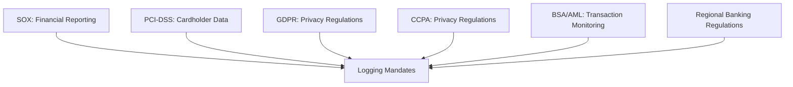

Color-coded matrices on another display break down these regulatory requirements into specific logging actions for different banking systems:

- **Transaction Processing**: Retain transaction details, timestamps, and audit trails
- **Customer Data Management**: Log data access, modifications, and deletions
- **Fraud Monitoring**: Capture anomalous patterns and flagged activities

Engineers actively take notes as compliance officers detail the severe penalties for non-compliance, referencing recent enforcement actions against peer institutions. This combination of visual aids and real-world examples reinforces the critical importance of adhering to these mandates.

### Teaching Narrative

Regulatory compliance forms a foundational requirement for logging strategies in banking—a critical dimension that fundamentally differentiates financial institutions from other industries. While technology companies typically design logging for operational purposes alone, banks must satisfy complex regulatory mandates that transform logging from an optional best practice to a legal requirement with significant penalties for non-compliance.

The regulatory landscape spans multiple frameworks, each with specialized focuses and specific logging mandates. The table below provides a structured summary of key regulatory frameworks, their focus areas, and high-level logging requirements:

| Regulatory Framework | Focus Area | Key Logging Mandates |
| -------------------------- | --------------------------------------- | ---------------------------------------------------------------------------------------------------------------- |
| **Sarbanes-Oxley (SOX)** | Financial reporting and auditability | Maintain logs for financial transactions, access to reporting systems, and audit trails. |
| **PCI-DSS** | Cardholder data protection | Log access to cardholder systems, payment transactions, and security events. |
| **Bank Secrecy Act (BSA)** | Anti-money laundering (AML) compliance | Monitor and log suspicious transactions, large cash movements, and flagged activities. |
| **GDPR** | Personal data privacy (EU) | Log data access, processing activities, and breaches involving personal information. |
| **CCPA** | Personal data privacy (California, USA) | Track data handling activities, consent management events, and access requests. |
| **Basel Committee (BCBS)** | Banking supervision and risk management | Ensure logs cover risk assessment systems, monitoring of financial exposures, and operational resilience events. |

These regulations dictate not only what must be logged but also how long logs must be retained and how they must be protected. This transforms logging architecture from a purely technical design to a compliance-driven requirement.

For SRE teams in banking environments, understanding this regulatory foundation is essential—these mandates are non-negotiable constraints that must be accommodated in any logging strategy. Failures to comply can lead to severe legal, financial, and reputational consequences.

### Common Example of the Problem

First National Bank implemented a new cloud-based payment processing system to improve customer experience. The development team built robust logging focused purely on operational troubleshooting, capturing detailed technical information to diagnose transaction issues. Six months after launch, a regulatory examination revealed critical gaps: the system failed to maintain comprehensive logs of transaction approval decisions, lacked immutable audit trails for configuration changes, and had insufficient retention periods for financial records. These violations resulted in a $3.5 million regulatory fine, mandatory remediation under supervision, and reputational damage when the action became public. The fundamental issue: the team had designed logging solely for operational purposes, completely overlooking regulatory requirements that transformed these technical logging decisions into compliance violations with severe consequences.

### SRE Best Practice: Evidence-Based Investigation

Evidence-based investigation for regulatory compliance requires a structured and systematic approach to ensure all requirements are met. Use the following checklist and flow diagram to guide your process:

#### Checklist for Evidence-Based Investigation

1. **Regulatory Framework Identification**

   - Identify all applicable regulations for your banking activities and jurisdictions.
   - Create a comprehensive regulatory framework matrix.

2. **Requirement Extraction**

   - Extract explicit logging requirements for:
     - Content (e.g., transaction details, user activity).
     - Retention periods.
     - Protection standards.
     - Accessibility mandates.

3. **Gap Analysis**

   - Review current log content against regulatory requirements.
   - Verify retention configurations match mandated periods.
   - Validate protection mechanisms align with security standards.
   - Test retrieval capabilities against accessibility requirements.

4. **Scenario Simulation ("Regulatory Fire Drills")**

   - Simulate audit and examination scenarios to:
     - Retrieve specific transaction evidence.
     - Validate operational readiness and technical implementation.

5. **Regular Updates and Monitoring**

   - Update the regulatory framework matrix as new regulations emerge.
   - Continuously monitor logging implementations for alignment with updated requirements.

#### Flow Diagram: Evidence-Based Investigation Steps

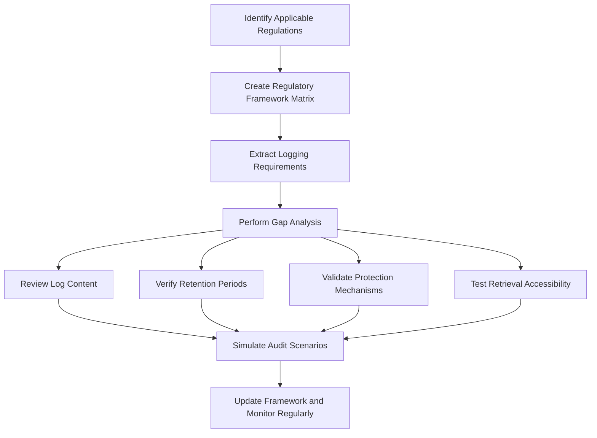

By following this checklist and flow diagram, SRE teams can ensure a thorough, evidence-based approach that transforms compliance requirements into actionable and testable technical implementations.

### Banking Impact

Regulatory non-compliance in logging creates severe, multi-dimensional business impacts beyond technical concerns. Financial penalties for violations frequently reach millions of dollars, and recent enforcement actions underscore the risks:

| **Violation Type** | **Penalty Amount** | **Cause** |
| --------------------------------------- | ------------------ | ---------------------------------------------------------------------- |
| Inadequate transaction record retention | $25 million | Failure to maintain logs of financial transactions as required by SOX. |
| Insufficient audit logging | $15 million | Lack of privileged account access logs, violating PCI-DSS standards. |
| Missing customer authentication records | $7 million | Non-compliance with GDPR requirements for retrievable personal data. |

Beyond direct penalties, regulatory actions often impose costly remediation programs. These programs require dedicated staff, consultant expertise, and significant technology investments under regulatory supervision, typically lasting 12-36 months.

Reputational damage is another major consequence—public enforcement actions erode customer trust, particularly for banks marketing security and stability as core values. Severe violations can also result in operational restrictions, such as limits on acquiring new customers, launching new products, or expanding into new markets until compliance issues are resolved.

For financial institutions, comprehensive logging isn't just a technical best practice—it is a critical business safeguard against substantial regulatory, financial, and reputational risks.

### Implementation Guidance

To establish comprehensive regulatory compliance in your logging architecture, follow these steps:

1. **Create a Regulation-to-Log Mapping Matrix**\
   Document each applicable regulation, the specific log requirements it mandates, the systems affected, and responsible owners for implementation.\
   **Checklist:**

   - [ ] Identify all regulations applicable to your organization (e.g., SOX, PCI-DSS, GDPR, BSA).
   - [ ] Map each regulation to specific logging requirements (e.g., fields, retention, access controls).
   - [ ] Tag affected systems and assign ownership for compliance implementation.

2. **Establish a Regulatory Logging Council**\
   Form a cross-functional team with representatives from compliance, legal, security, and technology to:

   - [ ] Regularly review and update requirements.
   - [ ] Assess the implementation status.
   - [ ] Address emerging regulations and evolving threats.

3. **Develop Technology-Specific Logging Standards**\
   Translate regulatory requirements into concrete implementation specifications for each platform in your environment:

   - Cloud services
   - On-premises systems
   - Mainframes\
     **Checklist:**
   - [ ] Define log formats, schemas, and required fields per regulation.
   - [ ] Specify retention policies and storage solutions.
   - [ ] Include access control requirements for sensitive logs.

4. **Automate Compliance Verification**\
   Use log analysis tools to continuously verify compliance.\
   **Example Code Snippet (Python + ElasticSearch):**

   ```python
   from elasticsearch import Elasticsearch
   import datetime

   es = Elasticsearch(["http://localhost:9200"])

   # Define compliance checks
   required_fields = ["user_id", "transaction_id", "timestamp", "action"]
   retention_period_days = 365

   # Query logs for missing fields
   response = es.search(index="banking-logs", body={
       "query": {
           "bool": {
               "must_not": [
                   {"exists": {"field": field}} for field in required_fields
               ]
           }
       }
   })

   missing_fields = response['hits']['total']['value']
   if missing_fields > 0:
       print(f"Compliance Alert: {missing_fields} logs missing required fields!")

   # Check log retention
   oldest_allowed_date = datetime.datetime.now() - datetime.timedelta(days=retention_period_days)
   response = es.search(index="banking-logs", body={
       "query": {
           "range": {
               "@timestamp": {"lt": oldest_allowed_date.strftime("%Y-%m-%dT%H:%M:%S")}
           }
       }
   })

   outdated_logs = response['hits']['total']['value']
   if outdated_logs > 0:
       print(f"Compliance Alert: {outdated_logs} logs exceed retention period!")
   ```

5. **Integrate Regulatory Logging Verification into CI/CD Pipelines**\
   Prevent deployment of systems that fail compliance checks.\
   **Checklist:**

   - [ ] Create automated tests for regulatory compliance in your pipeline.
   - [ ] Block deployments for systems missing required logging standards.
   - [ ] Include pass/fail notifications to stakeholders.

6. **Create a Regulatory Evidence Portal**\
   Develop a user-friendly portal for authorized staff to quickly retrieve required information during audits.\
   **Checklist:**

   - [ ] Implement search and filtering for logs by regulation, system, or time period.
   - [ ] Provide user roles and permissions for secure access.
   - [ ] Enable exportable reports in auditor-friendly formats.

7. **Document Defensible Compliance**\
   Maintain clear documentation that maps technical implementation to specific regulatory requirements.\
   **Checklist:**

   - [ ] Create a reference guide linking log configurations to their corresponding regulations.
   - [ ] Document evidence of automated compliance checks and remediation processes.
   - [ ] Update documentation regularly to reflect changes in regulations or systems.

## Panel 2: The Non-Repudiation Imperative - Immutable and Verifiable Logs

### Scene Description

A financial fraud investigation unfolds as auditors meticulously analyze suspect transactions through the bank's immutable logging system. On one visualization screen, cryptographically-secured transaction logs are displayed with clear tamper-evidence protections: hash chains link sequential records, digital signatures validate authenticity, and blockchain-inspired mechanisms ensure log integrity. To enhance understanding, the system’s core processes can be conceptualized as follows:

```
sequenceDiagram
    participant LogEntry1 as Log Entry 1
    participant LogEntry2 as Log Entry 2
    participant LogEntry3 as Log Entry 3
    participant HashChain as Hash Chain
    participant DigitalSig as Digital Signatures
    participant Verify as Verification Mechanism

    LogEntry1 ->> HashChain: Creates hash fingerprint
    LogEntry2 ->> HashChain: Links with prior hash
    LogEntry3 ->> HashChain: Extends chain
    HashChain ->> DigitalSig: Signs chain for authenticity
    DigitalSig ->> Verify: Ensures integrity and immutability
```

Another screen displays a timeline view, enabling investigators to reconstruct precise transaction sequences with cryptographic certainty. This visualization demonstrates how the system ensures both the accuracy of events and the integrity of the logs themselves, even under scrutiny. A separate compliance screen showcases certification from regulatory authorities, affirming that the system meets stringent legal requirements for transaction non-repudiation. These integrated visual tools allow investigators to conclusively establish what occurred, when, and by whom—providing a robust foundation for legal and regulatory confidence.

### Teaching Narrative

Non-repudiation—the ability to prove conclusively that specific transactions occurred and were not altered—represents a critical regulatory requirement unique to financial logging systems. Unlike typical application logging focused on troubleshooting, financial transaction logs often serve as legal records that must withstand challenges to their accuracy and authenticity. This creates specialized requirements far beyond traditional logging practices: immutability ensuring logs cannot be altered after creation, cryptographic verification providing mathematical proof of authenticity, complete sequential integrity allowing reconstruction of exact event ordering, and tamper-evidence mechanisms that immediately reveal any unauthorized modifications. These capabilities are particularly critical for financial operations where disputes about transaction occurrence, timing, or authorization may have significant legal and financial implications. A customer claiming they never authorized a large transfer, a trader disputing the timing of a market order, or a regulatory investigation into suspicious activity patterns—all require conclusive, legally-defensible log evidence that establishes exactly what happened beyond reasonable doubt. Modern implementations typically combine several technologies to achieve this: cryptographic hashing creating mathematical fingerprints of log entries, digital signatures establishing authorship and authenticity, hash chains connecting sequential records to prevent modification, and often specialized storage systems designed for immutable retention.

### Common Example of the Problem

Oceanic Investment Bank faced a critical non-repudiation failure during litigation when a high-net-worth client disputed a $4.7 million transfer to an overseas account. The client claimed they never authorized the transaction, despite bank records showing appropriate verification. However, during legal discovery, forensic analysis uncovered several weaknesses in the bank’s logging system that undermined their ability to provide conclusive evidence. The following timeline illustrates the sequence of events leading to the failure:

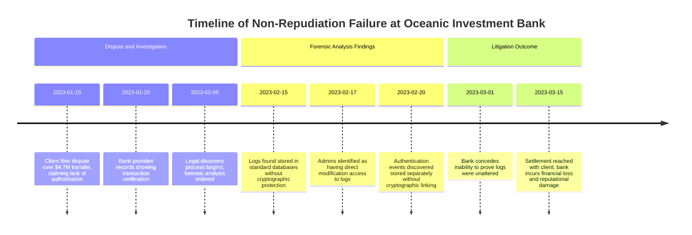

The analysis revealed three critical gaps:

1. **Log Immutability**: Logs were stored in a standard database with no cryptographic protection, allowing potential undetected modification.
2. **Access Control**: Database administrators had direct modification access, and changes were not separately logged, further eroding trust in log integrity.
3. **Event Linking**: Authentication events were stored separately from transaction records, with no cryptographic mechanism to link them, preventing the reconstruction of a tamper-evident event chain.

Despite the bank's confidence that the transaction was legitimate, these weaknesses made it impossible to prove the logs hadn’t been altered post-factum. The lack of non-repudiation capabilities forced the bank to settle the dispute, resulting in both financial loss and significant reputational harm. This case underscores the importance of designing logging systems focused on legally defensible evidence preservation rather than just operational record-keeping.

### SRE Best Practice: Evidence-Based Investigation

Evidence-based investigation for non-repudiation requires verifying both technical implementation and forensic defensibility. Use the following checklist to ensure a thorough and actionable approach:

#### **Checklist: Key Steps for Evidence-Based Investigation**

1. **Audit Logging Architecture**:

   - Assess database-level controls to confirm prevention of log modifications.
   - Review access rights to identify roles with potential modification capabilities.
   - Test append-only implementation to verify if existing records can be altered.
   - Check separation of duties between system operators and log custodians.

2. **Validate Cryptographic Protections**:

   - Conduct cryptographic verification testing to validate integrity mechanisms.
   - Attempt deliberate log modifications to confirm detection by tamper-evidence controls.
   - Verify digital signature implementation and associated key management practices.
   - Test hash chain continuity to ensure sequential modifications are detectable.

3. **Perform Legal Defensibility Reviews**:

   - Engage external forensic experts to challenge log integrity and identify potential weaknesses.
   - Simulate litigation scenarios to evaluate whether logs withstand adversarial scrutiny.
   - Address any findings that could introduce reasonable doubt in legal proceedings.

4. **Conduct Regular Integrity Verification**:

   - Schedule periodic cryptographic verification of historical logs.
   - Confirm that older records maintain their integrity over time.
   - Validate immutability controls continuously to ensure long-term effectiveness.

#### **Example Workflow**

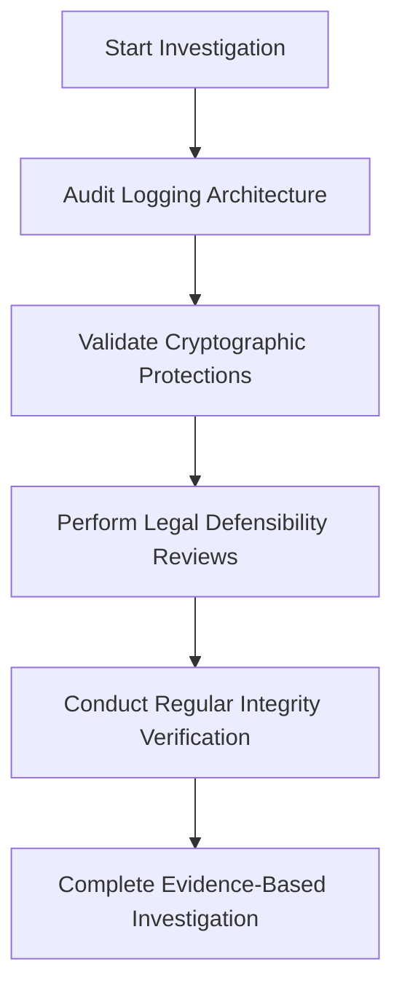

By following this checklist, SREs and technical teams can systematically validate the robustness of their logging systems, ensuring both technical integrity and legal defensibility in scenarios requiring non-repudiation.

### Banking Impact

Non-repudiation failures create severe business consequences beyond technical concerns. Financial institutions face direct monetary losses when disputed transactions cannot be conclusively proven—these can range from small retail claims to multi-million dollar commercial disputes where settlement becomes necessary despite transaction legitimacy. Legal costs escalate dramatically when log evidence lacks clear immutability, requiring extensive expert testimony and facing heightened scrutiny from judges and opposing counsel. Regulatory penalties can be substantial, with recent actions imposing multi-million dollar fines for insufficient transaction verification records. Most significantly, disputed transactions without proper non-repudiation create reputational damage as customers and partners question transaction reliability—particularly problematic for wealth management and institutional services where absolute transaction confidence is a core value proposition. For financial institutions managing significant transaction volumes, proper non-repudiation represents financial protection extending far beyond technical logging considerations into fundamental business risk management.

### Implementation Guidance

To implement effective non-repudiation in your logging infrastructure:

1. Deploy cryptographic hashing for all financial transaction logs, generating tamper-evident digests using algorithms like SHA-256 or SHA-3 to create mathematical fingerprints of each record. Below is an example of using Python's `hashlib` library to generate a SHA-256 hash for a log entry:

   ```python
   import hashlib

   def generate_log_hash(log_entry):
       # Convert log entry to bytes
       log_bytes = log_entry.encode('utf-8')
       # Generate SHA-256 hash
       log_hash = hashlib.sha256(log_bytes).hexdigest()
       return log_hash

   # Example usage
   log_entry = "TransactionID:12345|Amount:1000|Timestamp:2023-10-01T12:00:00Z"
   print("Log Hash:", generate_log_hash(log_entry))
   ```

2. Implement sequential integrity through hash chaining, where each new log entry includes the hash of the previous entry. This ensures an unbreakable cryptographic chain. Here’s an example of chaining log entries:

   ```python
   def create_hash_chain(log_entries):
       chain = []
       previous_hash = None

       for entry in log_entries:
           # Combine log entry with the previous hash
           chained_entry = f"{entry}|PrevHash:{previous_hash}" if previous_hash else entry
           # Generate hash for the chained entry
           current_hash = generate_log_hash(chained_entry)
           chain.append((chained_entry, current_hash))
           previous_hash = current_hash

       return chain

   # Example log entries
   log_entries = [
       "TransactionID:12345|Amount:1000|Timestamp:2023-10-01T12:00:00Z",
       "TransactionID:12346|Amount:1500|Timestamp:2023-10-01T12:05:00Z"
   ]
   hash_chain = create_hash_chain(log_entries)
   for entry, hash_val in hash_chain:
       print(f"Chained Entry: {entry}\nHash: {hash_val}\n")
   ```

3. Establish digital signature integration using asymmetric cryptography (RSA or ECC), where log entries are signed with private keys. Below is an example using Python's `cryptography` library to sign a log entry:

   ```python
   from cryptography.hazmat.primitives.asymmetric import rsa, padding
   from cryptography.hazmat.primitives import hashes
   from cryptography.hazmat.primitives.serialization import Encoding, PrivateFormat, PublicFormat, NoEncryption

   # Generate RSA key pair
   private_key = rsa.generate_private_key(public_exponent=65537, key_size=2048)
   public_key = private_key.public_key()

   def sign_log_entry(log_entry, private_key):
       # Sign the log entry with the private key
       signature = private_key.sign(
           log_entry.encode('utf-8'),
           padding.PSS(mgf=padding.MGF1(hashes.SHA256()), salt_length=padding.PSS.MAX_LENGTH),
           hashes.SHA256()
       )
       return signature

   def verify_signature(log_entry, signature, public_key):
       # Verify the signature with the public key
       try:
           public_key.verify(
               signature,
               log_entry.encode('utf-8'),
               padding.PSS(mgf=padding.MGF1(hashes.SHA256()), salt_length=padding.PSS.MAX_LENGTH),
               hashes.SHA256()
           )
           return True
       except Exception as e:
           return False

   # Example usage
   log_entry = "TransactionID:12345|Amount:1000|Timestamp:2023-10-01T12:00:00Z"
   signature = sign_log_entry(log_entry, private_key)
   is_valid = verify_signature(log_entry, signature, public_key)
   print("Signature Valid:", is_valid)
   ```

4. Create separation of duties between systems generating logs and those storing them, ensuring no single administrator can modify both the source system and its corresponding log evidence. For example:

   - Use distinct servers for log generation and storage, with independent access controls.
   - Configure role-based access controls (RBAC) to enforce this separation.

5. Deploy specialized immutable storage solutions—either purpose-built compliance storage or blockchain-inspired distributed ledgers—physically preventing modification after writing. Example configuration for immutable storage with AWS S3 Object Lock:

   ```bash
   # Enable S3 Object Lock on a new bucket
   aws s3api create-bucket --bucket my-immutable-logs --object-lock-enabled-for-bucket

   # Apply a retention policy to prevent deletion or modification for 7 years
   aws s3api put-object-lock-configuration --bucket my-immutable-logs \
       --object-lock-configuration '{"ObjectLockEnabled":"Enabled","Rule":{"DefaultRetention":{"Mode":"GOVERNANCE","Days":2555}}}'
   ```

6. Implement comprehensive verification mechanisms that regularly validate the entire log chain integrity. Use scripts or automated tools to re-hash logs and confirm the chain has not been tampered with. Example periodic hash validation:

   ```python
   def validate_hash_chain(chain):
       previous_hash = None
       for entry, current_hash in chain:
           expected_hash = generate_log_hash(f"{entry}|PrevHash:{previous_hash}" if previous_hash else entry)
           if current_hash != expected_hash:
               return False
           previous_hash = current_hash
       return True

   # Example validation
   is_chain_valid = validate_hash_chain(hash_chain)
   print("Hash Chain Valid:", is_chain_valid)
   ```

7. Develop formal non-repudiation evidence packages that combine transaction logs, authentication records, and cryptographic verification evidence in formats designed for legal proceedings and regulatory examinations. Include:

   - Original log entries.
   - Associated hash values and hash chain sequences.
   - Digital signature artifacts (e.g., public keys, signed entries).
   - Immutable storage proof (e.g., S3 Object Lock configuration or blockchain transaction IDs).
   - Automated validation reports confirming log integrity.

## Panel 3: The Personal Data Challenge - Privacy Regulations and Logging

### Scene Description

A data privacy workshop where banking engineers and privacy officers analyze their logging practices against GDPR and CCPA requirements. Interactive screens display logs from different banking systems with personal data highlighted—revealing unexpected personal information in application logs, transaction records, and authentication systems. Below is a conceptual representation of the interactive screen:

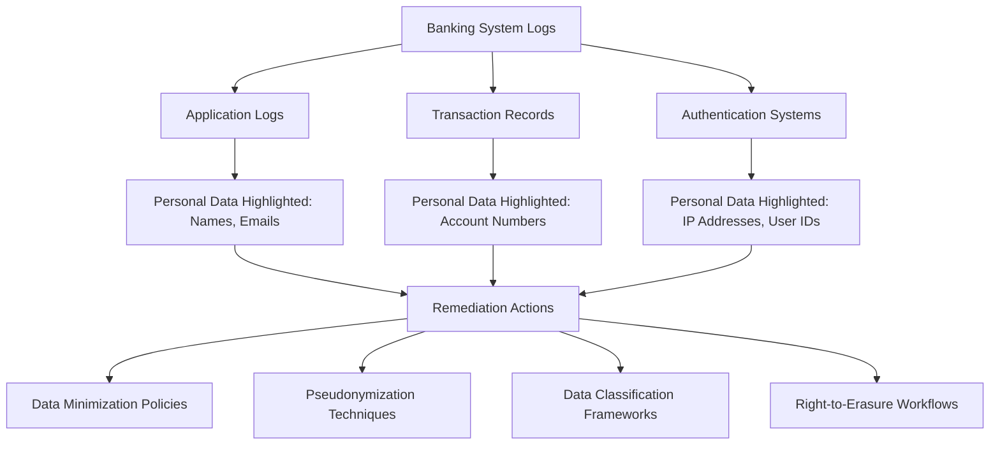

The privacy officer demonstrates their remediation approach in real-time, showcasing the following techniques:

1. **Data minimization policies** to reduce the collection of unnecessary personal information.
2. **Pseudonymization techniques** replacing direct identifiers with tokens.
3. **Data classification frameworks** to identify and tag regulated information types.
4. **Right-to-erasure workflows** that remove specific customer data from logs while maintaining system integrity.

This interactive setup allows participants to visually connect privacy challenges with practical solutions, emphasizing the importance of robust logging practices that comply with regulatory requirements.

### Teaching Narrative

Privacy regulations create a fundamental tension in banking log management—balancing the operational need for comprehensive logging against legal requirements limiting personal data usage. Regulations like the General Data Protection Regulation (GDPR) and California Consumer Privacy Act (CCPA) establish strict rules for handling personal information, with specific provisions that directly impact logging practices: data minimization principles requiring that personal data be limited to what's necessary, purpose limitation restricting usage to specified functions, storage limitation mandating retention only as long as needed, right-to-erasure (or "right to be forgotten") enabling individuals to request data deletion, and explicit consent requirements for certain processing activities. These requirements create complex challenges for logging systems that traditionally captured all available information for operational purposes. Modern approaches address this tension through several strategies: data minimization limiting personal information in logs to what's operationally necessary, pseudonymization replacing direct identifiers with opaque tokens while preserving operational usefulness, data classification frameworks identifying regulated information within logging systems, segmented storage separating personal data from operational logs, and specialized deletion capabilities enabling removal of specific personal information when legally required. For banking institutions operating across multiple jurisdictions with varying privacy requirements, these capabilities aren't optional features—they're mandatory compliance controls with significant penalties for non-implementation.

### Common Example of the Problem

European Financial Partners implemented comprehensive logging across their digital banking platform to enhance security monitoring and fraud detection. Their logging strategy captured detailed user behavior to identify suspicious patterns, including full account numbers, complete customer identifiers, physical and IP addresses, device details, and transaction histories. However, the introduction of GDPR exposed critical flaws in their approach, as illustrated in the following timeline:

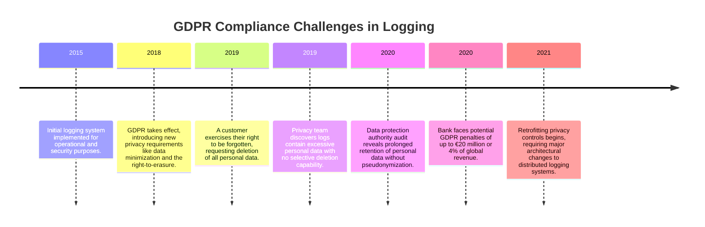

This sequence highlights cascading impacts of non-compliance. The inability to selectively delete specific customer information without compromising log integrity left the bank vulnerable to both regulatory penalties and reputational damage. Logging had been implemented purely for operational and security purposes, with no consideration for privacy regulations. As a result, the system became a compliance liability, requiring costly retrofitting to align with data protection principles like pseudonymization, data minimization, and storage limitation.

### SRE Best Practice: Evidence-Based Investigation

Evidence-based investigation for privacy compliance requires systematic discovery and assessment of personal data across logging systems. The following checklist outlines key steps to ensure a thorough and actionable approach:

#### Checklist: Evidence-Based Investigation for Privacy Compliance

1. **Comprehensive Data Discovery**

   - Use specialized scanning tools to detect potential personal information based on patterns, formats, and contexts.
   - Apply scanning across the entire logging ecosystem, including historical archives.

2. **Data Flow Mapping**

   - Trace personal data from initial capture through all logging systems.
   - Identify transformation points, storage locations, and retention periods.

3. **Purpose Assessment**

   - Evaluate whether each personal data element serves a legitimate operational need.
   - Identify opportunities to remove or pseudonymize data without compromising essential functions.

4. **Anonymization Effectiveness Testing**

   - Perform re-identification analysis by attempting to reconstruct personal identities from anonymized logs.
   - Validate that anonymization methods provide sufficient protection.

5. **Privacy Impact Assessments**

   - Conduct regular assessments specifically focused on logging systems.
   - Systematically evaluate how personal data is collected, processed, stored, and protected throughout the log lifecycle.

6. **Selective Deletion Verification**

   - Test deletion capabilities by conducting erasure tests for specific individuals' data.
   - Ensure selective deletions do not compromise log integrity or essential business records.

### Example Workflow: Evidence-Based Investigation

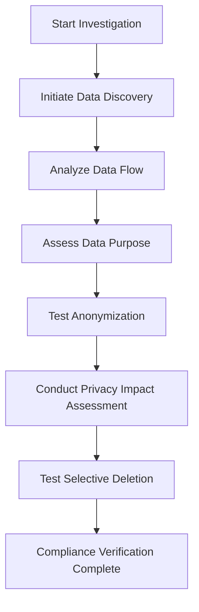

By following this checklist and adopting a structured workflow, organizations can align their logging practices with privacy regulations, ensuring compliance while maintaining operational integrity.

### Banking Impact

Privacy compliance failures in logging create substantial business consequences beyond technical concerns. Regulatory penalties under privacy frameworks can be severe—GDPR allows fines up to €20 million or 4% of global annual revenue, while CCPA enables regulatory actions and private civil suits with statutory damages. Beyond direct penalties, remediation typically requires substantial investment in data discovery tools, log architecture redesign, and retroactive data cleanup across historical repositories. Reputational damage from privacy violations is particularly severe for financial institutions, where customer trust in data protection is essential to the business relationship. Operational impacts include potential restrictions on data usage for fraud detection, customer analytics, and service personalization when logging systems cannot demonstrate appropriate privacy controls. For global banks, cross-border data transfer restrictions may limit the ability to centralize log analysis without appropriate privacy protections. Most significantly, non-compliant logging creates ongoing operational overhead through manual processes to handle data subject requests that could be automated in properly designed systems. For modern financial institutions, privacy-aware logging isn't a technical nicety but a fundamental business requirement that directly impacts regulatory standing, operational efficiency, and customer trust.

### Implementation Guidance

````markdown
### Implementation Guidance

To implement privacy-compliant logging in banking environments, follow these steps:

| Step | Description | Example/Code Snippet |
|------|-------------|-----------------------|
| 1. **Data Inventory** | Conduct a comprehensive personal data inventory across all logging systems, categorizing each data element by sensitivity, purpose, retention requirement, and applicable regulations. | **Example:** Use a structured spreadsheet to map log fields like `user_id`, `email`, and `IP_address` to categories such as "PII", "Operational Metadata", and "Regulated Data". |
| 2. **Field-Level Data Classification** | Implement field-level data classification in logging frameworks, tagging personal data elements with appropriate privacy categories to enable automated handling through the data lifecycle. | **Code Snippet (Python):**<br>```python<br># Example tagging logic<br>log_entry = {"user_id": "12345", "action": "login", "ip": "192.168.x.y", "meta-levels ]--- If policy rux.```
````

## Panel 4: The Retention Complexity - Balancing Requirements and Costs

### Scene Description

A bank's data governance meeting where technology and compliance leaders review their log retention strategy. Timeline visualizations show varying retention requirements for different information types: transaction records maintained for 7+ years for regulatory compliance, authentication logs preserved for 2 years for security purposes, and operational system logs kept for 90 days. Cost modeling demonstrates the exponential storage impact of these requirements, with projections showing multi-million dollar expenses for comprehensive retention. The following Mermaid diagram illustrates the tiered storage solution that balances these requirements with cost-effective storage strategies:

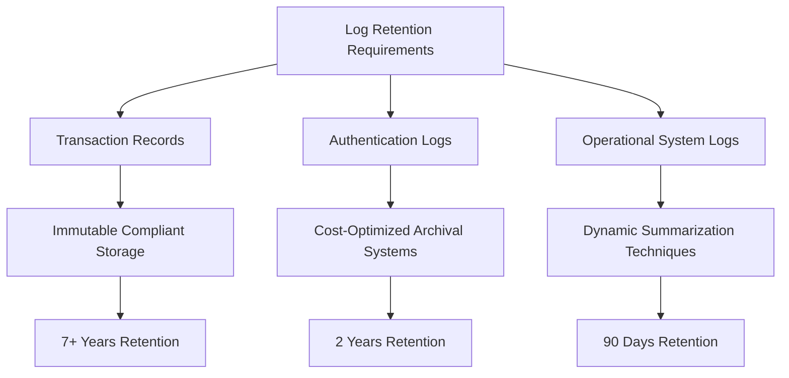

This architecture demonstrates the allocation of storage solutions based on retention duration: immutable compliant storage for regulated records with long-term retention needs, cost-optimized archival systems for medium-term retention, and dynamic summarization techniques for short-term operational logs. By aligning storage technologies with retention requirements, banks can maintain compliance while managing exponential storage growth and associated costs efficiently.

### Teaching Narrative

Retention management represents one of the most complex challenges in banking log compliance—balancing regulatory requirements, operational needs, legal preservation obligations, and practical cost constraints. Unlike typical technology companies that can establish retention based purely on operational value, banks face mandatory retention periods established by various regulations: 7+ years for financial transaction records under certain banking regulations, 3-5 years for suspicious activity monitoring under anti-money laundering requirements, 2+ years for authentication records under security standards, and varying periods for specific information types across different jurisdictions. These requirements create both technical and financial challenges as log volumes grow exponentially with business scale. Modern retention strategies address this complexity through multi-dimensional approaches: tiered storage architectures matching retention requirements to appropriate storage technologies and costs, information lifecycle management automatically transitioning data between storage tiers based on age and access patterns, data summarization preserving essential regulatory information while reducing raw storage volumes, selective field retention maintaining critical regulatory data while discarding unnecessary operational details, and jurisdictional routing ensuring data is retained according to local requirements in multinational operations. For global financial institutions, the financial impact of these strategies is substantial—optimized approaches can reduce storage costs by 60-80% while maintaining full regulatory compliance, translating to millions in annual savings for large banking operations.

### Common Example of the Problem

Atlantic National Bank implemented comprehensive logging across their transaction processing environment, capturing detailed information for operational monitoring, security analysis, and troubleshooting. Over a three-year period, as transaction volumes grew exponentially, their logging infrastructure faced severe strain—storage costs were projected to reach $8.5 million annually if all logs were maintained at full fidelity for their default 7-year retention period.

When technology teams proposed reducing retention periods to control costs, compliance officers identified critical regulatory conflicts:

| **Log Type** | **Retention Requirement** | **Reason** |
| -------------------------- | ------------------------------------- | ---------------------------------------- |
| Financial Transaction Logs | 7+ years | Banking regulations |
| Authentication Logs | 3+ years | Security compliance |
| International Operations | Varies (some jurisdictions > 7 years) | Local regulatory mandates |
| All Logs (Legal Hold) | Indefinite | Pending litigation and legal obligations |

The table above illustrates the conflicting requirements the bank faced. Legal demanded complete retention of all logs due to pending litigation, enforcing a legal hold that prevented any data deletion. This created a situation where compliance and legal requirements prevented the reduction of retention periods, yet the costs of maintaining logs at full fidelity were unsustainable under the current architecture.

This conflict exposed a fundamental gap in their strategy: Atlantic National Bank applied uniform high-retention storage to all data, regardless of regulatory requirements or operational value. The lack of a tiered, strategic approach exacerbated costs and complexity.

#### Problem Summary Diagram (Mermaid)

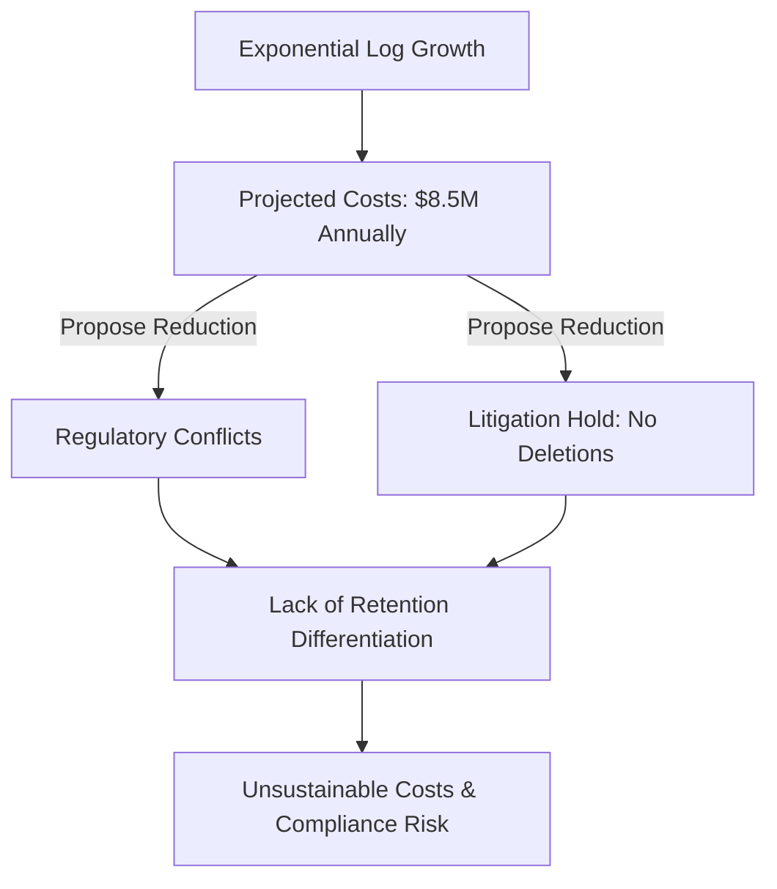

Atlantic National Bank’s challenges highlight the critical need for a multi-dimensional retention strategy that aligns log storage and retention to regulatory, operational, and legal priorities. Without such an approach, organizations risk both financial inefficiency and compliance failures.

### SRE Best Practice: Evidence-Based Investigation

Evidence-based investigation for retention optimization requires a structured and data-driven approach. Use the following checklist to guide your process:

1. **Requirement Mapping**

   - Identify all applicable regulations and their mandatory retention periods.
   - Create a master retention matrix categorizing minimum required retention periods by data type (e.g., transaction logs, authentication logs) rather than by system source.

2. **Retrieval Pattern Analysis**

   - Analyze historical log access patterns to understand usage frequency and purpose.
   - Differentiate between actively used recent data and rarely accessed historical records.

3. **Storage Efficiency Analysis**

   - Evaluate current storage methods for opportunities to optimize through compression, summarization, or selective field retention.
   - Ensure any reductions maintain compliance and analytical requirements.

4. **Cost Modeling**

   - Develop fully-loaded cost models that include raw storage, backup, infrastructure, retrieval, and management expenses.
   - Compare costs across different storage architectures and retention strategies.

5. **Access Tracking and Monitoring**

   - Implement continuous access tracking to monitor which historical logs are used and by whom.
   - Use this data to refine storage architecture and retention strategies based on actual usage rather than assumptions.

6. **Lifecycle Management Implementation**

   - Transition from binary "keep everything or delete" decisions to a tiered information lifecycle management system.
   - Optimize retention policies to balance compliance, operational needs, and cost-effectiveness.

By following this checklist, organizations can transform retention strategies into a sophisticated and empirical process. This approach ensures compliance while significantly reducing storage costs, aligning technical priorities with financial and regulatory objectives.

### Banking Impact

Ineffective retention strategies create substantial business impacts beyond technology concerns. Direct financial costs of suboptimal retention often reach millions of dollars annually for large banks, with typical reductions of 60-80% possible through strategic approaches without compromising compliance. Performance degradation affects both operational systems and analytical platforms when retention strategies fail to differentiate between hot and cold data, leading to slower response times for critical queries. Compliance risk increases when undifferentiated retention approaches handle all data uniformly, potentially leading to premature deletion of regulated records or inadequate immutability for critical evidence. Investigation capabilities suffer when historical data becomes prohibitively expensive or time-consuming to access, hampering fraud investigations and pattern analysis that require historical context. Legal discovery expenses grow substantially when retention strategies fail to implement appropriate categorization, requiring much broader and more expensive searches during litigation. For financial institutions balancing multiple regulatory frameworks across global operations, optimized retention isn't merely a cost-saving technical exercise but a strategic business capability that directly impacts operational efficiency, compliance posture, and risk management effectiveness.

### Implementation Guidance

To implement effective retention management for banking logs, follow these actionable steps outlined below:

| Step | Description | Key Benefits |
| ---- | -------------------------------------------------------------------------------------------------------------------------------------------------------------------------------------------------------------------------------------------------------------------------------------------------- | ------------------------------------------------------------------------------------------------------------------- |
| 1 | Create a comprehensive retention requirements matrix documenting mandatory periods for each log type based on regulations, business needs, and legal considerations. | Ensures clear understanding of compliance obligations and operational needs, preventing over- or under-retention. |
| 2 | Implement data classification within your logging architecture that categorizes information by retention requirement at the time of creation. | Enables automated lifecycle management and ensures logs are managed consistently according to their classification. |
| 3 | Deploy a tiered storage architecture with at least three distinct layers: high-performance "hot" storage for operational data (0-90 days), medium-performance "warm" storage for intermediate retention (90 days-1 year), and cost-optimized "cold" storage for long-term compliance (1-7+ years). | Matches storage costs to data requirements, optimizing expenditures while meeting performance and retention needs. |
| 4 | Establish automated lifecycle management that transitions data between storage tiers based on age and classification, applying appropriate compression, summarization, and protection at each stage. | Reduces manual intervention, enhances efficiency, and ensures consistent application of retention policies. |
| 5 | Implement field-level retention policies that maintain different elements of the same logs for different periods based on regulatory requirements—preserving transaction details for 7+ years while reducing detailed technical information after shorter periods. | Minimizes storage needs while maintaining compliance with nuanced regulatory requirements. |
| 6 | Create legal hold mechanisms that can selectively preserve specific data subsets affected by litigation or regulatory investigations without requiring retention of all system logs. | Avoids unnecessary storage of unrelated data during legal proceedings, reducing costs and risks. |
| 7 | Develop comprehensive retention reporting that demonstrates compliance with requirements while highlighting cost efficiency and storage optimization metrics. | Provides visibility into retention strategy effectiveness and supports audits with clear documentation. |

## Panel 5: The Access Control Framework - Regulatory-Compliant Log Security

### Scene Description

A bank security review where compliance officers evaluate access controls for sensitive log data. The process is visualized through a defense-in-depth approach, implemented as multiple interconnected layers of security controls:


- **Role-Based Access Control (RBAC):** Restricts log visibility based on job function, ensuring users only access data relevant to their roles.
- **Purpose-Based Access:** Requires documented justification for viewing regulated information, aligning access with legitimate purposes.
- **Field-Level Security:** Masks sensitive data elements (e.g., account numbers, PINs) while allowing partial access to necessary details.
- **Comprehensive Audit Trails:** Tracks every access attempt, creating immutable records to meet compliance and security requirements.
- **Time-Bound Privileges:** Automatically expires access grants after investigations are completed, limiting unnecessary prolonged access.

During the review, a demonstration highlights how these layers work together. For instance, customer support staff can view transaction status information relevant to their role, while sensitive details remain hidden. Meanwhile, fraud investigation teams utilize specialized workflows granting greater access, documented for regulatory compliance.

### Teaching Narrative

Access control for banking logs goes beyond standard security practices—becoming a regulatory requirement with specific compliance implications. Regulations establish explicit mandates for protecting sensitive information with appropriate controls, including principles like least privilege access, segregation of duties, purpose limitation, and comprehensive audit trails. For financial institutions, these requirements transform access control from good practice to compliance necessity. Modern implementations address these requirements through layered approaches: role-based access control aligning log visibility with specific job functions and regulatory entitlements, attribute-based controls further restricting access based on data classification and sensitivity, purpose-based access requiring documented justification for viewing regulated information, field-level security permitting partial access to logs while protecting sensitive elements, and comprehensive audit logging creating immutable records of all access activity. These controls are particularly critical for balancing competing regulatory obligations—providing necessary access for legitimate functions like fraud investigation and regulatory reporting while protecting sensitive customer information with appropriate restrictions. A fraud analyst investigating suspicious patterns needs transaction details typically restricted under privacy regulations, requiring specialized access workflows that document legitimate purpose and scope. For financial institutions, these capabilities aren't security enhancements—they're regulatory compliance controls subject to audit and examination, with significant consequences for inadequate implementation.

### Common Example of the Problem

Global Banking Corporation experienced a critical access control failure when their log analysis infrastructure was implemented without appropriate segregation. The centralized logging platform contained everything from transaction details to authentication records to customer service interactions—providing comprehensive visibility that significantly improved troubleshooting and security monitoring. However, this architecture created a compliance violation when a routine audit discovered that over 300 IT staff had unrestricted access to all logs, including unmasked account numbers, complete customer details, and full transaction records containing PII. This violated multiple regulations and exposed the organization to significant risks.

To illustrate the problem and its resolution, the following table summarizes the key compliance violations, their associated regulations, and the required remediation actions:

| **Compliance Violation** | **Associated Regulation** | **Required Remediation Steps** |
| ---------------------------------------------------------- | -------------------------------------------------------------------------------------------------------------- | ------------------------------------------------------------------------------------------------------------------ |
| Unrestricted access to all logs, including sensitive data | GDPR (Purpose Limitation, Access Minimization), PCI-DSS (Cardholder Data Access Restrictions) | Implement role-based access controls (RBAC) to align access with job functions. |
| Lack of masking for sensitive data (e.g., account numbers) | GDPR (Data Protection by Design), PCI-DSS (Data Masking Requirements) | Apply field-level security to mask sensitive data elements such as account numbers and PII. |
| Absence of access justification workflows | GDPR (Accountability), Banking Regulations (Purpose Documentation for Sensitive Data Access) | Introduce purpose-based access controls requiring documented justification for accessing sensitive regulated data. |
| Inadequate audit trails for access attempts | GDPR (Data Access Auditability), PCI-DSS (Log Access Tracking), Banking Regulations (Audit Trail Requirements) | Deploy comprehensive audit logging to track and monitor every access attempt to regulated data. |
| No time-bound access restrictions for investigations | GDPR (Data Minimization), Banking Regulations (Temporary Privilege Expiry) | Enforce time-bound privileges that automatically expire after investigation completion. |
| Lack of segregation of duties in log access | Banking Regulations (Segregation of Duties), PCI-DSS (Access Control Best Practices) | Redesign access control architecture to ensure proper segregation of duties and prevent conflicts of interest. |

The bank faced potential regulatory penalties, immediate remediation requirements, and the operational challenge of redesigning access controls without disrupting critical monitoring functions. Below is a high-level flowchart of the compliance-first redesign process:

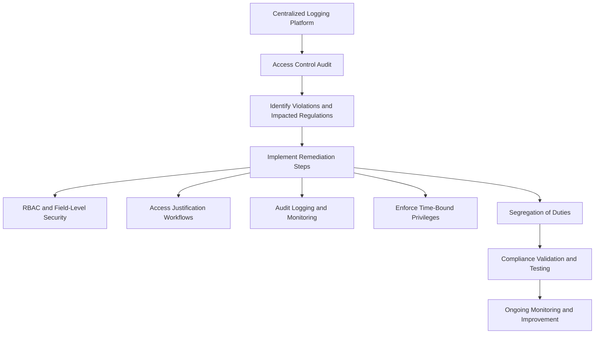

By implementing these measures, Global Banking Corporation can transform its access controls from an operational convenience model to a compliance-first framework, ensuring adherence to regulatory requirements while maintaining critical monitoring capabilities.

### SRE Best Practice: Evidence-Based Investigation

Evidence-based investigation for access control compliance requires systematic assessment of both implementation effectiveness and regulatory alignment. Organizations should follow these steps to ensure thorough and actionable investigation processes:

#### Checklist: Evidence-Based Access Control Investigation

1. **Access Mapping**:

   - Document who currently has access to each log type.
   - Compare the actual access state against regulatory requirements and business necessity.

2. **Privilege Usage Analysis**:

   - Evaluate which granted access rights are actively utilized.
   - Identify unused privileges that can be safely revoked to reduce exposure.

3. **Entitlement Reviews**:

   - Assess current access grants against job responsibilities.
   - Verify alignment with legitimate purpose requirements and regulatory mandates.

4. **Control Effectiveness Testing**:

   - Simulate penetration scenarios to test for unauthorized access via technical exploitation.
   - Attempt procedural bypasses to assess the robustness of non-technical controls.

5. **Continuous Access Monitoring**:

   - Analyze log access patterns for anomalies, such as:
     - Unusually high volumes of records accessed by a single user.
     - Access occurring outside normal behavior patterns for a role.

6. **Regulatory Alignment Verification**:

   - Explicitly map each access control to specific regulatory requirements.
   - Create defensible documentation demonstrating how technical controls fulfill compliance mandates.

By following this checklist, organizations can systematically transform access control from a general security practice into a compliance-specific implementation. This approach establishes a clear relationship between technical controls and regulatory requirements, ensuring compliance is defensible and auditable.

### Banking Impact

Inadequate access controls for log data create substantial business impacts beyond technical vulnerabilities. Regulatory penalties for inappropriate access to sensitive financial and personal information can be severe, with recent enforcement actions imposing multi-million dollar fines specifically for insufficient access limitations to regulated data. For example, in 2022, a major global bank was fined $50 million by regulators after an audit revealed unauthorized access to customer transaction logs containing sensitive data. The investigation found that their access control framework lacked proper role-based restrictions and comprehensive audit trails, which allowed employees to access information beyond their job scope without detection. This incident not only led to financial penalties but also triggered a lengthy compliance remediation effort that required external consultants, significant operational disruptions, and public commitments to overhaul their data protection practices.

The reputational damage from such failures can be particularly severe for financial institutions, where customer expectations for data protection are exceptionally high. News of the breach caused customer trust to erode, with a measurable increase in account closures and a year-long dip in customer acquisition rates. Operational inefficiency often results from overly restrictive controls implemented as emergency measures, creating unnecessary friction for legitimate access needs. Most significantly, inadequate controls create insider threat risks—both malicious actions from individuals with excessive access and inadvertent violations from staff accessing information without proper training or context.

For banking organizations balancing operational needs with compliance requirements, properly designed access controls aren't merely security features but fundamental business protections. These protections directly impact regulatory standing, operational capability, and customer trust, underscoring the critical importance of implementing robust and compliant access control frameworks.

### Implementation Guidance

To implement compliant access controls for banking log systems, follow this step-by-step process:

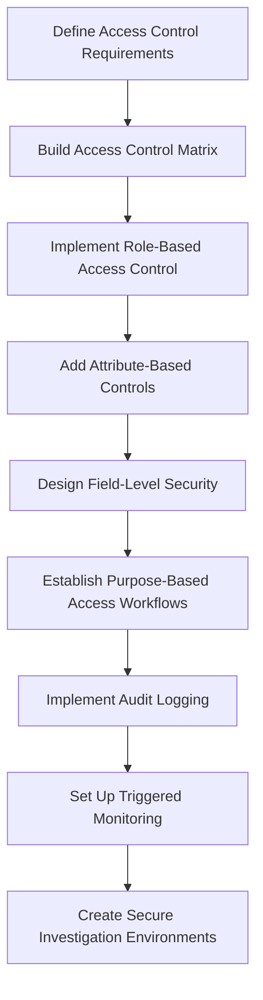

1. **Define Access Control Requirements**:

   - Understand regulatory obligations (e.g., least privilege, purpose limitation).
   - Identify sensitive log data categories and potential risks.

2. **Build Access Control Matrix**:

   - Map job functions to specific log types and data fields.
   - Explicitly document legitimate purposes and regulatory justifications for access patterns.

3. **Implement Role-Based Access Control**:

   - Create granular permission sets aligned with job functions.
   - Avoid broad departmental or hierarchical access permissions.

4. **Add Attribute-Based Controls**:

   - Restrict access further based on data classification, sensitivity, jurisdiction, and dynamic attributes.
   - Ensure attribute-based policies complement role-based permissions.

5. **Design Field-Level Security**:

   - Mask or tokenize sensitive data elements (e.g., account numbers, PII).
   - Allow access only when explicitly authorized based on user role and purpose.

6. **Establish Purpose-Based Access Workflows**:

   - Require documented justification for accessing sensitive logs.
   - Implement approval chains and enforce automatic time-bound access limitations.

7. **Implement Audit Logging**:

   - Record all log access activities in immutable, segregated logs.
   - Ensure audit logs are secure and tamper-proof for regulatory examination.

8. **Set Up Triggered Monitoring**:

   - Automatically flag unusual access patterns, excessive retrieval volumes, or access to highly sensitive data.
   - Route flagged activities for immediate review and investigation.

9. **Create Secure Investigation Environments**:

   - Develop isolated environments for sensitive log analysis with enhanced controls.
   - Include monitoring and strict usage limitations to prevent misuse.

This structured approach, combining layered access controls with monitoring and audit capabilities, ensures compliance with regulatory standards while maintaining robust security for sensitive log data.

## Panel 6: The Audit Preparation - Evidence Collection and Demonstration

### Scene Description

A bank's regulatory examination preparation session where compliance teams rehearse their logging controls demonstration for upcoming auditors. Practice screens show how they will present their compliance evidence, focusing on the following key areas:

- **Sampling Frameworks**: Demonstrating systematic log validation across different system types.
- **Completeness Testing**: Ensuring 100% capture of required transaction records.
- **Retrieval Exercises**: Proving the ability to locate specific transactions within required timeframes.
- **Chain-of-Custody Documentation**: Showing secure handling of log evidence.
- **Control Testing**: Validating that logs accurately reflect actual system operations.

Team members also simulate auditor questions about specific regulatory requirements, practicing their responses with concrete examples that demonstrate how their logging implementation satisfies each mandate.

Below is a summarized flow of the rehearsal process:

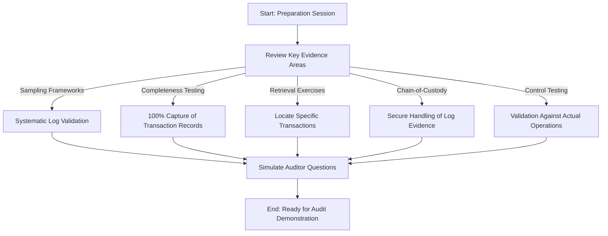

This structured approach ensures all evidence types are thoroughly reviewed and aligned with regulatory requirements. By simulating auditor interactions, the team refines their ability to present and defend their compliance evidence effectively.

### Teaching Narrative

Audit readiness transforms logging compliance from theoretical design to practical demonstration—requiring not just implementation of compliant systems but the ability to prove that compliance to regulatory examiners. Banking institutions face regular examinations from multiple regulatory bodies, each requiring concrete evidence that logging systems meet relevant requirements. Effective audit preparation requires systematic approaches to evidence collection and presentation: control frameworks mapping specific logging capabilities to regulatory requirements, testing protocols validating that these controls operate as designed, sampling methodologies demonstrating comprehensive coverage across different transaction types and systems, retrieval exercises proving ability to locate specific records within required timeframes, and documentation practices maintaining evidence of ongoing compliance monitoring. These capabilities are particularly important for requirements that might seem subjective without concrete demonstration—what constitutes "comprehensive" transaction logging or "timely" access to historical records? By establishing explicit test cases and evidence collection in advance, organizations transform these potentially ambiguous standards into demonstrable capabilities with clear pass/fail criteria. For financial institutions, this preparation represents a critical compliance discipline—regulatory examinations aren't theoretical discussions but practical demonstrations requiring concrete evidence that logging systems capture, retain, and protect information as required by applicable regulations.

### Common Example of the Problem

United Financial Services faced a severe audit failure during a routine regulatory examination of their transaction monitoring systems. When examiners requested evidence of complete logging for wire transfers over $10,000 from the past 18 months, the compliance team confidently stated all transactions were properly logged and retained. However, when asked to demonstrate this capability by retrieving specific transaction examples, the team discovered critical gaps in their evidence:

- **Retrieval Delays**: Database queries took hours rather than minutes to execute due to fragmented systems and inefficient search capabilities.
- **Missing Fields**: Certain transaction fields were absent from historical records as a result of uncoordinated schema changes.
- **Incomplete Logs**: Approximately 3% of transactions were missing entirely, with no documented explanation for the gaps.
- **Audit Trail Gaps**: The bank was unable to produce comprehensive access logs showing who had viewed or modified records, leading to a lack of chain-of-custody evidence.

These issues escalated the examination from routine to problematic, resulting in formal findings, mandatory remediation, and enhanced scrutiny across other systems. The fundamental issue wasn't that compliance logging didn't exist—the bank had invested significantly in logging infrastructure—but rather that they couldn't effectively demonstrate compliance. The inability to produce rapid evidence, retrieve complete records, and ensure consistent log quality transformed a technical shortcoming into a regulatory failure.

#### Checklist: Common Logging Pitfalls in Audit Preparation

- [ ] Can you retrieve transaction evidence within the required timeframe?
- [ ] Are all critical fields consistently captured and retained, even after schema changes?
- [ ] Does your system account for and explain any missing or incomplete log entries?
- [ ] Can you provide comprehensive access logs and chain-of-custody documentation?
- [ ] Have you tested your systems for scalability and efficiency under audit conditions?

By addressing these common pitfalls in advance, organizations reduce the risk of audit failures and ensure their compliance systems are capable of meeting regulatory demands.

### SRE Best Practice: Evidence-Based Investigation

Evidence-based investigation for audit readiness requires proactive validation of both evidence availability and retrieval efficiency. This approach ensures logging systems meet regulatory requirements and withstand rigorous examination. The table below summarizes key best practices, their purposes, and practical examples to illustrate their application:

| **Practice** | **Purpose** | **Example** |
| ------------------------------ | --------------------------------------------------------------------------- | ----------------------------------------------------------------------------------------------------------------- |
| Completeness Testing | Verify all required transactions are logged without gaps or inconsistencies | Compare system-of-record counts against logging system records across different periods and types. |
| Retrieval Timing Tests | Ensure timely access to specific records | Measure how quickly records can be located using various search criteria to meet regulatory standards. |
| Schema Consistency Analysis | Identify schema changes that could hinder historical data retrieval | Analyze field changes, formats, or structures across historical data to ensure consistent retrieval. |
| Extraction Capability Testing | Confirm full retrieval of required transaction data | Randomly select transactions from source systems and validate complete retrieval with all required fields intact. |
| Regulatory Fire Drills | Simulate real-world audit scenarios to test readiness | Respond to surprise requests for specific evidence types under time constraints similar to actual examinations. |
| Chain-of-Custody Documentation | Demonstrate log integrity and reliability from creation to retrieval | Maintain detailed records showing secure handling of logs, ensuring evidence completeness and reliability. |

By implementing these best practices, organizations can transform abstract compliance confidence into concrete demonstration capabilities. Leading institutions adopt a disciplined approach by proactively testing their evidence collection, retrieval, and validation processes. This ensures they are prepared to provide clear, actionable proof of compliance during regulatory examinations.

### Banking Impact

Audit preparation failures create substantial business impacts beyond compliance concerns. Regulatory escalation frequently results from evidence retrieval problems, transforming routine examinations into intensive investigations with expanded scope and scrutiny when simple questions cannot be readily answered with convincing evidence. Formal findings often trigger mandatory remediation programs with regular progress reporting, external auditor verification, and significant technology investment under tight deadlines. Reputational damage occurs both externally when public regulatory actions result from severe failures and internally as leadership confidence in compliance capabilities erodes. Operational disruption invariably follows audit failures as teams divert resources to emergency remediation, often freezing other initiatives to focus on compliance corrections. Most significantly, business restrictions may be imposed when severe audit failures occur—regulators have limited new product launches, restricted customer acquisition, or capped transaction growth until logging deficiencies are remediated. For financial institutions under regular examination, effective audit preparation isn't merely a compliance function but a business protection mechanism that directly impacts regulatory standing, operational freedom, and growth capability.

### Implementation Guidance

To implement effective audit readiness for banking log systems, follow this actionable checklist:

- [ ] **Create a Comprehensive Regulatory Evidence Map**

  - Document the specific log information required to demonstrate compliance with each applicable regulation.
  - Include details such as required fields, time periods, and retrieval requirements.

- [ ] **Develop Standardized Query Templates**

  - Pre-validate templates for performance and accuracy.
  - Design these templates to retrieve common audit evidence types within examination timeframes, avoiding the need for custom SQL for each request.

- [ ] **Conduct Proactive Evidence Retrievability Testing**

  - Schedule regular exercises where random transactions are selected from source systems.
  - Ensure they can be fully retrieved from logging systems to validate end-to-end coverage.

- [ ] **Establish a Regulatory Evidence Portal**

  - Provide a controlled, auditable access point for compliance and business teams.
  - Ensure the portal allows non-technical users to retrieve common compliance evidence easily.

- [ ] **Document Logging Implementation and Rationale**

  - Create thorough documentation linking your logging setup to specific regulatory requirements.
  - Include explicit rationale for design decisions, retention periods, and protection mechanisms.

- [ ] **Conduct Regular Mock Audits**

  - Engage third-party specialists to simulate regulatory examinations.
  - Practice responding to simulated evidence requests to prepare realistically for actual audits.

- [ ] **Implement Continuous Compliance Monitoring**

  - Monitor logging systems specifically for compliance-critical elements.
  - Set up alerts to immediately identify potential issues with record completeness, retention, or accessibility.

## Panel 7: The Cross-Border Complexity - Multi-Jurisdiction Compliance

### Scene Description

A global bank's compliance architecture review focusing on their cross-border logging strategy. Geographic visualizations illustrate how different regulatory requirements impact operations across regions: European operations implementing strict GDPR controls, Asian systems meeting country-specific financial regulations, and North American platforms satisfying diverse federal and state requirements.

The following Mermaid diagram provides a visual representation of the globally consistent logging architecture, highlighting regionally-tuned policies, data residency controls, differential retention, and specialized handling for cross-border transactions:

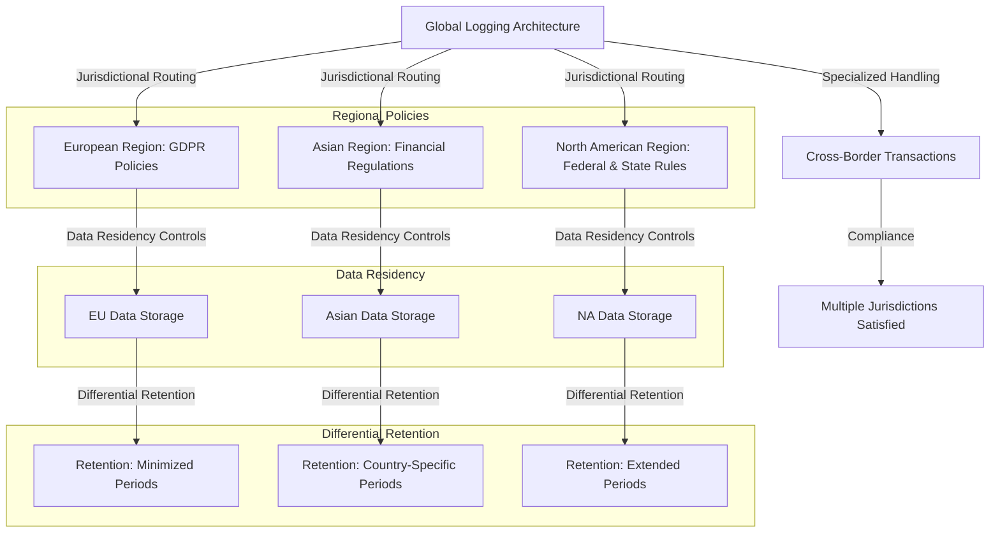

This implementation showcases a globally consistent logging architecture as the central framework, with regionally-tuned extensions for regulatory compliance. Data residency controls ensure information remains within appropriate jurisdictions, while differential retention applies varying preservation periods based on local requirements. Additionally, specialized handling for cross-border transactions ensures simultaneous adherence to overlapping regulatory frameworks.

### Teaching Narrative

Cross-border operations create exceptional complexity for banking log compliance—requiring simultaneous adherence to multiple, sometimes conflicting regulatory frameworks across different jurisdictions. Global financial institutions face a particular challenge as transactions routinely flow across regional boundaries, while the underlying logs must satisfy diverse local requirements. Modern approaches address this complexity through several strategies: jurisdictional routing ensuring transaction logs are stored in appropriate regions to satisfy data residency requirements, policy inheritance frameworks implementing globally consistent baseline logging with regional policy extensions for local regulations, differential retention applying jurisdiction-specific preservation periods to different information components, metadata tagging identifying the regulatory frameworks applicable to specific log entries, and specialized handling for cross-border transactions that must simultaneously satisfy requirements from multiple jurisdictions. These capabilities are particularly critical for operations spanning regions with fundamentally different regulatory philosophies—European jurisdictions emphasizing privacy and data minimization while other regions might prioritize comprehensive retention for law enforcement or national security purposes. A single international wire transfer might cross multiple jurisdictions, requiring the logging system to simultaneously satisfy European privacy regulations, Asian financial monitoring requirements, and North American anti-money laundering provisions—a complex ballet of regulatory compliance that must be addressed through sophisticated architectural design rather than simplified approaches feasible in single-jurisdiction operations.

### Common Example of the Problem

International Banking Group operated a global payment processing platform initially designed in their North American headquarters with standardized logging across all regions. The system captured comprehensive transaction details including full customer information, complete account data, and detailed processing records—stored centrally in US-based data centers for operational efficiency and consistent analysis. This architecture created critical compliance problems across regions, as summarized below:

| **Region** | **Regulatory Requirement** | **Compliance Issue** |
| ----------------- | -------------------------------------------------------------------------------------------------------- | ------------------------------------------------------------------------------------------------------------ |
| **Europe (EU)** | GDPR: Data residency, data minimization, and restrictions on cross-border data transfers. | Personal data was transferred outside the EU without adequate safeguards and retained longer than necessary. |
| **Hong Kong** | Local regulations requiring transaction records to stay within jurisdiction for regulatory access. | Transaction logs were stored in US data centers instead of remaining in Hong Kong. |
| **Singapore** | Financial regulations mandating specific encryption standards for sensitive financial data. | Centralized system didn’t support required encryption standards for financial data. |
| **Canada** | Privacy laws requiring explicit customer consent for cross-border data transfers. | Consent for transferring customer information across borders was not obtained. |
| **United States** | Anti-money laundering (AML) laws requiring comprehensive and long-term retention of transaction records. | Data minimization principles elsewhere conflicted with US requirements for extensive record retention. |

The bank faced potential penalties in multiple jurisdictions, customer consent issues, and the architectural challenge of retrofitting regional compliance into a system designed for centralized uniformity. The fundamental issue: logging had been designed for operational consistency rather than regulatory diversity, creating a significant architecture-compliance mismatch in global operations.

### SRE Best Practice: Evidence-Based Investigation

Evidence-based investigation for cross-border compliance requires systematic mapping of both requirements and data flows across jurisdictional boundaries. To guide this process, the following checklist offers a practical, actionable reference for implementing evidence-based investigation in multi-jurisdiction environments:

#### Checklist: Steps for Evidence-Based Investigation in Multi-Jurisdiction Compliance

1. **Regulatory Mapping**

   - Identify specific logging requirements for each operating jurisdiction.
   - Pay particular attention to:
     - Data residency mandates.
     - Privacy restrictions.
     - Retention periods.
     - Protection standards.
     - Cross-border transfer limitations.

2. **Data Flow Analysis**

   - Track transaction log movement between systems and across jurisdictions.
   - Identify potential compliance conflicts where logs cross regulatory boundaries.

3. **Gap Analysis**

   - Compare current implementation against jurisdiction-specific requirements.
   - Create a prioritized matrix of compliance risks, considering:
     - Regulatory severity.
     - Business impact.

4. **Scenario Testing**

   - Simulate cross-border transaction scenarios to validate compliance controls.
   - Test whether logging systems handle operations spanning multiple jurisdictions appropriately.

5. **Metadata-Driven Compliance Verification**

   - Implement compliance verification mechanisms using jurisdictional metadata tags.
   - Validate whether log records satisfy all applicable regulatory requirements.
   - Automate identification of potential violations to address issues proactively.

6. **Regional Isolation Capability Testing**

   - Verify jurisdiction-specific controls prevent prohibited data transfers.
   - Ensure business operations remain uninterrupted while maintaining compliance.
   - Confirm that operational needs do not override regulatory requirements.

#### Example Workflow: Evidence-Based Investigation

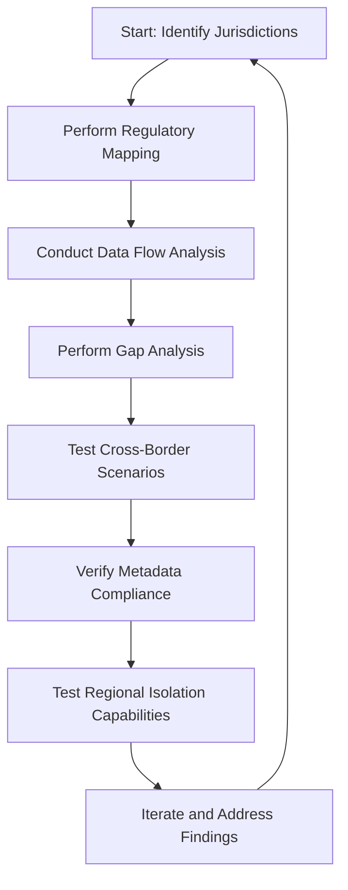

Leading organizations leverage these steps to proactively identify and mitigate compliance risks. By systematically addressing cross-border complexities, they ensure their logging architecture meets the highest regulatory standards without compromising operational efficiency.

### Banking Impact

Cross-border compliance failures create severe business impacts that extend far beyond technical concerns, triggering a cascade of interconnected challenges. Regulatory consequences can be particularly severe, as international banks may face enforcement actions from multiple authorities for the same fundamental issue. Each jurisdiction affected by compliance gaps can impose penalties, compounding the financial and reputational damage. Operational restrictions often follow, with regulators limiting services in their jurisdiction until local requirements are satisfied. This can lead to business unit isolation or even forced market exits when global platforms cannot reconcile conflicting regional mandates.

The operational fallout carries forward into the customer experience. Fragmented compliance approaches result in inconsistent service capabilities, unnecessary friction during cross-border transactions, and diminished trust when logging architectures fail to elegantly handle multi-jurisdiction requirements. Simultaneously, technology costs escalate dramatically when cross-border compliance is addressed reactively. Banks often incur expenses for duplicate infrastructure, complex data segregation mechanisms, and specialized interfaces to bridge regional implementations. These inefficiencies divert resources from innovation and strategic projects.

Ultimately, compliance failures impose growth limitations, as the complexity of multi-jurisdiction regulations becomes a barrier to efficient market entry or service expansion. This cascading effect transforms regulatory requirements from manageable controls into insurmountable obstacles to business development.

The following text-based diagram illustrates the cascading impacts of cross-border compliance failures:

```
Compliance Failure
       ↓
Regulatory Penalties
       ↓
Operational Restrictions
       ↓
Customer Experience Degradation
       ↓
Escalating Technology Costs
       ↓
Growth Limitations
```

For international financial institutions, sophisticated cross-border logging compliance is not just a technical necessity but a strategic business enabler. It directly supports global operations, helps mitigate cascading risks, and unlocks growth opportunities by ensuring seamless adherence to complex regulatory frameworks.

### Implementation Guidance

To implement effective cross-border compliance for banking log systems:

1. Create a comprehensive jurisdictional requirements matrix documenting specific logging mandates for each operating region, explicitly identifying data residency requirements, privacy restrictions, retention periods, and protection standards.

2. Implement data classification with jurisdictional tagging, marking every log entry with metadata identifying which regulatory frameworks apply based on transaction origin, customer location, and processing jurisdiction. Below is an example of pseudocode for metadata tagging:

   ```python
   import datetime

   # Define jurisdictional rules
   jurisdiction_rules = {
       "EU": {"regulations": ["GDPR"], "retention": 365},
       "US": {"regulations": ["AML", "PatriotAct"], "retention": 730},
       "ASIA": {"regulations": ["LocalFinanceAct"], "retention": 540}
   }

   # Function to tag log entry with jurisdictional metadata
   def tag_log_entry(log_entry, transaction_origin):
       if transaction_origin in jurisdiction_rules:
           rules = jurisdiction_rules[transaction_origin]
           log_entry["metadata"] = {
               "jurisdiction": transaction_origin,
               "regulations": rules["regulations"],
               "retention_days": rules["retention"],
               "tagged_at": datetime.datetime.now().isoformat()
           }
       else:
           log_entry["metadata"] = {"jurisdiction": "UNKNOWN", "tagged_at": datetime.datetime.now().isoformat()}
       return log_entry

   # Example log entry
   log = {"transaction_id": "12345", "details": "Sample transaction"}
   tagged_log = tag_log_entry(log, "EU")
   print(tagged_log)
   ```

3. Establish a policy inheritance framework with global baseline standards that apply universally, extended by region-specific policy layers that implement local requirements without duplicating underlying architecture.

4. Deploy regional data residency controls that automatically route regulated information to appropriate storage locations based on jurisdictional requirements, preventing prohibited cross-border transfers. For instance, use a routing table for storage based on jurisdiction:

   ```plaintext
   +----------------+----------------------+
   | Jurisdiction   | Storage Location    |
   +----------------+----------------------+
   | EU             | EU Data Center A    |
   | US             | US Data Center B    |
   | ASIA           | Asia Data Center C  |
   +----------------+----------------------+
   ```

5. Implement differential field handling that applies appropriate treatment to individual data elements based on jurisdictional requirements—masking, encrypting, or excluding specific fields according to regional mandates.

6. Create specialized handling for cross-border transactions that simultaneously satisfies requirements from all involved jurisdictions, potentially maintaining separate record versions with jurisdiction-appropriate content. Use a decision tree or rules engine to determine applicable jurisdictional rules:

   ```mermaid
   graph TD
   Start[Start: Transaction Received] --> CheckRegions{Check Regions Involved}
   CheckRegions --> EU["Apply GDPR Rules"]
   CheckRegions --> US["Apply AML Rules"]
   CheckRegions --> ASIA["Apply LocalFinanceAct Rules"]
   EU --> Combine["Combine Compliance Rules"]
   US --> Combine
   ASIA --> Combine
   Combine --> Log[Log Entry Created with Metadata]
   ```

7. Develop comprehensive metadata documentation that explicitly connects each log attribute to specific regulatory requirements across jurisdictions, providing clear compliance evidence during regional examinations.

8. Establish automated compliance verification that continuously validates whether logging implementations remain compliant with all applicable jurisdictions as regulations evolve and systems change. Below is an example of pseudocode for automated compliance checks:

   ```python
   def verify_compliance(log_entry, jurisdiction):
       # Retrieve jurisdictional rules
       rules = jurisdiction_rules.get(jurisdiction, {})
       compliance_issues = []

       # Check metadata
       if "metadata" not in log_entry:
           compliance_issues.append("Missing metadata")
       else:
           # Check retention policy
           if log_entry["metadata"].get("retention_days") != rules.get("retention"):
               compliance_issues.append("Retention policy mismatch")

           # Check regulations
           if not set(rules.get("regulations", [])) <= set(log_entry["metadata"].get("regulations", [])):
               compliance_issues.append("Regulation mismatch")

       return compliance_issues

   # Example compliance check
   issues = verify_compliance(tagged_log, "EU")
   if issues:
       print(f"Compliance Issues: {issues}")
   else:
       print("Log entry is compliant")
   ```

## Panel 8: The Technical Integration - Compliance by Design

### Scene Description

A bank's system architecture review where engineering leaders evaluate their regulatory logging implementation across different technology generations. The architecture spans multiple components, each addressing compliance requirements for different system types:

- **Native logging frameworks** in modern cloud services implementing regulatory features directly.
- **Middleware adapters** adding compliance capabilities to commercial banking packages.
- **Specialized collectors** extracting required information from legacy mainframe systems.
- **Centralized enrichment services** adding regulatory metadata to logs from systems with limited native capabilities.

Implementation timelines demonstrate their progressive enhancement approach—systematically upgrading logging capabilities across their technology landscape while maintaining continuous compliance through transitional controls.

To better illustrate these interactions and the flow of logging data, the following Mermaid diagram provides a visual representation of the system architecture:

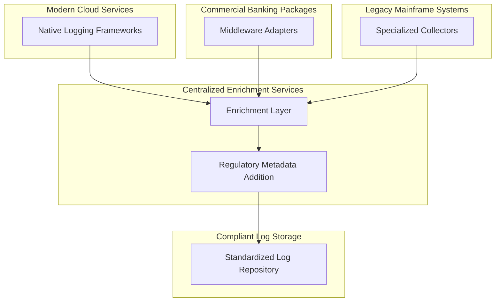

This diagram depicts how logs flow from diverse systems—modern, middleware, and legacy—into a centralized enrichment service. The enrichment layer ensures that regulatory metadata is added, standardizing logs before they are stored in a compliant log repository. This architecture enables a coherent logging ecosystem that supports regulatory compliance across the bank's varied technology landscape.

### Teaching Narrative

Technical integration transforms regulatory logging from conceptual requirements to operational reality—bridging the gap between compliance mandates and practical implementation across diverse banking technology landscapes. The challenge is particularly acute in financial institutions with technology generations spanning decades—from mainframe core banking systems to cloud-native digital channels, each with different native logging capabilities. Effective integration strategies address this diversity through layered approaches, recognizing the practical reality of banking technology landscapes—the impossibility of complete replacement and the need for pragmatic approaches that achieve compliance within existing constraints. By integrating regulatory requirements into the architectural fabric rather than treating them as after-the-fact additions, financial institutions ensure that all systems contribute to a coherent, demonstrably compliant logging ecosystem regardless of their underlying technology generation.

The following table summarizes these integration strategies for different system types:

| System Type | Integration Approach | Key Benefits |
| --------------------------------- | -------------------------------------------------------------- | ----------------------------------------------------------------------------------------- |
| Cloud-native systems | Native implementation leveraging built-in logging capabilities | High performance, low overhead, and direct compatibility with regulatory requirements |
| Commercial off-the-shelf (COTS) | Middleware adapters adding compliance-focused logging features | Extends existing system capabilities without requiring vendor modifications |
| Legacy mainframe systems | Specialized collectors extracting required transaction data | Enables compliance without modifying critical, hard-to-change legacy systems |
| Systems with limited capabilities | Centralized enrichment adding regulatory metadata to logs | Ensures compliance by enriching basic logs with required metadata for regulatory purposes |
| Heterogeneous environments | Transformation services standardizing diverse log formats | Facilitates consistent compliance reporting across disparate systems |

For instance, a modern digital banking platform might implement comprehensive regulatory logging natively, while a 1990s-era mainframe core banking system might require specialized collectors to extract transaction logs into compliant storage without modifying the original system. Each approach ensures compliance by design—embedding regulatory requirements into the core of the system architecture to maintain continuous compliance across the organization.

### Common Example of the Problem

Midwest Financial Corporation faced a critical integration challenge during a regulatory examination of their loan processing systems. Their technology landscape spanned multiple generations: a 1980s COBOL mainframe handling core loan servicing, 2000s-era Java applications managing underwriting, modern cloud services for customer-facing portals, and various commercial packages for specialized functions. When regulators requested comprehensive evidence of loan modification activities over a three-year period, the bank discovered their compliance logging was fragmented across these disparate systems. The fundamental issue wasn't lack of logging—every system generated records—but rather the absence of an integrated compliance architecture spanning diverse technologies, transforming what should have been straightforward evidence retrieval into a major technical challenge.

Below is a simplified representation of the fragmented logging architecture contributing to the problem:

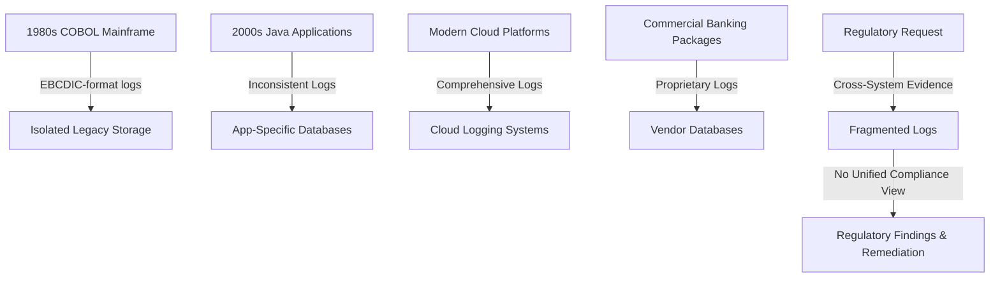

- **1980s COBOL Mainframe**: Generated limited logs in EBCDIC format, stored in isolated legacy systems.
- **2000s Java Applications**: Produced inconsistent logs with varying levels of detail, stored independently.
- **Modern Cloud Platforms**: Generated comprehensive logs but lacked integration with on-premises systems.
- **Commercial Banking Packages**: Used proprietary logging stored in isolated vendor databases.

When these fragmented systems were required to produce unified loan activity records, the gaps in integration became apparent, revealing the lack of a cohesive compliance-by-design architecture. This resulted in examination findings and mandatory remediation efforts to address the deficiencies.

### SRE Best Practice: Evidence-Based Investigation

Evidence-based investigation for technical integration requires systematic assessment of both logging capabilities and compliance gaps across diverse systems. This process ensures that compliance requirements are met across varying technology generations in a structured and actionable manner. Below is a checklist summarizing the key steps:

#### Checklist: Evidence-Based Investigation for Compliance Logging

1. **Capability Mapping**

   - Document current logging capabilities for each system.
   - Include details on log content, storage, formats, accessibility, and retention policies.

2. **Gap Analysis**

   - Compare existing logging capabilities against regulatory mandates.
   - Identify specific shortfalls in areas such as content, format, protection, retention, or accessibility.

3. **Data Flow Mapping**

   - Map data flows between systems, including integration points.
   - Identify where correlation context is maintained or lost.

4. **End-to-End Traceability Testing**

   - Select sample transactions and trace them across all involved systems.
   - Identify visibility gaps where information becomes disconnected.

5. **Reference Architecture Development**

   - Create technology-specific reference architectures for compliance logging.
   - Include reusable patterns for platforms like mainframes, commercial packages, legacy applications, and cloud services.

6. **Business Process Validation**

   - Validate technical logging against actual business workflows.
   - Ensure all compliance-relevant activities are captured, regardless of which systems are involved.

#### Example Workflow: Tracing a Sample Transaction

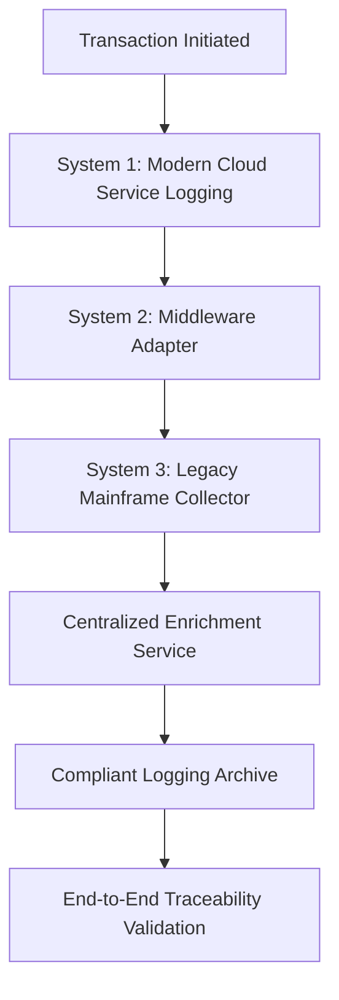

By following this checklist and workflow, organizations can transform compliance logging from a theoretical architecture to a practical implementation. This approach ensures systematic validation of technical capabilities and alignment with business requirements, enabling a demonstrably compliant logging ecosystem.

### Banking Impact

Technical integration failures create substantial business impacts beyond compliance concerns. Regulatory findings often result from inability to produce coherent evidence spanning system boundaries, even when individual components generate appropriate logs—transforming integration gaps into compliance violations with mandatory remediation requirements. Operational inefficiency emerges when staff must manually correlate information across disconnected systems during investigations or audits, creating both delay and potential human error in critical processes. Investigation limitations hamper fraud detection, risk management, and security response when related activities cannot be automatically connected across system boundaries. Technology expense increases dramatically when integration is implemented reactively rather than proactively, often requiring emergency projects with premium consulting costs and operational disruption. Most significantly, business agility suffers when compliance integration constrains technology evolution—organizations delay modernization initiatives when uncertain about maintaining regulatory obligations during transition, effectively allowing compliance concerns to dictate technology strategy rather than business needs. For financial institutions with complex technology ecosystems, effective integration architecture isn't merely a technical function but a strategic business capability that directly enables both regulatory compliance and technology evolution without creating false choices between these objectives.

### Implementation Guidance

To implement effective technical integration for regulatory logging across diverse banking systems:

1. Create technology-specific integration patterns documenting proven approaches for different system types in your environment: native logging frameworks for modern applications, specialized collectors for legacy systems, vendor-specific adapters for commercial packages, and API-based integration for cloud services.

2. Implement a common identifier framework ensuring that transaction correlation IDs flow consistently across all systems regardless of technology generation, enabling end-to-end traceability despite architectural diversity.

3. Establish a centralized log normalization service that transforms diverse formats from different systems into standardized structures with consistent field names, value formats, and metadata taxonomy. For example, consider the following Python code snippet for normalizing logs into a common JSON structure:

   ```python
   import json

   # Example log normalization function
   def normalize_log(raw_log, system_type):
       # Map system-specific fields to standardized fields
       normalization_map = {
           "modern_app": lambda log: {
               "timestamp": log.get("ts"),
               "transaction_id": log.get("txn_id"),
               "user_id": log.get("user"),
               "operation": log.get("action"),
               "metadata": log.get("meta", {})
           },
           "legacy_system": lambda log: {
               "timestamp": log.get("date_time"),
               "transaction_id": log.get("trans_id"),
               "user_id": log.get("account_holder"),
               "operation": log.get("activity"),
               "metadata": {}
           }
       }

       # Normalize based on system type
       normalize = normalization_map.get(system_type)
       if not normalize:
           raise ValueError(f"Unsupported system type: {system_type}")
       return json.dumps(normalize(raw_log), indent=4)

   # Example usage
   legacy_log = {
       "date_time": "2023-10-01T14:30:00",
       "trans_id": "ABC123",
       "account_holder": "user_001",
       "activity": "balance_check"
   }
   print(normalize_log(legacy_log, "legacy_system"))
   ```

4. Deploy context enrichment that automatically adds regulatory metadata to logs from systems with limited native capabilities, ensuring appropriate classification, retention rules, and compliance tagging. Below is an example of applying enrichment to logs:

   ```python
   def enrich_log(log, regulatory_metadata):
       # Add regulatory classification and retention rules
       log["regulatory_metadata"] = regulatory_metadata
       return log

   # Example enrichment metadata
   metadata = {
       "classification": "PII",
       "retention_period": "7 years",
       "compliance_tag": "GDPR"
   }
   enriched_log = enrich_log({
       "transaction_id": "XYZ789",
       "timestamp": "2023-10-01T15:45:00",
       "operation": "fund_transfer"
   }, metadata)
   print(json.dumps(enriched_log, indent=4))
   ```

5. Develop specialized adapters for commercial banking packages that extract required regulatory information through supported mechanisms like database views, API connections, or report extraction when direct logging modification isn't possible.

6. Implement progressive data quality validation that verifies regulatory completeness at each integration point, alerting when required information is missing or improperly formatted rather than discovering gaps during audits. For example:

   ```python
   def validate_log(log, required_fields):
       missing_fields = [field for field in required_fields if field not in log]
       if missing_fields:
           raise ValueError(f"Missing required fields: {', '.join(missing_fields)}")
       return True

   # Example validation
   log = {"transaction_id": "12345", "timestamp": "2023-10-01T16:00:00"}
   required = ["transaction_id", "timestamp", "user_id"]
   try:
       validate_log(log, required)
   except ValueError as e:
       print(f"Validation Error: {e}")
   ```

7. Create documentation explicitly mapping each regulatory requirement to its technical implementation across relevant systems, providing clear evidence of how diverse technologies collectively satisfy compliance mandates.

## Panel 9: The Business Value Alignment - Beyond Compliance to Advantage

### Scene Description

A banking executive review where technology and business leaders analyze their regulatory logging investment beyond compliance. The discussion is centered around a visual flow illustrating how compliance-driven logging architecture delivers additional business value across key dimensions. Below is a simplified representation:

```
compliance-driven logging
       |
       v
+----------------------------+
| Regulatory Compliance      |
| (e.g., mandated logs for   |
| audits and reporting)      |
+----------------------------+
       |
       v
+----------------------------+
| Business Value Dimensions  |
+----------------------------+
       |
       v
+------------+  +-------------------+  +---------------------+  +-------------------+
| Fraud       |  | Customer           |  | Operational         |  | Incident         |
| Detection   |  | Experience         |  | Efficiency          |  | Mitigation       |
| (e.g.,      |  | (e.g., better      |  | (e.g., streamlined  |  | (e.g., faster    |
| pattern     |  | transaction        |  | audit processes)    |  | troubleshooting) |
| detection)  |  | visibility)        |  |                     |  |                 |
+------------+  +-------------------+  +---------------------+  +-------------------+

Key examples include:
- Enhanced fraud detection capabilities identifying suspicious patterns using the same logs maintained for regulatory purposes.
- Improved customer experience metrics through better transaction visibility and issue resolution.
- Operational efficiency gains from streamlined audit processes and automated evidence collection.
- Reduced incident impact through faster troubleshooting and resolution.

Finally, financial modeling demonstrates how this unified logging infrastructure satisfies both compliance mandates and critical business capabilities—transforming what could be viewed as regulatory cost into strategic investment with measurable returns beyond avoiding penalties.
```

### Teaching Narrative

Business value alignment transforms regulatory logging from compliance cost to strategic investment by identifying and enhancing the operational and commercial benefits beyond mere requirement satisfaction. While regulatory compliance alone justifies necessary logging investments in banking environments, forward-thinking institutions recognize the broader value these same capabilities can deliver. Effective business alignment strategies identify multiple value dimensions: operational effectiveness using compliance-driven logs to improve troubleshooting and reliability, customer experience enhancement through better transaction visibility and issue resolution, fraud and risk management leveraging comprehensive transaction logs for pattern detection, business intelligence extracting valuable insights from the same data maintained for regulatory purposes, and efficiency gains through automated evidence collection and reporting. These alignments are particularly powerful in banking environments where regulations often mandate capabilities with inherent business value—comprehensive transaction logging required for compliance simultaneously enables sophisticated fraud detection, while immutable record storage satisfies both regulatory non-repudiation requirements and internal audit needs. By explicitly identifying and enhancing these alignments, organizations transform what might be viewed as regulatory burden into strategic capability—designing logging architectures that simultaneously satisfy compliance requirements while delivering measurable business value through improved operations, enhanced security, better customer experience, and valuable intelligence. This strategic perspective changes investment conversations from cost-focused compliance discussions to value-oriented capability enhancements, securing broader organizational support and often larger budgets than pure compliance initiatives might obtain.

### Common Example of the Problem

Northeast Banking Group historically viewed regulatory logging as a pure compliance cost—implementing minimum required capabilities with relentless focus on cost control. Their compliance-driven approach created exactly what regulations mandated: transaction records retained for required periods, basic access controls limiting information exposure, and minimal audit trails documenting system activities. However, this compliance-only mindset created significant business limitations: fraud investigators had minimal visibility into suspicious patterns without comprehensive context, customer service representatives couldn't provide transaction status details during inquiries, operations teams struggled with limited troubleshooting capabilities during incidents, and business intelligence relied on separate data warehouses with no connection to real-time transaction flows.

To illustrate the difference between a compliance-only approach and a business-aligned approach, the table below summarizes key characteristics and outcomes:

| **Aspect** | **Compliance-Only Approach** | **Business-Aligned Approach** |
| ---------------------------- | ---------------------------------------------------------------------- | ----------------------------------------------------------------------------------------------------- |
| **Primary Goal** | Satisfy minimum regulatory requirements | Satisfy regulatory requirements while unlocking operational and strategic value |
| **Logging Scope** | Limited to mandated data retention and basic access controls | Comprehensive, real-time, and enriched logs supporting multiple use cases |
| **Fraud Detection** | Minimal pattern visibility; reactive investigations | Proactive fraud detection leveraging detailed transaction logs and anomaly detection |
| **Customer Experience** | Limited transaction visibility; delays in resolving customer inquiries | Enhanced customer support with real-time transaction insights and faster resolution |
| **Troubleshooting** | Basic audit trails; slow incident diagnosis | Rich contextual data enabling faster troubleshooting and root cause analysis |
| **Business Intelligence** | Separate data systems; no integration with real-time transaction data | Unified logging infrastructure enabling real-time insights and integrated business intelligence |
| **Cost Perception** | Viewed as a regulatory expense | Positioned as an investment in operational efficiency, security, and customer satisfaction |
| **Investment Justification** | Resistance due to lack of perceived value beyond compliance | Broader organizational support driven by demonstrated ROI and alignment with strategic business goals |

When a digital transformation initiative required $4.2 million for enhanced logging infrastructure to meet expanding regulatory requirements, Northeast Banking Group faced severe resistance due to the "pure compliance cost" framing. Operational teams highlighted how improved logging would address critical business limitations, but the fundamental issue wasn’t the technical architecture—it was the strategic framing. By viewing logging solely through a compliance lens, the organization missed substantial business value opportunities that could have transformed the investment case from mandatory cost to strategic capability with measurable returns beyond regulatory necessity.

### SRE Best Practice: Evidence-Based Investigation

Evidence-based investigation for business value alignment requires quantifying both current limitations and potential benefits beyond compliance. Begin with operational impact analysis documenting how current logging limitations affect business metrics: measure mean-time-to-resolution during incidents where limited visibility extends troubleshooting, quantify customer service call durations when representatives lack transaction visibility, calculate manual effort required for audit evidence collection without automated capabilities, and analyze fraud detection limitations resulting from incomplete pattern visibility. Conduct comparative benchmarking between basic compliance-driven logging and enhanced business-aligned approaches, identifying specific value differences in operational efficiency, customer experience, risk management, and intelligence capabilities. Develop financial models calculating both direct cost savings from operational improvements and indirect revenue benefits from enhanced capabilities. Test business enhancement scenarios through pilot implementations demonstrating how expanded logging capabilities deliver concrete operational benefits beyond compliance satisfaction. Leading organizations implement balanced scorecard approaches that track both compliance objectives and business value metrics for logging investments, ensuring that infrastructure delivers across multiple dimensions rather than focusing exclusively on regulatory requirements.

#### Evidence-Based Investigation Checklist

To structure and streamline your evidence-based investigation, follow this checklist:

1. **Operational Impact Analysis**:

   - Measure mean-time-to-resolution (MTTR) for incidents impacted by limited logging visibility.
   - Quantify customer service call durations caused by insufficient transaction visibility.
   - Calculate manual effort required for audit evidence collection without automation.
   - Identify fraud detection challenges due to incomplete pattern visibility.

2. **Comparative Benchmarking**:

   - Compare performance metrics between compliance-driven logging and business-aligned logging approaches.
   - Document specific value differences in operational efficiency, customer experience, risk management, and intelligence capabilities.

3. **Financial Modeling**:

   - Calculate direct cost savings from operational improvements (e.g., reduced MTTR, automation of audit processes).
   - Estimate indirect revenue benefits from enhanced capabilities (e.g., improved fraud detection, better customer retention).

4. **Pilot Implementations**:

   - Design and execute small-scale pilots of enhanced logging capabilities.
   - Measure and document concrete operational benefits achieved during pilots.

5. **Balanced Scorecard Tracking**:

   - Develop a set of metrics that track both regulatory compliance and business value outcomes.
   - Regularly review scorecard data to ensure alignment across compliance and business objectives.

By following this checklist, organizations can transform logging from a perceived compliance burden into a strategic asset, delivering measurable impact across key performance indicators while maintaining regulatory satisfaction.

### Banking Impact

Business value misalignment in banking environments can lead to significant opportunity costs beyond compliance concerns. Below is a breakdown of key impacts:

- **Operational Inefficiency**:

  - Logging systems designed purely for compliance often lack the context and granularity needed for effective troubleshooting.
  - Results in prolonged incident resolution times and unnecessary customer impact during system issues.

- **Customer Experience Limitations**:

  - Compliance-minimum logging restricts service representatives from accessing sufficient transaction visibility.
  - Leads to longer call durations, unresolved inquiries, and reduced customer satisfaction.

- **Fraud Detection Challenges**:

  - Logging designed solely for regulatory purposes may lack the comprehensive patterns and relationship visibility required for advanced detection algorithms.
  - Increases potential fraud losses that could have been mitigated with enhanced logging capabilities.

- **Business Intelligence Gaps**:

  - Disconnect between compliance and analytics functions creates silos with redundant data storage and missed insight opportunities.
  - Prevents organizations from fully leveraging their data for strategic decision-making.

- **Innovation Constraints**:

  - Viewing compliance and business capabilities as competing rather than complementary objectives stifles innovation.
  - Limits the ability to simultaneously enhance customer experience, operational efficiency, and regulatory adherence via unified logging architectures.

**Summary of Impacts:**

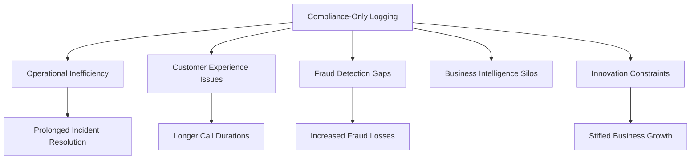

For financial institutions balancing regulatory requirements with business objectives, addressing these impacts is not merely an operational preference—it's a competitive necessity. Strategic alignment of compliance and business functions directly enhances both regulatory effectiveness and business performance across multiple dimensions.

### Implementation Guidance

To implement effective business value alignment for regulatory logging:

1. Create a multi-dimensional value framework that explicitly identifies both compliance requirements and business enhancement opportunities across key dimensions: operational efficiency, customer experience, risk management, and business intelligence.

2. Develop unified logging requirements that combine mandatory regulatory elements with business-enhancing context, ensuring that implementation satisfies compliance needs while delivering operational value.

3. Implement shared access patterns that make compliance-driven logs securely available to business functions that can derive value from them—customer service, fraud detection, operations, and analytics—with appropriate access controls.

4. Establish value measurement tracking both compliance objectives and business metrics, quantifying how logging investments deliver benefits across regulatory adherence, operational improvement, and customer experience enhancement.

5. Create business-aligned log enrichment that adds context beyond minimum regulatory requirements, enhancing operational usefulness without compromising compliance objectives.

6. Develop executive dashboards demonstrating how logging infrastructure delivers multi-dimensional value, helping leadership understand the broader return on what might otherwise be viewed as compliance-only investment.

7. Implement continuous enhancement identifying new business value opportunities from existing compliance logging, systematically expanding capabilities beyond minimum regulatory requirements to deliver increasing operational benefits over time.

## Panel 10: The Compliance Evolution - Adapting to Regulatory Change

### Scene Description

A banking regulatory change management session where compliance and technology teams analyze emerging regulations affecting their logging practices. Timeline projections show upcoming requirements with implementation deadlines: new financial monitoring standards requiring additional transaction metadata, expanded privacy regulations affecting log content and processing, and enhanced cybersecurity requirements mandating specific detection capabilities.

The adaptable compliance framework is structured around four key components, visualized below:

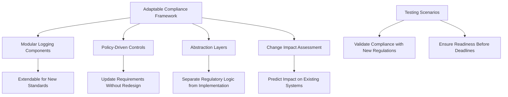

- **Modular Logging Components**: Designed for extension, allowing seamless integration of new requirements like additional transaction metadata for financial monitoring.
- **Policy-Driven Controls**: Enable updates to regulatory requirements through configurable policies, avoiding the need for system redesign.
- **Abstraction Layers**: Insulate technical systems from regulatory logic changes, ensuring stability and adaptability.
- **Change Impact Assessment**: Systematically predict how new requirements impact existing controls, minimizing disruption.

Testing scenarios demonstrate how these components work together to validate compliance with newly-introduced regulations prior to enforcement deadlines, ensuring readiness and reducing operational risk.

### Teaching Narrative

Compliance evolution recognizes that regulatory requirements aren't static destinations but continually moving targets—requiring logging architectures designed for adaptation rather than point-in-time compliance. The financial regulatory landscape changes constantly through new legislation, updated regulatory guidance, evolving industry standards, and shifting enforcement priorities. Effective compliance architectures address this dynamic reality through adaptable approaches: modular design separating different regulatory concerns to isolate changes, policy-driven implementation enabling requirement updates without system redesign, abstraction layers insulating technical systems from regulatory logic changes, formal impact assessment methodologies systematically evaluating how new requirements affect existing controls, and change validation frameworks testing compliance with emerging regulations before enforcement deadlines. These capabilities are particularly valuable in banking environments where regulatory changes often introduce comprehensive new requirements with limited implementation timeframes—from expanded transaction monitoring mandates under anti-money laundering frameworks to new personal data protections under evolving privacy regulations. By designing for change rather than static compliance, organizations not only reduce the cost and disruption of regulatory adaptation but establish a sustainable competitive advantage through faster response to evolving requirements. This evolutionary perspective transforms compliance from repeated crisis response to continuous capability enhancement—building adaptable logging systems that maintain compliance through regulatory change while minimizing the technical and operational impact of regular requirements evolution.

### Common Example of the Problem

Atlantic Regional Bank implemented a comprehensive logging architecture for their digital banking platform, meeting all applicable regulations at design time. The system was engineered as a tightly integrated solution optimized for existing requirements—efficiently satisfying current needs but with limited flexibility for adaptation. This approach created critical challenges when several major regulatory changes occurred within an 18-month period:

| **Regulatory Change** | **Requirement** | **Impact on Existing System** |
| ----------------------------------- | ---------------------------------------------------------------- | ---------------------------------------------------------------------------------------------------------------- |
| Updated Privacy Regulations | Introduced new consent requirements for specific data uses | Required user interface updates to capture and manage consent, along with backend logic changes for enforcement. |
| Enhanced Fraud Monitoring Standards | Mandated collection of additional transaction metadata | Demanded database schema updates, historical data migration, and changes to logging pipelines. |
| Cybersecurity Regulations | Required detection capabilities for unauthorized access patterns | Necessitated implementation of anomaly detection mechanisms and real-time log analysis updates. |

Each of these changes necessitated significant rework: code modifications throughout tightly-coupled systems, database schema changes requiring migration of historical data, user interface updates to accommodate new inputs, and reporting modifications to demonstrate compliance with updated standards. The high degree of interdependency between components magnified the complexity and cost of these adaptations.

This sequence of changes led to several critical outcomes:

```mermaid
flowchart TD
    A[Regulatory Changes] --> B[System Rework]
    B --> C[Emergency Projects]
    B --> D[Operational Disruption]
    B --> E[Compliance Gaps]
    C --> F[Increased Costs]
    D --> F
    E --> G[Regulatory Risk]

    style F fill:#fdd,stroke:#f00,stroke-width:2px
    style G fill:#fdd,stroke:#f00,stroke-width:2px
```

The fundamental issue wasn't initial compliance—Atlantic Regional Bank's system fully satisfied requirements when built—but rather the architectural inflexibility that transformed predictable regulatory evolution into repeated crisis response. This resulted in ongoing compliance risk, unsustainable implementation costs, and operational disruption as regulations continued to evolve.

### SRE Best Practice: Evidence-Based Investigation

Evidence-based investigation for compliance evolution requires systematic assessment of both architectural flexibility and regulatory change impact. Begin with adaptability analysis evaluating how effectively your current logging architecture can accommodate change: assess modularity by identifying tightly-coupled components that require coordinated modification, evaluate configurability by determining which aspects can be updated through policy changes versus code modifications, and test extension capability by modeling how new data elements or requirements would be incorporated. Conduct regulatory horizon scanning to identify emerging requirements before implementation deadlines: monitor proposed regulations during comment periods, track industry standard evolution that often precedes formal mandates, and participate in regulatory outreach programs providing early insight into enforcement priorities. Perform change impact assessment for identified regulatory developments: model how new requirements would affect existing systems, identify potential compliance gaps before they become violations, and estimate implementation effort required for adaptation. Leading organizations implement regular adaptation exercises—similar to disaster recovery testing—where teams simulate implementing significant regulatory changes to validate their architecture's flexibility before actual requirements emerge. Most critically, measure adaptation efficiency by tracking the cost, time, and operational impact of past regulatory changes, creating a baseline for improvement as architectural flexibility enhances.

#### Evidence-Based Investigation Checklist

- **Adaptability Analysis**

  - Assess modularity: Identify tightly-coupled components needing coordinated updates.
  - Evaluate configurability: Determine which updates can be applied via policy changes versus code changes.
  - Test extension capability: Model incorporation of new data elements or requirements.

- **Regulatory Horizon Scanning**

  - Monitor proposed regulations and their comment periods.
  - Track evolving industry standards that may drive formal mandates.
  - Participate in regulatory outreach programs for early enforcement insights.

- **Change Impact Assessment**

  - Model the effects of new requirements on existing systems.
  - Identify compliance gaps before they become violations.
  - Estimate the effort required for adaptation.

- **Adaptation Exercises**

  - Simulate the implementation of significant regulatory changes.
  - Validate the flexibility of logging architectures before real requirements arise.

- **Adaptation Efficiency Measurement**

  - Track cost, time, and operational impact of past regulatory changes.
  - Create a baseline for improvement to enhance architectural flexibility.

By following this structured checklist, organizations can transform compliance evolution from reactive crisis management to strategic capability development—building systems designed for change rather than current-state optimization.

### Banking Impact

Regulatory adaptation failures create substantial business impacts beyond compliance concerns. Implementation costs escalate dramatically when architecture requires significant rework for each regulatory change—creating both direct expenses through emergency projects and opportunity costs as resources divert from strategic initiatives to compliance remediation. Operational disruption frequently accompanies compliance-driven changes when inflexible architectures require extensive modifications affecting multiple system components simultaneously. Compliance gaps emerge when implementation timeframes exceed regulatory deadlines due to technical complexity, creating both regulatory exposure and potential enforcement actions. Customer experience often suffers through multiple disruptive updates, feature limitations during transition periods, and inconsistent interfaces as requirements evolve. Most significantly, innovation paralysis can develop when organizations delay strategic improvements while struggling with regulatory adaptation—creating a dangerous cycle where compliance consumes resources that should drive competitive enhancement.

For financial institutions operating in constantly evolving regulatory environments, adaptation efficiency isn't merely a technical concern but a strategic business capability that directly impacts both compliance effectiveness and competitive positioning. Organizations with flexible, adaptation-ready architectures redirect significant resources from regulatory maintenance to customer value creation—establishing sustainable advantage over competitors constantly responding to compliance challenges through crisis management.

#### Summary of Business Impacts and Consequences

| **Business Impact** | **Description** | **Consequences** |
| ------------------------------ | --------------------------------------------------------------------------------- | ----------------------------------------------------------------------------------------------------- |
| **Implementation Costs** | Increased expenses from emergency projects and extensive rework. | Financial strain, diversion of resources from strategic initiatives, and reduced innovation capacity. |
| **Operational Disruption** | Widespread system modifications required for compliance changes. | Service downtime, system instability, and delayed project timelines. |
| **Compliance Gaps** | Failure to meet regulatory deadlines due to technical complexity. | Regulatory exposure, enforcement actions, fines, and reputational damage. |
| **Customer Experience Issues** | Disruptive updates, limited features, and inconsistent interfaces during changes. | Decreased customer satisfaction, loss of trust, and potential customer attrition. |
| **Innovation Paralysis** | Delays in strategic improvements due to ongoing compliance struggles. | Loss of competitive edge, stagnation in product offerings, and reduced market responsiveness. |

This structured view highlights the interdependencies between regulatory adaptation and broader business outcomes. By adopting flexible, modular architectures and proactive compliance strategies, financial institutions can effectively mitigate these impacts and shift focus toward sustained innovation and competitive growth.

### Implementation Guidance

To implement effective compliance evolution for banking log systems, follow this structured checklist:

#### Checklist for Building Adaptive Logging Architectures

1. **Design Modular Logging Components**

   - Isolate regulatory concerns into distinct modules.
   - Ensure changes to one component do not affect unrelated capabilities.
   - Use a plug-and-play approach for integrating new compliance requirements.

2. **Adopt Policy-Driven Controls**

   - Define compliance rules in configuration files, not hardcoded logic.
   - Enable rapid modifications to thresholds, classifications, or rule logic.
   - Verify that policy updates propagate without requiring redeployment.

3. **Implement Regulatory Abstraction Layers**

   - Separate compliance logic from technical system implementations.
   - Maintain consistent regulatory interpretations across diverse systems.
   - Use abstraction to decouple technical upgrades from compliance updates.

4. **Enable Metadata-Driven Adaptability**

   - Centralize definitions for log attributes, classifications, and handling rules.
   - Avoid hardcoding compliance logic by using metadata-driven configurations.
   - Simplify adaptations to new requirements by updating centralized definitions.

5. **Develop Comprehensive Testing Frameworks**

   - Create automated tests to validate compliance capabilities against regulatory requirements.
   - Include regression tests to ensure new rules do not break existing compliance.
   - Simulate enforcement scenarios to preemptively identify gaps.

6. **Establish Change Impact Analysis Methodologies**

   - Develop systematic evaluation processes to assess how new requirements impact existing systems.
   - Identify areas requiring adaptation well ahead of regulatory deadlines.
   - Create traceability between requirements, system components, and compliance outcomes.

7. **Support Version-Aware Compliance**

   - Maintain compatibility with historical regulatory requirements.
   - Ensure proper handling of records created under different regulatory mandates.
   - Track and manage compliance versions across systems and timeframes.

8. **Implement Continuous Regulatory Monitoring**

   - Set up functions to monitor emerging regulatory requirements and enforcement trends.
   - Provide early warning for proposed rule changes or industry guidance updates.
   - Use monitoring outputs to inform proactive compliance strategy adjustments.

#### Implementation Flow Example (Text-Based Representation)

```
[Emerging Regulation] --> [Regulatory Monitoring] --> [Impact Analysis]
    --> [Update Policy Configs] --> [Validate via Testing Framework]
        --> [Deploy Modular Changes]
```

By following this checklist, organizations can build robust logging systems that adapt efficiently to regulatory changes, ensuring sustained compliance with minimal disruption.
