# Chapter 11: Logs and Error Budgets - Quantifying Reliability

## Chapter Overview

Welcome to the brutal, data-driven world where your precious “five nines” are nothing more than comforting lies. This chapter rips the band-aid off legacy reliability metrics and exposes the soft underbelly of uptime: customer-impacting failures hiding behind green dashboards. We’re not here to pat you on the back for 99.95% availability while your users rage-tweet about failed transactions. Instead, we weaponize logs, error budgets, and SLOs to drag your reliability practice—kicking and screaming—out of the stone age. Like a bank finally discovering that “the system is up” doesn’t mean “the money moves,” you’ll learn to measure what matters, set targets that actually make sense, and balance the relentless march of features with the cold reality of risk. If you’re still counting HTTP 500s and calling it “customer experience,” prepare to be offended, enlightened, and, most importantly, equipped to fix what’s actually broken.

______________________________________________________________________

## Learning Objectives

- **Distinguish** between vanity uptime metrics and metrics that reflect real customer outcomes.
- **Design** log-based Service Level Indicators (SLIs) that surface silent failures and degraded experiences.
- **Set** Service Level Objectives (SLOs) that are anchored in business impact—not gut feelings or executive whim.
- **Calculate** and **apply** error budgets to throttle or accelerate releases based on actual risk, not superstition.
- **Implement** robust log parsing and aggregation pipelines to extract meaningful reliability data from the chaos.
- **Enforce** error budget policies that move decision-making from “who yells loudest” to “what actually matters.”
- **Prioritize** reliability investments using error budget consumption, not incident drama or politics.
- **Translate** reliability metrics into financial language that gets you funding, not just sympathy.
- **Drive** cultural change so every team owns reliability, not just the unlucky ops folks.
- **Leverage** advanced ML-based prediction to catch reliability issues before they nuke your error budget (and your bonus).

______________________________________________________________________

## Key Takeaways

- “99.9% uptime” is a bedtime story for executives—logs will show you the real horror show.
- If you’re not measuring transaction success from the customer’s perspective, you’re just rearranging Titanic deck chairs.
- SLIs from logs will find the “stealth failures” your old monitoring never saw (and your customers never forgave).
- SLOs are not participation trophies—they’re business contracts with explicit costs for missing the mark.
- Error budgets are not optional—they’re your only shield against feature-mad product teams burning down the house for a new button.
- Counting HTTP errors is like counting ambulance sirens and calling it public health—you’re missing all the silent suffering.
- Business impact trumps technical purity every time—no one cares about your CPU utilization if trades can’t close.
- If you set the same SLO for login and payment processing, congratulations: you’ve wasted money and invited outages.
- No error budget policy? Enjoy your next outage; you’ll have plenty of time to debate blame while your customers walk.
- Incident response without quantified error budget impact = endless firefighting and zero progress.
- ROI for reliability is real: every “tiny” percentage improvement is worth actual, cold, hard cash (and job security).
- Reliability culture means every team shares the pain—and the glory. Otherwise, ops is just your scapegoat.
- Predictive analytics isn’t just for sci-fi—start preventing incidents before they eat your error budget (and your reputation).
- If your dashboards can’t tell a business leader why reliability matters, expect your budget to get cut next quarter.
- Don’t bring a status page to a customer trust fight—bring logs, SLIs, and error budgets. Or just bring your resume.

______________________________________________________________________

## Panel 1: The Reliability Revolution - Moving Beyond Binary Uptime

### Scene Description

A bank's executive briefing contrasts traditional uptime reports with a new SRE approach. On one wall, a legacy dashboard displays a simplistic metric: "99.9% uptime" for critical banking services, represented by large green indicators. This dashboard emphasizes binary availability—either up or down—with no insight into customer experience.

On the opposite wall, a modern SRE presents a nuanced dashboard built on log analysis. This dashboard provides deeper insights with metrics like:

- **Customer-impacting error rates**: Breakdown of failed transactions by type (e.g., login issues, payment failures).
- **Degradation patterns**: Identifying specific banking functions experiencing performance delays (e.g., excessive latency in trade execution).
- **Impact-weighted reliability metrics**: Highlighting critical functions, such as payment processing, versus minor ones like account settings.

Executives visibly react to the stark contrast. One points to the legacy dashboard, questioning how a reported 99.9% availability could mask significant customer dissatisfaction with mobile banking transactions. The realization dawns: binary metrics fail to capture the complexity of customer experience.

#### Visual Representation

Below is a conceptual representation of the two dashboards:

**Legacy Dashboard**

```
+----------------------------+
|         Legacy Dashboard   |
+----------------------------+
| Service A: 99.9% Uptime    |
| Service B: 99.9% Uptime    |
| Service C: 99.9% Uptime    |
| Status: ALL GREEN          |
+----------------------------+
(Simple binary view: Up/Down)
```

**Modern SRE Dashboard**

```
+------------------------------------------+
|          Modern SRE Dashboard            |
+------------------------------------------+
| Service A: Login Success Rate: 98.5%     |
| Service B: Payment Errors: 1.2%          |
| Service C: Avg Latency: 350ms            |
| Critical Function Degradation: 2%        |
| Customer Satisfaction Impact: HIGH       |
+------------------------------------------+
(Nuanced, customer-focused insights)
```

This shift from "green lights" to customer-centric reliability metrics underscores the philosophical evolution in how reliability is measured and improved.

### Teaching Narrative

The reliability revolution in financial services begins with a fundamental shift from binary thinking to nuanced measurement—recognizing that traditional uptime metrics fundamentally misrepresent the customer experience. Banks have historically relied on simplistic availability calculations: "Was the system responding? Yes/No." This binary approach creates dangerous blind spots where technically "available" systems deliver poor customer experiences through partial failures, degraded performance, or specific function errors. Modern reliability engineering transcends this limitation through sophisticated log-based measurement that captures actual customer outcomes: successful versus failed transactions by type, performance degradation patterns, partial functionality losses, and customer impact weighting that distinguishes between critical and minor functions. This evolution represents more than technical refinement—it's a philosophical shift from internal system metrics to customer experience truth. A mobile banking service might respond to basic health checks while payment transfers fail, or an investment platform might load but execute trades with excessive latency—binary uptime would show "100% available" while customers experience significant problems. Log-based reliability measurement closes this perception gap by deriving metrics directly from customer transaction evidence rather than simplistic system responses, creating a foundation for meaningful reliability improvement aligned with actual experience rather than technical abstractions.

### Common Example of the Problem

First National Bank's digital banking platform consistently reported 99.95% uptime according to traditional infrastructure monitoring. All servers were running, network connectivity was stable, and basic health checks were passing. However, customer complaints about mobile check deposits were increasing dramatically. After investigating the logs, they discovered that while the platform was technically "up," the check image processing component was failing silently for certain mobile device models. These failures affected approximately 15% of deposit attempts during peak hours, yet the system continued to report green status because the core application remained responsive. The traditional metrics completely masked this significant customer experience issue because they measured technical availability rather than functional success.

#### Comparison of Traditional Metrics vs. Actual Customer Outcomes

| **Metric Type** | **Traditional Uptime Metric** | **Modern Reliability Metric** |
| --------------------- | -------------------------------------- | -------------------------------------------------------- |
| **Reported Uptime** | 99.95% | 85% functional success rate for mobile check deposits |
| **Measurement Basis** | System responsiveness and basic checks | Customer transaction logs and functional outcomes |
| **Customer Impact** | Masked silent failures | Identifies functional issues affecting users |
| **Example Scenario** | Servers and network stable; no alerts | 15% of mobile check deposits failing for certain devices |

#### Flow Diagram: Uptime vs. Customer Experience

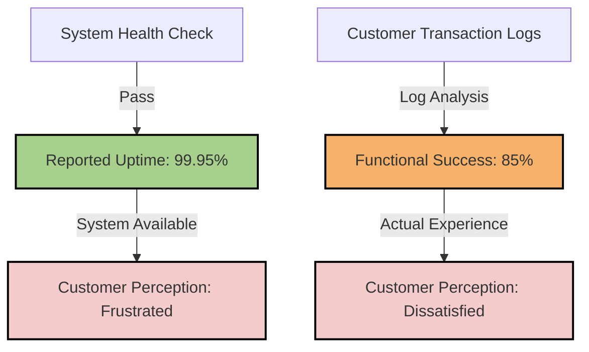

This example illustrates the critical gap between traditional uptime metrics and the actual customer experience. By relying solely on system health checks, the bank failed to recognize a significant functional issue, leading to customer dissatisfaction despite a seemingly high uptime percentage. Modern reliability engineering, grounded in transaction-level analysis, bridges this gap to reflect the true customer impact.

### SRE Best Practice: Evidence-Based Investigation

SRE teams should implement customer-journey-based reliability metrics derived directly from transaction logs. By analyzing logs across the entire transaction path, engineers can identify actual success rates for specific customer operations. To make this process actionable, the following checklist outlines key steps for evidence-based investigation:

#### Checklist: Steps for Evidence-Based Investigation

1. **Define Key Customer Journeys:**

   - Identify critical customer operations (e.g., payment processing, account access, check deposits) that directly impact business outcomes.

2. **Establish Log-Based Service Level Indicators (SLIs):**

   - Create SLIs that measure success rates for each customer journey instead of relying on generic system availability metrics.

3. **Ensure Comprehensive Logging:**

   - Implement robust logging across all transaction steps, capturing both technical status and functional outcomes at each stage.

4. **Correlate Backend and Frontend Logs:**

   - Link backend processing logs with frontend customer interaction logs to uncover silent failures that traditional alerting systems might miss.

5. **Prioritize High-Impact Transactions:**

   - Develop weighted reliability dashboards that focus on high-business-impact operations, ensuring key services are prioritized over purely technical metrics.

6. **Baseline and Monitor Success Rates:**

   - Use historical log data to establish normal success rate baselines for each transaction type, enabling proactive anomaly detection.

7. **Investigate and Address Gaps:**

   - Regularly analyze discrepancies between reported uptime and customer transaction success rates to uncover hidden reliability issues.

#### Example Process Flow

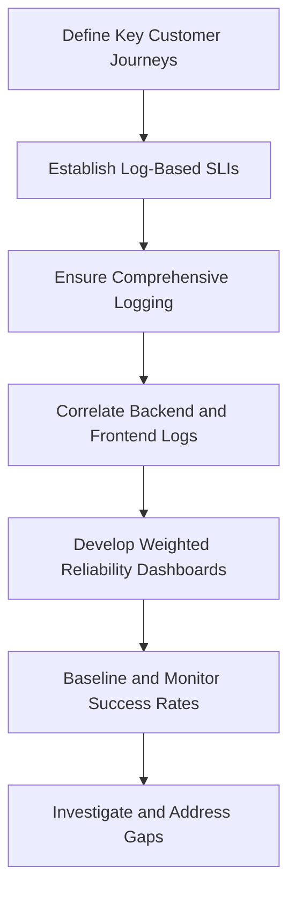

By following this structured approach, financial institutions can uncover hidden reliability issues that binary uptime metrics fail to reveal. Historical data shows that organizations adopting evidence-based investigation often find their actual customer experience reliability to be 5-15% lower than traditional uptime metrics suggest. This method enables targeted improvements that directly align with customer expectations.

### Banking Impact

The business consequences of relying on binary uptime metrics in banking are substantial and directly affect the bottom line. When Metropolitan Credit Union replaced traditional uptime metrics with transaction-based reliability measurement from logs, they discovered their mobile banking reliability was actually 92.3% rather than the reported 99.8%—a gap that translated to approximately 46,000 failed customer transactions monthly.

This reliability gap has concrete business impacts:

- **Customer Attrition**: Increases of 4-7% when transaction success rates fall below 95%.
- **Support Costs**: Each failed high-value transaction creates a 23% risk of immediate customer contact, driving up support expenses.
- **Revenue Loss**: Abandoned transactions, particularly in wealth management and loan applications, contribute to revenue losses often exceeding $1M annually for mid-sized institutions.
- **Regulatory Risks**: Customer-impacting availability issues that aren't promptly identified attract intensified regulatory scrutiny.

To illustrate the business impact more clearly, consider the following breakdown of how transaction failures affect different areas of banking operations:

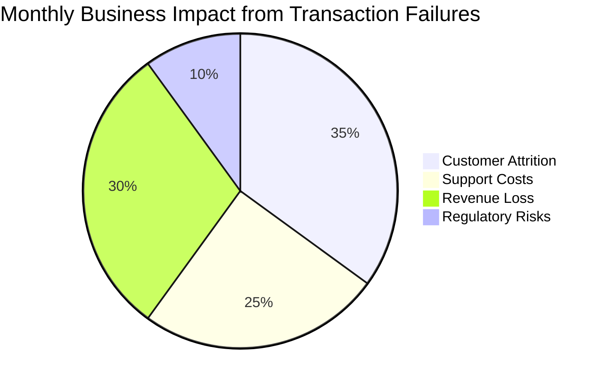

Most critically, organizations measuring only technical uptime create a false sense of security, preventing appropriate investment in reliability improvements where they actually matter to customers and the business.

### Implementation Guidance

To transition from binary uptime to customer-focused reliability measurement, follow this step-by-step implementation plan. Below, we provide a detailed example of a bank improving reliability metrics for its mobile payment transfer service:

#### Step-by-Step Example: Mobile Payment Transfers

1. **Identify Key Customer Journey**

   - **Action:** Map out the end-to-end flow for mobile payment transfers, from login to payment confirmation. Break the journey into discrete steps: user authentication, account selection, payment initiation, funds transfer processing, and transaction confirmation.
   - **Outcome:** The team identifies this journey as critical due to its high transaction volume and direct impact on customer satisfaction.

2. **Implement Comprehensive Logging**

   - **Action:** Enhance system logs to capture both technical status (e.g., API response codes, system latency) and functional outcomes (e.g., payment success/failure, error messages) for each step in the journey.
   - **Example Log Entry:** `{"transaction_id": "12345", "step": "funds_transfer", "status": "failed", "error_code": "INSUFFICIENT_FUNDS", "latency_ms": 250, "timestamp": "2023-10-10T12:00:00Z"}`
   - **Outcome:** Logs now provide granular data to analyze where and why failures occur.

3. **Define and Calculate Transaction-Based SLIs**

   - **Action:** Develop SLIs focused on customer outcomes, such as "percentage of payment transfers successfully completed within 2 seconds."
   - **Formula:** `SLI = (Successful Transfers / Total Transfers) * 100`
   - **Outcome:** The bank creates an SLI that measures the success rate of the entire payment journey, highlighting real-world reliability.

4. **Build Journey-Focused Dashboards**

   - **Action:** Create dashboards that display transaction success rates, error breakdowns, and latency trends for the payment journey.
   - **Example Dashboard View:**
     - **Payment Transfer Success Rate:** 97.8% (Goal: 99.99%)
     - **Top Errors:** Insufficient Funds (50%), API Timeout (30%)
     - **Average Latency:** 1.8 seconds
   - **Outcome:** Executives and engineers can now clearly see reliability issues impacting customers.

5. **Set Business-Aligned Thresholds**

   - **Action:** Work with business stakeholders to define acceptable reliability thresholds. For payment transfers, set a goal of 99.99% success rate and a maximum latency of 2 seconds.
   - **Outcome:** Stakeholders agree on SLAs that reflect customer expectations and business priorities.

6. **Analyze Discrepancies Between Metrics**

   - **Action:** Compare traditional uptime (e.g., "99.9% system availability") against journey-based metrics. Investigate gaps where the system appears "up" but customers face failures.
   - **Example Insight:** Logs reveal that 2% of payment transfers fail due to an intermittent API timeout, despite the system being "available."
   - **Outcome:** The team identifies specific areas for improvement, such as optimizing API performance.

7. **Automate Alerts for Journey Failures**

   - **Action:** Configure alerts to trigger when SLIs fall below thresholds, such as a drop in payment success rate below 99.95%.
   - **Example Alert:** "Payment transfer success rate dropped to 99.7% - investigate API timeout errors."
   - **Outcome:** Teams are notified immediately about customer-impacting issues, enabling faster response.

8. **Shift Reporting and Educate Stakeholders**

   - **Action:** Replace traditional uptime metrics in executive reports with customer-focused SLIs. Educate stakeholders on why journey-based metrics better reflect reliability.
   - **Example Communication:** "While system uptime is 99.9%, payment transfer success is only 97.8%. This gap indicates customer impact and drives our reliability improvement efforts."
   - **Outcome:** Executives align with the reliability revolution, prioritizing customer outcomes over binary availability.

#### Summary Flow Representation

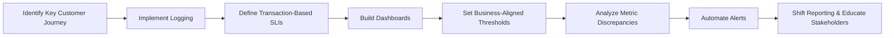

By following this structured approach, banks can move beyond binary uptime metrics and adopt reliability practices that directly improve customer experiences.

## Panel 2: The SLI Foundation - Logs as Service Level Indicators

### Scene Description

A banking platform engineering workshop where SREs define service level indicators for different financial services. Interactive displays show how they're extracting SLIs directly from transaction logs: payment success rates calculated from authorization logs, authentication reliability measured through login attempt records, and customer onboarding completion rates derived from application process logs. Engineers demonstrate how these log-derived indicators provide precise visibility into actual customer experience compared to traditional infrastructure metrics. A real-time dashboard shows these SLIs updating as new transactions flow through the system, with clear correlation to business metrics like completed transactions and revenue generation.

#### Flow from Logs to SLIs to Business Metrics

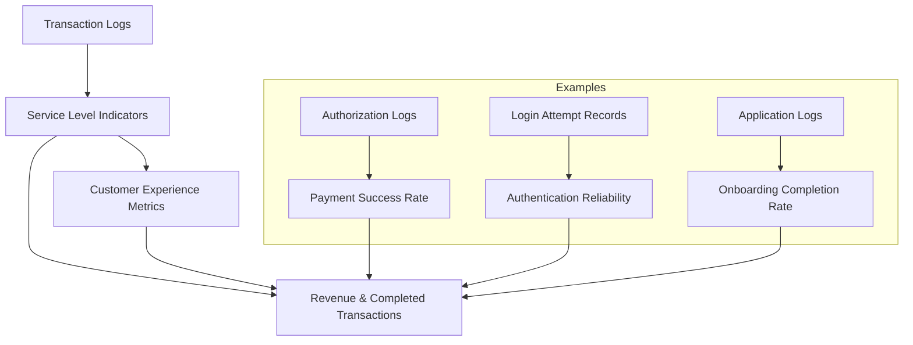

This flow highlights how raw transaction logs feed into precise SLIs, which then connect directly to measurable customer experience and business outcomes. For example, authorization logs inform payment success rates, which impact metrics like completed transactions and revenue. By working through this chain, engineers ensure that log-derived insights provide actionable and meaningful visibility into both technical performance and its real-world impact.

### Teaching Narrative

Service Level Indicators (SLIs) transform reliability from subjective assessment to quantifiable measurement by establishing precise metrics that reflect customer experience. In banking environments, logs provide the ideal foundation for these indicators—capturing direct evidence of customer transactions rather than inferring experience from technical metrics. Effective SLIs share critical characteristics: they directly measure customer experience (payment success rather than service uptime), provide meaningful business alignment (transaction completion rather than CPU utilization), offer mathematical precision (exact percentages rather than subjective ratings), enable consistent measurement over time, and derive from actual user interactions rather than synthetic checks. Log-based SLIs extract these measurements directly from transaction evidence: the percentage of successful payments from authorization logs, the ratio of completed transfers from transaction records, the proportion of successful logins from authentication logs, or the average response time for account inquiries from interaction records. This approach creates a fundamental advantage over traditional monitoring—measuring what customers actually experienced rather than what internal systems reported. When a payment gateway shows 99.99% availability by technical measurements but logs reveal that 2% of high-value transactions failed during peak hours, the log-based SLI exposes the truth of customer experience that technical metrics obscure—establishing the factual foundation necessary for meaningful reliability engineering in customer-sensitive financial services.

### Common Example of the Problem

Atlantic Savings Bank relied on endpoint health checks and server monitoring to measure the reliability of their online banking platform. Weekly reports consistently showed 99.97% availability based on these technical metrics. However, when the bank implemented a customer satisfaction survey, they were shocked to discover that 8.3% of customers reported frequent issues with bill payment functionality.

Upon investigating transaction logs, they discovered that while the bill payment service was technically available, it was failing to complete scheduled payments for certain utility companies due to a data formatting issue. These incomplete payments would sit in a pending state without generating errors, appearing successful to the technical monitoring but resulting in missed payments and late fees for customers. The traditional monitoring completely missed this significant customer impact because it measured technical responsiveness rather than actual transaction completion rates.

#### Checklist for Identifying and Resolving Similar Issues:

1. **Gather Customer Feedback:**

   - Implement surveys, feedback forms, or support ticket analysis to capture customer-reported issues.
   - Look for recurring complaints or patterns tied to specific functionalities.

2. **Analyze Log Data:**

   - Collect transaction logs related to the reported issue (e.g., payment, login, or transfer logs).
   - Identify discrepancies between logged outcomes and expected outcomes (e.g., pending states or incomplete transactions).

3. **Correlate Logs with Monitoring Metrics:**

   - Compare system availability and health metrics with transaction completion data.
   - Look for gaps where technical metrics report success, but logs reveal failures.

4. **Isolate Root Cause:**

   - Investigate patterns in the logs to pinpoint the failure mechanism (e.g., data formatting errors, integration issues).
   - Use filtering or aggregation to isolate affected transactions or users.

5. **Validate with Synthetic Testing:**

   - Simulate user workflows to reproduce the issue under controlled conditions.
   - Verify whether the issue is consistently reproducible in similar environments.

6. **Implement SLI Improvements:**

   - Define new SLIs based on log evidence, such as transaction completion rates or error frequencies.
   - Align SLIs with customer experience metrics to ensure meaningful measurements.

7. **Resolve and Monitor:**

   - Fix the identified issue (e.g., update formatting logic or integration behavior).
   - Continuously monitor the updated SLIs to verify resolution and prevent recurrence.

8. **Communicate with Stakeholders:**

   - Inform customers about the resolution and preventative measures.
   - Update internal teams on new monitoring practices and lessons learned.

By following this checklist, teams can proactively identify and resolve similar blind spots in traditional monitoring, ensuring that technical metrics align with actual customer experience outcomes.

### SRE Best Practice: Evidence-Based Investigation

SRE teams should implement log-based Service Level Indicators (SLIs) that directly measure what customers care about. The following table summarizes key SLI types, their definitions, and examples:

| **SLI Type** | **Definition** | **Example** |
| ------------------------- | ---------------------------------------------------------------------------------------------------- | ----------------------------------------------------------------------------------------------- |
| **Request Success Ratio** | Percentage of operations completed successfully from the customer's perspective. | Percentage of successful payment authorizations in a payment gateway transaction log. |
| **Latency-Based SLIs** | Measures response times, focusing on percentiles (e.g., 90th, 99th) to capture degraded experiences. | Average and 99th percentile response times for login attempts derived from authentication logs. |
| **Availability SLIs** | Percentage of time success rates remain above acceptable thresholds, not just binary up/down status. | Availability of fund transfers where success rate remains >99.5% during business hours. |
| **Data Processing SLIs** | Percentage of batch operations completed correctly and within defined time windows. | Overnight batch processing success rate for payroll transactions based on processing logs. |

**Best Practices for Implementation:**

1. Define SLIs based on transaction logs that capture successful customer outcomes, not just technical availability.
2. Use request success ratio calculations from logs to measure operations completed successfully from the customer's perspective.
3. Focus on latency metrics derived from log timestamps, measuring not just averages but also key percentiles for degraded experiences.
4. Establish availability SLIs that reflect meaningful customer experience metrics, such as maintaining acceptable success thresholds.
5. Include data processing SLIs for batch operations that measure both correctness and timeliness of transaction completion.

Banks that implement log-based SLIs typically discover 3-5× more reliability issues than those using traditional monitoring, identifying customer-impacting problems before they generate complaints.

### Banking Impact

The business impact of inaccurate reliability measurement is substantial in banking environments where transaction integrity directly affects customer finances and trust. Relying on traditional technical monitoring to assess reliability is akin to evaluating a car's health by looking only at the fuel gauge—it might tell you that there's enough fuel to drive, but it won't reveal a failing engine or worn-down brakes that could lead to a breakdown. Similarly, traditional infrastructure metrics like service uptime or CPU utilization can mask critical issues in customer-facing services.

When First Commerce Bank replaced technical monitoring with log-derived SLIs, they uncovered a hidden "engine problem" in their wealth management platform: a 4.2% transaction failure rate for portfolio rebalancing operations during market volatility periods. This issue, completely missed by their previous monitoring approach, had several direct business impacts:

- **$380,000 in lost management fees** from customers who moved assets to competitors after experiencing unexplained transaction issues
- **32% increase in support calls** during market volatility, creating staffing challenges and increased operating costs
- **Regulatory compliance risks** due to failures in completing documented customer investment instructions
- **Reputation damage** among high-net-worth clients, with relationship managers reporting trust concerns from 24% of affected customers

Log-based SLIs exposed these hidden failures, providing the bank with actionable insights to prioritize engineering efforts and mitigate the most consequential reliability issues. By shifting to a measurement approach that reflects actual customer experience—just as inspecting an engine reveals the true performance of a car—First Commerce Bank gained the visibility necessary to align reliability goals with business outcomes and rebuild customer trust.

### Implementation Guidance

To establish effective log-based SLIs:

1. Identify critical customer journeys and transactions that directly impact customer experience and business outcomes, prioritizing based on volume and financial impact.

2. Enhance logging across these journeys to capture clear success/failure states and relevant performance data, ensuring logs contain the necessary data to derive meaningful SLIs.

3. Define specific SLI formulas for each critical transaction type:

   - **Success Ratio**: `successful_transactions ÷ total_attempts`
   - **Latency**: `time_to_complete_key_operation`
   - **Availability Percentage**: `periods_with_acceptable_performance ÷ total_time`
   - **Batch Processing Completeness**: `successful_processing ÷ expected_processing`

4. Implement automated extraction of these SLIs from logs using log aggregation and analysis tools. For example, using Elasticsearch to calculate the payment success ratio:

   ```python
   from elasticsearch import Elasticsearch

   # Initialize Elasticsearch client
   es = Elasticsearch(["http://localhost:9200"])

   # Define the query to extract transaction data
   query = {
       "size": 0,
       "query": {
           "range": {
               "timestamp": {
                   "gte": "now-1d/d",  # Last 24 hours
                   "lt": "now/d"
               }
           }
       },
       "aggs": {
           "total_transactions": {
               "value_count": {"field": "transaction_id"}
           },
           "successful_transactions": {
               "filter": {"term": {"status": "success"}},
               "aggs": {
                   "count": {"value_count": {"field": "transaction_id"}}
               }
           }
       }
   }

   # Execute the query
   response = es.search(index="transactions", body=query)

   # Calculate the success ratio
   total = response["aggregations"]["total_transactions"]["value"]
   successful = response["aggregations"]["successful_transactions"]["count"]["value"]
   success_ratio = (successful / total) * 100 if total > 0 else 0

   print(f"Payment Success Ratio: {success_ratio:.2f}%")
   ```

5. Create real-time dashboards displaying these SLIs alongside business metrics to establish clear connections between reliability and business outcomes. Use tools like Kibana or Splunk dashboards to visualize trends and correlate SLIs with business metrics.

6. Establish appropriate SLO targets for each SLI based on business impact and customer expectations (e.g., 99.95% for payment processing, 99.9% for account access, 99.5% for informational functions).

7. Configure anomaly detection to identify deviations from historical patterns even when absolute SLI values remain within tolerances. For example, in Splunk, use the Machine Learning Toolkit (MLTK) to monitor deviations in SLI trends.

8. Institute regular reviews comparing SLI trends with customer satisfaction and business performance metrics to validate alignment and refine measurement approaches.

   ```mermaid
   graph TD
   A[Customer Logs] --> B[Log Aggregation]
   B --> C[SLI Calculation]
   C --> D[Dashboard Visualization]
   D --> E[Business Metrics Correlation]
   E --> F[SLI Refinement]
   ```

## Panel 3: The SLO Definition - Setting Appropriate Reliability Targets

### Scene Description

A banking product strategy session where business and technology leaders negotiate Service Level Objectives for different financial services. Visualization boards display proposed reliability targets with business justification, including:

- **Critical Services**: Payment processing with a **99.99% success rate**, justified by competitive analysis and high revenue impact.
- **Important Services**: Account opening processes with a **99.9% reliability target**, reflecting moderate financial impact and customer expectations.
- **Supportive Services**: Informational services with a **99% reliability target**, as occasional issues have minimal customer consequence.

Financial analysts present models showcasing the relationship between reliability levels and key business metrics—such as customer retention, transaction volume, and support costs—while engineers articulate the technical and operational investments needed for each reliability tier. The session concludes with formally documented SLOs that represent shared commitments between business and technology teams.

#### Reliability Tiers Summary

```text
+---------------------+--------------------+-------------------------------------------+
| Tier               | Reliability Target | Example Services                          |
+---------------------+--------------------+-------------------------------------------+
| Critical           | 99.99%            | Payment Processing                        |
| Important          | 99.9%             | Account Opening Processes                |
| Supportive         | 99%               | Informational Services                   |
+---------------------+--------------------+-------------------------------------------+
```

### Teaching Narrative

Service Level Objectives (SLOs) transform reliability from aspiration to commitment by establishing explicit targets for service performance that balance customer expectations with implementation costs. Unlike the common "everything must be 100% reliable" mindset, effective SLOs recognize that different banking services warrant different reliability levels based on business impact. Payment processing directly affects monetary transactions and requires exceptional reliability, account management features have moderate impact warranting strong but not extreme targets, while informational services might accept occasional degradation without significant business consequence. This differentiation enables strategic reliability investment rather than uniform over-engineering. Defining appropriate SLOs requires collaborative business-technology partnership: business leaders articulate the customer and financial impact of different reliability levels, competitive benchmarking establishes market expectations, and engineering teams quantify the technical and operational investments required to achieve different targets. The resulting SLOs become explicit reliability contracts: 99.99% of payment transactions will succeed, 99.95% of authentication attempts will complete within 2 seconds, 99.9% of customer onboarding sessions will progress without error. These targets aren't arbitrary technical metrics but carefully calibrated business commitments reflecting the balance between reliability investment and customer experience—establishing clear expectations that guide both technology implementation and operational practices while enabling objective measurement of success rather than subjective reliability assessment.

### Common Example of the Problem

Capital Regional Bank embarked on a major digital transformation initiative with the mandate to "build highly reliable systems for our customers." However, without specific reliability targets, different teams interpreted this mandate in drastically different ways, leading to misaligned priorities, wasted resources, and customer dissatisfaction.

Below is a summary of the misaligned reliability targets, their consequences, and the lessons learned:

| Team | Assumed Reliability Target | Actions Taken | Consequences | Lessons Learned |
| ----------------------- | ---------------------------------------- | ----------------------------------------------------------------------------------------------------------------------------- | -------------------------------------------------------------------------------------------------------------------------------------- | --------------------------------------------------------------------------------------------------------------- |
| Payments Team | 99.999% ("five nines") for all functions | Implemented triple redundancy, multiple fail-over systems, and extensive resilience engineering | Exceeded budget significantly, delayed delivery by 4 months, and over-engineered non-critical areas | Reliability targets must align with business impact. Over-engineering wastes resources and delays outcomes. |
| Account Management Team | 99.9% uniformly for all features | Spent excessive resources on non-critical informational features while under-investing in critical account security functions | Customers frustrated by failures in critical processes (e.g., account security); indifferent to minor outages in non-critical features | SLOs should differentiate between critical and non-critical features to ensure appropriate resource allocation. |

When the systems launched, customer feedback clearly reflected these misalignments. Customers were frustrated by occasional failures in critical transaction processes but largely indifferent to brief outages in non-essential features. This underscored the importance of defining differentiated, business-aligned SLOs to balance reliability investment against customer expectations and business impact.

### SRE Best Practice: Evidence-Based Investigation

SRE teams should establish differentiated Service Level Objectives (SLOs) based on business impact analysis and customer expectations. To guide this process, use the following checklist for evidence-based SLO definition:

#### Checklist: Steps for Evidence-Based SLO Definition

1. **Differentiate SLO Targets**

   - Identify and prioritize service functions based on their business criticality.
   - Avoid applying uniform reliability standards across all features; tailor SLOs to service impact.

2. **Analyze Historical Data**

   - Use log analysis from similar or related services to assess the correlation between reliability levels and business outcomes (e.g., customer satisfaction, transaction abandonment rates, support costs).
   - Identify patterns and thresholds that align with desired business performance.

3. **Perform Competitive Benchmarking**

   - Research industry benchmarks for similar banking services.
   - Match or exceed competitors' reliability levels for critical services that differentiate your business.

4. **Conduct Cost-Benefit Analysis**

   - Quantify the technical, operational, and financial investments required to achieve various reliability tiers.
   - Balance these costs against potential business benefits, such as increased customer retention or reduced support overhead.

5. **Define Measurable SLOs**

   - Specify clear measurement methodologies, including the metrics, calculation methods, and compliance windows (e.g., 28 or 30 days).
   - Ensure the SLOs are actionable and auditable by aligning them with real-time monitoring and logging systems.

6. **Collaborate Across Teams**

   - Engage business stakeholders to validate the customer and financial impact of proposed reliability levels.
   - Discuss feasibility and resource allocation with engineering teams to ensure commitments are realistic and achievable.

#### Example: Evidence-Based SLO Construction

- For payment processing: **99.99% of transactions succeed**, based on competitive analysis and customer retention modeling.
- For account opening: **99.9% of sessions complete without error**, reflecting moderate financial impact.
- For informational services: **99% availability**, acknowledging limited business consequence of occasional degradation.

Organizations practicing evidence-based SLO definition typically achieve 30-40% more efficient reliability investment by concentrating resources where they deliver maximum business value rather than pursuing arbitrary technical targets.

### Banking Impact

The business impact of inappropriate SLOs manifests in both directions—over-engineering some functions while under-protecting critical services—with substantial financial consequences. Differentiated SLOs help mitigate these issues by ensuring reliability investments are aligned with business priorities.

When United Financial implemented differentiated, business-aligned SLOs, they uncovered significant financial and operational inefficiencies in their previous approach:

- Over-investment in non-critical systems cost approximately $2.3M annually in unnecessary infrastructure and support.
- Under-investment in critical payment systems resulted in $4.7M annual revenue impact from abandoned transactions and customer attrition.
- Misalignment of technical and business expectations created organizational friction, with technology teams focusing on metrics that didn’t correlate with business priorities.
- Customer satisfaction showed weak correlation with overall uptime but strong correlation with reliability of specific high-value journeys.

This shift to calibrated SLOs brought measurable improvements. By reallocating 35% of their reliability engineering resources to higher-impact services, United Financial achieved a 23% reduction in customer-impacting incidents for critical functions while also reducing overall infrastructure costs.

#### Financial Consequences of Reliability Misalignment

Below is a simplified flowchart illustrating the financial impact of over- and under-investment in reliability, and how differentiated SLOs address these challenges:

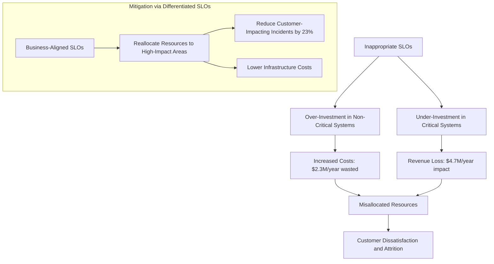

By aligning SLOs with both technical capabilities and business priorities, United Financial transformed reliability from a cost center into a strategic enabler, improving customer experience and operational efficiency simultaneously. This case demonstrates how differentiated SLOs act as a framework for balancing reliability investment with measurable business outcomes.

### Implementation Guidance

To implement effective SLOs for banking services, follow these structured steps:

| **Step** | **Action** | **Example** |
| --------------------------------------- | ------------------------------------------------------------------------------------------------------------------------------------- | ------------------------------------------------------------------------------------------------------------------------------------------------------------------------------ |
| **1. Categorize Services** | Group banking services into tiers based on business impact: critical, important, and supportive. | **Critical:** Payment processing, authentication. **Important:** Account creation, customer onboarding. **Supportive:** Informational features like FAQs or marketing content. |
| **2. Analyze Business Impact** | Evaluate the financial and customer experience consequences of reliability issues for each service tier. | Identify revenue loss if payment processing fails, or customer drop-off during onboarding due to errors. |
| **3. Conduct Competitive Benchmarking** | Assess market standards by analyzing reliability targets of competitors, particularly for customer-facing services. | If competitors ensure 99.99% reliability for payments, aim to match or exceed this benchmark. |
| **4. Define SLO Targets** | Set specific SLO targets for each tier based on business impact and benchmarking data. | **Critical:** 99.99% success rate for payments. **Important:** 99.9% success rate for onboarding. **Supportive:** 99% availability for informational features. |
| **5. Document Measurement Methodology** | Specify how compliance will be calculated using logs and metrics, ensuring transparent and repeatable measurements. | Define that "99.99% success" equals 99.99% of payment transactions completing without error, using transaction logs as evidence. |
| **6. Define Measurement Window** | Choose an appropriate measurement period (e.g., 28-30 days) that balances responsiveness to issues with stable performance tracking. | Use a 30-day rolling window to calculate SLO compliance for payment processing. |
| **7. Formalize Review and Approval** | Establish a collaborative process where business and technology leaders jointly review and sign off on SLOs. | Schedule a cross-functional meeting to finalize SLOs, then document them in shared repositories for visibility. |
| **8. Implement Regular Review Cycle** | Reassess SLOs periodically (typically quarterly) to ensure they align with evolving business priorities and operational capabilities. | Adjust SLOs for onboarding if new regulations or customer needs arise. |

#### Summary of SLO Targets by Service Tier

| **Service Tier** | **Typical SLO Target Range** | **Example Services** |
| ---------------- | ---------------------------- | --------------------------------------- |
| **Critical** | 99.95% - 99.99% | Payment processing, authentication |
| **Important** | 99.9% - 99.95% | Customer onboarding, account management |
| **Supportive** | 99% - 99.9% | Informational features, marketing pages |

By following these steps and using the above tables as references, teams can systematically define and implement SLOs that balance reliability investments with business outcomes.

## Panel 4: The Error Budget Concept - Freedom to Innovate Within Limits

### Scene Description

A digital banking release planning session where SREs explain the error budget concept to product and development teams. The discussion is supported by visualization displays, which outline key metrics and allocations:

1. **Error Budget Breakdown**:

   - **Payment Processing Service**: 0.01% allowable failure rate (SLO), equating to 4.38 hours of acceptable impact annually.
   - **Authentication System**: 0.05% allowable failure rate, equating to 21.9 hours of acceptable impact annually.

2. **Current Error Budget Consumption**:

   - Payment Processing: 1.5 hours consumed, 2.88 hours remaining.
   - Authentication System: 19 hours consumed, 2.9 hours remaining.

3. **Decision Context**:

   - **Proposed Changes**:
     - Accelerate a major new payment feature release, estimated to consume 1 additional hour of the error budget.
     - Defer a risky infrastructure change in the authentication system, which could potentially exhaust the remaining 2.9 hours.

The team uses this data to drive their decisions. Product managers discuss feature priorities in the context of remaining error budgets, while development leaders evaluate the risk profile of proposed changes. Ultimately, the team decides to:

- Accelerate the payment feature release due to the substantial remaining error budget.
- Defer the authentication system infrastructure update to avoid exceeding the allowable failure rate.

#### Text Diagram: Error Budget Decision-Making

```mermaid
graph TD
    A[Error Budgets from SLOs] --> B[Payment Processing: 4.38 Hours Annually]
    A --> C[Authentication System: 21.9 Hours Annually]
    B --> D[Current: 1.5 Hours Used, 2.88 Remaining]
    C --> E[Current: 19 Hours Used, 2.9 Remaining]
    D --> F[Proposed Change: Payment Feature Release (1 Hour)]
    E --> G[Proposed Change: Infrastructure Update (~3 Hours)]
    F --> H[Decision: Proceed - Sufficient Remaining Budget]
    G --> I[Decision: Defer - Budget Risk Too High]
```

This structured representation clarifies how error budgets influence decision-making, helping the team balance innovation velocity against reliability commitments.

### Teaching Narrative

Error budgets transform reliability from a constraint on innovation to a strategic enabler of calculated risk-taking by establishing explicit allowances for imperfection. The fundamental insight is counterintuitive but powerful: 100% reliability is neither achievable nor desirable when balanced against the need for innovation and improvement. Instead, error budgets derive directly from SLOs to create a tangible "reliability currency" that can be strategically invested: a 99.9% success rate SLO mathematically creates a 0.1% "budget" for errors—approximately 8.76 hours annually where degradation remains within acceptable limits. This budget becomes a powerful decision-making framework that balances reliability conservation with innovation velocity. When substantial error budget remains, teams can accelerate feature releases or implement architectural changes, accepting higher risk while remaining within overall reliability commitments. When budgets are depleted, focus shifts to reliability improvement before additional risk is introduced. This approach transforms the traditionally adversarial relationship between stability and innovation into a collaborative optimization—creating shared incentives where both engineering and product teams align around maintaining sufficient error budget to enable continued delivery. For banking platforms balancing competitive pressure for new features against customer expectations for rock-solid reliability, this framework provides objective guidance for what would otherwise be subjective risk decisions, enabling faster innovation when reliability is strong while preventing excessive risk when stability is already compromised.

### Common Example of the Problem

Merchants National Bank had established strict reliability targets for their online banking platform, but struggled with conflicting priorities between their product and operations teams. The product organization was under competitive pressure to release new mobile banking features quickly, while operations was held accountable for maintaining 99.95% platform availability.

This created a perpetual conflict: operations teams resisted frequent changes due to reliability concerns, while product teams pushed for faster releases to meet market demands. The tension culminated during a major digital wallet integration project, when operations blocked a critical competitive feature for four weeks of additional testing. By the time the feature launched, a key competitor had already captured significant market share. Meanwhile, the platform was actually running at 99.98% reliability—significantly exceeding its targets and effectively "wasting" reliability margin that could have supported faster innovation.

To better understand this dynamic, consider an analogy: error budgets function much like financial budgets. Imagine a family with a monthly budget of $4,000. If they consistently spend only $3,500, they are underutilizing their resources and potentially missing opportunities, such as investing in education or home improvements. Conversely, if they exceed their budget, financial stress and instability arise. Similarly, by exceeding reliability targets without leveraging the remaining error budget, the bank was "saving" stability at the cost of innovation, leaving competitive opportunities untapped.

The table below summarizes the conflicting priorities and outcomes:

| Stakeholder | Priority | Action Taken | Outcome |
| --------------- | --------------------------- | -------------------------- | ----------------------------------------------- |
| Product Team | Accelerate feature releases | Push for faster deployment | Feature delayed, competitor gained market share |
| Operations Team | Maintain high reliability | Block release for testing | Reliability exceeded target, innovation stalled |

Without a shared framework for balancing innovation and reliability, the bank was both over-delivering on stability while under-delivering on competitive features. This highlights the need for a structured approach, like error budgets, to align priorities and guide decision-making.

### SRE Best Practice: Evidence-Based Investigation

SRE teams should implement error budgets as an objective mechanism for balancing reliability and innovation. The checklist below provides actionable steps to guide this process more effectively:

| **Step** | **Description** | **Outcome** |
| ---------------------------------- | ----------------------------------------------------------------------------------------------------------------------------------------------------------- | ------------------------------------------------------------------------------------------ |
| 1. Derive explicit error budgets | Calculate error budgets directly from agreed SLOs. For example, a 99.9% availability SLO equates to a 0.1% error budget (approximately 43.8 minutes/month). | Clear, measurable reliability allowances aligned with customer expectations. |
| 2. Implement comprehensive logging | Ensure detailed logging and monitoring systems accurately track reliability against SLOs. | Real-time visibility into performance and error budget consumption. |
| 3. Report error budget consumption | Regularly generate reports showing error budget trends, usage, and remaining availability for each service. | Data-driven insights into service reliability and risk posture. |
| 4. Define states and policies | Establish clear policies for normal operation, enhanced testing when budgets are limited, and feature freezes when budgets are exhausted. | Consistent, objective decision-making during varying error budget states. |
| 5. Integrate into release planning | Incorporate error budget status into release planning to balance reliability risks with feature value. | Improved collaboration between product, development, and SRE teams for informed decisions. |

#### Error Budget Lifecycle Example

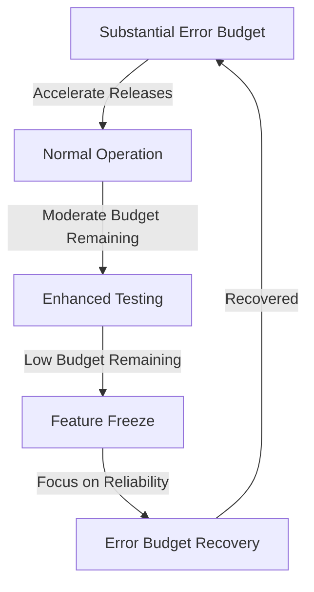

Financial institutions that adopt this approach often experience 30-45% faster feature velocity during periods of strong reliability, while reducing the frequency of customer-impacting incidents during periods of reliability stress.

### Banking Impact

The business impact of error budgets manifests in both risk management and innovation acceleration, with substantial financial consequences. Key outcomes from Commerce Trust’s implementation of error budgets include:

#### Key Metrics at a Glance:

| Metric | Impact |
| ------------------------- | ------------------------------------------------------------------------------------------------------------------------------- |
| **37% Increase** | Feature delivery velocity during periods with healthy error budgets, enabling faster responses to competitive pressures. |
| **$3.2M Revenue Benefit** | Resulting from accelerated deployment of high-demand features when risk could be safely accommodated. |
| **42% Reduction** | In customer-impacting incidents during vulnerable periods, as teams shifted focus to reliability when budgets were constrained. |

#### The Strategic Transformation:

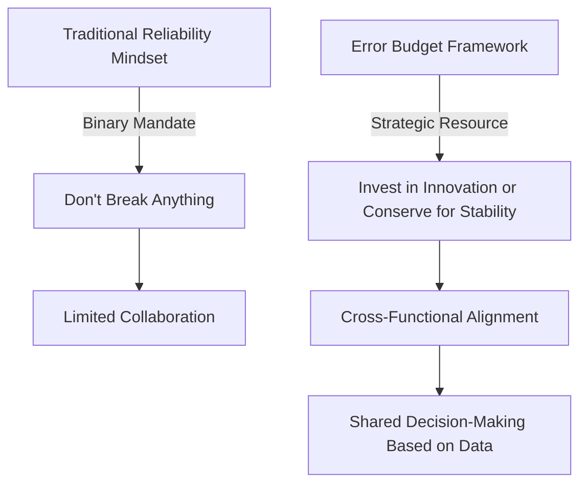

Commerce Trust observed improved cross-functional alignment, with product and engineering teams collaborating effectively using shared data rather than subjective arguments. Most importantly, error budgets transformed reliability from a binary mandate into a dynamic, strategic resource that could be explicitly allocated to balance innovation and stability based on real-time business needs and system health.

### Implementation Guidance

To implement effective error budgets, follow these structured steps:

| **Step** | **Action** | **Outcome** |
| ------------------------------ | --------------------------------------------------------------------------------------------------------------- | ----------------------------------------------------------------------------------------------- |
| **1. Calculate Budgets** | Derive specific error budgets for each service based on its SLO (e.g., 99.9% availability = 0.1% error budget). | Clear, measurable reliability targets (e.g., 43.8 minutes allowable error per 30-day period). |
| **2. Monitor & Track** | Implement comprehensive monitoring and logging to measure actual reliability against defined SLOs. | Accurate tracking of error budget consumption with real-time insights. |
| **3. Visualize Status** | Create dashboards with clear indicators of error budget usage and trends for each service. | Accessible visibility into error budget health for all stakeholders. |
| **4. Define Policies** | Establish formal policies for actions at different levels of error budget consumption: | Structured decision-making aligned with remaining budget. |
| | - **0-50% consumed**: Standard release procedures. | |
| | - **50-75% consumed**: Additional testing and reduced deployment velocity. | |
| | - **75-99% consumed**: Only high-priority changes with extensive testing. | |
| | - **100% consumed**: Feature freeze, focus exclusively on reliability improvements. | |
| **5. Integrate into Planning** | Make error budget status a required consideration in release planning meetings. | Risk-aware deployment decisions based on remaining reliability capacity. |
| **6. Review Retrospectively** | Analyze historical error budget consumption to assess which changes contributed most to its usage. | Improved risk assessments and planning for future releases. |
| **7. Define Escalation Paths** | Ensure exceptional circumstances requiring budget overage are escalated with executive approval. | Controlled decision-making in cases of critical business needs. |
| **8. Reset Regularly** | Review and reset error budgets on a predefined cycle (e.g., monthly). | Fresh reliability currency for the new period while maintaining accountability for prior usage. |

#### Error Budget Workflow

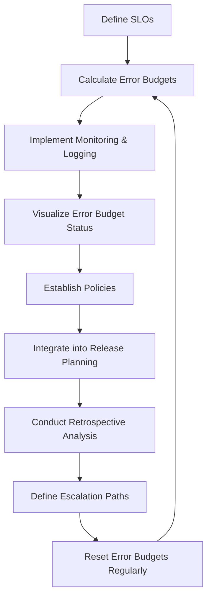

This structured approach ensures error budgets are actionable, trackable, and integrated into key processes, enabling teams to balance innovation with reliability effectively.

## Panel 5: The Measurement Implementation - Extracting SLIs from Logs

### Scene Description

A banking observability workshop where data engineers demonstrate practical SLI implementation. Code displays show how they extract reliability metrics directly from transaction logs: regular expressions identifying successful versus failed operations, aggregation pipelines calculating success percentages across time windows, classification logic distinguishing customer-impacting errors from background noise, and statistical processes normalizing measurements across different transaction volumes. To provide a clearer understanding, the measurement architecture can be visualized as a flow:

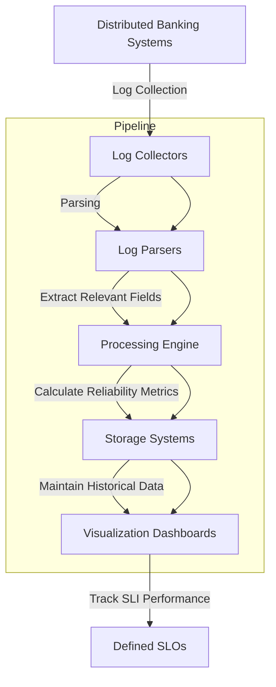

This flow represents a high-level overview of the log collection and processing pipeline:

- **Log Collectors** gather raw logs from distributed banking systems.
- **Log Parsers** extract structured or semi-structured data fields.
- **Processing Engine** computes reliability metrics such as success rates and error classifications.
- **Storage Systems** store these metrics for historical trend analysis.
- **Visualization Dashboards** present near-real-time SLI performance against defined SLOs.

Together, these components form a robust architecture that transforms raw transaction logs into actionable reliability metrics, updated continuously as new transactions flow through the system. This systematic approach ensures data engineers can quantify reliability accurately, providing the foundation for operationalizing concepts like SLOs and error budgets.

### Teaching Narrative

Measurement implementation transforms SLIs from theoretical concepts to operational reality through systematic extraction of reliability metrics from log data. This technical foundation makes reliability quantification possible by transforming unstructured or semi-structured logs into precise mathematical measurements. Effective implementation involves several critical components: event classification that accurately distinguishes successful operations from failures, significance filtering that separates customer-impacting issues from background noise, aggregation mechanisms that calculate percentages across appropriate time windows, volume normalization that accounts for transaction fluctuations, and statistical validation ensuring measurement accuracy. In banking systems with complex transaction flows, this implementation often requires sophisticated approaches: regex pattern matching to identify success/failure indicators in legacy system logs, structured data extraction from modern JSON-formatted logs, correlation identifiers connecting events across distributed services, and weighted scoring for different error types based on customer impact. The architecture typically involves specialized data pipelines: collectors gathering logs from diverse sources, parsers extracting relevant fields, processors calculating reliability metrics, and storage systems maintaining historical measurements for trend analysis. This measurement foundation provides the quantitative basis for the entire reliability engineering practice—without accurate, consistent SLI calculation derived from actual transaction logs, concepts like SLOs and error budgets remain theoretical abstractions rather than operational tools. The implementation quality directly determines whether reliability becomes a measurable discipline or remains a subjective assessment.

### Common Example of the Problem

City Credit Union decided to implement SLIs for their mortgage application platform but struggled with practical implementation. Their initial approach simply counted HTTP 500 errors on their web servers as a proxy for application failures. However, this greatly underrepresented actual customer issues.

When mortgage application completion rates remained low despite "good" SLI measurements, they investigated their logs more thoroughly. They discovered numerous ways applications were failing without generating HTTP errors. The table below summarizes the key failure scenarios they identified, alongside their log indicators and customer impact:

| **Failure Scenario** | **Log Indicator** | **Customer Impact** |
| --------------------------------------------- | ---------------------------------------------------------------------- | -------------------------------------------------------------------------------- |
| Form submission timeout | Long response times without explicit failure codes | Customers abandon the application due to perceived unresponsiveness |
| Validation errors preventing progression | HTTP 200 responses with application-specific validation error messages | Customers unable to proceed due to rejected inputs, leading to frustration |
| Third-party credit check integration failures | Success logs for API calls but missing downstream verification records | Customers experience delays or inability to complete the process |
| Incorrect database transactions | Successful commit logs with inconsistent or invalid data relationships | Applications appear completed but fail downstream checks, requiring manual fixes |

Their simplistic measurement approach missed over 80% of actual customer experience problems because it relied on technical error indicators rather than business outcome evidence in their logs. Customers were abandoning applications due to these "invisible" failures while monitoring showed excellent reliability.

### SRE Best Practice: Evidence-Based Investigation

SRE teams should implement comprehensive SLI extraction from logs that captures true customer experience. Use the checklist below to ensure a systematic, evidence-based approach:

#### Checklist for Comprehensive SLI Extraction:

1. **Define Success Criteria**

   - Specify success from the customer perspective, focusing on business outcomes rather than purely technical statuses.
   - Identify log patterns or fields that indicate actual successful outcomes (e.g., completed transactions, confirmation codes).

2. **Implement Log Parsing**

   - Build parsers for structured logs (e.g., JSON, XML) and unstructured logs (e.g., text-based system logs).
   - Use regex or similar techniques to extract reliability-relevant fields such as timestamps, status indicators, and transaction identifiers.

3. **Design Aggregation Pipelines**

   - Create pipelines that calculate success percentages over appropriate time windows (e.g., hourly, daily, weekly).
   - Ensure the pipelines support both real-time monitoring and historical trend analysis.

4. **Develop Error Classification Systems**

   - Define logic for categorizing errors based on customer impact, separating critical customer-facing failures from non-critical background noise.
   - Assign weights or priorities to different error types to better reflect their business impact.

5. **Establish Event Correlation Mechanisms**

   - Implement correlation identifiers (e.g., transaction IDs, session tokens) to connect related events across distributed systems.
   - Measure end-to-end success by tracing customer transactions through all involved services and components.

6. **Normalize Metrics for Transaction Volume**

   - Apply normalization techniques to account for fluctuations in transaction volumes, ensuring reliability metrics remain comparable over time.
   - Use statistical methods to smooth out anomalies or spikes in data.

7. **Perform Statistical Validation**

   - Regularly validate the accuracy and reliability of extracted SLIs using historical data and known ground truth scenarios.
   - Continuously refine parsing, classification, and aggregation logic to adapt to evolving system and customer behavior.

#### Insights from Mature Implementations:

- Financial institutions with advanced SLI implementations often discover that traditional technical error metrics (e.g., HTTP errors, exceptions) capture only 15-30% of actual customer experience issues.
- The majority of customer-impacting problems are identified through business outcome analysis, underscoring the importance of robust log extraction and classification processes.

By adhering to this checklist, SRE teams can ensure their SLI extraction processes are not only technically precise but also aligned with real-world customer experience, paving the way for measurable and actionable reliability practices.

### Banking Impact

The business impact of incomplete or inaccurate reliability measurement is substantial, creating both direct financial consequences and opportunity costs.

When Northern Trust Bank implemented comprehensive log-based SLIs, they discovered their actual reliability was significantly lower than previously reported:

- Their wealth management platform showed 99.8% technical availability but only 94.3% transaction success when measured through log-based outcome analysis
- This gap represented approximately 5,700 failed investment transactions monthly that weren't being detected or addressed
- Financial impact included $4.3M in uninvested funds annually due to transaction failures
- Customer impact analysis showed that clients experiencing these "invisible" failures were 3.2× more likely to reduce their account balances within 60 days

To better illustrate the gap and its consequences, the following text-based diagram shows the flow of transaction success tracking and highlights the impact of hidden failures:

```text
Technical Availability (99.8%) 
         |
         v
Measured Transaction Success (94.3%)
         |
  ---------------------------
  |                         |
Undetected Failures   Successful Transactions
(5,700/month)         (94.3% of all attempts)
  |                         |
  v                         v
$4.3M uninvested       Customer Retention
funds annually         (3.2× higher attrition)
```

After implementing comprehensive log-based measurement, Northern Trust Bank was able to identify and address the root causes of these hidden failures, improving actual success rates to 98.7% within six months. This improvement resulted in recapturing approximately $2.8M in previously lost investment activity and reducing client attrition rates significantly.

### Implementation Guidance

To implement effective SLI extraction from logs:

1. Define precise success criteria for each critical transaction type, identifying the specific log events and patterns that indicate successful customer outcomes rather than just technical operation.

2. Implement comprehensive logging across transaction paths, ensuring all critical steps and potential failure points generate appropriate log evidence.

3. Develop log parsing mechanisms appropriate to your data sources:

   - For unstructured legacy logs, use regular expressions to extract success and failure indicators. For example:

     ```python
     import re

     log_line = "2023-10-15T12:34:56 INFO Transaction complete: status=success"
     success_pattern = r"Transaction complete: status=success"

     if re.search(success_pattern, log_line):
         print("Transaction was successful")
     else:
         print("Transaction failed or status unknown")
     ```

   - For structured logs (e.g., JSON), use JSON path extractors to retrieve specific fields:

     ```python
     import json

     log_entry = '{"timestamp": "2023-10-15T12:34:56", "transaction": {"status": "success", "id": "12345"}}'
     log_data = json.loads(log_entry)

     if log_data["transaction"]["status"] == "success":
         print(f"Transaction {log_data['transaction']['id']} was successful")
     else:
         print(f"Transaction {log_data['transaction']['id']} failed")
     ```

   - For logs stored in analytical systems, use query languages to filter and extract relevant data. For instance:

     ```
     SELECT COUNT(*) AS success_count
     FROM transaction_logs
     WHERE transaction_status = 'success'
       AND timestamp >= NOW() - INTERVAL '1 hour';
     ```

4. Create aggregation pipelines that:

   - Group related logs using correlation IDs. For example:
     ```
     MATCH (e1:LogEvent)-[:CORRELATES_WITH]->(e2:LogEvent)
     RETURN e1.correlation_id, COUNT(e1) AS related_events;
     ```
   - Calculate success/failure ratios for each transaction type:
     ```python
     success_count = 80
     failure_count = 20
     success_ratio = success_count / (success_count + failure_count)
     print(f"Success ratio: {success_ratio:.2%}")
     ```
   - Aggregate metrics across appropriate time windows and generate statistical distributions for performance metrics.

5. Implement classification systems that categorize different error types based on customer impact, distinguishing between complete failures, partial failures, and performance degradations.

6. Build normalization processes that account for volume variations, ensuring SLIs remain comparable across different traffic levels and patterns.

7. Establish data quality validation that verifies measurement accuracy, including sanity checks, boundary testing, and periodic manual verification.

8. Deploy visualization dashboards that display real-time SLI performance against SLO targets, with appropriate alerting for significant deviations or concerning trends.

   Example architecture for SLI extraction and processing:

   ```mermaid
   graph TB
       A[Log Collection] --> B[Log Parsing]
       B --> C[Aggregation Pipelines]
       C --> D[SLI Calculations]
       D --> E[Visualization Dashboards]
   ```

## Panel 6: The Error Budget Policies - Establishing Reliability Guardrails

### Scene Description

A banking technology governance session where leadership teams define error budget policies for critical financial services. Policy documents displayed on screens establish explicit consequences when error budgets are exhausted: automatic feature freezes triggering when payment processing reliability drops below thresholds, scaled response protocols based on budget consumption rates, and explicit approval chains for exceptions.

To illustrate the impact of such policies, a timeline visualization is presented during the session. The timeline highlights key points from past release cycles, including:

- **Incident Prevention:** Instances where automatic feature freezes would have stopped releases that later caused major outages.
- **Accelerated Innovation:** Periods where substantial error budget availability allowed faster delivery of new features without compromising reliability.
- **Critical Escalations:** Scenarios where exception mechanisms were invoked to address urgent business needs, such as security patches during constrained budgets.

Below is a simplified text-based timeline representation:

```
Release Cycle Timeline:
| Cycle 1  | Cycle 2  | Cycle 3  | Cycle 4  | Cycle 5  |
|----------|----------|----------|----------|----------|
| Budget:  | 80%      | 50%      | 20%      | 0%       | 60%      |
| Actions: | Normal   | Enhanced | Review   | Freeze   | Normal   |
| Outcome: | Smooth   | Smooth   | Incident | Prevented| Smooth   |
```

Engineering and product leaders evaluate these scenarios, debating policy details to strike the right balance between reliability and innovation. Through collaborative discussion, they agree on tiered approaches tailored to different banking domains—stringent controls for payment processing, moderate guardrails for account management, and flexible policies for informational services. These discussions emphasize the importance of aligning error budget policies with the criticality of services while maintaining operational agility.

### Teaching Narrative

Error budget policies transform error budgets from informational metrics to operational governance by establishing explicit decision frameworks and consequences when reliability thresholds are breached. Without clear policies, error budgets become interesting analytics rather than effective controls—teams might continue releasing features despite exhausted budgets or implement excessive caution despite substantial remaining capacity. Effective policy frameworks establish graduated responses to different error budget states: normal operation when substantial budget remains, enhanced testing requirements as budgets decline, formal review processes when budgets reach concerning levels, and automatic feature freezes when budgets are exhausted. These policies prevent both extremes—reckless releases that compromise customer experience and excessive conservatism that unnecessarily constrains innovation. For banking platforms with varying criticality across different services, these policies often implement tiered approaches: stringent controls for payment processing where reliability directly affects financial transactions, moderate guardrails for account management functions, and more flexible approaches for informational services. The governance typically includes explicit exception mechanisms to handle urgent business needs or critical security updates even when budgets are constrained—balancing automatic protections with appropriate flexibility for legitimate business priorities. When properly implemented, these policies create the organizational mechanism that translates reliability data into operational decisions—establishing clear reliability guardrails while enabling maximum innovation within those boundaries.

### Common Example of the Problem

Regional Investment Bank implemented error budgets for their trading platform but struggled with enforcement. Despite establishing clear SLOs and measuring error budget consumption, they didn't implement formal policies governing what happened when budgets were challenged or exhausted.

This created inconsistent responses to reliability issues. During one incident, their options trading service exhausted its error budget after a problematic release, yet the team continued deploying new features under pressure from business stakeholders, ultimately triggering a major outage during market hours that resulted in significant financial losses and customer complaints.

Conversely, when their client portfolio system had substantial remaining budget, release approvals still required multiple layers of risk-averse sign-off, delaying competitive features despite plenty of "reliability currency" to safely absorb potential issues. The lack of clear policies meant that despite having objective data, decisions remained subjective and inconsistent, undermining the entire purpose of the error budget framework.

#### Comparison of Outcomes: With vs. Without Clear Policies

| Scenario | Without Clear Policies | With Clear Policies |
| -------------------------------------------- | ------------------------------------------------------------------------------------------------------------- | ---------------------------------------------------------------------------------------------------------------- |
| **Exhausted Error Budget (Options Trading)** | Continued feature releases under business pressure, leading to a major outage and financial/customer impact. | Automatic feature freeze triggered; focus shifted to incident resolution and reliability recovery. |
| **Substantial Remaining Budget (Portfolio)** | Excessive approval layers delayed feature releases, wasting reliability capacity and losing competitive edge. | Streamlined approvals; features released confidently within acceptable reliability thresholds. |
| **Decision-Making Consistency** | Subjective and reactive responses to incidents or budget states, increasing risks and inefficiency. | Objective and predictable responses aligned with predefined policies, reducing uncertainty and operational risk. |

### SRE Best Practice: Evidence-Based Investigation

SRE teams should implement clear error budget policies with explicit, graduated responses. Use the following checklist to guide the development and application of these policies:

#### Checklist for Implementing Error Budget Policies:

- [ ] **Define Policy Thresholds**

  - Establish specific error budget consumption levels (e.g., normal operations, elevated risk, high risk, budget exhausted).
  - Use measurable reliability metrics to set these thresholds.

- [ ] **Differentiate by Service Criticality**

  - Categorize services by their criticality (e.g., payment processing vs. informational services).
  - Apply stricter controls to critical services and more flexible policies to less critical services.

- [ ] **Implement Graduated Responses**

  - Design responses that scale with risk levels instead of applying binary "on/off" controls.
  - Examples: Enhanced testing as budgets decline, formal reviews at high risk, automatic feature freezes when budgets are exhausted.

- [ ] **Define Ownership and Authority**

  - Assign clear decision-making authority for each policy threshold.
  - Ensure standard operations are team-driven, while high-risk or budget-exhausted states involve executive oversight.

- [ ] **Develop Exception Processes**

  - Create documented exception mechanisms for cases like security patches or regulatory requirements.
  - Include explicit approval chains and ensure proper documentation of exceptions.

#### Results from Mature Error Budget Policies:

- Faster innovation velocity during healthy periods (20-30% improvement).
- Significant reduction in customer-impacting incidents during vulnerable periods (40-60% fewer incidents).

By following this checklist, SRE teams can ensure error budget policies are actionable, effective, and aligned with organizational priorities, enabling both reliability and innovation.

### Banking Impact

The business impact of effective error budget policies manifests in both improved reliability governance and innovation acceleration, with substantial operational consequences.

When International Commerce Bank implemented formal error budget policies, they experienced significant business outcomes:

- Clear decision frameworks eliminated 72% of release governance debates, replacing subjective arguments with data-driven processes.
- Accelerated release cycles by 40% during periods with healthy error budgets, allowing faster deployment of competitive features.
- Reduced customer-impacting incidents by 67% during vulnerable periods through automatic feature freezes when error budgets were exhausted.
- Improved focus on reliability engineering, with teams proactively addressing technical debt when approaching budget limits rather than waiting for major incidents.

Below is a representation of these outcomes:

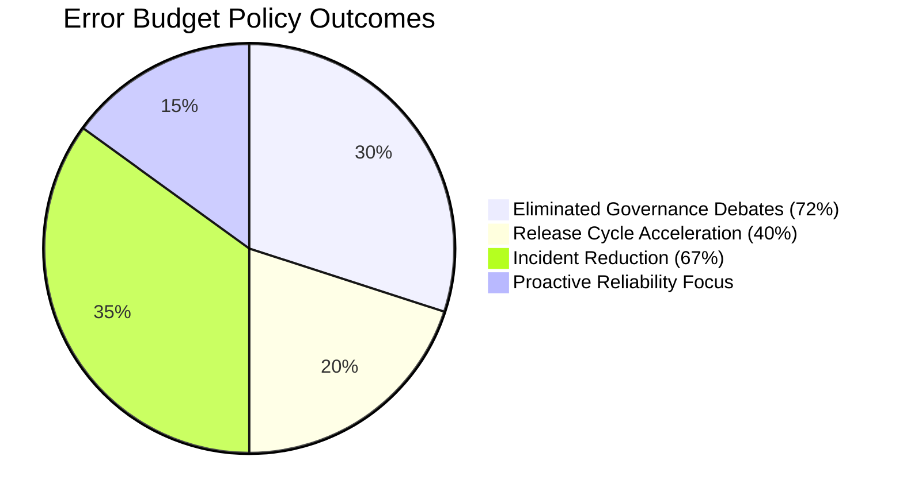

Most significantly, the policies transformed reliability from a subjective judgment call to an objective business process with clear thresholds, responsibilities, and actions—creating consistency and predictability in how the organization balanced innovation and stability.

### Implementation Guidance

To implement effective error budget policies, follow these structured steps:

#### Thresholds and Actions Table

| **Threshold** | **Budget Consumed** | **Policy Level** | **Actions** | **Approval Authority** |
| --------------------- | ------------------- | --------------------------- | ----------------------------------------------------------------------------------------------------- | ---------------------------------- |
| **Normal Operations** | 0-50% | Standard operations | Regular release cadence and standard testing. | Team Lead |
| **Elevated Risk** | 50-75% | Enhanced testing and review | Increased testing rigor, additional peer reviews, and partial release frequency restrictions. | Director |
| **High Risk** | 75-99% | Limited to priority changes | Only high-priority changes allowed, comprehensive testing required, and restricted releases. | Director or Executive |
| **Budget Exhausted** | 100% | Automatic feature freeze | Immediate halt on new features, focus on reliability improvements, and exception-based releases only. | Executive or Crisis Approval Chain |

#### Service Criticality Differentiation Table

| **Service Type** | **Examples** | **Policy Approach** |
| ----------------------- | ---------------------------------- | --------------------------------------------------------------------------------- |
| **Critical Services** | Payment processing, authentication | Strict enforcement; exceptions require executive-level approval. |
| **Important Services** | Account management, onboarding | Moderate controls; exceptions require director-level approval. |
| **Supportive Services** | Informational features | Flexible guidelines; exceptions managed at the team level with minimal oversight. |

#### Decision-Making Flowchart

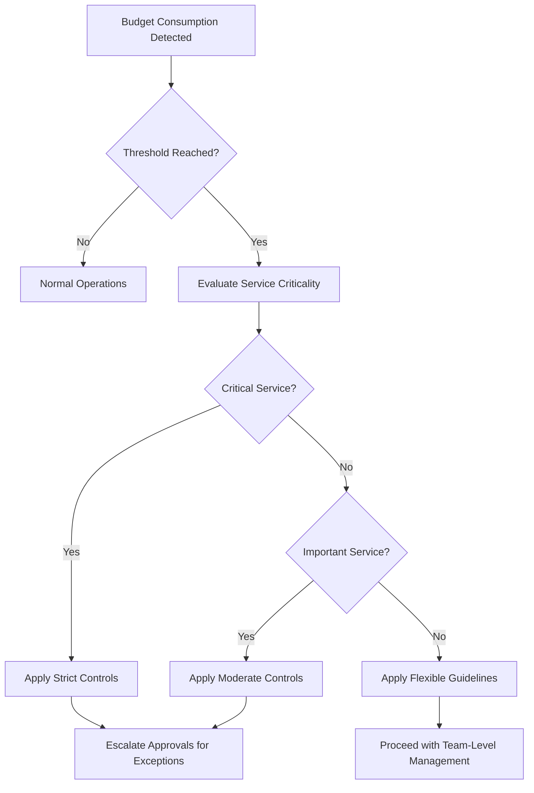

#### Key Implementation Steps

1. **Define Budget Consumption Thresholds**:
   Establish clear policy levels based on the percentage of error budget consumed, as outlined in the thresholds and actions table.

2. **Differentiate Service Policies**:
   Tailor policies according to service criticality, ensuring high-reliability controls for critical services and more flexible approaches for less critical functions.

3. **Specify Process Changes for Each Threshold**:
   Document specific operational adjustments, including:

   - Release frequency changes (e.g., daily → weekly → emergency only).
   - Testing requirements (standard → enhanced → comprehensive).
   - Approval authorities (team lead → director → executive).
   - Post-deployment monitoring levels (standard → enhanced → continuous).

4. **Establish Exception Processes**:
   Define legitimate exception categories (e.g., security fixes, regulatory needs) and document risk assessment, approval chains, and post-implementation monitoring requirements.

5. **Automate Notifications**:
   Implement automated alerts to notify stakeholders when thresholds are crossed, ensuring timely action.

6. **Visualize Policy Status**:
   Create dashboards displaying real-time policy status and budget consumption for all services, increasing organizational transparency.

7. **Conduct Periodic Reviews**:
   Regularly assess the effectiveness of policies, updating thresholds and actions based on operational experience and evolving business needs.

8. **Train Teams**:
   Provide training to all relevant teams, ensuring a shared understanding of policy mechanisms, thresholds, and their rationale.

By integrating clear visual tools like tables and flowcharts, these steps are both actionable and easy to understand, enabling consistent implementation across teams and services.

## Panel 7: The Incident Analysis - Learning from Budget Consumption

### Scene Description

A post-incident review where banking SREs analyze a significant error budget impact from a recent trading platform outage. Data visualizations show detailed budget consumption analysis: specific transaction types affected, error patterns identified through log analysis, impact distribution across customer segments, and root cause categorization. The team methodically classifies the incident by cause category—adding it to historical analysis showing reliability trends by failure type. Implementation improvements are prioritized based on both incident severity and pattern frequency.

#### Summary of Key Insights:

| Incident Type | % of Quarterly Incidents | % of Error Budget Consumed | Priority Rationale |
| -------------------------- | ------------------------ | -------------------------- | ---------------------------------------------------------- |
| Database Connection Issues | 23% | 57% | High consumption of error budget despite lower occurrence. |
| Network Failures | 15% | 12% | Highly visible but minimal budget impact. |
| Application Logic Errors | 30% | 18% | Moderate frequency and budget impact. |
| Configuration Issues | 10% | 8% | Low priority due to limited budget impact. |
| Dependency Failures | 22% | 5% | Low consumption despite moderate frequency. |

From this analysis, engineers identified that database connection issues are the top priority for remediation. Although other failures, such as network issues, may receive more immediate attention due to their visibility, the data-driven approach ensures focus is placed on the highest-value improvements. Specifically, a connection pool redesign is prioritized to address the disproportionate impact of database connection failures on the error budget.

### Teaching Narrative

Incident analysis transforms error budget consumption from a historical record into a catalyst for improvement by systematically connecting reliability impacts to their causes and identifying the highest-value remediation opportunities. This process can be likened to financial budgeting: just as a household budget allocates resources to the most necessary expenses to avoid overspending, error budget analysis allocates engineering focus to the most impactful reliability issues to prevent customer experience degradation. Without this prioritization, teams risk spending their "reliability currency" on visible but low-impact issues, similar to overspending on luxury items while neglecting basic necessities.

Traditional incident reviews often focus on the most recent or most visible issues, which can lead to reactive firefighting rather than strategic improvement. Error budget analysis fundamentally shifts this paradigm by quantifying the reliability impact of different failure categories. For example, database performance issues might consume 45% of the error budget while representing only 20% of incidents, whereas highly visible but quickly recovered network issues might attract significant attention despite having minimal budget impact. By focusing on the data, this approach ensures resources are directed toward preserving the most error budget rather than addressing what feels most urgent or politically visible.

The analysis process can be visualized as a flowchart:

```mermaid
flowchart TD
    A[Incident Data Collection] --> B[Log Analysis and Error Categorization]
    B --> C{Classification Frameworks}
    C --> D[Technical Cause (e.g., Database, Network)]
    C --> E[Failure Mode (e.g., Capacity, Dependency)]
    C --> F[Organizational Factor (e.g., Deployment Process, Architecture)]
    C --> G[Customer Impact (e.g., Transaction, Segment)]
    D & E & F & G --> H[Quantify Reliability Impact]
    H --> I[Identify Systemic Patterns]
    I --> J[Prioritize Improvement Opportunities]
```

This structured approach transforms incidents from isolated events into a reliability dataset that reveals systemic patterns and drives improvement priorities. By integrating log-derived error data with classification frameworks—spanning technical causes, failure modes, organizational factors, and customer impact dimensions—teams can uncover the root causes of recurring reliability issues.

For banking platforms, where reliability engineering resources are often constrained, this data-driven prioritization ensures that engineering efforts are allocated where they will have the greatest impact on preserving the error budget and improving customer experience. This method enables true reliability engineering, making every decision a strategic investment in long-term platform stability and customer trust.

### Common Example of the Problem

Premier Banking Group experienced multiple reliability incidents across their digital platform in Q1, consuming significant error budget. Their traditional incident response process treated each outage as an isolated event, focusing primarily on the most recent or most visible issues.

When prioritizing engineering improvements, they allocated resources based largely on executive escalations and recency bias. They invested heavily in redesigning their mobile app API gateway after a highly visible two-hour outage affected all customers. Meanwhile, they assigned minimal resources to addressing persistent database connection issues in their payment processing backend that caused brief but frequent transaction failures.

At the end of Q2, despite successfully preventing another gateway outage, their overall reliability had actually deteriorated. Log analysis revealed the database connection issues were consuming 58% of their total error budget through numerous small incidents, while the gateway issue had represented only 12% despite its higher visibility. Their improvement prioritization based on incident visibility rather than quantified error budget impact had directed resources toward solving a relatively minor problem while leaving the major budget consumer unaddressed.

### SRE Best Practice: Evidence-Based Investigation

Structured error budget analysis enables SRE teams to prioritize improvements effectively. Follow this evidence-based investigation process:

#### Checklist for Structured Error Budget Analysis

- **Categorization:**
  - Classify each incident by:
    - Root cause (e.g., database, network, application logic).
    - Technology component involved.
    - Failure mode (e.g., capacity, dependency, configuration).
    - Impact pattern (e.g., affected transaction types, customer segments).
- **Quantification:**
  - Calculate the error budget impact for each incident and category.
  - Focus on real customer experience impacts over incident visibility or duration.
- **Trend Analysis:**
  - Identify recurring patterns and systemic weaknesses across incidents.
  - Evaluate trends to uncover underlying reliability challenges.
- **Prioritization:**
  - Rank reliability improvements based on quantified error budget impact.
  - Avoid bias toward recency or high-visibility incidents.
- **Observability Enhancements:**
  - Address investigation challenges by improving monitoring and logging.
  - Ensure future similar incidents are easier to detect and diagnose.

#### Process Flow

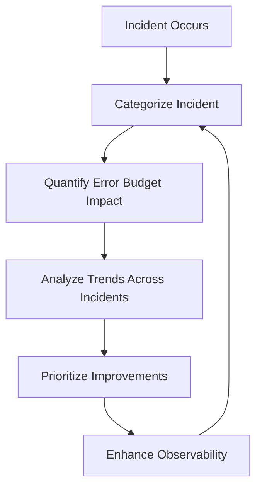

Organizations that adopt this data-driven approach typically achieve 40-60% greater reliability improvements from the same engineering investment. By focusing on the highest-impact issues instead of the most visible ones, SRE teams can maximize customer experience and operational efficiency.

### Banking Impact

The business impact of data-driven incident analysis is substantial, dramatically improving reliability outcomes from limited engineering resources.

When Continental Trust implemented error budget-based incident analysis, they uncovered significant insights into their reliability challenges, summarized below:

| Incident Type | % of Incidents | % of Error Budget | Key Observations |
| -------------------------------------- | -------------- | ----------------- | --------------------------------------------------------------------------- |
| Authentication Service Issues | 15% | 47% | High error budget consumption due to wide customer impact |
| Third-Party Payment Processor Problems | 35% | 8% | Limited scope and quick recovery minimized impact |
| Batch Processing Jobs | Rare | 22% | Overnight timing led to limited attention despite significant budget impact |

By reallocating engineering resources based on error budget impact rather than incident count or visibility, Continental Trust achieved:

- **63% reduction** in overall error budget consumption within six months
- **12-point improvement** in customer satisfaction scores for digital banking
- **47% reduction** in mean-time-to-resolution for critical incidents through targeted observability enhancements
- **Increased efficiency**, enabling substantially better outcomes from the same engineering investment

Most importantly, this data-driven approach eliminated political discussions about improvement priorities, replacing subjective opinions with objective impact measurement.

### Implementation Guidance

To implement effective incident analysis based on error budget impact, follow these steps:

```mermaid
graph TD
    A[Step 1: Create Incident Classification Taxonomy] --> A1[Technical Components (database, network, application, infrastructure)]
    A --> A2[Failure Modes (capacity, dependency, configuration, code defect)]
    A --> A3[Organizational Factors (deployment, monitoring, response, design)]
    A --> A4[Customer Impact Dimensions (transaction types, user segments, channels)]

    B[Step 2: Build Structured Post-Incident Analysis Process] --> B1[Calculate Precise Error Budget Impact for Incidents]
    B --> B2[Classify Incidents Using the Taxonomy]
    B --> B3[Link Classifications to Log Evidence]
    B --> B4[Assign Ownership for Follow-Up Actions]

    C[Step 3: Implement Incident Database] --> C1[Capture Incident Details and Classifications]
    C --> C2[Quantify Error Budget Impact by Service/Segment]
    C --> C3[Document Root Causes and Improvement Actions]
    C --> C4[Track Resolution Metrics (Detection/Response Times)]

    D[Step 4: Develop Analytical Capabilities] --> D1[Analyze Error Budget Consumption by Cause]
    D --> D2[Track Reliability Trends Over Time]
    D --> D3[Conduct Correlation Analysis of Classifications]
    D --> D4[Build Predictive Models for Future Issues]

    E[Step 5: Create Prioritization Frameworks] --> E1[Rank Opportunities by Error Budget Impact]
    E --> E2[Consider Frequency and Severity of Incidents]
    E --> E3[Account for Implementation Cost/Complexity]
    E --> E4[Assess Risk of Recurrence]

    F[Step 6: Establish Regular Reliability Reviews] --> F1[Analyze Cumulative Error Budget Patterns]
    F --> F2[Evaluate Effectiveness of Past Improvements]
    F --> F3[Adjust Priorities Based on Trends]
    F --> F4[Allocate Resources to High-Impact Opportunities]

    G[Step 7: Develop Feedback Loops] --> G1[Validate Improvement Impact on Error Budget]
    G --> G2[Adjust Approaches Based on Measured Outcomes]

    H[Step 8: Create Executive Dashboards] --> H1[Translate Technical Data into Business Metrics]
    H --> H2[Show Impact of Reliability on Customer Experience and Financial Outcomes]
```

1. **Create Incident Classification Taxonomy**: Define a standardized taxonomy addressing technical components, failure modes, organizational factors, and customer impact dimensions.

2. **Build Structured Post-Incident Analysis Process**: Ensure every incident is analyzed by calculating error budget impact, classifying with the taxonomy, linking evidence, and assigning follow-up ownership.

3. **Implement Incident Database**: Build a database to record incident details, classifications, quantified impacts, root causes, actions, and resolution metrics.

4. **Develop Analytical Capabilities**: Use the database to conduct error budget consumption analysis, trend tracking, correlation studies, and predictive modeling.

5. **Create Prioritization Frameworks**: Rank remediation opportunities with a focus on error budget impact, balancing frequency, severity, cost, and recurrence risk.

6. **Establish Regular Reliability Reviews**: Conduct reviews to analyze patterns, assess past improvements, adjust priorities, and allocate resources effectively.

7. **Develop Feedback Loops**: Validate the real-world impact of implemented improvements on error budgets, refining approaches as necessary.

8. **Create Executive Dashboards**: Design dashboards that translate technical reliability data into actionable business insights, emphasizing customer and financial impacts.

By following this structured, step-by-step approach, teams can transform incident analysis into a powerful tool for driving targeted, impactful reliability improvements.

## Panel 8: The Business Alignment - Translating Reliability to Revenue

### Scene Description

A quarterly business review where banking executives examine the financial impact of reliability engineering investments. Financial dashboards show explicit connections between reliability improvements and business outcomes. The relationships can be visualized as follows:

```
+---------------------------+       +-----------------------------+
|  Reliability Improvements | ----> |  Business Impact            |
+---------------------------+       +-----------------------------+
         |                                |
         |                                |
         v                                v
+---------------------------+       +-----------------------------+
| Increased Transaction     | ----> | Revenue Growth              |
| Completion Rates          |       | (+3.7% per 1% reliability   |
|                           |       | improvement)                |
+---------------------------+       +-----------------------------+
         |                                |
         |                                |
         v                                v
+---------------------------+       +-----------------------------+
| Reduced Support Contacts  | ----> | Lower Operational Costs     |
|                           |       |                             |
+---------------------------+       +-----------------------------+
         |                                |
         |                                |
         v                                v
+---------------------------+       +-----------------------------+
| Improved Customer         | ----> | Higher Retention Metrics    |
| Retention Metrics         |       | and Competitive Win Rates   |
+---------------------------+       +-----------------------------+
```

ROI analysis highlights specific examples: a 1% improvement in payment processing reliability delivered a 3.7% revenue increase through reduced abandonment and higher customer confidence. Similarly, fraud detection reliability enhancements reduced false positives by 23%, increasing legitimate transaction approvals. These insights help executives shift their decision-making perspective from viewing reliability as technical overhead to recognizing it as a revenue-generating investment.

### Teaching Narrative

Business alignment transforms reliability engineering from technical practice to strategic investment by explicitly connecting error budgets and SLOs to financial and customer outcomes that executives intrinsically value. Without this translation, reliability initiatives often struggle for priority and funding against revenue-generating features, creating a false dichotomy between reliability and business growth. Effective business alignment establishes clear connections between reliability metrics and business outcomes: transaction completion rates directly affecting revenue realization, system responsiveness impacting customer satisfaction and retention, service reliability influencing competitive differentiation, and incident frequency affecting operational costs through support contacts and remediation expenses.

For financial institutions where transaction sequences and user behaviors follow distinctive patterns, these capabilities provide critical insights that event-based analysis alone cannot achieve: fraud detection identifying unusual operation sequences that indicate account compromise, attack detection recognizing the progressive stages of sophisticated security incidents, operational pattern analysis identifying transaction flow anomalies indicating potential issues, and user behavior modeling establishing normal activity sequences to detect deviations. The most sophisticated applications often implement hierarchical temporal analysis: micro-patterns capturing sequences within individual sessions or transactions, meso-patterns identifying behavior across user interactions, and macro-patterns recognizing long-term trends and seasonality effects. This multi-level approach enables detection of complex patterns like advanced persistent threats in banking systems—attacks that progress through reconnaissance, initial compromise, privilege escalation, lateral movement, and data exfiltration stages over weeks or months, with each individual stage appearing innocuous in isolation but forming a recognizable pattern when analyzed as a sequence.

#### Checklist: Aligning Reliability Metrics with Business Outcomes

To ensure reliability engineering efforts are effectively aligned with business objectives, follow these steps:

1. **Define Relevant SLOs and Error Budgets**:

   - Identify service-level objectives (SLOs) critical to customer experience and business goals.
   - Establish error budgets to quantify acceptable reliability thresholds.

2. **Connect Metrics to Financial Outcomes**:

   - Map transaction completion rates to revenue realization.
   - Quantify the impact of system responsiveness on customer satisfaction and retention.
   - Link service reliability improvements to competitive differentiation and market share.

3. **Analyze Operational Cost Reductions**:

   - Calculate support contact reductions from improved reliability.
   - Quantify savings from faster incident resolution and fewer escalations.

4. **Leverage Hierarchical Temporal Analysis**:

   - Use micro-patterns for session-level anomaly detection.
   - Apply meso-patterns to identify user behavior trends across interactions.
   - Implement macro-patterns to capture long-term seasonal and systemic trends.

5. **Develop Use-Case-Specific Insights**:

   - Detect fraud by identifying unusual transaction sequences.
   - Identify security threats by analyzing progressive attack patterns.
   - Monitor transaction flows for anomalies indicating potential issues.

6. **Communicate Insights in Business Terms**:

   - Translate technical metrics into revenue, retention, and operational cost impacts.
   - Use financial dashboards to visualize the impact of reliability improvements.
   - Present ROI analysis to demonstrate the business value of reliability investments.

By following this checklist, reliability engineering can be positioned as a key driver of strategic business outcomes, shifting perceptions from technical overhead to revenue-generating investment.

### Common Example of the Problem

Evergreen Financial struggled to secure executive support for reliability initiatives, even as their digital banking platform experienced frequent customer-impacting incidents. The technology organization repeatedly pushed for resources to address infrastructure improvements and technical debt, but business leaders prioritized new features, perceiving reliability engineering as a cost center rather than a revenue enabler.

This disconnect can be likened to a car dashboard that only displays engine stats—RPM, oil temperature, and battery voltage—without showing practical metrics like fuel efficiency or miles left to travel. While the technical data might be crucial for a mechanic, it doesn’t provide the driver (in this case, the business leaders) with actionable insights about how the car is performing in terms of their goals, like reaching the destination efficiently. Similarly, Evergreen’s technology team presented reliability metrics such as error rates, system availability, and incident counts, but failed to translate these into terms the business could understand, such as revenue impacts, customer retention, or competitive advantage.

Meanwhile, business leaders observed customer complaints and rising support calls but couldn’t connect these issues to specific reliability investments. For example, when the CIO requested $1.2M for a major resilience initiative, the proposal was rejected in favor of new mobile banking features expected to drive revenue growth. Without a clear translation of reliability metrics into tangible business outcomes, it created a false choice between reliability and revenue growth, rather than demonstrating how the two could complement and reinforce each other.

### SRE Best Practice: Evidence-Based Investigation

SRE teams should establish clear business alignment for reliability metrics and investments:

1. Correlate reliability metrics with specific business outcomes using log analysis to connect technical performance to customer behavior and financial results.

2. Quantify the revenue impact of reliability issues through detailed analysis of transaction abandonment, reduced usage following incidents, and customer attrition patterns.

3. Calculate operational cost implications of reliability problems, including support contacts, incident response time, remediation efforts, and reputation management.

4. Develop competitive benchmarking that compares reliability performance against market alternatives, identifying how reliability affects customer acquisition and retention.

5. Create business-facing reliability dashboards that translate technical metrics into financial and customer experience terms meaningful to executives.

Organizations that effectively align reliability with business outcomes typically achieve 2-3× more investment in reliability engineering by demonstrating clear financial returns rather than positioning it as technical overhead.

### Banking Impact

The business impact of aligning reliability engineering with financial outcomes creates substantial competitive advantage and improved investment decisions.

When Financial Services Corporation implemented business-aligned reliability frameworks, they discovered critical insights:

| **Metric** | **Impact** |
| ------------------------------- | ----------------------------------------------------------------------------------------------------- |
| Payment Processing Reliability | Each 0.1% improvement increased completed transactions by approximately **$4.7M annually**. |
| Mobile Banking Reliability | Each 30-minute outage reduced average session frequency by **4.2%** for the following week. |
| Investment Platform Reliability | Customers experiencing failed trades were **3.8× more likely** to transfer portfolios to competitors. |
| Loan Application Reliability | Each 1% improvement increased successful applications by **3.2%**. |

These quantified relationships transformed executive perception of reliability engineering from cost center to revenue driver, unlocking investment that delivered:

| **Outcome** | **Financial/Operational Impact** |
| ----------------------------------- | ------------------------------------------------------------ |
| Higher Transaction Completion Rates | **$12.3M annual revenue increase** |
| Reduced Customer Service Costs | **18% reduction** through fewer reliability-related contacts |
| Improved Customer Retention Metrics | **4.2% improvement** for high-value segments |
| Competitive Advantage | Measurable gains in independent banking experience ratings |

By explicitly tying reliability metrics to these tangible outcomes, Financial Services Corporation demonstrated the strategic value of reliability engineering, driving informed decisions and securing long-term business success.

### Implementation Guidance

To create effective business alignment for reliability engineering:

```mermaid
flowchart TD
    A[Identify Key Business Metrics] --> B[Implement Correlation Analysis]
    B --> C[Develop Financial Impact Models]
    C --> D[Create Executive Dashboards]
    D --> E[Establish ROI Frameworks]
    E --> F[Implement Regular Business Reviews]
    F --> G[Develop Competitive Intelligence]
    G --> H[Create Cross-Functional Alignment]

    subgraph Step1 [1. Identify Key Business Metrics]
        A1[Revenue Metrics] 
        A2[Customer Experience Metrics] 
        A3[Operational Cost Metrics] 
        A4[Competitive Position Metrics]
        A --> A1
        A --> A2
        A --> A3
        A --> A4
    end

    subgraph Step2 [2. Implement Correlation Analysis]
        B1[Map SLI performance to transaction completion rates]
        B2[Track customer behavior changes after reliability incidents]
        B3[Analyze support contact patterns]
        B4[Measure feature adoption rates relative to reliability]
        B --> B1
        B --> B2
        B --> B3
        B --> B4
    end

    subgraph Step3 [3. Develop Financial Impact Models]
        C1[Quantify revenue impact of transaction abandonment]
        C2[Assess customer lifetime value effects]
        C3[Evaluate operational cost implications]
        C4[Highlight competitive advantage from reliability]
        C --> C1
        C --> C2
        C --> C3
        C --> C4
    end

    subgraph Step4 [4. Create Executive Dashboards]
        D1[Present reliability metrics in business terms]
        D2[Show relationships between SLO performance and outcomes]
        D3[Highlight customer experience improvements]
        D4[Demonstrate competitive differentiation]
        D --> D1
        D --> D2
        D --> D3
        D --> D4
    end

    subgraph Step5 [5. Establish ROI Frameworks]
        E1[Calculate expected returns from improvements]
        E2[Compare cost-benefit ratios]
        E3[Account for immediate and long-term benefits]
        E4[Consider risk mitigation value]
        E --> E1
        E --> E2
        E --> E3
        E --> E4
    end

    subgraph Step6 [6. Implement Regular Business Reviews]
        F1[Present reliability performance in business terms]
        F2[Review ROI from past investments]
        F3[Evaluate upcoming initiatives using business criteria]
        F4[Align priorities with high-value opportunities]
        F --> F1
        F --> F2
        F --> F3
        F --> F4
    end

    subgraph Step7 [7. Develop Competitive Intelligence]
        G1[Benchmark reliability against market alternatives]
        G2[Identify competitive advantages or disadvantages]
        G3[Quantify market share implications]
        G4[Inform strategic investment decisions]
        G --> G1
        G --> G2
        G --> G3
        G --> G4
    end

    subgraph Step8 [8. Create Cross-Functional Alignment]
        H1[Incorporate shared goals into technical metrics]
        H2[Incorporate shared goals into business performance metrics]
        H3[Ensure unified incentives across the organization]
        H --> H1
        H --> H2
        H --> H3
    end
```

1. **Identify key business metrics directly affected by reliability performance**:

   - Revenue metrics (transaction volume, completion rates, average value)
   - Customer experience metrics (satisfaction scores, NPS, retention rates)
   - Operational cost metrics (support contacts, incident costs, remediation expenses)
   - Competitive position metrics (market share, win/loss rates, comparison rankings)

2. **Implement correlation analysis between reliability data and business outcomes**:

   - Map SLI performance to transaction completion rates
   - Track customer behavior changes following reliability incidents
   - Analyze support contact patterns relative to service performance
   - Measure feature adoption rates in relation to reliability levels

3. **Develop financial impact models that quantify**:

   - Revenue impact of transaction abandonment during degraded performance
   - Customer lifetime value effects of reliability-influenced retention
   - Operational cost implications of different reliability levels
   - Competitive advantage created through superior reliability

4. **Create executive dashboards that**:

   - Present reliability metrics in business terms rather than technical measures
   - Show direct relationships between SLO performance and financial outcomes
   - Highlight reliability-driven customer experience improvements
   - Demonstrate competitive differentiation through reliability excellence

5. **Establish ROI frameworks for reliability investments that**:

   - Calculate expected business returns from specific improvements
   - Compare cost-benefit ratios against other investment opportunities
   - Account for both immediate benefits and long-term strategic value
   - Consider risk mitigation value alongside direct financial returns

6. **Implement regular business reviews that**:

   - Present reliability performance in business impact terms
   - Review ROI from previous reliability investments
   - Evaluate upcoming reliability initiatives using business criteria
   - Align engineering priorities with highest business value opportunities

7. **Develop competitive intelligence that**:

   - Benchmark reliability performance against market alternatives
   - Identify reliability-driven competitive advantages or disadvantages
   - Quantify market share implications of reliability positioning
   - Inform strategic reliability investment decisions

8. **Create cross-functional alignment through shared reliability goals** incorporated into both technical and business performance metrics, ensuring unified incentives across the organization.

## Panel 9: The Cultural Transformation - Shared Ownership of Reliability

### Scene Description

A banking platform town hall serves as the stage for a pivotal cultural shift: product managers present reliability metrics alongside feature delivery for the first time. The event is structured to emphasize the integration of innovation and stability, and the flow of the session highlights this transformation:

#### Town Hall Flow:

1. **Opening Remarks**: Executives set the tone, emphasizing the importance of balancing innovation and reliability as twin pillars of customer trust and business success.
2. **Product Dashboards Presentation**:
   - Product managers showcase updated dashboards blending traditional metrics (e.g., feature completion, usage adoption) with reliability indicators such as:
     - SLO performance
     - Error budget status
     - Customer experience metrics derived from logs
3. **Development Team Insights**:
   - Development teams describe how error budgets have shifted their workflows:
     - **Accelerated Innovation**: Examples of rapid feature releases when error budgets permitted.
     - **Focused Reliability Improvements**: Actions taken when thresholds were approached.
4. **Recognition and Awards**:
   - Teams are recognized for contributions to both feature delivery and reliability improvements.
   - Awards categories reflect the balanced importance of innovation and stability.
5. **Executive Messaging**:
   - Leadership reiterates the alignment of incentives across product, development, and operations teams, emphasizing the shared ownership of reliability.

#### Visual Timeline Representation:

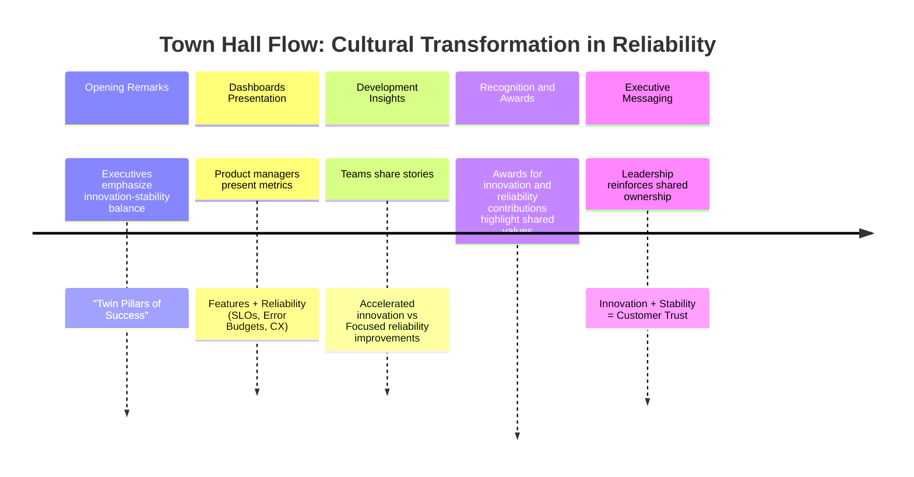

The cultural shift becomes evident as reliability transforms from "an operations problem" to a shared product engineering concern integral to customer experience. The town hall's structure and messaging reinforce the organization's commitment to embedding reliability across all roles, breaking down silos and fostering a unified approach to delivering both innovative and stable customer experiences.

### Teaching Narrative

Cultural transformation represents the ultimate evolution of reliability engineering—moving from specialized technical practice to organizational value embedded across all roles and functions. Traditional approaches often create artificial divisions: product teams drive features while operations teams own reliability, creating misaligned incentives where some groups are rewarded for delivery speed while others bear the consequences of associated reliability impacts. Error budgets and SLOs fundamentally reshape this dynamic by creating shared metrics and aligned incentives: product, development, and operations all succeed or fail together based on the same reliability measurements derived from actual customer experience. This shared foundation transforms cultural patterns: developers incorporate reliability considerations into design decisions rather than treating it as post-implementation concern, product managers evaluate feature risk against remaining error budgets rather than pushing for delivery regardless of stability impact, and operations teams participate in feature planning rather than simply responding to reliability consequences after implementation. For banking organizations where reliability directly affects both customer trust and revenue realization, this cultural alignment is particularly critical—preventing the false choice between innovation and stability by establishing frameworks where both are recognized as essential components of customer and business success. Organizations with mature reliability cultures typically demonstrate specific behavioral patterns: blameless problem-solving focused on systems rather than individuals, transparent reliability data accessible to all teams, celebration of both feature innovation and reliability improvement, and universal recognition that customer experience depends equally on compelling features and consistent reliability.

### Common Example of the Problem

Midwest Financial's digital banking division exemplified the challenges of misaligned incentives between product and operations teams. Below is a comparison of the organizational dynamics and outcomes before and after adopting a shared reliability culture:

| **Aspect** | **Before Cultural Transformation** | **After Cultural Transformation** |
| --------------------- | -------------------------------------------------------------------------------------------------------------------------- | ----------------------------------------------------------------------------------------------------------------------------------- |
| **Team Incentives** | Product teams rewarded for feature delivery speed and adoption metrics. Operations teams rewarded for platform stability. | Both teams evaluated on shared metrics like SLO performance, error budget adherence, and customer experience improvement. |
| **Release Planning** | Aggressive release schedules prioritized, often disregarding reliability concerns raised by operations. | Release planning incorporates error budgets, balancing delivery speed with reliability thresholds. |
| **Collaboration** | Adversarial relationship: product teams pushed changes, while operations teams resisted them to protect stability metrics. | Collaborative partnership: product and operations teams co-own decisions, sharing accountability for both features and reliability. |
| **Incident Response** | Post-incident blame placed on opposing team, avoiding deeper analysis of structural issues. | Blameless post-mortems focus on systemic causes, with all teams aligned on improving shared processes and outcomes. |
| **Customer Impact** | Service degradation and customer dissatisfaction due to rushed releases, undermining feature adoption goals. | Consistent reliability ensures smoother customer experiences, supporting both feature adoption and long-term trust. |

One notable example occurred when a major digital wallet feature was rushed to production despite operations team warnings. The resulting service degradation impacted thousands of customers, incurred significant support costs, and damaged adoption metrics the product team was targeting. In the post-mortem, the root cause was traced back to the misaligned incentives between teams, emphasizing the need for structural change to foster shared ownership of reliability.

### SRE Best Practice: Evidence-Based Investigation

SRE teams should implement cultural transformation initiatives that create shared reliability ownership. The following checklist summarizes best practices for evidence-based investigation to support this transformation:

#### Evidence-Based Investigation Checklist

- **Unified Metrics**

  - [ ] Establish reliability metrics that are visible and accessible to all teams.
  - [ ] Ensure metrics reflect both current status and historical trends for better context.

- **Aligned Incentives**

  - [ ] Define shared incentives that balance delivery speed with reliability goals.
  - [ ] Align objectives across product, development, and operations teams to prevent competing priorities.

- **Collaborative Processes**

  - [ ] Incorporate reliability considerations throughout the product lifecycle, from design to deployment.
  - [ ] Foster collaboration between teams during planning, execution, and post-implementation phases.

- **Blameless Problem-Solving**

  - [ ] Promote a blameless culture focused on identifying and improving systemic issues.
  - [ ] Encourage transparent sharing of problems, concerns, and lessons learned across teams.

- **Educational Initiatives**

  - [ ] Develop training programs to establish a shared reliability vocabulary.
  - [ ] Ensure both technical and non-technical roles understand reliability concepts and their impact on customer experience.

#### Expected Outcomes

Organizations that adopt these best practices typically achieve:

- 30-50% reductions in customer-impacting incidents.
- 20-30% improvements in feature delivery velocity due to enhanced collaboration and reduced rework.

### Banking Impact

The business impact of shared reliability ownership manifests across multiple dimensions, with substantial operational and customer experience benefits.

When Eastern Trust implemented cultural transformation around reliability, they experienced significant business outcomes:

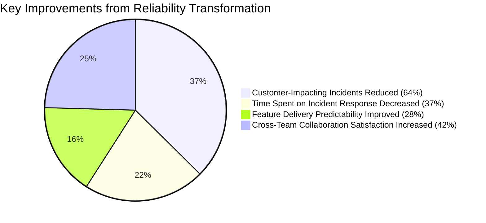

- **64% reduction** in customer-impacting incidents through earlier identification and mitigation of reliability risks during development.
- **37% decrease** in time spent on incident response and unplanned work, freeing technical resources for innovation.
- **28% improvement** in feature delivery predictability as reliability considerations were incorporated earlier in the development process.
- **42% higher satisfaction** with product-engineering relationships, as shown in post-implementation surveys, reflecting measurable improvements in cross-team collaboration.

Most significantly, the false dichotomy between reliability and innovation disappeared as teams developed a shared understanding that both were essential components of customer experience and business success.

### Implementation Guidance

To implement effective cultural transformation for shared reliability ownership, follow the step-by-step process outlined below:

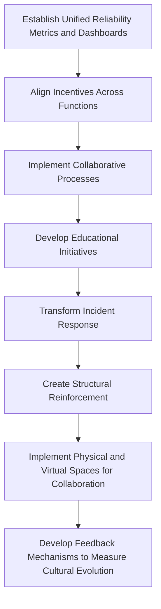

#### Step-by-Step Implementation

1. **Establish Unified Reliability Metrics and Dashboards**

   - Ensure visibility across all teams and functions.
   - Present reliability in both technical and business terms.
   - Include historical trends, current status, and ties to organizational goals.

2. **Align Incentives Across Functions**

   - Create shared OKRs or performance metrics balancing feature delivery and reliability.
   - Recognize contributions to both innovation and operational excellence.
   - Implement team-level rewards based on combined delivery and reliability outcomes.
   - Evaluate leadership on their ability to balance stability and new capabilities.

3. **Implement Collaborative Processes**

   - Conduct joint planning sessions integrating reliability and feature discussions.
   - Use shared decision-making frameworks for deployment timing and risk assessment.
   - Facilitate cross-functional retrospectives to review both delivery and operational outcomes.
   - Establish rotation programs to foster cross-domain understanding.

4. **Develop Educational Initiatives**

   - Offer reliability engineering fundamentals training for product and business teams.
   - Provide customer experience and business context training for technical teams.
   - Promote a common understanding of terminology and metrics across the organization.
   - Organize incident simulation exercises to unite different functions.

5. **Transform Incident Response**

   - Conduct blameless post-mortems focusing on system improvements.
   - Involve cross-functional teams in incident resolution regardless of origin.
   - Share ownership of remediation actions across team boundaries.
   - Maintain transparent communication of incidents and learnings organization-wide.

6. **Create Structural Reinforcement**

   - Deliver consistent executive messaging emphasizing shared responsibility for reliability.
   - Host regular cross-functional reliability reviews with broad participation.
   - Balance resource allocation between features and reliability investments.
   - Design career advancement paths that recognize reliability contributions.

7. **Implement Physical and Virtual Spaces for Collaboration**

   - Display shared dashboards in common areas to show reliability status.
   - Create cross-functional chat channels dedicated to reliability discussions.
   - Schedule joint working sessions for reliability planning.
   - Celebrate reliability achievements with recognition events.

8. **Develop Feedback Mechanisms to Measure Cultural Evolution**

   - Conduct regular surveys to assess reliability culture across functions.
   - Track metrics on cross-team collaboration in reliability initiatives.
   - Measure the adoption of shared language and understanding.
   - Document examples and outcomes of cultural shifts to analyze progress.

By following this systematic approach, organizations can foster a culture where reliability becomes a shared responsibility, integral to both innovation and customer satisfaction.

## Panel 10: The Advanced Techniques - Machine Learning for Reliability Prediction

### Scene Description

A financial technology innovation lab where data scientists demonstrate advanced reliability prediction capabilities. The lab features multiple visualization displays and dashboards that bring the predictive process to life. At the center, a large screen showcases a machine learning model pipeline analyzing historical log patterns to identify potential reliability issues before they impact customers. Key insights are highlighted:

- **Subtle Precursors**: Database performance degradations detected days before threshold violations.
- **Emerging Risks**: Unusual error pattern frequencies flagged by anomaly detection algorithms.
- **Behavior Deviations**: Real-time identification of deviations from established operational baselines.

Nearby, engineers monitor dashboards displaying predicted error budget impacts for various system components. These dashboards are layered with actionable insights, such as high-confidence forecasts triggering proactive remediation workflows or investigation alerts.

A timeline comparison screen illustrates the transformative shift in reliability management, showing:

```
+----------------+--------------------+--------------------+------------------+
| Reactive Era   | Issue Detected    | Customer Impact    | Error Budget     |
|                | After Impact      | Experienced        | Consumed         |
+----------------+--------------------+--------------------+------------------+
| Predictive Era | Early Detection   | Zero Customer      | Error Budget     |
|                | & Prevention      | Impact             | Preserved        |
+----------------+--------------------+--------------------+------------------+
```

The lab is designed for collaboration, with engineers and data scientists exchanging insights to refine models and improve predictions. Together, they demonstrate how predictive capabilities can address 67% of potential reliability issues before any customer impact occurs—shifting reliability management from reactive firefighting to preventive excellence.

### Teaching Narrative

Advanced machine learning techniques represent the frontier of reliability engineering—evolving from reactive measurement to predictive prevention by identifying potential issues before they impact customers and consume error budgets. Traditional SLO approaches, while vastly superior to binary uptime monitoring, still fundamentally operate reactively—measuring reliability consumption after customer impact occurs. Predictive techniques transcend this limitation by applying sophisticated analysis to historical log patterns and identifying subtle precursors that typically precede reliability degradation. Several approaches prove particularly effective: anomaly detection identifying unusual patterns in otherwise normal operations, trend analysis recognizing gradual degradations before they reach critical thresholds, correlation engines connecting seemingly unrelated signals that collectively indicate emerging issues, and classification models identifying known patterns that historically preceded specific failure types. For financial platforms processing millions of transactions with minimal tolerance for disruption, these predictive capabilities create transformative advantages—shifting from detecting failures after customer impact to preventing them entirely. A subtle increase in database query latency might historically precede connection exhaustion by days, while unusual patterns in authentication logs often signal potential capacity issues well before threshold violations occur. By detecting these signals early and triggering automated remediation or engineer investigation, organizations can preserve error budgets through prevention rather than just measurement—moving from the question "How reliable were we?" to the more powerful "How can we prevent reliability issues before they affect customers?" This predictive evolution represents the highest maturity of reliability engineering practice.

### Common Example of the Problem

Global Bank's investment platform frequently experienced unpredictable performance degradations that consumed error budget and impacted high-value customers, despite significant monitoring investments. Their traditional monitoring approach was fundamentally reactive—alerting only when metrics crossed predefined thresholds, by which time customers were already experiencing problems.

A particularly costly incident occurred during peak trading hours when their order execution service suddenly began rejecting transactions. Post-incident analysis revealed that database connection pool exhaustion caused the failure, but the issue appeared to emerge without warning, transitioning from normal operation to complete failure within minutes. Only after implementing advanced log analysis did they discover that subtle precursor patterns had actually been visible for days before the outage: gradually increasing connection acquisition times, periodic timeout spikes that self-resolved, and shifting query performance patterns during specific operation types.

The sequence of events leading to the failure can be illustrated as follows:

```mermaid
gantt
    title Timeline of Failure Progression and Missed Opportunities
    dateFormat  HH:mm
    axisFormat  %d/%m
    section Early Warning Signals
    Subtle increase in connection acquisition times :done, a1, 01/10, 3d
    Periodic timeout spikes (self-resolving)       :done, a2, after a1, 2d
    Shifting query performance patterns            :done, a3, after a2, 1d
    section Missed Opportunities
    Proactive analysis of logs                     :crit, b1, after a3, 1d
    Automated remediation or alerts                :crit, b2, after b1, 1d
    section Impact
    Database connection pool exhaustion            :active, c1, after b2, 0.5d
    Order execution service failure                :crit, c2, after c1, 0.5d
```

This timeline highlights how the early warning signals, visible in historical logs, were not acted upon due to reliance on reactive threshold-based monitoring. Proactive log analysis and anomaly detection could have identified these signals and initiated remediation, potentially preventing the incident altogether. By addressing issues during the "Early Warning Signals" phase, organizations can avoid cascading failures and preserve customer trust. This example underscores the importance of predictive monitoring techniques in modern reliability engineering.

### SRE Best Practice: Evidence-Based Investigation

SRE teams should implement advanced machine learning techniques for reliability prediction to shift from reactive monitoring to proactive prevention. The following checklist outlines key practices for evidence-based investigation:

| Practice | Description | Outcome |
| -------------------------- | -------------------------------------------------------------------------------------------------- | ---------------------------------------------------------------------------------------- |
| **Anomaly Detection** | Deploy systems to identify unusual patterns in logs/metrics without needing predefined thresholds. | Detect deviations from established baselines, enabling early detection of issues. |
| **Trend Analysis** | Recognize gradual degradations over time before they reach critical thresholds. | Identify concerning trajectories, allowing proactive action before issues worsen. |
| **Correlation Engines** | Analyze and connect seemingly unrelated signals across components to find emerging risks. | Detect complex patterns indicating broader system issues. |
| **Classification Models** | Train models on historical incidents to identify precursors to known failure types. | Quickly recognize patterns that historically led to specific issues, improving response. |
| **Predictive Forecasting** | Use current trends and patterns to estimate future reliability states and error budget impacts. | Anticipate potential failures and their impacts, enabling preventive remediation. |

#### Checklist for Implementation

- [ ] Identify key metrics and logs to monitor for anomalies.
- [ ] Configure anomaly detection systems with historical baseline data.
- [ ] Develop and deploy trend analysis algorithms to monitor gradual changes.
- [ ] Integrate correlation engines to identify relationships across system signals.
- [ ] Train classification models using comprehensive incident data.
- [ ] Implement predictive forecasting tools to project future reliability trends.
- [ ] Regularly evaluate and refine models based on system and incident changes.

By adopting these practices, financial institutions have achieved significant results, preventing 60-75% of potential incidents before customer impact. This approach preserves error budgets and enhances customer experience, creating a more resilient reliability framework.

### Banking Impact

The business impact of predictive reliability capabilities creates substantial competitive advantage through both customer experience enhancement and operational efficiency.

When Capital Markets Bank implemented machine learning for reliability prediction, they achieved remarkable business outcomes:

| **Metric** | **Outcome** |
| ----------------------------------------------- | ----------------------------------------------------------------------------------------------------- |
| Reduction in customer-impacting incidents | **72%** |
| Estimated annual savings from prevented outages | **$4.7M** in high-value trading systems |
| Decrease in unplanned urgent work | **83%** |
| Competitive advantage | Significant improvement in customer experience ratings, particularly for trading platform reliability |

Beyond the numbers, the approach transformed the organization's operational posture from reactive firefighting to proactive management. Engineers shifted their focus from emergency response to planned improvement and innovation, delivering better customer experiences and driving meaningful business outcomes. This shift exemplifies the power of predictive reliability in preserving error budgets and fostering long-term resilience.

### Implementation Guidance

To implement effective machine learning for reliability prediction:

1. **Establish comprehensive log collection** that captures both success patterns and error conditions, creating a rich dataset for model training. Ensure logs are structured, timestamped, and tagged with relevant metadata for easy correlation and analysis.

2. **Develop historical incident correlation** that:

   - Links past incidents to their log patterns.
   - Identifies precursor signals that preceded failures.
   - Establishes lead times between early indicators and customer impact.
   - Creates labeled datasets for supervised learning approaches.

   ```python
   # Example: Generating labeled datasets for supervised learning
   import pandas as pd

   # Load historical logs and incident data
   logs = pd.read_csv("logs.csv")
   incidents = pd.read_csv("incidents.csv")

   # Merge logs with incidents based on time correlation
   logs['label'] = logs['timestamp'].apply(lambda ts: 1 if ts in incidents['incident_timestamps'].values else 0)

   # Save the labeled dataset
   logs.to_csv("labeled_logs.csv", index=False)
   ```

3. **Implement anomaly detection systems** using techniques such as:

   - Statistical methods for identifying values outside normal distributions.
   - Clustering approaches for recognizing unusual behavioral patterns.
   - Isolation forest algorithms for detecting outliers in high-dimensional data.
   - Autoencoders for identifying reconstruction errors in complex patterns.

   ```python
   # Example: Isolation Forest for anomaly detection
   from sklearn.ensemble import IsolationForest

   # Fit the model on log metrics
   model = IsolationForest(n_estimators=100, contamination=0.01)
   predictions = model.fit_predict(logs[['metric1', 'metric2']])  # Log metrics as input

   # Mark anomalies
   logs['anomaly'] = (predictions == -1).astype(int)
   ```

4. **Build trend analysis capabilities** that:

   - Detect gradual degradations in performance indicators.
   - Identify concerning trajectories before threshold violations.
   - Recognize capacity consumption patterns leading to exhaustion.
   - Forecast when critical limits will be reached based on current trends.

   ```python
   # Example: Trend analysis using linear regression
   from sklearn.linear_model import LinearRegression
   import numpy as np

   # Prepare data for trend forecasting
   timestamps = np.arange(len(logs)).reshape(-1, 1)
   metric_values = logs['performance_metric'].values.reshape(-1, 1)

   # Fit a linear regression model
   model = LinearRegression()
   model.fit(timestamps, metric_values)
   trend_forecast = model.predict(timestamps)

   # Add trend forecast to logs for visualization
   logs['trend_forecast'] = trend_forecast
   ```

5. **Create correlation engines** that:

   - Identify relationships between different metrics and logs.
   - Detect patterns across distributed system components.
   - Recognize combinations of factors that collectively indicate risk.
   - Learn new correlation patterns as the system evolves.

   ```python
   # Example: Correlation analysis
   correlation_matrix = logs.corr()
   print("Correlation between metrics:")
   print(correlation_matrix)
   ```

6. **Implement prediction-to-action workflows** that:

   - Generate appropriate alerts based on prediction confidence.
   - Trigger automated remediation for high-confidence predictions.
   - Provide detailed context for engineering investigation.
   - Track prediction accuracy for continuous model improvement.

   ```mermaid
   graph TD
   A[Log Data Ingestion] --> B[Anomaly Detection]
   B --> C[Risk Prediction Engine]
   C -->|High Confidence| D[Trigger Automated Remediation]
   C -->|Moderate Confidence| E[Send Alert to Engineers]
   E --> F[Engineering Investigation]
   D --> G[Track Remediation Effectiveness]
   F --> G
   ```

7. **Develop feedback loops** that:

   - Validate prediction accuracy against actual outcomes.
   - Refine models based on performance metrics.
   - Reduce false positive rates through continuous learning.
   - Expand coverage to additional failure modes based on success.

   ```python
   # Example: Feedback loop to improve model accuracy
   def update_model(predictions, actuals, model):
       # Compare predictions with actual outcomes
       accuracy = sum(predictions == actuals) / len(actuals)
       print(f"Model accuracy: {accuracy}")

       # Retrain model with new data if accuracy falls below threshold
       if accuracy < 0.9:
           model.fit(new_training_data)
   ```

8. **Integrate predictive capabilities into operational processes**:

   - Incorporate predictions into release risk assessment.
   - Use forecasts in capacity planning and scaling decisions.
   - Leverage predictive insights in prioritizing technical debt.
   - Align engineering resources with predicted risk areas.

   ```python
   # Example: Using predictions for capacity planning
   predicted_exhaustion_time = model.predict([current_capacity, usage_trend])
   print(f"Predicted capacity exhaustion time: {predicted_exhaustion_time}")
   ```
