# Chapter 12: Distributed Systems Logging - Following the Thread

## Chapter Overview

Welcome to the distributed logging circus—where your precious banking transactions disappear faster than a magician’s rabbit and every team swears “it wasn’t us.” Gone are the days when a single grep could save the day; now, your logs are scattered across a digital archipelago of microservices, mainframes, clouds, and legacy hairballs. If you still think traditional logging cuts it, you probably also think Y2K was overblown. This chapter is your crash course in not losing your shirt (or your customers) as you chase transaction ghosts through a maze of disconnected logs, missing context, and timestamp lies. Spoiler: the stakes are real—millions lost, reputations torched, and compliance officers who want your head on a stick. Get ready to stitch together the digital DNA of your business, or enjoy watching your mean-time-to-resolution spiral into the next fiscal year.

______________________________________________________________________

## Learning Objectives

- **Diagnose** the root causes of log fragmentation and why monolithic techniques are a career-limiting move in distributed systems.
- **Implement** correlation ID strategies to stitch together transaction flows that span dozens of services and platforms.
- **Design** propagation patterns that actually survive the wild west of HTTP, messaging, batch, and ancient mainframes.
- **Apply** causality tracking to expose those nasty race conditions and timestamp-induced lies your system loves to hide.
- **Standardize** log schemas so your teams finally speak the same language (and your automation tools don’t choke).
- **Architect** unified log collection pipelines that bring order to chaos—without blowing your compliance budget.
- **Visualize** transaction traces to spot failures, bottlenecks, and horror stories before the auditors do.
- **Automate** anomaly detection to catch fraud and system meltdowns before they show up on CNN.
- **Debug** distributed flows with full context—no more “well, it works on my microservice.”
- **Leverage** AI-driven observability to actually keep up with your own transaction scale, and to survive the future.

______________________________________________________________________

## Key Takeaways

- Fragmented logging isn’t just a technical inconvenience—it’s a business disaster waiting to happen. Your revenue, customer trust, and regulatory survival depend on fixing it.
- Correlation IDs are the duct tape of distributed tracing. If you don’t have them, you’re basically playing “Where’s Waldo?” with your customer’s money.
- Propagation patterns aren’t optional. Lose context at a service boundary and you’ll spend your weekend in a war room, not on the golf course.
- Timestamps lie. Relying on them for event ordering in distributed systems is like trusting a sundial during a solar eclipse.
- Lack of schema standardization means every incident turns into a game of “interpret the hieroglyphics,” and your MTTR goes through the roof.
- Unified log collection isn’t a “nice-to-have.” If your logs are still siloed, you’re not investigating incidents—you’re hosting a distributed scavenger hunt.
- Visualization is your only hope against log overload. If you’re still reading raw logs, you’re in the Stone Age.
- Anomaly detection is the only way to catch subtle fraud and system issues at scale. Manual review is for hobbyists, not for banks with real money at stake.
- Distributed debugging is the difference between “we fixed it before lunch” and “we’re scheduling another cross-team call.”
- AI-enhanced observability isn’t hype—it’s survival. If your platform generates more logs than your team can read in a lifetime, let the machines do the heavy lifting.
- Ignore these practices and prepare for painful outages, angry customers, regulatory fines, and the kind of post-mortems that end careers. Your call.

______________________________________________________________________

## Panel 1: The Distributed Challenge - When Logs Live Everywhere

### Scene Description

Imagine a high-stakes banking war room during a critical customer-reported issue with international wire transfers. The atmosphere is tense as multiple teams scramble to identify the root cause. Each team is confined to its siloed view: front-end engineers are poring over mobile app logs, API teams are sifting through gateway service logs, payment specialists are analyzing transaction processor logs, compliance experts are checking sanction screening services, and settlement teams are combing through core banking system logs. Despite their efforts, no one can piece together the complete transaction journey.

Below is a simplified representation of the fragmented transaction flow, highlighting how the customer's wire transfer seems to vanish between systems:

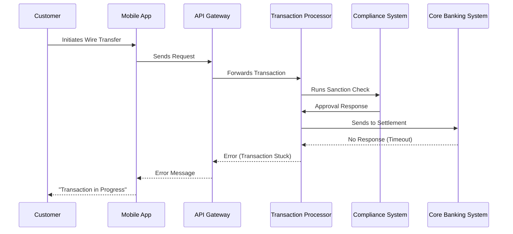

As the troubleshooting enters its third hour, the war room remains gridlocked. Each team sees only isolated fragments of the flow, leaving them unable to reconstruct the full path. The customer support representative is left with no concrete status to provide, amplifying frustration for all parties involved. This chaotic scene underscores the critical challenges of debugging distributed systems without unified observability.

### Teaching Narrative

Distributed systems create a fundamental observability challenge that traditional logging approaches fail to address: the fragmentation of a single business transaction across multiple independent services. In modern banking architectures, seemingly simple operations like wire transfers traverse dozens of distributed components—each with its own logging implementation, format, and storage. This distribution creates critical visibility gaps where transactions appear to vanish between systems, making troubleshooting exponentially more complex than in monolithic applications.

The challenge manifests across multiple dimensions, which can be summarized as follows:

| **Dimension** | **Description** | **Example Impact** |
| ------------------ | -------------------------------------------------------------------------------------------- | ----------------------------------------------------------------------------------------------------- |
| **Physical** | Services are distributed across different environments, regions, or data centers. | Logs from a service in one region are inaccessible to teams troubleshooting from another region. |
| **Temporal** | Transaction steps occur with variable timing and potential delays across services. | Logs for a delayed service step are examined out of context, leading to incomplete troubleshooting. |
| **Architectural** | Systems span diverse technology stacks, protocols, and logging formats. | A microservice using JSON logs cannot easily be correlated with another using plain-text logs. |
| **Organizational** | Different teams own various components of the transaction path, often with siloed practices. | Teams lack a unified view of the transaction, forcing slow, cross-team coordination during incidents. |

Without specialized approaches to distributed logging, these gaps create severe operational consequences:

- **Extended Troubleshooting Timeframes:** Teams struggle to reconstruct transaction flows across fragmented logs, delaying resolution.
- **Reduced Customer Experience:** Support teams lack visibility into the transaction status, preventing timely updates to customers.
- **Diminished Reliability:** Root causes remain obscured by fragmented observation, making recurrence prevention difficult.

The distributed systems challenge represents a fundamental evolution in logging requirements—what worked for monolithic applications becomes wholly inadequate for modern banking platforms where the transaction journey matters as much as the individual service behaviors.

### Common Example of the Problem

Global Bank's consumer division recently implemented a new international remittance service allowing customers to transfer funds to over 180 countries. During the peak holiday season, a high-net-worth customer attempted to send $75,000 to family overseas for a property purchase. The customer received a confirmation from the mobile app, but the funds never arrived at the destination bank. When the customer called support, the representative could only see that the transaction was "In Process" in the frontend system.

Behind the scenes, the transaction journey spanned multiple distributed systems. The flow included the mobile API gateway, authentication services, fraud detection, AML compliance screening, the payment processor, and the SWIFT messaging gateway. Somewhere along this complex path, the transaction failed, but no single system could provide complete visibility.

Below is a sequence diagram illustrating the journey and where visibility was lost:

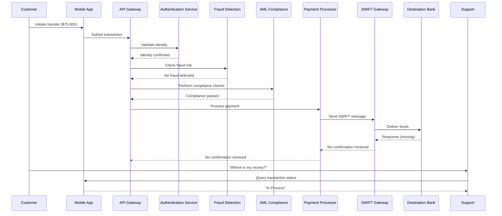

As the diagram shows, the transaction appeared to proceed successfully through the initial stages, with confirmations from authentication, fraud detection, and AML compliance. However, the payment processor showed no record of completion, and the SWIFT gateway logs were inconclusive. Each system maintained its own isolated logs, leaving no unified view of the transaction lifecycle.

Support escalated to operations, triggering a war room involving six different teams. Each team manually analyzed logs from their respective systems, comparing timestamps and events to reconstruct the transaction flow. After over 8 hours of investigation, the teams identified a SWIFT message delivery failure caused by an edge-case timeout. During this time, the customer remained without answers, highlighting the critical visibility gaps and operational inefficiencies caused by fragmented logging in distributed systems.

### SRE Best Practice: Evidence-Based Investigation

Effective distributed systems logging requires a fundamentally different approach focused on transaction continuity rather than isolated system health. SRE teams must implement comprehensive trace context propagation—creating explicit links between logs across system boundaries through correlation identifiers. This investigation approach shifts from system-centric to transaction-centric analysis, ensuring clear visibility into the entire transaction journey.

#### Checklist: Five Steps for Evidence-Based Investigation

1. **Establish a Transaction Identifier**\
   Start by identifying a clear transaction identifier from customer-facing systems to anchor the investigation.

2. **Trace the Full Transaction Path**\
   Use the transaction identifier to follow the transaction across all systems and services it traversed.

3. **Locate the Last Confirmed Checkpoint**\
   Identify the final confirmed point in the transaction's journey to narrow down potential problem areas.

4. **Verify Transition Points**\
   Examine service boundaries for failures in context propagation or correlation identifier continuity.

5. **Analyze Timing Patterns**\
   Investigate timing behaviors to detect synchronization, latency, or timeout issues across service boundaries.

Organizations adopting transaction-centric observability report significant operational improvements. Financial institutions have achieved 70-85% reductions in mean-time-to-resolution for complex distributed issues. For example, National Bank implemented distributed tracing for their payment systems and reduced the average resolution time for cross-service issues from 4.2 hours to just 38 minutes—a 6.6x improvement in troubleshooting efficiency.

### Banking Impact

The business consequences of poor distributed visibility extend far beyond technical incidents. The table below summarizes five key impacts, alongside quantitative insights to illustrate the severity of these challenges:

| **Consequence** | **Description** | **Quantitative Insight** |
| ---------------------------- | ---------------------------------------------------------------------------------------------------------------- | ------------------------------------------------------------------------------------------------------------------------------------------- |
| **Direct Revenue Impact** | Transaction failures without clear diagnostic paths often result in abandonment. | Each 1% of failed high-value transfers represents approximately $3.8M in lost fee revenue annually for Global Bank. |
| **Customer Trust Erosion** | When banks cannot quickly locate and resolve transaction issues, customer confidence deteriorates. | 67% of customers who experience a "lost transaction" with poor visibility reduce their banking relationship within 12 months. |
| **Operational Inefficiency** | Multi-team investigations without clear transactional visibility require significantly more effort. | Distributed transaction investigations involve 4-6x more personnel hours compared to systems with proper observability. |
| **Regulatory Exposure** | Financial regulations demand complete transaction audit trails, which fragmented logging often fails to provide. | Non-compliance fines for missing transaction lifecycle data can range into millions, depending on the jurisdiction. |
| **Support Escalation** | Issues without clear visibility drive higher escalation rates across support tiers. | First-line support resolves only 23% of distributed transaction issues without proper observability, versus 78% with comprehensive tracing. |

This lack of distributed visibility not only disrupts operational efficiency but also jeopardizes customer trust, regulatory compliance, and revenue stability—key pillars of modern banking success. Addressing these challenges requires a paradigm shift in logging and observability strategies.

### Implementation Guidance

To implement effective distributed systems logging for banking transactions:

1. **Implement Correlation ID Generation**: Create a standardized approach for generating unique transaction identifiers at customer-facing entry points. Use UUID v4 or similar algorithms to ensure global uniqueness. For example, in a Node.js-based API gateway:

   ```javascript
   const { v4: uuidv4 } = require('uuid');

   function generateCorrelationId(req, res, next) {
       const correlationId = req.headers['x-correlation-id'] || uuidv4();
       req.correlationId = correlationId;
       res.setHeader('X-Correlation-ID', correlationId);
       next();
   }

   app.use(generateCorrelationId);
   ```

   This ensures that every incoming request has a globally unique correlation ID, which is passed downstream.

2. **Establish Propagation Standards**: Define explicit standards for how correlation IDs must be propagated across different interface types (HTTP headers, message properties, database fields). For example:

   - **HTTP Headers**: Use a standard header like `X-Correlation-ID` to propagate the ID between services.
   - **Message Queues**: Include the correlation ID in message metadata, e.g., `message.properties.correlationId`.
   - **Databases**: Store the correlation ID in a dedicated column for tracing transaction records.

3. **Modify Instrumentation**: Update application code and configuration to capture and pass correlation context across all service boundaries. For example, when invoking downstream APIs in Python:

   ```python
   import requests

   def make_request_with_correlation_id(url, correlation_id):
       headers = {'X-Correlation-ID': correlation_id}
       response = requests.get(url, headers=headers)
       return response
   ```

   This ensures that correlation IDs flow seamlessly between services.

4. **Implement Boundary Adapters**: For legacy systems that cannot be modified to propagate context natively, create adapter components. For example, in a middleware that bridges legacy services:

   ```java
   public class CorrelationIdAdapter {
       public static void addCorrelationId(Message message, String correlationId) {
           if (message.getHeaders().get("X-Correlation-ID") == null) {
               message.getHeaders().put("X-Correlation-ID", correlationId);
           }
       }
   }
   ```

   This adapter ensures that correlation IDs are injected into messages before they reach legacy systems.

5. **Deploy Centralized Collection**: Implement a unified logging platform (e.g., ELK Stack, Splunk) that aggregates distributed logs while maintaining relationship context. Use log formatters to include correlation IDs in every log entry. For instance, in a Java application:

   ```java
   MDC.put("correlationId", correlationId);
   logger.info("Processing transaction for customer");
   MDC.clear();
   ```

   This approach ensures that logs from all services can be queried and correlated by transaction ID.

6. **Create Transaction-Centric Visualization**: Develop dashboards and query interfaces that organize logs by transaction rather than by system. For example, use a query like:

   ```
   SELECT * FROM logs WHERE correlation_id = '123e4567-e89b-12d3-a456-426614174000'
   ```

   This provides a clear, end-to-end view of the transaction's journey.

7. **Develop Transaction Timeline Reconstruction**: Implement tooling or scripts to automatically reconstruct the complete sequence of events for a transaction ID. For example, using a centralized logging platform with a query language:

   ```
   SORT BY timestamp
   WHERE correlation_id = '123e4567-e89b-12d3-a456-426614174000'
   ```

   This generates a chronological view of the transaction's lifecycle.

8. **Train Operations Teams**: Conduct structured training to shift troubleshooting mindsets from system-centric to transaction-centric approaches. Use practical exercises like simulating cross-boundary transaction failures and guiding teams to trace issues using correlation IDs.

By combining these steps with consistent implementation, teams can achieve robust observability and significantly reduce the complexity of troubleshooting distributed systems.

## Panel 2: The Correlation Identity - Digital Transaction DNA

### Scene Description

A financial services observability platform where engineers implement a correlation ID strategy. Interactive diagrams illustrate how unique identifiers flow through distributed systems, enabling end-to-end transaction tracing. The flow begins at the customer gateway, where the correlation ID is generated, and continues through various system components: propagated through HTTP headers between microservices, preserved in message queue properties during asynchronous operations, maintained through database transactions, and passed to external partner systems via API fields. A real-time demonstration follows a high-value international payment from mobile initiation through final settlement, highlighting how the correlation ID connects log entries across over twenty different services spanning multiple data centers and technology stacks.

Below is a visual representation of this flow using a sequence diagram:

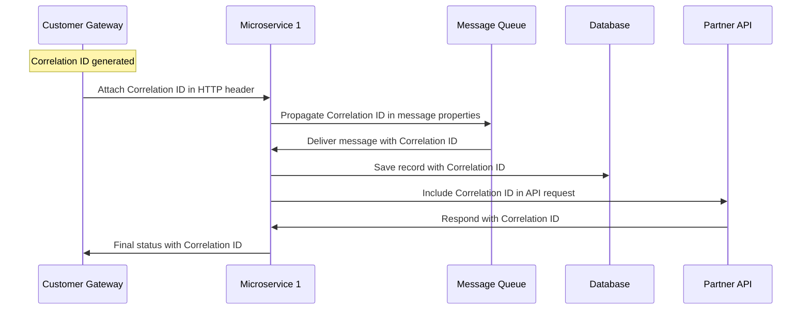

This sequence diagram visually conveys how the correlation ID is consistently propagated, preserved, and utilized throughout the distributed system during the transaction lifecycle. It ensures that every system interaction is traceable, supporting seamless troubleshooting and observability.

### Teaching Narrative

Correlation identities serve as the digital DNA of transactions—uniquely identifying and connecting related events across distributed systems boundaries. This simple yet powerful concept transforms isolated log fragments into coherent transaction narratives by establishing explicit relationships between otherwise disconnected entries.

Think of a correlation ID as the courier tracking number for a digital transaction. Just as a tracking number follows a package from the sender to the recipient, recording every handoff and checkpoint along the way, a correlation ID follows a transaction through its entire lifecycle in a distributed system. It allows engineers to trace the "route" of a transaction, understand where it has been, identify any delays or failures, and ensure it reaches its final destination successfully. Without this tracking number, trying to piece together the journey of a transaction is like hunting for a lost package without knowing where it was last seen.

In banking architectures, where operations routinely span dozens of services, correlation IDs enable critical observability capabilities: end-to-end transaction tracing from initiation to completion, unambiguous grouping of related events regardless of timing or location, and clear service dependency mapping showing exactly how components interact. Effective implementation requires several key components: generation strategies creating globally unique identifiers (typically UUIDs or similar formats), propagation mechanisms that maintain the identifier across system boundaries, preservation patterns ensuring the ID survives asynchronous operations and persistence, standardized logging inclusion that embeds the identifier in every relevant log entry, and centralized collection that leverages these identifiers for analysis.

For financial transactions where visibility directly impacts both operational capability and customer experience, this correlation foundation is essential—without it, troubleshooting becomes archaeological guesswork rather than systematic analysis. When a customer reports a missing payment, correlation IDs allow immediate identification of exactly where the transaction succeeded or failed across its complete journey, reducing resolution time from hours to minutes while providing transparent status for customer communication.

### Common Example of the Problem

Metropolis Credit Union implemented a new mobile deposit feature allowing customers to deposit checks by taking photos. A business customer deposited a $25,000 check that appeared to be accepted by the mobile app but never appeared in their account balance. When they called customer service, the representative could see the deposit was initiated but had no visibility into its current status.

Behind the scenes, the transaction had disappeared in the complex flow between systems: the mobile app passed the check image to an API gateway, which routed it to an image validation service, then to OCR processing for amount verification, to a risk scoring engine for fraud analysis, to a check processing service, and finally to the core banking system for posting. Each step generated isolated logs with no connecting thread between them. Support teams could see fragments of activity but couldn't determine if the check failed image validation, was flagged for fraud, encountered a processing error, or was lost in transmission between systems.

Without a correlation identifier linking these events, teams manually compared timestamps and available metadata attempting to piece together what happened. The investigation required six team members from different departments and took over 4 hours to resolve - eventually discovering that the check image passed validation but was rejected by the fraud detection system without proper notification back to the customer-facing systems.

#### Transaction Flow and Failure Example

Below is a simplified representation of the transaction flow and where the failure occurred:

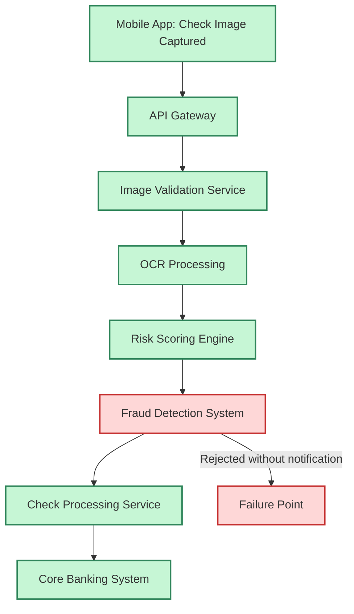

This diagram highlights the journey of the transaction, with each system playing a critical role. The failure occurred at the **Fraud Detection System**, which rejected the check but failed to notify downstream systems or the customer-facing application. Without correlation IDs, connecting these isolated logs into a single narrative was a time-consuming, multi-team effort.

A properly implemented correlation ID strategy would have provided a comprehensive view of the transaction's path, quickly pinpointing the rejection at the fraud detection stage and reducing resolution time from hours to minutes.

### SRE Best Practice: Evidence-Based Investigation

Effective correlation identity implementation requires a comprehensive approach that ensures continuity across all system boundaries. The evidence-based investigation strategy should:

1. **Establish a Standardized Correlation ID Format**

   - Use a format with sufficient entropy to ensure global uniqueness, such as UUID v4.
   - Avoid formats requiring central coordination to minimize complexity and overhead.

2. **Implement Consistent Generation Practices**

   - Ensure every transaction entry point generates a unique identifier at its origin.
   - Apply this consistently across customer gateways, APIs, and other entry interfaces.

3. **Define Explicit Propagation Mechanisms**

   - Clearly document how correlation IDs are passed through each system boundary:
     - **HTTP interfaces**: Use standardized headers (e.g., `X-Correlation-ID`).
     - **Message queues**: Include correlation context in message properties.
     - **Database operations**: Add correlation fields in relevant tables.
     - **Batch processes**: Include identifiers in file naming conventions or metadata.

4. **Create Visibility into Correlation Flows**

   - Verify that correlation IDs are successfully propagated across all system boundaries.
   - Use logging and monitoring tools to track and validate identifier continuity.

5. **Integrate with Centralized Logging and Monitoring**

   - Embed correlation IDs in every log entry.
   - Leverage centralized tools to aggregate and analyze logs using correlation identifiers for end-to-end transaction tracing.

#### Checklist for Implementing Correlation IDs

To ensure a robust correlation identity strategy, follow this actionable checklist:

- [ ] Define a globally unique correlation ID format (e.g., UUID v4).
- [ ] Implement correlation ID generation at all transaction entry points.
- [ ] Document propagation mechanisms for:
  - [ ] HTTP headers (e.g., `X-Correlation-ID`).
  - [ ] Message queue properties.
  - [ ] Database fields.
  - [ ] Batch file metadata.
- [ ] Validate propagation of correlation IDs across all system boundaries.
- [ ] Embed correlation IDs in log entries for all systems and services.
- [ ] Set up centralized logging and monitoring tools to utilize correlation IDs for troubleshooting.
- [ ] Test the end-to-end visibility of correlation IDs with sample transactions.
- [ ] Train engineers on the importance and usage of correlation IDs for observability.

______________________________________________________________________

Analysis of organizations implementing comprehensive correlation identities shows dramatic improvements in troubleshooting efficiency. Financial technology companies report 65-80% reductions in mean-time-to-resolution for distributed transaction issues after implementing correlation IDs. For example, Eastern Trust's implementation of correlation IDs across their digital banking platform reduced average incident resolution time from 164 minutes to 37 minutes—a 77% improvement in operational efficiency.

### Banking Impact

The business consequences of implementing correlation identities extend throughout banking operations:

1. **Incident Resolution Efficiency**: Banks implementing comprehensive correlation strategies report 70-85% reductions in troubleshooting time for cross-service incidents, directly impacting customer experience during issues.

2. **Customer Support Transparency**: Service representatives with correlation-enabled visibility can provide accurate status information immediately rather than escalating 80-90% of distributed transaction inquiries.

3. **Revenue Protection**: Each percentage point improvement in transaction completion rates typically represents millions in preserved revenue for large banking operations. Correlation strategies improve completion rates by enabling faster intervention in failed transactions.

4. **Regulatory Compliance**: Financial regulations require complete audit trails for transactions. Correlation identities enable compliance with requirements to demonstrate full transaction lineage across systems.

5. **Operational Cost Reduction**: Multi-team investigations without correlation context typically involve 4-6 times more personnel hours than properly correlated systems, creating substantial operational savings.

### Implementation Guidance

To implement effective correlation identities for distributed banking systems:

1. **Define Your Correlation Strategy**: Create comprehensive standards for correlation ID format, generation practices, propagation mechanisms for different interface types, and inclusion requirements in logs.

2. **Implement Entry Point Generation**: Modify customer-facing systems to generate correlation IDs at transaction initiation points, using UUID v4 or similar algorithms to ensure uniqueness without coordination.

   ```python
   import uuid

   def generate_correlation_id():
       return str(uuid.uuid4())

   # Example usage at transaction initiation
   correlation_id = generate_correlation_id()
   print(f"Generated Correlation ID: {correlation_id}")
   ```

3. **Develop Propagation Patterns**: Implement standardized mechanisms for correlation propagation across different interface types:

   - HTTP services: Use standard headers (e.g., `X-Correlation-ID`).

     ```python
     from flask import Flask, request, g

     app = Flask(__name__)

     @app.before_request
     def propagate_correlation_id():
         correlation_id = request.headers.get('X-Correlation-ID', generate_correlation_id())
         g.correlation_id = correlation_id
     ```

   - Message queues: Add correlation properties to messages.

     ```python
     import pika

     def publish_message_with_correlation(channel, queue_name, message, correlation_id):
         properties = pika.BasicProperties(correlation_id=correlation_id)
         channel.basic_publish(exchange='', routing_key=queue_name, body=message, properties=properties)
     ```

   - Database operations: Include correlation columns.

     ```sql
     ALTER TABLE transactions ADD COLUMN correlation_id VARCHAR(36);

     INSERT INTO transactions (transaction_id, amount, correlation_id)
     VALUES ('txn_123', 100.00, '123e4567-e89b-12d3-a456-426614174000');
     ```

   - Batch interfaces: Embed in filenames or metadata.

     ```
     batch_file_123e4567-e89b-12d3-a456-426614174000.csv
     ```

4. **Enhance Logging Frameworks**: Modify logging configurations across all services to automatically include correlation identifiers in every log entry when present in the execution context.

   ```python
   import logging

   logging.basicConfig(format='%(asctime)s - %(levelname)s - %(correlation_id)s - %(message)s')
   logger = logging.getLogger()

   def log_with_correlation(correlation_id, message):
       extra = {'correlation_id': correlation_id}
       logger.info(message, extra=extra)
   ```

5. **Create Boundary Adapters**: For systems that cannot be directly modified (legacy, third-party), implement adapter components that preserve correlation context across integration boundaries.

   Example: A proxy service that injects or reads `X-Correlation-ID` headers when interacting with a legacy system.

6. **Deploy Correlation-Aware Collection**: Implement logging infrastructure that understands correlation relationships, enabling transaction-centric rather than service-centric views.

   ```
   Correlation Flow:
   [User -> Gateway -> Service A -> Queue -> Service B -> Database]
   ```

7. **Implement Verification Monitoring**: Create observability tools that detect correlation breaks across system boundaries, alerting when transaction context is lost between services.

   ```mermaid
   sequenceDiagram
       participant User
       participant Gateway
       participant ServiceA
       participant ServiceB
       participant Database

       User->>Gateway: Initiate Transaction (X-Correlation-ID)
       Gateway->>ServiceA: Forward Request (X-Correlation-ID)
       ServiceA->>ServiceB: Publish Message (correlation_id)
       ServiceB->>Database: Write Entry (correlation_id)
   ```

## Panel 3: The Propagation Patterns - Maintaining Context Across Boundaries

### Scene Description

A banking platform architecture review where engineers analyze correlation propagation mechanisms across different interface types. The review explores the flow of correlation IDs across various boundaries within the system:

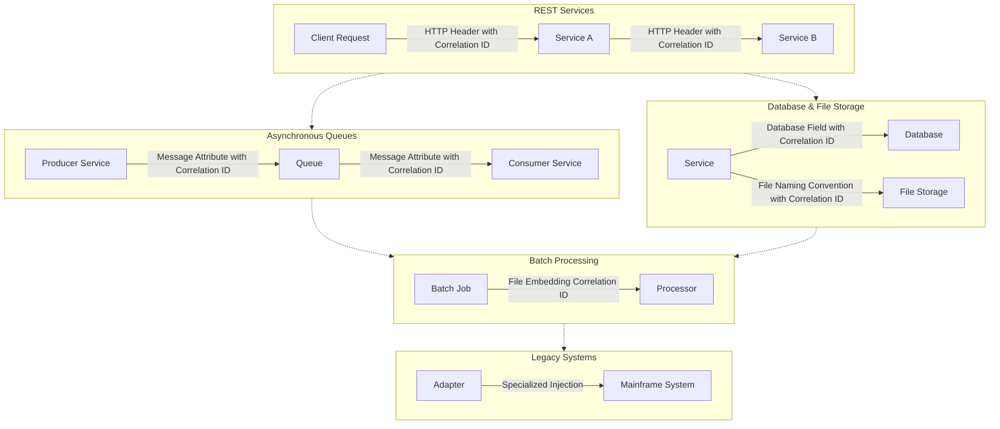

Technical diagrams like the one above detail implementation patterns for diverse boundaries: HTTP headers carrying correlation IDs between REST services, message attributes preserving context in asynchronous queues, database fields maintaining identifiers during storage operations, file naming conventions embedding context in batch processes, and specialized adapters injecting identifiers into legacy mainframe transactions. Implementation code examples show precise propagation techniques for different technologies, while gap analysis highlights integration points requiring enhanced correlation solutions—particularly around third-party services and batch processing boundaries.

### Teaching Narrative

Propagation patterns address the most challenging aspect of distributed tracing—maintaining correlation context across the diverse technical boundaries that exist in modern banking platforms. While correlation IDs provide the conceptual foundation for transaction tracing, their effectiveness depends entirely on reliable propagation across every system boundary the transaction traverses. This challenge grows exponentially with architectural complexity, requiring specialized approaches for different interface types: HTTP-based propagation using standardized headers to carry context between RESTful services, message-based propagation embedding identifiers in queue messages and topics for asynchronous operations, storage-based propagation preserving context in database records or file structures for persisted operations, batch-processing propagation maintaining context across scheduled operations and file transfers, and legacy integration using specialized techniques to inject context into systems with limited extensibility. For banking platforms spanning technology generations from mainframes to microservices, comprehensive propagation requires strategic design—addressing not just obvious integration points but subtle boundaries where context is often lost. Particularly challenging areas include third-party services with limited extensibility, scheduled batch operations that break request flows, file-based interfaces lacking standardized context fields, and legacy systems designed without distributed tracing concepts. Effective propagation strategies implement defense-in-depth approaches: using multiple redundant mechanisms to preserve context, implementing verification to detect propagation failures, and creating recovery techniques to reconstruct correlation when explicit propagation wasn't possible. These patterns collectively create the continuous thread that connects distributed logs into coherent transaction narratives.

### Common Example of the Problem

Continental Bank recently experienced a critical issue with their corporate loan origination system. A $50 million commercial real estate loan application disappeared between systems after the initial approval. The loan officer could see the application was submitted and approved in the front-end system, but the loan never appeared for the documentation team to process.

Investigation revealed a complex propagation failure across multiple system boundaries. The loan origination flow traversed multiple distinct interface types: RESTful services for the initial application, message queues for credit decisioning, database operations for approval storage, a batch file transfer for document generation, and SOAP web services for integration with the core banking system. While the transaction had a correlation ID initially, it was lost during the batch file transfer process when the nightly job extracted approved loans but failed to preserve the correlation context in the generated files.

To better illustrate the propagation failure, the transaction flow is summarized below:

```mermaid
graph TD
    A[Front-End System] -->|REST (Correlation ID: 12345)| B[Credit Decisioning]
    B -->|Message Queue (Correlation ID: 12345)| C[Approval Storage]
    C -->|Batch File Transfer (Lost Correlation ID)| D[Document Generation]
    D -->|SOAP| E[Core Banking System]

    subgraph Context Preservation
        direction LR
        A --> B --> C
    end

    subgraph Context Lost
        direction LR
        C --> D --> E
    end
```

As shown in the flow, the correlation ID (`12345`) was preserved across the RESTful services, message queues, and database operations but was lost during the batch file transfer. Without consistent context propagation, there was no way to trace the loan's journey end-to-end. The batch process became a "correlation black hole" where transaction context disappeared.

The investigation required assembling a cross-functional team and manually reconciling timestamps and loan details across system boundaries. After 3 days of effort, the team discovered that the loan application had been extracted by the batch process but failed validation in subsequent steps. Without correlation, the error could not be linked back to the original application, leaving the issue unresolved until manual intervention identified the root cause.

### SRE Best Practice: Evidence-Based Investigation

Effective propagation patterns require comprehensive strategies tailored to each interface type in the architecture. An evidence-based investigation approach ensures that all critical boundaries are accounted for and that propagation mechanisms are robust. Use the following checklist to guide your investigation:

#### Checklist for Evidence-Based Investigation:

1. **Map Transaction Boundaries**:

   - Identify all system boundaries where correlation context must propagate.
   - Include diverse interface types such as REST APIs, message queues, databases, file systems, and legacy systems.

2. **Define Propagation Mechanisms for Each Interface Type**:

   - **HTTP Interfaces**: Standardize on specific header names (e.g., `X-Correlation-ID`) for context propagation.
   - **Message Queues**: Use consistent property names for embedding correlation data in message attributes.
   - **Database Operations**: Add correlation columns to relevant tables to preserve context during persistence.
   - **File Transfers**: Define metadata standards or naming conventions to include correlation information.
   - **Third-Party APIs**: Document and align on correlation field requirements when integrating with external services.

3. **Verify Propagation at Critical Boundaries**:

   - Implement automated checks to detect and alert on context loss during boundary crossings.
   - Use distributed tracing tools to validate end-to-end correlation continuity.

4. **Establish Recovery Mechanisms for Context Loss**:

   - Design fallback strategies to reconstruct correlation for systems where direct propagation isn't feasible.
   - Incorporate logging patterns that support downstream correlation reconstruction.

5. **Monitor and Continuously Improve**:

   - Regularly review system boundaries for new integration points or architectural changes.
   - Analyze logs and metrics to identify gaps in propagation effectiveness.

#### Evidence of Impact:

Organizations implementing comprehensive propagation strategies across all boundary types report substantial improvements in transaction visibility and operational efficiency. For example:

- Financial institutions with mature propagation implementations show **60-70% reductions in mean-time-to-resolution (MTTR)** for multi-system issues.
- Midwest Financial Group achieved a **75% improvement in cross-system incident resolution time**, reducing the average from 4.8 hours to 1.2 hours after standardizing propagation patterns across their retail banking platform.

By following this checklist, SREs can ensure that correlation context is reliably maintained across all system boundaries, enabling faster issue resolution and improved observability in complex architectures.

### Banking Impact

The business consequences of implementing comprehensive propagation patterns include:

1. **Transaction Completion Reliability**: Banks report 3-5% improvements in straight-through processing rates after implementing consistent propagation patterns, directly impacting revenue and customer experience.

2. **Regulatory Compliance**: Financial regulations increasingly require complete transaction traceability. Context propagation enables banks to demonstrate full audit trails across system boundaries.

3. **Operational Efficiency**: Cross-team investigations become dramatically more efficient with complete transaction context. Financial institutions report 65-80% reductions in personnel hours required for complex incident resolution.

4. **Customer Experience Improvement**: Service representatives with full transaction visibility can provide immediate status information without research delays. Banks report 40-60% reductions in resolution time for customer inquiries involving multiple systems.

5. **Product Development Acceleration**: Development teams with clear propagation patterns can create new banking products more quickly by leveraging existing observability infrastructure rather than building custom tracking for each new service.

### Implementation Guidance

To implement effective context propagation across banking system boundaries:

1. **Create a Boundary Inventory**: Document all integration points in your architecture where transactions cross between systems, categorizing them by interface type (HTTP, messaging, database, file transfer, third-party API).

2. **Define Propagation Standards by Type**: Establish specific implementation standards for each interface category:

   - HTTP: Standardize on specific header names (e.g., `X-Correlation-ID`, `X-Transaction-ID`).
   - Messaging: Define standard property/attribute names for correlation data (e.g., `correlationId`, `transactionId`).
   - Database: Implement correlation columns with consistent naming conventions (e.g., `correlation_id`, `transaction_id`).
   - Files: Create naming conventions or metadata standards for correlation (e.g., `batch_<correlation_id>.csv`).

3. **Implement Service-to-Service Propagation**: Modify RESTful services to automatically extract correlation IDs from incoming requests and inject them into outgoing calls using standardized HTTP headers. Example:

   ```java
   // Example: Extracting and injecting correlation ID in a Spring Boot REST service
   @RestController
   public class TransactionController {

       @Autowired
       private RestTemplate restTemplate;

       @GetMapping("/process")
       public ResponseEntity<String> processTransaction(HttpServletRequest request) {
           String correlationId = request.getHeader("X-Correlation-ID");
           if (correlationId == null) {
               correlationId = UUID.randomUUID().toString();
           }

           HttpHeaders headers = new HttpHeaders();
           headers.set("X-Correlation-ID", correlationId);

           HttpEntity<String> entity = new HttpEntity<>(headers);
           return restTemplate.exchange("http://downstream-service/api", HttpMethod.GET, entity, String.class);
       }
   }
   ```

4. **Enhance Messaging Infrastructure**: Update message producers to include correlation context in message attributes/properties and configure consumers to extract and propagate this context to downstream systems. Example:

   ```java
   // Example: Adding correlation ID to a Kafka message
   ProducerRecord<String, String> record = new ProducerRecord<>("topic-name", key, value);
   record.headers().add("correlationId", correlationId.getBytes(StandardCharsets.UTF_8));
   kafkaProducer.send(record);
   ```

   ```java
   // Example: Extracting correlation ID in a Kafka consumer
   @KafkaListener(topics = "topic-name", groupId = "group-id")
   public void consumeMessage(ConsumerRecord<String, String> record) {
       String correlationId = new String(record.headers().lastHeader("correlationId").value(), StandardCharsets.UTF_8);
       // Use correlationId for downstream operations
   }
   ```

5. **Develop Storage Propagation**: Implement database designs that include correlation fields in relevant tables, ensuring context preservation during persistence operations. Example:

   ```sql
   -- Example: Adding correlation ID to a database table
   CREATE TABLE transactions (
       id SERIAL PRIMARY KEY,
       amount DECIMAL(10, 2),
       correlation_id VARCHAR(36) NOT NULL,
       created_at TIMESTAMP DEFAULT CURRENT_TIMESTAMP
   );
   ```

6. **Create Batch Processing Adapters**: Develop mechanisms for maintaining correlation context across batch operations through file naming conventions, metadata fields, or related control records. Example:

   ```python
   # Example: Appending correlation ID to a batch file name
   import uuid

   correlation_id = str(uuid.uuid4())
   file_name = f"batch_{correlation_id}.csv"
   with open(file_name, "w") as file:
       file.write("example data")
   ```

7. **Build Legacy System Integration**: For mainframe and legacy systems, implement adapter components that translate modern correlation identifiers into formats compatible with older technologies. Example:

   ```java
   // Example: Mainframe adapter appending correlation ID to a fixed-width message format
   public String buildLegacyRequest(String correlationId, String transactionData) {
       return String.format("%-36s%-100s", correlationId, transactionData);
   }
   ```

8. **Deploy Propagation Monitoring**: Implement verification checks that detect broken correlation chains across system boundaries, alerting when transaction context is lost. Example:

   ```java
   // Example: Verifying correlation ID propagation in a log filter
   @Component
   public class CorrelationIdFilter implements Filter {
       @Override
       public void doFilter(ServletRequest request, ServletResponse response, FilterChain chain) throws IOException, ServletException {
           HttpServletRequest httpRequest = (HttpServletRequest) request;
           String correlationId = httpRequest.getHeader("X-Correlation-ID");
           if (correlationId == null) {
               throw new ServletException("Missing correlation ID");
           }
           chain.doFilter(request, response);
       }
   }
   ```

## Panel 4: The Causality Challenge - Understanding Event Ordering

### Scene Description

A financial trading platform incident investigation unfolds as engineers analyze a complex sequence of events leading to failed trades. The investigation highlights the causality challenge: timestamps from different systems show conflicting event ordering due to clock differences, asynchronous operations create non-intuitive execution sequences, and parallel processing paths execute simultaneously rather than sequentially.

The team illustrates the issue using a simplified timeline:

```
System A (Clock Skewed)         System B (Accurate Clock)
| Event A1 (10:02:01)           | Event B1 (10:02:00)
|                               | Event B2 (10:02:02)
| Event A2 (10:02:03)           | Event B3 (10:02:04)
```

From the wall-clock perspective, Event A1 appears to occur after Event B1 but before Event B2. However, the actual causal relationships between these events are unclear due to clock differences and asynchronous operations.

To uncover the true sequence, the team demonstrates their causality tracking implementation:

- **Vector Clocks** establish happens-before relationships:
  ```
  Event A1 → Event B1 → Event A2 → Event B3
  ```
- **Logical Sequence Tracking** ensures operations are ordered independently of physical time.
- **Causal Chain Visualization** reconstructs true dependencies, as shown below:

```
+---------------------------+
| Start Validation Process  |
+---------------------------+
         |
         v
  +--------------------+      +--------------------+
  | Order Validated A1 | ---> | Order Processed B1 |
  +--------------------+      +--------------------+
         |                          |
         v                          v
  +--------------------+      +--------------------+
  | Risk Check A2      | ---> | Finalize Trade B3  |
  +--------------------+      +--------------------+
```

This enhanced understanding immediately reveals that what appeared to be a random failure was actually a race condition in order validation, occurring only under specific timing circumstances. The visualized causal chain provides clarity, showing the true sequence of operations regardless of unreliable timestamps.

### Teaching Narrative

The causality challenge extends distributed tracing beyond simple correlation to establish meaningful event ordering—answering not just "which events are related" but "what actually happened in what order." This dimension becomes critical in complex banking systems where timing and sequence directly impact transaction correctness and compliance. Traditional logging relies primarily on timestamps to establish ordering, creating fundamental limitations in distributed environments: system clock variations creating apparent sequence irregularities, network latency introducing timing distortions, asynchronous operations breaking direct call-response relationships, and parallel processing creating simultaneous rather than sequential execution. These factors make timestamp-based ordering unreliable for understanding true causality—particularly problematic in financial systems where exact sequence often determines transaction validity and regulatory compliance.

To highlight the differences and benefits of advanced causality tracking mechanisms over traditional timestamp-based logging, the table below provides a clear comparison:

| **Aspect** | **Traditional Timestamp-Based Logging** | **Advanced Causality Tracking Mechanisms** |
| --------------------------- | ---------------------------------------------------------------------------- | ------------------------------------------------------------------------------------------ |
| **Event Ordering Basis** | Relies on system clock timestamps, prone to variations. | Uses logical clocks, vector timestamps, or sequence identifiers for consistent ordering. |
| **Handling Clock Skew** | Susceptible to clock drift and synchronization issues. | Independent of physical clocks, eliminating skew-related inconsistencies. |
| **Asynchronous Operations** | Struggles to maintain call-response relationships across asynchronous flows. | Tracks causal dependencies explicitly, preserving relationships across asynchronous paths. |
| **Parallel Processing** | Cannot differentiate simultaneous events accurately. | Establishes happens-before relationships, identifying true execution order. |
| **Causal Relationships** | Implicit and inferred, often unclear. | Explicitly defined through parent-child hierarchies and causal chains. |
| **Visualization** | Limited to raw timestamp logs, requiring manual interpretation. | Enables detailed causal chain visualization for intuitive understanding of dependencies. |
| **Use Case Suitability** | Sufficient for basic systems with minimal concurrency. | Essential for distributed systems with complex interactions and strict timing needs. |

For trading platforms and payment systems where milliseconds matter and sequence determines validity, these advanced capabilities transform troubleshooting from confusing timestamp analysis to clear causal understanding—revealing race conditions, timing dependencies, and ordering issues that timestamp-based analysis would miss entirely. Through mechanisms like logical clocks, vector timestamps, and causal visualization, engineers gain a precise understanding of the true sequence of events, enabling faster and more accurate resolution of complex issues.

### Common Example of the Problem

Empire Trading, a major investment bank, experienced a critical incident when their algorithmic trading platform executed a series of unexpected trades, resulting in a $3.2 million loss. The incident occurred during market volatility following an economic announcement, when trade volumes were at peak levels.

Initial investigation was severely hampered by causality confusion. Logs from the order management system, market data processors, risk evaluation engines, and execution services all contained relevant events, but with conflicting timestamps that created an impossible sequence: risk approvals appeared to happen after trades executed, market data updates seemed to arrive after decisions based on them were made, and order submissions showed timestamps later than their confirmations.

To illustrate the issue, consider the following timeline of events reconstructed from the logs:

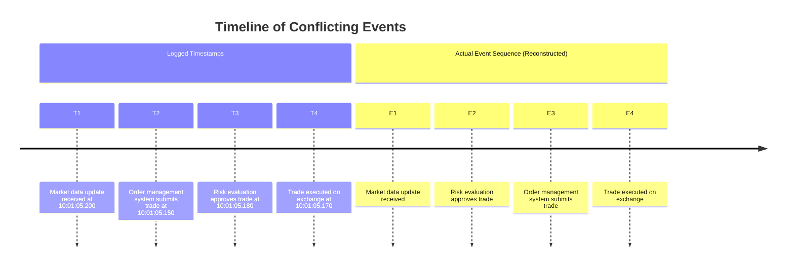

This timestamp chaos made it impossible to determine the actual sequence of events. Was this a market data issue where stale prices triggered incorrect trading decisions? A risk system failure that allowed invalid trades? A timing issue in the order execution pathway? Or a legitimate algorithm response to rapidly changing conditions?

The investigation team spent over 18 hours manually trying to reconstruct the actual sequence of operations across multiple distributed systems with clock differences of 20-200ms between them—a critical gap when market movements happen in milliseconds.

Eventually, the root cause was identified: a race condition between market data processing and risk evaluation. However, this discovery came too late to prevent substantial financial loss and required a painstaking, manual effort to untangle the causality confusion.

### SRE Best Practice: Evidence-Based Investigation

Effective causality tracking in distributed financial systems requires approaches that go beyond simple timestamps. Evidence-based investigation should implement:

1. **Logical clock mechanisms**: Establish happens-before relationships between events independent of physical timestamps.

2. **Vector clock implementations**: Maintain causal history across component boundaries in distributed systems.

3. **Sequence identifier frameworks**: Explicitly number operations within a transaction flow to track execution order.

4. **Parent-child relationship tracking**: Establish clear invocation hierarchies across distributed services.

5. **Time synchronization protocols**: Use protocols like NTP or PTP with strict drift limits for systems where absolute timing is critical.

6. **Causal visualization tooling**: Reconstruct actual operation sequences, allowing teams to identify true dependencies and isolate timing-related issues.

#### Checklist for Evidence-Based Investigation

- [ ] Use logical clocks to establish causal relationships.
- [ ] Implement vector clocks to track cross-component event dependencies.
- [ ] Assign sequence identifiers to all operations within a transaction flow.
- [ ] Track parent-child relationships to understand invocation hierarchies.
- [ ] Enforce strict time synchronization protocols for accurate event timing.
- [ ] Leverage causal visualization tools to reveal hidden race conditions and timing dependencies.

#### Example: Vector Clock Implementation in Python

Below is a simplified example of a vector clock implementation to track causal relationships across nodes:

```python
class VectorClock:
    def __init__(self, node_id):
        self.node_id = node_id
        self.clock = {}

    def increment(self):
        self.clock[self.node_id] = self.clock.get(self.node_id, 0) + 1

    def update(self, received_clock):
        for node, timestamp in received_clock.items():
            self.clock[node] = max(self.clock.get(node, 0), timestamp)
        self.increment()

    def get_clock(self):
        return self.clock

# Example usage:
node_a = VectorClock("A")
node_b = VectorClock("B")

# Node A increments its clock
node_a.increment()

# Node B receives a message from A and updates its clock
node_b.update(node_a.get_clock())

print("Node A Clock:", node_a.get_clock())
print("Node B Clock:", node_b.get_clock())
```

By implementing these best practices, organizations have reported significant improvements in root cause identification and resolution times. For example, Atlantic Securities' adoption of vector clock-based causality tracking in their trading infrastructure reduced the average resolution time for timing-related incidents from 7.2 hours to 1.8 hours—a 75% improvement in investigative efficiency.

### Banking Impact

The business consequences of implementing causality-aware distributed logging include:

1. **Financial Risk Reduction**: Trading platforms report 60-80% faster identification of race conditions and timing-related issues, significantly reducing financial exposure during incidents. For high-frequency trading operations, each minute of improved detection can represent millions in avoided losses.

2. **Regulatory Compliance**: Financial regulations require demonstrable proof of transaction sequence for audit and risk management. Causality tracking enables definitive evidence of operation ordering regardless of timestamp vagaries.

3. **Root Cause Accuracy**: Banks report 50-70% improvements in root cause identification accuracy for complex distributed issues after implementing causality tracking, reducing repeat incidents through more precise remediation.

4. **Mean-Time-To-Resolution Improvement**: Financial institutions implementing advanced causality tracking report 65-80% reductions in resolution time for timing-sensitive issues across distributed systems.

5. **System Design Improvement**: Clear visibility into actual execution sequences helps engineering teams identify and address design weaknesses in distributed banking systems, progressively improving architecture resilience.

### Implementation Guidance

To implement effective causality tracking for distributed banking systems, follow these steps:

#### Step-by-Step Process

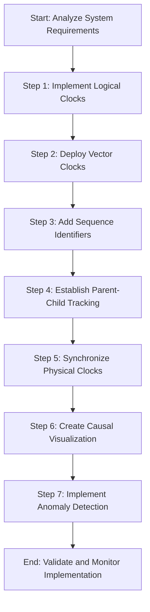

#### Detailed Steps:

1. **Analyze System Requirements**: Begin by understanding the specific needs of your distributed banking system, including transaction flow complexity, timing constraints, and compliance requirements.

2. **Implement Logical Clocks**: Modify service instrumentation to include logical clock mechanisms (e.g., Lamport clocks) that establish happens-before relationships between events independent of wall-clock time.

3. **Deploy Vector Clocks**: For complex distributed systems, implement vector clock mechanisms to maintain causal history across component boundaries, enabling accurate sequence reconstruction regardless of physical timestamps.

4. **Add Sequence Identifiers**: Augment correlation IDs with explicit sequence numbering for operations within a transaction flow, ensuring unambiguous ordering even with asynchronous processing.

5. **Establish Parent-Child Tracking**: Implement request context propagation to maintain parent-child relationships across service boundaries, creating clear invocation hierarchies for distributed operations.

6. **Synchronize Physical Clocks**: Deploy precise time synchronization using mechanisms such as Precision Time Protocol (PTP) for systems where absolute timing is critical. Actively monitor and mitigate clock drift to ensure consistency.

7. **Create Causal Visualization**: Develop visualization tools that reconstruct and display causal chains based on logical relationships rather than timestamp ordering, making it easier to identify and analyze dependencies.

8. **Implement Anomaly Detection**: Deploy monitoring systems that identify causality violations (e.g., effects appearing before causes) and flag potential system issues or observability failures.

9. **Validate and Monitor Implementation**: Continuously validate the accuracy of causality tracking mechanisms and monitor system performance to ensure ongoing reliability and compliance.

## Panel 5: The Standardization Imperative - Common Logging Schemas

### Scene Description

A banking technology governance session unfolds, where platform architects collaborate to establish distributed logging standards for their organization. Documentation displays outline the standardized log schema, which includes:

- **Required Fields**: Correlation identifiers, timestamp formats with explicit timezone handling, severity level standardization, service identification conventions, contextual metadata requirements, and structured formatting specifications.
- **Implementation Guides**: Demonstrating application of these standards across diverse technology stacks—from cloud-native Java services to legacy COBOL systems—with specialized adapters ensuring consistent schema compliance across all platforms.
- **Compliance Dashboards**: Showcasing adoption metrics across the organization, with visible correlations between standardization compliance and reduced MTTR for cross-service incidents.

Below is a conceptual overview of the schema's components and their relationships:

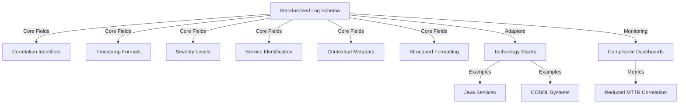

This visual representation highlights how the core fields form the foundation of the schema, ensuring consistent logging practices across varied systems. The inclusion of adapters bridges the gap between technology stacks, while compliance dashboards provide measurable insights into the standards' effectiveness. By aligning around these standardized practices, the organization achieves a unified observability ecosystem that enhances cross-service incident resolution and operational efficiency.

### Teaching Narrative

Standardization transforms distributed logging from individual component implementations to a coherent observability ecosystem through consistent formats, fields, and practices across organizational boundaries. While correlation IDs enable technical connection between logs, standardization creates semantic understanding by ensuring the same information appears in consistent formats regardless of originating system. Effective standardization addresses multiple dimensions: field naming establishing consistent terminology across services, timestamp formatting ensuring temporal alignment with explicit timezone handling, correlation identification using standardized field names and formats, contextual metadata providing consistent business and technical context, severity level definitions ensuring comparable urgency indicators, and structured formatting enabling reliable machine processing. For financial institutions with complex technology landscapes, this standardization delivers substantial benefits beyond basic correlation—enabling uniform analysis techniques regardless of originating system, consistent filtering and searching across the transaction journey, reliable pattern recognition spanning service boundaries, and automated processing without custom parsing for each log source. The most successful implementations balance prescriptive standardization with practical flexibility: establishing non-negotiable core standards for critical fields like correlation IDs and timestamps, while providing controlled extension mechanisms for service-specific information needs. This balanced approach ensures essential observability capabilities while recognizing the diverse requirements of different banking domains—from real-time payment processing to batch-oriented settlement systems—creating a standardized yet flexible foundation for comprehensive distributed systems observability.

### Common Example of the Problem

First National Bank faced a critical challenge during the implementation of their new digital banking platform. The architecture included over 30 different services spanning multiple technology generations: modern Java and Node.js microservices for customer-facing components, .NET services for middle-tier processing, mainframe COBOL systems for core banking functions, and various third-party services for specialized capabilities.

During the first month after launch, a high-priority incident occurred when customers reported inconsistent account balances. The investigation revealed a nightmare of schema inconsistency across their distributed logs, as outlined in the comparison table below:

| Attribute | System Example 1 (Java) | System Example 2 (Node.js) | System Example 3 (COBOL) | System Example 4 (Third-party API) |
| -------------------- | --------------------------------------- | --------------------------------------------------------- | ------------------------------------------------- | ------------------------------------------------------- |
| **Timestamp Format** | ISO-8601 (e.g., `2023-10-01T12:00:00Z`) | Epoch seconds (e.g., `1696152000`) | Custom proprietary format (e.g., `01OCT23 12:00`) | Local time without timezone (e.g., `10/01/23 12:00 PM`) |
| **Service ID** | `serviceName` field with explicit value | Embedded in log message (e.g., `NodeService: Message...`) | Implicit from log source file name | UUID-based service identifier |
| **Severity Levels** | Standardized (`INFO`, `WARN`, `ERROR`) | Expanded (`DEBUG`, `VERBOSE`, `FATAL`) | Custom (`NORMAL`, `CRITICAL`, `FATAL`) | Non-standard (`LOG`, `ERROR`) |
| **Correlation ID** | `correlationId` field | `requestId` field | Missing entirely | Custom field `trace_id` |
| **Log Format** | Structured JSON | Semi-structured text | Unstructured flat text | Key-value pairs (e.g., `key=value`) |

This inconsistency made cross-system analysis nearly impossible. Engineers encountered the following challenges:

- **Query Reliability**: Constructing queries spanning multiple systems failed due to mismatched timestamp formats and inconsistent field names.
- **Correlation Breakdowns**: Automated correlation tools could not connect related logs because correlation identifiers used different fields or were missing entirely.
- **Sequence Reconstruction Issues**: Timestamp discrepancies made it difficult to align events across services, particularly when timezones were not explicitly recorded.
- **Manual Effort**: Resolution required manual log extraction from each system and custom parsing scripts, significantly increasing incident response time.

As a result, the investigation extended to 14 hours and involved 8 different specialists, each needed to interpret the varying log formats. This highlighted the critical need for a standardized logging schema to enable efficient cross-system observability and faster incident resolution.

### SRE Best Practice: Evidence-Based Investigation

Effective schema standardization requires comprehensive governance across technology boundaries. Evidence-based investigation should establish the following core practices:

#### Checklist: Mandatory Fields for Standardized Logs

- **Timestamp**
  - Standard format: ISO-8601 with explicit UTC timezone.
- **Correlation Identifiers**
  - Unique and consistent fields to trace events across services.
- **Service/Component Identification**
  - Uniform naming conventions for systems and services.
- **Severity Levels**
  - Standardized definitions for log urgency (e.g., DEBUG, INFO, WARN, ERROR).
- **Structured Formatting**
  - Machine-readable format, typically JSON, to enable automated processing.

#### Checklist: Governance and Implementation Steps

1. **Field Semantics Documentation**
   - Explicitly define the purpose and usage of each mandatory field to ensure consistent interpretation across teams.
2. **Platform-Specific Implementation Guides**
   - Create detailed guides for all technology stacks, including cloud-native, on-premise, and legacy systems.
3. **Automated Validation**
   - Implement automated tools or pipelines to verify schema compliance organization-wide.
4. **Compliance Monitoring**
   - Use dashboards or reports to track adoption and identify gaps in standardization efforts.
5. **Controlled Extensions**
   - Allow service-specific fields while adhering to core schema requirements to balance flexibility and consistency.

#### Example Outcomes

Organizations adopting comprehensive log schema standardization report significant operational benefits:

- **Cross-Service Troubleshooting Efficiency**: 50-70% improvement.
- **Mean-Time-to-Resolution (MTTR)**: Financial institutions with mature governance show 40-60% reductions for cross-system incidents.

> **Case Study:**\
> Capital Bank Group implemented standardized logging schemas for their retail banking platform. This initiative reduced average incident resolution time from 7.5 hours to 3.2 hours—a 57% improvement in operational efficiency.

### Banking Impact

The business consequences of implementing standardized logging schemas include:

1. **Operational Efficiency**: Banks report 40-60% reductions in incident resolution time after implementing standardized logging schemas across distributed systems, directly improving service restoration during outages.

2. **Automation Enablement**: Standardized schemas enable reliable automation for log analysis, correlation, and pattern recognition. Financial institutions typically automate 30-50% of previously manual analysis after schema standardization.

3. **Cost Reduction**: Consistent log formatting eliminates the need for custom parsers and transformations for each data source. Banks report 25-40% reductions in observability infrastructure costs through standardization.

4. **Cross-Team Collaboration**: Standardized logging creates a common observability language across organizational boundaries. Financial institutions report 30-50% improvements in cross-team collaboration efficiency during incident resolution.

5. **Regulatory Readiness**: Standardized schemas with consistent field semantics simplify regulatory reporting and audit processes. Banks report 40-60% reductions in effort required for compliance-related log analysis.

### Implementation Guidance

To implement effective log schema standardization for distributed banking systems:

1. **Define Core Schema Requirements**: Establish mandatory fields that must appear in all logs regardless of source:

   - `timestamp`: ISO-8601 format with UTC timezone (`YYYY-MM-DDTHH:MM:SS.sssZ`)
   - `correlation_id`: UUID v4 format for transaction tracing
   - `service_name`: Consistent service identification
   - `severity`: Standardized level definitions (`INFO`, `WARN`, `ERROR`, etc.)
   - `message`: Structured event description

   Example JSON Log:

   ```json
   {
       "timestamp": "2023-10-01T14:55:27.123Z",
       "correlation_id": "550e8400-e29b-41d4-a716-446655440000",
       "service_name": "payment-service",
       "severity": "ERROR",
       "message": "Failed to process payment",
       "metadata": {
           "transaction_id": "12345",
           "user_id": "67890"
       }
   }
   ```

2. **Create Field Taxonomy**: Develop a comprehensive field dictionary documenting standard names, formats, and semantic definitions for common log attributes across the organization. Example:

   | Field Name | Format | Description |
   | ---------------- | ------------------ | ------------------------------- |
   | `timestamp` | ISO-8601 UTC | Event occurrence time |
   | `correlation_id` | UUID v4 | Unique identifier for tracing |
   | `service_name` | String | Name of the originating service |
   | `severity` | Enum (INFO, ERROR) | Log severity level |
   | `message` | String | Description of the logged event |

3. **Establish Severity Standards**: Define explicit severity level classifications with clear guidelines for what constitutes each level:

   - `INFO`: General operational events (e.g., startup, configuration details).
   - `WARN`: Unexpected but recoverable conditions (e.g., retryable errors).
   - `ERROR`: Failures that require intervention but do not halt operations.
   - `FATAL`: Critical failures requiring immediate attention (e.g., system outages).

   Example:

   ```json
   {
       "timestamp": "2023-10-01T14:56:00.000Z",
       "correlation_id": "a1b2c3d4-e29b-41d4-a716-446655440111",
       "service_name": "authentication-service",
       "severity": "WARN",
       "message": "Authentication token expired, retrying",
       "metadata": {
           "session_id": "abc123",
           "retry_count": 1
       }
   }
   ```

4. **Develop Technology-Specific Guides**: Create implementation documentation for each technology stack, with concrete examples. For example:

   **Java (SLF4J with JSON Logger):**

   ```java
   import org.slf4j.Logger;
   import org.slf4j.LoggerFactory;

   public class LogExample {
       private static final Logger logger = LoggerFactory.getLogger(LogExample.class);

       public static void main(String[] args) {
           logger.info("{\"timestamp\":\"2023-10-01T14:57:00.000Z\","
               + "\"correlation_id\":\"550e8400-e29b-41d4-a716-446655440222\","
               + "\"service_name\":\"customer-service\","
               + "\"severity\":\"INFO\","
               + "\"message\":\"Customer data retrieved successfully\"}");
       }
   }
   ```

   **Python (Using `structlog`):**

   ```python
   import structlog
   import datetime

   logger = structlog.get_logger()

   logger.info(
       timestamp=datetime.datetime.utcnow().isoformat() + "Z",
       correlation_id="550e8400-e29b-41d4-a716-446655440333",
       service_name="reporting-service",
       severity="INFO",
       message="Generated monthly report"
   )
   ```

5. **Implement Structured Formatting**: Standardize on JSON or similar structured formats for all logs to enable reliable parsing and analysis. Provide guidelines for field naming and nesting conventions, ensuring consistency across services.

   Example Nested JSON Log:

   ```json
   {
       "timestamp": "2023-10-01T14:58:00.000Z",
       "correlation_id": "550e8400-e29b-41d4-a716-446655440444",
       "service_name": "batch-job-service",
       "severity": "INFO",
       "message": "Batch job completed successfully",
       "metadata": {
           "job_id": "batch123",
           "duration_ms": 98765,
           "record_count": 10000
       }
   }
   ```

6. **Deploy Validation Tools**: Implement automated schema validation in CI/CD pipelines and logging infrastructure. Example CI/CD validation step using `jsonschema`:

   **Schema Definition (log_schema.json):**

   ```json
   {
       "$schema": "http://json-schema.org/draft-07/schema#",
       "type": "object",
       "properties": {
           "timestamp": {"type": "string", "format": "date-time"},
           "correlation_id": {"type": "string", "pattern": "^[0-9a-fA-F-]{36}$"},
           "service_name": {"type": "string"},
           "severity": {"type": "string", "enum": ["INFO", "WARN", "ERROR", "FATAL"]},
           "message": {"type": "string"}
       },
       "required": ["timestamp", "correlation_id", "service_name", "severity", "message"]
   }
   ```

   **Validation Command:**

   ```bash
   jsonschema -i log_example.json log_schema.json
   ```

7. **Create Legacy Adapters**: For systems that cannot directly produce standardized logs, develop adapter components that transform outputs into compliant formats before centralized collection.

   Example Adapter Pseudocode:

   ```
   Input: Legacy log format (e.g., CSV: "2023-10-01,ERROR,ServiceX,Failure occurred")
   Transformation:
       1. Parse timestamp and convert to ISO-8601 with UTC.
       2. Map severity to standard levels.
       3. Add correlation_id if missing.
   Output: JSON-compliant log
   ```

   Example Output:

   ```json
   {
       "timestamp": "2023-10-01T00:00:00.000Z",
       "correlation_id": "auto-generated-uuid",
       "service_name": "ServiceX",
       "severity": "ERROR",
       "message": "Failure occurred"
   }
   ```

## Panel 6: The Collection Architecture - Bringing Distributed Logs Together

### Scene Description

A banking observability center where engineers visualize their distributed log collection architecture. Infrastructure diagrams illustrate the complete flow: local agents collecting logs from diverse banking systems, secure transport mechanisms maintaining compliance during transmission, centralized processing normalizing formats and enhancing context, and unified storage creating a complete view across organizational boundaries. Performance dashboards demonstrate how this architecture handles massive scale—ingesting terabytes of daily logs from thousands of components while maintaining near-real-time availability for analysis. Engineers troubleshoot a customer issue by querying this unified collection, instantly retrieving all related logs across dozens of services through a single correlation ID search—resolving in minutes what previously required hours of coordination across multiple teams.

Below is a simplified representation of the log collection architecture flow using a Mermaid diagram:

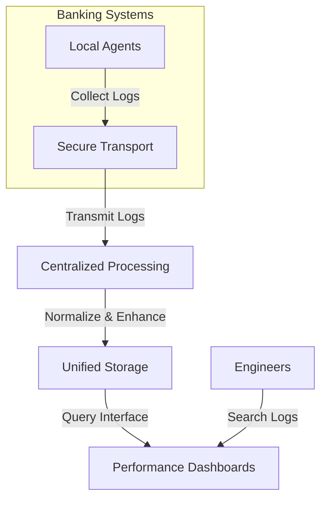

This visual flow demonstrates how logs move through the architecture: starting with local agents deployed across diverse banking systems, securely transmitted to centralized processing for normalization and enrichment, stored in a unified repository, and made accessible through performance dashboards for analysis and troubleshooting. Such an architecture enables engineers to seamlessly retrieve logs across services, facilitating efficient issue resolution and operational insights across organizational boundaries.

### Teaching Narrative

Collection architecture transforms theoretically correlated logs into practically usable observability by bringing distributed log data into a unified, accessible environment. Even perfectly implemented correlation and standardization provide limited value if logs remain physically separated across different systems and teams—requiring manual coordination for end-to-end visibility.

Effective collection architectures address this challenge through comprehensive ingestion pipelines, which can be broken down into the following key stages:

1. **Distributed Collection**

   - Deploy collectors across all environments containing relevant systems.
   - Ensure support for diverse environments such as on-premises data centers, private clouds, public cloud services, and branch networks.

2. **Secure Transport**

   - Use encrypted channels and compliance-focused transport mechanisms to transmit sensitive financial data.
   - Maintain adherence to data residency and privacy regulations across all jurisdictions.

3. **Centralized Processing**

   - Normalize log formats for consistency across systems.
   - Enhance correlation by enriching logs with contextual metadata.

4. **Unified Storage**

   - Consolidate logs into a centralized repository spanning organizational boundaries.
   - Enable high availability and scalability to handle terabytes of daily logs.

5. **Access Interfaces**

   - Provide efficient tools for cross-service analysis and querying.
   - Support features like correlation ID searches to retrieve end-to-end transaction narratives quickly.

For financial institutions, where transactions routinely span dozens of systems across multiple business units, this unified collection creates transformative operational capabilities, including:

- **Transaction Traceability**: Identifying exactly where transactions succeeded or failed without cross-team coordination.
- **Cross-Boundary Insights**: Analyzing patterns and trends across organizational divisions.
- **Performance Baselines**: Establishing end-to-end performance baselines across complete transaction paths.
- **Accelerated Resolution**: Reducing mean-time-to-resolution for complex issues through immediate access to the complete transaction narrative.

A text-based representation of the ingestion pipeline is as follows:

```
[Distributed Collectors] --> [Secure Transport] --> [Centralized Processing] --> [Unified Storage] --> [Access Interfaces]
```

However, the implementation challenge often grows with organizational scale, requiring specialized approaches tailored to:

- **Environments**: Supporting hybrid setups of legacy systems, containerized services, and modern cloud platforms.
- **Technology Generations**: Balancing the needs of modern and traditional application architectures.
- **Regulatory Compliance**: Adhering to varying data residency and privacy requirements across regions.

Despite this complexity, unified collection delivers such substantial operational advantages that it typically represents one of the highest-return observability investments for complex financial organizations.

### Common Example of the Problem

Pacific Financial Group recently experienced a major incident with their wealth management platform when high-net-worth clients reported investment positions displaying incorrectly across different interfaces. Some clients saw different balances when checking their portfolios through the web portal versus the mobile app, while others noticed discrepancies between reported positions and actual trade confirmations.

The investigation revealed a fragmented logging nightmare. The wealth management ecosystem included multiple logging systems, each with its own format and challenges:

| Logging System | Format/Platform | Associated Challenges |
| ---------------------------- | ------------------- | ---------------------------------------------------------------------------------------------- |
| Modern web portal | Elasticsearch | Limited interoperability with non-Elasticsearch logs; no built-in cross-system correlation. |
| Mobile application platform | CloudWatch | Restricted log retention policies; proprietary querying tools incompatible with other systems. |
| Trading systems | Splunk | High licensing costs; siloed access limited to specific teams. |
| Position management services | Local files | No centralized access; manual file transfers required for analysis. |
| Core accounting systems | Mainframe datasets | Legacy formats difficult to parse; dependency on specialized mainframe expertise. |
| Third-party data providers | Proprietary logging | Black-box logs with limited visibility and lack of control over log access. |

Without unified collection, the investigation required separate teams running parallel queries across six different logging systems with no way to correlate results. Engineers had to manually extract data from each system, attempting to piece together transaction flows through tedious comparison of account numbers and timestamps. Even identifying whether a specific client request had reached all necessary systems required hours of cross-team coordination and manual log extraction.

The fragmented collection architecture turned what should have been a straightforward investigation into a 3-day ordeal involving over 20 team members. Ultimately, the root cause—timing issues between cache refresh cycles causing inconsistent position data—would have been immediately obvious with unified collection showing the sequence of updates across systems.

### SRE Best Practice: Evidence-Based Investigation

Effective collection architecture requires comprehensive integration across all logging sources. Evidence-based investigation should establish:

1. **Distributed collector deployment**: Ensure collectors are deployed across all environments involved in the transaction path, including on-premises data centers, cloud services, and legacy systems.

2. **Secure transport mechanisms**: Maintain compliance during transmission by implementing encryption, authentication, and adherence to relevant data residency or privacy regulations.

3. **Centralized normalization**: Standardize log formats regardless of source to enable consistent correlation and analysis.

4. **Unified storage**: Create a complete repository that spans organizational boundaries and consolidates logs from all systems for end-to-end visibility.

5. **High-performance query capabilities**: Implement efficient tools that allow engineers to perform cross-service analysis with minimal latency, even when handling terabytes of log data.

#### Practical Checklist for Effective Collection Architecture

To guide implementation, use the following checklist:

- [ ] Have all environments (e.g., cloud, on-premises, legacy) been covered by distributed collectors?
- [ ] Are secure transport protocols (e.g., TLS, VPNs) in place to ensure compliance during log transmission?
- [ ] Is log normalization logic (e.g., format standardization, metadata enrichment) centralized and scalable?
- [ ] Does the unified storage solution support regulatory requirements and handle the scale of organizational log data?
- [ ] Are query interfaces optimized for performance and user accessibility across all correlated systems?

#### Evidence of Impact

Organizations implementing comprehensive collection architectures report:

- **60-80% improvements** in cross-service troubleshooting efficiency.
- Financial institutions with mature unified collection show **mean-time-to-resolution reductions of 50-70%** for complex distributed issues.

For example, Western Banking Group’s implementation of unified log collection across their retail banking platform reduced average incident resolution time from **8.2 hours to 2.7 hours**—a **67% improvement** in operational efficiency.

### Banking Impact

The business consequences of implementing unified collection architecture include:

1. **Incident Resolution Acceleration**: Banks report 50-70% reductions in mean-time-to-resolution for complex issues after implementing unified collection, directly improving service restoration during outages.

2. **Operational Efficiency**: Cross-team coordination requirements decrease dramatically with unified collection. Financial institutions report 60-80% reductions in personnel hours required for distributed system investigations.

3. **Pattern Recognition Enhancement**: Unified collection enables identification of cross-system patterns invisible in fragmented logs. Banks report 40-60% improvements in proactive issue detection through cross-boundary pattern analysis.

4. **Compliance Simplification**: Centralized collection streamlines regulatory reporting and audit processes. Financial institutions report 50-70% reductions in effort required for compliance-related log extraction and analysis.

5. **Cost Optimization**: While unified collection requires investment, it typically reduces overall observability costs through consolidation. Banks report 30-50% reductions in total cost of ownership compared to maintaining multiple isolated logging platforms.

### Implementation Guidance

To implement effective collection architecture for distributed banking systems, follow these structured steps:

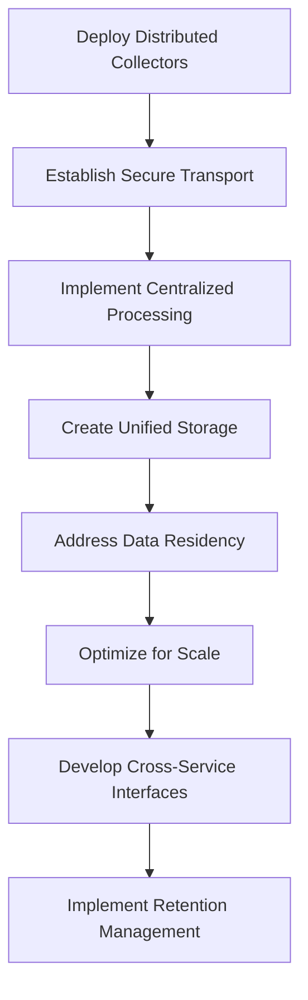

1. **Deploy Distributed Collectors**: Implement lightweight logging agents across all environments (data centers, clouds, branch networks) that can reliably gather logs regardless of source format or volume.

2. **Establish Secure Transport**: Implement encrypted, authenticated transport mechanisms that maintain compliance with financial regulations during log transmission, with particular attention to personally identifiable information.

3. **Implement Centralized Processing**: Deploy pipeline components that normalize formats, enhance correlation, and enrich context during ingestion rather than at query time.

4. **Create Unified Storage**: Develop a consolidated repository architecture that provides complete visibility across organizational boundaries while maintaining appropriate access controls.

5. **Address Data Residency**: Design collection workflows that respect regulatory requirements for data locality, particularly for multinational banking operations subject to varying privacy regulations.

6. **Optimize for Scale**: Implement performance-focused architecture capable of handling banking-scale log volumes (often terabytes daily) while maintaining near-real-time query capability.

7. **Develop Cross-Service Interfaces**: Create query tools and dashboards specifically designed for transaction-centric rather than system-centric analysis, optimized for correlation ID-based workflows.

8. **Implement Retention Management**: Deploy tiered storage with appropriate lifecycle policies, balancing operational needs against compliance requirements and cost constraints.

## Panel 7: The Trace Visualization - From Raw Logs to Transaction Stories

### Scene Description

A banking platform operations center where engineers use advanced trace visualization to investigate a complex mortgage application issue. Interactive displays transform thousands of correlated log entries into intuitive visualizations, allowing the team to identify and resolve issues efficiently. Below is a simplified representation of the key visualization types used in the investigation:

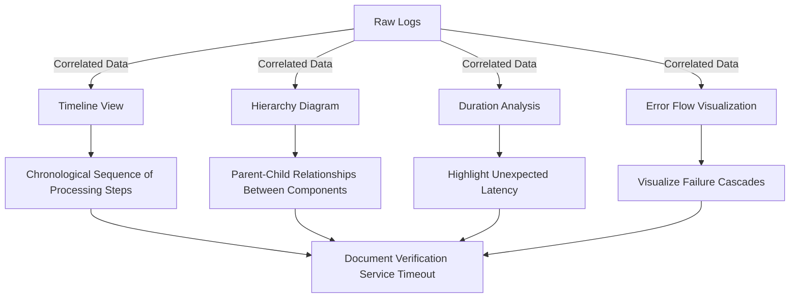

- **Timeline View**: Displays the exact sequence of processing steps across twenty different services, making it easy to identify where delays or anomalies occur.
- **Hierarchy Diagram**: Reveals the calling relationships between components, showing dependencies and parent-child structures within the system.
- **Duration Analysis**: Highlights performance bottlenecks, such as unexpected latency in the document processing service.
- **Error Flow Visualization**: Tracks how initial validation failures cascade through downstream systems, uncovering propagation patterns.

With these visualizations, the team seamlessly navigates from a high-level transaction overview to specific log details using simple clicks. The root cause—a document verification service timeout causing subtle application state corruption—is pinpointed quickly, an outcome that would have been nearly impossible to achieve with traditional text-based log analysis.

### Teaching Narrative

Trace visualization transforms raw distributed logs from overwhelming technical data into intuitive transaction narratives that reveal patterns, relationships, and issues invisible in text-based analysis. Modern banking transactions generate thousands of log entries across dozens of services—a volume that exceeds human cognitive capacity when presented as raw text. Effective visualization addresses this limitation by creating visual representations that leverage human pattern recognition abilities: timeline views showing the chronological flow of operations across system boundaries, hierarchy diagrams revealing parent-child relationships and calling patterns, duration analysis highlighting performance anomalies within the transaction flow, error propagation visualizations showing how failures cascade through dependencies, and service topology maps exposing the actual components involved in specific transaction types. For financial operations like mortgage applications or complex trading transactions, these visualizations create transformative understanding—revealing subtle patterns and relationships that remain hidden in text logs regardless of correlation quality. Particularly valuable insights include identifying unexpected service dependencies, recognizing timing patterns and race conditions, understanding error propagation across system boundaries, detecting anomalous processing paths, and recognizing performance bottlenecks within the transaction flow. The most effective implementations provide dynamic visualization that enables fluid movement between different views and abstraction levels—from high-level transaction overviews to specific log entry details—maintaining context while providing progressive disclosure of information as needed for investigation. This capability transforms troubleshooting from tedious log reading to interactive exploration, dramatically reducing the time and expertise required to understand complex distributed transactions.

### Common Example of the Problem

United Mortgage Corporation encountered a critical issue with their new digital mortgage application platform. Customers reported that applications would appear to complete successfully but never progress to underwriting, with no error messages or notifications. Approximately 8% of applications were affected seemingly at random, with no discernible pattern in loan types, amounts, or customer characteristics.

The investigation of this issue was severely hindered by the complexity of the distributed process. Each mortgage application generated over 5,000 log entries across 23 different services, including the customer portal, document upload service, identity verification, credit check integration, property valuation systems, underwriting rules engine, and the core banking platform. Despite having correlated logs with proper transaction IDs, the raw textual data was overwhelming.

Engineers spent hours manually scanning through thousands of log entries, attempting to reconstruct the application flow by comparing timestamp sequences and identifying patterns. However, the sheer volume and intricacy of the logs made it nearly impossible to detect the subtle timing issue responsible for the failures.

The breakthrough occurred when the team developed custom visualization tools. These tools transformed transaction logs into a graphical timeline, immediately clarifying the sequence of events and dependencies between services. Below is a simplified sequence diagram illustrating the problematic flow:

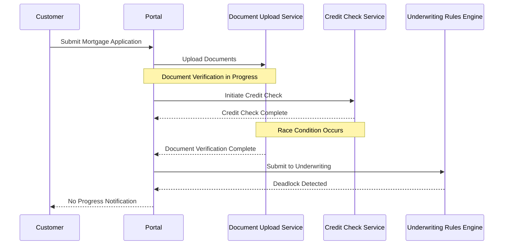

This visualization immediately exposed a race condition between the document verification and credit check services. Under specific timing conditions, both services would attempt to update the application state simultaneously, causing a deadlock that prevented the application from progressing to underwriting. This subtle interaction, undetectable in raw text logs, became obvious in the timeline view.

By leveraging trace visualization, the team resolved the issue within hours, eliminating the need for further manual log analysis. This incident highlighted the transformative power of visual tools in understanding complex distributed systems, especially for scenarios involving timing-related anomalies like race conditions.

### SRE Best Practice: Evidence-Based Investigation

Effective trace visualization requires purpose-built tooling for distributed transaction analysis. The following checklist outlines key practices, their benefits, and example tools to support evidence-based investigation:

| Practice | Benefits | Example Tools/Techniques |
| ----------------------------------- | --------------------------------------------------------------------- | --------------------------------------------------- |
| **Timeline Visualization** | Reveals the chronological sequence of events across system boundaries | Jaeger, Zipkin, OpenTelemetry |
| **Hierarchy Diagrams** | Highlights parent-child relationships and dependency patterns | D3.js-based custom visualizations, Graphviz |
| **Duration Analysis** | Identifies performance anomalies within the transaction flow | Lightstep, Dynatrace, New Relic |
| **Error Propagation Visualization** | Shows how failures cascade through dependencies | Honeycomb, Kibana, Grafana |
| **Service Topology Mapping** | Exposes the actual components involved in specific transaction types | Datadog APM, Service Maps in AWS X-Ray, AppDynamics |

#### Metrics of Success

- Organizations implementing comprehensive trace visualization report **70-85% improvements** in troubleshooting efficiency for complex distributed issues.
- Financial institutions with mature visualization capabilities achieve **mean-time-to-resolution reductions of 60-80%** for multi-service incidents.
- **Case Study:** Eastern Financial's trace visualization implementation across their digital banking platform reduced average incident resolution time from **6.8 hours to 1.5 hours**—a **78% improvement in operational efficiency**.

### Banking Impact

The business consequences of implementing trace visualization are significant and measurable. The table below summarizes key impact areas, associated metrics, and example outcomes:

| **Impact Area** | **Metric** | **Example Outcome** |
| ------------------------------------ | ------------------------------------------------- | ------------------------------------------------------------------------------------- |
| **Incident Resolution Acceleration** | 60-80% reduction in time-to-resolution | Faster service restoration during outages, minimizing customer impact. |
| **Root Cause Accuracy** | 50-70% improvement in accurate problem diagnosis | Fewer recurring issues due to precise remediation of underlying causes. |
| **Operational Efficiency** | 70-85% reduction in engineer hours required | Significant time savings in troubleshooting distributed system issues. |
| **Knowledge Transfer Enhancement** | 40-60% improvement in cross-team collaboration | Improved shared understanding across teams during complex incident investigations. |
| **Architecture Improvement** | 30-50% of major architectural improvements traced | Identification of weaknesses leading to system design enhancements and optimizations. |

Trace visualization not only accelerates operational workflows but also fosters collaboration, drives architectural evolution, and enhances overall system reliability.

### Implementation Guidance

To implement effective trace visualization for distributed banking systems, follow these steps:

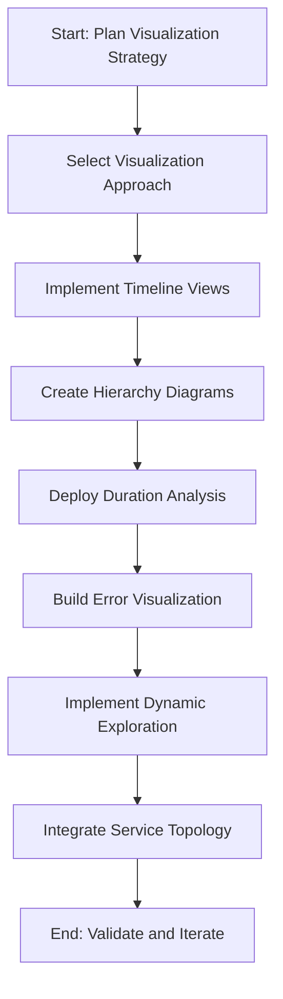

1. **Plan Visualization Strategy**: Begin by defining the goals of your trace visualization, considering the unique challenges and requirements of your system. Identify the types of insights you need to extract, such as performance bottlenecks, error propagation, or dependency mappings.

2. **Select Visualization Approach**: Choose whether to build a custom visualization solution, implement open-source tools (e.g., Jaeger, Zipkin), or adopt commercial platforms. Factor in your system's scale, complexity, and resource constraints.

3. **Implement Timeline Views**: Develop visualizations that show the chronological sequence of events across system boundaries. Ensure the design clearly distinguishes between parallel and sequential operations to highlight concurrency patterns.

4. **Create Hierarchy Diagrams**: Build diagrams that represent parent-child relationships and calling patterns between services. Use these to reveal the actual invocation structure of distributed transactions and identify unexpected dependencies.

5. **Deploy Duration Analysis**: Implement heat maps or color-coded visualizations to highlight performance characteristics within transaction flows. Focus on making bottlenecks and anomalies immediately visible and actionable.

6. **Build Error Visualization**: Create specialized views that show how failures propagate through the system. Use these to reveal cascade patterns and identify critical dependency failures.

7. **Implement Dynamic Exploration**: Design interactive interfaces that enable seamless movement between different abstraction levels. Ensure users can navigate fluidly from high-level transaction overviews to specific log details while preserving context.

8. **Integrate Service Topology**: Develop dynamic service maps that visually represent the components involved in specific transaction types. Ensure these maps are automatically generated from trace data to reflect real-time system behavior.

9. **Validate and Iterate**: Continuously review the effectiveness of the visualizations in aiding troubleshooting and system analysis. Gather feedback from users and refine the implementation to address emerging needs.

## Panel 8: The Anomaly Detection - Finding Unusual Patterns

### Scene Description

A financial fraud investigation center where security analysts use distributed logging to identify suspicious transaction patterns. Advanced analytics dashboards process correlated logs across the bank's complete transaction processing ecosystem, automatically highlighting unusual patterns: unexpected service invocation sequences, atypical timing patterns between processing steps, unusual data access patterns, and deviations from historical baseline behavior. Alerts draw attention to a potentially fraudulent wire transfer pattern characterized by unusual verification sequences and timing—identified automatically through pattern analysis despite the transactions individually appearing normal. Security teams investigate using linked visualizations that immediately provide the complete context across all involved systems, quickly confirming and containing the sophisticated attack attempt.

Below is a simplified flow of how distributed logging and anomaly detection function within this ecosystem:

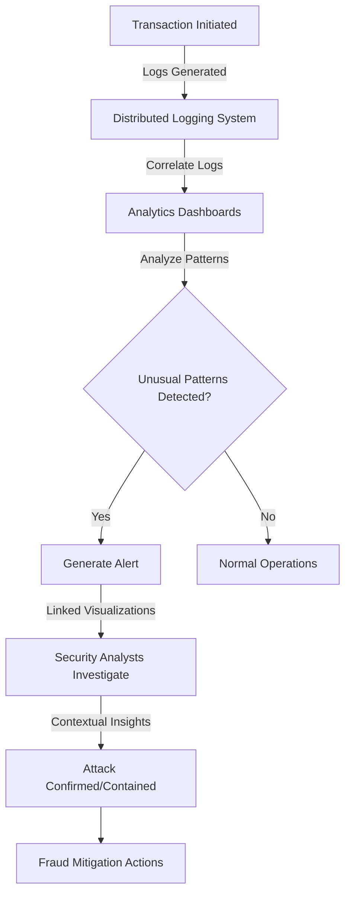

This flow illustrates the key stages of anomaly detection:

1. **Transaction Initiation**: Logs are generated as transactions progress through the system.
2. **Distributed Logging System**: Logs from multiple systems are aggregated and correlated.
3. **Analytics Dashboards**: Advanced algorithms analyze the logs to detect unusual patterns.
4. **Unusual Pattern Detection**: Identifies anomalies (e.g., timing, sequence, or baseline deviations).
5. **Alerts and Visualizations**: Analysts are alerted and provided with linked visualizations for investigation.
6. **Security Response**: Contextual insights enable quick confirmation and containment of sophisticated attack attempts.

This streamlined visualization helps clarify how security teams leverage distributed logging and anomaly detection to protect against complex fraud scenarios.

### Teaching Narrative

Anomaly detection elevates distributed logging from reactive troubleshooting to proactive identification by automatically recognizing unusual patterns that indicate potential issues or security threats. While correlation and visualization create powerful capabilities for human-driven analysis, the volume and complexity of modern banking transactions exceed human monitoring capacity—requiring automated pattern recognition to identify subtle anomalies across millions of daily operations.

Effective anomaly detection analyzes distributed logs across multiple dimensions. The following table summarizes these dimensions, providing examples to clarify their relevance in financial fraud detection:

| **Dimension** | **Description** | **Example** |
| -------------------------- | ----------------------------------------------------------- | ------------------------------------------------------------------------------------------------------------ |
| **Sequence Anomalies** | Unusual processing paths or service invocation patterns. | A transaction triggers an unexpected sequence of service calls not typically associated with wire transfers. |
| **Timing Anomalies** | Atypical durations or intervals between operations. | A wire transfer approval takes significantly longer or shorter than the historical average. |
| **Volume Anomalies** | Unexpected transaction rates or patterns. | A sudden spike in high-value transactions within a short timeframe. |
| **Relationship Anomalies** | Unusual connections between entities or services. | A customer account accesses a service it has never interacted with before. |
| **Baseline Deviations** | Behavior that differs from established historical patterns. | A typically dormant account suddenly initiates multiple high-value international transfers. |

For financial institutions where both operational reliability and security depend on early detection of unusual behavior, these capabilities provide critical advantages—identifying potential issues before significant impact occurs and recognizing subtle attack patterns that would remain invisible in individual service monitoring.

Particularly valuable for fraud detection and security monitoring, distributed log anomaly detection can recognize sophisticated attacks specifically designed to avoid traditional detection mechanisms—such as low-and-slow approaches or multi-stage operations that appear innocent when viewed in isolation but reveal clear patterns when analyzed across the complete transaction journey. By automatically identifying these unusual patterns from the massive background of normal operations, anomaly detection transforms security from manual hunting to systematic protection.

### Common Example of the Problem

Continental Trust Bank suffered a sophisticated fraud attack that traditional security measures completely missed. Attackers executed a coordinated Business Email Compromise (BEC) scheme targeting corporate accounts, resulting in $4.2 million in fraudulent transfers before detection.

The attack was specifically designed to evade traditional fraud controls. Individual transactions were kept below threshold amounts, originated from legitimate user accounts via normal channels, targeted previously-used beneficiaries, and passed all standard validation checks. Security teams reviewing individual transactions or single-system logs found nothing suspicious, as each action appeared legitimate in isolation.

What made the attack identifiable was its subtle pattern across distributed systems:

- Authentication occurred from new geographic locations, but within acceptable regions
- Account access patterns showed unusual navigation sequences through the portal
- Beneficiary details were viewed in unusual patterns before transactions
- Transaction timing showed consistent intervals unlike typical user behavior
- Multiple accounts exhibited similar behavior patterns within days of each other

The fraud continued for 17 days before detection, revealing the need for automated anomaly detection to identify these subtle patterns at scale. Below is a timeline representation of how the patterns emerged and why traditional monitoring failed to catch them:

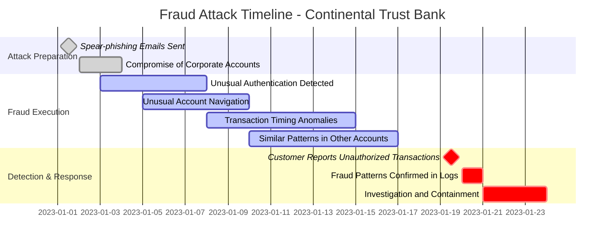

This timeline illustrates the sequence of events, showing how attackers operated methodically over time to avoid detection. Security teams failed to correlate the distributed logs manually, as no single event triggered alarms. Only through cross-system anomaly detection could the subtle but coordinated patterns—spanning authentication, navigation, and transaction behavior—have been identified early, potentially reducing the impact of the attack.

### SRE Best Practice: Evidence-Based Investigation

Effective anomaly detection requires sophisticated pattern recognition across distributed log data. To implement evidence-based investigation practices, follow this structured checklist:

| Step | Description | Benefits |
| -------------------------------------------- | ----------------------------------------------------------------------------- | ----------------------------------------------------------------------------------------- |
| **1. Establish Multi-Dimensional Baselines** | Define normal patterns for sequence, timing, volume, and relationships. | Creates a foundation for detecting deviations and ensures comprehensive anomaly coverage. |
| - Sequence Baselines | Identify typical processing paths and service invocation patterns. | Detects unusual service interactions or unexpected process flows. |
| - Timing Baselines | Define expected durations and intervals between operations. | Highlights irregular delays or overlaps in transaction steps. |
| - Volume Baselines | Establish normal transaction rates and patterns. | Detects spikes, drops, or unusual transaction activity. |
| - Relationship Baselines | Map typical connections between entities and services. | Exposes unexpected or suspicious interactions between systems or users. |
| **2. Implement Automated Detection** | Deploy mechanisms to identify deviations from the established baselines. | Reduces manual effort by automating anomaly identification across high-volume operations. |
| **3. Correlate Across Systems** | Connect related anomalies into cohesive patterns using cross-system analysis. | Reveals complex or multi-stage issues that might be invisible in isolated log monitoring. |
| **4. Use Visualization Interfaces** | Present detected anomalies with complete context for investigation. | Accelerates root cause analysis by providing actionable insights in an intuitive format. |

#### Key Benefits of Evidence-Based Investigation

- **Improved Early Detection**: Organizations report 60-80% improvements in identifying issues early.
- **Enhanced Fraud Detection**: Mature implementations show 40-60% better detection of sophisticated attacks.
- **Proven Results**: Northern Banking Group’s anomaly detection system identified 38% more fraud attempts in six months compared to traditional methods, preventing an estimated $7.2 million in losses.

By following this structured approach, SRE teams can elevate anomaly detection to a proactive and systematic practice that significantly enhances both operational reliability and security.

### Banking Impact

The business consequences of implementing distributed log anomaly detection include:

#### Key Metrics Summary

The following improvements have been reported by financial institutions adopting anomaly detection technologies:

| Metric | Improvement Range | Example Impact |
| ---------------------------- | ----------------- | ------------------------------------------------ |
| Fraud Loss Prevention | 40-60% | Millions in annual fraud prevention. |
| Operational Issue Prevention | 30-50% | Fewer customer-impacting incidents. |
| Security Posture Enhancement | 50-70% | Better detection of advanced persistent threats. |
| Resource Optimization | 60-80% | Reductions in manual analyst hours. |

#### Visualizing the Impact

```mermaid
barChart
  title Banking Impact Metrics
  xAxis Impact Categories
  yAxis Improvement Percentage
  Fraud Loss Prevention: 40, 60
  Operational Issue Prevention: 30, 50
  Security Posture Enhancement: 50, 70
  Resource Optimization: 60, 80
```

#### Detailed Benefits

1. **Fraud Loss Prevention**: Banks report 40-60% improvements in detection of sophisticated fraud attempts that evade traditional controls, directly reducing financial losses. For large institutions, this typically represents millions in prevented fraud annually.

2. **Operational Issue Prevention**: Anomaly detection identifies subtle system issues before they create significant impact. Financial institutions report 30-50% reductions in customer-impacting incidents through early detection of emerging problems.

3. **Security Posture Enhancement**: Distributed pattern analysis detects sophisticated attacks invisible to traditional security monitoring. Banks report 50-70% improvements in detection of advanced persistent threats and coordinated attacks.

4. **Compliance Strengthening**: Regulatory frameworks increasingly require proactive fraud monitoring. Anomaly detection provides demonstrable evidence of sophisticated monitoring capabilities during regulatory examinations.

5. **Resource Optimization**: Automated pattern detection dramatically reduces manual security hunting requirements. Financial institutions report 60-80% reductions in analyst hours required for transaction monitoring while improving detection rates.

### Implementation Guidance

To implement effective anomaly detection for distributed banking systems, follow this step-by-step process:

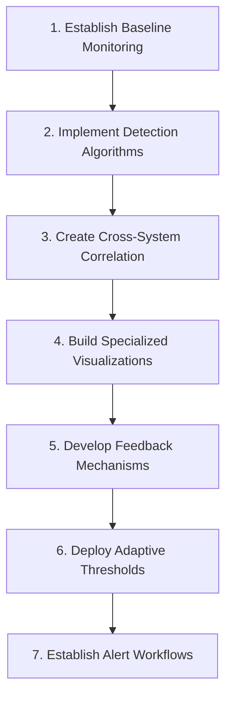

#### Step 1: Establish Baseline Monitoring

Deploy mechanisms to establish normal behavior patterns across multiple dimensions:

- **Sequence baselines**: Document typical processing paths and service invocation patterns.
- **Timing baselines**: Measure expected durations and intervals between operations.
- **Volume baselines**: Analyze normal transaction rates and patterns across time periods.
- **Relationship baselines**: Map typical connections between entities and services.

#### Step 2: Implement Detection Algorithms

Deploy appropriate anomaly detection approaches for different pattern types:

- **Statistical methods**: Identify numerical deviations from the baseline.
- **Machine learning**: Recognize complex and evolving patterns.
- **Rule-based detection**: Identify known suspicious patterns using predefined rules.
- **Graph analysis**: Detect relationship anomalies across entities and systems.

#### Step 3: Create Cross-System Correlation

Develop mechanisms to connect related anomalies across different systems into coherent patterns:

- Use **correlation IDs** and contextual data to link anomalies.
- Ensure comprehensive pattern visibility across the transaction processing ecosystem.

#### Step 4: Build Specialized Visualizations

Create user interfaces that present detected anomalies with complete distributed context:

- Enable rapid investigation of complex patterns.
- Highlight key data points and relationships for security analysts.

#### Step 5: Develop Feedback Mechanisms

Implement feedback processes to refine anomaly detection:

- Allow analysts to assess and provide input on detection accuracy.
- Use feedback to continuously improve detection algorithms and reduce false positives.

#### Step 6: Deploy Adaptive Thresholds

Implement dynamic thresholding to adjust anomaly detection sensitivity:

- Adapt based on time periods, business cycles, and contextual factors.
- Minimize false positives while maintaining high detection accuracy.

#### Step 7: Establish Alert Workflows

Create structured response processes for detected anomalies:

- Tailor workflows based on anomaly type, potential impact, and confidence level.
- Ensure rapid investigation and remediation to contain threats effectively.

## Panel 9: The Debugging Revolution - Reconstructing Transaction Flows

### Scene Description

A banking platform development environment where engineers demonstrate distributed debugging capabilities. Developers troubleshoot a complex integration issue between the bank's investment platform and third-party market data services. Debugging tools show the complete distributed transaction context: all service interactions captured with full request-response details, data transformations tracked across component boundaries, configuration and environment variables recorded for each processing step, and detailed timing information for every operation. The engineer identifies a subtle data format mismatch between services by comparing request and response payloads across the distributed transaction—instantly resolving an issue that would have required hours of coordinated debugging across multiple teams using traditional approaches.

To clarify and visualize the debugging scenario, the following diagram illustrates the distributed transaction flow:

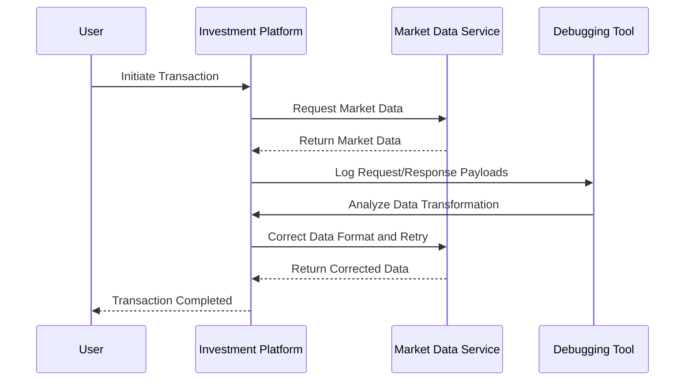

This sequence demonstrates how the distributed debugging tool captures and analyzes the transaction flow. It highlights key interactions:

1. **Request-Response Capture:** Logs all payloads exchanged between the investment platform and the market data service.
2. **Data Transformation Tracking:** Observes the processing steps and identifies mismatches in data formats.
3. **Contextual Insights:** Records configuration and environment variables, enabling precise issue resolution.
4. **Real-Time Debugging:** Allows engineers to detect and fix subtle integration issues, like data format mismatches, without the need for extensive multi-team coordination.

The visual representation complements the detailed description, emphasizing how distributed debugging transforms troubleshooting in complex systems.

### Teaching Narrative

Distributed debugging revolutionizes development by extending logging beyond basic event recording to comprehensive transaction reconstruction that captures the complete context needed to understand and resolve complex issues. Traditional debugging breaks down at service boundaries—developers can inspect detailed behavior within their own components but lose visibility when operations cross into other services. Effective distributed debugging addresses this limitation by maintaining comprehensive context across the entire transaction flow: request and response payloads captured at each service boundary, detailed timing information for every processing step, configuration and environment variables recorded for each component, state transitions tracked throughout the transaction lifecycle, and data transformations documented across integration points. For banking platforms where transactions routinely span dozens of specialized services, this capability transforms both development and troubleshooting—enabling engineers to understand exactly how data and control flow through the complete system rather than just their individual components. Particularly valuable for complex integration scenarios like investment platforms connecting to market data providers or payment gateways integrating with settlement networks, distributed debugging can immediately identify subtle issues that would otherwise require extensive multi-team coordination: data format mismatches between services, timing assumptions violated during normal operation, configuration inconsistencies across environments, and unexpected data transformations occurring between components. By providing this end-to-end visibility in development and test environments, distributed debugging accelerates both implementation and problem resolution—directly improving both engineering productivity and platform quality.

### Common Example of the Problem

Meridian Investment Bank was launching a new wealth management platform integrating their proprietary trading systems with multiple external market data providers, tax optimization services, and portfolio analytics engines. During final testing, they encountered a critical issue: approximately 18% of portfolio rebalancing operations would fail unpredictably with generic error messages, but only for certain account types and holding combinations.

The development team faced a distributed debugging nightmare. The rebalancing operation traversed 14 different services across three different teams, with multiple third-party integrations:

- Portfolio management services calculating current positions
- Market data integrations retrieving current pricing
- Tax lot analysis determining optimal sale candidates
- Trading rules engines validating proposed transactions
- Order management systems executing trades
- Settlement systems confirming executions

Traditional debugging approaches failed completely. Developers could debug their individual services but had no visibility across boundaries. Each team confirmed their components were working correctly in isolation, but the integrated flow kept failing. Logs showed only that transactions were being rejected at the trading rules stage with a generic "validation failure" message, without details of what specific rule was violated or why.

#### Sequence of Operations Across Services

The issue can be visualized through the following sequence diagram, illustrating the flow of operations and the points where visibility was lost:

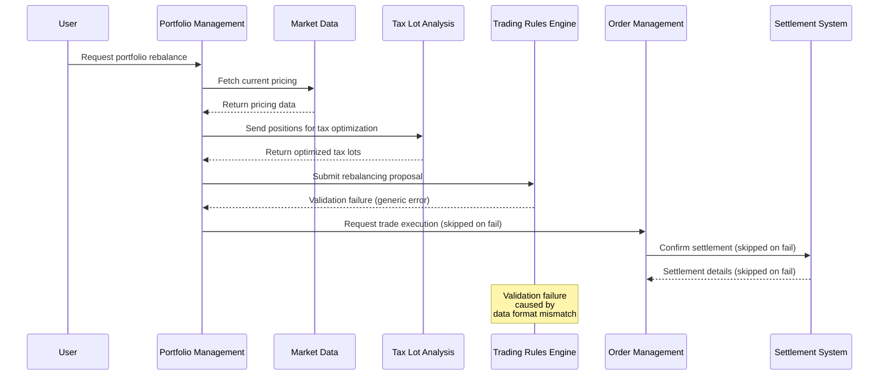

#### Root Cause Discovery

After three weeks of investigation involving 12 developers across multiple teams, they finally discovered the issue was a subtle data format inconsistency: the tax optimization service was returning decimal precision for certain calculations that exceeded what the trading rules engine expected, causing validation failures only for specific account types with particular holding combinations.

With distributed debugging, this issue would have been immediately obvious by tracing the payload transformations across service boundaries, showing the decimal precision mismatch introduced by the tax lot analysis step and its downstream impact on validation in the trading rules engine.

### SRE Best Practice: Evidence-Based Investigation

Effective distributed debugging requires comprehensive context preservation across system boundaries. To implement evidence-based investigation effectively, SREs should follow these five key practices:

- **Complete Request-Response Capture**: Ensure all service boundaries log both incoming requests and outgoing responses in full detail. This enables precise identification of issues at integration points.

- **Data Transformation Tracking**: Record how data changes as it passes through integration points, ensuring transformations are correctly applied and traceable.

- **Configuration and Environment Recording**: Log configuration settings and environment variables for each processing step to identify potential inconsistencies across deployments.

- **State Transition Documentation**: Maintain a record of all state changes throughout the transaction lifecycle to trace unexpected behaviors back to their source.

- **Detailed Timing Information**: Capture timing metrics for every operation to detect performance bottlenecks or timing-related anomalies.

#### Checklist: Evidence-Based Investigation for Distributed Debugging

1. [ ] Capture complete request-response payloads at all service boundaries.
2. [ ] Track all data transformations across integration points.
3. [ ] Log configuration and environment variables for every processing step.
4. [ ] Document state transitions throughout the transaction lifecycle.
5. [ ] Record detailed timing metrics for all operations.

Organizations adopting these practices report significant improvements in troubleshooting efficiency and engineering productivity. For example, Eastern Investment Group's distributed debugging implementation reduced their average integration issue resolution time by 69%, from 12.4 days to 3.8 days. Mature debugging capabilities in financial institutions have also demonstrated 30-50% gains in developer productivity for distributed systems.

### Banking Impact

The business consequences of implementing distributed debugging capabilities include:

1. **Development Acceleration**: Banks report 30-50% reductions in implementation time for complex distributed features after deploying comprehensive debugging capabilities, directly accelerating time-to-market for new financial products.

2. **Integration Quality Improvement**: Distributed debugging reveals subtle integration issues early in development. Financial institutions report 40-60% reductions in production defects related to service interfaces and data transformations.

3. **Operational Readiness Enhancement**: Development environments with production-like observability better prepare teams for operational support. Banks report 50-70% improvements in production supportability when distributed debugging is implemented during development.

4. **Third-Party Integration Efficiency**: Debugging capabilities that span organizational boundaries dramatically simplify external integrations. Financial institutions report 60-80% reductions in effort required to troubleshoot issues with partner systems and service providers.

5. **Technology Modernization Support**: Distributed debugging provides critical visibility during migration and modernization initiatives. Banks report 40-60% reductions in technical risk when implementing major architectural changes with comprehensive debugging capabilities.

### Implementation Guidance

To implement effective distributed debugging for banking platforms, follow these steps:

| Step | Description | Example/Notes |
| ------------------------------------ | ------------------------------------------------------------------------------------------------------------------------------------------------------- | --------------------------------------------------------------------------------------------------- |
| **1. Deploy Transaction Capture** | Implement mechanisms to record full request and response payloads at service boundaries. Ensure sensitive information like PII is masked appropriately. | Example: Enable payload logging in API Gateways, masking `SSN` or `account_number` fields. |
| **2. Implement Context Propagation** | Maintain debugging context (transaction IDs, parent-child relationships) across service boundaries using consistent propagation mechanisms. | Example: Use an HTTP header like `X-Transaction-ID` or `traceparent` for context continuity. |
| **3. Create Environment Recording** | Capture configuration details, environment variables, and system state alongside transaction data for complete context reconstruction. | Example: Log environment variables such as `APP_VERSION`, `DATABASE_URL`, and service state flags. |
| **4. Build Transformation Tracking** | Track data transformations as information flows between services, documenting field changes, format conversions, and enrichment operations. | Example: Record JSON-to-XML transformations or enrichment of transaction records with metadata. |
| **5. Deploy Timing Instrumentation** | Implement detailed performance measurement at each processing step to identify subtle timing issues and sequence problems. | Example: Add timing metrics using libraries like `opentelemetry` or `Prometheus`. |
| **6. Develop Debugging Interfaces** | Create visualization tools to present the complete distributed context in developer-friendly formats for intuitive exploration. | Example: Build dashboards to render transaction flows with timing and transformation details. |
| **7. Implement Secure Storage** | Deploy secure, time-limited storage for debugging data, ensuring privacy and security for sensitive financial information. | Example: Use encrypted storage with automated expiry policies, such as AWS S3 with lifecycle rules. |

#### Example Code Snippet: Context Propagation in Distributed Systems

Below is an example of propagating a transaction ID across service boundaries using HTTP headers:

```python
import requests

# Example function to propagate transaction context
def propagate_context(transaction_id, child_service_url, payload):
    headers = {
        "X-Transaction-ID": transaction_id,
        "Content-Type": "application/json"
    }
    response = requests.post(child_service_url, json=payload, headers=headers)
    return response

# Usage
transaction_id = "txn-12345"
child_service_url = "https://child-service.example.com/process"
payload = {"amount": 100, "currency": "USD"}
response = propagate_context(transaction_id, child_service_url, payload)

print(f"Response Status: {response.status_code}")
```

#### Example: Distributed Transaction Flow in Text Format

Here is an example representation of a distributed transaction flow:

```
Transaction ID: txn-12345
----------------------------------------
Service A:
  Request: { "amount": 100, "currency": "USD" }
  Response: { "status": "processed", "transactionId": "txn-12345" }
  Time: 120ms
----------------------------------------
Service B:
  Request: { "transactionId": "txn-12345", "marketData": {...} }
  Response: { "status": "confirmed", "details": {...} }
  Time: 80ms
----------------------------------------
Service C:
  Request: { "transactionId": "txn-12345", "settlementInfo": {...} }
  Response: { "status": "completed" }
  Time: 100ms
----------------------------------------
Total Time: 300ms
```

By systematically implementing these steps and leveraging tools like context propagation and transaction flow visualization, engineers can achieve comprehensive distributed debugging capabilities that enhance both debugging efficiency and platform reliability.

## Panel 10: The Future Horizon - AI-Enhanced Distributed Observability

### Scene Description

A banking innovation lab where data scientists and SREs demonstrate next-generation distributed observability capabilities. Advanced visualization displays show AI-enhanced analysis of transaction logs, highlighting key features such as:

- **Automated Root Cause Identification**: Pinpoints the most probable failure points in complex distributed transactions.
- **Natural Language Query Interfaces**: Enables plain-English questions about transaction behavior.
- **Predictive Analytics**: Identifies potential reliability issues before customer impact.
- **Autonomous Remediation Systems**: Automatically addresses common failure patterns based on historical resolution data.

The demonstration features a system proactively detecting an emerging capacity issue in the bank's authentication services by analyzing subtle pattern changes across distributed logs. This triggers automated scaling operations before any customer impact occurs.

Below is a simplified flowchart illustrating the AI-enhanced distributed observability workflow:

```mermaid
flowchart TD
    A[Log Ingestion] --> B[AI Pattern Recognition]
    B --> C[Automated Root Cause Analysis]
    C --> D[Natural Language Query Interface]
    C --> E[Predictive Analytics]
    E --> F[Emerging Issue Identification]
    F --> G[Autonomous Remediation]
    G --> H[System Scaling or Resolution]
```

This workflow demonstrates how AI transforms raw log data into actionable intelligence, ensuring system reliability and preemptively addressing potential issues.

### Teaching Narrative

AI-enhanced distributed observability represents the future horizon—applying machine learning and artificial intelligence to transform log data from passive records into active intelligence that automates understanding and resolution of complex system behavior. To illustrate, imagine a self-driving car navigating through a bustling city. Traditional distributed logging is akin to the car’s sensors collecting raw data—cameras capturing traffic lights, radar detecting nearby vehicles, and GPS tracking location. However, without advanced AI, this data remains just a collection of observations. AI-enhanced observability acts like the car’s onboard AI, which processes this data in real-time to understand traffic patterns, predict potential hazards, and autonomously adjust the car’s actions to ensure a smooth ride.

Similarly, modern banking platforms produce vast amounts of log data—so vast that human analysts alone cannot keep up. AI augmentation enables systems to not only process this data at scale but also derive actionable insights. Emerging capabilities in this domain include transformative functions such as automated root cause analysis, which evaluates thousands of potential factors to pinpoint the most probable failure sources, and natural language interfaces that allow non-specialists to ask plain-English questions like, "Why are authentication requests slowing down?" Predictive analytics identify emerging issues—like recognizing subtle patterns that suggest a server capacity problem—before they impact customers. Pattern recognition categorizes transaction flows and anomalies based on historical data, while autonomous remediation triggers automated solutions for known failure patterns without human intervention.

For financial institutions operating complex global platforms with billions of daily transactions, these capabilities create unprecedented operational advantages. It’s the difference between a human traffic officer manually directing cars and an AI system orchestrating an entire city’s traffic flow—proactive, scalable, and adaptive. The most sophisticated implementations combine human expertise with machine scale, using AI to process vast log volumes and identify patterns, while human judgment provides contextual understanding for novel situations. This symbiotic approach represents the highest evolution of distributed observability—transforming logs from passive technical artifacts to active intelligence that continuously improves system reliability and security, reduces operational burden, and ensures a frictionless banking experience for customers.

### Common Example of the Problem

Global Financial Services operates one of the largest banking platforms in the world, processing over 40 million daily transactions across 200+ microservices spanning multiple global regions. Despite significant investments in traditional observability, they faced fundamental limitations of human-scale analysis. The following table contrasts the challenges of traditional observability with the transformative outcomes enabled by AI-enhanced distributed observability:

| **Aspect** | **Traditional Observability** | **AI-Enhanced Observability** |
| --------------------------- | ------------------------------------------------------------------------------------------------------------------ | --------------------------------------------------------------------------------------------------------------------------- |
| **Log Volume Management** | Daily log volume exceeded 15 terabytes, making comprehensive manual review impossible. | AI systems process and analyze massive log volumes in real-time, identifying key patterns and anomalies automatically. |
| **Transaction Complexity** | Complex transactions spanned 30+ services, creating causal chains too intricate for manual analysis. | AI identifies and maps causal chains across services, pinpointing the most probable failure sources within seconds. |
| **Early Warning Detection** | Subtle pre-failure patterns occurred days before visible issues but were indistinguishable without advanced tools. | Predictive analytics detect subtle changes in patterns, offering early warnings before customer impact occurs. |
| **Recurring Issues** | Support teams spent 70% of their time addressing recurring issues with known resolution patterns. | Autonomous remediation resolves recurring issues based on historical resolution data, reducing human effort. |
| **Incident Investigation** | Specialized expertise was required for subsystem analysis, delaying resolutions during personnel bottlenecks. | AI provides comprehensive analysis across systems, reducing reliance on individual expertise and expediting investigations. |

#### Real-World Incident: Credit Card Authorization Outage

During a major quarterly processing cycle, their credit card authorization platform experienced gradual performance degradation that culminated in a significant outage affecting millions of customers. The post-incident analysis highlighted the following:

- **Pre-Failure Indicators**: Subtle warning signs were present in distributed logs for 84 hours before the outage. These included gradually increasing latency patterns across specific service combinations and unusual error rates in auxiliary systems.
- **Human Limitation**: These patterns were technically visible but required analyzing relationship patterns across billions of events—an impossible task for human analysts using traditional tools.
- **AI-Driven Solution**: Machine learning systems, trained on historical incident data, could have detected these early indicators, enabling proactive scaling operations to prevent the outage.

This example vividly illustrates how AI-enhanced observability transcends the limitations of traditional methods, transforming log data into actionable intelligence that safeguards reliability and customer experience.

### SRE Best Practice: Evidence-Based Investigation

Effective AI-enhanced observability requires sophisticated machine learning integration with distributed logging data. Evidence-based investigation should adhere to the following best practices:

#### Actionable Checklist for Evidence-Based Investigation:

- [ ] **Automated Root Cause Analysis**
  - Implement systems that evaluate thousands of potential factors to identify the most probable failure sources in complex distributed transactions.
- [ ] **Natural Language Interfaces**
  - Enable intuitive system queries using plain English, removing the need for specialized technical knowledge.
- [ ] **Predictive Analytics**
  - Deploy models that detect emerging issues and patterns before they create customer impact.
- [ ] **Pattern Recognition**
  - Utilize machine learning to automatically categorize transaction flows and anomalies based on historical data.
- [ ] **Autonomous Remediation**
  - Integrate systems capable of addressing known failure patterns automatically, without requiring human intervention.

#### Key Benefits and Metrics:

Organizations implementing AI-enhanced observability report:

- **70-90% improvements** in issue detection and resolution efficiency.
- **60-80% reductions** in mean-time-to-resolution for complex incidents in mature AI-enabled financial institutions.

For example, International Banking Group's adoption of AI-enhanced observability achieved:

- Reduction in average incident detection time: **97 minutes to 18 minutes**.
- Reduction in average incident resolution time: **4.3 hours to 1.1 hours**.
- Overall incident impact improvement: **74%**.

By following this checklist, SRE teams can ensure a structured, evidence-based approach to leveraging AI-driven observability, improving both operational efficiency and customer experience.

### Banking Impact

The business consequences of implementing AI-enhanced distributed observability include transformative improvements across multiple operational and strategic areas. The table below provides a consolidated summary of key metrics and benefits:

| **Impact Area** | **Description** | **Reported Metrics** |
| ------------------------------- | ------------------------------------------------------------------------------ | ----------------------------------------------------- |
| **Preemptive Issue Resolution** | Identifies and resolves incidents before customer impact, preserving revenue. | 60-80% of potential incidents resolved preemptively. |
| **Operational Efficiency** | Automates routine analysis and resolution, reducing human intervention needs. | 50-70% reduction in operational support requirements. |
| **Knowledge Democratization** | Enables non-specialists to interact with complex systems via natural language. | 70-90% improvement in first-line resolution rates. |
| **Continuous Reliability** | Detects systemic weaknesses and enables architectural enhancements. | 30-50% year-over-year reliability improvement. |
| **Business Continuity** | Reduces unplanned outages through predictive analytics and proactive actions. | 60-80% reduction in unplanned outages. |

These advancements collectively deliver significant operational, financial, and customer experience benefits for financial institutions:

1. **Revenue Protection**: Proactively addressing potential incidents saves millions in both direct revenue and customer retention.
2. **Scalability**: AI-driven analysis enables institutions to handle increasing system complexity without proportional increases in operational costs.
3. **Improved Customer Trust**: Enhanced reliability and reduced downtime strengthen customer confidence in the bank’s digital services.

By leveraging AI to transform logs into actionable intelligence, financial institutions are not only improving their operational resilience but also gaining a competitive edge in the rapidly evolving banking landscape.

### Implementation Guidance

To implement effective AI-enhanced distributed observability for banking platforms, follow these steps:

```mermaid
graph TD
    A[Build Data Foundation] --> B[Implement Root Cause Analysis]
    B --> C[Develop Natural Language Interfaces]
    C --> D[Deploy Predictive Analytics]
    D --> E[Build Pattern Libraries]
    E --> F[Implement Autonomous Remediation]
    F --> G[Create Human Augmentation Interfaces]
    G --> H[Establish Continuous Learning]
```

1. **Build Data Foundation**:\
   Ensure your distributed logging platform captures comprehensive data suitable for machine learning, including well-structured logs with consistent schemas, correlation context, and appropriate business metadata.

2. **Implement Root Cause Analysis**:\
   Deploy machine learning models trained on historical incident data to automatically identify probable failure points in complex distributed transactions.

3. **Develop Natural Language Interfaces**:\
   Create intuitive query systems allowing non-specialists to ask plain-English questions about system behavior, transaction flows, and performance patterns.

4. **Deploy Predictive Analytics**:\
   Implement machine learning models that identify subtle pre-failure patterns by comparing current system behavior against historical baselines and known incident precursors.

5. **Build Pattern Libraries**:\
   Create categorization systems that automatically recognize and classify transaction flows, error patterns, and performance characteristics based on historical data.

6. **Implement Autonomous Remediation**:\
   Develop automation for addressing common failure patterns without human intervention, initially focusing on well-understood issues with established resolution procedures.

7. **Create Human Augmentation Interfaces**:\
   Design systems that combine AI-scale analysis with human judgment, presenting complex patterns in intuitive formats while maintaining human oversight for critical decisions.

8. **Establish Continuous Learning**:\
   Deploy feedback mechanisms that capture resolution actions and outcomes, enabling models to continuously improve detection and remediation capabilities over time.
