# Chapter 13: Log-Driven Development - Building Observability from the Start

## Chapter Overview

Welcome to Log-Driven Development: the step where you finally decide that flying blind in production is not a viable business model. This chapter isn’t about sprinkling a few `console.log`s and hoping for divine intervention when things break. It’s about building observability into your systems from day zero—because in banking, “we’ll add logging later” is code for “enjoy your next multimillion-dollar outage.” We’re dismantling the ancient ritual of treating logs as afterthoughts and transforming them into first-class citizens—right up there with security and uptime. We’ll show you how real organizations shifted left, baked observability into their DNA, and turned production chaos into systematic, evidence-based troubleshooting. Expect war stories, blunt best practices, and a clear message: if your logs aren’t answering business questions, you’re not logging—you’re LARPing as an engineer.

______________________________________________________________________

## Learning Objectives

- **Shift** observability left and make it a foundational part of your architecture, not a last-minute Band-Aid.
- **Define** explicit, actionable observability requirements and contracts for every component, not just “log something somewhere.”
- **Architect** systems with logs, metrics, and traces as integrated pillars—so you get real visibility, not a data swamp.
- **Embed** logging and observability validation into your dev workflow—because “it worked on my machine” is not an excuse.
- **Standardize** semantic logging—forcing teams to speak the same operational language, even if they hate each other’s code.
- **Engineer** context-rich logs that answer “what, why, and now what?” instead of “something happened, somewhere.”
- **Enforce** privacy and compliance in logging, so your audit doesn’t become a public shaming.
- **Test** observability like a product feature, not an afterthought—because hope is not a strategy.
- **Establish** a ruthless feedback loop, turning incident pain into actionable improvements (before the next post-mortem).
- **Build** an observability culture where visibility isn’t optional—and nobody gets promoted for hiding production failures.

______________________________________________________________________

## Key Takeaways

- If you bolt on logging at the end, you’re just documenting your failures, not preventing them.
- “Appropriate logging” in a user story is as useful as “good vibes.” Define what, why, and how, or prepare for chaos.
- Isolated logs, metrics, or traces are like single puzzle pieces—you need the full picture before the CEO’s phone rings.
- If your developers can’t see their logs before prod, you’re teaching them to ship bugs faster.
- Semantic standards: because “txn_started” vs. “transaction_initiated” shouldn’t require a UN translator at 2am.
- Context matters. “Error: failed” in a log is a love letter to future you—full of regret.
- Privacy-by-design isn’t just for compliance; it’s how you avoid turning “incident” into “data breach headline.”
- If you’re not testing your observability, you’re betting your job on luck. Spoiler: luck runs out.
- Continuous improvement isn’t optional—observability debt compounds faster than your technical debt ever will.
- Observability culture means the whole org cares about visibility. If it doesn’t, enjoy being everyone’s scapegoat.
- Logging is now a business asset. If your logs can’t answer customer, regulator, or executive questions, you’re not ready for production—full stop.

______________________________________________________________________

## Panel 1: The Observability Shift - Moving Left in the Development Lifecycle

### Scene Description

A banking platform design session vividly illustrates a transformational change in approach to observability. Picture a split-screen setup in the room:

**Left Side (Before):**\
Artifacts from their previous approach are scattered across the table—post-it notes with hastily scribbled log requirements, a whiteboard diagram missing structured observability considerations, and deployment scripts with last-minute logging additions. Developers discuss how logging is often an afterthought, leading to inconsistent visibility and reactive troubleshooting when issues arise.

**Right Side (After):**\
In contrast, this side showcases a cohesive, forward-thinking strategy. A new payments microservice blueprint is displayed, where logging specifications are integrated alongside functional requirements. Detailed observability criteria are outlined as part of the acceptance requirements, ensuring every component is designed with visibility in mind. Engineers collaborate over architecture diagrams that incorporate observability as an integral design principle. A timeline visualizes the impact of this shift, highlighting a steady reduction in production incidents and significantly improved troubleshooting efficiency.

**Visual Representation of the Transformation:**

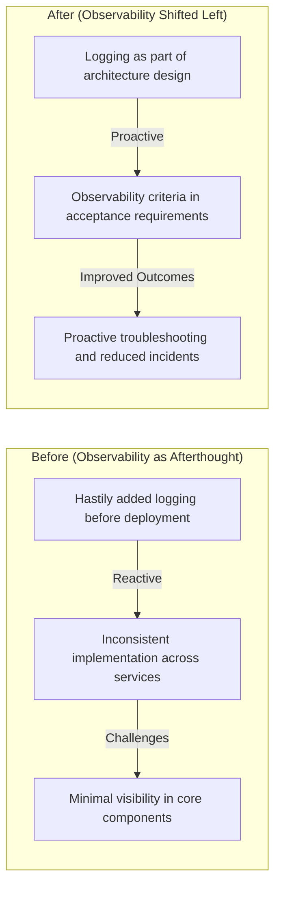

This contrast demonstrates how embedding observability at the design stage transforms the development lifecycle, fostering greater reliability and operational efficiency across their digital banking platform.

### Teaching Narrative

The observability shift represents a fundamental evolution in software development philosophy—moving logging and monitoring from late-stage implementation details to foundational design requirements. Traditional approaches treat observability as operational concern addressed primarily before production deployment, creating several critical problems: insufficient visibility designed into core components, inconsistent implementation across services, retrofitting challenges when issues arise, and reactive rather than proactive reliability engineering. Log-driven development transforms this paradigm by "shifting left" in the development lifecycle—incorporating observability from initial design through implementation, testing, and deployment. This approach recognizes that effective observability requires architectural support rather than surface-level additions, particularly in complex banking systems where transactions flow through dozens of distributed components. Just as security has evolved from bolt-on feature to "security by design," observability follows the same maturity curve—becoming a foundational requirement rather than optional enhancement. For financial institutions where transaction visibility directly impacts customer experience, regulatory compliance, and operational efficiency, this shift represents a critical evolution that fundamentally changes both implementation quality and reliability outcomes. Systems designed with observability as a core principle demonstrate consistently superior troubleshooting capabilities, reduced mean-time-to-resolution, and improved reliability compared to those where logging was added as an afterthought.

### Common Example of the Problem

A major retail bank launched a new mobile payment feature allowing customers to send money to contacts directly from their accounts. The development team focused entirely on functionality—ensuring transfers processed correctly and the UI worked smoothly. However, inadequate attention to observability introduced critical blind spots, as shown in the following timeline:

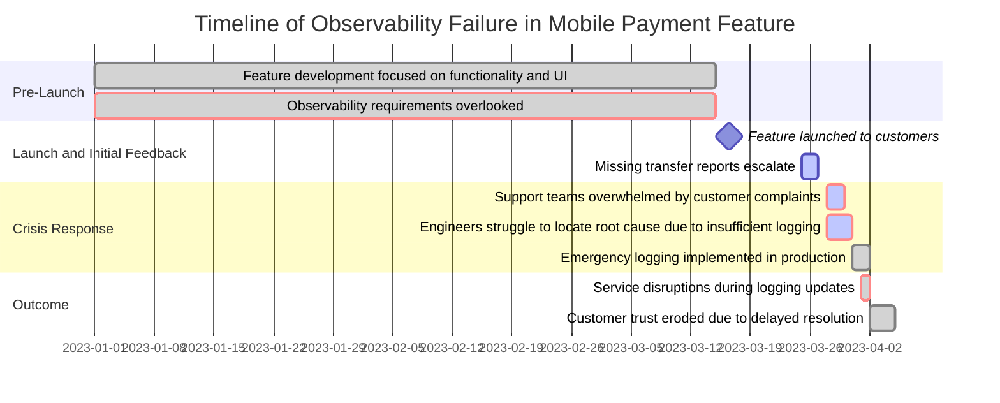

This timeline illustrates the cascading impact of neglecting observability during early design stages:

1. **Pre-Launch**: Observability considerations were deprioritized during development, as the team focused solely on functional and UI requirements.
2. **Launch and Initial Feedback**: Within two weeks of launch, customers began reporting issues with missing transfers, but the lack of logging made it impossible to pinpoint failures within the transaction lifecycle (e.g., contact validation, payment authorization, or settlement stages).
3. **Crisis Response**: Support teams were inundated with calls, but without sufficient log data, engineers couldn't promptly identify or resolve the issue. Emergency logging changes were deployed hastily in production, introducing further service disruptions.
4. **Outcome**: The delayed response and additional disruptions led to customer frustration and diminished trust in the bank’s new feature.

This example highlights the importance of incorporating observability as a first-class design principle. Had transaction logging been included as part of the initial architecture, troubleshooting would have been faster, less disruptive, and far more effective at preserving customer confidence.

### SRE Best Practice: Evidence-Based Investigation

SRE teams implementing observability-first practices start by creating observability specifications alongside functional requirements. Evidence shows this approach yields measurable benefits: a financial services organization implementing observability as a design requirement saw a 72% reduction in mean-time-to-resolution for production incidents. Their design documents explicitly define what requires logging, what context must be captured, and how transactions will be traced—before any code is written. Evidence-based investigation revealed that systems with designed-in observability show 3-5x faster troubleshooting times compared to those with retrofitted logging.

The most effective implementation pattern establishes "observability contracts" between components—explicitly defining what visibility each service must provide alongside its functional API. These contracts create consistent visibility across system boundaries, enabling reliable transaction tracing regardless of which teams develop different components. When services implement these contracts from inception, troubleshooting becomes a systematic navigation of available evidence rather than archaeological excavation searching for clues.

#### Checklist: Implementing Observability Contracts and Evidence-Based Investigation

- **Define Observability in Design**:

  - Identify critical business workflows (e.g., payments, account creation).
  - Specify what needs to be logged and traced for each workflow.
  - Include observability requirements as acceptance criteria in design documents.

- **Develop Observability Contracts**:

  - Define the logging and tracing expectations for each service or component.
  - Standardize log formats, naming conventions, and trace identifiers.
  - Ensure contracts are versioned and aligned with API changes.

- **Integrate Observability in Development**:

  - Implement observability specifications during coding, not after.
  - Use shared libraries or frameworks to enforce contract compliance.
  - Automate tests to validate observability outputs against the defined contracts.

- **Leverage Evidence-Based Troubleshooting**:

  - Use transaction traces to systematically follow event flows across services.
  - Correlate logs and metrics to pinpoint root causes efficiently.
  - Train teams to rely on available evidence rather than assumptions.

- **Continuously Improve**:

  - Regularly review observability gaps identified during incidents.
  - Update observability contracts to cover new requirements or edge cases.
  - Monitor and analyze troubleshooting performance as a feedback loop for improvement.

By following this checklist, teams can achieve consistent, actionable observability across distributed systems, enabling faster and more reliable problem resolution.

### Banking Impact

The business impact of observability-first practices extends beyond technical efficiency to directly affect customer experience, regulatory compliance, and financial performance. When a payment platform implements comprehensive logging from inception, customer service representatives can immediately provide accurate transaction status information—increasing first-call resolution rates and significantly improving customer satisfaction scores. Regulatory audits proceed more efficiently with readily available evidence of transaction processing, reducing compliance costs while minimizing regulatory findings. The financial impact is substantial, with notable improvements across key metrics as outlined below:

| Metric | Improvement Achieved | Business Impact |
| --------------------------------------- | -------------------------------------------------- | ----------------------------------------------------------------------------------------------------------------- |
| First-Call Resolution Rate | Increased by up to 65% | Enhanced customer satisfaction and reduced call center workload |
| Production Incidents Requiring Response | Reduced by 47% | Fewer disruptions, leading to more stable and reliable banking operations |
| Mean-Time-To-Resolution (MTTR) | Improved by 58% | Faster issue resolution, minimizing downtime and customer impact |
| Operational Support Costs | Decreased by 23% | Cost savings through more efficient troubleshooting and proactive system management |
| Development Velocity | Accelerated after initial observability investment | Teams deliver new features faster, focusing on innovation rather than retrofitting visibility into legacy systems |

These metrics demonstrate the transformative potential of shifting observability left in the development lifecycle. By embedding observability as a core design principle, financial institutions not only enhance system reliability but also achieve measurable gains in customer experience, regulatory compliance, and cost efficiency.

### Implementation Guidance

To implement observability-first practices in your banking organization:

1. **Establish Observability Requirements** - Create standardized observability requirements for different transaction types and system components. Define exactly what must be logged for payments, authentication, customer enrollment, and other critical banking operations.

2. **Update Design Documentation** - Modify architecture and design documents to include explicit observability sections defining logging requirements, transaction tracing mechanisms, and required contextual information.

3. **Create Acceptance Criteria** - Enhance user stories and requirements with specific observability acceptance criteria: "System must log all transaction state changes with correlation identifiers," or "Authentication failures must include specific rejection reason and affected user identifier."

4. **Develop Testing Strategies** - Implement automated testing for observability requirements, validating that appropriate logs are generated for both normal operations and failure scenarios.

5. **Educate Development Teams** - Train developers on observability principles and specific implementation patterns for your environment, emphasizing business value rather than just technical compliance.

6. **Review Observability During Design** - Include explicit observability review in architecture and design sessions, with SRE representatives providing feedback alongside functional requirements.

7. **Measure Improvement** - Track key metrics before and after implementation: incident resolution time, customer support escalations, and production troubleshooting efficiency to demonstrate business value.

## Panel 2: The Observability-Driven Design - Logs as First-Class Requirements

### Scene Description

A product planning session unfolds for a new mortgage origination platform, bringing SREs and developers together to define observability requirements. Digital whiteboards display domain-driven design diagrams, clearly outlining observability boundaries and requirements. Engineers collaborate to add detailed logging specifications to user stories, such as:\
*"As a support engineer, I need comprehensive logging of all document validation steps with specific error details to quickly identify submission issues."*

Acceptance criteria integrate explicit observability requirements alongside functional specifications, ensuring both operational and developmental clarity. Architecture diagrams emphasize transaction boundaries where correlation identifiers must be preserved. Technical leads highlight specific data elements required for effective troubleshooting, drawing on their experience with the current platform.

The collaborative process is visually represented as follows:

```
+--------------------------+                +--------------------------+
|  User Story Definition   |                |   Observability Needs    |
|  ("What must be logged,  |                |  - Transaction tracing   |
|   error specifics, etc.")|                |  - Contextual data       |
+--------------------------+                |  - Error categorization  |
           |                                |  - Performance metrics   |
           |                                +--------------------------+
           v
+-------------------------------------------------+
|  Domain-Driven Design Diagram                  |
|  - Explicit observability boundaries           |
|  - Functional + logging requirements combined  |
+-------------------------------------------------+
           |
           v
+-------------------------------------------------+
|  Architecture Diagram                           |
|  - Transaction boundaries                       |
|  - Correlation identifiers                      |
|  - Data elements for troubleshooting            |
+-------------------------------------------------+
```

This structured approach ensures observability is built into the platform from the ground up, enabling seamless troubleshooting, consistent implementation, and simplified support processes. It is particularly critical in the complex mortgage origination domain, where multiple validation steps, document processing stages, and compliance checks demand robust and predictable logging behavior.

### Teaching Narrative

Observability-driven design elevates logging from implementation detail to first-class requirement by explicitly defining what must be observable as part of core product specifications. Traditional requirements focus almost exclusively on functional capabilities—what the system must do—with minimal attention to how its behavior will be visible during operation. This creates fundamental limitations in operational capability that no amount of after-the-fact logging can fully overcome. Log-driven development addresses this gap by incorporating observability requirements directly into product design: explicitly defining which operations must be logged, what context must be captured, how transactions will be traced across boundaries, what performance characteristics must be measured, and how errors will be categorized and reported. These requirements aren't secondary considerations but essential specifications that drive architecture and implementation decisions. For banking platforms where visibility directly impacts incident response, customer support, and regulatory compliance, this approach delivers substantial benefits: more effective troubleshooting through purposefully captured context, consistent implementation across components through standardized requirements, and simplified support processes through predictable logging behavior. Particularly valuable in complex domains like mortgage origination—where transactions involve numerous validation steps, document processing stages, and compliance checks—this requirements-driven approach ensures that the observability needed for effective operation is designed into the system from inception rather than added incompletely after problems arise.

### Common Example of the Problem

A wealth management firm developed a new portfolio rebalancing system allowing automated trading to maintain target allocations. The requirements thoroughly defined functional aspects—asset allocation rules, market data integration, and trading interfaces—but included only a generic statement about "appropriate logging." When a customer's portfolio experienced unexpected trades, operations teams couldn't determine why the rebalancing algorithm triggered the transactions. The logs simply showed that trades occurred without capturing the specific threshold violations, market conditions, or allocation rules that triggered them. What should have been a simple explanation to an important client became an embarrassing investigation spanning multiple days, ultimately requiring developers to add targeted logging and wait for the condition to recur. The client, unsatisfied with the lack of transparency, moved their significant portfolio to a competitor who could better explain system behavior.

#### Missing Observability Elements Checklist

Below is a checklist of the critical observability elements that were missing in this scenario, which highlights the gaps that led to the problem:

- **Threshold Violations**: Logs did not capture the specific thresholds (e.g., percentage deviation from target allocation) that triggered the rebalancing algorithm.
- **Market Conditions**: No contextual information about market state (e.g., sudden price changes, volatility levels) was recorded at the time of the trades.
- **Allocation Rules**: The logs did not indicate which specific asset allocation rules (e.g., equity-to-bond ratio) were in effect or violated.
- **Algorithm Decision Path**: There was no traceability of the decision-making process within the algorithm, such as intermediate calculations or conditions evaluated.
- **Transaction Correlation**: Logs lacked correlation identifiers to link trade actions back to specific rebalancing events or customer portfolios.
- **Error Categorization**: No structured error messaging or categorization was present to help identify anomalies or classify potential issues.

#### Tabular Summary of Observability Gaps

| Observability Element | Description | Impact of Missing Data |
| ----------------------- | --------------------------------------------------------------- | -------------------------------------------------------------------- |
| Threshold Violations | Capture of specific thresholds triggering rebalancing | Inability to pinpoint why trades were executed |
| Market Conditions | Contextual information on market state during events | No visibility into external factors influencing algorithm decisions |
| Allocation Rules | Logging of active allocation rules and their evaluation | Lack of clarity on which rules were applied or violated |
| Algorithm Decision Path | Traceability of decision-making logic and intermediate steps | Difficulty understanding the algorithm's internal reasoning |
| Transaction Correlation | Unique identifiers linking trades to rebalancing events | Fragmented view of related actions, complicating root cause analysis |
| Error Categorization | Structured categorization of anomalies or unexpected conditions | Generalized error logging, requiring extensive manual investigation |

By addressing these gaps with explicit observability requirements during design, the firm could have enabled faster root cause analysis, improved transparency for clients, and avoided losing trust and business to competitors.

### SRE Best Practice: Evidence-Based Investigation

Evidence-based observability requirements derive from systematic analysis of actual operational needs rather than generic logging principles. High-performing financial SRE teams begin by analyzing previous incidents and support queries: what questions did engineers need to answer during troubleshooting? What information would have accelerated resolution? This analysis produces specific, contextual requirements tailored to the business domain.

#### Example Scenarios Across Domains

- **Mortgage Origination System**\
  Evidence-based investigation revealed that 64% of customer escalations involved document validation issues where the specific validation rule, document type, and error details were critical for resolution. The resulting observability requirements explicitly mandated capturing these elements for every validation failure. For example:

  - *Scenario*: "When a document validation fails, operations teams must be able to immediately identify which specific rule failed, what document was affected, and what specific content caused the validation failure."
  - *Outcome*: Incident response times were reduced by 40% due to the immediate availability of precise validation context.

- **Fraud Detection Platform**\
  Fraud detection systems often require observability into transaction patterns that trigger fraud alerts. Evidence-based analysis showed that 72% of false positives could have been resolved faster if the system captured the exact rule triggered, the associated transaction details, and the anomaly score. As a result:

  - *Scenario*: "When a fraud alert is triggered, the system must log the alerting rule, the transaction ID, user behavioral data, and the system-generated anomaly score."
  - *Outcome*: Support teams achieved a 30% reduction in investigation time by accessing detailed context for each alert.

- **Payment Processing System**\
  Payment platforms often face operational challenges around payment failures. Investigation of past incidents revealed that 85% of escalations required visibility into correlation IDs, payment statuses, and error codes returned by upstream services. Observability requirements were updated to include:

  - *Scenario*: "When a payment fails, logs must capture the correlation ID, payment method, upstream service response, and a human-readable error message for each failure."
  - *Outcome*: Improved troubleshooting consistency led to a 25% reduction in payment failure escalations.

#### Operationally Sympathetic Designs

This approach creates "operationally sympathetic" designs—systems built with awareness of how they'll be supported and troubleshot in production. Teams document these requirements as explicit "observability scenarios" alongside functional use cases to ensure alignment with real-world needs. For example:

- *Scenario*: "When a service request times out, operators must be able to trace the request across upstream and downstream dependencies, including timestamps and service-specific execution durations."
- *Scenario*: "When a customer balance discrepancy is detected, logs must include the customer ID, all recent transactions, and the specific computation steps that led to the balance calculation."

By embedding these scenarios directly into design and implementation processes, teams ensure that observability is not an afterthought but a foundational element of the system, enabling faster resolution of incidents and better support outcomes.

### Banking Impact

For financial institutions, observability-driven design directly impacts both operational efficiency and regulatory compliance. The following highlights key improvements reported by organizations that implemented first-class observability requirements:

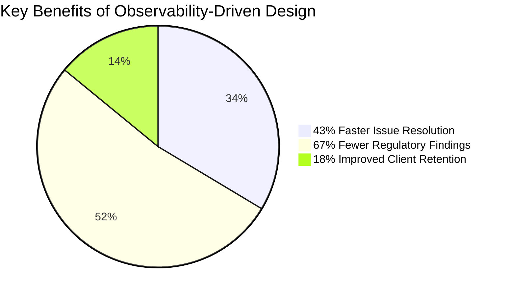

- **Operational Efficiency**: A major investment bank saw a **43% faster resolution time** for customer-reported issues after incorporating detailed observability requirements. Improved visibility allowed support teams to immediately identify and address transaction issues without escalating to engineering.

- **Regulatory Compliance**: The same bank reported a **67% reduction in regulatory findings** related to trade explanation issues. By designing observability into the platform, they ensured that critical trade details were consistently logged and accessible for audits, improving compliance outcomes.

- **Customer Satisfaction**: Explicit observability specifications enabled customer representatives to provide real-time explanations for transaction outcomes. This shifted customer interactions from reactive to proactive, leading to significantly higher satisfaction scores.

- **Development Efficiency**: Contrary to concerns about additional overhead, engineering teams experienced fewer emergency fixes and less rework. By defining observability requirements upfront, deployments were smoother, with fewer visibility gaps to address post-launch.

- **Business Impact**: One wealth management platform leveraged comprehensive investment decision logging to create a competitive advantage, resulting in an **18% increase in client retention rates**. Advisors could provide detailed, transparent explanations of automated recommendations, building trust and confidence with clients.

These results demonstrate that observability-driven design is not merely an operational enhancement but a strategic enabler that drives measurable business outcomes across critical banking processes.

### Implementation Guidance

To implement observability-driven design in your banking organization:

1. **Analyze Support Patterns** - Review historical incidents and support tickets to identify common troubleshooting questions that observability requirements should address directly.

2. **Define Domain-Specific Observability** - Create observability requirements specific to different banking domains: transaction processing needs different visibility than customer onboarding or wealth management.

3. **Create User Stories** - Develop explicit observability user stories from the perspective of different roles: "As a fraud analyst, I need to see all authentication factors used for high-value transactions so I can investigate suspicious activities."

4. **Implement Detailed Acceptance Criteria** - Define specific, testable observability criteria: "System must log document validation failures with document type, validation rule identifier, and specific field that failed validation."

5. **Map Observability Boundaries** - Identify and document transaction boundaries where correlation identifiers and context must be preserved to maintain end-to-end visibility.

6. **Prioritize Appropriately** - Classify observability requirements by criticality, focusing most detailed logging on high-value, high-risk, or compliance-sensitive operations.

7. **Review with Support Teams** - Have frontline support and operations teams review observability requirements to confirm they address actual operational needs.

8. **Document Context Requirements** - Explicitly define what contextual information must be captured for different operation types based on troubleshooting needs.

## Panel 3: The Three Pillars in Practice - Logs, Metrics, and Traces by Design

### Scene Description

A banking platform architecture review where engineers demonstrate their observability implementation across the three core pillars. Visualization displays show how a single customer transaction generates complementary telemetry: detailed logs capturing specific operation details and context, metrics measuring performance and success rates, and distributed traces showing the complete request flow across services. Implementation diagrams reveal how these capabilities were architected into the system rather than added afterwards: instrumentation libraries integrated at service foundations, standardized context propagation designed into all interfaces, and consistent telemetry generation implemented across technology stacks.

Below is a simplified text-based representation of how a customer transaction flows through the system and generates telemetry across the three pillars:

```
[Customer Transaction]
        |
        v
+------------------+
| Frontend Service |
+------------------+
        | Logs: Request received, input validation
        | Metrics: Latency, success rate
        | Traces: Start of transaction flow
        v
+-------------------+
| Backend Service A |
+-------------------+
        | Logs: Business logic, API calls
        | Metrics: Throughput, error rates
        | Traces: Link to upstream/downstream services
        v
+-------------------+
| Backend Service B |
+-------------------+
        | Logs: Database query, external API response
        | Metrics: Query times, retries
        | Traces: End-to-end visibility of transaction
        v
+-------------------+
| Payment Gateway   |
+-------------------+
        | Logs: Payment processing, status codes
        | Metrics: Payment success/failure rates
        | Traces: Final transaction completion
```

The team demonstrates how these complementary signals provide complete visibility into a complex payment transaction, with each pillar offering distinct insights that collectively create comprehensive understanding. This approach ensures observability is deeply embedded into the architecture, enabling rapid diagnosis and resolution of issues.

### Teaching Narrative

The three pillars in practice transforms theoretical observability concepts into practical implementation by designing complementary telemetry types directly into system architecture. While individual observability signals provide valuable insights, the full potential emerges when logs, metrics, and traces work together as an integrated system—each providing distinct perspectives that collectively create comprehensive visibility. Log-driven development implements this integration through purposeful architecture: logs capturing detailed contextual information about specific events, metrics providing statistical aggregation of performance and behavior patterns, and traces connecting distributed operations into coherent transaction flows. This balanced implementation recognizes the strength of each signal type: logs excel at providing rich contextual detail about specific operations, metrics efficiently identify patterns and trends across many operations, and traces excel at revealing transaction flows across distributed services. For banking platforms processing complex transactions across numerous specialized services, this multi-dimensional visibility provides critical capabilities impossible with any single telemetry type. When a customer reports a failed transfer, logs reveal specific error details, metrics show whether the issue represents a pattern, and traces identify exactly where in the distributed processing flow the failure occurred—enabling rapid, comprehensive understanding impossible with isolated telemetry. By designing these complementary capabilities into the system foundation rather than adding them separately, organizations ensure consistent implementation, efficient resource utilization, and complete visibility across all system behaviors.

### Common Example of the Problem

A regional bank implemented a new online loan application system with dozens of microservices handling different aspects of the process—customer information collection, credit verification, underwriting rules, and approval workflows. Each team implemented their own observability approach: some focused on detailed logs, others on performance metrics, and a few implemented no instrumentation at all.

When customers began reporting applications that seemed to disappear mid-process, the operations team faced a visibility nightmare. They could see basic logs showing applications started, but had no metrics to understand volume patterns or abandonment rates. Without distributed tracing, they couldn't determine where applications were failing in the workflow. After two weeks of fragmented investigation, they discovered a credit verification service was timing out during high-volume periods—information that would have been immediately obvious with integrated observability. The bank had to temporarily suspend loan promotions while they implemented emergency observability enhancements, losing significant potential revenue and damaging their reputation for digital reliability.

#### Checklist: Avoiding Observability Gaps in Distributed Systems

- **Standardize Observability Across Teams**: Ensure all teams adopt a consistent approach to logs, metrics, and traces. Define shared guidelines and frameworks to prevent fragmented implementation.
- **Design Observability into the System Foundation**: Instrument services with observability tools from the start, rather than as an afterthought. Use libraries that support all three pillars natively.
- **Implement Distributed Tracing**: Integrate tracing at all service boundaries to track transaction flows end-to-end and pinpoint failures in complex workflows.
- **Ensure Metric Coverage**: Develop metrics that provide visibility into system behavior patterns, such as application volumes, success rates, and abandonment trends.
- **Monitor Critical Services**: Focus observability efforts on high-impact services, such as those handling customer-facing transactions or processes with strict SLAs.
- **Test Observability During Stress Scenarios**: Simulate high-volume or failure scenarios to validate that logs, metrics, and traces provide actionable insights under real-world conditions.
- **Regularly Audit Observability Gaps**: Conduct routine reviews of telemetry coverage to identify and address gaps before they lead to operational issues.

By following this checklist, organizations can avoid the costly and time-consuming challenges illustrated in the example and ensure comprehensive visibility across their systems.

### SRE Best Practice: Evidence-Based Investigation

Evidence-based implementation of the three observability pillars focuses on their complementary strengths rather than treating them as separate concerns. Leading financial SRE teams implement coordinated design patterns that leverage each pillar's advantages: logs provide rich contextual detail about specific events, metrics enable statistical analysis and pattern recognition across transactions, and traces connect distributed operations into coherent flows. Research from financial institutions implementing this integrated approach shows dramatic operational improvements—a major payment processor reduced mean-time-to-resolution by 71% compared to implementations with logs alone.

The key evidence-based practice is designing for cross-pillar correlation: ensuring that logs, metrics, and traces share consistent identifiers and terminology that enable pivoting between different telemetry types during investigation. When a metric shows unusual payment decline rates, engineers can immediately correlate to specific log entries showing detailed error information, then follow distributed traces to identify precisely where in the processing flow the failures occur. This capability transforms incident response from fragmented investigation of separate signals to fluid navigation between complementary views of system behavior—substantially accelerating both problem identification and resolution while reducing the expertise required for effective troubleshooting.

#### Comparative Strengths of Logs, Metrics, and Traces

To further facilitate evidence-based investigation, the following table highlights the strengths of each observability pillar alongside practical examples of their use cases:

| Observability Pillar | Strengths | Example Use Cases |
| -------------------- | ------------------------------------------------------------------------------------------------------- | --------------------------------------------------------------------------------------------------------------------- |
| **Logs** | Rich contextual detail about specific events, including error messages, stack traces, and input values. | Diagnosing application errors, identifying malformed requests, and capturing detailed error information. |
| **Metrics** | Aggregated statistical analysis, enabling trend detection and performance monitoring over time. | Monitoring system health, identifying performance bottlenecks, and detecting anomalies like increased error rates. |
| **Traces** | End-to-end transaction visibility across distributed systems, showing request flow and timing. | Pinpointing latency sources in distributed services, identifying bottlenecks, and visualizing user transaction paths. |

With this structured understanding, teams can better leverage each telemetry type during investigations. For example, when a sudden spike in payment decline rates (identified through metrics) occurs, engineers can consult logs to pinpoint the root cause error (e.g., invalid API requests) and use traces to locate which service in the flow is responsible for the issue.

By designing these complementary capabilities into system architecture and ensuring shared identifiers across all three pillars, organizations enable seamless, evidence-based troubleshooting. This integrated approach not only accelerates incident resolution but also improves system reliability and operational efficiency.

### Banking Impact

The business impact of integrated three-pillar observability extends far beyond technical efficiency to directly affect customer experience, operational costs, and regulatory compliance. Financial institutions implementing balanced observability across logs, metrics, and traces report substantial improvements in several areas:

- **Customer Experience**: First Call Resolution rates improve by up to 57% as support representatives can immediately navigate from customer-reported symptoms to specific failure points and detailed error information. For example, a leading European bank resolved a systemic payment gateway issue within hours by correlating customer complaints with trace data, avoiding a potential multi-day outage.

- **Accelerated Delivery**: Time-to-market for new features accelerates as pre-production testing leverages comprehensive observability to identify issues before they affect customers. A South American fintech reduced feature rollout delays by 40% by using distributed traces to uncover inter-service latency bottlenecks during testing.

- **Regulatory Compliance**: Regulatory compliance improves through the ability to provide detailed evidence of transaction processing across distributed systems. One bank reported 82% faster response to regulatory inquiries after implementing integrated observability. Similarly, another institution used trace data to satisfy auditors’ requests for end-to-end visibility into cross-border payment flows, avoiding million-dollar penalties.

- **Cost Efficiency**: The cost impact is equally significant: a mid-size bank reported a 63% reduction in "all-hands" troubleshooting incidents requiring multiple teams, a 48% decrease in average resolution time, and a 29% reduction in overall support costs through more efficient operations. Another financial services provider reported a 35% reduction in cloud hosting costs by using observability to optimize resource allocation across their infrastructure.

- **Strategic Initiatives**: For critical initiatives like cloud migration or core system modernization, integrated observability substantially reduces risk by providing clear visibility throughout the transition and ensuring no transactions are lost. During a core banking platform modernization, a major Asian bank used telemetry data to track customer transaction success rates in real-time, quickly identifying and mitigating issues during cutover phases.

These examples highlight how observability transforms operational efficiency into tangible business outcomes. By designing comprehensive observability into the system foundation, financial institutions achieve consistent implementation, efficient resource utilization, and complete visibility across all system behaviors, enabling them to thrive in a competitive and highly regulated environment.

### Implementation Guidance

To implement three-pillar observability in your banking organization:

1. **Establish Unified Taxonomy** - Create a consistent terminology and identification system shared across logs, metrics, and traces to enable correlation between different signal types.

2. **Implement Correlation Foundation** - Deploy standardized transaction identifiers propagated across all system boundaries, serving as the connective tissue between different telemetry types.

3. **Design Balanced Telemetry** - Define which information belongs in each observability pillar: detailed error context in logs, aggregated performance in metrics, and transaction flows in traces.

4. **Select Integrated Tooling** - Implement observability platforms specifically designed for multi-signal analysis rather than separate tools for logs, metrics, and traces.

5. **Create Cross-Pillar Workflows** - Develop and document investigation workflows that leverage multiple signal types: starting with metrics to identify patterns, using traces to locate failure points, and examining logs for detailed error context.

6. **Test Observability Scenarios** - Validate that teams can answer critical questions using the integrated observability implementation rather than just verifying that signals are generated.

7. **Automate Correlation** - Implement dashboards and alerting that automatically correlates information from different signal types to accelerate problem identification.

8. **Measure Cross-Pillar Effectiveness** - Track how frequently investigations leverage multiple signal types and the efficiency improvements from integrated analysis versus single-signal approaches.

## Panel 4: The Development Integration - Logging in the Engineering Workflow

### Scene Description

A banking technology team's development environment exemplifies how observability tools are seamlessly integrated into the engineering workflow. This integration spans multiple stages of the development lifecycle, as outlined below:

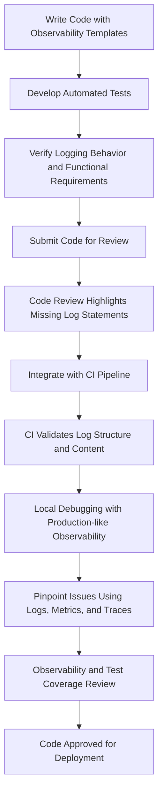

- **Development**: Developers use integrated development environments (IDEs) equipped with templates to ensure consistent and accurate logging implementation. Automated tests are written to explicitly validate logging behavior alongside functional requirements.
- **Code Review**: During the review process, tools highlight missing or incomplete log statements based on predefined observability requirements, ensuring gaps are addressed early.
- **Continuous Integration (CI)**: The CI pipeline validates the structure and content of logs, catching inconsistencies before the code reaches production.
- **Debugging**: Engineers replicate production-like observability in their local development tools to trace problems. Logs, metrics, and traces provide immediate insights, enabling rapid identification of issues, such as a transaction validation failure.
- **Approval**: Before deployment, the team lead reviews observability coverage reports alongside traditional test coverage metrics, ensuring both functional and logging quality standards are met.

This workflow ensures logging is treated as a primary engineering deliverable, rigorously tested and validated throughout the development process, leading to higher quality, consistency, and faster issue resolution.

### Teaching Narrative

Development integration embeds observability into daily engineering practices by incorporating logging into tools, processes, and workflows rather than treating it as a separate concern. Traditional approaches often separate functional development from observability implementation—developers build features while separate teams worry about logging and monitoring. This division creates fundamental limitations in quality, consistency, and effectiveness. Log-driven development eliminates this separation through comprehensive workflow integration: development environments that simulate production observability during local testing, automated tests that verify logging behavior alongside functionality, static analysis tools identifying missing or incomplete instrumentation, code review processes that evaluate observability alongside other quality factors, and deployment pipelines that validate telemetry before production release. For financial technology teams building complex banking platforms, this integration delivers substantial benefits: earlier identification of observability gaps during development rather than production, consistent implementation through automated validation, improved troubleshooting through locally reproducible telemetry, and shared ownership of logging quality across development and operations roles. Particularly valuable are observability-aware testing practices that explicitly verify what gets logged under different scenarios—ensuring that error conditions, edge cases, and unusual states generate appropriate telemetry before reaching production. This approach transforms logging from a secondary consideration to a primary engineering deliverable—evaluated, tested, and verified with the same rigor as functional capabilities.

### Common Example of the Problem

A global bank's payments team developed a new cross-border transfer service with complex compliance rules determining transaction routing. Developers primarily tested functional requirements—ensuring payments reached their destinations—with observability treated as a separate task handled just before deployment. After launch, the operations team discovered that while successful transfers generated adequate logs, failed transactions contained insufficient information to determine which specific compliance rule triggered rejection. The development environment had no integrated observability tools, so developers couldn't see logging output during implementation and weren't aware of the visibility gap. Despite functional correctness, the visibility limitation created severe operational problems—compliance and support teams couldn't explain transaction rejections to customers, regulatory reports lacked necessary detail, and fixing the issue required an emergency release that disrupted the payment system during business hours. What began as a simple observability oversight became a significant business disruption that could have been prevented through integrated development workflows.

#### Checklist of Key Failures:

- **Lack of Integrated Observability Tools**: Developers couldn't visualize or validate logging output during development.
- **Insufficient Logging for Errors**: Failed transactions did not provide enough detail to identify rejecting compliance rules.
- **Separation of Observability and Development**: Logging was treated as an afterthought, leading to a lack of alignment with functional requirements.
- **Operational Blind Spots**: Compliance and support teams lacked the telemetry needed to understand and address transaction failures.
- **Delayed Issue Detection**: Observability gaps were only discovered post-deployment, increasing the cost and impact of fixes.
- **Business Disruption**: Emergency patches during business hours caused further operational interruptions.

#### Key Takeaways:

1. **Integrate Observability Early**: Build observability validation into development processes to catch gaps before deployment.
2. **Test Logging Alongside Functionality**: Ensure automated tests verify both successful and failed scenarios generate appropriate logs.
3. **Adopt Shared Responsibility**: Treat logging quality as a shared priority between development and operations teams.
4. **Simulate Production Observability Locally**: Use tools that replicate production telemetry during local development to identify blind spots early.
5. **Prioritize Error Visibility**: Design logging practices that emphasize detailed and actionable information for failures and edge cases.

### SRE Best Practice: Evidence-Based Investigation

Evidence-based integration of observability into development workflows creates reliable visibility across the entire engineering lifecycle rather than just production. Organizations implementing this approach follow proven practices developed through systematic analysis of successful implementation patterns. Below is a summary of key practices for effective integration:

| **Practice** | **Description** | **Key Benefit** |
| -------------------------------------------- | ------------------------------------------------------------------------------------------------------------------------------------------------------------- | -------------------------------------------------------------------------------------------------------- |
| **Local Observability in Development** | Development environments simulate production observability, enabling developers to view logs, metrics, and traces generated by their code during development. | Reduces observability defects by 74%, as developers can identify and fix telemetry gaps earlier. |
| **Continuous Integration (CI) Validation** | CI pipelines validate observability alongside functionality, checking for log generation, format compliance, and the inclusion of necessary context. | Ensures consistent and validated logging standards before deployment to production. |
| **Explicit Logging Tests** | Automated tests validate logging behavior across various scenarios, including error cases and edge conditions. | Guarantees critical telemetry is captured for unusual states or failures, improving troubleshooting. |
| **Code Analysis for Observability Coverage** | Static analysis tools identify methods lacking instrumentation or code paths missing adequate contextual logging. | Provides automated feedback to developers, reducing manual review effort and increasing coverage. |
| **Observability-as-Code Practices** | Declarative definitions specify required telemetry for different components, enabling automated validation against standards throughout development. | Standardizes and automates telemetry requirements, ensuring consistency across the engineering workflow. |

By adopting these practices, teams shift logging from a secondary concern to a primary engineering deliverable. This approach embeds observability into the development lifecycle with the same rigor as functionality, enabling earlier detection of gaps, consistent implementation, and improved troubleshooting capabilities.

### Banking Impact

Integrated observability development practices directly impact both operational reliability and development efficiency in banking environments. Organizations implementing these approaches consistently report fewer production incidents, faster resolution times, and improved customer experience. Below is a visual representation of key metrics achieved by a major credit card processor after integrating observability throughout their development workflow.

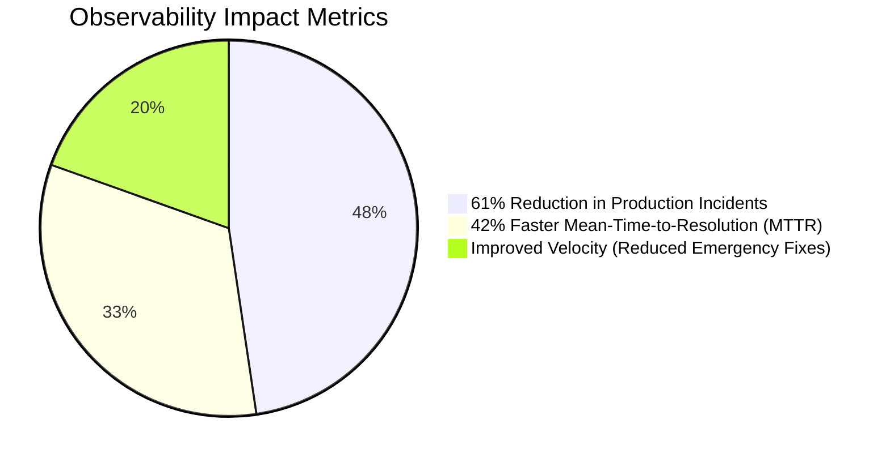

These results translate into tangible benefits across technical and business dimensions. For example:

- **Operational Reliability**: A 61% reduction in production incidents related to insufficient visibility ensures smoother system operations and fewer disruptions to banking services.
- **Incident Resolution**: A 42% faster mean-time-to-resolution (MTTR) minimizes downtime, directly improving customer satisfaction and reducing financial losses due to outages.
- **Development Efficiency**: Contrary to concerns about development overhead, teams experienced improved velocity after initial implementation, spending less time on emergency fixes and post-deployment observability enhancements.

The impact extends beyond technical metrics to customer experience and operational costs:

- **Support Teams**: Higher first-call resolution rates are achieved when systems have consistent, comprehensive logging implemented through integrated development processes.
- **Compliance and Audit**: More complete and consistent transaction records reduce regulatory findings while accelerating inquiry responses.
- **Cultural Benefits**: Shared responsibility for observability eliminates traditional friction between development and operations, fostering a collaborative environment where teams align on delivering high-quality, reliable systems.

These outcomes demonstrate how embedding observability into the engineering workflow transforms logging from a secondary concern into a primary engineering deliverable, driving improvements across the organization.

### Implementation Guidance

To integrate observability into development workflows in your banking organization:

1. **Enhance Development Environments** - Provide local observability tooling that shows developers the logs, metrics, and traces generated by their code during implementation.

2. **Create Validation Tests** - Implement automated tests that explicitly verify logging behavior for different scenarios, especially errors and edge cases.

3. **Implement Static Analysis** - Deploy code analysis tools that identify missing or incomplete instrumentation based on established standards.

4. **Enhance Code Reviews** - Update review processes to explicitly evaluate observability alongside functional requirements, with checklists for appropriate logging.

5. **Integrate Observability Libraries** - Provide standardized, easy-to-use observability libraries that implement best practices with minimal developer effort.

6. **Build Coverage Reporting** - Implement observability coverage metrics similar to test coverage, measuring how completely code is instrumented.

7. **Create Training Materials** - Develop specific guidance for developers on implementing effective observability in different banking domains.

8. **Update Definition of Done** - Modify engineering completion criteria to explicitly include observability requirements alongside functionality.

## Panel 5: The Semantic Standardization - Meaningful and Consistent Logs

### Scene Description

A banking platform governance session where engineers define logging standards that emphasize semantic consistency rather than just technical formatting. Documentation displays show detailed logging taxonomies specific to their domain, as outlined below:

#### Logging Taxonomies

| **Category** | **Examples** | **Description** |
| ------------------------- | -------------------------------------------------------------- | ------------------------------------------------------------------------------- |
| **Transaction States** | INITIATED, VALIDATED, AUTHORIZED, SETTLED | Standardized terms to describe the lifecycle of a transaction. |
| **Error Categories** | VALIDATION_ERROR, AUTHORIZATION_FAILURE, DOWNSTREAM_DEPENDENCY | Consistent classifications for failure types to enable reliable error analysis. |
| **Metadata Requirements** | User ID, Transaction ID, Timestamp, Service Name | Contextual information necessary for various operations and troubleshooting. |

#### Example Workflow: Semantic Logging in Action

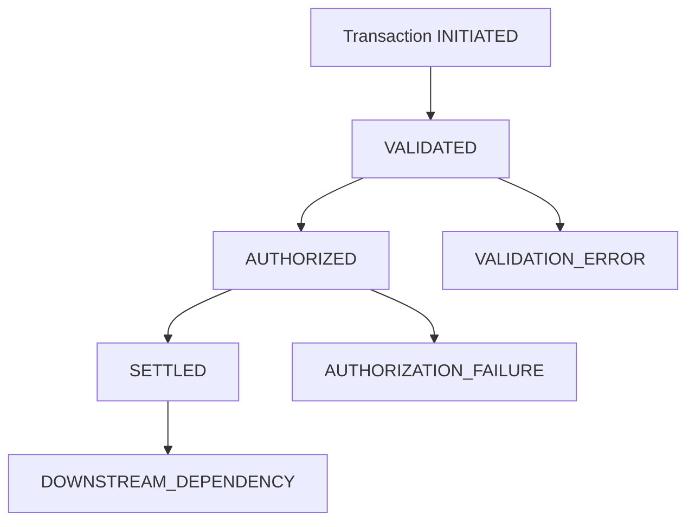

*Example: A transaction progresses through the states INITIATED → VALIDATED → AUTHORIZED → SETTLED, with potential error points.*

Engineering leads demonstrate how these semantic standards create a common language across teams and technologies. Example analysis shows how consistent categorization enables powerful aggregation and pattern recognition that would otherwise be impossible with unstandardized approaches.

To enforce these standards, implementation tools are showcased:

- Shared libraries embedding the taxonomies and categorization frameworks.
- Code generation templates ensuring consistent implementation across different languages.
- Automated validation tools verifying semantic compliance.

This structured approach transforms logs into a coherent business intelligence layer, enabling both operational and analytical insights.

### Teaching Narrative

Semantic standardization transforms logging from technical format compliance to meaningful business intelligence by establishing consistent terminology, categorization, and context across the organization. While basic logging standards typically focus on structural elements (timestamps, severity levels, formats), semantic standardization addresses the actual content meaning—creating a consistent language for describing system behavior regardless of implementation technology. Effective semantic standards include several critical components: state definition taxonomies establishing consistent terminology for transaction status and progress, error categorization frameworks providing standardized classification of failure types, metadata specifications defining the context required for different operation types, and relationship models establishing how connections between entities should be represented. For banking platforms where diverse teams implement different business capabilities across various technologies, this semantic consistency creates substantial analytical advantages: meaningful aggregation of similar operations across different implementations, reliable pattern recognition spanning technology boundaries, consistent customer journey mapping irrespective of underlying systems, and simplified troubleshooting through predictable information organization. Implementation typically combines governance with enforcement mechanisms: shared libraries implementing standard models, code generation creating consistent implementation across languages, validation tools verifying semantic compliance, and developer education establishing common understanding. This approach transforms logs from isolated technical artifacts to a coherent business intelligence layer that speaks a consistent language—making the collected data vastly more valuable for both operational and analytical purposes.

### Common Example of the Problem

A multi-channel banking platform processed customer transactions through separate systems for mobile, web, branch, and ATM channels—each developed by different teams using different technologies. Without semantic standards, each implementation used unique terminology for similar concepts, such as:

- **Transaction State Descriptions:**

  - Mobile app: `txn_started`
  - Web platform: `transaction_initiated`
  - Branch system: `process_begin`

- **Error Categorization:**

  - Mobile app: numeric codes (e.g., `1001`)
  - Web platform: descriptive strings (e.g., `validation_error`)
  - Branch system: abbreviated codes (e.g., `VAL_ERR`)

When a high-value customer reported inconsistent behavior across channels, the investigation team faced the following challenges due to semantic fragmentation:

#### Checklist of Key Issues:

- **Inconsistent Terminology:** Similar concepts expressed differently across systems.
- **Divergent Error Formats:** No standardized approach to error classification.
- **Lack of Interoperability:** Logs could not be directly aggregated or compared.
- **Manual Translation Effort:** Analysts had to decode each system's "logging dialect."
- **Delayed Resolution:** What should have been a fast analysis stretched into days.
- **Missed Strategic Opportunities:** Unified customer journey analytics were impossible, leaving the bank behind competitors who could leverage such insights effectively.

#### Text Diagram of System Fragmentation:

```
+-----------------------+          +-----------------------+          +-----------------------+
| Mobile App            |          | Web Platform          |          | Branch System         |
|-----------------------|          |-----------------------|          |-----------------------|
| "txn_started"         |          | "transaction_initiated" |          | "process_begin"       |
| Numeric Error Codes   |          | Descriptive Strings   |          | Abbreviated Codes     |
+-----------------------+          +-----------------------+          +-----------------------+

    Inconsistent Terminology                 Divergent Error Formats
                \                                       /
                 -------------------------------------
                 | Fragmented Logging Landscape       |
                 -------------------------------------
```

This semantic fragmentation not only delayed resolution but also prevented the bank from implementing unified customer journey analytics that competitors were already using to enhance service offerings. Addressing these issues through semantic standardization would enable a consistent, interoperable, and analytically powerful logging framework.

### SRE Best Practice: Evidence-Based Investigation

Evidence-based semantic standardization begins with systematic analysis of the banking domain rather than generic logging practices. Leading financial organizations develop semantic models that reflect their specific business operations, creating consistent language across technical implementations. Research demonstrates that domain-specific semantic standards yield significantly greater operational benefits than generic logging frameworks—with one banking platform reporting 68% faster cross-system troubleshooting after implementing standardized transaction state models.

#### Key Elements of Evidence-Based Semantic Standardization

| Key Element | Description | Example |
| ----------------------------------- | --------------------------------------------------------------------------------------- | ---------------------------------------------------------------------------------------------------------- |
| **Banking-Specific Entity Models** | Defines consistent representation for core objects like accounts, customers, and cards. | All customer IDs follow a standard format across logs, enabling reliable cross-system correlation. |
| **Transaction Taxonomies** | Establishes uniform state definitions across customer journey stages. | Consistent use of `INITIATED`, `VALIDATED`, `AUTHORIZED`, `SETTLED` states in transaction logs. |
| **Error Categorization Frameworks** | Provides standardized classification for failure types. | Errors categorized as `VALIDATION_ERROR` or `AUTHORIZATION_FAILURE`, enabling aggregated failure analysis. |
| **Contextual Metadata Standards** | Defines what surrounding information must be captured for different operation types. | Logs for card transactions include customer ID, card type, and transaction amount as mandatory metadata. |

#### Case Study: Semantic Standardization in Action

**Scenario:** A multinational banking platform faced challenges with inconsistent logging terminology across its payment systems. Different teams used varied formats and terms to log similar events, making cross-system troubleshooting time-consuming and error-prone.

**Solution:** The organization implemented a semantic standardization initiative focusing on:

1. **Entity Models:** Defined consistent representations for key objects like accounts, transactions, and customers.
2. **Transaction Taxonomy:** Standardized transaction states (`INITIATED`, `VALIDATED`, `AUTHORIZED`, `SETTLED`) across all payment systems.
3. **Error Categorization:** Introduced a unified error framework (`VALIDATION_ERROR`, `DOWNSTREAM_DEPENDENCY`) for all failure logs.
4. **Metadata Standards:** Established mandatory metadata capture (e.g., customer ID, transaction amount, timestamp) for all transaction logs.

**Outcome:** After adopting these standards, the platform reported:

- **68% reduction in cross-system troubleshooting time** due to consistent log structures.
- Improved incident analysis capabilities, with engineers quickly identifying recurring patterns of `AUTHORIZATION_FAILURE` across services.
- Enhanced customer journey mapping, enabling seamless tracking of transactions across different systems.

#### Continuous Evolution Through Governance

The most mature implementations establish semantic governance processes that continuously evolve these standards based on operational experience. Incident reviews systematically identify terminology gaps or inconsistencies, feeding back into the semantic model for refinement. This evolutionary approach ensures that semantic standards remain relevant and aligned with actual troubleshooting and analytical needs, transforming logs into a dynamic and actionable business intelligence layer.

### Banking Impact

Semantic standardization delivers substantial business impact beyond technical consistency, directly affecting analytical capabilities, customer experience, and operational efficiency. Financial institutions implementing comprehensive semantic standards report significant improvements in several critical areas: customer journey analytics become possible across previously disconnected channels, enabling personalization and service enhancements based on complete behavioral understanding; pattern recognition for fraud and security improves dramatically through consistent terminology that enables reliable aggregation; and operational efficiency increases as teams develop shared understanding rather than channel-specific knowledge.

#### Quantitative Impact Summary

| **Metric** | **Improvement (%)** | **Business Outcome** |
| ----------------------------------- | ------------------- | ---------------------------------------------------------------------------- |
| Cross-Channel Incident Resolution | 57% | Faster response times and reduced downtime, improving customer satisfaction. |
| Anomaly Detection Accuracy | 43% | Enhanced fraud prevention and proactive identification of security threats. |
| Regulatory Reporting Time Reduction | 62% | Streamlined compliance processes and reduced operational overhead. |
| Customer Journey Analytics Coverage | 3x increase | Greater personalization opportunities and improved service delivery. |
| Feature Usage Insights | 2.5x increase | Accelerated product innovation and better alignment with customer needs. |

The business intelligence impact extends beyond operations to strategic capabilities—with unified semantic models enabling advanced analytics previously impossible with fragmented terminology. Marketing teams gain comprehensive customer behavior insights, risk management improves through consistent pattern detection across channels, and product development benefits from complete understanding of feature usage patterns. These capabilities transform logging from technical necessity to strategic business asset that directly enables competitive differentiation through superior customer understanding and service delivery.

### Implementation Guidance

To implement semantic standardization in your banking organization, follow these steps:

#### Checklist for Implementation:

1. **Analyze Domain Language**

   - Document current terminology and definitions used across systems.
   - Identify inconsistencies and gaps in how key concepts (e.g., accounts, transactions, customer operations) are represented.
   - Propose standardized definitions for core banking concepts.

2. **Define Transaction States**

   - Develop state models for common transaction types (e.g., payments, deposits, loans).
   - Ensure consistent terminology is applied across all systems and teams.
   - Include lifecycle states such as `INITIATED`, `VALIDATED`, `AUTHORIZED`, and `SETTLED`.

3. **Establish Error Taxonomy**

   - Build a comprehensive error categorization framework (e.g., `VALIDATION_ERROR`, `AUTHORIZATION_FAILURE`, `DOWNSTREAM_DEPENDENCY`).
   - Ensure all error types are defined with meaningful classifications to enable system-wide pattern recognition.

4. **Create Context Standards**

   - Determine required contextual metadata for various operations (e.g., customer ID, transaction ID, timestamps).
   - Align metadata requirements with business needs, regulatory requirements, and troubleshooting insights.

5. **Implement Enforcement Tools**

   - Develop shared libraries encapsulating the semantic standards.
   - Utilize code generation tools to produce consistent implementations across languages.
   - Integrate validation mechanisms to enforce compliance during development and deployment.

6. **Develop Migration Strategy**

   - Plan the transition for existing systems to align with semantic standards.
   - Consider building translation layers for legacy platforms to ensure compatibility without disrupting operations.

7. **Build Training Materials**

   - Create comprehensive documentation and learning resources.
   - Include examples, FAQs, and best practices to foster understanding.
   - Deploy interactive workshops and onboarding sessions to ensure alignment across teams.

8. **Establish Governance**

   - Set up a governance process to manage semantic standards over time.
   - Include regular reviews to adapt models based on operational feedback and business evolution.
   - Assign roles and responsibilities for maintaining semantic consistency.

______________________________________________________________________

#### Step-by-Step Diagram:

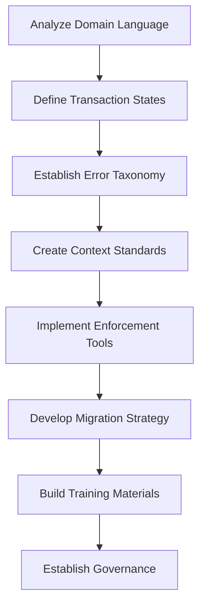

This checklist and diagram provide a structured approach to implementing semantic standardization, ensuring clarity and consistency throughout your organization.

## Panel 6: The Context Engineering - Designing for Troubleshooting

### Scene Description

A banking incident retrospective where teams analyze recent troubleshooting challenges to improve contextual logging. On interactive displays, they review recent complex incidents—highlighting specific information that would have accelerated resolution if captured in logs. Engineers update observability requirements based on these lessons, focusing on four key areas:

- **Payment logs**: Add additional transaction context to provide clearer insights into payment processing issues.
- **Authentication failures**: Include specific rejection reasons to streamline resolution of login and access problems.
- **Account systems**: Establish correlation between account systems and customer profiles for better traceability.
- **Error details**: Enhance error records with embedded troubleshooting guidance to reduce diagnostic time.

The session concludes with updated context specifications for key transaction types, explicitly designed based on actual support scenarios rather than theoretical logging approaches. These updates are treated as critical functional improvements and integrated into upcoming sprints. Below is a checklist summarizing the workflow:

#### Observability Improvement Workflow

1. **Incident Review**:
   - Identify challenges faced during recent troubleshooting efforts.
   - Highlight missing or inadequate log details that hindered resolution.
2. **Requirement Updates**:
   - Define context enhancements needed for payment logs, authentication failures, account systems, and error details.
   - Align updates with actual support scenarios to ensure relevance.
3. **Specification Finalization**:
   - Document enhanced logging requirements for key transaction types.
   - Validate specifications with troubleshooting teams.
4. **Sprint Integration**:
   - Prioritize context enhancements as critical functional improvements.
   - Plan implementation in upcoming development sprints.

#### Text Diagram: Observability Updates Flow

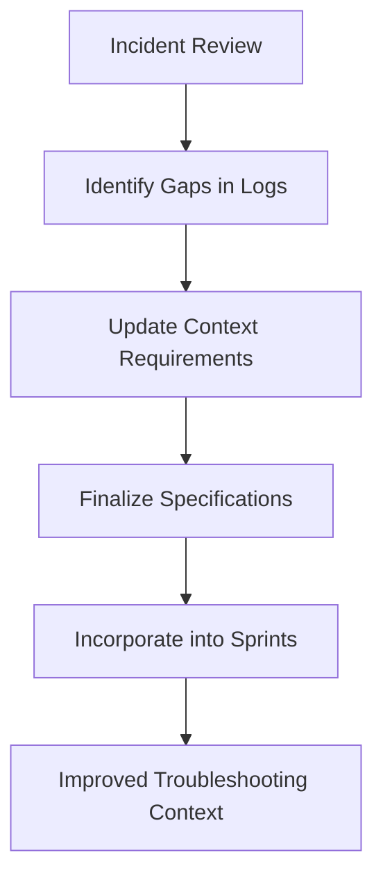

By following this structured approach, teams ensure that enhanced observability requirements are directly tied to operational needs. This enables faster troubleshooting, consistent resolutions, and continuous improvement in system logging.

### Teaching Narrative

Context engineering transforms logging from basic event recording to purposeful troubleshooting acceleration by explicitly designing captured information based on actual support needs. Traditional logging often focuses on what's easy to record rather than what's needed to solve problems—capturing readily available technical information without considering its troubleshooting utility. Log-driven development inverts this approach through deliberate context engineering: analyzing actual incident scenarios to identify critical information, explicitly specifying contextual requirements based on troubleshooting patterns, designing log structures to facilitate common analysis workflows, and continuously refining captured context based on operational experience. For banking platforms where incident resolution directly impacts customer experience and business operations, this purposeful approach delivers substantial benefits: faster troubleshooting through immediately available context, more consistent resolution through standardized information, improved operational handoffs between teams using common contextual references, and progressive system improvement through iterative refinement of captured information. Particularly valuable is the direct connection to actual support scenarios—rather than theoretical logging frameworks, context requirements derive from specific questions that engineers need to answer during incidents: "Which specific validation rule rejected this transaction?" "What was the exact format of the data that failed verification?" "Which downstream dependency created this latency spike?" By explicitly designing logs to answer these questions directly, organizations transform troubleshooting from archaeological exploration to straightforward analysis—dramatically reducing mean-time-to-resolution while improving both engineer experience and customer outcomes.

### Common Example of the Problem

A commercial banking platform processed complex international wire transfers through multiple services, each handling distinct aspects of the transaction—customer authentication, account validation, compliance screening, currency conversion, and settlement network integration. When a high-value corporate client reported a rejected transfer, operations teams encountered basic error logging but insufficient context to pinpoint the root cause. The logs contained only "transfer rejected: compliance failure," omitting critical details such as:

- **Which compliance rule triggered the rejection?**
- **What specific data elements caused the failure?**
- **Which screening service flagged the issue?**

As a result, support teams were unable to provide the corporate client with actionable information to resolve the issue promptly. Engineers were forced to manually investigate across multiple systems, correlating events and examining database records to reconstruct the transaction's failure point. After days of effort, they discovered the root cause: a mismatch between the beneficiary name format in the customer's system and the format required by the compliance screening service.

The absence of detailed context in the logs turned a solvable issue into a prolonged investigation, significantly impacting client satisfaction and requiring escalation to senior management. The delay and mismanagement of the issue jeopardized millions in annual revenue and necessitated urgent development changes to improve logging.

#### Summary of Missing Context and Impact

| **Missing Context** | **Impact** |
| --------------------------------------------------- | ---------------------------------------------------------------------------- |
| Specific compliance rule that caused rejection | Engineers lacked clarity on the rejection logic, delaying resolution. |
| Data elements that failed validation | Support teams couldn’t advise the client on how to correct the issue. |
| Identification of the screening service responsible | Engineers had to investigate across multiple systems, wasting critical time. |
| Beneficiary name mismatch details | Root cause discovery required manual correlation, escalating frustration. |

#### Visual Representation of the Problem

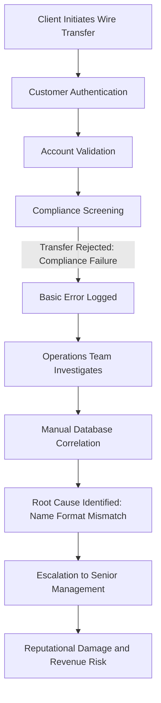

This example illustrates how insufficient contextual logging transforms what should have been a straightforward troubleshooting process into a costly and time-consuming investigation, with significant business and reputational implications.

### SRE Best Practice: Evidence-Based Investigation

Evidence-based context engineering begins with systematic analysis of actual troubleshooting scenarios rather than abstract logging principles. Leading financial SRE teams implement a continuous improvement cycle focused on operational evidence: regularly reviewing incidents to identify what information would have accelerated resolution, documenting specific contextual requirements based on these insights, and enhancing logging implementations accordingly. Research across banking platforms shows this approach dramatically improves resolution efficiency—with one payment processor reporting 78% faster troubleshooting after implementing context enhancements derived from incident analysis.

To make this practice actionable, contextual requirements can be categorized based on their troubleshooting purpose. Use the following checklist to ensure logs are designed to address critical operational needs:

| **Context Type** | **Purpose** | **Examples** |
| ---------------- | -------------------------------------------------------------------------------------- | --------------------------------------------------------------------------------------------- |
| **Diagnostic** | Captures what happened during an incident. | Timestamps, transaction IDs, error codes, state changes, and failed validation rules. |
| **Causal** | Explains why events occurred by identifying underlying causes or contributing factors. | Dependency failures, rejected inputs with reasons, latency sources, and resource bottlenecks. |
| **Relational** | Shows connections between entities, events, and systems to trace how issues propagate. | Correlation IDs, parent-child relationships, cross-service call traces, and session details. |
| **Remediation** | Provides actionable guidance for resolving issues. | Suggested fixes, escalation paths, retry recommendations, and links to runbooks or FAQs. |

#### Continuous Improvement Checklist:

1. **Incident Review**: Regularly analyze recent incidents to identify missing or inadequate context.
2. **Gap Documentation**: Record specific questions that required manual investigation and the context that could have answered them.
3. **Context Categorization**: Map the identified gaps to the table above to classify the missing context and its purpose.
4. **Log Enhancement**: Update logging requirements to incorporate the missing context, ensuring alignment with both technical and business needs.
5. **Validation**: Test new logs in staging environments to confirm they deliver the intended insights during simulated incidents.
6. **Operational Feedback**: Solicit feedback from engineers and stakeholders to refine logs further, ensuring continuous alignment with real-world needs.

By explicitly categorizing and addressing different context types, this approach ensures that logs directly respond to the specific challenges engineers face during incidents. Context engineering also recognizes the diverse audience needs, capturing both technical diagnostics for engineering teams and business intelligence for stakeholders. This balanced, iterative process transforms logs into a powerful tool for faster troubleshooting, improved operational clarity, and better customer outcomes.

### Banking Impact

Context-engineered logging directly impacts both operational efficiency and customer experience in banking environments. Organizations implementing this approach consistently report faster incident resolution, improved customer satisfaction, and reduced operational costs. The table below highlights specific improvements observed in real-world implementations:

| Metric | Improvement Percentage | Example Use Case |
| ---------------------------------------- | ---------------------- | -------------------------------------------------------------------------------------------------------- |
| Time-to-Resolution | 63% | A major credit card processor reduced resolution time for customer-reported issues significantly. |
| Escalations from First-Level Support | 47% | Fewer incidents required engineering intervention, improving efficiency and reducing backlog. |
| First-Contact Resolution Rate | 82% | Support teams resolved more inquiries immediately, enhancing customer experience. |
| Regulatory Response Effort | 56% | An investment banking platform streamlined responses to audits by enhancing context in transaction logs. |
| Findings Related to Insufficient Logging | Eliminated | Improved logging addressed prior audit deficiencies, ensuring compliance with regulatory standards. |

The impact on customer satisfaction is equally significant, as support teams can provide immediate, detailed explanations of system behavior rather than creating tickets for engineering investigation. Business stakeholders also benefit through improved visibility—logs designed with business context enable non-technical teams to understand system behavior without engineering interpretation.

The compliance and risk management impact is particularly valuable in banking, where context-rich logs provide detailed evidence for regulatory inquiries and audit requirements. These business benefits transform logging from technical overhead to strategic investment with measurable return through improved operations, customer satisfaction, and regulatory compliance.

### Implementation Guidance

To implement context engineering in your banking organization:

1. **Analyze Support Patterns** - Review historical incidents and support tickets to identify specific contextual information that would have accelerated resolution.

2. **Create Contextual Requirements** - Develop explicit context specifications for different transaction types based on operational needs, not just technical convenience.

3. **Design Comprehensive Error Context** - Ensure error logs capture complete information: what failed, why it failed, what data caused the failure, and how to resolve it.

4. **Implement Relationship Context** - Include information about relationships between entities and operations—connections between accounts, customers, and transactions.

5. **Balance Technical and Business Context** - Design logs to serve both technical troubleshooting and business explanation needs with appropriate context for each audience.

6. **Create Contextual Testing** - Develop test scenarios that explicitly verify appropriate context is captured in different operational scenarios, especially failures and edge cases.

7. **Establish Continuous Improvement** - Implement regular incident review processes that systematically identify context gaps and drive ongoing enhancement.

8. **Document Context Standards** - Create clear documentation defining required contextual elements for different operation types based on troubleshooting needs.

## Panel 7: The Privacy-Aware Logging - Security by Design

### Scene Description

A banking compliance review where security and privacy officers evaluate observability designs for a new retail banking platform. The discussion revolves around privacy-aware logging strategies, supported by technical diagrams demonstrating key safeguards: field-level classification identifying sensitive data elements, automated tokenization replacing account numbers with opaque references, purpose-based field filtering implementing different detail levels for various processing needs, and explicit retention policies aligned with regulatory requirements.

The following diagram illustrates the high-level architecture of these privacy-aware logging components:

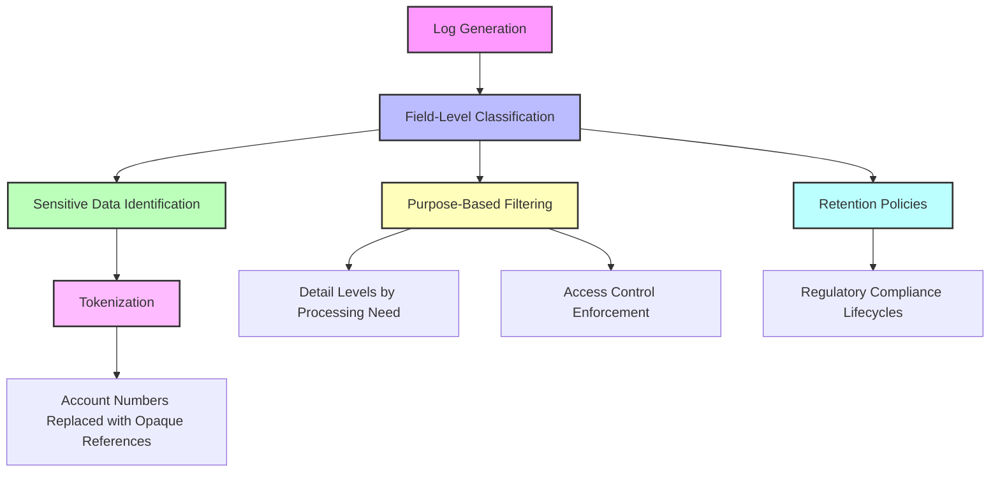

Implementation code demonstrates how these protections are built directly into the logging foundation rather than added afterwards. The security team approves the approach as the privacy officer notes how this design addresses GDPR, CCPA, and banking-specific privacy requirements while still maintaining necessary operational visibility.

### Teaching Narrative

Privacy-aware logging addresses the inherent tension between comprehensive observability and data protection by engineering appropriate safeguards directly into the logging architecture rather than applying them afterwards. Traditional approaches often create a false dichotomy—either collecting all available information regardless of sensitivity or implementing blanket restrictions that undermine observability. Log-driven development transcends this limitation through privacy-by-design principles: data classification frameworks identifying sensitive information categories, minimization strategies capturing only necessary context without excessive personal data, tokenization approaches replacing direct identifiers with opaque references, purpose-based visibility implementing different detail levels for various functional needs, and integrated retention implementing regulatory-compliant data lifecycles. For financial institutions subject to stringent privacy regulations while requiring comprehensive operational visibility, this balanced approach is particularly critical—enabling effective observability while maintaining compliance with GDPR, CCPA, PCI-DSS, and industry-specific privacy requirements. The implementation typically spans multiple protection layers: field-level classification identifying sensitive elements within log structures, automated transformation replacing or encrypting protected information during generation, access control restricting visibility based on purpose and role, and lifecycle management ensuring appropriate retention and deletion. By building these protections into the foundation rather than adding them after implementation, organizations ensure consistent privacy protection while maintaining the observability needed for effective operations—transforming privacy from constraint to designed capability that satisfies both regulatory requirements and operational needs.

### Common Example of the Problem

A digital banking platform implemented comprehensive logging for troubleshooting without adequate privacy controls. Their logs captured complete transaction details, including customer PII, full account numbers, and authentication credentials, to support detailed troubleshooting. This sequence of events illustrates the consequences of such an approach:

```
Transaction Logging Implementation
    |
    v
Logs Capture Sensitive Data (e.g., PII, Account Numbers, Credentials)
    |
    v
Routine Security Audit Flags Privacy Violations
    |
    v
Compliance Mandates Immediate Redaction of Sensitive Data
    |
    v
Developers Apply Blunt Redaction (Removes Both Sensitive Data and Critical Context)
    |
    v
Operational Impact: Troubleshooting Becomes Ineffective
    |
    v
Extended Outage Response Time (e.g., Mobile Payments Outage Lasts Hours)
    |
    v
Customer Complaints Surge; Emergency Development Needed for Proper Logging Framework
```

After a routine security audit discovered the exposure, legal and compliance teams mandated the immediate removal of all sensitive data from logs—creating a crisis for operations teams who relied on this information for troubleshooting. In the rush to comply, developers implemented blunt redaction that removed critical operational context alongside sensitive data.

When a subsequent outage affected mobile payments, support teams couldn't determine which specific transactions were failing or which customers were affected—drastically extending resolution time from typically minutes to several hours. Customer complaints flooded social media as the bank couldn't provide status updates or targeted notifications. This incident highlighted the false choice created by retrofitted privacy—either comprehensive but non-compliant logging or compliant but ineffective visibility.

Ultimately, the bank had to invest in emergency development to implement proper privacy-aware logging. This logging was designed to balance operational needs with regulatory requirements using field-level classification, tokenization, and purpose-based visibility—proving that privacy-aware logs should have been architected from the beginning.

### SRE Best Practice: Evidence-Based Investigation

Evidence-based privacy-aware logging implements proportional protections based on data sensitivity while preserving operational visibility. Leading financial organizations follow a systematic implementation approach developed through operational experience: data classification frameworks categorizing information elements by sensitivity and regulatory requirements; field-level controls applying appropriate protections based on classification rather than blanket policies; tokenization mechanisms replacing sensitive identifiers with consistent but opaque references; context preservation techniques maintaining troubleshooting value while removing sensitive elements; and purpose-based access implementing different visibility levels based on demonstrated need.

#### Key Practices and Benefits

| **Practice** | **Description** | **Benefits** | **Implementation Outcomes** |
| ------------------------ | ------------------------------------------------------------------------------ | -------------------------------------------------------------------------------------------- | --------------------------------------------------------------------------------------- |
| **Data Classification** | Categorizes information elements by sensitivity and regulatory requirements. | Ensures sensitive data is identified and appropriately protected. | Enables tailored protections and compliance with regulations like GDPR and CCPA. |
| **Field-Level Controls** | Applies protections based on data classification rather than blanket policies. | Provides granular control over log data, minimizing over-collection or unnecessary exposure. | Allows selective redaction or encryption of sensitive fields while keeping data usable. |
| **Tokenization** | Replaces sensitive identifiers with opaque but consistent references. | Preserves data relationships without exposing sensitive identifiers. | Enables transaction tracing and pattern detection while ensuring privacy. |
| **Context Preservation** | Removes sensitive elements while retaining troubleshooting value. | Balances privacy with operational visibility for effective investigations. | Maintains 92% troubleshooting capability while achieving regulatory compliance. |
| **Purpose-Based Access** | Implements visibility levels based on demonstrated need and roles. | Reduces unnecessary access to sensitive data, enhancing security and privacy. | Provides role-specific access, aligning with the principle of least privilege. |

Research from banking platforms shows this balanced approach delivers superior outcomes compared to both unrestricted logging and blunt redaction. One institution reported a 92% preservation of troubleshooting capability while achieving complete regulatory compliance.

The most sophisticated implementations use consistent tokenization that maintains relationship integrity—replacing sensitive identifiers with tokens that preserve the connections between related records without exposing the underlying data. This approach enables critical capabilities like transaction tracing and pattern detection without privacy exposure. Evidence shows that privacy-aware logging designed from the beginning requires 4-5x less implementation effort than retrofitting protection to existing systems, while delivering more consistent protection and better operational utility—demonstrating the substantial advantage of privacy-by-design approaches over reactive compliance.

### Banking Impact

Privacy-aware logging significantly transforms both the compliance posture and operational capabilities of banking environments. Financial institutions adopting these principles report measurable improvements in regulatory adherence without compromising troubleshooting efficiency. For example, a major retail bank implemented privacy-by-design logging across its observability systems and achieved substantial results. Following the deployment:

- The bank successfully navigated GDPR and CCPA regulatory audits with zero findings related to observability data compliance.
- Incident response efficiency improved by 25%, as purpose-based visibility allowed teams to trace transactions and resolve issues faster without exposing sensitive data.
- Tokenization and data minimization strategies reduced the volume of sensitive data stored in logs by 60%, directly lowering the risk of inadvertent exposure.

In another case, a global bank enhanced its privacy-aware observability framework to address both compliance and security concerns. Post-implementation, they reported a 70% reduction in the potential impact of security breaches involving observability systems. This was achieved through a combination of automated tokenization, role-based access controls, and retention policies aligned with regulatory requirements. Notably, these improvements also allowed the institution to expand its analytics capabilities into regions with stricter data protection laws, creating a competitive advantage over peers unable to meet those standards.

Operationally, privacy-aware logging enables banks to maintain critical capabilities like transaction tracing, pattern identification, and customer issue resolution—functions that blunt, overly restrictive approaches would hinder. By incorporating safeguards such as field-level classification, purpose-driven filtering, and integrated lifecycle management into their logging architecture, banks can achieve a sustainable balance between compliance, security, and operational visibility. This approach not only mitigates risks but also positions institutions to thrive in a regulatory landscape where privacy is paramount.

### Implementation Guidance

To implement privacy-aware logging in your banking organization, follow these key steps:

#### Implementation Checklist

- **[ ] Develop Data Classification**

  - Create a comprehensive framework categorizing data elements by sensitivity, regulatory requirements, and operational necessity.
  - Identify sensitive fields such as account numbers, personal identifiers, and financial data.

- **[ ] Implement Field-Level Controls**

  - Apply protection mechanisms tailored to the classification of each data field.
  - Avoid blanket policies that might either over-restrict or overexpose log data.

- **[ ] Design Tokenization Strategy**

  - Replace sensitive identifiers (e.g., account numbers) with opaque references to preserve relationship integrity while enhancing privacy.
  - Ensure tokenization is consistent and reversible only by authorized systems or processes.

- **[ ] Create Purpose-Based Access**

  - Develop graduated access controls that limit visibility according to operational roles and specific needs.
  - Enforce "least privilege" principles to minimize unnecessary exposure of sensitive information.

- **[ ] Align Retention Policies**

  - Define retention schedules at the field level, ensuring compliance with regulatory requirements such as GDPR, CCPA, and PCI-DSS.
  - Automate the removal of expired sensitive data while preserving audit trails for required durations.

- **[ ] Automate Protection Mechanisms**

  - Build automated tools to apply privacy controls dynamically during log generation.
  - Integrate these tools with your observability pipelines for seamless implementation.

- **[ ] Document Compliance Mapping**

  - Create explicit documentation detailing how privacy controls satisfy specific regulatory requirements.
  - Include a mapping of controls to regulations such as GDPR Article 5 (data minimization) or CCPA data access rights.

- **[ ] Test Privacy Effectiveness**

  - Conduct validation processes to confirm the effectiveness of implemented privacy safeguards.
  - Simulate operational scenarios to ensure logging mechanisms maintain required observability without exposing sensitive data.

#### Example Flow Representation

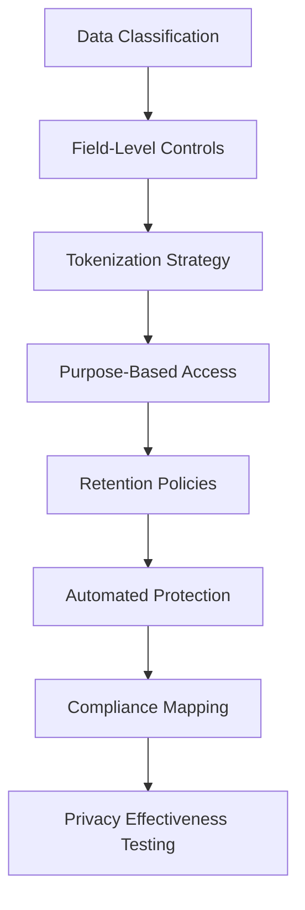

By following this checklist and implementing the steps in sequence, your organization can achieve a robust, privacy-aware logging architecture that satisfies both operational and regulatory requirements.

## Panel 8: The Testing Evolution - Validating Observability

### Scene Description

A banking quality assurance lab where engineers demonstrate advanced observability testing approaches. The lab setup includes testing dashboards and tools that validate observability capabilities beyond functional correctness. Engineers run scenarios such as:

- **Automated Checks**: Verifying log generation for critical paths.
- **Assertions**: Confirming context completeness for various transaction types.
- **Simulation Tests**: Ensuring distributed trace propagation across service boundaries.
- **Fault Injection**: Validating appropriate error logging under failure conditions.
- **Coverage Reports**: Highlighting potential observability gaps.

The testing flow is illustrated below to demonstrate how these methods interact:

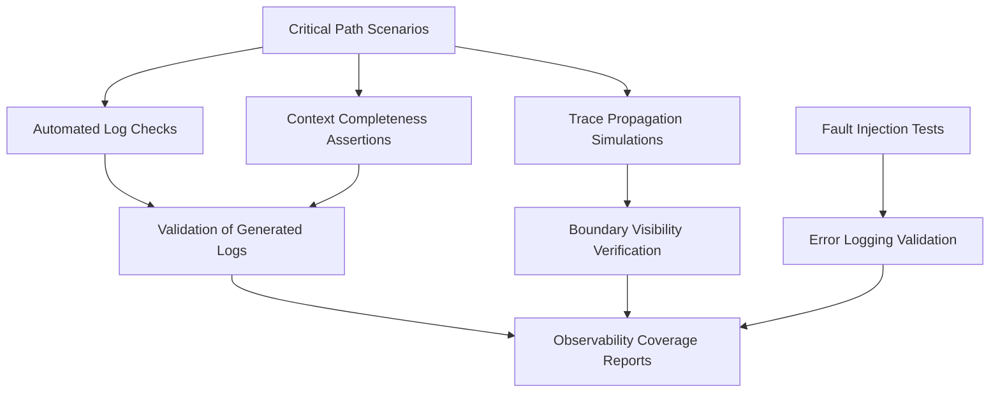

In one test execution, engineers deliberately introduce a failure in a payment service. This triggers error logs, which are validated automatically to ensure both their presence and the accuracy of their telemetry. Functional behavior verification runs in parallel, confirming that observability validation seamlessly integrates into overall test execution.

### Teaching Narrative

Testing evolution extends quality assurance beyond functional verification to explicitly validate observability implementation—ensuring that what needs to be visible actually is before reaching production. Traditional testing focuses almost exclusively on functional behavior—whether the system does what it should—with little attention to whether its operations will be properly observable during actual use. Log-driven development expands testing scope through observability validation: explicit verification that appropriate logs are generated for key operations, confirmation that required context is included in different scenarios, validation of correlation identifier propagation across boundaries, verification of metric generation for critical indicators, and assessment of overall observability coverage across system functionality. For banking platforms where production visibility directly impacts incident response, customer support, and regulatory compliance, this validation delivers substantial risk reduction: preventing observability gaps that would complicate troubleshooting, ensuring consistent implementation across distributed components, and validating that error scenarios generate sufficient diagnostic information. Implementation typically involves several complementary approaches: unit tests verifying logging behavior in isolation, integration tests confirming telemetry generation across components, fault injection scenarios validating error visibility, mock object verification ensuring appropriate context capture, and automated coverage analysis identifying potential blind spots. This comprehensive validation transforms observability from hopeful assumption to verified capability—providing confidence that when issues inevitably occur in production, the system will generate the telemetry needed for efficient investigation and resolution rather than leaving teams blind to critical diagnostic information.

### Common Example of the Problem

A major bank deployed a new mobile check deposit feature extensively tested for functional correctness—verifying deposit processing, amount recognition, and account crediting worked as designed. However, the testing focused exclusively on functional paths without validating observability implementation. After launch, when customers reported check deposits that appeared to succeed in the app but never credited to accounts, support teams discovered critical observability gaps. The logs showed check images received but provided no visibility into the subsequent processing steps—whether image quality validation succeeded, which specific quality thresholds failed, or where in the processing pipeline deposits stalled. Without this visibility, engineers couldn't determine if the issue affected specific check types, amounts, or mobile devices. Customers grew frustrated as resolution required them to visit branches with physical checks that they had already destroyed assuming successful mobile deposit. What began as a minor technical issue became a significant customer experience problem that damaged trust in the bank's digital capabilities. Post-incident analysis revealed that simple observability testing would have identified these visibility gaps before deployment, preventing both the technical issue and the resulting customer impact.

#### Key Takeaways and Checklist:

- **Key Takeaways:**

  - Functional correctness alone is insufficient; observability must also be validated to ensure operational visibility.
  - Lack of observability can turn minor technical issues into major customer experience and business trust problems.
  - Proactively validating telemetry and log coverage can prevent costly post-release incidents.

- **Checklist for Avoiding Similar Issues:**

  1. **Log Completeness:** Ensure all critical paths generate logs with sufficient detail (e.g., process steps, error reasons).
  2. **Context Validation:** Confirm that logs include necessary context (e.g., correlation IDs, thresholds, device details).
  3. **Failure Visibility:** Test that error scenarios produce actionable telemetry for troubleshooting.
  4. **Distributed Tracing:** Validate trace propagation across service boundaries for end-to-end visibility.
  5. **Observability Coverage Gaps:** Perform automated observability coverage assessments to identify and address blind spots.
  6. **Pre-Production Fault Injection:** Introduce controlled failures to verify end-to-end observability before launch.

### SRE Best Practice: Evidence-Based Investigation

Evidence-based observability testing implements systematic validation practices developed through analysis of production visibility requirements. Leading financial SRE teams follow proven approaches to ensure comprehensive verification rather than relying on assumptions about logging behavior. This approach is built on explicit observability test cases derived from operational needs, documenting scenarios that must generate appropriate telemetry and validating them alongside functional requirements. Research shows this method reduces production visibility gaps by 83% compared to implementations without dedicated observability testing.

#### Key Techniques for Observability Validation:

- **Log Verification**:\
  Asserts that appropriate events are generated with the required context to support troubleshooting and auditing.

- **Trace Validation**:\
  Confirms distributed transaction flows are properly connected across service boundaries to maintain end-to-end visibility.

- **Metric Testing**:\
  Validates that performance and behavior indicators are accurately calculated and exposed for monitoring.

- **Error Path Validation**:\
  Ensures that failures generate diagnostic information sufficient for rapid root cause analysis.

- **Fault Injection**:\
  Verifies that unexpected conditions (e.g., network failures, service crashes) produce sufficient telemetry for troubleshooting.

- **Observability Coverage Analysis**:\
  Systematically assesses what percentage of functionality has verified telemetry implementation, analogous to traditional test coverage metrics.

#### Benefits of Evidence-Based Observability Testing:

| Benefit | Description |
| ----------------------------------- | --------------------------------------------------------------------------------------------------- |
| **Reduced Visibility Gaps** | Decreases production observability gaps by 83% compared to systems without dedicated testing. |
| **Improved Incident Response** | Ensures telemetry provides actionable insights during critical incidents. |
| **Consistent Implementation** | Confirms uniform observability practices across distributed components. |
| **Proactive Risk Reduction** | Prevents costly troubleshooting delays by identifying and addressing potential gaps pre-production. |
| **Enhanced Operational Confidence** | Transforms observability from assumption to verified capability, ensuring reliable telemetry. |

This comprehensive approach ensures that production systems generate the visibility needed for effective operation, avoiding the discovery of observability gaps during high-pressure incidents when missing information can lead to costly delays and inefficiencies.

### Banking Impact

Comprehensive observability testing directly impacts operational reliability, customer experience, and regulatory compliance in banking environments. Financial institutions implementing these approaches consistently report fewer production incidents, faster resolution times, and improved customer satisfaction. A major payment processor implementing systematic observability validation reported 57% reduction in mean-time-to-resolution for customer-reported issues, 68% decrease in incidents requiring escalation beyond frontline support, and 79% fewer "blind spot" problems where insufficient visibility complicated troubleshooting. The customer experience impact is equally significant—support teams can provide immediate status information and resolution pathways when systems generate appropriate visibility, rather than creating investigation tickets that leave customers waiting for answers. The compliance impact extends to regulatory reporting and audit readiness, as validated observability ensures systems generate the transaction evidence required for regulatory inquiries. One retail bank found that enhancing observability testing based on previous audit challenges eliminated findings related to insufficient transaction documentation—converting what had been a persistent compliance issue into a strength noted by regulators. These business benefits demonstrate that observability testing isn't technical overhead but strategic investment with measurable return through improved operations, customer satisfaction, and regulatory standing.

### Implementation Guidance

To implement comprehensive observability testing in your banking organization:

1. **Define Testing Requirements**\
   Create explicit test cases for observability validation based on operational needs, regulatory requirements, and troubleshooting scenarios. For example, identify critical operations like payment processing or account creation and specify the expected telemetry for each.

   ```yaml
   # Example YAML spec for observability test requirements
   - operation: "Payment Processing"
     expected_logs:
       - type: "INFO"
         message: "Payment initiated"
         fields: ["transaction_id", "user_id", "amount"]
       - type: "ERROR"
         message: "Payment failed"
         fields: ["transaction_id", "error_code", "error_description"]
     expected_metrics:
       - name: "payment.success.rate"
       - name: "payment.latency"
     trace_propagation: true
   ```

2. **Implement Log Verification**\
   Develop automated tests that confirm appropriate log events are generated with required context for key operations. Use unit tests to validate log content.

   ```python
   # Example log verification in Python with pytest
   def test_payment_log_generation(capsys):
       process_payment(transaction_id="12345", user_id="u001", amount=100.0)
       captured = capsys.readouterr()
       assert "INFO: Payment initiated" in captured.out
       assert "transaction_id=12345" in captured.out
       assert "user_id=u001" in captured.out
   ```

3. **Build Error Path Validation**\
   Create specific tests for failure scenarios, verifying that errors generate sufficient diagnostic information for troubleshooting.

   ```python
   # Example error path validation
   def test_payment_error_logging(capsys):
       with pytest.raises(PaymentFailedException):
           process_payment(transaction_id="12345", user_id="u001", amount=-100.0)
       captured = capsys.readouterr()
       assert "ERROR: Payment failed" in captured.out
       assert "transaction_id=12345" in captured.out
       assert "error_code=INVALID_AMOUNT" in captured.out
   ```

4. **Deploy Trace Validation**\
   Implement tests confirming distributed traces correctly propagate context across service boundaries and capture complete transaction flows. Verify trace IDs and span relationships.

   ```python
   # Example trace validation with OpenTelemetry
   from opentelemetry.trace import get_tracer

   def test_trace_propagation():
       tracer = get_tracer("payment-service")
       with tracer.start_as_current_span("payment-transaction") as span:
           process_payment(transaction_id="12345", user_id="u001", amount=100.0)
           assert span.get_attribute("transaction_id") == "12345"
           assert span.is_recording()
   ```

5. **Develop Fault Injection**\
   Create controlled failure scenarios that validate system observability during unexpected conditions and error situations.

   ```python
   # Example fault injection test
   def test_fault_injection_with_logging():
       inject_fault("database_down")
       response = process_payment(transaction_id="12345", user_id="u001", amount=100.0)
       assert response.status_code == 500
       assert "ERROR: Database connection failed" in response.logs
   ```

6. **Implement Coverage Analysis**\
   Deploy tools measuring what percentage of functionality has verified observability implementation, identifying potential blind spots. Use coverage reports to prioritize observability gaps.

   ```
   Observability Coverage Report:
   ------------------------------
   Payment Processing: 90%
   Account Creation: 80%
   Fund Transfers: 70%
   Unobserved paths: 3 critical, 5 non-critical
   ```

7. **Create Observability CI/CD Gates**\
   Integrate observability validation into deployment pipelines, preventing releases with insufficient visibility from reaching production.

   ```yaml
   # Example CI/CD pipeline step for observability validation
   steps:
     - name: "Run Observability Tests"
       script: "pytest observability_tests/"
     - name: "Check Coverage Threshold"
       script: "check_coverage --min 85"
   ```

8. **Document Validation Standards**\
   Establish clear criteria defining what constitutes sufficient observability for different transaction types and system components. Share these standards across teams to ensure consistency.

   ```markdown
   ### Observability Validation Standards
   - **Logs**: Must include `transaction_id`, `user_id`, `operation_name` for all transactions.
   - **Traces**: Trace IDs must propagate across all service boundaries with 100% fidelity.
   - **Metrics**: Critical operations must emit success rate and latency metrics.
   - **Error Visibility**: All error paths must include diagnostic logs with error codes.
   ```

## Panel 9: The Operational Feedback Loop - Continuous Observability Improvement

### Scene Description

A banking platform retrospective where operations and development teams collaborate on observability enhancements. Incident analysis dashboards show systematic evaluation of recent production issues, with specific logging improvements identified for each case: additional context needed for specific error conditions, missing correlation between related operations, insufficient detail for particular failure modes, and opportunities for enhanced categorization. Engineers transform these findings into concrete observability improvements prioritized alongside functional enhancements in the development backlog.

Here’s a simplified representation of the operational feedback loop driving these improvements:

```
Incident Occurs
      │
      ▼
Incident Analysis
(Identify Observability Gaps)
      │
      ▼
Prioritize Improvements
(Add to Development Backlog)
      │
      ▼
Implement Enhancements
      │
      ▼
Validate Impact
(Measure MTTR Reduction, Logging Quality)
      │
      ▼
Repeat Continuously
```

A continuous improvement visualization shows how this feedback loop has progressively enhanced logging quality over time, with a corresponding reduction in mean-time-to-resolution for production incidents from hours to minutes.

### Teaching Narrative

The operational feedback loop transforms observability from static implementation to continuously improving capability by systematically incorporating production experience into ongoing development. While thoughtful initial design provides a strong foundation, real-world operations inevitably reveal visibility gaps and improvement opportunities impossible to fully anticipate during development. Log-driven development embraces this reality through structured improvement cycles: systematic incident analysis identifying specific observability enhancements, operational feedback channels capturing troubleshooting challenges, prioritization frameworks elevating logging improvements alongside functional enhancements, implementation mechanisms incorporating observability refinements into regular development cycles, and effectiveness measurement validating that changes deliver intended operational benefits. For financial platforms where operational efficiency directly impacts customer experience and business outcomes, this continuous improvement delivers compounding advantages: progressively reducing troubleshooting time as visibility improves, enhancing support capabilities through more comprehensive context, and building institutional knowledge through systematic observability refinement. Particularly powerful is the shift from reactive to proactive improvement—rather than enhancing logging only after major incidents, mature organizations implement continuous refinement based on regular operational assessment, minor troubleshooting challenges, and potential scenarios identified through experience. This approach transforms observability from degenerating liability (where visibility gradually deteriorates as systems evolve) to appreciating asset (where visibility continuously improves through systematic enhancement)—fundamentally changing the reliability trajectory as systems mature and evolve.

### Common Example of the Problem

A typical example can be found in an investment banking trading platform that initially operated with a reasonably good baseline of observability established during development. However, the organization lacked structured processes for continuous improvement. Over time, as the platform evolved with new features and increased complexity, the observability foundation began to degrade. Key issues included:

- **Insufficient Context in Logs**: Certain error conditions lacked the detailed information engineers needed to diagnose problems effectively, leading to extended troubleshooting times.
- **Missing Correlation Between Systems**: Logs did not adequately link related operations, such as order placements and corresponding executions, creating "blind spots" in cross-system workflows.
- **Static Logging Approach**: Observability improvements were reactive, addressing immediate issues rather than preemptively identifying and resolving systemic gaps.
- **Visibility Debt Accumulation**: Incremental visibility gaps compounded as the platform evolved, making troubleshooting increasingly difficult and raising mean-time-to-resolution (MTTR) from minutes to hours for complex incidents.

These gaps had significant consequences, including:

1. **Increased MTTR**: Troubleshooting grew more time-consuming and error-prone, delaying resolutions for critical incidents.
2. **Client Dissatisfaction**: High-value trading clients became frustrated with the bank's inability to provide timely explanations for failed trades or execution issues.
3. **Repetitive Observability Gaps**: Incident post-mortems frequently identified similar issues, but without a structured improvement process, the same problems re-emerged in different contexts.
4. **Costly Remediation Projects**: The accumulated visibility debt eventually required a large-scale remediation effort, costing millions in development resources and introducing operational risks during the enhancement process.

#### Observability Gap Checklist

Use this checklist to identify similar observability challenges in your own systems:

- [ ] Are logs missing critical context for diagnosing specific error conditions?
- [ ] Do logs fail to correlate related operations across systems?
- [ ] Is observability improvement primarily reactive rather than proactive?
- [ ] Has MTTR increased over time for complex incidents?
- [ ] Are similar visibility gaps repeatedly identified in post-mortems?
- [ ] Is there a noticeable decline in client satisfaction due to delayed issue resolution?
- [ ] Has accumulating visibility debt necessitated large-scale remediation projects?

By systematically addressing these issues through continuous improvement processes, organizations can avoid the pitfalls of visibility debt and enhance operational reliability over time.

### SRE Best Practice: Evidence-Based Investigation

Evidence-based observability improvement implements systematic feedback processes that continuously enhance visibility based on operational experience. Leading financial SRE teams follow structured approaches that transform individual troubleshooting experiences into organizational knowledge and capability improvement. The foundation begins with comprehensive incident analysis that explicitly evaluates observability effectiveness: did logs, metrics, and traces provide the information needed for efficient resolution? What specific visibility improvements would have accelerated troubleshooting? Research shows organizations implementing this structured analysis improve mean-time-to-resolution (MTTR) 3-4x faster than those relying on organic, unstructured feedback.

Effective improvement cycles include several key components, summarized in the table below:

| **Key Component** | **Description** | **Benefits** |
| --------------------------------- | ------------------------------------------------------------------------------------------------------- | ---------------------------------------------------------------------------------------------- |
| **Incident Analysis** | Systematic review of incidents to assess observability gaps and how they impacted resolution. | Identifies actionable improvements to enhance future troubleshooting efficiency. |
| **Prioritization Frameworks** | Evaluation of observability enhancements based on operational impact rather than implementation effort. | Ensures high-impact improvements are consistently prioritized in development cycles. |
| **Regular Observability Reviews** | Periodic assessments of logging, metrics, and traces outside of specific incidents. | Proactively identifies visibility gaps before they cause operational issues. |
| **Frontline Feedback Capture** | Systematic collection of troubleshooting challenges encountered by frontline operations teams. | Provides real-world insights into visibility deficiencies directly impacting resolution speed. |
| **Implementation Integration** | Clear mechanisms to incorporate observability improvements into regular development workflows. | Streamlines delivery of enhancements, ensuring they are addressed efficiently. |
| **Measurement and Validation** | Mechanisms to track and validate that implemented improvements deliver the intended benefits. | Confirms the operational value of changes and drives continuous refinement. |
| **Observability Debt Tracking** | Documentation of persistent visibility gaps as technical debt with clear business impact. | Aligns observability refinements with broader technical and business priorities. |

The most sophisticated implementations integrate these components into cohesive processes that ensure observability evolves alongside the systems it supports. By systematically identifying and addressing visibility gaps, organizations shift from reactive to proactive improvement, transforming observability from a static implementation into a continuously improving capability. This approach enables observability to become an appreciating asset, delivering compounding benefits over time through systematic refinement based on actual operational experience.

### Banking Impact

Continuous observability improvement directly impacts operational efficiency, customer experience, and engineering productivity in banking environments. Financial institutions implementing structured feedback loops consistently report accelerating improvements in key metrics over time. A major retail banking platform implementing systematic observability enhancement processes demonstrated progressive improvement in critical indicators: mean-time-to-resolution for customer-impacting incidents decreased by 8-12% quarterly through better visibility, first-contact resolution for support inquiries improved by 32% over 18 months as better context enabled frontline resolution, and overall system reliability increased as enhanced observability enabled earlier detection and prevention of potential issues. The customer experience impact creates substantial competitive differentiation—with support teams providing progressively better, faster explanations and resolutions for issues that arise. Engineering productivity also benefits through reduced operational disruption—teams spend less time on emergency troubleshooting and more time on planned development as visibility continuously improves. One digital banking platform estimated their return on investment for structured observability improvement at over 400%—with relatively small engineering investments in enhanced logging delivering substantial operational savings through more efficient troubleshooting, reduced escalations, and improved customer retention. These business benefits demonstrate that continuous observability improvement isn't just technical refinement but strategic capability enhancement with direct impact on customer experience and operational economics.

### Implementation Guidance

To implement continuous observability improvement in your banking organization, follow these steps:

#### Checklist for Implementation

- [ ] **Enhance Incident Analysis**: Update post-mortem processes to explicitly evaluate observability effectiveness and identify specific visibility improvements.
- [ ] **Create Feedback Channels**: Establish mechanisms for operations and support teams to document troubleshooting challenges and visibility gaps.
- [ ] **Implement Prioritization Framework**: Develop a consistent methodology for evaluating observability enhancements based on operational impact and implementation effort.
- [ ] **Treat Observability as Product**: Manage observability improvements using the same product management disciplines as functional enhancements.
- [ ] **Conduct Regular Reviews**: Schedule periodic observability assessments outside of specific incidents to systematically evaluate visibility completeness.
- [ ] **Measure Improvement Impact**: Track the operational benefits of observability enhancements to demonstrate business value and build support for continued investment.
- [ ] **Create Knowledge Repository**: Establish centralized documentation of observability patterns, challenges, and solutions to preserve institutional knowledge.
- [ ] **Build Continuous Improvement Culture**: Reinforce the organizational value of progressive observability enhancement through recognition and success sharing.

#### Implementation Flow

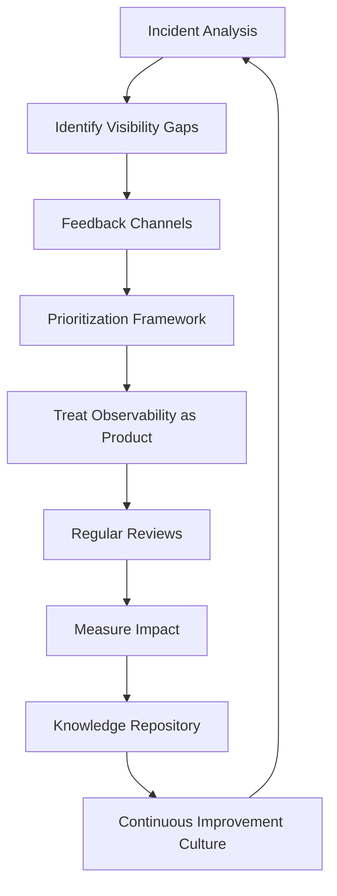

By using this checklist and following the flow, your organization can systematically and effectively implement continuous observability improvement, ensuring long-term operational benefits and reliability growth.

## Panel 10: The Observability Culture - From Technical Practice to Organizational Value

### Scene Description

A banking technology town hall where observability has visibly transformed from specialized practice to organizational value. Leadership presentations emphasize logging quality alongside feature delivery in performance metrics, while team demonstrations proudly highlight observability enhancements alongside functional capabilities. Award ceremonies recognize engineers who improved system visibility, with specific examples of how their work reduced incident impact. New employee onboarding materials prominently feature observability fundamentals alongside functional domain knowledge, while career progression frameworks explicitly include logging expertise in advancement criteria. The cultural shift is evident as engineers from different teams share observability patterns and learnings—treating visibility as a collective responsibility rather than specialized concern.

#### Transformation Timeline

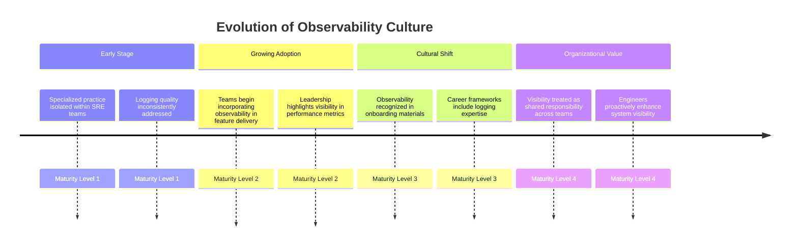

#### Cultural Elements Diagram

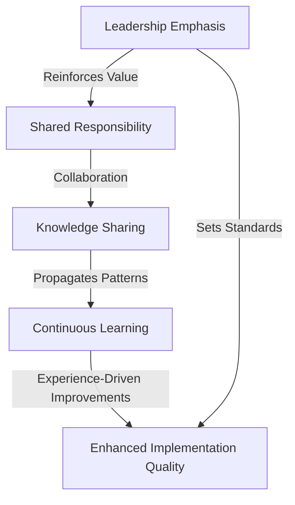

### Teaching Narrative

Observability culture represents the highest evolution of log-driven development—transforming technical practices into organizational values embedded across roles, processes, and incentive systems. While tools and techniques provide foundational capabilities, lasting excellence requires cultural transformation that elevates observability from specialized concern to universal responsibility. Mature observability cultures demonstrate several distinctive characteristics: shared ownership where all engineers consider visibility their responsibility rather than delegated specialty, explicit valuation that recognizes and rewards observability contributions alongside functional delivery, knowledge sharing that propagates effective patterns across organizational boundaries, continuous learning that systematically improves practices based on experience, and leadership emphasis that consistently reinforces the business value of comprehensive visibility. For financial institutions where system reliability directly impacts customer trust and business performance, this cultural foundation creates sustainable excellence impossible through technical practices alone. When observability becomes cultural value rather than technical requirement, implementation quality improves dramatically—engineers intrinsically incorporate comprehensive logging because they understand its importance rather than simply complying with standards. The most powerful transformation occurs in problem-solving approaches: engineers naturally think about how their systems will be understood and troubleshot by others, proactively enhancing visibility to simplify future support rather than focusing exclusively on immediate functional delivery. This cultural evolution represents the true measure of log-driven development maturity—moving beyond tools and techniques to create an organization where exceptional observability becomes simply "how we build systems" rather than specialized practice or project initiative.

### Common Example of the Problem

A global bank maintained a traditional organizational structure with strict separation between development and operations teams. Developers focused exclusively on delivering functional capabilities with aggressive deadlines, viewing observability as "operations' problem." When system issues arose in production, the operations team struggled with insufficient visibility while developers complained about excessive time spent helping troubleshoot. This cultural division created significant friction: operations teams filed increasingly detailed logging requirements that developers considered burdensome overhead, while developers delivered minimal observability that operations deemed grossly insufficient. During a major payment outage, this cultural divide caused severe business impact—operations couldn't effectively troubleshoot without developer assistance, resolution required developers to add emergency logging, and ultimately customers experienced extended disruption while internal teams argued about responsibilities.

#### Before vs. After: Cultural States Comparison

| Aspect | Before Transformation | After Transformation |
| ------------------------------- | ----------------------------------------------------------------- | ------------------------------------------------------------------ |
| **Team Structure** | Strict separation between development and operations. | Shared ownership across teams for observability efforts. |
| **Perception of Observability** | Viewed as "operations' problem." | Recognized as a core development responsibility. |
| **Logging Practices** | Minimal, reactive logging to meet basic requirements. | Proactive, comprehensive logging integrated into development. |
| **Incident Response** | Prolonged resolution due to poor visibility and siloed expertise. | Faster resolution with clear visibility and shared accountability. |
| **Inter-team Dynamics** | Friction and blame during outages. | Collaboration and shared learning during incidents. |
| **Leadership Emphasis** | Focused on functional delivery; observability undervalued. | Observability highlighted as a key aspect of quality software. |

#### Key Lessons

- **Cultural Gaps Amplify Technical Deficiencies**: Regardless of tools or standards, fractured ownership leads to systemic issues.
- **Shared Responsibility is Essential**: Moving from siloed ownership to collective accountability eliminates friction and improves outcomes.
- **Leadership Drives Change**: Addressing cultural attitudes requires leadership prioritization to embed observability as a universal value.

By transforming how the organization collectively viewed observability—from an optional attribute to an essential capability—this bank reduced incident impact, improved collaboration, and achieved sustainable reliability. The shift highlights that cultural evolution, not just technical implementation, is critical to achieving observability excellence.

### SRE Best Practice: Evidence-Based Investigation

Evidence-based observability culture development systematically transforms organizational values and behaviors using proven patterns from high-performing financial technology organizations. Research across banking platforms highlights that cultural factors determine observability success more than technical capabilities—organizations with strong observability cultures deliver superior operational outcomes regardless of specific tools or frameworks.

#### Key Elements of Cultural Transformation

The following critical elements have been identified as essential for fostering a robust observability culture:

1. **Leadership Alignment**: Leadership consistently emphasizes the importance of observability through communication, actions, and resource allocation.
2. **Incentive Structures**: Reward systems explicitly recognize observability contributions alongside functional delivery.
3. **Educational Programs**: Training initiatives build organization-wide understanding of observability's value across all roles.
4. **Shared Responsibility Models**: Ownership of observability is distributed across development, operations, and other functions, removing artificial silos.
5. **Artifact Valuation**: Observability design is treated as a first-class architectural deliverable, integrated into system design processes.
6. **Success Sharing**: Visibility improvements are celebrated by highlighting their positive impact on customer experience and business performance.

#### Cultural Transformation Flow

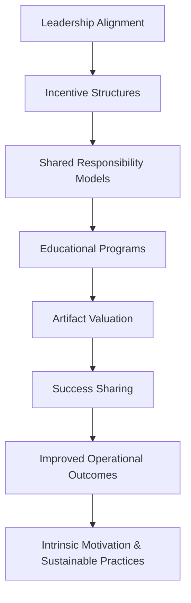

#### Observability as an Explicit Value

The most mature implementations establish observability as an explicit engineering value—on par with security, scalability, or performance. This cultural elevation creates corresponding expectations for all technical roles, regardless of specialization. Evidence shows that cultural transformation delivers more sustainable improvement than technical mandates or standards. Intrinsic motivation leads to more consistent, higher-quality implementation than compliance-driven approaches, where observability is treated as an obligation rather than a core value.

### Banking Impact

Observability culture directly impacts operational reliability, engineering productivity, and strategic agility in banking environments. Financial institutions that establish visibility as an organizational value consistently outperform those with similar technical capabilities but weak cultural foundations.

#### Key Business Metrics Achieved through Observability Culture

The following metrics illustrate the tangible benefits realized by a global investment bank after transforming their observability culture:

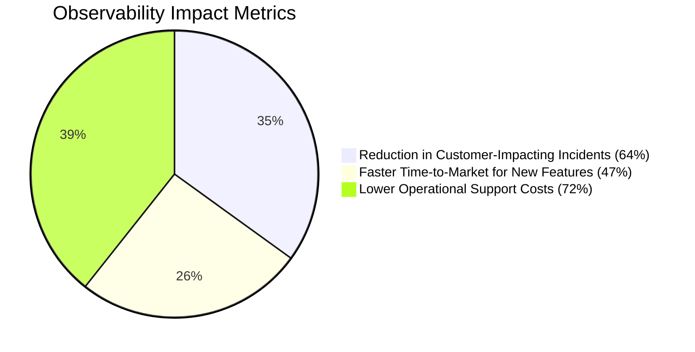

- **64% reduction in customer-impacting incidents**: Engineers proactively improved visibility rather than waiting for problems to occur.
- **47% faster time-to-market for new features**: Comprehensive observability streamlined testing and validation processes.
- **72% lower operational support costs**: More efficient troubleshooting reduced reliance on specialized expertise.

#### Talent and Strategic Advantages

The talent impact is equally significant—organizations with strong observability cultures report:

- **Higher engineering satisfaction and retention**: Teams spend less time on frustrating, avoidable troubleshooting and more on valuable creation.

Strategic agility also improves significantly:

- **Faster, more confident system evolution**: Comprehensive visibility reduces the fear of undetectable issues, enabling rapid innovation.

One retail banking platform credited their observability culture as a critical enabler for their successful core banking transformation—providing the visibility confidence needed to replace legacy systems while maintaining operational stability throughout the multi-year journey.

These metrics and outcomes demonstrate that observability culture isn't simply a technical preference but a strategic capability that directly enables both operational excellence and business transformation.

### Implementation Guidance

To develop observability culture in your banking organization:

1. **Align Leadership** - Ensure consistent emphasis on observability importance from executive and management levels through words, actions, and resource allocation.

2. **Integrate into Performance Management** - Update engineering evaluation criteria to explicitly include observability quality alongside functional delivery metrics.

3. **Enhance Recognition Programs** - Create specific recognition for observability contributions, highlighting direct impact on customer experience and business outcomes.

4. **Develop Educational Programs** - Build comprehensive training explaining observability value to different roles, focusing on business impact rather than technical details.

5. **Create Shared Experiences** - Implement observability-focused hackathons, workshops, and learning sessions that build collective capabilities across team boundaries.

6. **Establish Communities of Practice** - Support formal and informal knowledge sharing groups focused on observability patterns, challenges, and innovations.

7. **Update Career Frameworks** - Incorporate observability expertise into career advancement paths across engineering disciplines, not just specialized roles.

8. **Share Success Stories** - Systematically communicate how improved observability directly impacted customer experience, regulatory compliance, and business performance.
