# Chapter 14: Machine Learning for Log Analysis - Finding the Needle in the Haystack

## Chapter Overview

Welcome to the bloodsport of log analysis, where traditional monitoring is a blindfolded knife fight and your adversaries—fraudsters, outages, and regulatory fines—aren’t pulling punches. This chapter is your crash course in weaponizing machine learning for log data: not just to survive the data tsunami, but to hunt the anomalies hiding within. Human brains are no match for billions of log lines a day—so unless you’re planning to hire a small nation of analysts, you’ll need algorithms that can spot the real threats hiding in the noise. From feature engineering (the unsung hero, not just “data janitoring”) to explainable AI that won’t get you roasted by compliance, we’ll rip apart the myths of “just add machine learning” and show you how to build systems that actually adapt, learn, and keep you one step ahead of both the bad guys and the auditors. If your idea of fun is chasing ever-shifting patterns through petabytes of logs with a handful of regexes, this chapter isn’t for you. For everyone else: sharpen your pencils, check your cynicism at the door, and let’s get surgical.

______________________________________________________________________

## Learning Objectives

- **Diagnose** the cognitive and operational limits of manual log analysis at banking scale.
- **Design** scalable, distributed frameworks for ingesting and processing massive log datasets.
- **Apply** supervised and unsupervised machine learning models to real-world fraud and anomaly detection.
- **Engineer** features that translate raw logs into signal-rich, model-ready data (and know why this matters more than your algorithm du jour).
- **Leverage** anomaly and temporal pattern detection to find what doesn’t belong—even when you don’t know what you’re looking for.
- **Integrate** explainable AI techniques so compliance can’t torpedo your best models for being black boxes.
- **Operationalize** ML pipelines, embedding them into real-world workflows for proactive detection and response.
- **Establish** continuous learning cycles that keep your models ahead of evolving threats (and your competitors).
- **Measure** what matters: not just ROC curves, but business impact—fraud prevented, incidents resolved, and fines avoided.

\--

## Key Takeaways

- Human-powered log analysis at scale is a lost cause. If your security depends on an analyst catching a subtle pattern in 12 billion lines a day, you’re already breached.
- Rule-based detection is like playing whack-a-mole with a blindfold. Machine learning finds the moles you never knew existed—before they drain your accounts.
- Supervised learning excels at “known knowns”—but if your fraud patterns are evolving faster than your labels, unsupervised learning is your only hope.
- Feature engineering isn’t optional. Feeding raw logs to a deep learning model is like serving gravel to a gourmet chef—don’t expect a Michelin star.
- Anomaly detection is your early warning system. If you’re still relying on threshold-based alerts, hope your compliance budget is as big as your log storage bill.
- Sequence and temporal analysis uncover multi-stage attacks and laundering schemes that single-event analysis will always miss. If you can’t see the sequence, you’ll never spot the story.
- Explainability isn’t just “nice to have”—it’s your compliance insurance policy. The best-performing model is worthless if you can’t show your homework to the auditors.
- Operationalizing ML means embedding it in real workflows, not letting it rot as a science project. If your engineers don’t trust the alerts, you’ve wasted everyone’s time.
- Continuous learning is table stakes. Static models are sitting ducks—fraudsters evolve, and so must your detection.
- If you’re not measuring business impact—fraud averted, incidents mitigated, regulatory fines dodged—you’re just admiring clever dashboards. Results pay the bills; metrics alone don’t.

> In short: Machine learning won’t save you from bad process, lazy feature engineering, or regulatory wrath—but done right, it’s the difference between reading about breaches in the press and being the cautionary tale. Choose wisely.

______________________________________________________________________

## Panel 1: The Volume Challenge - When Human Analysis Fails

### Scene Description

A banking security operations center is overwhelmed by an unmanageable flood of log data. The main visualization screen displays a staggering figure: 15 billion daily log events streaming from thousands of interconnected banking systems. Analysts are visibly stressed, their screens cluttered with manual search queries. These queries, despite their complexity, yield tens of thousands of results, all requiring painstaking human review.

Below is a conceptual flow representation of the scene:

```
+-------------------+         +-------------------+         +-------------------+
| Banking Systems   |         | Log Aggregation   |         | Security Analysts |
| (Thousands)       |         | Layer             |         | (Manual Review)   |
+-------------------+         +-------------------+         +-------------------+
        |                               |                               |
        |         Billions of Logs      |                               |
        +------------------------------->                               |
                                        |                               |
                                        |  Processed Logs               |
                                        +-------------------------------> 
                                                                        |
          Analysts struggle to extract meaningful patterns from overwhelming data.
```

On a secondary screen, a timeline visualization illustrates the consequences of this volume challenge: a sophisticated fraud attempt that went undetected for days. Indicators of the fraud were present in the logs, but the critical patterns were lost amidst billions of legitimate entries. Nearby, a graph projects log volume growth, doubling annually, while the number of analysts remains static—underscoring the impossibility of scaling human analysis to match the data explosion.

The scene conveys the fundamental tension: the cognitive limitations of human analysts facing exponential data growth, and the urgent need for new paradigms to address the volume challenge.

### Teaching Narrative

The volume challenge represents the fundamental breaking point of traditional log analysis—when data scale exceeds human cognitive capacity regardless of tooling or expertise. Imagine trying to find a single specific grain of sand on a beach that doubles in size every year. Modern banking systems generate log volumes on a similar scale: billions of daily events across thousands of distributed services, petabytes of historical data spanning years of operations, and complex relationships that cannot be detected through simple query-based approaches.

This overwhelming volume creates several critical limitations: analysis throughput cannot match the rate of data generation, search-based approaches become increasingly ineffective as result sets balloon, pattern recognition exceeds human cognitive capacity across distributed data sources, and subtle anomalies vanish within the sheer mass of normal operations.

For example, consider a scenario where a sophisticated fraud attempt is hidden among billions of legitimate transactions. Even when all the necessary indicators are present in the logs, the sheer scale makes it impossible for human analysts to connect the dots in time. This is not a failure of tools or expertise—it’s a cognitive limitation. Humans simply cannot process billions of data points or identify intricate patterns across such massive scales.

This challenge is particularly acute in financial services, where transaction volumes create log explosions, and the stakes are high—finding that "needle in the haystack" can determine whether a security breach is caught in time or whether a critical operational issue is identified before it causes significant damage. Machine learning offers a paradigm shift, enabling computational pattern recognition to tackle problems that are fundamentally beyond human scale, turning the impossible into actionable insights.

### Common Example of the Problem

First Union National Bank's security operations center faces a daily tsunami of over 12 billion log events generated by their digital banking platform, core banking systems, ATM network, and payment processing infrastructure. During a sophisticated account takeover attack, criminals exploited this volume challenge to remain undetected. The attackers deliberately executed activities that individually appeared normal—logging in from approved devices during business hours, transferring amounts below manual review thresholds, and changing contact information gradually over weeks rather than simultaneously. Despite all evidence existing within collected logs, security analysts using traditional search-based approaches missed the pattern completely. The attack was only discovered after $2.8M had been fraudulently transferred when a customer complained about unauthorized activity—three weeks after the initial compromise signals appeared in logs.

To illustrate the sequence of events and missed opportunities for detection, consider the following timeline diagram:

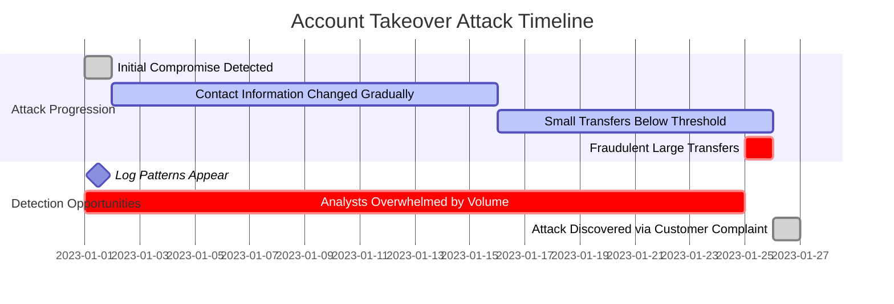

This timeline highlights how the attackers strategically exploited the overwhelming scale of log data to mask their activities. Critical patterns—such as unusual but gradual changes to account information and subtle transactional anomalies—were present in the logs but went unnoticed due to the limitations of manual analysis. By the time the fraudulent large transfers occurred, the attack had been active for over three weeks, leaving security analysts to react after significant financial damage was already done.

The example underscores the importance of timely pattern recognition and the inadequacy of traditional log analysis methods in detecting sophisticated, low-and-slow attacks amidst massive data volumes.

### SRE Best Practice: Evidence-Based Investigation

The fundamental limitation in volume-scale log analysis isn't the absence of signals but the inability to identify relevant patterns among overwhelming noise. SRE best practices address this through computational approaches that augment human analysis:

1. **Scalable Processing Frameworks**: Implement distributed computing platforms like Spark or Presto specifically designed for massive log datasets, enabling analysis that scales horizontally with data volume.

2. **Supervised Classification Models**: Deploy trained machine learning models that automatically categorize log events based on historical examples, using algorithms that improve with feedback to continuously enhance accuracy.

3. **Unsupervised Anomaly Detection**: Apply clustering and outlier detection algorithms that automatically identify unusual patterns without requiring predefined signatures, enabling discovery of novel threats and issues.

4. **Dimension Reduction Techniques**: Utilize approaches like principal component analysis (PCA) to transform high-dimensional log data into lower-dimensional representations that highlight significant patterns while filtering noise.

5. **Temporal Pattern Mining**: Implement sequence analysis algorithms that discover relevant patterns across time, identifying attack signatures that unfold over hours, days, or weeks rather than appearing in isolated events.

#### Example: Simple Log Anomaly Detection with Python

The following code demonstrates a basic approach to unsupervised anomaly detection using the Isolation Forest algorithm on log data:

```python
from sklearn.ensemble import IsolationForest
import pandas as pd

# Example log data (features extracted for simplicity)
log_data = pd.DataFrame({
    'response_time': [120, 50, 45, 500, 60, 55, 600],
    'request_size': [200, 180, 190, 1000, 195, 185, 1200]
})

# Train Isolation Forest for anomaly detection
model = IsolationForest(contamination=0.1, random_state=42)
log_data['anomaly'] = model.fit_predict(log_data)

# Identify anomalies
anomalies = log_data[log_data['anomaly'] == -1]
print("Detected Anomalies:")
print(anomalies)
```

#### Workflow Diagram: Evidence-Based Investigation Process

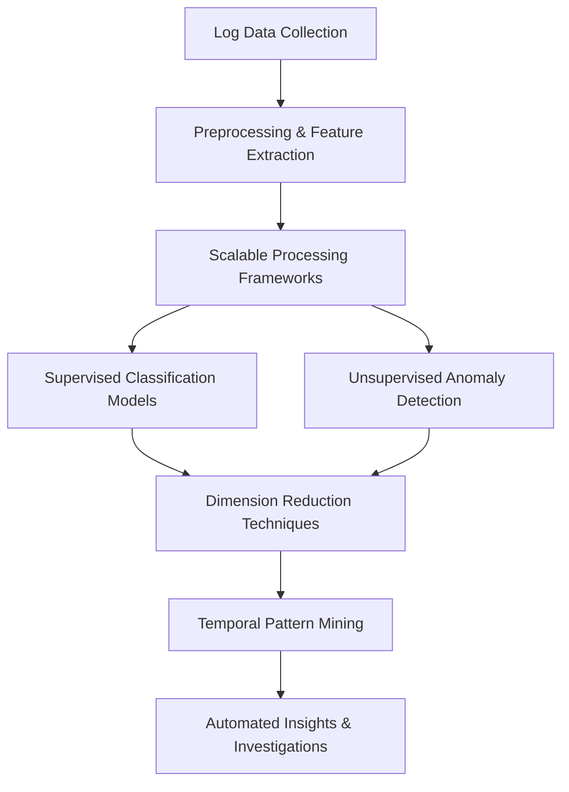

These computational approaches transform the investigation paradigm from "searching for known patterns" to "automatically discovering relevant anomalies"—a fundamental shift that addresses the cognitive limitations of manual analysis at banking scale.

### Banking Impact

The volume challenge directly impacts critical banking operations across multiple dimensions. Below is a concise summary of these impacts:

| **Impact Area** | **Description** | **Financial Implications** |
| -------------------------------- | ----------------------------------------------------------------------------------------------------------------------------------------------------------------------------------------------------------------------- | ----------------------------------------- |
| **Undetected Fraud** | Sophisticated fraud attempts go unnoticed when log volumes exceed analysis capacity, leading to financial losses directly affecting customer accounts and bank balance sheets. | $10-25M annually in direct losses |
| **Extended Resolution Time** | Troubleshooting time increases from minutes to hours or days, as teams struggle to identify relevant events among billions of log entries. This delays issue resolution and impacts customer experience during outages. | Lost revenue and customer dissatisfaction |
| **Compliance Exposure** | Inability to monitor and detect suspicious activities effectively leads to regulatory penalties for non-compliance with monitoring requirements. | $50M+ in regulatory penalties |
| **Operational Inefficiency** | Teams overwhelmed by log volumes become reactive rather than proactive, focusing on immediate crises instead of improving system reliability, escalating support costs, and creating staffing challenges. | Higher operational and staffing costs |
| **Missed Business Intelligence** | Failure to analyze massive datasets means valuable insights from customer transaction patterns remain undiscovered, leading to missed competitive advantages and revenue opportunities. | Lost revenue and market opportunities |

The financial and operational consequences of these challenges are significant, with direct fraud-related losses and regulatory penalties alone costing large banks tens of millions annually, alongside broader inefficiencies and missed opportunities.

### Implementation Guidance

To address the volume challenge through machine learning approaches, follow this structured checklist and phased implementation plan:

#### **Step-by-Step Checklist**

1. **Infrastructure Assessment**

   - Evaluate current log processing infrastructure.
   - Compare capacity against volume growth projections.
   - Implement scalable storage and processing technologies optimized for machine learning workloads on massive datasets.

2. **Focused Use Case Definition**

   - Identify high-value, well-defined problems (e.g., fraud detection, operational anomalies).
   - Prioritize use cases where improved pattern detection provides immediate value.

3. **Data Engineering Foundation**

   - Ensure log collection processes are robust and comprehensive.
   - Standardize data:
     - Normalize fields.
     - Standardize timestamps.
     - Resolve entities for consistent representation.
   - Clean and prepare data for machine learning ingestion.

4. **Progressive Implementation**

   - Begin with simpler methods and incrementally increase complexity:
     - Statistical anomaly detection.
     - Supervised classification models.
     - Unsupervised pattern discovery.
     - Advanced deep learning models.
   - Implement in phases to mitigate risk and gather early results.

5. **Hybrid Human-Machine Workflow**

   - Design workflows that balance machine efficiency with human expertise:
     - Use machine learning to flag potential patterns.
     - Leverage analysts' judgment for investigation and response.

6. **Feedback Loop Creation**

   - Capture analyst determinations (e.g., true/false positives).
   - Feed this feedback into models for iterative improvement and retraining.

7. **Effectiveness Measurement**

   - Define and track clear metrics:
     - Detection rate improvements.
     - Reduction in false positives.
     - Time-to-detection improvements.
     - Operational efficiency gains.

______________________________________________________________________

#### **Phased Implementation Diagram**

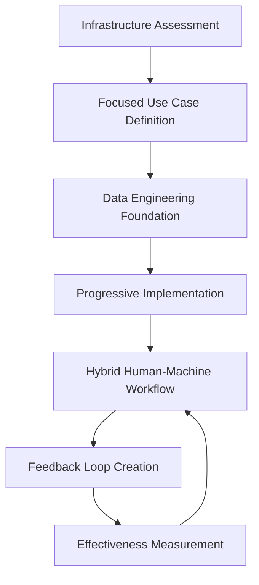

Use this process to systematically implement machine learning solutions, addressing the volume challenge while ensuring scalability, accuracy, and continuous improvement.

## Panel 2: The Pattern Recognition Revolution - From Rules to Learning

### Scene Description

A bustling banking analytics lab showcases the evolution from traditional rule-based systems to modern machine learning approaches for transaction log analysis. A split-screen setup vividly highlights the contrast:

- **Left Screen:** A security engineer manually crafts intricate detection rules. The screen displays a complex matrix of predefined fraud patterns, with the engineer laboriously updating rules as new fraud tactics emerge. A flowchart illustrates the process:

  ```
  [Known Fraud Pattern] --> [Engineer Writes Rule] --> [System Detects Matching Logs]
  ```

  Performance graphs show diminishing detection accuracy over time, as the system struggles to keep up with evolving tactics.

- **Right Screen:** A machine learning system autonomously analyzes transaction logs. The screen visualizes clusters of unusual behavior, dynamically identified without explicit programming. A similar flowchart outlines the ML process:

  ```
  [Transaction Logs] --> [ML Identifies Clusters] --> [System Flags Anomalies]
  ```

  A highlighted example demonstrates how the system uncovered a previously unknown mortgage fraud pattern, revealing subtle correlations across diverse data sources (e.g., application logs, credit checks, document processing). Below, performance metrics showcase how detection accuracy improves continuously, adapting seamlessly to new behaviors.

This dual-screen comparison, supported by clear visualizations and real-time performance metrics, underscores the transformative power of machine learning: shifting from reactive rule creation to proactive, adaptive pattern recognition.

### Teaching Narrative

The pattern recognition revolution represents a fundamental shift from explicit programming to autonomous learning—transforming log analysis from predefined rule creation to adaptive pattern discovery. Traditional approaches rely entirely on human-defined patterns: engineers create explicit rules based on known signatures, manually update these rules as patterns evolve, and can only detect what they've specifically programmed systems to find. This creates inherent limitations: detection restricted to previously identified patterns, constant maintenance requirements as behaviors change, and fundamental blindness to novel approaches never before encountered. Machine learning transcends these constraints through computational pattern recognition: unsupervised clustering identifying natural groupings within data, anomaly detection recognizing deviations from established baselines, relationship discovery revealing connections across seemingly unrelated events. For financial institutions analyzing billions of transaction logs, this capability transformation is particularly powerful—enabling detection of previously unknown fraud patterns, identification of subtle operational issues before significant impact, and continuous adaptation to evolving behaviors without constant rule updates. The most significant advantage emerges with novel patterns—while rule-based systems remain blind to never-before-seen approaches until explicitly programmed, learning systems can identify unusual behaviors simply because they deviate from normal patterns, even without specific prior examples. This fundamental shift from "find what we know to look for" to "identify what doesn't belong" represents the core revolution in log analysis—transforming reactive detection based on known patterns to proactive identification of emerging threats and issues.

### Common Example of the Problem

Northeast Financial's fraud detection team maintained a comprehensive rule-based system with over 1,200 explicit detection rules for their digital banking platform. Despite continuous updates, they experienced a sophisticated business email compromise (BEC) attack that bypassed all existing rules. The attackers compromised a corporate customer's email account, observed normal payment patterns for several weeks, then initiated wire transfers that precisely mimicked legitimate behavior while directing funds to new beneficiaries. The transactions passed all rule-based checks because they:

- Originated from known devices and IP ranges
- Used normal transfer amounts within established patterns
- Occurred during typical business hours
- Involved transaction types common for the account
- Passed all explicit rule validations

Here is a simplified flowchart illustrating how the attack unfolded and bypassed the rule-based system:

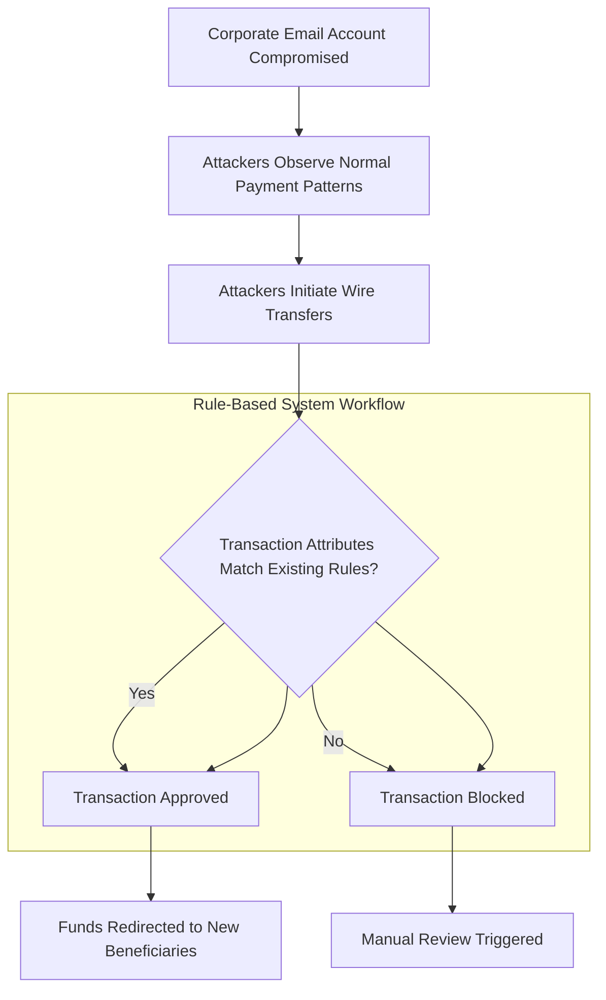

Despite being a novel attack method, the pattern contained subtle anomalies that diverged from the customer's established behavior—characteristics impossible to predefine in rules but readily detectable through pattern learning approaches. This highlights the inherent limitations of rule-based systems and the need for adaptive learning capabilities to identify deviations from normal behavior.

### SRE Best Practice: Evidence-Based Investigation

Effective pattern recognition requires moving beyond explicit rules to learning systems that automatically identify relevant patterns without predefinition. Use the following checklist to apply best practices for evidence-based investigation in real-world scenarios:

| **Best Practice** | **Description** |
| -------------------------------------- | ---------------------------------------------------------------------------------------------------------------------------------------------------------------------------------------------------------------------------- |
| **Behavioral Baseline Establishment** | Create comprehensive behavioral profiles for entities (users, accounts, systems) based on historical patterns. These multi-dimensional baselines capture normal behavior across numerous attributes. |
| **Multi-Modal Analysis** | Apply specialized algorithms for different pattern types: clustering for behavioral grouping, isolation forests for anomaly detection, graph analysis for relationship discovery, and sequence models for temporal patterns. |
| **Ensemble Approach** | Combine multiple detection methods. Use supervised classification for known patterns and unsupervised anomaly detection for novel patterns to ensure broad, complementary coverage. |
| **Feature Engineering Prioritization** | Focus on transforming raw logs into meaningful domain-specific features. Prioritize feature creation over algorithm complexity for improved detection accuracy. |
| **Continuous Learning Implementation** | Deploy systems that adapt automatically by incorporating new patterns through explicit analyst feedback and implicit signals like emerging data clusters, ensuring models evolve with behavior changes. |

This evidence-based approach shifts detection from "defining what to look for" to "learning what doesn't belong"—enabling the identification of novel patterns that cannot be predefined in rules.

### Banking Impact

The shift from rules to learning creates substantial business impact across banking operations. Below is a summary of key impacts with associated metrics:

| **Impact Area** | **Description** | **Key Metrics** |
| ---------------------------------- | ---------------------------------------------------------------------------------------------------------------------------------------------- | ---------------------------------------------------------------------------------------- |
| **Improved Fraud Prevention** | Machine learning approaches deliver higher detection rates for sophisticated fraud while reducing false positives. | - 65-80% higher fraud detection rates<br>- 30-50% reduction in false positives |
| **Novel Threat Detection** | Learning-based systems identify new attack patterns weeks or months before they can be codified into rules, providing a significant advantage. | - Early detection of emerging threats<br>- Faster response times to novel fraud patterns |
| **Operational Efficiency** | Reduces the need for constant rule updates, freeing security engineering resources while improving detection accuracy. | - 30-40% reduction in rule maintenance workload<br>- Increased resource availability |
| **Regulatory Compliance** | Demonstrates effective monitoring, reducing regulatory exposure and penalties while meeting stricter compliance standards. | - Lower compliance penalties<br>- Improved audit outcomes |
| **Customer Experience Protection** | Proactively detects issues before they impact customers, enhancing trust and experience in competitive banking markets. | - Reduced customer complaints<br>- Improved customer satisfaction scores |
| **Return on Investment (ROI)** | Financial benefits from reduced losses, lower operational costs, and compliance improvements. | - 300-500% ROI within 18 months |

**Summary of Benefits**

- **Proactive Detection**: Shifts from reactive monitoring to proactive issue identification, reducing risk and enabling faster responses.
- **Cost Savings**: Frees up engineering resources and reduces operational expenses associated with rule management.
- **Customer Trust**: Enhances customer confidence by addressing issues before they escalate.

By adopting machine learning, banks achieve a transformative capability to not only detect known threats but also uncover and adapt to emerging risks, driving both operational excellence and competitive advantage.

### Implementation Guidance

To successfully implement the transition from rules to learning, follow this structured checklist and step-by-step process:

#### Checklist for Transition Preparation:

- [ ] **Run Machine Learning in Parallel**: Deploy machine learning systems alongside existing rule-based systems to validate effectiveness while mitigating risks during the transition.
- [ ] **Ensure Data Quality**: Build robust data pipelines to normalize formats, standardize fields, and enrich raw logs into consistent, analysis-ready datasets.
- [ ] **Engage Domain Experts**: Collaborate with subject matter experts to engineer meaningful features that capture domain-specific behaviors and insights.
- [ ] **Select Balanced Algorithms**: Choose appropriate techniques for each task: supervised classification for known patterns, unsupervised clustering for grouping, and anomaly detection for novel behaviors.
- [ ] **Establish Feedback Loops**: Design workflows that enable analysts to provide model feedback, confirm findings, and incorporate new patterns into training data.
- [ ] **Implement Explainability**: Deploy tools that provide transparent model decision insights, ensuring human analysts can understand and investigate outputs effectively.
- [ ] **Define Performance Metrics**: Create a framework to measure success, including detection rates, false positive ratios, novel pattern identification, and time-to-detection.

#### Step-by-Step Process:

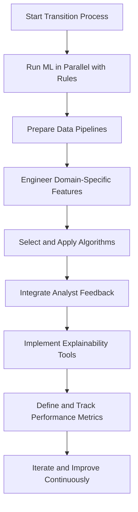

1. **Run Machine Learning in Parallel**: Start by setting up machine learning systems to operate concurrently with rule-based approaches. This allows for comparison, validation, and a gradual shift without disrupting current operations.

2. **Prepare Data Pipelines**: Develop automated pipelines to process raw logs into high-quality, standardized datasets. Include normalization, field standardization, enrichment, and context addition to maximize analysis readiness.

3. **Engineer Domain-Specific Features**: Collaborate with domain experts to derive features from raw data that accurately reflect domain behaviors, ensuring the models capture relevant indicators.

4. **Select and Apply Algorithms**: Balance your approach by applying supervised techniques for detecting known patterns, unsupervised methods for grouping behaviors, and anomaly detection for identifying novel scenarios.

5. **Integrate Analyst Feedback**: Establish workflows for analysts to validate model outputs, reject false positives, and provide feedback to refine the system over time.

6. **Implement Explainability Tools**: Add mechanisms that translate model decisions into clear, interpretable insights for analysts, avoiding the pitfalls of "black box" systems.

7. **Define and Track Performance Metrics**: Regularly measure the system's effectiveness against predefined metrics, such as detection accuracy, false positive rates, and the speed of identifying new patterns.

8. **Iterate and Improve Continuously**: Use performance metrics and analyst feedback to refine models, enhance data pipelines, and adjust algorithms to adapt to evolving patterns and threats.

## Panel 3: The Supervised Learning Approach - Classification and Prediction

### Scene Description

A fraud detection center where machine learning specialists train supervised models on transaction logs. Interactive displays show the training process, providing a step-by-step view of the workflow:

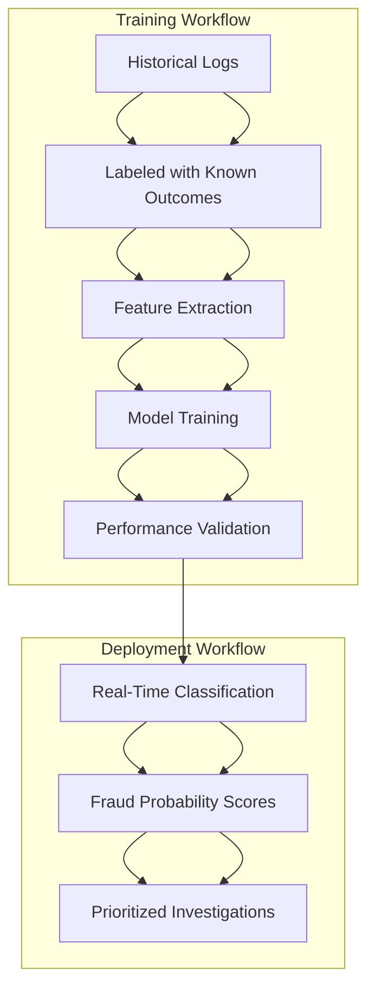

- **Historical Logs**: Data labeled with known outcomes, distinguishing legitimate transactions from confirmed fraud cases.
- **Feature Extraction**: Identification of relevant signals from raw log data, such as transaction timing, amounts, and customer behavior patterns.
- **Model Training**: Application of supervised learning algorithms (e.g., random forests, neural networks, gradient boosting) to recognize patterns associated with different outcomes.
- **Performance Validation**: Testing the model's accuracy on holdout datasets to ensure reliability.
- **Real-Time Classification**: Deployment of trained models to evaluate incoming transactions, assigning fraud probability scores.
- **Prioritized Investigations**: High-probability fraud cases are flagged for immediate review by analysts.

Performance dashboards in the center vividly illustrate the system's impact: an 83% increase in fraud detection rates, a 62% reduction in false positives, and the discovery of intricate fraud patterns previously undetectable through rule-based systems.

### Teaching Narrative

Supervised learning transforms historical knowledge into predictive capability by teaching models to recognize patterns associated with specific outcomes based on labeled examples. This approach leverages past experience—events with known classifications—to create systems that can automatically categorize new observations based on learned patterns. In banking log analysis, supervised learning implements a powerful workflow: data collection gathering historical logs with confirmed outcomes (legitimate transactions, known fraud cases, verified security incidents), feature engineering extracting relevant signals from raw log data, model training teaching algorithms to recognize patterns associated with different outcomes, performance validation ensuring accuracy on data not used during training, and production deployment applying these models to ongoing log streams for real-time classification. This methodology excels at defined classification problems where labeled examples exist: fraud detection identifying suspicious transactions based on patterns learned from confirmed cases, security monitoring flagging potential attacks based on previously identified incidents, operational issue detection recognizing problematic patterns associated with known failures, and risk assessment evaluating transaction characteristics against established risk profiles. The key advantage over rule-based approaches lies in pattern complexity—while traditional rules typically rely on simple conditional logic, supervised learning can identify subtle, multi-dimensional patterns impossible to capture in explicit rules. A fraud detection system might learn that a specific combination of transaction timing, amount patterns, merchant characteristics, and customer behavior indicates likely fraud, despite none of these factors individually appearing suspicious—patterns far too complex for manual rule creation but readily discoverable through statistical learning from labeled examples.

### Common Example of the Problem

Capital Commerce Bank struggled with debit card fraud detection using traditional rule-based systems. Their existing approach relied on explicit thresholds: flagging transactions from unusual countries, exceeding certain amounts, or occurring in rapid succession. This created two persistent problems:

1. Sophisticated fraud that deliberately operated below thresholds went undetected until customers reported unauthorized charges. Investigation revealed these transactions contained subtle pattern indicators that collectively suggested fraud despite individually appearing normal.

2. Legitimate customer transactions during travel or unusual circumstances frequently triggered false positives, creating both customer friction and overwhelming investigation queues. The bank faced an impossible trade-off between protection and experience.

When examined retrospectively, both problems stemmed from the same limitation: complex, multi-dimensional patterns that couldn't be effectively captured through explicit rules. The relationship between geographic location, merchant category, transaction history, amount patterns, and device information created fraud signals too nuanced for threshold-based approaches—yet these relationships were consistently present when analyzing historical data.

#### Comparison of Rule-Based Systems vs. Supervised Learning for Fraud Detection

| **Aspect** | **Rule-Based Systems** | **Supervised Learning Systems** |
| ---------------------------- | ----------------------------------------------------------------------------- | -------------------------------------------------------------------------------------------------------- |
| **Pattern Complexity** | Limited to simple, pre-defined rules (e.g., thresholds, explicit conditions). | Detects complex, multi-dimensional patterns in data automatically. |
| **Fraud Detection** | Misses sophisticated fraud that operates below static thresholds. | Identifies subtle correlations and patterns indicative of fraud, even if individual factors seem normal. |
| **False Positive Rate** | High, as legitimate transactions often trigger rigid rules. | Lower, as models learn to distinguish between genuine activity and fraudulent patterns. |
| **Adaptability** | Requires manual updates to rules as new fraud patterns emerge. | Continuously improves with retraining on updated labeled datasets. |
| **Scalability** | Struggles with large data volumes or complex relationships between variables. | Scales effectively to handle high-dimensional data and evolving fraud tactics. |
| **Investigation Efficiency** | Overwhelms investigators with a high volume of false positives. | Prioritizes investigations by assigning probabilistic fraud scores to transactions. |

By transitioning from rule-based systems to supervised learning, Capital Commerce Bank was able to overcome these limitations, achieving higher fraud detection rates, fewer false positives, and more efficient investigation workflows. Supervised learning enabled the detection of previously missed fraud patterns by leveraging historical data and uncovering nuanced relationships that traditional rules could not capture.

### SRE Best Practice: Evidence-Based Investigation

Effective supervised learning for log analysis implements a structured methodology that transforms historical examples into predictive capability. Use the following checklist as a practical guide to ensure an evidence-based investigation approach:

#### Checklist for Evidence-Based Investigation

1. **Comprehensive Labeling Discipline**

   - Define clear labeling standards for historical data.
   - Capture outcome labels for all key scenarios:
     - Known fraud cases.
     - Verified security incidents.
     - Legitimate transactions.
     - Operational issues.
   - Regularly audit and update labels to maintain dataset reliability.

2. **Domain-Driven Feature Engineering**

   - Extract meaningful features from raw logs, focusing on:
     - **Temporal Features**: Transaction velocities, time-based trends.
     - **Relational Features**: Connections between entities.
     - **Behavioral Features**: Deviations from historical norms.
     - **Contextual Features**: Environmental or situational factors.
   - Collaborate with domain experts to ensure relevance and completeness.

3. **Balanced Model Selection**

   - Choose algorithms based on the use case:
     - Prioritize interpretability for critical systems.
     - Match algorithm complexity to data volume and feature characteristics.
     - Evaluate options such as random forests, gradient boosting, or neural networks.
   - Balance performance needs with operational constraints.

4. **Rigorous Validation Methodology**

   - Go beyond basic accuracy metrics by incorporating:
     - Precision-recall analysis.
     - Confusion matrices.
     - ROC (Receiver Operating Characteristic) curves.
   - Test models against diverse scenarios, including:
     - Various attack patterns.
     - Real-world operational conditions.
   - Ensure robustness under evolving and adversarial environments.

5. **Continuous Retraining Framework**

   - Establish infrastructure for ongoing updates:
     - Schedule retraining based on the accumulation of new labeled data.
     - Enable triggered retraining when performance metrics (e.g., accuracy, precision) indicate model drift.
   - Monitor for emerging patterns or shifts in data distributions to maintain relevance.

#### Summary Flow for Evidence-Based Investigation

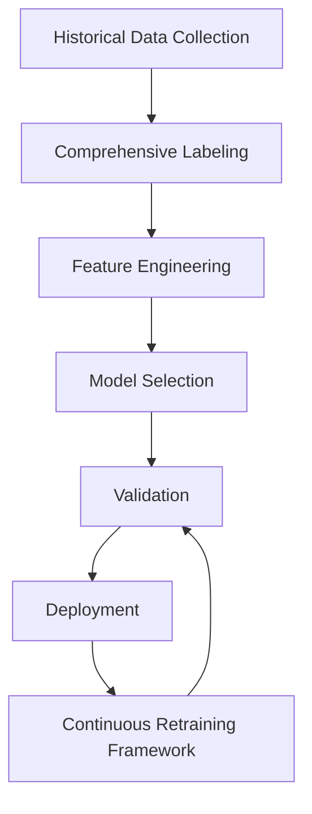

By following this structured approach, supervised learning systems can deliver reliable, continuously improving classification capabilities. This enables the detection of complex relationships and patterns that are often too intricate for traditional rule-based systems to capture.

### Banking Impact

Supervised learning for log analysis creates substantial banking business impacts across multiple domains. The following table summarizes key quantitative benefits observed from real-world implementations:

| Impact Area | Quantitative Benefit | Description |
| -------------------------- | ------------------------------------------ | ----------------------------------------------------------------------------------------------------------------- |
| **Reduced Fraud Losses** | 40-60% increase in fraud detection rates | Identifies significantly more fraud than rule-based systems with fewer false positives, directly reducing losses. |
| **Operational Efficiency** | 50-70% reduction in investigation workload | Generates more accurate alerts, allowing security teams to focus on genuine threats rather than false alarms. |
| **First-Year ROI** | 200-300% | Achieved through fraud reduction, operational savings, and improved customer retention. |
| **Customer Experience** | 30-50% fewer false positives | Enhances customer satisfaction by reducing transaction disruptions while improving protection. |
| **Regulatory Compliance** | 100% regulatory alignment | Demonstrably effective monitoring and documentation meet governance and compliance requirements. |

#### Business Value Highlights:

- **Fraud Reduction**: Supervised learning systems detect complex fraud patterns missed by traditional rule-based approaches, increasing fraud detection rates while minimizing false positives.
- **Operational Savings**: Streamlined workflows reduce the time and resources spent on manual reviews, allowing teams to focus on high-priority cases.
- **Customer Retention**: By minimizing legitimate transaction disruptions, banks foster trust and loyalty, directly contributing to long-term customer retention.
- **Competitive Advantage**: Early detection of emerging fraud trends provides banks with a significant edge over competitors relying on outdated methods.

The combination of these benefits enables banks to achieve measurable improvements in financial performance, operational efficiency, and customer satisfaction, ensuring sustained competitive positioning in the market.

### Implementation Guidance

To successfully implement supervised learning for log analysis, follow this structured process:

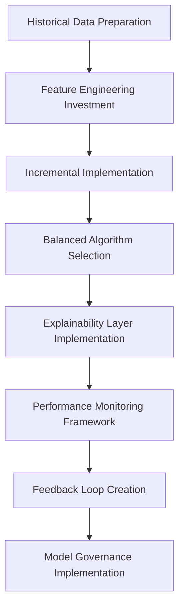

1. **Historical Data Preparation**:

   - Gather and prepare comprehensive historical datasets with reliable outcome labels.
   - Ensure balanced representation of different patterns, including legitimate transactions, known fraud cases, and edge scenarios.

2. **Feature Engineering Investment**:

   - Allocate significant resources to transforming raw logs into meaningful features.
   - Collaborate with domain experts to identify relevant behavioral indicators beyond obvious data fields.

3. **Incremental Implementation**:

   - Start with high-confidence classification problems where labeled data is abundant.
   - Begin with binary classification (legitimate/suspicious) and progress to multi-class or probability scoring approaches.

4. **Balanced Algorithm Selection**:

   - Choose models that fit your specific requirements.
   - Use gradient boosting machines (e.g., XGBoost, LightGBM) for structured data needing interpretability, or deep learning for complex pattern recognition where explainability is less critical.

5. **Explainability Layer Implementation**:

   - Deploy techniques such as SHAP (SHapley Additive exPlanations) or LIME (Local Interpretable Model-agnostic Explanations) to make model decisions understandable to analysts and auditors.

6. **Performance Monitoring Framework**:

   - Establish metrics beyond basic accuracy, including precision, recall, false positive rates, and business impact measures.
   - Monitor for concept drift, where model performance degrades as patterns evolve.

7. **Feedback Loop Creation**:

   - Develop explicit processes for analysts to confirm or correct model classifications.
   - Create a continuous improvement cycle that enhances accuracy over time.

8. **Model Governance Implementation**:

   - Establish documentation, validation, and oversight aligned with financial services regulations.
   - Ensure models remain compliant with evolving requirements.

## Panel 4: The Unsupervised Learning Advantage - Finding the Unknown Unknown

### Scene Description

A banking security operations center where analysts use unsupervised learning to discover new attack patterns in authentication logs. Visualization displays show clustering algorithms automatically grouping login behaviors into distinct clusters without predefined categories, with patterns emerging naturally from the data. Analysts can clearly see user behavior clusters such as typical customer logins, administrative access, and automated system processes. Below is a conceptual representation of how login behaviors are clustered:

```
Clusters:        [Customer Logins]---\
                                     ----[Distinct Clusters]
[Raw Log Data]---[Clustering Model]---/
                                     ----[Anomalous Group]
Clusters:        [Admin Access]------/
```

Anomaly detection algorithms further highlight unusual access patterns that don't match established behavior models. These anomalies are flagged and visually emphasized on the display, showing behaviors that deviate from normal clusters. For example:

```
Normal Behavior Cluster       Anomalous Behavior
+-----------------------+     +-----------------------+
| Typical Customer Logins |   | Suspicious Low Volume |
| Administrative Access   |   | Credential Stuffing   |
+-----------------------+     +-----------------------+
```

Security analysts focus on the flagged anomalies, investigating machine-identified patterns that initially appear subtle—for instance, authentication requests that mimic normal behavior but deviate in barely perceptible ways. Upon deeper investigation, they uncover a sophisticated credential stuffing attack designed to evade traditional rule-based detection by keeping volumes below alerting thresholds. This discovery highlights how unsupervised learning capabilities enable the detection of advanced threats that would likely remain unnoticed without such advanced analytical tools.

### Teaching Narrative

Unsupervised learning delivers the most powerful capability in advanced log analysis—discovering patterns, relationships, and anomalies without requiring labeled examples or predefined categories. While supervised learning excels at recognizing known patterns, it remains fundamentally limited to what has been previously identified and labeled. Unsupervised approaches transcend this constraint by autonomously discovering structure within data: clustering algorithms grouping similar log events into natural categories, anomaly detection identifying observations that don't fit established patterns, association learning discovering relationships between seemingly unrelated events, and dimensionality reduction revealing hidden structure in complex data.

For financial institutions facing sophisticated threats and operational challenges that may have never been previously encountered, this capability provides critical advantages: identification of novel attack patterns without prior examples, detection of emerging operational issues before they match known failure signatures, discovery of subtle fraud approaches designed specifically to evade traditional detection, and recognition of unusual customer behavior patterns that may indicate either problems or opportunities. The power of unsupervised learning emerges most clearly with "unknown unknowns"—threats and issues not only never before seen by the specific organization but novel approaches that wouldn't be detected by rule-based systems regardless of expertise. When a sophisticated attacker develops a completely new approach to bank fraud, or when an unprecedented system interaction creates a novel failure mode, unsupervised learning can identify these patterns simply because they differ from normal behavior—providing detection capability for threats and issues that couldn't possibly be explicitly programmed into rule-based systems.

#### Comparison: Supervised vs. Unsupervised Learning

| **Aspect** | **Supervised Learning** | **Unsupervised Learning** |
| ----------------------- | ------------------------------------------------------------------------------------------------------------------ | ----------------------------------------------------------------------------------------------------------------------------- |
| **Definition** | Learns from labeled data to predict outcomes or classify data into predefined categories. | Learns from unlabeled data by identifying patterns, structures, or anomalies without predefined categories. |
| **Key Algorithms** | Classification (e.g., decision trees, SVM), regression, neural networks. | Clustering (e.g., K-means, DBSCAN), anomaly detection, association rule learning, dimensionality reduction. |
| **Primary Use Cases** | Fraud detection using historical fraud labels, customer churn prediction, credit scoring. | Identifying unknown fraud patterns, discovering emerging operational issues, detecting anomalies in login behavior. |
| **Data Requirements** | Requires a labeled dataset for training. | Does not require labeled data; works with raw, unlabeled datasets. |
| **Strengths** | Highly effective when the problem and outcomes are well-defined and sufficient labeled data is available. | Excels at discovering unknown patterns, relationships, and anomalies in complex, unlabeled datasets. |
| **Limitations** | Limited to recognizing patterns within the scope of the labeled data; cannot identify novel or emerging phenomena. | May produce results requiring human interpretation; lacks direct supervision for specific outcomes. |
| **Example in Security** | Flagging logins as malicious or legitimate based on past labeled attack data. | Detecting subtle credential stuffing attacks designed to evade rule-based systems by deviating slightly from normal behavior. |

This table highlights the distinctions and complementary nature of supervised and unsupervised learning. By leveraging unsupervised methods, financial institutions gain the ability to detect and respond to "unknown unknowns," enabling proactive defense against sophisticated, novel threats and operational challenges.

### Common Example of the Problem

Metropolitan Bank's payment processing platform experienced a sophisticated API abuse attack that bypassed all existing detection mechanisms. The attackers exploited a weakness in the bank's mobile application, using automated systems to execute millions of small-value balance inquiries and minor transactions that individually appeared legitimate. The pattern was designed specifically to avoid triggering existing monitoring systems:

- Each individual API call was valid and correctly authenticated
- Transaction volumes stayed below rate-limiting thresholds
- Activities occurred from thousands of legitimate customer accounts (compromised credentials)
- Operations appeared functionally normal when viewed in isolation
- Traffic patterns mimicked typical usage when viewed through conventional metrics

The attack remained undetected for nine weeks, causing significant infrastructure load, degrading performance for legitimate customers, and providing attackers with valuable data for planning future fraud. Despite generating millions of log entries, the pattern wasn't detectable through rules or supervised approaches because it represented an entirely novel attack technique with no historical examples—a true "unknown unknown" that didn't match any predefined pattern but clearly represented anomalous behavior when viewed through unsupervised learning techniques.

Below is a timeline illustrating the progression of the attack and its detection challenges:

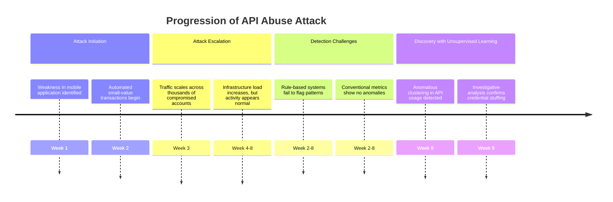

This timeline highlights how the attack evolved over time, why traditional detection methods failed, and how unsupervised learning ultimately enabled the discovery of a true "unknown unknown." The ability to identify clustering anomalies and deviations from typical behavior was pivotal in uncovering this sophisticated attack.

### SRE Best Practice: Evidence-Based Investigation

Effective unsupervised learning for log analysis implements specialized techniques that discover patterns without requiring labeled examples. To ensure a methodical and actionable approach, follow this checklist and example implementation:

#### Checklist for Evidence-Based Investigation:

1. **Define Objectives**: Clearly articulate the goal of your analysis (e.g., anomaly detection, clustering user behavior, etc.).
2. **Prepare Data**:
   - Aggregate and preprocess log data (e.g., normalize timestamps, handle missing values, and encode categorical fields).
   - Reduce noise by filtering irrelevant log entries or fields.
3. **Select Techniques**:
   - **Clustering**: Use algorithms like K-means, DBSCAN, or hierarchical clustering for grouping similar events.
   - **Density Analysis**: Identify outliers using density-based methods such as DBSCAN or Gaussian Mixture Models.
   - **Temporal Analysis**: Apply time-series decomposition or sequence pattern mining for detecting irregular behaviors over time.
   - **Dimensionality Reduction**: Use t-SNE, UMAP, or autoencoders to simplify complex data for visualization and anomaly detection.
   - **Isolation Methods**: Choose algorithms like Isolation Forests or Local Outlier Factor for separable anomalies.
4. **Train and Validate Models**:
   - Train models on historical data and validate results against known patterns or synthetic anomalies.
   - Iteratively refine parameters to improve precision and recall.
5. **Investigate Findings**:
   - Correlate flagged anomalies with operational context and known events.
   - Use domain expertise to assess whether identified patterns represent threats or opportunities.
6. **Document and Automate**:
   - Document findings, thresholds, and processes for repeatability.
   - Automate workflows for continuous monitoring and detection.

#### Example: Implementing Isolation Forest in Python

Here’s a Python code snippet demonstrating how to use the Isolation Forest algorithm for anomaly detection in authentication logs:

```python
from sklearn.ensemble import IsolationForest
import pandas as pd

# Load and preprocess log data
log_data = pd.read_csv("auth_logs.csv")  # Replace with your log file
log_data = log_data[['timestamp', 'user_id', 'response_time', 'auth_attempts']]  # Select relevant features
log_data['response_time'] = log_data['response_time'].fillna(log_data['response_time'].median())  # Handle missing values

# Feature transformation (e.g., scaling numerical data)
from sklearn.preprocessing import StandardScaler
scaler = StandardScaler()
scaled_data = scaler.fit_transform(log_data[['response_time', 'auth_attempts']])

# Apply Isolation Forest for anomaly detection
iso_forest = IsolationForest(n_estimators=100, contamination=0.01, random_state=42)
log_data['anomaly_score'] = iso_forest.fit_predict(scaled_data)

# Flag anomalies
log_data['is_anomaly'] = log_data['anomaly_score'] == -1

# Analyze results
anomalies = log_data[log_data['is_anomaly']]
print(f"Detected {len(anomalies)} anomalies out of {len(log_data)} total log entries.")
```

Using this structured approach and code example, SREs can systematically apply evidence-based investigation techniques to uncover "unknown unknowns" in their log data, enabling proactive identification of threats and operational issues.

### Banking Impact

Unsupervised learning creates unique business value through capabilities impossible with other approaches:

- **Zero-Day Threat Detection**: Unsupervised methods identify novel attack patterns weeks or months before they're recognized broadly enough to generate signatures or labeled examples, providing critical protection against emerging threats.

- **Subtle Fraud Discovery**: Advanced financial crimes deliberately operate in pattern gaps between known detection methods. Unsupervised approaches identify these techniques specifically because they differ from legitimate patterns rather than matching known fraud signatures.

- **Operational Anomaly Warning**: Unusual system behaviors often precede major failures without matching known error patterns. Unsupervised detection provides early warning of emerging issues before they match recognized failure signatures.

- **Customer Insight Discovery**: Beyond security and operations, unsupervised methods reveal unusual but legitimate customer behavior patterns that may represent emerging trends, needs, or opportunities invisible through predefined analytics.

- **Compliance Advantage**: Regulatory expectations increasingly include "effectiveness against novel threats." Unsupervised capabilities provide demonstrable protection against previously unknown patterns, satisfying evolving requirements.

Financial analysis typically shows 30-50% of significant security incidents and operational issues involve patterns that couldn't have been predefined in rules or captured in supervised models—making unsupervised capabilities essential for comprehensive protection.

### Implementation Guidance

To successfully implement unsupervised learning for log analysis, follow these structured steps:

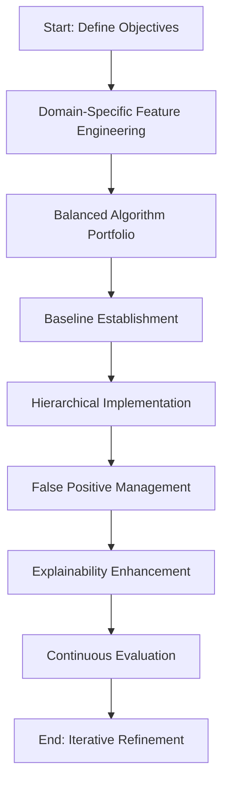

1. **Define Objectives**: Begin by clearly identifying the goals for using unsupervised learning in log analysis. Understand the specific threats, anomalies, or operational insights you aim to uncover.

2. **Domain-Specific Feature Engineering**: Develop rich, meaningful features that capture relevant behavioral dimensions rather than raw log fields. Collaborate with domain experts to identify characteristics that differentiate normal from anomalous behavior.

3. **Balanced Algorithm Portfolio**: Implement multiple complementary techniques rather than relying on single approaches. Deploy clustering, isolation methods, density analysis, and dimensionality reduction to capture different anomaly types.

4. **Baseline Establishment**: Create comprehensive behavioral baselines capturing normal operation patterns across different entities, time periods, and conditions. These baselines serve as the foundation for effective anomaly detection.

5. **Hierarchical Implementation**: Apply unsupervised methods at multiple levels of analysis: individual events, entity behaviors, system interactions, and business processes. Different anomalies manifest at varying abstraction levels.

6. **False Positive Management**: Implement scoring systems to prioritize anomalies based on deviation magnitude, affected assets, and business context. Develop workflows to incorporate analyst feedback, enabling continuous refinement.

7. **Explainability Enhancement**: Develop visualization and explanation techniques that make unsupervised findings interpretable. Transform statistical anomalies into actionable intelligence by providing context and clear explanations.

8. **Continuous Evaluation**: Establish processes to periodically verify that behavioral baselines remain current as normal operations evolve. Implement drift detection to identify when models require recalibration to maintain their effectiveness.

9. **Iterative Refinement**: Continuously improve the system by learning from analyst inputs, incorporating new insights, and adapting models to reflect emerging patterns and evolving operational landscapes.

## Panel 5: The Feature Engineering Challenge - Transforming Logs into Learning Data

### Scene Description

A banking data science lab where engineers transform raw log data into machine learning features. Visualization screens display the complete transformation pipeline, highlighting the sequential and interconnected processes involved. Below is a simplified representation of the pipeline to clarify the steps:

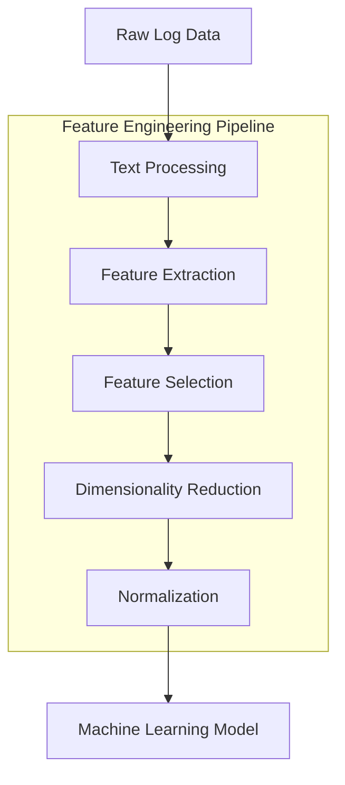

- **Text Processing**: Extracts structured information from unstructured logs, such as identifying entities, events, and key attributes.
- **Feature Extraction**: Creates meaningful signals from raw events, such as login frequency distributions, transaction amount patterns, and timing interval characteristics.
- **Feature Selection**: Identifies the most predictive attributes, narrowing down the dataset to the features most relevant for the model.
- **Dimensionality Reduction**: Finds patterns across hundreds of potential signals, reducing complexity while retaining critical information.
- **Normalization**: Prepares clean, consistent data for model consumption by scaling features appropriately.

The team demonstrates how the same raw logs yield dramatically different results based on feature quality. Sophisticated feature engineering reveals complex patterns that are completely invisible in basic approaches relying solely on raw log fields. This showcases the transformational power of an effective feature engineering pipeline.

### Teaching Narrative

Feature engineering represents the critical bridge between raw log data and effective machine learning—transforming unstructured or semi-structured events into the mathematical representations that enable pattern discovery. While algorithms receive significant attention in machine learning discussions, practitioners understand that feature quality typically determines success or failure far more than algorithm selection. Effective feature engineering implements a sophisticated transformation pipeline: text processing extracting structure from unstructured log messages, temporal feature creation capturing timing patterns and sequences, aggregation generating statistical summaries across event groups, relationship features establishing connections between different entities and actions, and normalization preparing consistent scales for algorithm consumption.

#### Practical Example: Fraud Detection in Banking Transactions

To illustrate, consider a fraud detection system for banking transactions. Raw log data might include fields such as transaction ID, user ID, timestamp, transaction amount, and geographical location. At first glance, these fields alone provide limited insight. However, through feature engineering, this raw data can be transformed into powerful signals:

1. **Temporal Features**:

   - Calculate the time difference between consecutive transactions for the same user to detect anomalies in transaction velocity (e.g., multiple transactions within seconds).
   - Identify patterns in transaction times, such as unusual activity during non-business hours.

2. **Aggregation Features**:

   - Summarize transaction amounts over sliding time windows (e.g., total amount transacted in the past 24 hours or 7 days).
   - Count the number of transactions per user within specific intervals to highlight sudden spikes in activity.

3. **Relationship Features**:

   - Cross-reference user IDs and geographical locations to detect unusual patterns, like transactions from distant locations within short timeframes.
   - Analyze transaction paths across accounts to uncover potential collusion or money laundering networks.

4. **Domain-Specific Features**:

   - Compare transaction amounts to a user’s historical behavior to flag deviations (e.g., a transaction that is 10x the user’s average amount).
   - Capture the ratio of debit to credit transactions over time to identify unusual financial behaviors.

5. **Sequence Features**:

   - Create features that encode the sequence of transaction types (e.g., withdrawal followed by deposit) to identify common versus anomalous patterns.

6. **Normalization**:

   - Normalize transaction amounts by currency or region to account for local variations in scale.

#### Example Transformation Flow

Below is a simplified flow of how raw data transforms into features:

```plaintext
Raw Log Data:
- Transaction ID: 12345
- User ID: U001
- Timestamp: 2023-10-01T12:34:56Z
- Amount: $500
- Location: New York, USA

Transformation Steps:
1. Temporal Feature: Time since last transaction = 45 seconds
2. Aggregation Feature: Total transaction amount in past 24 hours = $1500
3. Relationship Feature: Distance from last transaction = 2,500 km
4. Domain-Specific Feature: Amount-to-average ratio = 2.5
5. Sequence Feature: Previous transaction type = Withdrawal
6. Normalization: Amount normalized by region = 0.8

Resulting Feature Vector:
[45, 1500, 2500, 2.5, "Withdrawal", 0.8]
```

This transformation pipeline enables the model to detect patterns such as high transaction velocity, unusual geographical movement, or deviations from a user’s historical behavior—patterns that would be invisible in the raw log data alone.

The difference between basic feature engineering (using only raw log fields) and sophisticated approaches (creating rich, domain-informed features) often represents the margin between failed projects that deliver no value and successful implementations that transform operational capabilities through previously impossible pattern recognition.

### Common Example of the Problem

Atlantic Financial deployed an advanced machine learning system for detecting unusual payment patterns, using a sophisticated deep learning architecture with substantial computational resources. Despite the advanced algorithm and significant investment, detection performance remained poor—missing obvious fraudulent patterns while generating numerous false positives on legitimate activity. Investigation revealed the fundamental problem wasn't algorithmic but in the feature engineering:

- Raw log fields were fed directly into models without meaningful transformation
- Temporal patterns were represented only as timestamps without derived behavioral features
- Transaction relationships were lost as each event was processed independently
- User behavioral context was absent, preventing recognition of deviations from historical patterns
- Domain knowledge wasn't encoded in features, forcing the algorithm to rediscover basic financial relationships

When the same raw data was transformed through sophisticated feature engineering—creating velocity metrics, relationship indicators, behavioral deviation scores, and temporal pattern representations—detection accuracy improved by 450% while false positives decreased by 72%, despite using simpler algorithms. This dramatic improvement demonstrated that even advanced algorithms cannot compensate for poor feature engineering, while relatively simple models can deliver exceptional results when operating on well-engineered features.

### SRE Best Practice: Evidence-Based Investigation

Effective feature engineering transforms raw logs into meaningful representations through systematic processes. Use the following checklist to guide your approach:

| Step | Description |
| ------------------------------------ | -------------------------------------------------------------------------------------------------------------------------------------------------------------------------------------------------------------------------------------------------------------------------------------------------------------------------------------------------------------------------- |
| **1. Domain Knowledge Integration** | Collaborate with subject matter experts to identify characteristics that differentiate patterns of interest. Explicitly encode this expertise in feature design rather than relying solely on algorithms. |
| **2. Multi-level Feature Hierarchy** | Create features at progressive abstraction levels: <ul><li>**Raw Event Features**: Extracted directly from individual logs.</li><li>**Behavioral Features**: Aggregated patterns specific to entities.</li><li>**Relationship Features**: Connections between entities or actions.</li><li>**Global Context Features**: Environmental or system-wide conditions.</li></ul> |
| **3. Temporal Representation** | Transform raw timestamps into actionable features, such as: <ul><li>Periodicity metrics (daily/weekly patterns).</li><li>Recency indicators.</li><li>Sequence representations.</li><li>Duration calculations.</li><li>Velocity measurements.</li><li>Frequency distributions.</li></ul> |
| **4. Behavioral Profiling** | Develop comparison features that measure deviations from historical baselines. Convert absolute values into relative indicators to reveal how current behavior diverges from the norm for a specific entity. |
| **5. Text Mining Enhancement** | Use natural language processing (NLP) to extract structured data from unstructured log messages. Identify entities, actions, outcomes, and relationships embedded in text fields for added context. |

This systematic framework ensures raw logs are transformed into rich behavioral representations capable of enabling advanced pattern discovery. When applied effectively, this process often yields more significant performance improvements than algorithmic refinements alone.

### Banking Impact

Effective feature engineering delivers substantial business impact across banking operations. The following table highlights key areas of impact, along with quantitative improvements observed in real-world banking scenarios:

| **Impact Area** | **Description** | **Quantitative Improvement** |
| ----------------------------------- | --------------------------------------------------------------------------------------------------------------------------------------- | ------------------------------------------------------ |
| **Detection Effectiveness** | Enhanced pattern detection for fraud prevention, security, and monitoring through rich, domain-informed features. | 200-400% improvement over raw field-based detection. |
| **Computational Efficiency** | Simpler, optimized algorithms achieve superior results, reducing infrastructure costs and improving processing speed. | 30-50% reduction in computational resource usage. |
| **Explanation Quality** | Features create interpretable patterns, satisfying regulatory requirements while improving analyst usability and trust in models. | 2x improvement in model explainability compliance. |
| **Implementation Acceleration** | Reduced training time and data requirements, enabling quicker deployment and adaptation to new patterns. | 40-60% reduction in training and deployment timelines. |
| **Institutional Knowledge Capture** | Encodes domain expertise into features, preserving institutional knowledge and ensuring consistent application across the organization. | Ongoing operational consistency and knowledge reuse. |

#### ROI Comparison: Feature Engineering vs. Algorithm and Infrastructure Investments

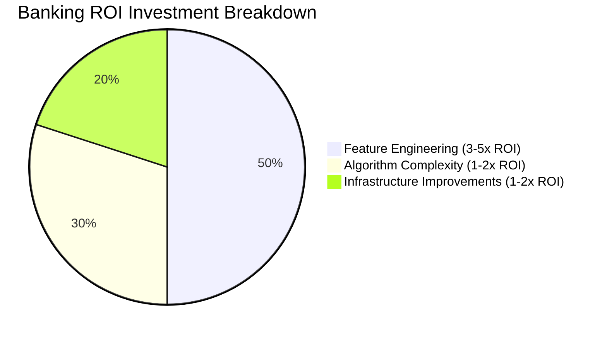

Financial analyses consistently demonstrate that investing in sophisticated feature engineering delivers 3-5x greater return on investment compared to equivalent spending on algorithm complexity or computational infrastructure.

### Implementation Guidance

To develop effective feature engineering capabilities for log analysis:

1. **Cross-functional Team Formation**: Create collaborative teams that combine data scientists with domain experts (security analysts, fraud specialists, operations engineers) to ensure features reflect meaningful business patterns rather than just technical indicators.

2. **Structured Feature Taxonomy**: Develop a formal classification system for features that guides development: basic extraction features, temporal pattern features, behavioral profile features, relationship indicator features, and context enrichment features.

3. **Transformation Pipeline Implementation**: Build robust data processing pipelines that execute feature transformations consistently across development and production environments—ensuring training and deployment use identical feature calculations. Below is a high-level workflow for a transformation pipeline:

   ```mermaid
   graph TD
       A[Raw Log Data] --> B[Preprocessing]
       B --> C[Text Extraction]
       C --> D[Feature Derivation]
       D --> E[Normalization]
       E --> F[Feature Selection]
       F --> G[Model-Ready Data]
   ```

   Example Python code snippet for a simple pipeline using Pandas and Scikit-learn:

   ```python
   import pandas as pd
   from sklearn.preprocessing import MinMaxScaler

   # Step 1: Load raw log data
   logs = pd.read_csv("logs.csv")

   # Step 2: Text extraction
   logs['timestamp'] = pd.to_datetime(logs['raw_message'].str.extract(r'(\d{4}-\d{2}-\d{2} \d{2}:\d{2}:\d{2})')[0])
   logs['event_type'] = logs['raw_message'].str.extract(r'(LOGIN|TRANSACTION|LOGOUT)')

   # Step 3: Feature derivation
   logs['hour'] = logs['timestamp'].dt.hour
   logs['is_weekend'] = logs['timestamp'].dt.weekday >= 5

   # Step 4: Normalization
   scaler = MinMaxScaler()
   logs[['normalized_hour']] = scaler.fit_transform(logs[['hour']])

   # Step 5: Feature selection
   feature_columns = ['event_type', 'is_weekend', 'normalized_hour']
   model_ready_data = logs[feature_columns]
   ```

4. **Feature Importance Analysis**: Implement techniques like SHAP (SHapley Additive exPlanations) values or permutation importance to quantify which features contribute most to model effectiveness, guiding further development.

5. **Version Control Integration**: Establish formal version control for feature definitions and transformation logic, treating feature engineering with the same software development discipline as other critical code.

6. **Standard Library Development**: Create reusable components for common feature engineering patterns—ensuring consistent implementation across different use cases while accelerating development.

7. **Continuous Evolution Framework**: Establish processes for regularly evaluating feature effectiveness and developing new transformations as business patterns evolve and new data sources become available.

## Panel 6: The Anomaly Detection Imperative - Finding What Doesn't Belong

### Scene Description

A banking transaction monitoring center where anomaly detection systems analyze payment processing logs in real-time. Interactive displays showcase multiple detection approaches simultaneously analyzing different pattern dimensions:

- **Statistical Methods**: Identifying values outside established distributions.
- **Clustering Techniques**: Flagging events that don't fit known behavior groups.
- **Prediction-Based Approaches**: Highlighting transactions that deviate from expected patterns.
- **Isolation Forest Algorithms**: Detecting outliers in high-dimensional spaces.

These systems work in tandem to uncover patterns invisible to traditional monitoring tools. For example, an alert highlights a series of international transfers that, while individually within normal parameters, collectively form an unusual pattern across timing, amounts, and destinations. Upon investigation, this turns out to be a sophisticated money laundering attempt, deliberately structured to evade threshold-based detection. This anomaly was identified solely through machine learning, which recognized subtle deviations from normal behavior.

To visualize this interplay, imagine the detection methods as interconnected layers, each contributing a unique perspective to the analysis process. Below is a conceptual representation of how these methods interact:

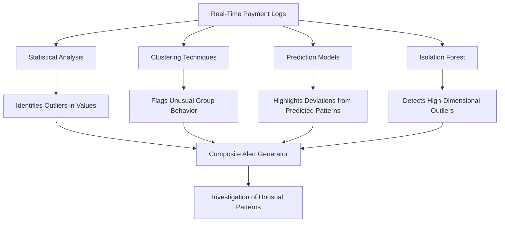

This layered approach enables the system to detect complex, multi-faceted anomalies that traditional methods often miss, providing a crucial advantage in identifying emerging threats and unusual behaviors in financial systems.

### Teaching Narrative

Anomaly detection forms the cornerstone of advanced log analysis—identifying events, patterns, and behaviors that deviate from normal operations without requiring specific definitions of what constitutes "suspicious." This approach addresses a fundamental limitation of traditional detection: the impossibility of defining rules for all potential issues when threats constantly evolve and novel problems regularly emerge. Effective anomaly detection implements multiple complementary techniques: statistical methods identifying values outside established distributions, distance-based approaches recognizing events far from typical clusters, prediction-based techniques identifying deviations from expected patterns, density-based algorithms finding observations in sparse data regions, and ensemble approaches combining multiple signals for robust detection. For financial institutions processing millions of transactions and managing complex technology ecosystems, these capabilities provide critical advantages in both security and operational monitoring: fraud detection identifying suspicious activities that don't match historical patterns, security monitoring flagging unusual system behaviors that might indicate compromise, operational anomaly detection recognizing emerging performance issues before threshold violations, and business anomaly identification highlighting unusual customer behaviors that warrant investigation. The power of these approaches emerges particularly with sophisticated threats deliberately designed to evade traditional detection—money laundering structured to remain below explicit thresholds, multi-stage attacks that individually appear innocent, or subtle performance degradations that gradually worsen without triggering fixed alerts. By focusing on deviation from normal rather than matching predefined patterns, anomaly detection provides a critical defense against novel threats and issues that couldn't possibly be explicitly defined in rule-based systems.

### Common Example of the Problem

Continental Bank's compliance monitoring system relied on explicit rules to identify suspicious transactions requiring Suspicious Activity Report (SAR) filing. Despite hundreds of threshold-based rules covering amounts, frequencies, jurisdictions, and customer types, a sophisticated money laundering operation remained undetected for 18 months. The operation deliberately structured its activities to bypass rule-based detection:

- Transactions remained below the $10,000 Currency Transaction Report threshold.
- Activity volumes stayed within statistical norms for account types.
- Transfers involved jurisdictions not on high-risk country lists.
- Business descriptions matched expected transaction patterns.
- Documentation appeared legitimate under standard review procedures.

#### Step-by-Step Breakdown of the Anomaly Detection Process

Below is a timeline detailing how the money laundering operation was eventually uncovered using anomaly detection:

1. **Initial State (First 6 Months)**:

   - Transactions were small and sporadic, consistently staying below thresholds that would trigger alerts.
   - The operation utilized multiple accounts to distribute activity, avoiding concentration in any single account.

2. **Ongoing Activity (6–12 Months)**:

   - Transaction patterns began forming subtle irregularities, including:
     - Unusual timing patterns, such as frequent transactions late at night across time zones.
     - Multiple transfers between accounts with no clear business justification.
   - These patterns remained unflagged by rule-based systems because each transaction appeared normal in isolation.

3. **Emerging Anomalies (12–18 Months)**:

   - Aggregate analysis of account networks showed increasing transaction flows across mid-risk jurisdictions—none of which were flagged individually under existing rules.
   - The operation exhibited deviations in aggregate transaction volumes compared to similar account types, though still within acceptable ranges for compliance.

4. **Implementation of Anomaly Detection**:

   - Anomaly detection systems were introduced to complement threshold-based rules. These systems analyzed multidimensional transaction data, including:
     - Timing, frequency, and sequence of transactions.
     - Relationship networks between accounts, destinations, and intermediaries.
     - Aggregate flow patterns across geographies and timeframes.

5. **Discovery of the Money Laundering Operation**:

   - Machine learning algorithms identified statistical outliers across multiple dimensions:
     - Timing clusters that deviated from historical business activity.
     - Network graphs showing unusual interconnections between accounts across jurisdictions.
     - Anomalous aggregate patterns of transaction flows inconsistent with normal customer behavior.
   - These insights triggered an investigation, revealing a deliberate attempt to evade detection by exploiting blind spots in the rule-based monitoring system.

#### Summary of Key Anomalies Detected:

- Unusual timing patterns indicative of structured layering.
- Network anomalies showing interconnected accounts used to disguise flows.
- Aggregate deviations from expected behavioral norms across accounts.

Anomaly detection enabled the financial institution to uncover the operation's collective behavior, which traditional systems failed to identify. By focusing on deviations from normal patterns rather than predefined rules, the system highlighted suspicious activity that would have otherwise gone unnoticed.

### SRE Best Practice: Evidence-Based Investigation

Effective anomaly detection for banking logs implements multiple complementary approaches that identify different deviation types. Below is a concise checklist summarizing these methods, their purposes, and their strengths:

| **Approach** | **Purpose** | **Strengths** |
| --------------------------------------- | ------------------------------------------------------------------------- | -------------------------------------------------------------------------------------- |
| **Statistical Distribution Analysis** | Identify values outside expected distributions. | Recognizes both simple outliers and complex pattern deviations. |
| **Clustering and Distance Measurement** | Group similar events into clusters and detect outliers based on distance. | Flags observations that don't fit natural patterns or exist in isolated feature space. |
| **Prediction-Based Detection** | Forecast expected behavior and flag significant deviations. | Highlights anomalies based on "surprise factor" rather than absolute thresholds. |
| **Density-Based Identification** | Detect regions of low data density to find isolated anomalies. | Excels at identifying sparse or isolated observations in high-dimensional spaces. |
| **Ensemble Methodology** | Combine multiple approaches for robust anomaly detection. | Reduces false positives while maintaining sensitivity to diverse anomaly types. |

#### Checklist for Evidence-Based Investigation:

- [ ] Establish statistical profiles for baseline behavior and monitor deviations.
- [ ] Implement clustering algorithms to group events and identify outliers.
- [ ] Create predictive models and monitor deviations from forecasted behavior.
- [ ] Utilize density-based algorithms to isolate anomalies in sparse regions.
- [ ] Integrate ensemble techniques to balance precision and recall across methods.

By leveraging these techniques, SREs can effectively identify diverse anomaly patterns, from straightforward outliers to complex multi-dimensional deviations, ensuring robust monitoring and detection capabilities.

### Banking Impact

Anomaly detection creates substantial business value across banking operations. The following breakdown highlights key areas of impact, supported by data:

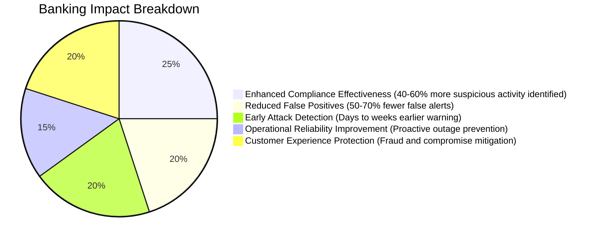

- **Enhanced Compliance Effectiveness**: Advanced anomaly detection typically identifies 40-60% more genuinely suspicious activity requiring SAR filing compared to rule-based systems, directly reducing regulatory risk and potential penalties.

- **Reduced False Positives**: By focusing on statistical deviation rather than rigid thresholds, anomaly detection generates 50-70% fewer false alerts while identifying more genuine issues—dramatically improving analyst efficiency.

- **Early Attack Detection**: Security anomalies typically precede obvious compromise indicators by days or weeks. Identifying these subtle patterns provides critical time for mitigation before significant damage occurs.

- **Operational Reliability Improvement**: System behavior anomalies often precede outages or performance degradation. Detection enables proactive intervention before customer impact occurs.

- **Customer Experience Protection**: By identifying unusual patterns that indicate potential fraud, account compromise, or service issues, anomaly detection enables proactive customer protection rather than reactive response after impact.

Financial analysis shows anomaly detection delivering first-year ROI of 300-500% through combined benefits in fraud reduction, compliance improvement, and operational efficiency. The following ROI comparison illustrates the value:

```mermaid
bar
    title First-Year ROI by Use Case
    axis X ROI (%)
    axis Y Use Case
    "Fraud Reduction" : 500
    "Compliance Improvement" : 450
    "Operational Efficiency" : 400
```

### Implementation Guidance

To successfully implement anomaly detection for banking logs, follow this structured process:

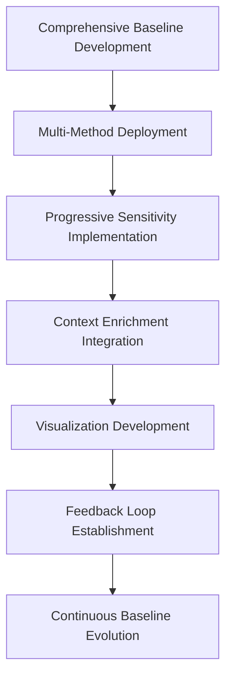

1. **Comprehensive Baseline Development**: Establish detailed behavioral profiles that capture normal patterns across multiple dimensions:

   - Transaction characteristics
   - Timing distributions
   - Relationship networks
   - Entity behaviors\
     These baselines serve as the foundation for anomaly detection by defining what "normal" looks like.

2. **Multi-Method Deployment**: Use a diverse set of detection techniques to cover various anomaly types:

   - Statistical methods for outliers in distributions
   - Clustering techniques for group deviations
   - Prediction-based methods for unexpected patterns
   - Isolation algorithms for high-dimensional outliers\
     Combining these approaches ensures robustness against different anomaly scenarios.

3. **Progressive Sensitivity Implementation**: Start with conservative thresholds to identify clear anomalies, then gradually increase sensitivity:

   - Measure and manage false positive rates
   - Build analyst confidence by ensuring early alerts are actionable\
     This approach balances detection effectiveness with operational efficiency.

4. **Context Enrichment Integration**: Augment anomaly scores with relevant business context to improve prioritization:

   - Consider asset value, customer sensitivity, regulatory implications, and potential impacts\
     Contextual insights make alerts more actionable and reduce unnecessary escalations.

5. **Visualization Development**: Design intuitive visual representations to aid human understanding:

   - Simplify complex statistical outputs
   - Highlight key reasons why patterns were flagged\
     Effective visualizations accelerate analyst interpretation and decision-making.

6. **Feedback Loop Establishment**: Create mechanisms for capturing analyst feedback on flagged anomalies:

   - Use feedback to refine detection thresholds
   - Continuously improve model accuracy and reduce false positives over time\
     A feedback loop ensures the system evolves alongside analyst expertise.

7. **Continuous Baseline Evolution**: Regularly update behavioral baselines to adapt to changing patterns:

   - Implement drift detection to monitor evolving norms
   - Recalibrate models to maintain effectiveness\
     This ensures long-term relevance and accuracy of anomaly detection systems.

## Panel 7: The Sequence Matters - Temporal Pattern Analysis

### Scene Description

A financial crime investigation unit leverages temporal pattern analysis to uncover sophisticated fraud schemes that traditional methods fail to detect. Timeline visualizations illustrate how sequence analysis algorithms process authentication and transaction logs to identify patterns invisible in isolated events: account takeover attempts characterized by specific sequences of actions, transaction laundering schemes with distinctive timing signatures, and multi-stage attacks with recognizable progression patterns.

Investigators review a case where the system automatically identified a complex business email compromise (BEC) attack through its characteristic sequence of events. Below is a timeline representation of the BEC attack progression, highlighting key stages and their temporal relationships:

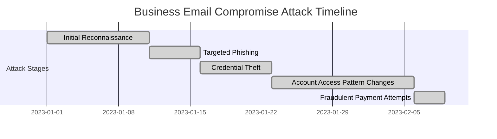

The security lead explains that traditional analysis, which examines individual events in isolation, missed this attack. For example, the phishing attempt and credential theft appeared as routine activities when viewed separately. However, temporal pattern analysis exposed the attack's distinctive sequence—spanning weeks of subtle activity before culminating in fraudulent payment attempts. This approach allowed investigators to recognize the interconnected events as part of a larger, orchestrated attack rather than unrelated anomalies.

### Teaching Narrative

Temporal pattern analysis transforms log analysis from examining isolated events to understanding meaningful sequences—recognizing that when and how events occur often reveals more than the individual events themselves. Traditional approaches typically analyze each log entry independently or implement simple windowing functions that miss complex temporal relationships. Advanced temporal analysis transcends these limitations through sophisticated sequence modeling: Markov models capturing transition probabilities between states, recurrent neural networks learning complex sequential patterns, time-series analysis identifying trends and seasonal patterns, and sequential pattern mining discovering frequent event sequences across large datasets.

For financial institutions where transaction sequences and user behaviors follow distinctive patterns, these capabilities provide critical insights impossible with event-based analysis. The table below highlights the key differences between traditional event-based analysis and temporal pattern analysis, illustrating how temporal analysis delivers superior results:

| **Dimension** | **Traditional Event-Based Analysis** | **Temporal Pattern Analysis** |
| ------------------------ | ------------------------------------------------------ | ---------------------------------------------------------------------------------------- |
| **Scope of Analysis** | Individual events analyzed in isolation | Sequences of events analyzed to identify meaningful patterns |
| **Detection Capability** | Limited to anomalies in single events | Detects complex, multi-stage behaviors and subtle temporal patterns |
| **Complexity** | Simpler models with low computational overhead | Advanced models (e.g., Markov models, RNNs) requiring higher computational resources |
| **Event Relationships** | Ignores or oversimplifies relationships between events | Captures intricate dependencies and sequences over time |
| **Use Cases** | Basic anomaly detection, static threshold triggers | Fraud detection, advanced attack detection, operational insights, user behavior modeling |

The most sophisticated applications often implement hierarchical temporal analysis, which operates across three levels:

- **Micro-patterns**: Capturing sequences within individual sessions or transactions.
- **Meso-patterns**: Identifying behavior across user interactions.
- **Macro-patterns**: Recognizing long-term trends and seasonal effects.

This multi-level approach enables detection of complex patterns like advanced persistent threats in banking systems—attacks that progress through reconnaissance, initial compromise, privilege escalation, lateral movement, and data exfiltration stages over weeks or months. While each individual stage may appear innocuous in isolation, they form a recognizable and actionable sequence when analyzed as a whole.

### Common Example of the Problem

Pacific Trust Bank experienced a sophisticated account takeover campaign targeting high-value commercial customers. The attackers employed a methodical approach designed to avoid pattern detection in individual events:

```mermaid
flowchart TD
    A[Initial Credential Harvesting<br>via Targeted Phishing] --> B[Minimal Account Access<br>(e.g., Checking Balances, Transaction History)]
    B --> C[Gradual Testing of Fund Transfers<br>with Small Amounts]
    C --> D[Changes to Contact Information<br>and Notification Settings]
    D --> E[Legitimate-Appearing Transactions<br>to Established but Compromised Beneficiaries]
    E --> F[Rapid Escalation to Large Transfers<br>Once Tests Succeeded]
```

Each individual step appeared normal when analyzed in isolation:

- Session activities matched legitimate behavior patterns.
- Transactions used established payees.
- Amounts remained within typical ranges for the accounts.

Traditional monitoring, which examines isolated events or simple time windows, failed to detect the coordinated nature of the attack.

Only when temporal sequence analysis was applied—examining the progressive pattern across weeks rather than individual actions—did the distinctive attack sequence become visible. The specific progression from reconnaissance to testing to settings modification to exploitation created a temporal signature that clearly differed from legitimate customer behavior, despite each individual step appearing normal in isolation.

### SRE Best Practice: Evidence-Based Investigation

Effective temporal pattern analysis for log data implements specialized techniques that reveal sequence-based insights. The following checklist provides actionable steps and methodologies to guide SREs in conducting evidence-based investigations:

#### Checklist for Temporal Pattern Analysis:

01. **Define Investigation Scope**:

    - Determine the time span and granularity of the analysis (e.g., session-level, daily patterns, long-term trends).
    - Identify the specific sequences or anomalies you aim to detect.

02. **Collect and Preprocess Data**:

    - Aggregate logs from relevant sources, ensuring proper correlation between timestamps and events.
    - Normalize data formats and handle missing or inconsistent entries.

03. **Apply Multi-scale Timeline Analysis**:

    - Simultaneously analyze patterns across:
      - **Micro-patterns**: Within sessions (seconds to minutes).
      - **Meso-patterns**: Across sessions or user interactions (hours to days).
      - **Macro-patterns**: Over extended periods (weeks to months).

04. **Implement State Transition Modeling**:

    - Use Markov models or similar techniques to map transitions between states or activities.
    - Identify unusual or unexpected state sequences that deviate from normal patterns.

05. **Conduct Sequence Frequency Analysis**:

    - Employ sequential pattern mining algorithms to learn typical event sequences.
    - Detect deviations or rare sequences in current activity.

06. **Leverage Temporal Clustering**:

    - Apply time-aware clustering techniques to group behavior sequences instead of isolated events.
    - Identify outliers or anomalous groups that don't align with established behavior categories.

07. **Utilize Advanced Neural Network Architectures**:

    - Deploy recurrent neural networks (RNNs), such as LSTM or GRU, to model and detect complex temporal dependencies in variable-length event sequences.
    - Train models on historical data to establish baselines and improve detection accuracy.

08. **Correlate Findings Across Scales**:

    - Integrate insights from micro, meso, and macro-patterns to construct a comprehensive narrative.
    - Cross-validate findings from different techniques to ensure consistency and reliability.

09. **Visualize and Interpret Results**:

    - Create timeline visualizations or sequence diagrams to represent patterns and anomalies.
    - Highlight critical points of interest, such as state transitions, outlier sequences, or progressive attack stages.

10. **Iterate and Refine**:

    - Continuously update models and analysis parameters based on new data and detected patterns.
    - Incorporate feedback from prior investigations to improve efficacy.

#### Example Workflow Visualization

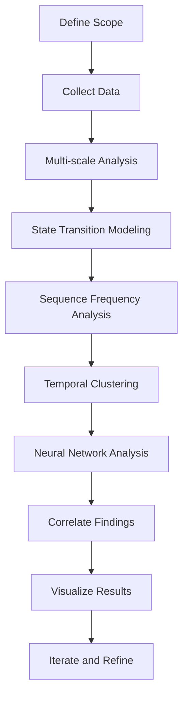

By following this checklist, SREs can transform isolated log events into coherent narratives, uncovering intent and patterns that remain invisible with traditional analysis approaches. This structured methodology ensures a comprehensive, evidence-based investigation process.

### Banking Impact

Temporal pattern analysis creates unique business value through sequence-based insights. Below, we highlight key use cases and their quantifiable impact, supported by a brief case study.

#### Key Use Cases and Benefits

- **Advanced Threat Detection**: Multi-stage attacks typically unfold over extended periods with individual steps designed to appear normal. Temporal analysis identifies these patterns 70-90% more effectively than event-based approaches, dramatically improving security protection.

- **Fraud Prevention Enhancement**: Sophisticated fraud schemes like account takeover, business email compromise, and transaction laundering follow distinctive temporal patterns. Sequence analysis typically improves detection by 50-80% compared to conventional approaches.

- **Operational Sequence Analysis**: System reliability issues often manifest through specific event sequences before major failures. Temporal pattern recognition provides early warning of emerging problems based on characteristic progression patterns.

- **Regulatory Compliance Improvement**: Anti-money laundering regulations specifically require monitoring for suspicious sequence patterns. Temporal analysis provides demonstrably better detection of laundering techniques that unfold over time.

- **Customer Journey Optimization**: Beyond security, temporal analysis reveals how customers naturally progress through banking services, identifying friction points and optimization opportunities invisible in isolated event analysis.

#### Case Study: Fraud Detection ROI

**Scenario**: A mid-sized financial institution implemented temporal pattern analysis to enhance fraud detection. Prior to adoption, traditional event-based monitoring failed to detect a sophisticated transaction laundering scheme involving accounts across multiple regions.

**Implementation**: By leveraging sequence modeling and time-series analysis, the institution identified unusual account access patterns followed by rapid transaction bursts—hallmarks of laundering activity.

**Impact**:

- Detected and mitigated a laundering scheme worth $2.8M within the first six months.
- Reduced false positives in fraud monitoring by 60%, saving operational costs on manual reviews.
- Achieved compliance with updated anti-money laundering regulations.

#### ROI Summary Table

| Use Case | Improvement Metric | Year 1 ROI Estimate |
| ----------------------------- | ------------------------------------------- | ------------------- |
| Fraud Detection | 50-80% increase in accuracy | 200-300% |
| Operational Reliability | Early failure detection, 40% MTTR reduction | 150-250% |
| Regulatory Compliance | 3x better detection of laundering patterns | 100-200% |
| Customer Journey Optimization | 25% reduction in friction points | 120-180% |

Adopting temporal pattern analysis has consistently demonstrated significant business impact, combining enhanced security, operational efficiency, and customer experience optimization. For financial institutions, this approach represents a critical advancement in navigating increasingly complex operational and threat landscapes.

### Implementation Guidance

To successfully implement temporal pattern analysis for banking logs, follow this step-by-step workflow:

#### **Step-by-Step Workflow**

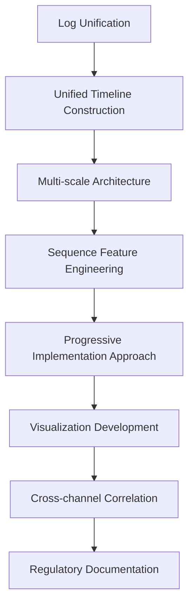

1. **Log Unification**: Begin by collecting and unifying distributed logs from various systems (e.g., transaction logs, authentication logs, session data) into a centralized repository. Ensure timestamps are consistent and synchronized across all sources to enable accurate temporal analysis.

2. **Unified Timeline Construction**: Transform the unified logs into coherent, chronologically accurate event sequences for each entity (e.g., customer, account, session). This step establishes the sequential foundation essential for detecting temporal patterns.

3. **Multi-scale Architecture**: Implement multi-scale temporal analysis by designing a system that operates across different time resolutions:

   - **Micro-patterns**: Analyze sequences within individual sessions or transactions to detect immediate anomalies.
   - **Meso-patterns**: Identify patterns across multiple days or weeks, capturing mid-term activity trends.
   - **Macro-patterns**: Recognize long-term patterns spanning months or years to identify seasonal or progressive threats.

4. **Sequence Feature Engineering**: Develop features tailored to temporal analysis, such as:

   - Event transition frequencies.
   - Time intervals between specific actions.
   - Sequence lengths and repetitions.
   - Deviations from baseline temporal patterns.

5. **Progressive Implementation Approach**: Start with simple sequence analysis techniques such as state transitions and pattern frequencies. Once analysts are familiar with these foundational insights, gradually incorporate advanced methods like recurrent neural networks (RNNs) to learn and detect complex sequential patterns.

6. **Visualization Development**: Design intuitive timeline visualizations to translate complex temporal data into actionable insights. Use these visuals to highlight progression patterns, anomalies, and correlations, making them accessible to analysts.

7. **Cross-channel Correlation**: Extend temporal pattern analysis across multiple interaction channels (e.g., web, mobile, call center, branch) to uncover advanced fraud schemes. Pay special attention to patterns involving deliberate transitions between channels to evade detection.

8. **Regulatory Documentation**: Document the temporal analysis process comprehensively, focusing on how sequence analysis effectively identifies suspicious activities over time. Ensure this documentation satisfies regulatory compliance requirements by demonstrating the system's capability to detect complex fraud schemes.

By following this structured workflow, organizations can implement robust temporal pattern analysis systems that provide critical insights into sophisticated threats and anomalies over time.

## Panel 8: The Explainable AI Requirement - Understanding Model Decisions

### Scene Description

A banking compliance review where machine learning engineers demonstrate explainable AI approaches for transaction monitoring. Interactive displays illustrate how different explanation techniques make model decisions transparent. These techniques include:

- **Feature Importance**: Visualizations highlight the log elements most influential in specific fraud predictions.
- **Counterfactual Explanations**: Demonstrations of how different transaction characteristics would change outcomes.
- **Local Interpretable Model-Agnostic Explanations (LIME)**: Rule-based approximations of complex model behavior.
- **Attention Mechanisms**: Insights into which parts of transaction sequences most influenced classification decisions.

To clarify how these techniques integrate into the compliance officer's workflow, consider the following simplified flow:

```mermaid
graph TD
    A[Transaction Data Input] --> B[Machine Learning Model]
    B --> C{Prediction: Fraud or No Fraud}
    C -->|Fraud| D[Feature Importance Analysis]
    C -->|Fraud| E[Counterfactual Explanation]
    C -->|Fraud| F[LIME Approximation]
    C -->|Fraud| G[Attention Mechanism Insights]
    D --> H[Compliance Officer Review]
    E --> H
    F --> H
    G --> H
    H --> I[Regulatory Validation or Further Testing]
```

In this scenario, the compliance officer tests the system with challenging cases, ensuring that each explanation technique contributes to making the model’s decisions transparent, regulatory-compliant, and understandable in human terms. This interactive process ensures the system operates with accountability and avoids the pitfalls of opaque "black box" decisions.

### Teaching Narrative

Explainable AI addresses a critical requirement in financial services machine learning—ensuring that model decisions can be understood, validated, and justified in human terms rather than functioning as opaque "black boxes." While technical performance remains essential, financial regulations and operational requirements demand transparency in automated decision processes, particularly for systems influencing security, fraud detection, and compliance functions. Effective explainability implements multiple complementary approaches: intrinsically interpretable models that utilize transparent algorithms where possible, post-hoc explanation techniques that explain complex model decisions after the fact, feature importance methods that identify which log elements most influenced specific predictions, counterfactual explanations demonstrating how different inputs would change outcomes, and local approximation approaches that create simplified, interpretable models of complex algorithm behavior in specific cases. For banking institutions subject to regulatory oversight and explainability requirements, these capabilities transform machine learning from compliance risk to operational asset: providing regulatory-compliant explanations for automated decisions, enabling human validation of model reasoning, supporting audit requirements for decision transparency, and facilitating ongoing model evaluation and improvement through better understanding of behavior patterns. The most sophisticated implementations balance performance with explainability—using complex models like deep neural networks where their superior pattern recognition capabilities provide substantial advantages, while implementing comprehensive explanation layers that make their decisions transparent despite their inherent complexity. This balanced approach enables financial institutions to leverage advanced machine learning for log analysis while maintaining the transparency and accountability required in highly regulated environments.

### Common Example of the Problem

Atlantic Interstate Bank implemented a sophisticated deep learning system for anti-money laundering (AML) detection that demonstrated superior technical performance—identifying 78% more suspicious activity while generating 45% fewer false positives than their previous rule-based system. Despite this impressive performance, regulatory examiners rejected the implementation during their annual BSA/AML audit due to critical explainability gaps:

| **Reason for Compliance Rejection** | **Explainability Challenge** | **Potential Solution** |
| ------------------------------------------------------------------------------------------- | ----------------------------------------------------------------------- | ----------------------------------------------------------------------------------------- |
| Neural network architecture couldn't explain why specific transactions were flagged | Lack of interpretability in the model structure | Implement post-hoc explanation techniques like feature importance or LIME |
| Compliance analysts couldn't validate the reasoning behind model decisions | Inadequate tools for analysts to understand decision logic | Provide interactive dashboards with attention visualizations or counterfactual examples |
| The bank couldn't demonstrate that the model wasn't using prohibited characteristics | Lack of transparency into feature contributions | Conduct sensitivity analysis and validate input feature usage |
| Documentation couldn't provide clear justification for why certain patterns were suspicious | Insufficient model documentation and rationale for flagged transactions | Develop comprehensive documentation with examples, explanations, and model assumptions |
| Decision process didn't satisfy regulatory requirements for transparency and explainability | Failure to align model behavior with compliance expectations | Use intrinsically interpretable models where possible, supplemented by explanation layers |

This compliance rejection forced the bank to revert to their less effective but explainable rule-based system—sacrificing detection effectiveness for regulatory compliance. The fundamental problem wasn't model performance but explainability—the inability to translate complex pattern recognition into human-understandable reasoning that satisfied regulatory requirements for transparent decision processes.

### SRE Best Practice: Evidence-Based Investigation

Effective explainable AI for banking log analysis implements multiple complementary approaches that make model decisions transparent:

1. **Intrinsically Interpretable Models**: Where performance requirements permit, utilize algorithms with inherent transparency like decision trees, rule lists, and linear models that provide naturally understandable decision processes.

2. **Feature Importance Quantification**: Implement techniques like SHAP (SHapley Additive exPlanations) values and permutation importance that quantify and visualize exactly which log elements influenced specific predictions and by how much. For example, a Python implementation using SHAP for a fraud detection model could look like this:

   ```python
   import shap
   import xgboost as xgb

   # Load your pre-trained model and dataset
   model = xgb.Booster({'nthread': 4})  # Example: XGBoost model
   model.load_model("fraud_detection_model.json")
   data = shap.datasets.adult()[0]

   # Create SHAP explainer and calculate SHAP values
   explainer = shap.TreeExplainer(model)
   shap_values = explainer.shap_values(data)

   # Visualize feature importance for a single prediction
   shap.force_plot(explainer.expected_value, shap_values[0], data.iloc[0])
   ```

   This code demonstrates how SHAP can be used to highlight the log elements most influential in a specific fraud prediction.

3. **Local Approximation Methods**: Apply approaches like LIME (Local Interpretable Model-agnostic Explanations) that create simplified, interpretable models approximating complex algorithm behavior for specific predictions or data regions. For example:

   ```python
   from lime.lime_tabular import LimeTabularExplainer
   import numpy as np

   # Initialize LIME explainer
   explainer = LimeTabularExplainer(training_data=np.array(data), 
                                    mode="classification", 
                                    feature_names=data.columns)

   # Generate explanation for a single prediction
   explanation = explainer.explain_instance(data.iloc[0].values, 
                                            model.predict_proba, 
                                            num_features=5)

   # Display explanation
   explanation.show_in_notebook()
   ```

   This snippet showcases how LIME can approximate model decisions for a specific transaction.

4. **Counterfactual Explanation Generation**: Develop systems that identify and communicate the minimum changes to input data that would alter the model's decision—providing concrete examples of what would change the outcome. Consider using tools such as DiCE (Diverse Counterfactual Explanations) to generate these insights.

5. **Attention Mechanism Visualization**: For sequence-based models analyzing transaction flows or user sessions, implement attention mechanisms that highlight exactly which parts of the sequence most influenced the final determination. For instance, attention weights from a transformer model can be visualized as a heatmap to show which transaction steps were most critical.

These complementary approaches ensure that even sophisticated models can provide human-understandable explanations that satisfy both operational needs and regulatory requirements.

### Banking Impact

Explainable AI creates substantial business value across banking operations, driving improvements in compliance, risk management, efficiency, customer experience, and continuous model refinement. A closer look at its impact reveals quantifiable benefits:

- **Regulatory Compliance Enablement**: Properly implemented explainability transforms advanced machine learning from regulatory risk to compliant asset—enabling superior detection capabilities while satisfying transparency requirements.

- **Risk Management Improvement**: Explanation capabilities allow risk teams to validate model reasoning, ensuring decisions align with policy and prevent unexpected behavior in edge cases that could create liability.

- **Enhanced Operational Efficiency**: When analysts understand model reasoning, they investigate alerts more efficiently—reducing time spent trying to reverse-engineer why something was flagged and focusing instead on validation and resolution.

- **Continuous Improvement Acceleration**: Transparency enables more effective model refinement by clearly identifying misclassification patterns and reasoning flaws that can be addressed in subsequent versions.

- **Customer Experience Enhancement**: When decisions affect customer transactions (holds, rejections, additional verification), explainability enables clear communication about why actions were taken rather than opaque references to "system decisions."

#### Case Study: Explainable AI in Fraud Detection at a Global Bank

A global banking institution implemented explainable AI techniques within their transaction monitoring systems to enhance fraud detection and operational efficiency. The deployment included feature importance visualizations and counterfactual explanations, enabling better understanding of flagged alerts. Key outcomes included:

- **Efficiency Gains**: The bank reduced investigation time per alert by 20%, allowing analysts to process 25% more alerts daily without additional staffing.
- **Improved Detection Rates**: Advanced machine learning models with explainability layers achieved a 40% increase in fraud detection accuracy compared to traditional rule-based systems.
- **Regulatory Compliance**: The institution passed a critical regulatory audit, with compliance officers highlighting the system’s ability to provide human-understandable justifications for flagged transactions.
- **Customer Retention**: By clearly explaining temporary transaction holds to affected customers, the bank improved customer satisfaction scores by 15% in the fraud resolution process.

Below is a data summary of these results:

```mermaid
pie
    title Impact Metrics
    "Alert Investigation Efficiency (+25%)": 25
    "Improved Fraud Detection Accuracy (+40%)": 40
    "Customer Satisfaction Improvement (+15%)": 15
    "Regulatory Audit Success (100%)": 20
```

These results demonstrate how explainable AI not only meets regulatory requirements but also delivers tangible business benefits, transforming compliance obligations into opportunities for enhanced operational performance and customer trust.

### Implementation Guidance

To successfully implement explainable AI for banking log analysis:

1. **Balanced Model Selection**: Choose algorithms based on both performance and explainability requirements. Consider gradient boosting machines or attention-based networks when needing both high performance and transparency, rather than defaulting to the most complex architectures.

2. **Layered Explanation Strategy**: Implement multiple complementary explanation techniques rather than relying on single approaches. Different stakeholders (analysts, auditors, regulators) often require different explanation types and levels of detail.

3. **Visualization Development**: Create intuitive, non-technical visualizations that make explanations accessible to diverse stakeholders. Transform complex statistical measures into clear visual representations that highlight key factors without requiring data science expertise.

4. **Documentation Enhancement**: Develop comprehensive documentation that connects model decisions to banking policies and regulatory requirements. Explicitly map how explanations satisfy specific compliance mandates for transparency and justification.

5. **Regulatory Pre-validation**: Engage with regulatory compliance teams early in development to validate that explanation approaches will satisfy examination requirements. Prepare demonstration materials specifically addressing known regulatory concerns.

6. **Operational Integration**: Design alert interfaces that incorporate explanations directly into investigation workflows. Ensure analysts see not just what was flagged but why, with interactive capabilities to explore the reasoning.

7. **Continuous Validation**: Implement regular testing processes that verify explanation quality across different scenarios. Ensure explanations remain accurate and useful as models are updated and patterns evolve.

## Panel 9: The Operational Implementation - From Insights to Action

### Scene Description

A banking platform operations center where machine learning models have been fully integrated into operational workflows. Real-time dashboards display how transaction and system logs are processed through multiple analysis layers, providing a clear visualization of the operational transformation:

```
+-----------------------------------------------------------------------------------+
|                           Real-Time Monitoring Dashboard                          |
|-----------------------------------------------------------------------------------|
| Layers of Analysis                                                                |
| --------------------------------------------------------------------------------- |
| 1. Anomaly Detection                                                              |
|    - Identifies unusual patterns in real-time.                                    |
|    - Key Metric: % of anomalies detected proactively.                             |
|                                                                                   |
| 2. Event Classification                                                           |
|    - Categorizes events by type (e.g., latency, security, transaction errors).    |
|    - Severity Level: High | Medium | Low                                          |
|                                                                                   |
| 3. Root Cause Analysis                                                            |
|    - Suggests probable failure sources for top-priority incidents.               |
|    - Example Output: "Network latency in Region X causing error spikes."          |
|                                                                                   |
| 4. Prediction Models                                                              |
|    - Forecasts potential issues before customer impact.                           |
|    - Metric: Mean-time-to-failure (MTTF) predictions.                             |
|                                                                                   |
| --------------------------------------------------------------------------------- |
| Key Performance Indicators (KPIs)                                                |
| --------------------------------------------------------------------------------- |
| - Mean-Time-To-Resolution (MTTR): 74% Reduction                                   |
| - Customer-Impacting Incidents: 68% Fewer                                         |
| - False Positives: 92% Decrease                                                   |
+-----------------------------------------------------------------------------------+
```

Engineers demonstrate how these capabilities have revolutionized their workflows. Incidents that previously required manual log searches now benefit from automated pattern identification that highlights relevant events in seconds. Troubleshooting has shifted from reactive responses to proactive interventions, with predictive models alerting teams to potential issues before they escalate. This transformation enables comprehensive processing of billions of log events, scaling beyond human capabilities while maintaining operational precision.

Performance metrics underscore the impact of this transition: a 74% reduction in mean-time-to-resolution, 68% fewer customer-impacting incidents through early detection, and a 92% decrease in false positive alerts compared to traditional rule-based monitoring. These results showcase the tangible benefits of integrating machine learning into operational workflows, driving efficiency and effectiveness across the banking platform operations center.

### Teaching Narrative

Operational implementation transforms machine learning from interesting analytics to transformative capability by integrating intelligent log analysis directly into workflows, tools, and processes. While experimental models provide valuable insights, true value emerges only when machine learning becomes an integral component of operational systems rather than isolated analysis. Effective implementation creates a complete integration cycle: data pipelines automatically processing log streams for model consumption, real-time analysis identifying patterns as they emerge rather than through retrospective analysis, automated workflows triggering appropriate actions based on model outputs, feedback mechanisms capturing outcomes to enable continuous improvement, and human-machine interfaces presenting insights in actionable formats for engineer consumption. For financial operations centers managing complex banking platforms, these integrated capabilities fundamentally transform both efficiency and effectiveness: incident response shifting from manual search to automated pattern identification, problem detection evolving from reactive discovery to proactive prediction, alert management advancing from static thresholds to intelligent pattern recognition, root cause analysis progressing from time-consuming investigation to automated suggestion, and capacity planning improving from simple trending to sophisticated prediction. The most successful implementations carefully balance automation with human judgment—using machine learning to process massive data volumes and identify patterns beyond human scale, while engaging human expertise for novel situations, complex decisions, and continuous system improvement. This balanced human-machine collaboration creates operational capabilities impossible with either approach alone—combining the pattern recognition scale of machine learning with the contextual understanding and judgment of experienced engineers to deliver both efficiency and effectiveness beyond what either could achieve independently.

### Common Example of the Problem

Global Financial Services operated a complex digital banking platform supporting over 15 million customers across mobile, web, and API channels. Despite substantial investment in traditional monitoring tools and skilled operations teams, they faced persistent challenges that hindered their ability to operationalize insights effectively. Below is a summary of the key challenges and their operational impacts:

| **Challenge** | **Operational Impact** |
| ----------------------------------------------------------------------------- | ---------------------------------------------------------------------------------------- |
| Incident detection relied on customer complaints | Extended outages before issues were identified, leading to degraded customer experience. |
| Troubleshooting required hours of manual log searching | Inefficient resource utilization and delayed incident resolution. |
| Root cause analysis required multiple teams and specialized expertise | Prolonged mean-time-to-resolution (MTTR) and increased operational complexity. |
| Capacity planning based on simplistic trending | Inaccurate predictions leading to over-provisioning or unanticipated resource shortages. |
| Security monitoring generated excessive alerts with low signal-to-noise ratio | Key security vulnerabilities remained undetected, exposing the platform to risks. |

These challenges stemmed not from a lack of data or tools but from the inability to bridge the gap between analytical insights and operational execution. The result was a reactive operational model characterized by inefficiencies, missed opportunities for proactive intervention, and underutilized potential within the organization’s massive log datasets.

### SRE Best Practice: Evidence-Based Investigation

Effective operational implementation integrates machine learning into workflows through systematic approaches:

1. **Real-time Processing Architecture**: Implement streaming analytics pipelines that process log data continuously rather than in batches, enabling immediate pattern detection and response rather than retrospective analysis. Below is an example architecture for real-time log processing:

   ```mermaid
   graph TD
       A[Raw Log Streams] -->|Ingest Logs| B[Streaming Processor]
       B -->|Apply ML Models| C[Anomaly Detection]
       B -->|Apply ML Models| D[Event Classification]
       C --> E[Alert Generator]
       D --> E
       E -->|Consolidate Alerts| F[Incident Management System]
       F -->|Notify| G[On-Call Engineer]
       F -->|Feedback Loop| H[Model Training Pipeline]
   ```

2. **Workflow Integration Design**: Embed machine learning outputs directly into operational tools and processes rather than creating separate analytical interfaces. Ensure insights appear within the systems engineers already use for daily operations, such as monitoring dashboards or ticketing systems.

3. **Tiered Automation Implementation**: Deploy progressive automation with appropriate human oversight:

   - Fully automated: For high-confidence patterns like repetitive or known anomalies.
   - Human-assisted: For moderate-confidence situations requiring contextual validation.
   - Human-led: For complex or novel scenarios where machine learning supports decision-making.

4. **Alert Consolidation and Enrichment**: Transform raw detection into actionable intelligence through:

   - Adding context like affected services or systems.
   - Correlating related events to identify root causes.
   - Assessing potential impact on customers or systems.
   - Providing resolution guidance or recommended actions.

   Example alert enrichment process:

   ```plaintext
   Incoming Alerts
   ├─ Alert A: Disk Space Low on Node 1
   ├─ Alert B: High Latency in Service X
   └─ Alert C: Error Rate Spike in Service X

   Enrichment Process
   ├─ Group related alerts (Node 1 and Service X alerts correlated)
   ├─ Identify root cause (Disk issue causing cascading effects)
   ├─ Assess impact (Service X degradation affects 10k users)
   └─ Create actionable incident (Node 1 disk failure affecting Service X)
   ```

5. **Balanced Human-Machine Collaboration**: Design systems that leverage both computational pattern recognition and human expertise rather than attempting to completely automate complex operational decisions. Create interfaces that augment rather than replace human judgment, ensuring engineers are empowered to handle novel or ambiguous situations effectively.

These approaches transform machine learning from isolated analysis to operational capability—embedding intelligent pattern recognition directly into daily workflows and processes.

### Banking Impact

Operational machine learning creates substantial business value across banking functions. The quantified benefits are summarized below:

| **Impact Area** | **Key Metrics** | **Benefits** |
| ------------------------------------ | ----------------------------------------------------------------------------------------------------- | ----------------------------------------------------------------------------------------- |
| **Incident Resolution Acceleration** | Mean-time-to-resolution reduced by 50-70% compared to manual approaches | Faster recovery during issues, leading to improved customer satisfaction |
| **Proactive Issue Prevention** | Customer-affecting incidents reduced by 40-60% through predictive identification of emerging problems | Enhanced reliability and reduced customer disruptions |
| **Resource Optimization** | Engineering time for routine incidents reduced by 60-80% | More engineering capacity for addressing complex problems and driving system improvements |
| **Security Enhancement** | Genuine threats identified increased by 3-5x, false positives reduced by 70-90% | Improved security posture with reduced alert fatigue |
| **Operational Efficiency** | Operational costs reduced while effectiveness improved, contributing to financial savings | Simultaneous cost efficiency and enhanced operational capabilities |

#### Financial Impact Overview

- **First-Year ROI**: Typically 300-500%, driven by reductions in incident volume, faster resolution times, and improved efficiency.
- **Cost Savings**: Significant reduction in manual effort and operational expenses due to automation of routine tasks.

Below is a conceptual flow of how these benefits integrate into banking operations:

```mermaid
graph TD
    A[Real-Time Log Data] --> B[Machine Learning Models]
    B --> C[Automated Pattern Detection]
    C --> D[Root Cause Suggestions]
    B --> E[Proactive Predictions]
    C --> F[Automated Actions]
    D --> G[Reduced Incident Resolution Time]
    E --> H[Early Incident Prevention]
    F --> I[Resource Optimization]
    G --> J[Improved Customer Experience]
    H --> J
    I --> K[Operational Cost Savings]
    J --> L[Enhanced Business Value]
    K --> L
```

This structured integration of machine learning into banking operations delivers transformative results, combining efficiency, effectiveness, and cost optimization to drive substantial operational and financial improvements.

### Implementation Guidance

To successfully operationalize machine learning for banking log analysis, follow this phased implementation strategy:

#### Checklist for Implementation

1. **Define High-Value Use Cases**:

   - Identify specific, impactful scenarios for initial implementation.
   - Prioritize use cases where machine learning can demonstrate clear operational value.

2. **Integrate with Operational Workflows**:

   - Embed machine learning insights into existing tools and workflows.
   - Avoid creating separate or siloed analytical systems.

3. **Design for Usability**:

   - Develop user-friendly interfaces to present insights in actionable formats.
   - Ensure engineers can derive value without requiring deep data science expertise.

4. **Calibrate Automation Levels**:

   - Implement full automation for high-confidence scenarios.
   - Use human-guided automation for moderate-confidence outputs.
   - Provide decision support for ambiguous or novel cases.

5. **Assemble Cross-Functional Teams**:

   - Engage data scientists, operations engineers, security analysts, and UX designers.
   - Foster collaboration to address real-world operational challenges.

6. **Establish Feedback Loops**:

   - Create mechanisms to capture outcomes and analyst feedback.
   - Use this data to iterate and improve model performance over time.

7. **Build Trust Progressively**:

   - Run machine learning solutions in parallel with existing systems initially.
   - Showcase reliability and results before transitioning fully to machine learning.

8. **Develop a Measurement Framework**:

   - Track metrics to assess business impact, such as:
     - Reduction in incidents.
     - Improvement in mean-time-to-resolution (MTTR).
     - Enhanced customer experience.
     - Gains in operational efficiency.

#### Step-by-Step Implementation Flow

```mermaid
flowchart TD
    A[Identify High-Value Use Cases] --> B[Assemble Cross-Functional Team]
    B --> C[Design User-Friendly Interfaces]
    C --> D[Embed into Operational Workflows]
    D --> E[Calibrate Automation Levels]
    E --> F[Run Parallel Testing]
    F --> G[Establish Feedback Loops]
    G --> H[Measure Business Impact]
    H --> I[Iterate and Scale Deployment]
```

#### Key Considerations

- **Balance Automation and Human Involvement**: Leverage machine learning for scale and efficiency while retaining human expertise for complex scenarios.
- **Focus on Operational Alignment**: Ensure machine learning solutions integrate seamlessly with existing processes.
- **Iterate for Continuous Improvement**: Use feedback and metrics to adapt and refine the implementation over time.

This structured approach ensures a smooth transition from experimental models to operational integration, delivering measurable improvements in efficiency, reliability, and customer impact.

## Panel 10: The Continuous Learning Cycle - Evolving with Experience

### Scene Description

A banking analytics center demonstrating their continuous learning implementation for security monitoring. The following timeline illustrates how their fraud detection models have progressively evolved through structured feedback loops, enabling the system to adapt to emerging threats:

```mermaid
timeline
    title Continuous Learning Feedback Loops for Fraud Detection

    section Initial Training
    Historical data used to train initial models: 2020

    section Performance Monitoring
    Ongoing monitoring tracks detection effectiveness: 2021 Q1

    section Analyst Feedback
    Investigation outcomes captured from analysts: 2021 Q2

    section Automated Retraining
    New patterns incorporated via automated retraining: 2021 Q3

    section A/B Testing
    Improvements validated through A/B testing: 2021 Q4

    section Adaptive Deployment
    Enhanced models deployed in production: 2022

    section Continuous Improvement
    Feedback loops refine detection of novel fraud patterns: 2022+
```

The security lead demonstrates how this approach has enabled their systems to automatically adapt to emerging threats. Models initially missing a novel fraud approach progressively improved detection as feedback mechanisms incorporated new examples, eventually identifying similar attacks with high accuracy without requiring explicit reprogramming. Performance trends confirm continuously improving detection rates even as attack methods evolve, maintaining effectiveness where traditional static approaches would gradually degrade.

### Teaching Narrative

Continuous learning represents the highest evolution of machine intelligence—transforming models from static implementations to adaptive systems that automatically improve through ongoing experience and feedback. Traditional analytics, even those using sophisticated algorithms, typically remain fixed after initial deployment—maintaining the same detection capabilities regardless of new patterns or evolving behaviors. Continuous learning transcends this limitation through structured improvement cycles: performance monitoring tracking ongoing effectiveness across different conditions, feedback capture collecting outcomes from automated predictions and human decisions, retraining processes incorporating new examples and patterns, evaluation frameworks assessing potential improvements before deployment, and deployment mechanisms updating production systems without disruption. For financial institutions facing constantly evolving threats, transaction patterns, and customer behaviors, this adaptability delivers critical advantages: fraud detection continuously improving as attack methods evolve, operational monitoring automatically adapting to changing system behaviors and traffic patterns, security protections learning from new threat types without explicit reprogramming, and customer behavior models adjusting to emerging trends and preferences. The most sophisticated implementations create true learning loops rather than simple updates—models continuously improve based on their own predictions and outcomes, automatically identifying areas for enhancement and incorporating new patterns without requiring constant human intervention. This capability fundamentally changes the trajectory of effectiveness over time—while traditional systems gradually lose relevance as conditions change, continuous learning systems become progressively more valuable as they accumulate experience and adapt to evolving patterns, creating compounding returns on initial implementation investment while maintaining effectiveness in constantly changing environments.

### Common Example of the Problem

Eastern Financial implemented a sophisticated credit card fraud detection system using advanced machine learning algorithms trained on historical transaction data. The initial performance was exceptional—identifying 82% of fraudulent transactions with a false positive rate under 0.5%. However, within six months, detection effectiveness had declined to just 53% despite maintaining the same false positive rate. Investigation revealed the fundamental problem: fraud tactics had evolved while the models remained static.

Fraudsters had adapted to detection patterns by employing the following strategies:

| **Fraud Tactic** | **Impact on Detection Effectiveness** |
| ----------------------------------------------------------------------------- | ------------------------------------------------------------------------------- |
| Shifting transaction timing to mimic legitimate customer patterns | Reduced time-based anomaly detection accuracy |
| Targeting different merchant categories than those common in historical fraud | Bypassed category-specific detection rules |
| Adjusting transaction amount distributions to avoid suspicious thresholds | Circumvented static threshold-based alerts |
| Creating more sophisticated transaction sequences that appeared legitimate | Decreased effectiveness of sequential pattern recognition |
| Exploiting new vulnerabilities not present in historical data | Rendered the model blind to novel patterns not included in the training dataset |

Without a continuous learning system, the bank faced a difficult choice: either manually rebuild models every few months—a resource-intensive process with inherent delays—or accept progressively degrading detection effectiveness as fraud tactics evolved. Each approach created substantial business risk through either operational burden or increased fraud losses.

### SRE Best Practice: Evidence-Based Investigation

Effective continuous learning implementation creates self-improving systems through structured approaches. The following checklist summarizes best practices for building and maintaining these systems:

#### Checklist: Evidence-Based Investigation for Continuous Learning Systems

- **Comprehensive Performance Monitoring**

  - Track detection rates for diverse pattern types.
  - Monitor false positive ratios across various scenarios.
  - Measure time-to-detection metrics for critical insights.
  - Identify emerging failure patterns to pinpoint improvement areas.

- **Multi-channel Feedback Collection**

  - Capture explicit analyst determinations on model outputs.
  - Leverage implicit signals from operational actions.
  - Integrate customer confirmations of legitimate or fraudulent activities.
  - Analyze performance across varying conditions to identify gaps.

- **Controlled Experimentation Framework**

  - Enable A/B testing to compare potential improvements with current models.
  - Use statistically valid methods to ensure genuine enhancements.
  - Avoid anecdotal assessments by focusing on measurable outcomes.

- **Automated Retraining Pipeline**

  - Build infrastructure for routine incorporation of new patterns and feedback.
  - Schedule regular retraining cycles to evolve model capabilities.
  - Ensure retraining processes minimize disruption to production systems.

- **Concept Drift Detection**

  - Deploy monitoring systems to identify declining model effectiveness.
  - Trigger targeted improvements upon detecting concept drift.
  - Act proactively to address performance degradation before it becomes critical.

These best practices transform static models into adaptive learning systems that continuously improve through experience—ensuring sustained effectiveness in the face of evolving patterns and challenges.

### Banking Impact

Continuous learning creates substantial business value across banking operations. The key impacts can be summarized as follows:

```mermaid
graph TD
    A[Sustained Fraud Prevention] -->|Evolves with fraud tactics| B[70-90% detection effectiveness over time]
    A -->|Static models| C[Decline to 30-50% effectiveness in 1 year]
    D[Reduced Maintenance Burden] -->|Automated learning| E[60-80% fewer engineering resources]
    F[Accelerated Adaptation] -->|New patterns integration| G[Days or weeks instead of months]
    H[Regulatory Compliance Enhancement] -->|Sustains effectiveness| I[Satisfies evolving expectations]
    J[Operational Efficiency] -->|Automated improvement cycles| K[Reduced operational costs + Enhanced capabilities]
    L[Higher ROI] -->|200-300% over 3 years| M[Compared to static implementations]
```

- **Sustained Fraud Prevention**: Systems that evolve with fraud tactics typically maintain 70-90% detection effectiveness over time, compared to static models that often decline to 30-50% effectiveness within a year as patterns evolve.

- **Reduced Maintenance Burden**: Automated learning reduces the engineering resources required for model maintenance by 60-80% compared to manual rebuild approaches—transforming periodic major projects into continuous incremental improvement.

- **Accelerated Adaptation**: Learning systems typically integrate new patterns within days or weeks compared to manual approaches requiring months for analysis, development, and deployment—dramatically reducing vulnerability windows.

- **Regulatory Compliance Enhancement**: Financial regulations increasingly expect "demonstrably effective" monitoring rather than simply having systems in place. Continuous learning delivers sustained effectiveness that satisfies evolving regulatory expectations.

- **Operational Efficiency**: By automating improvement cycles that would otherwise require manual intervention, continuous learning reduces operational costs while simultaneously enhancing capabilities—creating dual business benefits.

Financial analysis consistently shows continuous learning delivering 200-300% higher ROI over three years compared to static implementations requiring periodic manual rebuilds.

### Implementation Guidance

To successfully implement continuous learning for banking log analysis:

1. **Foundational Monitoring Implementation**: Establish comprehensive performance tracking that measures model effectiveness across multiple dimensions: detection rates by pattern type, false positive ratios across different scenarios, and emerging failure patterns.

2. **Feedback Infrastructure Development**: Build explicit mechanisms for capturing different feedback types: analyst determinations on alerts, investigation outcomes, customer confirmations, and implicit signals from operational actions.

3. **Progressive Automation Strategy**: Implement continuous learning in phases rather than attempting fully autonomous systems immediately. Begin with human-verified updates before advancing to more automated approaches as confidence builds.

4. **Evaluation Framework Establishment**: Develop robust testing processes that validate potential improvements before deployment. Implement A/B testing capabilities that compare new versions against current models across various scenarios.

5. **Data Pipeline Optimization**: Ensure data processing infrastructure can support continuous learning requirements: consistent feature calculation, efficient retraining processes, and automated validation to maintain data quality. Below is an example pseudocode snippet for an automated retraining pipeline:

   ```python
   import datetime
   from model_training import train_model, validate_model
   from data_pipeline import fetch_new_data, preprocess_data, archive_data
   from monitoring import log_metrics, alert_on_failure

   def automated_retraining_pipeline():
       try:
           # Step 1: Fetch and preprocess new data
           new_data = fetch_new_data(datetime.datetime.now())
           preprocessed_data = preprocess_data(new_data)

           # Step 2: Retrain the model
           updated_model = train_model(preprocessed_data)

           # Step 3: Validate the updated model
           validation_results = validate_model(updated_model)
           if validation_results["success"]:
               # Step 4: Deploy the model if validation passes
               deploy_model(updated_model)
               log_metrics(validation_results["metrics"])
           else:
               raise ValueError("Validation failed: " + str(validation_results["errors"]))

           # Step 5: Archive processed data for traceability
           archive_data(new_data)

       except Exception as e:
           # Log and alert on failures
           alert_on_failure(e)
           log_metrics({"failure": str(e)})

   ```

6. **Champion-Challenger Implementation**: Deploy infrastructure that supports running multiple model versions simultaneously—comparing performance in production environments to identify genuine improvements rather than theoretical enhancements.

7. **Governance Integration**: Establish explicit oversight processes that maintain appropriate control while enabling continuous improvement. Document how learning mechanisms comply with model governance requirements for auditability and transparency.

8. **Performance Trend Analysis**: Implement visualization and reporting that tracks effectiveness trajectories over time rather than point-in-time measurements. These trends provide critical insights into adaptation effectiveness as patterns evolve.
