# Chapter 15: Observability Pipelines - The Future of Banking Logs

## Chapter Overview

Welcome to the future of banking observability, where passive log hoarding is as outdated as a fax machine in a fintech startup. This chapter rips the Band-Aid off legacy, batch-oriented logging and drags you—kicking and screaming if necessary—into the era of dynamic, streaming observability pipelines. Forget staring at dashboards waiting for yesterday’s news: we’re talking real-time context, self-driving data enrichment, and compliance so tight even the regulators might blush.

Banks aren’t just fighting for uptime—they’re fighting for survival in a world where milliseconds cost millions and regulatory missteps are career-ending. If you’re still treating your logs like landfill for future archeologists, you’re not just behind—you’re a liability. These pipelines don’t just make your data smarter; they make your business faster, safer, and a hell of a lot more competitive. Buckle up: you’re about to learn how real SREs and engineers build pipelines that don’t just collect logs—they weaponize them.

______________________________________________________________________

## Learning Objectives

- **Distinguish** between static log collection and dynamic, stream-based observability pipelines.
- **Design** unified pipeline architectures that blend technical, business, and compliance needs (and don’t self-destruct at scale).
- **Implement** real-time enrichment to inject business and operational context in-flight—because raw logs alone are for amateurs.
- **Develop** intelligent routing strategies to ensure the right data lands in the right hands (and not in the regulator’s inbox).
- **Engineer** transformation layers that standardize, sanitize, and correlate logs before they become future evidence.
- **Leverage** stream-based analytics for instant insight, not forensic regret.
- **Embed** governance and compliance controls directly into your pipelines—no more “oops, we missed another GDPR field.”
- **Integrate** logs, metrics, and traces for unified, multi-dimensional visibility (and zero excuses).
- **Scale** observability infrastructure for global, petabyte-class banking operations—without blowing your cloud budget.
- **Automate** observability operations with intelligent, self-healing, and adaptive systems that keep humans out of the log mines.

______________________________________________________________________

## Key Takeaways

- Static batch logs are for people who like being blindsided. Streaming pipelines are the only way to win in real-time banking.
- If your logs aren’t enriched on the way in, you’re just collecting technical gibberish. Context is king—and customers don’t care about your server’s stack trace.
- Routing everything everywhere is a recipe for compliance violations and budget annihilation. Smart routing means less noise, less risk, and less money wasted.
- Transform your data before it becomes a problem. Garbage in, garbage out—unless you actually clean your house.
- Analytics after the fact? Welcome to the stone age. If you’re not detecting fraud and outages as they happen, you’re already too late (and probably out millions).
- Compliance bolted on after the fact is malpractice. Bake it in, or prepare for audits that feel like root canal.
- Siloed telemetry is for organizations that love finger-pointing and endless bridge calls. Unified observability stops the blame game.
- If your pipeline doesn’t scale elastically, your next market spike will take you down harder than a DDoS. Fixed capacity is just planned failure.
- Legacy system integration isn’t optional—unless you want blind spots big enough to drive a regulator’s fine through.
- Manual observability operations are for masochists. Intelligent automation is the only way to keep up without burning out your team.
- Bottom line: If your observability doesn’t actively reduce risk, cost, and complexity, you’re doing it wrong. The future belongs to pipelines that don’t just watch—they act.

______________________________________________________________________

## Panel 1: The Pipeline Revolution - From Static Collection to Dynamic Streams

### Scene Description

A modern banking operations center where engineers monitor a visualization of their observability pipeline. Unlike traditional static collection systems, the display shows log data being actively transformed as it flows. Key operations in the pipeline include:

- **Real-Time Enrichment**: Transaction logs from payment services are automatically enriched with customer context.
- **Dynamic Routing**: Security events are dynamically routed to specialized analysis engines.
- **Data Masking**: Compliance-sensitive data is masked in real-time before storage.
- **In-Stream Analysis**: Machine learning models perform continuous analysis directly within the stream.

Below is a conceptual flow of the observability pipeline, illustrating how data moves and is continuously transformed:

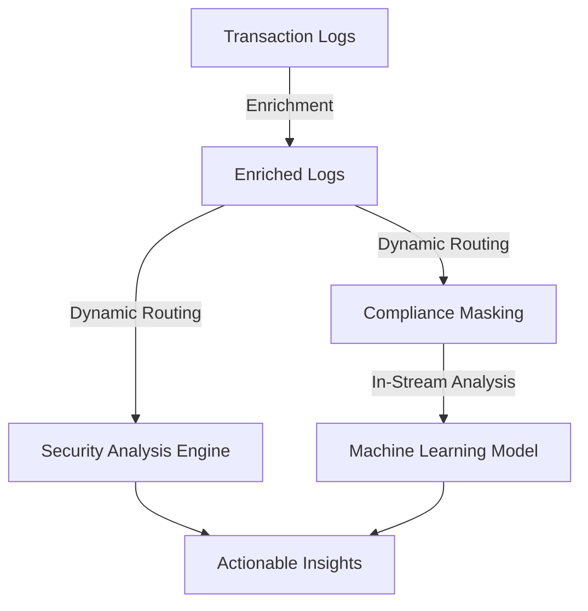

On the display, a side-by-side comparison with their previous architecture highlights the evolution of their system—from batch-oriented, fixed-path logging to a dynamic, stream-processing approach. This new architecture enables intelligent operations on data in motion, transforming observability from passive collection to an active, value-driven process.

### Teaching Narrative

The pipeline revolution represents a fundamental paradigm shift in logging architecture—from static collection systems to dynamic, streaming data platforms that transform observability into an active, intelligent process. Traditional logging approaches treat data flow as a simple pipeline: collect logs, transport them, and store them—with analysis happening only after data reaches its destination. Observability pipelines transcend this limitation through stream-based processing: performing transformations, analysis, and routing while data is in motion rather than after storage. This architectural evolution enables several critical capabilities: real-time enrichment adding valuable context before analysis, dynamic routing sending different data types to appropriate destinations, intelligent filtering reducing volume without losing value, and in-stream analysis identifying patterns as they emerge rather than retrospectively. For banking platforms processing millions of transactions with complex observability requirements, this approach delivers transformative advantages: reduced latency between events and insights, decreased storage costs through intelligent preprocessing, enhanced compliance through automated data governance, and improved operational intelligence through real-time pattern recognition. The pipeline concept fundamentally changes how organizations think about observability—transforming logging from passive collection to active intelligence that continuously adds value throughout the data lifecycle rather than only after storage and indexing.

### Common Example of the Problem

A major investment bank's payment processing platform experiences intermittent transaction failures during market volatility events. With their traditional static logging approach, operations teams must wait 15-30 minutes for batch-processed logs to appear in their analysis systems. By the time they identify the underlying capacity issues affecting specific currency pairs, the problem has escalated, impacting thousands of high-value trades. Despite generating comprehensive logs, the delay between events occurring and logs becoming available for analysis creates a critical blind spot during exactly the periods when real-time visibility is most essential. Meanwhile, their compliance team struggles to manage the overwhelming volume of unfiltered transaction logs, which contain sensitive customer information that requires careful handling to meet regulatory requirements.

The following timeline illustrates the stark difference between traditional static logging and real-time observability pipelines:

```mermaid
gantt
    title Logging Timelines: Static vs Real-Time Observability

    section Traditional Static Logging
    Event Occurs               :done, 0, 0s
    Logs Collected (Batch)     :active, 10m, 15m
    Logs Processed & Analyzed  :crit, 25m, 5m
    Action Taken               :done, 30m, 0s

    section Real-Time Observability Pipeline
    Event Occurs               :done, event1, 0s
    Logs Enriched & Routed     :active, 0s, 5s
    Real-Time Analysis         :crit, 5s, 10s
    Action Taken               :done, 15s, 0s
```

In the traditional approach, significant delays accumulate as logs are collected, batched, and processed, leaving critical incidents unresolved for extended periods. In contrast, real-time observability pipelines enable immediate enrichment, routing, and analysis, allowing teams to respond to issues within seconds. This shift eliminates the operational blind spots that previously led to costly delays during high-stakes events.

### SRE Best Practice: Evidence-Based Investigation

Observability pipelines transform troubleshooting from reactive historical analysis to real-time insight through stream-based processing. Evidence from organizations implementing this approach shows dramatic improvements in incident response capabilities. At a global financial institution, implementing real-time stream processing reduced mean-time-to-detection for critical issues from 12 minutes to under 30 seconds. Their investigation processes now begin while issues are developing rather than after customer impact has already occurred.

The evidence-based approach leverages real-time pattern recognition directly within the data stream: transaction error patterns automatically trigger correlation with system metrics, request rates, and infrastructure conditions. This instant correlation identifies capacity constraints, dependency failures, or configuration issues before they escalate to significant outages. SRE teams report that the most valuable capability is the elimination of context-switching between multiple tools and data sources during investigations—the pipeline pre-correlates relevant information, reducing cognitive load during critical incidents.

#### Checklist: Evidence-Based Investigation Using Observability Pipelines

- **Monitor Real-Time Streams**: Continuously observe live data streams for anomalies or emerging patterns.
- **Set Automated Triggers**: Configure pipelines to automatically recognize key error patterns and correlate with system metrics.
- **Pre-Correlate Data**: Enable the pipeline to aggregate and pre-correlate relevant logs, metrics, and traces for faster context gathering.
- **Perform Root Cause Analysis in Motion**: Use stream-based transformations to identify root causes (e.g., capacity constraints, dependency failures) in real time.
- **Minimize Context Switching**: Leverage pipeline outputs to ensure all relevant data is consolidated in a single view or tool.
- **Iterate and Optimize**: Continuously tune the pipeline to improve detection accuracy and reduce false positives.

#### Comparison Table: Traditional vs. Pipeline-Based Investigation

| Aspect | Traditional Approach | Pipeline-Based Approach |
| ----------------------- | --------------------------------------- | -------------------------------------- |
| **Detection Speed** | Minutes to hours after event occurrence | Sub-seconds to seconds in real time |
| **Data Correlation** | Manual correlation across tools | Automated, in-stream correlation |
| **Investigation Start** | After customer impact | While issue is developing |
| **Cognitive Load** | High due to scattered data sources | Low due to pre-correlated information |
| **Response Style** | Reactive after significant escalation | Proactive to prevent escalation |
| **Root Cause Analysis** | Retrospective with delayed insights | Real-time with actionable intelligence |

This "intelligence in the pipeline" enables proactive intervention rather than reactive response—a fundamental evolution in reliability engineering practice. By embedding evidence-based investigation capabilities into the observability pipeline, SRE teams can transform incident management into a streamlined, intelligent process that significantly enhances operational resilience.

### Banking Impact

The business impact of delayed observability in banking environments is substantial and quantifiable. Each minute of delayed insight during a critical incident translates directly to financial, regulatory, and operational consequences. Below is a quantitative comparison between traditional delayed observability and modern real-time observability pipelines in key banking contexts:

| **Impact Area** | **Delayed Observability** | **Real-Time Observability** | **Key Benefit of Real-Time** |
| ---------------------------------- | ------------------------------------------------------------------------------------------------------------------------ | -------------------------------------------------------------------------------- | ------------------------------------------------------------ |
| **Financial Loss** | $1M+ per hour during market volatility due to missed trades or transaction failures. | Losses minimized through real-time detection and routing of failed transactions. | Prevents cascading failures and reduces unrealized losses. |
| **Customer Trust** | 25% increase in churn rate after a single high-profile incident. | Real-time issue resolution enhances transparency and trust. | Retains high-net-worth clients and reduces churn. |
| **Regulatory Compliance** | Risk of non-compliance penalties ranging from $10M-$50M for delayed incident reporting under DORA or similar frameworks. | Automated real-time compliance monitoring and reporting. | Ensures adherence to strict regulatory timelines. |
| **Mean-Time-to-Resolution (MTTR)** | 3-5 hours on average due to manual data gathering and correlation. | 60-70% MTTR reduction with automated, in-stream analysis. | Faster resolution reduces downtime and operational costs. |
| **Operational Costs** | High engineering overhead for post-incident data processing and root cause analysis. | Optimized resource utilization with proactive issue detection. | Frees up engineering time for innovation and strategic work. |

Real-time observability pipelines also deliver substantial operational efficiencies. Engineering teams spend significantly less time gathering and correlating data, enabling faster and more effective incident response. This directly translates to improved service reliability metrics, higher customer satisfaction, and a marked reduction in operational costs. For financial institutions, adopting real-time pipelines is no longer a competitive advantage—it is a critical necessity for maintaining resilience, trust, and compliance in an era of increasing complexity and scrutiny.

### Implementation Guidance

To successfully implement observability pipelines in a banking environment, follow this step-by-step checklist and reference the pipeline flow diagram below for a high-level visual guide:

#### Step-by-Step Checklist

1. **Conduct Capability Assessment**:

   - Document current observability limitations:
     - Identify latency in data flow, correlation challenges, and analysis bottlenecks.
     - Quantify business impacts of these limitations using incident retrospectives.
   - Highlight areas where stream-based processing could provide immediate value.

2. **Design Unified Pipeline Architecture**:

   - Develop a reference architecture covering:
     - Collection, enrichment, transformation, routing, analysis, and storage components.
     - Regulatory and compliance requirements for handling sensitive financial data.
   - Define clear data flows between pipeline stages and ensure modularity for future scaling.

3. **Implement Incremental Adoption Strategy**:

   - Start with high-value, high-visibility services (e.g., payment processing or trading platforms).
   - Set up parallel pipelines to compare traditional and stream-based approaches.
   - Demonstrate measurable value (e.g., reduced latency or improved insights) to gain stakeholder buy-in.

4. **Develop Standardized Data Models**:

   - Create schemas for logs with consistent field names, data types, and relationships.
   - Balance flexibility with standardization to support diverse log types across services.

5. **Build Real-Time Enrichment Capabilities**:

   - Implement enrichment services to add business context, customer metadata, and system-level information to logs in transit.
   - Prioritize enrichment fields based on troubleshooting and analysis needs.

6. **Establish Compliance-Aware Routing**:

   - Define intelligent routing rules:
     - Direct data to appropriate destinations based on sensitivity and purpose.
     - Ensure masking or anonymization of PII and financial data as per compliance requirements.
   - Test routing rules in controlled environments to validate accuracy.

7. **Develop Continuous Evaluation Metrics**:

   - Design dashboards to monitor:
     - **Technical metrics**: Latency, throughput, system reliability.
     - **Business impact metrics**: Reduced MTTR, preemptive incident detection, compliance risk reduction.
   - Use these metrics to iteratively refine the pipeline and communicate value to stakeholders.

#### High-Level Pipeline Flow Diagram

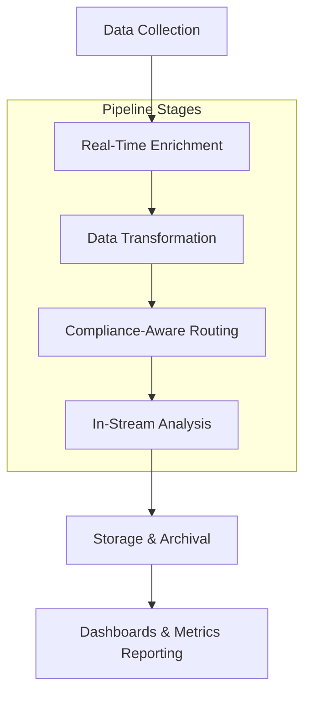

This diagram illustrates the key stages of the observability pipeline, from data collection to storage, with in-motion transformations and analysis. Use it as a reference to ensure all critical components are included and interlinked effectively.

## Panel 2: The Enrichment Engine - Adding Context in Flight

### Scene Description

A banking data engineering lab where specialists develop and test enrichment transformations for their observability pipeline. The lab features interactive displays showcasing multiple enrichment processes operating on transaction logs as they flow through the system. These processes include:

- **Customer Data Services**: Adding account context to raw payment events.
- **Risk Scoring Engines**: Calculating and appending fraud probability metrics.
- **Business Context Services**: Tagging operations with product and journey information.
- **Machine Learning Models**: Generating real-time anomaly scores directly in the pipeline.

A demonstration highlights the journey of a single transaction, following it from a raw log entry to a fully enriched event. This journey illustrates how a simple payment record transforms into a rich business intelligence asset through automated, in-pipeline enrichment before reaching any analysis system.

The following representation outlines the flow of a transaction through the enrichment pipeline:

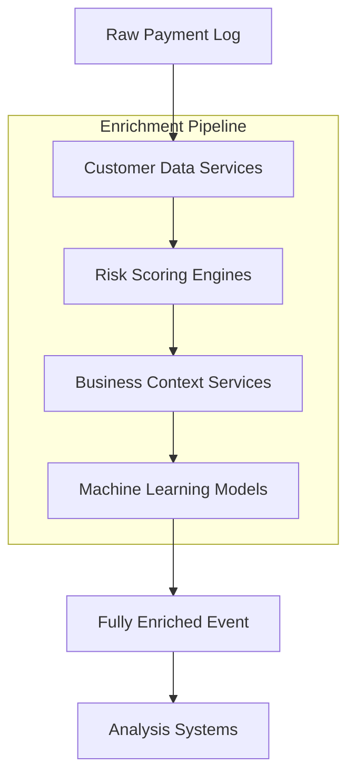

This diagram provides a clear visual of the enrichment stages, emphasizing the transformation of raw logs into actionable intelligence as they progress through the pipeline.

### Teaching Narrative

Enrichment engines transform raw logs from isolated technical events to context-rich intelligence through dynamic, in-flight enhancement—adding critical business and operational context before data reaches analytical destinations. Traditional approaches typically collect raw logs and perform enrichment only during analysis, creating inefficiencies through redundant processing and limiting value through delayed context addition. Modern pipeline architectures implement enrichment as a core capability directly in the data flow: entity enrichment adding information about customers, accounts, and related business objects; context enrichment incorporating operational data about systems, environments, and configurations; relationship enrichment establishing connections between related events and entities; risk enrichment calculating and appending security and fraud metrics; and analytical enrichment generating derived insights through real-time computation. For financial institutions where raw technical logs have limited value without business context, this in-pipeline enrichment creates substantial advantages: analysis systems receive pre-contextualized data rather than requiring repeated joins, relationships between technical events and business entities are established immediately rather than reconstructed later, and derived metrics are calculated once in the pipeline rather than repeatedly by each consuming system. The most sophisticated implementations leverage multiple data sources for enrichment: customer information systems providing account context, product catalogs delivering service information, risk engines supplying security metrics, and machine learning models generating real-time predictions—all integrated directly into the observability pipeline to transform raw technical logs into comprehensive business and operational intelligence.

### Common Example of the Problem

A retail banking customer service center receives a call from a client reporting that a large wire transfer appears to have failed, yet the money is no longer in their account. The support agent attempts to investigate, but the process is slow and fragmented due to disconnected systems and missing context. Below is a step-by-step timeline illustrating the problem:

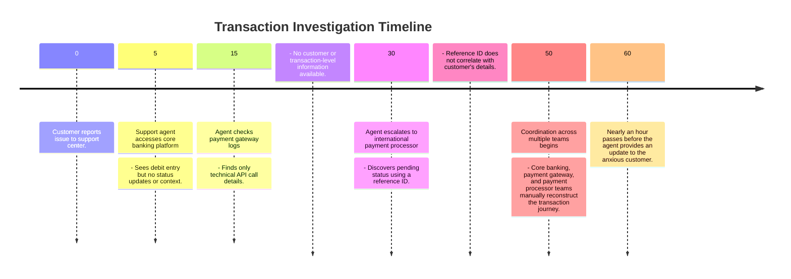

This timeline highlights the fundamental issue: each system generates isolated logs containing only system-specific technical data, with no unified business context or relationships to connect the dots. What should have been a straightforward status check becomes a time-consuming, multi-team effort to piece together the transaction story—frustrating both the customer and the support team.

### SRE Best Practice: Evidence-Based Investigation

Context enrichment fundamentally transforms the troubleshooting process by shifting from reactive correlation to proactive contextualization. Evidence from organizations implementing enrichment engines shows that properly contextualized events reduce investigation time by 70-85% for complex cross-system issues.

The most effective implementations focus on strategic enrichment rather than indiscriminate context addition. By analyzing historical incidents, SRE teams can identify the most valuable contextual elements for different event types. For example:

| **Event Type** | **Key Contextual Elements** |
| ---------------------- | -------------------------------------------------------------------------- |
| Payment-Related Events | Customer identifiers, account details, transaction amounts, payment routes |
| Authentication Events | Device information, location context, historical behavior patterns |
| System Errors | Service version, environment configuration, deployment details |
| Fraud/Risk Alerts | Transaction risk scores, customer tier, compliance requirements |

Automated enrichment within the pipeline eliminates the most time-consuming aspect of incident investigation—manually gathering and correlating context from multiple sources. Evidence shows that engineers spend 40-60% of incident time on context gathering rather than actual problem-solving. By enriching events dynamically as they flow through the pipeline, organizations dramatically improve mean-time-to-resolution metrics while enhancing investigation accuracy.

#### Checklist for Effective Context Enrichment Strategies

- **Analyze Historical Incidents**: Identify recurring patterns and critical data gaps in past investigations.
- **Prioritize High-Value Context**: Focus enrichment efforts on elements that consistently accelerate resolution.
- **Automate Enrichment**: Integrate context directly into the observability pipeline to reduce manual effort.
- **Implement Tiered Strategies**:
  - Add **universal context** to all events (e.g., environment, service version, deployment info).
  - Add **specialized context** selectively to high-value or high-impact transactions (e.g., customer tier, compliance tags).
- **Validate Enrichment Impact**: Continuously measure the reduction in investigation time and adjust strategies based on performance.

Leading financial institutions demonstrate that a balanced approach—combining universal and specialized context—optimizes both processing efficiency and troubleshooting effectiveness. This ensures that enriched events provide actionable, evidence-based insights that empower SRE teams to resolve incidents faster and with greater accuracy.

### Banking Impact

Contextualized observability directly impacts multiple banking business dimensions beyond technical operations. By enriching transaction data in-flight, financial institutions achieve measurable improvements across customer experience, revenue protection, regulatory compliance, and operational efficiency.

#### Key Impact Metrics

| Business Dimension | Metric | Improvement Range |
| -------------------------- | ------------------------------------- | ----------------------- |
| **Customer Experience** | First-call resolution rate | +30% to +45% |
| | Customer satisfaction (CSAT) score | +10% to +20% |
| | Average response time for inquiries | -25% to -35% |
| **Revenue Protection** | Transaction abandonment rate | -15% to -25% |
| | Recovery rate for failed transactions | +20% to +30% |
| **Regulatory Compliance** | Audit trail completeness | 100% (compliance-ready) |
| | Time to generate compliance reports | -40% to -50% |
| **Operational Efficiency** | Average handling cost per inquiry | -20% to -30% |
| | Mean-time-to-resolution (MTTR) | -30% to -40% |

#### Detailed Impacts

- **Customer Experience**: Support teams equipped with enriched transaction context can provide immediate, accurate status updates. This reduces escalations and improves first-call resolution rates by 30-45%, boosting customer satisfaction and loyalty.

- **Revenue Protection**: Faster resolution of transaction failures prevents customer churn, particularly for high-net-worth clients. Institutions report a 15-25% reduction in transaction abandonment during incidents, securing more revenue and maintaining client trust.

- **Regulatory Compliance**: Enriched observability data ensures comprehensive transaction context is captured in real-time. This satisfies stringent financial regulations requiring detailed audit trails, eliminating the need for additional compliance-specific implementations and reducing the time to generate reports by up to 50%.

- **Operational Efficiency**: Enrichment reduces the manual effort required for context gathering, allowing support centers to resolve issues faster and at lower cost. Engineering teams also benefit from increased productivity, as mean-time-to-resolution improves by 30-40%.

By implementing context enrichment directly into the observability pipeline, financial institutions unlock quantifiable benefits across critical business dimensions, transforming raw transaction logs into actionable intelligence.

### Implementation Guidance

To implement effective enrichment engines in banking observability pipelines, follow these step-by-step guidelines:

1. **Conduct enrichment value analysis**

   - Review recent incidents and support cases to identify the most valuable contextual elements that would have accelerated resolution.
   - Categorize these elements by event type, creating a prioritized enrichment strategy.

2. **Implement tiered enrichment architecture**

   - Design a multi-layer enrichment approach:
     - Universal context: Applied to all events.
     - Domain-specific context: Applied to event categories.
     - Specialized context: Applied to high-value transactions.

3. **Develop context service interfaces**

   - Create standardized APIs for each context source (e.g., customer systems, product catalogs, risk engines).
   - Incorporate caching, performance optimization, and fallback mechanisms to ensure pipeline reliability.

4. **Build context correlation framework**

   - Implement identity resolution capabilities to match different entity references across systems (e.g., account numbers, customer IDs, transaction references).
   - Ensure accurate context attachment through robust correlation logic.

5. **Establish context governance**

   - Define ownership, update processes, and quality standards for each context type.
   - Implement monitoring to detect issues such as context staleness, missing elements, or correlation failures.

6. **Create progressive implementation plan**

   - Begin with the highest-value context enrichment for critical transaction types.
   - Demonstrate business impact and success before expanding to broader implementation.

#### Step-by-Step Visualization

The following diagram outlines the high-level steps for implementing enrichment engines:

```mermaid
graph TD
    A[Conduct Enrichment Value Analysis] --> B[Design Tiered Enrichment Architecture]
    B --> C[Develop Context Service Interfaces]
    C --> D[Build Context Correlation Framework]
    D --> E[Establish Context Governance]
    E --> F[Deploy Progressive Implementation Plan]

    subgraph Tiered Enrichment Architecture
      B1[Universal Context] --> B2[Domain-Specific Context] --> B3[Specialized Context]
    end
    B --> Tiered Enrichment Architecture
```

This process ensures a structured and iterative approach to embedding enrichment capabilities within the observability pipeline, enabling reliable, scalable, and context-rich data processing.

## Panel 3: The Routing Intelligence - Right Data, Right Place, Right Time

### Scene Description

A financial services compliance center where engineers monitor their intelligent routing system in action. Large visualization displays depict the system's dynamic routing logic, providing a clear view of decision-making processes as different log types are handled:

- **High-severity security events**: Immediately trigger alerts and are routed to both security monitoring systems and secure storage for analysis and long-term archiving.
- **Privacy-sensitive customer data**: Undergoes masking to protect sensitive information before being split between analysis systems and compliance storage.
- **High-volume routine operations**: Are sampled to reduce storage overhead while ensuring complete collection is maintained for error scenarios.
- **Specialized transaction types**: Are directed to domain-specific analysis engines based on their content, enabling targeted and efficient processing.

Below is a text-based representation of the routing logic as a flowchart for clarity:

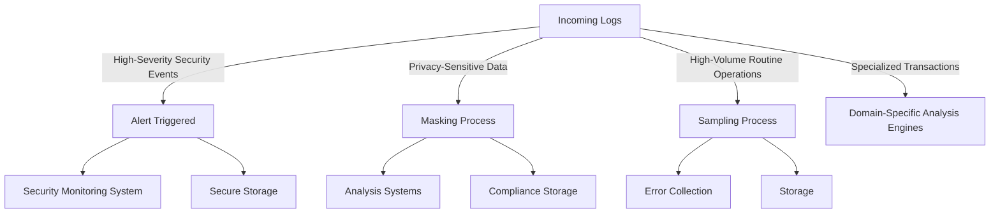

The display also includes a timeline comparison, illustrating how this intelligent routing approach has dramatically improved operational efficiency. Critical data is routed to the appropriate systems instantly, ensuring timely processing while avoiding storage overflow from routine events. This visualization highlights the precision and adaptability of the system, showcasing its ability to balance performance, compliance, and operational needs effectively.

### Teaching Narrative

Routing intelligence transforms simplistic logging pipelines into sophisticated traffic management systems—dynamically directing different data types to appropriate destinations based on content, purpose, and value. Traditional architectures typically implement simplistic routing where all logs follow identical paths regardless of content or importance, creating both operational inefficiency and compliance challenges. Intelligent routing architectures transcend this limitation through content-based decision systems: severity-based routing directing different event types based on urgency and importance, content-based routing sending specialized data to appropriate analysis engines, compliance-driven routing ensuring regulated information follows approved paths, volume management routing implementing sampling strategies for high-volume events, and time-sensitive routing creating fast paths for critical operational data. For banking institutions balancing multiple observability requirements—operational monitoring, security analysis, compliance preservation, and business intelligence—this intelligent traffic management delivers substantial benefits: critical security events reach monitoring systems instantaneously without being delayed by routine processing, privacy-sensitive data follows compliant paths with appropriate protections, high-value transaction logs receive comprehensive analysis while routine operations undergo sampling to manage volume, and specialized events reach domain-specific engines optimized for their particular characteristics. The most effective implementations combine explicit rules with machine learning—using both predefined logic for clear requirements and adaptive models that continuously improve routing decisions based on observed patterns and outcomes, creating a self-optimizing system that progressively enhances both efficiency and effectiveness.

### Common Example of the Problem

A global bank's cybersecurity team experienced a critical detection gap during a sophisticated account takeover attempt, exposing vulnerabilities in their log processing system. Suspicious authentication activities began at 2:00 PM, but relevant security logs only reached monitoring systems at 2:45 PM—nearly 45 minutes too late to take timely action. The delay was caused by a centralized logging pipeline where all logs, regardless of security relevance or severity, followed the same processing path. During a window of high transaction volume, security-critical events were stuck behind millions of routine operational logs in the processing queue, as illustrated below:

```mermaid
gantt
    title Log Processing Timeline
    dateFormat  HH:mm
    section Suspicious Activity
    Initial Suspicious Events  :active, a1, 14:00, 15m
    Unauthorized Access Attempt :crit, b1, 14:15, 15m
    section Log Processing
    Routine Logs Queued        :done, c1, 14:00, 30m
    Security Logs Delayed      :crit, d1, 14:30, 15m
    Logs Reaching Monitoring   :done, e1, 14:45, 15m
    section Response
    Security Team Investigates :crit, f1, 14:45, 30m
    Mitigation Actions         :done, g1, 15:15, 30m
```

At the same time, compliance storage systems were overwhelmed by excessive data volumes, primarily consisting of routine, non-regulated operational logs that didn't require specialized preservation. Without intelligent routing capabilities, the infrastructure lacked the ability to prioritize critical security information or efficiently direct data based on content and purpose. This led to cascading issues: delayed detection of security threats and inefficient storage practices that strained resources, creating both security vulnerabilities and compliance challenges.

### SRE Best Practice: Evidence-Based Investigation

Intelligent routing dramatically improves both operational effectiveness and resource efficiency by directing data based on value and purpose rather than generic processing. Evidence from financial institutions implementing routing intelligence shows clear patterns of improvement.

Investigation methodologies shift from retrospective analysis of delayed data to real-time response for critical events. The most effective implementations establish clear routing priority tiers: security-relevant events receive the highest priority with dedicated processing paths, customer-impacting transaction logs receive elevated priority with comprehensive processing, while routine operational logs undergo volume optimization through sampling and filtering.

Comparative studies demonstrate that purpose-optimized routing delivers substantial improvements over uniform processing. Organizations implementing intelligent routing reduced security event latency by 95-99% for critical alerts while simultaneously reducing storage costs by 40-60% through appropriate sampling of routine events. These dual benefits—improved critical event handling and optimized resource utilization—represent the core value proposition of routing intelligence.

#### Comparative Improvements Summary

| **Metric** | **Traditional Uniform Routing** | **Intelligent Routing** | **Improvement** |
| --------------------------------- | ------------------------------- | ------------------------------------------- | --------------------------------- |
| Security Event Latency | 5-10 seconds | 50-100 milliseconds | 95-99% reduction |
| Storage Cost for Routine Logs | 100% full storage | 40-60% reduction | 40-60% cost savings |
| Critical Data Availability | Delayed by routine processing | Instant prioritization | Real-time responsiveness |
| Operational Efficiency (Sampling) | Full log ingestion | Smart sampling with completeness for errors | Reduced volume, retained accuracy |
| Compliance Handling Accuracy | Manual, error-prone routing | Automated, compliant routing | Significant error reduction |

Evidence-based configuration develops routing rules through systematic analysis of data usage patterns rather than theoretical assumptions. By analyzing how different consumers utilize various event types, organizations identify optimal routing patterns that balance timeliness, completeness, and efficiency. Leading implementations continuously refine these patterns through feedback loops that measure data delivery effectiveness against consumer requirements.

This adaptive, evidence-driven approach ensures that routing intelligence not only meets current operational needs but also evolves with changing demands, creating a self-optimizing system that maximizes both efficiency and effectiveness.

### Banking Impact

Intelligent routing directly impacts multiple banking priorities beyond technical operations. Security posture improves significantly when relevant events reach monitoring systems in real-time rather than being delayed behind routine processing. Financial institutions implementing priority-based routing report 80-90% faster detection of suspicious activities, translating directly to reduced fraud losses and account compromise incidents.

#### Case Study: Real-Time Fraud Detection in Action

A leading global bank implemented an intelligent routing system to address delays in detecting fraudulent activities. Prior to the upgrade, all transaction logs were processed sequentially, leading to critical security events being buried under routine operational data. By deploying severity-based routing, high-priority events such as suspicious transactions were directed immediately to security monitoring systems. Within the first six months, the bank reported a 92% reduction in mean time to detect (MTTD) fraudulent activity. This improvement prevented an estimated $1.8 million in potential fraud losses and significantly reduced customer account compromise incidents.

Compliance cost efficiency improves through appropriate data handling. By routing regulated information to specialized compliant storage while implementing sampling for non-regulated operational data, organizations report 30-50% reduction in compliance-related storage costs without sacrificing regulatory adherence.

#### Case Study: Optimizing Compliance Storage

A regional bank faced skyrocketing compliance storage costs due to the exponential growth of log data. By leveraging intelligent routing, privacy-sensitive customer data was automatically masked and directed to compliant storage systems, while routine logs underwent sampling to reduce storage overhead. Over the course of a year, the bank achieved a 45% reduction in compliance storage costs. Moreover, automated routing eliminated manual errors in data handling, ensuring consistent regulatory adherence.

Operational efficiency gains come from purpose-optimized analysis. When specialized transaction types reach appropriate domain-specific engines rather than generic processing, analytical effectiveness improves while resource requirements decrease. Trading platforms report 40-60% improved anomaly detection rates when transaction logs are routed directly to specialized analysis rather than generic processing.

Cost optimization occurs across the observability infrastructure. By implementing appropriate sampling for high-volume, low-value events while maintaining comprehensive processing for critical data, organizations achieve better analytical outcomes with lower infrastructure investments—typically reducing total observability costs by 25-35% while improving capability.

#### Summary of Results

```
+---------------------------+-------------------------------+
| Metric                    | Improvement Achieved         |
+---------------------------+-------------------------------+
| Fraud Loss Reduction      | $1.8 million savings         |
| MTTD for Security Events  | 80-90% faster detection      |
| Compliance Storage Costs  | 30-50% reduction             |
| Anomaly Detection Rates   | 40-60% improvement           |
| Observability Costs       | 25-35% reduction             |
+---------------------------+-------------------------------+
```

### Implementation Guidance

To implement intelligent routing in banking observability pipelines, follow these steps:

#### Checklist for Implementation

1. **Develop a Data Classification Framework**

   - Categorize event types based on:
     - Security relevance
     - Compliance requirements
     - Analytical value
     - Operational importance
   - Define clear taxonomy and labels for each category.

2. **Define Purpose-Based Routing Rules**

   - Establish routing logic for all data categories:
     - Priority levels (e.g., high-severity, routine)
     - Processing requirements (e.g., masking, sampling)
     - Destination systems (e.g., security monitoring, domain-specific analysis)
     - Sampling strategies for high-volume data when appropriate.

3. **Design a Tiered Processing Architecture**

   - Build multi-lane infrastructure with dedicated paths for:
     - Critical events to ensure low-latency processing
     - Routine operations to prevent bottlenecks.

4. **Create Compliance-Aware Routing**

   - Implement routing for regulated data that includes:
     - Masking sensitive information
     - Encryption and access controls
     - Storage targeting based on regulatory requirements.

5. **Build Volume Management Mechanisms**

   - Apply intelligent sampling for high-volume routine events:
     - Maintain precise error collection
     - Reduce storage and processing load for non-critical data.

6. **Establish Performance Monitoring**

   - Deploy metrics and dashboards to measure:
     - Latency by event type
     - Processing rates
     - Delivery success to destination systems
     - Consumer satisfaction and operational efficiency.

7. **Develop Continuous Optimization Processes**

   - Introduce feedback loops to refine routing over time:
     - Use machine learning to adapt to changing patterns
     - Incorporate user feedback and system performance data
     - Adjust rules and infrastructure as requirements evolve.

#### Example Workflow for Implementation

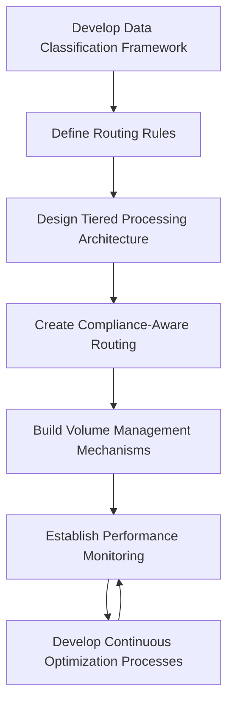

By following this checklist and workflow, teams can systematically implement intelligent routing, ensuring the right data reaches the right place at the right time, with operational efficiency and compliance at the forefront.

## Panel 4: The Transformation Layer - Shaping Data for Purpose

### Scene Description

A banking platform engineering session unfolds, where specialists actively develop data transformations within their observability pipeline. Interactive screens showcase a series of transformation types operating on log data in flight, demonstrating key processes:

- **Format Conversion**: Normalizing diverse log structures into standardized schemas.
- **Field Extraction**: Parsing embedded information from legacy systems into structured formats.
- **Sensitive Data Handling**: Masking or encrypting account numbers and personal information to meet compliance rules.
- **Aggregation**: Generating statistical summaries from high-volume event streams.
- **Correlation**: Linking related events from different sources into cohesive transaction records.

The engineers highlight how these transformations drastically improve analytics capabilities—turning inconsistent, raw logs into clean, analysis-ready datasets before reaching any storage or query system.

Below is a conceptual flow of the transformation pipeline stages to provide clarity on the process:

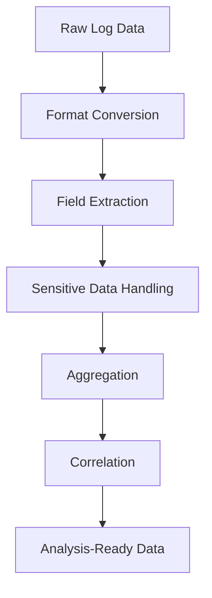

This streamlined pipeline ensures that data is transformed and optimized in real-time, enabling downstream systems to receive consistent, well-structured outputs while adhering to compliance and analytical requirements.

### Teaching Narrative

The transformation layer shapes raw log data into purpose-optimized formats—performing essential structural, semantic, and content modifications while information flows through the observability pipeline rather than after storage. Traditional approaches typically store raw logs and perform transformations during query or analysis, creating inefficiencies through redundant processing and inconsistent implementation across consuming systems. In contrast, pipeline-based transformation implements these modifications directly in the data flow, offering significant advantages in terms of efficiency, consistency, and flexibility.

Below is a comparison of traditional approaches versus pipeline-based transformations to highlight these differences:

| **Aspect** | **Traditional Approach** | **Pipeline-Based Transformation** |
| ---------------------------- | -------------------------------------------------------------------------------------------- | -------------------------------------------------------------------------------------------- |
| **Timing of Transformation** | Performed during query or analysis. | Performed in real-time as data flows through the pipeline. |
| **Efficiency** | Redundant transformations occur across multiple consuming systems. | Transformations occur once in the pipeline and are reused by all downstream systems. |
| **Consistency** | Inconsistent implementations due to varied transformation logic across systems. | Centralized, standardized transformations ensure uniformity across all systems. |
| **Data Quality** | Issues propagate to analytical systems, often discovered too late. | Problems are corrected or enhanced immediately within the pipeline. |
| **Compliance Handling** | Sensitive data is often stored in raw form before transformations are applied. | Sensitive data is masked or encrypted in-flight, ensuring compliance prior to storage. |
| **Scalability** | Difficult to scale due to the complexity of managing diverse transformation implementations. | Scales efficiently with configuration-driven, reusable transformation components. |
| **Adaptability** | Requires redesigns or significant changes to accommodate new business or compliance needs. | Easily adapts to changing requirements through dynamic configuration and modular components. |

For financial institutions with diverse systems generating heterogeneous log formats—from modern JSON-structured microservices to unstructured mainframe outputs—pipeline-based transformation creates substantial analytical advantages. Downstream systems receive consistent, well-structured data regardless of source format, sensitive information undergoes appropriate compliance handling before any persistent storage, derived fields and calculated values are generated once rather than repeatedly during analysis, and data quality issues are addressed immediately rather than propagating to analytical systems.

The most sophisticated implementations maintain transformation flexibility through configuration-driven approaches: business users define transformation requirements through governance interfaces, engineering teams implement reusable transformation components, and the pipeline combines these elements dynamically based on data characteristics and destination requirements. This approach creates an adaptable system that evolves with changing business and compliance needs without requiring pipeline redesign.

### Common Example of the Problem

A multinational bank's fraud detection team faces significant challenges stemming from inconsistent data formats across their diverse technology landscape. These challenges include:

- **Inconsistent Log Formats**:

  - Core banking platforms generate mainframe-formatted records with fixed-width fields and encoded values.
  - Digital channels produce JSON-structured events with varying field naming conventions.
  - Third-party payment processors deliver XML-formatted notifications with proprietary schemas.

- **Time-Consuming Manual Transformations**:

  - Analysts must manually transform and normalize heterogeneous data before conducting investigations.
  - Each investigation requires repeating these transformations, adding hours to critical fraud cases where minutes matter.

- **Fragmented Compliance Handling**:

  - Sensitive customer data appears inconsistently across formats, increasing regulatory risks.
  - Raw logs are stored without adequate protection, exposing the organization to compliance violations.

- **Redundant Processing Overhead**:

  - Lack of standardized, in-pipeline transformations forces duplicate efforts during analysis.
  - Teams spend more time on data preparation instead of focusing on fraud detection and prevention.

#### Checklist of Problems:

1. Diverse and incompatible log formats across systems.
2. Manual, repetitive transformations for each investigation.
3. Inconsistent masking or encryption of sensitive data.
4. Regulatory risks from unprotected raw logs.
5. Inefficient workflows delaying fraud detection outcomes.

Without standardized in-pipeline transformation, the bank struggles to achieve both effective fraud detection and consistent compliance adherence, hindering their ability to respond swiftly to threats while maintaining regulatory integrity.

### SRE Best Practice: Evidence-Based Investigation

In-pipeline transformation fundamentally changes data utilization effectiveness through consistent, centralized data shaping rather than distributed, redundant processing. Evidence from financial institutions implementing transformation layers shows clear patterns of improvement in both operational efficiency and analytical effectiveness.

Investigation approaches shift from data preparation-centric to analysis-centric workflows. Studies show that in traditional environments, analysts spend 60-70% of their time on data preparation tasks (normalization, cleansing, restructuring) versus only 30-40% on actual analysis. Organizations implementing pipeline transformation reverse this ratio—enabling analysts to focus primarily on insight generation rather than data preparation.

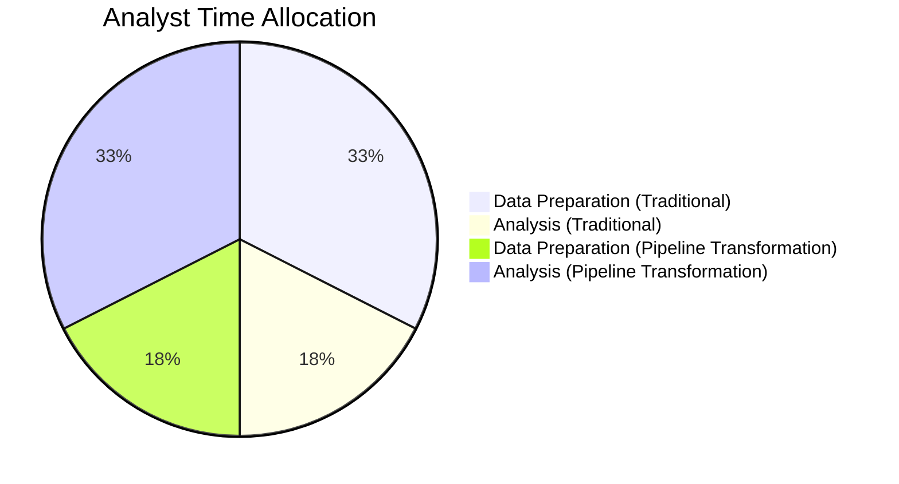

Comparative analysis demonstrates that centralized transformation delivers substantially more consistent results than distributed processing. When transformations occur once in the pipeline rather than repeatedly in different analysis systems, organizations report 85-95% reduction in data inconsistencies and reconciliation issues. This consistency dramatically improves confidence in analytical conclusions while reducing investigation time spent resolving data discrepancies.

The most effective implementations focus on purpose-driven transformation rather than generic standardization. By analyzing specific downstream use cases (fraud detection, performance analysis, customer journey analytics), organizations identify the optimal data structures for each purpose and implement targeted transformations that optimize for those specific analytical needs.

Evidence clearly shows that addressing data quality issues early in the pipeline prevents downstream problems. Organizations report 70-80% reduction in data-related incident investigations after implementing quality validation and correction as part of pipeline transformation.

### Banking Impact

Transformation capabilities directly impact multiple banking priorities. Fraud detection effectiveness improves significantly when analysts work with consistently structured, normalized data that enables pattern recognition across diverse channels and systems. For example, a major retail bank implemented a transformation layer to standardize log formats across their online banking, mobile app, and ATM networks. This allowed their fraud detection systems to correlate suspicious activities, such as failed login attempts across multiple channels, in near real-time. As a result, they achieved a 30% improvement in fraud detection rates and reduced investigation times by 45%, preventing millions in potential losses annually.

Compliance risk reduction occurs through consistent handling of sensitive information. By implementing centralized transformation with appropriate masking, tokenization, and encryption, organizations ensure regulatory compliance regardless of source system formats. One financial institution, for instance, leveraged transformation pipelines to anonymize customer account numbers and encrypt personally identifiable information (PII) before it entered downstream systems. This approach not only ensured compliance with GDPR and other regulatory requirements but also simplified audit processes, reducing audit preparation time by 50%.

Customer experience analytics benefit from normalized, correlated data that provides complete journey visibility. A national bank used transformation pipelines to unify customer interactions across their call centers, mobile apps, and in-branch systems. By linking related events, such as loan inquiries initiated online and completed at a branch, they gained a holistic view of customer journeys. This insight drove a 15% increase in loan conversion rates, a 20% boost in customer satisfaction scores, and a noticeable improvement in customer retention.

Operational efficiency gains translate directly to cost reduction. By performing transformations once in the pipeline rather than repeatedly in each analytical system, organizations typically reduce computational costs by 50-60% while improving analytical response times by 60-70%. For example, a global financial services provider consolidated over a hundred disparate log transformation processes into a single, centralized pipeline. This reduced their annual infrastructure costs by $2 million while enabling real-time analytics for fraud detection and customer behavior insights—capabilities that were previously impractical with their legacy architecture.

### Implementation Guidance

To implement effective transformation in banking observability pipelines:

1. **Conduct transformation requirements analysis**: Review downstream use cases to identify optimal data structures for different analytical purposes. Document specific transformation requirements for each major data consumer type.

2. **Develop canonical data models**: Create standardized schema definitions that balance analytical effectiveness with implementation feasibility. Define field naming conventions, data types, enumeration values, and relationship structures.

3. **Implement source-specific parsers**: Build specialized transformation components for different input formats (mainframe, XML, JSON, unstructured text) that convert source-specific formats to canonical models.

4. **Create sensitive data handlers**: Develop pattern recognition, classification, and protection mechanisms for personally identifiable information (PII), account data, and financial details that apply appropriate masking, tokenization, or encryption.

5. **Establish data quality validation**: Implement automated validation rules that identify and correct common data quality issues including missing fields, inconsistent formats, invalid values, and relationship integrity problems.

6. **Build configuration management system**: Develop governance interfaces that enable non-technical users to manage transformation rules, classification patterns, and validation requirements without requiring engineering changes.

7. **Deploy transformation monitoring**: Create comprehensive metrics measuring transformation effectiveness, including processing rates, error frequencies, data quality scores, and downstream consumer satisfaction.

## Panel 5: The Real-Time Analytics Paradigm - Insights at the Speed of Business

### Scene Description

A banking fraud operations center where analysts monitor real-time transaction analysis directly within their observability pipeline. The centerpiece of the room is a dashboard that visualizes analytics on data in motion, enabling immediate insights into transaction activity. Key components of the dashboard include:

- **Stream Processing Engines**: Continuously computing risk scores for payment transactions as they occur.
- **Pattern Recognition Algorithms**: Identifying potential fraud signatures by correlating events across multiple data streams.
- **Anomaly Detection Models**: Flagging unusual behavior patterns in real-time by comparing current activity against established baselines.
- **Real-Time Aggregation Metrics**: Maintaining statistical profiles of normal operations to ensure contextual accuracy.

Below is a conceptual layout of the dashboard highlighting these components:

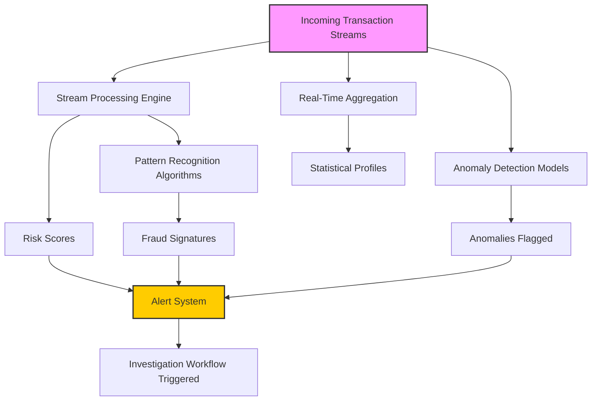

When a suspicious transaction pattern emerges, the system integrates outputs from these components to immediately trigger investigation workflows. Alerts are sent to analysts, and contextual information is automatically gathered from multiple systems, enabling rapid response. This proactive approach ensures that potential threats are identified and addressed before traditional batch analysis would have even begun processing the transactions in question.

### Teaching Narrative

Real-time analytics transforms observability from historical analysis to immediate insight by performing sophisticated computation directly on streaming data rather than after storage and indexing. Traditional approaches follow a store-then-analyze paradigm—collecting logs into repositories before performing batch analysis, creating inevitable delays between events and insights. Stream-based analytics transcends this limitation through in-pipeline processing: continuous calculation performing mathematical and statistical operations as data flows, pattern recognition identifying signatures spanning multiple events in near-real-time, anomaly detection comparing current behavior against baselines as it occurs, and predictive analytics generating forward-looking insights based on emerging patterns. For financial institutions where seconds matter in fraud detection, security response, and operational issues, this capability transformation creates substantial competitive advantages: identifying suspicious transactions before they complete rather than hours afterward, recognizing potential security incidents as they develop rather than during retrospective analysis, detecting operational anomalies before they impact customers rather than after complaints occur, and enabling immediate business intelligence rather than next-day reporting. The most sophisticated implementations combine multiple temporal approaches: real-time analytics for immediate operational needs, near-real-time processing for tactical responses requiring minutes rather than seconds, and batch analytics for complex questions requiring historical context—each operating on appropriate data streams with optimal processing approaches for their specific requirements. This balanced implementation ensures both immediate operational intelligence and comprehensive analytical capability without forcing a single processing paradigm across all use cases.

### Common Example of the Problem

A major credit card issuer's fraud detection system relies on a batch processing model, analyzing transactions only after they have been stored in the data warehouse. During a coordinated fraud attack targeting high-value electronics purchases, the system identifies the suspicious pattern only after the transactions are completed and the merchandise has been collected—nearly four hours after the first fraudulent purchase. By the time the pattern is recognized, over $2 million in fraud losses have occurred. The issue lies not in the sophistication of their algorithms but in the processing paradigm: their detection models analyze stored historical data rather than detecting patterns as they emerge in the transaction stream.

To illustrate this delay, consider the following timeline comparison between batch processing and real-time analytics:

```mermaid
gantt
    title Batch Processing vs. Real-Time Analytics
    dateFormat HH:mm
    axisFormat %H:%M
    section Batch Processing
    Transaction Events Logged       :done, t1, 08:00, 1h
    Data Stored in Warehouse        :done, t2, after t1, 1h
    Batch Analysis Initiated        :done, t3, after t2, 1h
    Fraud Pattern Detected          :done, t4, after t3, 1h
    section Real-Time Analytics
    Transaction Events Processed    :active, r1, 08:00, 1h
    Fraud Pattern Detected          :done, r2, after r1, 0.1h
```

In this example, the batch processing system takes four hours to detect the fraudulent pattern, beginning with the first transaction at 8:00 AM and concluding with detection at 12:00 PM. In contrast, a real-time analytics system processes transactions as they occur and identifies the same fraud pattern within minutes, enabling the issuer to intervene before significant losses occur.

This same batch-oriented limitation affects operational monitoring. For example, system performance degradation is identified only after customer impact has occurred and complaints are received, rather than detecting emerging issues proactively while still addressable. Real-time analytics transforms this paradigm by enabling immediate detection and response, radically reducing the time between issue emergence and resolution.

### SRE Best Practice: Evidence-Based Investigation

Stream-based analytics fundamentally transforms incident response from reactive to proactive by identifying emerging issues before significant impact occurs. Evidence from financial institutions implementing real-time analytics shows dramatic improvements in both detection effectiveness and response timeliness.

Comparative analysis between batch-oriented and stream-processing approaches demonstrates fundamental differences in detection capabilities. Organizations implementing stream analytics report 90-95% reduction in time-to-detection for critical patterns, with suspicious activities identified in seconds rather than hours after occurrence. This time advantage transforms response from damage control to active prevention.

#### Comparative Benefits: Batch-Oriented vs. Stream-Processing Approaches

| Feature/Capability | Batch-Oriented Analytics | Stream-Processing Analytics |
| ---------------------------- | --------------------------- | ------------------------------------------ |
| **Time-to-Detection** | Hours to Days | Seconds to Minutes |
| **Data Processing Paradigm** | Store-then-Analyze | In-Pipeline, Continuous Analysis |
| **Incident Response Model** | Retrospective Forensics | Real-Time Intervention |
| **Detection Scope** | Historical Patterns | Emerging Patterns and Anomalies |
| **Operational Impact** | Post-Incident Mitigation | Pre-Incident Prevention |
| **Use Case Suitability** | Complex, long-term analysis | Low-latency, high-priority decision making |

#### Checklist: Best Practices for Evidence-Based Investigation

- **Leverage Specialized Analytics**\
  Develop domain-specific models tailored to financial operations, such as:

  - **Transaction Fraud Analytics**: Focus on purchase patterns and customer behavior anomalies.
  - **Authentication Analytics**: Monitor access patterns and credential usage for suspicious activity.
  - **Operational Analytics**: Track system performance, error rates, and deviations from baselines.

- **Combine Analytical Techniques**\
  Implement multiple simultaneous approaches for comprehensive detection:

  - Statistical analysis to identify deviations from baselines.
  - Pattern matching for detecting known fraud signatures.
  - Correlation engines to link related events across systems.
  - Machine learning models for identifying subtle anomalies.

- **Establish Continuous Feedback Loops**

  - Measure detection effectiveness using key performance indicators (e.g., false positive/negative rates).
  - Automatically refine models based on feedback to adapt to evolving patterns and threats.
  - Minimize manual tuning by leveraging self-improving systems.

- **Optimize for Latency and Accuracy**

  - Prioritize stream-processing for immediate operational needs.
  - Reserve batch analytics for queries requiring comprehensive historical context.
  - Balance real-time and near-real-time solutions to meet both tactical and strategic objectives.

Evidence clearly shows that organizations adopting these best practices achieve superior detection and response outcomes. By transitioning to proactive, domain-specific, and continuously improving analytics, financial institutions can mitigate risks and protect operational integrity at unprecedented speeds.

### Banking Impact

Real-time analytics directly impacts multiple critical banking priorities, delivering measurable improvements across fraud prevention, customer experience, regulatory compliance, and competitive positioning.

Fraud prevention effectiveness transforms from post-transaction detection to in-process prevention. Financial institutions implementing stream analytics report substantial gains:

| Metric | Reported Improvement | Key Outcome |
| ---------------------------------------------------- | -------------------- | ------------------------------------ |
| Fraud loss reduction (card-not-present transactions) | 60-70% | Millions in prevented losses |
| Account takeover prevention | 50-60% | Significant reduction in fraud cases |

Customer experience benefits from immediate issue detection. Proactive anomaly identification allows organizations to mitigate issues before widespread disruption occurs:

| Metric | Reported Improvement | Key Outcome |
| ----------------------------------------- | -------------------- | ----------------------------------- |
| Reduction in customer-impacting incidents | 40-50% | Improved satisfaction and retention |

Regulatory compliance improves through real-time transaction pattern monitoring. Anti-money laundering (AML) and sanctions compliance are enhanced by shifting from batch processes to immediate detection:

| Metric | Reported Improvement | Key Outcome |
| -------------------------------------------- | -------------------- | ---------------------------------------------- |
| Detection timeliness for suspicious patterns | Days to seconds | Reduced regulatory risk, faster investigations |

Competitive advantage emerges through enhanced real-time decisioning capabilities. Stream analytics enables dynamic risk-based authentication, real-time offer generation, and immediate fraud interdiction—capabilities that directly enhance customer experience while mitigating operational risks. These innovations position financial institutions to thrive in a highly competitive industry by combining operational efficiency with superior customer engagement.

### Implementation Guidance

To implement effective real-time analytics in banking observability pipelines, follow this structured checklist and flow diagram to ensure a comprehensive and actionable approach:

______________________________________________________________________

**Checklist for Real-Time Analytics Implementation**

1. **Define Analytical Objectives**

   - Identify domain-specific requirements (e.g., payments, authentication, trading, operations).
   - Document detection use cases, including:
     - Pattern definitions.
     - Timing requirements.
     - Response workflows.

2. **Design Analytical Architecture**

   - Develop a tiered processing architecture:
     - Simple statistical analysis.
     - Complex pattern recognition.
     - Machine learning-based anomaly detection.
     - Predictive analytics tailored for specific use cases.

3. **Enable Stateful Processing**

   - Build components capable of maintaining state across events.
   - Support real-time recognition of transaction sequences, session behaviors, and time-sensitive activities.

4. **Establish Adaptive Baselines**

   - Implement statistical modeling for dynamic baselines.
   - Continuously update profiles for "normal" behavior across operations, customers, and systems.

5. **Automate Response Mechanisms**

   - Integrate analytical systems with operational platforms for automated response workflows:
     - Transaction blocking.
     - Additional authentication requests.
     - Routing suspicious activity to fraud review.

6. **Measure Effectiveness**

   - Deploy metrics to evaluate performance:
     - Detection rates.
     - False positive ratios.
     - Time advantages over batch processing.
     - Business impact metrics (e.g., prevented losses).

7. **Implement Continuous Improvement**

   - Establish feedback loops to refine detection models.
   - Leverage investigation outcomes to adapt to emerging threats.

______________________________________________________________________

**Flow Diagram for Implementation Steps**

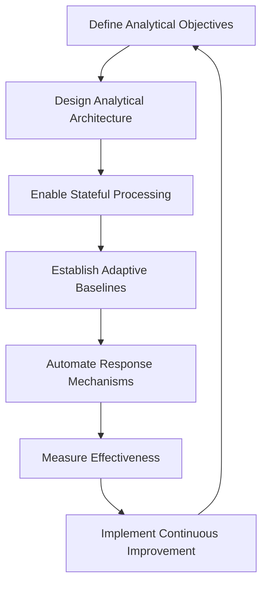

By following this checklist and iterative flow, financial institutions can operationalize real-time analytics effectively, ensuring both immediate insights and long-term adaptability to evolving challenges.

## Panel 6: The Compliance Gateway - Governance by Design

### Scene Description

A banking regulatory review where compliance officers examine their observability pipeline's governance capabilities. Visualization displays show comprehensive compliance functions operating within the data flow, ensuring regulatory requirements are satisfied before data ever reaches storage or analysis—preventing compliance violations rather than detecting them after they occur. These pipeline-integrated controls include:

```plaintext
Compliance Functions in the Observability Pipeline
---------------------------------------------------
| Function               | Role in the Pipeline                                          |
|------------------------|-------------------------------------------------------------|
| Field-level Classification | Automatically identify regulated information types.       |
| Privacy Protection        | Apply masking or tokenization based on data categories.    |
| Access Control Enforcement | Restrict sensitive data access to authorized users only.  |
| Immutable Audit Logging   | Record all data access and modifications.                  |
| Selective Field Routing   | Handle different information types according to policies.  |
---------------------------------------------------
```

The compliance team demonstrates these controls in action, showcasing how field-level classification identifies sensitive data, privacy protection applies appropriate safeguards, access controls enforce usage restrictions, immutable audit logs capture all changes, and selective routing ensures compliant handling of various data types. Together, these functions form a governance framework embedded directly into the pipeline, enabling proactive compliance management.

### Teaching Narrative

The compliance gateway integrates regulatory requirements directly into observability infrastructure—implementing governance controls within the pipeline itself rather than applying them after data collection and storage. This approach can be likened to a security checkpoint at an airport: instead of allowing passengers to board a plane and then checking their credentials mid-flight or upon landing, the checkpoint ensures that only authorized individuals pass through before they ever reach sensitive areas. Similarly, pipeline-integrated compliance acts as a checkpoint for data, enforcing controls at the point of entry into the system to prevent unauthorized access, improper handling, or compliance violations downstream.

Traditional approaches typically treat compliance as separate from technical infrastructure, creating both risk exposure through potential control gaps and operational inefficiency through disconnected governance. Pipeline-integrated compliance transcends this limitation through built-in governance: field-level classification automatically identifying regulated information types, differential privacy applying appropriate protection based on data sensitivity, purpose-based handling implementing different controls based on intended usage, immutable audit capture recording all data transformations and access, and jurisdictional routing ensuring data flows satisfy geographical requirements.

For banking institutions facing complex regulatory mandates—from personal information protection under GDPR and CCPA to financial records requirements under SOX and PCI-DSS—this integrated approach delivers substantial benefits: preventing compliance violations through controls embedded in core infrastructure, reducing governance costs through automation rather than manual oversight, implementing consistent protection across all data flows rather than system-by-system implementation, and simplifying regulatory demonstrations through centralized control evidence.

The most sophisticated implementations adopt privacy-by-design principles—treating data protection as a fundamental architecture requirement rather than a subsequent addition. This ensures that sensitive information receives appropriate handling from initial collection through ultimate analysis and storage. Like a well-designed security checkpoint, the compliance gateway ensures that every piece of data is appropriately screened and safeguarded before moving further into the system. This integrated approach transforms compliance from constraint to capability—enabling both comprehensive observability and regulatory adherence through intelligent pipeline design rather than forcing trade-offs between visibility and governance.

### Common Example of the Problem

A multinational bank faces a serious compliance challenge during a regulatory examination. Auditors discover multiple governance issues within their observability infrastructure, including unprotected personally identifiable information (PII) such as account numbers, tax identification numbers, and transaction details accessible to engineering teams without appropriate controls. Further investigation reveals systemic inconsistencies:

| **Issue** | **Description** | **Impact** |
| --------------------------------------- | ------------------------------------------------------------------------------------------------- | -------------------------------------------------------------------------------------------------------------- |
| **Unprotected PII** | Sensitive data (e.g., account numbers, tax IDs) visible in logs without masking or tokenization. | Unauthorized access to sensitive data, violating regulations like GDPR and CCPA, and risking privacy breaches. |
| **Inconsistent Protection** | Cloud-based systems implement appropriate controls, while legacy on-premises systems expose data. | Fragmented governance leading to protection gaps and increased regulatory scrutiny. |
| **Data Residency Violations** | European customer data flows to US-based systems without applying required privacy safeguards. | Breaches of GDPR data residency requirements, exposing the bank to fines and reputational damage. |
| **Separate Security and Observability** | Security controls are managed independently from observability infrastructure. | Architectural silos result in manual, error-prone processes and inconsistent application of security measures. |

The root cause isn't negligent intent but architectural limitation—security controls are implemented separately from the observability infrastructure. This fragmented approach leads to inconsistent protection, compliance gaps, and regulatory violations. As a result, the bank faces significant penalties and extensive remediation requirements. Engineering teams are forced to retroactively implement protection mechanisms across hundreds of systems—an effort that could have been avoided with centralized, pipeline-integrated compliance controls.

### SRE Best Practice: Evidence-Based Investigation

Integrated compliance fundamentally transforms governance from detective to preventive control through pipeline-embedded protection mechanisms. Evidence from financial institutions implementing compliance gateways shows clear improvements in both regulatory adherence and operational efficiency.

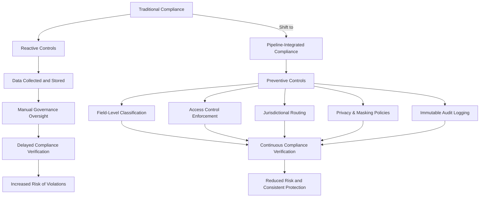

Comparative analysis between traditional and pipeline-integrated approaches demonstrates substantial risk reduction. Organizations implementing compliance gateways report 85-95% reduction in data protection incidents and policy violations compared to separate governance implementations. This prevention-focused approach eliminates the compliance gap between event generation and protective control application.

Investigation methodologies shift from retroactive verification to continuous assurance. Leading implementations establish automated compliance verification within the pipeline that continuously validates control effectiveness: testing masking patterns against evolving data formats, verifying classification accuracy against defined policies, and confirming appropriate handling across different data types and destinations.

Evidence clearly shows that centralized implementation delivers more consistent protection than distributed controls. When compliance mechanisms operate within the pipeline rather than across individual systems, organizations report near-perfect consistency compared to 40-60% variation in distributed approaches. This consistency dramatically reduces compliance risk while simplifying demonstration to regulators.

The most effective implementations balance protection with utility—applying appropriate controls based on data sensitivity and purpose rather than overly restrictive blanket policies. This nuanced approach enables comprehensive observability for legitimate operational needs while ensuring appropriate protection for sensitive information.

### Banking Impact

Integrated compliance directly impacts multiple banking priorities beyond regulatory adherence. Regulatory risk reduction occurs through prevention rather than detection—embedding compliance controls directly in the observability infrastructure eliminates the gap between data generation and protection application. Financial institutions implementing compliance gateways report 70-80% reduction in findings during regulatory examinations.

Operational efficiency improves by eliminating redundant governance implementations. Rather than implementing similar controls across hundreds of individual systems, centralized pipeline governance enforces consistent protection with significantly reduced implementation and maintenance costs—typically 60-70% lower than distributed approaches.

Customer trust enhancement occurs through demonstrable privacy protection. When banks can provide concrete evidence of comprehensive data protection directly embedded in core infrastructure, they build customer confidence in privacy practices—a growing competitive differentiator in financial services.

Innovation acceleration emerges from simplified compliance implementation. When new banking services can leverage centralized governance rather than building custom compliance controls, development cycles accelerate by 30-40% while maintaining regulatory adherence—enabling faster market delivery without increased risk.

### Implementation Guidance

To implement effective compliance gateways in banking observability pipelines, follow these steps:

#### Checklist for Implementation

1. **Develop Regulatory Requirements Inventory**

   - Document specific compliance mandates affecting observability data, such as GDPR, CCPA, SOX, PCI-DSS, or industry-specific standards.
   - Include explicit control specifications for data protection, financial records, and privacy requirements.

2. **Create Data Classification Framework**

   - Implement automated pattern recognition and metadata-based classification mechanisms.
   - Ensure the system identifies regulated information types like PII, financial records, authentication data, and sensitive categories.

3. **Build Protection Mechanism Library**

   - Develop reusable components for field-level masking, tokenization, encryption, access control, and purpose limitation.
   - Match each protection mechanism to its corresponding data category and regulatory requirement.

4. **Implement Jurisdictional Routing Logic**

   - Enforce geographic and organizational boundaries on data flows based on regional regulatory requirements.
   - Ensure compliance with laws like GDPR’s data localization mandates and similar jurisdictional directives.

5. **Establish Comprehensive Audit Mechanisms**

   - Deploy immutable logging for all data transformations, access attempts, and control applications.
   - Provide complete, tamper-proof audit trails to simplify compliance demonstrations.

6. **Develop Automated Compliance Verification**

   - Implement continuous testing capabilities, including synthetic data injection.
   - Validate control effectiveness across evolving data patterns to prevent gaps in protection.

7. **Create Compliance Dashboards**

   - Build real-time governance visibility tools, showing classification accuracy, protection coverage, potential violations, and compliance posture metrics.

#### Practical Implementation Workflow

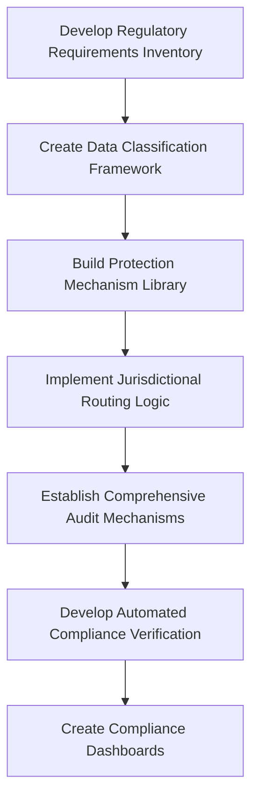

This checklist and workflow provide actionable steps to design and integrate compliance gateways into observability pipelines. By following these practices, organizations can ensure governance capabilities are embedded directly into their infrastructure, achieving both regulatory adherence and operational efficiency.

## Panel 7: The Unified Observability Vision - Connecting Logs, Metrics, and Traces

### Scene Description

A banking platform command center where engineers monitor a unified observability dashboard powered by their integrated pipeline. The dashboard integrates logs, metrics, and traces into a cohesive view, enabling seamless incident investigation and root cause analysis. Below is a conceptual depiction of how the architecture connects the telemetry types through the pipeline:

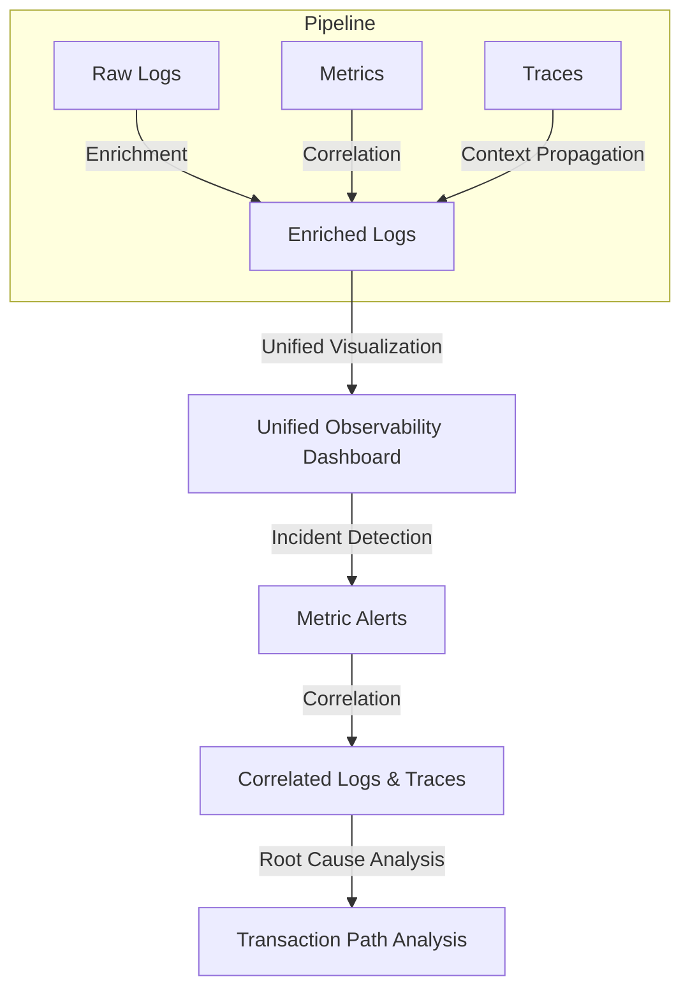

The visual displays demonstrate the pipeline's processes: raw logs flowing through enrichment to correlate with metrics, automated extraction calculating performance indicators, and trace context being preserved and enhanced throughout processing. The unified visualization shows interdependent views across all three telemetry types.

An incident demonstration underscores the power of this integration. Engineers pivot seamlessly from metric alerts showing unusual payment latency to correlated logs revealing specific error patterns, then to distributed traces displaying the exact transaction path where delays occur. This is all made possible through shared context propagated and enhanced by the pipeline, providing immediate insights and facilitating efficient resolution.

### Teaching Narrative

Unified observability transforms separate telemetry streams into integrated understanding by connecting logs, metrics, and traces through intelligent pipeline processing that establishes and enhances relationships between these different signal types. Traditional observability often implements separate pipelines for different telemetry—logs flowing through one system, metrics through another, and traces through a third—creating artificial boundaries between complementary data types. Integrated pipelines transcend this limitation through connective processing: context propagation ensuring consistent identifiers link different signal types, cross-signal enrichment enhancing logs with metric values and vice versa, derived telemetry extracting metrics and traces from log content, correlation identification establishing relationships between different signal types, and unified storage creating integrated repositories designed for cross-signal analysis. For banking platforms where comprehensive understanding requires multiple perspectives—logs providing detailed narrative, metrics offering statistical patterns, and traces showing distributed transaction flows—this unified approach delivers transformative capabilities: immediate correlation between different signal types without manual connection, comprehensive context regardless of which telemetry type initially detects an issue, seamless pivoting between different perspectives during investigation, and holistic pattern recognition across complementary data types. The most sophisticated implementations leverage this integration for enhanced automation—using the combined signal strength from multiple telemetry types to improve detection accuracy, reduce false positives, and enable more precise automated remediation than any single signal type could support independently. This unified approach fundamentally changes observability effectiveness—transforming separate technical signals into cohesive operational intelligence that enhances both human understanding and automated response capabilities.

### Common Example of the Problem

A digital banking platform experiences intermittent customer login failures during peak usage periods. The operations team receives multiple disconnected alerts from different observability systems:

- **Metrics:** Elevated API latency in the authentication service.
- **Logs:** Occasional database timeout errors.
- **Customer Feedback:** Complaints about login failures.

Each alert provides a fragment of the broader issue, but the lack of integration between telemetry types leads to a disjointed investigation process. Below is a timeline illustrating the sequence of events and the fragmented investigation:

```mermaid
gantt
    title Fragmented Investigation Timeline
    dateFormat  HH:mm
    section Incident Detection
    Elevated API Latency Alert       :done, 10:00, 10min
    Database Timeout Errors Logged   :done, 10:05, 5min
    Customer Complaints Begin        :done, 10:10, 15min
    section Independent Team Actions
    Platform Team Reviews Metrics    :active, 10:15, 30min
    Database Team Analyzes Logs      :active, 10:15, 30min
    Application Team Investigates Errors :active, 10:15, 30min
    section Manual Coordination
    Teams Coordinate Findings        :crit, 10:45, 15min
    Root Cause Identified            :milestone, 11:00, 0min
```

- The **Platform Team** reviews API metrics but lacks error context to connect latency to a specific cause.
- The **Database Team** examines timeout logs but cannot correlate them with user impact or broader system behavior.
- The **Application Team** investigates error logs without visibility into supporting infrastructure metrics.

After nearly two hours of disconnected analysis, the teams hold a manual coordination call to combine their findings. Only then do they realize the root cause: database connection pool exhaustion during peak load is causing intermittent timeouts that affect specific authentication flows.

This fragmented process highlights a common problem: the issue isn't the lack of telemetry but the lack of integrated visibility. Each team operates in isolation, seeing only partial evidence through disconnected observability silos. The delayed resolution not only prolongs customer frustrations but also results in some users abandoning transactions entirely, impacting the platform's reputation and revenue.

### SRE Best Practice: Evidence-Based Investigation

Unified observability fundamentally transforms incident investigation from fragmented analysis to holistic understanding through integration of complementary telemetry types. Evidence from financial institutions implementing unified pipelines shows dramatic improvements in both investigation effectiveness and resolution speed.

#### Comparative Analysis: Siloed vs. Unified Approaches

The table below highlights key differences between siloed and unified observability approaches, illustrating the tangible benefits of integration:

| **Metric** | **Siloed Observability** | **Unified Observability** |
| ---------------------------------- | ------------------------------------------------------------- | ----------------------------------------------------------------- |
| **Mean Time to Resolution (MTTR)** | Higher (8-12 hours on average for complex incidents) | Reduced by 65-75% (2-4 hours for similar incidents) |
| **Investigation Dead Ends** | Frequent (manual correlation often leads to incomplete paths) | Rare (80-90% reduction due to automated cross-signal correlation) |
| **Context Switching** | High (engineers move between disconnected tools) | Low (integrated views reduce tool hopping and delays) |
| **Visibility** | Fragmented (logs, metrics, and traces viewed in isolation) | Holistic (all signal types integrated into unified views) |
| **Pattern Recognition** | Limited (single-signal patterns are harder to correlate) | Comprehensive (multi-signal patterns easily identified) |

#### Methodology Transformation: From Sequential to Dimensional Analysis

Investigation methodologies shift dramatically with unified observability. Engineers move away from the sequential analysis typical of siloed environments—where they examine logs, metrics, and traces in isolation—to a dimensional approach. Unified observability provides integrated views that present all relevant signals simultaneously, enabling engineers to:

- Examine log details alongside correlated metrics and trace visualizations.
- Identify multi-dimensional patterns that are invisible when signals are viewed in isolation.
- Pivot seamlessly between telemetry types without losing context.

This shift in methodology not only accelerates the investigation process but also improves accuracy by reducing reliance on incomplete or disconnected data.

#### Leveraging Complementary Strengths of Telemetry Types

The most effective implementations maximize the strengths of each telemetry type:

- **Metrics** highlight statistical patterns and trends, providing a high-level view of system performance.
- **Logs** deliver detailed contextual narratives, offering granular insights into specific events.
- **Traces** illuminate distributed transaction flows, revealing the interconnected behavior of services.

By integrating these perspectives, organizations ensure comprehensive visibility without over-reliance on any single signal type, achieving a balanced approach to incident investigation and resolution.

#### Summary Flowchart: Unified Investigation Workflow

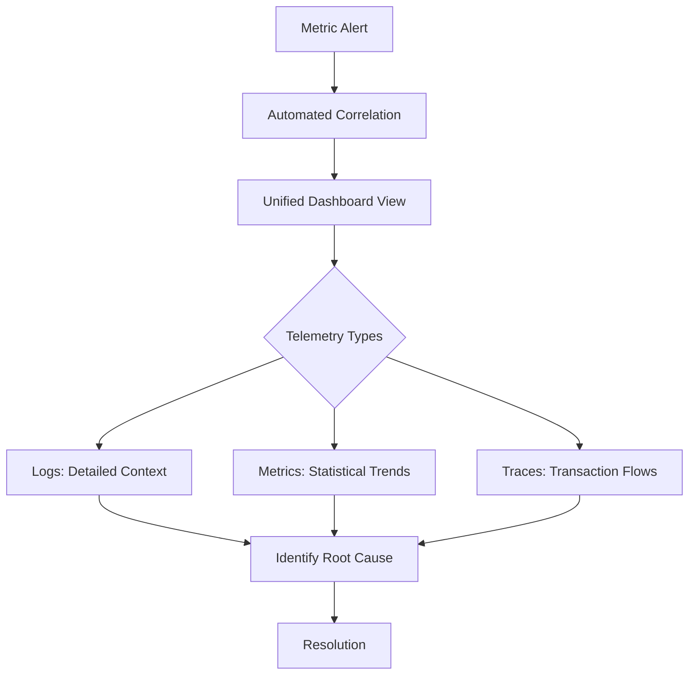

This workflow highlights how unified observability enables seamless transitions between telemetry types, ensuring that engineers can efficiently connect the dots and resolve incidents with greater speed and accuracy. The integration of logs, metrics, and traces into a cohesive system transforms investigation from fragmented guesswork into a robust, evidence-based practice.

### Banking Impact

Unified observability delivers transformative benefits across key banking priorities, driving improvements in customer experience, operational efficiency, innovation, and cost optimization. Below is a breakdown of these impacts:

- **Enhanced Customer Experience**

  - Faster incident resolution reduces customer-impacting minutes by 50-60%.
  - Engineers can immediately correlate customer-reported issues with detailed technical telemetry, speeding up response times.

- **Improved Operational Efficiency**

  - Eliminates coordination overhead by enabling seamless cross-team collaboration within a unified platform.
  - Reduces incident staffing needs and resolution time by 40-50%, allowing smaller teams to handle incidents more effectively.

- **Reduced Innovation Risk**

  - Provides detailed visibility into complex transaction flows and performance bottlenecks.
  - Enables better architectural decisions, leading to 35-45% fewer post-deployment incidents.

- **Cost Optimization**

  - Consolidates disparate observability tools into a single unified platform, cutting observability costs by 30-40%.
  - Boosts team productivity by providing integrated, actionable insights from logs, metrics, and traces.

#### Summary of Impacts

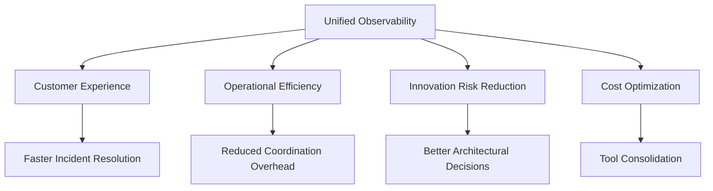

Unified observability transforms traditional banking operations by integrating telemetry data into actionable intelligence, ensuring banks can respond faster, innovate with confidence, and optimize costs while delivering exceptional customer experiences.

### Implementation Guidance

To implement effective unified observability in banking pipelines, follow the steps below. Use the accompanying checklist for clear, actionable guidance:

______________________________________________________________________

#### Step-by-Step Implementation

1. **Develop Cross-Signal Correlation Strategy**

   - Define shared identifier conventions (e.g., transaction IDs, session tokens).
   - Establish context propagation mechanisms to maintain relationships between telemetry types.
   - Model relationships across logs, metrics, and traces to enable correlation.

2. **Implement Unified Collection Architecture**

   - Design and deploy a collection framework that supports all telemetry types.
   - Ensure context propagation mechanisms are integrated into collection processes.
   - Validate that identifiers are preserved across telemetry streams during ingestion.

3. **Build Context Enrichment Services**

   - Develop automated services to enhance logs with relevant metric values.
   - Enrich metrics with log-based details to provide narrative context.
   - Augment traces with both log and metric data for comprehensive insight.

4. **Create Derived Telemetry Extractors**

   - Implement processors to:
     - Extract metrics from log patterns (e.g., error counts, latencies).
     - Generate trace spans from log data.
     - Perform cross-signal analysis to derive additional context automatically.

5. **Establish Unified Storage Model**

   - Design repositories to maintain native relationships between telemetry types.
   - Optimize storage for cross-signal queries and integrated analysis.
   - Validate that queries seamlessly access all relevant telemetry types.

6. **Develop Integrated Visualization**

   - Build dashboards that display correlated views of logs, metrics, and traces.
   - Ensure seamless pivoting between telemetry types while maintaining shared context.
   - Highlight key relationships and dependencies across signals in the interface.

7. **Implement Correlation-Based Alerting**

   - Create alerting mechanisms that validate issues using multiple telemetry types.
   - Use cross-signal validation to improve detection accuracy and reduce false positives.
   - Enable context-rich alerts that point directly to root causes.

______________________________________________________________________

#### Implementation Checklist

- [ ] **Correlation Strategy**: Shared identifier conventions and propagation mechanisms are defined.
- [ ] **Collection Framework**: Unified architecture for logs, metrics, and traces is deployed.
- [ ] **Enrichment Services**: Context enrichment automation is operational.
- [ ] **Derived Telemetry**: Processors for metrics and traces from logs are implemented.
- [ ] **Storage Model**: Unified repositories for cross-signal queries are established.
- [ ] **Visualization**: Dashboards with seamless pivoting across telemetry types are created.
- [ ] **Alerting**: Correlation-based alerting mechanisms are in place.

______________________________________________________________________

#### High-Level Process Flow

```mermaid
graph TD
    A[Develop Correlation Strategy] --> B[Implement Collection Architecture]
    B --> C[Build Context Enrichment Services]
    C --> D[Create Derived Telemetry Extractors]
    D --> E[Establish Unified Storage Model]
    E --> F[Develop Integrated Visualization]
    F --> G[Implement Correlation-Based Alerting]
```

## Panel 8: The Scalability Frontier - Architecture for Banking Scale

### Scene Description

A global banking architecture review where infrastructure engineers evaluate their observability pipeline's scalability characteristics. Performance dashboards illustrate the system processing enormous log volumes across worldwide operations. Key scalability mechanisms include:

- **Horizontal Scaling**: Automatically adding processing capacity during peak transaction periods by expanding dynamic node clusters.
- **Workload Partitioning**: Distributing processing across specialized nodes based on data characteristics to ensure efficiency and balance.
- **Backpressure Management**: Preventing system overload during traffic spikes through intelligent throttling and buffering mechanisms.
- **Intelligent Resource Allocation**: Optimizing compute usage by prioritizing data importance and processing requirements.

Historical metrics demonstrate consistent performance as log volumes have scaled from terabytes to petabytes. The architecture adapts dynamically to predictable patterns (e.g., month-end processing) and unexpected spikes (e.g., market volatility events). The relationships and flow of these components can be visualized as follows:

```mermaid
flowchart TD
    A[Log Ingestion] --> B[Horizontal Scaling]
    B --> C[Dynamic Node Clusters]
    C --> D[Workload Partitioning]
    D --> E[Specialized Nodes]
    E --> F[Processing]
    F --> G[Backpressure Management]
    G --> H[Throttling & Buffering]
    F --> I[Intelligent Resource Allocation]
    I --> J[Optimized Compute Usage]
    H --> K[Consistent Performance]
    J --> K
```

This diagram highlights how log ingestion flows through the system, leveraging horizontal scaling, workload partitioning, backpressure management, and resource optimization to maintain consistent performance and reliability. By integrating these components, the architecture ensures seamless scalability and operational efficiency at banking scale.

### Teaching Narrative

Scalability architecture addresses the fundamental challenge of banking-scale observability—processing massive log volumes from global operations while maintaining performance, reliability, and cost-efficiency as data grows exponentially. Imagine a global banking system as a vast and ever-expanding highway network. During normal operations, the highway handles steady traffic—cars (representing log data) flow smoothly to their destinations. However, during peak periods like market openings or month-end processing, the traffic surges dramatically. To keep things moving, the highway dynamically adds new lanes (horizontal scaling), ensuring that no single route becomes overwhelmed. Specialized toll booths (workload partitioning) direct different types of vehicles—cars, buses, and trucks—to lanes optimized for their size and speed, preventing bottlenecks. Intelligent traffic lights and metering systems (backpressure management) regulate the flow during rush hours, ensuring that the network doesn’t grind to a halt. Meanwhile, priority lanes (resource optimization) are reserved for emergency vehicles or high-priority shipments, ensuring essential services remain uninterrupted regardless of the traffic load.

For financial institutions, this "highway system" analogy mirrors the demands of scalability: processing billions of daily transactions across worldwide operations, maintaining consistent performance during extreme traffic surges, and doing so at a cost that doesn't escalate uncontrollably. Modern pipeline architectures achieve these goals through sophisticated scaling techniques. Horizontal distribution spreads processing across dynamic node clusters that expand and contract with demand. Workload partitioning routes different data types to specialized resources optimized for their characteristics. Backpressure mechanisms prevent system failure during volume spikes through intelligent throttling and buffering. Resource optimization ensures critical data receives priority processing without wasting compute on less important tasks.

In the context of global banking platforms, where observability directly impacts both operational capability and regulatory compliance, these scalability patterns are essential. They enable consistent processing regardless of transaction volumes, ensure critical security and fraud detection systems remain functional during extreme load conditions, and preserve comprehensive visibility into vital operations. By combining multiple scaling dimensions—technical scaling through distributed architecture, economic scaling through tiered processing based on data value, and operational scaling through automated management—financial institutions build infrastructures that not only adapt to growing demands but do so efficiently, much like an intelligent highway system that keeps traffic flowing no matter how large the city grows.

### Common Example of the Problem

A global investment bank's observability platform experiences catastrophic failure during an unexpected market volatility event. As trading volumes surge to 5x normal levels, their logging infrastructure becomes completely overwhelmed—message queues back up, processing nodes crash under excessive load, and log delivery latency increases from seconds to hours. Critical trading system logs never reach security monitoring or compliance storage, creating both operational blindness and regulatory violations.

Post-incident analysis reveals fundamental architectural limitations: fixed capacity designed for average rather than peak conditions, no backpressure mechanisms to manage unexpected volume, single processing pathways creating bottlenecks under load, and inadequate scaling capabilities to handle exponential volume increases. The business impact is severe: inability to monitor trading platforms during critical market conditions, missed security alerts due to delayed log processing, compliance failures from incomplete record preservation, and several hours of operational blindness during exactly the period when visibility was most essential. The root cause wasn't insufficient infrastructure investment but architectural design that couldn't adapt to dynamic conditions—highlighting the critical difference between static capacity and true scalability.

#### Checklist: Architectural Pitfalls to Avoid

To prevent similar failures, consider the following checklist of common architectural pitfalls and how to address them:

- **Fixed Capacity Planning**: Avoid designing for average conditions; implement dynamic horizontal scaling to handle peak loads and unpredictable surges.
- **Lack of Backpressure Management**: Ensure robust backpressure mechanisms (e.g., throttling, buffering) are in place to prevent system overload during spikes in traffic.
- **Single Processing Pathways**: Eliminate bottlenecks by implementing workload partitioning and parallel processing pipelines tuned for specific data types.
- **Insufficient Fault Tolerance**: Design for resiliency by distributing workloads across multiple nodes and zones to prevent single points of failure.
- **Latency Blind Spots**: Monitor and minimize log delivery latency with intelligent routing and prioritization based on log criticality.
- **Scaling Shortcomings**: Employ architectures that support both predictable scaling (e.g., month-end processing) and reactive scaling (e.g., market volatility events).
- **Inefficient Resource Allocation**: Optimize compute resources by prioritizing high-value data and implementing tiered processing for less critical logs.

By addressing these pitfalls, organizations can build observability pipelines that are resilient, adaptive, and capable of maintaining performance and compliance under any conditions.

### SRE Best Practice: Evidence-Based Investigation

Elastic scalability fundamentally transforms observability reliability through demand-adaptive architecture rather than static capacity planning. Evidence from financial institutions implementing scalable pipelines shows clear advantages in both operational resilience and cost efficiency.

The table below highlights the comparative analysis between traditional fixed-capacity architectures and elastic, demand-adaptive architectures across key metrics:

| **Metric** | **Traditional Fixed-Capacity Architecture** | **Elastic Demand-Adaptive Architecture** |
| -------------------------- | ------------------------------------------- | ------------------------------------------- |
| **Processing Reliability** | 60-70% during extreme volume events | 99.99%+ during extreme volume events |
| **Scalability Approach** | Static capacity sized for peak load | Dynamic horizontal and vertical scaling |
| **Operational Visibility** | Limited during critical periods | Consistent visibility under all conditions |
| **Cost Efficiency** | High costs to provision peak capacity | 40-50% lower costs due to scaling on demand |
| **Performance Under Load** | Degraded during volume spikes | Maintains consistent performance |

Investigation into architectural patterns reveals that multi-dimensional scaling delivers superior results compared to simple horizontal scaling. Leading implementations combine several approaches:

- **Horizontal Scaling**: Dynamically adding processing nodes to handle high demand.
- **Vertical Scaling**: Allocating additional resources to existing nodes to improve efficiency.
- **Workload Partitioning**: Distributing processing based on data characteristics for specialized handling.
- **Priority-Based Scheduling**: Ensuring critical data receives processing preference during capacity constraints.

Evidence clearly demonstrates that automated scaling based on multiple indicators outperforms manual or simple metric-based approaches. The most effective implementations incorporate sophisticated scaling triggers, including:

- **Processing Queue Depths**: Indicating backlog development.
- **Throughput Rates**: Showing processing efficiency.
- **Latency Measurements**: Highlighting performance degradation.
- **Predictive Scaling**: Anticipating demand changes before they occur.

The correlation between architectural design and cost efficiency is particularly striking. Organizations implementing well-designed scalable architectures achieve significantly lower infrastructure costs while simultaneously delivering better peak performance. Elastic architectures not only scale technical capacity but also optimize operational and economic outcomes, making them indispensable for modern banking observability.

### Banking Impact

Scalable observability directly impacts multiple banking priorities beyond technical operations. Operational resilience during critical events represents the most visible business impact. When observability platforms maintain performance during market volatility, system outages, or cyber incidents, organizations preserve the visibility essential for effective response. Financial institutions report 70-80% improvement in incident handling effectiveness during extreme conditions after implementing scalable observability.

Regulatory compliance assurance improves through guaranteed log processing. When pipelines maintain complete capture and delivery even under extreme load, organizations avoid the compliance violations that occur with processing failures. This reliability directly reduces regulatory risk during precisely the conditions that attract regulatory scrutiny.

Cost optimization emerges from elastic resource utilization. Rather than provisioning for maximum theoretical load, dynamic scaling allocates resources based on actual requirements. Organizations typically report 40-50% infrastructure cost reduction compared to static capacity systems while delivering superior peak performance.

Competitive advantage develops through consistent customer experience regardless of system load. When observability platforms maintain performance during peak conditions, organizations detect and address customer-impacting issues even during high-traffic periods, preserving experience quality when competitors often struggle.

### Implementation Guidance

To implement scalable observability pipelines in banking environments:

1. **Document scaling requirements**: Define specific performance expectations under different conditions, including normal operations, predictable peak periods (market opening, month-end processing), and exceptional events (market volatility, cyber incidents).

2. **Implement multi-dimensional scaling architecture**: Design systems that scale across multiple dimensions: horizontal scaling adding processing nodes, vertical scaling adjusting resource allocation, and logical scaling implementing different processing strategies based on load conditions.

3. **Build intelligent workload distribution**: Develop partitioning mechanisms that distribute processing based on data characteristics, ensuring optimal resource utilization while maintaining processing priorities.

4. **Create comprehensive backpressure mechanisms**: Implement graduated response systems that manage excess load through buffering, sampling, throttling, and prioritization rather than catastrophic failure.

5. **Establish automated scaling triggers**: Deploy monitoring that detects load changes through multiple indicators (queue depths, throughput rates, latency measurements) and automatically adjusts capacity before performance degradation. Below is an example of pseudo-code for an automated scaling trigger using queue depth as an indicator:

   ```python
   # Pseudo-code for automated scaling based on queue depth
   MAX_QUEUE_DEPTH = 1000  # Maximum allowable queue depth
   MIN_QUEUE_DEPTH = 200   # Minimum queue depth to scale down
   SCALE_UP_THRESHOLD = 0.75  # 75% utilization triggers scale-up
   SCALE_DOWN_THRESHOLD = 0.25  # 25% utilization triggers scale-down

   def monitor_and_scale(queue_depth, current_nodes):
       utilization = queue_depth / MAX_QUEUE_DEPTH

       if utilization > SCALE_UP_THRESHOLD:
           add_processing_nodes(current_nodes + 1)
           print(f"Scaling up: Added a processing node. Total nodes: {current_nodes + 1}")

       elif utilization < SCALE_DOWN_THRESHOLD and current_nodes > 1:
           remove_processing_nodes(current_nodes - 1)
           print(f"Scaling down: Removed a processing node. Total nodes: {current_nodes - 1}")

       else:
           print("No scaling action required. System is within acceptable thresholds.")

   # Example usage
   queue_depth = get_current_queue_depth()
   current_nodes = get_current_node_count()
   monitor_and_scale(queue_depth, current_nodes)
   ```

6. **Develop resilience testing framework**: Build simulation capabilities that verify scaling effectiveness under extreme conditions, including regular testing of peak load handling without production impact.

7. **Implement economic optimization controls**: Create mechanisms that balance performance requirements against infrastructure costs, including automatic resource reclamation during low-demand periods and tiered processing based on data value.

## Panel 9: The Ecosystem Integration - Connecting Across the Technology Landscape

### Scene Description

A banking technology integration center where engineers monitor their observability pipeline's connections across diverse systems. Architectural diagrams illustrate comprehensive integration spanning multiple technology generations: modern microservices sending structured JSON logs, commercial banking packages connected through specialized adapters, mainframe systems integrated via custom collectors, third-party services linked through API telemetry, and cloud platforms connected via native integrations. Implementation displays demonstrate how their pipeline creates consistent observability despite this diversity—normalizing different formats, preserving context across technology boundaries, and delivering unified visibility regardless of source systems.

Below is a high-level representation of the architecture using a Mermaid diagram to visualize the diverse systems and their connections:

```mermaid
flowchart TD
    MobileApp["Mobile App"] -->|HTTP/HTTPS| APIGateway["API Gateway"]
    APIGateway -->|gRPC/HTTP| Microservices["Microservices"]
    Microservices -->|Adapters| BankingPackages["Commercial Banking Packages"]
    BankingPackages -->|Custom Collectors| Mainframe["Mainframe Systems"]
    Mainframe -->|File Transfers| Settlement["Settlement Systems"]
    Microservices -->|API Telemetry| ThirdParty["Third-Party Services"]
    CloudPlatform["Cloud Platforms"] -->|Native Integrations| Microservices
    APIGateway -->|Context Propagation| ObservabilityPipeline["Observability Pipeline"]

    subgraph "Integration Layers"
        ObservabilityPipeline -->|Normalization| UnifiedVisibility["Unified Visibility"]
    end
```

A demonstration follows a customer transaction across this heterogeneous landscape, showing complete observability from mobile app through API gateway, microservices, commercial packages, mainframe core banking, and finally to settlement systems. This visualization highlights how the observability pipeline bridges diverse systems, ensuring seamless end-to-end context and unified visibility.

### Teaching Narrative

Ecosystem integration transforms observability from fragmented visibility to comprehensive understanding by connecting telemetry across the diverse, heterogeneous technology landscape typical in banking environments. Financial institutions face particularly challenging integration requirements: spanning technology generations from modern cloud services to legacy mainframes, incorporating commercial banking packages with limited logging flexibility, connecting specialized financial services with unique telemetry formats, and creating coherent visibility across organizational boundaries including partners and service providers. Advanced pipeline architectures address these challenges through flexible integration approaches: multi-protocol collection supporting diverse input mechanisms from modern APIs to legacy file transfers, format adaptation normalizing heterogeneous log structures into consistent schemas, context propagation maintaining transaction relationships across technology boundaries, specialized adapters connecting systems with limited native capabilities, and identity resolution linking different entity references across system boundaries. For banking platforms where end-to-end transaction visibility is essential for both operations and compliance, this comprehensive integration delivers critical capabilities: tracing customer journeys from digital channels through processing systems to settlement networks, correlating related events across organizational boundaries including partners and service providers, maintaining consistent observability standards across varying technology capabilities, and creating unified visibility regardless of the underlying system diversity. The most effective implementations balance standardization with adaptability—implementing consistent core practices while accommodating the unique requirements and limitations of diverse systems, creating comprehensive observability across the complete banking ecosystem rather than just within homogeneous technology domains.

### Common Example of the Problem

A retail bank struggles with fragmented visibility during a critical customer-reported issue with a failed mortgage payment. Their digital banking channels generate modern structured logs, their payment processing uses a commercial package with proprietary logging formats, their core banking runs on a mainframe with traditional system logs, and the actual payment processing involves a third-party service with limited visibility. Customer support receives a complaint but can only see the payment initiation in the digital banking logs—with no visibility into subsequent processing steps.

The operations team launches a complex investigation requiring five different teams using separate tools. The fragmented process can be visualized as follows:

```mermaid
flowchart TD
    A[Customer reports issue] --> B[Customer Support checks digital banking logs]
    B --> C[No visibility beyond payment initiation]
    C --> D[Escalation to Operations Team]
    D --> E[Digital Banking Engineers check web logs]
    D --> F[Middleware Team examines integration systems]
    D --> G[Mainframe Specialists review CICS transactions]
    D --> H[Vendor Management Team contacts payment processor for logs]
    D --> I[Transactions Team manually correlates all information]
    I --> J[Root cause identified after 6+ hours]
    J --> K[Payment failed at third-party due to invalid account format]
```

The investigation takes over six hours to determine that the payment failed during final processing at the third-party provider due to an invalid account format—an issue that would have been immediately visible with integrated observability. The customer, meanwhile, has been told repeatedly that the investigation is ongoing, creating frustration and eroding trust in the bank's competence.

### SRE Best Practice: Evidence-Based Investigation

Comprehensive integration fundamentally transforms troubleshooting from fragmented investigation to unified visibility through connected telemetry across diverse technologies. Evidence from financial institutions implementing ecosystem integration shows dramatic improvements in both visibility completeness and operational efficiency.

#### Comparative Analysis: Siloed vs. Integrated Approaches

A comparative analysis between siloed and integrated approaches highlights the dramatic differences in operational effectiveness. The table below summarizes key metrics that demonstrate the impact of integrated observability:

| Metric | Siloed Approach | Integrated Approach | Percentage Improvement |
| --------------------------------------- | --------------------------------------- | --------------------------------- | ----------------------- |
| **Mean Time to Resolution (MTTR)** | 4-6 hours on average | 1-2 hours on average | 70-80% reduction |
| **Investigation Staffing Requirements** | Larger teams (often 8-12 engineers) | Smaller teams (3-5 engineers) | 60-70% reduction |
| **Cross-Team Coordination Effort** | High - multiple handoffs | Low - centralized investigation | ~75% reduction |
| **Transaction Traceability** | Limited to system-specific views | End-to-end transaction visibility | Significant improvement |
| **Context Preservation** | Manual context stitching across systems | Automatic context propagation | Transformational |

#### Key Observations

- **MTTR Improvements**: Organizations with comprehensive integration report 70-80% reductions in mean-time-to-resolution for issues spanning multiple technology domains. This is achieved by eliminating the manual correlation and cross-team coordination that dominate traditional investigations.

- **Efficient Staffing**: Integrated observability enables smaller, centralized teams to investigate complete transaction flows across technology boundaries. This reduces staffing requirements by up to 70% while delivering faster resolution.

- **Transaction-Centric Observability**: Evidence demonstrates that transaction-centric observability delivers superior results compared to system-centric visibility. By maintaining transaction context across technology boundaries, organizations gain the ability to trace complete customer journeys regardless of underlying systems. This shifts troubleshooting from system-focused investigation ("Is the payment service working?") to transaction-focused resolution ("What happened to this specific payment?").

#### Balancing Standardization with Adaptability

The most effective implementations balance standardization with technology-appropriate integration. Leading organizations establish consistent core practices—such as correlation identifiers, event schemas, and context propagation—while implementing technology-specific integration approaches that respect the capabilities and constraints of different systems.

This comprehensive and adaptive approach enables financial institutions to achieve unified visibility, operational efficiency, and seamless troubleshooting across their heterogeneous technology landscapes.

### Banking Impact

Comprehensive integration directly impacts multiple banking priorities beyond technical operations. These impacts span customer experience, operational efficiency, digital transformation, and strategic planning. Below is a checklist summarizing these key impacts:

#### Checklist: Key Impacts of Comprehensive Integration in Banking

- **Improved Customer Experience**

  - Faster issue resolution: First-call resolution rates increase by 40-50%.
  - Reduced resolution time: Average resolution time decreases by 60-70%.
  - Enhanced transparency: Support teams can trace customer transactions end-to-end across processing systems.

- **Enhanced Operational Efficiency**

  - Simplified incident investigations: Smaller teams can resolve complex cross-domain issues without requiring extensive coordination.
  - Resource optimization: Total personnel hours spent on cross-domain incidents reduced by 50-60%.

- **Accelerated Digital Transformation**

  - Incremental modernization: New digital services maintain visibility through legacy systems, reducing the need for complete replacement.
  - Faster delivery: Transformation timelines accelerate by 30-40%.
  - Lower risk: Transition risks are minimized through seamless legacy integration.

- **Improved Strategic Planning**

  - Comprehensive visibility: Leadership gains a clear understanding of transaction flows across the entire technology landscape.
  - Informed decisions: Investment strategies target actual bottlenecks and pain points rather than perceived limitations.

By addressing these priorities, comprehensive ecosystem integration not only optimizes technical operations but also empowers organizations to deliver superior customer outcomes, achieve operational excellence, and drive strategic growth.

### Implementation Guidance

To implement ecosystem integration for banking observability:

1. **Conduct technology landscape assessment**: Document all systems involved in critical transaction flows, identifying technology types, logging capabilities, integration options, and visibility limitations for each component.

2. **Develop integration strategy matrix**: Create a comprehensive approach specifying appropriate integration methods for different technology types: API-based collection for modern systems, agent-based gathering for traditional platforms, adapter-based integration for commercial packages, and specialized collectors for legacy systems.

3. **Implement correlation framework**: Establish consistent transaction identification that works across technology boundaries, including methods for propagating identifiers between systems with different capabilities and formats. Below is an example snippet for propagating a correlation ID across microservices and legacy systems:

   ```python
   import uuid

   # Generate a unique correlation ID at the transaction start
   def generate_correlation_id():
       return str(uuid.uuid4())

   # Example propagation in a microservices context
   def propagate_correlation_id(request, correlation_id):
       request.headers['X-Correlation-ID'] = correlation_id
       return request

   # Example integration with a legacy system (via adapter)
   def propagate_to_legacy_system(transaction, correlation_id):
       transaction['correlation_id'] = correlation_id
       # Transformation logic for legacy format
       legacy_payload = transform_to_legacy_format(transaction)
       send_to_legacy_system(legacy_payload)

   # Example usage
   correlation_id = generate_correlation_id()
   api_request = propagate_correlation_id(api_request, correlation_id)
   propagate_to_legacy_system(transaction, correlation_id)
   ```

4. **Build specialized adapters**: Develop purpose-built integration components for systems with unique requirements, particularly mainframe environments, proprietary commercial packages, and third-party services with limited visibility. For example, an adapter might extract mainframe logs in EBCDIC format and convert them to UTF-8 for downstream processing.

5. **Create normalization layer**: Implement transformation capabilities that convert diverse formats from different systems into consistent structures, enabling unified analysis regardless of source technology. Below is a sample implementation for a normalization function:

   ```python
   def normalize_log_entry(log_entry):
       # Detect and handle source-specific differences
       if 'timestamp' in log_entry:
           normalized_timestamp = parse_to_iso8601(log_entry['timestamp'])
       else:
           normalized_timestamp = generate_current_iso8601()

       return {
           "timestamp": normalized_timestamp,
           "source": log_entry.get('source', 'unknown'),
           "message": log_entry.get('message', ''),
           "transaction_id": log_entry.get('transaction_id', ''),
           "entity_id": log_entry.get('entity_id', '')
       }

   # Example usage
   raw_log = {"timestamp": "2023-10-15T12:34:56", "source": "mainframe", "message": "Transaction complete", "transaction_id": "12345"}
   normalized_log = normalize_log_entry(raw_log)
   print(normalized_log)
   ```

6. **Establish identity resolution**: Develop mechanisms that connect different entity references across systems (account numbers, customer IDs, transaction references) to maintain relationship integrity throughout the observability pipeline. For example, use a mapping service or database to unify identifiers:

   ```python
   # Example identity resolution function
   def resolve_identity(system_id, entity_id):
       # Mock mapping database
       identity_mapping = {
           ("system_a", "12345"): "global_id_001",
           ("system_b", "67890"): "global_id_001",
       }
       return identity_mapping.get((system_id, entity_id), None)

   # Example usage
   global_id = resolve_identity("system_a", "12345")
   print(f"Resolved Global ID: {global_id}")
   ```

7. **Deploy incremental implementation approach**: Begin with highest-value transaction flows, demonstrating business impact through complete visibility for critical customer journeys before expanding to broader coverage.

   ```mermaid
   graph TD
       A[Identify High-Value Flows] --> B[Implement Observability for Flow A]
       B --> C[Validate and Demonstrate Impact]
       C --> D[Expand to Flow B]
       D --> E[Iterate Across Other Flows]
   ```

## Panel 10: The Future Frontier - Intelligent Observability Automation

### Scene Description

A banking innovation lab where engineers demonstrate next-generation observability capabilities powered by their advanced pipeline architecture. The lab features dynamic, futuristic displays showcasing autonomous intelligence seamlessly integrated into their observability flow. Engineers highlight several key capabilities:

- **Automated Topology Discovery**: Continuously maps system relationships and dependencies without manual configuration.
- **Self-Tuning Collection**: Dynamically adjusts logging detail based on observed patterns and anomalies.
- **Predictive Scaling**: Proactively allocates resources before anticipated volume increases.
- **Autonomous Analysis**: Identifies complex patterns and relationships without predefined rules.
- **Self-Healing Remediation**: Automatically addresses recognized issues based on learned resolution patterns.

The centerpiece of the demonstration is a timeline projection, illustrating the evolution of their observability systems. This roadmap visually tracks their journey from current capabilities to fully autonomous observability pipelines. Below is a conceptual flow of the observability lifecycle and roadmap progression:

```mermaid
graph TD
    A[Human-Operated Observability] --> B[Automated Topology Discovery]
    B --> C[Self-Tuning Collection]
    C --> D[Predictive Scaling]
    D --> E[Autonomous Analysis]
    E --> F[Self-Healing Remediation]
    F --> G[Intelligent Autonomous Systems]

    subgraph Current Capabilities
        A
    end

    subgraph Progressive Automation
        B
        C
        D
        E
        F
    end

    subgraph Future Vision
        G
    end
```

This visualization underscores the transition from human-operated tools to intelligent systems that autonomously enhance visibility, preemptively detect issues, and often resolve problems without human intervention. The lab’s demonstration highlights how these advancements are transforming observability into a cornerstone of resilient, adaptive banking platforms.

### Teaching Narrative

Intelligent automation represents the future frontier of observability pipelines—evolving from engineered infrastructure to autonomous systems that continuously enhance visibility, detection, and resolution capabilities with minimal human intervention. While current generation pipelines deliver powerful capabilities through defined processing, the future lies in self-improving systems that adaptively optimize their own operations. Emerging capabilities in this domain include several transformative functions: automated discovery continuously mapping system relationships and dependencies without manual configuration, adaptive instrumentation dynamically adjusting logging detail based on observed behavior and detected anomalies, predictive resource management proactively allocating capacity before anticipated demand spikes, autonomous pattern recognition identifying complex relationships without explicit programming, and self-healing remediation automatically addressing recognized issues based on learned resolution patterns. For financial institutions operating complex global platforms with continuous evolution and change, these capabilities create unprecedented operational advantages—shifting from manually maintained observability to autonomous systems that continuously improve visibility while reducing human maintenance requirements. The most sophisticated implementations combine machine intelligence with human expertise—using AI to handle scale, pattern recognition, and routine operations while preserving human judgment for novel situations, strategic decisions, and governance oversight. This balanced approach represents the highest evolution of observability infrastructure—transforming logging from passive technical collection to intelligent systems that autonomously enhance visibility, detection, and often resolution capabilities while focusing valuable human expertise on the novel challenges and strategic decisions where it provides greatest value.

### Common Example of the Problem

A global investment bank struggles with observability maintenance as their technology landscape continuously evolves. Each new service deployment requires manual configuration updates: modifying collection rules, adjusting parsing patterns, updating correlation mappings, reconfiguring dashboards, and tuning alert thresholds. For major releases, these activities consume 20-30% of implementation effort and frequently introduce errors that cause visibility gaps. Meanwhile, their operational teams face alert fatigue from static detection systems—receiving thousands of notifications daily with high false positive rates, forcing engineers to manually identify significant patterns among overwhelming noise. During a recent trading platform incident, critical signals were lost among hundreds of unrelated alerts, extending customer impact by over an hour.

The limitation isn't insufficient tooling but the operational approach—manual observability systems require constant human maintenance to remain effective, while generating overwhelming information volumes that exceed human processing capacity. This combination creates a dangerous paradox: growing engineering effort produces diminishing operational effectiveness as complexity increases, with both visibility maintenance and incident detection increasingly dependent on specialized expertise that doesn't scale with business growth.

To illustrate the contrast between manual and automated observability approaches, the following table highlights key challenges of manual systems and the transformative benefits of intelligent automation:

| **Aspect** | **Manual Observability** | **Automated Observability** |
| -------------------------- | -------------------------------------------------------------------------------------- | ------------------------------------------------------------------------------------------ |
| **System Updates** | Requires manual configuration for collection rules, dashboards, and alerts. | Automated topology discovery dynamically maps changes and adjusts configurations. |
| **Effort for Maintenance** | Consumes 20-30% of implementation effort for every major release. | Self-optimizing systems reduce ongoing maintenance effort significantly. |
| **Error Introduction** | High risk of errors leading to visibility gaps and misconfigured alerts. | Continuous learning minimizes configuration errors and adapts to system behavior. |
| **Alert Management** | Static detection generates thousands of alerts daily, with high false positive rates. | Adaptive instrumentation prioritizes meaningful signals, reducing noise and alert fatigue. |
| **Incident Response** | Engineers manually sift through alerts, delaying detection and resolution. | Self-healing remediation addresses recognized issues automatically to minimize impact. |
| **Scalability** | Relies on specialized expertise that doesn’t scale with complexity or business growth. | Autonomous systems scale with complexity, requiring minimal human intervention. |

This comparison underscores the operational inefficiencies of manual observability approaches and the transformative potential of intelligent automation to enhance visibility, detection, and resolution capabilities while reducing human effort and errors.

### SRE Best Practice: Evidence-Based Investigation

Intelligent automation fundamentally transforms observability from manually maintained tooling to self-optimizing capability through adaptive systems that reduce human intervention while improving effectiveness. Evidence from financial institutions implementing autonomous capabilities shows dramatic improvements in both operational efficiency and detection effectiveness.

#### Maintenance Effort Reduction

Automated observability delivers significant reductions in configuration maintenance effort compared to traditional systems. The shift from manual processes to capabilities like automated topology discovery and self-adjusting collection leads to a **70-80% decrease in maintenance effort**. The following bar chart compares traditional and automated maintenance effort:

```mermaid
barChart
    title Maintenance Effort Comparison
    axis x label "Approach"
    axis y label "Effort (%)"
    bar Traditional 100
    bar Automated 20
```

#### Anomaly Detection Effectiveness

Machine learning-based detection systems significantly enhance anomaly detection while minimizing false positives. Financial institutions report **60-70% improvement in anomaly detection rates** and **80-90% reduction in false positives**. This improvement is driven by self-improving models that refine detection based on feedback. The following comparison demonstrates detection rates and false-positive improvements:

```mermaid
barChart
    title Anomaly Detection Performance
    axis x label "Metric"
    axis y label "Performance (%)"
    bar DetectionRate_Traditional 40
    bar DetectionRate_Automated 70
    bar FalsePositives_Traditional 90
    bar FalsePositives_Automated 10
```

#### Reduction in Customer-Impacting Incidents

Predictive capabilities significantly outperform reactive approaches by proactively identifying and remediating emerging issues. Organizations leveraging predictive observability report a **50-60% decrease in customer-impacting incidents**. The following flowchart illustrates the efficiency of predictive versus reactive approaches:

```mermaid
graph TD
    A[Reactive Approach: Incident Occurs] --> B[Impact Analysis]
    B --> C[Manual Remediation]
    A2[Predictive Approach: Early Anomaly Detection] --> B2[Proactive Remediation]
    B2 --> C2[Incident Avoided]
```

#### Balancing Automation and Human Oversight

The most effective implementations balance automation with human oversight—applying intelligent systems to scale, pattern recognition, and routine tasks, while reserving human expertise for novel situations and strategic decisions. This balanced approach ensures organizations achieve maximum efficiency and effectiveness while maintaining governance and control.

### Banking Impact

Intelligent observability directly impacts multiple banking priorities beyond technical operations. Operational resilience improves dramatically through predictive capabilities. When systems can identify emerging issues before significant impact, organizations prevent incidents rather than respond to them. Financial institutions report 40-50% reduction in high-severity incidents after implementing predictive observability.

#### Case Study: Predictive Observability in Action at GlobalBank

GlobalBank, a multinational financial institution managing a complex digital platform spanning 120 countries, faced challenges with system downtime impacting customer experience and regulatory compliance. After deploying an intelligent observability solution with predictive scaling and automated anomaly detection, GlobalBank achieved significant improvements in operational performance:

- **High-severity incidents reduced by 45%**: Predictive analytics identified early signals of database contention during peak transaction periods, allowing preemptive resource scaling and issue resolution without customer impact.
- **Cost efficiency gains of 55%**: Automated topology discovery and self-tuning logging replaced manual configuration efforts, reducing operational labor while improving data accuracy and coverage.
- **Faster innovation cycles**: With minimal manual instrumentation required for new services, GlobalBank accelerated deployment timelines by 20%, enabling faster rollouts of customer-facing features like real-time fraud detection.

Cost efficiency gains emerge from automated maintenance and operations. By reducing the human effort required for configuration, tuning, and routine analysis, organizations typically decrease observability operational costs by 50-60% while simultaneously improving capability and coverage.

Innovation acceleration occurs through reduced observability overhead. When new services require minimal manual configuration for visibility, development cycles accelerate by 15-25% while deployment risks decrease through more consistent monitoring implementation.

Organizational capability development shifts from routine operations to strategic enhancement. When automation handles repetitive tasks, engineering teams focus on higher-value activities like capability advancement, pattern library development, and business alignment—improving both job satisfaction and strategic contribution.

#### Summary of Benefits

The transformation to intelligent observability allows banks like GlobalBank to move from reactive to proactive operations, reducing risks, lowering costs, and accelerating innovation. By automating routine tasks and empowering teams with higher-level insights, financial institutions unlock unprecedented value across technical and business domains.

### Implementation Guidance

Implementing intelligent observability in banking environments requires a structured and progressive approach. Follow this step-by-step checklist to guide your team through the process:

#### Step-by-Step Checklist

1. **Develop Automation Roadmap**

   - Outline a phased implementation strategy.
   - Identify and prioritize intelligence enhancements:
     - Discovery automation
     - Collection adaptation
     - Pattern recognition
     - Anomaly detection
     - Remediation capabilities
   - Define success metrics and timelines for each phase.

2. **Automate Topology Discovery**

   - Deploy tools to continuously map service relationships and dependencies.
   - Ensure dynamic updates as environments evolve, eliminating manual configuration.

3. **Build Adaptive Instrumentation**

   - Implement dynamic logging systems to adjust detail levels based on:
     - Detected anomalies
     - Emerging patterns
     - Real-time operational conditions.

4. **Create Self-Improving Detection**

   - Train machine learning models to refine pattern recognition using:
     - Feedback loops from detected issues and resolutions.
     - Continuous model retraining to improve accuracy and reduce false positives.

5. **Develop Predictive Analysis**

   - Design forward-looking models to:
     - Identify precursors to potential issues.
     - Enable proactive interventions before disruptions occur.

6. **Establish Automated Remediation Framework**

   - Build systems for automatic issue resolution using:
     - Learned resolution patterns
     - Predefined playbooks
   - Implement governance controls to ensure safe and compliant operations.

7. **Enable Human-Machine Collaboration**

   - Design interfaces for seamless integration between AI-driven automation and human expertise.
   - Ensure humans focus on strategic oversight, novel scenarios, and governance.

8. **Build Continuous Learning Systems**

   - Develop mechanisms to capture:
     - Operational outcomes
     - Effectiveness metrics
     - Expert feedback
   - Use this data to continuously improve autonomous capabilities.

#### Process Flow Diagram

```mermaid
graph TD
    A[Develop Automation Roadmap] --> B[Automate Topology Discovery]
    B --> C[Build Adaptive Instrumentation]
    C --> D[Create Self-Improving Detection]
    D --> E[Develop Predictive Analysis]
    E --> F[Establish Automated Remediation Framework]
    F --> G[Enable Human-Machine Collaboration]
    G --> H[Build Continuous Learning Systems]
    H --> A
```

This iterative approach ensures continuous improvement and alignment with the evolving needs of banking platforms, enabling a seamless transition to fully autonomous observability systems.
