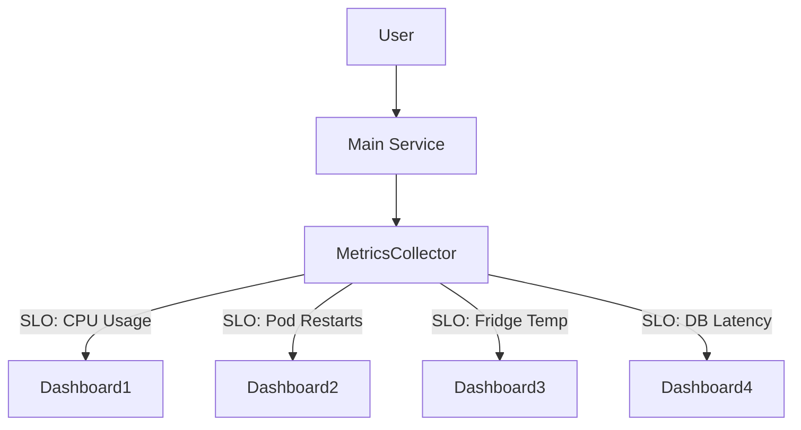
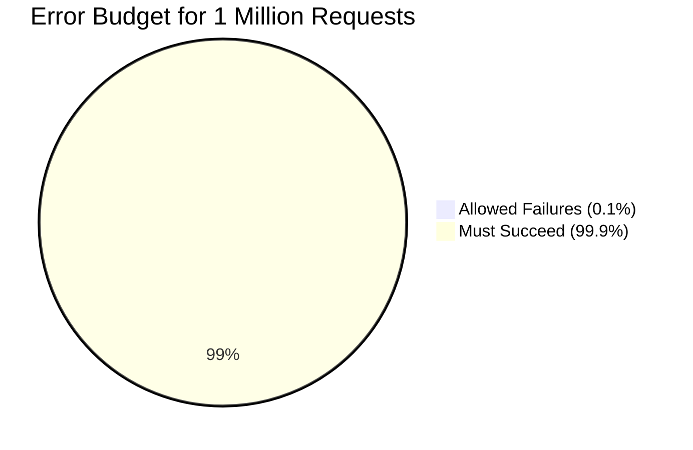

# 🧵 The Tale of Sam and the SLO Jungle

### 📘 Beginner Teach Story: SLO Foundations

---

## 🧙‍♂️ Characters

- **Sam**: Overwhelmed junior dev, assumes more metrics = better engineer.
- **Alex**: Senior dev, weary guardian of uptime and common sense.

---

## 🌪️ Scene 1: The Metric Tsunami

Sam stared at the observability dashboard. It blinked back like a Christmas tree going through a nervous breakdown.

> *"Okay, I’ll just grab every metric ever created and start defining SLOs. That’s what good engineers do, right?"*  
> — *Sam, confidently walking into a data swamp*

They set up SLOs for:
- CPU usage
- Pod restarts
- Cache hits
- Internal gRPC retries
- ...and yes, the breakroom fridge temperature

---

## 🧠 Visual: System Over-Instrumentation



---

## 🧓 Scene 2: Enter the Mentor

Alex strolls in like a DevOps wizard who’s seen too many 2 AM alerts.

> "You're not building a dashboard. You're building a shrine to chaos."

Sam blinked, unsure if that was a compliment.

---

## 📏 Understanding the Basics

| Term | Meaning |
|------|---------|
| **SLI** (Service Level Indicator) | The measured metric (e.g., request latency) |
| **SLO** (Service Level Objective) | The target for that metric (e.g., 99.9% of requests < 300ms) |
| **SLA** (Service Level Agreement) | A legal/business commitment, with penalties |

---

## 🧮 Error Budgets: Permission to Be Human

> *"So wait… if our SLO is 99.9%, that means we can fail 0.1% of the time and still be okay?"*  
> — Sam, beginning to grasp the point

### 🐍 Python Example

```python
# Calculate allowed request failures for a given SLO
total_requests = 1_000_000
target_success_rate = 0.999

allowed_failures = total_requests * (1 - target_success_rate)
print(f"You can fail {allowed_failures:.0f} requests without breaking your SLO.")
```

**Output:**
```
You can fail 1000 requests without breaking your SLO.
```

---

## 📊 Visual: Error Budget Breakdown



---

## 🧠 Pro Tips from Alex

- Don’t pick 100% as your SLO. That’s not reliability, that’s denial.
- Start with **your historical baseline** (e.g., if you’re hitting 99.7%, aim for 99.8%).
- Focus on **user-facing pain** (latency, availability, errors).
- Resist the urge to define an SLO for *everything*. You are not the Lord of the Metrics.

---

## ✅ Good Starter SLIs

| Metric | Why it Matters |
|--------|----------------|
| Request Latency | Users hate waiting |
| Availability | Downtime ≠ happy users |
| Error Rate | More errors = more problems |
| Throughput | Is the system keeping up? |

---

## 🧵 Moral of the Story

Sam eventually pruned their bloated dashboard. They chose *three* meaningful SLIs. They even built an alerting system that didn’t scream every 15 minutes.

> "Fewer metrics, better focus, fewer 3 AM pages."  
> — *Alex, possibly smiling for the first time in months*

Sam learned: **SLOs aren’t about measuring everything. They’re about measuring what matters.**

---

> 👾 *Now go forth, ye metric hoarder, and build your SLOs with intention.*

