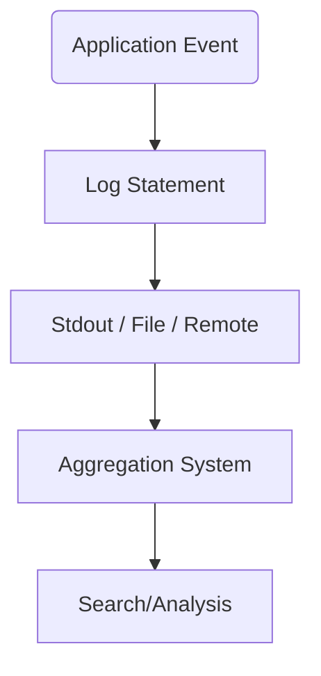
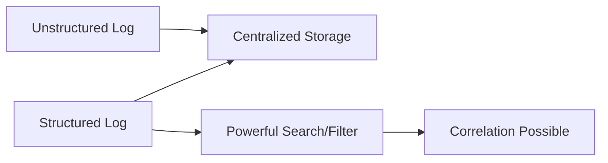

**Day 3—let’s get even more real.**  
Welcome to the world of logs, noise, context, and “what the hell happened?”  
Today is Asha’s day—our structured beginner and the patron saint of asking the questions everyone else is afraid to.

---

# 🧱 **Day 3: Structured Logging**

**Character:** Asha – Nairobi  
**Style:** Relatable, thorough, and fearless about “stupid” questions.  
**Vibe:** “If it’s not searchable, it’s not usable. If it’s not structured, it’s just noise.”

---

## 🎯 Learning Objectives

### 🔍 Beginner
- Understand what logs are (and aren’t)
- Distinguish between structured and unstructured logs

### 🧩 Intermediate
- Implement log context enrichment (IDs, request info)
- Build basic log pipelines (e.g., Fluentd/OpenSearch concepts)

### 💡 SRE-Level
- Design a scalable log aggregation and analysis workflow
- Correlate logs with metrics/traces for root cause analysis

---

## 💥 Incident Hook: “The Mystery of the Missing Request”

> “A user claims their payment vanished. App logs? Scattered across servers, full of `INFO: Payment processed`. But the user never got a receipt, and we don’t know where it broke. I realized—logging is only helpful when you can search, correlate, and *trust* it.”

---

## 🧠 Core Concepts

### 🔹 What is a Log? (And Why Should You Care)



**Key Point:**  
Logs are the narrative of your system. But a diary written in 12 different languages? Useless in a crisis.

---

### 🔹 Structured vs. Unstructured Logs



- **Unstructured:** `"Payment processed for user 1234"`
- **Structured:** `{"event": "payment_processed", "user_id": 1234, "amount": 25.50}`

---

### 🔹 Context Enrichment

Add request IDs, trace IDs, user, or session info:

```json
{
  "timestamp": "2024-04-15T09:12:31Z",
  "level": "INFO",
  "event": "payment_processed",
  "user_id": 1234,
  "request_id": "abcd-1234",
  "trace_id": "xyz-9999"
}
```

---

### 🔹 Log Pipeline (No Install, Just the Concept)


---

## 🧪 Simulation Exercise

- You receive **two log files**:
    - `server1.log`: unstructured, mixed levels
    - `server2.log`: structured JSON, includes `request_id`

**Scenario:**  
A payment fails but only on *some* requests.

📌 **Task:**
- How do you trace a failed transaction?
- What would make this *impossible* in the unstructured logs?
- What queries would you run in OpenSearch?

---

## 🛠️ Tool Concepts

### Logging Library Example (Python, structlog):

```python
import structlog

log = structlog.get_logger()
log.info("payment_processed", user_id=1234, amount=25.50, request_id="abcd-1234")
```

### Log Pipeline Concept

- **Fluentd/Fluentbit**: Collect logs from all nodes
- **OpenSearch/Elasticsearch**: Store, index, and search logs
- **Kibana/Grafana**: Visualize and analyze

No cluster required—*focus is on flow, not deployment*.

---

## 🕳️ Common Pitfalls

- Relying on plain text logs for distributed systems
- Inconsistent log fields across services (“userId”, “user_id”, “uid”)
- Not capturing request/trace IDs
- Log “noise” (info-level spam with no value)

---

## 📜 Asha’s Commandments

1. “If your logs can’t be searched, they don’t exist.”
2. “Structure logs from day one. Retrofitting is agony.”
3. “Correlate logs with metrics and traces or you’ll miss the story.”

---

## 🤝 Handoff to Tomorrow

> “Mina’s next. She’ll take your beautiful logs and metrics and show you how tracing weaves the true story—across every service hop and failure.”

---

## 📦 Artifacts for Day 3

- ✅ Mermaid diagrams:
    - Log flow
    - Structured vs. unstructured
    - Pipeline
- ✅ Sample structured log output
- ✅ Python code snippet
- ✅ Simulation scenario
- ✅ Tiered objectives + pitfalls + commandments

