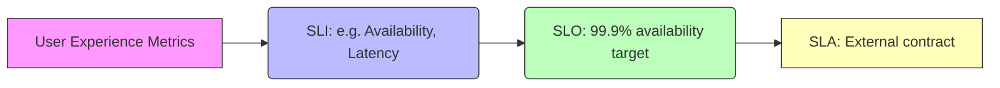
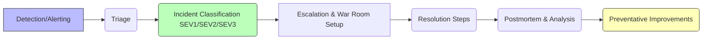
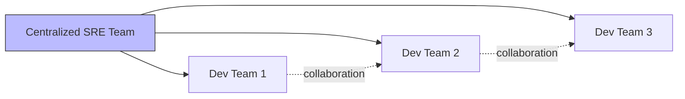
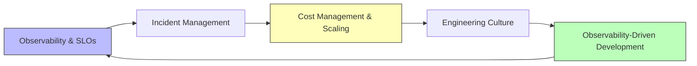

Below is a comprehensive Day 3 training module on **Operationalizing Observability & Advanced SRE Practices**, built entirely from the attached prompt’s requirements. It is structured with tiered guidance (🔍 Beginner, 🧩 Intermediate, and 💡 Advanced/SRE), detailed examples, case studies, diagrams (using Mermaid), and placeholders for code examples and YouTube videos. The writing style is that of an experienced SRE leader, balancing technical depth, organizational strategy, and practical implementation guidance.

---

# **Day 3 Training Module: Operationalizing Observability & Advanced SRE Practices**

> **Target Audience**: Production support professionals (ages 23-58) with 2-20 years of experience transitioning to SRE roles, having completed Day 1 (Observability Foundations) and Day 2 (Practical Implementation).

> **Primary Goals**  
> - Establish meaningful **SLOs** (Service Level Objectives) with error budgets  
> - Implement structured **Incident Management** practices  
> - Scale observability cost-effectively  
> - Foster a **Reliability-Focused Engineering Culture**  
> - Integrate **Observability-Driven Development** into day-to-day workflows  
> - Tie everything together into a **Comprehensive SRE Practice**

---

## **1. Introduction: From Implementation to Operationalization (10%)**

### **1.1 Recap of Days 1-2 and Observability Journey**
Over the past two days, you have learned foundational observability concepts (metrics, logs, traces) and implemented basic practices to capture system signals. You also gained hands-on experience with dashboards, alerts, and distributed tracing to get a 360° view of your services.

Today, we will **operationalize** these observability capabilities by placing them within a broader Site Reliability Engineering (SRE) framework. This involves applying **SLIs, SLOs, SLAs, error budgets,** and structured incident management processes, all while focusing on cost optimization and building a culture that values reliability from design through production.

### **1.2 SRE Mindset Beyond Tooling**
Site Reliability Engineering is more than just monitoring and alerting. It’s a set of **cultural** and **engineering** practices that aim to:
- Systematically **measure** and **manage** reliability (via SLOs and error budgets)
- **Reduce toil** and operational overhead through automation
- Ensure **continuous learning** from incidents and improvements
- Align operational priorities with **business objectives** and **user experience**

### **1.3 The Operationalization Process**
Moving from initial observability setup to fully operationalized SRE involves:
1. **People** – Training teams, establishing SRE roles/responsibilities, on-call processes, and cultural shifts  
2. **Process** – Defining SLOs, error budgets, incident management, postmortem frameworks, and continuous improvement loops  
3. **Technology** – Solidifying your observability stack, ensuring it scales, automating data collection, and integrating real-time analytics

### **1.4 Organizational Maturity Stages**
- **Stage 1**: Reactive Monitoring (basic alerts, manual response)  
- **Stage 2**: Observability Foundation (logs, metrics, traces well-integrated)  
- **Stage 3**: SLO Adoption (clear reliability targets and error budgets)  
- **Stage 4**: Continuous Improvement (postmortems, blameless culture, advanced incident management)  
- **Stage 5**: Mature SRE Practice (SLO-driven planning, broad reliability culture, enterprise-level governance)

### **1.5 Key SRE Concepts: SLIs, SLOs, SLAs, Error Budgets**
- **SLI (Service Level Indicator)**: A measurable metric that indicates your service’s health/performance (e.g., request latency, availability).  
- **SLO (Service Level Objective)**: The target or goal you wish to achieve for that SLI (e.g., “99.9% of requests served in under 300ms”).  
- **SLA (Service Level Agreement)**: An external, contractual commitment tied to penalties if not met (often sets lower reliability targets than internal SLOs).  
- **Error Budget**: The margin by which you can afford to fail an SLO before corrective actions are triggered (e.g., if your SLO is 99.9% availability, the 0.1% downtime is your “budget”).

### **1.6 Learning Objectives**
By the end of this module, you will be able to:
1. **Establish and refine SLOs** using observability data  
2. **Implement and evolve incident management** practices (on-call, postmortems, automation)  
3. **Scale observability** while managing costs and complexity  
4. **Foster a reliability-focused culture** within your organization  
5. **Apply observability-driven development** practices in CI/CD pipelines  
6. **Plan and execute** a comprehensive, multi-day SRE transformation journey  

**📺 YouTube Video Placeholder: {{VIDEO_LINK_INTRO}}**  
*Keywords: “SRE practices introduction”, “observability operationalization”, “reliability engineering culture”, “SLO SLI SLA basics”, “error budget fundamentals”, “SRE organizational maturity”*

---

## **2. Establishing Service Level Objectives (SLOs) (20%)**

Service Level Objectives are the backbone of SRE, translating raw observability data (SLIs) into actionable, user-centric targets. This section is divided into three tiers:

---

### **2.1 🔍 Beginner Level: SLO Foundations**
1. **Defining SLIs from Observability Data**  
   - **Example**: If you have a web service, an SLI might be *Latency* (95th percentile < 300 ms) or *Availability* (number of successful requests / total requests).  
   - **Key Practice**: Identify user-facing metrics that matter most for the service experience.

2. **Establishing Meaningful SLO Targets**  
   - **Approach**: Start with a baseline (historical performance) and aim for incremental improvements.  
   - **Example**: If your baseline availability is ~99.7%, set an initial SLO at 99.7% or slightly higher (99.8%) to drive improvements.

3. **Relationship Between SLIs, SLOs, and SLAs**  
   - *SLI* = Measured metric (e.g., latency).  
   - *SLO* = Target threshold for the SLI (e.g., 99.9% of requests < 300 ms).  
   - *SLA* = External contract derived from SLO, typically with financial/legal consequences.

4. **Implementing Basic SLO Measurement**  
   - Leverage existing metrics from your monitoring system (e.g., Prometheus).  
   - Calculate success/failure events.  
   - Aggregate and display in SLO dashboards.

5. **Introduction to Error Budgets**  
   - The difference between 100% reliability and your SLO target.  
   - **Action**: If you exceed your error budget (too many failures), shift engineering efforts toward reliability fixes.

---

### **2.2 🧩 Intermediate Level: Advanced SLO Implementation**
1. **Designing Multi-Dimensional SLOs**  
   - Consider multiple facets (latency + error rate + throughput).  
   - **Example**: “99.95% of requests must respond within 200 ms, 99% within 100 ms for premium customers.”

2. **Implementing SLO-Based Alerting**  
   - **Strategy**: Alert only when the **error budget consumption** surpasses a certain threshold or is trending toward breach.  
   - Reduces alert fatigue compared to static threshold alerts.

3. **Error Budget Policies and Consumption Tracking**  
   - Define policies: e.g., “If error budget > 50% consumed in 10 days, freeze new feature launches.”  
   - **Implementation**: Track error budget depletion daily or in near real-time.

4. **SLO Dashboards and Reports**  
   - Consolidate SLO metrics and error budget usage in a single dashboard.  
   - Provide weekly or monthly reliability reports to stakeholders.

5. **Balancing Reliability and Feature Velocity**  
   - **Key Principle**: Error budgets act as a control valve—when reliability dips, slow down new features to fix issues.

---

### **2.3 💡 Advanced/SRE Level: Enterprise SLO Frameworks**
1. **Building Organizational SLO Frameworks and Templates**  
   - Standardize the definition and calculation of SLOs across teams.  
   - Provide self-service SLO creation tools.

2. **Tier-Based SLOs for Different Service Criticality**  
   - Tier 1 (Mission-Critical): 99.99% availability, Tier 2: 99.9%, Tier 3: 99.5%, etc.  
   - Allocates resources and error budgets according to business impact.

3. **Advanced Error Budget Management and Decision Frameworks**  
   - Automatic gating of deployments based on budget consumption.  
   - Correlate error budget consumption with business metrics (revenue, user churn).

4. **SLO-Driven Capacity Planning and Predictive Reliability**  
   - Use historical SLO data to forecast traffic spikes and allocate capacity.  
   - Combine SRE practices with capacity planning to avoid firefighting.

5. **SLO Governance and Continuous Improvement**  
   - Establish a review process (monthly or quarterly) to update SLO targets.  
   - Evolve SLOs as user expectations and system architecture change.

---

### **2.4 Code Examples: Basic SLO Calculation in Python**

```python
import time
import random

# Simulated availability data
total_requests = 10000
failed_requests = 0

for i in range(total_requests):
    # random chance of failure
    if random.random() < 0.001:  
        failed_requests += 1

sli_availability = 1 - (failed_requests / total_requests)

# Example SLO target (e.g., 99.9% availability)
slo_target = 0.999
error_budget = 1 - slo_target

print(f"SLI (Availability) = {sli_availability*100:.3f}%")
print(f"SLO Target = {slo_target*100:.3f}%")
print(f"Error Budget = {error_budget*100:.3f}%")

# Evaluate if we are within the error budget
if sli_availability < slo_target:
    print("SLO breached! Investigate and prioritize reliability work.")
else:
    print("SLO met! Continue normal operations.")
```

**Configuration Snippet** (Prometheus + Alertmanager for SLO-based alerting):
```yaml
groups:
  - name: SLOAlerts
    rules:
      - alert: HighErrorBudgetConsumption
        expr: (sum(rate(http_requests_failed[5m])) / sum(rate(http_requests_total[5m]))) > 0.001
        for: 10m
        labels:
          severity: warning
        annotations:
          description: "Error budget consumption is too high, investigate potential SLO breach."
```

---

### **2.5 Diagram: SLI/SLO/SLA Relationship**



---

### **2.6 Example Exercises**
1. **Identify Your SLIs**: Pick a key service and define 2-3 SLIs that reflect user experience.  
2. **Set an SLO**: Establish a baseline target. Justify why you chose that number (e.g., historical data, user expectations).  
3. **Create an Error Budget Policy**: Outline a simple policy that dictates development slowdowns if the error budget is consumed too quickly.

**📺 YouTube Video Placeholder: {{VIDEO_LINK_SLO_IMPLEMENTATION}}**  
*Keywords: “implementing SLOs”, “SLI metrics selection”, “error budget calculation”, “SLO dashboard creation”, “multi-dimensional SLOs”, “SLO-based alerting”, “error budget policy examples”, “SLO measurement Python”, “reliability metrics”*

---

## **3. Implementing Incident Management Practices (20%)**

When things go wrong—inevitably—they should be handled with speed, clarity, and a drive to learn. This section guides you through basic to advanced incident management practices.

---

### **3.1 🔍 Beginner Level: Foundations of Incident Response**
1. **Setting Up Basic Incident Detection**  
   - Integrate your observability tools (logs, metrics, traces) with an alerting system (e.g., PagerDuty, Opsgenie).  
   - Classify incidents by severity (SEV1, SEV2, etc.).

2. **Incident Severity Levels and Response Procedures**  
   - Define clear severity levels and corresponding SLAs for response and resolution times.  
   - Example: **SEV1** - critical production outage, response < 5 minutes, resolution < 1 hour.

3. **Basic Incident Documentation and Communication**  
   - Use a shared incident channel or war room.  
   - Document timelines, triggers, impacted services, and resolution steps.

4. **On-Call Rotations and Escalations**  
   - Rotate on-call duties across team members.  
   - Escalate to more experienced staff or management if an incident is not resolved within a predefined time.

5. **Introduction to Incident Postmortems**  
   - Collect data on what went wrong, how it was fixed, and how to prevent recurrence.  
   - Emphasize blamelessness to encourage transparency.

---

### **3.2 🧩 Intermediate Level: Advanced Incident Management**
1. **Observability-Driven Incident Response Playbooks**  
   - Pre-define steps for common incidents (e.g., memory leaks, database overload).  
   - Link specific alerts to relevant runbooks.

2. **Automated Incident Detection and Triage**  
   - Use anomaly detection or ML-based solutions to identify unusual metrics.  
   - Auto-assign incidents to relevant teams or individuals.

3. **Advanced Communication and Coordination Patterns**  
   - Streamlined war room management, real-time dashboards, quick escalation paths.  
   - Automate Slack/Teams channels creation for each new incident.

4. **Data-Driven On-Call Load Balancing**  
   - Track on-call incidents per person.  
   - Rotate and balance so no single engineer is overloaded.

5. **Structured Blameless Postmortems**  
   - Focus on root causes, not scapegoats.  
   - Identify systematic improvements to reduce future incidents.

---

### **3.3 💡 Advanced/SRE Level: Enterprise Incident Engineering**
1. **Building an Incident Management Platform**  
   - Integrate detection, alerting, triage, chat, postmortems, and reporting into a cohesive system.  
   - Provide self-service capabilities for new SRE teams.

2. **Advanced Incident Analytics and Trend Identification**  
   - Use historical data to identify recurring incident patterns.  
   - Correlate incidents with code deployments, config changes, or third-party dependencies.

3. **Game Days, Chaos Engineering, and Proactive Failure Testing**  
   - Regularly simulate outages in a controlled environment.  
   - Train teams and refine playbooks to handle real incidents more effectively.

4. **Long-Term Incident Data Analysis for System Improvement**  
   - Prioritize resilience improvements based on the frequency and severity of past incidents.  
   - Justify reliability investments to leadership with quantitative data.

5. **Building Organizational Learning from Incidents**  
   - Encourage knowledge sharing across teams.  
   - Create a library of resolved incidents and apply insights to design reviews.

---

### **3.4 Code Examples: Automated Incident Detection**

```python
import requests
import time

THRESHOLD_LATENCY = 0.2  # 200ms
CHECK_INTERVAL = 60      # seconds

def get_average_latency():
    # Hypothetical endpoint to retrieve average latency from your metrics system
    response = requests.get("http://metrics.company.com/api/latency")
    data = response.json()
    return data.get("average_latency", 0)

while True:
    avg_latency = get_average_latency()
    if avg_latency > THRESHOLD_LATENCY:
        # Trigger incident via your incident management tool
        print(f"ALERT: Average latency high at {avg_latency}s. Triggering incident.")
        # (Integration code to raise an incident ticket or notify on-call)
    time.sleep(CHECK_INTERVAL)
```

**Incident Tracking Snippet** (YAML example):

```yaml
incident_management:
  severity_levels:
    SEV1:
      response_time: 5m
      resolution_time: 1h
      escalation: immediate
    SEV2:
      response_time: 15m
      resolution_time: 4h
      escalation: 1h
  postmortem_required: true
  war_room: 
    tool: Slack
    auto_create_channel: true
```

---

### **3.5 Diagram: Incident Management Workflow**



---

### **3.6 Example Exercises**
1. **Create an On-Call Rotation**: Outline a weekly schedule for your team, including escalation paths.  
2. **Draft an Incident Playbook**: Write a short runbook for a common incident (e.g., high CPU usage).  
3. **Conduct a Blameless Postmortem**: Use a hypothetical scenario to practice postmortem documentation and facilitation.

**📺 YouTube Video Placeholder: {{VIDEO_LINK_INCIDENT_MANAGEMENT}}**  
*Keywords: “observability incident response”, “SRE on-call best practices”, “incident severity classification”, “incident management automation”, “blameless postmortems”, “incident communication patterns”, “game day exercises”, “chaos engineering basics”, “incident analysis techniques”*

---

## **4. Scaling Observability and Cost Management (15%)**

As systems grow in complexity, the volume of observability data explodes. Properly managing these costs and ensuring the observability platform scales is essential for sustainable SRE.

---

### **4.1 🔍 Beginner Level: Observability Cost Basics**
1. **Understanding Observability Costs**  
   - Storage, data processing, licensing, and egress all factor into costs.  
   - Common cost drivers include logs, high-cardinality metrics, and infinite data retention.

2. **Basic Cost-Benefit Analysis**  
   - Evaluate the usefulness of data vs. the cost to store and process it.  
   - Example: “Keeping 90 days of logs might be overkill if only 7 days are needed for investigations.”

3. **Data Sampling and Retention Policies**  
   - Sample logs or traces at a fixed rate to reduce ingestion.  
   - Set distinct retention periods for high-value vs. low-value data.

4. **Observability Data Lifecycle Management**  
   - Archive older data to cheaper storage tiers.  
   - Automate deletion of data past retention to comply with governance.

---

### **4.2 🧩 Intermediate Level: Advanced Cost Optimization**
1. **Tiered Observability Approaches**  
   - Tier 1 (Critical Systems): More frequent sampling, longer retention.  
   - Tier 3 (Non-Critical): Lower frequency or short retention.

2. **Advanced Sampling Strategies**  
   - Dynamic sampling based on error rate or request volumes.  
   - E.g., “Sample 100% of error traces, but only 10% of successful requests.”

3. **Data Compression and Aggregation**  
   - Summarize logs into daily or hourly aggregates.  
   - Only keep full granularity data for mission-critical issues.

4. **Cost Allocation and Chargeback Models**  
   - Make each team aware of their observability usage costs.  
   - Internal “showback” or “chargeback” fosters accountability.

---

### **4.3 💡 Advanced/SRE Level: Enterprise Observability Economics**
1. **Building Observability Platforms as Internal Services**  
   - Offer logs, metrics, tracing as a self-service platform with usage dashboards.  
   - Align cost with usage so teams optimize their consumption.

2. **Advanced Cost Modeling and Optimization Frameworks**  
   - Predict usage growth based on product roadmaps.  
   - Evaluate ROI of advanced analytics features (AIOps, ML-based anomaly detection).

3. **Implementing Observability Governance and Standards**  
   - Approve new instrumentation or custom metrics only if they meet guidelines.  
   - Periodic audits to retire obsolete or unneeded data streams.

4. **Cost-Aware Observability Architecture Patterns**  
   - Leverage open-source solutions or managed services with dynamic scaling.  
   - Offload cold data to cheaper storage (e.g., Amazon S3 Glacier).

---

### **4.4 Diagram: Cost Optimization Framework**

```mermaid
flowchart LR
    A[Observability Data Sources (Logs, Metrics, Traces)] --> B[Data Collection Layer]
    B --> C[Sampling & Aggregation Strategies]
    C --> D[Retention Policies & Archival]
    D --> E[Dashboards & Analysis]
    E --> F[Cost Reporting & Chargeback]
    style A fill:#bbf,stroke:#333,stroke-width:1px
    style F fill:#ffb,stroke:#333,stroke-width:1px
```

---

### **4.5 Example Exercises**
1. **Perform a Log Retention Analysis**: Determine how much data you truly need to store for 30 days vs. 7 days.  
2. **Create a Sampling Configuration**: Implement a dynamic sampling policy for high-traffic endpoints.  
3. **Calculate Observability ROI**: Estimate the cost per month of your current observability stack vs. the value of reduced MTTR.

**📺 YouTube Video Placeholder: {{VIDEO_LINK_SCALING_COST}}**  
*Keywords: “observability cost management”, “scaling observability infrastructure”, “observability data sampling”, “log retention optimization”, “trace sampling strategies”, “observability as a service”, “metrics storage optimization”, “observability data lifecycle”, “observability governance”*

---

## **5. Developing Reliability-Focused Engineering Culture (15%)**

SRE practices flourish when embedded in a culture that values reliability, collaboration, and continuous improvement. This section walks through cultural transformations from beginner to advanced.

---

### **5.1 🔍 Beginner Level: Introduction to Reliability Culture**
1. **Understanding Cultural Aspects of SRE Adoption**  
   - Reliability is everyone’s job, not just the SRE team’s.  
   - Encouraging open discussion about incidents and improvements.

2. **Balancing Reliability and Feature Development**  
   - Use error budgets to prioritize reliability when needed.  
   - Foster empathy between SRE and development teams.

3. **Measuring and Improving Toil Reduction**  
   - **Toil**: Repetitive operational work that doesn’t provide enduring value.  
   - Automate or eliminate high-toil tasks to free engineers for higher-value work.

4. **Cross-Functional Collaboration**  
   - Pairing or rotating engineers across dev, QA, and SRE roles.  
   - Encourage knowledge-sharing sessions and joint design reviews.

---

### **5.2 🧩 Intermediate Level: Maturing SRE Culture**
1. **Implementing SRE Team Models**  
   - **Embedded Model**: SREs sit within product teams.  
   - **Centralized Model**: SRE as a separate team consulting across the org.  
   - **Hybrid Model**: Combination of both, with a central SRE function plus embedded SRE champions.

2. **Production Readiness Reviews (PRRs)**  
   - Formal checklist to ensure services meet reliability standards before launch.  
   - Include capacity plans, alerting strategies, runbooks, and SLO definitions.

3. **Developer Onboarding to Observability and Reliability**  
   - Provide training on instrumentation best practices and how to interpret metrics.  
   - Encourage dev teams to “build for observability” from the start.

4. **Communities of Practice**  
   - Create an internal reliability or SRE guild for best-practice sharing.  
   - Regular meetups to discuss new tools, approaches, and lessons learned.

---

### **5.3 💡 Advanced/SRE Level: Organizational Transformation**
1. **Scaling SRE Practices Across Large Orgs**  
   - Formal SRE charters, leadership buy-in, dedicated budgets.  
   - Align reliability goals with top-level business objectives.

2. **SRE as a Competitive Advantage**  
   - Use reliability as a differentiator in the marketplace.  
   - Public SLAs or reliability reports can build trust with customers.

3. **Executive Engagement and Reliability Leadership**  
   - Present reliability metrics (SLO compliance, incident rate) to executives regularly.  
   - Secure resources for long-term reliability initiatives.

4. **Long-Term Measurement of SRE Transformation**  
   - Track reliability improvements (mean time to recovery, error budget compliance) over quarters/years.  
   - Evaluate employee satisfaction, retention, and skill growth.

---

### **5.4 Diagram: SRE Team Interaction Models**



---

### **5.5 Example Exercises**
1. **Reliability Culture Readiness Quiz**: Assess your organization’s current culture (collaboration, blameless postmortems, etc.).  
2. **Create a Production Readiness Checklist**: Develop a simple PRR for a new microservice.  
3. **Map Out SRE Responsibilities**: Define how your SRE team interacts with other departments and the development lifecycle.

**📺 YouTube Video Placeholder: {{VIDEO_LINK_SRE_CULTURE}}**  
*Keywords: “SRE culture adoption”, “reliability engineering teams”, “production readiness review”, “toil reduction strategies”, “SRE collaboration patterns”, “scaling SRE practices”, “SRE maturity assessment”, “DevOps to SRE transition”, “reliability leadership”*

---

## **6. Observability-Driven Development and Testing (10%)**

Shifting observability to the left ensures that reliability is considered early in the development lifecycle.

---

### **6.1 🔍 Beginner Level: Observability in Development**
1. **Shifting Left with Observability**  
   - Instrument services in dev/test environments.  
   - Build basic metrics into integration tests (e.g., check response times).

2. **Implementing Observability Testing in CI/CD**  
   - Run load tests as part of continuous integration, collecting performance metrics.  
   - Validate that SLO thresholds aren’t violated by new changes.

3. **Principles of Testable and Observable System Design**  
   - Use structured logs, metrics, and correlation IDs in dev.  
   - Ensure testers can see system internals to diagnose issues early.

---

### **6.2 🧩 Intermediate Level: Advanced Observability Engineering**
1. **Observability-Driven Development (ODD) Practices**  
   - Write unit/integration tests that validate telemetry output.  
   - Ensure instrumentation is consistent and standardized across codebases.

2. **Synthetic Testing and Monitoring**  
   - Continuously run synthetic transactions in staging/production to detect performance regressions.  
   - Use canary releases with strong observability to detect issues early.

3. **Pre-Production Reliability Testing Frameworks**  
   - Automated chaos experiments on staging environments.  
   - Validate fallback and self-healing mechanisms under stress.

---

### **6.3 💡 Advanced/SRE Level: Reliability Engineering by Design**
1. **SRE Involvement in Architecture and Design**  
   - Consult with design teams early to ensure reliability best practices.  
   - Evaluate proposals for potential reliability pitfalls.

2. **Chaos Engineering and Resilience Testing**  
   - Proactively inject failures to discover weaknesses in real-time.  
   - Example: Randomly kill pods or degrade network to simulate partial outages.

3. **Observability Platforms for Development Environments**  
   - Provide real-time feedback loops for developers.  
   - Use ephemeral test environments that replicate production-level observability.

---

### **6.4 Diagram: Observability-Driven Development Flow**

```mermaid
flowchart LR
    A[Code & Instrumentation] --> B[CI Pipeline (Tests + Metrics)]
    B --> C[Staging Environment (Synthetic Tests, Chaos Engineering)]
    C --> D[Continuous Feedback to Devs]
    D --> E[Production Deploy with SLO Guarantees]
    style A fill:#bbf,stroke:#333,stroke-width:1px
    style E fill:#bfb,stroke:#333,stroke-width:1px
```

---

### **6.5 Example Exercises**
1. **Add Observability to a CI Test**: Instrument a sample microservice to emit metrics and validate them in CI.  
2. **Run a Synthetic Monitoring Check**: Set up synthetic checks for your staging environment.  
3. **Plan a Chaos Experiment**: Choose a small system or service to test resilience.

**📺 YouTube Video Placeholder: {{VIDEO_LINK_ODD}}**  
*Keywords: “observability driven development”, “shift left monitoring”, “CI/CD observability”, “synthetic monitoring”, “pre-production reliability testing”, “chaos engineering implementation”, “resilience testing”, “testable system design”, “observable architecture patterns”*

---

## **7. Capstone: Building and Evolving Comprehensive SRE Practice (10%)**

This final section ties together all previous sections into an end-to-end SRE practice, from initial setup to ongoing improvement.

---

### **7.1 End-to-End SRE Practice Implementation Case Study**

#### **Scenario**
You have a microservices-based e-commerce platform experiencing frequent reliability incidents during peak traffic. You’re tasked with establishing an SRE framework to transform how the organization handles reliability.

#### **Key Components**  
1. **Define SLOs** for checkout latency and availability.  
2. **Set up advanced incident management** with real-time alerting and war rooms.  
3. **Implement cost management** for high-volume logs during major sales events.  
4. **Foster reliability culture** by embedding SREs into cross-functional teams.  
5. **Adopt observability-driven development** to catch performance regressions early.

#### **Implementation Roadmap**  
1. **Stage 1**: SLO definitions and error budget policies.  
2. **Stage 2**: Formal on-call rotation, structured postmortems, and advanced incident triage.  
3. **Stage 3**: Observability scaling with dynamic sampling, tiered data retention policies.  
4. **Stage 4**: Reliability culture initiatives—regular training, production readiness reviews.  
5. **Stage 5**: Shift-left with chaos testing in staging, advanced SLO-based capacity planning.

#### **Measuring Success**  
- **Incident Reduction**: Down by 40% after 6 months.  
- **MTTR**: Improved from an average of 45 minutes to 15 minutes.  
- **Cost Savings**: 25% reduction in monthly log ingestion costs.  
- **Employee Engagement**: SRE approach attracted more engineers and improved cross-team collaboration.

---

### **7.2 Tiered Implementation Roadmap for Different Organization Sizes**
- **Small Startups**: Focus on single, critical SLO. Build simple incident process.  
- **Mid-Sized Orgs**: Introduce tiered SLOs, advanced cost management, partial chaos engineering.  
- **Enterprises**: Formal SRE teams, broad SLO governance, enterprise-level reliability transformations, self-service SRE platforms.

---

### **7.3 Measuring SRE Practice Success**
- **Reliability Metrics**: SLO compliance, error budget usage, incident counts, MTTR.  
- **Cultural Indicators**: Blameless postmortems, developer involvement in on-call, reduction in toil.  
- **Business Impact**: Customer satisfaction, revenue protection, brand reputation for reliability.

---

### **7.4 Diagram: Integrated SRE Practice**



---

## **Required “SRE Practice Case Studies”**

Below are four **detailed 500-word** case studies illustrating real-world scenarios:

---

### **SLO Implementation Case Study (500+ words)**

> **Case: Retail Payment Gateway Modernization**

An international e-commerce company struggled with inconsistent payment processing times, which led to high user dissatisfaction and cart abandonment. Although they had traditional monitoring in place, they lacked clear SLOs. The newly formed SRE team initiated a project to define and implement SLOs across their payment microservices.

First, they interviewed stakeholders to identify **user-centric SLIs**. Payment success rates, latency to confirm a transaction, and refund processing times emerged as top priorities. Leveraging their existing observability stack (Prometheus + Grafana), they set up dashboards displaying current performance baselines. These baselines informed the **initial SLO targets**. For instance, they set a 99.95% success rate target, with 99% of successful payments to be processed within 2 seconds.  

They introduced **error budgets** to shift the team’s mindset from chasing 100% reliability to a more balanced approach. A 0.05% budget for errors translated into engineering teams focusing on reliability once the budget dropped below 50%. This meant if repeated timeouts or latency spikes consumed the budget too quickly, new features were paused to stabilize performance. Developers initially pushed back, fearing “feature freeze,” but soon recognized that a structured error budget policy **protected** them from chaotic last-minute changes and unplanned crises.

Over the next quarter, the SRE team built **multi-dimensional SLOs** to differentiate between standard and premium transactions (e.g., premium customers had tighter performance targets). Additionally, they **integrated SLO-based alerting**, so the system warned teams only when error budget consumption outpaced acceptable limits. This reduced alert fatigue by eliminating alarms triggered by minor fluctuations.  

As they matured, an **SLO governance board** was established, including product managers, SREs, and software engineers. This board reviewed monthly performance, adjusted targets, and evaluated new SLIs based on user feedback and business priorities. This governance model accelerated the organization’s ability to adapt to seasonal surges or promotional events when transaction volumes skyrocketed.  

One major challenge was ensuring the **observability data was accurate and consistent** across various services. They faced instrumentation inconsistencies, which initially undermined trust in the SLO dashboards. The SRE team implemented a standardized instrumentation framework (common logging patterns, consistent metrics naming). Additionally, they introduced an **SLO template**—a YAML-based configuration that any team could use to define or modify SLOs for their microservices.  

Over six months, the payment gateway’s **average transaction time** decreased from 4 seconds to 1.8 seconds for standard customers and 1.2 seconds for premium customers. The **SLO compliance** for payment success rates consistently hovered around 99.96-99.97%. The **error budget** approach also influenced release cadences: teams who effectively managed their budgets were able to ship features faster, while teams that frequently breached SLOs worked closely with SREs on reliability improvements.  

Ultimately, the organization’s overall reliability posture improved significantly. The culture shifted from purely reactive monitoring toward **proactive reliability engineering**, driven by measurable SLOs. This success story not only reduced cart abandonment rates—boosting revenue by an estimated 5%—but also showcased how **structured SLO frameworks** can transform both the technical performance of services and the day-to-day work culture of engineering teams. The executive leadership recognized SLO achievements in quarterly business reviews, solidifying the role of SRE as a **key business enabler** rather than just an operational overhead.

---

### **Incident Management Evolution Case Study (500+ words)**

> **Case: Multimedia Streaming Platform’s Incident Turnaround**

A medium-sized multimedia streaming platform saw a spike in user churn whenever service outages occurred during live events. Their incidents were managed ad-hoc, leading to slow recovery times and minimal post-incident learning. The new SRE team was chartered to overhaul the **incident management** process.

In the **beginner stage**, they started by **classifying incidents** (SEV1 for critical outages, SEV2 for quality degradation, SEV3 for minor bugs) and setting **basic response protocols**. They integrated existing monitoring tools (Datadog, Elasticsearch) with PagerDuty to ensure immediate alerts for critical issues. This alone reduced time-to-acknowledge by 60%, as the correct on-call engineer received direct notifications rather than waiting for ticket triage.

They soon realized the frustration of round-robin on-call assignments without specialized knowledge. Engineers often spent precious minutes identifying the right subject-matter expert. So, they created **dynamic escalation paths** that automatically assigned incidents to relevant service owners. This improved **mean time to restore (MTTR)** further, as specialized teams could jump in faster.

Moving to the **intermediate level**, the SRE team introduced **observability-driven runbooks**. By linking alerts to runbooks with step-by-step troubleshooting guidelines, they significantly improved the consistency of incident response. They also conducted **blameless postmortems** after each SEV1/SEV2 incident, documenting root causes and recommended fixes. Initially, some engineers were hesitant to speak freely about mistakes or misconfigurations. However, the leadership emphasized the culture of learning over blame. Over time, postmortems became a forum for honest reflection and systematic improvement.

The biggest leap came when they implemented **automated incident triage** using anomaly detection. Their metrics system flagged unusual spikes in transcoding failures or CDN latencies, generating “early warning” alerts. Incidents were opened **before** user complaints escalated on social media. This proactivity changed the company’s mindset from reactive firefighting to proactive prevention, correlating anomalies (e.g., CPU usage spikes or memory leaks) with historical postmortem data to identify repeating patterns.

By the **advanced SRE** stage, they invested in a custom **incident management platform** that integrated detection, triage, chat channels, and postmortem workflows. Automated Slack channels spun up for each incident, capturing logs, metrics, and team discussions in real time. Their postmortem tool auto-generated timelines, aggregated logs, and recommended potential code changes based on previous incidents. They even introduced **game days**, simulating partial CDN outages or upstream service timeouts. The SREs measured how swiftly teams identified the problem, escalated to the correct service owners, and executed known runbook procedures.

After 12 months, the platform’s **MTTR** dropped from an average of 90 minutes to just 20 minutes for critical incidents. **Incident volume** also shrank, not because the system magically became bulletproof, but because repeated issues were systematically identified and addressed. The **blameless postmortem** approach encouraged a culture of continuous improvement, leading to significant **resilience enhancements** in the streaming pipeline. The platform’s **user churn** during outages plummeted by 30%, and trust in the reliability of the service improved brand reputation. 

This transformation highlights the power of **structured incident management** infused with robust observability. By aligning detection, on-call, escalation, documentation, and postmortems into a cohesive lifecycle, the organization not only improved immediate incident response but also embedded reliability into the company’s DNA. Engineers no longer dread “firefighting” sessions; instead, they approach incidents as opportunities to strengthen the service. **In the long run,** customers benefited from fewer interruptions, better streaming quality, and greater confidence in the service’s ability to handle peak demand events.

---

### **Observability Scaling Case Study (500+ words)**

> **Case: High-Growth Fintech Startup Controlling Explosive Data Costs**

A fast-growing fintech startup began using extensive logging, metrics, and tracing across multiple services—dozens of microservices handling secure transactions, fraud detection, and account management. Initially, this robust instrumentation gave them invaluable **visibility** into production. However, as traffic and data volumes soared, so did **observability costs**.

Their monthly bill for log ingestion and storage ballooned beyond budget. Queries in the logging platform slowed to a crawl. The startup’s CFO grew concerned about the ballooning operational expenditure. This triggered a deep dive by the SRE team into **observability scaling** strategies.

During the **beginner phase**, they **analyzed cost drivers**. They discovered that certain microservices were logging at high verbosity, flooding the system with debug logs even in production. The SREs established a **basic cost-benefit analysis**: was it worth storing every debug statement for 30 days? They concluded that a simpler approach—retaining debug logs for only 48 hours—would capture issues that typically surfaced soon after code deployment. They reduced standard retention from 30 to 14 days for non-critical logs. This alone cut costs by 20%.

As they reached the **intermediate level**, they adopted a **tiered observability** approach. Business-critical services (payment gateways, ledger services) retained **high granularity** logs and traces for up to 30 days, given regulatory and compliance reasons. Less critical services (e.g., user-facing dashboards) used **sampling** for successful requests, storing only 10% of them. All errors were still recorded at 100%. This saved massive volumes of data without losing key insights into failures.

They also implemented **data compression and aggregation**. Instead of storing raw logs for every single request, they used aggregator jobs to summarize daily patterns. For instance, a daily summary might note “Service X processed 1 million requests, 50 errors, average latency 150 ms.” The raw logs were retained in cold storage for only 7 days. This approach balanced the need for detailed forensic investigation with cost constraints.

Moving to an **advanced SRE** mindset, they built an **internal Observability-as-a-Service** platform. Teams had self-service dashboards to monitor how much data they were ingesting, the associated costs, and the breakdown by environment or microservice. They introduced a **chargeback model**: each team’s budget was partially tied to how much observability data they generated. This accountability drove engineering teams to revisit their log levels and remove unnecessary instrumentation.  

Simultaneously, an **observability governance board** enforced minimal instrumentation guidelines, ensuring that new metrics or logs provided actual business or reliability value. If a developer wanted to add a new high-cardinality metric, they had to justify the business case. The board also performed monthly audits, flagging potential cost anomalies.

Over the course of a year, the startup doubled in user traffic. Normally, one would expect an equal or greater increase in observability costs. Instead, they managed to **keep costs nearly flat**, thanks to aggressive **sampling**, **tiered retention**, and **cultural buy-in**. The CFO, once alarmed, praised the SRE team for demonstrating that thorough observability and cost control can coexist. Developers learned to carefully weigh logging strategies, leading to more efficient code design.

Moreover, performance analysis became more streamlined. Aggregated data sets accelerated queries in the logging platform. Engineers could quickly identify trends without sifting through terabytes of logs. For deeper investigations, the high-granularity logs were still available, just on a shorter retention cycle. 

This fintech startup’s journey illustrates that **scaling observability** is about more than adding hardware or paying bigger bills. It requires a mix of **technical** (sampling, compression) and **organizational** (cost governance, chargeback) tactics. By combining these approaches and engaging all stakeholders, they built a **sustainable** observability ecosystem supporting reliable services at scale.

---

### **Reliability Culture Transformation Case Study (500+ words)**

> **Case: Legacy Enterprise Embracing SRE Principles**

A 20-year-old enterprise dealing with core banking systems had a traditional ops culture marked by silos between development and operations. Outages were frequent, postmortems often led to blame, and reliability improvements rarely made it into backlogs. When a new CTO arrived, she championed SRE to **transform the reliability culture**.

Initially, the newly formed SRE group faced resistance. Engineers worried SRE was just “another management fad.” Operation teams resented perceived external meddling. Developers weren’t sure how to integrate SRE with existing release pipelines. To combat these fears, the CTO assigned **key early adopters**—influential senior engineers from dev and ops—to form an “SRE vanguard.” They tackled small wins, such as automating repetitive tasks (e.g., daily server health checks), demonstrating quick value to skeptics.

The first big cultural pivot was the introduction of **blameless postmortems**. Traditionally, mistakes were pinned on individuals, creating a fear of admitting errors. The SRE vanguard insisted that each incident investigation stay neutral. They turned postmortems into inclusive sessions focusing on technical and systemic root causes. Slowly, teams began to open up about hidden issues in the release process. Over three months, “finger-pointing” incidents drastically decreased.  

Next, the SRE group launched **Production Readiness Reviews (PRRs)**. Before a critical banking service rolled out major updates, the SRE team facilitated a cross-functional session checking SLO definitions, on-call runbooks, rollback plans, and test coverage. While some developers initially viewed PRRs as time-consuming gating, they soon recognized that fewer emergencies surfaced after careful pre-launch scrutiny. This turned dev managers into **SRE allies**—they saw improved release quality and fewer 2 AM wake-ups.

The organization also addressed **toil reduction**. They identified repeated manual tasks in daily operations—like re-starting services, user provisioning scripts, and monthly maintenance routines. By encouraging development teams to own operational automation in their code, the SRE group shifted the conversation from “Ops will do it” to “Let’s fix it at the source.” Over time, this integration of dev and ops workflows **eroded silos**, forging a more collaborative atmosphere.

As culture matured, they introduced an **SRE champion** in each dev squad. This champion ensured new features included SLO metrics, logs, and alerts. Bi-weekly “reliability meetups” gathered all champions to swap successes and brainstorm improvements. These meetups spread best practices, from advanced instrumentation to chaos experiments in pre-production, establishing a sense of community around reliability.  

Executive support grew as business metrics improved. Major outages dropped by 40%, and the once-feared annual “core banking upgrade window” became far less nerve-wracking. After a year, they launched an **enterprise-level SRE program** with formal charters and budgets. They measured **SRE transformation** with both quantitative (incident counts, mean time to recovery) and qualitative (employee engagement, cross-team collaboration) metrics. The improvements were significant enough that the enterprise publicly announced parts of its journey, reassuring stakeholders of the bank’s modern reliability approach.

The transformation wasn’t always smooth. Some pockets of resistance persisted, citing legacy mainframes and rigid compliance constraints. However, the unwavering commitment to **blamelessness**, **collaboration**, and **automation** eventually shifted even the most entrenched teams. Today, the enterprise stands as a testament to how **cultural evolution** can be just as critical as technical modernization. By aligning leadership, SRE champions, and devops best practices, they turned a slow-moving legacy org into a more agile, reliability-oriented enterprise. This deeper acceptance of SRE not only bolstered system uptime but also invigorated employees who felt newly empowered to innovate safely and confidently.

---

## **Putting It All Together**

### **Final Thoughts**
Operationalizing observability requires **technical implementation**, **organizational alignment**, and **cultural transformation**. As you incorporate advanced SRE practices, remember to:
- Continuously refine your **SLOs** based on real-world performance and user needs.  
- Treat **incidents** as learning opportunities, driving systematic improvements.  
- Scale observability **sustainably**, balancing the need for data with cost constraints.  
- Focus on cultivating a **reliability-first mindset** across every stage of development and operations.  
- Integrate observability into **development** processes to prevent issues before they reach production.  

### **Comprehensive Capstone Exercise**
1. **Choose a Service**: Pick a critical service from your environment.  
2. **Define SLOs**: Establish at least two user-focused SLOs (availability and latency).  
3. **Incident Management**: Configure a new or improved on-call schedule and run a simulated incident.  
4. **Observability Scaling**: Implement one cost optimization technique (sampling, retention policies, etc.).  
5. **Reliability Culture**: Draft a mini “production readiness review” checklist for your service.  
6. **Observability-Driven Development**: Add a synthetic monitoring script to run in staging or CI.  

Share your results with your team, gather feedback, and incorporate improvements. This hands-on experience will solidify the concepts and help you internalize the principles of operationalizing observability under an SRE framework.

---

## **Video Placeholders Recap**

1. **{{VIDEO_LINK_INTRO}}** – *Introduction to SRE Practices & Observability Operationalization*  
2. **{{VIDEO_LINK_SLO_IMPLEMENTATION}}** – *Implementing SLOs & Error Budgets*  
3. **{{VIDEO_LINK_INCIDENT_MANAGEMENT}}** – *Incident Response & Postmortems*  
4. **{{VIDEO_LINK_SCALING_COST}}** – *Scaling Observability & Cost Management*  
5. **{{VIDEO_LINK_SRE_CULTURE}}** – *Developing a Reliability-Focused Engineering Culture*  
6. **{{VIDEO_LINK_ODD}}** – *Observability-Driven Development & Testing*  
7. **{{VIDEO_LINK_CAPSTONE}}** – *Capstone: Integrating Advanced SRE Practices*

---

# **Conclusion**

By following this **Day 3 training**—and by continuously iterating on each phase—you will develop the expertise to **operationalize observability** and mature your organization’s **SRE practices**. From establishing robust **SLOs** and **error budgets**, to running effective **incident management** processes, to fostering a **cultural shift** around reliability, these are the cornerstones of true SRE excellence.

Your journey from a reactive operations mindset to a proactive, **SRE-driven** culture will be both challenging and rewarding, ultimately providing **more reliable services**, **faster incident resolution**, and **increased stakeholder confidence**. Embrace the learning, keep refining your techniques, and use these advanced SRE practices to drive innovation, reliability, and success in your organization.