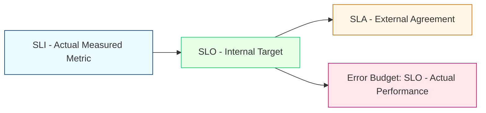
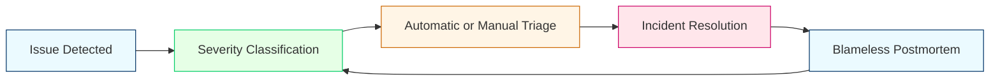
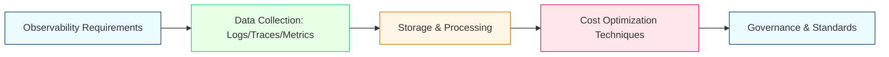
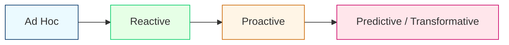
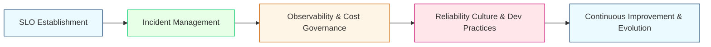

# **Day 3 Training: Operationalizing Observability & Advanced SRE Practices**

## **1. Introduction: From Implementation to Operationalization**

### **Recap of Days 1 & 2**
- **Day 1** established observability foundations: metrics, logs, traces, and how they interrelate to provide system insights.
- **Day 2** focused on practical implementation: hooking metrics into pipelines, setting up logging/tracing frameworks, and beginning to glean meaningful insights from these observability tools.

### **SRE as a Practice and Mindset**
- **Site Reliability Engineering (SRE)** goes beyond tooling. It is about balancing reliability and innovation:
  - **SLI (Service Level Indicator)**: A measured metric that indicates service health (e.g., latency, error rate).
  - **SLO (Service Level Objective)**: A target or goal for those SLIs (e.g., “99.9% of requests under 200ms”).
  - **SLA (Service Level Agreement)**: A formal contract, often external, that sets penalties or obligations if SLOs aren’t met.
  - **Error Budget**: The allowable margin for unreliability that balances pushing new features versus maintaining stability.

### **Organizational Maturity Stages**
1. **Ad Hoc** – Relying on heroics and constant firefighting.
2. **Reactive** – Observability is in place, but mostly used after the fact.
3. **Proactive** – Teams focus on measuring SLOs and using error budgets for planning.
4. **Predictive** – Automated reliability systems, advanced SRE processes across the organization.

### **Learning Objectives by Tier**
- 🔍 **Beginner**: Understand basic SRE concepts (SLI, SLO, error budget), incident management essentials, and cost basics.
- 🧩 **Intermediate**: Implement advanced SLO strategies, multi-dimensional metrics, refined incident workflows, and deeper cost optimizations.
- 💡 **Advanced/SRE**: Drive enterprise-level SRE frameworks, advanced reliability engineering, large-scale cost governance, and fully embedded cultural transformation.

### **Video Resource**
{{VIDEO_LINK_INTRO}}

**Keywords**: SRE practices introduction, observability operationalization, reliability engineering culture, SLO SLI SLA basics, error budget fundamentals, SRE organizational maturity

---

### **SRE Practice Story: The “Reliability Awakening”**

**Characters**:  
- **Jordan**, an eager new SRE.  
- **Kim**, a seasoned Ops lead.  
- **Amina**, a product manager anxious about feature deadlines.

**Scenario**:  
Jordan has just taken over the reliability responsibilities for a growing microservices product. Over the last two days, they set up basic monitoring and logs. Now, with Day 3’s training, Jordan wants to truly “operationalize” everything. They see the tension: Amina wants new features ASAP, while Kim is worried about repeated incidents. Jordan introduces the concept of **error budgets** to show that if they stay within error budget, they can speed up feature deployment; if they exceed it, they must pause feature releases to improve stability. Amina is skeptical but intrigued when she realizes the error budget helps them decide when to push or hold. Kim smiles—this is how reliability moves from guesswork to strategy!

**Key Takeaway**: The shift to an SRE mindset aligns reliability goals with business objectives. It’s not about preventing all failures; it’s about balancing reliability with feature velocity—and error budgets guide those decisions.

---

## **2. Establishing Service Level Objectives (SLOs)**

In this section, we’ll refine SLOs at all levels. SLOs translate your raw metrics (SLIs) into actionable reliability targets. We move from simple definitions to multi-dimensional SLO frameworks and advanced organizational adoption.

### **2.1 🔍 Beginner Level: SLO Foundations**

1. **Defining SLI, SLO, and SLA**  
   - **SLI**: Quantitative measure of an aspect of the service (e.g., request latency < 200ms).  
   - **SLO**: The target for that SLI (e.g., 99.9% of requests < 200ms).  
   - **SLA**: Contractual promise to customers, often with penalties.

2. **Meaningful SLIs**  
   - Reflect what end users actually care about (e.g., response time, error rate).  
   - Avoid random, vanity metrics that don’t measure real user experience.

3. **Setting Realistic SLO Targets**  
   - Look at historical performance data for a baseline.  
   - Consider user impact and business-critical transactions.

4. **Basic Error Budget Calculations**  
   ```python
   # Basic Python example for a 30-day window
   # Suppose our SLO is 99.9% availability for a web service
   
   total_requests = 1_000_000
   target_availability = 0.999
   allowed_failures = total_requests * (1 - target_availability)
   
   print(f"Allowed failures (error budget) for this period: {allowed_failures}")
   ```
   - If 1,000,000 requests are expected monthly, a 99.9% SLO means 1,000 “allowed failures” per month.

5. **Common Beginner Pitfalls**  
   - Having too many SLOs—stick to 2–3 that truly matter.  
   - Setting unrealistic targets that drain error budgets instantly.

6. **Simple SLO Dashboard**  
   - **Metrics**: Overall uptime, request latency, error rate.  
   - **Visualization**: Large, clear gauges or time-series charts.  
   - **Insight**: Quick check of how much error budget remains.

#### **Teaching Story (Beginner)**
**“Sam’s First SLO”**  
Sam is a junior SRE who sets an SLO of 99.9% uptime. He initially picks five different latencies and error rates, quickly overwhelming the team with confusion. On advice from a mentor, Sam narrows it down to just **latency** and **error rate**. The simplified approach helps Sam’s team quickly see if they’re still within budget. When an error spike occurs, Sam can point to the error budget and say, “We’ve used 10% of it. Let’s fix this before it gets worse.” The team embraces the SLO because it’s easy to understand and measure.

---

### **2.2 🧩 Intermediate Level: Advanced SLO Implementation**

1. **Multi-Dimensional SLOs**  
   - Track multiple aspects of reliability (e.g., latency + success rate + throughput).  
   - Combine them into a composite SLO or track separate budgets for each dimension.

2. **SLO-Based Alerting**  
   - Alerts trigger when burn rates exceed thresholds.  
   - Reduces noise compared to single-metric threshold alerts.

3. **Error Budget Policies**  
   - If the error budget is consumed too quickly, slow down or halt feature releases.  
   - If usage is minimal, release features more aggressively.

4. **Burn Rate Calculations**  
   ```python
   # Burn rate indicates how fast you consume your error budget
   # If you have an error budget of 1000 errors/month, and you see 100 errors in an hour,
   # your hourly burn rate = 100 / (1000 / (30*24)) -> how quickly the monthly budget is used in an hour
   
   allowed_failures_per_hour = allowed_failures / (30 * 24)
   observed_failures = 100  # in last hour
   burn_rate = observed_failures / allowed_failures_per_hour
   print(f"Current burn rate: {burn_rate:.2f}x of the normal hourly budget usage")
   ```
   - A burn rate of **>1** means you’re exceeding your budget’s hourly allowance.

5. **Comprehensive Dashboards**  
   - **Key Elements**: Error budget consumption chart, multi-metric view (latency & error rate), burn rate graphs.  
   - **Insight**: Clear visual on how quickly the service is consuming its reliability cushion.

#### **Teaching Story (Intermediate)**
**“Marisol and the Missing Error Budget”**  
Marisol manages a critical payment service. She sets up multi-dimensional SLOs for response time under 300ms and error rate under 0.5%. One busy day, the service hammered the error budget in a few hours. Thanks to **burn rate alerts**, Marisol noticed the high consumption rate immediately. She paused an upcoming release, rallied the team to fix the root cause, and the service returned to normal burn. The advanced SLO approach saved them from blowing past the budget in a single day.

---

### **2.3 💡 Advanced/SRE Level: Enterprise SLO Frameworks**

1. **Organizational SLO Frameworks**  
   - **Standard Templates** for SLO definitions across multiple teams.  
   - Tiered SLOs: Platinum (mission-critical), Gold (important), Silver (best effort).

2. **Advanced Error Budget Management**  
   - Automated gating for CI/CD if error budgets are being burned too fast.  
   - Predictive modeling to estimate future consumption.

3. **SLO-Driven Capacity Planning**  
   - Use historical SLO achievements to inform infrastructure scaling.  
   - Factor in forecasted traffic and current burn rates.

4. **Executive-Level Reporting**  
   - SLO results roll up to executive dashboards.  
   - Align reliability with business objectives (e.g., user satisfaction, revenue impact).

#### **Advanced Python Example: Predictive Reliability Modeling**
```python
import numpy as np
from datetime import datetime, timedelta

# Example: Using a simple predictive model to forecast error rates
# Based on current consumption trends and historical data

historical_error_rates = [0.001, 0.0008, 0.0012, 0.0009]  # sample daily rates
avg_error_rate = np.mean(historical_error_rates)
std_dev = np.std(historical_error_rates)

def predict_future_error_rate(days_ahead=7):
    # A simplistic approach: assume normal distribution from historical data
    forecast = avg_error_rate + np.random.randn(days_ahead) * std_dev
    return forecast

prediction = predict_future_error_rate()
print("Predicted error rates for the next 7 days:", prediction)
```
- Use these forecasts to automatically scale your infrastructure if you expect error rates to spike.

#### **Teaching Story (Advanced)**
**“The Executive Surprise”**  
The CIO demands a monthly reliability report. Anita, the lead SRE, has built an enterprise SLO framework where each service reports error budgets to an “SRE hub.” When a major traffic event hits, the framework automatically re-forecasts error budgets. The CIO sees a potential breach of an SLA by next week. Anita’s quick capacity planning and predictive modeling keep the service healthy—impressing the CIO. The success cements the SRE approach, and executives now rely on these enterprise-level SLO dashboards for strategic decisions.

---

### **Diagram: SLI/SLO/SLA Relationship**



---

## **3. Implementing Incident Management Practices**

Incident management is where observability meets action. It’s not enough to know about issues; you need a clear, repeatable process to address them.

### **3.1 🔍 Beginner Level: Foundations of Incident Response**

1. **Basic Incident Detection**  
   - Leverage existing observability: simple alerts on latency/error rate thresholds.  
   - Manual detection: triage screens, rotating on-call.

2. **Incident Severity and Response Procedures**  
   - Severity 1 (critical outage) vs. Severity 2 (degraded service), etc.  
   - Clear runbooks for each severity level.

3. **Incident Documentation and Communication**  
   - Real-time notes, timeline tracking.  
   - Slack channel or chat tool for coordinating.

4. **Blameless Postmortems**  
   - Focus on process/system improvements, not finger-pointing.  
   - Document root cause, timeline, solutions.

#### **Teaching Story (Beginner)**
**“Alex and the After-Hours Alert”**  
Alex is new to on-call duty. At 2 AM, an alert pings about high error rates. Panicking, Alex searches logs but can’t find the problem. Eventually, they realize they lack a defined severity model. Everything is “critical.” They call a senior engineer who helps triage, showing that only a subset of users was affected, making it a Severity 2. The incident is resolved faster, and Alex updates the runbook to clarify severity definitions. A blameless postmortem reveals that a simple severity classification would have prevented the confusion.

---

### **3.2 🧩 Intermediate Level: Advanced Incident Management**

1. **Observability-Driven Incident Playbooks**  
   - Predefined queries, dashboards, and runbooks for known failures.  
   - Automatic attachments of relevant logs and metrics.

2. **Automated Incident Detection and Triage**  
   - Use SLO-based alerting to prioritize incidents that threaten error budgets first.  
   - Triage automation: ChatOps bots that suggest probable root causes.

3. **Data-Driven On-Call Optimization**  
   - Monitor on-call escalations over time.  
   - Balance on-call loads so no single person is overloaded.

4. **Structured Blameless Postmortems**  
   - A consistent template for every incident.  
   - Identify systemic improvements (e.g., better alert thresholds, additional telemetry).

#### **Teaching Story (Intermediate)**
**“Priya’s Playbook Saves the Day”**  
Priya wrote an automated runbook for memory leak incidents. When a new microservice crashed at 3 AM, the system triggered an automated triage: memory usage soared above a threshold. A ChatOps bot posted recommended steps from Priya’s playbook. The on-call engineer followed it, found the memory leak, and mitigated it rapidly. The postmortem concluded that advanced triage plus well-defined playbooks drastically cut time-to-resolution.

---

### **3.3 💡 Advanced/SRE Level: Enterprise Incident Engineering**

1. **Building Incident Management Platforms**  
   - Centralized system for incident creation, tracking, correlation.  
   - Real-time analytics on incident patterns and triggers.

2. **Game Days, Chaos Engineering, and Proactive Testing**  
   - Regularly simulate outages to practice incident response.  
   - Use chaos engineering to reveal hidden weaknesses.

3. **Long-Term Incident Data Analysis**  
   - Trend analysis: repeated failures, hot spots.  
   - Organizational changes to address systemic weaknesses.

4. **Organizational Learning**  
   - Encourage shared ownership, cross-team collaboration.  
   - Celebrate incident “survivals” as learning opportunities.

#### **Advanced Template Example**
```python
# Pseudocode for an advanced incident analytics approach:
# 1. Collect incident data (time, severity, microservice, cause)
# 2. Aggregate across multiple incidents
# 3. Identify recurring patterns

incidents = [
    {"id": 1, "severity": "SEV1", "service": "payment", "cause": "OOM"},
    {"id": 2, "severity": "SEV2", "service": "payment", "cause": "DB latency"},
    {"id": 3, "severity": "SEV1", "service": "notifications", "cause": "Network"},
    # ...
]

def analyze_incident_patterns(incidents):
    pattern_count = {}
    for inc in incidents:
        key = (inc["service"], inc["cause"])
        pattern_count[key] = pattern_count.get(key, 0) + 1
    
    return pattern_count

patterns = analyze_incident_patterns(incidents)
for k, v in patterns.items():
    print(f"Service: {k[0]}, Cause: {k[1]}, Count: {v}")
```

#### **Teaching Story (Advanced)**
**“Zara’s Chaotic Challenge”**  
Zara leads a large SRE team at a global enterprise. They run monthly “Game Days” where they break random components in staging to test incident response. One day, they intentionally sever a key database connection. Teams scramble but fix it faster than expected—thanks to the well-practiced incident management platform. The postmortem reveals they could handle half the incident through automated scripts. Zara’s boss is thrilled to see how chaos engineering keeps them a step ahead of real production failures.

---

### **Diagram: Incident Management Workflow**



---

## **4. Scaling Observability and Cost Management**

Observability can be expensive at scale. In this section, we examine how to balance thorough coverage with budget realities.

### **4.1 🔍 Beginner Level: Observability Cost Basics**

1. **Cost Components**  
   - **Storage** (metrics, logs, traces), **Processing** (analytics, queries), **Licenses** (commercial tools).
2. **Cost-Benefit Analysis**  
   - Align observability spending with potential downtime impact.
3. **Data Sampling and Retention Policies**  
   - Retain critical logs longer; sample high-volume traces.

#### **Teaching Story (Beginner)**
**“Liam’s Log Overload”**  
Liam discovered that logging all debug statements from a chat service produced gigabytes of data daily. The monthly bill soared. By implementing a retention policy and sampling just 10% of debug logs, Liam drastically cut costs while still having enough data for troubleshooting.

---

### **4.2 🧩 Intermediate Level: Advanced Cost Optimization**

1. **Tiered Observability**  
   - Mission-critical services get full tracing/logging; less critical ones get partial coverage.
2. **Compression and Aggregation**  
   - Summarize logs daily or hourly to reduce storage.
3. **Cost Allocation Models**  
   - Charge teams for their portion of observability usage to encourage responsible data collection.

#### **Teaching Story (Intermediate)**
**“Lara’s Lean Tracing Strategy”**  
Lara runs a popular streaming service. Observing that 80% of trace data came from a stable microservice with few problems, she introduced a high sampling rate for that service’s “healthy” traffic, while keeping full trace coverage for areas known to be flaky. This cut costs in half with no significant loss in troubleshooting detail.

---

### **4.3 💡 Advanced/SRE Level: Enterprise Observability Economics**

1. **Observability as an Internal Service**  
   - Provide central data collection and analysis tools.  
   - Maintain SLAs for logging/tracing platform itself.
2. **Complex Cost Modeling**  
   - Predict cost growth as traffic scales.  
   - Factor in seasonal spikes and new features.
3. **Governance and Standards**  
   - Organization-wide guidelines for log levels, trace sampling.  
   - Routine audits to curb “observability sprawl.”

#### **Advanced Cost Optimization Example**
```python
import math

# Hypothetical function to forecast storage costs using an exponential growth model
def forecast_storage_cost(current_cost, growth_rate, months=12):
    costs = []
    for month in range(1, months+1):
        next_cost = current_cost * (math.e ** (growth_rate * month))
        costs.append(next_cost)
    return costs

initial_cost = 5000  # monthly cost
growth_rate = 0.02   # 2% monthly growth in data volume
predictions = forecast_storage_cost(initial_cost, growth_rate)

print("Forecasted monthly observability costs:")
for i, cost in enumerate(predictions, start=1):
    print(f"Month {i}: ${cost:,.2f}")
```

#### **Teaching Story (Advanced)**
**“Emma’s Empire of Traces”**  
At a multinational enterprise, Emma established a central “Observability Hub.” Each team was allocated a budget based on usage. If a team needed more detailed logs, they had to justify it. Over time, engineers grew more deliberate about what data they sent. With organization-wide governance, the environment stayed stable, performance improved, and costs remained predictable—even with thousands of services humming.

---

### **Diagram: Observability Cost Management**



---

## **5. Developing Reliability-Focused Engineering Culture**

Tools and metrics can only do so much without the right culture. This section shows how to nurture an organization-wide reliability mindset.

### **5.1 🔍 Beginner Level: Introduction to Reliability Culture**

1. **Balancing Reliability & Feature Development**  
   - Tie reliability metrics (SLOs) to release decisions.  
   - Show how reliability can drive user satisfaction.
2. **Measuring & Reducing Toil**  
   - Toil: Operational work that is manual, repetitive, and automatable.  
   - Identify top sources of toil and plan to automate.

#### **Teaching Story (Beginner)**
**“Carlos Learns to Say ‘No’”**  
Carlos, a developer, always says “yes” to new features. He ignores reliability tasks. Outages increase, morale drops. A manager steps in, asking Carlos to track toil hours. Stunned by how much time is spent firefighting, Carlos invests in a small automation to reduce repetitive tasks. Freed from toil, he delivers better features—and actually sleeps at night.

---

### **5.2 🧩 Intermediate Level: Maturing SRE Culture**

1. **SRE Team Models & Collaboration**  
   - **Embedded SRE** vs. **Central SRE** vs. **Consulting SRE** structures.  
   - Regular knowledge-sharing among dev and ops.
2. **Production Readiness Reviews**  
   - Evaluate new services on readiness (monitoring, alerting, runbooks) before launch.  
   - Encourage cross-functional collaboration.

#### **Teaching Story (Intermediate)**
**“Aditi’s Production Readiness Ritual”**  
Aditi is an SRE who starts mandatory readiness reviews. The dev teams groan at first—but soon see it catches issues before production. They appreciate the “extra set of eyes,” saving them from late-night pings. Over a few cycles, reliability metrics improve, and post-launch firefights drop by half.

---

### **5.3 💡 Advanced/SRE Level: Organizational Transformation**

1. **Scaling SRE Practices Enterprise-Wide**  
   - Standard frameworks, guidelines, and training for all teams.  
   - Executive champions who promote SRE adoption.
2. **SRE as a Business Enabler**  
   - Show how improved reliability directly boosts revenue or customer satisfaction.  
   - Data-driven ROI for SRE investments.

#### **Advanced Culture Example: Tracking SRE Transformation**
```python
# Example approach to measuring SRE maturity across teams

teams = {
    "Payments": {"readiness_score": 8, "oncall_load": 3, "error_budget_breaches": 1},
    "Checkout": {"readiness_score": 7, "oncall_load": 5, "error_budget_breaches": 2},
    "Notifications": {"readiness_score": 9, "oncall_load": 2, "error_budget_breaches": 0},
}

def measure_sre_maturity(teams):
    # Quick scoring system for demonstration
    for team, data in teams.items():
        maturity_score = data["readiness_score"] - data["error_budget_breaches"] - data["oncall_load"]/2
        print(f"Team {team}: Maturity Score = {maturity_score}")

measure_sre_maturity(teams)
```

#### **Teaching Story (Advanced)**
**“Naomi’s Executive Revelation”**  
Naomi is the VP of Engineering. She invests heavily in SRE training and requires each business unit to integrate SRE into their product roadmaps. Initially, some teams push back—reliability isn’t “exciting.” But after seeing a competitor suffer a massive outage, the executive leadership doubles down on Naomi’s approach. With consistent frameworks, error budgets, and cultural buy-in, the company emerges as a market leader in uptime and customer trust.

---

### **Diagram: Reliability Culture Evolution**



---

## **6. Observability-Driven Development and Testing**

Shifting left with observability ensures that reliability isn’t an afterthought.

### **6.1 🔍 Beginner Level: Observability in Development**

1. **Shift-Left Approach**  
   - Introduce observability in dev/test environments.  
   - Ensure code is instrumented for basic metrics, logs, traces before production.
2. **CI/CD Pipeline Integration**  
   - Automated tests that check key metrics or logs after each build.

#### **Teaching Story (Beginner)**
**“Emma’s Enlightened Debugging”**  
Emma, a junior dev, used to rely solely on print statements. After adding metrics to the dev environment, she catches memory usage spikes in test—before shipping to production. The testers are delighted, and Emma’s confidence soars.

---

### **6.2 🧩 Intermediate Level: Advanced Observability Engineering**

1. **Observability-Driven Development Practices**  
   - Write code with logs/traces in mind—meaningful instrumentation points.  
   - TDD extended to “Observability Test-Driven Development.”
2. **Synthetic Testing & Monitoring**  
   - Regularly simulate user journeys in a test environment.  
   - Automated triggers if performance deviates from SLOs.

#### **Teaching Story (Intermediate)**
**“Ravi’s Synthetic Safeguards”**  
Ravi sets up daily synthetic tests against the staging environment. When these tests detect a 5% latency increase, the team halts the release. They discover an inefficient database query. Because this was caught early, no end users were affected. Ravi’s approach becomes the new normal.

---

### **6.3 💡 Advanced/SRE Level: Reliability Engineering by Design**

1. **SRE Involvement in Architecture**  
   - SRE teams help design systems for resilience from the start (circuit breakers, bulkheads).
2. **Chaos Engineering and Resilience Testing**  
   - Regular, automated injection of failures.  
   - Observability ensures quick detection and root cause analysis.

#### **Advanced Code Snippet: Chaos Test Simulation**
```python
import random
import time

def chaos_test(service):
    # Randomly choose to kill or slow down the service
    action = random.choice(["kill", "slow", "normal"])
    if action == "kill":
        raise Exception("Simulated service failure!")
    elif action == "slow":
        time.sleep(5)
        return "Service responded slowly"
    else:
        return "Service normal"

try:
    result = chaos_test("checkout_service")
    print(result)
except Exception as e:
    print(f"Chaos test encountered error: {e}")
    # Observability tie-in: Log or trace the event
```

#### **Teaching Story (Advanced)**
**“Chen’s Full-Stack Resilience”**  
Chen is an architect who invites SREs to design reviews. They embed circuit breakers in the app’s microservices, set up fallback caches, and schedule weekly chaos experiments. One chaotic Tuesday, the failover system works flawlessly—observers hardly notice. Chen’s motto: “If we can’t break it ourselves, the real world won’t either.”

---

### **Diagram: Observability-Driven Development**

```mermaid
flowchart LR
    A[Plan & Dev] --> B[Instrumentation & Testing]
    B --> C[CI/CD Integration]
    C --> D[Observability Checks (Synthetic, Chaos)]
    D --> A[Feedback Loop]
    style A fill:#ebfaff,stroke:#036
    style B fill:#e6ffe6,stroke:#0c6
    style C fill:#fff5e6,stroke:#c60
    style D fill:#ffe6eb,stroke:#c06
```

---

## **7. Capstone: Building and Evolving Comprehensive SRE Practice**

Here we bring it all together in an end-to-end SRE case study, connecting each concept from SLOs to culture, from incident management to observability-driven dev.

1. **Integrated Reliability Strategy**  
   - A single approach that ties SLO setting, incident management, cost governance, and development into one cohesive framework.
2. **Tiered Implementation Roadmap**  
   - For small orgs: Start with 2–3 critical SLOs, basic incident response, minimal chaos.  
   - Medium orgs: Expand SLOs, formal incident workflows, moderate chaos exercises.  
   - Large enterprises: Full SRE frameworks, advanced chaos engineering, integrated cost governance.
3. **Measuring Success**  
   - Track time-to-detect (TTD), time-to-recover (TTR), error budget usage, user satisfaction.  
   - Continuous improvement loops.

### **SRE Practice Story: A Full Journey**

**“The MicroCorp Transformation”**  
- **Phase 1**: MicroCorp started with minimal monitoring. Reliability was an afterthought. Outages were frequent, and engineers burned out.  
- **Phase 2**: They introduced SLOs for their core user-facing services, error budgets, and basic on-call runbooks. Incidents became more manageable.  
- **Phase 3**: Over a year, they scaled to advanced SLO frameworks for every microservice. They adopted a centralized incident management platform and cost governance.  
- **Phase 4**: Observability-driven development became standard. Chaos engineering game days revealed hidden flaws. Over time, user churn decreased by 15%, and revenue grew by 20% because the service was noticeably more reliable.  
- **Final Result**: Reliability became a strategic differentiator. The executive team bragged about their stable platform, and the SRE team was recognized as essential to the company’s success.

### **Diagram: Comprehensive SRE Practice**



### **Tools and Templates**
- **SLO Definition Template**: Pre-filled document for every service to list SLIs, SLO targets, error budgets.
- **Incident Management Checklist**: Severity classification, communication channels, postmortem steps.
- **Cost Monitoring Template**: CSV-based or a simple BI dashboard that breaks down usage by team.
- **Chaos Engineering Plan**: A rolling schedule with clear goals, measurement criteria, and fail-safes.

### **Video Resource**
{{VIDEO_LINK_CAPSTONE}}

**Keywords**: complete SRE implementation, reliability engineering practice, SRE roadmap, observability strategy end to end, SRE practice measurement, reliability improvement framework, integrated observability platform, SRE evolution strategy, SRE toolchain integration

---

# **Conclusion and Next Steps**

By combining solid observability practices (Days 1 & 2) with advanced SRE frameworks and culture (Day 3), organizations can achieve robust, user-focused reliability. Remember:

- **Set and Maintain SLOs** that truly reflect user experience.  
- **Use Incident Management** to learn from failures, not just fix them.  
- **Optimize Costs** with a rational approach to data collection.  
- **Foster an SRE Culture** that embraces continuous improvement.  
- **Shift Observability Left** into development and testing.  
- **Evolve Your SRE Practice** with maturity, from ad hoc to predictive.

Your Day 3 journey lays the foundation for an ongoing SRE transformation—one that ties reliability to business outcomes, fosters collaboration, and ensures your systems are ready for the future. Good luck, and happy reliability engineering!

---

*(End of Day 3 Training Document)*
