# Chapter 0: From Production Support to Observability Thinking

## Chapter Overview

Welcome to the SRE equivalent of “So, your house isn’t on fire, but your guests are all stuck in the bathroom.” This chapter rips apart the delusion that healthy servers mean happy customers. We dissect the rotten core of traditional production support—where dashboards glow green, but the business is hemorrhaging trust, revenue, and regulatory goodwill. Observability isn’t just a buzzword; it’s about dragging your monitoring out of the Stone Age and shining a light on the tangled mess that is real-world customer experience. Prepare for a ruthless audit of support-as-usual, followed by a blueprint for evolving into a data-driven, business-saving SRE powerhouse. Spoiler alert: ignorance isn’t bliss—it’s expensive.

______________________________________________________________________

## Learning Objectives

- **Diagnose** why “green dashboards” often mean nothing for the actual customer experience.
- **Map** end-to-end customer journeys and **identify** where component monitoring fails you.
- **Instrument** distributed systems for trace-based, transaction-centric observability.
- **Detect** emerging failures and gray-area degradations long before customers (or regulators) do.
- **Correlate** technical and business data to reveal real impact, not just technical trivia.
- **Investigate** by following evidence, not opinions or runbook voodoo.
- **Break** out of tech silos and **build** unified, cross-domain observability practices.
- **Evolve** incident response from firefighting to continuous, evidence-based improvement.
- **Lead** a progressive transformation in support teams without sparking a mass exodus.

______________________________________________________________________

## Key Takeaways

- “All green” dashboards are the adult equivalent of hiding under the covers during a home invasion. Customers don’t care if your CPU is bored—they care if their money disappears.
- Monitoring component health is like checking your pulse while ignoring the knife in your back. End-to-end visibility is non-negotiable.
- Every “invisible” incident costs you: real money, real customers, real regulatory heat. If you don’t track business outcomes, you’re burning cash for sport.
- Relying on runbooks and “gut instinct” turns novel problems into week-long customer nightmares. Evidence-based, question-driven investigation is your only way out of the maze.
- Siloed teams breed conflicting narratives and missed root causes. Correlate everything, everywhere, or enjoy perpetual blame bingo.
- Binary health checks (up/down) are for the lazy and the doomed. Most of your outages live in the messy gray, quietly killing customer trust.
- Opinion-led incident reviews are just politics in disguise. If you can’t back it up with data, keep it out of the war room.
- SRE transformation isn’t a magical overnight fix. Change too fast and you hemorrhage staff; too slow and you stagnate. Progress is measured in real capability gains, not tool licenses.
- Your business case for observability isn’t “it’s cool tech”—it’s “here’s how we stopped losing millions.” If you can’t draw a straight line from your dashboards to dollars, you’re doing it wrong.

______________________________________________________________________

## Panel 1: The Invisible Customer Journey - Beyond Component Health

### Scene Description

A banking support center where two teams work side by side. The monitoring team stares at dashboards showing all green system metrics (CPU, memory, network) for payment processing systems. Meanwhile, the customer service team's phones light up with complaints about failed mobile transfers despite receiving success messages. The disconnect between system metrics and customer reality is visibly frustrating both teams.

### Teaching Narrative

Production support traditionally focuses on component health—ensuring servers are running, databases are responding, and networks are connected. However, this approach creates dangerous blind spots for customer journeys that span multiple systems. In banking especially, a transaction can appear successful in one system while failing silently in another, leaving customers with a broken experience despite all monitoring dashboards showing green. Observability thinking shifts our focus from isolated components to end-to-end customer journeys.

### Common Example of the Problem

A major retail bank recently implemented a new mobile payment feature allowing customers to transfer funds between accounts and to external recipients. The system architecture involved multiple components: the mobile app frontend, API gateway, authentication service, account validation service, transaction processing service, notification service, and a third-party payment network for external transfers. During the first month after launch, the monitoring dashboards consistently showed green status for all services—CPU usage was normal, memory consumption within thresholds, API response times acceptable, and service health checks passing.

However, customer service began receiving a surge of complaints about "disappearing money" where customers received success messages for transfers, but recipients never received the funds. The investigation revealed that while the transaction service successfully debited the sender's account and sent an immediate success notification, an intermittent timing issue in the integration with the third-party payment network caused some transactions to be rejected by the external system after the notification was sent. Since the monitoring focused only on component health rather than complete transaction journeys, these failures remained invisible until customers complained.

Below is a simplified flow diagram illustrating the transaction journey and where the failure occurred:


This diagram highlights the flow of a transaction across components, emphasizing the point of failure. The success notification was sent to the customer before the third-party payment network rejected the transfer, leading to a discrepancy between system behavior and customer experience. This underscores the need for observability into the entire transaction journey to catch such issues proactively.

### SRE Best Practice: Evidence-Based Investigation

SRE teams must implement end-to-end transaction tracking that follows customer journeys across all systems involved. This requires a fundamental shift from monitoring isolated components to establishing trace-based observability that captures the complete lifecycle of each transaction.

#### Checklist: Steps for Evidence-Based Investigation

- **Define Critical Customer Journeys**

  - Map all major transaction flows from the customer's perspective.
  - Identify every system, service, and integration point involved in completing the journey.

- **Implement Transaction-Centric Instrumentation**

  - Deploy distributed tracing to maintain transaction context across all service boundaries.
  - Ensure complete visibility into how individual transactions flow through the system landscape.

- **Establish Transaction Outcome Validation**

  - Create synthetic monitoring to verify complete business outcomes, not just technical success.
  - For payments, confirm that funds are received by the destination account, not just that messages were processed successfully.

- **Implement Correlation Between Technical and Business Events**

  - Link technical monitoring data with business events like:
    - Customer complaints.
    - Support tickets.
    - Transaction disputes.
  - Use correlation to rapidly identify patterns in customer-reported issues.

- **Conduct Gap Analysis**

  - Regularly compare customer-reported issues against monitoring visibility.
  - Identify blind spots where transactions fail without triggering alerts.
  - Close these gaps by improving observability.

By systematically following this checklist, SRE teams can align their monitoring strategies with real customer experiences, ensuring that silent failures are detected and addressed proactively.

### Banking Impact

The business consequences of observability gaps are severe and multidimensional. The table below summarizes the key impacts experienced by the financial institution in the payment scenario described:

| **Impact Dimension** | **Details** | **Quantified Effect** |
| -------------------------- | --------------------------------------------------------------------------------------------- | ------------------------------------------------------------------------------------------------------------------- |
| **Direct Financial Costs** | Manual investigation and reconciliation required for failed transactions. | $45 per incident × 2,300 transactions = **$103,500** in operational costs during the first month. |
| **Customer Experience** | Decrease in customer trust and satisfaction. | Net Promoter Score (NPS) dropped **17 points**. 23% of affected customers reduced their use of the bank's services. |
| **Regulatory Scrutiny** | Triggered fraud monitoring alerts, leading to external examinations by financial authorities. | Unscheduled regulatory audit with potential penalties for operational control weaknesses. |
| **Reputation Damage** | Negative sentiment amplified on social media, including high-profile influencer complaints. | **340% increase** in negative mentions. Digital customer acquisition decreased by **12%** during the incident. |
| **Opportunity Cost** | Engineering resources diverted from innovation to issue remediation. | **1,200 person-hours** spent resolving issues, delaying the next product release by **6 weeks**. |

This table highlights how observability gaps extend beyond technical issues, impacting financial outcomes, customer trust, regulatory relationships, brand reputation, and innovation timelines. Addressing these gaps requires a shift towards end-to-end customer journey monitoring to better align system performance with customer experiences.

### Implementation Guidance

1. **Implement Cross-System Transaction Identifiers**:\
   Deploy unique transaction IDs that persist across all internal and external systems, ensuring every operation related to a specific customer transaction can be correlated across organizational and technical boundaries. Configure these IDs to appear in all logs, metrics, and traces for seamless correlation.\
   Example configuration for adding a transaction ID to logs in a microservices environment using structured logging in Python:

   ```python
   import logging
   import uuid

   # Configure structured logging
   logger = logging.getLogger("transaction_logger")
   handler = logging.StreamHandler()
   formatter = logging.Formatter(
       '{"timestamp": "%(asctime)s", "transaction_id": "%(transaction_id)s", "level": "%(levelname)s", "message": "%(message)s"}'
   )
   handler.setFormatter(formatter)
   logger.addHandler(handler)
   logger.setLevel(logging.INFO)

   # Example function to log with transaction ID
   def process_transaction(transaction_id=None):
       if not transaction_id:
           transaction_id = str(uuid.uuid4())  # Generate unique transaction ID
       logger = logging.LoggerAdapter(logger, {"transaction_id": transaction_id})
       logger.info("Transaction started")
       # Simulate transaction steps
       logger.info("Step 1 completed")
       logger.info("Step 2 completed")
       logger.info("Transaction completed")

   process_transaction()
   ```

2. **Establish End-to-End Synthetic Transactions**:\
   Create automated tests that simulate complete customer journeys from initiation through final confirmation, including third-party integrations and downstream systems. These should execute continuously, verifying business outcomes rather than just technical completion.\
   Example of a synthetic test for a banking transaction using a monitoring tool (e.g., Selenium or a custom script):

   ```python
   from selenium import webdriver

   def run_synthetic_test():
       driver = webdriver.Chrome()
       try:
           # Simulate customer login
           driver.get("https://banking.example.com/login")
           driver.find_element("id", "username").send_keys("test_user")
           driver.find_element("id", "password").send_keys("secure_password")
           driver.find_element("id", "login-button").click()

           # Simulate initiating a transfer
           driver.get("https://banking.example.com/transfer")
           driver.find_element("id", "recipient").send_keys("recipient_account")
           driver.find_element("id", "amount").send_keys("100")
           driver.find_element("id", "submit-transfer").click()

           # Verify transfer success
           success_message = driver.find_element("id", "success-message").text
           assert "Transfer successful" in success_message

       finally:
           driver.quit()

   run_synthetic_test()
   ```

3. **Develop Journey-Based Dashboards**:\
   Create monitoring visualizations that show full transaction paths rather than isolated component statuses. These should display success rates for complete journeys, highlight any step in the sequence experiencing issues, and provide drill-down capabilities to examine specific failures.\
   Example JSON configuration for a journey-based dashboard in Grafana:

   ```json
   {
       "panels": [
           {
               "type": "table",
               "title": "Transaction Success Rates",
               "columns": [
                   { "text": "Transaction Step", "value": "step" },
                   { "text": "Success Rate (%)", "value": "success_rate" }
               ],
               "datasource": "Prometheus",
               "targets": [
                   {
                       "expr": "sum(rate(transaction_success_total[5m])) / sum(rate(transaction_total[5m])) * 100",
                       "legendFormat": "{{step}}"
                   }
               ]
           },
           {
               "type": "graph",
               "title": "Transaction Completion Times",
               "datasource": "Prometheus",
               "targets": [
                   {
                       "expr": "histogram_quantile(0.95, rate(transaction_duration_seconds_bucket[5m]))",
                       "legendFormat": "p95 completion time"
                   }
               ]
           }
       ]
   }
   ```

4. **Implement Business Outcome Alerting**:\
   Configure alerts based on transaction completion rates and business success metrics rather than just infrastructure health. Set thresholds for transaction failure patterns, abnormal completion times, and unusual error rates compared to historical baselines.\
   Example Prometheus alert rule for transaction failures:

   ```yaml
   groups:
     - name: TransactionAlerts
       rules:
         - alert: HighTransactionFailureRate
           expr: (sum(rate(transaction_failures_total[5m])) / sum(rate(transaction_total[5m]))) > 0.05
           for: 2m
           labels:
             severity: critical
           annotations:
             summary: "High transaction failure rate detected"
             description: "Failure rate is above 5% for the last 2 minutes."
   ```

5. **Bridge Technical and Customer Support Data**:\
   Integrate technical monitoring systems with customer support platforms to enable rapid correlation between reported issues and system behaviors. Create automated linking between support tickets and the specific transaction traces involved, allowing support teams to provide technical teams with examples of problematic transactions instantly.\
   Example representation of a workflow for linking support tickets to traces:

   ```plaintext
   +--------------------------+
   | Customer Support Ticket  |
   +--------------------------+
               |
               v
   +--------------------------+
   | Extract Transaction ID   |
   +--------------------------+
               |
               v
   +--------------------------+
   | Query Observability Tool |
   +--------------------------+
               |
               v
   +--------------------------------+
   | Retrieve Logs/Traces for Issue |
   +--------------------------------+
               |
               v
   +-----------------------+
   | Share with Engineering|
   +-----------------------+
   ```

## Panel 2: Reactive to Proactive - Anticipating Issues Before Impact

### Scene Description

Split screen concept illustrating two approaches to managing the same trading platform incident:

#### Left Side: Reactive Approach

- **Scenario:** A production support engineer urgently addresses escalations.
- **Trigger:** Customers report trade failures.
- **Actions Taken:** The engineer investigates logs and metrics after the incident occurs, working under pressure to resolve the issue and restore service.
- **Outcome:** Customers experience disruption, leading to potential loss of trust and revenue.

#### Right Side: Proactive Approach

- **Scenario:** An SRE engineer detects an anomaly in settlement system response patterns during routine analysis.
- **Trigger:** Observability tools highlight unusual latency trends before any customer-reported issues.
- **Actions Taken:** The SRE investigates the anomaly, identifies the root cause, and implements a fix or mitigation plan.
- **Outcome:** The issue is resolved before impacting customers, preserving system reliability and trust.

#### Visual Representation


This split-screen and flow visualization highlights the key differences between reactive and proactive approaches, emphasizing the role of observability in preventing customer impact.

### Teaching Narrative

The fundamental mindset shift from production support to SRE is moving from reactive firefighting to proactive system improvement. Traditional support waits for alerts to trigger or customer complaints to escalate before investigating issues. Observability thinking enables engineers to identify unusual patterns, emerging bottlenecks, and potential failures before they impact customers. This shift is particularly valuable in financial services, where preventing a single outage can preserve millions in transactions and maintain institutional trust.

### Common Example of the Problem

A global investment bank's equities trading platform processes approximately 25,000 trades hourly during peak market hours. The platform relies on a complex architecture with order management systems, market data feeds, execution services, risk checks, settlement systems, and regulatory reporting components. The traditional production support model operated through a tiered escalation approach: helpdesk staff would receive trader complaints about slow executions or failed trades, escalate to level 2 support for initial triage, who would then involve specialized application teams if the issue couldn't be immediately resolved.

During a recent market volatility event, this reactive approach proved particularly costly. As trading volumes spiked, an underlying database connection pool began exhausting due to insufficient capacity. For the first hour of the issue, individual traders experienced intermittent trade failures, but each instance appeared isolated. Support teams investigated individual complaints without recognizing the emerging pattern. By the time sufficient escalations accumulated to identify the systemic issue, the problem had grown to affect nearly 40% of trading attempts, resulting in approximately $3.7 million in missed trading opportunities and triggering regulatory reporting requirements for the significant outage.

#### Timeline of Incident Progression


This timeline highlights the cascading delays in issue recognition and resolution under the reactive support model. Early trade failures appeared isolated, leading to fragmented investigations and a slow escalation process. By the time the systemic nature of the issue was identified, significant customer impact had already occurred, emphasizing the need for a proactive observability-driven approach to detect anomalies earlier in the sequence.

### SRE Best Practice: Evidence-Based Investigation

SRE teams must implement proactive anomaly detection and pattern recognition systems that identify emerging issues before they reach critical impact levels. The following checklist summarizes five best practices for evidence-based investigation:

#### Checklist: Evidence-Based Investigation for SREs

- [ ] **Establish Behavioral Baselines**: Analyze historical system performance data to create statistical models of normal behavior for all critical systems, including expected patterns during different market conditions, time periods, and business cycles.
- [ ] **Implement Multi-Dimensional Anomaly Detection**: Deploy algorithms that continuously monitor system behavior across numerous dimensions simultaneously—latency distributions, error rates, request patterns, dependency health—identifying subtle deviations from expected behavior that might indicate emerging issues.
- [ ] **Correlate Leading Indicators**: Identify early warning signals that typically precede customer-impacting incidents. For example, increasing latency in background database operations often precedes visible application performance degradation by several minutes or hours.
- [ ] **Analyze Failure Patterns**: Study historical incidents to identify common failure modes and their early indicators, then implement specific detection mechanisms for these patterns to provide maximum advance warning.
- [ ] **Conduct Trend Analysis**: Continuously evaluate system performance trends over multiple timeframes (minutes, hours, days, weeks) to identify gradual degradations that might otherwise go unnoticed until reaching critical thresholds.

By following this structured approach, SRE engineers can transition from reactive problem-solving to proactive issue anticipation, ensuring greater system stability and reliability.

### Banking Impact

The business consequences of reactive versus proactive approaches in financial services are substantial and directly measurable. The table below summarizes the key impacts across financial, regulatory, reputational, and operational dimensions:

| **Impact Area** | **Reactive Approach (Incident)** | **Proactive Approach (Prevention)** |
| ------------------------ | ---------------------------------------------------------------------------------------------------- | --------------------------------------------------------------------------------------- |
| **Trading Revenue** | ~3,200 failed trades in 2.5 hours, leading to $3.7M in lost commissions and $12.2M in client losses. | No failed trades; anomaly detection mitigated risk before customer impact. |
| **Regulatory** | Mandatory reporting to regulators, triggering scrutiny, a formal review, and a $275K fine. | No regulatory action required; operational controls validated through observability. |
| **Client Relationships** | Three institutional clients (managing $8.4B) redirected trades to competitors, causing $450K loss. | Client trust maintained; no disruption to trading services or revenue. |
| **Market Reputation** | Reliability rating downgraded from A to B+, reducing competitiveness for algorithmic clients. | Platform reliability upheld, preserving competitive advantage in algorithmic trading. |
| **Opportunity Cost** | Strategic ML project delayed, missing $4.2M annual efficiency gains due to emergency response. | Engineers focused on strategic projects without interruption, driving innovation value. |

This comparison highlights the critical importance of transitioning to a proactive mindset, particularly in financial services where outages carry significant financial, regulatory, and reputational risks.

### Implementation Guidance

1. **Deploy Predictive Health Monitoring**: Implement machine learning-based predictive monitoring that identifies subtle patterns preceding known failure modes. Focus on key indicators like gradually increasing latency, shifting error distributions, or unusual resource consumption patterns that historically precede outages.

2. **Establish Capacity Trending and Forecasting**: Create automated systems that continuously track resource utilization across all components, project future needs based on current trends, and alert when systems are approaching (not just exceeding) capacity thresholds—typically when reaching 70-80% of maximum capacity.

3. **Implement Early Warning War Rooms**: Create dedicated processes for investigating "yellow alert" conditions—situations that don't yet impact customers but show abnormal patterns. Define explicit escalation criteria, investigation protocols, and response playbooks specifically for these pre-incident conditions.

4. **Develop Component Dependency Maps**: Build and maintain accurate service dependency visualizations that help teams quickly understand the potential blast radius of emerging issues in specific components, prioritizing investigation of anomalies in services with the most critical downstream dependencies.

5. **Create Business Pattern Monitoring**: Implement monitoring specifically for business process anomalies, not just technical metrics. For example, track trade execution ratios, order-to-cancel patterns, settlement completion rates, or unusual client behavior patterns that might indicate emerging issues before traditional technical monitoring detects problems.


This flow diagram outlines the interconnected implementation steps for transitioning from reactive to proactive issue management. It emphasizes the dependencies between predictive monitoring, capacity planning, dependency mapping, and business pattern tracking, all feeding into a central early warning system to resolve issues before customer impact.

## Panel 3: Question-Driven Investigation - Beyond Known Failure Modes

### Scene Description

A banking support team struggles with a new mobile banking problem not covered in existing runbooks. A whiteboard shows their approach evolving from basic troubleshooting to more nuanced, question-driven investigation. Below is a text-based flowchart illustrating this progression:

```
Initial Question:
"Which component is failing?"
        |
        v
Refined Question:
"How does a successful login flow differ from a failing one?"
        |
        v
Deeper Insight:
"What changed in the authentication service behavior over the past hour?"
        |
        v
System-Wide Impact:
"What other services are affected by this pattern?"
```

This evolution highlights the shift from focusing on isolated components to exploring broader system behaviors, enabling the team to uncover deeper insights into the issue.

### Teaching Narrative

Production support relies heavily on predefined runbooks and known failure modes—effective for familiar problems but limiting for novel issues. Observability thinking embraces a question-driven approach, enabling engineers to explore system behavior through progressive hypothesis testing. Rather than jumping to conclusions based on alert thresholds, SRE engineers follow evidence trails and adapt their investigation based on what the data reveals. This exploratory mindset is essential for troubleshooting complex, interconnected banking systems where issues rarely follow predefined patterns.

### Common Example of the Problem

A regional bank launched an enhanced mobile banking platform with biometric authentication, real-time transaction alerts, and personalized financial insights. Three weeks after deployment, customers began reporting a perplexing issue: approximately 8% of users experienced seemingly random disconnections during sessions, particularly when moving between account overview and transaction history screens. The behavior didn't match any known failure patterns, and traditional monitoring showed no clear red flags—servers had adequate capacity, databases were performing within parameters, and API response times looked normal.

The support team followed standard runbooks: they checked load balancer logs, API gateway metrics, and application server errors—finding nothing conclusive. They reviewed recent deployments and configuration changes, but none coincided with the timing of the issues. After two days of investigation following prescribed troubleshooting paths, the problem remained unresolved, with customer complaints continuing to accumulate. The team was stuck in a cycle of checking the same components repeatedly because their runbook-based approach didn't accommodate this novel failure mode.

#### Investigation Timeline


This timeline illustrates the sequence of events and the investigation steps taken by the team. It highlights the initial focus on traditional runbook procedures, such as log reviews and metrics checks, followed by deployment and configuration reviews. Despite these efforts, they found no conclusive evidence, leading to repeated checks of the same components. The rigid, predefined approach left the team ill-equipped to address the novel failure mode, underscoring the need for a more exploratory, question-driven investigation strategy.

### SRE Best Practice: Evidence-Based Investigation

SRE teams must adopt an exploratory, question-driven investigation approach that follows evidence rather than predefined paths when encountering novel problems. The following checklist summarizes best practices to guide this process:

#### **Checklist for Evidence-Based Investigation**

1. **Frame Testable Hypotheses**

   - Formulate specific, testable hypotheses about system behavior.
   - Ensure hypotheses can be validated or refuted using available data.
   - Avoid jumping to conclusions; let the data guide your focus.

2. **Practice Progressive Refinement**

   - Start with broad, open-ended questions.
   - Narrow down focus based on emerging evidence.
   - Reformulate hypotheses as new information becomes available.

3. **Implement Comparative Analysis**

   - Analyze differences between successful and failing transactions.
   - Identify distinguishing characteristics that may expose root causes.
   - Consider both system-level and transaction-level behaviors.

4. **Conduct Timeline Correlation**

   - Investigate temporal patterns related to the issue’s onset.
   - Correlate system changes, deployments, or external factors with the observed problem.
   - Be open to indirect or less obvious timing relationships.

5. **Utilize Cross-System Pattern Recognition**

   - Look for consistent patterns across unrelated services or components.
   - Identify common dependencies or environmental factors affecting multiple areas.
   - Leverage system observability tools to detect shared anomalies.

6. **Document and Iterate**

   - Record investigative steps, findings, and discarded hypotheses.
   - Share insights with the team to improve collective understanding.
   - Use lessons learned to enhance observability and runbooks for future scenarios.

By following this structured approach, SRE teams can uncover insights into complex, interconnected systems and troubleshoot novel issues effectively.

### Banking Impact

The business consequences of relying on runbook-based approaches for novel problems versus employing question-driven investigation are outlined below:

| **Impact Category** | **Runbook-Based Approach** | **Question-Driven Investigation** |
| --------------------------- | ----------------------------------------------------------------------------------------------------------------- | ------------------------------------------------------------------------------------------------ |
| **Resolution Time** | 7 days to identify root cause; affected ~26,000 customer sessions, reducing mobile engagement likelihood by 5-7%. | Root cause identified in 4 hours, minimizing session impact and preserving user trust. |
| **Digital Adoption Impact** | 3.2% decrease in mobile banking active users; delayed digital transformation goal by ~5 weeks. | Mitigated user frustration, sustaining digital adoption and transformation momentum. |
| **Support Costs** | 4,700 additional support calls; $56,400 in direct costs; required unplanned overtime for staff. | Reduced call volume and avoided operational cost spikes, optimizing support resource allocation. |
| **Feature Rollout Delays** | Two mobile enhancements delayed; $175,000 efficiency benefits postponed by 3 months. | Minimal disruption to feature delivery timelines, maintaining strategic objectives. |
| **Executive Credibility** | CIO faced board scrutiny over team's inability to quickly resolve customer-facing issues. | Enhanced executive confidence in team's ability to handle complex, novel scenarios effectively. |

This comparison highlights that question-driven investigation minimizes negative business impacts while fostering a more resilient and adaptable engineering culture.

### Implementation Guidance

1. **Implement Investigation Journals**:
   Create structured digital notebooks where investigators document questions asked, hypotheses formed, evidence examined, and conclusions reached throughout the troubleshooting process. Use tools like **Jupyter Notebooks**, **Confluence**, or **Obsidian** to provide searchable, shareable formats that preserve the investigation narrative for future reference and pattern recognition.

2. **Develop System Behavior Visualization Tools**:
   Deploy tools that dynamically generate visualizations of system behavior based on investigative questions. For instance, leverage platforms like **Grafana**, **Kibana**, or **Lightstep** to explore different data dimensions and relationships without predefined dashboard limitations. These tools should support ad-hoc queries and allow for real-time overlays of system metrics, traces, and logs.

3. **Establish Cross-Component Correlation Capabilities**:
   Implement mechanisms to correlate events across systems, services, and timeframes to identify non-obvious relationships. Use tools such as **Splunk**, **Honeycomb**, or **New Relic** to overlay multiple data types—logs, metrics, traces, and business events—on unified timelines. For example, overlaying authentication service logs with database query metrics can reveal subtle dependencies impacting performance.

4. **Create Hypothesis Testing Frameworks**:
   Develop standardized approaches for formulating and testing hypotheses about system behavior. Utilize frameworks or templates in tools like **Notion** or **Google Docs** for defining expected outcomes, evidence collection plans, and falsification criteria. Incorporate CI/CD pipelines with tools like **Postman** or **Pact** to automate hypothesis validation for specific API behaviors or service contracts.

5. **Build Knowledge Graph Systems**:
   Implement tools that capture relationships between systems, components, previous incidents, and resolution strategies. Platforms like **Neo4j**, **ArangoDB**, or **TigerGraph** can model these relationships as knowledge graphs, enabling investigators to trace dependencies and leverage institutional knowledge when forming hypotheses about novel problems. For instance, a graph query could reveal how a failing mobile banking API is indirectly impacted by a downstream authentication service issue.

## Panel 4: From Silos to System Views - Connecting Related Signals

### Scene Description

An incident room where a legacy approach is being transformed. Initially, separate teams examine isolated data: database logs, application server metrics, network traces, and customer reports—all disconnected. A new observability approach shows these same signals correlated by transaction ID on a unified timeline, revealing how a database slowdown cascades into API timeouts, multiple retries, and ultimately failed payments.

#### Transition from Siloed Views to Unified Timeline

**Legacy Approach (Siloed Views):**

```
Database Logs   | Application Metrics   | Network Traces   | Customer Reports
[Isolated Data] | [Isolated Data]       | [Isolated Data]  | [Isolated Data]
      ^                    ^                      ^                   ^
      |                    |                      |                   |
  Separate Teams        Separate Teams        Separate Teams      Separate Teams
```

**New Approach (Unified Timeline with Observability):**

```
                   [Transaction ID: 12345]
Database Logs  ---> API Metrics  ---> Network Traces  ---> Customer Experience
              [Correlated Signals]       [Unified Timeline]
```

This transformation allows engineers to connect the dots across the technology stack, revealing how localized issues, such as a database slowdown, propagate through the system and impact end-user outcomes, such as failed payments.

### Teaching Narrative

Traditional production support often operates in technology silos, with separate teams examining their own components in isolation. Observability breaks down these barriers by connecting related signals across the technology stack. By correlating events using shared identifiers, engineers can see how issues propagate through distributed systems and understand true cause-effect relationships. In banking, where transactions flow through dozens of specialized systems, this connected perspective is essential for understanding complex failures that cross organizational boundaries.

### Common Example of the Problem

A large commercial bank's treasury management platform experienced a critical incident affecting wire transfer processing for corporate clients. The system architecture spanned multiple technology domains: a web portal for corporate users, application servers processing transaction requests, a message transformation layer, a core banking system, and connectivity to the SWIFT network for international transfers.

When high-value transfers began failing during month-end processing, the traditional siloed investigation approach took effect. Each team focused solely on their domain-specific metrics:

- **Database Team**: Observed "normal performance with slightly elevated I/O wait times."
- **Application Team**: Reported "occasional timeouts but no systematic failures."
- **Network Team**: Noted "periodic packet loss but within acceptable thresholds."
- **SWIFT Connectivity Team**: Confirmed "normal operation with standard acknowledgment rates."

Despite these individual assessments, corporate clients were unable to complete critical transfers worth millions of dollars, with no clear explanation or resolution timeline. The disconnected analysis failed to uncover how seemingly minor issues in each domain were compounding into catastrophic end-to-end transaction failures.

#### Visualizing the Problem

Below is a sequence diagram illustrating how the siloed approach missed the cascading failures:


This diagram highlights how delays and timeouts at different layers of the stack—though minor individually—combined to create a critical system failure. The lack of a unified view prevented the teams from identifying the root cause: a database slowdown that propagated through retries and timeouts, eventually overwhelming the system.

This example underscores the need for observability to correlate signals across domains, enabling engineers to uncover the true cause-and-effect relationships in distributed systems.

### SRE Best Practice: Evidence-Based Investigation

SRE teams must implement correlated, system-wide observability that connects related signals across technology and organizational boundaries. Use the following checklist to guide evidence-based investigations and foster actionable outcomes:

#### Checklist for Evidence-Based Investigation

- **[ ] Establish Unified Transaction Identifiers**\
  Implement consistent correlation IDs that flow with each transaction through every system touchpoint. These identifiers enable traceability across the entire technology stack, regardless of organizational boundaries.

- **[ ] Create Cross-Domain Visualization**\
  Develop unified timeline views displaying events from multiple sources—application logs, database metrics, network performance, and business outcomes. Ensure these views are synchronized to reveal causal relationships.

- **[ ] Implement Propagation Path Tracing**\
  Trace cascading effects through dependent systems. Visualize how initial delays or errors in one component trigger ripple effects across connected services, providing insights into system-wide impacts.

- **[ ] Deploy Causal Analysis Capabilities**\
  Use advanced techniques such as directed acyclic graphs to model and visualize cause-effect relationships. Differentiate between root causes and symptoms to identify the true source of issues.

- **[ ] Establish Cross-Functional Observability Teams**\
  Form dedicated teams with expertise spanning multiple technology domains. These teams should interpret correlated signals, analyze system behavior holistically, and bridge the gaps between siloed perspectives.

- **[ ] Continuously Refine Observability Practices**\
  Regularly review and improve observability tools, processes, and correlation methodologies to adapt to evolving systems and ensure effective incident investigations.

#### Example Workflow for Correlated Signal Analysis


By following this checklist and workflow, SRE teams can transition from siloed troubleshooting to evidence-based investigations that uncover the true nature of complex failures.

### Banking Impact

The business consequences of siloed analysis versus correlated observability in banking operations are substantial and measurably impact both financial performance and customer relationships. The table below summarizes key impacts for clarity and comparison:

| **Impact Category** | **Description** | **Quantifiable Outcome** |
| -------------------------------- | ---------------------------------------------------------------------------------- | ------------------------------------------------------------------------------------------------------- |
| **Transaction Value Impact** | Delays in high-value wire transfers due to extended investigation times. | 340 transactions worth $780M delayed; manual intervention required for time-sensitive cases. |
| **Client Relationship Damage** | Operational disruptions causing dissatisfaction among key corporate clients. | 3 corporate clients (>$2.5M annual fee revenue each) impacted; one reduced activity by ~30%. |
| **Competitive Position Erosion** | Decline in treasury management win rates following the incident. | Win rate dropped from 37% to 24% in the next quarter; clients cited concerns about payment reliability. |
| **Operational Overhead** | Significant resources diverted to manual tasks and regulatory explanations. | 1,400 person-hours consumed, reducing capacity for revenue-generating activities. |
| **Opportunity Cost** | Delayed product launches due to extended incident resolution and remediation work. | 7-week delay in launching a new fee-based service, deferring $450,000 in projected quarterly revenue. |

This comparison highlights how siloed analysis creates cascading effects that harm financial outcomes, client trust, and market competitiveness—outcomes that can be mitigated with a unified observability approach.

### Implementation Guidance

1. **Implement Cross-Domain Correlation Platforms**: Deploy unified observability platforms that automatically correlate events across different data sources using shared identifiers. Ensure all systems—from customer interfaces through core banking to external networks—propagate consistent correlation IDs that enable end-to-end transaction tracing. Below is an example configuration snippet for enabling correlation ID propagation in a microservices environment using HTTP headers:

   ```python
   # Middleware to propagate correlation IDs in a Python-based microservice
   from flask import Flask, request, g
   import uuid

   app = Flask(__name__)

   @app.before_request
   def propagate_correlation_id():
       # Extract existing correlation ID or generate a new one
       correlation_id = request.headers.get("X-Correlation-ID", str(uuid.uuid4()))
       g.correlation_id = correlation_id

       # Add correlation ID to outgoing responses
       @app.after_request
       def add_correlation_id_header(response):
           response.headers["X-Correlation-ID"] = g.correlation_id
           return response

   @app.route("/example")
   def example_service():
       # Use the correlation ID in logs or trace context
       return {"message": "Service response", "correlation_id": g.correlation_id}

   if __name__ == "__main__":
       app.run()
   ```

2. **Create Integrated Timeline Visualizations**: Develop visualization capabilities that display events from multiple sources (logs, metrics, traces, business transactions) on synchronized timelines, allowing engineers to see cause-effect relationships across system boundaries. These should include the ability to zoom from millisecond-level technical details to hour-level business patterns. For example, tools like Jaeger or OpenTelemetry can be configured to produce such timelines by associating traces with correlation IDs.

3. **Establish Service Dependency Maps**: Maintain accurate, automatically updated service connectivity diagrams showing how components interact, with real-time health indicators overlaid. Use dependency mapping tools to generate diagrams similar to the following:

   ```mermaid
   graph TD
       A[Frontend Service] --> B[API Gateway]
       B --> C[Auth Service]
       B --> D[Payment Service]
       D --> E[Database]
   ```

   The diagram should reflect both direct and transitive dependencies, enabling teams to identify potential cascading failure paths.

4. **Develop Cross-Functional Runbooks**: Create incident response playbooks that explicitly traverse organizational boundaries. Include clear procedures for forming integrated teams, sharing relevant data across domains, and maintaining unified situation awareness. For example:

   - **Step 1**: Use the correlation ID to pull logs, traces, and metrics from relevant systems.
   - **Step 2**: Convene representatives from affected teams (e.g., frontend, backend, database) to review the unified timeline.
   - **Step 3**: Identify root cause and mitigation steps using the service dependency map.

5. **Implement Business Context Overlays**: Enhance technical monitoring with business context visualization that shows the customer and financial impact of technical issues. For instance, overlay metrics like transaction values or affected customer segments onto your observability dashboards. Example:

   - Technical Metric: API latency exceeds 5 seconds.
   - Business Impact: 10,000 failed transactions, $50K in lost revenue, potential regulatory penalties.

   Providing this context helps prioritize incident response based on the severity of business outcomes.

## Panel 5: Evidence Over Opinion - Data-Driven Decisions

### Scene Description

A post-incident review meeting where team members debate the cause of a failed batch processing job. Instead of the traditional "blame game" with competing opinions, an engineer presents a timeline visualization showing exactly how configuration changes, increased transaction volume, and database lock contention combined to create the failure. The evidence transforms the discussion from finger-pointing to collaborative problem-solving.

### Teaching Narrative

Production support environments often rely on expert intuition and experience-based opinions when diagnosing complex issues. While valuable, this approach can lead to confirmation bias and incomplete analysis. Observability thinking prioritizes evidence over opinion, creating a culture where decisions are driven by data rather than hierarchy or persuasiveness. This evidence-based approach reduces unproductive blame, accelerates problem resolution, and enables continuous learning. For banking teams with complex stakeholder environments and stringent reliability requirements, this cultural shift leads to more effective incident management and system improvement.

### Common Example of the Problem

A major bank's month-end batch processing system handles critical financial closing operations, including interest calculations, statement generation, and regulatory reporting processes. During a recent month-end cycle, these batch processes failed to complete within their scheduled window, delaying the start of the next business day by nearly three hours. This disruption affected ATM availability, online banking access, and branch opening procedures.

The post-incident response followed a familiar pattern:

```mermaid
gantt
    title Timeline of Incident and Responses
    dateFormat  HH:mm
    section Incident Timeline
    Batch Processing Begins       :done, task1, 00:00, 5h
    Increased Transaction Volume  :active, task2, 01:00, 2h
    Database Lock Contention      :crit, task3, 02:30, 2h
    Batch Processing Fails        :done, task4, 05:00, 0h

    section Team Responses
    Database Team: App inefficiency blamed       :done, resp1, 06:00, 1h
    Dev Team: Infrastructure changes blamed      :done, resp2, 06:30, 1h
    Ops Team: Capacity planning blamed           :done, resp3, 07:00, 1h
    Arch Team: Config errors blamed              :done, resp4, 07:30, 1h
```

Each team cherry-picked metrics and logs supporting their position while dismissing contrary evidence:

1. **Database Team**: Highlighted query logs showing a spike in requests but ignored infrastructure performance metrics.
2. **Application Developers**: Pointed to infrastructure deployment timelines without reviewing database contention issues.
3. **System Administrators**: Focused on capacity utilization charts but disregarded transaction volume trends.
4. **Architecture Team**: Referenced recent configuration updates while overlooking historical baseline data.

This opinion-driven approach resulted in three different remediation plans being implemented simultaneously:

- Index optimizations by the database team.
- Rollback of infrastructure changes by the developers.
- Capacity upgrades by the system administrators.

The competing interventions created further instability, with four subsequent batch cycles experiencing similar issues. The actual root causes remained unaddressed because decisions were based on fragmented data and personal biases rather than a cohesive, evidence-driven analysis.

### SRE Best Practice: Evidence-Based Investigation

SRE teams must implement systematic evidence-based analysis processes that prioritize comprehensive data over isolated opinions. Follow this checklist to ensure a structured and effective investigation:

#### Evidence-Based Investigation Checklist:

1. **Establish Evidence Collection Protocols**

   - Define standardized procedures for gathering system data during incidents.
   - Ensure all relevant components are included to avoid selective or incomplete evidence.
   - Automate data capture where possible to minimize human error and bias.

2. **Reconstruct a Factual Timeline**

   - Create a detailed, timestamped sequence of events from all system logs and observability tools.
   - Correlate events across components to build a shared and accurate incident timeline.
   - Verify the timeline for completeness and consistency.

3. **Formulate and Test Hypotheses**

   - Develop explicit, testable hypotheses about potential failure mechanisms.
   - Rely on evidence to validate or disprove hypotheses, avoiding intuition or authority-based assumptions.
   - Iterate as new evidence emerges to refine hypotheses.

4. **Apply Blameless Analysis Frameworks**

   - Use structured tools like "5 Whys" or Ishikawa diagrams to identify root causes.
   - Focus on systemic factors and processes rather than individual actions.
   - Promote a culture of learning by documenting findings clearly and constructively.

5. **Incorporate Counterfactual Reasoning**

   - Actively seek evidence that challenges the primary hypothesis.
   - Explore alternative explanations to ensure a thorough analysis.
   - Evaluate contradictory data objectively to avoid confirmation bias.

#### Example Workflow Using Timeline Reconstruction:


By following these practices and leveraging the checklist during post-incident reviews, teams can foster a culture of data-driven decision-making, reduce investigation time, and enable continuous improvement in system reliability.

### Banking Impact

The business consequences of opinion-driven versus evidence-based approaches to incident analysis in banking operations are substantial. The table below summarizes the key impacts with quantitative data for clarity:

| **Impact Category** | **Opinion-Driven Approach** | **Evidence-Based Approach** |
| ------------------------------- | --------------------------------------------------------------------------------------------------------------------------------- | ------------------------------------------------------------------------------------ |
| **Extended Service Disruption** | 5 month-end cycles with failures, totaling 14.5 hours downtime. Affected ~3.2M transactions and caused 37,000+ support inquiries. | 0-1 hour downtime variance per cycle, minimal disruption to customer transactions. |
| **Wasted Remediation Effort** | 2,800 engineering hours (~$420,000) spent on ineffective solutions that did not address root causes. | Focused fixes based on root-cause analysis, minimizing wasted effort and resources. |
| **Regulatory Compliance Risk** | Batch delays jeopardized regulatory deadlines, triggering formal inquiries and CFO attestations. | Compliance deadlines consistently met, avoiding regulatory scrutiny. |
| **Cross-Team Trust Erosion** | Cross-functional collaboration metrics dropped by 22 points, worsening team dynamics. | Improved collaboration through shared understanding and data-driven discussions. |
| **Executive Confidence Impact** | External audit initiated, additional oversight introduced, delaying initiatives by 7-9 weeks. | Strengthened confidence in operational stability, enabling timely project approvals. |

This comparison highlights the transformative potential of adopting an evidence-based culture in banking operations, driving better outcomes across operational, organizational, and regulatory dimensions.

### Implementation Guidance

1. **Implement Comprehensive Observability**: Deploy integrated monitoring that captures detailed telemetry across all system components—application behavior, infrastructure performance, database operations, network activity, and business transactions. Ensure collection is continuous and comprehensive, not just triggered by known error conditions.\
   _Example_: A financial services team deployed a unified observability platform that combined application logs, infrastructure metrics, and transaction traces. During a payment processing outage, they quickly identified a database query optimization issue by correlating slow transaction traces with elevated database CPU usage, resolving the issue in half the expected time.

2. **Create Evidence-Centric Incident Platforms**: Develop collaboration environments specifically designed for evidence-based analysis, with capabilities for timeline reconstruction, data correlation, hypothesis tracking, and collaborative analysis. These platforms should make sharing and interpreting evidence easier than sharing opinions.\
   _Case Study_: A retail e-commerce company introduced a timeline-based incident analysis tool that allowed teams to correlate user-reported issues with backend telemetry. In one incident, the tool helped engineers pinpoint that a recent configuration change coincided with a spike in API errors, leading to a targeted resolution within hours instead of days.

3. **Establish Fact-Based Review Protocols**: Implement structured incident review processes that explicitly distinguish observed facts from interpretations. Require all assertions during analysis to reference specific evidence, and document alternative interpretations of the same data to encourage comprehensive consideration.\
   _Example_: A SaaS provider introduced a "fact vs. interpretation" table during post-incident reviews. In one review, the team distinguished between "observed database query timeouts" (fact) and "the database is overloaded" (interpretation). This approach uncovered that the real issue was a misconfigured database connection pool, not capacity limits.

4. **Develop Data Literacy Training**: Create educational programs specifically focused on evidence interpretation skills, teaching teams how to distinguish correlation from causation, recognize confirmation bias, evaluate data quality, and apply scientific reasoning to technical investigations.\
   _Case Study_: A global banking institution launched a data literacy workshop for its engineering teams. In one session, participants analyzed a simulated incident involving intermittent transaction failures. By applying training concepts, they identified a correlation between specific API calls and a misconfigured load balancer, avoiding a premature conclusion about server capacity.

5. **Implement Decision Journals**: Require documentation of decision rationale during incident response and resolution, explicitly recording what evidence was available, what interpretations were considered, and why specific actions were chosen. Review these journals during post-incident analysis to improve decision quality over time.\
   _Example_: A cloud services company mandated decision journaling for all incidents. During one incident involving a memory leak, the journal captured evidence showing a recent library update as a potential root cause. The team documented their decision to roll back the update, along with alternative hypotheses they dismissed. In the post-incident review, this documentation helped refine their debugging process and improve future incident responses.

## Panel 6: Breaking the Binary - Understanding System Gray Areas

### Scene Description

A monitoring dashboard indicates the credit card authorization service as "100% Available" with a binary green status, symbolizing traditional monitoring's simplistic perspective. Adjacent to it, an observability view exposes a more detailed and nuanced reality:

```mermaid
graph TD
    A[Monitoring Dashboard: "100% Available" (Green Status)] -->|Binary View| B[System Assumed Healthy]
    C[Observability View] -->|Latencies| D[15% of transactions > 3 seconds]
    C -->|Multiple Attempts| E[8% of transactions require retries]
    C -->|Performance Gap| F[Mobile transactions 40% slower than web]
```

In this scenario, while the binary dashboard suggests no issues, the observability view highlights critical performance degradations: 15% of transactions experience high latency, 8% require multiple authorization attempts, and mobile transactions are significantly slower than web transactions. This starkly illustrates the contrast between binary monitoring and the richer insights offered by observability.

### Teaching Narrative

Traditional monitoring enforces a binary view—systems are either "up" or "down," "healthy" or "failing." Observability embraces the reality that modern systems operate in shades of gray with degraded states that affect customers without triggering traditional alerts. By measuring customer experience across multiple dimensions (latency, error rates, success percentages, etc.), SRE teams can identify and address "gray failures" that traditional monitoring would miss. This nuanced perspective is crucial for banking services where subtle degradations can significantly impact customer satisfaction and transaction completion rates.

### Common Example of the Problem

A major credit card issuer's authorization platform processes approximately 750,000 transactions hourly during peak periods. The system architecture includes authorization services, fraud detection, credit limit verification, and merchant validation components. Traditional monitoring focused on binary availability metrics: each service reported "up" status if it could process requests, and dashboard indicators remained green as long as success rates exceeded 99.5%.

During a recent holiday shopping period, the platform experienced what traditional monitoring classified as normal operation—all services showed "available" status with overall success rates above 99.7%. However, beneath this seemingly healthy facade, significant degradations were occurring. These issues, invisible to traditional monitoring, had a major impact on customer experience and business outcomes.

Below is a table summarizing the key metrics and their progression during the degradation period:

| **Metric** | **Normal State** | **Degraded State** | **Impact** |
| --------------------------------- | ---------------- | ------------------------- | -------------------------------------------------------------------------------- |
| Average response time | 200ms | 1,800ms (14% of requests) | Frustrated customers due to slow transaction processing. |
| Fraud scoring timeouts | 0% | 7% | Defaulted to basic verification, increasing fraud risk for high-value purchases. |
| Mobile wallet transaction latency | Parity with web | 2x slower | Reduced usability for mobile users, leading to transaction abandonment. |
| Overall success rate | >99.7% | >99.7% | Binary metrics masked the underlying performance issues. |

To illustrate the timeline of events:

```mermaid
gantt
    dateFormat  HH:mm
    axisFormat  %H:%M
    title Degradation Event Timeline

    section Normal Operations
    Normal operation metrics        :done, normal, 00:00, 12h

    section Degradation Begins
    Increased response times        :active, degrade1, 12:00, 2h
    Fraud scoring timeouts detected :active, degrade2, 12:30, 1.5h
    Mobile latency spikes           :active, degrade3, 13:00, 1h

    section Impact Escalates
    Merchant complaints             :crit, impact1, 13:30, 1h
    Customer complaints on social   :crit, impact2, 14:00, 1.5h
    Transaction abandonment spikes  :crit, impact3, 14:30, 2h
```



Merchants reported abandoned purchases, cardholders experienced transaction declines when attempting repeated purchases, and the bank's reputation suffered as social media filled with customer complaints about transactions being "slow" or "glitchy." Despite these significant impacts, traditional monitoring showed no actionable alerts, highlighting the limitations of binary availability metrics in capturing system gray areas.

### SRE Best Practice: Evidence-Based Investigation

SRE teams must implement multi-dimensional observability that reveals system degradations across multiple quality attributes beyond simple availability. The following checklist and example code snippet provide actionable guidance for adopting these practices:

#### Checklist for Evidence-Based Investigation:

1. **Establish Performance Distribution Monitoring**:
   - Use percentile-based metrics (e.g., p90, p95, p99) to capture outliers.
   - Set alerts for tail latencies to identify subsets of degraded transactions.
2. **Implement Customer Journey Success Monitoring**:
   - Track end-to-end success rates of customer workflows.
   - Monitor retry rates, abandonment patterns, and completion times.
3. **Utilize Segmented Experience Metrics**:
   - Break down metrics by customer segments (e.g., mobile vs. web users).
   - Analyze performance across transaction types and business categories.
4. **Deploy Comparative Baseline Analysis**:
   - Continuously compare current metrics to historical performance baselines.
   - Identify deviations from normal patterns even within acceptable thresholds.
5. **Implement Degradation Pattern Recognition**:
   - Detect recurring degradation signatures across correlated metrics.
   - Build a library of known patterns to proactively address common issues.

#### Example Code Snippet: Percentile-Based Monitoring with Prometheus

Below is an example of implementing percentile-based monitoring for latency using Prometheus and Grafana:

```yaml
# Prometheus configuration for latency percentiles
- job_name: 'transaction-service'
  metrics_path: '/metrics'
  static_configs:
    - targets: ['transaction-service.example.com:8080']

# PromQL query examples for alerting and visualization
# 1. Calculate p90, p95, and p99 latencies
transaction_latency_p90 = histogram_quantile(0.90, sum(rate(http_request_duration_seconds_bucket[5m])) by (le))
transaction_latency_p95 = histogram_quantile(0.95, sum(rate(http_request_duration_seconds_bucket[5m])) by (le))
transaction_latency_p99 = histogram_quantile(0.99, sum(rate(http_request_duration_seconds_bucket[5m])) by (le))

# 2. Example alert for p99 latency exceeding threshold
ALERT HighP99Latency
  IF histogram_quantile(0.99, sum(rate(http_request_duration_seconds_bucket[5m])) by (le)) > 3
  FOR 5m
  LABELS {severity="warning"}
  ANNOTATIONS {
    summary = "High p99 latency detected",
    description = "p99 latency is above 3 seconds for the past 5 minutes."
  }
```

By applying this checklist and leveraging tools like Prometheus for percentile-based monitoring, SRE teams can detect and address gray failures that impact customer experience before they escalate into critical issues.

### Banking Impact

The business consequences of binary monitoring versus multi-dimensional observability in financial services are substantial and directly affect revenue, customer relationships, and competitive positioning. The table below summarizes the key impacts observed during a 6-hour system degradation period:

| **Impact Area** | **Description** | **Quantified Impact** |
| --------------------------- | --------------------------------------------------------------------------- | ----------------------------------------------------------------------------------------------------------- |
| **Transaction Abandonment** | Customers abandoned transactions due to authorization delays. | ~28,000 abandoned transactions; $3.4M in lost merchant sales; $51K in foregone interchange revenue. |
| **Card Usage Suppression** | Slow authorizations led to decreased card usage over subsequent weeks. | ~18% reduction in card usage for affected customers; ~6,800 cards moved to secondary payment method status. |
| **Customer Service Load** | Increased transaction issues drove higher contact center volume. | ~4,200 additional calls; $58.8K in direct handling costs. |
| **Digital Wallet Adoption** | Negative customer experiences delayed mobile wallet enrollment campaigns. | ~31% drop in conversion rates; ~45-day delay in revenue growth targets. |
| **Fraud Management** | Degraded fraud scoring allowed more fraudulent transactions to be approved. | ~340 additional fraudulent transactions; $147K in fraud losses. |

This data highlights how subtle degradations—often missed by binary monitoring—can cascade into significant financial and operational consequences. By leveraging observability to measure performance across dimensions like latency, error rates, and customer behavior, banks can proactively mitigate these impacts and maintain competitive advantage.

### Implementation Guidance

To effectively implement multi-dimensional observability and address system gray areas, follow these steps:

1. **Implement Multi-Dimensional Health Scoring**

   - Create composite health metrics combining attributes like availability, latency distributions, error rates, retry frequencies, and business completion rates.
   - Configure these metrics to represent health as gradient indicators instead of binary status.

   ```mermaid
   flowchart TD
       A[Raw Metrics Collection] --> B[Combine Metrics into Composite Health Score]
       B --> C[Gradient-Based Health Visualization]
   ```

2. **Deploy Segmented Experience Monitoring**

   - Establish monitoring to break down metrics by dimensions such as customer segments, transaction types, monetary values, channels, and geographic regions.
   - Configure alerts to detect degradation within specific segments, even when overall performance seems healthy.

   ```mermaid
   flowchart TD
       D[Collect Performance Metrics] --> E[Segment by Dimensions]
       E --> F[Monitor and Alert on Segment-Level Degradation]
   ```

3. **Establish Baseline Deviation Alerting**

   - Use dynamic thresholds based on historical patterns, accounting for time of day, day of week, and seasonal trends.
   - Configure alerts to trigger on significant deviations from expected behavior rather than static thresholds.

   ```mermaid
   flowchart TD
       G[Historical Data Analysis] --> H[Define Dynamic Thresholds]
       H --> I[Monitor for Deviation and Trigger Alerts]
   ```

4. **Create Gray Failure Dashboards**

   - Develop dashboards to visualize subtle degradations, showing the percentage of transactions affected across various metrics.
   - Enable drill-down functionality to investigate specific transaction types or customer segments.

   ```mermaid
   flowchart TD
       J[Aggregate Transaction Metrics] --> K[Highlight Degradations in Dashboard]
       K --> L[Drill-Down Analysis by Type/Segment]
   ```

5. **Implement Customer Impact Estimation**

   - Develop models to translate technical metrics into business impacts, estimating transaction abandonment, revenue loss, customer dissatisfaction, and costs.
   - Use these insights to prioritize remediation efforts before customer complaints arise.

   ```mermaid
   flowchart TD
       M[Technical Performance Metrics] --> N[Estimate Business Impact]
       N --> O[Prioritize Remediation Based on Impact]
   ```

By following the steps above, SRE teams can transition from traditional binary monitoring to a more nuanced, multi-dimensional observability framework, enabling proactive identification and resolution of gray failures.

## Panel 7: Building the Bridge - Evolving from Support to SRE

### Scene Description

A learning journey visualization illustrates how a production support engineer progressively incorporates observability practices. The journey is structured as a series of stages, each building on the previous one:

1. **Basic Monitoring**: Starting with simple dashboard checks to monitor system health and identify immediate issues.
2. **Log Investigation**: Exploring logs to detect patterns and understand the root causes of incidents.
3. **Metric Analysis**: Analyzing metrics to uncover trends and correlations, enabling proactive issue detection.
4. **Distributed Tracing**: Using distributed traces to visualize and understand complex interactions across system components.

This progression is marked by incremental improvements and small wins at each step, fostering confidence and capability growth.

Below is a simplified flowchart that represents the journey:


This step-by-step evolution highlights how foundational skills are expanded and refined, guiding the engineer toward a more comprehensive observability mindset.

### Teaching Narrative

The transition from production support to SRE observability thinking is not a binary switch but a progressive journey. Each step builds on existing skills while introducing new perspectives. Support engineers already possess valuable system knowledge, troubleshooting instincts, and customer impact understanding—all essential foundations for effective observability. By gradually incorporating new tools, techniques, and thought patterns, engineers can evolve their approach without abandoning what already works. This incremental adoption reduces resistance while delivering increasing value to both engineering teams and banking customers.

### Common Example of the Problem

A regional bank's digital banking platform faced challenges as it transitioned from a traditional tiered support model to an SRE-driven approach. Below is a comparison summarizing the key issues in the traditional model and the challenges encountered during the transition:

| **Aspect** | **Traditional Tiered Support Model** | **Transition to SRE Model** |
| ----------------------- | ------------------------------------------------------------------------------------------------------------------------------- | ------------------------------------------------------------------------------------------------------------ |
| **Support Structure** | Level 1 monitored basic alerts, Level 2 handled domain-specific troubleshooting, Level 3 involved developers for severe issues. | Shifted towards a unified SRE team responsible for both proactive monitoring and incident resolution. |
| **Architectural Fit** | Designed for monolithic applications, with predictable failure modes and centralized systems. | Struggled with the complexity of microservices, distributed traces, and dynamic interactions. |
| **Incident Response** | Reactive, with high reliance on manual investigation and escalation tiers. | Required proactive problem-solving and better integration of observability tools into workflows. |
| **Tool Usage** | Basic dashboards and logs used inconsistently across teams. | New tools introduced (e.g., distributed tracing, metrics correlation) but were rarely adopted or integrated. |
| **Training & Adoption** | Familiarity with existing tools and processes created comfort but reinforced limited approaches. | Initial training focused on theory and complex tools, failing to connect with the team’s existing knowledge. |
| **Team Sentiment** | Engineers relied on known practices, felt comfortable within defined roles. | Engineers expressed concerns about skill gaps, role clarity, and the practical application of new concepts. |

#### Visualizing the Gaps


#### Key Outcomes

Six months into the transition, the initiative showed limited progress. Distributed tracing tools were installed but rarely used; logs were collected but not effectively correlated; and metrics expanded but lacked actionable insights. Engineers reverted to familiar practices during high-pressure incidents, using new tools only in low-stakes scenarios. As a result, key performance indicators, such as mean time to resolution (MTTR) and system reliability, showed minimal improvement despite significant investments in training and tooling.

### SRE Best Practice: Evidence-Based Investigation

SRE transformations require a progressive skill development approach that bridges existing expertise with new observability practices. To facilitate this, use the following checklist to guide evidence-based investigation practices:

#### Checklist: Evidence-Based Investigation Best Practices

- **Experience-Based Skill Assessment**

  - [ ] Evaluate the team's current troubleshooting approaches.
  - [ ] Identify existing strengths, effective practices, and patterns.
  - [ ] Map these strengths as foundational building blocks for observability.

- **Progressive Learning Paths**

  - [ ] Design staged learning journeys to introduce observability concepts incrementally.
  - [ ] Align new tools and techniques directly with existing workflows.
  - [ ] Avoid disrupting established processes with wholesale changes.

- **Paired Investigation**

  - [ ] Pair experienced problem-solvers with observability specialists during live incidents.
  - [ ] Facilitate knowledge exchange through hands-on, practical application.
  - [ ] Emphasize learning by doing rather than relying solely on theoretical training.

- **Success Pattern Recognition**

  - [ ] Identify instances where observability approaches resolved issues effectively.
  - [ ] Share these success stories broadly to build confidence and trust in new methods.
  - [ ] Document patterns for future reference and team onboarding.

- **Practice-Based Competency Models**

  - [ ] Define clear, experience-based progression paths for observability skills.
  - [ ] Focus on practical application capabilities over tool-specific knowledge.
  - [ ] Regularly review and refine competency models based on real-world needs.

By following this checklist, teams can systematically evolve their investigation methods, leveraging both existing expertise and new observability practices to drive more effective and confident problem-solving.

### Banking Impact

The business consequences of abrupt versus progressive transitions to observability practices in banking operations are substantial. The following table summarizes key metrics before and after adopting the progressive approach:

| **Metric** | **Before (Abrupt Transition)** | **After (Progressive Approach)** | **Impact** |
| ---------------------------------- | -------------------------------- | --------------------------------- | -------------------------------------------------------------------------------- |
| **Mean Time to Resolution (MTTR)** | ~160 minutes | ~85 minutes | 47% reduction, saving ~340 hours of customer impact annually. |
| **Support Team Turnover** | 23% within 4 months | 7% within 6 months | Significant retention improvement, preserving critical institutional knowledge. |
| **Operational Risk Exposure** | +6.5 hours of extended downtime | ~0 hours | Reduced customer impact during incidents by avoiding reliance on legacy tools. |
| **Training Costs** | $240,000 | $96,000 | 60% cost reduction through contextualized, experience-based learning. |
| **Digital Banking Reliability** | Customer satisfaction: +0 points | Customer satisfaction: +14 points | Improved reliability led to a 9% increase in mobile banking transaction volumes. |

This data highlights the tangible benefits of a phased, experience-driven evolution towards observability practices, emphasizing customer impact, operational efficiency, and employee retention. By building on existing expertise and incorporating incremental improvements, the bank achieved measurable success while minimizing disruption to both staff and customers.

### Implementation Guidance

To effectively transition from production support to SRE observability practices, follow this structured, incremental roadmap. Each step builds on the previous one, ensuring a seamless evolution.


1. **Assess Current State**: Begin by evaluating the team’s existing workflows, tools, and pain points. Identify gaps in observability practices and establish a baseline for improvement.

2. **Create Observability Overlay Processes**: Develop workflows that add observability practices alongside existing procedures rather than replacing them. For example, implement a "trace shadow" process where distributed tracing analysis happens in parallel with traditional troubleshooting, allowing comparison without dependency.

3. **Establish Capability-Based Progress Milestones**: Define specific, practical capabilities that demonstrate observability skill development—such as using distributed tracing to diagnose specific error types or applying log correlation to identify specific failure patterns. Track and recognize these accomplishments rather than tool usage metrics.

4. **Implement Experience-Anchored Training**: Structure learning around familiar incident scenarios and actual system behaviors rather than abstract concepts. Use historical incidents as training examples, showing how observability would transform the investigation compared to traditional approaches.

5. **Develop Progressive Tool Introduction**: Sequence new tooling based on immediate practical value and compatibility with existing skills. For example, begin with enhanced logging correlation before introducing distributed tracing, as the former builds directly on familiar log analysis skills.

6. **Create Cross-Functional Investigation Teams**: Form incident response teams that deliberately mix observability specialists with experienced system experts. Encourage collaborative problem-solving to facilitate knowledge transfer. Establish explicit knowledge-sharing expectations, and ensure this exchange is a measured outcome.

7. **Refine and Scale Practices**: Regularly review the implementation’s effectiveness. Collect feedback from teams, refine workflows, and scale successful practices across the organization. Use metrics like mean time to resolution (MTTR) and incident postmortem quality to gauge progress.
