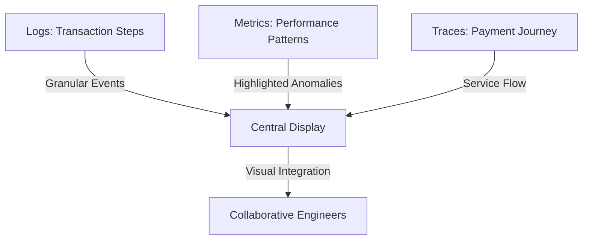
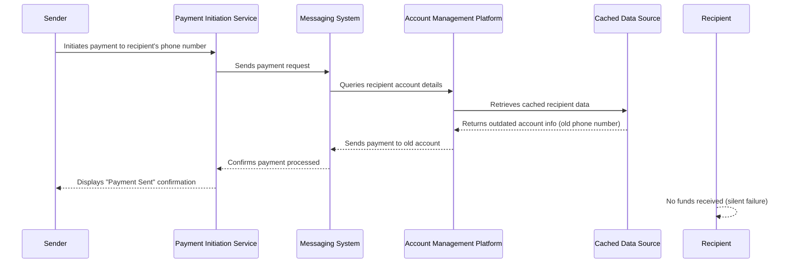
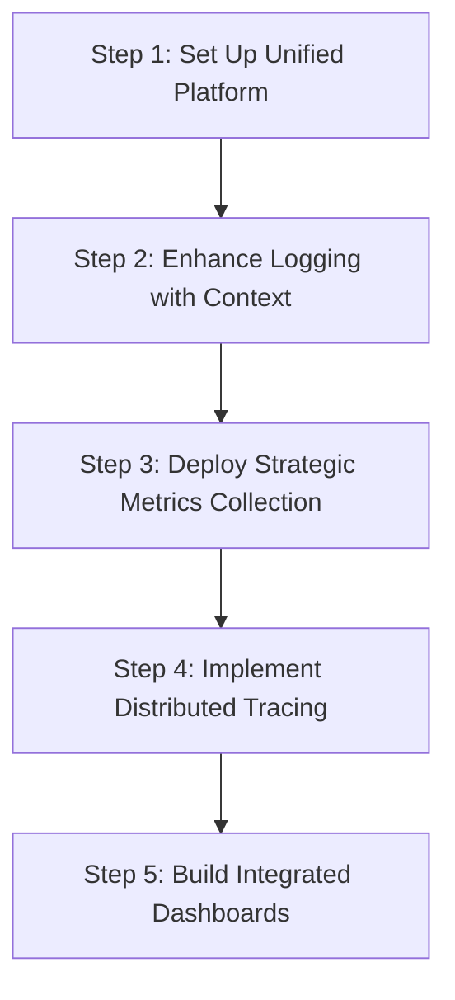
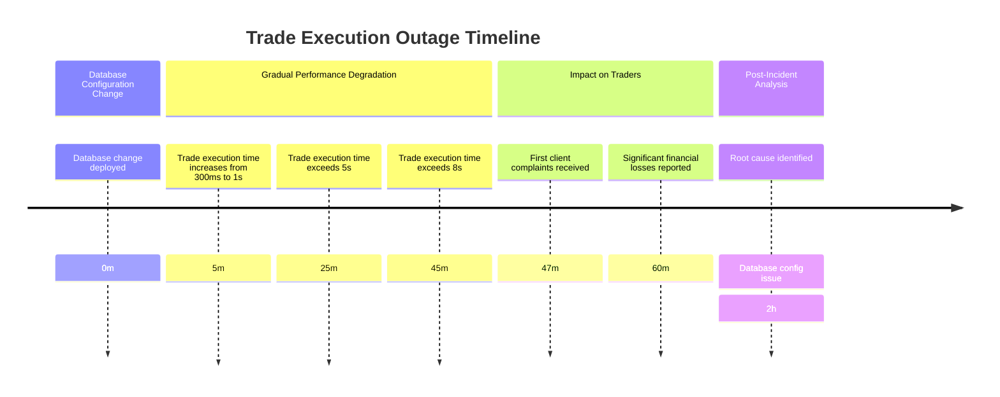
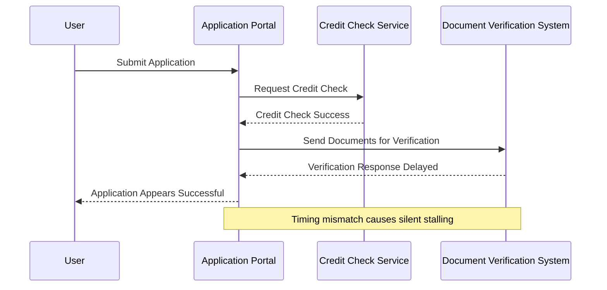
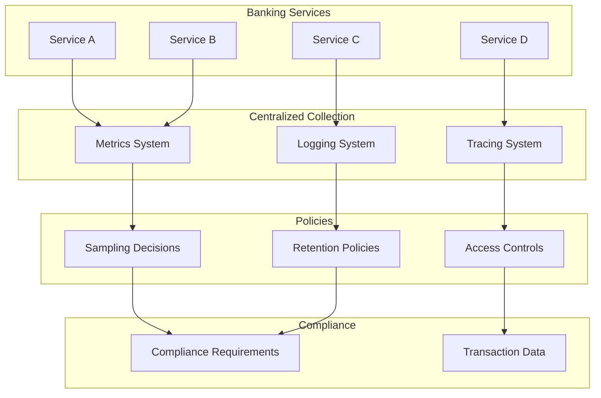
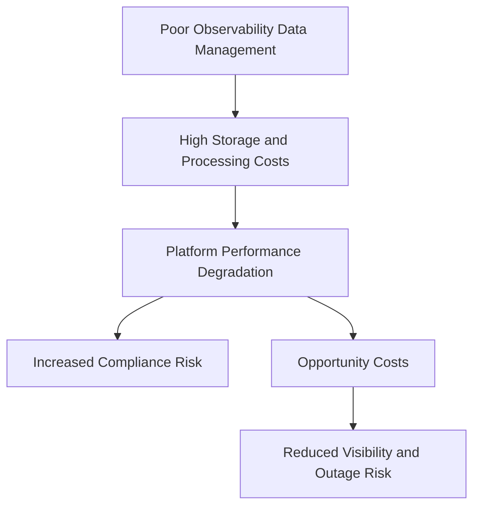

# Chapter 1: From Monitoring to Observability - The Evolution of System Visibility

## Chapter Overview

Welcome to the brutal reality of modern banking operations: your dashboards are green, your customers are screaming, and your CEO is one outage away from hiring a consultant with an even bigger ego. This chapter rips the rose-tinted glasses off traditional monitoring and exposes why your “all systems operational” banners are little more than comfort blankets for the uninformed. Observability isn’t just a buzzword—it’s the difference between finding problems before regulators do, and reading about your failures in tomorrow’s headlines. We’ll drag you through the evolution from naïve metric-chasing to evidence-based, customer-centric, and ruthlessly data-driven SRE practice. If you think CPU graphs save businesses, buckle up: this chapter is about measuring what matters before it bites your bottom line.

______________________________________________________________________

## Learning Objectives

- **Diagnose** the fatal gaps in traditional, infrastructure-centric monitoring and explain why “green” dashboards often mask business meltdowns.
- **Implement** transaction outcome logging and synthetic monitoring that actually reflects customer journeys and business results.
- **Integrate** the observability triad (logs, metrics, traces) to trace failures across distributed systems—no more playing “whodunit” with your microservices.
- **Prioritize** customer-centric visibility by tracking actual business outcomes—because nobody cares if your CPU is at 40% when trades don’t execute.
- **Apply** systems thinking to map, monitor, and troubleshoot the tangled mess of dependencies in modern banking stacks.
- **Adopt** proactive anomaly detection to catch issues before they torch your revenue (or your weekend).
- **Balance** data collection, retention, and compliance—maximizing insight without drowning in petabytes or getting fined into oblivion.
- **Cultivate** an evidence-based culture where data kills opinion, and technical debates are settled by facts, not hierarchy.

______________________________________________________________________

## Key Takeaways

- “All green” dashboards are often a lie. Customers don’t care about your server health—they care about their money moving.
- Traditional threshold monitoring is about as useful as a weather vane in a hurricane. You need outcome-based signals to see real business risk.
- If you can’t trace a transaction end-to-end, you’re flying blind. Distributed tracing isn’t optional; it’s survival gear.
- Infrastructure metrics don’t pay the bills—business outcomes do. Start measuring what matters to revenue, not what’s easy to collect.
- Most outages aren’t component failures—they’re botched handoffs, misaligned contracts, and timing mismatches between “healthy” systems.
- Waiting for alerts to trigger before investigating? Enjoy your career in incident response, because you’ll never get ahead of the curve.
- Collecting every log and metric without a plan just makes your problems more expensive and less searchable.
- Data-driven, blameless culture turns finger-pointing meetings into rapid problem-solving. Opinions are cheap; evidence fixes outages.
- Banks that treat observability as a compliance checkbox get compliance disasters—and customer churn as a bonus.
- If you’re not fixing your monitoring and observability practice, your competitors (and regulators) will thank you for the business.

______________________________________________________________________

## Panel 1: The Midnight Alert - Limitations of Traditional Monitoring

### Scene Description

A dimly lit banking operations center at 2:30 AM. A support engineer stares anxiously at multiple dashboards showing all green status indicators while simultaneously fielding angry calls from customers unable to complete international wire transfers. The disconnect between monitoring dashboards and customer reality creates visible confusion and frustration.

### Teaching Narrative

Traditional monitoring has created a dangerous illusion in banking systems: the belief that green dashboards equal customer satisfaction. This "monitoring mindset" focuses primarily on system health metrics (CPU, memory, disk space) while missing the true measure of reliability—customer experience. In banking, this disconnect is particularly perilous, as transaction processing systems can experience subtle failures that traditional threshold-based monitoring completely misses.

### Common Example of the Problem

A major European bank experienced a critical failure during end-of-day processing when their international wire transfer system began silently rejecting transactions with specific currency pairs involving emerging markets. Operations dashboards remained completely green—CPU utilization was normal, memory consumption within thresholds, network connectivity stable, and all service health checks passing. Meanwhile, customer support lines were flooded with complaints from multinational business clients unable to complete urgent transfers to suppliers in these regions.

The issue stemmed from the currency validation service, which was returning successful responses while incorrectly flagging legitimate transactions as potentially fraudulent due to a configuration change earlier that day. Without proper logging of the actual transaction outcomes and validation decisions, engineers spent over four hours searching for a problem that was invisible to their monitoring tools. During this time, the bank lost over €3 million in transaction fees and faced regulatory scrutiny for payment service disruption.

The sequence of events can be visualized as follows:

```mermaid
gantt
    title Timeline of Failure and Investigation
    dateFormat HH:mm
    axisFormat %H:%M
    section Failure
    Configuration change causes validation issue: done, 00:00, 00:01
    Transactions silently rejected: active, 00:01, 04:30
    section User Impact
    Customers begin reporting issues: active, 01:00, 04:30
    Call center overwhelmed by complaints: active, 01:30, 04:30
    section Investigation
    Engineers start troubleshooting: active, 02:00, 06:30
    Root cause identified: milestone, 06:30
    section Resolution
    Configuration fix deployed: active, 06:30, 07:00
    System stabilized: milestone, 07:00
```

This timeline highlights the critical disconnect between the monitoring system's "green" status and the real-world customer impact. While technical metrics showed no anomalies, a lack of visibility into transaction-level outcomes delayed root cause identification and resolution, exacerbating financial losses and reputational damage.

### SRE Best Practice: Evidence-Based Investigation

SRE teams must implement outcome-based monitoring that focuses on customer experience rather than just system health. This requires shifting from infrastructure-centric metrics to transaction-centric logging, capturing the actual success or failure of business operations. Evidence-based investigation starts with comprehensive logging of business outcomes: success rates for different transaction types, detailed error information when operations fail, and context-rich event recording that captures not just that something happened but why it happened.

Rather than relying solely on dashboards to infer system health, SREs should directly validate business functionality through synthetic transactions that simulate actual customer journeys. When incidents occur, the investigation should begin with customer impact assessment through outcome logs rather than system health checks. By collecting evidence of what customers are actually experiencing rather than what internal systems are reporting about themselves, SREs can bridge the gap between technical monitoring and business reality.

#### Checklist: Steps for Evidence-Based Investigation

1. **Capture Transaction-Level Data**

   - Log the success and failure rates of key transaction types.
   - Include detailed error information and context around failures.
   - Ensure logs are structured to be easily searchable and analyzable.

2. **Implement Synthetic Transactions**

   - Simulate common customer journeys regularly to validate core functionalities.
   - Use synthetic tests to identify potential issues before customers are impacted.

3. **Assess Customer Impact First**

   - Begin incident investigations by analyzing outcome logs for signs of degraded customer experience.
   - Prioritize understanding the scope and severity of customer-facing issues.

4. **Correlate Logs with System Metrics**

   - Use transaction logs to guide deeper investigation into related system health metrics.
   - Look for patterns or anomalies that align with observed customer impact.

5. **Focus on the "Why"**

   - Leverage context-rich events to understand root causes, not just symptoms.
   - Identify systemic issues that may lead to similar problems in the future.

6. **Iterate and Improve**

   - Regularly review and refine logging practices to align with evolving business processes.
   - Use post-incident reviews to identify gaps in evidence collection and monitoring.

By following this checklist, SRE teams can ensure investigations are grounded in customer outcomes, enabling faster and more effective resolution of incidents while improving overall reliability.

### Banking Impact

The business consequences of this monitoring gap are severe and multifaceted. Below is a summary of the financial, customer experience, and regulatory impacts illustrating the risks posed by undetected transaction processing issues:

| **Impact Area** | **Description** | **Examples/Details** |
| ----------------------- | ---------------------------------------------------------------------------------------------- | -------------------------------------------------------------------------------------------------------------------------------------------------------------------- |
| **Financial** | Direct loss of revenue from failed or abandoned transactions. | - 5,000-10,000 affected transactions per hour for a mid-sized bank.<br>- $50,000-$100,000 potential fee losses per hour. |
| **Customer Experience** | Rapid deterioration of trust and satisfaction due to unresolved transaction failures. | - Exponential increases in support calls.<br>- High-net-worth clients may sever relationships.<br>- Average lifetime value loss: $25,000-$250,000 per lost customer. |
| **Regulatory** | Risk of compliance failures for time-sensitive transactions and exposure to significant fines. | - PSD2 fines of up to 4% of annual revenue for severe disruptions.<br>- Potential penalties for missed securities settlements or tax payments. |
| **Reputation** | Long-term damage due to prolonged or repeated service disruptions. | - 38% of retail banking customers consider switching providers within 90 days of failure incidents. |

This disconnect between system health metrics and customer realities underscores the critical need for monitoring solutions that prioritize customer experience as a core measure of reliability.

### Implementation Guidance

1. **Implement Transaction Outcome Logging**\
   Ensure comprehensive transaction logging by capturing details such as:

   - Success/failure status
   - Error codes
   - Processing time
   - Business context (e.g., transaction type, amount, customer segment)\
     Example logging configuration in Python (using a structured logging library like `structlog`):

   ```python
   import structlog

   logger = structlog.get_logger()

   def log_transaction(transaction_id, status, error_code=None, processing_time=None, **business_context):
       logger.info(
           "transaction_outcome",
           transaction_id=transaction_id,
           status=status,
           error_code=error_code,
           processing_time=processing_time,
           **business_context
       )

   # Example usage
   log_transaction(
       transaction_id="abc123",
       status="success",
       processing_time=120,
       transaction_type="international_wire",
       amount=5000,
       customer_segment="premium"
   )
   ```

2. **Create Synthetic Transaction Monitors**\
   Develop synthetic monitors for critical customer journeys, such as account login, balance checks, and payment initiation. Example configuration for a synthetic monitor using a tool like Selenium in Python:

   ```python
   from selenium import webdriver
   from selenium.webdriver.common.by import By
   from selenium.webdriver.common.keys import Keys

   def synthetic_monitor():
       driver = webdriver.Chrome()
       try:
           driver.get("https://banking.example.com/login")
           driver.find_element(By.ID, "username").send_keys("test_user")
           driver.find_element(By.ID, "password").send_keys("test_password")
           driver.find_element(By.ID, "login").click()

           # Simulate balance check
           driver.find_element(By.LINK_TEXT, "Check Balance").click()
           balance = driver.find_element(By.ID, "balance").text

           # Placeholder for validation and alerting
           if not balance:
               print("Alert: Balance check failed!")
       finally:
           driver.quit()

   # Run synthetic monitor every 5 minutes
   synthetic_monitor()
   ```

3. **Develop Real-Time Business Impact Dashboards**\
   Use monitoring tools like Grafana or Kibana to build dashboards with key metrics:

   - Success rates, error percentages, and processing times for critical transactions
   - Segments by channel (e.g., mobile, web), customer tier, or transaction value\
     Example query for Elasticsearch:

   ```json
   {
       "aggs": {
           "by_channel": {
               "terms": { "field": "channel.keyword" },
               "aggs": {
                   "success_rate": {
                       "avg": { "field": "success_rate" }
                   },
                   "error_percentage": {
                       "avg": { "field": "error_percentage" }
                   }
               }
           }
       }
   }
   ```

4. **Establish Baseline Metrics and Anomaly Detection**\
   Implement anomaly detection using tools like Prometheus and Alertmanager. Example Prometheus rule for detecting anomalies in transaction volumes:

   ```yaml
   groups:
     - name: transaction-anomaly-detection
       rules:
         - alert: HighTransactionAnomaly
           expr: (rate(transaction_count[5m]) > historical_max_rate * 1.5)
           for: 2m
           labels:
             severity: warning
           annotations:
             summary: "Transaction volume anomaly detected"
             description: "Transaction rate has exceeded 1.5x the historical maximum."
   ```

5. **Implement Correlation Identifiers for End-to-End Visibility**\
   Use a unique correlation identifier to track transactions across all systems. Example implementation in a microservices architecture:

   - Include a `correlation_id` in HTTP headers or message payloads.
   - Example middleware in Python using Flask:

   ```python
   from flask import Flask, request, g
   import uuid

   app = Flask(__name__)

   @app.before_request
   def assign_correlation_id():
       if "X-Correlation-ID" in request.headers:
           g.correlation_id = request.headers["X-Correlation-ID"]
       else:
           g.correlation_id = str(uuid.uuid4())

   @app.after_request
   def add_correlation_id_to_response(response):
       response.headers["X-Correlation-ID"] = g.correlation_id
       return response

   # Example endpoint
   @app.route("/process_transaction", methods=["POST"])
   def process_transaction():
       # Use g.correlation_id for logging and tracing
       return {"message": "Transaction processed", "correlation_id": g.correlation_id}

   if __name__ == "__main__":
       app.run()
   ```

## Panel 2: The Observability Triad - Beyond Simple Health Checks

### Scene Description

A collaborative war room where engineers gather around a large display that integrates three interconnected views of the same payment system. The display is divided into three key panels:

1. **Logs**: Detailed logs of transaction steps, capturing granular events and data points.
2. **Metrics**: Performance metrics with unusual patterns highlighted, such as response time spikes or error rate anomalies.
3. **Traces**: A visual trace map showing a payment's journey across multiple microservices, with one service glowing red to indicate an issue, despite "passing" health checks.

Below is a conceptual representation of the war room setup:



The setup fosters collaboration by enabling engineers to visually correlate anomalies across logs, metrics, and traces, making it easier to uncover underlying issues. The glowing red service on the trace map sparks investigation into discrepancies that might not be evident from isolated health checks.

### Teaching Narrative

Observability represents a fundamental shift from asking "is it working?" to "why isn't it working as expected?" By leveraging three pillars—logs, metrics, and traces—SRE teams gain a comprehensive view of system behavior. Unlike monitoring that relies on predefined thresholds, observability enables engineers to explore unknown system states and answer questions they didn't anticipate when instrumenting the system, a critical capability when troubleshooting complex financial transaction flows.

### Common Example of the Problem

A leading retail bank implemented a new mobile payment feature allowing customers to send money to contacts using just a phone number. Despite extensive pre-launch testing, within days of release, approximately 8% of transactions were failing silently—the sender received confirmation of payment sent, but recipients never received the funds. Traditional monitoring showed all systems functioning normally—the payment initiation service, messaging system, and account management platform all reported healthy status with no alerts.

When customer complaints began escalating, engineers initially struggled to reproduce the issue. Checking individual component logs revealed no obvious errors, and metrics showed normal processing volumes and response times. After hours of investigation, the team discovered the problem was occurring only when recipients had recently changed their phone numbers—the payment was being processed correctly but routed to the recipient's old deactivated account. This failure scenario was invisible to component-level monitoring because each individual service was working as designed—the issue existed in the interaction between systems.

Below is a sequence diagram that illustrates the flow of a payment transaction in this scenario, highlighting where the failure occurred:



Only when distributed tracing was implemented could the team follow the end-to-end payment journey and identify the exact point of failure. The outdated contact information was being retrieved from the cached data source, which wasn't refreshing properly. This revealed a critical gap in system interactions that traditional monitoring could not uncover, underscoring the importance of observability in diagnosing complex, system-wide issues.

### SRE Best Practice: Evidence-Based Investigation

SRE teams must embrace the full observability triad—logs, metrics, and traces—to understand complex system behavior. Logs provide detailed event records and error contexts, metrics offer aggregated performance patterns and trends, and traces show request flows across distributed services. Together, they create a comprehensive view impossible with any single dimension alone.

Evidence-based investigation using the observability triad involves systematic correlation across these data types: identifying unusual metrics patterns, examining relevant logs for detailed error information, and using traces to follow transaction paths to pinpoint exactly where and why failures occur. This approach enables exploratory analysis that can answer unanticipated questions about system behavior—a critical capability for diagnosing novel failure modes in complex banking platforms.

The key shift is from reactive alerting on predefined conditions to proactive exploration of system state, enabling engineers to investigate issues before they trigger traditional alerts and to diagnose problems that don't match anticipated failure patterns. By instrumenting systems to emit rich, contextual data across all three observability dimensions, SRE teams create the foundation for evidence-based troubleshooting that can reveal complex interaction problems invisible to traditional monitoring.

#### Checklist: Steps for Evidence-Based Investigation

To make evidence-based investigation actionable, follow these steps:

1. **Correlate Metrics**

   - Identify unusual patterns, spikes, or drops in key performance indicators.
   - Look for anomalies in metrics that could indicate potential problems, such as increased latency, error rates, or resource saturation.

2. **Examine Logs**

   - Drill down into logs associated with the identified metric anomalies.
   - Search for error messages, stack traces, or warning events that provide detailed context about the issue.

3. **Analyze Traces**

   - Use distributed traces to follow the transaction flow across services.
   - Pinpoint bottlenecks, failures, or unexpected behavior at specific service touchpoints.

4. **Validate Findings Across Dimensions**

   - Cross-reference logs, metrics, and traces to confirm the root cause.
   - Ensure observations are consistent across all data types to avoid false assumptions.

5. **Iterate and Explore**

   - If the root cause remains unclear, explore additional metrics, logs, and trace data.
   - Formulate new hypotheses and investigate iteratively until the issue is fully understood.

By following this checklist, SRE teams can ensure a structured, evidence-based approach to troubleshooting, enabling faster and more reliable resolution of complex system issues.

### Banking Impact

The business impact of incomplete observability in banking systems extends far beyond technical operations. Without comprehensive visibility across the observability triad, banks face significant business consequences:

| **Category** | **Impact** | **Example Data Point** |
| ------------------------ | ------------------------------------------------------------------------------------------------------------------------------------------------------- | ------------------------------------------------------------------------------------------------------------------------- |
| **Financial Losses** | Undiagnosed transaction failures lead to direct revenue loss from missed transaction fees and indirect costs from churned customers. | A mid-sized bank processing 50,000 daily mobile payments with an 8% silent failure rate could lose $20,000-$40,000 daily. |
| **Customer Trust** | Silent transaction failures erode trust, reducing customer engagement and impacting digital transformation ROI. | 67% of customers who experience unexplained payment failures reduce usage of that payment method. |
| **Operational Costs** | Lack of observability increases troubleshooting time, leading to higher engineering costs and prolonged system instability. | Average incident investigation takes 4-6 hours longer without distributed tracing, costing $200,000+ annually per team. |
| **Competitive Pressure** | Banks with better observability improve reliability, gaining a competitive edge in customer acquisition and retention in the digital banking landscape. | Superior reliability directly influences provider selection in retail banking, where digital experience is a key driver. |

By addressing these challenges with robust observability practices, banks can mitigate financial risks, retain customer trust, reduce operational inefficiencies, and maintain competitive advantage in a rapidly evolving industry.

### Implementation Guidance

To successfully implement the observability triad, follow these step-by-step actions, illustrated in the diagram below:



1. **Set Up Unified Platform**\
   Establish a centralized observability platform that integrates all three pillars—logs, metrics, and traces. Configure the platform to enable correlation of data through shared identifiers such as transaction IDs, time windows, and service relationships. Ensure the platform supports seamless pivoting between views for quick root cause analysis.

2. **Enhance Logging with Context**\
   Move beyond basic error logging by including structured business and operational context. Log important details such as transaction types, customer segments, amounts, success/failure outcomes, processing times, and downstream dependencies. Use consistent formatting and field naming conventions across all services to facilitate cross-service correlation.

3. **Deploy Strategic Metrics Collection**\
   Instrument your services to collect metrics at both technical and business levels:

   - **Technical Metrics**: CPU usage, memory consumption, connection counts.
   - **Business Metrics**: Transaction rates, error percentages, processing times.\
     Segment metrics by critical business dimensions like customer type, transaction category, and channel to provide targeted insights.

4. **Implement Distributed Tracing**\
   Roll out distributed tracing across all critical transaction flows. Ensure trace IDs propagate through all systems, including legacy platforms, using adapters or proxies where necessary. Verify full service coverage so you can trace transactions end-to-end, identifying bottlenecks and failures with precision.

5. **Build Integrated Dashboards**\
   Develop dashboards that combine logs, metrics, and traces into unified, business-centered visualizations. For example:

   - Display transaction success rates derived from metrics.
   - Include error details sourced from logs.
   - Show end-to-end processing flows from traces.\
     Focus on representing customer journeys and business outcomes, rather than isolating technical components, to align observability insights with organizational goals.

## Panel 3: Customer-Centric Visibility - Measuring What Matters

### Scene Description

Two adjacent workstations illustrate contrasting approaches to monitoring and observability:

```
+-----------------------------+       +---------------------------------------+
| Workstation 1:              |       | Workstation 2:                       |
|                             |       |                                       |
| [ Engineer ]                |       | [ Engineer ]                          |
|                             |       |                                       |
| - Configuring alerts:       |       | - Building customer-focused           |
|   - Server CPU thresholds   |       |   dashboards:                         |
|   - Memory usage limits     |       |   - End-to-end payment completion     |
|                             |       |     rates                             |
|                             |       |   - Authorization success metrics     |
|                             |       |   - Customer transaction journey      |
|                             |       |     times with bottlenecks            |
+-----------------------------+       +---------------------------------------+
```

On the left, the engineer focuses on system-centric metrics by setting alerts for infrastructure components, such as server CPU and memory thresholds. Meanwhile, on the right, the engineer adopts a customer-centric approach by developing dashboards that visualize key business outcomes, including payment completion rates, authorization success percentages, and transaction journey times. Bottlenecks in the customer flow are highlighted in red, emphasizing areas requiring immediate attention.

### Teaching Narrative

The transition to observability requires a fundamental mindset shift—from infrastructure-centric to customer-centric measurements. While traditional monitoring focuses on system resources and component status, true observability prioritizes business outcomes like transaction success rates, processing times, and customer journey completion. This shift is particularly crucial in banking, where the impact of system issues directly affects customer finances and trust.

### Common Example of the Problem

A global investment bank operating a high-volume trading platform relied on comprehensive infrastructure monitoring covering hundreds of servers, network devices, and application instances. Their dashboards tracked CPU utilization, memory consumption, disk I/O, and network throughput with sophisticated alerting. Despite this extensive monitoring, the firm experienced a significant trading outage that went undetected by their systems for 47 minutes during a volatile market period.

The incident began when a database configuration change caused gradual degradation in trade execution times without triggering any resource utilization alerts. While the systems continued processing trades, execution times slowly increased from 300 milliseconds to over 8 seconds. This performance degradation occurred without any components exceeding traditional monitoring thresholds—CPUs remained below 70% utilization, memory was adequate, and no error logs were generated. However, the impact on traders was severe: time-sensitive trades weren't executing at competitive speeds, causing significant financial losses during a market correction.

To better illustrate the sequence of this issue, consider the following timeline of events:



The outage was eventually discovered only when clients began calling to complain about delayed executions. Post-incident analysis revealed that while all components appeared healthy from an infrastructure perspective, the actual business function—fast trade execution—was severely compromised. The firm had no monitoring centered on the customer experience of trade execution speed across the complete trading journey.

This example highlights the limitations of infrastructure-centric monitoring and underscores the need for customer-centric observability, where business outcomes like execution speed and journey completion are prioritized over raw metrics like CPU or memory usage.

### SRE Best Practice: Evidence-Based Investigation

SRE teams must implement customer-journey observability that measures what actually matters to users rather than just internal system health. This approach requires defining and instrumenting critical customer journeys (e.g., completing a trade, making a payment, applying for a loan) and measuring their success rates, completion times, and error rates end-to-end.

Evidence-based investigation through customer-centric observability involves identifying the key transactions that define customer experience, instrumenting each step of those journeys, and measuring outcomes that directly impact customers. For trading platforms, this means measuring actual execution time from order submission to confirmation. For payment systems, it involves tracking the complete processing time from initiation to recipient confirmation. For lending platforms, it requires monitoring application progress from submission to decision.

The key shift is defining "health" based on customer experience rather than system metrics. A system should be considered degraded when customer journeys slow down or fail, regardless of whether infrastructure metrics remain within thresholds. This customer-centric approach ensures observability aligns with actual business impact rather than technical indicators that may have little correlation with user experience.

#### Checklist: Implementing Customer-Journey Observability

1. **Identify Critical Customer Journeys**

   - List key transactions that define the user experience (e.g., payment completion, trade execution).
   - Prioritize journeys based on business impact and customer importance.

2. **Define Success Metrics**

   - Determine measurable outcomes for each journey, such as:
     - Success rate (e.g., transaction completion percentage).
     - Latency (e.g., end-to-end execution time).
     - Error rate (e.g., failure percentage at each step).

3. **Instrument Each Step**

   - Add instrumentation to monitor every step of the journey (e.g., API requests, database queries).
   - Ensure visibility into dependencies and bottlenecks across the journey.

4. **Correlate Metrics with Customer Impact**

   - Map technical metrics to customer outcomes to identify meaningful indicators.
   - Avoid relying solely on infrastructure-focused thresholds (e.g., CPU or memory utilization).

5. **Set Alerting Based on Customer Experience**

   - Configure alerts for anomalies in customer-centric metrics (e.g., increased transaction failures).
   - Ensure alerts reflect user-facing degradation rather than purely technical issues.

6. **Continuously Iterate**

   - Regularly validate that metrics and instrumentation align with evolving customer needs.
   - Incorporate feedback from incident reviews and customer reports to refine observability.

By following this checklist, SRE teams can build and maintain an observability strategy that prioritizes customer experience, enabling faster, evidence-based investigations and minimizing business impact during incidents.

### Banking Impact

The business impact of maintaining infrastructure-centric rather than customer-centric observability is substantial across multiple dimensions. The following table summarizes the key consequences across financial, competitive, regulatory, and operational areas:

| **Dimension** | **Impact** | **Example/Insight** |
| --------------- | ------------------------------------------------------------------------------------------------------- | ------------------------------------------------------------------------------------------------------------------------------------------------------------------------------ |
| **Financial** | Significant losses from undetected degradations in customer experience. | An investment bank experienced approximately $3.8 million in trading losses during a 47-minute period of slow executions, despite all systems appearing "green" operationally. |
| **Competitive** | Rapid erosion of market share and client trust when performance issues arise. | High-frequency trading firms often switch providers after just two significant execution delays, as milliseconds determine trade profitability in this sector. |
| **Regulatory** | Increased scrutiny and potential non-compliance with monitoring requirements tied to customer outcomes. | Regulations like MiFID II require monitoring execution quality and ensuring "best execution," which is unattainable without customer-journey observability. |
| **Operational** | Inefficient incident response due to reliance on non-correlated infrastructure metrics. | Studies indicate banks waste 30-40% of incident response time investigating unrelated system components, leading to millions in misallocated engineering resources. |

This shift to customer-centric observability is particularly critical in financial services, where system issues directly impact customer trust, finances, and overall business viability. Moving beyond infrastructure metrics to focus on business outcomes ensures not only compliance and efficiency but also long-term competitive advantage.

### Implementation Guidance

1. Define critical customer journeys for each major banking function (payments, trading, account servicing, lending), identifying all steps from initiation to completion and establishing clear success criteria for each journey from the customer's perspective.

2. Implement end-to-end transaction tracking with unique identifiers that follow customer requests through all systems, enabling measurement of complete journey times rather than just component-level performance.

3. Create customer-centric dashboards organized by business function rather than technical architecture, showing success rates, completion times, and error percentages for key customer journeys with business-meaningful segmentation (customer type, transaction value, channel).

4. Establish customer-experience SLOs (Service Level Objectives) for each critical journey—setting targets for successful completion rates, end-to-end processing times, and error percentages—and measure compliance based on actual customer experience rather than infrastructure availability.

5. Deploy synthetic customer journey testing that regularly executes complete business transactions through production systems, measuring success and performance from the customer perspective while detecting subtle degradations that infrastructure monitoring would miss.

## Panel 4: Systems Thinking - Understanding Complex Interactions

### Scene Description

An engineer investigates a failed mortgage application processing incident by following a visual trace flow that spans multiple systems. The trace reveals that while each individual system shows healthy status, a timing discrepancy between the credit check service and document verification system causes applications to stall silently after appearing to succeed.

Below is a simplified visual representation of the interaction flow and timing mismatch:



This sequence highlights how the delayed response from the document verification system leads to applications stalling, despite all systems reporting healthy status independently.

### Teaching Narrative

Modern banking systems are complex distributed environments where seemingly unrelated components interact in unexpected ways. Observability enables systems thinking—understanding not just individual components but their relationships and interactions. This perspective allows SRE teams to identify emergent behaviors and interdependency issues that single-component monitoring would never reveal, essential for maintaining reliability in today's microservice banking architectures.

### Common Example of the Problem

A large mortgage lender implemented a modernization initiative, breaking their monolithic loan origination system into microservices handling discrete functions: application intake, document collection, credit verification, income validation, underwriting, and closing preparation. Each service was individually monitored with comprehensive health checks, performance metrics, and error logging.

Despite this monitoring, the bank began experiencing a puzzling pattern where approximately 18% of mortgage applications appeared to complete successfully but never progressed to underwriting. Customer satisfaction plummeted as applicants who believed they had successfully submitted all requirements received no updates for days, eventually calling to complain about delays.

Initial investigation was challenging because each component reported healthy status—the document collection service confirmed successful uploads, the credit verification service showed successful execution, and the underwriting queue indicated normal operation. Only when examining the interactions between systems did the true problem emerge: the document verification service had a 15-minute processing time for certain document types, while the credit verification service expected results within 10 minutes before timing out its waiting state. However, rather than generating an error, the credit service simply marked the timeout as "incomplete documentation" in a secondary status field not connected to the main monitoring system. The applications appeared successful to customers but silently stalled due to this timing mismatch between interacting services—a classic systems thinking failure invisible to component-level monitoring.

#### Timeline of Events Leading to the Issue

```mermaid
sequenceDiagram
    participant Customer
    participant AppIntake as Application Intake Service
    participant DocCollect as Document Collection Service
    participant CreditCheck as Credit Verification Service
    participant DocVerify as Document Verification Service
    participant Underwriting as Underwriting Queue

    Customer->>AppIntake: Submit Application
    AppIntake->>DocCollect: Request Documents
    DocCollect->>Customer: Request Uploads
    Customer->>DocCollect: Upload All Documents
    DocCollect->>DocVerify: Send Documents for Verification
    DocVerify-->>DocCollect: Acknowledge Receipt (15 min processing for some docs)
    DocVerify->>DocVerify: Process Documents (15 min for some)
    AppIntake->>CreditCheck: Trigger Credit Verification
    CreditCheck->>DocVerify: Check for Verification Results (timeout after 10 min)
    CreditCheck-->>AppIntake: Mark as Incomplete (silently fails)
    AppIntake-->>Customer: Application Submitted Successfully (status mismatch)
    AppIntake-x->Underwriting: No Progress to Underwriting (application stalls)
```

This timeline highlights the sequence of interactions and the critical timing mismatch between the credit verification service and document verification service. The lack of error propagation and disconnected monitoring systems masked the issue, resulting in silent failures that only became apparent through customer complaints. By visualizing the dependencies and timing gaps, we see how systems thinking can reveal emergent behaviors invisible to isolated component monitoring.

### SRE Best Practice: Evidence-Based Investigation

SRE teams must implement systems-thinking observability that reveals interactions and dependencies between components, not just the health of individual services. This approach requires mapping the complete topology of service relationships, instrumenting the interfaces between systems, and creating visualizations that show how transactions flow through the entire architecture.

Evidence-based investigation using systems thinking involves tracing transactions across all involved services, examining timing relationships between dependent operations, identifying synchronization issues or race conditions, and understanding how data transformations between systems might create compatibility problems. This holistic perspective reveals issues that emerge from interactions rather than component failures—often the most challenging problems in distributed systems.

The key shift is from isolated component monitoring to relationship-aware observability that shows how systems behave together as an integrated whole. By mapping dependencies and tracking how transactions traverse system boundaries, SRE teams can identify coordination failures, timing mismatches, and contract violations that cause emergent failures despite all individual components appearing healthy.

#### Checklist: Steps for Evidence-Based Investigation

01. **Define the Scope**\
    Identify the affected transaction or workflow and determine the systems or services involved.

02. **Trace Transaction Flow**\
    Map the end-to-end path of the transaction, noting all service boundaries it crosses.

03. **Analyze Timing Relationships**\
    Examine logs, traces, or metrics to identify timing discrepancies between dependent services.

04. **Check Interface Behavior**\
    Verify that APIs, contracts, and data transformations between systems adhere to expected behaviors.

05. **Identify Synchronization Issues**\
    Look for race conditions, deadlocks, or other synchronization problems in distributed workflows.

06. **Correlate Observability Data**\
    Use logs, metrics, and traces collectively to pinpoint where interactions deviate from expected patterns.

07. **Validate Assumptions**\
    Test assumptions about system behaviors under different conditions to uncover hidden dependencies.

08. **Document Findings**\
    Record the issue's root cause, contributing factors, and any systemic behaviors observed for future reference.

09. **Propose Solutions**\
    Develop short-term mitigations and long-term improvements to address the identified issue.

10. **Share Lessons Learned**\
    Communicate findings with the broader team to improve collective understanding of system interactions.

By following this structured approach, SRE teams can systematically investigate complex failures, identify root causes grounded in evidence, and enhance the reliability of distributed systems.

### Banking Impact

The business impact of lacking systems-thinking observability in modern banking architectures extends far beyond technical operations. The table below summarizes the key financial, customer, regulatory, and competitive impacts:

| **Impact Area** | **Description** | **Example Metrics** |
| ------------------------ | ------------------------------------------------------------------------------------------------------------------------------------------------------- | ----------------------------------------------------------- |
| **Revenue Loss** | Stalled transactions directly reduce revenue. Applications that silently fail before completion result in lost loan origination opportunities. | $4.2M monthly loss from 18% stalled applications. |
| **Customer Acquisition** | Marketing and sales costs are wasted when applications stall and never complete, reducing the return on investment for customer acquisition efforts. | $750K wasted acquisition spending monthly. |
| **Regulatory Risks** | Inability to demonstrate transaction visibility or provide timely updates violates mortgage regulations, exposing the business to compliance penalties. | Breach of regulatory obligations for timely status updates. |
| **Competitive Loss** | Customers abandoning stalled applications often complete their mortgage process with competitors, leading to immediate and long-term value loss. | 60-70% of abandoned customers move to competitors. |

By quantifying these impacts, organizations can better understand the critical need for systems-thinking observability to mitigate risks and maintain reliability in complex banking ecosystems.

### Implementation Guidance

1. **Service Dependency Mapping**\
   Create comprehensive service dependency maps for all critical banking transactions. Document both explicit dependencies (direct API calls) and implicit dependencies (shared databases, configuration systems, external services). For each interaction, define expected timing, data contracts, and error-handling expectations. Use tools like `OpenAPI` or `AsyncAPI` to standardize interface documentation. Below is an example of a YAML-based service dependency definition:

   ```yaml
   service: credit-check-service
   dependencies:
     - service: document-verification-service
       interaction: synchronous
       expected_latency_ms: 100
       error_handling: retry-on-timeout
     - service: logging-service
       interaction: asynchronous
       expected_latency_ms: 50
       error_handling: ignore-on-failure
   ```

2. **Distributed Tracing with Context Propagation**\
   Implement distributed tracing with context propagation across all services in critical transaction paths. Ensure each request is assigned a unique trace ID that propagates through system boundaries. Use tools like `OpenTelemetry`, and integrate with tracing backends such as `Jaeger` or `Zipkin`. Below is a simple example of instrumenting an API endpoint with `OpenTelemetry` in Python:

   ```python
   from opentelemetry import trace
   from opentelemetry.instrumentation.flask import FlaskInstrumentor

   app = Flask(__name__)
   FlaskInstrumentor().instrument_app(app)

   tracer = trace.get_tracer(__name__)

   @app.route("/process_application", methods=["POST"])
   def process_application():
       with tracer.start_as_current_span("process_application"):
           # Business logic
           return {"status": "success"}, 200
   ```

3. **Interface Contracts and Health Checks**\
   Develop interface contracts and health checks between interacting services that verify not just availability but compatibility. For example, use contract testing tools like `Pact` to validate that systems correctly handle each other's data formats, timing expectations, and error scenarios. Here's an example of a contract test in JavaScript:

   ```javascript
   const { Pact } = require('@pact-foundation/pact');

   const provider = new Pact({
       consumer: 'CreditCheckService',
       provider: 'DocumentVerificationService',
   });

   describe('Pact Verification', () => {
       it('should validate the interaction contract', async () => {
           await provider.addInteraction({
               state: 'document exists',
               uponReceiving: 'a request for document verification',
               withRequest: {
                   method: 'GET',
                   path: '/verify',
                   query: { documentId: '1234' },
               },
               willRespondWith: {
                   status: 200,
                   headers: { 'Content-Type': 'application/json' },
                   body: { verified: true },
               },
           });

           // Run your client code here to fulfill the interaction
           await provider.verify();
       });
   });
   ```

4. **Visualization Dashboards**\
   Create visualization dashboards showing transaction flows across system boundaries. These dashboards should include timing and volume metrics for each inter-service interaction, highlighting bottlenecks, timing mismatches, or volume imbalances. Below is a simple example of a Mermaid diagram to represent a transaction flow:

   ```mermaid
   graph TD
       A[User Request] --> B[API Gateway]
       B --> C[Credit Check Service]
       C --> D[Document Verification Service]
       C --> E[Logging Service]
       D --> F[Database]
   ```

5. **Alert Correlation Across Services**\
   Establish alert correlation across dependent services by implementing "vertical" alerting that understands service relationships. For example, configure alerts in systems like `Prometheus` to include dependency context. Use this sample alert configuration for a timing mismatch:

   ```yaml
   groups:
     - name: service-alerts
       rules:
         - alert: TimingMismatch
           expr: histogram_quantile(0.95, rate(service_request_duration_seconds_bucket[5m])) > 0.5
           labels:
             severity: warning
           annotations:
             summary: Request latency is higher than expected for Credit Check Service
             description: "The 95th percentile latency for Credit Check Service has exceeded the threshold, indicating potential timing mismatches with dependent services."
   ```

## Panel 5: Proactive Issue Detection - From Reactive to Predictive

### Scene Description

A support engineer reviews an automated anomaly detection alert showing unusual patterns in authentication service response times that don't yet breach thresholds. By exploring trace data, she identifies an emerging authentication bottleneck and implements a solution before any customers experience delays in accessing their accounts.

### Teaching Narrative

The ultimate promise of observability is the shift from reactive firefighting to proactive system improvement. By continuously analyzing patterns across logs, metrics, and traces, SRE teams can identify anomalies and potential issues before they impact customers. This proactive stance is transformative for banking reliability, where preventing a single outage can preserve millions in transactions and protect the institution's reputation.

### Common Example of the Problem

A major credit card processor handled millions of authorization requests daily with strict reliability requirements—even brief outages could result in declined transactions and significant revenue loss. Their traditional monitoring approach was entirely threshold-based, alerting only when systems crossed critical levels like 90% CPU utilization, error rates above 2%, or response times exceeding 500ms.

This reactive approach led to a pattern of discovering problems only after customer impact had already occurred. In one significant incident, an authorization service began experiencing gradually increasing response times over several hours due to a memory leak in a recently deployed code change. Because the degradation was gradual and remained below alert thresholds until the final minutes before failure, the issue was discovered only when transaction declines began affecting customers at scale.

The timeline below illustrates how the issue unfolded and highlights the critical missed warning signs that traditional monitoring failed to detect:

```mermaid
gantt
    title Gradual Degradation Leading to Outage
    dateFormat  HH:mm
    axisFormat  %H:%M
    section System Behavior
    Normal Operation         :done,    op1, 00:00, 3h
    Increased Memory Usage   :active,  mem1, 03:00, 2h
    Frequent Garbage Collection :active, gc1, 05:00, 1h
    Rising Response Times (Below Threshold) :active, rt1, 06:00, 30m
    Threshold Breached and Outage :crit,   fail1, 06:30, 47m

    section Monitoring Alerts
    No Alerts (Below Threshold) :done, alert1, 00:00, 6h 30m
    Alert Triggered             :crit, alert2, 06:30, 47m
```



Post-incident analysis revealed clear warning patterns had been present hours before the outage—subtle changes in memory usage patterns, increasing garbage collection frequency, and gradually rising (but still below-threshold) response times. Traditional monitoring missed these precursors because they didn't violate any predefined thresholds despite clearly deviating from normal behavior patterns. The outage ultimately affected approximately 380,000 transactions representing $42 million in purchase volume over 47 minutes before emergency rollback procedures restored service.

### SRE Best Practice: Evidence-Based Investigation

SRE teams must implement anomaly detection and pattern analysis that identifies unusual system behavior before it triggers traditional threshold violations. This approach requires establishing baseline patterns of normal behavior across multiple dimensions, continuously comparing current behavior against these baselines, and identifying statistically significant deviations that may indicate emerging problems.

Evidence-based investigation using proactive observability involves analyzing trend lines rather than just current values, detecting rate-of-change anomalies, identifying unusual correlations between metrics, and recognizing subtle pattern shifts that human operators might miss. These techniques enable teams to detect problems in their formative stages, often hours before they would trigger traditional alerts.

The key shift is from simple threshold monitoring to behavioral analysis that understands what constitutes "normal" for each system and identifies deviations from established patterns. By implementing machine learning-based anomaly detection, statistical trend analysis, and pattern recognition algorithms, SRE teams can identify problems before they impact customers rather than responding after damage has occurred.

#### Checklist for Evidence-Based Investigation

To make evidence-based investigation actionable, follow this checklist to ensure a systematic approach:

1. **Establish Baselines**:

   - Define normal behavior for key metrics, logs, and traces across all critical dimensions.
   - Use historical data to set dynamic baselines that adjust to seasonal or workload variations.

2. **Analyze Trends**:

   - Continuously monitor trend lines for all key metrics.
   - Look for gradual deviations that might not immediately trigger alerts.

3. **Detect Rate-of-Change Anomalies**:

   - Identify unusual spikes or drops in behavior over short periods of time.
   - Pay attention to metrics with rapid changes, as they often indicate emerging issues.

4. **Correlate Metrics**:

   - Investigate relationships between different metrics to find unusual correlations.
   - Use correlation analysis to uncover hidden dependencies or cascading failures.

5. **Leverage Advanced Techniques**:

   - Apply machine learning for anomaly detection and pattern recognition.
   - Use statistical models to identify subtle deviations not apparent in raw data.

6. **Collaborate and Validate**:

   - Work with domain experts to validate findings and refine baselines.
   - Cross-check anomalies against recent changes in the system (e.g., deployments, configuration updates).

7. **Take Proactive Action**:

   - Prioritize emerging anomalies based on potential customer impact.
   - Implement fixes or mitigations before customer-facing issues arise.

By following this checklist, SRE teams can enhance their proactive monitoring capabilities, enabling early detection and resolution of issues to maintain system reliability and customer satisfaction.

### Banking Impact

The business impact of reactive versus proactive observability in banking systems is substantial across multiple dimensions. The table below highlights key differences in financial, customer trust, operational, and regulatory outcomes between these two approaches:

| **Impact Dimension** | **Reactive Observability** | **Proactive Observability** |
| ------------------------- | ---------------------------------------------------------------------------------------------------------------------------------------------------------- | ---------------------------------------------------------------------------------------------------------------------------- |
| **Financial Losses** | Direct financial losses from preventable outages—e.g., a $380,000 loss in transaction fees and compensation costs during one outage. | Avoidance of preventable losses by addressing emerging issues before they impact transactions, preserving revenue streams. |
| **Customer Trust** | Erosion of customer trust—28% of credit card users may switch to secondary usage after a declined transaction, causing a 44% revenue drop. | Maintained trust and customer loyalty by preventing service disruptions and ensuring seamless financial transactions. |
| **Operational Costs** | Higher remediation costs—incidents detected after customer impact cost 4-6 times more to resolve due to complex troubleshooting and compensation expenses. | Lower remediation costs through early detection, simplified troubleshooting, and elimination of emergency response overhead. |
| **Regulatory Compliance** | Increased regulatory scrutiny—failure to meet proactive risk management requirements can lead to penalties or unfavorable assessments. | Preferential regulatory treatment for demonstrating proactive detection capabilities, bolstering compliance and resilience. |

By transitioning to proactive observability, banks can not only mitigate risks but also gain significant financial, operational, and reputational advantages. This shift is critical in safeguarding millions of transactions and ensuring long-term customer trust.

### Implementation Guidance

1. **Dynamic Baselining for Critical Metrics**\
   Implement dynamic baselining for all critical metrics (response times, error rates, transaction volumes) that establishes normal patterns with time-of-day, day-of-week, and seasonal variations. This allows detection of deviations from expected behavior rather than relying on static thresholds. Below is an example configuration for setting up dynamic baselining using Prometheus and a machine learning toolkit:

   ```yaml
   # Prometheus configuration for anomaly detection with dynamic baselining
   rule_files:
     - "alert.rules.yml"

   alerting:
     alertmanagers:
       - static_configs:
           - targets: ["alertmanager:9093"]

   # Sample alert rule based on dynamic baselines
   groups:
     - name: authentication_service
       rules:
         - alert: HighResponseTimeAnomaly
           expr: |
             (rate(http_request_duration_seconds_sum[5m]) / rate(http_request_duration_seconds_count[5m])) 
             > (predict_linear(http_request_duration_seconds_sum[1h], 3600) * 1.2)
           for: 2m
           labels:
             severity: warning
           annotations:
             summary: "High response time anomaly detected"
             description: "The authentication service response times are deviating significantly from the predicted baseline."
   ```

2. **Machine Learning-Based Anomaly Detection**\
   Deploy machine learning-based anomaly detection to continuously analyze system behavior across multiple dimensions. Use tools like TensorFlow, PyTorch, or open-source solutions such as Facebook's Kats for time-series forecasting. For example:

   ```python
   from kats.models.prophet import ProphetModel, ProphetParams
   from kats.consts import TimeSeriesData

   # Load data (replace with your metrics data)
   ts_data = TimeSeriesData(df)

   # Train a Prophet model for anomaly detection
   params = ProphetParams()
   model = ProphetModel(ts_data, params)
   model.fit()

   # Forecast future behavior
   forecast = model.predict(steps=48, freq="H")
   anomalies = forecast[forecast['fcst_upper'] < ts_data.value]
   print("Detected anomalies:", anomalies)
   ```

3. **Early Warning Systems for Leading Indicators**\
   Create early warning systems that monitor leading indicators of critical banking functions. For example, monitor the authentication service's performance degradation as a predictor of payment processing issues. Use dependency graphs to map these relationships. A simple dependency flow could look like:

   ```mermaid
   graph TD
   A[Authentication Service] --> B[Payment Processing Service]
   B --> C[Transaction Settlement System]
   ```

4. **Progressive Alerting by Severity Levels**\
   Establish progressive alerting with multiple severity levels based on deviation significance. For instance:

   - **Info Alerts**: Minor deviations or unusual patterns.
   - **Warning Alerts**: Moderate anomalies requiring investigation.
   - **Critical Alerts**: Significant anomalies with immediate customer impact.

   Example Prometheus alert rule for progressive severity:

   ```yaml
   - alert: ModerateResponseTimeAnomaly
     expr: rate(http_request_duration_seconds_sum[5m]) > 2 * predict_linear(http_request_duration_seconds_sum[1h], 3600)
     labels:
       severity: warning
   ```

5. **Automated Pattern Analysis for Post-Incident Data**\
   Develop automated tools that analyze post-incident data to identify subtle precursors and warning signs. Use the lessons learned to implement specific detection mechanisms for recurring patterns. For example, implement a signature-based detection system where known patterns of past incidents trigger preemptive alerts.

## Panel 6: The Data Challenge - Managing Observability Information

### Scene Description

A systems architect plans an observability implementation on a whiteboard, showing data flowing from dozens of banking services into centralized collection systems. The diagram highlights sampling decisions, retention policies, and access controls, with notes about compliance requirements for transaction data and cost optimization strategies. Below is a representation of the whiteboard using a Mermaid diagram to illustrate the key components and their relationships:



This visual aid captures the flow of observability data from distributed banking services into centralized collection systems, while also emphasizing the application of policies and compliance considerations. It provides a structured view of the interconnected components and their roles in managing observability information effectively.

### Teaching Narrative

The wealth of data generated by comprehensive observability creates its own challenges. Banking SRE teams must carefully balance data completeness with storage costs, compliance requirements, and query performance. Implementing effective sampling strategies, retention policies, and access controls ensures that teams can gain insights without drowning in data or creating compliance issues related to sensitive financial information.

### Common Example of the Problem

A global bank implemented a comprehensive observability platform across their retail digital banking environment, instrumented for complete data collection across logs, metrics, and traces. Within weeks, they encountered significant challenges managing the resulting data volumes—their systems were generating over 20TB of observability data daily from just their customer-facing digital channels.

This data tsunami created multiple problems that impacted cost, performance, and compliance. The table below summarizes these challenges and their effects:

| **Problem Area** | **Specific Challenge** | **Impact** |
| ----------------------- | ------------------------------------------------------------------------------------- | ------------------------------------------------------------------------------------ |
| **Storage Costs** | Over 20TB of data generated daily, leading to skyrocketing storage expenses. | Annual storage costs exceeded $1.8 million, straining operational budgets. |
| **Query Performance** | High data volume degraded query performance, with common searches taking 30+ seconds. | Slower incident response times and reduced efficiency during troubleshooting. |
| **Compliance Risks** | Sensitive customer data appeared in unmasked log entries. | Compliance violations and emergency efforts to purge improperly stored information. |
| **Retention Conflicts** | Retention policies for operational data conflicted with regulatory requirements. | Inability to maintain required transaction records and risk of regulatory penalties. |

The technical team found themselves paradoxically less effective despite having more data—unable to quickly find relevant information, struggling with performance issues during incident investigation, and dealing with compliance concerns. The observability initiative that was intended to improve operations had created a costly data management problem that actually hindered effective troubleshooting.

### SRE Best Practice: Evidence-Based Investigation

SRE teams must implement strategic data management practices that balance observability completeness with practical constraints around cost, performance, and compliance. This approach requires thoughtful decisions about what data to collect, how to sample high-volume sources, appropriate retention periods for different data types, and governance controls that satisfy both operational and regulatory requirements.

Evidence-based investigation using optimized observability data involves:

- **Intelligent Sampling**: Implement strategies that maintain statistical validity while reducing data volume.
- **Tiered Retention Policies**: Define policies that retain detailed, high-volume data for recent time periods and summarize older information for long-term storage.
- **Data Classification Frameworks**: Apply governance controls based on data sensitivity, ensuring compliance with regulatory requirements and protecting sensitive financial information.
- **Performance-Optimized Storage Architectures**: Design storage solutions that enable rapid querying during critical incidents while managing costs effectively.

#### Checklist for Evidence-Based Observability

To apply these best practices, SRE teams can use the following checklist:

1. **Define Observability Goals**:

   - Identify the key metrics and traces needed for operational insights.
   - Ensure observability data aligns with business and compliance objectives.

2. **Develop Sampling Strategies**:

   - Prioritize high-value data sources for detailed collection.
   - Use statistical sampling techniques to reduce data size without losing critical insights.

3. **Establish Retention Policies**:

   - Categorize data by type (e.g., logs, metrics, traces) and business impact.
   - Set appropriate retention periods for each category.

4. **Implement Data Governance**:

   - Classify data by sensitivity and regulatory requirements.
   - Apply access controls and encryption for sensitive data.

5. **Optimize Storage and Query Performance**:

   - Use tiered storage solutions to balance cost and speed.
   - Regularly benchmark query performance and adjust storage strategies as needed.

6. **Monitor and Iterate**:

   - Continuously evaluate observability data management practices.
   - Adjust sampling, retention, and governance policies based on operational feedback and evolving requirements.

By transitioning from indiscriminate data collection to strategic observability, SRE teams can build sustainable, cost-effective platforms that deliver actionable insights without introducing secondary challenges. This deliberate approach ensures that observability efforts support both operational reliability and compliance mandates.

### Banking Impact

The business impact of poor observability data management in banking environments extends beyond technical considerations. A failure to manage observability data effectively can create cascading problems that amplify costs, reduce performance, increase compliance risks, and lead to significant opportunity costs. The relationships between these factors are illustrated below:



#### Key Impacts

- **Direct Cost Implications**\
  Large banks can face annual storage and processing costs of $5-15 million for comprehensive observability data. Up to 60% of these costs could be saved through proper optimization strategies, such as effective sampling, retention policies, and data deduplication.

- **Performance Degradation**\
  When observability platforms are overwhelmed by data volume, query performance and investigation speed suffer. This directly impacts mean time to resolution (MTTR), with industry analysis showing that every minute of reduced MTTR for critical banking services can save $2,000-$5,000 in revenue and customer impact.

- **Compliance Risk Exposure**\
  Observability data often includes sensitive customer information. Mishandling this data can violate regulations like GDPR or CCPA, exposing banks to fines of up to 4% of global annual revenue for severe violations. Proper access controls and data handling policies are essential to mitigate this risk.

- **Opportunity Costs**\
  Financially unsustainable observability implementations often lead banks to scale back their visibility into critical systems. This lack of visibility increases the likelihood of outages or service degradations that could cost far more than the savings from reduced storage or processing.

#### Summary

Effective observability data management is critical for modern banking environments. By addressing the cascading impacts of poor practices—starting with cost optimization and extending to performance, compliance, and opportunity costs—banks can ensure they maintain robust, cost-effective, and compliant systems.

### Implementation Guidance

1. Implement tiered data collection strategies with differential approaches based on business criticality:

   - Capture 100% of data for highest-priority services to ensure no critical insights are lost.
   - Use statistical sampling for medium-priority functions to balance visibility and storage costs.
   - Employ minimal instrumentation for non-critical operations to reduce overhead.

   Example code snippet for sampling implementation in a telemetry pipeline:

   ```python
   import random

   def should_sample(priority, sampling_rate):
       if priority == "high":
           return True  # Always capture high-priority data
       elif priority == "medium":
           return random.random() < sampling_rate  # Sample at defined rate
       else:
           return False  # Exclude low-priority data

   # Example usage
   data_priority = "medium"
   sampling_rate = 0.1  # 10% sampling
   if should_sample(data_priority, sampling_rate):
       send_to_observability_pipeline(data)
   ```

2. Develop data classification frameworks specific to observability information:

   - Identify fields containing sensitive customer information (e.g., account numbers, personal details).
   - Implement automated scrubbing or tokenization before storage to ensure compliance.

   Example code snippet for automated scrubbing:

   ```python
   import re

   def scrub_sensitive_data(log_entry):
       # Replace account numbers with a token
       log_entry = re.sub(r'\b\d{12,16}\b', '[REDACTED]', log_entry)
       # Mask personal identifiers (e.g., email addresses)
       log_entry = re.sub(r'\b[\w.-]+@[\w.-]+\.\w+\b', '[MASKED_EMAIL]', log_entry)
       return log_entry

   # Example usage
   raw_log = "User with account 123456789012 accessed service. Email: user@example.com"
   sanitized_log = scrub_sensitive_data(raw_log)
   print(sanitized_log)
   ```

3. Create retention policies aligned with data utility and compliance requirements:

   - Retain high-fidelity, detailed data for recent periods (e.g., 7-30 days) for quick debugging.
   - Store summarized or sampled data for medium-term analysis (1-6 months).
   - Maintain compliance-required minimum information for long-term storage.

   Example retention policy configuration:

   ```yaml
   retention_policies:
     - level: "high_fidelity"
       duration: "30d"
       storage_tier: "hot"
     - level: "summarized"
       duration: "6m"
       storage_tier: "warm"
     - level: "compliance_only"
       duration: "7y"
       storage_tier: "cold"
   ```

4. Implement performance-optimized storage architectures with hot/warm/cold tiers:

   - Keep recent, frequently-queried data on high-performance storage (hot tier).
   - Move older, less-accessed data to more cost-effective platforms (warm/cold tiers).

   Text-based flow representation for tiered storage:

   ```
   [Raw Data] --> [Hot Storage (0-30 days)] --> [Warm Storage (1-6 months)] --> [Cold Storage (7+ years)]
   ```

5. Establish governance controls that balance operational needs with regulatory requirements:

   - Create role-based access controls (RBAC) to limit access to sensitive data.
   - Maintain audit trails for all sensitive data access.
   - Define formal processes for determining retention periods based on both technical and compliance considerations.

   Example RBAC policy snippet:

   ```json
   {
       "Version": "2023-10-01",
       "Statement": [
           {
               "Effect": "Allow",
               "Action": "data:Read",
               "Resource": "arn:aws:s3:::observability-data/*",
               "Condition": {
                   "StringEquals": {
                       "aws:username": "team_member"
                   }
               }
           },
           {
               "Effect": "Deny",
               "Action": "data:Read",
               "Resource": "arn:aws:s3:::observability-data/sensitive/*",
               "Condition": {
                   "StringNotEquals": {
                       "aws:username": "compliance_officer"
                   }
               }
           }
       ]
   }
   ```

## Panel 7: Evidence-Based Culture - From Opinion to Data

### Scene Description

A meeting room where team members debate the best approach to improving transaction processing. Instead of opinions dominating, an SRE presents trace data and metrics showing exactly where delays occur in the payment flow. The evidence transforms the discussion from subjective arguments to collaborative problem-solving based on shared facts.

### Teaching Narrative

Perhaps the most profound impact of observability is cultural—creating an environment where decisions are driven by evidence rather than opinion or intuition. Imagine a courtroom, where arguments are not won through persuasion or status but through presenting concrete evidence. In the same way, an evidence-based culture relies on metrics, logs, and tracing data as the "facts" that guide discussions and decisions. This shift transforms meetings from subjective debates into collaborative problem-solving sessions grounded in shared truths.

To illustrate this transformation, consider the following progression:

```
+---------------------------+---------------------------+
|      Opinion-Based        |    Evidence-Based         |
+---------------------------+---------------------------+
| "I think this is the      | "The trace data shows     |
| issue."                   | delays are occurring at   |
|                           | the payment gateway."     |
+---------------------------+---------------------------+
| Arguments rely on         | Discussions focus on      |
| intuition or hierarchy.   | objective data.           |
+---------------------------+---------------------------+
| Outcomes often depend     | Outcomes are driven by    |
| on who is the most        | facts, reducing bias and  |
| persuasive or senior.     | enabling better decisions.|
+---------------------------+---------------------------+
```

This cultural shift reduces blame, accelerates problem resolution, and enables continuous improvement. For banking organizations with their complex stakeholder environments and high reliability requirements, adopting an evidence-based approach fosters faster innovation with reduced risk, paving the way for long-term success.

### Common Example of the Problem

A regional bank was experiencing ongoing performance issues with their online and mobile banking platforms, with response times frequently exceeding targets during peak usage periods. These issues had persisted for over six months despite multiple attempted remediations and significant infrastructure investments.

Technical discussions around the problem had become highly politicized and opinion-driven. Each team presented selected metrics supporting their position while dismissing contradicting evidence, leading to a blame-oriented culture that hindered progress. Below is a summary of the conflicting perspectives and their associated costs:

| Team | Claim | Supporting Argument | Contradicting Evidence | Associated Cost/Impact |
| ------------------- | ----------------------------------------------- | ---------------------------------------------------- | -------------------------------------------------------------------- | ----------------------------------------------------------------------- |
| Database Team | Issues stem from inefficient application code | Provided query performance reports showing anomalies | Developers demonstrated optimized query behavior under certain loads | Prolonged focus on rewriting queries that didn’t resolve the issue |
| Developers | Problems caused by inadequate database capacity | Showed API logs indicating slow database responses | Database team reported no resource contention or limits | Over-provisioning database resources unnecessarily |
| Network Engineers | Bandwidth constraints are the bottleneck | Highlighted packet drop metrics during peak periods | No correlation found between packet drops and high latency windows | Investments in additional bandwidth that didn’t alleviate delays |
| Infrastructure Team | Improper connection management is to blame | Pointed to logs showing long-lived connections | Developers showed connection pooling was properly configured | Misallocation of engineering time for connection retries without impact |

This fragmented, opinion-based approach prevented effective resolution despite the bank investing over $1.2 million in various "solutions" that failed to address the root cause. The continued performance problems were affecting customer satisfaction, with digital banking usage growing at only 4% annually compared to the industry average of 12%—a significant competitive disadvantage directly attributable to unreliable performance.

### SRE Best Practice: Evidence-Based Investigation

SRE teams must foster an evidence-based culture that relies on comprehensive observability data rather than opinion or intuition to drive technical decisions. This approach requires establishing shared observability platforms accessible to all teams, implementing consistent tooling and data collection across organizational boundaries, and developing collaborative practices that focus discussions on objective evidence rather than subjective perspectives.

Evidence-based investigation as a cultural practice involves establishing data as the primary arbiter of technical disagreements, creating shared visualization tools that provide consistent views across team boundaries, implementing blameless post-mortem processes that focus on systemic issues rather than individual mistakes, and developing metrics-driven objectives that align technical decisions with measured outcomes rather than opinions or preferences.

The key shift is from authority-based to evidence-based decision making where the quality of supporting data determines which arguments prevail rather than the seniority or persuasiveness of the person making them. By establishing observability data as the foundation for technical discussions, SRE teams can overcome organizational politics and cognitive biases that often prevent effective problem-solving in complex banking environments.

#### Actionable Checklist for Evidence-Based Investigation

- **Establish Shared Observability Platforms**\
  Ensure all teams have equal access to comprehensive, organization-wide observability tools to enable transparency and shared accountability.

- **Standardize Tooling and Data Collection**\
  Implement consistent observability tooling and define data collection standards across teams to ensure alignment and interoperability.

- **Leverage Data as the Primary Arbiter**\
  Use metrics and trace data to settle technical disagreements, focusing on evidence rather than intuition or hierarchy.

- **Create Shared Visualization Tools**\
  Develop dashboards and visualization platforms that provide consistent and reliable views for all stakeholders.

- **Implement Blameless Post-Mortems**\
  Conduct post-incident reviews that focus on systemic improvements, avoiding individual blame to encourage open reporting and learning.

- **Define Metrics-Driven Objectives**\
  Align technical goals with measurable outcomes to prioritize data-driven decision making over subjective preferences.

- **Promote Collaborative Practices**\
  Facilitate cross-functional discussions that center around shared facts, fostering a culture of trust and mutual understanding.

- **Challenge Cognitive Biases**\
  Actively identify and address biases, ensuring decisions are based on reliable data rather than assumptions or preconceived notions.

By following this checklist, SRE teams can systematically embed evidence-based investigation into their workflows, ultimately driving better outcomes and fostering a culture of continuous improvement.

### Banking Impact

The business impact of opinion-based versus evidence-based cultures in banking technology extends far beyond technical operations. Below is a comparison of the financial, operational, and cultural outcomes for banks operating under these two paradigms:

| **Category** | **Opinion-Based Culture** | **Evidence-Based Culture** |
| ---------------------- | ------------------------------------------------------------------------------------------------------- | ----------------------------------------------------------------------------------------------------- |
| **Financial Impact** | $1.2M in misdirected remediation efforts due to root cause misidentification. | Targeted investments addressing actual root causes, optimizing remediation costs. |
| | ~$14M annual revenue opportunity cost from an 8% lag in digital adoption compared to industry averages. | Improved digital adoption rates aligned with industry averages, unlocking additional revenue streams. |
| **Operational Impact** | Persistent reliability issues leading to slower resolution times and higher downtime. | 3-5x faster issue resolution, reducing downtime and improving system reliability. |
| | Increased competitive disadvantage due to prolonged performance issues. | Enhanced competitiveness driven by faster resolution and improved service delivery. |
| **Cultural Impact** | Blame-oriented environment leading to 35-50% higher turnover among senior engineers. | Collaborative culture reducing blame and fostering higher retention of senior engineering talent. |
| | $3-5M annual hiring and knowledge loss costs for mid-sized institutions due to turnover. | Lower turnover, retaining institutional knowledge and reducing recruitment costs. |

This comparison highlights the transformative potential of adopting an evidence-based culture, not only in terms of financial and operational efficiency but also in fostering a sustainable and collaborative organizational environment.

### Implementation Guidance

1. Implement shared observability dashboards and visualization tools that provide consistent, objective views of system performance and reliability accessible to all technical teams regardless of organizational boundaries.

2. Establish data-driven review processes for all technical decisions, requiring evidence-based justification for proposed changes with clear metrics for success rather than opinion-based arguments or appeals to authority.

3. Develop blameless post-mortem practices that focus on system and process improvement rather than individual fault-finding, using objective observability data to identify contributing factors without personalizing failures.

4. Create cross-functional observability teams with representatives from all technical domains (application, database, infrastructure, security) to ensure comprehensive visibility and prevent single-perspective interpretations of complex issues.

5. Implement "follow the evidence" troubleshooting methodologies that prioritize objective data over intuition or past experience, training teams to consciously identify and mitigate cognitive biases like confirmation bias, anchoring, and availability heuristics that might distort technical decision-making.
