# Chapter 2: Traces Fundamentals - Following the Transaction Journey

## Chapter Overview

Welcome to the ugly underbelly of banking systems—where transactions don’t just “go through,” they embark on a labyrinthine odyssey worthy of a Kafka novel. This chapter rips the blinders off your monitoring dashboard and hands you the ultimate magnifying glass: distributed tracing. Forget staring at green lights while customers rage on Twitter. We’re talking about following every money transfer, loan application, and trade as it slithers through a nest of microservices, legacy monsters, and third-party black boxes. We’ll show you how to expose hidden failures, track down silent transaction killers, and stop playing whack-a-mole with component metrics. If you want to survive the next incident war room with your sanity—and your job—intact, mastering traces is non-negotiable. Buckle up: we’re about to turn “I think it broke somewhere” into “Here’s exactly where, why, and how much it’s costing us.”

______________________________________________________________________

## Learning Objectives

- **Trace** transactions end-to-end across distributed, polyglot banking systems—no more guesswork.
- **Dissect** traces into parent-child spans to pinpoint failure stages and performance bottlenecks with surgical precision.
- **Propagate** context seamlessly through every service, protocol, and legacy duct-tape integration.
- **Instrument** new and ancient systems using the right blend of auto, manual, and middleware-based approaches.
- **Sample** traces intelligently—capture what matters, ditch the rest, and avoid drowning in data or missing the smoking gun.
- **Analyze** trace data methodically to extract actionable insights, not just pretty flame graphs.
- **Translate** technical observability into business impact, so you can justify SRE budgets and fend off compliance auditors.

______________________________________________________________________

## Key Takeaways

- Traces are the crime scene tape for your transactions—follow every bloody footprint, not just the ones that end up on your dashboard.
- “All systems green” is the biggest lie since “the check’s in the mail.” Only end-to-end traces catch the silent assassins.
- Spans aren’t just boxes in a UI—they’re your map to finding which service, queue, or function is holding your money (and reputation) hostage.
- Context propagation isn’t optional. Lose the trace ID, and your investigation turns into a log-diving nightmare worthy of Dante’s Inferno.
- One-size-fits-all instrumentation is a fairytale. Legacy mainframes and shiny new lambdas need different tools, but they all need to play nice in the same observability sandbox.
- Sampling isn’t about saving disk space—it’s about ensuring you actually catch the whale, not just buckets of guppies. Miss the critical 0.1%, and you’ll be explaining outages to regulators (and your CEO).
- If you’re not systematically interrogating your traces, you’re just admiring art while your customers burn. Ask the right questions, or prepare for the same incident to bite you again—and again.
- Incomplete tracing isn’t just a technical nuisance—it’s a six-figure annual drain on your budget, a regulatory timebomb, and a customer trust killer.
- The only thing worse than missing data is drowning in useless data. Strategic sampling and meaningful instrumentation aren’t luxuries—they’re survival gear.
- Trace analysis isn’t just for post-mortems—it’s the difference between proactive optimization and being the next embarrassing headline.

If you’re still treating traces as a “nice to have,” you’re about to get a very expensive education.

______________________________________________________________________

## Panel 1: What Is a Trace? The Digital Footprint of Transactions

### Scene Description

A banking operations center where an SRE team is gathered around a large display showing a visualization of a single payment transaction flowing through multiple systems. The visualization resembles a timeline with branches, illustrating how a customer's money transfer request moves from the mobile app through authentication, fraud checks, core banking, and finally to settlement systems. Different colored nodes represent distinct services, with connecting lines showing the path and timing of the request. Below is a conceptual representation of the visualization using a Mermaid diagram:


This diagram highlights the sequential flow of the transaction, with colored nodes corresponding to the services involved. Each step in the process is clearly represented, helping to visualize the dependencies and timing of interactions across the distributed systems.

### Teaching Narrative

A trace represents the complete journey of a transaction or request as it travels through distributed systems, capturing every step from initiation to completion. Unlike traditional monitoring that presents isolated snapshots of individual components, traces provide the "story" of how transactions move through your architecture. In banking systems, where a single customer operation like a wire transfer might interact with dozens of microservices, traces act as digital breadcrumbs that connect these interactions into a coherent journey. This end-to-end visibility transforms troubleshooting from disconnected guesswork to evidence-based investigation, allowing teams to follow the exact path a transaction took, identify where it slowed down or failed, and understand dependencies between services that impact customer experience.

### Common Example of the Problem

A major retail bank recently experienced a surge in customer complaints about international wire transfers that appeared to complete successfully in mobile banking but never reached recipient accounts. The operations team was baffled as all individual system dashboards showed green status—authentication services, fraud detection, payment processing, and core banking all reported normal operation. Traditional monitoring tools confirmed each component was functioning correctly, yet transfers were clearly failing somewhere in the process.

To better understand the issue, let’s visualize the transaction's journey and where the failure occurred:


As shown in the timeline, the issue arose in the **Currency Conversion Service**, which incorrectly formatted certain currency pairs. This error caused the **International Payment Network** to silently reject the transaction. However, the lack of a visible error or alert in traditional monitoring tools made the failure invisible to the operations team.

Without transaction traces to provide end-to-end visibility, support teams were forced to manually investigate each system. After 14 hours of cross-team collaboration, they pinpointed the root cause. This prolonged investigation not only consumed significant resources but also damaged customer trust. If transaction tracing had been in place, the complete journey of the transaction could have been followed in minutes, immediately identifying the issue within the currency conversion service.

### SRE Best Practice: Evidence-Based Investigation

SRE teams must implement end-to-end transaction tracing to establish a transaction-centric view rather than a component-centric view of system behavior. This approach requires instrumenting all services in critical banking transaction flows to generate and propagate trace context, creating a complete picture of how transactions move through distributed systems. To make evidence-based investigation actionable, follow this checklist:

#### Checklist for Evidence-Based Investigation:

1. **Instrument All Critical Services**

   - Ensure all services in key transaction flows are instrumented to generate trace data.
   - Propagate trace context across service boundaries to maintain continuity.

2. **Retrieve Relevant Traces**

   - Immediately collect traces for affected transactions during incidents.
   - Focus on the end-to-end transaction path rather than isolated components.

3. **Visualize the Transaction Journey**

   - Map the exact path each transaction takes through the system.
   - Identify unexpected routes, dependencies, or additional processing steps.

4. **Establish Boundary Visibility**

   - Confirm observability across service boundaries, technology stacks, and third-party systems.
   - Pay attention to integration points where visibility often degrades.

5. **Reconstruct Chronology and Causality**

   - Analyze the sequence and timing of events to understand causal relationships.
   - Identify bottlenecks or delays by examining timestamps.

6. **Detect Silent Failures**

   - Look for points where transactions fail silently without generating errors.
   - Focus on handoff points between systems where such failures are common.

7. **Compare Successful and Failed Transactions**

   - Contrast traces from successful and failed transactions.
   - Identify subtle differences in processing paths, timing, or data inputs.

8. **Identify and Document Root Cause**

   - Use trace evidence to pinpoint the root cause of the issue.
   - Document findings for future reference and continuous improvement.

By following this checklist, SREs can transform troubleshooting from speculative hunting to forensic analysis, leveraging trace data to uncover the exact path, dependencies, and anomalies that impact transaction performance and reliability.

### Banking Impact

The business consequences of lacking transaction traceability extend far beyond technical inconvenience. The following table summarizes the key impacts, supported by industry statistics:

| **Impact Area** | **Description** | **Statistics** |
| ---------------------------- | ------------------------------------------------------------------------------------------------------------------------------- | ------------------------------------------------------------------------------------------------------------------------------------------ |
| **Direct Financial Losses** | Failed international transfers often require costly manual investigations and reconciliation efforts. | Each major incident typically consumes 20-40 person-hours across teams, costing hundreds of thousands annually for high-volume processors. |
| **Customer Experience** | Silent transaction failures create uncertainty and anxiety for customers, increasing support calls and diminishing trust. | 67% of customers who experience a failed payment without clear explanation will reconsider their banking relationship. |
| **Regulatory Compliance** | Regulations like PSD2 mandate end-to-end transaction visibility and status transparency for customers. | Non-compliance can result in fines up to 4% of annual turnover. |
| **Competitive Disadvantage** | Banks with superior tracing capabilities resolve issues faster and enhance customer communication and success rates. | Institutions with mature tracing systems achieve 73% faster mean time to resolution for payment incidents. |
| **Reputation Damage** | Negative transaction experiences are amplified on social media, damaging customer trust and requiring costly retention efforts. | Public payment processing incidents can cost an average of $380,000 in reputation management per occurrence. |

This comprehensive view of the impacts highlights the critical importance of transaction traceability in modern banking operations. By implementing robust tracing capabilities, financial institutions can minimize these risks, improve operational efficiency, and deliver a superior customer experience.

### Implementation Guidance

1. Start with customer journey mapping to identify your most critical transaction flows, then prioritize end-to-end tracing implementation for these high-value journeys first. For banks, these typically include payment processing, account opening, loan applications, and trading operations.

2. Implement a standardized tracing framework like OpenTelemetry across your technology stack, leveraging its auto-instrumentation libraries for modern services. For legacy systems, develop custom instrumentation using the same standards and formatting to ensure consistency.

3. Establish consistent trace context propagation mechanisms for different communication patterns. For example:

   - Use HTTP headers (e.g., `traceparent`) for REST APIs.
   - Embed trace context in message properties for queuing systems.
   - Store trace identifiers in metadata fields for asynchronous workflows like database transactions.\
     Here's a basic example of setting up trace context propagation for an HTTP service using OpenTelemetry in Python:

   ```python
   from opentelemetry import trace
   from opentelemetry.instrumentation.requests import RequestsInstrumentor
   from opentelemetry.instrumentation.flask import FlaskInstrumentor
   from opentelemetry.sdk.trace import TracerProvider
   from opentelemetry.sdk.trace.export import BatchSpanProcessor, ConsoleSpanExporter

   # Initialize the trace provider and exporter
   provider = TracerProvider()
   trace.set_tracer_provider(provider)
   provider.add_span_processor(BatchSpanProcessor(ConsoleSpanExporter()))

   # Instrument Flask and Requests for automatic tracing
   app = Flask(__name__)
   FlaskInstrumentor().instrument_app(app)
   RequestsInstrumentor().instrument()

   @app.route("/process", methods=["POST"])
   def process_transaction():
       tracer = trace.get_tracer(__name__)
       with tracer.start_as_current_span("process_transaction") as span:
           # Simulate processing logic
           span.set_attribute("transaction.id", "12345")
           span.set_attribute("customer.id", "67890")
           return "Transaction Processed", 200

   if __name__ == "__main__":
       app.run(host="0.0.0.0", port=8080)
   ```

   This code demonstrates how to automatically trace HTTP requests and manually add transaction-specific attributes to spans, providing detailed visibility into transaction paths.

4. Deploy a centralized trace collection and visualization platform with appropriate data retention policies, ensuring it can handle your transaction volumes while providing quick search and filtering capabilities by customer ID, transaction type, and status.

5. Create an implementation roadmap that addresses technology diversity:

   - Modern services might use auto-instrumentation libraries.
   - API gateways can inject trace headers.
   - Legacy systems might require middleware correlation.\
     Ensure all approaches feed into a unified tracing system to maintain end-to-end visibility and consistency.

## Panel 2: Spans and Parent-Child Relationships: The Building Blocks of Traces

### Scene Description

A close-up view of a banking analyst examining the detailed structure of a trace for an international payment. The screen displays a hierarchical diagram of nested spans, illustrating the parent-child relationships among different operations. The outermost span is labeled "International Payment Processing" and contains smaller spans for "Authentication," "Fraud Check," "Currency Conversion," and "Settlement." Each span is annotated with its duration, with the "Currency Conversion" span visually highlighted due to its longer execution time. Lines connecting the spans emphasize their causal relationships, clearly showing the order in which operations occurred and dependencies between them.

Below is a text-based representation of the span structure:

```
International Payment Processing
├── Authentication (duration: 120ms)
├── Fraud Check (duration: 200ms)
├── Currency Conversion (duration: 480ms) [highlighted]
└── Settlement (duration: 150ms)
```

This diagram helps to visualize how the spans are organized hierarchically and how they interact with one another, making it easier to identify bottlenecks or failures in the transaction workflow.

### Teaching Narrative

Spans are the fundamental building blocks of traces, representing discrete units of work within a transaction's journey. Each span captures a specific operation—like validating a customer's identity, checking for fraudulent activity, or posting a debit entry—with crucial metadata including start time, duration, service name, and outcome. The parent-child relationships between spans reveal the causal connections between operations, showing not just what happened but in what order and which operations triggered others. This hierarchical structure provides critical context in complex banking systems where understanding dependencies is essential for reliability. When a foreign exchange transaction fails, spans reveal whether it was due to the authentication service timing out before validation could complete, the currency conversion API returning an error, or the core banking system rejecting the transaction—distinctions impossible to make with traditional monitoring tools.

### Common Example of the Problem

A multinational bank's treasury management platform was experiencing intermittent failures during high-volume periods, particularly affecting corporate clients executing batch payments. Despite comprehensive monitoring of individual services, operations teams struggled to understand the root cause. Service dashboards showed occasional spikes in latency across multiple components, but no clear pattern emerged. The payment submission service showed normal operation, database utilization appeared within acceptable thresholds, and network monitoring indicated no connectivity issues. Yet 3-5% of large corporate payment batches would partially fail, with some payments processing normally while others stalled indefinitely.

Without span-level visibility into transaction processing, the team could only see that certain payments were being initiated but never completing. They couldn't determine at which specific processing stage the failures occurred or why only certain payments within a batch were affected. After implementing span-based tracing, they discovered the actual problem: a connection pool limitation in the sanctions screening service was causing some payments to wait indefinitely for processing capacity during high-volume periods. While the service itself reported as "operational," specific processing units within it were effectively deadlocked. Only by examining the parent-child span relationships could they see that payments weren't failing at random—they were all stalling at exactly the same processing step despite taking different paths through earlier stages of the workflow.

Below is a simplified timeline diagram showing the spans involved in a batch payment trace and where the bottleneck occurred:


In this timeline, the sanctions screening service becomes a bottleneck for one subset of payments, taking significantly longer than expected and causing delays for downstream services. The parent-child span relationships highlighted that all stalled payments were waiting at the "Sanctions Check 3" stage, where a connection pool limitation led to deadlocks during peak traffic. By addressing this bottleneck, the team was able to restore reliable high-volume processing.

### SRE Best Practice: Evidence-Based Investigation

SRE teams must implement comprehensive span instrumentation that creates a detailed hierarchy of operations within traces. This granular approach requires moving beyond basic service-level tracing to capture meaningful operations within services as distinct, well-structured spans. Evidence-based span analysis enables:

1. **Hierarchical decomposition**: Breaking down complex operations into nested spans that reveal the internal structure of transactions, showing not just service interactions but logical processing steps within each service.

2. **Critical path identification**: Determining which specific operations directly contribute to overall transaction time by analyzing the sequential dependencies between spans.

3. **Execution pattern recognition**: Identifying common patterns in span hierarchies that indicate normal processing versus anomalies that may signal developing problems.

4. **Component-level timing analysis**: Measuring precise duration for each discrete operation, revealing not just which service is slow but which specific function within it is causing delays.

5. **Resource utilization correlation**: Connecting span behavior to system resource metrics, showing how CPU, memory, or connection pool utilization affects specific processing steps.

When investigating performance issues or failures, SREs should analyze span relationships to isolate exact processing stages where problems originate rather than making assumptions based on service-level metrics. This evidence-based approach transforms performance analysis from service-centric monitoring to operation-centric understanding.

______________________________________________________________________

#### Checklist: Evidence-Based Investigation Practices

- [ ] **Implement granular span instrumentation**: Ensure spans capture meaningful operations within each service, not just service-level interactions.
- [ ] **Decompose operations hierarchically**: Break down complex transactions into well-structured nested spans for clear visibility into logical steps.
- [ ] **Identify critical paths**: Focus on spans that directly impact overall transaction time by analyzing sequential dependencies.
- [ ] **Recognize execution patterns**: Look for recurring span hierarchies that indicate normal behavior or anomalies requiring attention.
- [ ] **Analyze component-level timing**: Pinpoint specific functions or tasks causing delays within services.
- [ ] **Correlate spans with resource utilization**: Link span metadata to system metrics like CPU, memory, or connection pools to uncover root causes of performance issues.
- [ ] **Investigate with precision**: Use span relationships to isolate problematic stages, avoiding reliance on assumptions or high-level metrics.

By following this checklist, SRE teams can adopt a structured, evidence-based methodology for investigating and resolving performance issues in complex systems.

### Banking Impact

The business implications of lacking detailed span visibility extend throughout financial operations. The table below summarizes key impacts, offering a concise view of quantitative differences observed between institutions with and without span-level observability:

| **Impact Area** | **Without Span-Level Observability** | **With Span-Level Observability** | **Difference** |
| ------------------------- | ---------------------------------------------------- | ---------------------------------------------------- | ----------------------------------------------- |
| **Processing Efficiency** | Overprovisioning infrastructure by 30-40% | Optimized provisioning, reducing excess by up to 40% | Millions saved annually in infrastructure costs |
| **Transaction Timeouts** | Average processing times increased by 40-70% | Reduced timeout thresholds, improving speed | Faster transactions and reduced delays |
| **Customer Experience** | Predictability concerns for 78% of corporate clients | Improved transparency and reliability | Higher client satisfaction and retention |
| **Revenue Leakage** | Foreign exchange completion rates 4.3% lower | Higher transaction success rates | Increased fee revenue |
| **Capital Efficiency** | Cash position management reduces efficiency by 3-7% | Improved cash utilization and operational accuracy | Enhanced organizational capital allocation |

This structured visibility into spans not only enhances technical performance but also drives measurable financial and operational benefits. For example, banks with granular span observability reduce unnecessary infrastructure costs, optimize transaction processing times, and improve client satisfaction—ultimately reinforcing their competitive edge in the marketplace.

### Implementation Guidance

1. **Define a Span Taxonomy**\
   Establish consistent naming conventions, hierarchy standards, and granularity guidelines for creating spans across different services and transaction types. For example, use clear and descriptive names such as `Process_Payment`, `Validate_Account`, or `Check_Balance` to ensure spans are intuitive and meaningful to both developers and business stakeholders.

2. **Instrument Critical Services**\
   Instrument your critical banking services with both automatic and manual span creation. Outer spans should represent high-level business operations (e.g., `"Process Payment"`), while child spans capture technical steps (e.g., `"Validate Account"`, `"Check Fraud"`, `"Currency Conversion"`). Below is an example in Python using OpenTelemetry to define and instrument spans:

   ```python
   from opentelemetry import trace
   from opentelemetry.trace import TracerProvider
   from opentelemetry.sdk.trace import SpanProcessor, SimpleSpanProcessor
   from opentelemetry.sdk.trace.export import ConsoleSpanExporter

   # Initialize tracer provider
   trace.set_tracer_provider(TracerProvider())
   tracer = trace.get_tracer(__name__)

   # Add simple span processor for exporting spans to the console
   span_processor = SimpleSpanProcessor(ConsoleSpanExporter())
   trace.get_tracer_provider().add_span_processor(span_processor)

   # Example of creating parent and child spans
   with tracer.start_as_current_span("Process_Payment") as parent_span:
       parent_span.set_attribute("transaction_id", "12345")
       parent_span.set_attribute("transaction_type", "international_payment")
       parent_span.set_attribute("amount", 1000.00)

       with tracer.start_as_current_span("Validate_Account") as child_span_1:
           child_span_1.set_attribute("account_id", "A123")
           child_span_1.set_attribute("validation_status", "success")

       with tracer.start_as_current_span("Check_Fraud") as child_span_2:
           child_span_2.set_attribute("fraud_check_status", "clear")

       with tracer.start_as_current_span("Currency_Conversion") as child_span_3:
           child_span_3.set_attribute("from_currency", "USD")
           child_span_3.set_attribute("to_currency", "EUR")
           child_span_3.set_attribute("conversion_rate", 0.85)
   ```

3. **Enhance Span Metadata**\
   Add business context attributes to spans to enable deeper analysis. For example, include transaction types, amounts, customer segments, and channels. This metadata allows you to bridge the gap between technical performance and business impact.

4. **Implement Error and Status Handling**\
   Explicitly capture error codes, messages, and statuses in spans to differentiate failure modes. For example, a span for `"Currency_Conversion"` could include attributes such as `error_code="API_TIMEOUT"` or `error_message="Exchange rate provider unavailable"` to provide actionable insights during failures.

5. **Visualize Span Relationships**\
   Create span relationship visualizations to translate technical hierarchies into business-meaningful views. Below is an example of a simple hierarchical structure represented in text:

   ```
   Process_Payment
   ├── Validate_Account
   ├── Check_Fraud
   └── Currency_Conversion
   ```

   Alternatively, you can use a Mermaid diagram for a more structured visual:

   ```mermaid
   graph TD
       A[Process Payment]
       A --> B[Validate Account]
       A --> C[Check Fraud]
       A --> D[Currency Conversion]
   ```

   These visualizations help engineers and stakeholders quickly understand transaction dependencies and pinpoint issues.

## Panel 3: Context Propagation: Connecting the Dots Across Services

### Scene Description

The scene presents a split-screen view contrasting two banking engineers troubleshooting a transaction issue:

**Left Side: Without Distributed Tracing**

- The engineer is surrounded by multiple open logs from disparate systems, each showing isolated events with no shared identifiers.
- They appear frustrated, manually cross-referencing timestamps and event details, struggling to correlate the flow of the transaction.
- A scattered and disconnected workflow is evident, with no clear path to identify the root cause.

**Right Side: With Distributed Tracing**

- The SRE is confidently analyzing a unified trace view, where each step of the transaction is connected by trace context identifiers (e.g., trace IDs and span IDs).
- The flow moves seamlessly across services such as mobile banking, authentication, fraud detection, and core banking.
- The engineer is calm, focused, and efficient, quickly pinpointing the issue without manual guesswork.

Below is a text-based representation of the split-screen scenario:

```
+-----------------------------------------------------+
| Without Distributed Tracing           | With Distributed Tracing         |
|---------------------------------------|-----------------------------------|
| Logs from Service A                   | Trace ID: 12345                  |
| Logs from Service B                   | Span 1: Mobile Banking           |
| Logs from Service C                   | Span 2: Authentication           |
| Manual correlation of events          | Span 3: Fraud Detection          |
| No shared context or identifiers      | Span 4: Core Banking             |
| Frustrated Engineer                   | Connected view, Calm Engineer    |
+-----------------------------------------------------+
```

This visual highlights the stark difference in troubleshooting experience, emphasizing how distributed tracing and context propagation enable seamless transaction tracking across services.

### Teaching Narrative

Context propagation is the magic that transforms isolated service logs into connected transaction journeys. As requests move between services in a distributed banking system, trace context—including trace identifiers, parent span references, and customer metadata—must follow the request across network boundaries. This propagation enables the correlation of activities across dozens of independent systems into a single, coherent view of a customer's transaction. Without proper context propagation, a funds transfer moving from mobile banking through authentication, fraud detection, core banking, and partner bank systems would appear as disconnected events in separate logs, making it nearly impossible to reconstruct the complete journey. Effective context propagation preserves causality across system boundaries, allowing SREs to understand actual transaction flows rather than making educated guesses about how services interact.

### Common Example of the Problem

A major investment bank's wealth management platform experienced a critical incident affecting client portfolio views. High-net-worth customers reported seeing incorrect portfolio valuations, missing positions, or complete failure to load their investment profiles. The system consisted of over 30 microservices spanning account management, market data, position keeping, performance calculation, tax lot tracking, and client reporting.

The operations team faced significant challenges during the incident investigation. Without distributed tracing and context propagation, they were forced to manually stitch together fragmented logs from dozens of disconnected services. Below is a timeline illustrating the sequence of events and the difficulties encountered:

```mermaid
gantt
    title Incident Investigation Timeline
    dateFormat  HH:mm
    section Incident Timeline
    08:00 :done, milestone, start, 08:00
    08:00 - 09:00: active, Log review begins in account and market data services, 08:00, 09:00
    09:00 - 10:00: active, Expanded search to portfolio and tax lot systems, 09:00, 10:00
    10:00 - 11:00: active, Engineers manually correlate timestamps; no clear root cause, 10:00, 11:00
    11:00 - 15:00: active, Discovered configuration change in tax lot service causing data issues, 11:00, 15:00
    15:00 :done, milestone, resolution, 15:00
```

During the first three hours, the team exhaustively reviewed logs from individual services, finding nothing conclusive. Each component appeared to function correctly in isolation—market data services reported normal operation, account services showed successful authentication, and the portfolio calculation engine reported no errors. Yet customers clearly couldn't view accurate portfolio information.

Without context propagation, there was no way to follow specific customer requests through the distributed system. Engineers resorted to manually searching logs using timestamps and customer IDs, attempting to reconstruct fragmented information. Even when potentially relevant errors were found, it was impossible to determine if those errors were part of the affected customer journeys or unrelated transactions occurring at similar times.

After 7 hours, the root cause was identified: a configuration change in the tax lot allocation service had introduced subtle data inconsistencies that only manifested when specific combinations of assets were present in a portfolio. The absence of trace context connecting these services into coherent journeys turned what should have been a straightforward trace analysis into an extended, multi-team effort. This delay caused significant client dissatisfaction among the bank's highest-value customers.

This example highlights the critical importance of context propagation in modern distributed systems. Proper propagation of trace context would have allowed engineers to quickly correlate the affected customer requests across services, significantly reducing investigation time and minimizing impact on customer experience.

### SRE Best Practice: Evidence-Based Investigation

SRE teams must implement robust context propagation mechanisms that maintain transaction identity across all service boundaries, communication protocols, and processing patterns. This connected approach requires standardizing how trace context is transmitted between heterogeneous systems regardless of technology stack or ownership. To make this actionable, the following checklist summarizes the key benefits of context propagation and their practical applications:

| **Benefit** | **Description** | **Practical Application** |
| ------------------------------------------ | ---------------------------------------------------------------------------------------------------------- | -------------------------------------------------------------------------------------------------------------- |
| **Cross-service correlation** | Establish definitive connections between operations in different services by preserving trace identifiers. | Use trace IDs to link events across microservices during transaction troubleshooting. |
| **Causality preservation** | Maintain accurate parent-child relationships between operations to understand triggering sequences. | Identify the root cause of cascading failures by analyzing parent-child spans in transaction traces. |
| **Distributed transaction reconstruction** | Assemble complete end-to-end views of complex transactions across systems and technologies. | Reconstruct multi-service transaction flows to pinpoint where delays or errors occur in the customer journey. |
| **Asynchronous flow tracking** | Preserve transaction context across asynchronous boundaries like queues, jobs, and callbacks. | Trace delayed or failed transactions through message queues and batch jobs for more effective incident triage. |
| **Cross-domain visibility** | Extend observability to include third-party services and external dependencies in customer transactions. | Monitor partner systems and external APIs to ensure they are not causing performance degradation or failures. |

When investigating distributed incidents, SREs should leverage context propagation to immediately retrieve all activities related to affected transactions across all systems rather than searching each system independently. This evidence-based approach transforms cross-service troubleshooting from tenuous correlation to definitive causation tracing.

### Banking Impact

The business consequences of lacking effective context propagation are profound across financial operations. The table below highlights key metrics comparing organizations with and without mature context propagation:

| **Metric** | **Without Context Propagation** | **With Context Propagation** | **Impact** |
| ---------------------------------- | ------------------------------- | ---------------------------- | --------------------------------------------------------------------------------------- |
| **Mean Time to Resolution (MTTR)** | 4.2 hours | 37 minutes | 7x faster resolution reduces downtime, mitigating revenue loss and reputational damage. |
| **Operational Overhead** | $2-4 million annually | $0.5-1 million annually | Streamlined investigations eliminate duplicate efforts across teams. |
| **Compliance Reporting Costs** | 40-60% higher | Baseline | Automated traceability simplifies reporting for regulations like GDPR and PSD2. |
| **Client Retention Risk** | 5-7% attrition post-outage | ~1-2% attrition | Faster service restoration preserves trust with high-value clients. |
| **Root Cause Analysis Accuracy** | 35-40% misattributed | >90% accurately resolved | Correct remediations prevent recurring issues, saving $800K-$1.2M annually. |

The data underscores the strategic importance of context propagation, enabling financial institutions to enhance operational efficiency, maintain regulatory compliance, and preserve customer trust. By connecting the dots across services, organizations can transform isolated logs into actionable insights that drive better business outcomes.

### Implementation Guidance

1. **Standardize Context Propagation Formats**:\
   Adopt established specifications like [W3C Trace Context](https://www.w3.org/TR/trace-context/) across your organization. Ensure all services, regardless of their technology stack, adhere to compatible header formats (e.g., `traceparent` and `tracestate`), field names, and value encodings. This creates a consistent foundation for trace context propagation.

2. **Implement Context Propagation Across Communication Patterns**:\
   Enable context propagation not only for synchronous HTTP calls but also for other patterns such as message queues, database queries, scheduled jobs, and file transfers. For example, in an HTTP service, ensure headers like `traceparent` are forwarded in outbound requests:

   ```python
   import requests

   def make_downstream_call(url, traceparent_header):
       headers = {"traceparent": traceparent_header}
       response = requests.get(url, headers=headers)
       return response
   ```

   For message queues, include trace context in message metadata:

   ```python
   # Example: Adding trace context to message metadata in a producer
   import json
   from kafka import KafkaProducer

   producer = KafkaProducer(bootstrap_servers='localhost:9092')
   trace_context = {"traceparent": "00-4bf92f3577b34da6a3ce929d0e0e4736-00f067aa0ba902b7-01"}

   message = {"event": "funds_transfer", "amount": 1000}
   producer.send('transactions', key=b'key1', value=json.dumps(message).encode('utf-8'), headers=[("traceparent", trace_context["traceparent"].encode('utf-8'))])
   ```

3. **Extend Propagation to Asynchronous and Long-Running Workflows**:\
   Ensure trace context is preserved for workflows that span asynchronous boundaries or long durations. For example, in batch processing, include trace context in metadata files or database rows. When rehydrating context, reapply it for downstream operations:

   ```python
   # Example: Retrieving and propagating trace context in a batch job
   def process_batch_job(batch_metadata):
       traceparent = batch_metadata.get("traceparent")
       # Set trace context for downstream operations
       set_trace_context(traceparent)
       execute_task()
   ```

4. **Develop Adapters for Legacy and Third-Party Systems**:\
   Use middleware, API gateways, or proxies to inject and extract trace context for systems that cannot be modified directly. For example, an API gateway could add trace context to outgoing requests:

   ```yaml
   # Example: API Gateway configuration to inject trace context
   plugins:
     - name: trace-context-injector
       config:
         inject_headers:
           - traceparent
           - tracestate
   ```

   Alternatively, use sidecar containers in a microservices architecture to handle context propagation for legacy services.

5. **Create Context Verification Mechanisms**:\
   Build tools to detect and alert on propagation failures. For example, implement validation scripts to ensure trace context headers are present and well-formed:

   ```python
   def validate_trace_context(headers):
       if "traceparent" not in headers or not headers["traceparent"]:
           raise Exception("Missing or malformed traceparent header")
       print("Trace context is valid")
   ```

   Use these mechanisms to identify integration points where trace identifiers are dropped or malformed, reducing observability gaps in critical transaction flows.

6. **Visualize a Propagation Flow**:\
   Use a simple text-based representation to understand trace context as it flows across services:

   ```
   Client --> Service A (traceparent: 00-1234...abcd-01)
           --> Service B (traceparent: 00-1234...abcd-01)
           --> Service C (traceparent: 00-1234...abcd-01)
   ```

   This visualization illustrates how a consistent trace context (`traceparent`) is propagated end-to-end, connecting distributed operations into a coherent transaction journey.

## Panel 4: Instrumentation Approaches: Making Systems Traceable

### Scene Description

A banking platform team is in the midst of a modernization project, working to make their systems traceable. Engineers are shown implementing different instrumentation approaches across a diverse set of systems:

- **Auto-instrumentation**: Newer microservices leverage library agents to capture trace data with minimal code changes.
- **Manual trace point insertion**: Legacy mainframe systems require explicit code changes to ensure critical business transactions are fully traceable.
- **Sidecar proxies**: Middleware components use service meshes to gather trace data without modifying application code, ideal for legacy systems where changes are risky.

In the background, a whiteboard displays a *coverage map*, representing the instrumentation status of the system. It uses different symbols to indicate progress:

- **[✔]**: Systems that are fully instrumented.
- **[~]**: Systems partially instrumented or in progress.
- **[✖]**: Systems not yet instrumented.

Below is a textual representation of the coverage map and instrumentation approaches:

```
Coverage Map:
+-------------------------+-------------------------+
| System                 | Instrumentation Status  |
+-------------------------+-------------------------+
| Microservices Group A  | ✔ Auto-instrumentation  |
| Mainframe System B      | ~ Manual trace points   |
| Middleware Proxies C    | ✔ Sidecar proxies       |
| Legacy Service D        | ✖ Not instrumented      |
+-------------------------+-------------------------+
```

This scene highlights the importance of tailored instrumentation strategies across diverse systems, ensuring visibility into critical customer journeys while balancing effort and performance impact.

### Teaching Narrative

Instrumentation is how we make invisible system interactions visible through traces. In complex banking environments with hundreds of services spanning modern cloud platforms and legacy mainframes, different instrumentation approaches are necessary. Automatic instrumentation leverages agents and frameworks to capture trace data with minimal code changes—ideal for rapid implementation across modern services. Manual instrumentation requires explicit code additions but offers precise control over what gets traced and what business context is included—essential for critical transaction flows where details matter. Middleware-based approaches like service meshes can capture trace data without modifying applications, making them valuable for legacy systems where code changes are risky or impossible. The right instrumentation strategy balances coverage, detail, and implementation effort, prioritizing critical customer journeys to ensure visibility where it matters most while minimizing performance overhead.

### Common Example of the Problem

A regional bank undertook a digital transformation initiative to modernize their loan origination platform. The new system combined cloud-native microservices for customer-facing components with middleware integration to core banking systems running on legacy platforms. Within weeks of launch, serious problems emerged: loan applications would appear to complete successfully from the customer perspective but would stall indefinitely in processing. Some applications would eventually complete after days of delay, while others required manual intervention.

The newly formed SRE team discovered they had a significant observability gap. The modern microservices had basic logging and metrics, but no transaction-level tracing. The middleware integration layer had minimal instrumentation focused solely on technical connectivity status rather than business transactions. The core banking systems had no modern observability capabilities at all, offering only daily batch reports and basic system logs.

When loan applications failed to process correctly, the team had no way to determine where they were stalling in the process. Customer service representatives could only tell applicants "your application is being processed" without any specific details. Engineers would manually check each system, unable to follow specific applications through the process. Each incident required a time-consuming "all hands" investigation involving representatives from each technology team, often taking 2-3 days to resolve individual application issues.

The timeline below illustrates the progression of events and their impact on the system and customer experience:


After each incident, the team would implement point solutions for specific failure patterns, but without comprehensive tracing, they couldn't identify systematic issues. Their hard-coded fixes often broke other scenarios they hadn't tested. After six months of firefighting, customer satisfaction had plummeted, loan application completion rates had fallen by 43%, and the bank had lost significant market share to competitors with more reliable application processes.

### SRE Best Practice: Evidence-Based Investigation

SRE teams must implement a multi-layered instrumentation strategy that addresses the technological diversity of banking environments while maintaining consistent observability standards. This hybrid approach requires selecting appropriate instrumentation techniques for different system types while ensuring compatible data outputs for unified analysis. Evidence-based instrumentation enables:

1. Technology-appropriate implementation: Selecting the optimal instrumentation approach for each system based on its architecture, age, modifiability, and criticality rather than forcing a single method across all systems.

2. Consistent observability semantics: Ensuring instrumentation produces standardized trace data regardless of implementation approach, maintaining consistent meaning and structure despite diverse collection mechanisms.

3. Business context enrichment: Adding banking-specific metadata to traces through appropriate instrumentation points, capturing not just technical operations but their business significance and attributes.

4. Coverage gap identification: Systematically mapping instrumentation coverage against critical transaction flows to identify and address observability blind spots before they affect incident response.

5. Incremental implementation: Prioritizing instrumentation based on business impact and implementation feasibility, delivering value progressively rather than requiring all-or-nothing deployment.

#### Checklist for Evidence-Based Investigation

To put evidence-based investigation into practice, use the following checklist:

- [ ] **Assess system diversity**: Identify the range of architectures, technologies, and criticality levels across your systems.
- [ ] **Select appropriate techniques**: Choose the optimal instrumentation approach (e.g., auto-instrumentation, manual trace insertion, middleware-based) for each system based on its characteristics.
- [ ] **Standardize semantics**: Define and enforce consistent trace data structures and metadata across all instrumentation methods.
- [ ] **Enrich with business context**: Ensure trace data includes relevant business-specific metadata to connect technical operations with their business impact.
- [ ] **Map coverage**: Create and maintain an instrumentation coverage map, highlighting critical transaction flows and identifying gaps.
- [ ] **Prioritize iteratively**: Plan instrumentation implementation in phases, focusing first on systems with the highest business impact or the most significant observability gaps.
- [ ] **Monitor and validate**: Continuously monitor instrumentation outputs and validate trace data for completeness, accuracy, and performance impact.

When evaluating instrumentation approaches, SREs should select methods based on empirical assessment of each system's characteristics and constraints rather than theoretical preferences. This evidence-based approach transforms instrumentation from a technical preference discussion to a pragmatic implementation strategy based on the actual technology landscape.

### Banking Impact

The business implications of inadequate or inappropriate instrumentation spread throughout banking operations. The following table summarizes key metrics and their corresponding impacts:

| **Metric** | **Impact** | **Details** |
| ------------------------------- | ------------------------------------------------------------------------------------------------- | ------------------------------------------------------------------------------------------------------------------------------------------------ |
| **Extended time to market** | 35-60% longer implementation cycles for new products and features. | Limited observability necessitates extensive manual testing, slowing down delivery timelines. |
| **Elevated operational risk** | 3-5x higher rates of change-related incidents. | Instrumentation gaps across critical systems increase the likelihood of outages, harming regulatory compliance and customer trust. |
| **Support cost escalation** | 40-60% more cases escalated to technical teams, increasing cost-per-interaction by $23-$45. | Lack of end-to-end transaction visibility forces customer support teams to rely on technical teams for resolution, driving up support costs. |
| **Abandoned digital journeys** | 5x higher abandonment rates for stalled transactions. | Customers without clear status information during transactions are more likely to abandon digital processes, impacting digital channel adoption. |
| **Technical debt acceleration** | 30-40% higher spend on monitoring tools with lower coverage due to overlapping partial solutions. | Point-solution approaches to instrumentation create observability debt, leading to inefficiencies and higher costs over time. |

By addressing these impacts with a strategic instrumentation approach, banks can reduce operational risks, enhance customer satisfaction, and optimize costs. Prioritizing end-to-end traceability in critical systems ensures visibility into customer journeys and enables faster, more reliable service delivery.

### Implementation Guidance

To effectively implement an instrumentation strategy, follow these steps:


1. **Define Strategy**: Begin by creating an instrumentation strategy matrix. Map each system type to the most suitable approach:

   - Use auto-instrumentation for modern, cloud-native services.
   - Apply manual instrumentation for business-critical flows where detailed context is essential.
   - Leverage agent-based solutions for standardized platforms.
   - Employ proxies, sidecars, or middleware for immutable or legacy systems.

2. **Prioritize Customer Journeys**: Conduct a customer journey mapping exercise to identify critical transaction paths. Ensure these paths receive complete instrumentation coverage first. Use the findings to sequence systems in a phased implementation roadmap, delivering incremental business value at each stage.

3. **Develop Implementation Roadmap**: Create a detailed roadmap that aligns with business priorities, ensuring critical systems are instrumented first. Define milestones and timelines for incremental deployments.

4. **Standardize Outputs**: Adopt a unified framework like OpenTelemetry to standardize trace data output. This ensures compatibility across different instrumentation methods and systems, enabling seamless observability.

5. **Establish Governance**: Define and enforce governance practices to maintain consistency:

   - Standard naming conventions for spans and traces.
   - Required business attributes for trace enrichment.
   - Error handling and sampling strategies.
   - Compliance with organizational observability standards.

6. **Implement Legacy System Visibility**: For legacy systems where direct instrumentation is impractical, implement "minimum viable instrumentation" methods:

   - Use non-invasive approaches such as log parsing, API gateways, or network monitoring.
   - Focus on achieving basic transaction visibility without modifying the underlying systems.

## Panel 5: Trace Sampling: Managing Data Volume Without Losing Insight

### Scene Description

An SRE team is configuring a trace sampling strategy during the end-of-month processing period for a large bank. On the dashboard in front of them, millions of transactions are being processed, with a subset being fully traced according to predefined rules. The dashboard is divided into three sections:

1. **Transaction Overview:** Displays the total number of transactions processed and the percentage sampled.
2. **Sampling Rules:** Highlights the active sampling rules:
   - 100% sampling for high-value transactions and error cases.
   - 50% sampling for new product features.
   - 5% sampling for routine, healthy transactions.
3. **Highlighted Traces:** Shows a detailed view of specific transactions that meet critical criteria, such as a high-value customer journey automatically captured in full detail.

Below is a simplified text representation of the dashboard:

```
+-----------------------------------------------------------+
|                       Trace Sampling Dashboard            |
+----------------------+----------------------+-------------+
| Section             | Description          | Example     |
+----------------------+----------------------+-------------+
| Transaction Overview | Total Transactions: | 5,000,000   |
|                      | Fully Traced:       | 750,000     |
|                      | Sampling Rate:      | Varies      |
+----------------------+----------------------+-------------+
| Sampling Rules       | 100%:               | High-Value  |
|                      | 50%:                | New Features|
|                      | 5%:                 | Routine     |
+----------------------+----------------------+-------------+
| Highlighted Traces   | Transaction ID:     | 12345ABC    |
|                      | Type:               | High-Value  |
|                      | Status:             | Fully Traced|
+-----------------------------------------------------------+
```

A team member is pointing to the "Highlighted Traces" section, emphasizing how the system ensures critical transactions, like this high-value customer journey, are fully captured despite the overall sampling strategy.

### Teaching Narrative

Trace sampling addresses the fundamental challenge of data volume in high-transaction banking environments where capturing every trace would overwhelm storage and analysis capabilities. Strategic sampling allows teams to collect representative traces while ensuring critical transactions are never missed. Head-based sampling decides whether to trace a transaction at its entry point—simple but potentially missing important error cases that develop later in the journey. Tail-based sampling makes decisions after transactions complete, capturing complete traces for interesting cases like errors or slow performance but requiring temporary storage of all trace data. Banking systems demand intelligent sampling that considers business context—ensuring 100% visibility for high-value client transactions, regulatory processes, or newly deployed features while sampling routine operations at lower rates. Effective sampling strategies balance technical limitations with business priorities, ensuring you have the trace data when and where it matters most.

### Common Example of the Problem

A global payment processor handling over 30 million daily transactions initially attempted to implement tracing without a sampling strategy. Their approach was simple: capture everything. Below is a timeline illustrating the progression from tracing overload to incident resolution:

```mermaid
gantt
    title Timeline of Tracing Overload and Incident Resolution
    dateFormat  HH:mm
    section Initial Implementation
    Comprehensive tracing enabled :done, start, 00:00, 4h
    Observability platform overwhelmed :crit, 04:00, 1h
    section Crisis Response
    Crude 1% uniform sampling applied :done, 05:00, 1h
    Visibility gap during corporate payments issue :crit, 06:00, 2h
    Major cross-border incident begins :crit, 08:00, 1h
    section Incident Escalation
    Temporary 100% tracing enabled :crit, 09:00, 1h
    Infrastructure overload worsens :crit, 10:00, 1h
    Incident extended, financial losses mount :crit, 11:00, 2h
    section Post-Incident Reflection
    Sampling strategy reviewed :done, 13:00, 2h
    Business-aligned sampling approach developed :done, 15:00, 2h
```



Within hours of enabling comprehensive tracing in production, their observability platform was overwhelmed. Storage costs skyrocketed, trace indexing fell hours behind real-time, and query performance degraded to the point where incident investigations were taking longer with tracing than without it.

Reacting to this crisis, the operations team implemented a crude uniform sampling strategy—capturing just 1% of all transactions regardless of type, value, or status. This solved the immediate volume problem but created a dangerous visibility gap. When a critical issue affected their corporate payment platform—representing only 2% of transaction volume but 40% of revenue—the random sampling meant they captured only a handful of affected transactions, insufficient for proper diagnosis. Even worse, because errors were relatively rare (affecting only 0.3% of transactions), most error cases weren't sampled at all, leaving the team blind to emerging problems.

During a major incident affecting cross-border payments, the team had traces for only three affected transactions despite thousands of failures. These sampled traces showed the symptoms but not the underlying pattern needed for diagnosis. The team resorted to enabling 100% tracing temporarily—creating another crisis as their infrastructure struggled under the load and query performance collapsed just when they needed fast insights most. The incident extended for hours longer than necessary, resulting in significant financial losses and regulatory scrutiny.

After this incident, the team realized their sampling approach was technically expedient but business-naive, failing to align trace capture with transaction importance, regulatory requirements, or diagnostic needs. They had achieved the worst of both worlds: excessive data for routine transactions while missing critical visibility for high-value operations and error conditions.

### SRE Best Practice: Evidence-Based Investigation

SRE teams must implement intelligent, adaptive sampling strategies that balance technical constraints with business priorities in financial environments. This strategic approach requires moving beyond simplistic uniform sampling to context-aware decisions based on transaction characteristics and system conditions. Evidence-based sampling enables:

1. **Business-aligned capture**: Making sampling decisions based on transaction attributes like monetary value, customer segment, product type, and regulatory classification rather than technical criteria alone.

2. **Adaptive sampling rates**: Dynamically adjusting sampling percentages based on system conditions, automatically increasing capture for services experiencing anomalies while reducing it for healthy components.

3. **Complete error visibility**: Ensuring all error cases are captured regardless of sampling decisions elsewhere, providing comprehensive coverage of failure modes without overwhelming storage.

4. **Statistically valid monitoring**: Maintaining sufficient sampling across all transaction types to ensure statistical validity for performance baselines and trend analysis despite partial data capture.

5. **Sampling bias prevention**: Implementing stratified sampling approaches that ensure representative coverage across different transaction categories, customer segments, and system paths.

#### Checklist: Implementing Evidence-Based Sampling

To ensure your trace sampling strategy is evidence-based and effective, consider the following checklist:

- [ ] **Identify critical business transactions**: Map out high-value or regulated transactions that require 100% trace capture.
- [ ] **Set dynamic sampling thresholds**: Define rules for adapting sampling rates during anomalies or under varying system loads.
- [ ] **Ensure full error coverage**: Validate that all error cases are captured completely, independent of sampling rates for routine transactions.
- [ ] **Perform statistical validation**: Regularly analyze sampled data to confirm it represents all transaction types and supports accurate trend analysis.
- [ ] **Monitor for sampling bias**: Use stratified sampling techniques to prevent over-representation or under-representation of specific transaction categories.

When designing sampling strategies, SREs should use transaction data analysis to inform decisions rather than arbitrary percentages. This evidence-based approach transforms sampling from a technical compromise to a strategic capability that maximizes visibility where it matters most.

### Banking Impact

The business consequences of inadequate sampling strategies extend throughout financial operations. The table below summarizes key impacts, their metrics, and specific examples to highlight the importance of intelligent trace sampling in banking systems:

| **Impact Area** | **Description** | **Metrics** | **Examples** |
| ----------------------------------- | ------------------------------------------------------------------------------------------------- | ------------------------------------ | --------------------------------------------------------------------------- |
| **Blind spots in critical flows** | Missing significant incidents in their early stages, leading to delayed detection and resolution. | 30-50% of incidents missed early. | A payment system outage detected only after customer complaints surge. |
| **Excessive storage costs** | Overspending on observability storage due to capturing unnecessary traces. | 60-200% higher storage costs. | A bank storing all traces for routine transactions instead of sampling. |
| **Compliance evidence gaps** | Failing to meet regulatory requirements for complete traceability of specific transaction types. | Penalties & audit findings. | Bank fined for not producing required evidence during a regulatory audit. |
| **Degraded incident response** | Overloaded trace systems slowing query performance during critical investigations. | 300-500% slower query times. | Incident response delayed due to slow trace queries during a major outage. |
| **Customer experience blind spots** | Lack of visibility into high-value customer journeys or critical revenue-driving activities. | Unrepresentative data for decisions. | Poor optimization of a premium customer journey due to insufficient traces. |

This structured approach to understanding the impacts ensures SRE teams can prioritize and design sampling strategies that address technical and business-critical needs effectively.

### Implementation Guidance

1. Implement a multi-dimensional sampling strategy that considers transaction value, customer tier, product type, and regulatory requirements, establishing differentiated sampling rates based on business importance rather than uniform technical percentages.

2. Configure intelligent head-based sampling at service entry points using request attributes to make initial sampling decisions. For example, in an OpenTelemetry-based system:

   ```yaml
   sampling:
     head:
       rules:
         - match:
             attributes:
               transaction.value: { greater_than: 100000 }
           rate: 1.0
         - match:
             attributes:
               feature.flag: "new_product"
           rate: 0.5
         - default_rate: 0.05
   ```

   This configuration ensures that high-value transactions (`transaction.value > 100000`) are always sampled, new product features are sampled at 50%, and routine transactions default to a 5% sampling rate.

3. Deploy tail-based sampling for error cases and performance outliers. In an OpenTelemetry collector, you can configure a tail-based sampler as follows:

   ```yaml
   processors:
     tailsampling:
       policies:
         - name: error_policy
           type: status_code
           status_code: { class: "5xx" }
         - name: latency_policy
           type: latency
           threshold_ms: 2000
   ```

   This example retains traces for transactions with 5xx errors or those exceeding 2000ms latency, ensuring critical anomalies are captured for deeper analysis.

4. Establish dynamic sampling controls that automatically adjust rates based on system conditions. For instance, integrate system health metrics like error rates or CPU load into your sampling logic. Below is a pseudo-code example:

   ```python
   if system_health.error_rate > 0.05 or system_health.cpu_load > 0.8:
       sampling_rate = increase_sampling_rate(current_rate)
   else:
       sampling_rate = decrease_sampling_rate(current_rate)
   ```

   This ensures higher trace visibility during anomalous system states while reducing resource usage during normal operations.

5. Create sampling analytics that continuously evaluate the statistical validity and business coverage of your sampling approach. Use query tools to periodically assess trace distribution across transaction types. For example:

   ```sql
   SELECT transaction_type, COUNT(*)
   FROM traces
   WHERE sampled = true
   GROUP BY transaction_type;
   ```

   This query helps verify that sampling rates maintain adequate visibility across all critical transaction categories, ensuring balanced and representative data collection.

## Panel 6: From Traces to Insights: Asking the Right Questions

### Scene Description

A war room during a banking incident response. The team has moved past the initial panic and is now systematically analyzing trace data. Screens display various trace visualizations and queries. One analyst is filtering traces by duration to find the slowest transactions, another is comparing successful versus failed transfers to spot pattern differences, and a third is examining trace timelines before and after a deployment to identify what changed. Their focused approach is yielding clear patterns that point to a specific service degradation after a recent configuration change.

To illustrate their systematic process, here’s a simplified flow of their trace analysis steps:


This structured approach highlights how disciplined trace analysis can transform raw data into actionable insights, enabling the team to efficiently diagnose and address the root cause of the incident.

### Teaching Narrative

Collecting traces is just the beginning—the real value comes from extracting actionable insights through systematic analysis. Trace data transforms incident response from reactive guesswork to evidence-based investigation by enabling precise questions: Which services contribute most to overall latency? Where do failed transactions differ from successful ones? What changed between normal operation and the current degraded state? When customer-reported issues don't align with monitoring alerts, traces provide ground truth by showing actual user experiences. Beyond incidents, regular trace analysis builds institutional knowledge about system behavior, reveals hidden dependencies, and identifies optimization opportunities before they impact customers. The disciplined practice of asking consistent questions across traces—comparing performance across regions, customer segments, or transaction types—transforms isolated observations into patterns that drive both immediate fixes and long-term reliability improvements.

### Common Example of the Problem

A digital-first bank launched an enhanced mobile check deposit feature expected to significantly improve customer experience. Despite successful testing, they immediately encountered problems in production. Some deposits appeared to complete in the app but never posted to accounts, while others took unusually long to process. Customer satisfaction plummeted, and support call volume increased by 300%.

The initial incident response followed traditional patterns. The mobile team insisted the app was working correctly since it received confirmation messages. The deposit processing team verified their systems were operating normally with standard processing times. The infrastructure team confirmed all systems were within normal resource utilization parameters. Each team, looking at their isolated monitoring, saw no obvious problems.

When executives demanded answers, teams fell back on speculative theories: maybe customers were uploading poor quality images, perhaps there was a network issue between systems, or possibly a third-party service was experiencing delays. Without evidence, the discussion devolved into defensive posturing rather than productive troubleshooting.

A recently hired SRE suggested examining traces for specific customer transactions reported as problematic. Initial analysis revealed something surprising: the transactions were following an unexpected path through services, involving an older API version that had different image processing parameters. Further trace analysis showed that only deposits initiated through a specific app entry point were affected, explaining why testing had missed the issue and why problems appeared intermittent.

The root cause became clear only through trace analysis: a recent app update contained a hard-coded API endpoint for one particular user flow, bypassing the API gateway and connecting directly to an older service version with different image validation parameters. The technical teams had been looking in all the wrong places because they lacked the end-to-end transaction visibility to see the actual flow of affected operations.


This unexpected flow bypassed the API gateway, leading to inconsistent processing rules and validation errors. By visualizing the transaction path through traces, the team identified the root cause: the hard-coded endpoint in the app update. This discovery highlighted the critical importance of end-to-end transaction visibility in diagnosing complex, distributed system issues.

### SRE Best Practice: Evidence-Based Investigation

SRE teams must develop systematic trace analysis methodologies that transform raw trace data into actionable insights about system behavior. This analytical approach requires moving beyond basic trace viewing to structured investigation patterns that extract meaningful patterns and anomalies. Evidence-based trace analysis enables:

1. **Comparative pattern recognition**: Identifying differences between successful and failed transactions by systematically comparing trace structures, timing patterns, service paths, and error characteristics.

2. **Temporal correlation analysis**: Detecting changes in system behavior over time by comparing trace patterns before and after deployments, configuration changes, or scaling events.

3. **Outlier identification**: Isolating unusual transactions that deviate from normal patterns, revealing edge cases and boundary conditions that may indicate developing problems.

4. **Dependency impact assessment**: Measuring how third-party service behavior affects transaction success rates and performance through direct correlation of external dependencies with transaction outcomes.

5. **Segmentation analysis**: Breaking down transaction performance and reliability by customer segments, channels, product types, and other business dimensions to identify targeted improvement opportunities.

#### Checklist: Evidence-Based Trace Investigation Techniques

Use the following checklist to guide trace analysis during incident response or proactive system reviews:

- [ ] Compare successful and failed transactions to identify structural, timing, or error pattern differences.
- [ ] Analyze traces before and after key events (e.g., deployments, configuration changes) to detect temporal correlations.
- [ ] Look for outliers that deviate from expected patterns to uncover edge cases or boundary issues.
- [ ] Assess the impact of external dependencies on transaction performance and success rates.
- [ ] Segment trace data by business dimensions (e.g., customer segment, channel) to uncover targeted optimization opportunities.

When investigating incidents, SREs should follow these structured trace analysis patterns rather than relying on ad-hoc exploration. This evidence-based approach transforms troubleshooting from intuition-based investigation to data-driven diagnosis, enabling systematic pattern identification that improves reliability and system performance.

### Banking Impact

The business consequences of ineffective trace analysis extend throughout banking operations. The table below summarizes key statistics that highlight these impacts:

| **Category** | **Impact Description** | **Key Statistic** |
| ---------------------------------- | ----------------------------------------------------------------------------------------------------------- | ------------------------------------------ |
| **Prolonged Incident Impact** | Longer mean time to resolution (MTTR) for complex incidents, directly extending customer impact and losses. | 70-120% increase in MTTR |
| **Recurring Incident Patterns** | Failure to identify root causes leads to recurring issues that erode customer trust over time. | ~30% of incidents lack root cause analysis |
| **Misallocated Resources** | Engineering teams focus on the wrong services, wasting optimization efforts. | 40-60% of resources misallocated |
| **Preventable Customer Attrition** | Transaction failures result in avoidable customer churn and financial losses. | $5-10 million annually in losses |
| **Ineffective Capacity Planning** | Overprovisioning hardware due to limited insights into dependencies and bottlenecks. | 30-45% excess hardware provisioned |

By addressing these challenges through systematic trace analysis, financial institutions can reduce operational inefficiencies, improve reliability, and enhance customer trust. These insights not only mitigate immediate issues but also enable strategic, data-driven decisions for long-term resilience.

### Implementation Guidance

To effectively transition from trace data to actionable insights, follow these five key implementation steps. Use the checklist below to ensure a systematic and repeatable approach:

#### Checklist for Trace Analysis Implementation

- [ ] **Develop a Trace Analysis Playbook**\
  Create standardized investigation patterns tailored to specific scenarios, such as:

  - Incident response
  - Performance optimization
  - Deployment verification
  - Capacity planning\
    Each pattern should include defined question sequences and corresponding analysis techniques.

- [ ] **Create Comparative Analysis Processes**\
  Establish methods to systematically contrast trace categories, such as:

  - Successful vs. failed transactions
  - Fast vs. slow performance
  - Production vs. test environments
  - Before vs. after deployments

- [ ] **Implement Automated Trace Analysis**\
  Set up automation to continuously process trace data and detect:

  - Anomalies
  - Changing patterns
  - Emerging issues before they escalate to monitoring alerts or customer impact

- [ ] **Establish a Trace-Based Knowledge Repository**\
  Build and maintain a repository to preserve insights from prior investigations, focusing on:

  - Failure modes
  - Dependency behaviors
  - Performance characteristics unique to your system

- [ ] **Train Teams on Structured Trace Analysis**\
  Provide training for SREs and developers to advance their skills in trace analysis, emphasizing:

  - Moving beyond basic trace viewing
  - Applying systematic methodologies for various investigation types

By completing this checklist, teams can transition from reactive investigation to proactive insight generation, driving both immediate and long-term improvements in system reliability and performance.
