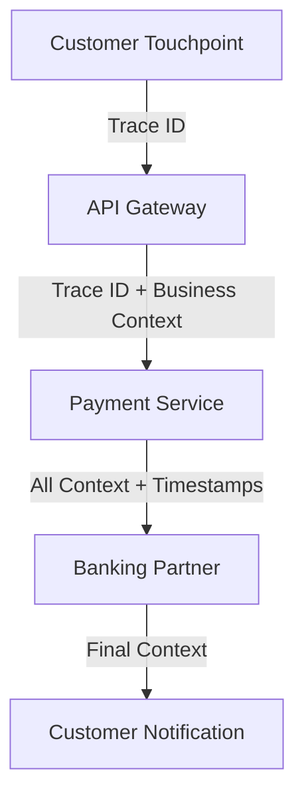
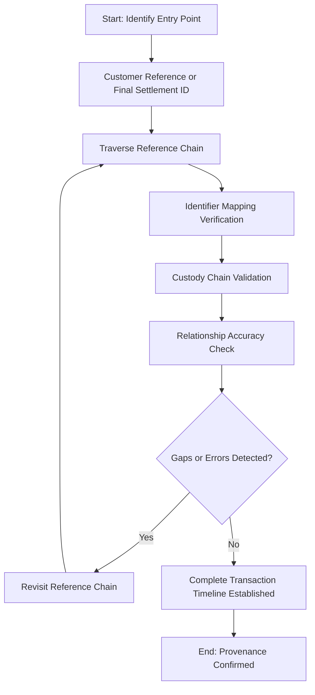
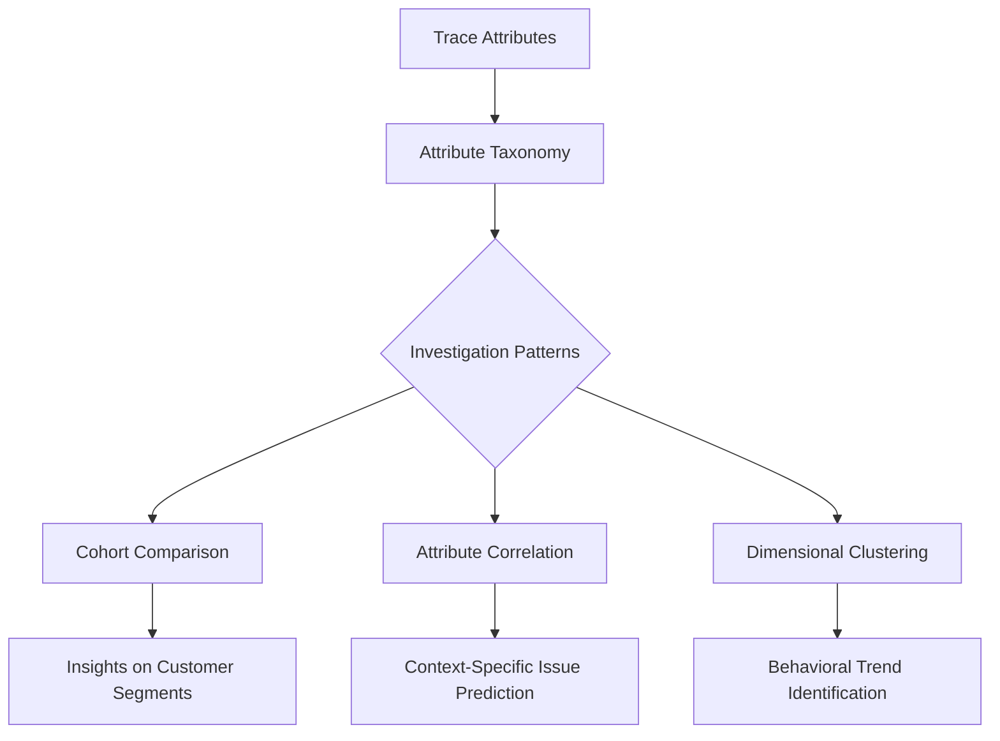
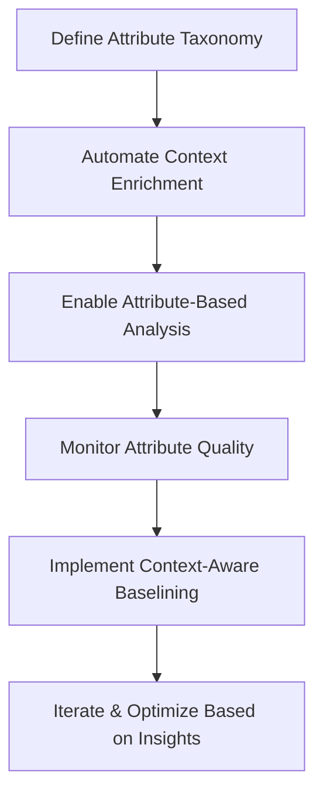
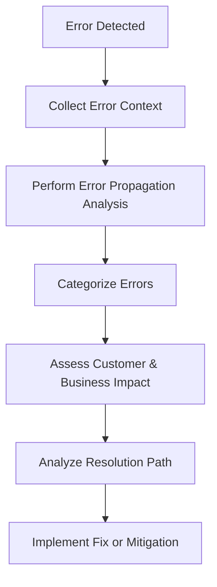
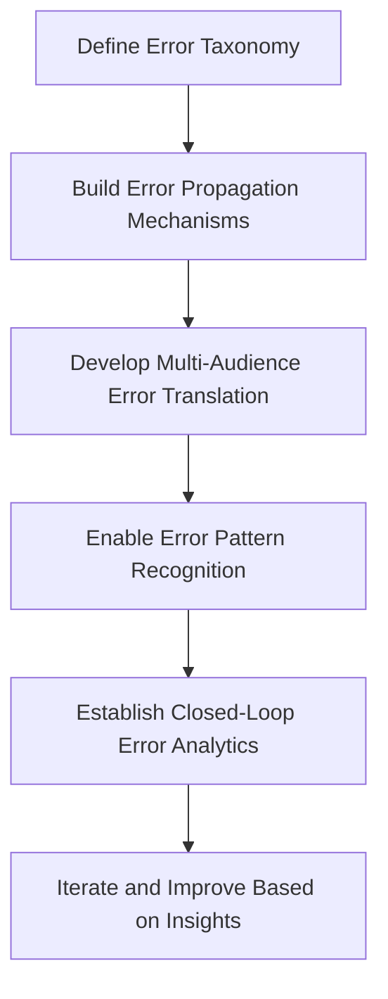

# Chapter 3: Trace Anatomy and Data Structure

## Chapter Overview

Welcome to the forensic autopsy table of distributed systems: trace anatomy. If you think logs and dashboards alone will save you, you’re the next victim in the observability body count. In this chapter, we dissect the vital organs of trace data—spans, context propagation, identifiers, metadata, timing, and error context—revealing why most banks limp along with Frankenstein’d monitoring, unable to find the transaction corpse until the regulator demands a DNA sample. You’ll learn how to stitch together the entire crime scene, following the money trail through every system and proving transaction innocence (or guilt) beyond a shadow of a doubt. If you’re tired of “ghost transactions,” unexplained delays, and mystery failures that drive customers back to the branch, prepare for a crash course in operational forensics—because your business, and your job, depends on getting this right.

______________________________________________________________________

## Learning Objectives

- **Dissect** distributed trace anatomy to expose the critical building blocks for full-stack observability.
- **Design** standardized span structures and naming conventions that turn chaos into evidence.
- **Implement** context propagation mechanisms so your transactions don’t disappear at the first system hop.
- **Correlate** trace identifiers across technical and business boundaries to build bulletproof audit trails.
- **Enrich** traces with business and operational metadata for laser-focused investigations.
- **Analyze** timing and latency across transaction paths to kill performance bottlenecks where they actually matter.
- **Model** and propagate error information so root causes stop hiding behind “something went wrong.”
- **Establish** governance frameworks that ensure your observability doesn’t devolve into yet another compliance checkbox.

______________________________________________________________________

## Key Takeaways

- Logs and metrics alone are like crime scene photos without timestamps—you’ll never find the body, let alone the killer.
- “Healthy” services mean squat if transactions vanish between systems; missing context is a compliance time bomb.
- If your trace structure looks like spaghetti, your MTTR will taste like bankruptcy—expect 3-5x longer investigations.
- Without proper span hierarchy, you’re tuning the wrong screwdrivers and wondering why trades still take forever.
- Failure to propagate context means you’ll spend days playing Where’s Waldo with customer money—while regulators watch.
- Trace identifiers are your only defense in court (and audit); fragmented references = “guilty until proven innocent.”
- Contextual metadata isn’t a “nice to have”—it’s the only way to fix what actually matters to your best customers.
- Ignoring timing at the transaction level means your competitors will eat your lunch, and then your deposits.
- Shallow error modeling guarantees repeat failures, angry users, and soaring support costs—enjoy your next branch queue.
- Observability without governance is just chaos with better charts. Standardize or die (preferably not on an audit call).

If you’re still hunting for answers by grepping through logs, you’re not an SRE—you’re just a historian for past outages. Build traces that actually solve business problems, or get ready to explain yourself to the regulator, the CFO, and your former customers.

______________________________________________________________________

## Panel 1: The Anatomy of a Trace - Building Blocks of Observability

### Common Example of the Problem

A major retail bank's mobile app recently experienced intermittent transaction failures where customers received success messages for fund transfers, but recipients never received the funds. Traditional monitoring showed all services as healthy, and isolated log analysis failed to identify the issue. Support teams spent days manually reconstructing transaction paths across dozens of services, attempting to piece together what happened to these "ghost transactions." Without a structured way to follow transaction flows, engineers couldn't determine whether funds were lost during authentication, core processing, partner bank messaging, or settlement stages—leading to extended resolution times and frustrated customers who lost confidence in digital banking services.

### SRE Best Practice: Evidence-Based Investigation

SRE teams must implement distributed tracing with consistent span structures to create comprehensive transaction visibility across banking systems. This requires defining standardized building blocks: operation-focused spans with consistent naming conventions, precise start/end timestamps, explicit parent-child relationships, and rich contextual metadata. Evidence-based investigation starts with establishing trace data as the authoritative record of transaction behavior, enabling engineers to follow the exact path of funds through all services rather than piecing together disconnected logs or metrics.

Effective trace anatomy design ensures each span captures not just technical operations but meaningful business contexts like account types, transaction amounts, and customer segments—transforming traces from technical artifacts to business-relevant evidence. When transactions fail, investigations should begin by retrieving the complete trace using correlation IDs from customer-facing channels, then systematically analyzing the span hierarchy to identify where processing deviated from expected patterns, particularly focusing on spans with error attributes or unusual timing characteristics.

### Banking Impact

The business consequences of poor trace structure extend far beyond technical complexity. Financial institutions without proper trace anatomy face significantly extended mean time to resolution—typically 3-5x longer for complex issues—directly affecting regulatory standing and customer trust. Transaction visibility gaps create material financial risks including reconciliation failures, misattributed funds, compliance violations for transaction timing requirements, and potential monetary losses.

For high-value payment services, transaction invisibility can lead to substantial revenue impact—studies from major banks show digital transaction usage drops 14-26% after customers experience an unexplained payment failure. Regulatory consequences are equally concerning, as financial authorities increasingly require evidence of complete transaction paths for dispute resolution and fraud investigation. Perhaps most critically, the reputational damage from "disappearing funds" significantly exceeds that of transparent system outages, with customer retention rates dropping by approximately 5-8% following incidents where funds appear lost versus 1-2% for acknowledged system failures.

### Implementation Guidance

1. Establish a trace anatomy governance framework that defines mandatory span attributes for all banking transactions, including financial contexts (amount, currency, account types), regulatory metadata (consent verification, screening checks), and customer journey contexts (channel, session, customer segment).

2. Implement standardized span naming conventions that combine service functions with business operations (e.g., "PaymentService.internationalTransferValidation" rather than generic "validate") to create human-readable transaction flows.

3. Create a span relationship model that accurately reflects your banking architecture, ensuring parent-child hierarchies properly represent causal relationships between operations rather than just technical call patterns.

4. Develop atomic span design principles where each span represents a discrete, meaningful banking operation rather than arbitrary technical functions, ensuring business processes can be clearly understood from trace visualization.

5. Establish baseline trace structures for all critical banking transactions (payments, account opening, trading, lending) with documented expected span hierarchies, critical path operations, and expected attributes—providing reference models for troubleshooting comparisons.

## Panel 2: Spans - The Work Units of Distributed Transactions

### Common Example of the Problem

A global investment bank's trading platform exhibited inconsistent performance where seemingly identical trade executions showed dramatically different completion times—ranging from 120ms to over 2 seconds—despite all individual services reporting normal operation. Traditional monitoring showed healthy components, with no single service exceeding thresholds, yet customers experienced unpredictable trade execution speeds that materially impacted their ability to capture time-sensitive market opportunities. Without understanding how work was distributed within each transaction, engineers couldn't identify whether the issues stemmed from data enrichment, compliance verification, market connectivity, or post-trade processing steps—leaving them unable to effectively optimize the critical elements affecting customer experience.

### SRE Best Practice: Evidence-Based Investigation

SRE teams must implement hierarchical span modeling that accurately represents both the logical structure and actual execution flow of financial transactions. This requires moving beyond flat service-oriented spans to create parent-child relationships that capture how complex operations nest within business transactions. Evidence-based investigation leverages this hierarchy to identify which specific operations actually determine overall transaction time versus contributing minimal latency impact.

When analyzing performance variations, SREs should compare span hierarchies between fast and slow instances of the same transaction type, focusing on three key patterns: critical path variations where different spans appear on the timing-determining path, duration outliers where specific operations take significantly longer in slow transactions, and cardinality differences where certain transaction instances generate additional spans through retry loops or error handling paths. This comparative approach transforms troubleshooting from component-focused to transaction-path focused, revealing how the same logical operation may take dramatically different execution paths despite identical inputs.

### Banking Impact

The business consequences of poor span structuring directly impact a financial institution's market position and revenue. In trading platforms, inconsistent execution timing creates measurable financial disadvantages. Academic research shows the following impacts:

| Function | Impact Metric | Consequence |
| ------------------ | ------------------------------ | ------------------------------------------------------------------------------------------- |
| Trading Platforms | 500ms delay in trade execution | 1-4 basis points in price slippage under normal market conditions; worse during volatility. |
| Payment Processing | 1-second variability increase | 3-7% higher abandonment rates. |
| Wealth Management | Unpredictable performance | 11% lower engagement metrics. |
| Lending Operations | Variable processing times | 8-15% lower conversion rates. |

The compound business impact includes:

- **Transaction Volume**: Reduced due to inefficiencies.
- **Customer Satisfaction**: Scores drop by 8-12 points below industry benchmarks.
- **Digital Channel Adoption**: Material reduction stemming from performance variability.

To further illustrate the relationship between performance inconsistency and business impact, the following bar chart provides a visual summary of key metrics:

```mermaid
barChart
    title Banking Impact Metrics
    xAxis Performance Metrics
    yAxis Percentage Impact
    data
        "Abandonment Rates" 7
        "Engagement Drop" 11
        "Conversion Reduction" 15
```

This data underscores how poorly optimized spans can cascade into significant competitive disadvantages, directly affecting revenue, customer retention, and operational efficiency.

### Implementation Guidance

To streamline the implementation of span-based monitoring and analysis in distributed transactions, follow this step-by-step checklist:

#### Step-by-Step Checklist

1. **Classify Spans Across Your Architecture**

   - Identify and categorize spans into distinct types:
     - Business operations
     - Technical functions
     - External dependencies
     - Cross-cutting concerns
   - Ensure the classification supports targeted analysis of transaction components.

2. **Establish Span Duration Baselines**

   - Define expected timing profiles for critical financial operations based on transaction types and volumes.
   - Automate the comparison of actual span durations against these baselines to detect anomalies.

3. **Implement Critical Path Analysis**

   - Develop functionality to automatically identify spans that determine overall transaction timing.
   - Include visualizations in trace displays to highlight path-determining spans.

4. **Monitor Span Cardinality**

   - Set up monitoring to detect unexpected span counts in transactions.
   - Investigate causes such as error handling, retry loops, or fallback mechanisms, which may indicate resilience issues impacting performance.

5. **Perform Comparative Span Analysis**

   - Create workflows to compare span structures between normal and degraded transaction instances.
   - Use automated tools to highlight differences in hierarchies, timing patterns, and attributes for faster root cause analysis.

#### Diagram: Distributed Transaction Span Workflow (Text-Based Representation)

```plaintext
[Start] --> [Classify Spans] --> [Set Duration Baselines] --> [Enable Critical Path Analysis]
     --> [Monitor Cardinality] --> [Perform Comparative Analysis] --> [End]
```

By following this checklist and leveraging the workflow, you can implement a robust span monitoring strategy that improves observability and accelerates issue resolution in your distributed transaction systems.

## Panel 3: Context Propagation - Following the Money Trail

### Common Example of the Problem

A retail bank's payment ecosystem recently experienced critical issues where international wire transfers appeared successful in originating systems but either failed silently or completed with incorrect details in receiving institutions. Despite both sending and receiving banks having individual monitoring systems, neither could correlate their internal transaction records to create a complete picture of what happened to specific payments. When customers called to investigate missing funds, support teams had to manually reconstruct transaction paths through multiple systems—online banking, payment gateways, correspondent banks, SWIFT messaging, and settlement platforms—often taking 3-5 days to locate funds and determine what went wrong. Without propagated transaction context connecting these discrete systems, the bank couldn't determine whether problems stemmed from message formatting, routing information, settlement instructions, or receiving bank processing—leading to extended resolution times, financial adjustment costs, and customer compensation payments.

### SRE Best Practice: Evidence-Based Investigation

SRE teams must implement comprehensive context propagation frameworks that maintain transaction identity across all technical and organizational boundaries. This requires standardized propagation mechanisms for three critical context types:

1. **Technical Correlation**: Trace IDs, span references.
2. **Business Context**: Transaction references, amounts, customer identifiers.
3. **Regulatory Metadata**: Consent verification, screening results, jurisdictional information.

Evidence-based investigation leverages this propagated context to reconstruct complete transaction journeys irrespective of system boundaries. To make investigations systematic and actionable, follow these key steps:

#### Checklist for Evidence-Based Investigation

- **Step 1: Confirm Context Chain Completeness**

  - Verify propagation of correlation identifiers (e.g., trace IDs) across all systems.
  - Ensure no gaps in the context chain at system boundaries.

- **Step 2: Perform Attribute Comparison**

  - Cross-check business details (e.g., transaction amounts, customer identifiers) for consistency across boundaries.
  - Identify and resolve mismatched attributes.

- **Step 3: Conduct Timing Analysis**

  - Analyze timestamps to detect delays at specific transfer points.
  - Isolate systems contributing to latency or bottlenecks.

#### Example Workflow: Tracing a Payment



1. Start at the **Customer Touchpoint** and identify trace IDs linked to the transaction.
2. Follow the trace through the **API Gateway** and ensure all business context is intact.
3. Check **Payment Service** for correct propagation and add timing metadata.
4. Verify seamless context transfer to the **Banking Partner** and ensure regulatory metadata is preserved.
5. Confirm final updates at **Customer Notification**.

By adhering to this checklist and workflow, SREs can transform payment investigations from system-specific queries to end-to-end transaction reconstructions. This ensures propagation integrity, minimizes investigation time, and enhances incident resolution efficacy.

### Banking Impact

The business consequences of poor context propagation create significant financial and reputational risks. The table below highlights key quantitative data and comparisons to illustrate these impacts more clearly:

| **Aspect** | **With Proper Context Propagation** | **Without Proper Context Propagation** | **Implications** |
| ------------------------ | ----------------------------------- | --------------------------------------- | --------------------------------------------------------------------------------- |
| **Operational Costs** | Standard resource allocation | 4-6x increase in resource usage | Significant increase in investigation workload and associated costs. |
| **Resolution Time** | Hours | Days | Extended resolution time leading to operational inefficiencies. |
| **Investigation Costs** | Minimal | $50-90 per affected transaction | Direct financial burden on banks for each transaction requiring manual review. |
| **Customer Behavior** | High digital channel confidence | 31% revert to branch-based transactions | Increased costs and inconvenience for customers, reducing digital adoption. |
| **Regulatory Penalties** | Compliance maintained | 2-4% of transaction volume in penalties | Potentially severe financial penalties for repeated traceability failures. |
| **Revenue Impact** | Stable | Customer attrition, reduced cross-sell | Loss of revenue due to diminished trust and lower engagement in digital channels. |

Customer impact is particularly pronounced: payment uncertainty drives a significant shift in behavior, with many customers reducing digital channel usage post-incident. This not only impacts operational costs but also limits growth opportunities by reducing digital adoption, increasing customer churn, and eroding cross-sell potential.

Regulatory consequences are becoming more stringent, with financial authorities worldwide demanding stricter adherence to payment traceability standards. Institutions unable to provide timely evidence of payment paths risk penalties that can reach 2-4% of transaction volume, further compounding the financial risks associated with poor context propagation.

### Implementation Guidance

To streamline the adoption of context propagation practices, follow this checklist:

- [ ] **Establish a comprehensive context propagation framework**:

  - Use standardized mechanisms across communication patterns:
    - HTTP headers for synchronous API calls.
    - Message properties for asynchronous queues.
    - Database fields for persistent storage.
    - Standard formats for external system interfaces.

- [ ] **Set up context verification checkpoints**:

  - Define critical system boundaries.
  - Implement automated validation to ensure:
    - Correlation identifiers are correctly received, preserved, and forwarded.
    - Business context attributes are intact at each transition point.

- [ ] **Develop a transaction correlation directory service**:

  - Maintain relationships between different identifier formats across systems.
  - Enable tracing across integration boundaries by mapping identifiers (e.g., internal transaction IDs to external clearing references).

- [ ] **Implement context augmentation patterns**:

  - Design workflows to progressively enrich transaction context:
    - Capture key decision points, verification results, and routing determinations.
  - Build a self-documenting transaction record as operations proceed.

- [ ] **Coordinate cross-organizational propagation standards**:

  - Collaborate with financial counterparties to establish consistent conventions.
  - Ensure standards respect data privacy requirements and competitive boundaries.

By following this checklist, practitioners can ensure robust and reliable implementation of context propagation, supporting traceability and operational transparency.

## Panel 4: Trace Identifiers and References - Creating the Audit Trail

### Common Example of the Problem

A commercial banking division recently faced regulatory scrutiny when it couldn't produce complete evidence for a sequence of high-value international transactions flagged for potential compliance concerns. Despite having detailed logs from individual systems, the bank struggled to conclusively prove transaction legitimacy because they couldn't definitively connect activities across their siloed platforms—online banking initiation, compliance screening, correspondent messaging, foreign exchange, and settlement systems all used different reference numbers with no reliable mapping between them. When regulators requested documentation for specific transactions, the bank had to commit significant resources to manually reconstructing audit trails, often with gaps and uncertainties that undermined confidence in their compliance controls. Without consistent trace identifiers linking related operations, the bank couldn't demonstrate continuous transaction custody or verify that proper controls were applied throughout the processing lifecycle—creating both regulatory exposure and legal uncertainties about transaction provenance.

### SRE Best Practice: Evidence-Based Investigation

SRE teams must implement comprehensive trace identification schemes that maintain transaction identity throughout entire processing lifecycles, regardless of technical boundaries or timeframes. This requires a multi-level identification architecture including: globally unique trace identifiers for end-to-end correlation, span identifiers for individual operations, parent-span references establishing hierarchical relationships, and business correlation identifiers mapping technical traces to customer-meaningful references like confirmation numbers.

Evidence-based investigation leverages this identification framework to systematically establish transaction provenance through reference relationship analysis. When reconstructing event sequences, SREs should start with either customer-facing references or final settlement identifiers, then methodically traverse the reference chain bidirectionally to create complete transaction timelines. Critical investigation patterns include: identifier mapping verification ensuring consistent correlation between technical and business references, custody chain validation confirming no gaps exist in the identifier timeline, and relationship accuracy checking verifying parent-child links correctly represent actual processing dependencies. This structured approach transforms transactional investigations from circumstantial evidence collection to definitive provenance tracing based on cryptographically sound identification schemes that maintain referential integrity throughout complex banking processes.

#### Trace Identification and Investigation Process Flow

Below is a flowchart illustrating the evidence-based investigation framework:



This flowchart demonstrates how SREs can systematically navigate the trace identification framework to verify transaction integrity. By following this structured process, investigations are transformed into reliable, repeatable workflows that ensure accuracy and clarity in tracing complex systems.

### Banking Impact

The business consequences of inadequate trace identification extend far beyond technical complexity into material financial, legal, and regulatory domains. Transaction provenance issues directly impact regulatory standing—financial authorities increasingly require continuous transaction traceability, with incomplete audit trails potentially triggering enhanced supervision, additional control requirements, or formal enforcement actions with penalties ranging from millions to tens of millions depending on severity and pattern.

Operational impacts include significantly extended response times for both internal investigations and external inquiries—banks with fragmented identification typically require 5-10x longer to resolve complex transaction inquiries, with corresponding increases in resource costs and customer dissatisfaction. Legal exposure represents perhaps the most significant risk, as transaction disputes without definitive evidence chains typically resolve unfavorably for financial institutions, with provisional credit often becoming permanent when banks cannot conclusively prove processing correctness. The compound business impact includes direct costs (investigation resources, dispute losses, regulatory penalties), indirect expenses (additional controls, enhanced monitoring), and opportunity costs (reduced straight-through processing rates, lower digital channel adoption due to confidence concerns).

### Implementation Guidance

To ensure effective trace identifier and reference implementation, follow the checklist below:

| Step # | Key Action | Details |
| ------ | -------------------------------------- | --------------------------------------------------------------------------------------------------------------- |
| 1 | **Define Trace Architecture** | Establish a standardized format for trace IDs, span IDs, parent references, and business correlation IDs. |
| 2 | **Set Up Reference Mapping** | Implement bidirectional mapping services to link technical trace identifiers with business references. |
| 3 | **Establish Persistence Requirements** | Define identifier retention policies based on transaction type, regulatory needs, and business significance. |
| 4 | **Ensure Referential Integrity** | Develop validation capabilities to detect missing links, inconsistencies, or discontinuities in reference data. |
| 5 | **Standardize Reference Propagation** | Define propagation standards for consistent identifier sharing across external systems and boundaries. |

#### Additional Considerations:

- **Trace Architecture:** Ensure trace IDs are globally unique and cryptographically strong, while business correlation IDs are meaningful for end-users.
- **Persistence Mechanisms:** Use immutable storage for high-risk or regulated transactions to meet compliance and audit needs.
- **Validation Processes:** Automate integrity checks to proactively alert on traceability issues.

This checklist serves as a practical guide for implementing robust trace identifiers and references, ensuring a reliable audit trail across all interactions.

## Panel 5: Tags and Attributes - Contextual Metadata for Investigation

### Common Example of the Problem

A wealth management platform experienced a pattern of sporadic performance degradation affecting portfolio management functions, but only for certain client segments and account types. Traditional monitoring showed healthy system metrics, with no clear correlation between infrastructure indicators and customer complaints. Support teams struggled to identify affected transactions because they lacked the contextual dimensions to distinguish between normal variations and actual degradation. When investigating specific client reports, engineers couldn't determine whether issues were related to portfolio size, specific security types, customer tier, geographic region, or particular operation patterns—leaving them unable to identify common factors among affected transactions. Without contextual enrichment connecting technical operations to business contexts, the bank couldn't effectively prioritize which performance issues to address first or identify which specific client segments were most affected—resulting in a generalized (and expensive) capacity increase rather than targeted optimization of the actual problem areas.

### SRE Best Practice: Evidence-Based Investigation

SRE teams must implement comprehensive trace attribute strategies that systematically enrich spans with multi-dimensional context, transforming generic technical operations into business-meaningful evidence. This requires a structured attribute taxonomy spanning multiple domains:

| **Attribute Domain** | **Examples** | **Purpose** |
| -------------------- | ---------------------------------------------------- | --------------------------------------------------------------------- |
| Technical Contexts | Service versions, deployment regions | Enable tracking of technical changes and their effects on the system. |
| Business Dimensions | Customer segments, product types, transaction values | Correlate system behavior with business impact. |
| Operational Factors | Processing paths, feature flags | Isolate issues caused by operational workflows or feature toggles. |
| Performance Contexts | Resource utilization, concurrency levels | Diagnose capacity or scaling-related bottlenecks. |

Evidence-based investigation leverages this enriched context for dimensional analysis of system behavior. When analyzing performance patterns, SREs should apply multi-factor correlation techniques to identify specific combinations of attributes statistically associated with degraded experience.

#### Key Investigation Patterns

1. **Cohort Comparison**\
   Analyze performance across different customer segments or product types to identify variations in experience.

2. **Attribute Correlation**\
   Determine which specific contexts (e.g., transaction values or feature flags) most strongly predict issues.

3. **Dimensional Clustering**\
   Reveal natural groupings of transactions with similar behavior patterns to uncover systemic trends.

The following flow summarizes how enriched attributes feed into these investigation patterns:



This contextually-rich approach transforms troubleshooting from generic system analysis to targeted investigation of specific business scenarios experiencing problems. It enables precise identification of the particular combination of factors triggering issues, rather than treating all transactions as technically equivalent.

### Banking Impact

The business consequences of context-poor traces extend beyond technical troubleshooting into customer experience and competitive positioning. Without contextual enrichment, banks typically address performance issues with generalized solutions—often resulting in significant infrastructure investments that deliver minimal customer experience improvements because they don't target the specific scenarios actually causing friction.

This inefficiency translates directly to financial impact: studies from major financial platforms show context-aware optimization typically delivers equivalent performance improvements with 60-75% lower infrastructure costs compared to generalized capacity increases. Customer experience impacts include unaddressed friction points for specific segments—particularly high-value clients who often utilize advanced features with unique performance characteristics different from average usage patterns. Business intelligence limitations further compound these issues, as banks cannot effectively correlate technical performance with critical business metrics like conversion rates, transaction sizes, or cross-selling success without contextual links between technical operations and business dimensions. The combined impact includes both wasted technical investment and missed optimization opportunities that directly affect customer satisfaction, competitive differentiation, and platform scalability.

### Implementation Guidance

To effectively implement contextual metadata tagging and attributes for investigation, follow this step-by-step checklist:

#### Checklist for Implementation

1. **Attribute Taxonomy Development**

   - Define a comprehensive attribute taxonomy tailored to your banking domains.
   - Standardize naming conventions and value formats across:
     - **Customer attributes**: segments, tiers, relationships.
     - **Product attributes**: types, risk categories, value bands.
     - **Transaction attributes**: amounts, channels, methods.
     - **Technical attributes**: regions, versions, processing paths.

2. **Automated Context Enrichment**

   - Integrate automated enrichment at trace generation points.
   - Leverage existing business context from:
     - Authentication systems.
     - Product processors.
     - Customer databases.
   - Ensure spans are systematically augmented with business-relevant dimensions without requiring manual instrumentation.

3. **Attribute-Based Analysis Enablement**

   - Build dynamic analysis capabilities in your observability platform.
   - Allow engineers to:
     - Segment and compare transaction performance by business dimensions.
     - Filter, group, and correlate data based on attributes rather than technical service boundaries.

4. **Attribute Quality Monitoring**

   - Implement monitoring to detect:
     - Missing, inconsistent, or anomalous contextual data.
   - Automate alerts to flag when critical business context is absent from significant transaction volumes.

5. **Context-Aware Baselining**

   - Develop baselines for performance expectations, accounting for key attribute combinations such as:
     - Customer tiers.
     - Transaction values.
     - Product complexity.
   - Configure targeted alerts for deviations in specific scenarios, avoiding the use of uniform thresholds.

#### Summary Workflow



By following this checklist and workflow, teams can ensure that their implementation of tags and attributes is robust, actionable, and aligned with investigative requirements.

## Panel 6: Timing and Latency - The Cost of Money in Motion

### Common Example of the Problem

A retail banking platform recently launched enhanced payment services with competitive marketing emphasizing speed and reliability, yet customer satisfaction scores showed concerning trends despite all services operating within technical SLAs. Deeper investigation revealed a critical disconnect: while individual services met their isolated performance targets, the end-to-end customer experience significantly underperformed expectations. Traditional component-level monitoring couldn't identify where accumulated delays were occurring or which processing stages most impacted overall perception. When high-value customers complained about payment speed, support teams couldn't determine whether delays occurred during authentication, fraud screening, core processing, or settlement stages—leaving them unable to provide meaningful explanations or accurately set expectations. Without comprehensive timing data across entire transaction paths, the bank couldn't identify which specific processing stages to optimize or where competitors were gaining performance advantages—resulting in missed revenue opportunities as transaction volume shifted to faster-appearing alternatives despite technically similar underlying performance.

### SRE Best Practice: Evidence-Based Investigation

SRE teams must implement comprehensive timing instrumentation that captures precise duration data across all transaction components, creating a complete performance profile rather than isolated service metrics. This requires multi-level timing capture: operation-level durations measuring individual processing steps, service-level timing showing component contributions, end-to-end measurements capturing complete customer experience, and interval analysis identifying gaps between active processing spans.

Evidence-based investigation leverages this timing data for systematic performance analysis. When examining transaction speed, SREs should utilize comparative timing techniques that identify performance contributors through multiple lenses: critical path analysis determining which operations directly impact total duration, component contribution calculation showing each service's percentage of overall time, variance analysis identifying inconsistent operations creating unpredictable experiences, and dead time detection revealing non-instrumented gaps where transactions disappear between visible processing steps. This timing-focused approach transforms performance optimization from service-level tuning to customer-experienced speed enhancement by precisely identifying which specific operations actually determine perceived transaction speed rather than optimizing components that contribute minimal impact to overall duration.

### Banking Impact

The business consequences of inadequate timing visibility directly impact competitive position and revenue generation. Transaction speed increasingly determines market share in financial services—research shows customers actively shift usage to faster payment methods, with 64% of consumers reporting they've changed preferred payment platforms specifically due to processing speed differences. This behavior directly affects transaction revenue, interchange income, and deposit balances tied to primary financial relationships.

Performance perception asymmetrically impacts business metrics: studies demonstrate customers notice degradation much more readily than improvements, with a payment slowdown of 500ms reducing usage frequency by approximately 3-7% while equivalent speedups increase usage by only 1-2%. Customer segmentation further compounds this impact, as high-value clients typically show greater sensitivity to performance variations—premium customers are approximately 2.5x more likely to reduce platform usage following perceived slowdowns compared to mass market segments. The compound business impact includes direct revenue effects (reduced transaction volume, lower interchange income), relationship impacts (decreased primary institution status, reduced deposit balances), and marketing effectiveness reduction as performance-focused messaging loses credibility when customer experience contradicts promotional claims.

### Implementation Guidance

1. Implement hierarchical timing instrumentation throughout your banking architecture that captures duration data at multiple granularity levels: business operations (end-to-end payment processing), functional components (fraud screening, compliance verification), technical services (authentication, data retrieval), and method-level operations (database queries, API calls).

2. Develop critical path analysis capabilities that automatically identify which specific operations determine overall transaction timing, with visualization tools highlighting these path-determining components and quantifying their exact contribution to total customer-experienced duration.

3. Establish comprehensive duration baselining for all transaction types across different conditions (time periods, volumes, customer segments), creating expected performance profiles that enable automatic detection of timing degradation even when absolute durations remain within technical SLAs.

4. Implement timing gap detection that identifies non-instrumented periods in transaction flows where operations "disappear" between visible spans, highlighting potential blind spots in performance visibility that may hide significant latency contributors.

5. Create comparative timing analysis workflows that systematically benchmark your transaction performance against both internal baselines and competitive alternatives (where available through synthetic transactions), quantifying specific performance differentials at the operation level to precisely target optimization efforts.

## Panel 7: Error Information - When Money Hits an Exception

### Common Example of the Problem

A digital banking platform recently experienced a concerning pattern where approximately 8% of mobile check deposits failed silently, with customers receiving no clear explanation beyond generic "unable to process" messages. Traditional error monitoring showed overall success rates within expected ranges, masking the specific issue affecting certain deposit types. Support teams struggled to provide meaningful assistance because error details remained trapped in technical logs disconnected from customer-facing systems. When customers called to report problems, representatives couldn't determine whether rejections stemmed from image quality issues, insufficient funds holds, potential fraud flags, or technical processing errors—leaving them unable to provide actionable guidance for successful resubmission. Without comprehensive error context propagated throughout the transaction lifecycle, the bank couldn't effectively address the root cause or implement targeted customer communication, resulting in repeated submission attempts, increased abandonment rates, branch visits for deposits that could have been handled digitally, and ultimately reduced adoption of a strategically important digital channel.

### SRE Best Practice: Evidence-Based Investigation

SRE teams must implement comprehensive error modeling that captures and propagates failure information across all processing stages, transforming generic failures into actionable insights. This requires multi-dimensional error instrumentation, including:

- **Technical Details**: Documenting specific failure mechanisms.
- **Business Context**: Explaining transaction impact.
- **Customer-Facing Information**: Driving appropriate messaging.
- **Resolution Guidance**: Enabling corrective actions.

Evidence-based investigation leverages this error context for systematic failure analysis. Use the following checklist to guide your investigation workflow:

#### Checklist for Evidence-Based Investigation:

1. **Error Propagation Analysis**:
   - Trace how failures cascade through dependent services.
   - Identify entry points and downstream impacts.
2. **Failure Categorization**:
   - Distinguish root exception types from consequential errors.
   - Classify errors by their origin (e.g., validation, processing, infrastructure).
3. **Impact Assessment**:
   - Analyze which errors affect customer outcomes versus internal-only failures.
   - Prioritize errors based on severity and business impact.
4. **Resolution Path Analysis**:
   - Investigate how similar errors were successfully handled in past transactions.
   - Document and reuse effective resolution strategies.

#### Simplified Flow of Evidence-Based Error Investigation:



This error-focused approach transforms failure investigation from generic troubleshooting to targeted resolution based on comprehensive error context. It enables teams to quickly distinguish between different failure categories:

- Validation failures requiring customer correction.
- Temporary processing issues appropriate for automatic retry.
- Infrastructure problems needing technical intervention.
- Permanent rejection reasons requiring clear customer communication.

By following this structured methodology, SRE teams can enhance their efficiency and accuracy in resolving transaction issues, ensuring faster recovery and improved reliability.

### Banking Impact

The business consequences of poor error handling extend far beyond customer frustration into material financial and strategic impacts. The table below summarizes key data points to illustrate these impacts:

| **Impact Area** | **Metric** | **Details** |
| ----------------------------- | ----------------------------------------------------------------------------- | ------------------------------------------------------------------------------------------------ |
| **Transaction Abandonment** | 35-50% abandonment rate | Customers encountering unexplained failures frequently abandon digital transactions. |
| | 40-65x processing cost increase | Abandoned transactions often revert to expensive assisted channels, significantly raising costs. |
| **Customer Behavior Changes** | 28% permanent reduction in digital channel usage | Customers reduce usage after unexplained transaction failures. |
| | 12% entirely abandon digital channels in favor of branches or call centers | This shift increases reliance on expensive alternatives, impacting costs and efficiency. |
| **Operational Cost Impact** | $3-5 increase in cost per transaction for every 1% shift to assisted channels | Processing costs rise as customers move from digital to assisted channels. |
| **Strategic Consequences** | Delayed branch transformation | Unclear error handling slows digital adoption, delaying strategic optimizations. |
| | Competitive disadvantages | Poor digital experience impacts competitive positioning and customer retention. |

These data points emphasize the compound business impact of insufficient error handling, which includes:

1. **Direct Costs**: Increased processing expenses and higher support contact volumes.
2. **Revenue Effects**: Reduced transaction completion rates and lower digital adoption.
3. **Strategic Limitations**: Delayed branch optimization and weakened competitive position.

Addressing these issues by providing clear, actionable error context can mitigate these impacts and drive operational and strategic benefits.

### Implementation Guidance

To ensure robust error handling when money-related processes encounter exceptions, follow this step-by-step checklist:

#### Checklist for Implementation

1. **Define Error Taxonomy**:
   - Standardize classifications across key dimensions:
     - **Error Categories**: Validation, Technical, Business, Security.
     - **Resolution Paths**: Customer action, Automatic retry, Manual intervention.
     - **Impact Levels**: Transaction blocked, Delayed, Modified.
     - **Customer Communication Requirements**: Detail communication needs per error type.
2. **Build Error Propagation Mechanisms**:
   - Preserve root cause information across service boundaries and fallback paths.
   - Maintain full context during cascading errors to improve resolution effectiveness.
3. **Develop Multi-Audience Error Translation**:
   - Automate the generation of tailored error details:
     - **Engineering Teams**: Technical root cause and resolution paths.
     - **Customer Support Representatives**: Actionable resolutions and next steps.
     - **End Users**: Clear, understandable instructions to address the error.
     - **Product Management**: Aggregated patterns and business impact insights.
4. **Enable Error Pattern Recognition**:
   - Implement systems to correlate recurring errors across transactions.
   - Detect emerging issues early and map them to known root causes and resolutions.
5. **Establish Closed-Loop Error Analytics**:
   - Monitor customer behavior post-error:
     - Measure completion rates after error handling interventions.
     - Assess error message effectiveness in enabling successful resolution or identifying abandonment trends.

#### Implementation Flowchart



By following this structured approach, your error handling processes will become more actionable, transparent, and effective in mitigating transaction failures in financial services systems.
