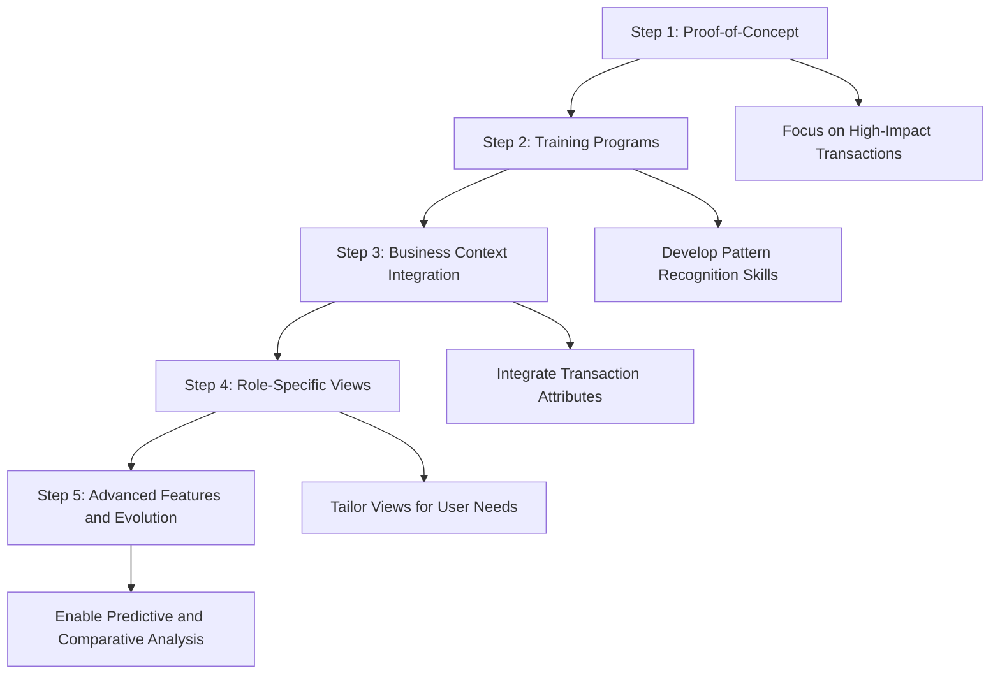
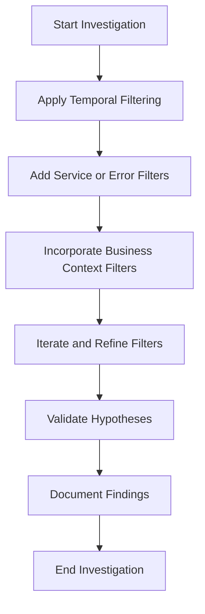
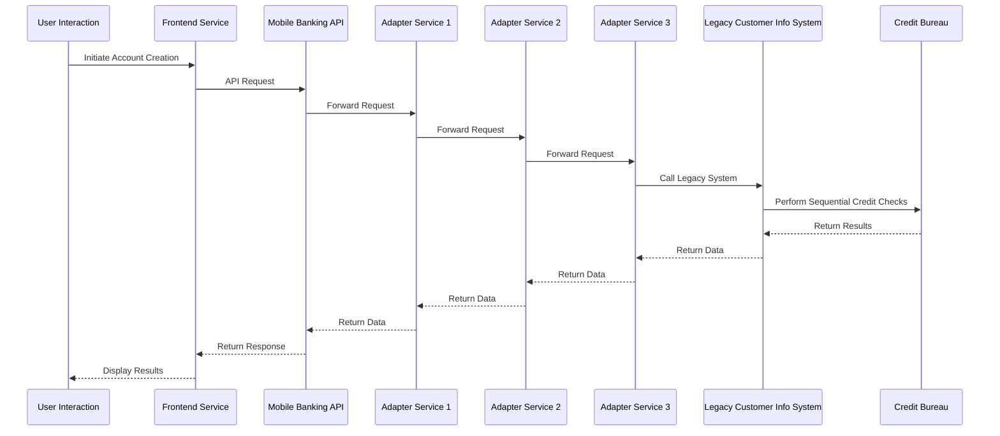
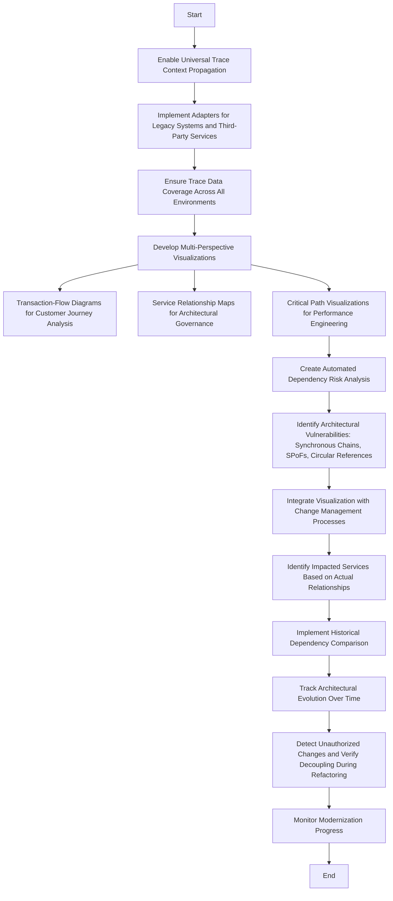

# Chapter 4: Trace Visualization and Exploration

## Chapter Overview

Welcome to trace visualization—the MRI machine for your distributed systems, where we stop guessing and start seeing the ugly truth. Forget dashboards that lull you into a false sense of “all green.” Here, we rip the mask off your banking transactions, exposing bottlenecks, zombie dependencies, and that rogue mainframe nobody admits to owning. If you’re still troubleshooting by staring at CPU graphs and tailing logs, you’re bringing a butter knife to a gunfight. This chapter is about using visualizations and context navigation to actually understand what’s happening in your production environment—before your CFO or the regulator does. We’ll show you how to stop playing whack-a-mole with incidents and start doing evidence-based, business-aligned SRE. Buckle up: you’re about to see what your system really looks like, and it isn’t always pretty.

______________________________________________________________________

## Learning Objectives

- **Interpret** distributed tracing visualizations to diagnose transaction flow and bottlenecks across complex service architectures.
- **Apply** advanced filtering and attribute tagging to surgically isolate traces by technical and business context (not just grep your way into oblivion).
- **Utilize** historical trace data for time-travel debugging, spotting gradual degradations and cyclical patterns before they become tomorrow’s outage.
- **Compare** normal and abnormal traces side-by-side to pinpoint what actually changed—no more guessing games.
- **Map** real service dependencies using trace-driven topology, uncovering undocumented, business-critical relationships (and your next legacy nightmare).
- **Translate** technical traces into business journey maps, making the cost of slow, fragmented customer experiences immediately obvious to everyone—including the suits.

______________________________________________________________________

## Key Takeaways

- “Green” dashboards lie; trace visualizations don’t. If you’re still flying blind, you deserve every 4am incident bridge.
- Filtering by business context isn’t a nice-to-have; it’s how you avoid wasting hours combing through irrelevant data while your VIP customers rage-quit.
- If you’re not storing and comparing traces over time, congratulations: you’ve just made gradual degradations invisible—until the next audit or multi-million dollar outage.
- Comparative analysis is how you stop shooting in the dark. Side-by-side traces will show you the difference between “works for me” and “calls from the CEO.”
- Your actual service dependencies are weirder and riskier than your architecture diagrams admit. If your critical path touches a mainframe via three adapters, you’d better know about it before the change freeze.
- Mapping technical traces to business journeys exposes the real friction points—the ones that cost you customers, not just SLO credits.
- If you skimp on visualization, you’re not just risking uptime—you’re risking business credibility, regulatory wrath, and your own sanity.
- The only thing worse than not having trace visualization is thinking you don’t need it. Delusion is not a resilience strategy.

______________________________________________________________________

## Panel 1: The Trace Navigator - Understanding Trace Visualization Interfaces

### Scene Description

A senior SRE and a production support engineer sit together at a workstation with a large monitor displaying a distributed tracing dashboard. The screen shows a waterfall-style visualization of a complex international wire transfer transaction. The visualization features colorful horizontal bars of different lengths, each representing spans across multiple banking services. The bars are organized hierarchically, with parent-child relationships indicated through indentation and connecting lines.

Below is a simplified text-based representation of the waterfall visualization:

```
Transaction: International Wire Transfer
|---------------------------------------------------------------| (Root Span: Total Transaction Time)
  Service A: Authentication
  |------------------|
  Service B: Currency Exchange
    Service B.1: Rate Lookup
    |---------|
    Service B.2: Conversion
    |--------------------------|
  Service C: Payment Processor
  |----------------------------------|
    Service C.1: Fraud Check
    |-------------|
    Service C.2: Settlement
    |------------------|
```

The senior SRE is pointing at specific spans on the monitor, explaining their significance and the relationships between them. The production support engineer listens intently, their understanding growing as they connect the spans to the transaction's flow across distributed banking systems.

### Teaching Narrative

Trace visualization interfaces transform abstract distributed trace data into comprehensible visual representations that tell the story of a transaction's journey. Unlike traditional monitoring dashboards that show isolated metrics, trace visualizations reveal the relationships, timing, and sequence of operations across distributed banking systems. The most common visualization pattern—the waterfall view—displays spans as horizontal bars organized hierarchically, with parent-child relationships clearly indicated through indentation and connecting lines. The width of each span represents its duration, instantly revealing which services or operations are taking the most time. This visualization approach allows engineers to shift from component-centric thinking to transaction-centric analysis, seeing not just isolated services but how they interact to deliver customer value. For banking systems with their complex, multi-step transactions, this visualization capability transforms troubleshooting from educated guesswork to evidence-based analysis.

### Common Example of the Problem

A major investment bank recently faced a critical incident when their high-frequency trading platform began experiencing intermittent order execution delays. Traditional dashboard monitoring showed all system components operating within normal parameters—CPU utilization was under threshold, memory consumption appeared normal, and all health checks passed successfully. Despite these "all green" indicators, institutional clients were reporting trade execution delays of up to 8 seconds during market volatility periods, resulting in significant financial losses.

To illustrate the challenge, consider the following comparison:

#### Traditional Monitoring View (Before)

```
+------------------+--------------------+------------------+
| Component        | CPU Utilization    | Memory Usage     |
+------------------+--------------------+------------------+
| Market Data Feed | 45%               | 60%              |
| Enrichment Svc   | 35%               | 50%              |
| Validation Svc   | 30%               | 40%              |
| Execution Engine | 50%               | 70%              |
+------------------+--------------------+------------------+

Status: All Systems Green
```

While this view indicates that all components are healthy, it fails to reveal interactions or dependencies between services. The intermittent delays remain invisible, leaving engineers to investigate manually across dozens of logs and metrics without success.

#### Trace Visualization View (After)

```
Transaction Trace:
Market Data Feed   [########------------------------] (1.2s)
  Enrichment Svc   [###########--------------------] (1.5s)
    Validation Svc [########################-------] (3.8s)
Execution Engine   [########------------------------] (1.2s)
```

In this view, the trace visualization immediately highlights a bottleneck: the `Validation Svc` span is significantly longer than others, indicating a delay caused by overwhelmed processing during specific conditions. The hierarchical structure further reveals that this issue originates downstream of the `Enrichment Svc`, making it clear where to focus remediation efforts.

By shifting from a component-centric to a transaction-centric view, the team quickly identified the root cause: a sequence-dependent bottleneck where market data enrichment services were overwhelming the downstream order validation component during market volatility. This insight, which was invisible in traditional monitoring, was uncovered in seconds using trace visualization, saving hours of manual investigation and preventing further financial losses.

### SRE Best Practice: Evidence-Based Investigation

SRE teams must implement transaction-centric visualization capabilities that transform abstract trace data into intuitive visual representations. This approach fundamentally shifts troubleshooting from speculative service-by-service investigation to evidence-based transaction flow analysis. Effective trace visualization interfaces should support multiple viewing modes tailored to different investigation needs: waterfall views for timing analysis, service dependency graphs for architectural understanding, and timeline views for chronological patterns. These visualizations must maintain hierarchical context through clear parent-child relationships while providing progressive disclosure—allowing engineers to start with a high-level overview before drilling into specific areas of interest.

Evidence-based investigation using trace visualization relies on pattern recognition principles: engineers should be trained to recognize common visual signatures of problems—such as cascading timeouts appearing as stair-step patterns, retry storms visible as repetitive span clusters, and serialization bottlenecks identifiable as long spans blocking numerous parallel operations. The visualization interface should support comparative analysis between normal and problematic traces, highlighting differences to accelerate pattern recognition. Most importantly, visualization tools should maintain context during investigation—preserving the connection between the visual representation and the underlying transaction data, allowing seamless transition from visual patterns to detailed diagnostic information.

#### Checklist: Key Best Practices for Evidence-Based Investigation

- **Adopt Transaction-Centric Visualization Tools**: Implement trace visualizations like waterfall views, service dependency graphs, and timeline views to analyze distributed systems effectively.
- **Maintain Hierarchical Context**: Ensure parent-child relationships are clearly depicted with connecting lines and indentation.
- **Leverage Progressive Disclosure**: Allow engineers to start with a high-level overview and drill down into specific spans as needed.
- **Recognize Problem Patterns**: Train teams to identify common visual signatures such as:
  - Cascading timeouts (stair-step patterns)
  - Retry storms (repetitive span clusters)
  - Serialization bottlenecks (long spans blocking parallel operations)
- **Enable Comparative Analysis**: Use tools that compare normal vs. problematic traces to highlight discrepancies.
- **Preserve Context**: Maintain the link between visualizations and the underlying transaction data for seamless troubleshooting.

#### Reference Table: Visualization Modes and Their Use Cases

| Visualization Mode | Purpose | Key Features |
| ---------------------------- | ------------------------------------ | ------------------------------------ |
| **Waterfall View** | Analyze span durations and timing | Horizontal bars, hierarchical layout |
| **Service Dependency Graph** | Understand system architecture | Node and edge representation |
| **Timeline View** | Examine chronological patterns | Sequential event ordering |
| **Comparative View** | Highlight differences between traces | Side-by-side or overlay comparison |

By following these best practices and leveraging the right visualization modes, SRE teams can transition from reactive troubleshooting to proactive, evidence-based investigation, ensuring faster issue resolution and improved system reliability.

### Banking Impact

The business consequences of inadequate trace visualization extend far beyond technical operations. Direct financial impacts include extended mean-time-to-resolution during trading platform incidents, where each minute of delay can represent millions in transaction value loss or regulatory compliance risk. Customer experience deteriorates rapidly when troubleshooting relies on component-centric approaches, as engineers struggle to connect technical metrics to actual customer journeys, often addressing symptoms rather than root causes.

For banking systems handling high-value transactions, visualization gaps create particular risks during market volatility when transaction volumes surge and system interactions become more complex—precisely when visibility is most critical. The regulatory impact cannot be overlooked, as financial institutions must increasingly demonstrate not just that incidents were resolved but that they understand exactly how customer-impacting issues developed and propagated through their systems. Perhaps most significantly, the operational efficiency impact compounds over time—teams without effective visualization capabilities typically develop larger support organizations with specialist silos focused on individual components rather than end-to-end transaction flows, increasing both operational costs and resolution times.

### Implementation Guidance

#### Progressive Roadmap for Trace Visualization Implementation



1. **Start with a Proof-of-Concept**\
   Focus on the highest-business-impact transactions to demonstrate immediate value. Implement waterfall views for 2-3 critical customer journeys (e.g., payments, trading, account opening). This initial phase builds trust and showcases the potential of trace visualization.

2. **Implement Training Programs**\
   Equip engineering teams with pattern recognition skills by creating a visual catalog of common failure patterns (e.g., timeout cascades, retry storms, database contention). These training sessions enable faster identification and resolution during incidents.

3. **Enhance Business Context Integration**\
   Augment visualizations with transaction attributes such as monetary value, customer segment, and geographic region. This allows engineers to correlate technical issues with business impact, driving more informed decision-making.

4. **Create Role-Specific Views**\
   Design tailored visualization interfaces for various stakeholders:

   - Simplified, business-focused views for product owners and executives.
   - Detailed technical views for engineers troubleshooting issues.
   - Hybrid representations for incident commanders orchestrating cross-team responses.

5. **Evolve with Advanced Features**\
   Gradually introduce advanced capabilities to avoid overwhelming users:

   - Highlight anomalies to pinpoint irregularities.
   - Enable pattern comparison for recurring issues.
   - Develop predictive features to identify potential problems before they occur.\
     This step-by-step evolution ensures adoption grows alongside capability, fostering confidence and usability throughout the organization.

## Panel 2: Navigating Trace Context - Filters, Tags, and Attributes

### Scene Description

A troubleshooting war room during a critical incident affecting the bank's mortgage application processing system. The room is filled with tension as multiple engineers collaborate around a large screen displaying a distributed tracing platform. The screen is divided into key sections: a filter panel on the left, a real-time trace results view in the center, and a dynamic error pattern visualization on the right.

One engineer is actively interacting with the filter panel, narrowing down millions of traces to only those with specific attributes: "mortgage-application" transaction type, "high-value-customer" segment, and HTTP error codes. With each filter applied, the trace results update dynamically, and the error pattern visualization highlights clusters of failures across geographic regions and loan types.

Below is a text-based representation of the war room setup and the tracing platform interface:

```
+-------------------------------------------------------+
|                       War Room                        |
+-------------------------------------------------------+
|                                                       |
|   [ Engineer 1 ]   [ Engineer 2 ]   [ Engineer 3 ]    |
|                                                       |
|   +-----------------------------------------------+   |
|   |  Distributed Tracing Platform                 |   |
|   |-----------------------------------------------|   |
|   |  Filter Panel    |  Trace Results   |  Error   |   |
|   |  - Transaction   |  [ List of       |  Pattern |   |
|   |    Type:         |    Traces ]      |  Visual  |   |
|   |    mortgage-app  |                  |          |   |
|   |  - Customer      |                  |          |   |
|   |    Segment:      |                  |          |   |
|   |    high-value    |                  |          |   |
|   |  - HTTP Error    |                  |          |   |
|   |    Codes:        |                  |          |   |
|   |    4xx, 5xx      |                  |          |   |
|   +-----------------------------------------------+   |
|                                                       |
+-------------------------------------------------------+
```

This setup immerses the engineers in a focused and collaborative environment, where they can analyze patterns, isolate root causes, and respond to the incident with precision.

### Teaching Narrative

The true power of distributed tracing emerges when you can effectively navigate context through filters, tags, and attributes. In high-volume banking systems generating millions of traces daily, finding the signal amid the noise requires sophisticated filtering capabilities. Modern tracing platforms allow engineers to filter traces based on numerous dimensions: transaction types, customer segments, error codes, latency thresholds, and custom business attributes. This context navigation differs fundamentally from traditional log searching, which relies on text-based pattern matching. Trace filtering operates on structured data—allowing precise, multi-dimensional queries that combine technical and business contexts. For example, immediately isolating all failed payment processing traces for platinum customers during a specific time window. This capability transforms incident response from broad system investigation to targeted analysis of specific transaction flows, dramatically reducing mean time to diagnosis. The ability to dynamically explore traces through their contextual attributes enables engineers to quickly identify patterns that would remain invisible in traditional monitoring approaches.

### Common Example of the Problem

A retail banking division experienced a complex incident during a new mortgage product launch when approximately 20% of online applications began failing during the final submission step. The application team received only generic error reports from the customer-facing systems with no clear pattern. Traditional investigation approaches proved ineffective—examining application logs showed only that submissions were being rejected by a downstream service with a generic error code. The infrastructure team confirmed all systems were operational, while the database team verified no obvious performance issues.

To address this, the team turned to trace context filtering. Below is a step-by-step breakdown of how they unraveled the issue using a distributed tracing platform:

1. **Initial Scope Definition**

   - Filter traces to include only transactions of type `mortgage-application`.
   - Narrow down to traces with the status `submission-failed`.

2. **Analyzing Key Attributes**

   - Add a filter for loan amounts greater than `$750,000`.
   - Add a filter for property types related to refinancing.

3. **Identifying the Pattern**

   - Cross-reference filtered traces with geographic data.
   - Discover that failures were concentrated in specific postal codes.

4. **Root Cause Discovery**

   - Observe that all failing traces hit the same compliance validation service.
   - Investigate further and uncover an undocumented validation rule specific to refinancing loans over `$750,000` in certain areas.

This process can be represented as a flow:

```mermaid
graph TD
    A[Start with 100,000+ daily traces] --> B[Filter by transaction type: "mortgage-application"]
    B --> C[Filter by status: "submission-failed"]
    C --> D[Add filter: loan amounts > $750,000]
    D --> E[Add filter: property type = "refinancing"]
    E --> F[Analyze geographic attributes (postal codes)]
    F --> G[Identify compliance validation service issue]
```

Within minutes of applying these filters, a clear pattern emerged: applications for refinancing loans over $750,000 in certain postal codes were triggering an undocumented validation rule in the compliance service. Without the ability to navigate trace context through attribute filtering, this pattern would have remained hidden among thousands of successful applications, prolonging the incident and further impacting a high-value customer segment.

### SRE Best Practice: Evidence-Based Investigation

SRE teams should implement trace navigation capabilities that enable hypothesis-driven investigation through iterative context filtering. This approach transforms troubleshooting from broad examination to targeted analysis through progressive refinement of the relevant transaction subset. Effective trace context navigation requires thoughtful instrumentation that captures both technical attributes (service names, operation types, error codes) and business dimensions (transaction types, customer segments, monetary values) as structured metadata attached to each span. This dual-context tagging enables powerful cross-domain filtering that bridges technical and business perspectives.

#### Systematic Refinement Checklist for Evidence-Based Investigation:

1. **Start with Temporal Filtering**

   - Identify the incident’s timeframe to limit the trace set to relevant data.
   - Focus on time windows where anomalies or errors were reported.

2. **Apply Service or Error Filters**

   - Narrow down traces by selecting specific services, operation types, or error codes.
   - Determine the general failure domain or affected system components.

3. **Incorporate Business Context Filters**

   - Add filters for business dimensions such as transaction types, customer segments, value bands, or geographic regions.
   - Look for patterns that intersect technical and business perspectives.

4. **Iterate and Refine**

   - Continue applying filters dynamically based on emerging evidence, isolating the problematic subset.
   - Use statistical insights or outlier detection to highlight unusual attribute patterns.

5. **Validate Hypotheses**

   - Cross-check filtered trace patterns against reported symptoms or known failure modes.
   - Adjust filters as necessary to confirm or refute initial assumptions.

6. **Document Findings**

   - Record the filtering steps and discovered patterns for knowledge sharing and incident retrospectives.
   - Use the findings to improve instrumentation and tagging for future investigations.

#### Workflow Diagram for Trace Context Navigation



#### Advanced Practices:

- Leverage platforms with **dynamic filter suggestions** to identify unusual patterns or anomalies automatically.
- Establish **consistent attribute naming conventions** and robust tagging taxonomies to ensure trace filters work uniformly across services.
- Regularly audit instrumentation to prevent "dark corners" where inadequate tagging limits visibility and filtering efficiency.

This systematic methodology transforms the investigative approach from "looking at everything" to targeted analysis of specific transaction subsets exhibiting problematic behavior, enabling faster and more precise incident resolution.

### Banking Impact

Inadequate trace context navigation capabilities directly impact a financial institution's bottom line through multiple channels. The most immediate impact appears in incident economics—inefficient investigation approaches typically add 30-60 minutes to mean-time-to-resolution (MTTR) for complex incidents, with each minute potentially representing thousands in revenue loss for high-volume transaction systems like payments or trading platforms. To make this more concrete, consider the following table:

| Metric | Example Value | Impact Estimate |
| ----------------------------------- | ------------------------------------ | ---------------------------------------------- |
| Average Transactions per Minute | 50,000 (e.g., mortgage applications) | $2,000,000 processed per minute |
| Revenue Loss per Minute of Downtime | $20,000 | $600,000 lost during a 30-minute incident |
| Customer Abandonment Rate Increase | +5% during 1-hour incident | 2,500 abandoned transactions (~$100M pipeline) |

Compounding these economic losses, customer experience degradation further amplifies the impact. Extended resolution times lead to higher abandonment rates, increased support call volumes, and reputational damage—particularly for high-value customer journeys. For example, mortgage applicants in premium customer tiers may constitute only 10% of total volume but contribute 50% of the revenue. Failure to isolate and address transaction issues for this segment undermines both short-term revenue and long-term customer loyalty.

The regulatory dimension adds another layer of risk. Financial institutions unable to quickly isolate and analyze problematic transaction types during incidents face heightened scrutiny from regulators concerned with consumer protection and financial stability. Moreover, the opportunity cost of poor trace navigation is significant—without precise visibility into transaction types and customer segments experiencing friction, banks may miss critical insights needed to prioritize investments effectively. For instance:

| Missed Opportunity | Example | Business Impact |
| ---------------------------------- | --------------------------------------- | ---------------------------------------------- |
| Friction in Loan Approvals | Latency spikes in "high-value-customer" | Reduced mortgage closure rates by 5% (~$500M) |
| Payment System Errors | Failed transactions in "platinum-tier" | Higher attrition rate (5-10%) in top-tier base |
| Regulatory Incident Investigations | Delayed response to audit requests | Fines up to $10M and reputational damage |

Ultimately, effective trace context navigation is not just a technical capability; it is a competitive differentiator that directly affects revenue, customer trust, regulatory compliance, and strategic decision-making.

### Implementation Guidance

1. Develop a comprehensive attribute taxonomy that standardizes naming conventions and required attributes across services, ensuring traces can be filtered consistently by transaction type, customer segment, channel, region, and monetary value regardless of which services processed the transaction.

2. Implement a phased instrumentation strategy starting with the highest-value transaction types (payments, trading, loan origination), ensuring each is fully instrumented with both technical and business context before moving to lower-priority journeys.

3. Create role-specific filter templates tailored to different investigation personas: transaction-focused templates for payment operations teams, customer-centric filters for experience analysts, and compliance-oriented filters for regulatory specialists—accelerating common investigation patterns.

4. Build an analytical feedback loop that identifies which filters are most frequently used during successful incident resolutions, then promotes those patterns to suggested filter combinations and ensures relevant attributes are consistently instrumented across all services.

5. Develop a filter literacy training program that teaches systematic investigation approaches using trace context navigation, moving teams from ad-hoc searching to methodical filtering strategies that progressively refine the transaction set based on emerging patterns.

## Panel 3: Time Travel Debugging - Exploring Historical Trace Patterns

### Scene Description

A banking SRE team is conducting a post-mortem analysis after a trading platform experienced intermittent latency issues during market opening hours. On a large screen, they're comparing visualization timelines of the same transaction type across different days. The interface shows a "time slider" control that allows them to move backward and forward through weeks of historical trace data. As they navigate through time, they notice a recurring pattern—the same authentication service experiences significant latency spikes every Monday morning just after market open, correlating perfectly with their incident timeline.

To better understand the pattern, the SREs analyze a simplified timeline:

```
Monday Morning (Market Open)       Latency (ms)
----------------------------------------------
Week 1: 09:30 AM                  1200  ⬆
Week 2: 09:30 AM                  1250  ⬆
Week 3: 09:30 AM                  1300  ⬆
Week 4: 09:30 AM                  1280  ⬆
```

This timeline illustrates how latency consistently spikes during the same time window each week, aligning precisely with the market opening hours. By visualizing the pattern in this way, the team can immediately pinpoint the time and service responsible, paving the way for further investigation into root causes.

### Teaching Narrative

Time travel debugging through historical trace patterns revolutionizes how we understand system behavior over time. Unlike traditional monitoring that often retains only aggregated historical metrics, modern tracing platforms preserve individual transaction traces across extended timeframes, enabling retrospective analysis that was previously impossible. This capability allows engineers to compare the same transaction types across different time periods—revealing patterns, trends, and correlations that develop gradually or occur cyclically. For financial systems with distinct patterns tied to market hours, end-of-day processing, or monthly cycles, this historical context is invaluable. Engineers can identify subtle degradations before they trigger alerts, correlate performance changes with code deployments, and recognize seasonal patterns that might otherwise be attributed to random variation. By allowing teams to "travel through time" and witness how transaction behavior evolves, trace history transforms troubleshooting from reactive incident response to proactive pattern recognition, fundamentally changing how we understand and manage complex financial systems.

### Common Example of the Problem

A global investment bank noticed a concerning pattern of gradually increasing trade execution times over several weeks, though still below alerting thresholds. Traditional monitoring approaches failed to provide actionable insights—point-in-time metrics showed acceptable current performance, while aggregated historical data lacked the granularity to identify specific degradation patterns. Without historical trace preservation, the team had no way to compare detailed transaction flows across time to understand what specifically had changed in their processing path.

Investigations initially focused on recent code deployments but found no smoking gun. Infrastructure teams verified adequate capacity, and the issue remained unresolved. When the degradation finally crossed alerting thresholds during a high-volume trading day, causing significant client impact, the root cause remained elusive until the team implemented historical trace preservation and time-travel comparison capabilities. By analyzing detailed traces of identical trading operations across multiple weeks, they pinpointed a gradual increase in database query times for reference data lookups that occurred early in the trade execution flow. Further temporal analysis revealed the degradation began precisely when a database schema change was implemented three weeks earlier. The subtle impact had been masked by connection pooling and caching until trading volumes increased enough to exhaust these buffers. Without the ability to compare detailed transaction traces across extended timeframes, this gradual degradation would have remained invisible until it caused a major trading outage.

#### Checklist: Steps for Investigating Historical Trace Patterns

To apply time-travel debugging and identify similar issues, follow these steps:

1. **Define the Scope of Analysis**

   - Identify the specific transaction type or system behavior to investigate.
   - Determine the time periods of interest (e.g., weeks leading up to the incident).

2. **Compare Historical Traces**

   - Use the tracing platform to retrieve detailed transaction traces for the same operation across different timeframes.
   - Align traces by key stages (e.g., authentication, database queries, external API calls) for consistent comparison.

3. **Identify Emerging Patterns**

   - Look for trends, such as gradual increases in latency or resource usage, across the traced operations.
   - Pay attention to cyclical patterns (e.g., weekly spikes) or anomalies tied to specific events.

4. **Correlate with External Events**

   - Check for infrastructure changes, code deployments, or configuration updates during the identified timeframe.
   - Look for correlations between trace anomalies and external triggers such as increased load or market events.

5. **Validate Findings with Temporal Context**

   - Use historical data to confirm when the issue began and assess its progression over time.
   - Replicate the identified patterns in a controlled environment to validate assumptions.

6. **Take Corrective Action**

   - Address the root cause (e.g., optimize query performance, revise schema changes).
   - Implement additional safeguards, such as enhanced monitoring or load testing, to prevent recurrence.

By following this checklist, teams can effectively leverage historical trace data to uncover subtle issues before they escalate, transforming reactive troubleshooting into proactive system management.

### SRE Best Practice: Evidence-Based Investigation

SRE teams should implement historical trace preservation strategies that enable temporal pattern analysis across extended timeframes. This capability transforms reliability engineering from point-in-time reaction to longitudinal understanding of system behavior evolving over days, weeks, and months. Effective time-travel debugging requires thoughtful retention policies that balance storage constraints with analytical needs—typically preserving high-cardinality trace data for 7-14 days while maintaining statistical sampling and exemplar traces for longer periods to enable trend analysis without prohibitive storage requirements.

Evidence-based temporal investigation should follow a systematic pattern discovery methodology: comparing the same transaction types across different time windows to identify when behavior changed, correlating these transition points with system events like deployments or configuration changes, and analyzing cyclical patterns tied to business cycles like market hours, end-of-day processing, or month-end closings. Advanced implementations should support automated temporal pattern detection that identifies gradual degradations, cyclical behavior, or correlation with specific system events without requiring manual comparison across all possible timeframes.

The most sophisticated implementations integrate time-travel debugging with change management systems—automatically correlating performance changes with specific deployments, configuration modifications, or infrastructure adjustments to establish clear causal relationships between system changes and behavior evolution. This evidence-based approach transforms post-incident analysis from speculative attribution to precise determination of which specific changes altered system behavior over time.

#### Best Practices Summary Table

| **Practice Area** | **Best Practices** | **Benefits** |
| ----------------------------------- | ---------------------------------------------------------------------------------------------------- | ---------------------------------------------------------------------------------- |
| **Trace Retention Policies** | - Preserve high-cardinality trace data for 7-14 days. | Enables granular temporal analysis for short-term pattern detection. |
| | - Retain statistical samples or exemplar traces for longer periods (e.g., months). | Supports trend analysis without significant storage overhead. |
| **Pattern Discovery Steps** | - Compare the same transaction types across different timeframes. | Identifies when behavior changed and potential triggers. |
| | - Correlate behavior transitions with system events (e.g., deployments, config changes). | Establishes root causes and relationships between changes and performance issues. |
| | - Analyze cyclical patterns tied to business cycles or recurring processes. | Recognizes seasonal or periodic behavior anomalies. |
| **Advanced Automation** | - Use automated tools for temporal pattern detection (e.g., degradation trends, cyclical anomalies). | Reduces manual effort and improves detection accuracy for complex temporal issues. |
| **Integration with Change Systems** | - Correlate trace data with deployment and change logs. | Ensures clear attribution of performance changes to specific system modifications. |
| | - Preserve baseline traces before significant changes. | Enables direct before/after comparisons to isolate the impact of specific updates. |

By adopting these best practices, SRE teams can evolve their investigative processes, transitioning from reactive troubleshooting to proactive, evidence-based pattern recognition. This systematic approach ensures improved reliability and deeper insights into the evolving behavior of complex systems.

### Banking Impact

Inadequate historical trace preservation directly impacts financial institutions' operational stability and business performance across multiple dimensions. The most immediate consequence appears in problem chronicity—without temporal pattern analysis, gradual degradations often remain undetected until reaching critical thresholds, by which time they've typically developed into complex, entangled problems requiring extensive remediation rather than simple adjustments. This pattern is particularly evident in cyclical banking operations like market opening procedures, end-of-day processing, and month-end closing activities.

To better understand this impact, consider an analogy to financial trend analysis. Just as traders analyze stock price movements over time to detect subtle trends—like a stock gradually losing value before a major drop—SREs use historical trace patterns to uncover early signs of system degradation. Without this ability, institutions are effectively blind to the "slow leaks" in their systems, noticing them only when a critical failure occurs, much like a trader realizing too late that a stock has crashed.

For financial institutions with continuous deployment practices, the inability to correlate performance changes with specific releases creates significant operational risk. Teams cannot quickly identify and roll back problematic changes without clear evidence linking system modifications to behavior changes. The compliance impact extends beyond operational concerns, as financial regulators increasingly expect institutions to understand not just that incidents occurred but exactly how system behavior evolved over time leading up to customer impact.

Perhaps most significant is the improvement opportunity cost. Without a clear temporal understanding of how transaction performance evolves over days and weeks, institutions struggle to prioritize optimization efforts effectively, often focusing on point-in-time bottlenecks rather than addressing the gradual degradations that eventually trigger major incidents. Historical trace analysis empowers teams to approach system optimization like strategic investors—identifying patterns, anticipating risks, and making proactive adjustments to maintain long-term stability and performance.

### Implementation Guidance

1. Implement a tiered trace retention strategy that preserves 100% of traces for 7 days, statistical sampling (10-20%) for 30 days, and exemplar traces representing key transaction types and performance bands for 90+ days to enable temporal analysis without unsustainable storage requirements.

2. Develop automated baseline capture processes that preserve comprehensive trace samples before and after significant changes (deployments, configuration updates, capacity adjustments), enabling precise before/after comparison regardless of general retention policies.

3. Create specialized time-comparison visualizations that highlight differences between the same transaction types across different time periods, automatically identifying changes in critical path, timing variations, and dependency modifications to accelerate temporal pattern recognition.

4. Implement automated temporal pattern detection that analyzes trace timing data across extended periods to identify gradual degradations, cyclical performance patterns, and correlation with scheduled events without requiring manual time-travel analysis for all transaction types.

5. Build integration between trace history systems and change management platforms to automatically correlate performance changes with specific system modifications, creating an evidence-based feedback loop that identifies which changes impact which transaction types and by how much.

## Panel 4: Comparative Analysis - Benchmarking Normal vs. Abnormal Traces

### Scene Description

A split-screen view presents two trace visualizations of the same credit card authorization flow side by side. The left trace represents a normal, successful transaction completing in 250ms, while the right trace illustrates a problematic transaction taking over 2 seconds. Annotations and highlights emphasize key differences: excessive database query time is marked in red, and an unexpected retry pattern in a fraud detection service is clearly identified.

Below is a conceptual diagram that captures the essence of the split-screen view:

```mermaid
graph TD
    A[Trace Visualization: Normal Transaction<br>250ms] -->|Span 1| B[API Gateway: 50ms]
    B -->|Span 2| C[Auth Service: 70ms]
    C -->|Span 3| D[Database Query: 100ms]
    D -->|Span 4| E[Fraud Detection: 30ms]

    F[Trace Visualization: Problematic Transaction<br>2000ms] -->|Span 1| G[API Gateway: 50ms]
    G -->|Span 2| H[Auth Service: 70ms]
    H -->|Span 3| I[Database Query: 1500ms]
    I -->|Span 4| J[Fraud Detection: 380ms<br>(Unexpected Retry Patterns)]
```

The left trace ("Normal Transaction") shows a smooth progression through the credit card authorization flow, with minimal latency in each service or span. In contrast, the right trace ("Problematic Transaction") highlights performance bottlenecks, such as prolonged database query times and retries in the fraud detection service. These visual cues reveal hidden dependencies and inefficiencies that are not apparent in the normal trace, providing a clear foundation for troubleshooting discussions.

This side-by-side comparison allows the SRE analyst to guide production support engineers transitioning to SRE roles, illustrating how small anomalies in individual spans can cascade into significant delays in the overall transaction flow.

### Teaching Narrative

Comparative analysis of traces transforms troubleshooting from guesswork to scientific investigation. By juxtaposing normal and abnormal traces of the same transaction type, engineers can precisely identify what changed, where delays occurred, which services behaved differently, and what unexpected dependencies emerged. This side-by-side analysis capability represents a paradigm shift from traditional monitoring approaches, which typically detect that something is wrong but provide limited insight into exactly what changed. For complex banking transactions like payment processing or securities trading, where milliseconds matter and dozens of services interact, this comparative methodology reveals subtle anomalies that would remain hidden in aggregate metrics. The approach mimics the differential diagnosis process in medicine—comparing healthy and unhealthy examples to isolate the specific cause. Engineers can instantly see which spans exist in one trace but not the other, which services experienced retry loops, where timeout patterns emerged, or which third-party dependencies suddenly slowed down. This evidence-based comparative methodology dramatically reduces mean time to resolution by transforming vague performance complaints into precise, actionable insights.

### Common Example of the Problem

A large consumer bank faced a complex performance incident when approximately 30% of mobile payment transactions began experiencing sporadic delays of 3-5 seconds, while others completed normally in under 500ms. Traditional investigation approaches proved inadequate—aggregated metrics showed only slightly elevated average response times that didn't trigger alerts, while isolated log analysis from individual services failed to reveal a clear pattern. The payment operations team spent hours examining each component in isolation, finding no obvious failures or configuration issues. Eventually, a customer escalation revealed that the delays affected only transactions involving newly issued virtual cards, but the reason remained elusive.

When the team finally employed comparative trace analysis, the solution became immediately apparent: side-by-side visualization of normal and delayed transactions showed identical flows until reaching the card tokenization service, where delayed transactions exhibited a distinct pattern—the primary tokenization API was failing silently and triggering a fallback to a secondary provider, which added a 3-second delay through multiple retry attempts. This subtle behavior change remained completely invisible in both aggregate metrics and individual service logs, as the system was technically functioning correctly through its fallback mechanism. Only direct visual comparison between normal and abnormal traces revealed the precise behavioral difference causing the customer experience degradation.

Below is a timeline representation of the transaction flows, illustrating the differences between the normal and delayed cases:

```mermaid
gantt
    title Transaction Flow Comparison
    dateFormat  HH:mm:ss
    section Normal Transaction (500ms)
    Request Received         :done, 00:00:00, 0s
    Auth Service Call        :done, 00:00:00, 100ms
    Card Tokenization Service:done, 00:00:00, 150ms
    Fraud Detection Service  :done, 00:00:00, 200ms
    Response Sent            :done, 00:00:00, 250ms

    section Delayed Transaction (3-5 seconds)
    Request Received         :done, 00:00:00, 0s
    Auth Service Call        :done, 00:00:00, 100ms
    Card Tokenization Primary:done, 00:00:00, 150ms
    Card Tokenization Fallback:active, 00:00:00, 3000ms
    Fraud Detection Service  :done, 00:00:00, 3200ms
    Response Sent            :done, 00:00:00, 3500ms
```



This timeline highlights how the normal transaction completes smoothly within 250ms, while the delayed transaction experiences a significant 3-second fallback at the card tokenization step. The retry attempts and fallback mechanism, though functioning as designed, introduced hidden latency that was only uncovered through comparative analysis. By visualizing the flows side-by-side, the team quickly pinpointed the root cause and resolved the issue, drastically reducing time to resolution compared to traditional methods.

### SRE Best Practice: Evidence-Based Investigation

SRE teams should implement comparative analysis capabilities that enable systematic juxtaposition of normal and problematic transaction traces. This approach transforms troubleshooting from speculation to evidence-based investigation through direct observation of behavioral differences. Effective comparative analysis requires establishing robust baseline libraries—collections of "known good" traces for each significant transaction type that represent normal behavior under various conditions (different volumes, times of day, and system states). These baselines provide the essential reference point against which anomalous behavior can be compared.

Evidence-based investigation using comparative analysis should follow a systematic difference identification methodology: automated highlighting of timing variations between comparable spans, visualization of structural differences where execution paths diverge, and clear indication of behavioral changes like retry patterns, error responses, or timeout cascades. Advanced implementations should support aggregated pattern comparison—automatically analyzing multiple normal and abnormal traces to identify consistent differences while filtering out random variations, enabling statistical confidence in identified patterns rather than potentially misleading anecdotal comparison.

The most sophisticated approaches implement "differential tracing" capabilities that automatically calculate and visualize the specific changes between baseline and current behavior—highlighting not just that performance changed but precisely which services, operations, and dependencies exhibit different behavior and by how much. This evidence-based approach transforms troubleshooting from general system examination to targeted investigation of specifically identified behavioral changes, dramatically reducing diagnostic time and engineering effort.

#### Checklist: Applying Evidence-Based Investigation

Use the following checklist to apply evidence-based investigation effectively:

1. **Establish Baseline Libraries**

   - Collect and maintain "known good" traces for each critical transaction type.
   - Capture baselines under various conditions, such as peak load and off-peak times.

2. **Detect and Highlight Differences**

   - Use automated tools to identify timing variations and structural divergences in traces.
   - Focus on key indicators like retry loops, error responses, and timeout patterns.

3. **Analyze Aggregated Patterns**

   - Compare multiple normal and abnormal traces to identify consistent anomalies.
   - Filter out noise and random variations to improve statistical confidence.

4. **Leverage Differential Tracing**

   - Visualize specific differences between baseline and current traces.
   - Identify which services, operations, or dependencies have changed and quantify the impact.

5. **Iterate and Refine**

   - Continuously update baseline libraries as systems evolve.
   - Incorporate feedback from resolved incidents to improve analysis accuracy.

By following this checklist, SRE teams can ensure their investigations are systematic, data-driven, and actionable, leading to faster resolution of performance issues and improved system reliability.

### Banking Impact

Inadequate comparative analysis capabilities directly impact financial institutions through extended incident lifetimes and imprecise remediation efforts. The most immediate effect appears in diagnostic efficiency—without side-by-side comparison abilities, engineers typically spend 40-60% more time identifying the specific behavioral changes causing incidents, particularly for subtle issues that manifest inconsistently across transactions. This extended diagnosis directly translates to customer impact duration, especially for partial degradations that affect only specific transaction types or customer segments.

For financial institutions managing complex transaction flows through dozens of services, the inability to precisely identify behavioral differences creates particular risks during remediation—teams often implement overly broad changes addressing symptoms rather than root causes, increasing change risk while potentially introducing new issues. The regulatory dimension adds further urgency, as financial authorities increasingly expect institutions to explain exactly what changed during incidents rather than just that problems were resolved. Perhaps most concerning is the knowledge gap that develops—without systematic comparative analysis, organizations build less precise mental models of their systems' actual behavior, gradually developing blind spots around complex interaction patterns that become visible only through direct comparison.

#### Summary of Impacts and Mitigation Strategies

| **Impact Area** | **Consequence** | **Mitigation Strategy** |
| --------------------- | ----------------------------------------------------------------------------------------- | ------------------------------------------------------------------------------------- |
| Diagnostic Efficiency | Extended time to pinpoint root causes (40-60% longer) | Utilize side-by-side trace comparisons to isolate behavioral changes rapidly. |
| Customer Impact | Prolonged service degradations affecting specific transactions or segments | Prioritize comparative trace analysis to minimize customer-facing downtime. |
| Remediation Risks | Overly broad fixes addressing symptoms, increasing change risk and introducing new issues | Focus on precise, trace-driven root cause identification before implementing changes. |
| Regulatory Compliance | Inability to provide detailed explanations of incident causes to financial authorities | Implement evidence-based trace comparisons to meet regulatory expectations. |
| Knowledge Gap | Blind spots in understanding complex system interaction patterns | Build systematic comparative analysis practices to maintain accurate mental models. |

### Implementation Guidance

1. **Establish an Automated Baseline Trace Library**\
   Systematically capture and preserve "known good" examples of each critical transaction type across varying conditions (e.g., peak vs. normal volumes, different times of day, post-deployment scenarios). Use tools like OpenTelemetry or Jaeger to instrument and collect traces, storing them in a centralized trace repository like Elastic APM or Honeycomb. For example, a Python script using OpenTelemetry might look like this:

   ```python
   from opentelemetry import trace
   from opentelemetry.sdk.trace import TracerProvider
   from opentelemetry.sdk.trace.export import BatchSpanProcessor, ConsoleSpanExporter

   # Set up the tracer provider and exporter
   trace.set_tracer_provider(TracerProvider())
   tracer = trace.get_tracer(__name__)
   span_processor = BatchSpanProcessor(ConsoleSpanExporter())
   trace.get_tracer_provider().add_span_processor(span_processor)

   # Capture a baseline trace
   with tracer.start_as_current_span("baseline_transaction"):
       # Simulate transaction steps
       with tracer.start_as_current_span("step_1"):
           pass  # Simulate successful step
       with tracer.start_as_current_span("step_2"):
           pass  # Simulate another step
   ```

2. **Implement Visual Difference Highlighting**\
   Use trace visualization tools like Jaeger, Lightstep, or Zipkin to set up automated difference detection. For example, Jaeger's Trace Comparison feature can highlight timing differences, new spans, or missing spans. To automate this, consider creating a script that compares two traces programmatically:

   ```python
   import json

   def compare_traces(trace_1, trace_2):
       differences = []
       for span_1, span_2 in zip(trace_1['spans'], trace_2['spans']):
           if span_1['duration'] != span_2['duration']:
               differences.append({
                   "span": span_1['operationName'],
                   "normal_duration": span_1['duration'],
                   "abnormal_duration": span_2['duration']
               })
       return differences

   # Example usage
   with open("normal_trace.json") as f1, open("abnormal_trace.json") as f2:
       normal_trace = json.load(f1)
       abnormal_trace = json.load(f2)

   print(compare_traces(normal_trace, abnormal_trace))
   ```

3. **Develop Aggregated Comparison Capabilities**\
   Leverage tools like Prometheus or Datadog to aggregate trace metrics across multiple transactions. For instance, use Prometheus with Grafana to create dashboards that analyze latency trends or error rates across traces. A PromQL query for identifying latency spikes might look like this:

   ```promql
   histogram_quantile(0.95, rate(trace_duration_bucket[5m]))
   ```

   Combine this with trace sampling to ensure comparisons reflect actual behavioral changes without excessive noise.

4. **Create Specialized Comparative Visualizations**\
   Tailor visualizations to specific investigation needs. For example:

   - **Timing-Focused View**: Use Gantt-style charts to display latency differences per service.

   - **Structural Comparison**: Highlight execution path changes using Mermaid sequence diagrams. Example:

     ```mermaid
     sequenceDiagram
         participant User
         participant ServiceA
         participant ServiceB
         participant Database

         User->>ServiceA: Request Start
         ServiceA->>ServiceB: Call ServiceB
         ServiceB->>Database: Query Data
         Database-->>ServiceB: Response
         ServiceB-->>ServiceA: Response
         ServiceA-->>User: Response End
     ```

   - **Dependency Analysis View**: Use tools like Dependency-Track or custom service maps to identify changes in service interaction patterns.

5. **Integrate with Incident Management Systems**\
   Enhance trace analysis workflows by linking tools like PagerDuty, Jira, or ServiceNow to your trace repository. For example, set up a webhook that triggers trace capture during incidents:

   ```yaml
   incident_webhook:
     trigger:
       - on_error
     actions:
       - capture_trace:
           tool: Jaeger
           tags:
             incident_id: "{{ incident_id }}"
             severity: "{{ severity }}"
   ```

   Store problematic traces with resolution details in a knowledge base (e.g., Confluence or an internal wiki) to accelerate future investigations using pattern recognition and historical context.

## Panel 5: Service Dependency Visualization - Uncovering Hidden Relationships

### Scene Description

A large wall display in a banking operations center shows a dynamically generated service dependency map created from trace data. The visualization resembles a complex network diagram, with nodes representing services and lines showing communication patterns between them. The thickness of connecting lines indicates transaction volume, while color represents latency. Engineers are gathered around, looking surprised as they discover several unexpected dependencies—a legacy mainframe system is being called by a new mobile banking API through three layers of intermediary services, creating a critical path that wasn't documented in any architectural diagrams.

Below is a simplified representation of the dependency map:

```mermaid
graph TD
    A[Mobile Banking API] --> B[Intermediate Service 1]
    B --> C[Intermediate Service 2]
    C --> D[Intermediate Service 3]
    D --> E[Legacy Mainframe System]

    linkStyle 0 stroke-width:2px,color:blue
    linkStyle 1 stroke-width:2px,color:blue
    linkStyle 2 stroke-width:3px,color:orange
    linkStyle 3 stroke-width:3px,color:red

    classDef highLatency fill:#ffcccc,stroke:#ff0000,stroke-width:2px;
    classDef mediumLatency fill:#ffebcc,stroke:#ff9900,stroke-width:2px;
    class E highLatency;
    class D mediumLatency;

    subgraph Legend
        L1[Thicker lines = Higher transaction volume]
        L2[Color gradient = Latency (Blue -> Low, Orange -> Medium, Red -> High)]
    end
```

This simplified diagram highlights the critical path between services, with varying line thickness and colors indicating transaction volume and latency, respectively. Such visualizations help uncover hidden relationships and critical dependencies that are often missed in static architectural diagrams.

### Teaching Narrative

Service dependency visualization transforms our understanding of distributed systems by revealing the actual communication patterns rather than the theoretically designed architecture. In complex banking environments with hundreds of services developed over decades, the true system behavior often diverges significantly from documented designs. Tracing platforms can dynamically generate service topology maps from actual trace data, showing not just which services exist but how they really interact in production. These visualizations expose critical dependencies that were previously invisible—legacy systems called through multiple indirection layers, unexpected circular references, or third-party services on the critical path of high-priority transactions. For financial institutions where architectural documentation often lags behind rapid development, these automatically-generated, evidence-based service maps provide crucial visibility. Engineers can identify bottlenecks, single points of failure, and optimization opportunities that would remain hidden in traditional monitoring. This capability transforms architecture governance from a documentation exercise to a data-driven practice, ensuring that critical business transactions are built on reliable, well-understood service relationships.

### Common Example of the Problem

A major retail bank embarked on a digital transformation initiative to modernize their online account opening process, aiming to reduce the end-to-end application time from 8 minutes to under 3 minutes. Despite six months of engineering effort and the successful deployment of new microservices for customer-facing components, performance testing showed minimal improvement—account opening still consistently took 7-8 minutes regardless of infrastructure scaling or front-end optimizations.

Traditional performance analysis methods proved ineffective as each individual service reported acceptable response times, and architecture diagrams suggested properly designed decoupling between components. When the team finally employed trace-based dependency visualization, they uncovered a hidden sequence of dependencies that contradicted their architectural understanding.

Below is a simplified sequential representation of the discovery process and the layers of dependencies uncovered:



This visualization revealed several critical issues:

1. Every new account creation, regardless of channel, was synchronously invoking a legacy customer information system.
2. The legacy system sequentially performed credit bureau inquiries with no parallelization, introducing significant latency.
3. This legacy dependency was called through four layers of intermediary adapter services, each adding marshaling overhead and connection management constraints.

Most concerning was the discovery that every new digital initiative unknowingly depended on this 15-year-old legacy system, which was scheduled for decommissioning. This critical dependency was neither documented in architecture diagrams nor recognized by the modernization team, creating significant business and operational risks. Only trace-based dependency visualization provided the evidence needed to identify this architectural gap, explaining both the performance limitation and the potential stability risk.

### SRE Best Practice: Evidence-Based Investigation

SRE teams should implement service dependency visualization capabilities that dynamically generate topology maps from actual trace data rather than theoretical documentation. This approach transforms architectural understanding from static diagrams to evidence-based reality through direct observation of production behavior. Effective dependency visualization requires comprehensive tracing across service boundaries—ensuring context propagation between all components regardless of technology generation, from modern microservices to legacy systems—to create complete visibility of actual communication patterns.

#### Checklist for Evidence-Based Dependency Visualization

- **Comprehensive Tracing:**

  - Ensure end-to-end traceability across all services, including legacy systems.
  - Maintain context propagation across service boundaries and technology stacks.

- **Dynamic Topology Mapping:**

  - Use trace data to generate real-time service maps.
  - Move beyond static documentation to observe actual production behavior.

- **Visualization Perspectives:**

  - **Transaction-Centric Views:** Focus on services involved in specific customer journeys.
  - **Service-Centric Views:** Highlight all incoming and outgoing dependencies for specific components.
  - **Business Capability Maps:** Group technical services into business functions they support.

- **Risk-Aware Analysis:**

  - Identify single points of failure for critical transactions.
  - Detect circular dependencies with potential for deadlocks.
  - Highlight excessive synchronous chains that could amplify failures.
  - Expose hidden shared resources causing unintended coupling.

- **Temporal Analysis:**

  - Track how dependencies evolve over time.
  - Identify emerging relationships and architectural drift from designed patterns.

#### Advanced Visualization Table

| Perspective | Key Insights Provided |
| ------------------------ | ------------------------------------------------------------------------------------- |
| Transaction-Centric View | Identifies services critical to specific customer journeys and transaction workflows. |
| Service-Centric View | Maps all dependencies for a service to uncover bottlenecks and failure points. |
| Business Capability Map | Groups services by business functions for alignment with enterprise priorities. |
| Temporal Analysis | Reveals shifting dependencies, drift patterns, and emerging risks over time. |
| Risk-Aware View | Flags critical risks like SPOFs, deadlocks, and excessive coupling automatically. |

By following this checklist and leveraging these visualization perspectives, SRE teams can transition from static architectural governance to a proactive, data-driven practice. This evidence-based approach enables teams to address risks, optimize system behavior, and maintain reliable service delivery based on observed system dynamics.

### Banking Impact

Inadequate dependency visualization directly impacts financial institutions through both immediate operational risks and strategic technology limitations. The most immediate consequence appears in incident scope management—without clear understanding of actual service relationships, teams frequently underestimate the potential blast radius of changes or failures, leading to unexpected impact chains and broader customer disruption than anticipated. This relationship blindness particularly affects complex, customer-visible journeys like account opening, loan processing, or trading operations that typically span dozens of services across multiple technology generations.

For financial institutions managing technology modernization initiatives, the inability to visualize actual dependencies creates significant strategic risk—teams make architectural decisions based on incomplete understanding of existing relationships, often creating unintended consequences when modifying or replacing components with hidden dependencies. The regulatory dimension adds further complexity, as financial authorities increasingly expect institutions to demonstrate comprehensive understanding of their technology landscapes for both resilience and security purposes. Perhaps most significant is the innovation constraint—without clear visibility into actual system relationships, organizations struggle to evolve their technology effectively, often maintaining redundant capabilities or missing optimization opportunities due to inadequate understanding of their actual architecture.

### Implementation Guidance

#### Step-by-Step Implementation Flowchart



#### Detailed Steps

1. **Enable Universal Trace Context Propagation**\
   Ensure that trace context is consistently propagated across all environments. Use specialized adapters to integrate legacy systems, third-party services, and mainframe applications, guaranteeing complete visibility into all dependencies regardless of technology generation.

2. **Develop Multi-Perspective Visualizations**\
   Build tailored visualization capabilities for different stakeholders:

   - **Transaction-Flow Diagrams**: Highlight customer journey paths for business and operational insights.
   - **Service Relationship Maps**: Provide a clear view of architectural dependencies for governance purposes.
   - **Critical Path Visualizations**: Focus on identifying performance bottlenecks and latency-critical dependencies.

3. **Create Automated Dependency Risk Analysis**\
   Leverage observed trace data to identify and flag architectural concerns such as:

   - Excessive synchronous chains.
   - Single points of failure (SPoFs).
   - Circular dependencies.
   - Shared resource contention.

4. **Integrate Visualization with Change Management Processes**\
   Automatically map potentially impacted services during change planning by referencing actual observed relationships rather than outdated or incomplete documentation. This ensures accurate change risk assessment.

5. **Implement Historical Dependency Comparison**\
   Monitor and analyze the evolution of service dependencies over time:

   - Detect unauthorized changes or deviations from planned architecture.
   - Track modernization progress and verify successful decoupling during refactoring efforts.
   - Identify emerging dependencies or risks as the system evolves.

## Panel 6: Business Transaction Perspectives - Linking Technical Traces to Customer Journeys

### Scene Description

A mixed team of business analysts and SRE engineers are in a collaborative workshop. They're working with a specialized trace visualization that translates technical spans into business-meaningful steps. On screen, a complex mortgage application process is visualized both as a technical trace (showing services, APIs, and databases) and as a parallel business journey map (showing customer-facing steps like "application submission," "credit check," "income verification," and "offer generation"). Lines connect the technical components to the business steps they support, while performance metrics are displayed in business-relevant terms like "time to decision" rather than just technical latency.

Below is a conceptual text-based diagram illustrating how technical spans map to business steps:

```
Customer Journey Steps                Technical Components
---------------------                ---------------------
Application Submission   <-------->  Frontend Service → API Gateway → Application Service
Credit Check             <-------->  Credit Service → External Credit API → Database Query
Income Verification      <-------->  Document Service → OCR Engine → Validation Service
Offer Generation         <-------->  Offer Service → Pricing Engine → Notification Service

Performance Metric Example: 
"Time to Decision" = Summed latency across all connected technical spans
```

This visualization demonstrates the relationship between backend technical components and their corresponding customer-facing steps, emphasizing how performance at each technical layer impacts the overall customer experience. By combining these perspectives, the team can collaboratively identify bottlenecks and prioritize optimizations that directly enhance customer outcomes.

### Teaching Narrative

Business transaction perspectives transform traces from technical artifacts to powerful tools for business-technology alignment. While standard trace visualizations excel at showing technical service interactions, they often remain impenetrable to business stakeholders who care about customer journeys rather than API calls. Advanced tracing platforms now support custom visualization layers that map technical spans to business-meaningful steps, creating a shared visual language between technical and business teams. This capability is particularly valuable in banking, where complex technical implementations support carefully designed customer experiences with specific regulatory requirements. By visualizing the same transaction from both technical and business perspectives, organizations can directly correlate technical performance with customer experience metrics—showing exactly how backend latency affects key business metrics like "time to decision" for loan applications or "settlement time" for trades. This dual visualization approach transforms cross-team communication, allowing business stakeholders to understand technical constraints while enabling engineers to see the business impact of their optimization efforts. The business transaction perspective ultimately creates shared accountability for customer experience across organizational boundaries.

### Common Example of the Problem

A wealth management division of a major bank launched an enhanced digital onboarding experience for high-net-worth clients, promising "account setup in under 10 minutes" as a key competitive differentiator. Within weeks, business metrics showed concerning patterns—client abandonment rates exceeded 40% despite all technical systems functioning within defined parameters. The digital product team reported disconnected observations of customer frustration but couldn't identify specific technical issues, while the engineering team maintained that all systems were performing within their service level objectives.

This communication gap persisted for months, with business stakeholders pointing to poor customer experience while technical teams insisted their systems were "green" according to established metrics. The standoff continued until the organization implemented business transaction perspectives that mapped technical traces to customer journey steps. This visualization immediately revealed the disconnect: while individual services were indeed meeting their isolated technical SLOs, the end-to-end customer journey included long idle periods between technical steps—particularly during identity verification and document processing stages, where customers waited for background processes with no visibility or feedback. Technical metrics showed acceptable performance for each individual operation, while customers experienced a fragmented journey with long, unexplained waiting periods.

By directly mapping technical traces to business-meaningful journey steps, the organization identified experience gaps occurring between technical operations rather than within them. This led to a redesigned process that significantly reduced abandonment by managing customer expectations during necessary processing delays.

#### Key Lessons Checklist:

- **Check for idle periods between steps:** Ensure the end-to-end journey does not have unexplained delays or gaps between technical operations.
- **Correlate technical SLOs with customer experience metrics:** Validate that isolated technical performance metrics align with the overall customer journey quality.
- **Visualize end-to-end flows:** Use tools to map technical traces directly to customer-facing steps to uncover hidden inefficiencies or bottlenecks.
- **Identify inter-step dependencies:** Pay attention to how technical dependencies (like background processes) impact the customer experience.
- **Provide customer feedback during delays:** Avoid silent waits by designing mechanisms to inform customers of progress or expected timelines.
- **Foster cross-team accountability:** Ensure that both business and technical teams share ownership of customer experience outcomes.

### SRE Best Practice: Evidence-Based Investigation

SRE teams should implement business transaction perspectives that create explicit mappings between technical operations and customer-meaningful journey steps. This approach transforms observability from isolated technical monitoring to business-aligned visibility through shared visual language. Effective business transaction visualization requires collaborative instrumentation design—working with product and customer experience teams to define the meaningful business stages in each customer journey, then systematically tagging technical operations with the business steps they support to enable automatic journey reconstruction from trace data.

#### Comparison of Observability Approaches

| Aspect | Traditional Observability | Business Transaction Perspectives |
| ---------------------------- | ------------------------------------------------------------- | --------------------------------------------------------------------------- |
| **Focus** | Isolated technical metrics (e.g., CPU, memory, latency) | Customer journeys and business-relevant outcomes (e.g., "time to decision") |
| **Primary Stakeholders** | Engineering teams | Both engineering and business teams |
| **Data Granularity** | Low-level technical spans | High-level business steps mapped to technical spans |
| **Context** | Purely technical | Bridging technical and business perspectives |
| **Investigation Flow** | Technical-first (e.g., drill down from metrics to root cause) | Bidirectional (start from technical or customer-facing steps) |
| **Behavioral Insights** | Not integrated | Includes customer behavior data (e.g., abandonment points, reattempts) |
| **Business Impact Modeling** | N/A | Predictive modeling linking technical performance to business outcomes |
| **Collaboration** | Siloed | Cross-functional collaboration |

#### Bidirectional Investigation Flows

Evidence-based business transaction analysis should support bidirectional investigation flows:

- **Business-to-Technical:** Business teams start with customer-visible journey steps and drill down into supporting technical components when needed.
- **Technical-to-Business:** Engineering teams start with technical operations and understand their customer journey context.

#### Advanced Capabilities

1. **Behavioral Data Integration:** Incorporate customer behavior data alongside technical performance—showing not just how systems processed transactions but how customers responded through signals like dwells, abandonment points, and repeated attempts.
2. **Predictive Business Impact Modeling:** Map technical performance to expected customer behavior based on historical patterns. This allows teams to project likely business outcomes such as completion rates, customer satisfaction, and conversion metrics based on observed system behavior.

This evidence-based approach transforms technical optimization from isolated performance tuning to customer experience engineering directly tied to business results.

### Banking Impact

Inadequate business transaction perspectives directly impact financial institutions through experience-technology misalignment and suboptimal investment prioritization. The most immediate consequence appears in customer abandonment—banking processes with poorly designed transitions between technical steps typically show 30-50% higher abandonment rates despite technically functional systems, as customers encounter confusing flows, unexpected delays, or unclear next steps that don't trigger technical alerts. This experience gap particularly affects complex, high-value journeys like wealth management onboarding, mortgage applications, or business banking setup that represent significant lifetime value opportunities.

For financial institutions managing digital transformation initiatives, the inability to map technical performance to business outcomes creates serious investment risks—organizations frequently optimize technical components that have limited customer experience impact while neglecting critical journey steps that directly affect completion rates and satisfaction. The competitive dimension adds further urgency, as institutions increasingly compete on experience quality rather than just product features or pricing. Perhaps most significant is the opportunity cost—without clear visibility into how technical behavior affects business outcomes, organizations struggle to identify which specific experience improvements would yield the greatest customer and business impact, often pursuing technically interesting optimizations with minimal business return while overlooking simple changes with significant experience benefits.

### Implementation Guidance

To successfully implement business transaction perspectives that link technical traces to customer journeys, follow these five actionable steps:

1. **Collaborative Journey Mapping**

   - Assemble cross-functional teams—including business analysts, product managers, and SREs—to define customer-meaningful journey steps for key processes.
   - Establish a shared taxonomy for these steps, ensuring they can be systematically applied across technical traces.
   - Example: For a mortgage application, agree on stages like "application submission," "credit check," and "offer generation."

2. **Bidirectional Visualization**

   - Deploy tools that provide seamless navigation between business journey views and technical trace perspectives.
   - Ensure stakeholders can start in their preferred context (business or technical) but easily switch to the complementary view for deeper insights.
   - Example: A product owner starts with "time to decision" metrics but can drill down into backend latency across services.

3. **Enhanced Instrumentation**

   - Create instrumentation frameworks that tag technical spans with enriched business context, such as:
     - Journey stages (e.g., "income verification").
     - Customer intents (e.g., "seeking loan approval").
     - Experience expectations (e.g., "decision within 3 hours").
     - Regulatory requirements (e.g., compliance milestones).
   - Automate tagging wherever possible to ensure consistency and scalability.

4. **Data Integration with Customer Behavior Analytics**

   - Link trace data with customer behavior analytics to provide actionable insights on how technical performance impacts user actions.
   - Correlate metrics like latency or errors with outcomes such as:
     - Abandonment rates.
     - Repeated user attempts.
     - Customer support contacts.
     - Satisfaction scores.
   - Example: Identify that a 2-second delay in "credit check" leads to a 10% increase in customer drop-offs.

5. **Role-Specific Visualizations**

   - Design visualizations tailored to each stakeholder group, ensuring they derive value from the same underlying data:
     - **Executive views:** High-level journey performance against business KPIs (e.g., "time to decision").
     - **Product owner views:** Pinpoint friction points in the customer experience.
     - **Engineering views:** Highlight technical constraints with clear links to business impacts.
   - Example: Provide engineers with latency breakdowns for "income verification," while showing executives its impact on customer satisfaction.

By following this checklist, organizations can bridge the gap between technical and business perspectives, creating a unified approach to improving both system performance and customer experience.
