# Chapter 5: Distributed Tracing in Banking Architectures

## Chapter Overview

Welcome to the observability Thunderdome, banking edition. In this chapter, we take distributed tracing—a tool most SaaS engineers treat like a fancy debugger—and throw it into the meat grinder of banking’s hybrid, haunted-house architectures. You’ll chase transactions as they dodge through mainframes older than your parents, squeeze through regulatory bottlenecks, disappear into black-box vendor APIs, and occasionally re-emerge as customer rage-tweets or regulatory fines. Here, “end-to-end visibility” isn’t a slogan—it’s a survival tactic. If you want to keep your bank solvent, your auditors calm, and your customers not storming the call center, you’ll need to master the dark arts of tracing across generations, geographies, and governance. Forget “just install OpenTelemetry”; you’re about to learn why banking observability is where tracing tools go to cry.

______________________________________________________________________

## Learning Objectives

- **Map** hybrid banking architectures, identifying every gnarly technology boundary that mangles trace context.
- **Engineer** tracing solutions that actually work across mainframes, middleware, and microservices—with minimal career-limiting moves.
- **Pinpoint** the real critical path in banking transactions, so you stop “optimizing” the wrong thing.
- **Implement** regulatory-boundary-aware tracing, keeping the compliance department and EU regulators off your back.
- **Expose** third-party service failures with forensic-level cross-boundary traces (and finally win those vendor SLA arguments).
- **Verify** data consistency across distributed money flows—no more reconciliation hell.
- **Correlate** technical traces to actual customer journeys, so you can prove (or disprove) business impact.
- **Trace** scheduled and batch operations, because not everything is a cute HTTP request.
- **Operationalize** all this without burning out your SREs or bankrupting the bank.

______________________________________________________________________

## Key Takeaways

- Banking architecture is a Frankenstein’s monster. If your tracing can’t cross mainframe/microservice boundaries, you’re blind where it matters most.
- “It looks fine in my service” is useless when money vanishes between the mobile app and the mainframe. Context propagation isn’t optional—it’s oxygen.
- Critical path ≠ busiest service. If you’re tuning non-critical paths, congratulations: you’re burning budget for nothing.
- Regulators don’t care about your dashboards. If your traces leak PII across borders, expect fines bigger than your annual IT budget.
- Third-party APIs are where SLAs go to die. If you can’t trace into vendor black boxes, you’re guessing, not engineering.
- Data consistency errors cost more than outages. If your trace can’t guarantee the same $10,000 shows up everywhere, you’re writing your own audit findings.
- Customers don’t care about your SLOs—they care about getting their mortgage or payment *now*. If you can’t correlate traces to their journey, you’re optimizing in the dark.
- Batch jobs may seem boring, but when end-of-day processing fails, so does tomorrow’s business. Trace it or brace for 3 a.m. incident calls.
- “Just add tracing” is a fantasy. Effective banking observability requires context hacking, political savvy, and a willingness to wrestle legacy systems until they give up the goods.
- Every visibility gap is a potential million-dollar loss, regulatory disaster, or PR nightmare. Trace like your job—and your bank’s future—depends on it. Because it does.

______________________________________________________________________

## Panel 1: Banking's Hybrid Landscape - Tracing Across Generational Technologies

### Scene Description

A sprawling banking data center where old meets new. In the foreground, modern racks of microservice containers and cloud infrastructure, buzzing with activity. In the background, a mainframe system enclosed behind glass walls, its green-screen terminals faintly glowing—a symbol of resilience from a bygone era. Between these two extremes, middleware servers act as bridges, connecting the past and present.

An SRE stands at the center, presenting a visualization dashboard to a team of engineers. The dashboard displays trace lines, vividly illustrating the journey of a customer transaction. Beginning on a mobile banking app, the trace flows through modern APIs and containerized services, passes through middleware integration layers and message queues, and finally reaches the core banking functions on the mainframe.

Below is a simplified representation of the data center's layout:

```
+-----------------------------------------------------+
|                    Banking Data Center              |
|                                                     |
|  +----------------+      +----------------------+   |
|  |                |      |                      |   |
|  | Mainframe      |<----->| Middleware Servers  |<----+
|  | Legacy Systems |      |                      |    |
|  +----------------+      +----------------------+    |
|          ^                        ^                   |
|          |                        |                   |
|          |                        |                   |
|  +----------------+      +----------------------+     |
|  |                |      |                      |     |
|  | Cloud Services |<----->| Microservice Racks  |<---->|
|  | Modern APIs    |      | Containerized Apps   |     |
|  +----------------+      +----------------------+     |
|                                                     |
+-----------------------------------------------------+
```

This layout conveys the interconnected nature of the hybrid environment, where continuity of trace context across these diverse systems is critical for operational success.

### Teaching Narrative

Banking architectures present unique distributed tracing challenges due to their evolutionary rather than revolutionary development. Unlike digital-native companies, financial institutions typically operate hybrid environments spanning multiple technological generations—from mainframes developed in the 1970s to cloud-native microservices deployed yesterday. Effective distributed tracing in this environment requires specialized approaches that can bridge technological epochs. Traditional tracing tools designed for homogeneous microservice architectures often fail when confronted with banking's technological diversity. The core challenge isn't merely implementing tracing within any single tier, but maintaining continuity of trace context across generational boundaries—ensuring that a customer transaction initiated on a mobile app can be followed seamlessly as it traverses modern APIs, middleware integration layers, message queues, and ultimately reaches core banking systems running on mainframes. This technological heterogeneity makes banking tracing implementations fundamentally different from those in digital-native companies, requiring specialized instrumentation approaches, context propagation techniques, and visualization capabilities designed specifically for hybrid architectures.

### Common Example of the Problem

A major European bank recently launched a mobile banking refresh with modern cloud-native microservices, promising customers seamless account management and instant payments. Despite extensive testing in isolated environments, the production launch revealed unexpected issues: approximately 15% of mobile-initiated payments appeared successful in the app but were missing or delayed in recipient accounts. Traditional monitoring showed all systems operational, with each team verifying their isolated components functioned correctly. The root cause remained elusive for nearly 72 hours because the bank lacked visibility across their technology generations.

Eventually, teams discovered that a specific data format transformation between their modern payment API and the 1990s-era middleware connecting to their mainframe core banking system was occasionally failing. Without cross-generational tracing capability, engineers were effectively blind to how transactions behaved as they crossed technological boundaries, turning what should have been a straightforward investigation into a multi-day crisis affecting thousands of customers.

#### Visualizing the Problem

The following sequence diagram illustrates the flow of a transaction across the bank's hybrid architecture, highlighting where the failure occurred:

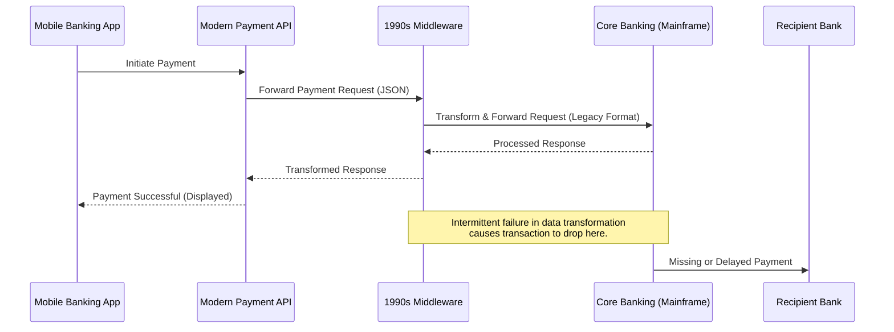

This diagram demonstrates how a payment transaction initiated on the mobile app traversed through various systems before encountering issues in the middleware layer. The intermittent failure in data format transformation caused some transactions to silently fail, leading to customer impact while leaving teams without actionable insights. Cross-generational distributed tracing would have allowed engineers to pinpoint the breakdown within minutes, avoiding the prolonged outage and customer dissatisfaction.

### SRE Best Practice: Evidence-Based Investigation

Effective hybrid architecture tracing requires a comprehensive strategy that creates visibility bridges between technological generations while accepting their fundamental differences. Rather than attempting to force modern tracing approaches onto legacy systems, SRE teams should implement a "tracing gateway" approach that preserves context across technological boundaries without requiring significant modifications to heritage systems.

#### Checklist: Implementing the Tracing Gateway Approach

1. **Boundary Mapping**

   - Identify all cross-generation interfaces where transactions flow between different technology stacks:
     - Modern APIs
     - Middleware queues or brokers
     - Legacy mainframe interfaces
   - Document the data flow paths and the technologies involved in each boundary.

2. **Context Propagation Mechanisms**

   - Select and implement appropriate mechanisms for each boundary:
     - Use HTTP headers for modern services.
     - Leverage message queue properties for middleware.
     - Embed transaction IDs for mainframes.
     - Utilize correlation fields in database tables for asynchronous processes.

3. **Technology Boundary Adapters**

   - Deploy adapters to infer trace spans for systems that cannot be instrumented directly:
     - Monitor observable interactions at system interfaces.
     - Extract timing, status, and dependency information.
     - Generate synthetic trace spans to represent legacy operations.

4. **Correlation and Continuity**

   - Reconstruct end-to-end transaction journeys by connecting trace segments across boundaries:
     - Use correlation identifiers (e.g., transaction IDs, request IDs).
     - Perform timing analysis to link events chronologically.
     - Apply data matching patterns to bridge fragmented visibility.

5. **Validation and Iteration**

   - Continuously validate the trace continuity across boundaries through testing and operational monitoring.
   - Iterate on context propagation mechanisms and boundary adapters to address new gaps or edge cases.

#### Table: Context Propagation Techniques

| Technology Layer | Context Propagation Mechanism | Example Use Case |
| ----------------- | ------------------------------------------ | ---------------------------------------------------------- |
| Modern APIs | HTTP headers (e.g., `X-Trace-ID`) | Passing trace IDs between microservices in a REST API call |
| Middleware Queues | Message properties (e.g., metadata fields) | Propagating trace metadata in Kafka or RabbitMQ messages |
| Mainframes | Transaction IDs in payloads | Embedding IDs in COBOL-processed banking transactions |
| Databases (Async) | Correlation fields in tables | Storing trace IDs alongside event data in relational DBs |

By following this structured approach, SRE teams can systematically eliminate visibility gaps while respecting the operational constraints of hybrid architectures. The ultimate goal is to ensure seamless trace continuity across technological epochs, enabling reliable end-to-end transaction monitoring.

### Banking Impact

The business consequences of fragmented visibility across hybrid banking architectures extend far beyond technical troubleshooting challenges. Financial institutions face direct revenue impact when issues crossing technology boundaries delay settlement processes, cause transaction failures, or create reconciliation errors. A mid-sized bank reported that cross-generation transaction failures cost approximately $2.4 million annually in unnecessary manual reconciliation, customer service escalations, and compensation payments.

Customer experience deteriorates significantly when transactions appear successful in modern front-end systems but fail silently in legacy processing—creating an erosion of trust that directly impacts digital adoption rates. Research shows that customers who experience unexplained transaction inconsistencies are 3-4 times more likely to revert to branch or telephone banking, dramatically increasing service cost and reducing digital engagement.

Regulatory consequences are equally concerning, as fragmented visibility makes it challenging to demonstrate proper transaction handling to examiners. Several financial institutions have received regulatory findings specifically citing inadequate end-to-end transaction traceability across their hybrid architecture as a control weakness, requiring expensive remediation programs and increased compliance overhead.

The table below summarizes the quantitative impacts of fragmented visibility across hybrid banking architectures:

| **Impact Area** | **Description** | **Estimated Cost/Effect** |
| --------------------------- | ------------------------------------------------------------------------- | ---------------------------------------------------------------------- |
| **Revenue Loss** | Transaction failures, delays, and reconciliation errors. | $2.4M annually for mid-sized banks. |
| **Customer Experience** | Increased churn due to unexplained transaction inconsistencies. | 3-4x higher likelihood of reverting to costly branch or phone banking. |
| **Regulatory Compliance** | Findings and penalties for inadequate traceability across hybrid systems. | Costly remediation programs and higher compliance overhead. |
| **Strategic Modernization** | Inhibited ability to safely evolve due to poor system understanding. | Slowed digital transformation, perpetuating competitive disadvantages. |

Perhaps most significantly, this fragmented visibility becomes a strategic liability that paralyzes modernization efforts—organizations cannot safely evolve systems they don't fully understand, leading to excessive caution that slows digital transformation and perpetuates competitive disadvantages.

### Implementation Guidance

1. **Conduct a Comprehensive Technology Boundary Mapping Exercise**\
   Identify all cross-generation interfaces where transaction context must be preserved. Document the specific technical mechanisms available at each boundary, such as HTTP headers, message properties, database fields, or batch file interfaces. For example, map interactions like:

   - Mobile app → API Gateway (HTTP headers for trace context)
   - Middleware → Message Queue (custom message properties for correlation IDs)
   - Middleware → Mainframe (transaction reference fields in database records).

2. **Implement Context Propagation Mechanisms**\
   Use appropriate tools and techniques for each technology boundary:

   - **Modern Systems**: Instrument APIs, services, and middleware with OpenTelemetry SDKs. Example configuration for an OpenTelemetry-instrumented Java service:
     ```java
     import io.opentelemetry.api.GlobalOpenTelemetry;
     import io.opentelemetry.api.trace.Tracer;

     public class PaymentService {
         private static final Tracer tracer = GlobalOpenTelemetry.getTracer("com.bank.payment");

         public void processPayment() {
             var span = tracer.spanBuilder("processPayment").startSpan();
             try {
                 // Business logic here
             } finally {
                 span.end();
             }
         }
     }
     ```
   - **Middleware Layers**: Add custom correlation IDs to message headers or payloads. Example Kafka producer with correlation ID:
     ```java
     import org.apache.kafka.clients.producer.ProducerRecord;

     String correlationId = UUID.randomUUID().toString();
     ProducerRecord<String, String> record = new ProducerRecord<>("transactions", "key", "value");
     record.headers().add("correlation-id", correlationId.getBytes(StandardCharsets.UTF_8));
     producer.send(record);
     ```
   - **Legacy Systems**: Embed transaction reference fields within existing database schemas or batch file structures.

3. **Develop Specialized "Trace Bridge" Components**\
   Build adapters to translate modern tracing formats into legacy correlation mechanisms and vice versa. For instance, a trace bridge might extract OpenTelemetry trace IDs from HTTP headers and insert them into mainframe-readable fields. Example pseudo-code for a trace bridge:

   ```
   Input: HTTP Request with Trace-Header
   Extract: Trace-ID from HTTP Header
   Transform: Trace-ID into Mainframe-Compatible Format
   Output: Enriched Database Record or Batch File with Trace Reference
   ```

4. **Deploy Passive Monitoring at Network Boundaries**\
   Where direct instrumentation isn't feasible, use network sniffers or middleware logs to infer context. For example, deploy a network proxy to capture HTTP headers at the API Gateway, or analyze message queue logs to correlate related events. Example passive monitoring configuration for an API Gateway:

   ```yaml
   proxy:
     capture_headers:
       - traceparent
       - correlation-id
     log_format: JSON
   ```

5. **Create Unified Visualizations**\
   Use visualization tools to represent full transaction journeys, distinguishing between observed and inferred spans. Example using a text-based representation:

   ```
   Customer Transaction: MobileApp -> API Gateway -> Middleware -> Mainframe
     ├── Observed Span: MobileApp (traceparent: "1234abcd")
     ├── Observed Span: API Gateway (traceparent: "1234abcd")
     ├── Inferred Span: Middleware (correlation-id: "5678efgh")
     └── Observed Span: Mainframe (transaction-ref: "9012ijkl")
   ```

   Ensure the visualization tool supports hybrid trace context by integrating both observed and reconstructed spans, providing engineers with a holistic view of transaction flows.

## Panel 2: The Critical Path - Core Banking Transaction Flows

### Scene Description

A war room during a high-severity incident affecting payment processing. Multiple engineers are gathered around a large screen showing a distributed trace of a failing payment transaction. The visualization prominently highlights the "critical path" of the transaction in red, illustrating the exact sequence of services involved in processing the payment. This includes the flow from the mobile app entry point through authentication, fraud checking, core banking, partner bank messaging, and settlement services. A timer on the visualization indicates a 30-second delay introduced by a service responsible for regulatory compliance checking, effectively blocking the entire transaction flow.

Below is a conceptual representation of the distributed trace, showcasing the critical path in red and other non-critical service interactions in gray:

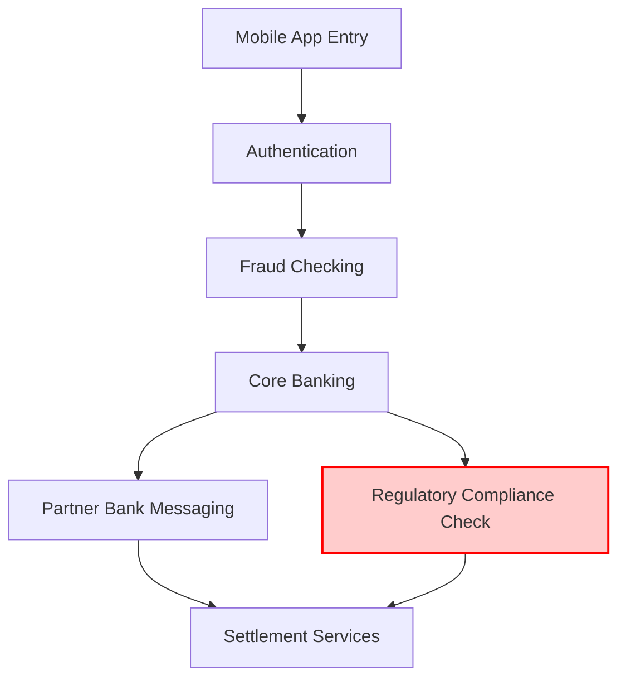

This visual breakdown helps the team quickly identify the specific bottleneck causing the delay and focus their troubleshooting efforts on the regulatory compliance service within the critical path.

### Teaching Narrative

Understanding the critical path in banking transactions transforms troubleshooting from guesswork to precision engineering. Banking transactions like payments, trades, or loan approvals follow complex paths through dozens of services, but not all services contribute equally to transaction time. Distributed tracing reveals the actual critical path—the sequence of dependent operations that directly determine the total transaction duration. Any delay in these critical path services directly impacts customer experience, while optimizations to non-critical path services yield little benefit. This critical path analysis differs fundamentally from traditional monitoring, which often treats all services with equal importance. For banking systems where performance requirements are tied to specific regulatory obligations and customer experience expectations, identifying and monitoring the critical path becomes essential. Engineers can prioritize optimization efforts on the specific services actually constraining transaction completion, rather than making unfocused improvements to services that appear busy but aren't on the critical path. This capability transforms performance engineering from broad-based optimization to surgical precision—ensuring that limited engineering resources focus on the services truly determining customer experience.

### Common Example of the Problem

A major retail bank's digital payments platform was suffering from inconsistent performance, with some immediate transfers taking up to 45 seconds to complete despite significant infrastructure investments. Customer satisfaction scores were declining, and the mobile app store rating had dropped from 4.5 to 3.8 stars primarily due to complaints about payment speed. The digital banking team had already implemented several optimization initiatives—upgrading database hardware, increasing API gateway capacity, and optimizing front-end code—with minimal improvement in overall transaction times.

Without critical path analysis, engineers were focusing on components that appeared busy but weren't actually constraining overall transaction completion. The authentication service was processing millions of requests with occasional high CPU utilization, leading teams to invest significant resources optimizing authentication flows. Similarly, the balance checking service occasionally showed high database activity, triggering another optimization initiative. Despite these efforts, end-to-end payment times remained virtually unchanged.

When the bank finally implemented distributed tracing with critical path analysis, they discovered that neither authentication nor balance checking was on the critical path for most delayed transactions. Instead, a seemingly minor regulatory screening service was performing synchronous validation against an external sanctions database, introducing 30+ second delays during high-volume periods. This service had never been identified as problematic because it showed low overall resource utilization and processed relatively few transactions compared to core services—yet it was directly determining payment completion times for thousands of customers.

#### Sequence of Events and Delays

Below is a simplified timeline showing the sequence of events for the payment transaction and the delays introduced:

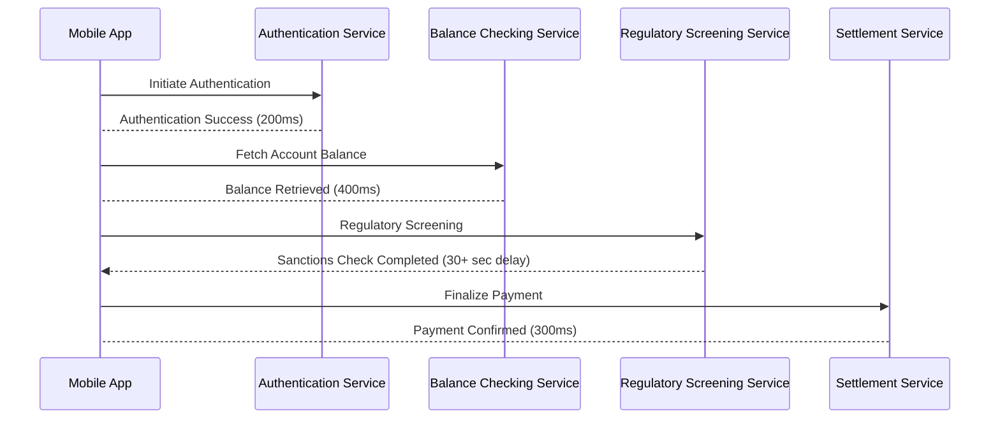

This diagram highlights how the regulatory screening service introduced a significant delay in the transaction flow. Despite its low overall resource utilization, this service was on the critical path, directly impacting the customer experience. By focusing on this service, the bank was able to reduce delays significantly—transforming their optimization efforts from guesswork to targeted improvements.

### SRE Best Practice: Evidence-Based Investigation

Critical path analysis requires a systematic approach to identifying, monitoring, and optimizing the specific services and operations that directly determine transaction completion times. This evidence-based methodology focuses on causal relationships between operations rather than isolated component performance.

The investigation begins with comprehensive end-to-end tracing of representative transaction samples across all volume patterns and business scenarios. These traces must capture not just timing but also causal dependencies—which operations must complete before others can begin—creating a directed graph of the entire transaction flow.

Trace analysis should then apply critical path methodology to identify the longest dependency chain through this graph, highlighting the specific sequence of operations that directly determines the minimum possible transaction time. This analysis must distinguish between truly sequential dependencies versus operations that could theoretically execute in parallel.

For each identified critical path component, engineers should establish baseline performance profiles that define normal behavior patterns and identify variability factors that influence operation timing. This baseline enables anomaly detection specific to critical path operations rather than generic service health.

Most importantly, optimization decisions should be ruthlessly prioritized based on critical path impact—directing resources exclusively to improvements that will reduce overall transaction time rather than optimizing components that may appear busy but don't actually constrain completion times.

#### Checklist: Steps for Critical Path Analysis

To make this methodology actionable, follow these steps:

1. **Collect Representative Traces**

   - Capture end-to-end distributed traces for diverse transaction samples.
   - Ensure traces cover different volume patterns and business scenarios.
   - Include timing, causal dependencies, and metadata for all operations.

2. **Visualize the Transaction Flow**

   - Create a directed graph of the transaction flow using trace data.
   - Highlight dependencies between operations and their execution order.

3. **Identify the Critical Path**

   - Apply critical path methodology to find the longest dependency chain.
   - Differentiate between sequential and parallelizable operations.

4. **Establish Baselines for Critical Components**

   - Define normal performance profiles for each critical path operation.
   - Identify variability factors that affect timing and dependencies.

5. **Analyze Performance Anomalies**

   - Use baselines to detect anomalies specific to critical path operations.
   - Focus analysis on deviations that directly impact transaction timing.

6. **Prioritize Optimization Efforts**

   - Evaluate impact of potential optimizations on overall transaction time.
   - Dedicate resources to changes that reduce critical path duration.
   - Avoid unnecessary improvements to non-critical operations.

7. **Monitor and Iterate**

   - Continuously monitor critical path components for changes in behavior.
   - Update baselines and dependency graphs as systems evolve.
   - Repeat the analysis periodically or during major incidents.

By following this checklist, engineers can systematically focus their efforts on the services that truly matter for improving transaction performance, ensuring efficient use of resources and minimal customer impact.

### Banking Impact

The business consequences of suboptimal critical path management extend far beyond technical performance metrics. Optimizing critical paths is crucial to mitigating revenue losses, improving customer perception, and maintaining competitive positioning. The following table summarizes the key business impacts and associated metrics:

| **Business Impact** | **Description** | **Example Metrics** |
| ------------------------------- | ------------------------------------------------------------------------------------------------------ | ------------------------------------------------------------------------------------------- |
| **Abandonment Rates** | Transaction delays increase abandonment, reducing completion rates. | ~7% increase in abandonment per second of delay beyond expectations. |
| **Revenue Loss** | Lost transactions result in direct revenue loss for the institution. | 1% abandonment for 500,000 transactions/day at $750 average = $3.75M daily loss. |
| **Customer Perception** | Customers value speed over reliability; slow transactions harm perceived reliability and satisfaction. | Survey: "Fast but occasionally failing" rated higher than "Reliable but consistently slow." |
| **Competitive Differentiation** | Faster transaction times create a marketable advantage in time-sensitive banking functions. | Advertised completion times: "Transfers in under 5 seconds" attracts new customers. |
| **Operational Costs** | Slower transactions increase resource consumption, reduce throughput, and require overprovisioning. | Increased infrastructure costs to handle backlogs caused by inefficient flows. |

By understanding these impacts, engineers and stakeholders can prioritize critical path optimizations that directly influence customer experience, revenue generation, and operational efficiency, ensuring that technical improvements align with business goals.

### Implementation Guidance

1. **Set Up Distributed Tracing**: Implement end-to-end distributed tracing with dependency tracking across all services involved in critical banking transactions. Utilize tracing libraries compatible with your tech stack (e.g., OpenTelemetry or Jaeger). Ensure proper causal relationship capture through parent-child span relationships and accurate timing information at millisecond resolution. Below is an example code snippet for setting up OpenTelemetry tracing in a Python service:

   ```python
   from opentelemetry import trace
   from opentelemetry.sdk.trace import TracerProvider
   from opentelemetry.sdk.trace.export import BatchSpanProcessor
   from opentelemetry.exporter.jaeger.json import JaegerExporter

   # Set up the tracer provider
   trace.set_tracer_provider(TracerProvider())

   # Configure the Jaeger exporter
   jaeger_exporter = JaegerExporter(
       agent_host_name="localhost",
       agent_port=6831,
   )

   # Add a span processor to send spans to Jaeger
   span_processor = BatchSpanProcessor(jaeger_exporter)
   trace.get_tracer_provider().add_span_processor(span_processor)

   # Start a trace
   tracer = trace.get_tracer(__name__)
   with tracer.start_as_current_span("critical-path-span"):
       print("Tracing critical path transaction...")
   ```

2. **Enable Critical Path Analysis**: Deploy critical path analysis algorithms that automatically identify the longest dependency chain in each transaction type. Utilize distributed tracing tools to visualize these paths distinctly. Below is an example of a critical path in a transaction flow using a text-based flowchart:

   ```plaintext
   Transaction Start --> Auth Service --> Fraud Check --> Compliance Check --> Core Banking --> Settlement --> Transaction End
                      (Critical Path highlighted in red)
   ```

   Integrate these visualizations into real-time dashboards to show current critical path performance metrics across high-value transaction types.

3. **Baseline and Monitor Performance**: Establish critical path baseline profiles for different transaction types and volume patterns. Implement automated anomaly detection to trigger alerts when critical path timing deviates from expected patterns. Focus operational attention on variations that impact the customer experience instead of noise from non-critical services.

4. **Define Critical Path SLOs**: Create service-level objectives (SLOs) specifically for critical path components. For example, set stricter latency and availability thresholds for services like compliance and settlement, compared to less time-sensitive operations. This ensures engineering efforts are aligned with the services that directly affect transaction completion times.

5. **Optimize with A/B Testing**: Implement a critical-path-oriented optimization process. Validate the impact of performance improvements through A/B testing, comparing transaction flows before and after changes. Measure actual end-to-end time reduction rather than isolated component improvements. This ensures engineering resources drive meaningful customer experience enhancements.

6. **Example Dashboard**: Create a dashboard for tracking critical path metrics. Here’s an example of a text-based dashboard layout:

   ```plaintext
   ========================= Critical Path Dashboard =========================
   Transaction Type: Payment Processing
   ---------------------------------------------------------------------------
   Component               | Avg Latency (ms) | Error Rate (%) | Critical Path
   ---------------------------------------------------------------------------
   Auth Service            | 50               | 0.2            | Yes
   Fraud Check             | 30               | 0.1            | Yes
   Compliance Check        | 30000            | 0.0            | Yes (bottleneck)
   Core Banking            | 100              | 0.1            | Yes
   Settlement              | 200              | 0.0            | Yes
   ---------------------------------------------------------------------------
   Current Critical Path Latency: 30,380ms
   ===========================================================================
   Alerts: Compliance Check latency exceeds threshold (Baseline: 1,000ms)
   ```

By combining distributed tracing, real-time dashboards, and a critical-path-centric approach to monitoring and optimization, your organization can ensure precision in addressing transaction performance issues.

## Panel 3: Regulatory Boundaries - Tracing Across Compliance Domains

### Scene Description

A compliance and technology workshop is in progress, where risk officers and SRE engineers are collaboratively reviewing enhanced trace visualizations. These visualizations are specifically designed to highlight regulatory boundaries in real-time. The trace of an international money transfer is displayed, flowing seamlessly through multiple interconnected systems. Clear indicators mark each transition across regulatory jurisdictions, while dynamic data masking is visually represented—showing personally identifiable information and financial details being automatically obscured as required by the applicable regulations.

Below is a high-level representation of the trace visualization:

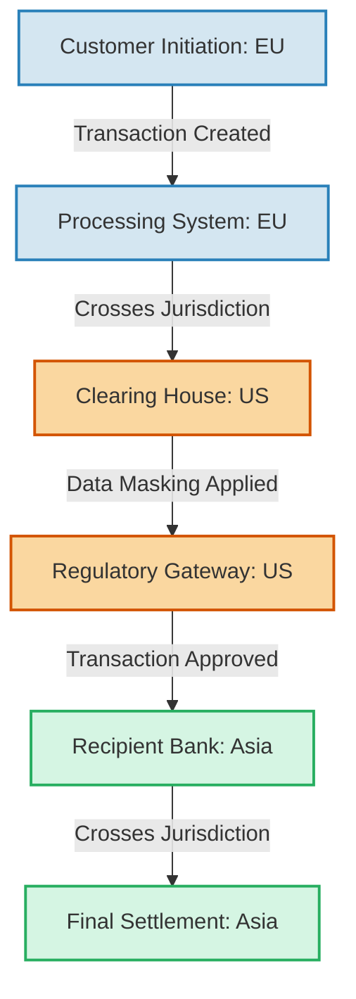

In the visualization, color-coded markers differentiate between jurisdictions, with blue representing the EU, orange for the US, and green for Asia. Masking events are explicitly flagged at the points where data protection regulations necessitate obscuring sensitive information. Compliance officers are visibly engaged, nodding in approval as the system demonstrates its capability to ensure regulatory compliance while maintaining technical observability. The dynamic, regulation-aware tracing empowers teams to track transactions across global boundaries with confidence, reinforcing trust in the institution's ability to meet complex compliance demands.

### Teaching Narrative

Regulatory boundaries transform distributed tracing from a purely technical tool to a compliance-aware capability essential for banking environments. Financial institutions operate under strict regulations that vary by jurisdiction, transaction type, and customer category. These regulations impact not just the business rules, but the very nature of what can be traced and how that trace data can be stored and accessed. Effective banking tracing systems must be "regulation-aware"—capable of automatically adapting as transactions cross regulatory boundaries. This includes dynamic data masking to protect personally identifiable information and financial details when required by regulations like GDPR or PCI-DSS, maintaining segregated trace storage for data that cannot legally leave certain jurisdictions, and managing retention policies that differ by region. Unlike tracing in less regulated industries, banking tracing implementations must solve the complex challenge of providing technical observability while simultaneously ensuring regulatory compliance. This capability transforms tracing from a potential compliance risk into a powerful tool for demonstrating regulatory adherence—showing exactly how transactions are processed across jurisdictional boundaries while automatically enforcing the appropriate data protection measures required by each regulatory framework.

### Common Example of the Problem

A global investment bank operating across North America, Europe, and Asia-Pacific recently experienced a significant compliance incident stemming from their distributed tracing implementation. The bank had successfully deployed tracing across their trading platform to improve performance and reliability. However, during a routine regulatory examination, multiple compliance failures were uncovered, as summarized below:

| **Jurisdiction** | **Compliance Failure** | **Regulation Violated** | **Impact** |
| ------------------- | --------------------------------------------------------------------------------------------------------------------------------------------------------------------------- | -------------------------------- | ------------------------------------------------------------------------------------------------- |
| European Union (EU) | Full customer identifying information, account details, and transaction data from EU customers were captured and stored in a centralized U.S.-based observability platform. | GDPR (Data Sovereignty) | €4.5 million fine, mandatory remediation program, and reputational damage from public disclosure. |
| Canada | Personal financial information was retained beyond permitted retention periods. | PIPEDA (Retention Policies) | Required changes to retention configurations and additional oversight by Canadian regulators. |
| Hong Kong | Monetary authority data was accessible to unauthorized personnel due to insufficient trace access controls. | HKMA Guidelines (Access Control) | Regulatory warnings, internal audits, and stricter trace access management requirements imposed. |

#### Timeline of Events:

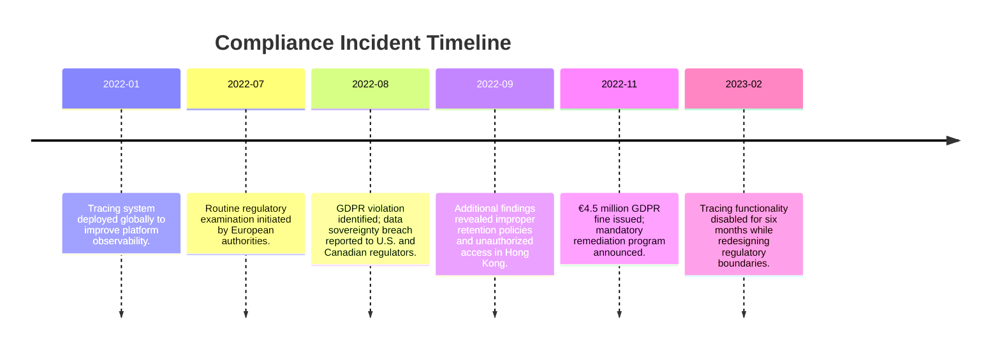

The examination revealed that when transactions crossed from EU-based systems to U.S.-based settlement services, the trace data maintained full customer details without appropriate transformation or protection. Adding to the severity, Canadian personal financial information was being stored beyond permitted retention periods, and Hong Kong monetary authority data was accessible to unauthorized personnel due to inadequate tracing access controls.

The core issue wasn’t their technical tracing capability but their failure to implement appropriate regulatory boundaries in their observability implementation. The result was a costly and disruptive compliance failure that could have been avoided with a regulation-aware tracing system.

### SRE Best Practice: Evidence-Based Investigation

Implementing regulation-aware tracing requires a sophisticated approach that balances complete operational visibility with jurisdictional compliance requirements. This evidence-based methodology focuses on maintaining technical observability while respecting regulatory boundaries.

#### Implementation Checklist for Regulation-Aware Tracing

1. **Regulatory Mapping**

   - Identify all applicable regulations affecting trace data across jurisdictions, transaction types, and customer categories.
   - Document requirements for:
     - Data residency and geographic restrictions.
     - Field-level privacy rules (e.g., masking, tokenization).
     - Retention periods and archival policies.
     - Access controls and audit requirements.
     - Cross-border transfer limitations.

2. **Regulatory Boundary Detection**

   - Configure tracing systems to detect jurisdictional boundaries using:
     - Transaction origin and destination.
     - Customer location and classification.
     - System geography and deployment zones.
     - Data classification and sensitivity levels.
   - Establish rules for dynamic detection of regulatory transitions.

3. **Dynamic Data Transformation**

   - Implement transformations triggered at regulatory boundaries, such as:
     - Field-level masking, tokenization, or encryption of sensitive data.
     - Severing data relationships that enable re-identification.
     - Attribute filtering based on jurisdictional privacy rules.
   - Preserve essential technical context for operational observability.

4. **Trace Storage and Access Control**

   - Enforce jurisdictional partitioning of trace data using:
     - Regionally distributed storage solutions.
     - Role-based access controls (RBAC) aligned with regulatory roles and purposes.
   - Ensure trace data access is restricted based on:
     - User location and clearance.
     - Transaction type and regulatory framework.

5. **Compliance Validation and Monitoring**

   - Regularly audit tracing configurations to ensure ongoing compliance.
   - Implement alerting for unexpected jurisdictional boundary crossings.
   - Maintain documentation demonstrating adherence to regional regulations.

#### Workflow Diagram for Regulation-Aware Tracing

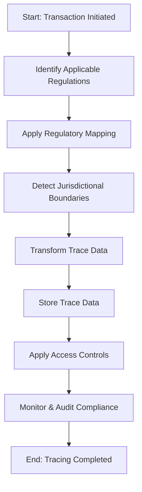

By following this checklist and workflow, SRE teams can ensure their tracing systems maintain both technical observability and regulatory compliance. This structured approach transforms tracing into a powerful compliance-aware tool, enabling financial institutions to demonstrate adherence to complex regulatory frameworks while maintaining operational excellence.

### Banking Impact

The business consequences of improper regulatory handling in tracing implementations extend far beyond direct compliance penalties, with financial institutions facing significant risks on multiple fronts. Regulatory fines under frameworks like GDPR can reach as high as 4% of global revenue, and there are documented cases where banks have incurred penalties exceeding €50 million for observability-related compliance failures. For instance, a major European financial institution was fined €35 million in 2021 for inadequate data masking during cross-border transaction tracing, setting a precedent for stricter enforcement.

Operationally, non-compliance has led to mandated shutdowns of observability systems, leaving organizations without critical visibility during remediation periods. A notable case involved a multinational bank that experienced a 40% increase in mean time to resolution (MTTR) for incidents after being forced to suspend their tracing tools in certain jurisdictions. These visibility gaps directly correlate with heightened reliability risks and increased downtime costs, which can exceed $300,000 per hour for large financial institutions.

Customer trust also suffers severe repercussions when data protection failures become public. A 2022 survey of multinational corporations ranking factors for treasury partner selection showed that 68% of respondents placed "robust compliance and data protection" among their top three considerations, highlighting the competitive disadvantage of regulatory missteps. Loss of trust in compliance capabilities can lead to client attrition, particularly among global enterprises that demand sophisticated regulatory adherence.

Comparing this to less regulated industries, the stakes in banking are uniquely high. While technology firms may face reputational damage for observability-related compliance gaps, financial institutions encounter direct financial consequences and operational constraints that can ripple across global systems. For example, unlike an e-commerce platform that might face isolated fines for regional non-compliance, banks must navigate jurisdictional boundaries in real time, where failure to adapt tracing systems dynamically can lead to cascading impacts—affecting not just compliance but also strategic initiatives like global observability standardization.

Most critically, unresolved regulatory boundary challenges create strategic limitations that force institutions to make compromises in visibility. This can result in fragmented regional silos or suboptimal observability setups that undermine the core value of distributed tracing. Addressing these challenges effectively is not just a matter of compliance but a foundational requirement for maintaining operational excellence and customer confidence in a highly competitive, regulated industry.

### Implementation Guidance

1. **Conduct a Comprehensive Regulatory Impact Assessment**\
   Begin by identifying all jurisdictional requirements that affect observability data within your organization’s operational footprint. Specifically, assess regulations governing trace data collection, storage, access, transformation, and retention. This assessment should map regulations (e.g., GDPR, PCI-DSS) to your systems, transaction types, and customer categories, creating a clear compliance matrix for trace-related operations.

2. **Implement Automated Regulatory Boundary Detection**\
   Enhance your tracing infrastructure to detect jurisdictional transitions in real time. For example, use metadata tagging at each transaction entry point to indicate its origin and regulatory context. As the transaction propagates, dynamically evaluate its path against a rule engine that applies the relevant regulations. This ensures that the tracing system adapts as data crosses regulatory boundaries.

   ```mermaid
   graph TD
   A[Transaction Entry Point] --> B[Metadata Tagging]
   B --> C[Rule Engine: Check Jurisdiction]
   C -->|Boundary Crossed| D[Apply Regional Rules]
   C -->|No Boundary Change| E[Continue As-Is]
   ```

3. **Deploy Dynamic Data Protection Mechanisms**\
   Integrate dynamic data protection controls into your tracing pipeline to enforce compliance automatically. Below is a simplified Python-based example using a hypothetical tracing library to mask Personally Identifiable Information (PII) when a jurisdiction requires it:

   ```python
   from tracing_library import TracePipeline, DataMaskingRule

   # Define masking rules based on jurisdiction
   masking_rules = {
       "EU": DataMaskingRule(fields=["customer_name", "account_number"], method="mask"),
       "US": DataMaskingRule(fields=["ssn"], method="tokenize"),
   }

   def apply_dynamic_masking(trace_data, jurisdiction):
       if jurisdiction in masking_rules:
           trace_data.apply_rule(masking_rules[jurisdiction])
       return trace_data

   # Example trace processing
   trace_pipeline = TracePipeline()

   @trace_pipeline.middleware
   def enforce_data_protection(trace_data):
       jurisdiction = trace_data.get("jurisdiction")
       return apply_dynamic_masking(trace_data, jurisdiction)

   trace_pipeline.process(transaction_trace)
   ```

4. **Create a Regionally Distributed Trace Storage Architecture**\
   Design your trace storage to respect regulatory boundaries by keeping data within the jurisdictions in which it originated. Use a regionally distributed architecture with federated query capabilities, ensuring observability while maintaining compliance. For instance, store EU trace data in EU-based servers and US trace data in US-based servers. Use query-layer filters to enforce access controls based on the user’s region and role.

   ```plaintext
   [EU Trace Storage] ---- Federated Query Layer ---- [US Trace Storage]
       |                                                 |
       +--> EU Query Access Control       +--> US Query Access Control
   ```

5. **Establish Comprehensive Trace Data Governance**\
   Set up governance policies that cover region-specific retention rules, purpose-limited access controls, and automated compliance verification. For example, configure automated checks to ensure trace data older than the permitted retention period is purged from the system:

   ```python
   from compliance_tools import RetentionPolicy

   # Define regional retention policies
   retention_policies = {
       "EU": RetentionPolicy(days=90),
       "US": RetentionPolicy(days=180),
   }

   def enforce_retention_policy(storage, jurisdiction):
       if jurisdiction in retention_policies:
           storage.apply_retention_policy(retention_policies[jurisdiction])

   # Apply retention policies to each region
   enforce_retention_policy(eu_storage, "EU")
   enforce_retention_policy(us_storage, "US")
   ```

   Additionally, ensure that audit logs provide end-to-end traceability for compliance verification, enabling examiners to track how data protection measures were applied at every stage of the transaction lifecycle.

## Panel 4: Third-Party Integration Points - Tracing Beyond Organizational Boundaries

### Scene Description

A service operations center where engineers are monitoring a live dashboard showing payment processing transactions. The dashboard is divided into three key sections:

1. **Transaction Flow Overview**: A graph showing end-to-end traces for payment transactions. Each trace is segmented into spans, with internal systems represented in green and external dependencies (e.g., payment networks, identity verification providers, fraud detection services, and partner banks) in orange.
2. **Third-Party Latency Heatmap**: A heatmap on the side highlights latency trends across third-party services, with red zones indicating peak delays during critical transaction periods.
3. **Error and Alert Panel**: A panel below displays active alerts tied to third-party service issues, including those impacting transaction time SLAs.

Below is a text-based representation of the dashboard layout:

```
+-------------------------------+----------------------+
|        Transaction Flow       |  Third-Party Latency|
|         Overview              |      Heatmap         |
| (Green = Internal, Orange =   |  Red = High Latency  |
| External Dependencies)        |  Yellow = Medium     |
|                               |  Green = Normal      |
+-------------------------------+----------------------+
|        Error and Alert Panel                           |
| (Active alerts for SLA violations and latency spikes)  |
+-------------------------------------------------------+
```

An engineer is pointing to a specific trace segment in the Transaction Flow Overview, where a third-party fraud detection service is introducing variable latency during peak hours. This latency is highlighted in the heatmap as a red zone and is causing a ripple effect, visible in the alerts panel, that impacts overall transaction times for customers.

### Teaching Narrative

Third-party integration points fundamentally change the distributed tracing paradigm by extending visibility beyond organizational boundaries. Banking systems rarely operate in isolation—they depend on complex networks of external services including payment processors, credit bureaus, identity verification providers, market data services, and partner financial institutions. Traditional monitoring approaches struggle at these organizational boundaries, creating blind spots precisely where visibility is most crucial. Advanced distributed tracing in banking extends the observability perimeter beyond internal systems to include these critical third-party dependencies. This doesn't necessarily require the third parties themselves to implement tracing—though standards like OpenTelemetry increasingly facilitate this—but rather requires clever instrumentation of integration points that can infer third-party behavior from observable interactions. This extended visibility transforms vendor management from subjective assessment to data-driven evaluation, providing quantitative evidence of third-party service levels and their direct impact on customer experience. For banking applications where a single slow third-party service can block entire transaction flows, this extended visibility across organizational boundaries becomes essential for maintaining reliable customer experiences and meeting service level objectives.

### Common Example of the Problem

A digital-first bank offering instant loan decisions recently experienced escalating customer complaints about their "60-second approval" service slowing to 3-5 minutes during peak periods, despite internal monitoring showing all systems operating normally. Customer abandonment increased 40% during these slowdowns, directly impacting lending revenue and damaging their market positioning as a fast-response lender.

Without cross-organizational tracing, internal teams had limited visibility into the true bottleneck. Their monitoring showed loan application services, credit assessment algorithms, and decision engines all functioning within expected parameters. After weeks of investigating internal components, they finally identified the issue through manual correlation: a third-party credit bureau API used for verification was experiencing significant slowdowns during high-volume periods, but the issues weren't reflected in the bureau's own status dashboards or SLA reporting.

The following timeline illustrates the sequence of events that unfolded:

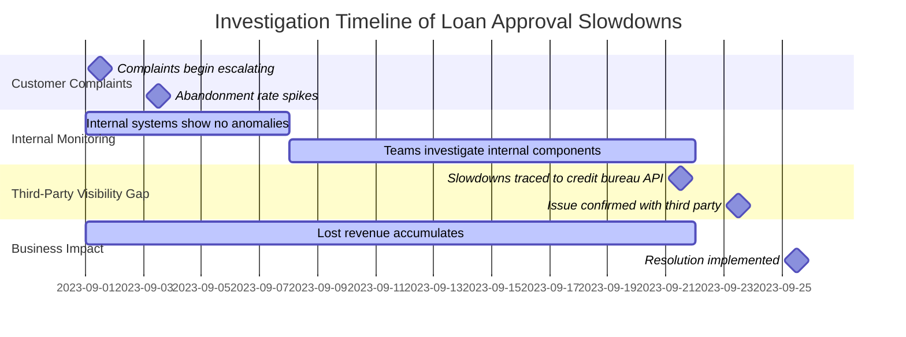

The investigation revealed that the credit bureau's aggregated performance reporting masked the specific API degradation affecting the bank's loan flows. The bureau claimed compliance with their contractual 99.9% availability SLA, which technically remained true despite significant performance degradation during peak periods.

Without cross-boundary tracing, the bank had no quantitative evidence to demonstrate the actual impact of the third-party service on customer experience, creating a prolonged resolution process. This delay in identifying and resolving the issue cost an estimated $2.1 million in lost loan origination revenue while the problem persisted.

### SRE Best Practice: Evidence-Based Investigation

Extending distributed tracing across organizational boundaries requires specialized approaches that provide visibility into external dependencies without requiring third-party cooperation or implementation. This evidence-based methodology focuses on inference and boundary instrumentation rather than direct integration.

#### Checklist: Key Steps for Evidence-Based Investigation

1. **Instrument Third-Party Boundaries**

   - Implement detailed tracing immediately before and after each external service call.
   - Capture the following data points:
     - Request and response payloads (mask sensitive data).
     - Timing information (latency, response time).
     - Retry attempts and error conditions.
     - Correlation identifiers to link requests and responses.

2. **Establish Synthetic Transaction Monitoring**

   - Design representative test transactions to regularly exercise critical external APIs.
   - Measure baseline performance patterns, including:
     - Variability across time periods (peak/off-peak hours).
     - Differences by transaction type.
     - Impact under varying load conditions.

3. **Analyze and Model Inferred Spans**

   - Use timing and response patterns to create inferred spans representing third-party operations.
   - Clearly distinguish inferred spans from directly observed spans in trace visualizations while maintaining the overall transaction flow.

4. **Quantify Third-Party Service Levels**

   - Derive service level measurements from real customer transaction patterns, not just synthetic checks.
   - Use observed data to evaluate third-party performance against contractual SLA metrics.

5. **Iterate and Refine Instrumentation**

   - Continuously improve boundary span instrumentation based on new insights and evolving third-party behaviors.
   - Collaborate with stakeholders to align observability improvements with business needs.

#### Example Workflow for Evidence-Based Investigation

```text
[Customer Transaction Initiates] --> [Internal System Span] 
   --> [Boundary Instrumentation: Request Captured] 
   --> [Third-Party Service Call] 
   --> [Boundary Instrumentation: Response Captured] 
   --> [Inferred Span for Third-Party Behavior] 
   --> [Internal System Span] --> [Transaction Completes]
```

This structured workflow ensures all external interactions are monitored and analyzed systematically, enabling high-confidence root cause analysis and data-driven vendor management.

By following these steps, engineers can transform third-party integration points from opaque blind spots into actionable insights, ensuring reliable customer experiences and robust service level objectives.

### Banking Impact

The business consequences of inadequate visibility across third-party boundaries extend throughout the banking value chain. Below is a summary of key quantitative impacts:

| **Category** | **Metric** | **Impact** |
| --------------------------- | ---------------------------------------------------------------------------------------------------- | ----------------------------------------------------------------------------------------------------------------------------- |
| **Transaction Abandonment** | Payment abandonment rate increases by 7-12% for each additional second of processing time. | Steep drop-offs occur when advertised transaction times are exceeded, leading to customer frustration and lost opportunities. |
| **Revenue Loss** | 1% abandonment on 250,000 daily transactions with $0.47 average interchange revenue per transaction. | Over $1.1 million in annual revenue impact for a mid-sized bank, excluding long-term customer relationship damage. |
| **Reputation Damage** | Negative reviews citing performance issues have 3-4x the influence on prospective customers. | Customers often blame the bank for issues caused by third-party latency, eroding trust and brand perception. |
| **Operational Efficiency** | Mean time to resolution (MTTR) for third-party issues averages 3-4 times longer without visibility. | Prolonged MTTR due to blind spots in external dependency behavior complicates issue diagnosis and delays resolution. |

#### Example Scenario: Revenue Impact Calculation

For a mid-sized bank processing 250,000 daily card transactions:

- Average interchange revenue per transaction = **$0.47**
- 1% increase in abandonment rate due to third-party latency = **2,500 abandoned transactions/day**
- Revenue loss per day = **2,500 x $0.47 = $1,175**
- Annualized revenue loss = **$1,175 x 365 = $428,375**

This calculation illustrates how even small latency-induced abandonment rates compound into significant financial losses, underscoring the necessity of extended observability across organizational boundaries.

In addition to these impacts, inadequate visibility impairs customer-facing teams, leaving them unable to provide accurate explanations or resolution timelines during incidents. For banking applications, where sub-second latencies can define customer satisfaction, observability across third-party dependencies is not optional—it's critical for maintaining reliable customer experiences and achieving service level objectives.

### Implementation Guidance

1. **Boundary Instrumentation**\
   Implement comprehensive boundary instrumentation at all third-party integration points. Create detailed tracing spans immediately before and after each external service call, capturing full context such as request/response payloads, headers, status codes, and timing at millisecond resolution. Below is an example of using OpenTelemetry to instrument an HTTP client for a third-party API call:

   ```python
   from opentelemetry import trace
   from opentelemetry.instrumentation.requests import RequestsInstrumentor
   import requests

   # Initialize OpenTelemetry tracing
   tracer = trace.get_tracer(__name__)
   RequestsInstrumentor().instrument()

   # Example of a traced call to a third-party API
   def call_third_party_api():
       with tracer.start_as_current_span("third_party_api_call") as span:
           url = "https://third-party-service.example.com/api/resource"
           response = requests.get(url)
           span.set_attribute("http.method", "GET")
           span.set_attribute("http.url", url)
           span.set_attribute("http.status_code", response.status_code)
           span.set_attribute("response.time_ms", response.elapsed.total_seconds() * 1000)

           if response.status_code != 200:
               span.set_attribute("error", True)
           return response
   ```

2. **Intelligent Correlation Mechanisms**\
   Deploy mechanisms to maintain transaction context across organizational boundaries even when third-party systems do not support standard context propagation. Use unique request identifiers, timestamps, or transaction attributes to correlate flows. For example, append a unique transaction ID to outgoing requests and parse it from responses to reconnect traces:

   ```python
   import uuid

   transaction_id = str(uuid.uuid4())
   headers = {"X-Transaction-ID": transaction_id}
   response = requests.get(url, headers=headers)
   ```

3. **Synthetic Transaction Monitoring**\
   Create synthetic transaction monitors that continuously test critical third-party services. These tests should simulate real transaction flows under varying conditions. For instance, a periodic synthetic test in Python might look like this:

   ```python
   import schedule
   import time

   def synthetic_test():
       with tracer.start_as_current_span("synthetic_test") as span:
           url = "https://third-party-service.example.com/api/resource"
           response = requests.get(url)
           span.set_attribute("http.status_code", response.status_code)
           span.set_attribute("response.time_ms", response.elapsed.total_seconds() * 1000)

           if response.status_code != 200:
               span.set_attribute("error", True)

   # Run the synthetic test every 5 minutes
   schedule.every(5).minutes.do(synthetic_test)

   while True:
       schedule.run_pending()
       time.sleep(1)
   ```

4. **Quantitative Service Level Measurements**\
   Develop dashboards that show real-time third-party service performance based on production traffic patterns. Use these dashboards to compare transaction types, volumes, and time periods. A sample conceptual dashboard representation might look like this:

   ```
   +-----------------------+-------------------+-----------------+
   | Third-Party Service   | Avg Response Time | Error Rate (%)  |
   +-----------------------+-------------------+-----------------+
   | Fraud Detection       | 120ms            | 0.5%            |
   | Identity Verification | 250ms            | 1.2%            |
   | Payment Processor     | 90ms             | 0.3%            |
   +-----------------------+-------------------+-----------------+
   ```

5. **Data-Driven Vendor Management**\
   Establish vendor management practices that leverage trace-based evidence to quantify third-party impact on customer experience. Use historical data to identify patterns and negotiate SLAs based on actual business impact. For example, if traces show consistent latency during peak hours for a fraud detection service, use this data in service reviews to push for lower latency guarantees during high-traffic periods.

By combining these technical implementations with robust monitoring strategies, organizations can gain actionable insights into their third-party dependencies, ensuring optimal performance and reliability across organizational boundaries.

## Panel 5: Data Consistency Tracing - Following the Money Trail

### Scene Description

A financial reconciliation team is gathered around a specialized trace visualization designed to show data consistency across systems. The display consists of multiple parallel traces, each representing the journey of the same monetary transfer as it appears in different banking systems. These systems include the customer-facing mobile app, the core banking ledger, the fraud monitoring system, the regulatory reporting database, and the partner bank's receiving system.

The visualization is structured as follows:

```mermaid
gantt
    title Transaction Trace Visualization
    dateFormat  HH:mm:ss
    axisFormat  HH:mm
    section Systems
    Mobile App           :done, 00:01:00, 00:01:10
    Core Banking Ledger  :done, 00:01:05, 00:01:15
    Fraud Monitoring     :done, 00:01:10, 00:01:20
    Reg. Reporting DB    :crit, active, 00:01:15, 00:01:25
    Partner Bank System  :done, 00:01:20, 00:01:30
```

Timestamps indicate when the transaction is recorded in each system, with color-coded markers showing whether the transaction details (such as amount and attributes) remain consistent across all representations. For example:

- **Green**: Transaction is consistent across systems.
- **Yellow**: Minor inconsistencies detected.
- **Red**: Critical discrepancy identified.

A highlighted discrepancy in the display shows that while the transaction appears correctly in the core banking system, it is missing entirely from the regulatory reporting database. This visualization enables the team to pinpoint and investigate the issue in real time, ensuring a rapid resolution and maintaining data integrity.

### Teaching Narrative

Data consistency tracing extends distributed tracing beyond performance monitoring to ensure the integrity of financial data across systems. In banking, a single transaction like a payment or trade often creates multiple records across different systems—each representing the same logical operation but stored in different formats for different purposes. Traditional tracing focuses on operation timing and flow, but banking environments require an additional dimension: verifying that the same logical transaction is represented consistently across all systems. This specialized form of tracing follows the "money trail" rather than just the request flow, confirming that a transfer appears with the correct amount, status, and attributes in every system that records it—from customer-facing applications to core ledgers, risk systems, regulatory reporting databases, and partner institutions. This capability transforms financial reconciliation from a separate, after-the-fact process to a real-time observability function integrated with technical monitoring. For financial institutions where data consistency directly impacts regulatory compliance, financial accuracy, and customer trust, this specialized tracing capability becomes essential for maintaining the integrity of the financial system itself—ensuring that the digital representation of money remains consistent throughout its journey across distributed systems.

### Common Example of the Problem

A regional bank recently experienced a serious reconciliation incident during their end-of-day settlement process, identifying approximately $27 million in payment transactions that appeared successfully processed in customer-facing systems but were missing from their core banking ledger. This discrepancy triggered an urgent investigation, requiring over 200 person-hours to manually trace individual transactions across multiple systems to identify the pattern.

Without data consistency tracing, reconciliation teams had to reconstruct transaction flows by searching disconnected logs across different platforms, manually extracting reference numbers, and attempting to follow the money movement based on timestamps and identifiers that often changed as transactions crossed system boundaries. After three days of intensive investigation, they discovered the root cause: a middleware component responsible for transforming payment messages between their digital banking platform and core ledger had experienced a partial failure. This middleware acknowledged receipt of transactions but failed to properly forward approximately 3,400 payments to downstream systems.

This created a dangerous split-brain scenario where customers saw completed transfers while receiving accounts never received the funds. The bank faced significant operational challenges unwinding these inconsistent transactions, requiring custom customer communications, manual adjustments, and regulatory disclosure of the material reconciliation failure.

The following timeline representation illustrates the sequence of events and highlights the visibility gap that prolonged the resolution process:

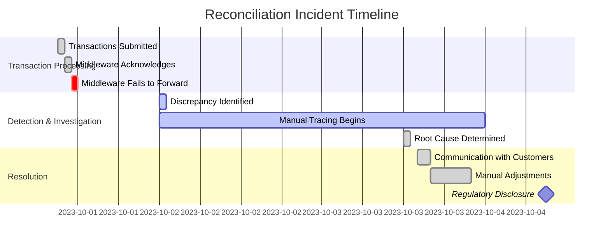

This incident revealed a critical visibility gap in their architecture. While they effectively monitored the operational status of individual systems, they lacked a systematic way to trace data consistency across system boundaries or detect when the same logical transaction was represented inconsistently across different platforms. The ability to visualize and trace the full "money trail" in real time could have significantly reduced the time required to identify the root cause and mitigate operational and regulatory impacts.

### SRE Best Practice: Evidence-Based Investigation

Data consistency tracing requires a specialized approach that follows the transformation of financial information across system boundaries rather than just the flow of technical requests. This evidence-based methodology focuses on value consistency rather than just operation completion. To make this process actionable, the following checklist provides a structured approach for SREs conducting evidence-based investigations:

#### Checklist for Evidence-Based Investigation

1. **Transaction Fingerprinting**

   - Identify unique attributes to create a consistent identity (fingerprint) for each transaction.
   - Combine critical financial attributes like amounts, accounts, and timestamps with unique reference identifiers.
   - Ensure fingerprints remain traceable despite format transformations across systems.

2. **Define Consistency Checkpoints**

   - Establish key checkpoints for critical stages in the transaction lifecycle.
   - Determine where the logical transaction should appear consistently across systems.
   - Capture the complete state of the transaction at each checkpoint to enable detailed comparisons.

3. **Perform Consistency Verification**

   - Use algorithms to compare transaction fingerprints at defined checkpoints.
   - Verify consistency of transaction attributes (e.g., amounts, statuses, timestamps) across systems.
   - Distinguish between acceptable transformation differences (e.g., format changes, precision variations) and true data integrity issues.

4. **Set Up Continuous Monitoring**

   - Enable real-time data consistency monitoring across all critical systems.
   - Implement automated alerts for inconsistencies to allow immediate intervention.
   - Prioritize proactive monitoring over reactive, end-of-cycle reconciliation processes.

5. **Trace and Analyze Discrepancies**

   - Investigate flagged inconsistencies to determine root causes (e.g., system delays, data corruption, integration errors).
   - Track the "money trail" to identify the exact point where the discrepancy occurred.
   - Validate resolution by ensuring downstream systems reflect corrected data.

#### Example Workflow Representation

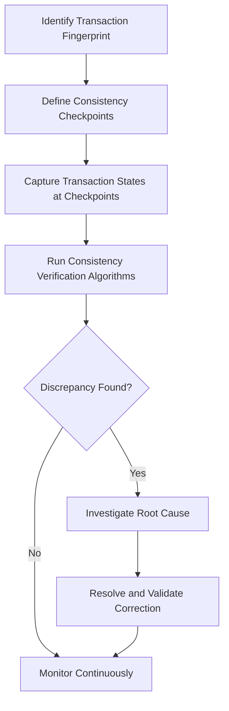

By following this checklist, SREs can ensure a systematic and actionable approach to investigating and resolving data consistency issues. This process not only enhances the integrity of financial data but also builds trust in the systems managing it.

### Banking Impact

The business consequences of data inconsistency extend far beyond technical concerns, striking at the heart of financial institution integrity. Regulatory impact is typically severe when material reconciliation issues are discovered, often triggering formal examinations, potential penalties, and enhanced monitoring requirements. Multiple financial institutions have received formal regulatory actions specifically citing inadequate transaction consistency controls as a safety and soundness issue.

Financial losses from reconciliation errors compound rapidly—undetected consistency issues create complex unwinding scenarios that often cannot recover the full economic value of affected transactions, particularly when discrepancies cross organizational boundaries to other institutions or involve foreign exchange components.

Customer trust suffers catastrophic damage when consistency issues affect account balances or transaction status, creating situations where customers see different information than bank representatives. Research shows that reconciliation-related complaints have among the lowest resolution satisfaction scores and highest relationship attrition rates of any banking issue type.

Operational costs escalate dramatically when inconsistencies must be resolved manually—comprehensive reconciliation exercises typically cost $40-60 per affected transaction in direct personnel costs alone, with high-complexity inconsistencies involving multiple external parties often exceeding $200 per transaction in resolution expenses.

| **Impact Area** | **Description** | **Examples or Metrics** |
| --------------------- | --------------------------------------------------------------------------------------------- | ------------------------------------------------------------------------------------------------------------------ |
| **Regulatory** | Severe regulatory consequences, including penalties and enhanced monitoring requirements. | Formal actions citing inadequate controls; penalties in the millions; increased audits and oversight. |
| **Financial** | Significant economic losses due to unrecoverable discrepancies and unwinding of transactions. | Cross-institution discrepancies causing losses in FX trades; high-cost unwinding scenarios for failed settlements. |
| **Customer Trust** | Loss of trust when inconsistencies affect customer-facing data like balances or transactions. | Reconciliation issues leading to attrition rates >30%; low satisfaction on complaints involving discrepancies. |
| **Operational Costs** | Increased manual effort required to resolve inconsistencies across systems and organizations. | Resolution costs of $40-60 per transaction; high-complexity cases exceeding $200 per transaction. |

### Implementation Guidance

1. **Transaction Fingerprinting**: Implement transaction fingerprinting mechanisms to create consistent identifiers for financial transactions across system boundaries. Use cryptographic hashing of core financial attributes (e.g., transaction amount, currency, timestamp, and sender/receiver identifiers) combined with reference identifiers (e.g., transaction IDs or external correlators) to preserve traceability despite format transformations. Below is a pseudocode example for generating a transaction fingerprint:

   ```python
   import hashlib
   import json

   def generate_transaction_fingerprint(transaction):
       # Extract core financial attributes
       core_attributes = {
           "amount": transaction["amount"],
           "currency": transaction["currency"],
           "timestamp": transaction["timestamp"],
           "sender_id": transaction["sender_id"],
           "receiver_id": transaction["receiver_id"]
       }
       # Serialize attributes into a normalized JSON string
       normalized_data = json.dumps(core_attributes, sort_keys=True)
       # Generate a cryptographic hash
       fingerprint = hashlib.sha256(normalized_data.encode('utf-8')).hexdigest()
       return fingerprint

   # Example transaction
   transaction = {
       "amount": 1000,
       "currency": "USD",
       "timestamp": "2023-10-01T12:34:56Z",
       "sender_id": "user_123",
       "receiver_id": "merchant_456"
   }

   print("Transaction Fingerprint:", generate_transaction_fingerprint(transaction))
   ```

2. **Consistency Checkpoint Instrumentation**: Deploy consistency checkpoint instrumentation at critical points in financial transaction flows. At each checkpoint, capture the complete state of the transaction, including all attributes and a timestamp. For distributed systems, ensure that these checkpoints are logged in a centralized, immutable store for later analysis. Below is an example data structure for a checkpoint log:

   ```json
   {
       "checkpoint_id": "core_banking_system",
       "transaction_fingerprint": "abc123...",
       "timestamp": "2023-10-01T12:35:00Z",
       "transaction_state": {
           "amount": 1000,
           "currency": "USD",
           "status": "processed",
           "sender_id": "user_123",
           "receiver_id": "merchant_456"
       }
   }
   ```

3. **Real-Time Consistency Verification**: Implement real-time processes that continuously compare transaction representations across systems. Create a verification mechanism that matches fingerprints and attributes, alerting for discrepancies that exceed allowed variations or timing thresholds. For example:

   ```python
   def verify_consistency(checkpoint_1, checkpoint_2):
       if checkpoint_1["transaction_fingerprint"] != checkpoint_2["transaction_fingerprint"]:
           print("Discrepancy detected!")
           # Trigger alert or incident response
       else:
           print("Transaction is consistent.")

   # Example checkpoints
   checkpoint_core = {"transaction_fingerprint": "abc123..."}
   checkpoint_reporting = {"transaction_fingerprint": "xyz456..."}
   verify_consistency(checkpoint_core, checkpoint_reporting)
   ```

4. **Consistency Visualization**: Develop tools that provide a unified view of transaction states across systems. Use visualizations to display transaction flows and highlight consistency checkpoints. Below is an example using a simple ASCII flowchart to illustrate a transaction's journey:

   ```
   [Customer App] --> [Core Banking System] --> [Fraud Monitoring System]
           |                     |                        |
           v                     v                        v
   [Regulatory Database]    [Partner Bank]          [Reconciliation System]
   ```

   Each node represents a system, and color-coded indicators (e.g., green for consistent, red for discrepancies) can help identify where inconsistencies occur.

5. **Consistency-Focused Incident Response Protocols**: Establish robust protocols to handle detected inconsistencies. When an issue is identified, immediately capture a comprehensive snapshot of all affected systems' states. This ensures forensic evidence is preserved before further data changes occur. For example:

   ```json
   {
       "incident_id": "incident_789",
       "detected_at": "2023-10-01T12:36:00Z",
       "affected_systems": [
           "core_banking_system",
           "regulatory_reporting_db"
       ],
       "transaction_fingerprint": "abc123...",
       "discrepancy_details": {
           "expected_state": {
               "amount": 1000,
               "currency": "USD",
               "status": "processed"
           },
           "actual_state": {
               "amount": 1000,
               "currency": "USD",
               "status": "missing"
           }
       }
   }
   ```

   Ensure these protocols include automated logging and escalation workflows to prioritize resolution based on regulatory or business-critical impact.

## Panel 6: Customer Journey Correlation - Linking Technical Traces to User Experience

### Scene Description

A customer experience workshop where product managers and SRE engineers are collaborating around a unique visualization that correlates technical traces with actual customer journey metrics. The screen displays a multi-layered visualization:

- **Customer Journey Layer**: Represents the customer's attempt to apply for a mortgage loan through various touchpoints—starting on the bank's website, continuing on the mobile app, and ending with a call center interaction. Key user actions like "started application," "uploaded documents," and "submitted application" are clearly marked along the timeline.

- **Technical Trace Layer**: Below the customer journey, corresponding backend system interactions are visualized, illustrating how services like authentication, document storage, and payment processing supported each customer action. Each technical trace includes timing data, error occurrences, and latency metrics.

- **Correlation Markers**: Lines connect user actions from the customer journey layer to the corresponding technical operations in the trace layer, emphasizing dependencies. For example, the "submitted application" action is linked to database queries, API calls to underwriting systems, and a load balancer event.

- **Sentiment Indicators**: Alongside each customer action, sentiment markers (e.g., positive, neutral, or negative) show the customer's emotional state at that point in the journey, based on system performance and feedback data.

Below is a text-based representation of the visualization:

```
Customer Journey:   Website -> Mobile App -> Call Center
User Actions:       [Start App] -> [Upload Docs] -> [Submit App]
Sentiment:          [Positive] -> [Neutral] -> [Negative]

Technical Trace:    Auth Service -> Doc Storage -> Database -> Underwriting API
Timing (ms):        120ms       -> 350ms       -> 890ms    -> 620ms
Errors:             None        -> None        -> Timeout  -> None

Correlation:        |-----------|--------------|-------------|
                    |           |              |             |
```

This visualization enables workshop participants to see how backend performance impacts each step of the customer journey, while the sentiment indicators provide a clear link between technical metrics and the customer's emotional experience. By combining these layers, the team can identify bottlenecks, prioritize technical improvements, and align strategies for enhancing customer satisfaction.

### Teaching Narrative

Customer journey correlation transforms distributed tracing from a technical troubleshooting tool to a strategic capability bridging technology and business perspectives. While traditional tracing visualizes system-to-system interactions, banking organizations increasingly need to understand how these technical operations impact actual customer experiences across channels and touchpoints. Advanced banking tracing implementations now incorporate specialized correlation capabilities that link technical traces with customer journey analytics—connecting backend system performance with front-end customer behavior and sentiment. This correlation capability enables organizations to answer critical questions: Did slow database queries directly cause customers to abandon loan applications? Did payment processing delays correlate with negative sentiment in call center interactions? Which technical services have the strongest impact on customer satisfaction scores? For banking leaders focused on digital transformation, this capability transforms technology discussions from abstract performance metrics to concrete customer impact analyses. By visually linking the customer journey layer with the technical service layer, organizations develop a shared understanding of how technology investments directly affect customer experiences—ultimately enabling more effective prioritization of engineering resources toward the technical improvements that truly matter to customers.

### Common Example of the Problem

A leading retail bank invested over $30 million in a mortgage application platform redesign intended to streamline the lending process and improve conversion rates. Despite the substantial investment and successful technical implementation, post-launch metrics showed disappointing results: the application completion rate increased only marginally from 27% to 29%, well below the projected 40% target, while customer satisfaction scores remained essentially unchanged.

Without customer journey correlation, the bank had no systematic way to understand why the technical improvements weren't translating to business outcomes. Technical monitoring showed the new platform was performing well—services responded quickly, databases operated efficiently, and all technical SLOs were consistently met. Separately, customer analytics showed users abandoning applications at various points, but provided no insight into what technical factors might be contributing to these decisions.

The digital banking and technology teams operated from fundamentally different perspectives: engineers saw a well-performing technical platform, while product managers saw underwhelming customer results. The disconnect created organizational tension, with business teams questioning the value of the technology investment while engineering teams defended their successful technical implementation.

The following timeline illustrates the sequence of events and highlights key insights:

| **Event** | **Details** | **Outcome** |
| -------------------------------- | ----------------------------------------------------------------------------------------- | --------------------------------------------------------------------------------------------- |
| **Platform Redesign Investment** | $30M invested to improve mortgage application process and achieve 40% conversion target. | Technical implementation completed successfully; performance metrics met. |
| **Post-Launch Metrics** | Application completion rate increased marginally from 27% to 29%; no improvement in CSAT. | Business outcomes fell short of expectations; customer frustration persisted. |
| **Initial Analysis** | Engineers observed strong system performance; product managers saw low conversion rates. | Organizational misalignment and tension between technical and business teams. |
| **Customer Journey Correlation** | Correlation implemented to link technical traces with customer journey analytics. | Uncovered latency spikes during key interactions and confusing error messages as root causes. |
| **Key Resolutions** | Optimized document upload performance and refined error messaging. | Improved user experience, reduced abandonment, and aligned teams on customer impact. |

This timeline underscores how customer journey correlation helped bridge the gap between technical performance and customer outcomes. By identifying issues such as latency spikes during high-impact interactions (e.g., document uploads, credit checks) and confusing error messages, the bank could address root causes that were previously invisible to both engineering and product teams. As a result, organizational alignment improved, and the teams could prioritize technical fixes with a direct impact on customer satisfaction and business results.

### SRE Best Practice: Evidence-Based Investigation

Effective customer journey correlation requires a sophisticated approach that bridges technical observability and customer experience analytics. This evidence-based methodology focuses on connecting system behavior directly to customer actions and outcomes.

The investigation begins with "touchpoint instrumentation" that captures detailed interaction data at all customer interfaces—websites, mobile apps, call centers, and branch systems. This instrumentation should record not just technical performance but also business-meaningful events like form submissions, page transitions, error encounters, and explicit user actions that indicate engagement or frustration.

These customer touchpoints must be explicitly connected to their supporting technical operations through correlation identifiers that maintain context across the presentation-to-backend boundary. This often requires specialized instrumentation that propagates identifiers from user interfaces through application tiers to backend services, creating unbroken chains from customer actions to technical processes.

Analysis should then apply temporal correlation techniques that identify relationships between technical performance patterns and customer behavior changes—recognizing when system latency, error rates, or other technical factors correlate with changes in abandonment, satisfaction scores, support contacts, or other experience indicators.

Most importantly, this correlation should maintain a bidirectional relationship, allowing investigation from either perspective—starting with customer experience anomalies and drilling down into the supporting technical operations, or beginning with technical performance issues and assessing their customer impact—creating a shared analytical foundation for both business and technology teams.

#### Checklist: Steps for Evidence-Based Investigation

1. **Instrument Touchpoints:**

   - Identify all customer interaction points (e.g., websites, mobile apps, call centers).
   - Implement monitoring to capture both technical data (e.g., latency, errors) and business events (e.g., submissions, transitions, frustrations).

2. **Establish Correlation Identifiers:**

   - Integrate unique identifiers into user-facing systems to track customer actions through backend operations.
   - Ensure identifiers propagate seamlessly across application tiers and infrastructure.

3. **Collect and Aggregate Data:**

   - Centralize technical and customer interaction data in an observability platform.
   - Maintain alignment between system logs, traces, and customer journey metrics.

4. **Apply Temporal Correlation:**

   - Analyze time-based relationships between system performance (e.g., latency, error spikes) and customer behavior (e.g., drop-offs, complaints, sentiment changes).

5. **Perform Bidirectional Analysis:**

   - Investigate customer anomalies (e.g., abandonment, dissatisfaction) to trace root causes in technical systems.
   - Examine technical issues (e.g., service failures) to understand their impact on customer experience metrics.

6. **Collaborate Across Teams:**

   - Share insights with both technical and business stakeholders using clear visualizations.
   - Align on priorities to address the most impactful technical issues for the customer journey.

7. **Iterate and Validate:**

   - Continuously refine instrumentation and analysis techniques based on new insights.
   - Validate that technical improvements result in measurable customer experience gains.

By following this checklist, SREs and product teams can systematically link technical traces to customer outcomes, enabling more effective and data-driven decision-making.

### Banking Impact

The business consequences of disconnection between technical operations and customer experience extend throughout the banking value chain. Conversion optimization suffers significant inefficiency when organizations cannot connect technical performance directly to customer abandonment patterns. Research shows that targeted technical improvements based on customer journey correlation typically deliver 3-5 times greater conversion impact compared to generic performance optimization because they focus specifically on the technical issues most directly affecting customer decisions.

Investment prioritization becomes effectively arbitrary without this connection, leading to significant resource misallocation. Multiple financial institutions report that journey-correlated analysis revealed their highest-impact customer friction points were not being addressed by their technical roadmaps, which instead focused on engineer-identified priorities with limited customer impact.

Customer satisfaction measurement lacks actionability when disconnected from its technical drivers. Studies show that banks typically require 2-3 times more customer feedback volume to identify experience issues without journey correlation compared to organizations that can directly connect reported problems to their technical causes.

Perhaps most significantly, organizational alignment suffers severe degradation when business and technology teams lack a shared understanding of how technical performance affects customer outcomes, creating accountability gaps where neither group takes ownership of the complete experience delivery.

#### Supporting Statistics Table

| Metric | Without Journey Correlation | With Journey Correlation |
| ------------------------------------------- | --------------------------- | ----------------------------------------------- |
| Conversion Impact | Standard optimization: ~1x | Targeted optimization: 3-5x greater impact |
| Feedback Volume Required to Identify Issues | 2-3x higher volume | Reduced volume due to direct issue correlation |
| Resource Allocation Efficiency | Arbitrary and misaligned | Focused on high-impact customer friction points |
| Organizational Alignment | Fragmented accountability | Shared understanding across teams |

### Implementation Guidance

1. Implement comprehensive customer touchpoint instrumentation across all digital channels, capturing detailed interaction events including page views, form interactions, error encounters, help requests, and abandonment signals with precise timing information.

2. Deploy journey-to-technical correlation identifiers that maintain consistent context from customer interactions to the underlying technical services supporting them, ensuring user sessions can be directly linked to their specific backend trace data.

3. Create unified journey-technical visualization capabilities that simultaneously display customer interaction flows alongside their supporting technical operations, highlighting relationships between system performance and customer behavior with clear visual connections.

4. Develop experience-focused alerting that triggers based on customer impact rather than just technical metrics, identifying situations where technical issues are affecting completion rates, satisfaction scores, or other business outcomes regardless of whether they breach traditional SLOs.

5. Establish cross-functional analysis processes that bring together customer experience and technology teams around correlated journey-technical data, creating shared understanding of how specific technical factors influence customer behavior and enabling collaborative prioritization based on quantified customer impact rather than separate business and technical priorities.

## Panel 7: Batch Processing and Scheduled Operations - Tracing Beyond Request-Response

### Scene Description

A banking operations center late at night during end-of-day processing. The room is dimly lit, with the glow of monitors illuminating the faces of on-duty engineers. The central monitoring wall displays specialized trace visualizations tailored for batch operations rather than interactive transactions. These visualizations depict the progress of several critical batch processes—reconciliation jobs, interest calculations, regulatory report generation, and scheduled payments.

Below is a simplified text-based representation of the monitoring wall to illustrate the scene:

```
+---------------------------------------------------------------+
|                   Batch Processing Monitoring Wall            |
|---------------------------------------------------------------|
| Job Name                | Phase        | Status     | Progress |
|-------------------------|--------------|------------|----------|
| Reconciliation Job      | Aggregation  | Running    | 65%      |
| Interest Calculation    | Validation   | Delayed    | 45%      |
| Regulatory Reporting    | Compilation  | Scheduled  | 0%       |
| Scheduled Payments      | Processing   | Completed  | 100%     |
+---------------------------------------------------------------+
```

The visualization also includes dependency graphs and phase indicators. For example:

```
Interest Calculation Dependencies:
   [Load Transactions] --> [Aggregate Balances] --> [Validate Interest Rules]
                                   |--> [Regulatory Reporting Compilation]
```

These tools highlight both individual job progress and interdependencies between batch jobs. The engineers are focused on a delayed loan interest calculation job that threatens to impact the regulatory reporting deadline. Their screens display detailed trace timelines for the delayed job, showing which stages have completed, where bottlenecks exist, and estimated completion times. This level of visibility ensures they can quickly identify and address the root cause of the delay.

### Teaching Narrative

Batch processing tracing extends distributed tracing beyond interactive transactions to encompass the critical scheduled operations that form the backbone of banking systems. While most tracing tools focus on request-response patterns triggered by user actions, financial institutions depend equally on complex batch operations—end-of-day processing, reconciliation jobs, interest calculations, statement generation, and regulatory reporting. These batch operations present unique tracing challenges: they're long-running (minutes to hours rather than milliseconds), they often run on different infrastructure than interactive services, they have complex inter-job dependencies, and they're evaluated on different metrics like completion deadlines rather than response time. Advanced banking tracing implementations extend the distributed tracing paradigm to these batch operations, providing visualization and monitoring capabilities specifically designed for non-interactive processing. This specialized capability transforms batch operations management from opaque progress bars to transparent, traceable processes with the same visibility previously reserved for interactive services. For financial institutions where failed or delayed batch jobs can directly impact regulatory compliance, financial accuracy, and next-day customer service, this extended tracing capability becomes essential for maintaining operational excellence across both interactive and scheduled workloads.

### Common Example of the Problem

A leading corporate bank recently experienced a severe operational incident when their end-of-day processing failed to complete before market opening, leaving multinational clients unable to access accurate balance information or initiate high-value payments for nearly three hours. The business impact was immediate and severe: clients could not execute treasury operations, international settlements were delayed, and several clients missed time-sensitive financial obligations due to the processing failure.

Without batch operation tracing, the operations team had extremely limited visibility into the actual problem. Traditional monitoring showed only that the end-of-day process was still running well beyond its expected completion time, without any breakdown of which specific jobs were delayed, where dependencies were blocked, or what was causing the extended processing time. Engineers were effectively troubleshooting a black box, reviewing thousands of log entries across dozens of systems trying to piece together the actual execution flow.

After nearly four hours of investigation, they finally identified the root cause: an unusually large volume of international transactions had triggered extended processing in the foreign exchange reconciliation job, which then delayed the dependent interest calculation process, ultimately preventing the final general ledger closing required before next-day operations could begin. The core issue was a subtle data condition affecting a specific transaction type, but the lack of process-level visibility turned a manageable anomaly into a major operational incident.

The following sequence diagram illustrates the cascading delays and dependencies that contributed to the incident:

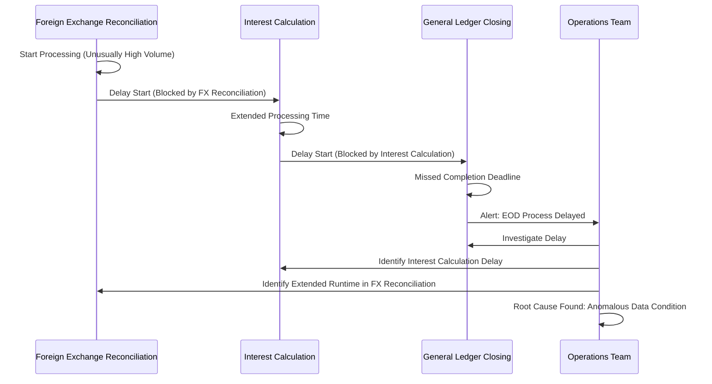

Post-incident analysis revealed that with proper batch tracing, the anomalous processing pattern would have been immediately visible—showing exactly which job was experiencing extended runtime, what specific operations were taking longer than normal, and how this delay was affecting dependent processes. Such visibility could have enabled intervention hours before customer impact occurred, preventing the cascading delays and reducing the severity of the incident.

### SRE Best Practice: Evidence-Based Investigation

Batch operation tracing requires specialized approaches that address the unique characteristics of scheduled processing rather than simply applying interactive tracing techniques to batch jobs. This evidence-based methodology focuses on process flows, dependencies, and deadline-based evaluation rather than response-time optimization.

#### Key Steps for Evidence-Based Investigation

To ensure effective investigation and management of batch processing issues, follow these structured steps:

| Step | Description | Outcome |
| ----------------------------------- | ----------------------------------------------------------------------------------------------------------------------------------- | --------------------------------------------------------------------------------------------- |
| **1. Batch Process Decomposition** | Break down monolithic batch jobs into identifiable subcomponents, including distinct phases, data transformations, and checkpoints. | Improved granularity in tracing, enabling per-phase visibility into progress and performance. |
| **2. Dependency Mapping** | Identify and document inter-job dependencies, including required inputs/outputs and downstream impacts of delays. | Clear understanding of how delays propagate and affect overall batch timelines. |
| **3. Timeline-Based Visualization** | Use trace visualizations tailored for long-running operations to monitor progress versus expected completion patterns. | Early identification of deviations from normal execution and potential completion risks. |
| **4. Business Impact Correlation** | Link technical metrics (e.g., delays) to business outcomes like customer availability, compliance deadlines, or financial accuracy. | Contextual awareness of how technical issues translate into business risks. |
| **5. Root Cause Analysis** | Investigate anomalies by combining trace data with logs and metrics from associated systems. | Evidence-based understanding of the root cause, enabling targeted remediation. |

#### Example Workflow for Investigating Delays in a Batch Job

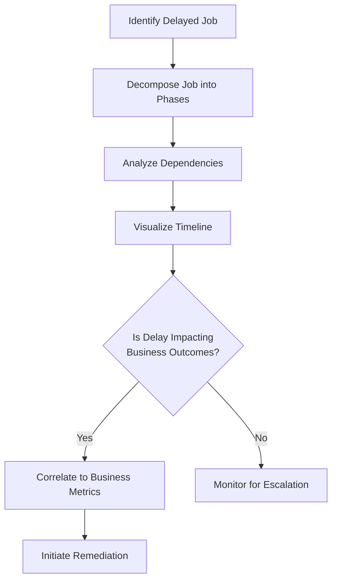

By following this structured approach, SREs can transform batch operations monitoring from reactive troubleshooting into proactive, evidence-based management. This enables teams to maintain operational excellence and mitigate risks to both technical and business outcomes.

### Banking Impact

The business consequences of inadequate batch operation visibility extend across multiple dimensions of banking operations. Delays or failures in batch processes can lead to significant financial, customer, regulatory, and operational repercussions. The table below summarizes key impacts and associated statistics to highlight the critical importance of robust monitoring and tracing for batch operations.

| **Impact Area** | **Examples** | **Key Statistics** |
| ---------------------- | ------------------------------------------------------------------------------------------------ | ----------------------------------------------------------------------------------------------------------------- |
| **Financial Impact** | - Delayed rate-sensitive transactions<br>- Penalties from missed settlement windows | - 7-figure losses reported by institutions from single batch delays |
| **Customer Impact** | - Missed account balance reporting for corporate clients<br>- Delayed transactions for end users | - A regional bank lost $1.2M in annual revenue from two corporate clients due to repeated batch processing delays |
| **Regulatory Impact** | - Missed reporting deadlines<br>- Control weaknesses cited in audits | - Multiple findings issued by regulators for inadequate batch operation monitoring |
| **Operational Impact** | - Emergency staffing and escalations<br>- Customer compensation costs | - Average overnight batch failure incident costs exceed $25,000 in direct expenses |

Batch operation failures or delays not only jeopardize financial accuracy and compliance but also erode customer trust and strain operational resources. For example, a regional bank reported losing two major corporate clients due to repeated end-of-day processing delays that disrupted their financial operations. Similarly, institutions have faced regulatory findings for control weaknesses directly linked to insufficient batch monitoring, with reporting deadlines missed due to late detection of issues.

By addressing these critical impacts through advanced tracing and monitoring solutions, financial institutions can ensure operational excellence, safeguard compliance, and maintain strong customer relationships.

### Implementation Guidance

1. **Instrument Batch Processes with Span-Based Visibility**\
   Break monolithic batch operations into traceable components by instrumenting each distinct phase of the process. For example, use distributed tracing libraries to create spans for data extraction, transformation, and loading (ETL) phases within a reconciliation job. Below is a sample code snippet for instrumenting a batch job using OpenTelemetry:

   ```python
   from opentelemetry import trace
   tracer = trace.get_tracer("batch-job-tracer")

   def perform_etl():
       with tracer.start_as_current_span("ETL Phase - Extraction"):
           extract_data()
       with tracer.start_as_current_span("ETL Phase - Transformation"):
           transform_data()
       with tracer.start_as_current_span("ETL Phase - Loading"):
           load_data()

   perform_etl()
   ```

   This approach ensures that each processing phase is independently traceable, enabling granular visibility into the progress and performance of the entire batch operation.

2. **Implement Dependency Tracking for Batch Jobs**\
   Deploy a directed graph model to explicitly map dependencies between batch jobs. For instance, define relationships between scheduled jobs such as "Job A must complete before Job B begins." Here’s an example configuration using a YAML-based dependency model:

   ```yaml
   jobs:
     - name: job_A
       depends_on: []
     - name: job_B
       depends_on: 
         - job_A
     - name: job_C
       depends_on: 
         - job_A
         - job_B
   ```

   This configuration can be used by orchestration tools to visualize dependencies and monitor how delays in upstream jobs propagate through the system.

3. **Build Batch-Specific Visualization Dashboards**\
   Create timeline-based visualizations for long-running jobs, showing execution progress against expected timelines. Use tools like Grafana or custom visualizations for this purpose. Below is a conceptual representation of a batch job timeline in plain text:

   ```
   Reconciliation Job Progress:
   [##############------] 65% Complete (Expected: 80% at this time)
   Deadline Risk: High
   ```

   Visual indicators like completion bars and deadline risk alerts enable engineers to quickly identify and mitigate potential delays.

4. **Enable Batch Anomaly Detection**\
   Develop anomaly detection for batch processes based on historical runtime patterns. For example, configure thresholds for job duration using machine learning models or static rules. Here’s a sample rule configuration for detecting anomalies in processing time:

   ```yaml
   anomaly_detection:
     job_name: reconciliation_job
     expected_runtime: 600  # seconds
     alert_threshold: 20%   # Alert if runtime exceeds 120% of expected_runtime
   ```

   This helps surface potential issues early, even before deadlines are breached or downstream jobs are impacted.

5. **Create Trace-Aware Playbooks for Batch Operations**\
   Write operational playbooks that leverage trace data to guide intervention strategies. For instance, define actions for common scenarios like partial job completion or dependency overrides. Example content from a playbook:

   ```
   Scenario: Job Delay Detected in Loan Interest Calculation
   - Check trace data for the root cause of delay (e.g., upstream dependency, resource contention).
   - If delay is due to resource contention:
       - Allocate additional compute resources via the orchestration platform.
   - If delay impacts downstream reporting deadlines:
       - Consider running alternative reporting paths with partial loan data.
   - Document actions taken and notify stakeholders.
   ```

   These playbooks ensure consistent and trace-informed responses to operational challenges, minimizing the risk of cascading failures across the batch processing ecosystem.
