# Chapter 6: Implementing Tracing in Banking Systems

## Chapter Overview

Welcome to the seven-layer cake of tracing hell—served up fresh in banking’s regulatory kitchen. If you think distributed tracing is tricky in your SaaS startup, try piecing together customer journeys that start on a mobile app, zigzag through a 30-year-old mainframe, and end with a call center agent who still thinks “cloud” means rain. This chapter is your blunt-force guide to making tracing actually work in the banking world—where half your systems are allergic to change, privacy rules make your lawyers sweat, and every failed implementation costs more than your annual headcount. Forget tracing as a “nice-to-have”—here, it’s the difference between regulatory fines, customer exodus, and operational chaos, or actually finding out why your mortgage pipeline looks like a Kafka novel. Prepare to rethink everything you know about instrumentation, context propagation, privacy, and organizational politics. This isn’t tracing for the faint-hearted. This is tracing with teeth.

______________________________________________________________________

______________________________________________________________________

## Learning Objectives

- **Identify** the highest-value customer journeys in sprawling banking technology stacks and **prioritize** tracing accordingly.
- **Map** end-to-end service dependencies—across generations of tech and team boundaries—using evidence, not hope.
- **Apply** hybrid instrumentation techniques to bridge the gap between shiny microservices and crusty mainframes, keeping traces unbroken (and careers intact).
- **Implement** privacy-preserving instrumentation so compliance doesn’t show up with pitchforks—and so trace data can actually be shared, legally.
- **Engineer** robust cross-channel context propagation so customer journeys don’t fall apart the second someone swaps from web to phone.
- **Design** incremental, value-driven rollout strategies that avoid the classic “million dollars burned, nothing to show” pitfall.
- **Extend** standard tracing with banking-specific telemetry, so you get business value, not just pretty graphs for the next outage review.
- **Govern** tracing and integrate it into the broader observability ecosystem, saving yourself from a future of spreadsheet-driven incident response.

______________________________________________________________________

______________________________________________________________________

## Key Takeaways

- Start tracing where it matters: Instrument the business-critical flows first or prepare for a parade of half-baked, useless traces.
- Instrumentation by org chart? That’s how you end up with a dashboard of partial traces and a room full of angry executives.
- Hybrid environments mean hybrid approaches. There’s no “one SDK to rule them all” when your stack spans COBOL, Kafka, and Kubernetes.
- If you don’t build privacy into your trace data at the source, you’re one support ticket away from a GDPR-sized hole in your budget—and your reputation.
- Context lost between channels is context lost forever. If your customer’s mortgage journey dies every time they pick up the phone, your NPS will too.
- Rolling out tracing across a bank is a marathon of political trench warfare. Go incremental, show value early, or become the next cautionary tale.
- Standard tracing without business context is just technical navel-gazing. If your traces can’t tell you which high-value customers are impacted, you’re doing it wrong.
- Siloed tracing and observability governance guarantees operational misery and regulatory pain. Unify, standardize, and integrate—or pay twice for half the insight.
- Evidence beats optimism. Every step—prioritization, implementation, validation—should be driven by data, not faith in best practices.
- Tracing in banking isn’t about chasing cool tech trends—it’s about survival, compliance, and keeping your job when the next outage hits. Treat it accordingly.

______________________________________________________________________

## Panel 1: Instrumentation Strategy - Where to Begin in Complex Banking Environments

### Scene Description

A whiteboard planning session in a bank's technology center. A diverse team of engineers—representing different banking domains—gather around a system architecture diagram covering an entire wall. The diagram shows the bank's complex technology landscape: mobile apps, web portals, APIs, middleware, payment processing services, core banking systems, and mainframes. An SRE lead is using colored markers to highlight different services, creating a heat map of customer impact.

Below is a simplified text diagram representing the heat map and critical customer journeys:

```
[Customer-Facing Channels] --> [Middleware/APIs] --> [Core Banking Systems]
       (High Impact)                (Medium Impact)         (Critical Impact)
          [Mobile Apps]                [Payment Gateways]        [Mainframes]
          [Web Portals]                [Service APIs]            [Data Stores]

Red arrows = Critical customer journeys (e.g., Payment Processing)
Blue arrows = Secondary flows (e.g., Account Balance Queries)

Flow Example:
1. Customer initiates a payment via Mobile App.
2. Request flows through Middleware/APIs.
3. Transaction processed by Core Banking Systems.
```

Critical customer journeys are traced in red, showing the highest-priority flows for initial instrumentation, while arrows on the diagram indicate the planned phased rollout of tracing capabilities across the organization. This collaborative session sets the foundation for a systematic, phased approach to implementing distributed tracing in the bank's complex ecosystem.

### Teaching Narrative

Implementing distributed tracing in banking environments requires a strategic approach that balances business value, technical feasibility, and organizational constraints. Unlike greenfield applications where comprehensive instrumentation can be implemented from the start, banks must develop phased strategies for their complex, heterogeneous landscapes. The most effective approach begins with "customer-backward" instrumentation—identifying the highest-impact customer journeys and instrumenting the full service path supporting those journeys first. This typically includes critical flows like payment processing, account opening, and trading operations. For each identified journey, instrumentation must span from customer-facing channels through mid-tier services to core banking systems, even if those systems span different technology generations and teams. This end-to-end approach ensures immediate business value by providing full visibility into the journeys that matter most, rather than creating partial traces of limited utility. The strategic sequence continues with secondary customer journeys, internal operations, and finally batch processes. This methodical implementation approach transforms tracing from an overwhelming technical challenge to a manageable progression that delivers incremental value at each stage, ensuring organizational momentum and sustained support for the observability initiative.

### Common Example of the Problem

A large retail bank attempted to implement distributed tracing as part of a digital transformation initiative but struggled with where to begin. Their environment consisted of over 200 microservices, 15 legacy applications, multiple third-party integrations, and mainframe core banking systems spanning four decades of technology evolution. The initial approach followed traditional monitoring deployment patterns—instrumenting services team by team based on organizational structure rather than transaction flows. After six months of effort, they had instrumented 40% of their microservices but couldn't produce a single complete end-to-end trace of any customer journey because critical path components remained uninstrumented. Despite significant investment, they generated partial traces with limited troubleshooting value, creating stakeholder skepticism about the entire initiative. Business leaders questioned the value of continued investment when they couldn't see how the partial implementation improved customer experience or incident response capabilities.

#### Key Lessons Learned: Checklist of Common Mistakes

- **Lack of End-to-End Focus**: Instrumentation was performed based on team ownership rather than mapping critical customer journeys, leading to incomplete traces.
- **Siloed Implementation**: Teams worked independently without coordination, resulting in gaps along transaction paths that spanned multiple services or systems.
- **Neglecting Critical Path Components**: Legacy systems and third-party integrations on high-priority flows were deprioritized, breaking the continuity of customer journey traces.
- **Unclear Business Value**: Partial traces failed to deliver actionable insights, eroding stakeholder confidence in the initiative.
- **Overlooking Phased Rollout Strategy**: The absence of a strategic sequence meant resources were spread too thin, without achieving meaningful wins in early stages.
- **Failure to Communicate Progress**: Business leaders were not shown incremental improvements tied to customer experience or operational outcomes, reducing support for the initiative.

By avoiding these common pitfalls, banks can ensure their distributed tracing efforts are aligned with both technical feasibility and business impact, fostering trust and momentum throughout the organization.

### SRE Best Practice: Evidence-Based Investigation

Site Reliability Engineers take a data-driven approach to instrumentation strategy by conducting comprehensive transaction flow analysis before beginning implementation. This starts with mapping critical customer journeys through empirical evidence rather than assumed architectural documentation. SREs work with product teams to identify the highest business-impact transactions, then use a combination of existing logs, network traffic analysis, and temporary diagnostic instrumentation to trace the actual service dependencies supporting these journeys. This investigation creates an empirical "critical path map" showing exactly which services and components must be instrumented to generate complete traces for high-value customer flows.

The investigative approach continues with technical feasibility assessment for each component on these critical paths, categorizing them by instrumentation complexity. The table below summarizes this categorization:

| **Category** | **Description** | **Instrumentation Approach** |
| -------------------- | ------------------------------------------------------------------------------- | --------------------------------------------------- |
| Modern Services | Microservices and APIs with support for standard auto-instrumentation libraries | Leverage auto-instrumentation tools and frameworks |
| Legacy Applications | Older systems requiring manual code changes or custom instrumentation | Implement manual instrumentation in codebases |
| Third-Party Services | External integrations needing adaptors for compatibility | Develop or configure integration adaptors |
| Mainframe Systems | Legacy mainframes needing specialized tools and expertise | Use mainframe-specific tracing tools and techniques |

This evidence-based categorization enables precise implementation planning based on actual component characteristics rather than assumptions.

Finally, SREs validate the prioritization approach through quantitative incident analysis—reviewing historical outages and performance issues to determine which transaction types account for the highest customer impact and operational cost. This evidence ensures instrumentation prioritization aligns with actual business risk and operational pain points rather than subjective assessments of importance.

### Banking Impact

The business consequences of ineffective instrumentation strategy in banking environments are substantial. Below is an overview of the financial, customer experience, and regulatory impacts, illustrated for clarity:

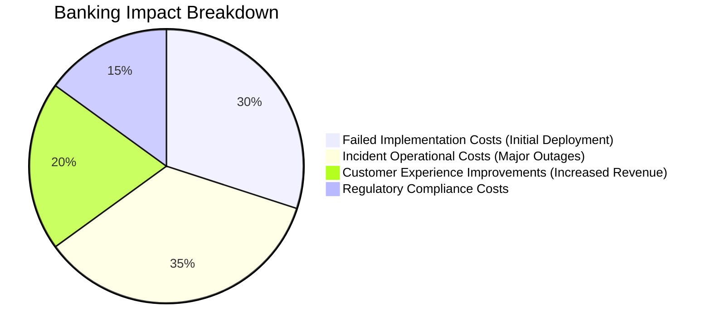

#### Financial Impact

Large banks typically invest $2-5 million in initial distributed tracing deployment. Failed implementations often require a complete restart at similar costs. Additionally, delayed observability benefits have severe operational consequences—banks without effective tracing report 30-50% longer mean time to resolution for complex incidents, with each major outage costing $300,000 to $1M per hour in direct financial losses.

#### Customer Experience Impact

The impact on customer experience is equally significant. Banks with effective distributed tracing implementations report 15-20% reductions in transaction abandonment rates due to improved reliability and performance. For high-value customer journeys, such as mortgage applications or account openings, each percentage point improvement in completion rates translates to $10-20 million in annual revenue for large financial institutions.

#### Regulatory Impact

Regulatory pressures also demand sophisticated observability capabilities. Banking regulators increasingly expect operational resilience measures, including effective transaction monitoring. Institutions unable to meet these expectations face higher compliance costs through frequent examinations, increased capital reserve requirements, and restrictions on launching new products until observability controls are improved.

This breakdown highlights the critical need for a well-planned, phased instrumentation strategy to mitigate financial risks, enhance customer satisfaction, and ensure regulatory compliance in complex banking environments.

### Implementation Guidance

To ensure a structured and actionable implementation of distributed tracing in complex banking environments, follow this step-by-step checklist:

1. **Conduct a Customer Journey Value Assessment**:

   - Collaborate with business and product stakeholders to identify the top 5-10 customer journeys by business value.
   - Evaluate metrics such as transaction volume, revenue impact, customer satisfaction influence, and regulatory sensitivity.
   - Assign a "visibility value score" to each journey by combining business importance with historical incident frequency.
   - Prioritize journeys with the highest scores for initial instrumentation.

2. **Map Complete Service Dependencies for Priority Journeys**:

   - Trace the end-to-end service path for each priority journey, from customer touchpoints to core processing systems and back.
   - Identify every involved component, regardless of its technology generation or team ownership.
   - Use tools like logging, network monitoring, and temporary diagnostics to verify real dependencies, avoiding sole reliance on outdated documentation.

3. **Assess Technical Feasibility and Create a Tiered Implementation Plan**:

   - Classify components in priority journeys based on their instrumentation approach:
     - **Modern Services**: Use standard auto-instrumentation.
     - **Legacy Applications**: Apply manual instrumentation.
     - **Middleware Systems**: Implement middleware-level tracing.
     - **Mainframes**: Leverage network-level tracing.
   - Develop a phased roadmap to deliver complete traces for at least one high-value journey in the first phase.
   - Include fallback options for components with limited instrumentation support.

4. **Establish Cross-Functional Instrumentation Teams**:

   - Form dedicated teams with representatives from every domain involved in priority journeys:
     - Front-end, API, middleware, database, and mainframe specialists.
   - Maintain a shared instrumentation backlog organized by journey components rather than technology silos.
   - Encourage coordination across traditional team boundaries to ensure holistic progress.

5. **Implement "Tracer Bullet" End-to-End Instrumentation**:

   - Start with a thin, functional implementation that enables complete end-to-end traceability for a single high-value journey.
   - Focus on instrumenting only the essential components required to generate initial traces, even if at reduced detail.
   - Present the first working trace to stakeholders for feedback, demonstrating progress and validating trace visualization tools.
   - Use early results to refine your strategy before expanding to additional journeys or increasing instrumentation depth.

6. **Establish Feedback Loops and Monitor Success Metrics**:

   - Regularly review trace data from instrumented journeys to identify gaps or anomalies.
   - Collect stakeholder feedback on trace utility and visualization to guide iterative improvements.
   - Define and track success metrics such as trace coverage, incident resolution time reduction, and customer satisfaction impact.
   - Use lessons learned from initial phases to refine and scale your implementation approach.

This checklist provides a clear, practical guide to implementing distributed tracing in a phased manner, ensuring incremental value delivery and sustained organizational alignment.

## Panel 2: Hybrid Instrumentation Techniques - Bridging Legacy and Modern Banking Systems

### Scene Description

A banking integration lab is depicted where engineers are collaboratively bridging tracing across diverse generations of technology. The lab is divided into distinct work zones:

1. **Code-Level Instrumentation Zone**:\
   An engineer is implementing code-level instrumentation within a modern Java microservice used for card processing. This zone focuses on leveraging distributed tracing libraries to automatically capture and propagate trace context across service boundaries.

2. **Middleware Configuration Zone**:\
   Another engineer is configuring middleware components to ensure trace context flows seamlessly between modern systems and legacy mainframe transactions. This involves adapting middleware to translate between modern distributed tracing standards and mainframe-specific correlation mechanisms.

3. **Network Capture Zone**:\
   A third engineer is setting up network appliances designed to passively capture mainframe CICS transaction data. These appliances infer trace context from network interactions, generating synthetic spans for operations that cannot be directly instrumented.

The lab features large visualization dashboards displaying unified traces that span end-to-end, from mobile apps through middleware to legacy systems. These dashboards highlight how adapters translate between proprietary formats and open standards, enabling seamless trace correlation.

Below is a visual representation of the lab setup:

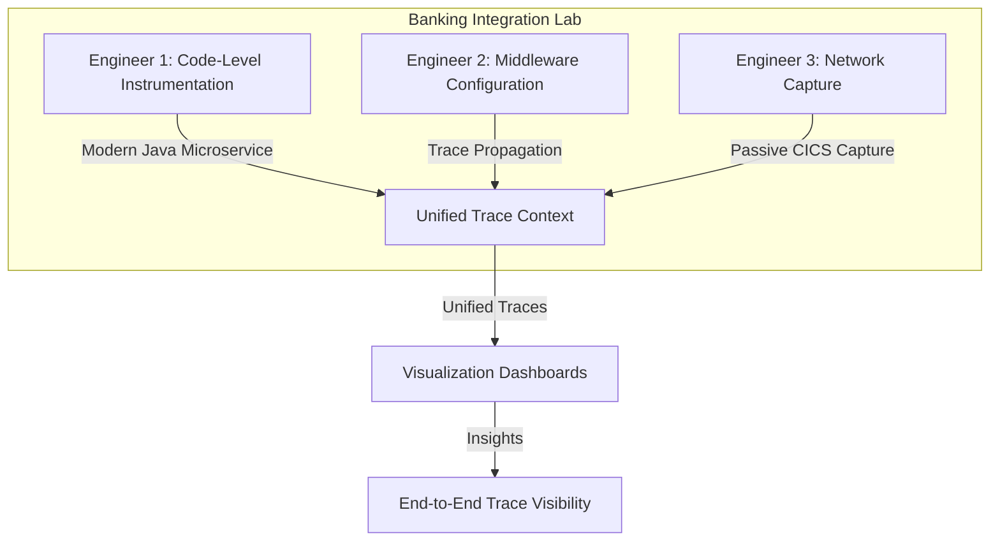

This hybrid setup demonstrates the collaborative effort required to achieve end-to-end observability in banking systems that span decades of computing evolution. Each work zone contributes a critical piece of the tracing puzzle, ensuring a cohesive view of transactions across all technological boundaries.

### Teaching Narrative

Hybrid instrumentation techniques are essential for banks where transactions routinely cross technological boundaries spanning decades of computing evolution. Unlike digital-native organizations with homogeneous technology stacks, financial institutions must implement a diverse instrumentation portfolio tailored to different system types. Modern microservices can leverage standard auto-instrumentation libraries, APIs can use middleware instrumentation, and legacy systems may require specialized approaches including network capture, log extraction, or middleware correlation. The key challenge is maintaining trace context and correlation identifiers across technological boundaries—ensuring that a transaction retains its identity as it transitions between different instrumentation approaches. This often requires developing custom "trace bridges" that translate between modern distributed tracing standards and legacy correlation mechanisms like transaction IDs or session identifiers. For mainframe systems that cannot be directly modified, banks must implement "tracing gateways" that infer trace context from observable interactions, creating synthetic spans that represent mainframe operations. This hybrid approach transforms tracing implementation from a standard procedure to a specialized banking capability—combining multiple techniques to achieve end-to-end visibility without requiring unrealistic modernization of core systems that may continue operating for decades to come.

### Common Example of the Problem

A global investment bank struggled with reliability issues in their trading platform, where transactions crossed six different technology generations: modern React front-ends, Java and .NET microservices, messaging middleware, proprietary C++ trading engines, and COBOL-based settlement systems running on mainframes. During volatile market conditions, traders reported that approximately 5% of high-value transactions appeared to complete in the front-end but failed to execute or settled incorrectly.

Initial investigation attempts were hampered by complete visibility loss as transactions crossed technology boundaries. Each team only had observability within their own domain—front-end developers could see application activity, middleware teams observed message flows, and mainframe specialists reviewed CICS logs, but no one could reconstruct the complete transaction journey across all systems. This resulted in lengthy blame-shifting exercises during incidents, with teams spending the first 60-90 minutes of each outage debating where the failure originated rather than collaborating on solutions. Mean time to resolution for cross-platform incidents averaged 4.2 hours, more than double the target, while customer impact continued and trading opportunities were lost.

The transaction flow and visibility gaps can be illustrated as follows:

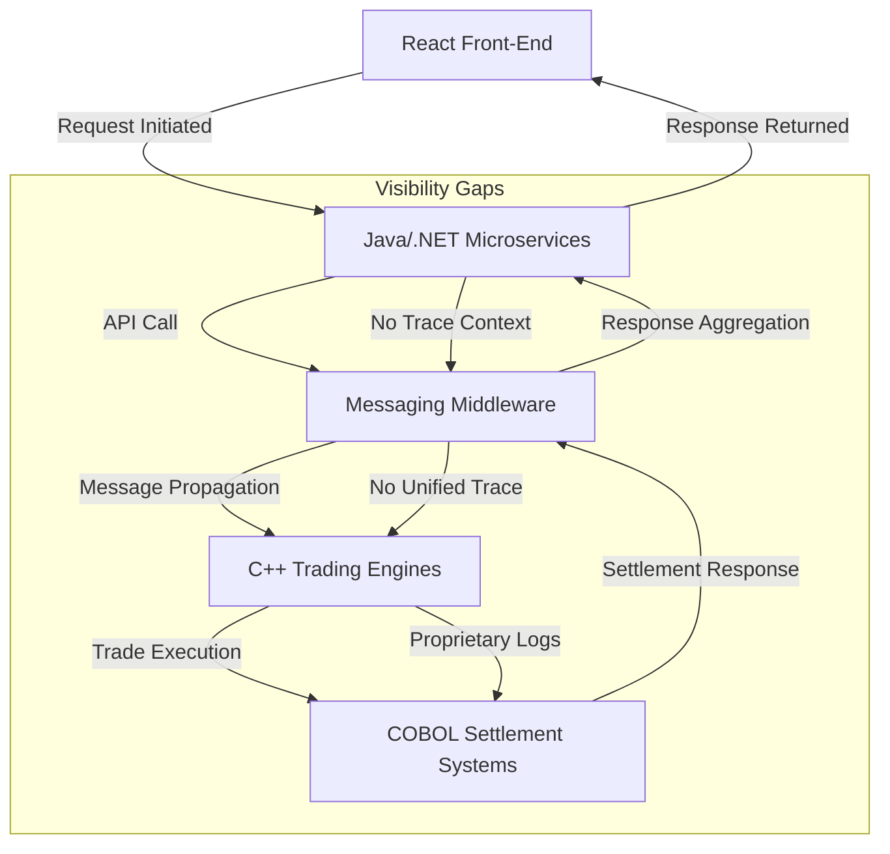

This diagram highlights the fragmented visibility across the six technology generations. Trace context was lost as transactions moved between systems, particularly at the middleware and mainframe layers, where standard distributed tracing was not in place. Without a unified tracing solution, teams could only troubleshoot within their silos, prolonging incident resolution and compounding the operational impact.

### SRE Best Practice: Evidence-Based Investigation

Site Reliability Engineers approach hybrid instrumentation through systematic boundary analysis and targeted technique selection. This evidence-based investigation ensures effective tracing across diverse technology domains while minimizing implementation risks and operational overhead.

#### Checklist for Evidence-Based Investigation

1. **Boundary Mapping**

   - Identify all transaction boundaries between technology domains.
   - Document existing correlation mechanisms at each boundary (e.g., HTTP headers, message properties, database fields, transaction IDs).
   - Verify whether correlation information is consistently propagated across boundaries.

2. **Data Flow Analysis**

   - Perform packet capture to analyze network-level interactions.
   - Investigate message structures in messaging systems for embedded correlation data.
   - Track session or transaction identifiers within mainframe environments.
   - Confirm the availability and structure of correlation information at key points.

3. **Instrumentation Technique Selection**

   - Evaluate potential instrumentation techniques for each domain:
     - Modern microservices: Auto-instrumentation libraries, language-specific SDKs.
     - Middleware: Header propagation, message enrichment.
     - Mainframes: Network capture, synthetic span creation, log extraction.
   - Conduct proof-of-concept implementations to validate:
     - Completeness of captured trace data.
     - Effort required for implementation.
     - Performance impact on the system.
     - Ongoing maintenance requirements.

4. **Address Visibility Gaps**

   - Identify boundaries where no viable instrumentation exists.
   - Implement synthetic transaction monitoring:
     - Design test transactions with known characteristics.
     - Correlate observed behaviors on either side of the boundary to infer trace continuity.

5. **Iterative Validation**

   - Continuously refine the instrumentation approach based on:
     - Real-world transaction behavior.
     - Visualization gaps in end-to-end trace data.
     - Feedback from operational monitoring and incident response.

#### Example Workflow: Boundary Analysis to Trace Continuity

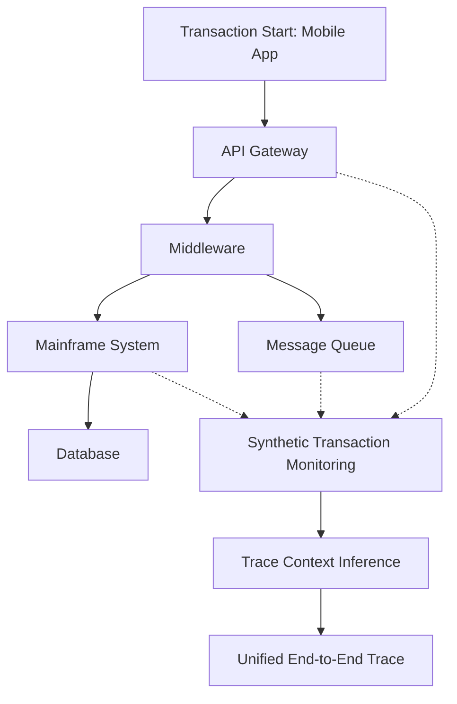

This structured approach ensures that hybrid instrumentation techniques are selected and deployed based on measurable evidence, facilitating reliable and actionable traceability across complex banking systems.

### Banking Impact

The business consequences of fragmented instrumentation in banking environments extend far beyond technical challenges. Financially, the operational impact is substantial—banks report that cross-platform incidents without unified tracing typically take 2-3 times longer to resolve than similar incidents with end-to-end visibility. For trading platforms where each minute of disruption may represent millions in lost transaction value, this extended resolution time directly impacts revenue.

Customer trust impacts are equally significant. Banks with fragmented observability report 25-30% lower customer satisfaction scores following incidents, primarily due to the inability to provide accurate status information or resolution timelines when issues cross platform boundaries. For wealth management and institutional clients, this information gap during incidents represents a primary factor in relationship termination decisions.

Regulatory consequences add further pressure—financial regulations increasingly require demonstrable transaction traceability for security, anti-money laundering, and market conduct compliance. Banks unable to reconstruct complete transaction journeys face elevated regulatory scrutiny, often resulting in trading limitations, mandatory reserves, or restrictions on new product offerings until traceability controls are improved.

The competitive disadvantage compounds these issues—banks with unified cross-platform tracing report 30-40% faster time-to-market for new products and features due to reduced integration testing requirements and more rapid incident resolution during deployment, creating significant differentiation in fast-moving financial markets.

#### Comparative Metrics: Banks With vs. Without Unified Tracing

| **Metric** | **Banks With Unified Tracing** | **Banks Without Unified Tracing** |
| --------------------------------- | ------------------------------- | --------------------------------- |
| **Incident Resolution Time** | 1-2 hours | 3-6 hours |
| **Customer Satisfaction Score** | 85-90% | 60-65% |
| **Regulatory Compliance Risk** | Low—Traceability demonstrable | High—Elevated scrutiny |
| **Time-to-Market for Features** | 20-30% faster | Slower due to extended testing |
| **Revenue Impact During Outages** | Minimized due to rapid recovery | Significant—millions per minute |

This table highlights the quantifiable advantages of unified tracing, illustrating how it not only reduces operational delays but also fosters customer trust, ensures regulatory compliance, and accelerates innovation. By bridging the gaps between legacy and modern systems, banks can achieve the visibility required to thrive in a competitive and regulated environment.

### Implementation Guidance

1. **Conduct Comprehensive Boundary Analysis**: Document every technology transition point in priority transaction flows, identifying existing correlation mechanisms and data formats at each boundary. Create a detailed "Correlation Opportunity Map" showing what identification information is available at each transition (HTTP headers, message properties, database fields, session IDs) that could be leveraged to maintain trace context across technology generations.

2. **Implement Tiered Instrumentation Strategy by Technology Type**: Deploy standard OpenTelemetry auto-instrumentation for modern services (Java, .NET, Node.js), custom SDK integration for proprietary applications, middleware plugins for messaging systems (Kafka, MQ, Tibco), and API gateway instrumentation for external services. For each technology type, select the least intrusive approach that maintains transaction context.

3. **Develop Custom Context Propagation Bridges**: Create specialized adapters at each technology boundary that translate between different correlation formats—for example, extracting OpenTelemetry trace context from HTTP headers and injecting it into MQ message properties when transactions move from web services to messaging systems, then translating to mainframe transaction IDs for legacy systems. Below is a sample code snippet for creating a context propagation bridge between an HTTP-based service and a messaging system using OpenTelemetry:

   ```java
   import io.opentelemetry.api.GlobalOpenTelemetry;
   import io.opentelemetry.api.trace.Span;
   import io.opentelemetry.api.trace.Tracer;
   import io.opentelemetry.context.Context;
   import io.opentelemetry.context.propagation.TextMapGetter;
   import io.opentelemetry.context.propagation.TextMapSetter;

   import java.util.Map;

   public class ContextPropagationBridge {

       private static final Tracer tracer = GlobalOpenTelemetry.getTracer("banking-integration-lab");

       // Extract trace context from HTTP headers
       public static Context extractContextFromHttp(Map<String, String> httpHeaders) {
           TextMapGetter<Map<String, String>> getter = new TextMapGetter<>() {
               @Override
               public Iterable<String> keys(Map<String, String> carrier) {
                   return carrier.keySet();
               }

               @Override
               public String get(Map<String, String> carrier, String key) {
                   return carrier.get(key);
               }
           };
           return GlobalOpenTelemetry.getPropagators().getTextMapPropagator().extract(Context.current(), httpHeaders, getter);
       }

       // Inject trace context into MQ message properties
       public static void injectContextIntoMq(Map<String, String> mqProperties, Context context) {
           TextMapSetter<Map<String, String>> setter = (carrier, key, value) -> carrier.put(key, value);
           GlobalOpenTelemetry.getPropagators().getTextMapPropagator().inject(context, mqProperties, setter);
       }

       // Example usage
       public static void processRequest(Map<String, String> httpHeaders, Map<String, String> mqProperties) {
           Context extractedContext = extractContextFromHttp(httpHeaders);
           Span span = tracer.spanBuilder("processRequest").setParent(extractedContext).startSpan();
           try (var scope = span.makeCurrent()) {
               injectContextIntoMq(mqProperties, Context.current());
           } finally {
               span.end();
           }
       }
   }
   ```

4. **Deploy Passive Instrumentation for Immutable Systems**: For mainframe and legacy systems that cannot be modified, implement network-level tracing using TCP/IP packet capture, database activity monitoring, or transaction gateway instrumentation that observes interactions without requiring code changes. Configure these passive systems to recognize transaction correlators and generate synthetic spans that represent mainframe processing. Below is an example of how passive instrumentation might infer trace spans from network activity:

   ```
   +-----------+       HTTP Request       +-------------------+
   | Mobile App| -----------------------> | Middleware Gateway|
   +-----------+                          +-------------------+
                                                ||
                                                ||
                                         Packet Capture
                                                ||
                                                VV
         +------------------+   Synthetic Span   +----------------+
         | Mainframe Gateway| -----------------> | Trace Collector|
         +------------------+                    +----------------+
   ```

5. **Create a Unified Trace Correlation Registry**: Establish a centralized correlation management service that maintains relationships between different identifier types across the technology landscape. This registry should map relationships between modern trace IDs, legacy transaction identifiers, session tokens, and business references, enabling trace reconstruction even when direct context propagation isn't possible between certain systems. For example:

   ```
   +---------------------------+
   | Correlation Registry      |
   |---------------------------|
   | Trace ID -> Transaction ID|
   | Trace ID -> Session Token |
   | Session Token -> Biz Ref  |
   +---------------------------+
   ```

   This registry acts as a lookup service for reconstructing end-to-end traces by correlating identifiers from disparate systems.

## Panel 3: Privacy-Preserving Instrumentation - Protecting Sensitive Financial Data

### Scene Description

A compliance review meeting is in progress where security officers, data privacy experts, and SRE engineers are collaboratively examining trace data flows. A large screen displays a detailed visualization of how customer data moves through the tracing pipeline, with privacy protection mechanisms highlighted at each stage. These include automated PII detection and masking for fields like account numbers and customer identifiers, data tokenization for transaction amounts, trace storage with differential access controls, and specialized handling for data covered under specific banking regulations. The meeting focuses on how the system dynamically applies privacy rules based on data classification, regulatory jurisdiction, and user access rights. A compliance officer nods in approval as an engineer demonstrates these mechanisms in action.

Below is a schematic representation of the tracing pipeline and privacy mechanisms, using a Mermaid diagram for clarity:

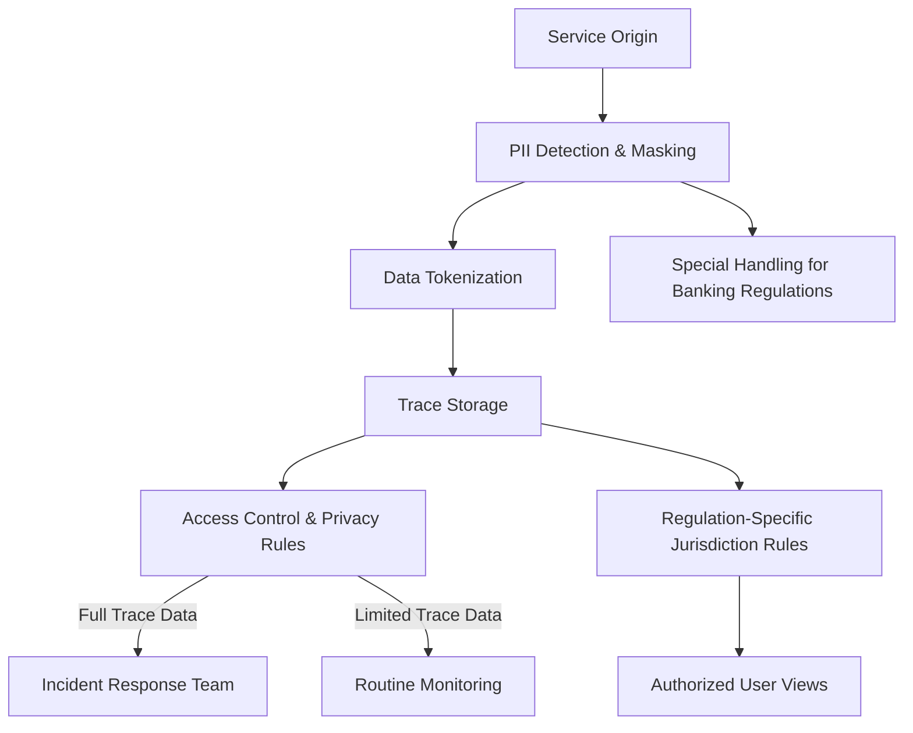

This diagram illustrates the end-to-end flow of customer data through the tracing pipeline, emphasizing privacy-preserving instrumentation at each step. The system ensures compliance by integrating automated data protection measures, adapting to both regulatory requirements and access needs, while maintaining operational effectiveness.

### Teaching Narrative

Privacy-preserving instrumentation transforms tracing from a potential compliance risk to a regulatory asset in highly regulated banking environments. Financial data requires exceptional protection due to regulatory requirements, security concerns, and customer trust implications. Effective banking tracing implementations must incorporate sophisticated data protection mechanisms directly into the instrumentation layer—before trace data leaves the originating service. This requires comprehensive PII detection and automatic masking of sensitive fields like account numbers, tax identifiers, and customer names, along with selective redaction or tokenization of financial details like transaction amounts or balances. Unlike generic tracing implementations, banking-specific instrumentation must be "regulation-aware"—applying different privacy rules based on data types, jurisdictions, and specific regulations like GDPR, PCI-DSS, or local banking privacy laws. The instrumentation must also support differential privacy controls that adjust detail levels based on legitimate access needs—showing full trace data to authorized engineers during incident response while providing limited views for routine monitoring. This privacy-first approach transforms tracing implementation from a security afterthought to a designed-in capability, ensuring banks can gain the operational benefits of distributed tracing while maintaining the strict data protection standards required in financial services.

### Common Example of the Problem

A European bank implemented distributed tracing across their retail banking platform without adequate privacy controls, focusing initially on technical functionality rather than compliance requirements. Their tracing captured complete transaction flows but also unintentionally included sensitive customer data in trace spans—account numbers appeared in URL paths, transaction amounts in API parameters, and personal identifiers in error messages.

During a major incident, the investigation team shared trace data with an external vendor's support engineers to help diagnose a performance problem. This sharing inadvertently exposed unmasked customer financial data to unauthorized third parties, violating GDPR and banking secrecy regulations. The compliance breach was discovered during a routine audit, resulting in an emergency shutdown of the entire tracing platform, leaving the bank without critical observability during a planned system migration.

The subsequent regulatory investigation imposed a €4.2 million fine, required customer notifications about the potential data exposure, and mandated comprehensive redesign of their observability platform with regulatory oversight. Beyond direct penalties, the bank experienced significant reputational damage when the incident became public, with customer trust metrics dropping 18% and new account openings declining 12% in the quarter following the disclosure. The entire tracing implementation had to be rebuilt with privacy controls, effectively doubling the project cost and delaying observability benefits by nine months.

#### Key Mistakes and Lessons Learned Checklist

- **Failure to Prioritize Privacy from the Outset**: Privacy controls were not integrated into the initial tracing implementation, leading to sensitive customer data being captured and exposed.
- **Inadequate PII Detection and Masking**: No automated detection or masking mechanisms were in place for sensitive fields like account numbers, transaction amounts, and personal identifiers.
- **Improper Data Sharing Practices**: Trace data containing sensitive information was shared with external vendors without proper redaction or safeguards.
- **Non-Compliance with Regulations**: The tracing system failed to adhere to GDPR and banking secrecy regulations, resulting in significant legal and financial consequences.
- **Reactive Rather Than Proactive Approach**: Privacy issues were only addressed after a compliance breach, resulting in emergency fixes and costly redesigns.
- **Operational Disruption Due to Compliance Failures**: The tracing platform had to be shut down during a critical system migration, causing a loss of observability during a key operational period.
- **Reputational Damage**: The public disclosure of the incident led to measurable declines in customer trust and new account openings.

#### Recommended Best Practices

- **Integrate Privacy by Design**: Embed privacy controls into the tracing implementation from the start, ensuring compliance with regulations like GDPR and PCI-DSS.
- **Automate PII Detection and Masking**: Implement tooling to automatically identify and mask sensitive fields before trace data is stored or shared.
- **Establish Clear Data Sharing Policies**: Ensure trace data is redacted or tokenized before sharing with external parties, and restrict access based on roles and need-to-know principles.
- **Regular Compliance Audits**: Conduct routine audits to identify privacy risks and ensure adherence to regulatory requirements.
- **Simulate Incident Scenarios**: Test tracing systems in controlled environments to identify potential data exposure risks during incident handling.
- **Educate Teams on Privacy and Compliance**: Train engineers, incident responders, and external partners on the importance of privacy-preserving instrumentation and regulatory obligations.

### SRE Best Practice: Evidence-Based Investigation

Site Reliability Engineers implement privacy-preserving instrumentation through systematic data flow analysis and layered protection mechanisms. The investigation begins with comprehensive data classification—analyzing every field captured in trace data across all instrumented services and categorizing each attribute according to sensitivity: public operational data, internal confidential information, regulated personal data, and highly restricted financial details.

For each data category, SREs conduct risk-based control selection—identifying appropriate protection mechanisms through analysis of regulatory requirements, potential exposure impact, and operational value. This evidence-based approach avoids both under-protection of sensitive data and over-protection that might render the tracing system operationally useless.

SREs implement verification through adversarial privacy testing—conducting structured "red team" exercises where security specialists attempt to extract sensitive information from trace data using both authorized access and potential exploit techniques. These controlled tests provide empirical evidence of control effectiveness rather than theoretical assurances.

To validate regulatory compliance, SREs conduct jurisdictional analysis—systematically documenting how trace data flows across geographic and regulatory boundaries, with evidence-based verification that appropriate controls activate as transactions cross jurisdictional lines. This boundary testing ensures that regional regulations like GDPR or specific banking privacy laws are automatically enforced at the appropriate points.

Finally, SREs implement continuous compliance verification through automated scanning of trace data for sensitive information patterns that might bypass controls, providing ongoing evidence that privacy mechanisms remain effective as systems and data patterns evolve.

#### Summary of Steps for Evidence-Based Investigation

| Step | Goal | Outcome |
| -------------------------------------- | ----------------------------------------------------------------- | ------------------------------------------------------------------------------------------ |
| **Data Classification** | Identify and categorize all data fields according to sensitivity. | Systematically classified data with clear sensitivity labels (e.g., public, confidential). |
| **Risk-Based Control Selection** | Apply appropriate protection mechanisms based on risk analysis. | Balanced controls that ensure privacy without compromising operational utility. |
| **Adversarial Privacy Testing** | Test privacy protections under simulated attack scenarios. | Empirical evidence of privacy control effectiveness against potential vulnerabilities. |
| **Jurisdictional Analysis** | Verify compliance with regulations across geographic boundaries. | Automatic enforcement of region-specific privacy rules (e.g., GDPR, PCI-DSS). |
| **Continuous Compliance Verification** | Monitor trace data for evolving patterns or bypass risks. | Ongoing assurance that privacy mechanisms remain effective and up-to-date. |

### Banking Impact

The business consequences of inadequate privacy protection in tracing systems extend far beyond immediate regulatory penalties. Financial institutions face cascading impacts across regulatory, reputational, and operational dimensions, each compounding the challenges of recovery and long-term resilience.

#### Cascading Impacts of Privacy Breaches in Banking

```text
[Privacy Breach]
       ↓
[Regulatory Penalties]
  ● Fines up to 4% of global annual revenue (e.g., GDPR)
  ● Mandatory business restrictions during remediation
  ● Enhanced supervisory requirements → increased compliance costs
       ↓
[Reputational Damage]
  ● Decline in customer trust metrics (15-25% drop typical)
  ● High-value clients disproportionately impacted
  ● Financial performance effects:
      - Reduced product adoption
      - Lower share-of-wallet
      - Increased account closures by privacy-conscious customers
       ↓
[Operational Impacts]
  ● Mandated observability restrictions → reduced visibility
      - Incident resolution times extended by 40-60%
      - Heightened risk of secondary incidents
  ● Resource diversion during remediation:
      - Privacy redesign costs 130-180% of original implementation
      - Engineering talent diverted from strategic initiatives for 6-12 months
       ↓
[Competitive Disadvantage]
  ● Delayed delivery of new features and services
  ● Indirect loss of market position due to resource reallocation
```

Regulatory penalties form the initial shockwave, with fines, operational restrictions, and increased compliance burdens creating immediate financial strain. However, the reputational damage often has longer-lasting effects, as privacy breaches erode customer trust and disproportionately impact high-value clients, leading to measurable financial performance declines.

Operationally, the impacts ripple further—the observability gaps caused by mandated restrictions slow incident resolution and increase the risk of further incidents precisely when scrutiny is highest. Additionally, the remediation process itself consumes disproportionate resources, with privacy redesign efforts costing significantly more than original implementations and diverting scarce engineering talent from strategic initiatives. This resource misallocation compounds the long-term competitive disadvantage, as banks struggle to maintain innovation velocity and market relevance.

Understanding these cascading impacts underscores the critical need for proactive, privacy-first tracing implementations. By embedding privacy protections into the instrumentation layer, banks can mitigate these risks at their root, preserving both operational integrity and customer trust.

### Implementation Guidance

1. **Implement Field-Level Classification and Protection**:\
   Develop a comprehensive data dictionary for all information captured in trace data, categorizing each field by sensitivity level (public, confidential, regulated, restricted). Configure instrumentation to apply appropriate protection mechanisms automatically for each category: pass-through for public data, encryption for confidential information, tokenization for regulated personal data, and complete redaction or aggregation for highly restricted financial details.

   ```python
   # Example: Field-level classification and protection
   DATA_DICTIONARY = {
       "transaction_id": "public",
       "account_number": "regulated",
       "customer_name": "restricted",
       "transaction_amount": "regulated",
       "error_message": "confidential"
   }

   def protect_field(field_name, value):
       sensitivity = DATA_DICTIONARY.get(field_name, "public")
       if sensitivity == "public":
           return value  # Pass-through
       elif sensitivity == "confidential":
           return encrypt(value)  # Apply encryption
       elif sensitivity == "regulated":
           return tokenize(value)  # Apply tokenization
       elif sensitivity == "restricted":
           return None  # Redact completely
       else:
           raise ValueError(f"Unknown sensitivity level for field: {field_name}")
   ```

2. **Deploy Regulation-Aware Context Propagation**:\
   Enhance trace context propagation to include regulatory metadata like the originating jurisdiction, applicable regulations, and data subject rights assertions. Configure tracing systems to automatically adjust privacy controls as transactions cross jurisdictional boundaries, ensuring appropriate regional requirements (GDPR, GLBA, PCI-DSS, local banking regulations) are enforced regardless of where processing or storage occurs.

   ```json
   {
       "trace_id": "abc123",
       "origin_jurisdiction": "EU",
       "applicable_regulations": ["GDPR", "PCI-DSS"],
       "data_subject_rights": ["right_to_access", "right_to_erasure"]
   }
   ```

   ```python
   def apply_privacy_controls(trace_metadata):
       regulations = trace_metadata.get("applicable_regulations", [])
       if "GDPR" in regulations:
           enforce_gdpr_controls()
       if "PCI-DSS" in regulations:
           enforce_pci_dss_controls()
       # Additional regulation-specific logic here
   ```

3. **Implement Differential Privacy Controls**:\
   Create role-based access tiers for trace data with varying levels of detail visibility: limited operational metrics for general monitoring, masked transaction flows for tier-1 support, and full detail for authorized incident responders with appropriate approvals. Configure dynamic data revelation that requires additional authentication, provides time-limited access, and maintains comprehensive audit trails when sensitive data is viewed.

   ```python
   def get_trace_data(user_role, trace_id):
       if user_role == "monitoring":
           return get_limited_metrics(trace_id)
       elif user_role == "tier1_support":
           return get_masked_data(trace_id)
       elif user_role == "incident_responder":
           if verify_additional_authentication(user_role):
               return get_full_trace_data(trace_id)
           else:
               raise PermissionError("Additional authentication required")
       else:
           raise PermissionError("Access denied")
   ```

4. **Establish Automated PII Detection and Masking**:\
   Deploy pattern-matching engines that scan all trace data for unintentionally captured sensitive information (account numbers, tax identifiers, personal details) in unstructured fields like error messages, URL parameters, and log annotations. Implement real-time interception that automatically masks identified patterns before storage and triggers alerts when unexpected sensitive data patterns appear.

   ```python
   import re

   PII_PATTERNS = [
       re.compile(r"\b\d{16}\b"),  # Example: Credit card numbers
       re.compile(r"\b\d{9}\b"),  # Example: Social Security numbers
       re.compile(r"\b[A-Z0-9._%+-]+@[A-Z0-9.-]+\.[A-Z]{2,}\b", re.IGNORECASE)  # Emails
   ]

   def mask_pii(data):
       for pattern in PII_PATTERNS:
           data = pattern.sub("[MASKED]", data)
       return data

   # Example usage
   raw_trace_data = "Error: Account number 1234567890123456 caused failure."
   safe_data = mask_pii(raw_trace_data)
   print(safe_data)  # Output: "Error: Account number [MASKED] caused failure."
   ```

5. **Create Privacy-Preserving Analytics Capabilities**:\
   Develop specialized analysis functions that enable operational insights without exposing sensitive details—including aggregate performance metrics across customer segments, anonymized journey analytics that preserve patterns without individual identification, and statistical anomaly detection that identifies issues without revealing specific transaction details.

   ```python
   def anonymized_analytics(data):
       # Aggregate and anonymize customer segments
       return {
           "total_transactions": sum(tx["amount"] for tx in data),
           "unique_customers": len(set(tx["customer_id"] for tx in data))
       }

   def detect_anomalies(data):
       # Statistical anomaly detection
       return [tx for tx in data if tx["amount"] > calculate_threshold(data)]
   ```

## Panel 4: Context Propagation Across Banking Channels - The Multi-Interface Challenge

### Scene Description

A digital banking center where customer experience analysts and engineers are analyzing a complex customer journey that spans multiple channels. Visualization screens show a customer who began a mortgage application on the web, continued on a mobile device, and completed the process through a call center interaction. Trace visualizations demonstrate how the unified customer identity and transaction context is maintained across these channel transitions, with specialized adapters passing trace context between web cookies, mobile device storage, telephony systems, and call center applications. Engineers are examining how correlation identifiers persist across these boundary transitions, allowing a seamless trace despite the channel shifts.

Below is a simplified representation of the customer journey and context propagation across channels:


This diagram illustrates how context is propagated across different channels, with correlation mechanisms ensuring that customer identity and transaction state are preserved at each transition. Engineers utilize these visualizations to analyze where context might be lost and to optimize handoff points, ensuring a seamless and unified customer experience.

### Teaching Narrative

Context propagation across channels presents unique challenges in banking where customers routinely transition between interfaces during complex financial journeys. While standard tracing systems assume continuous digital interaction within a single channel, banking customers frequently shift between web, mobile, call center, branch, and even paper processes during significant transactions like mortgage applications or wealth management services. Effective banking tracing implementations must extend context propagation beyond simple HTTP headers to include cross-channel correlation mechanisms—maintaining transaction identity as customers move between interfaces. This requires specialized adapters for each channel transition: generating QR codes or reference numbers for customers moving from digital to physical channels, capturing call center interaction identifiers, and maintaining correlation when customers authenticate on different devices. For omnichannel banking experiences, this cross-channel context propagation transforms tracing from a siloed technical view to a comprehensive customer journey perspective. Engineers gain visibility into how channel transitions impact overall customer experience, including the critical handoff points where context is often lost in traditional monitoring approaches. This capability enables banks to optimize not just individual channel performance but the increasingly important transitions between channels that often determine customer satisfaction with complex financial processes.

### Common Example of the Problem

A large retail bank faced a persistent challenge in their mortgage application process where customers frequently had to restart applications or re-enter information when transitioning between channels. Analytics revealed that 62% of mortgage applications involved multiple channels—typically starting online, continuing on mobile, and often completing via a call center or branch. However, only 37% of these multi-channel journeys were successfully completed, compared to 78% for single-channel applications. This gap highlighted a critical tracing deficiency: while each channel maintained internal session tracking, context was often lost during transitions. For example, when customers called the contact center after starting online, agents lacked visibility into prior steps and often restarted applications instead of continuing existing ones. Similarly, switching from web to mobile frequently resulted in customers receiving a fresh application rather than resuming their in-progress work.

The following table illustrates key metrics comparing single-channel and multi-channel journeys to highlight the impact of these challenges:

| Metric | Single-Channel Journeys | Multi-Channel Journeys | Impact of Context Loss |
| ---------------------------------- | ----------------------- | ---------------------- | --------------------------------- |
| Completion Rate | 78% | 37% | -41% lower for multi-channel |
| Acquisition Cost per Application | $850 | $1,190 | 40% higher for multi-channel |
| Customer Satisfaction (CSAT) | 8.2/10 | 6.5/10 | Significant drop in multi-channel |
| Industry Benchmark Completion Rate | 70% | 60% | Lagging by 23% in multi-channel |

This disconnected experience had significant business implications. Mortgage completion rates lagged industry benchmarks by 23%, acquisition costs were 40% higher than competitors due to redundant processing, and customer satisfaction scores for mortgage products were the lowest in the bank's portfolio. Despite substantial investments in individual channel capabilities, the lack of effective context propagation across channels created persistent friction. Traditional single-channel monitoring approaches failed to identify or address these critical handoff points, underscoring the need for enhanced cross-channel tracing capabilities.

### SRE Best Practice: Evidence-Based Investigation

Site Reliability Engineers approach cross-channel context propagation through systematic boundary analysis and correlation mechanism design. The investigation follows a structured, evidence-based approach, which can be summarized and operationalized through the following checklist and flow diagram:

#### Checklist for Evidence-Based Investigation

1. **Journey Mapping**:

   - Document all potential channel transitions in key customer journeys through direct observation.
   - Analyze clickstream data to identify exit points from digital channels.
   - Review call center transcripts to understand hand-off attempts.
   - Catalog common cross-channel patterns through customer experience research.

2. **Correlation Opportunity Analysis**:

   - Identify available identifying information in the originating channel (e.g., reference numbers, phone numbers, email addresses).
   - Evaluate how this information can be captured and transferred to the destination channel.
   - Consider environmental context (e.g., timing patterns, partial application data) for linking fragmented sessions.

3. **Verification through Testing**:

   - Conduct "mystery shopper" transaction testing with controlled test cases crossing channel boundaries.
   - Isolate and analyze specific transitions to identify where context is preserved or lost.

4. **Impact Validation**:

   - Perform quantitative journey analysis to compare completion rates, processing times, and satisfaction scores for successful versus failed context propagation.
   - Prioritize improvement efforts based on transitions with the greatest business impact.

5. **Continuous Monitoring**:

   - Implement synthetic cross-channel transactions to automate validation of critical channel transitions.
   - Monitor for early detection of context propagation failures to prevent significant customer impact.

#### Flow Diagram for Evidence-Based Investigation

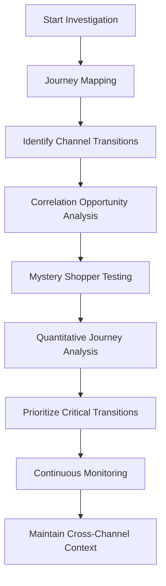

This structured approach ensures SREs systematically identify, test, and validate cross-channel context propagation mechanisms while continuously monitoring for emerging issues. By following this checklist and flow, engineers can pinpoint the handoff points most prone to context loss, quantify their impact, and implement proactive solutions to optimize omnichannel banking experiences.

### Banking Impact

The business consequences of fragmented cross-channel context extend far beyond technical challenges to directly impact financial performance and customer relationships. Quantitative analysis highlights these impacts across key areas:

#### Transaction Completion Rates

Banks report that financial journeys with successful context propagation across channels complete at 2-3 times the rate of fragmented journeys where context is lost during transitions. For high-value products like mortgages, wealth management, or business banking, these completion differences represent millions in direct revenue impact. The following chart illustrates the completion rate disparity:

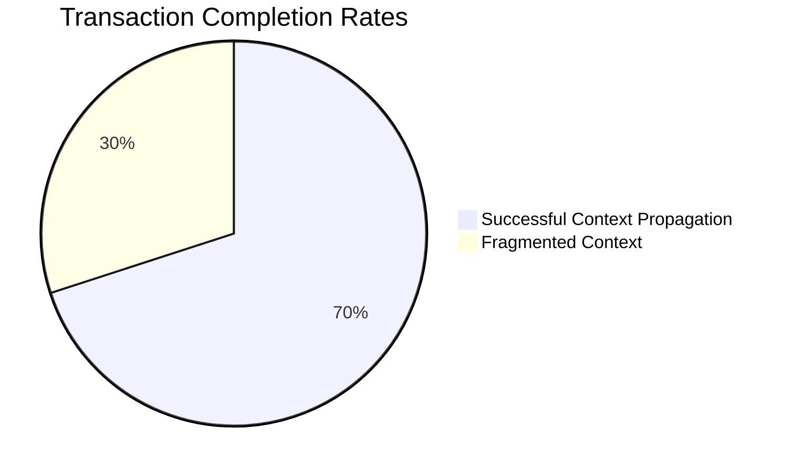

#### Customer Acquisition Costs

Context failures drive operational inefficiencies, with financial institutions reporting 30-50% higher processing costs for journeys requiring information re-entry or redundant processing. These inefficiencies erode product profitability and create pricing disadvantages compared to competitors with seamless experiences. A breakdown of processing cost differences is shown below:

```mermaid
bar
    title Processing Cost Increase Due to Context Failures
    axis y Percentage Increase (%)
    "Information Re-entry": 20
    "Redundant Processing": 30
```

#### Cross-Selling Success Rates

Relationship development also suffers, as banks with effective cross-channel context report 25-35% higher cross-selling success rates for complex financial products involving multiple interaction channels. This relationship expansion compounds over time, driving higher lifetime value. The following data highlights cross-selling success differences:

```mermaid
bar
    title Cross-Selling Success Rates
    axis x Channel Context
    "Effective Context Propagation": 35
    "Fragmented Context": 25
```

#### Customer Satisfaction

Customer sentiment shows the greatest sensitivity to cross-channel transitions. Satisfaction scores drop an average of 18 points (on a 100-point scale) when customers must repeat information or restart processes between channels. Transition friction consistently ranks as the primary complaint in customer feedback for complex banking products. A comparative view of satisfaction scores is presented below:

```mermaid
bar
    title Customer Satisfaction Scores
    axis x Context Scenario
    "Seamless Transition": 82
    "Fragmented Transition": 64
```

These metrics underscore the critical importance of robust context propagation mechanisms in banking, linking technical capabilities to tangible business outcomes. By addressing context fragmentation, financial institutions can drive higher revenue, reduce costs, improve customer relationships, and enhance overall satisfaction.

### Implementation Guidance

1. **Create a Unified Customer Journey Identifier System**\
   Implement persistent correlation identifiers for multi-channel journeys that maintain consistency regardless of interface transitions. Design both explicit identifiers (e.g., customer-visible reference numbers) and implicit correlators (e.g., secure tokens) that can be passed between channels. Configure all customer-facing systems to recognize and preserve these journey identifiers rather than generating new session IDs with each channel change.\
   **Example Configuration**:

   ```json
   {
     "correlation_id_format": "UUID-v4",
     "customer_reference_prefix": "BANK-MORTGAGE-",
     "token_lifetime": "24h",
     "header_name": "X-Correlation-ID",
     "fallback_identifier": "session_cookie"
   }
   ```

2. **Implement Channel-Specific Context Transfer Mechanisms**\
   Develop specialized adapters for each common channel transition. Examples include:

   - **Digital-to-Voice Transitions**: Generate QR codes or short reference numbers for customers to share with call center agents.
   - **Web-to-Mobile Handoffs**: Use deep linking to pass context securely between browser and mobile app.
   - **In-Person Branch Transitions**: Present contextual data (e.g., QR codes or printed tokens) to assist branch staff in resuming the journey.
   - **Third-Party Partner Handoffs**: Use authenticated API endpoints to maintain context across partner systems.\
     **Example Code (Deep Linking for Web-to-Mobile)**:

   ```javascript
   const journeyId = getCorrelationIdFromSession();
   const deepLinkUrl = `mybankapp://resume?correlationId=${journeyId}`;
   document.getElementById('mobile-link').href = deepLinkUrl;
   ```

3. **Deploy a Centralized Context Registry Service**\
   Create a secure, high-availability context management service to maintain in-progress journey state independent of individual channels. Configure all customer touchpoints to publish journey state updates to this registry and retrieve context when customers reconnect through different channels. Ensure compliance with regulatory requirements by implementing strong authentication and encryption.\
   **Example Service Configuration (YAML)**:

   ```yaml
   context_registry:
     service_name: "ContextRegistryService"
     replication_factor: 3
     encryption: "AES256"
     api_endpoints:
       publish: "/api/v1/journey/publish"
       retrieve: "/api/v1/journey/retrieve"
     access_control:
       roles:
         - customer_touchpoint
         - analytics_engine
   ```

4. **Establish Journey Correlation Analytics**\
   Implement real-time analytics that identify related interactions across channels. Use explicit identifiers where available and probabilistic matching based on patterns such as timestamps, partial application data, and customer behavior. Enable unified journey visualizations even when perfect correlation is not possible.\
   **Mermaid Diagram (Correlation Flow)**:

   ```mermaid
   graph TD
     A[Customer Interaction] -->|Explicit ID| B[Correlation Analytics]
     A -->|Time Pattern| B
     A -->|Behavior Match| B
     B --> C[Unified Journey Visualization]
   ```

5. **Create Channel-Aware Trace Visualization**\
   Develop trace visualization capabilities that explicitly highlight channel transitions within customer journeys. Include metrics like transition timing, context preservation status, and customer friction at each channel boundary.\
   **Example Visualization State JSON**:

   ```json
   {
     "journey_id": "12345-abcde",
     "transitions": [
       {
         "from_channel": "web",
         "to_channel": "mobile",
         "transition_time_ms": 3200,
         "context_preserved": true
       },
       {
         "from_channel": "mobile",
         "to_channel": "call_center",
         "transition_time_ms": 7800,
         "context_preserved": false
       }
     ]
   }
   ```

## Panel 5: Incremental Deployment Strategies - Rolling Out Tracing Across Banking Organizations

### Scene Description

A program management office is the hub for tracking the bank-wide tracing implementation. The focal point is a digital Kanban board, organized into columns representing the phased rollout across different banking divisions—retail banking, commercial services, wealth management, and capital markets. Each column contains cards indicating the current status of tracing implementation: planning, testing, or production. Progress indicators, such as percentage bars and color-coded tags, make it easy to identify which divisions are advancing and which require attention.

Next to the Kanban board, a technical dashboard provides a comprehensive view of trace adoption metrics. This dashboard highlights trace completion percentages for key transaction types, indicating how coverage is expanding as more services become instrumented. Metrics like "Retail Payments Trace Coverage: 85%" and "Commercial Loans Trace Coverage: 60%" are accompanied by visual graphs to quickly convey trends and gaps.

Team leads from various divisions are gathered around the setup, engaging in discussions about implementation challenges unique to their domains. They are also reviewing operational improvement metrics such as reduced mean time to resolution and enhanced performance in divisions that have fully adopted tracing. Below is a text-based diagram illustrating the workspace layout:

```
+---------------------------+   +----------------------------+
|       Kanban Board        |   |     Technical Dashboard    |
|---------------------------|   |----------------------------|
| Retail Banking:           |   | Retail Payments: 85%      |
| - Card 1: Planning        |   | Commercial Loans: 60%     |
| - Card 2: Testing         |   | Wealth Mgmt Trades: 70%   |
| Commercial Services:      |   | Avg Trace Expansion: 75%  |
| - Card 1: Production      |   |----------------------------|
| Wealth Management:        |   | Graphs:                  |
| - Card 1: Planning        |   | - Trace Coverage by Div. |
| - Card 2: Testing         |   | - Ops Improvements       |
| Capital Markets:          |   +----------------------------+
| - Card 1: Production      |
+---------------------------+

```

This workspace setup ensures that all stakeholders have clear visibility into the rollout progress and can collaborate effectively to address challenges while celebrating successes.

### Teaching Narrative

Incremental deployment strategies are essential for successful tracing adoption across complex banking organizations with multiple business lines, technology teams, and system generations. Unlike smaller organizations where tracing can be implemented as a single initiative, banks require carefully orchestrated rollout plans that acknowledge organizational complexity while delivering progressive value. Effective banking implementations follow a multi-dimensional approach—phasing deployment across business domains, transaction types, and system tiers simultaneously. This typically begins with a high-visibility pilot in a single domain like retail payments, demonstrating value through improved mean time to resolution and performance optimization. The implementation then expands horizontally across similar systems in other business lines and vertically to include additional tiers within each domain. This phased approach transforms tracing from an overwhelming enterprise-wide project to a series of manageable initiatives with clear success criteria and value demonstration at each stage. To maintain trace coherence during this extended rollout, banks implement "partial trace acceptance"—designing systems to create meaningful visualizations even when some services remain uninstrumented, typically by inferring timing for missing spans. This capability ensures that even partial implementations deliver actionable insights, maintaining organizational momentum through the multi-year journey to comprehensive observability.

### Common Example of the Problem

A global financial institution launched an ambitious distributed tracing initiative with plans for simultaneous implementation across all major business lines—retail banking, capital markets, commercial services, and investment management. The program began with a substantial investment in infrastructure, tooling, and training, followed by a mandate for all technology teams to implement tracing within a 12-month timeframe. However, this "all-at-once" approach quickly revealed significant challenges, leading to costly setbacks.

#### Key Events and Outcomes Timeline

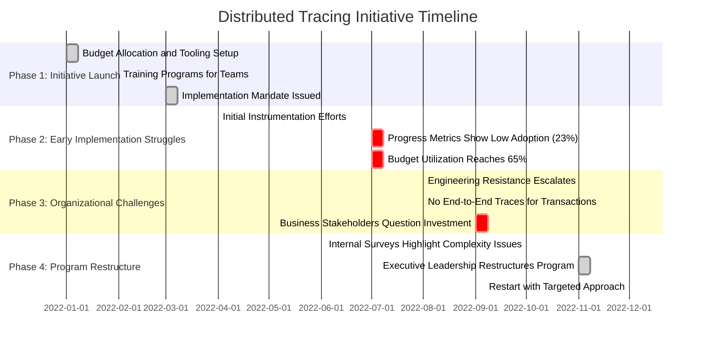

#### Summary of Challenges and Consequences

- **Low Adoption Rates**: Six months into the program, only 23% of services were instrumented, despite consuming 65% of the allocated budget.
- **No Visible Value Delivered**: Teams failed to produce any complete end-to-end traces for major transaction types, leaving business stakeholders without evidence of operational improvements.
- **Overwhelmed Engineering Teams**: Surveys revealed that the simultaneous rollout created unmanageable complexity, particularly for teams handling legacy systems, skills gaps, and regulatory demands.
- **Loss of Organizational Confidence**: Without early wins to demonstrate value, business stakeholders grew skeptical, ultimately pressuring leadership to pause and restructure the initiative.
- **Financial and Resource Waste**: The program wrote off millions in unused infrastructure and partial instrumentation efforts, resetting progress and delaying tangible benefits.

This example illustrates why an incremental, phased deployment strategy is critical for navigating the complexity of large financial institutions. By starting with smaller, high-impact pilots and expanding based on proven successes, organizations can avoid overwhelming teams and ensure early, demonstrable value that sustains momentum.

### SRE Best Practice: Evidence-Based Investigation

Site Reliability Engineers implement incremental deployment through value-driven phasing and continuous benefit validation. The investigation begins with transaction flow prioritization—analyzing incident data, customer impact metrics, and operational costs to identify which specific transaction types would benefit most from observability improvements. This evidence-based selection focuses initial implementation on high-value, high-pain areas rather than arbitrary organizational divisions or technology categories.

For each prioritized transaction flow, SREs conduct feasibility assessment—evaluating the technical complexity, organizational readiness, and dependency challenges through structured proof-of-concept implementations. This empirical approach provides realistic scoping for initial phases rather than assuming similar complexity across all domains.

SREs implement verification through incremental value measurement—defining specific operational metrics for each deployment phase and collecting baseline data before implementation. These metrics typically include mean time to detection, mean time to resolution, defect escape rate, and customer impact duration for incidents related to the instrumented transaction types, providing objective evidence of value delivered by each increment.

To validate the implementation approach, SREs conduct deployment retrospectives after each phase—systematically documenting challenges, adaptations, and efficiency improvements that should inform subsequent phases. This continuous learning process creates accelerating implementation velocity as the organization applies lessons from earlier deployments.

Finally, SREs implement "partial trace utility" validation—testing whether the trace visualizations produced by each implementation phase provide actionable operational insights despite missing some components. This utility assessment ensures each increment delivers value even before complete coverage is achieved.

#### Checklist: Evidence-Based Investigation Process

- **Transaction Flow Prioritization**

  - Analyze incident data to identify high-impact areas.
  - Evaluate customer impact and operational costs for specific transaction types.
  - Select initial focus areas based on value-pain trade-offs.

- **Feasibility Assessment**

  - Assess technical complexity of the prioritized transaction flows.
  - Evaluate organizational readiness and stakeholder alignment.
  - Conduct proof-of-concept implementations to confirm scope and feasibility.

- **Incremental Value Measurement**

  - Define operational metrics (e.g., MTTD, MTTR, defect escape rate, customer impact duration).
  - Collect baseline data for metrics prior to implementation.
  - Measure improvements after each deployment phase.

- **Deployment Retrospectives**

  - Document deployment challenges and adaptations.
  - Identify opportunities for process improvements in future phases.
  - Apply lessons learned to accelerate subsequent deployments.

- **Partial Trace Utility Validation**

  - Test trace visualizations for actionable insights during incomplete implementations.
  - Validate that partial traces provide sufficient operational value.
  - Ensure each phase delivers meaningful progress toward comprehensive observability.

### Banking Impact

The business consequences of ineffective tracing deployment strategies extend beyond technical implementation to directly affect financial performance and digital transformation outcomes. Most immediately, failed implementation attempts create substantial direct costs—large financial institutions report average investments of $8-15 million in enterprise-wide tracing initiatives, with poorly phased approaches often requiring restart after achieving limited value from initial investments.

Opportunity costs frequently exceed direct expenses—banks report that engineering resources consumed by overly ambitious tracing implementations typically delay revenue-generating feature delivery and customer experience improvements by 20-30% during the implementation period. This opportunity cost can represent tens of millions in delayed revenue realization for major banking platforms.

Organizational resistance increases with poorly phased implementations—financial institutions report that unsuccessful initial phases typically reduce willingness to adopt observability practices by 40-60% in subsequent attempts, creating cultural barriers that persist long after technical issues are addressed. This resistance particularly affects the integration of observability into development practices, limiting the value of even successfully deployed technical capabilities.

Perhaps most significantly, competitive disadvantage compounds during extended implementations—while banks with successful incremental approaches begin realizing operational benefits within 3-6 months, those pursuing comprehensive implementations typically see no meaningful improvements for 18-24 months, creating a significant observability gap compared to more agile competitors that directly affects incident frequency, resolution time, and customer experience.

#### Summary Comparison: Ineffective vs. Incremental Tracing Strategies

| **Category** | **Ineffective Tracing Strategies** | **Incremental Tracing Strategies** |
| --------------------- | ---------------------------------------------------------------------------------------------------------------------------- | ---------------------------------------------------------------------------------------------------------------------- |
| **Financial Costs** | $8-15 million per initiative, often requiring restarts due to limited value from poorly phased approaches. | Lower upfront costs with phased investments, maximizing ROI as each phase demonstrates value. |
| **Opportunity Costs** | 20-30% delay in revenue-generating feature delivery, representing tens of millions in delayed revenue realization. | Minimal disruption to feature delivery by aligning tracing rollout with existing development roadmaps. |
| **Cultural Costs** | 40-60% reduction in willingness to adopt observability practices after failed initial phases, creating long-term resistance. | Gradual adoption fosters organizational buy-in, increasing enthusiasm for observability practices over time. |
| **Time-to-Benefit** | 18-24 months with no meaningful improvements, creating a competitive observability gap. | Operational benefits realized within 3-6 months, enabling faster incident resolution and improved customer experience. |

This table highlights the tangible financial, opportunity, and cultural costs of ineffective tracing strategies compared to the measurable benefits of incremental approaches. By adopting a phased deployment plan, banking organizations can mitigate risks, accelerate value realization, and maintain competitive parity in the rapidly evolving financial services landscape.

### Implementation Guidance

To ensure clarity and usability, the following numbered checklist outlines the key steps for a successful incremental tracing deployment strategy across banking organizations. Each step builds on the previous to create a phased, value-driven approach:

1. **Create a Value-Driven Phasing Model**

   - Develop a multi-dimensional deployment framework that balances transaction value, technical feasibility, and organizational readiness.
   - Use a weighted scoring model to prioritize major banking transactions based on incident frequency, customer impact, revenue significance, and regulatory importance.
   - Define 3-6 month implementation phases, focusing on delivering complete traces for specific high-value transaction types instead of partial instrumentation across all systems.

2. **Implement "Lighthouse" Projects in Each Business Domain**

   - Select one high-visibility, high-value transaction flow in each major banking division (e.g., retail banking, commercial services, etc.) as a pilot project.
   - Ensure complete end-to-end tracing for these flows, even if initial details are limited.
   - Document and communicate the operational improvements achieved to generate demand for tracing in other areas.

3. **Develop Partial Trace Reconstruction Capabilities**

   - Design visualization and analysis tools tailored for incremental deployment scenarios.
   - Implement techniques such as:
     - **Span inference**: Estimate timing for uninstrumented components using observed gaps between instrumented services.
     - **Shadow spans**: Represent known but untraced processing based on architectural understanding.
   - Provide actionable insights even when some services remain uninstrumented.

4. **Establish Scaled Enablement Programs**

   - Create enablement resources tailored to diverse team needs:
     - Standard integration patterns for modern services.
     - Specialized approaches for legacy systems.
     - "Done-for-you" implementation services for critical systems with limited engineering availability.
   - Scale resources appropriately for each phase rather than attempting to enable all teams simultaneously.

5. **Implement Value-Based Expansion Strategy**

   - After each phase, document operational improvements (e.g., reduced incident duration, faster detection time, decreased customer impact, improved development velocity).
   - Use these measured benefits to drive expansion based on demonstrated value rather than arbitrary coverage targets.
   - Prioritize transaction types similar to successful implementations for efficient replication with minimal adaptation.

______________________________________________________________________

#### Flowchart Summary of Incremental Deployment Steps

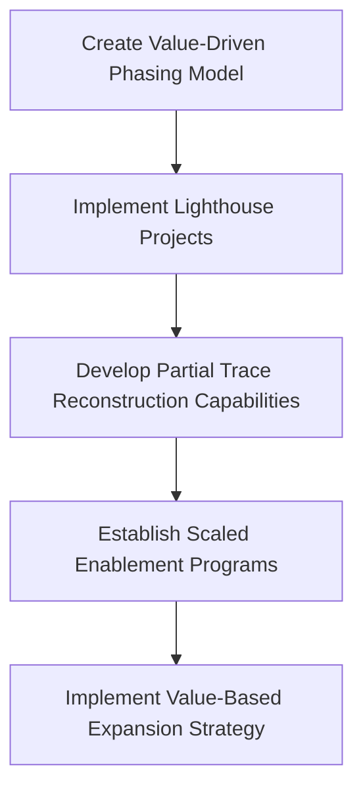

## Panel 6: Custom Banking Telemetry - Beyond Standard Instrumentation

### Scene Description

Imagine a vibrant financial technology innovation lab buzzing with activity. Engineers collaborate around multiple screens displaying specialized dashboards that bring financial context to life within trace data. Each dashboard is uniquely tailored for banking-specific telemetry:

- **Payment Transactions Dashboard**: Displays trace timelines enriched with overlaid regulatory compliance checkpoints and fraud risk scores, enabling engineers to visualize transaction flows and compliance results in real-time.
- **Trade Processing Dashboard**: Integrates market volatility indicators directly into trade traces, providing insights into how external financial conditions impact transaction processing.
- **Loan Processing Dashboard**: Embeds credit risk scoring metrics within spans, offering a clear view of risk-weighted loan assessments throughout their lifecycle.

At the center of the room, an engineer demonstrates a custom instrumentation library. This library automatically augments trace spans with critical banking attributes, such as:

```plaintext
+-------------------------+-----------------------------+
| Attribute               | Example                    |
+-------------------------+-----------------------------+
| Transaction Monetary    | $1,000,000                |
| Customer Segment        | High Net Worth            |
| Risk Level              | Medium                    |
| Regulatory Categorization | AML Compliance Screening |
+-------------------------+-----------------------------+
```

These enriched spans transform standard tracing into a powerful observability framework tailored for financial services. The lab’s setup bridges the gap between technical operations and business requirements, enabling teams to align system performance with financial insights. This visual and functional synergy represents a groundbreaking step in banking observability.

### Teaching Narrative

Custom banking telemetry extends standard tracing beyond generic technical metrics to include the financial context essential for meaningful banking observability. While standard instrumentation captures timing, dependencies, and basic attributes, financial services require enriched telemetry that incorporates banking-specific dimensions. Effective banking implementations extend standard tracing libraries with custom instrumentation that automatically captures financial context: transaction monetary values, customer segments, product types, risk categories, and regulatory classifications. This specialized telemetry transforms traces from technical timing data to business-meaningful representations of financial operations. For example, payment traces include not just technical spans but also payment corridors, compliance screening results, fraud risk scores, and settlement status indicators. This banking-specific context enables powerful use cases beyond generic tracing: correlation of system performance with transaction values, prioritization based on customer tiers, risk-weighted alerting that escalates issues for high-value transactions, and regulatory reporting that groups trace data by compliance categories. By extending standard instrumentation with rich financial context, banks transform tracing from a generic technical tool to a specialized capability aligned with the unique requirements of financial services—creating a shared observability language that bridges technical teams and business stakeholders in banking organizations.

### Common Example of the Problem

A regional bank implemented standard distributed tracing across their digital banking platform following typical instrumentation guidelines from open-source frameworks. While the implementation was technically successful—capturing timing, dependencies, and basic request attributes—the resulting traces provided limited business value despite significant investment. During a major incident affecting payments, the tracing system showed comprehensive technical details: service latency, database queries, API dependencies, and error codes. However, operations teams couldn't answer critical business questions: Were high-value transactions affected more than routine ones? Did premium customers experience worse performance than standard accounts? Which payment types or corridors saw the highest failure rates? Which regulatory requirements were at risk due to the incident?

The traces contained detailed technical data but lacked crucial financial context that would make this data actionable for business impact assessment and prioritization. Support teams resorted to separate database queries and manual correlation to determine which customer segments were affected and which transactions required urgent intervention, negating much of the efficiency gain from the tracing implementation. Business leaders questioned the investment value when incident response still required extensive manual effort to translate technical issues into business impact despite the new tracing capabilities.

#### Table: Gaps in Generic Tracing vs. Enriched Telemetry

| **Aspect** | **Generic Tracing** | **Enriched Banking Telemetry** | **Consequences of the Gap** |
| ------------------------ | --------------------------------------------------------------------------- | ------------------------------------------------------------------------------------ | ----------------------------------------------------------------------------------------------------------- |
| **Data Context** | Captures technical metrics like latency, error codes, and API dependencies. | Includes financial attributes like transaction value, customer tier, and risk level. | Business teams struggle to assess the impact on high-value transactions or premium customers. |
| **Incident Analysis** | Provides detailed service dependencies and technical failure points. | Adds compliance checkpoints, fraud indicators, and payment corridor context. | Operations teams must manually correlate technical data with business data, delaying incident resolution. |
| **Prioritization** | Focuses on generic technical performance metrics. | Prioritizes based on business impact, such as high-value or high-risk transactions. | Critical issues affecting key customers or regulatory compliance may go unnoticed or be addressed too late. |
| **Regulatory Reporting** | Lacks categorization by regulatory requirements. | Automatically enriches traces with compliance classifications. | Compliance teams are unable to use trace data directly for audits, increasing manual workload and risk. |

#### Text-Based Flowchart: Tracing Gaps in Action

```plaintext
Incident Occurs --> Generic Tracing Captures Technical Data --> 
[Missing Financial Context] --> Manual Effort to Correlate --> 
Delayed Resolution + Business Impact Unclear
```

By failing to include business-critical financial context, the bank's tracing system left operational teams without the tools to efficiently assess and address key business impacts. This gap between technical data and actionable insights undermined the value of their investment in observability.

### SRE Best Practice: Evidence-Based Investigation

Site Reliability Engineers implement custom banking telemetry through systematic financial context analysis and targeted instrumentation enhancement. The investigation begins with observability gap assessment—analyzing recent incidents and operational challenges to identify which specific financial context would have improved resolution if available within trace data. This typically includes reviewing incident postmortems to pinpoint where teams needed to correlate technical issues with business dimensions like transaction values, customer segments, or regulatory categories.

For each identified contextual need, SREs conduct data availability analysis—determining where the required financial information exists in current systems and how it could be incorporated into the tracing instrumentation. This evidence-based approach maps information flows to identify the optimal capture points for business context without creating redundant or inconsistent data stores.

SREs implement verification through scenario-based testing—creating simulated incidents that require business context for effective resolution and validating whether the enhanced telemetry provides the necessary information for rapid impact assessment and prioritization. These controlled tests ensure the custom attributes deliver actual operational improvements rather than just additional data collection.

To validate business alignment, SREs conduct stakeholder usability assessment—testing whether the enhanced trace visualizations and query capabilities answer the specific questions business leaders ask during incidents and performance reviews. This user-centric validation ensures technical implementation meets actual business needs rather than assumed requirements.

Finally, SREs implement continuous relevance verification—regularly reviewing whether the captured financial context remains aligned with evolving business priorities and regulatory requirements, ensuring the custom telemetry adapts as banking operations and oversight change over time.

#### Checklist: Evidence-Based Investigation Steps

1. **Observability Gap Assessment**

   - Review recent incidents and challenges to identify missing financial context in trace data.
   - Analyze postmortems for gaps where business dimensions (e.g., transaction values, customer segments) could have improved resolution.

2. **Data Availability Analysis**

   - Identify where necessary financial information resides within current systems.
   - Map information flows and pinpoint optimal capture points for business context.
   - Avoid redundant or inconsistent data storage.

3. **Scenario-Based Testing**

   - Simulate incidents requiring the enriched telemetry to verify its effectiveness.
   - Validate that custom attributes support rapid impact assessment and prioritization.

4. **Stakeholder Usability Assessment**

   - Test enhanced trace visualizations and queries with business stakeholders.
   - Ensure telemetry answers key questions asked during incidents and reviews.

5. **Continuous Relevance Verification**

   - Incorporate regular reviews to confirm financial context aligns with evolving business priorities and regulatory requirements.
   - Adapt telemetry as banking operations and oversight evolve.

### Banking Impact

The business consequences of generic tracing without financial context extend far beyond technical limitations to directly affect operational efficiency and business alignment. The following table highlights the quantitative impacts observed when financial context is missing from telemetry data:

| **Impact Area** | **Without Financial Context** | **With Financial Context** |
| ------------------------------- | ------------------------------------------------------------------------------ | ---------------------------------------------------------------------------------- |
| **Incident Assessment Delays** | 3-5x longer to identify affected customers, segments, or transaction types | Immediate identification of impacted high-value transactions and customer tiers |
| **Prioritization Misalignment** | Engineers prioritize by discovery order, ignoring transaction value or risk | Critical issues prioritized by business importance (e.g., high-value transactions) |
| **Communication Accuracy** | Broad, imprecise notifications increase customer concern and support volume | 60-70% more accurate impact assessments in initial notifications |
| **Regulatory Reporting Time** | 3-4x longer to assemble incident reports with lower confidence in completeness | Faster, detailed compliance reporting directly from enriched telemetry |

These inefficiencies have significant business implications:

- **Incident Timelines**: Assessment delays directly extend incident resolution times, increasing the duration of customer impact and operational disruptions.
- **Business Misalignment**: Misaligned prioritization leads to suboptimal resource allocation and potential financial losses from unresolved high-value risks.
- **Customer Trust**: Imprecise communication erodes customer confidence, while overly broad notifications generate unnecessary inquiries and strain support teams.
- **Compliance Risks**: Prolonged regulatory reporting timelines and incomplete documentation expose banks to compliance penalties and reputational damage.

By embedding financial context directly into telemetry data, banks can dramatically reduce these inefficiencies, aligning technical observability with business-critical outcomes.

### Implementation Guidance

1. **Conduct a Financial Context Gap Analysis**: Review incident postmortems, regulatory reports, and business impact assessments from the past 12 months to identify which specific financial context dimensions would have accelerated resolution or improved impact assessment if available within trace data. Create a prioritized "context catalog" including monetary values, customer segments, product categories, regulatory classifications, risk levels, and geographic jurisdictions that should be incorporated into all traced transactions.

2. **Develop Banking-Specific Instrumentation Extensions**: Create custom instrumentation libraries extending standard OpenTelemetry SDKs with banking-specific attributes and span types. Implement automatic context enrichment that captures financial dimensions like transaction value ranges (rather than exact amounts for privacy), customer segments (without identifying information), product types, regulatory categories, and risk classifications as standardized span attributes across all services. Below is an example of extending OpenTelemetry with custom banking attributes:

   ```python
   from opentelemetry import trace
   from opentelemetry.sdk.trace import TracerProvider
   from opentelemetry.sdk.trace.export import BatchSpanProcessor
   from opentelemetry.sdk.trace.export import ConsoleSpanExporter

   # Initialize the tracer provider
   trace.set_tracer_provider(TracerProvider())
   tracer = trace.get_tracer(__name__)

   # Add a span processor to export spans
   span_processor = BatchSpanProcessor(ConsoleSpanExporter())
   trace.get_tracer_provider().add_span_processor(span_processor)

   # Custom function to add banking-specific attributes
   def add_banking_context(span, transaction_value, customer_segment, product_type, risk_level, regulatory_category):
       span.set_attribute("transaction.value_range", transaction_value)
       span.set_attribute("customer.segment", customer_segment)
       span.set_attribute("product.type", product_type)
       span.set_attribute("risk.level", risk_level)
       span.set_attribute("regulatory.category", regulatory_category)

   # Example usage
   with tracer.start_as_current_span("process_payment") as span:
       add_banking_context(
           span,
           transaction_value="1000-5000 USD",
           customer_segment="retail",
           product_type="credit_card",
           risk_level="low",
           regulatory_category="AML"
       )
   ```

3. **Implement Domain-Specific Trace Enrichers**: Deploy specialized middleware components for key banking domains that automatically enhance trace data with domain-specific context. For example, a payment processing service could include middleware that attaches financial corridor information and settlement details to spans. Below is a simplified architecture diagram showing the flow of enrichment:

   ```mermaid
   graph TD
       A[Service A: Core Transaction Processing] --> B[Middleware: Payment Trace Enricher]
       B -->|Add Corridor, Settlement Info| C[Trace Data Export]
       C --> D[Telemetry Backend: Enriched Traces]
   ```

   Example enrichment logic for a payment processing service:

   ```python
   def payment_trace_enricher(span, payment_corridor, settlement_status):
       span.set_attribute("payment.corridor", payment_corridor)
       span.set_attribute("payment.settlement_status", settlement_status)

   with tracer.start_as_current_span("process_payment") as span:
       payment_trace_enricher(
           span,
           payment_corridor="US-EU",
           settlement_status="Pending"
       )
   ```

4. **Create Business-Contextual Visualization Layers**: Develop specialized trace visualization components that present financial context alongside technical details—including regulatory checkpoint overlays showing compliance verification points, customer journey maps correlating technical spans with business process stages, value-based heat-mapping that highlights high-worth transactions, and segment-aware filtering that enables quick isolation of issues affecting specific customer types. For example, a heatmap visualization could represent transactions with high monetary values in red and standard transactions in green for rapid prioritization.

5. **Establish Financial Context Governance**: Create formal governance processes ensuring consistent use of financial context attributes across all instrumented systems. Develop standardized taxonomies for critical dimensions like product types, customer segments, and regulatory categories; implement automated validation ensuring these attributes follow defined formats and value ranges; and create centralized reference data services providing consistent classification information to all instrumentation points.

## Panel 7: Tracing Governance and Integration - Building the Observability Platform

### Scene Description

An enterprise architecture review is underway with technology leaders from across the bank. The main display showcases how distributed tracing integrates seamlessly with the broader observability strategy and technology ecosystem. Flow diagrams highlight how trace data feeds into multiple downstream systems: the monitoring platform for alerting, the incident management system for automated diagnostics, the capacity planning tools for trend analysis, the performance testing environment for regression detection, and the regulatory reporting system for compliance evidence. Reference architecture diagrams detail the bank's trace data pipeline, emphasizing centralized collection, processing, storage, and visualization components within the broader data lake strategy. IT leaders are discussing trace data governance policies, focusing on standardized attribute naming, retention periods aligned with regulatory requirements, and role-based access controls.

Below is a representation of the trace data pipeline and its integration points using a Mermaid diagram:

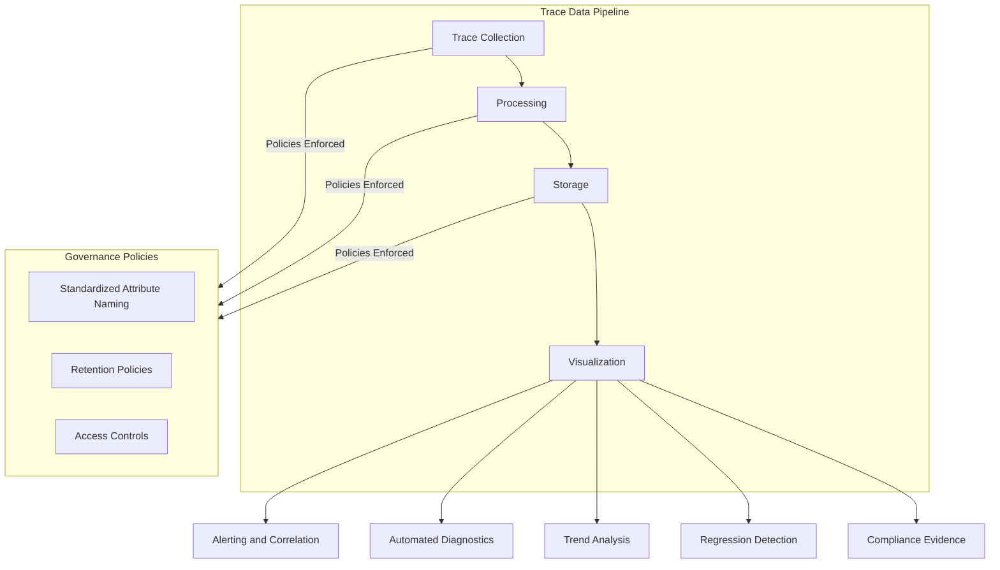

The diagram illustrates the centralized trace data pipeline and its integration with adjacent systems, while governance policies ensure standardization and compliance at each stage. This visual aid supports the discussion by providing a clear overview of how trace data flows through the pipeline and contributes to the bank's enterprise observability platform.

### Teaching Narrative

Tracing governance and integration transform isolated tracing implementations into comprehensive observability platforms essential for enterprise banking environments. Unlike smaller organizations where tracing can function as a standalone tool, financial institutions require sophisticated governance frameworks that position tracing within broader technology and data strategies. Effective banking implementations establish formal trace data governance—defining standards for mandatory and optional attributes, creating consistent naming conventions across business lines, establishing retention policies aligned with regulatory requirements, implementing data quality monitoring, and developing access control frameworks that balance troubleshooting needs with information security. This governance approach is complemented by systematic integration with adjacent systems: feeding trace insights into monitoring platforms for alert correlation, connecting with incident management systems for automated diagnostics, providing data to capacity planning tools for trend analysis, and supporting regulatory reporting systems with compliance evidence. For financial institutions operating in regulated environments with complex organizational structures, this governance and integration capability transforms tracing from a siloed technical initiative to an enterprise observability asset—creating a unified approach to system visibility that serves multiple stakeholders while maintaining the control and standardization required in banking environments.

### Common Example of the Problem

A multinational bank implemented distributed tracing across multiple business divisions without a comprehensive governance framework or integration strategy. Each division selected their own instrumentation approach, data storage configurations, and visualization tools based on team preferences and immediate needs rather than enterprise standards. While individual implementations showed technical success, the fragmentation created significant organizational challenges.

#### Key Issues and Impacts

| **Key Issue** | **Description** | **Impact** |
| ------------------------------------- | ---------------------------------------------------------------------------------------------------- | ------------------------------------------------------------------------------------------------ |
| **Inconsistent Naming Conventions** | Retail banking traces used different span naming patterns than capital markets. | Prevented correlation across business lines during incidents, delaying cross-system diagnostics. |
| **Mismatched Timestamps** | Different timestamp standards were used across divisions. | Made cross-division trace correlation impossible, creating gaps in incident timelines. |
| **Inconsistent Customer Identifiers** | Customer identifiers were formatted differently across systems. | Prevented cross-referencing affected systems during incidents, impacting root cause analysis. |
| **Integration Gaps** | Trace data couldn't be correlated with monitoring alerts or accessed by incident management systems. | Limited automated diagnostics, requiring manual intervention and slowing resolution times. |
| **Disconnected Trace Stores** | Regulatory reporting required manual extraction from multiple disconnected trace storage systems. | Increased operational overhead and compliance reporting inefficiencies. |

#### Example Incident Breakdown

During a major cross-division incident affecting both retail payments and trading systems:

- Operations teams struggled with **incompatible data formats** and **isolated visibility boundaries**.
- Trace data from retail banking and capital markets couldn’t be correlated due to **naming mismatches** and **timestamp discrepancies**.
- Manual correlation consumed nearly **40% of the resolution time**, as teams attempted to align data across disconnected systems.
- Regulatory reporting required time-intensive manual extraction due to **fragmented trace storage**, delaying compliance evidence submission.

#### Summary Diagram

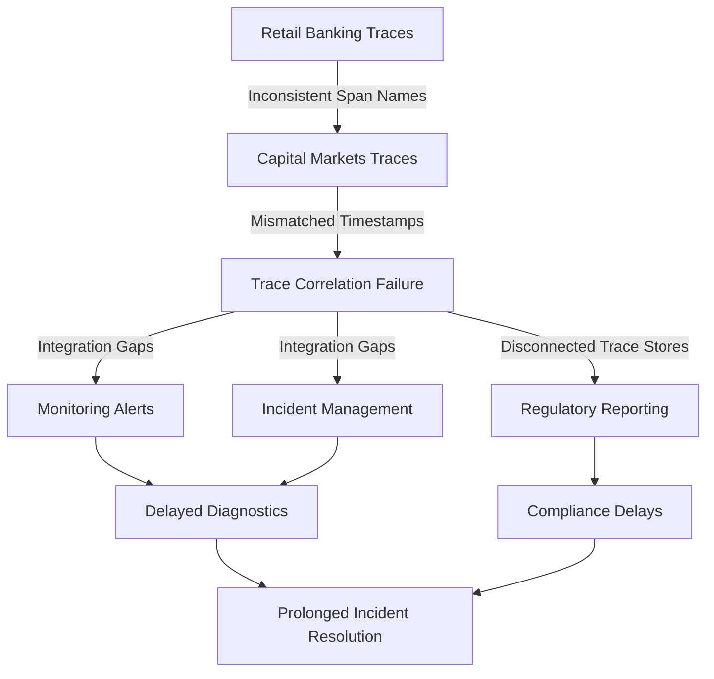

The siloed implementation approach ultimately undermined the potential value of distributed tracing. Despite substantial investment in multiple tracing systems, the bank failed to achieve unified visibility across business lines, automate cross-system correlation, or efficiently extract insights for operational and regulatory purposes.

### SRE Best Practice: Evidence-Based Investigation

Site Reliability Engineers implement tracing governance and integration through systematic standards development and ecosystem analysis. The investigation begins with observability interaction mapping—documenting all potential integration points between tracing and adjacent systems through evidence-based workflow analysis. This typically includes observing incident response processes to identify where teams manually correlate between systems, analyzing reporting workflows to understand how trace data supports business and regulatory reporting, and examining capacity planning processes to identify where trace-based insights would improve forecasting.

For each identified integration opportunity, SREs conduct data compatibility assessment—evaluating schema compatibility, identifier consistency, and temporal correlation capabilities between tracing and target systems. This evidence-based analysis identifies specific standardization requirements to enable automated data flow between observability components.

SREs implement verification through cross-system correlation testing—conducting controlled experiments with synthetic transactions that generate activity across multiple observability platforms, validating whether consistent identifiers and attributes enable automated correlation. These integration tests ensure that standardization efforts deliver actual cross-system visibility rather than theoretical compatibility.

To validate governance effectiveness, SREs conduct compliance verification—systematically documenting how trace data governance supports regulatory requirements through appropriate retention periods, access controls, privacy protection, and audit capabilities. This compliance mapping ensures governance frameworks address actual regulatory obligations rather than generic best practices.

Finally, SREs implement data quality monitoring—establishing automated verification of adherence to attribute standards, naming conventions, and mandatory context across all instrumented systems. These continuous checks provide early detection of governance drift before it creates significant integration barriers.

#### Evidence-Based Investigation Checklist

Use the following checklist to guide evidence-based investigation and ensure systematic implementation:

1. **Observability Interaction Mapping**

   - Document integration points between tracing and adjacent systems.
   - Observe incident response processes to identify manual correlations.
   - Analyze reporting workflows for trace data dependencies.
   - Review capacity planning processes for trace-based forecasting opportunities.

2. **Data Compatibility Assessment**

   - Evaluate schema compatibility between tracing and target systems.
   - Ensure identifier consistency across all integrated platforms.
   - Verify temporal correlation capabilities for accurate data alignment.

3. **Cross-System Correlation Testing**

   - Design synthetic transactions to generate trace events across platforms.
   - Validate automated correlation through consistent identifiers and attributes.
   - Confirm that integration efforts result in actionable cross-system visibility.

4. **Governance Compliance Verification**

   - Map trace data governance to regulatory requirements (e.g., retention, access control, privacy).
   - Document how governance policies address specific compliance mandates.
   - Verify audit capabilities for trace data usage and governance adherence.

5. **Data Quality Monitoring**

   - Automate checks for attribute standards and naming convention adherence.
   - Monitor mandatory context inclusion across all instrumented systems.
   - Implement alerts for early detection of governance drift or integration issues.

This checklist serves as a practical reference to ensure that evidence-based investigation is thorough, systematic, and aligned with organizational and regulatory requirements.

### Banking Impact

The business consequences of fragmented tracing governance and limited integration extend beyond technical challenges, directly influencing operational efficiency, regulatory compliance, and technology cost structures. The key impacts are summarized in the following table:

| **Impact Area** | **Metric** | **Fragmented Tracing Governance** | **Unified Tracing Governance** | **Example** |
| ----------------------------------- | ------------------------------------------------------------ | ------------------------------------------------------------------------------------------------------------------- | ---------------------------------------------------------------------------------------------------------------- | ------------------------------------------------------------------------------------------------------------------------ |
| **Incident Resolution Time** | 40-60% longer resolution time for cross-divisional incidents | Incidents require manual coordination across teams, increasing mean time to resolution (MTTR). | Consistent governance and integration enable automated diagnostics and faster root cause identification. | A customer-facing outage lasting 4 hours instead of 2 hours results in higher operational costs and reputational damage. |
| **Technology Cost Duplication** | 70-100% higher spend on observability infrastructure | Redundant tools and platforms for trace collection, storage, and visualization across divisions. | Centralized collection, processing, and visualization reduce duplication and optimize infrastructure costs. | Savings from consolidating multiple tracing tools into a single platform. |
| **Regulatory Reporting Efficiency** | 50-70% faster compliance reporting assembly | Manual extraction and harmonization of data from disconnected systems for regulatory inquiries. | Integrated trace governance provides standardized, easily accessible data for regulatory reporting. | Faster response to an audit request, reducing the need for dedicated compliance resources. |
| **Analytics Capability** | Competitive disadvantage from limited cross-product insights | Fragmented systems prevent holistic analytics, leaving customer friction points and reliability risks unidentified. | Unified observability enables advanced analytics across systems, channels, and products for actionable insights. | Identifying and resolving a bottleneck in a multi-channel payment system, improving customer satisfaction. |

By addressing these impacts, financial institutions can transform tracing from a siloed technical initiative into a powerful enterprise observability asset. This transformation not only enables operational and cost efficiencies but also supports regulatory readiness and enhances customer experience improvements through advanced analytics.

### Implementation Guidance

1. **Establish an Enterprise Observability Governance Framework**: Create a formal governance structure with representation from all major banking divisions, security, compliance, architecture, and operations teams. Develop comprehensive tracing standards including mandatory span attributes for customer context, transaction classification, and regulatory categorization; consistent naming conventions for services and operations; standardized error and status code taxonomies; and uniform timestamp formats and timezone handling to enable cross-system correlation.

2. **Implement a Centralized Observability Data Platform**: Deploy a unified data architecture for all observability signals including traces, logs, metrics, and events. Establish consistent data pipelines with appropriate privacy controls, compression capabilities, tiered storage based on access frequency, and unified query interfaces. Ensure this platform includes appropriate regionalization to satisfy data residency requirements while maintaining global query capabilities for multinational operations.

3. **Develop Standard Integration Patterns for Adjacent Systems**: Create standardized integration patterns and data exchange formats between tracing and critical adjacent systems: bidirectional correlation with monitoring platforms using consistent entity identifiers, automated evidence flow to incident management systems, structured performance data for capacity planning tools, and compliant data extraction for regulatory reporting systems. Implement these patterns through well-governed APIs rather than ad-hoc data access.

4. **Create Role-Based Access Control and Data Protection**: Implement comprehensive security controls for trace data including attribute-based access policies that restrict visibility based on data sensitivity, customer segment, regulatory category, and business domain. Develop specialized views for different user types—operational dashboards for support teams, journey analytics for product managers, performance views for developers, and compliance evidence for regulatory teams—each with appropriate data protection mechanisms. Below is an example role-based access control (RBAC) policy for trace data:

   ```json
   {
       "Version": "2023-10-01",
       "Statement": [
           {
               "Effect": "Allow",
               "Action": [
                   "trace:Read"
               ],
               "Resource": "arn:bank:trace-data:region:account-id:trace/*",
               "Condition": {
                   "StringEquals": {
                       "trace:Attribute:sensitivity": "low"
                   }
               }
           },
           {
               "Effect": "Deny",
               "Action": [
                   "trace:Read"
               ],
               "Resource": "arn:bank:trace-data:region:account-id:trace/*",
               "Condition": {
                   "StringEquals": {
                       "trace:Attribute:regulatoryCategory": "restricted"
                   }
               }
           },
           {
               "Effect": "Allow",
               "Action": [
                   "trace:Read",
                   "trace:Query"
               ],
               "Resource": "arn:bank:trace-data:region:account-id:trace/*",
               "Condition": {
                   "StringEqualsIfExists": {
                       "aws:RequestTag/Role": "OperationsTeam"
                   }
               }
           }
       ]
   }
   ```

5. **Establish Observability Data Lifecycle Management**: Develop comprehensive data management policies for trace data aligned with both operational needs and regulatory requirements. Implement tiered retention strategies with different periods for different data categories: full detail for recent operational data (30-90 days), aggregated patterns for intermediate history (3-12 months), and compliance-specific subsets for extended retention (7+ years) as required by banking regulations. Below is an example configuration for trace data retention:

   ```
   RetentionPolicy:
     - Category: "Operational"
       RetentionPeriod: "90 days"
       StorageTier: "Hot"
     - Category: "Aggregated"
       RetentionPeriod: "12 months"
       StorageTier: "Warm"
     - Category: "Compliance"
       RetentionPeriod: "7 years"
       StorageTier: "Cold"
   ```

   Ensure these policies include appropriate purging mechanisms, immutable storage for regulatory evidence, and lifecycle automation to maintain compliance without manual intervention.
