# Chapter 7: Sampling and Data Management for Financial Transactions

## Chapter Overview

Welcome to the dark art of data triage for financial systems—where your dreams of "tracing everything" get obliterated by the cold, hard physics of transaction volume and budget limits. In this chapter, we rip off the Band-Aid and admit what every SRE in banking already knows: you can’t store every span, and if you try, you’ll either blow your budget or kill your observability stack during your next Black Friday. Sampling isn’t a nice-to-have; it’s the difference between actionable insight and a self-inflicted outage. Get ready to cut through the wishful thinking and learn how to sample like a ruthless actuary, not a hopeful intern. We’ll cover how to keep your trace data statistically honest, business-aligned, and regulation-proof—without turning your observability platform into the next operational root cause. If you want to avoid million-dollar mistakes and regulatory migraines, read on.

______________________________________________________________________

## Learning Objectives

- **Diagnose** the hard limits of 100% trace collection in high-volume financial systems (and why naïveté here gets expensive fast).
- **Design** and **implement** multi-dimensional sampling strategies tuned for transaction criticality, business value, and regulatory risk.
- **Apply** adaptive and conditional sampling that reacts to live system conditions, not yesterday’s assumptions.
- **Validate** sampling accuracy with statistical rigor, not gut feel—ensuring your “representative” data actually is.
- **Detect and correct** sampling bias so your dashboards don’t lie to executives (or regulators).
- **Engineer** retention policies that keep both your SREs and compliance officers from having panic attacks.
- **Deploy** dynamic sampling controls that keep your observability platform from becoming a single point of failure.

______________________________________________________________________

## Key Takeaways

- Sampling isn’t a feature; it’s a shield against observability-induced outages (and CFO heart attacks). Ignore it, and your platform will eat itself alive.
- Uniform sampling is for amateurs and companies that enjoy missing million-dollar mistakes. Banks need transaction-aware, business-aligned, and risk-sensitive strategies.
- Adaptive sampling is your only hope during incidents; fixed-rate sampling will leave you staring at missing data while everyone else panics.
- Statistical validity isn’t optional. If your data isn’t representative, your capacity planning and SLAs are pure fiction—and you’ll find out the hard way.
- Sampling bias isn’t some academic nitpick; it’s the root of bad prioritization, resource misallocation, and regulatory fines. Stratify or suffer.
- Retention isn’t just about disk space. Screw up your retention tiers, and you’ll either pay millions in storage or millions in fines. Sometimes both.
- Dynamic controls on your tracing system are non-negotiable—otherwise, your observability stack will become your next major incident during a surge.
- Every minute spent on lazy or generic sampling is a minute closer to a board-level post-mortem. Invest in evidence-based, business-aware sampling if you value your weekends.
- Sampling isn’t “set and forget.” If you’re not revisiting your strategy regularly, you’re drifting into irrelevance—or regulatory trouble.
- In the real world, “trace everything” means “trace nothing when it matters.” Be smarter. Sample like your job depends on it—because in financial services, it does.

______________________________________________________________________

## Panel 1: The Volume Challenge - Why Banking Systems Need Sampling Strategies

### Scene Description

Imagine a bustling bank operations center, the nerve center of a complex financial ecosystem. Wall-mounted displays dominate the room, showcasing real-time transaction metrics in bright, dynamic charts and graphs. The numbers are staggering: peak periods reveal 15,000 payment transactions per second, 500,000 API calls per minute across digital channels, and 8 million trace spans generated every minute.

In the center of the room, a data engineering team is huddled around a large interactive dashboard. The dashboard reveals storage projections in bold, alarming figures: without sampling, the bank would need to store an unsustainable 50 terabytes of trace data daily.

To better illustrate the scale and context, consider this conceptual flow:

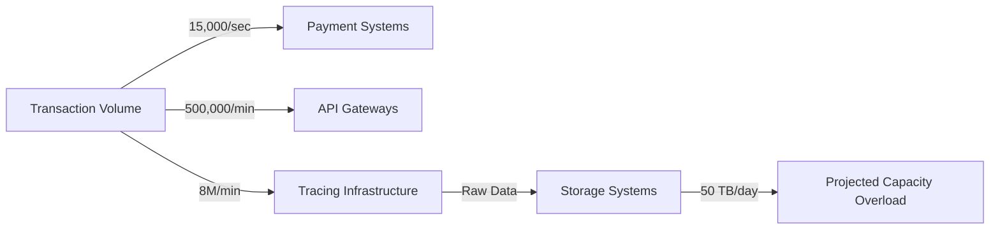

Amid this backdrop, an SRE stands at the front, addressing a group of engineers. The SRE explains how the sheer data volume makes capturing 100% of trace data infeasible—not just technically, but also financially. Even for a large financial institution, attempting to store and process such massive amounts of data would overwhelm the most advanced infrastructure, rendering the approach impractical. The discussion highlights the critical need for strategic sampling to enable effective observability while managing costs and system performance.

### Teaching Narrative

The sheer transaction volume in modern banking systems makes comprehensive trace collection impossible without strategic sampling. Unlike smaller systems where every transaction can be traced, financial institutions process millions to billions of transactions daily across payments, trading, account services, and digital banking channels. This scale creates a fundamental data management challenge—the complete trace data would overwhelm even the most sophisticated storage infrastructure while generating unnecessary cost for limited additional insight. The volume challenge transforms tracing from a simple "capture everything" approach to a strategic data science problem, requiring careful decisions about what to trace, when to trace, and how much detail to preserve. For banks operating mission-critical systems, sampling isn't an optional optimization but a foundational requirement that directly impacts the viability of the entire observability strategy. Effective sampling strategies must balance three competing objectives: maintaining sufficient data for troubleshooting, controlling infrastructure costs, and ensuring comprehensive coverage of critical transactions. This balancing act requires financial institutions to develop sophisticated approaches that go well beyond the basic sampling techniques used in smaller-scale environments, creating sampling strategies specifically designed for the extreme volumes characteristic of enterprise banking operations.

### Common Example of the Problem

A major retail bank implemented distributed tracing for their mobile banking platform without a well-designed sampling strategy. Their initial approach captured 100% of transactions during the development phase, which worked well with test volumes. However, when deployed to production, the system immediately faced critical issues. Below is a timeline illustrating the sequence of events that unfolded:

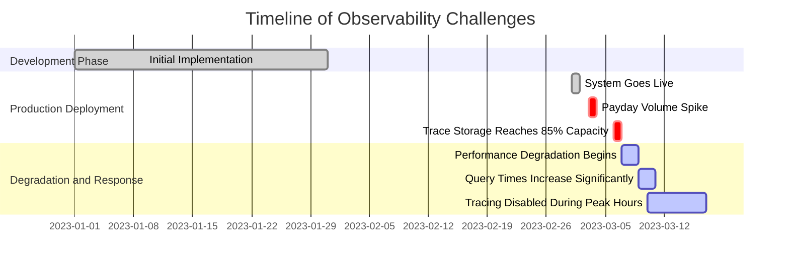

On a typical payday Friday, their mobile banking platform processed over 12 million login sessions, 8 million balance checks, and 4 million payment transactions within 24 hours. Each transaction generated an average of 35 spans, resulting in over 840 million spans daily. Within three days, their trace storage reached 85% capacity, triggering emergency alerts.

The observability platform began experiencing performance degradation as query times increased from milliseconds to several seconds and eventually minutes. By the end of the first week, the team had to temporarily disable tracing entirely during peak hours, undermining the very visibility they sought to create. What began as an observability initiative became a reliability problem itself, consuming engineering resources that should have been focused on actual customer-facing issues.

### SRE Best Practice: Evidence-Based Investigation

SRE teams must implement strategic sampling approaches based on quantitative analysis of actual transaction patterns rather than arbitrary percentage-based decisions. This requires first understanding the complete profile of your transaction landscape—identifying and classifying different transaction types, their relative frequencies, business importance, and technical complexity. Evidence-based sampling begins with a comprehensive measurement phase where trace volume is analyzed across multiple dimensions to inform sampling decisions.

The most effective approach combines multiple sampling strategies, summarized in the table below:

| **Sampling Strategy** | **Description** | **Use Case** |
| ----------------------- | ----------------------------------------------------------------------------------------------------- | ------------------------------------------------------------------------------------------------- |
| **Head-Based Sampling** | Decides at the transaction entry point, often by assigning a sampling probability upfront. | Useful for ensuring predictable sampling rates and capturing a consistent percentage of traffic. |
| **Tail-Based Sampling** | Evaluates transactions after completion, focusing on capturing anomalies or interesting cases. | Ideal for troubleshooting failures, errors, or outliers that may not be evident at entry points. |
| **Adaptive Sampling** | Dynamically adjusts sampling rates based on real-time system conditions and workload characteristics. | Effective for managing high-volume scenarios while maintaining flexibility during traffic spikes. |

#### Checklist for Evidence-Based Sampling Implementation:

1. **Transaction Profiling**:
   - Identify and classify transaction types.
   - Assess transaction frequency, importance, and complexity.
2. **Measurement Phase**:
   - Analyze trace volume across key dimensions (e.g., transaction type, error rates, latency).
   - Establish baseline metrics for sampling decisions.
3. **Initial Sampling Strategy**:
   - Begin with 5-10% general sampling as a default.
   - Apply 100% sampling for critical transaction types and error cases.
4. **Ongoing Refinement**:
   - Periodically compare sampled data against 100% capture tests to validate statistical accuracy.
   - Continuously evaluate the business utility of captured traces for incident resolution.
5. **Completeness Assessments**:
   - Regularly audit sampling strategies to detect blind spots or bias.
   - Adjust strategies to reflect evolving transaction patterns and operational priorities.

By following this evidence-driven approach, SRE teams can ensure that sampling decisions align with both technical constraints and business priorities. This creates the optimal balance between coverage and efficiency while maintaining operational effectiveness.

### Banking Impact

The business consequences of inadequate sampling strategies extend far beyond technical considerations, directly impacting operational expenses, revenue generation, and reputational integrity. Below is a case study table summarizing real-world scenarios where poor sampling strategies led to significant financial and operational impacts:

| **Impact Area** | **Scenario** | **Outcome** | **Key Lessons** |
| ----------------------- | -------------------------------------------------------------------------------------------------------------------- | ------------------------------------------------------------------------------------------------------------------ | ---------------------------------------------------------------------------------- |
| **Infrastructure Cost** | A mid-sized regional bank's unplanned observability storage grew from $50,000 to over $850,000 annually. | Emergency budget reallocation; strained IT budgets; reduced operational flexibility. | Sampling must cap storage growth to align with predictable cost baselines. |
| **Revenue Loss** | A wealth management platform's uniform sampling missed 80% of high-value trading anomalies during market volatility. | $2.4M in disputed transactions; 22% average reduction in portfolio allocations by affected clients. | Tiered sampling is critical for capturing anomalies in high-priority transactions. |
| **Reputational Damage** | Missed anomalies during critical trading events due to insufficient trace data for premier clients. | Loss of trust among high-value clients; long-term reduction in client investments. | Observability gaps during critical events can erode customer confidence. |
| **Strategic Viability** | Multiple institutions abandoned tracing initiatives after unsustainable costs and limited utility. | Wasted initial investment; critical visibility gaps during incidents; degraded customer experience during outages. | Sustainable sampling strategies are foundational to observability success. |

Poorly designed sampling strategies create dangerous visibility gaps during critical business events, precisely when monitoring is most valuable. For example, a wealth management platform suffered significant revenue loss when uniform sampling failed to capture key trading anomalies. The reputational damage extended beyond direct financial impact, with affected clients reducing their portfolio allocations in subsequent months.

Perhaps most significantly, inadequate sampling creates an unsustainable observability foundation, leading to the "observability retreat" pattern. This occurs when tracing initiatives are implemented without proper cost controls, leading to skyrocketing expenses, reduced collection efforts, and eventual deprecation of tracing capabilities. Such failures waste initial investments and leave critical visibility gaps that directly impact customer experience during incidents.

By aligning sampling strategies with business priorities, financial institutions can avoid these pitfalls, ensuring effective cost management, high-value anomaly detection, and comprehensive visibility during critical events.

### Implementation Guidance

To implement an effective sampling strategy for high-volume banking systems, follow these structured steps, supported by a flowchart for clarity:

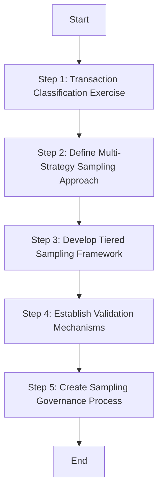

1. **Conduct a Transaction Classification Exercise**\
   Document all transaction types across your banking platforms, categorizing them by volume, business criticality, technical complexity, and customer impact. Develop a formal transaction taxonomy that assigns transactions to specific tiers (e.g., critical, high, medium, low) based on these characteristics. This ensures a structured foundation for differentiated sampling strategies, avoiding a one-size-fits-all approach.

2. **Define a Multi-Strategy Sampling Approach**\
   Combine three complementary sampling methods:

   - **Head-Based Sampling**: Use a uniform probability function at transaction entry points to control volume evenly.
   - **Tail-Based Sampling**: Retain all error cases and unusual patterns for qualitative analysis.
   - **Adaptive Sampling**: Dynamically adjust sampling rates during incidents or anomalous system behavior to capture more granular data when it matters most.

3. **Develop a Tiered Sampling Framework**\
   Apply differentiated sampling rates based on transaction type and business priorities:

   - **100% Sampling**: Critical operations like high-value transfers and securities trades.
   - **25-50% Sampling**: Important business transactions such as standard payments and account opening processes.
   - **5-10% Sampling**: Routine operations like balance checks and profile updates.\
     This framework balances comprehensive coverage of critical activities with controlled data volume for routine tasks.

4. **Establish Quantitative Validation Mechanisms**\
   Implement robust validation processes to ensure sampling effectiveness:

   - Perform weekly statistical comparisons between sampled data and periodic full-capture datasets.
   - Measure sampling bias across customer segments and transaction types to identify discrepancies.
   - Validate that sampled data reproduces patterns in the complete transaction population within acceptable error margins, ensuring statistical reliability.

5. **Create a Formal Sampling Governance Process**\
   Set up a governance framework with quarterly review cycles to evaluate the effectiveness of your sampling strategy:

   - Assess technical metrics such as storage efficiency, query performance, and statistical validity.
   - Evaluate business outcomes, including incident resolution acceleration and observability coverage for critical customer journeys.
   - Document sampling decisions and their rationale as formal architectural decisions, avoiding ad-hoc adjustments. This ensures transparency and alignment with organizational goals.

## Panel 2: Sampling Strategies for Transaction Criticality - The Financial Services Approach

### Scene Description

A collaborative workshop between business and technical teams at a financial institution. On a digital whiteboard, they've created a transaction criticality matrix categorizing different banking operations by business importance, risk level, and technical complexity. The matrix visually prioritizes transactions into three tiers:

```
+------------------------+---------------------+---------------------+
| Transaction Criticality| Example Operations | Sampling Strategy   |
+------------------------+---------------------+---------------------+
| High (Critical)        | - International    | 100% Trace Capture  |
|                        |   Wire Transfers   |                     |
|                        | - Securities Trades|                     |
|                        | - Large Loans      |                     |
+------------------------+---------------------+---------------------+
| Medium (Moderate)      | - Routine Payments | Intelligent Sampling|
|                        | - Account Inquiries| (Adaptive Rates)    |
+------------------------+---------------------+---------------------+
| Low (Basic)            | - Basic Info       | Minimal Sampling    |
|                        |   Requests         |                     |
|                        | - Scheduled Reports|                     |
+------------------------+---------------------+---------------------+
```

An SRE is demonstrating a dynamic sampling system that automatically adjusts sampling rates based on multiple dimensions, including transaction value, customer tier, and current system conditions. The system ensures that high-criticality transactions are always fully captured for observability, while medium- and low-criticality operations adjust sampling rates dynamically to balance resource usage and data collection needs.

### Teaching Narrative

Transaction criticality sampling transforms tracing from a technical commodity to a business-aligned capability in financial services. Unlike generic sampling strategies that treat all transactions equally, banks must implement criticality-based approaches that align sampling rates with business importance, regulatory requirements, and customer impact. This approach begins with a formal transaction classification exercise—typically categorizing operations into tiers based on multiple dimensions: monetary value, customer segment, regulatory sensitivity, brand impact, and technical complexity. High-criticality transactions like large-value payments, securities trades, or loan approvals receive preferential sampling treatment—often captured at 100% regardless of system load or volume. Medium-criticality transactions implement adaptive sampling rates based on current conditions, while low-criticality operations use minimal sampling primarily for statistical analysis. This nuanced approach ensures trace data reflects business priorities rather than random technical selection. For banking organizations where a single high-value transaction may represent greater financial importance than millions of routine operations, this criticality-based sampling strategy transforms observability from a technical infrastructure function to a strategic business capability—ensuring that the most important financial operations receive the highest observability investment regardless of their relative frequency in the overall transaction mix.

### Common Example of the Problem

A global investment bank implemented a basic uniform sampling strategy collecting 15% of all trading platform traces without differentiation. During a quarterly earnings period with heightened market volatility, their trading platform experienced intermittent issues affecting order execution. When investigating, the SRE team discovered a critical gap: their sampling approach captured plenty of routine informational queries, basic portfolio checks, and small retail orders, but had captured only 11 complete traces out of hundreds of large institutional block trades—the very transactions generating most of their revenue and experiencing the most significant issues.

The uniformly applied 15% rate meant they missed 85% of their most valuable transactions simply because these represented a small percentage of overall volume. The blind spot created by this sampling approach directly extended the incident resolution time from what should have been minutes to over four hours as teams struggled to reproduce and understand the issue patterns without representative trace data. The lost revenue from delayed trade executions during this extended resolution period exceeded $1.8 million, far outweighing any infrastructure savings from the simplified sampling approach. This event triggered a complete redesign of their sampling strategy to prioritize transaction value and business impact rather than treating all operations equally.

#### Summary of Missed Transactions and Consequences

| **Transaction Type** | **Criticality** | **Sampling Gap** | **Business Impact** |
| -------------------------------- | --------------- | ------------------------------------------------- | ----------------------------------------------------------------------------------- |
| Large Institutional Block Trades | High | Only 11 traces captured out of hundreds | Delayed issue resolution led to lost revenue of $1.8M during critical market period |
| Routine Informational Queries | Low | Over-sampled at 15% | Contributed negligible value to incident troubleshooting |
| Basic Portfolio Checks | Low | Over-sampled at 15% | Generated noise, adding no actionable insights |
| Small Retail Orders | Medium | Adequately sampled but less relevant during issue | Minor relevance to the root cause investigation |

This table illustrates the misalignment between transaction criticality and sampling strategy. High-value, high-criticality transactions were underrepresented, while low-value operations were over-sampled, leading to a significant gap in observability where it mattered most.

### SRE Best Practice: Evidence-Based Investigation

SRE teams must implement business-aligned sampling strategies that reflect the actual importance of different transaction types rather than their relative frequency. This requires a collaborative approach where technology and business teams work together to formally classify all transaction types based on multiple criticality dimensions, creating an explicit prioritization framework that guides sampling decisions. The classification should assess each transaction type across several key factors: direct revenue impact, customer experience significance, regulatory implications, recovery complexity, and reputational risk.

Effective implementation requires a tiered sampling approach with explicit policies for each transaction category:

- **Critical transactions** (typically 1-5% of volume but representing 50-80% of business value) should receive 100% sampling regardless of system conditions.
- **Important transactions** (perhaps 15-30% of volume) should receive variable sampling rates between 25-75% depending on system load and transaction attributes.
- **Standard transactions** (the bulk of volume) should receive uniform low sampling rates (5-15%) primarily for statistical representation rather than individual transaction analysis.

Additionally, attribute-based sampling rules should automatically elevate specific transactions based on characteristics such as:

- **Monetary value**: Automatically sample all transactions above predefined thresholds.
- **Customer tier**: Increase sampling rates for premier or high-priority client activity.
- **Anomalous patterns**: Elevate sampling for transactions exhibiting unusual characteristics or error conditions.

Sophisticated implementations can further enhance this strategy by employing machine learning to dynamically identify potentially valuable transactions based on historical patterns that proved most insightful during past investigations.

#### Checklist: Implementing Business-Aligned Sampling Strategies

To operationalize this approach effectively, follow this checklist:

1. **Establish Cross-Functional Collaboration**

   - Facilitate workshops with business and technical teams to define transaction criticality dimensions.
   - Agree on prioritization factors such as revenue impact, regulatory sensitivity, and customer experience importance.

2. **Develop a Transaction Classification Framework**

   - Categorize transactions into tiers (e.g., critical, important, standard) based on agreed dimensions.
   - Document the classification criteria and ensure alignment with business goals.

3. **Define Tiered Sampling Policies**

   - Set clear sampling rates for each transaction category (e.g., 100% for critical, variable for important, low for standard).
   - Include fallback policies for handling unforeseen transaction types.

4. **Implement Attribute-Based Sampling Rules**

   - Configure rules for monetary thresholds, customer tiers, and anomaly detection.
   - Regularly review and adjust rules to reflect evolving business priorities.

5. **Leverage Automation and Advanced Techniques**

   - Implement dynamic sampling systems that adjust rates based on real-time system conditions.
   - Integrate machine learning models to identify high-value transactions proactively.

6. **Monitor and Iterate**

   - Continuously evaluate the effectiveness of sampling strategies using key metrics (e.g., coverage of critical transactions, sampling accuracy).
   - Adjust policies and rules based on feedback from investigations and evolving business needs.

This structured approach ensures that sampling strategies remain aligned with business priorities, providing actionable observability for the most critical financial operations.

### Banking Impact

The business impact of poorly aligned sampling strategies extends beyond technical visibility to directly affect core banking operations and financial outcomes. From a revenue perspective, inadequate sampling of critical transactions creates dangerous blind spots precisely for the operations that generate the most value. A capital markets division of a major bank experienced this directly when their generic sampling approach failed to capture adequate traces for institutional client trading activity, extending mean time to resolution for a settlement issue by over 5 hours and resulting in $3.2M in compensatory payments to affected clients.

From a reputation standpoint, sampling that fails to prioritize high-visibility transactions can create disproportionate impact when issues affect premier customers. A private banking platform encountered this when their uniform sampling approach missed a pattern affecting wealth management clients making large transfers. While the issue affected only 0.2% of total transactions, it impacted 26% of their highest-net-worth clients, creating significant relationship damage measured by a 15-point decrease in Net Promoter Score among this crucial segment and an estimated $45M in reduced assets under management as clients diversified to other institutions.

The regulatory dimension adds another critical consideration unique to banking. When sampling fails to adequately capture transactions with compliance implications, banks face elevated regulatory risk. A financial institution discovered this when their sampling approach missed patterns in international transfers that should have triggered enhanced due diligence, resulting in incomplete suspicious activity detection and ultimately contributing to a $15M regulatory fine for inadequate transaction monitoring controls.

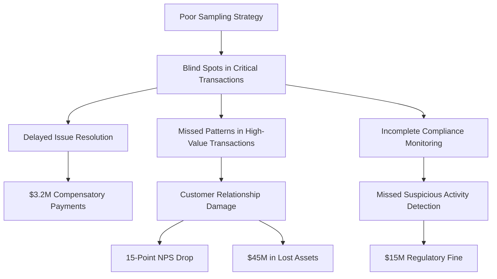

This cascading chain of impacts—from revenue loss, to reputational damage, to regulatory penalties—demonstrates how poor sampling strategies can undermine not only technical observability but also core business outcomes. By failing to align sampling with transaction criticality, financial institutions risk significant operational, financial, and compliance consequences in high-stakes environments.

### Implementation Guidance

1. Conduct a collaborative transaction classification workshop with representatives from technology, business, risk, and compliance teams. Create a formal criticality matrix scoring each transaction type on multiple dimensions: revenue impact (direct financial value), customer experience significance (visibility and satisfaction impact), regulatory importance (compliance requirements), recovery complexity (difficulty resolving issues), and reputational risk (potential brand damage).

2. Develop a tiered sampling framework based on this classification: Tier 1 (Critical) transactions receive 100% sampling regardless of system conditions; Tier 2 (Important) transactions implement adaptive sampling between 25-75% based on system load and transaction attributes; Tier 3 (Standard) transactions receive uniform sampling between 5-15% for statistical representation.

3. Implement attribute-based sampling rules that automatically elevate specific transactions based on characteristics regardless of their general category: monetary value thresholds that trigger increased sampling for high-value transactions, customer tier rules that boost sampling for premier client activity, and anomaly detection that increases sampling for transactions with unusual patterns or characteristics. Below is a pseudocode example for implementing such rules in a dynamic sampling system:

   ```python
   def determine_sampling_rate(transaction):
       # Define thresholds and rules
       high_value_threshold = 1000000  # Example: $1,000,000
       premier_customer_tiers = ["Gold", "Platinum"]
       anomaly_score_threshold = 0.8  # Example: High anomaly score

       # Default sampling rates
       sampling_rates = {
           "Tier 1": 1.0,  # 100% sampling
           "Tier 2": 0.25,  # 25% default for adaptive sampling
           "Tier 3": 0.05   # 5% default for statistical sampling
       }

       # Base rate from transaction tier
       base_rate = sampling_rates.get(transaction["tier"], 0.05)

       # Adjust sampling rate based on attributes
       if transaction["value"] > high_value_threshold:
           return 1.0  # Always sample high-value transactions
       if transaction["customer_tier"] in premier_customer_tiers:
           return max(base_rate, 0.75)  # Increase sampling for premier customers
       if transaction["anomaly_score"] > anomaly_score_threshold:
           return 1.0  # Always sample anomalous transactions

       # Return the adjusted rate
       return base_rate
   ```

4. Create explicit business-aligned metadata enrichment that automatically augments trace data with business context—transaction values, customer segments, product types, revenue attribution—enabling business-meaningful analysis even with partial sampling. Ensure this context propagates across all spans within a trace to maintain business visibility throughout the transaction journey. For example, include metadata such as:

   ```
   transaction.metadata = {
       "transaction_id": "12345",
       "value": 500000,
       "customer_tier": "Gold",
       "product_type": "Wire Transfer",
       "revenue_attribution": "High"
   }
   ```

5. Establish a formal sampling governance process that reviews and refines sampling strategies quarterly, including explicit assessment of business alignment metrics: comparing the distribution of business value against the distribution of sampled transactions, measuring visibility coverage for critical customer journeys, and validating that sampling accurately represents the actual transaction patterns that matter most to the business rather than just technical completeness.

## Panel 3: Conditional and Adaptive Sampling - Responding to Banking System States

### Scene Description

A monitoring center during a partial system degradation affecting a credit card processing platform. On the main screens, real-time dashboards show a sudden increase in transaction latency for payment authorizations. An automated system immediately adjusts sampling strategies across the platform—increasing sampling rates for the affected card transaction types from 10% to 100%, while simultaneously reducing sampling for unaffected transaction types to compensate for the additional data volume.

Below is a timeline representation of the process, illustrating how the adaptive sampling system responded to the anomaly:

```mermaid
gantt
    dateFormat  HH:mm:ss
    title Adaptive Sampling Response Timeline

    section Anomaly Detected
    Increase in latency observed :active, a1, 00:00:00, 5s
    Anomaly detection triggered  :a2, after a1, 5s

    section Sampling Adjustments
    Sampling rate increased for affected transactions (10% -> 100%) :active, s1, after a2, 10s
    Sampling rate reduced for unaffected transactions               :s2, after s1, 10s

    section Data Preservation
    Comprehensive trace data preserved for affected transactions :active, d1, after s2, 10s

    section Automated Incident Response
    System logs adjustments and maintains resource balance :active, r1, after d1, 5s
```

This timeline highlights the sequence of events: the anomaly detection, the adaptive sampling adjustments, and the automated preservation of diagnostic trace data—all occurring without administrator intervention. By visualizing the process, the reader can better understand the efficiency and responsiveness of conditional and adaptive sampling in managing system anomalies.

### Teaching Narrative

Conditional and adaptive sampling transforms trace collection from a static configuration to an intelligent, responsive capability essential for complex banking environments. Traditional sampling approaches using fixed rates become inadequate when system conditions change—particularly during incidents when detailed trace data becomes most valuable precisely when volumes may be highest. Effective financial services implementations employ dynamic sampling strategies that automatically adjust based on observed system conditions. These intelligent systems continuously monitor key indicators—error rates, latency patterns, unusual response codes, or business anomalies—and automatically increase sampling rates for transactions exhibiting problematic characteristics. Simultaneously, they may reduce sampling for healthy transaction types to manage overall data volume, effectively reallocating observability resources to where they provide maximum diagnostic value. This capability transforms incident response from reactive data collection to proactive evidence preservation—ensuring comprehensive trace data is automatically captured for problematic transactions before human operators even recognize an incident is occurring. For banking platforms where post-incident forensics are essential for both technical resolution and regulatory reporting, this adaptive sampling approach ensures critical diagnostic evidence is preserved from the earliest moments of an anomaly, rather than being lost to sampling limitations during the critical initial phase of an incident.

### Common Example of the Problem

A major retail bank implemented a standard fixed-rate sampling strategy for their credit card authorization platform, capturing a uniform 10% of all transaction traces regardless of system conditions. During the holiday shopping season, the platform experienced a subtle degradation affecting certain merchant category codes when transaction volumes reached peak levels. The initial symptoms were not severe enough to trigger standard alerts, but customer complaints began to increase as transactions were sporadically declined despite sufficient funds. When the operations team began investigating, they immediately faced a critical visibility gap: with only 10% of transactions being traced, they had captured just a handful of the problematic transactions—insufficient to identify the pattern. The team manually increased sampling rates to 100%, but this action came hours after the initial degradation began, meaning the most valuable diagnostic data from the onset of the issue had been permanently lost. The investigation ultimately took 7.5 hours to resolve a problem that should have required less than 30 minutes with proper trace data, resulting in approximately $4.2 million in lost transaction volume as customers switched to alternative payment methods.

To illustrate the key differences between fixed-rate sampling and adaptive sampling in such scenarios, the table below highlights their impact on resolution time, diagnostic data captured, and business outcomes during incidents:

| **Aspect** | **Fixed-Rate Sampling** | **Adaptive Sampling** |
| ---------------------- | ------------------------------------------------------------------------------------------ | ------------------------------------------------------------------------------------------------------------ |
| **Sampling Strategy** | Uniform 10% sampling, regardless of system conditions. | Dynamically adjusts sampling rates based on key indicators (e.g., latency, errors, anomalies). |
| **Initial Visibility** | Limited trace data for problematic transactions; insufficient for early pattern detection. | Comprehensive trace data for problematic transactions from the first signs of degradation. |
| **Response Time** | Manual intervention required to adjust sampling; delays diagnostic data collection. | Automatic adjustment preserves diagnostic data in real-time, eliminating visibility gaps. |
| **Resolution Time** | 7.5 hours due to delays in data collection and analysis. | Less than 30 minutes with critical trace data available immediately for investigation. |
| **Business Impact** | $4.2 million in lost transaction volume due to delayed resolution and customer switching. | Minimal business impact; rapid resolution prevents significant transaction loss or customer dissatisfaction. |

This comparison underscores how adaptive sampling not only enhances observability during critical incidents but also mitigates financial and reputational risks by enabling faster, more effective responses.

### SRE Best Practice: Evidence-Based Investigation

SRE teams must implement sophisticated adaptive sampling strategies that automatically respond to changing system conditions, moving beyond fixed sampling rates. This approach relies on continuous monitoring of critical system indicators—error rates, latency percentiles, throughput trends, and business metrics—combined with automated decision logic that dynamically adjusts sampling behavior based on observed conditions without requiring human intervention.

#### Checklist for Implementing Adaptive Sampling

1. **Baseline System Profiling**

   - Map normal behavior patterns across error rates, latencies, and business metrics.
   - Identify key operational dimensions to monitor (e.g., services, transaction types, customer segments).

2. **Anomaly Detection Logic**

   - Use multi-dimensional statistical analysis to detect subtle shifts in performance (e.g., percentiles, moving averages).
   - Avoid reliance on simple static thresholds; incorporate correlations and trends.
   - Example logic for anomaly detection:

   ```python
   import numpy as np

   def detect_anomaly(latencies, threshold=3):
       mean = np.mean(latencies)
       std_dev = np.std(latencies)
       anomalies = [lat for lat in latencies if abs(lat - mean) > threshold * std_dev]
       return anomalies

   # Example usage
   transaction_latencies = [200, 210, 195, 1000, 205, 198]
   detected_anomalies = detect_anomaly(transaction_latencies)
   print(f"Anomalies Detected: {detected_anomalies}")
   ```

3. **Dynamic Sampling Adjustments**

   - Trigger targeted sampling rate increases (e.g., from 10-20% to 100%) for transactions exhibiting anomalies.
   - Reduce sampling rates for unaffected transactions to balance data volume.
   - Ensure adjustments are fine-grained, targeting specific services or transaction types.

4. **Feedback Loop Integration**

   - Continuously validate that increased sampling captures valuable diagnostic data (not noise).
   - Automatically revert to baseline rates once anomalies resolve or are confirmed as false positives.

5. **Incident Simulation and Testing**

   - Regularly simulate production incidents to test the adaptive sampling system.
   - Verify responsiveness, accuracy of anomaly detection, and effectiveness of sampling adjustments.

#### Example Workflow: Adaptive Sampling Decision Flow

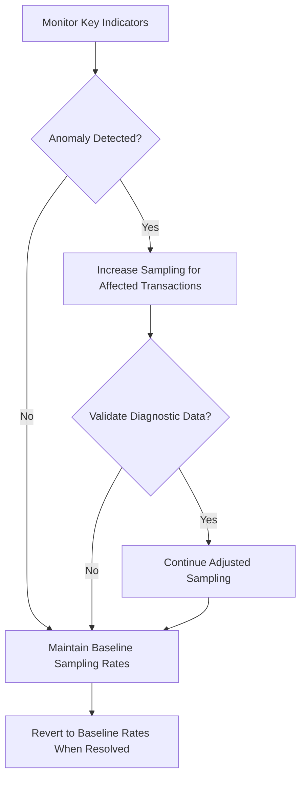

By following these best practices, SRE teams can ensure adaptive sampling systems are both effective and efficient, preserving critical diagnostic data during incidents while maintaining manageable observability overhead.

### Banking Impact

The business impact of inadequate adaptive sampling extends far beyond technical considerations, directly affecting critical financial, customer, regulatory, and technical outcomes during incidents. The following table outlines key dimensions of impact, along with illustrative examples:

| **Impact Dimension** | **Description** | **Example** |
| ------------------------- | ------------------------------------------------------------------------------------------------ | ------------------------------------------------------------------------------------------------------- |
| **Financial Impact** | Loss of revenue from extended incidents due to insufficient diagnostic data delaying resolution. | A payment processing division lost $3.7 million in transaction volume during a 4-hour outage. |
| **Customer Experience** | Declines in customer trust and satisfaction due to prolonged outages or degraded services. | A credit card issuer observed a 14-point drop in Net Promoter Score and an 8% increase in attrition. |
| **Regulatory Compliance** | Increased scrutiny or penalties from regulators for insufficient incident evidence or reporting. | A regional bank received a formal MRA after failing to document a degradation’s root cause. |
| **Technical Cost** | Additional engineering effort required to investigate incidents without adequate trace data. | A financial provider incurred 6.2 extra person-days on average per incident, costing $240,000 annually. |

#### Key Takeaways

- **Prolonged Resolution Times:** Inadequate sampling can delay incident resolution, leading to significant financial losses and customer dissatisfaction.
- **Customer Trust Impact:** Extended disruptions erode trust in financial services, driving customers to competitors.
- **Regulatory Risks:** Insufficient incident data can result in regulatory scrutiny, potentially damaging the institution’s reputation.
- **Operational Inefficiencies:** Longer investigations consume valuable engineering resources, inflating costs and diverting attention from proactive improvements.

This highlights the critical role adaptive sampling plays in mitigating these risks, enabling faster resolution, better customer retention, regulatory compliance, and optimized resource utilization.

### Implementation Guidance

To effectively implement conditional and adaptive sampling in a banking environment, follow the step-by-step process outlined below:

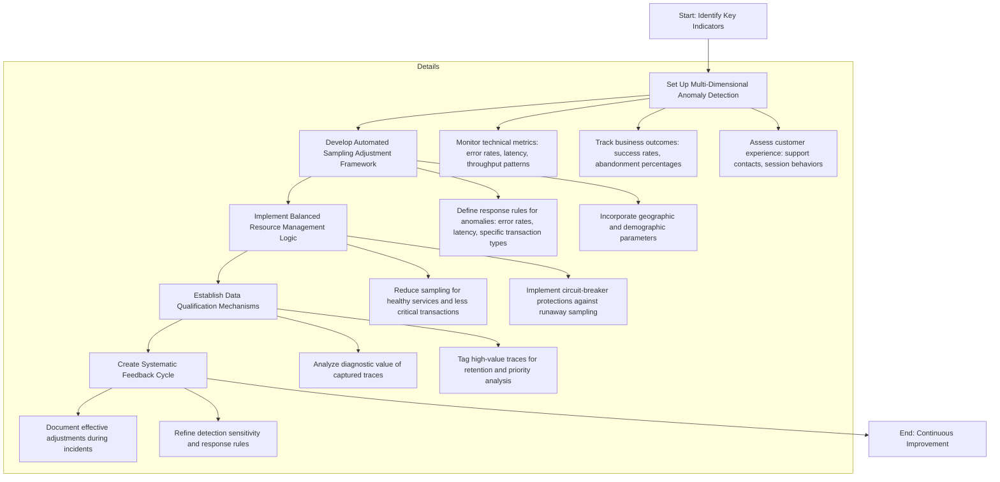

1. **Set Up Multi-Dimensional Anomaly Detection**\
   Configure a system to continuously monitor key indicators across three domains:

   - **Technical Metrics**: Error rates, latency percentiles, throughput patterns.
   - **Business Outcomes**: Transaction success rates, abandonment percentages.
   - **Customer Experience Indicators**: Unusual support contacts, session behaviors.\
     Ensure detection sensitivity is calibrated to identify subtle pattern changes before they escalate into major issues.

2. **Develop Automated Sampling Adjustment Framework**\
   Design a framework with explicit response rules for identified anomalies:

   - Increase sampling to 100% for services experiencing elevated error rates or latency.
   - Expand sampling for transaction types showing degraded success rates.
   - Boost sampling for specific customer segments with unusual experiences.\
     Include geographic and demographic parameters to precisely target affected populations.

3. **Implement Balanced Resource Management Logic**\
   Maintain overall system stability by dynamically managing resources:

   - Reduce sampling for healthy services and deprioritize non-critical transaction types during incidents.
   - Introduce circuit-breaker protections to prevent excessive sampling from overwhelming the observability platform during severe anomalies.

4. **Establish Data Qualification Mechanisms**\
   Automate the evaluation of captured data to maximize diagnostic value:

   - Ensure increased sampling is capturing relevant traces that correlate with observed issues.
   - Automatically tag high-value traces for prioritized retention and analysis.

5. **Create Systematic Feedback Cycle**\
   Build a continuous improvement loop to refine adaptive sampling effectiveness:

   - Document which sampling adjustments provided valuable insights during incidents.
   - Measure how adaptive sampling accelerated issue resolution.
   - Adjust detection sensitivity and response rules based on empirical data from real incidents.

This structured approach ensures that adaptive sampling systems are not only responsive but also continuously optimized to provide maximum diagnostic value in dynamic banking environments.

## Panel 4: Statistical Validity in Partial Sampling - Maintaining Financial Accuracy

### Scene Description

A data science team is collaborating with SRE engineers to validate sampling approaches. Their workstation displays several statistical models and visualizations that analyze sampling rates across various banking transaction types. Key metrics such as confidence intervals, error margins, and performance patterns are prominently showcased.

One chart emphasizes how a carefully designed 5% sampling strategy for retail banking transactions reproduces performance patterns almost identical to 100% sampling, with error margins consistently under 0.5%. Another visualization highlights the tailored sampling strategies optimized for different banking domains: higher sampling rates for high-variability trading operations and lower rates for predictable batch processes, all while maintaining statistical validity.

Below is a conceptual representation of the sampling strategy and confidence intervals:

```
+-----------------------------+----------------------------------+
| Transaction Type            | Sampling Rate  | Error Margin  |
+-----------------------------+----------------------------------+
| Retail Banking (Predictable)| 5%             | < 0.5%        |
| Trading Operations (Variable)| 30%           | < 1%          |
| Batch Processes             | 2%             | < 0.1%        |
+-----------------------------+----------------------------------+
```

This table is complemented by graphs on the workstation screen, which visually demonstrate how these sampling rates align with system performance metrics. For example, a line graph compares predicted vs. actual confidence intervals across transaction categories, affirming the reliability of the chosen sampling strategies. This combination of numerical data and visual analysis ensures the team can confidently validate and refine their partial sampling approach.

### Teaching Narrative

Statistical validity transforms sampling from a technical compromise to a mathematically sound approach for financial systems observability. When full trace capture isn't feasible due to volume constraints, banks must ensure their partial sampling still provides statistically valid insights about overall system behavior. This requires sophisticated approaches drawing from statistical science rather than arbitrary sampling rates.

Effective implementations begin with transaction profiling to understand the performance variation patterns for different banking operations. Some transaction types (like standardized payments) show consistent, predictable behavior requiring minimal sampling, while others (like trading operations affected by market volatility) exhibit high variability demanding more comprehensive capture. For each transaction category, statistical models determine the minimum sampling rates needed to maintain specific confidence intervals for key metrics like average latency, error percentages, and throughput patterns.

The table below provides examples of how sampling strategies can vary by transaction type, confidence level, and error margin, illustrating the application of statistically derived sampling rates:

| **Transaction Type** | **Sampling Rate** | **Confidence Level** | **Error Margin** |
| --------------------------- | ----------------- | -------------------- | ---------------- |
| Standardized Payments | 3% | 99% | ±0.2% |
| Retail Banking Transactions | 5% | 99% | ±0.5% |
| High-Variability Trading | 30% | 99% | ±1% |
| Predictable Batch Processes | 2% | 99% | ±0.1% |

These statistically derived rates replace common but arbitrary approaches like "sample 10% of all transactions" with mathematically sound strategies, ensuring that the observability data remains reliable for critical decisions. This scientifically grounded approach transforms sampling decisions from intuitive guesses to validated engineering choices, allowing banks to confidently rely on their data even when capturing only a fraction of total transactions.

### Common Example of the Problem

A regional bank implemented distributed tracing for its digital banking platform using a uniform 10% sampling rate across all transaction types, based on a commonly recommended industry practice rather than statistical analysis. When investigating a performance degradation affecting their mortgage application process, they faced unexpected challenges. The sampling approach that worked well for high-volume, consistent transactions like balance checks and routine payments proved entirely inadequate for mortgage applications. These complex, multi-step transactions exhibited high variability in processing times depending on application complexity, credit scoring requirements, and document verification steps.

Post-incident analysis revealed that their 10% sampling captured an unrepresentative subset that underrepresented complex cases and missed critical patterns. When they tested a full 100% trace capture for comparison, they discovered their sampled data had produced misleading conclusions: the average processing time from sampled data showed 4.2 minutes per application step, while the actual average was 6.8 minutes—a 38% error that led to significant underestimation of capacity requirements. This sampling inaccuracy directly contributed to capacity planning decisions that allocated insufficient resources for mortgage processing, ultimately resulting in slow response times during a seasonal application surge and an estimated $15 million in lost mortgage opportunity when customers abandoned the process. The incident highlighted how uniform sampling rates without statistical validation can create dangerously misleading data for variable transaction types, even when working adequately for more consistent operations.

#### Checklist: Lessons Learned from the Example

- **Avoid Uniform Sampling Across All Transaction Types**

  - Understand that different transaction types exhibit varying levels of variability and complexity.
  - Uniform sampling may perform well for predictable, high-volume transactions but fail for variable, multi-step processes.

- **Validate Sampling Strategies with Full-Capture Comparison**

  - Periodically compare sampled data with full trace captures to identify and correct inaccuracies in key metrics.
  - Use this validation to adjust sampling rates for statistically representative results.

- **Account for Transaction Variability During Sampling Design**

  - Profile transaction types to understand their performance characteristics (e.g., predictable vs. high-variability processes).
  - Adjust sampling rates based on variability, ensuring confidence intervals remain reliable across all transaction categories.

- **Quantify the Business Impact of Sampling Errors**

  - Consider how inaccuracies in sampled data can impact operational decisions, such as capacity planning or resource allocation.
  - Factor in the potential financial and reputational costs of misleading data caused by improper sampling.

By applying these lessons, engineering teams can design statistically valid sampling strategies that yield actionable and accurate insights, avoiding the costly consequences of unrepresentative data.

### SRE Best Practice: Evidence-Based Investigation

SRE teams must implement statistically valid sampling strategies based on mathematical principles rather than arbitrary percentage selections. This requires a scientifically grounded approach that treats sampling as a statistical problem requiring proper experimental design rather than a simple technical configuration. Teams should begin with a comprehensive characterization study that establishes variability profiles for different transaction types—measuring the standard deviation, distribution patterns, and outlier frequencies for key metrics like processing time, error rates, and resource utilization across diverse transaction categories.

For each transaction type, teams should determine the minimum required sample size using the following formula derived from statistical principles:

\[
n = \\left(\\frac{Z^2 \\cdot \\sigma^2}{E^2}\\right)
\]

Where:

- (n): Required sample size
- (Z): Z-score corresponding to the desired confidence level (e.g., 1.96 for 95%, 2.576 for 99%)
- (\\sigma): Standard deviation of the population (variance measure)
- (E): Acceptable margin of error for the metric being analyzed

#### Example Calculation:

For a retail banking transaction type where:

- (\\sigma = 0.8) (e.g., standard deviation of processing times in seconds)
- Desired confidence level = 95% ((Z = 1.96))
- Acceptable margin of error = (E = 0.1) seconds

The required sample size is calculated as:

\[
n = \\left(\\frac{1.96^2 \\cdot 0.8^2}{0.1^2}\\right) = \\left(\\frac{3.8416 \\cdot 0.64}{0.01}\\right) = 245.83 \\approx 246
\]

This means that to achieve 95% confidence with a margin of error of 0.1 seconds, at least 246 samples are needed.

These calculations should replace arbitrary sampling percentages with statistically determined rates that may vary dramatically between transaction types—perhaps as low as 1-2% for highly consistent operations but as high as 40-50% for highly variable transactions with wider performance distributions.

Effective implementation requires ongoing validation through periodic statistical comparison between sampled datasets and full-population captures. Teams should regularly conduct controlled experiments comparing metrics derived from their regular sampling approach against complete trace capture for defined time periods, measuring the actual observed error between sampled and full-population metrics. This validation should be documented with formal confidence intervals and error margins for key operational metrics, ensuring the organization understands the precise reliability of their observability data.

The most sophisticated approaches incorporate adaptive statistical techniques that automatically adjust sampling rates based on observed variance changes. For example:

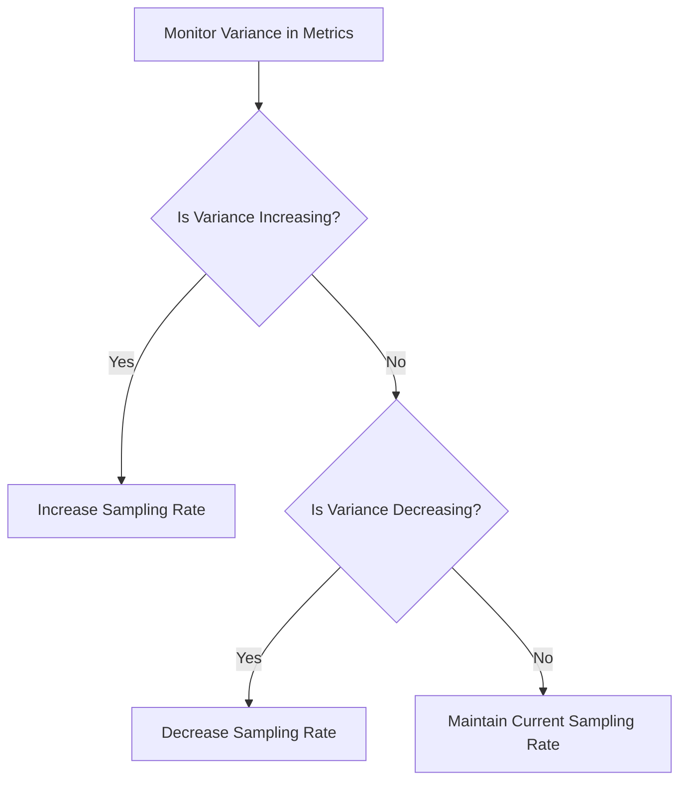

This adaptive method increases sample sizes when transaction performance becomes more variable (such as during market volatility for trading operations) and reduces sampling when behavior becomes more consistent, maintaining statistical validity regardless of changing system conditions.

### Banking Impact

The business consequences of statistically invalid sampling extend far beyond technical accuracy, directly impacting strategic decisions and operational outcomes. From a capacity planning perspective, invalid sampling creates dangerous misdirection in resource allocation. An investment banking division experienced this when their inadequate sampling of trading operations during market volatility periods produced latency measurements with a 45% error margin, leading to significant under-provisioning of infrastructure that subsequently failed during a high-volume trading day, resulting in approximately $4.2 million in lost trading revenue.

From a customer experience standpoint, inaccurate performance data leads to poorly calibrated service level objectives and misleading dashboards. A retail banking platform discovered this when their sampling approach consistently underrepresented mobile payment latency for complex transaction types, leading them to believe their customer experience was meeting targets when a significant subset of transactions was actually exceeding acceptable thresholds. This invisible degradation contributed to a 7-point reduction in mobile app satisfaction scores and measurable customer attrition before being discovered.

The risk management dimension adds another critical consideration unique to financial services. When sampling provides statistically unreliable data about error rates or processing exceptions, banks may significantly misunderstand their operational risk profile. A payment processing operation encountered this when their sampling approach dramatically underestimated the frequency of reconciliation exceptions by missing patterns in specific transaction categories, leading to inadequate control implementation that ultimately contributed to a $3.8 million reconciliation discrepancy that required regulatory disclosure.

Perhaps most significantly, unreliable sampling undermines confidence in the entire observability platform. When teams discover that their trace data produces inconsistent or misleading insights, they typically revert to traditional monitoring approaches despite the significant investment in distributed tracing capabilities, effectively abandoning the strategic advantages of transaction-centric observability due to concerns about data reliability.

### Implementation Guidance

To effectively implement statistically valid partial sampling for financial observability, follow these step-by-step instructions:

#### Step 1: Transaction Variability Analysis

- Conduct a comprehensive variability study for all transaction categories.
  - Measure key metrics: processing time, error rates, resource utilization.
  - Analyze statistical characteristics: standard deviation, percentile spreads, outlier frequencies.
  - Categorize transactions based on observed variability (e.g., high, medium, low).
- Document findings to identify transaction types requiring higher or lower sampling rates.

#### Step 2: Calculate Statistically Valid Sampling Rates

- Use statistical sample size formulas to determine sampling rates.
  - Inputs:
    - Observed variance for each transaction type.
    - Desired confidence level (e.g., 95% or 99%).
    - Acceptable error margin for operational metrics.
  - Outputs:
    - Minimum sample sizes and corresponding rates for each transaction type.
- Integrate these rates into your observability architecture with full transparency.

#### Step 3: Validation Through Full-Capture Comparisons

- Develop a validation framework to verify sampling accuracy:
  - Periodically (e.g., monthly) perform "full capture" experiments for selected transaction categories.
  - Statistically compare metrics (latency, errors, throughput) between sampled and full datasets.
  - Record confidence intervals and actual error margins for validation.

#### Step 4: Build Confidence-Enriched Dashboards

- Create specialized dashboards displaying:
  - Operational metrics derived from sampled data.
  - Visual indicators for statistical confidence intervals and error margins.
- Ensure stakeholders can quickly assess data reliability for decision-making.

#### Step 5: Implement Adaptive Statistical Sampling

- Develop algorithms for dynamic sampling adjustments:
  - Increase sampling rates when variability rises (e.g., peaks, degradation events).
  - Decrease sampling rates when variability stabilizes.
- Maintain consistent statistical validity while optimizing resource utilization.

#### Visual Summary of the Process

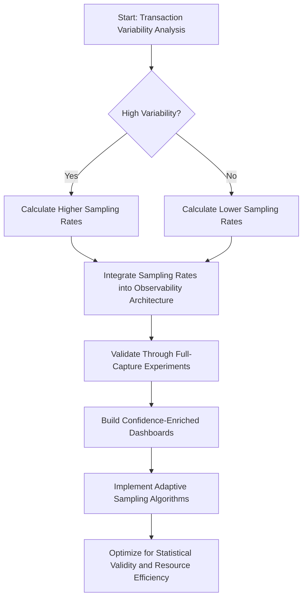

By following this structured process and leveraging adaptive, statistically valid sampling strategies, you can ensure reliable financial observability while minimizing resource costs.

## Panel 5: Sampling Bias Prevention - Ensuring Representative Trace Data

### Scene Description

A quality assurance review is underway, where data engineers and compliance analysts are collaboratively evaluating the representativeness of sampled trace data. On the visualization screens, side-by-side comparisons of transaction attribute distributions are displayed.

#### Example Comparison: Customer Segment Distribution

```
Full Population (Digital Banking Transactions)
| Segment A | ████████████████ 40% |
| Segment B | ████████████ 30%     |
| Segment C | ████████ 20%         |
| Segment D | ████ 10%             |

Sampled Subset (Traced Transactions)
| Segment A | ████████████████ 40% |
| Segment B | ████████████ 30%     |
| Segment C | ████████ 20%         |
| Segment D | ████ 10%             |
```

The first chart confirms proportional representation of customer segments between the full population and the sampled subset. Next, another visualization highlights geographic distribution of payment origins. A prior bias is illustrated, where international transactions were oversampled compared to domestic ones.

#### Example Comparison: Geographic Distribution (Before Bias Correction)

```
Full Population
| Domestic Transactions      | ██████████████████████ 80% |
| International Transactions | █████ 20%                 |

Sampled Subset
| Domestic Transactions      | ████████████████ 60%       |
| International Transactions | ████████████ 40%          |
```

A data scientist then demonstrates a new sampling algorithm tailored to prevent such biases. The algorithm applies stratified sampling techniques to ensure proportional representation across critical business dimensions, such as customer tiers, transaction values, geographic regions, and product types. These efforts collectively ensure that the trace data accurately reflects the true transaction mix, supporting valid insights and decisions.

### Teaching Narrative

Sampling bias prevention transforms trace data from potentially misleading subsets to truly representative views of banking system behavior. When implementing partial sampling, financial institutions face a significant risk: the sampled transactions may not accurately represent the overall transaction population, leading to incorrect conclusions about system performance or customer experience. This bias risk is particularly acute in banking, where transaction characteristics vary dramatically across customer segments, product types, and channels. Effective implementations employ sophisticated bias prevention techniques drawn from survey methodology and data science—ensuring the traced subset accurately mirrors the full transaction population across critical dimensions. This typically involves stratified sampling approaches that maintain proportional representation by customer tier, transaction value, geographic region, and product type. Without these bias prevention techniques, banks risk developing skewed perspectives on system behavior—potentially focusing engineering resources on issues affecting a small subset of customers while missing problems impacting the broader customer base. For regulatory reporting and internal performance measurement, this representativeness is essential to ensure conclusions drawn from sampled data remain valid for the entire transaction population. This capability transforms trace data from potentially misleading anecdotes to statistically sound evidence that accurately represents the true behavior of banking systems across their entire operational spectrum.

### Common Example of the Problem

A global bank implemented distributed tracing for their payment processing platform using a randomized sampling approach capturing 5% of all transactions. While this approach appeared mathematically sound, it unintentionally introduced significant sampling bias that distorted their observability data. The randomization algorithm operated independently at each service entry point without considering transaction attributes, creating a subtle but critical bias: high-value, multi-step transactions that traversed more services had a higher probability of being sampled at least once, while simpler transactions were systematically underrepresented. This created a skewed dataset that dramatically overrepresented complex transactions and premier customer activities.

When the bank used this data to prioritize performance optimizations, they inadvertently focused on improving journeys that primarily affected their premier banking clients while missing significant issues impacting their mass market customers. A subsequent analysis comparing their sampled data against complete transaction logs revealed the extent of the bias. The table below summarizes the disparity between customer base representation and trace data:

| Customer Segment | % of Total Customer Base | % of Trace Data Captured | Disparity (Trace % - Base %) |
| --------------------- | ------------------------ | ------------------------ | ---------------------------- |
| Premier Banking | 4% | 37% | +33% |
| Mass Market Customers | 68% | 23% | -45% |
| Other Segments | 28% | 40% | +12% |

This sampling bias directly contributed to declining satisfaction scores among their largest customer segment as their optimization efforts focused on journeys primarily used by a small premium subset. The reputational impact materialized in a measurable 4-point Net Promoter Score decline among mass market customers, representing an estimated $28 million in lifetime value impact through increased attrition.

The incident highlighted how seemingly minor sampling bias can create strategic misdirection with significant business consequences when observability data systematically misrepresents the actual customer experience.

### SRE Best Practice: Evidence-Based Investigation

SRE teams must implement sampling strategies specifically designed to prevent bias rather than assuming random selection will produce representative results. This requires systematic approaches drawn from survey methodology and data science that explicitly maintain the representativeness of sampled transactions across multiple business-critical dimensions. Teams should begin with a comprehensive analysis of their transaction population characteristics, identifying the key attributes that must be accurately represented in sampled data—typically including customer segments, transaction values, product types, channels, and geographic distribution.

Based on this analysis, teams should implement stratified sampling approaches that explicitly maintain proportional representation across these critical dimensions. Rather than simple random selection, stratified sampling first divides the transaction population into important subgroups (strata) and then samples from each group independently at rates that ensure the final dataset maintains the same proportional representation as the original population. This approach guarantees that important minority transaction types are neither over-represented nor under-represented in the resulting trace data.

Effective implementation requires continuous validation of sampling representativeness through statistical comparison between the distribution of key attributes in sampled data versus the complete transaction population. Teams should implement automated bias detection that regularly compares these distributions and alerts when sampled data begins to drift from true population characteristics, enabling prompt correction before bias affects operational decisions.

The most sophisticated approaches employ dynamic sample weighting that can mathematically compensate for unavoidable sampling skew. When certain transaction types are inherently more likely to be captured due to technical constraints, these approaches apply compensatory weights during analysis that mathematically restore accurate representation without requiring perfect sampling balance at collection time.

#### Checklist: Implementing Bias Prevention in Sampling

To assist SRE teams in operationalizing these principles, the following checklist provides a step-by-step guide for implementing bias prevention in trace data sampling:

1. **Transaction Population Analysis**

   - Identify key attributes required for representativeness (e.g., customer segments, transaction values, product types, channels, geographic regions).
   - Perform a baseline analysis to understand the distribution of these attributes in the full transaction population.

2. **Design Stratified Sampling Strategy**

   - Define strata based on the identified key attributes.
   - Determine sampling rates for each stratum to maintain proportional representation.

3. **Implement Sampling Mechanism**

   - Configure systems to sample transactions according to the defined stratified sampling strategy.
   - Validate that the implementation correctly adheres to the designed sampling rates.

4. **Continuous Validation and Monitoring**

   - Regularly compare the distribution of key attributes in sampled data against the full population.
   - Implement automated bias detection to alert on deviations or drift in representativeness.

5. **Employ Dynamic Sample Weighting (if needed)**

   - Analyze scenarios where certain transaction types are oversampled or undersampled due to technical constraints.
   - Apply compensatory weights during analysis to restore accurate representation of the population.

6. **Iterate and Refine**

   - Periodically revisit transaction population characteristics to adjust strata definitions or sampling rates as business needs evolve.
   - Incorporate feedback from operational metrics and compliance reviews to improve sampling strategies.

By following this checklist, SRE teams can ensure that sampled trace data remains representative of the full transaction population, enabling accurate, evidence-based system analysis and decision-making.

### Banking Impact

Sampling bias in trace data is akin to looking at your reflection in a funhouse mirror—what you see is distorted and unbalanced, leading to flawed interpretations. Just as a warped mirror might exaggerate certain features while minimizing others, biased sampling skews the representation of the transaction population, creating ripple effects with tangible business consequences.

From a product development perspective, biased trace data misguides engineering priorities by focusing on a misrepresented subset of customer behaviors. For example, a digital banking platform found that their sampling approach overrepresented complex mobile banking journeys favored by younger, tech-savvy users, while underrepresenting simpler transactions preferred by a larger, mature customer base. This distortion led to a disproportionate focus on advanced features for a minority segment, neglecting the stability and usability improvements crucial to their core customer group—much like renovating a single room in a house while ignoring structural issues affecting the entire foundation.

From a performance optimization standpoint, biased sampling drives improvements toward atypical transaction patterns, leaving critical gaps in system performance. A payment processor, for instance, discovered their sampling overrepresented high-value transactions, prompting them to optimize processing paths primarily used by corporate clients. Meanwhile, latency issues impacting high-volume consumer payments—the backbone of their business—went undetected. This misalignment eroded competitive performance in their largest market segment, similar to tuning a car for rare, high-speed racing conditions while ignoring everyday fuel efficiency.

Equity and fairness present yet another critical dimension. When certain customer groups or regions are underrepresented in trace data, banks risk overlooking performance or reliability issues disproportionately affecting specific communities. A regional bank, for example, unintentionally masked reliability issues impacting underserved areas due to sampling that systematically underrepresented transactions from those regions. This oversight not only created potential regulatory concerns about equitable service delivery but also undermined the bank’s commitment to inclusivity—like designing a public service based on feedback from only a select demographic, while ignoring the needs of others.

Ultimately, biased sampling undermines the foundation of data-driven decision making by presenting a distorted view of system behavior. Decisions based on such flawed data, while seemingly empirical, lead to incorrect conclusions and misaligned priorities. Just as you wouldn't rely on a funhouse mirror to assess your appearance, banks cannot rely on biased trace data to form a true understanding of their systems, customers, or market dynamics.

### Implementation Guidance

1. Conduct a comprehensive transaction characterization analysis that identifies the critical dimensions requiring proportional representation in your trace data. Document key attribute distributions across your transaction population, including customer segments, transaction values, product types, channels, geographic regions, and any other business-meaningful categorizations that influence decision-making. Establish these distributions as your baseline representation targets.

2. Implement stratified sampling mechanisms that explicitly maintain proportional representation across these critical dimensions. Design your sampling approach to first classify incoming transactions into important subgroups based on key attributes, then apply independent sampling within each group at rates that ensure the resulting dataset maintains the same proportional distribution as your overall transaction population. Below is a pseudocode example for implementing stratified sampling:

   ```python
   import pandas as pd
   from sklearn.utils import resample

   # Load transaction data into a DataFrame
   df = pd.read_csv("transaction_data.csv")

   # Define critical dimensions for stratification
   critical_dimensions = ['customer_segment', 'geographic_region', 'product_type']

   # Calculate strata sizes based on population proportions
   strata_proportions = df[critical_dimensions].value_counts(normalize=True)

   # Initialize an empty DataFrame for sampled data
   sampled_data = pd.DataFrame()

   # Perform stratified sampling for each subgroup
   for strata, proportion in strata_proportions.items():
       strata_data = df[df[critical_dimensions] == strata]
       sample_size = int(len(df) * proportion)
       sampled_strata = resample(strata_data, replace=False, n_samples=sample_size, random_state=42)
       sampled_data = pd.concat([sampled_data, sampled_strata])

   # Result: sampled_data matches the population's proportional distribution
   ```

3. Develop automated sampling bias detection that continuously validates representativeness. Create a monitoring system that regularly compares the distribution of key attributes in your sampled data against the actual transaction population (derived from logs or metadata that's collected for all transactions). Below is a pseudocode snippet for a basic bias detection mechanism:

   ```python
   import numpy as np

   # Function to calculate distribution similarity using Chi-Square test
   def detect_bias(sampled_distribution, population_distribution, threshold=0.05):
       from scipy.stats import chisquare
       chi_stat, p_value = chisquare(f_obs=sampled_distribution, f_exp=population_distribution)
       return p_value >= threshold  # True if within acceptable variance

   # Example usage
   sampled_distribution = sampled_data['customer_segment'].value_counts(normalize=True)
   population_distribution = df['customer_segment'].value_counts(normalize=True)

   if not detect_bias(sampled_distribution, population_distribution):
       print("Bias detected: Adjust sampling rates!")
   ```

4. Create bias-aware analysis tools that incorporate distribution knowledge into reporting and dashboards. Design your observability interfaces to explicitly display the actual distribution of key attributes within the analyzed dataset compared to the known population distribution, ensuring users understand when they're working with data that may over-represent or under-represent certain transaction types. For example:

   ```
   +-------------------+----------------------+------------------+
   | Attribute         | Population (%)       | Sampled Data (%) |
   +-------------------+----------------------+------------------+
   | Customer Segment A| 40.0                 | 38.5             |
   | Customer Segment B| 35.0                 | 36.0             |
   | Customer Segment C| 25.0                 | 25.5             |
   +-------------------+----------------------+------------------+
   ```

5. Establish a formal sampling bias review process conducted monthly that systematically examines your trace data for potential skew across all critical business dimensions. Document any identified bias patterns and their potential impact on decision-making, and implement corrective adjustments to sampling algorithms based on these findings rather than assuming initial sampling designs will remain representative as transaction patterns evolve. Use a simple flowchart to formalize the review process:

   ```mermaid
   graph TD
       A[Start Monthly Review] --> B[Analyze Key Attribute Distributions]
       B --> C{Distributions Match Population?}
       C -->|Yes| D[Document Findings & Continue Monitoring]
       C -->|No| E[Adjust Sampling Algorithms]
       E --> F[Validate Adjustments]
       F --> B
   ```

## Panel 6: Retention Strategies - Balancing Operational and Regulatory Requirements

### Scene Description

A governance meeting is in progress with representatives from technology, compliance, legal, and business operations teams. The main screen displays a comprehensive trace data lifecycle management framework, detailing a tiered retention strategy tailored to transaction and data types. The retention tiers are visually represented as a timeline, emphasizing how trace data evolves over time:

```
Full Detail (30 days) --> Summarized (90 days) --> Aggregates (1 year) --> Compliance Spans (7 years)
```

- **30 Days**: Full trace detail is retained for operational troubleshooting, ensuring granular visibility into recent transactions.
- **90 Days**: Key trace data is summarized for performance trending, with reduced granularity but sufficient insights for identifying patterns.
- **1 Year**: Statistical aggregates are preserved to support capacity planning and long-term forecasting.
- **7 Years**: Minimal compliance-related spans are retained, containing only essential elements required for regulatory purposes, such as transaction identifiers and compliance-specific metadata.

Below the timeline, a compliance officer is reviewing how these retention policies align with financial regulations across different jurisdictions. Simultaneously, an SRE is explaining the automated processes that transform and compress data as it transitions through the retention tiers, ensuring efficiency and alignment with both operational and regulatory needs. The visual framework highlights the progressive reduction in data volume and granularity, balancing the competing demands of operational troubleshooting, infrastructure cost management, and regulatory compliance.

### Teaching Narrative

Retention strategy transforms trace data management from a simple storage problem to a sophisticated governance capability in regulated financial environments. Unlike many industries where trace data has purely operational value, banking traces contain information subject to complex regulatory requirements—including Anti-Money Laundering monitoring, payment regulation, securities trading oversight, and consumer protection rules. These regulations create competing objectives: operational needs favor short retention of detailed data, while compliance may require years of selective retention for specific transaction attributes. Effective banking implementations address this challenge through tiered retention strategies that systematically transform trace data as it ages—preserving different elements for different durations based on their operational and regulatory value. Fresh data is retained with full detail for operational troubleshooting, then progressively aggregated, summarized, compressed, and filtered as it ages, with only the regulatory-required elements preserved for extended periods. This capability often requires specialized architectural approaches like "compliance-first instrumentation" that clearly separates operational detail from regulatory elements, enabling selective long-term retention of only the legally required components. This sophisticated approach transforms trace retention from a binary "keep or delete" decision to a progressive data lifecycle aligned with the complex requirements of financial services—balancing operational value, infrastructure costs, and regulatory obligations through the entire trace data lifespan.

### Common Example of the Problem

A multinational bank implemented distributed tracing for their cross-border payment platform without a well-designed retention strategy. Their initial approach followed standard industry practice: preserving 30 days of detailed trace data for operational troubleshooting. This worked well for day-to-day engineering needs but created a serious compliance gap that became apparent during a regulatory examination. Regulators requested evidence of specific international transfers processed nine months earlier as part of an anti-money laundering investigation. While the bank maintained transaction records in their core banking system, they could not provide the detailed processing evidence showing exactly how these payments were screened, verified, and processed across their microservices architecture.

The trace data containing this evidence had been deleted after 30 days, creating a significant regulatory issue. The bank could prove the transactions occurred but couldn't demonstrate that appropriate compliance controls were properly executed—a critical requirement under financial crime regulations. This retention gap resulted in a formal regulatory finding, restrictions on certain transaction types until the issue was remediated, and ultimately a $2.8 million fine for inadequate transaction monitoring evidence. The incident triggered an emergency compliance project requiring $4.5 million in unplanned expenses to implement a specialized archival system for compliance-related trace data. This situation highlighted how retention strategies designed solely around operational needs create serious regulatory exposure in financial services, where trace data often serves as critical compliance evidence long after its operational troubleshooting value has expired.

______________________________________________________________________

#### Key Takeaways and Preventive Measures

- **Balance Retention Goals:** Design retention strategies that address both operational troubleshooting needs and long-term regulatory requirements. Avoid focusing solely on short-term engineering priorities.
- **Conduct Compliance Mapping:** Regularly review retention policies against applicable regulations (e.g., anti-money laundering, payment processing, and securities oversight) to ensure trace data aligns with jurisdictional requirements.
- **Implement Tiered Retention:** Use a tiered approach to progressively summarize, aggregate, and archive trace data, ensuring compliance-critical information is preserved for mandated periods while reducing storage costs for less valuable data.
- **Perform Risk Assessments:** Identify potential gaps in trace data retention that could result in regulatory non-compliance. Simulate regulatory scenarios to verify that evidence can be produced for long-term investigations.
- **Invest in Compliance-First Instrumentation:** Architect systems to separate operational trace details from compliance-critical data, enabling selective archival of legally required elements without retaining unnecessary information.
- **Establish Monitoring and Auditing:** Continuously monitor trace retention systems and conduct periodic audits to verify compliance with both operational and regulatory policies.
- **Plan for Scalability:** Ensure retention systems can scale with data growth and evolving regulatory demands, reducing the risk of emergency projects and unplanned expenses.

By adopting these measures, organizations can proactively address retention challenges and avoid costly compliance failures.

### SRE Best Practice: Evidence-Based Investigation

SRE teams in regulated financial environments must adopt advanced multi-tier retention strategies to address the often conflicting needs of operational troubleshooting, performance optimization, and regulatory compliance. Achieving this requires close collaboration across technology, compliance, legal, and business teams to align on data requirements and jurisdiction-specific obligations. The following structured best practices outline key steps for implementing evidence-based investigation and retention strategies:

#### 1. Formal Data Classification Exercise

- **Objective**: Categorize trace data elements based on their retention requirements and purpose.
- **Key Categories**:
  - **Operational Troubleshooting Value**: Data needed for short-term issue resolution.
  - **Performance Trending Utility**: Summarized data for identifying long-term performance patterns.
  - **Capacity Planning Relevance**: Aggregated data used for forecasting infrastructure needs.
  - **Regulatory Compliance Obligations**: Specific transaction attributes required for legal retention.

#### 2. Tiered Retention Policy Design

| Retention Period | Data Treatment | Purpose |
| ---------------- | ----------------------------- | ---------------------------------------------------------------- |
| **15-60 Days** | Full-Fidelity Retention | Preserve complete trace detail for operational troubleshooting. |
| **90 Days** | Summarization | Reduce detail while maintaining performance patterns. |
| **1 Year** | Aggregation | Retain statistical aggregates for capacity planning. |
| **7+ Years** | Regulatory Element Extraction | Preserve only compliance-relevant spans for long-term retention. |

#### 3. Specialized Technical Approaches

- **Compliance-First Instrumentation**:

  - Explicitly separate regulatory evidence from operational detail at the point of collection.
  - Tag spans for compliance checkpoints, verification activities, and regulatory decisions with appropriate metadata.
  - Enable selective long-term retention of legally required elements without storing complete traces.

- **Retention by Transformation**:

  - Implement progressive data transformations as traces age:
    - **Summarization**: Reduce granularity while retaining operational insights.
    - **Aggregation**: Combine data into statistical forms for capacity planning.
    - **Selective Extraction**: Isolate and retain only regulatory elements for compliance.
  - Avoid binary "keep or delete" approaches by evolving data structures to balance value and costs.

#### 4. Cross-Functional Collaboration

| Stakeholder Group | Role in Retention Strategy |
| -------------------- | ---------------------------------------------------------------- |
| **Technology Teams** | Implement instrumentation, tiered policies, and transformations. |
| **Compliance Teams** | Define jurisdiction-specific regulatory retention requirements. |
| **Legal Teams** | Ensure alignment with financial regulations and audit needs. |
| **Business Teams** | Identify operational and business-critical data requirements. |

By adopting these structured practices, SRE teams can create a robust retention framework that balances operational, business, and regulatory needs. This evidence-based approach ensures data is managed efficiently throughout its lifecycle, preserving its value while minimizing storage and compliance overhead.

### Banking Impact

The business consequences of inadequate retention strategies extend far beyond technical storage concerns, creating significant operational, financial, and regulatory risks. Below is a summarized view of the multi-dimensional impacts that effective or ineffective trace data retention strategies can have on banking organizations:

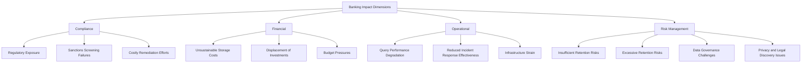

#### Key Examples and Insights

**Compliance Perspective**\
Insufficient retention of transaction evidence creates direct regulatory exposure. A global payment processor experienced this when their limited trace retention prevented them from providing detailed evidence of sanctions screening processes during a regulatory examination. This resulted in a formal Matter Requiring Attention (MRA) that restricted business growth until remediated, alongside over $5 million in emergency compliance investments.

**Financial Perspective**\
Excessive retention without appropriate transformation creates unsustainable cost scaling. A regional bank discovered this issue when their simplistic "retain everything" approach to trace data caused storage costs to grow from approximately $250,000 annually to over $3.8 million within three years as transaction volumes increased. This forced emergency budget reallocations, displacing planned investments in customer experience improvements.

**Operational Perspective**\
Excessive historical data accumulation can severely impact query performance and system manageability. One financial institution encountered this when their growing trace storage, without adequate data transformation, led to query times increasing from seconds to minutes for common investigations. This dramatically reduced the effectiveness of their observability platform for incident response, despite significant infrastructure investments.

**Risk Management Perspective**\
Retention that is either too short or too long creates distinct but equally significant risks. Insufficient retention leaves organizations unable to investigate patterns or demonstrate compliance, while excessive retention introduces unnecessary data governance challenges, potential privacy violations, and expanded scope during legal discovery. Financial institutions must adopt sophisticated strategies to balance these competing risk factors rather than relying on simplistic approaches that optimize for a single dimension.

### Implementation Guidance

#### Step-by-Step Workflow for Retention Strategy Implementation

Below is a step-by-step workflow to guide the implementation of a tiered retention strategy, visualized as a progressive data lifecycle. Each step aligns with the operational and regulatory objectives discussed in the teaching narrative.

```mermaid
flowchart TD
    A[Data Classification Workshop] --> B[Retention Tier Design]
    B --> C[Data Pipeline Configuration]
    C --> D[Data Transformation Rules]
    D --> E[Compliance-First Instrumentation]
    E --> F[Retention Governance Process]

    subgraph Step1[Step 1: Data Classification Workshop]
        A1[Gather Cross-Functional Team] --> A2[Map Trace Data Elements]
        A2 --> A3[Define Retention Specifications]
    end

    subgraph Step2[Step 2: Retention Tier Design]
        B1[Identify Retention Tiers] --> B2[Define Data Treatment Rules]
        B2 --> B3[Align Tiers to Objectives]
    end

    subgraph Step3[Step 3: Data Pipeline Configuration]
        C1[Build Multi-Tier Architecture] --> C2[Implement Storage Layers]
        C2 --> C3[Ensure Pipeline Scalability]
    end

    subgraph Step4[Step 4: Data Transformation Rules]
        D1[Develop Summarization Algorithms] --> D2[Create Extraction Processes]
        D2 --> D3[Design Aggregation Methods]
    end

    subgraph Step5[Step 5: Compliance-First Instrumentation]
        E1[Extend Instrumentation Framework] --> E2[Tag Compliance Checkpoints]
        E2 --> E3[Enable Selective Extraction]
    end

    subgraph Step6[Step 6: Retention Governance Process]
        F1[Define Retention Metrics] --> F2[Monitor Effectiveness Quarterly]
        F2 --> F3[Refine Policies Continuously]
    end
```

#### Detailed Steps

1. **Conduct a Data Classification Workshop**

   - Assemble representatives from technology, compliance, legal, and business teams.
   - Map trace data elements to retention requirements across dimensions such as:
     - Operational troubleshooting value (15-60 days).
     - Performance trending utility (60-180 days).
     - Capacity planning relevance (6-18 months).
     - Regulatory compliance obligations (1-7 years).
   - Document these as formal retention specifications to ensure clarity and enforceability.

2. **Design a Multi-Tier Retention Architecture**

   - Define distinct retention tiers, such as:
     - **Full-Fidelity Short-Term Storage**: All spans with complete detail.
     - **Intermediate Operational Storage**: Reduced detail while maintaining structure.
     - **Long-Term Analytical Storage**: Statistical aggregates and patterns.
     - **Compliance Archival**: Extracted regulatory elements with chain-of-custody protection.
   - Align these tiers with specific operational and regulatory objectives.

3. **Configure the Data Pipeline**

   - Implement a scalable, multi-tier data pipeline that supports different storage layers.
   - Ensure the pipeline can handle data transformations and automated movement between tiers.
   - Test pipeline performance to verify it meets operational and compliance demands.

4. **Develop Intelligent Data Transformation Rules**

   - Create summarization algorithms to preserve performance patterns while reducing detail.
   - Develop extraction processes to isolate regulatory elements for compliance retention.
   - Use aggregation methods to maintain statistical utility while minimizing storage costs.

5. **Adopt Compliance-First Instrumentation**

   - Extend your instrumentation framework to tag spans representing:
     - Compliance checkpoints.
     - Verification activities.
     - Regulatory decisions.
   - Enable selective long-term retention of regulatory elements without storing entire traces.

6. **Establish a Retention Governance Process**

   - Define metrics to measure retention effectiveness, including:
     - Compliance coverage for regulations.
     - Query performance across retention tiers.
     - Cost efficiency of storage utilization.
     - Evidence availability for investigations.
   - Conduct quarterly reviews to balance operational, financial, and regulatory requirements.
   - Continuously refine retention policies based on metrics and evolving needs.

## Panel 7: Sampling as a Dynamic Control - Operational Management of Trace Systems

### Scene Description

A capacity planning meeting for a bank's observability platform during the launch of a major new mobile banking feature. On the main screen, resource utilization charts highlight the current tracing infrastructure at 65% capacity, with projections indicating the new feature could potentially push it beyond operational limits during peak periods.

The SRE is demonstrating the dynamic sampling control system that will automatically protect the trace infrastructure. This system progressively adjusts sampling rates in response to utilization metrics, gracefully reducing capture for lower-priority transactions when approaching capacity thresholds while maintaining full visibility for critical operations.

To illustrate this, the main screen displays:

- **Current State**: The tracing system at 65% utilization with sampling rates set to 100% for critical transactions and 80% for lower-priority ones.
- **Projected Peak Impact**: A simulated traffic spike showing system utilization nearing 95%, triggering dynamic sampling adjustments.
- **Dynamic Adjustment**: Sampling rates automatically scale down for lower-priority transactions (e.g., to 40%) while retaining 100% coverage for critical operations.

Below is a simplified flow of how dynamic sampling reacts to increasing load:

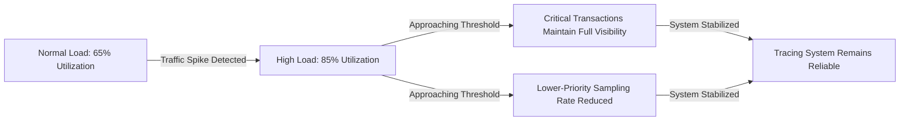

A scenario playback also demonstrates how the system would have automatically responded during previous traffic spikes—adjusting sampling rates dynamically to ensure the tracing platform remained reliable, even under extreme load conditions.

### Teaching Narrative

Dynamic sampling controls transform tracing from a potential system risk to a self-protecting capability essential for mission-critical banking platforms. In financial services, the observability infrastructure itself must be treated as a critical system that cannot fail—even during extreme load conditions when its insights are most valuable. This creates a fundamental operational challenge: without controls, trace collection could potentially overwhelm its own infrastructure during precisely the high-volume or incident scenarios when tracing is most needed. Effective banking implementations address this challenge through dynamic sampling controls that continuously monitor the observability platform's health and automatically adjust collection behavior to protect system stability. These controls implement sophisticated back-pressure mechanisms that incrementally reduce sampling rates when approaching resource limits—following predetermined business priority rules that maintain visibility for the most critical transactions while reducing collection for lower-priority operations. This capability transforms the tracing infrastructure from a potential point of failure to a self-regulating system that gracefully degrades under pressure rather than collapsing entirely. For financial institutions where observability is essential for operational continuity, regulatory compliance, and incident response, these dynamic controls ensure the tracing platform remains operational even during extreme conditions—providing critical visibility when traditional monitoring approaches may fail under the same load pressures affecting the primary business systems.

### Common Example of the Problem

A major investment bank implemented distributed tracing for their trading platform without adequate dynamic controls to manage observability load. Their infrastructure was sized for normal trading volumes with a standard 20% overhead capacity buffer, which initially appeared sufficient. However, during a period of exceptional market volatility, trading volumes surged to over 300% of normal levels. As transaction volume increased, the tracing infrastructure began experiencing cascading problems, ultimately leading to a complete failure of the observability platform.

#### Event Timeline: Observability Platform Failure

| **Time (hh:mm)** | **Event** | **Impact** |
| ---------------- | ------------------------------------------------------------- | ---------------------------------------------------------------------------------------------- |
| 00:00 | Market volatility begins to increase trading volumes. | Initial increases in trace ingestion observed, but within normal operating parameters. |
| 00:15 | Trading volumes reach 150% of normal levels. | Trace ingestion pipelines begin to approach capacity limits, causing minor ingestion delays. |
| 00:30 | Trading volumes surge to 200% of normal levels. | Storage write capacity maxes out. Ingestion pipelines back up, and trace data queue increases. |
| 00:45 | Trading volumes exceed 300% of normal levels. | Indexing lags significantly; query performance degrades. |
| 01:00 | Observability platform is unresponsive. | Engineering teams lose visibility into live system behavior. |
| 05:00 | Full system restart is completed after prolonged degradation. | Trace data for the previous 4+ hours is permanently lost. |

#### Post-Incident Analysis

The failure created a critical operational paradox: the observability system failed precisely when it was most needed to understand trading platform behavior during the volatility. Without tracing visibility, engineering teams were forced to troubleshoot performance issues using limited legacy monitoring tools, significantly extending their response time. The incident resulted in:

- **220 minutes of impaired trading functionality**, affecting an estimated **$42 million in transaction value**.
- **Damaged client relationships** with institutional investors.
- A **complete loss of observability** during the most critical period of market activity.

Post-incident investigation revealed the failure was entirely preventable. The platform could have maintained essential visibility for critical transactions by dynamically reducing sampling rates for lower-priority operations as system load increased. This incident underscores how observability platforms without self-protecting mechanisms can become single points of failure during critical business events.

### SRE Best Practice: Evidence-Based Investigation

SRE teams must implement sophisticated dynamic controls that treat the observability platform itself as a mission-critical system requiring protection from overload conditions. This requires a comprehensive approach that continuously monitors the health of the entire observability pipeline—including data collection, transport, processing, storage, indexing, and query components—and automatically adjusts sampling behavior based on observed capacity constraints before degradation occurs.

To make these best practices actionable, SRE teams can follow the checklist and multi-stage protection framework outlined below:

#### Checklist: Evidence-Based Capacity Modeling and Protection Planning

1. **Conduct Capacity Modeling**:
   - Identify and document utilization thresholds for each component (e.g., transport, storage, indexing).
   - Determine scaling limits and constraints under peak load scenarios.
   - Assess historical traffic patterns and correlate with system performance metrics.
2. **Define Bottlenecks and Failure Modes**:
   - Map potential failure points in the observability pipeline during high traffic.
   - Simulate extreme load scenarios to validate assumptions.
3. **Establish Sampling Degradation Policies**:
   - Define priority levels for transaction types based on business impact.
   - Specify transactions that must retain 100% sampling (e.g., high-value or high-risk operations).
   - Categorize low-priority transactions eligible for progressive sampling reduction.
4. **Develop Predictive Protection Mechanisms**:
   - Incorporate early warning signals (e.g., time-of-day, calendar events).
   - Use patterns and past incident data to anticipate capacity strain.
5. **Implement Continuous Monitoring**:
   - Set up automated health checks for pipeline components.
   - Ensure real-time observability into resource utilization and sampling adjustments.

#### Multi-Stage Protection Framework

| **Stage** | **Capacity Level** | **Action** |
| -------------------- | ------------------ | ---------------------------------------------------------------- |
| **Normal Operation** | < 70% | Full sampling for all transactions. |
| **Precautionary** | 70-80% | Gradual reduction in sampling for low-priority transactions. |
| **Protective** | 85-90% | Aggressive sampling reductions for medium-priority transactions. |
| **Emergency** | > 95% | Minimal sampling for all but the highest-priority transactions. |

#### Example: Sampling Degradation Policies

- **High Priority (Critical Business Transactions)**: 100% sampling under all conditions.
- **Medium Priority (Moderate Business Value)**: Sampling reduced progressively as capacity exceeds 80%.
- **Low Priority (Routine/Background Transactions)**: Sampling reduced sharply at 70% and minimal at 85%.

#### Predictive Sampling Adjustments

The most advanced strategies use predictive protection mechanisms to anticipate capacity constraints before they occur. These mechanisms rely on:

- **Time-Based Patterns**: Preemptive adjustments during known high-traffic periods (e.g., payroll processing windows).
- **Market Triggers**: Reacting to external conditions like interest rate changes or financial news.
- **Early Warning Signals**: Monitoring leading indicators, such as queue depth or latency trends.

By implementing this structured approach, SRE teams ensure the observability platform remains stable and reliable under extreme conditions, preserving critical visibility when it is needed most.

### Banking Impact

The business consequences of observability platform failures extend far beyond technical inconvenience, creating significant operational, financial, and reputational risks. To illustrate these impacts more clearly, the table below summarizes real-world examples of the cascading effects such failures can have on financial institutions.

| **Impact Dimension** | **Example Scenario** | **Outcome** |
| --------------------------- | -------------------------------------------------------------------------------- | --------------------------------------------------------------------------------------------------------------------------------------------------------------------------------------------------- |
| **Operational** | Tracing platform collapse during a system degradation event. | Increased mean time to resolution from 45-60 minutes to over 4 hours, resulting in $3.7 million in lost transaction volume and additional customer compensation costs. |
| **Financial** | Observability failure during market volatility for a wealth management platform. | 18-point Net Promoter Score drop among high-net-worth clients, leading to an estimated $65 million in reduced assets under management as clients moved to perceived more reliable institutions. |
| **Reputational** | Outages affecting core payment processing during peak holiday shopping season. | Long-lasting damage to customer confidence, with a surge in negative social media sentiment and increased churn to competitors offering more reliable services. |
| **Regulatory** | Tracing system failure during a security breach incident. | Insufficient forensic evidence for post-incident regulatory reporting, resulting in additional scrutiny, compliance penalties, and reputational harm due to perceived lack of operational maturity. |
| **Organizational Learning** | Loss of observability data during a critical system overload event. | Prevented root cause analysis and system improvement for future resilience, leaving the institution vulnerable to repeated failures under similar conditions. |

The above examples highlight the high stakes of observability platform reliability in banking. Failures during critical events not only amplify operational disruptions but also generate long-term consequences across financial, reputational, and regulatory dimensions.

#### Key Takeaways

- **Operational Impact:** Observability failures extend incident response times and increase financial losses during outages.
- **Reputational Risk:** Customers lose confidence in financial institutions unable to resolve issues promptly, triggering client churn and reduced market competitiveness.
- **Regulatory Scrutiny:** Inadequate observability creates compliance risks, with penalties and additional oversight for failing to meet monitoring standards.
- **Missed Learning Opportunities:** The absence of data during critical events erodes the ability to strengthen systems against future challenges.

These risks underscore the critical role of dynamic sampling controls as part of a resilient observability strategy. By maintaining stability under extreme conditions, financial institutions can protect their operations, reputation, and compliance posture while ensuring they learn from every incident to improve future performance.

### Implementation Guidance

#### Checklist for Dynamic Sampling Implementation

1. **Capacity Modeling and Threshold Definition**

   - Conduct a comprehensive capacity modeling exercise across:
     - Data collection
     - Transport
     - Processing
     - Storage
     - Indexing
     - Query infrastructure
   - Establish explicit capacity thresholds and scaling limits for each component.
   - Identify potential bottlenecks and document failure modes under extreme load conditions.
   - Use explicit, measurable specifications rather than general guidelines.

2. **Multi-Stage Protection Framework**

   - Define intervention thresholds for different capacity levels:
     - **70-80% Capacity**: Precautionary sampling adjustments.
     - **85-90% Capacity**: Progressive protection mechanisms.
     - **95%+ Capacity**: Emergency interventions.
   - Ensure protection mechanisms activate automatically via continuous monitoring.

3. **Business-Aligned Sampling Policies**

   - Collaborate with business stakeholders to define priorities:
     - Maintain 100% sampling for critical operations (e.g., high-value, regulatory-sensitive, or new feature transactions).
     - Gradually reduce sampling for standard business transactions.
     - Minimize sampling for routine informational operations during platform protection events.
   - Avoid arbitrary technical decisions by basing policies on business priorities.

4. **Predictive Protection Mechanisms**

   - Develop algorithms to anticipate capacity constraints, considering:
     - Time-of-day effects
     - Calendar events
     - Market conditions
     - Early transaction volume trends
   - Include predefined rules for known high-volume events (e.g., market open/close, month/quarter-end, product launches).
   - Adjust sampling proactively before critical thresholds are reached.

5. **Meta-Observability for Tracing Infrastructure**

   - Create a meta-monitoring system to observe:
     - Component utilization
     - Sampling rates
     - Queue depths
     - Processing latency
     - Protection mechanism activations
   - Build independent dashboards to ensure visibility even if the primary tracing platform degrades.

______________________________________________________________________

#### Flowchart: Dynamic Sampling Implementation Process

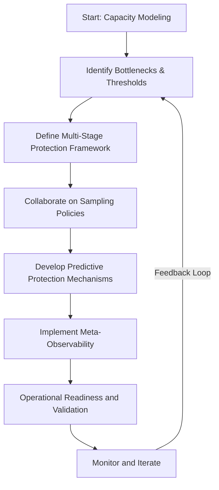
