# Chapter 8: OpenTelemetry and Standards in Regulated Environments

## Chapter Overview

Welcome to the banking observability arms race—where your legacy tracing stack is a ticking time bomb, compliance is a moving target, and vendor lock-in is just extortion with better branding. This chapter rips the mask off proprietary chaos and hands you the OpenTelemetry playbook for regulated environments. Forget handwringing about “best practices”—we’re talking about slashing incident response times, humiliating vendor reps at negotiation tables, and turning your monitoring system into a compliance officer’s fever dream. From stitching together cross-bank traces like forensic surgeons, to weaponizing standards for future-proofing, we’ll show you how to stop being the punchline of your own war room jokes. If you’re tired of paying ransom to APM vendors, losing sleep over GDPR audits, or fumbling through cross-organizational incidents with nothing but guesswork, buckle up. This is observability for banks who want to stop losing and start playing offense.

______________________________________________________________________

## Learning Objectives

- **Standardize** observability instrumentation using OpenTelemetry to obliterate vendor lock-in and maintenance hell across banking silos.
- **Integrate** compliance controls directly into tracing—think automated PII masking, jurisdiction-aware routing, and built-in audit trails.
- **Extend** OpenTelemetry with banking-specific context, making traces business-relevant (not just technically correct).
- **Architect** multi-vendor observability ecosystems that make vendors compete for your affection (and lower their prices).
- **Propagate** standardized trace context across organizational boundaries to finally solve the “where’s my money?” black hole.
- **Transform** observability from a cost center to a regulatory asset—impress auditors and terrify competitors.
- **Future-proof** your observability investment with a standards evolution program that won’t leave you stranded on yesterday’s protocol.

______________________________________________________________________

## Key Takeaways

- “Legacy” tracing means you’re one vendor acquisition away from a seven-figure migraine. Standardize, or prepare to pay.
- Cross-team incident war rooms shouldn’t look like the opening scene of a true crime documentary. OpenTelemetry kills data silos—fast.
- Compliance is not a bolt-on. If your tracing leaks PII or ignores jurisdiction, hope you enjoy million-dollar fines and panicked board calls.
- Banking context matters. Tracing that doesn’t know ACH from SWIFT is just expensive noise. Extend or be ignored.
- Multi-vendor isn’t buzzword bingo—it’s how you keep negotiation leverage and avoid being hostage to one sales team’s roadmap.
- Cross-bank tracing without context propagation is just collective finger-pointing. Standardize or keep guessing.
- Regulatory exams are easier when your observability is the control, not the evidence gap. Automate, document, and let your auditors sweat.
- Observability standards will change—again and again. Build abstraction layers and a real evolution strategy, or get ready for another “strategic rewrite” every three years.
- If you’re not actively testing and evolving your standards adoption, you’re volunteering to be tomorrow’s cautionary tale.

______________________________________________________________________

## Panel 1: Standard Adoption in Banking - The OpenTelemetry Revolution

### Scene Description

A financial technology architecture review board meeting is taking place at a global bank. The room is equipped with a large screen displaying a comparison table that contrasts their legacy proprietary tracing systems with the progress of OpenTelemetry adoption across various banking domains. Below is a simplified representation of the comparison table for visualization:

```
+--------------------------+----------------------+-------------------------+
| Domain                  | Legacy Tracing       | OpenTelemetry Adoption  |
+--------------------------+----------------------+-------------------------+
| Payment Processing      | Proprietary Vendor A | In Production           |
| Risk Management         | Proprietary Vendor B | Planning Phase          |
| Customer Onboarding     | Custom Instrumentation | In Production          |
| Fraud Detection         | Proprietary Vendor C | Planning Phase          |
+--------------------------+----------------------+-------------------------+
```

Architects from different divisions are presenting their migration roadmaps, highlighting challenges and successes. On the screen, a senior architect is demonstrating a payment processing service that has been instrumented with OpenTelemetry. The demonstration showcases seamless integration with both their legacy observability platform and newer cloud-native monitoring tools. A simplified architectural diagram for this integration is presented below:


The CTO nods approvingly as the presenter emphasizes key benefits achieved since standardizing on OpenTelemetry: significant reductions in vendor lock-in risks, lower maintenance costs, and the ability to adapt to future technology shifts. The room is filled with a sense of progress as the discussion moves toward scaling this approach across all banking domains.

### Teaching Narrative

Standard adoption in banking represents a fundamental shift from proprietary observability solutions to open standards like OpenTelemetry, transforming how financial institutions approach distributed tracing. Historically, banks built observability through complex combinations of vendor-specific tools and custom instrumentation, creating expensive technology silos that required specialized knowledge and complicated integration. The emergence of OpenTelemetry—an open-source, vendor-neutral observability framework—offers banks a standardized approach that delivers multiple strategic advantages: elimination of vendor lock-in, significant reduction in instrumentation maintenance, consistency across hybrid environments, and seamless integration with both existing and emerging observability platforms. For regulated financial institutions, where technology standardization directly impacts risk management, audit capabilities, and operational resilience, this standards-based approach transforms distributed tracing from a tactical implementation to a strategic capability. Rather than maintaining multiple proprietary instrumentation layers across different banking domains, institutions can implement a consistent observability foundation that spans diverse technologies while preserving the flexibility to change backend analysis tools as needed. This strategic simplification through standardization enables banks to focus engineering resources on business-specific observability challenges rather than constantly maintaining multiple incompatible instrumentation approaches across their complex technology landscape.

### Common Example of the Problem

A major European bank's digital transformation initiative was severely hampered by their fragmented observability approach. Their retail banking division used a commercial APM solution with proprietary agents, the investment banking arm had implemented a different vendor's tracing tools, while their recently acquired fintech subsidiary used open-source solutions. When an international payment failed, tracing the transaction required engineers from all three divisions to manually correlate data across incompatible systems—often taking hours to piece together the complete journey.

#### Incident Workflow Breakdown

Below is a workflow representation of the steps taken during a major incident affecting cross-divisional payments, illustrating the delays caused by the lack of standardization:

```mermaid
gantt
    title Incident Resolution Timeline
    dateFormat HH:mm
    axisFormat %H:%M
    section Incident Workflow
    Transaction Failure Identified     :done, 00:00, 00:10
    Teams Notified                     :active, 00:10, 00:30
    Data Correlation Begins            :crit, 00:30, 02:30
    Unified View Assembled             :active, 02:30, 03:00
    Issue Diagnosed                    :crit, 03:00, 03:30
    Resolution Implemented             :done, 03:30, 04:00
```



As shown in the timeline, over 40% of the total resolution time was consumed by the lengthy process of manually correlating data from disparate systems to create a unified view of transaction flows. This inefficiency delayed the actual diagnosis and resolution of the problem.

#### Key Challenges Highlighted

- **Incompatible Systems**: Retail banking, investment banking, and fintech subsidiaries relied on siloed observability tools, making data aggregation and analysis extremely cumbersome.
- **Vendor Lock-In Risks**: The primary APM vendor's end-of-life announcement for agents used in core banking services forced costly re-instrumentation efforts with no guarantee of future compatibility.
- **Operational Inefficiency**: Teams spent significant time on data correlation rather than diagnosing and resolving the root cause of the incident, directly impacting customer experience.

Without a standardized observability approach, the bank faced persistent integration challenges, vendor dependency risks, and critical delays in incident response. This example underscores the need for a unified framework like OpenTelemetry to streamline observability across divisions and reduce operational bottlenecks.

### SRE Best Practice: Evidence-Based Investigation

SRE teams should implement standards-based observability using OpenTelemetry as a unified instrumentation approach across banking domains. This standardization provides evidence-based advantages in three critical dimensions: incident response efficiency, technology evolution flexibility, and cross-team collaboration.

#### Checklist: Implementing Evidence-Based Observability with OpenTelemetry

To maximize the benefits of OpenTelemetry, SREs should follow these key actions:

1. **Establish Cross-Domain Working Groups**

   - Create collaborative teams across banking domains to define consistent instrumentation practices.
   - Align on banking-specific extensions for standard OpenTelemetry attributes.

2. **Develop Common Sampling Strategies**

   - Tailor sampling strategies for high-value financial transactions to balance data volume and observability depth.

3. **Implement Shared Collector Infrastructure**

   - Deploy centralized telemetry collectors capable of routing data to multiple analysis platforms.
   - Ensure compatibility with both legacy and modern observability tools during transition stages.

4. **Standardize Incident Response Playbooks**

   - Integrate standardized tracing data into incident response workflows.
   - Train teams on using consistent trace context for faster root-cause analysis.

5. **Continuously Monitor and Refine Practices**

   - Regularly audit telemetry pipelines for adherence to standards.
   - Leverage feedback from incident reviews to refine instrumentation and processes.

#### Table: Benefits of Standardization vs. Fragmented Approaches

| **Dimension** | **Standardization with OpenTelemetry** | **Fragmented Approaches** |
| ------------------------------------ | -------------------------------------------------------------------------------------------------- | --------------------------------------------------------------------------------------- |
| **Incident Response Efficiency** | Consistent trace context across services accelerates root-cause analysis, reducing MTTR by 40-60%. | Siloed data requires manual correlation, increasing investigation time. |
| **Technology Evolution Flexibility** | Vendor-neutral design allows seamless adoption of new analysis tools without re-instrumentation. | Proprietary solutions lock teams into specific vendors, increasing modernization costs. |
| **Cross-Team Collaboration** | Unified telemetry fosters collaboration by providing shared visibility across domains. | Isolated instrumentation obstructs collaboration and creates knowledge silos. |
| **Maintenance Costs** | 30-45% reduction in instrumentation maintenance due to standardized tooling. | High maintenance overhead from managing multiple incompatible solutions. |
| **Regulatory and Audit Readiness** | Standardized observability simplifies compliance reporting and ensures traceability. | Fragmented data complicates regulatory audits and increases risk exposure. |

By adopting these practices, SRE teams can leverage OpenTelemetry to transform observability into a strategic capability. Standardization not only reduces operational risks and costs but also equips banks with the agility to adapt to changing technologies and regulatory environments.

### Banking Impact

The business consequences of fragmented observability standards extend far beyond technical inconvenience to directly impact competitive positioning, operational costs, and regulatory standing. The most immediate financial impact comes from incident resolution efficiency—banks with standardized tracing report 35-40% faster mean time to resolution (MTTR) for cross-domain incidents, directly reducing both revenue loss during outages and operational costs for extended war rooms. For a typical tier-1 bank processing $5-10 billion in daily transactions, even minor improvements in incident resolution time translate to millions in protected revenue annually.

The table below illustrates representative cost savings and operational improvements for tier-1 banks adopting OpenTelemetry as a standardized observability framework:

| Metric | Pre-Standardization (Fragmented Tools) | Post-Standardization (OpenTelemetry) | Improvement |
| ---------------------------------- | -------------------------------------- | ------------------------------------ | ------------------- |
| Mean Time to Resolution (MTTR) | 4-6 hours | 2.5-3.5 hours | 35-40% reduction |
| Annual Revenue Loss from Downtime | $50M-$100M | $30M-$60M | $20M-$40M reduction |
| Vendor Lock-In Migration Costs | $1.5M-$3M per event | Negligible | 90-95% reduction |
| Instrumentation Maintenance Effort | 15-20% of engineering hours | 5-10% of engineering hours | 50-70% reduction |

Vendor lock-in presents equally significant risks—financial institutions report spending 20-30% of their observability budgets on vendor migration when forced to change providers due to pricing changes, acquisitions, or technical limitations. Several major banks reported unplanned expenditures exceeding $1.5M when primary APM vendors announced end-of-life for critical components, requiring rapid re-instrumentation under pressure. Standardization dramatically reduces these risks by decoupling instrumentation from analysis platforms.

From a regulatory perspective, fragmented observability creates material risks during examinations—regulators increasingly expect banks to demonstrate comprehensive transaction visibility as part of operational resilience requirements. Several institutions report receiving critical findings specifically citing inconsistent transaction monitoring capabilities across business units, a deficiency that standards-based approaches directly address by providing uniform transaction visibility regardless of business domain or technology generation.

The following diagram summarizes key improvements achieved through OpenTelemetry adoption in banking:


### Implementation Guidance

1. Conduct a comprehensive inventory of existing observability tooling across all banking domains, identifying which business-critical transaction flows currently cross observability boundaries and quantifying the incident response impact of these gaps to build a business case for standardization.

2. Establish a cross-functional "OpenTelemetry Center of Excellence" with representatives from each banking division, creating standard instrumentation patterns specifically designed for financial services workflows and developing banking-specific semantic conventions for transaction attributes like monetary values, customer segments, and regulatory classifications.

3. Implement a phased migration approach beginning with a high-visibility pilot in a contained domain—typically retail payments or digital banking—demonstrating improved visibility before expanding to more complex areas like trading platforms or core banking systems.

4. Deploy a vendor-neutral collector infrastructure that can simultaneously route telemetry to both existing proprietary analysis platforms and new standards-based solutions, enabling gradual transition without requiring immediate replacement of existing dashboards, alerts, or visualization tools.

5. Develop banking-specific instrumentation libraries that extend standard OpenTelemetry SDKs with financial services capabilities—including PII protection for sensitive data, additional context propagation for regulatory metadata, and specialized sampling strategies that ensure complete tracing of high-value transactions while applying appropriate sampling to high-volume, lower-value operations.

## Panel 2: Compliance-Ready Instrumentation - Meeting Banking Regulatory Requirements

### Scene Description

A regulatory readiness workshop unfolds in a collaborative space where compliance officers and SRE engineers are reviewing OpenTelemetry instrumentation to prepare for an upcoming audit. The room features multiple screens, each focused on critical aspects of the observability pipeline. Below is a representation of the setup to help visualize the scene:


- **Screen 1**: Displays automated PII detection and masking in action, with annotations highlighting how sensitive information is identified and obfuscated in real time.
- **Screen 2**: Demonstrates data sovereignty controls, ensuring that customer information remains within appropriate jurisdictions, aligned with applicable regulations.
- **Screen 3**: Focuses on trace context propagation, automatically capturing and propagating regulatory metadata, such as consent verification and fraud checks.

At the table, compliance officers and SRE engineers discuss these mechanisms, ensuring that the observability pipeline adheres to regulatory mandates. A compliance officer reviews evidence of the tracing system's capabilities, confirming segregation of duties, comprehensive audit trails, and immutable records of sensitive operations—key requirements for banking regulations. This interactive setup bridges technical implementation with regulatory assurance, creating a unified understanding of compliance-ready instrumentation.

### Teaching Narrative

Compliance-ready instrumentation transforms OpenTelemetry from a general-purpose framework to a regulatory asset in highly regulated financial environments. While the core OpenTelemetry specification provides technical standardization, banks must extend this foundation with specialized capabilities that address specific regulatory requirements—including privacy regulations like GDPR, financial rules like PSD2, and industry standards like PCI-DSS. Effective banking implementations build compliance directly into their OpenTelemetry adoption through systematic extensions: automated PII detection and masking within the instrumentation layer, regulatory context propagation that tracks compliance metadata like consent verification and geographic restrictions, data sovereignty controls ensuring information remains in appropriate jurisdictions, and specialized span attributes capturing evidence of mandatory checks like fraud screening or sanctions verification. This compliance-first approach transforms tracing from a potential regulatory risk to a systematic control mechanism that automatically documents adherence to regulatory requirements. For financial institutions, where regulatory obligations directly impact technology design, these specialized extensions ensure that standardized observability supports rather than conflicts with compliance needs—creating a unified approach that simultaneously delivers operational visibility, regulatory documentation, and audit readiness without requiring separate systems for each requirement.

### Common Example of the Problem

A multinational investment bank implemented distributed tracing across their global trading platform without adequate compliance considerations, creating significant regulatory exposure. During routine trading operations, their standard instrumentation captured detailed transaction data, including customer identifiers, account numbers, and trade details—automatically propagating this sensitive information across service boundaries and storing it in their centralized observability platform hosted in US data centers. When European regulators conducted a GDPR audit, they discovered that comprehensive customer data from EU trading operations was being transferred to US-based storage without appropriate privacy controls, data minimization, or cross-border transfer agreements. Simultaneously, the bank's internal audit team found that the tracing system lacked adequate evidence capture for critical regulatory checks like sanctions screening and anti-money laundering verification, despite these operations being traced from a technical perspective. The bank received a formal regulatory finding requiring them to either implement comprehensive compliance controls in their tracing system or disable it entirely for regulated operations—forcing an expensive, last-minute remediation project that could have been avoided with compliance-ready instrumentation from the beginning.

#### Summary of Key Compliance Failures and Consequences

| **Compliance Failure** | **Description** | **Consequence** |
| ---------------------------------------------- | ---------------------------------------------------------------------------------------------------- | --------------------------------------------------------------------------------------------------- |
| GDPR Violation | Customer data from EU operations was transferred to US data centers without proper controls. | Regulatory penalties, reputational damage, and mandatory system redesign to meet GDPR requirements. |
| Lack of PII Masking | Sensitive customer information (e.g., identifiers, account numbers) was propagated across services. | Increased risk of data breaches and non-compliance with data minimization principles. |
| Absence of Regulatory Metadata Propagation | No evidence was captured for critical checks like sanctions screening or AML verification. | Failure to demonstrate compliance, leading to audit findings and potential operational shutdowns. |
| Non-Adherence to Data Sovereignty Requirements | Data sovereignty controls were not implemented to restrict information to appropriate jurisdictions. | Regulatory violations requiring costly remediation to realign with legal requirements. |

#### Flow of Compliance Failures


This example illustrates how insufficient compliance considerations in distributed tracing can cascade into severe regulatory, operational, and financial consequences. Implementing compliance-ready instrumentation from the outset could have prevented these failures, ensuring that observability systems align with regulatory requirements and audit expectations.

### SRE Best Practice: Evidence-Based Investigation

SRE teams must implement compliance-aware instrumentation that transforms traces from operational tools to regulatory evidence. Evidence from leading financial institutions demonstrates that embedding compliance controls directly in the instrumentation layer produces superior outcomes compared to retrofitting protections afterward. Banks implementing "compliance-by-design" in their tracing approach report 60-70% reductions in audit findings related to observability systems while simultaneously improving operational visibility compared to institutions applying restrictive controls that limit tracing usefulness.

The most effective approach follows a systematic compliance integration methodology. Below is a step-by-step checklist to guide SRE teams through this process:

#### Compliance Integration Checklist for SRE Teams:

1. **Regulatory Mapping**:

   - Identify applicable regulations (e.g., GDPR, PSD2, PCI-DSS).
   - Map regulations to transaction types and required evidence (e.g., AML verification timestamps, consent validation proof).
   - Collaborate with compliance officers to ensure thorough coverage.

2. **Implement Technical Controls**:

   - **Automated PII Detection and Masking**: Ensure sensitive data is redacted before leaving service boundaries.
   - **Span Attribute Encryption**: Encrypt confidential information that must be preserved for compliance purposes.
   - **Regulatory Context Propagation**: Maintain compliance metadata (e.g., consent status, geographic restrictions) across transaction flows.

3. **Establish Attribute Namespace Segmentation**:

   - Use distinct attribute namespaces to separate regulatory metadata from operational data.
   - Explicitly classify PII to ensure clear identification and handling.
   - Define purpose-specific sampling strategies to protect critical data while optimizing observability for non-compliance-related traces.

4. **Validate and Test Instrumentation**:

   - Conduct regular audits to confirm compliance evidence is complete and accurate.
   - Simulate regulatory scenarios to ensure metadata propagation and technical controls function as expected.
   - Monitor for gaps in regulatory data coverage and iterate on instrumentation as needed.

5. **Maintain Documentation and Audit Readiness**:

   - Store immutable records of compliance-related traces.
   - Maintain clear evidence of segregation of duties within the instrumentation layer.
   - Prepare detailed documentation for audit reviews, including mappings between regulations and implemented controls.

#### Summary Flow Diagram


By following this checklist and methodology, SRE teams can confidently implement compliance-aware instrumentation that balances operational visibility with robust regulatory adherence. Evidence from successful implementations highlights the importance of maintaining clear separation between technical and regulatory concerns, ensuring critical compliance data is preserved while operational data flows freely in non-sensitive contexts.

### Banking Impact

The business consequences of compliance-inadequate tracing are profound, ranging from regulatory penalties to operational inefficiencies that undermine observability initiatives in regulated environments. The following table summarizes key financial impacts and benefits of compliance-ready tracing:

| **Category** | **Non-Compliant Impact** | **Compliance-Ready Benefit** |
| --------------------------- | -------------------------------------------------------------------------------- | ------------------------------------------------------------------------------ |
| **Regulatory Penalties** | Fines up to 4% of global revenue for severe violations (e.g., GDPR). | Risk reduction through automated compliance mechanisms. |
| **Remediation Costs** | $500K-$2M for remediation programs following regulatory findings. | Avoidance of unplanned expenses and engineering resource diversion. |
| **Operational Limitations** | Exclusion of critical transaction flows from tracing due to compliance concerns. | Full observability coverage, including high-value, regulated operations. |
| **Audit Preparation** | Manual evidence gathering requiring extensive time and resources. | 40-50% reduction in audit preparation time through automated evidence. |
| **Reputational Risk** | Damage from regulatory findings or publicized compliance failures. | Strengthened trust with regulators and customers through proactive compliance. |

#### Key Insights from the Field

- **Regulatory Risk**: Financial institutions have reported multi-million dollar fines for inadequate technical compliance, including insufficient data protection in monitoring systems. These penalties not only result in direct financial loss but also damage institutional credibility with regulators.
- **Engineering Disruption**: Compliance findings often lead to costly, unplanned remediation efforts, diverting engineering teams from strategic projects to address regulatory gaps.
- **Missed Observability Goals**: Compliance concerns have forced some banks to limit tracing coverage in precisely the critical transaction flows where observability offers the highest value, undermining the return on investment in monitoring tools.

For banks that adopt compliance-ready tracing, the benefits are transformative. By embedding regulatory controls—such as automated PII masking and evidence capture—directly into their observability pipelines, these institutions achieve dual benefits: reducing regulatory risk and streamlining audit processes. Compliance-ready tracing not only ensures adherence to requirements but also enables operational visibility to drive business outcomes without compromising on regulatory obligations.

### Implementation Guidance

1. **Regulatory Mapping Exercise**\
   Conduct a comprehensive regulatory mapping exercise with compliance teams, identifying exactly which regulations apply to each transaction type (PSD2, GDPR, AML, KYC, etc.) and what specific evidence requirements each regulation imposes. Use this to create a formal compliance requirement specification that the instrumentation must satisfy.

2. **PII Detection and Protection**\
   Implement PII detection and protection directly in instrumentation adapters using techniques like pattern matching and context-aware filtering. For example, in OpenTelemetry, you can use processors to identify and mask sensitive data before it propagates. Below is a sample OpenTelemetry Collector configuration for redacting PII:

   ```yaml
   processors:
     attributes:
       actions:
         - key: "user.email"
           action: "delete"  # Redacts email addresses from telemetry data
         - key: "user.ssn"
           action: "update"
           value: "[REDACTED]"  # Replaces SSN with a placeholder
   service:
     pipelines:
       traces:
         processors: [attributes]
   ```

3. **Context Propagation Mechanisms**\
   Develop specialized context propagation mechanisms that maintain dual contexts—operational and regulatory. For example, ensure that metadata such as consent verification and location determination flows alongside transaction traces. Below is a code snippet demonstrating how to inject regulatory metadata into span attributes using the OpenTelemetry SDK:

   ```python
   from opentelemetry.trace import get_current_span

   span = get_current_span()
   span.set_attribute("regulatory.consent_verified", True)
   span.set_attribute("regulatory.transaction_location", "EU")
   span.set_attribute("regulatory.mandatory_check", "KYC Completed")
   ```

4. **Jurisdiction-Aware Data Routing**\
   Create jurisdiction-aware data routing that respects data sovereignty requirements by directing telemetry to the appropriate collectors based on data classification. The following example demonstrates configuring an OpenTelemetry Collector to route data based on region:

   ```yaml
   exporters:
     otlp_eu:
       endpoint: "collector-eu.bank.com:4317"
     otlp_us:
       endpoint: "collector-us.bank.com:4317"
   processors:
     routing:
       table:
         - value: "EU"
           exporters: [otlp_eu]
         - value: "US"
           exporters: [otlp_us]
   service:
     pipelines:
       traces:
         processors: [routing]
   ```

5. **Immutable Evidence Preservation**\
   Establish immutable evidence preservation for regulatory-critical operations by cryptographically signing trace data. For example, you can use a hashing mechanism to generate a tamper-proof signature for each trace. The following pseudocode illustrates this process:

   ```python
   import hashlib

   def sign_trace(trace_data, private_key):
       serialized_trace = serialize(trace_data)  # Convert trace to canonical format
       signature = hashlib.sha256(serialized_trace.encode('utf-8')).hexdigest()
       return {
           "trace": trace_data,
           "signature": signature,
           "signed_by": private_key,
       }

   trace = {"operation": "sanctions_check", "status": "completed"}
   signed_trace = sign_trace(trace, private_key="bank-regulation-key")
   print(signed_trace)
   ```

By incorporating these practical implementations, the bank's observability pipeline can meet regulatory requirements while maintaining operational efficiency and audit readiness.

## Panel 3: Extending OpenTelemetry for Financial Services - Banking-Specific Context

### Scene Description

A financial services standards working group with representatives from major banks, financial technology companies, and cloud providers is actively collaborating to develop banking-specific extensions to the OpenTelemetry standard. Participants are gathered around digital whiteboards, where they've outlined draft specifications for financial-specific context propagation. These include standardized attributes for transaction types, monetary values, customer segments, and regulatory classifications.

To illustrate their work, a conceptual flow diagram has been drawn, showing how these extensions integrate with the core OpenTelemetry framework. Below is a text-based representation of the diagram:

```
+-------------------------+       Context Propagation       +-------------------------+
|  Core OpenTelemetry    | <-----------------------------> | Financial Services      |
|  Framework             |       Extensions Layer          | Context Extensions      |
+-------------------------+                                 +-------------------------+
         |                                                           |
         |                                                           |
         v                                                           v
+----------------+             +----------------+             +----------------+
| Trace Metadata | <---------> | Banking-Specific| <---------> | Observability  |
| Collection     |    Mapping  | Attributes      |    Output   | Dashboards     |
+----------------+             +----------------+             +----------------+
```

This flow demonstrates how the core OpenTelemetry framework interacts with the financial services extensions layer to propagate banking-specific metadata seamlessly. The integration enables consistent tracing across disparate systems, ensuring transaction types, monetary values, and regulatory contexts are captured and visualized effectively.

Additionally, a live demonstration highlights how these standards support consistent transaction tracing across financial institutions engaged in correspondent banking relationships. By extending OpenTelemetry with specialized metadata and propagation mechanisms, the working group is enabling seamless transaction tracking across organizational boundaries, bridging technical and business-level observability for modern banking systems.

### Teaching Narrative

Extending OpenTelemetry for financial services transforms a generic standard into a specialized capability addressing the unique observability requirements of banking environments. While OpenTelemetry provides solid foundations for technical tracing, it lacks the financial context essential for banking observability—specialized metadata like transaction types, monetary values, risk classifications, and regulatory categories that define how financial institutions understand their operations. Industry-leading banks address this challenge through collaborative development of financial services extensions to OpenTelemetry—creating standardized attribute schemas, specialized context propagation mechanisms, and banking-specific sampling strategies that augment the core framework with the additional dimensions required in financial systems. These extensions enable powerful banking-specific capabilities: transaction value-aware sampling that automatically increases tracing for high-value operations, risk-based visualization that highlights transactions requiring additional scrutiny, and cross-organizational tracing for complex financial operations spanning multiple institutions. For banking systems that process diverse transaction types with significantly different business importance, risk profiles, and regulatory requirements, these specialized extensions transform OpenTelemetry from a technical tracing tool to a comprehensive financial observability framework—ensuring the standard can represent not just the technical dimensions of system behavior but also the business and regulatory context that defines banking operations.

### Common Example of the Problem

A global banking consortium implemented standard OpenTelemetry instrumentation across their shared payment network connecting dozens of financial institutions worldwide. While the implementation provided basic technical visibility, it failed to capture the critical banking context needed for effective transaction monitoring. When investigating a complex international payment failure involving multiple banks, engineers could trace the technical API calls and service interactions, but lacked crucial financial context. Key gaps included:

| Missing Financial Attribute | Example Value(s) | Impact of Absence |
| ------------------------------- | --------------------------------------- | ------------------------------------------------------------------------------------ |
| **Payment Type** | ACH, Wire, SWIFT | Unable to distinguish transaction workflows or prioritize based on payment type. |
| **Amount Tier** | Low, Medium, High | Missed opportunities for value-aware sampling or identifying high-priority issues. |
| **Customer Segment** | Retail, Corporate | Lack of visibility into transaction significance based on customer demographics. |
| **Regulatory Classification** | Standard, High-risk | Failed to identify transactions needing enhanced due diligence or compliance checks. |
| **Consistent Attribute Naming** | `payment_channel` vs. `transfer_method` | Inconsistent terminology caused cross-institutional tracing inconsistencies. |

During a critical incident affecting cross-border payments, the absence of these attributes forced investigators to constantly reference external systems to understand the business significance of the traced transactions, adding hours to resolution time. For example, the inability to differentiate between a high-value corporate wire transfer and a low-value retail ACH transaction delayed prioritization efforts and misdirected engineering resources. Additionally, inconsistent representation of similar financial concepts across institutions (e.g., "payment_channel" vs. "transfer_method") further hindered root cause analysis, as engineers had to manually reconcile disparate data representations.

This situation highlighted a fundamental gap: while OpenTelemetry provided excellent technical tracing capabilities, its generic approach lacked the specialized financial attributes needed to make traces truly meaningful in banking environments. In a domain where transaction type, value, and regulatory context are as critical as technical performance metrics, these missing elements represented a significant barrier to effective observability.

### SRE Best Practice: Evidence-Based Investigation

SRE teams should extend standard OpenTelemetry implementations with banking-specific semantic conventions and context enrichment. Evidence from leading financial institutions demonstrates that domain-specific extensions significantly enhance observability value—banks implementing financial extensions report 30-45% improvements in incident resolution efficiency compared to generic implementations, primarily by eliminating the need to correlate trace data with external systems to understand transaction context.

The most effective approach follows a layered extension methodology. This methodology ensures that financial observability requirements are systematically integrated into OpenTelemetry implementations in a structured, repeatable manner. Below is a practical checklist and example code snippet to guide SRE teams in adopting this approach:

#### Checklist: Layered Extension Methodology for Banking-Specific Observability

1. **Define Semantic Conventions**: Standardize attribute names and values for:
   - Transaction types (e.g., `credit_transfer`, `direct_debit`)
   - Payment methods (e.g., `wire`, `ACH`, `SWIFT`)
   - Financial products (e.g., `loan`, `mortgage`, `investment_account`)
   - Customer segments (e.g., `retail`, `corporate`, `high_net_worth`)
   - Regulatory classifications (e.g., `AML`, `GDPR`, `FATCA`)
2. **Implement Context Enrichment Processors**:
   - Automatically derive and attach metadata such as:
     - Transaction value categorization (e.g., `high`, `medium`, `low`)
     - Customer significance (e.g., `key_account`, `standard_account`)
     - Risk scores and regulatory tags.
   - Use enrichment processors to programmatically add metadata to traces based on transaction characteristics.
3. **Collaborate on Shared Standards**:
   - Work with industry groups to define shared semantic conventions for cross-organizational consistency.
   - Adopt agreed-upon schemas to enable seamless trace correlation across institutional boundaries.
4. **Test and Validate**:
   - Validate extensions using real transaction scenarios.
   - Ensure traces are correctly enriched and meet regulatory and business observability requirements.
5. **Iterate and Improve**:
   - Continuously refine conventions and enrichment logic based on feedback and evolving business needs.

#### Code Snippet: Banking-Specific Attribute Enrichment Processor

```python
from opentelemetry.sdk.trace import TracerProvider
from opentelemetry.sdk.trace.export import BatchSpanProcessor
from opentelemetry.sdk.trace.export import ConsoleSpanExporter
from opentelemetry.sdk.trace import Span
from opentelemetry.sdk.trace import SpanProcessor

class BankingContextEnrichmentProcessor(SpanProcessor):
    def on_start(self, span: Span, parent_context):
        # Enrich the span with banking-specific metadata
        attributes = span.attributes

        # Transaction Value Categorization
        transaction_value = attributes.get("transaction.value", 0)
        if transaction_value > 1000000:
            attributes["transaction.category"] = "high_value"
        elif transaction_value > 10000:
            attributes["transaction.category"] = "medium_value"
        else:
            attributes["transaction.category"] = "low_value"

        # Regulatory Classification Example
        attributes["regulatory.classification"] = "AML" if attributes.get("transaction.type") == "wire" else "general"

        # Risk Scoring (simple example)
        risk_score = 0
        if attributes.get("customer.segment") == "high_net_worth":
            risk_score += 2
        if attributes.get("transaction.category") == "high_value":
            risk_score += 3
        attributes["transaction.risk_score"] = risk_score

    def on_end(self, span: Span):
        # No additional action on span end
        pass

# Example Usage
provider = TracerProvider()
enrichment_processor = BankingContextEnrichmentProcessor()
provider.add_span_processor(enrichment_processor)
provider.add_span_processor(BatchSpanProcessor(ConsoleSpanExporter()))
```

This approach ensures that all traces are enriched with consistent, meaningful financial context without requiring extensive manual instrumentation. By combining semantic conventions, automated enrichment, and industry collaboration, SRE teams can enable robust, banking-specific observability that supports efficient incident resolution and regulatory compliance.

### Banking Impact

The business consequences of generic versus banking-specific tracing extend far beyond technical convenience to directly impact operational efficiency, risk management, and cross-institutional collaboration. The most immediate financial impact comes from incident resolution efficiency—banks implementing domain-specific trace extensions report 35-40% reductions in mean time to resolution (MTTR) for complex financial incidents through improved contextual understanding. This directly reduces revenue loss during outages and minimizes customer impact durations. For a typical payment processor handling millions of transactions daily, these efficiency improvements translate to hundreds of thousands in protected revenue annually through faster incident resolution.

Equally significant is the impact on risk management effectiveness. Banks using value-aware tracing report major improvements in focused incident response—automatically prioritizing issues affecting high-value transactions or prominent customer segments. Several institutions documented cases where specialized attributes enabled them to immediately identify and resolve issues affecting their top-tier corporate clients or highest-value transactions first, preserving millions in critical revenue while addressing lower-priority issues afterward.

From a strategic perspective, standardized financial extensions create unprecedented opportunities for cross-organizational collaboration. Banking consortiums implementing shared semantic conventions report breakthrough capabilities in collaborative incident management—resolving complex cross-institutional issues 50-60% faster when all participating organizations use consistent financial context in their trace data. This enables seamless transaction tracking across organizational boundaries that was previously impossible with generic implementations.

#### Quantitative Summary of Banking Impact

| **Impact Area** | **Metric** | **Reported Improvement** | **Business Value** |
| -------------------------- | -------------------------------------------- | ------------------------ | ---------------------------------------------------------------------------------------------------------- |
| **Operational Efficiency** | Mean Time to Resolution (MTTR) | 35-40% reduction | Hundreds of thousands in annual protected revenue for payment processors due to faster issue resolution. |
| **Risk Management** | Focused Incident Prioritization | Major improvements | Millions in preserved revenue by prioritizing resolution for high-value transactions and top-tier clients. |
| **Collaboration** | Cross-Institutional Incident Resolution Time | 50-60% faster resolution | Improved operational alignment across institutions, enabling seamless transaction tracking and resolution. |

### Implementation Guidance

To successfully extend OpenTelemetry for financial services, follow these five key implementation steps:

#### Checklist for Implementation

- [ ] **Form a Financial Services Semantic Convention Working Group**\
  Assemble representatives from diverse banking domains (e.g., payments, trading, lending) to collaboratively define formalized semantic conventions. Specify standardized attribute names and enumerated values for critical financial contexts such as transaction types, customer segments, regulatory categories, and risk classifications.

- [ ] **Develop Automated Context Enrichment Processors**\
  Build processors that automatically enhance basic trace data with derived financial attributes. Ensure traces include essential metadata—such as monetary value classifications, customer segment assignments, risk scoring, and regulatory categorizations—without requiring additional explicit instrumentation.

- [ ] **Implement Value-Aware Sampling Strategies**\
  Design and deploy sampling mechanisms that dynamically adjust based on transaction significance. For example, ensure 100% trace coverage for high-value operations, key customer transactions, and regulatory-sensitive activities, while applying optimized sampling for routine, high-volume transactions.

- [ ] **Create Banking-Specific Visualization Capabilities**\
  Develop visualization tools tailored to financial contexts. Include features like value-based filtering, customer segment comparisons, regulatory compliance dashboards, and risk-oriented views, enabling stakeholders to derive business-relevant insights from technical trace data.

- [ ] **Establish Cross-Organizational Propagation Standards**\
  Define and implement standards for propagating financial-specific attributes across institutional boundaries. Specify how these attributes are serialized in HTTP headers, message properties, and API parameters to ensure seamless context preservation in shared financial operations.

By following this checklist, organizations can extend OpenTelemetry to meet the unique observability requirements of financial services, transforming it into a robust framework for both technical and business-level insights.

## Panel 4: Multi-Vendor Observability Strategy - Avoiding Lock-In While Ensuring Support

### Scene Description

An enterprise architecture review session where technology leaders are evaluating the bank's observability ecosystem. The session is centered around a comprehensive architecture diagram that illustrates the bank's OpenTelemetry-based observability approach. This architecture features a single consistent instrumentation layer that feeds multiple specialized analysis platforms, including:

- A commercial APM solution for real-time monitoring.
- An open-source tracing backend for development environments.
- A specialized compliance analytics platform for regulatory reporting.
- A custom big data system for long-term performance analysis.

The CTO is explaining how this architecture provides procurement leverage with vendors, flexibility in technology choices, and specialized support for different banking domains. A side-by-side comparison of trace data showcases how the same data is visualized and analyzed in different platforms, emphasizing the benefits of the multi-vendor strategy.

Below is a simplified representation of the architecture and data flow, highlighting the "instrument once, analyze everywhere" principle:


This diagram illustrates how the consistent instrumentation layer (powered by OpenTelemetry) seamlessly feeds multiple specialized platforms, enabling the bank to meet diverse operational and regulatory requirements without vendor lock-in. Additionally, the side-by-side trace data comparisons highlight how each platform optimizes the presentation and analysis of the data for its specific use case, reinforcing the value of the multi-vendor approach.

### Teaching Narrative

Multi-vendor observability strategy transforms OpenTelemetry from a technical standard to a strategic enabler for regulated financial institutions. Unlike many industries where observability vendor selection is primarily a technical decision, banks face complex requirements spanning operational monitoring, regulatory compliance, security oversight, and business analytics—often demanding specialized capabilities from different providers. OpenTelemetry enables a transformative approach: standardized instrumentation that can simultaneously feed multiple specialized analysis platforms, each optimized for different banking requirements. This architectural pattern—"instrument once, analyze everywhere"—creates powerful strategic advantages: elimination of vendor lock-in through clean separation of instrumentation from analysis, ability to select best-of-breed solutions for specialized banking domains like fraud monitoring or trade surveillance, simplified compliance with regulatory requirements to maintain alternative providers, and graceful technology evolution without requiring reinstrumentation. For financial institutions, where technology changes must be carefully managed due to regulatory scrutiny and operational risk considerations, this multi-vendor approach transforms observability from a potential single point of failure to a resilient capability with built-in redundancy. Banks can maintain continuity by smoothly transitioning between analysis platforms without disrupting their instrumentation foundation, ensuring observability remains a reliable capability even as vendor landscapes evolve over time.

### Common Example of the Problem

A large North American bank found itself in a precarious position after years of deep integration with a single observability vendor. They had implemented the provider's proprietary agents across their entire technology estate—from mainframe-based core banking to cloud-native digital channels—creating comprehensive but completely vendor-dependent observability. When the vendor was acquired by a larger technology company, the bank faced a perfect storm of challenges:

| **Challenge** | **Impact** |
| ---------------------------------------- | ----------------------------------------------------------------------------------------------------------------------------------------- |
| **Sharp price increases (70% higher)** | Strained IT budgets, forcing reallocation of funds away from innovation projects or other critical technology investments. |
| **Deprecation of critical components** | Risk of losing functionality within 18 months, requiring urgent mitigation strategies or workarounds to maintain operational continuity. |
| **Regulatory data sovereignty concerns** | Potential non-compliance with jurisdictional data handling laws, introducing legal and reputational risks. |
| **Cost and risk of migration** | An alternative solution would require re-instrumenting thousands of applications, costing over $4 million and creating operational risks. |

Faced with these challenges, the bank found itself in an untenable situation: either accept undesirable terms from their current provider or undertake a high-risk, expensive migration project. Without a multi-vendor strategy enabled by standard instrumentation, they had no viable path forward that wouldn't either compromise their budget constraints or introduce unacceptable operational risks. This highlights the critical importance of separating instrumentation from analysis platforms, ensuring resilience and flexibility in the observability ecosystem.

### SRE Best Practice: Evidence-Based Investigation

SRE teams should implement a multi-vendor observability strategy based on OpenTelemetry as a vendor-neutral instrumentation layer. Evidence from financial institutions that have adopted this approach shows significant advantages across multiple dimensions compared to single-vendor strategies. Organizations implementing vendor-neutral instrumentation report 40-60% reductions in migration costs when changing analysis platforms, primarily by eliminating the need to re-instrument applications when transitioning between vendors.

The most effective approach follows a carefully structured architecture pattern. First, implement OpenTelemetry as the universal instrumentation layer across all applications, ensuring complete and consistent telemetry collection independent of downstream analysis platforms. Then deploy a centralized collector infrastructure that processes this telemetry once but routes it to multiple destination platforms simultaneously—enabling side-by-side operation of different analysis solutions without duplicating instrumentation overhead.

Evidence shows that mature implementations extend beyond basic multi-vendor architectures to implement sophisticated telemetry management—using features like sampling decisions that respect the different requirements of various analysis platforms, attribute filtering that ensures appropriate data reaches each system, and dynamic routing that directs different transaction types to specialized analysis platforms based on their characteristics.

For maximum strategic benefit, leading institutions formalize vendor diversity requirements in their architecture principles—explicitly requiring alternative analysis capabilities for critical functions, mandating exit strategy validation for all observability components, and regularly testing platform switching to ensure theoretical flexibility translates to practical migration capability when needed.

#### Checklist: Implementing a Multi-Vendor Observability Strategy

To guide SRE teams in applying this best practice, the following checklist summarizes the key steps:

1. **Standardize Instrumentation:**

   - Deploy OpenTelemetry as the universal telemetry instrumentation layer across all applications.
   - Ensure consistent data collection to enable compatibility with multiple analysis platforms.

2. **Establish Centralized Telemetry Processing:**

   - Set up a centralized collector infrastructure to process telemetry data once.
   - Configure the collector to route telemetry to multiple downstream platforms simultaneously.

3. **Optimize Telemetry Management:**

   - Implement sampling strategies tailored to the needs of each analysis platform.
   - Configure attribute filtering to send only relevant data to each destination system.
   - Set up dynamic routing rules to direct specific transaction types to specialized platforms.

4. **Build Vendor Diversity into Architecture Principles:**

   - Define architecture requirements that mandate alternative analysis capabilities for critical observability functions.
   - Establish formal exit strategy validation processes for all observability components.
   - Regularly test platform switching to ensure readiness for vendor migration scenarios.

5. **Monitor and Refine:**

   - Continuously evaluate the performance of each analysis platform against its intended purpose.
   - Use side-by-side comparisons to identify optimization opportunities.
   - Update telemetry management configurations as platform requirements evolve.

This checklist serves as a practical guide to ensure that multi-vendor observability strategies are effectively implemented, providing both technical and strategic advantages for regulated financial institutions.

### Banking Impact

The business consequences of single-vendor versus multi-vendor observability strategies extend far beyond technical architecture to directly impact financial flexibility, operational risk, and regulatory standing. The most immediate financial impact comes from procurement leverage—banks implementing vendor-neutral approaches report 15-25% improvements in contract terms during renewals by demonstrating credible alternatives, with several institutions documenting seven-figure annual savings specifically attributed to improved negotiating positions created by reduced switching costs.

Equally significant is the reduction in concentration risk—a growing concern for both technology leaders and regulators. Several major banks report receiving specific findings during regulatory examinations regarding excessive dependence on single observability providers, particularly when those providers support critical functions like fraud detection, transaction monitoring, or regulatory reporting. Multi-vendor architectures directly address these findings by demonstrating resilience to provider disruptions—whether from vendor business changes, technical issues, or security incidents.

From a long-term strategic perspective, vendor-neutral approaches create a foundation for sustainable evolution as technology and regulatory requirements change. Banks implementing OpenTelemetry-based architectures report 50-60% faster adoption of emerging capabilities like AI-enhanced analysis, continuous profiling, or specialized regulatory tooling by enabling these new platforms to leverage existing instrumentation rather than requiring separate implementation projects. This creates both cost avoidance and accelerated capability deployment.

#### Comparative Impact Overview

To better illustrate these impacts, the following text-based diagram outlines the relationships between financial, operational, and regulatory outcomes under single-vendor and multi-vendor strategies:

```plaintext
                SINGLE-VENDOR STRATEGY                    MULTI-VENDOR STRATEGY
                -----------------------                  -----------------------
FINANCIAL       High switching costs ->                  Vendor-neutral approach ->
IMPACT          Limited procurement leverage             Increased negotiation power
                Higher long-term costs                   Documented cost savings

OPERATIONAL     Dependence on single provider ->         Resilient architecture ->
RISK            Increased concentration risk             Reduced impact from vendor issues
                Limited adaptation to new tech           Faster adoption of emerging tools

REGULATORY      Potential non-compliance ->              Regulatory alignment ->
IMPACT          Findings on over-reliance                Demonstrates redundancy
                Higher scrutiny on provider              Easier adaptation to new requirements
```

This comparison highlights how multi-vendor strategies not only address immediate financial and operational risks but also position banks for long-term regulatory and technological agility, ensuring observability evolves as a resilient and future-proof capability.

### Implementation Guidance

1. Conduct a comprehensive vendor risk assessment across your current observability toolchain, identifying single-vendor dependencies, quantifying switching costs for each component, and evaluating potential regulatory concerns related to concentration risk—building a business case for multi-vendor architecture based on both risk reduction and financial benefits.

2. Implement a centralized OpenTelemetry collector infrastructure that can process telemetry once but route it to multiple destination platforms simultaneously—enabling gradual migration by sending data to both existing proprietary platforms and new standards-based solutions during transition periods. Below is an example of a basic OpenTelemetry Collector configuration to route telemetry to multiple analysis platforms:

   ```yaml
   receivers:
     otlp:
       protocols:
         grpc:
         http:

   processors:
     batch:
     memory_limiter:

   exporters:
     otlp/real_time_monitoring:
       endpoint: "https://realtime-monitoring.example.com:4317"
       headers:
         api-key: "<YOUR_REAL_TIME_MONITORING_API_KEY>"
     otlp/tracing_backend:
       endpoint: "https://tracing-backend.example.com:4317"
     otlp/compliance_analytics:
       endpoint: "https://compliance-analytics.example.com:4317"

   service:
     pipelines:
       traces:
         receivers: [otlp]
         processors: [batch, memory_limiter]
         exporters: [otlp/real_time_monitoring, otlp/tracing_backend, otlp/compliance_analytics]
   ```

   This configuration enables a single OpenTelemetry Collector to receive telemetry data and forward it to three distinct platforms: a real-time monitoring solution, an open-source tracing backend, and a compliance analytics system.

3. Develop a formal multi-vendor governance framework that establishes clear architectural principles: requiring alternative analysis capabilities for critical functions, mandating exit strategy validation for all new observability components, and establishing regular platform switching exercises to validate theoretical flexibility.

4. Create telemetry routing intelligence that directs different transaction types to appropriate specialized platforms—sending security-relevant traces to threat detection systems, performance-critical transactions to real-time monitoring tools, and compliance-sensitive operations to regulatory platforms—maximizing the value of specialized analysis capabilities. For example, you could configure the collector to apply routing rules based on trace attributes or specific metadata.

5. Establish a vendor management strategy that leverages your multi-vendor architecture during contract negotiations—systematically demonstrating alternative options, conducting regular proof-of-concept evaluations with competing solutions, and maintaining relationships with multiple providers to ensure credible alternatives when discussing renewal terms with incumbent vendors.

## Panel 5: Standardized Context Propagation - Tracing Across Organizational Boundaries

### Scene Description

A cross-bank collaboration workshop where engineers from multiple financial institutions are implementing standardized tracing for interbank payment flows. Visualization screens show a single payment transaction as it moves across organizational boundaries—starting at the originating bank, flowing through a payment network, passing through correspondent banks, and finally reaching the receiving institution. Each organization maintains independent observability systems, but standardized context propagation allows them to correlate their individual traces into a comprehensive view of the end-to-end payment journey.

To illustrate this process, the following diagram represents the flow of a single transaction across organizations, highlighting the propagation of trace context:


This standardized propagation of trace context ensures that each organization can seamlessly correlate its internal observability data with information from other participants. By using standardized HTTP headers, message queue attributes, and API parameters, the transaction's trace context remains consistent across organizational boundaries, enabling a comprehensive view of the entire payment journey.

### Teaching Narrative

Standardized context propagation transforms distributed tracing from an internal capability to a cross-organizational framework essential for complex financial operations. Banking transactions frequently span multiple independent institutions—payments flow between banks through networks and intermediaries, securities transactions involve brokers and custodians, and loans may include originating banks, credit bureaus, and servicing companies. Traditional tracing approaches fragment at organizational boundaries, creating visibility gaps precisely where many critical delays and errors occur. OpenTelemetry addresses this challenge through rigorous standardization of context propagation—defining exactly how trace identifiers and metadata should be transmitted between services regardless of ownership. This standardization transforms previously isolated observability islands into connected visibility networks capable of tracking financial transactions across entire business ecosystems. For banks participating in complex correspondent relationships, payment networks, or securities trading systems, this cross-organizational tracing capability provides unprecedented insights into operations previously obscured by organizational boundaries. Engineers can identify precisely where delays occur in multi-bank processes, pinpoint which organization's systems contributed to a transaction failure, and understand the complete customer experience across the financial services ecosystem. This ecosystem-wide visibility transforms not just internal operations but industry-wide collaboration—creating shared understanding of complex inter-organizational processes that were previously invisible to any single participant.

### Common Example of the Problem

A global payment network connecting hundreds of financial institutions worldwide struggled with resolving cross-bank transaction failures despite significant investments in monitoring technology. When a customer initiated an international wire transfer that failed to reach its destination, the troubleshooting process became a fragmented, inefficient exercise in cross-organizational finger-pointing. The sending bank could trace the transaction to their network gateway and confirm successful submission. The receiving bank could verify no transaction was received or could identify a rejected transaction in their records. The payment network could see the message flowing through their systems. However, none could see the complete journey or definitively identify where the failure occurred.

Below is a simplified timeline of the incident to illustrate the sequence of events and points of visibility gaps:


During a particularly severe incident affecting thousands of cross-border payments, the resolution process deteriorated into conference calls with dozens of participants from different institutions, each defending their systems based on partial visibility and none able to provide conclusive evidence of the complete transaction flow. The root cause—a subtle data transformation issue when transactions crossed between two specific intermediary banks—remained undiscovered for over 18 hours, affecting approximately $2.3 billion in delayed payments and requiring emergency liquidity measures for several corporate clients.

The fragmentation occurred because each organization used incompatible tracing implementations with no standardized context propagation between them. Key visibility gaps included:

- The Sending Bank could only confirm the transaction left their network.
- The Payment Network could see the transaction passing through but could not identify where it failed.
- The Intermediary Bank's systems logged the rejection but lacked traceability back to the originating customer.
- The Receiving Bank knew the payment was rejected but had no visibility into the upstream failure point.

This lack of end-to-end traceability across organizational boundaries exacerbated delays and confusion, demonstrating the critical need for standardized context propagation to enable seamless cross-bank tracing.

### SRE Best Practice: Evidence-Based Investigation

SRE teams should implement standardized cross-organizational context propagation based on OpenTelemetry's W3C Trace Context specification. Evidence from financial networks that have adopted this approach shows dramatic improvements in cross-institutional incident resolution compared to proprietary or non-standardized approaches. Payment networks implementing consistent context propagation standards report 50-70% reductions in mean time to resolution for cross-organizational incidents, primarily by eliminating lengthy investigation phases previously required to piece together fragmented transaction journeys.

The most effective approach follows a systematic implementation methodology. Below is a checklist summarizing best practices for SRE teams:

#### Implementation Checklist: Cross-Organizational Context Propagation

1. **Adopt W3C Trace Context Standards**:

   - Ensure all external interfaces adhere to W3C Trace Context standards.
   - Propagate trace identifiers and parent-child relationships consistently through:
     - HTTP headers (e.g., `traceparent`, `tracestate`),
     - Message properties for queues and brokers,
     - API parameters for service-to-service communication.

2. **Extend with Financial-Specific Correlation Identifiers**:

   - Include metadata such as transaction references, clearing codes, and financial message IDs.
   - Maintain both business and technical context for complete traceability.

3. **Implement Privacy and Security Controls**:

   - Define trust boundaries at organizational interfaces.
   - Filter trace context to exclude sensitive internal attributes while allowing essential identifiers to propagate.
   - Apply cryptographic verification to ensure trace context integrity at boundaries.

4. **Establish Governance and Compliance Frameworks**:

   - Form collaborative governance bodies involving all participating organizations.
   - Define mandatory propagation standards and certify implementations.
   - Conduct periodic compliance monitoring to ensure ongoing adherence.

5. **Monitor and Iterate**:

   - Continuously measure the effectiveness of context propagation in resolving incidents.
   - Use metrics such as MTTR (Mean Time to Resolution) and incident frequency to guide improvements.
   - Incorporate feedback from participating organizations to refine the standards.

#### Key Considerations for Cross-Organizational Context Propagation

- **Security and Privacy**: Balance transparency and confidentiality by clearly defining what trace information is shared and protected.
- **Interoperability**: Ensure that all organizations align on a common implementation of the W3C Trace Context specification to avoid propagation inconsistencies.
- **Collaboration**: Foster industry-wide cooperation to address challenges like versioning, backward compatibility, and edge-case scenarios.

When implemented effectively, this evidence-based approach enables SRE teams to pinpoint delays, identify contributors to transaction failures, and gain end-to-end visibility into complex financial processes spanning multiple organizations. By transforming fragmented observability systems into unified visibility networks, teams can ensure faster resolution times, improved customer experiences, and strengthened industry collaboration.

### Banking Impact

The business consequences of fragmented versus standardized cross-organizational tracing extend far beyond technical convenience to directly impact financial operations, customer experience, and industry reputation. The most immediate financial impact comes from incident resolution efficiency—payment networks implementing standardized context propagation report 40-60% faster resolution times for cross-bank issues, directly reducing both revenue impact and reputational damage during outages. For global networks processing trillions in daily settlements, these efficiency improvements translate to billions in accelerated funds movement during incident recovery.

Equally significant is the customer experience impact. Banks implementing standardized cross-organizational tracing report transformative improvements in their ability to provide accurate status information for in-flight transactions—reducing "where's my money?" support calls by 30-40% through improved transaction visibility. Several institutions documented complete elimination of the frustrating customer experience where neither sending nor receiving banks could explain transaction delays or failures, replacing uncertainty with precise status information based on complete transaction visibility.

From a regulatory perspective, standardized cross-organizational tracing creates powerful capabilities for compliance oversight. Financial intelligence units report 40-50% improvements in money laundering investigation efficiency when tracing data spans organizational boundaries, enabling investigators to follow suspicious transactions across institutional boundaries without the delays previously required for manual information requests between compliance departments at different banks.

#### Summary of Impacts

| **Impact Area** | **Metric** | **Reported Improvement** | **Key Benefits** |
| ------------------------- | ----------------------------------------- | --------------------------------------- | ---------------------------------------------------------------------- |
| **Incident Resolution** | Cross-bank issue resolution time | 40-60% faster | Reduced revenue impact and reputational damage during outages |
| **Customer Experience** | Reduction in "where's my money?" calls | 30-40% fewer calls | Enhanced transaction visibility, precise status updates |
| **Regulatory Compliance** | Money laundering investigation efficiency | 40-50% improvement | Faster and more accurate cross-institutional compliance investigations |
| **Funds Movement** | Accelerated settlement during recovery | Billions in daily settlements expedited | Improved liquidity and operational continuity during incidents |

### Implementation Guidance

1. Adopt strict adherence to W3C Trace Context standards for all external interfaces, ensuring trace identifiers and parent-child relationships are consistently propagated in standardized HTTP headers, message queue properties, or API parameters depending on the integration technology—creating a guaranteed baseline for cross-organizational correlation. Below is an example of how to include W3C Trace Context in HTTP headers for an outgoing request in Python using the `requests` library:

   ```python
   import requests

   # Example trace context headers
   traceparent = "00-4bf92f3577b34da6a3ce929d0e0e4736-00f067aa0ba902b7-01"
   tracestate = "vendor1=value1,vendor2=value2"

   # Adding trace context headers to an outgoing HTTP request
   headers = {
       "traceparent": traceparent,
       "tracestate": tracestate
   }

   response = requests.get("https://api.partnerbank.com/transaction", headers=headers)
   print(response.status_code)
   ```

   This ensures that trace identifiers are propagated correctly, enabling downstream systems to connect traces across organizational boundaries.

2. Extend standard trace context with financial-specific correlation identifiers through custom headers or properties that maintain essential business context alongside technical trace information. For example, include transaction-specific metadata as custom HTTP headers or message attributes:

   ```python
   # Adding financial-specific identifiers
   headers["X-Transaction-ID"] = "1234567890"
   headers["X-Clearing-Code"] = "FEDWIRE"
   headers["X-Message-Identifier"] = "MT103"

   response = requests.get("https://api.partnerbank.com/transaction", headers=headers)
   ```

   These additional identifiers allow institutions to correlate technical traces with business-level events and reconciliation processes.

3. Implement appropriate trust boundary controls at organizational interfaces, creating explicit context filtering that ensures sensitive internal attributes remain private while allowing essential correlation identifiers to flow between trusted partners. For example, a middleware layer can sanitize incoming and outgoing trace context to enforce these policies:

   ```python
   def filter_trace_context(headers):
       allowed_headers = ["traceparent", "tracestate", "X-Transaction-ID"]
       return {key: value for key, value in headers.items() if key in allowed_headers}

   # Example of filtering headers at a trust boundary
   incoming_headers = {
       "traceparent": "00-4bf92f3577b34da6a3ce929d0e0e4736-00f067aa0ba902b7-01",
       "tracestate": "vendor1=value1",
       "X-Transaction-ID": "1234567890",
       "Internal-Secret": "sensitive-data"
   }

   sanitized_headers = filter_trace_context(incoming_headers)
   print(sanitized_headers)  # Internal-Secret is removed
   ```

4. Develop a formal certification program for your financial network or consortium that validates correct context propagation implementation across all participants. This program should include:

   - Automated test suites that verify adherence to W3C Trace Context standards.
   - Compliance checks for financial-specific correlation identifiers.
   - Continuous monitoring for deviations in trace propagation.

   Example test case for validating trace context propagation:

   ```python
   def test_trace_context_propagation():
       expected_traceparent = "00-4bf92f3577b34da6a3ce929d0e0e4736-00f067aa0ba902b7-01"
       # Simulate sending a request through the system
       propagated_headers = simulate_request_with_trace_context(expected_traceparent)
       assert propagated_headers.get("traceparent") == expected_traceparent
   ```

5. Establish collaborative visualization capabilities that enable shared investigation of cross-organizational transactions when authorized—creating secure mechanisms for participating institutions to view relevant portions of end-to-end transaction traces. Use a permission-based approach to ensure access control. Below is a conceptual representation of secure trace sharing:

   ```
   +----------------------+        +-----------------------+
   | Originating Bank     |        | Payment Network       |
   | +------------------+ |        | +-------------------+ |
   | | traceparent       |-------->| | traceparent        | |
   | | tracestate        |         | | tracestate         | |
   | | X-Transaction-ID  |         | | X-Transaction-ID   | |
   | +------------------+ |        | +-------------------+ |
   +----------------------+        +-----------------------+
            |
            v
   +-----------------------+
   | Receiving Institution |
   | +-------------------+ |
   | | traceparent        | |
   | | tracestate         | |
   | | X-Transaction-ID   | |
   | +-------------------+ |
   +-----------------------+
   ```

   This flow ensures that each participant in the transaction only accesses the relevant portions of the trace while maintaining auditability and privacy.

## Panel 6: Observability as a Regulatory Control - From Technical Tool to Compliance Asset

### Scene Description

A regulatory examination unfolds at a global bank, where compliance officers are showcasing their OpenTelemetry-based control framework to financial regulators. The room features multiple screens, each illustrating a specific aspect of how distributed tracing has been integrated into the bank's compliance program. These displays work together to paint a complete picture:

- **Screen 1: Automated Monitoring of Regulatory Service Levels**\
  This screen highlights real-time dashboards tracking payment processing times, ensuring adherence to regulatory service-level agreements (SLAs). Green, yellow, and red indicators visually represent compliance performance for each SLA metric.

- **Screen 2: Immutable Audit Trails of Authorization Decisions**\
  A flow of trace data showcases how individual authorization decisions are logged with cryptographic guarantees of immutability. Each event is linked to its corresponding transaction, forming an unbroken chain of evidence.

- **Screen 3: Detection and Escalation of Compliance Violations**\
  A live feed demonstrates the system's ability to detect unusual transaction patterns or deviations from expected processes. Alerts are automatically generated and escalated, with root-cause traces provided to facilitate rapid review.

The lead examiner stands near the displays, visibly impressed, as the bank demonstrates how their observability platform systematically documents and validates regulatory adherence. This transforms the perception of observability from a technical utility into a strategic compliance asset, capable of continuously monitoring and verifying regulated operations.

Below is a conceptual representation of the scene:


The interconnected displays emphasize how observability is not just a technical tool but an integral part of the bank’s regulatory framework—enabling proactive, evidence-based compliance in a highly regulated financial environment.

### Teaching Narrative

Observability as a regulatory control transforms OpenTelemetry from a technical monitoring tool to a strategic compliance asset in regulated financial environments. Leading banks are fundamentally reimagining the relationship between observability and regulation—positioning their standardized tracing capabilities not just as technical utilities but as formal control mechanisms within their regulatory compliance frameworks. This approach integrates distributed tracing directly into compliance processes: automatic monitoring and documentation of regulatory service levels like payment processing times, systematic capture of compliance evidence including authorization decisions and verification steps, continuous surveillance for process deviations that might indicate compliance failures, and automated generation of regulatory reporting directly from trace data. This integration transforms the compliance posture from periodic manual assessment to continuous automated verification—creating a regulatory "nervous system" that constantly monitors and documents adherence to financial regulations. For banks facing intense regulatory scrutiny, this capability fundamentally changes conversations with examiners—shifting from reactive explanation of compliance processes to proactive demonstration of comprehensive, evidence-based controls continuously monitoring all regulated operations. This strategic positioning of standardized observability as a formal regulatory mechanism transforms compliance from a costly overhead activity to an integrated capability embedded directly within operational systems—simultaneously reducing compliance costs while increasing the reliability and comprehensiveness of regulatory controls.

### Common Example of the Problem

A global systemically important bank (G-SIB) maintained separate systems for operational monitoring and regulatory compliance, creating significant inefficiencies and control gaps. Their technical teams implemented sophisticated distributed tracing for performance management, while compliance functions relied on separate controls, sampling methodologies, and evidence collection processes. When regulators conducted an examination of their payment processing systems, this fragmentation created serious challenges: compliance officers couldn't directly demonstrate adherence to processing time requirements because that data existed only in technical monitoring systems unfamiliar to them, while engineers couldn't explain the regulatory significance of certain processing steps highlighted in compliance questions.

The examination revealed critical control weaknesses—specifically, the compliance sampling methodology reviewed only 0.1% of transactions for regulatory adherence, while the technical tracing system that monitored 100% of operations wasn't designed to capture or preserve required regulatory evidence. In several instances, the bank couldn't provide conclusive evidence that specific regulatory requirements were consistently followed despite spending over $25 million annually on compliance monitoring. This resulted in a formal regulatory finding requiring a comprehensive remediation program costing over $40 million in remediation expenses, temporary manual controls, and penalties.

The following table illustrates the inefficiencies of the fragmented approach compared to the benefits of an integrated observability-based compliance framework:

| **Aspect** | **Fragmented Approach** | **Integrated Observability Approach** |
| ------------------------- | -------------------------------------------------------------------------------- | ------------------------------------------------------------------------------------ |
| **Data Coverage** | Sampling-based, covering only 0.1% of transactions. | Continuous monitoring of 100% of transactions. |
| **Data Accessibility** | Regulatory evidence stored in separate systems, inaccessible to technical teams. | Shared observability platform with direct access to compliance and operational data. |
| **Evidence Reliability** | Manual evidence collection prone to gaps and inconsistencies. | Automated, immutable trace data capturing regulatory adherence in real time. |
| **Regulator Interaction** | Reactive explanations with incomplete evidence. | Proactive demonstrations with comprehensive, trace-based evidence. |
| **Cost Efficiency** | $25M annual compliance overhead, plus $40M in remediation and penalties. | Reduced costs through automation and streamlined compliance processes. |
| **Compliance Posture** | Periodic, manual, and error-prone assessments. | Continuous, automated, and reliable verification of regulatory adherence. |

By adopting an integrated observability approach, the bank could have avoided the inefficiencies and high costs associated with the fragmented model while ensuring comprehensive and reliable compliance controls. This highlights the transformative potential of observability as a regulatory control mechanism.

### SRE Best Practice: Evidence-Based Investigation

SRE teams should implement regulatory-aware observability that positions distributed tracing as a formal control mechanism within compliance frameworks. Evidence from financial institutions that have adopted this approach shows significant advantages, such as 40-60% reductions in compliance evidence gathering costs, 70-90% decreases in control sampling limitations, and improved regulatory examination outcomes through comprehensive, data-driven demonstration of compliance.

To adopt an evidence-based investigation approach effectively, follow this step-by-step guide:

1. **Regulatory Mapping**

   - Analyze all applicable regulatory requirements to identify areas where trace data can provide evidence of compliance.
   - Map regulations to operational activities, focusing on key compliance metrics like authorization decisions, timer-based service levels, and process adherence.

2. **Enhance Instrumentation**

   - Extend existing distributed tracing instrumentation to include regulatory-specific spans and attributes.
   - Ensure trace data captures critical compliance information, such as:
     - Verification steps.
     - Decision timestamps.
     - Indicators of process adherence or deviations.

3. **Architect a Unified System**

   - Design a unified observability platform balancing operational and regulatory needs.
   - Implement a specialized compliance repository to extract and store regulatory evidence while allowing operational data to follow standard lifecycle policies.
   - Ensure the repository provides immutable audit trails to meet regulatory retention requirements.

4. **Automate Compliance Validation**

   - Integrate a regulatory rules engine to process trace data automatically.
   - Validate adherence to requirements continuously across 100% of transactions—eliminating reliance on limited sampling.
   - Escalate potential compliance violations, such as unusual patterns or deviations, for immediate review.

5. **Establish Governance Mechanisms**

   - Formalize the position of observability as an official regulatory control by assigning ownership:
     - Compliance teams should act as control owners.
     - Technology teams should manage implementation and maintenance.
   - Conduct regular control effectiveness assessments and validate evidence quality to ensure ongoing compliance.
   - Integrate observability into regulatory change management processes to maintain alignment with evolving requirements.

6. **Monitor and Iterate**

   - Continuously monitor the system’s effectiveness and refine instrumentation, rules, and governance processes as necessary.
   - Use feedback from regulatory examinations to enhance the system’s capabilities and address any identified gaps.

By following this structured methodology, SRE teams can transform observability into a powerful compliance asset. This approach enables organizations to replace reactive, manual assessments with proactive, automated validation—reducing compliance overhead while increasing the reliability and comprehensiveness of regulatory controls.

### Banking Impact

The business consequences of traditional versus integrated regulatory approaches extend far beyond compliance efficiency to directly impact financial performance, regulatory standing, and competitive advantage. The most immediate financial impact comes from compliance cost reduction—banks implementing observability-based regulatory controls report 30-50% decreases in compliance monitoring and evidence gathering costs through automation and elimination of duplicate systems, with several large institutions documenting annual savings exceeding $10 million specifically attributed to integration of previously separate monitoring functions.

#### Case Study: GlobalBank's Transformation Through Observability

GlobalBank, a top-tier international financial institution, faced significant regulatory scrutiny due to its complex operational structure spanning over 40 countries. Historically, the bank struggled with fragmented compliance monitoring systems and incurred annual remediation costs of $32 million related to control sampling limitations and inconsistent evidence availability.

In 2021, GlobalBank implemented an observability-driven compliance framework centered on OpenTelemetry-based distributed tracing. This transformation enabled the bank to automate real-time monitoring of critical regulatory service levels, such as payment processing times and transaction approvals. By integrating traces directly into compliance workflows, GlobalBank systematically captured immutable evidence of compliance, including authorization decisions and verification checkpoints, reducing manual audits by 70%.

The impact was profound: within 18 months of implementation, GlobalBank documented a 45% reduction in compliance monitoring costs, saving $14 million annually. Additionally, during a major regulatory examination in 2022, the bank presented comprehensive trace-based evidence that eliminated findings related to process adherence gaps. This avoided a potential $25 million remediation program, while improving the bank's regulatory standing.

From a strategic perspective, GlobalBank leveraged these enhanced compliance capabilities to accelerate the launch of a new cross-border payment product. By embedding regulatory controls into the observability platform during the design phase, the bank reduced time-to-market by 35%, ensuring compliance assurance from day one while gaining a competitive edge in a crowded market.

#### Broader Strategic Implications

Even more significant than cost savings is the reduction in regulatory findings and remediation costs. Banks using observability as a formal control mechanism report substantial improvements in examination outcomes—both through more comprehensive adherence monitoring that prevents compliance failures and through more convincing evidence presentation during examinations. Several institutions documented complete elimination of findings related to control sampling limitations, evidence unavailability, or inconsistent process adherence after implementing trace-based regulatory controls, avoiding remediation programs that typically cost $5-50 million depending on finding severity.

Integrated approaches also create foundations for competitive advantage through regulatory innovation. Leading banks report that observability-based compliance enables them to implement new financial products and services 30-40% faster by building regulatory controls directly into observability from initial design rather than adding separate compliance functions afterward—dramatically accelerating time-to-market for innovation while maintaining robust compliance assurance.

### Implementation Guidance

1. Conduct a comprehensive regulatory mapping exercise with compliance officers, identifying exactly which regulations can be monitored through trace data and what specific evidence each requires—creating a formal control specification that defines mandatory spans, attributes, and evidence preservation requirements for each regulatory obligation.

2. Extend standard instrumentation with regulatory-specific spans and attributes explicitly designed to capture compliance evidence—including verification completion, authorization decisions, timer-based requirements, process adherence validation, and anomaly detection explicitly linked to compliance obligations.

3. Implement specialized compliance repositories that extract and preserve regulatory evidence from operational trace data—maintaining comprehensive, immutable audit trails for required retention periods while allowing operational data to follow more appropriate lifecycle policies based on technical rather than regulatory requirements.

4. Develop automated compliance analysis capabilities that continuously process trace data through regulatory rules engines—validating adherence to requirements across 100% of transactions rather than limited samples and automatically escalating potential violations for investigation and remediation.

5. Establish formal governance mechanisms that position observability as an official control within your regulatory framework—with compliance functions serving as control owners while technology teams manage implementation, including regular effectiveness assessments, evidence quality validation, and formal certification as part of your control environment.

## Panel 7: Future-Proofing Banking Observability - Standards Evolution and Readiness

### Scene Description

A banking technology futures workshop unfolds, where architects and strategists are analyzing emerging observability trends and crafting a long-term standards strategy. The room features timeline visualizations tracking the evolution of OpenTelemetry and related observability standards, alongside technical roadmaps projecting upcoming capabilities particularly relevant to banking. Below is a conceptual timeline representation illustrating key milestones in the evolution of standards and the bank's phased adoption strategy:


Alongside the timeline, technical roadmaps detail how the bank plans to adopt these emerging standards. These roadmaps emphasize enhanced security features, AI-driven analysis capabilities, and advanced correlation between traces, logs, and metrics. The implementation plans include a phased approach for evaluating, testing, and integrating new standards components while maintaining backward compatibility. Below is a simplified representation of the phased adoption strategy:

```plaintext
Phase 1: Standards Exploration
  - Continuous evaluation of emerging observability standards
  - Isolated testing environments for new capabilities

Phase 2: Incremental Integration
  - Partial adoption of promising standards components
  - Focus on backward compatibility and stability

Phase 3: Full Implementation
  - Organization-wide adoption of mature standards
  - Progressive enhancement of existing observability systems
```

A senior architect highlights how this standards-first approach positions the bank to rapidly adopt emerging capabilities—such as continuous profiling and user experience correlation—while preserving and enhancing their existing observability investments. This strategic foresight ensures the bank remains at the forefront of observability innovation, balancing the demands of innovation with the critical need for operational stability in financial systems.

### Teaching Narrative

Future-proofing banking observability transforms standards adoption from a current implementation decision to a strategic capability ensuring long-term technological resilience. Observability standards like OpenTelemetry are continuously evolving—adding new instrumentation capabilities, expanding into adjacent observability domains, incorporating emerging security features, and enhancing analysis capabilities. For banks with decade-long technology horizons and complex legacy environments, this evolution creates both opportunities and challenges: how to systematically adopt valuable emerging capabilities while maintaining stability in production systems and preserving existing observability investments. Leading financial institutions address this challenge through formalized standards readiness programs—continuous evaluation of emerging standards capabilities, systematic testing in isolated environments, phased adoption strategies that pragmatically balance innovation with stability, and architectural patterns that enable progressive enhancement without requiring wholesale changes. This forward-looking approach transforms standards adoption from a point-in-time implementation to a continuous capability that systematically incorporates valuable innovations while mitigating adoption risks. For banking institutions balancing innovation pressure against stability requirements, this standards evolution readiness ensures their observability capabilities remain both current and reliable—continuously incorporating valuable emerging standards components while maintaining the operational stability required in financial environments where observability itself is a mission-critical capability that cannot fail.

### Common Example of the Problem

A major regional bank implemented a comprehensive distributed tracing solution based on early open standards, investing significant resources in custom instrumentation across their digital banking platform. While initially successful, their approach faced critical challenges as standards rapidly evolved. When OpenTelemetry emerged as the unified standard replacing previous fragmented efforts, the bank found themselves with an increasingly obsolete implementation. Their custom instrumentation based on older specifications lacked critical capabilities like automatic context propagation across multiple protocols, explicit error handling, and enhanced security features. As vendors aligned with the new standards, the bank encountered growing compatibility issues: newer analysis platforms couldn't properly interpret their legacy context format, security teams identified potential vulnerabilities in their outdated propagation mechanics, and engineers struggled to maintain custom instrumentation that diverged increasingly from industry best practices.

The technology team presented a proposal to rebuild their entire observability implementation on current standards, but business leaders balked at the estimated $3.5 million cost and 18-month timeline—especially given the original implementation was barely three years old. Without a systematic approach to standards evolution, the bank faced an impossible choice between maintaining an increasingly problematic legacy implementation or undertaking another complete replacement project—all while standards continued evolving, potentially creating the same problem again in the future regardless of which option they chose.

To better understand the challenges and opportunities, the following table provides a comparison of the limitations of the legacy implementation versus the benefits of adopting OpenTelemetry:

| **Aspect** | **Legacy Implementation (Custom/Older Standards)** | **Adopting OpenTelemetry** |
| ---------------------------- | ------------------------------------------------------------------------------------------------ | --------------------------------------------------------------------------------------------------------------- |
| **Context Propagation** | Manual, fragmented across protocols, prone to errors | Automatic, cross-protocol, industry-standard implementation |
| **Error Handling** | Limited or inconsistent error tracking, requiring significant manual intervention | Explicit, standardized error handling with built-in support for common use cases |
| **Security Features** | Outdated propagation mechanics with potential vulnerabilities | Enhanced security features, including encrypted context propagation and better compliance with modern standards |
| **Compatibility with Tools** | Growing incompatibility with modern analysis platforms and vendor tools | Seamless integration with current vendor ecosystems and analysis platforms |
| **Maintenance Overhead** | High effort required to maintain and update custom instrumentation diverging from best practices | Reduced operational overhead due to standardized instrumentation and community-driven updates |
| **Future-Proofing** | Rigid implementation, requiring costly overhauls to align with evolving standards | Flexible, standards-aligned architecture designed to evolve with minimal disruption |

By comparing these aspects, it becomes clear that the bank's legacy approach not only limited their current observability capabilities but also introduced significant technical debt and operational risk. Adopting OpenTelemetry would provide a foundation for addressing these challenges while enabling the bank to continuously incorporate emerging innovations in observability. This example highlights the importance of a systematic, forward-looking approach to standards evolution for achieving long-term technological resilience.

### SRE Best Practice: Evidence-Based Investigation

SRE teams should implement a standards evolution management program that transforms observability from a point-in-time implementation to a continuously updated capability. Evidence from financial institutions that have established formal standards evolution frameworks shows significant advantages in both innovation adoption and cost efficiency compared to periodic reimplementation approaches. Banks implementing systematic standards management report 60-80% reductions in adoption costs for new capabilities while maintaining 30-40% faster incorporation of emerging standards compared to institutions without structured evolution approaches.

The most effective methodology follows a layered architectural approach explicitly designed for evolution. First, establish clear separation between instrumentation interfaces exposed to application code and the underlying implementation—creating stable abstraction layers that shield applications from standards changes. Then implement modular collector architectures with pluggable processing capabilities that can incorporate new standards components without replacing entire processing pipelines.

#### Step-by-Step Guide: Implementing Evidence-Based Standards Evolution

1. **Establish Stable Abstraction Layers**

   - Define clear boundaries between application-facing instrumentation interfaces and backend implementation.
   - Use version-controlled APIs to ensure changes in observability standards do not directly impact application code.

2. **Adopt Modular Collector Architectures**

   - Design collectors with pluggable components to allow seamless integration of new standards (e.g., OpenTelemetry updates).
   - Ensure processing pipelines are modular, enabling targeted upgrades rather than full-stack replacements.

3. **Develop Sophisticated Testing Infrastructures**

   - Create dedicated testing environments to validate new standards components against existing instrumentation.
   - Implement automated compatibility testing to regularly validate current implementations against evolving standards.
   - Monitor performance, compatibility, and integration risks in a controlled setup before deployment.

4. **Formalize Standards Governance Mechanisms**

   - Conduct regular technology radar assessments to evaluate emerging standards capabilities.
   - Define evaluation criteria that balance the potential benefits of new standards against their implementation costs.
   - Introduce phased adoption strategies to incrementally deploy new standards components with minimal disruption.

5. **Continuously Monitor and Iterate**

   - Establish feedback loops based on production observability metrics to assess the impact of new standards.
   - Regularly update tools and processes to align with the latest standards developments.

#### Checklist: Evidence-Based Standards Evolution

- [ ] Have you established abstraction layers to isolate application code from observability standards changes?
- [ ] Are your collectors modular and designed for pluggable upgrades?
- [ ] Do you have a dedicated environment for testing emerging standards components?
- [ ] Is automated compatibility testing in place to detect early divergence issues?
- [ ] Have you implemented a governance process for evaluating and adopting new standards?
- [ ] Are phased adoption strategies used to minimize disruption during standards upgrades?
- [ ] Is there a process to monitor and iterate based on production feedback?

By following this structured approach, institutions can transform observability standards adoption into a continuous capability—ensuring they remain agile and resilient while systematically incorporating valuable innovations. This evidence-based methodology provides a foundation for long-term observability success, balancing innovation with the stability required in mission-critical financial environments.

### Banking Impact

The business consequences of reactive versus proactive standards evolution management extend far beyond technical elegance to directly impact financial performance, operational risk, and innovation capacity. The following table summarizes the key differences between proactive and reactive approaches to standards evolution, highlighting their financial, innovation, and risk impacts:

| Impact Area | Proactive Standards Evolution | Reactive Standards Evolution |
| ----------------------- | ---------------------------------------------------------------------------------------------------------------------------------------------------------------------------- | --------------------------------------------------------------------------------------------------------------------------------------------- |
| **Financial Impact** | 50-70% lifetime cost reduction for observability platforms due to streamlined evolution frameworks. Documented savings exceeding $10M over five years in large institutions. | Higher costs from cyclical reimplementation of observability platforms, leading to inefficiencies and increased resource allocation. |
| **Innovation Capacity** | New standards features adopted 12-18 months earlier, enabling competitive advantages in AI-driven analysis, customer journey tracking, and enhanced security. | Delayed adoption of modern capabilities, reducing competitiveness and creating lag in critical innovation areas. |
| **Operational Risk** | 80-90% reduction in production incidents related to observability changes, ensuring consistent reliability for critical banking functions. | Higher risk of operational disruptions during periodic reimplementation projects, increasing downtime and impacting mission-critical systems. |

This comparative analysis underscores the transformative impact of systematic standards evolution. Proactive approaches enable banks to maintain modern capabilities, reduce costs, and mitigate operational risks, ensuring their observability strategies align with long-term business goals. By contrast, reactive approaches often result in inefficiencies, delayed innovation, and heightened risks that undermine overall system stability and competitiveness.

### Implementation Guidance

1. **Establish Standards Monitoring**\
   Form a dedicated standards monitoring function within your architecture team. This team should actively track OpenTelemetry evolution, evaluate emerging capabilities against banking-specific requirements, and stay informed about changes in industry practices. This shifts awareness of standards developments from ad-hoc to systematic.

2. **Implement Instrumentation Abstraction**\
   Develop instrumentation abstraction layers to decouple application code from the underlying observability standards. These layers provide stable interfaces for developers, enabling the evolution of implementations without necessitating widespread code changes.

3. **Build Standards Testing Infrastructure**\
   Set up a dedicated testing environment to continuously evaluate new standards components. This infrastructure should identify potential compatibility issues, performance impacts, and integration challenges before any production adoption, ensuring a risk-mitigated approach.

4. **Create a Formal Evaluation Framework**\
   Design a structured evaluation framework to assess new standards capabilities. Use explicit criteria such as business value, implementation costs, operational risks, and compatibility implications. This framework provides a systematic basis for determining adoption timing and prioritization.

5. **Adopt a Phased Implementation Strategy**\
   Introduce new standards components through a controlled, multi-phase adoption lifecycle:

   - **Phase 1: Isolated Testing**\
     Evaluate emerging standards in a sandbox or isolated environment.
   - **Phase 2: Limited Production Deployment**\
     Deploy the components in a restricted capacity, focusing on specific transaction types or use cases.
   - **Phase 3: Broader Non-Critical Deployment**\
     Expand adoption into non-critical domains to test scalability and broader integration.
   - **Phase 4: Full Production Rollout**\
     Roll out the components across critical systems, ensuring stability and operational readiness.

   The flowchart below illustrates this phased adoption strategy:

   ```mermaid
   flowchart TD
       A[Establish Standards Monitoring] --> B[Build Testing Infrastructure]
       B --> C[Isolated Testing Phase]
       C --> D[Limited Production Deployment]
       D --> E[Non-Critical Domain Expansion]
       E --> F[Full Production Rollout]
   ```

By following this implementation guidance, banks can systematically adopt evolving observability standards, balancing innovation with operational stability while ensuring long-term resilience.
