# Chapter 9: Root Cause Analysis for Banking Incidents

## Chapter Overview

Welcome to the banking sector’s version of CSI: Root Cause Analysis, where every second lost to clueless finger-pointing is a second you’re hemorrhaging cash and customer trust. This chapter rips the mask off traditional incident response — no more dashboard whack-a-mole, no more “it’s not my system” posturing. Instead, you’ll get a guided tour through the forensic science of distributed tracing: the power tool that lets you hunt down invisible bugs, untangle multi-million-dollar transaction failures, and preempt the next headline-grabbing outage before it tanks your quarterly numbers. We’ll dissect real banking horror stories, show you how to kill the blame game, and teach you to weaponize evidence over ego. If you’re still doing postmortems based on war stories and collective amnesia, prepare to have your illusions (and maybe your job security) shattered.

______________________________________________________________________

## Learning Objectives

- **Apply** trace-driven investigation methods to root out causes of complex banking incidents without falling for misleading “green” dashboards.
- **Differentiate** between failure modes using comparative analysis of transaction traces—because not all outages are created equal.
- **Isolate** fault domains by identifying and tagging third-party dependencies, ending the internal blame festival and focusing on the real culprits.
- **Reconstruct** incident timelines with trace data to expose cascading failures and non-obvious propagation paths.
- **Develop** evidence-based postmortems anchored in actual trace data—not fictional oral histories—and build institutional memory that actually works.
- **Leverage** automated root cause detection using ML-powered trace analysis, so you can finally keep up with systems that scale faster than your headcount.
- **Correlate** technical failures with measurable business impact, ensuring your engineering priorities actually move the revenue needle.

______________________________________________________________________

## Key Takeaways

- Tracing isn’t a nice-to-have; it’s your only shot at surviving modern banking outages. Relying on green dashboards is like checking the weather by looking out one window in a hurricane.
- Manual investigation is dead weight. If you’re still assembling war rooms based on team hunches, you’re already bleeding millions before your first coffee.
- Comparative trace analysis: If you treat every incident as “the same problem,” enjoy deploying fixes that don’t work and watching your incident count go up.
- Third-party dependencies are not black holes. If you can’t draw a bright line between your mess and theirs, you’ll waste hours (and salaries) in the world’s least-productive blame game.
- Timeline reconstruction isn’t just for show—it’s how you avoid fixing symptoms while the root cause festers and costs you another few million.
- Narrative-driven postmortems? Congratulations, you just paid for network upgrades to fix a serialization bug. Evidence-based postmortems are your only defense against expensive déjà vu.
- AI-powered root cause detection is here. Either automate or accept that your competition will resolve in minutes while you’re still reviewing logs from last week.
- If your SREs and business leaders aren’t staring at the same dashboard, you’re optimizing for irrelevance. Technical “severity” without business context is how you lose market share (and sleep).
- Bottom line: Tracing isn’t about looking smart in meetings. It’s about slashing incident costs, defending customer trust, and keeping your bank off the front page for all the wrong reasons.

______________________________________________________________________

This is the difference between running a resilient bank and running a support group for traumatized engineers. Choose wisely.

______________________________________________________________________

## Panel 1: Beyond the Alert - Trace-Driven Root Cause Analysis

### Scene Description

A high-intensity incident response room at a major bank. Red alert notifications flash on wall monitors showing a spike in payment processing failures. Instead of frantically checking individual service dashboards, an SRE calmly pulls up a trace visualization of affected transactions. The screen displays a waterfall view of a failed payment journey, where each step in the transaction flow is represented as a horizontal bar, proportional to the time taken. A pattern emerges: every failing transaction shows an unusual timing gap in the fraud verification service.

Below is a simplified representation of the waterfall view:


The SRE drills down further by expanding the fraud verification service spans, revealing a deeper trace layer. This layer highlights database connection pool exhaustion as the root cause — an issue that traditional monitoring tools fail to expose.

The team members in the room exchange impressed glances as the SRE swiftly isolates the exact cause, bypassing the need for disruptive all-hands investigations. This efficient approach transforms what could have been a chaotic response into a precise, focused resolution process.

### Teaching Narrative

Trace-driven root cause analysis transforms incident response from reactive symptom-chasing to evidence-based investigation. Traditional banking incident response typically follows a predictable pattern: an alert triggers, teams gather, each group checks their own service dashboards, and a lengthy process of elimination eventually uncovers the actual problem — often after hours of disruptive investigation. Distributed tracing fundamentally changes this approach by providing a comprehensive end-to-end view of transaction flows, enabling investigators to work backward from observed failures to their root causes in minutes rather than hours. Unlike traditional monitoring that shows isolated system metrics, traces reveal causality — the actual sequence of interdependent operations that led to a failure. This causal chain approach transforms root cause analysis from educated guesswork to forensic precision, allowing engineers to directly observe which specific component introduced errors or latency into the transaction flow. For banking environments where incident costs are measured not just in engineer hours but in actual financial impact and customer trust, this evidence-based approach dramatically reduces mean time to resolution, financial losses, and reputational damage by enabling precise, targeted remediation rather than scattershot attempts to address symptoms.

### Common Example of the Problem

A major retail bank recently experienced a critical incident where customer credit card authorizations began failing at a rate of 15% during peak shopping hours. Traditional monitoring dashboards showed green status across all components—payment gateway, authorization service, core banking, and fraud detection systems all reported normal operation with no threshold violations. Despite this, customers were unable to complete transactions, leading to escalating complaints.

Below is a timeline of the investigation process during this incident:


This traditional approach highlights key inefficiencies:

1. **Siloed monitoring**: Each system appeared healthy in isolation, masking the interdependency issues.
2. **Reactive escalation**: SMEs were brought in only after initial checks failed, delaying progress.
3. **Trial and error**: The investigation relied heavily on past experience and guesswork rather than concrete evidence.

Ultimately, the root cause—a connection leak in the fraud detection service exhausting available database connections—was identified. However, the investigation took over three hours, during which thousands of transactions were declined despite available funds. This caused significant customer frustration and lost revenue for the bank.

With trace-driven analysis, this timeline could have been drastically shortened. A comprehensive transaction trace would have immediately pointed to the fraud detection service and its database interactions, enabling resolution in minutes rather than hours.

### SRE Best Practice: Evidence-Based Investigation

SRE teams implementing trace-driven root cause analysis follow a fundamentally different approach to incident resolution. Rather than beginning with system-level metrics or component health checks, they start by examining the actual customer experience through representative transaction traces. To adopt this methodology effectively, follow these step-by-step practices:

#### Checklist for Trace-Driven Root Cause Analysis

01. **Capture Failing Traces**

    - Identify and collect traces from failing transactions.
    - Ensure trace spans capture sufficient details, such as service timings, error codes, and resource usage.

02. **Adopt a Transaction-First Perspective**

    - Focus on end-to-end transaction flows, starting from the customer-facing system to backend services.
    - Avoid prematurely narrowing the scope to individual components.

03. **Perform Comparative Analysis**

    - Select a set of successful transactions to compare against failing ones.
    - Look for differences in structure, latency, and error propagation.

04. **Group and Categorize Failures**

    - Cluster similar failures together based on shared trace patterns.
    - Identify recurring elements like specific services, error messages, or timing anomalies.

05. **Leverage Visualized Causality**

    - Use waterfall or dependency diagrams in trace visualization tools to map the sequence of operations.
    - Pinpoint the service or operation where the failure or delay originates.

06. **Detect Timing Anomalies**

    - Look for unusual timing gaps or spikes in latency between services.
    - Investigate these patterns as potential indicators of bottlenecks, resource limits, or contention issues.

07. **Expand Trace Depth if Needed**

    - Drill down into trace spans to access granular data (e.g., database queries, thread-level details).
    - Cross-reference with logs or metrics for corroboration.

08. **Iterate with Hypothesis Testing**

    - Form hypotheses about the root cause based on trace observations.
    - Test these hypotheses by simulating conditions or analyzing additional traces.

09. **Validate Root Cause**

    - Correlate identified issues with system-level metrics or logs to confirm causality.
    - Ensure the issue is reproducible and aligns with observed symptoms.

10. **Document and Share Findings**

    - Summarize the trace analysis process, findings, and resolution steps.
    - Share documented insights with the broader team to improve future incident response.

#### Example Workflow Representation

Here’s an overview of how this process flows:

```
Start -> Capture Failing Traces -> Compare Success vs. Failures
       -> Group Failures -> Visualize Causality -> Detect Timing Anomalies
       -> Hypothesis Testing -> Validate Root Cause -> Document Findings -> End
```

This evidence-based approach directly observes the actual transaction behavior rather than inferring it from system metrics. By systematically following this checklist, teams can dramatically reduce time to diagnosis, focusing their investigation on the specific components involved in actual failures rather than all potential systems that might contribute to similar symptoms.

### Banking Impact

The business consequences of delayed root cause analysis extend far beyond technical metrics in banking environments. Delayed identification of payment processing issues creates direct financial impact through multiple channels:

1. **Immediate revenue loss**: Failed payment transactions represent direct revenue loss through processing fees and interchange, with each minute of unresolved issues costing approximately $10,000-$50,000 in transaction value for mid-sized banks.

2. **Abandoned customer transactions**: Customers experiencing failed payments often abandon purchases entirely, with industry studies showing 47% of consumers will not attempt to use a declined card again with the same merchant.

3. **Card status degradation**: Payment networks algorithmically reduce the authorization priority of cards experiencing high decline rates, creating a negative feedback loop where initial problems lead to further declines even after technical issues are resolved.

4. **Competitor displacement**: Data shows that 28% of customers experiencing payment problems will immediately use a competitor's card from their wallet, while 18% will change their default payment method for recurring transactions after a single failure.

5. **Customer support costs**: Each failed transaction creates a potential customer service interaction, with call center costs averaging $6-11 per customer contact.

For high-volume payment processors, the total business impact of even a short authorization incident can be staggering. The table below provides example calculations to illustrate financial losses based on different incident scenarios:

| **Impact Category** | **Metric/Rate** | **Example Calculation** | **Loss Estimate** |
| ----------------------- | ------------------------------------------------- | ---------------------------------------------------------------------------------------------------------------------------------------------------------- | ----------------------------------- |
| Immediate Revenue Loss | $10,000-$50,000 in transaction value per minute | 3-hour incident with a $25,000/min average: `3 hours * 60 minutes/hour * $25,000/min` | $4.5 million |
| Abandoned Transactions | 47% customer abandonment rate for failed payments | 10,000 failed transactions, 47% abandoned: `10,000 * 47% abandonment * $100 average transaction value` | $470,000 |
| Card Status Degradation | Reduced card authorization priority | Long-term impact due to reduced card usage; estimated 5% reduction in monthly transaction volume for 1M cards: `1M cards * $200/card/month * 5% reduction` | $10 million/month (indirect impact) |
| Competitor Displacement | 28% of affected customers use competitor cards | 10,000 failed transactions, 28% competitor switch: `10,000 * 28% switch * $100 average transaction value` | $280,000 |
| Customer Support Costs | $6-11 per support contact | 5,000 support calls due to the incident: `5,000 * $8.50 average cost` | $42,500 |

For high-volume payment processors, the total business impact of a three-hour authorization incident typically ranges from $1.5-4.5 million in direct losses, with additional long-term damage to customer lifetime value. These figures highlight the critical importance of rapid root cause identification as a direct contributor to financial performance rather than just a technical metric.

### Implementation Guidance

1. **Implement end-to-end transaction tracing** across all payment processing components, ensuring proper context propagation between services with consistent correlation identifiers maintained throughout the transaction lifecycle.

2. **Create trace visualization dashboards** specifically designed for incident response, featuring side-by-side comparison views of successful and failed transactions with timing anomalies automatically highlighted.

3. **Develop transaction-centric alerting** that triggers incident response based on customer experience metrics (success rates, completion times) rather than just system health indicators, linking alerts directly to representative traces of affected transactions.

4. **Establish trace-based war room protocols** where the first action in incident response is examining affected transaction traces before checking system health metrics or individual component status.

5. **Train incident responders in trace analysis** techniques, including pattern recognition across multiple transaction types, identifying resource exhaustion signatures in trace timing, and correlating trace anomalies with potential infrastructure constraints.

## Panel 2: Comparative Failure Analysis - Learning from Banking Transaction Patterns

### Scene Description

A post-incident analysis session unfolds where SREs are investigating a complex settlement failure in a trading platform. Multiple screens display side-by-side trace comparisons of failed and successful settlement transactions. A visualization tool dynamically highlights differences between these traces, pinpointing unusual patterns in the failing transactions: specific API parameter combinations, timing anomalies in third-party interactions, and a particular customer profile triggering an edge case.

Below is a simplified representation of the comparative failure analysis process:


This process reveals that what initially appeared to be a single incident actually comprises three distinct failure modes affecting different transaction paths. Each mode requires separate remediation approaches, which are guided by the system's ability to cluster similar failures and analyze root causes. The integration of these visual and analytical tools transforms incident investigation into a systematic process, enabling engineers to resolve failures with both speed and precision.

### Teaching Narrative

Comparative failure analysis transforms incident investigation from anecdotal troubleshooting to systematic pattern recognition in complex banking environments. When transaction failures occur, the key to efficient resolution lies not in examining individual failures in isolation, but in analyzing patterns across many similar events. Distributed tracing enables this comparative approach by capturing thousands of transaction traces that can be automatically grouped, classified, and compared to identify common characteristics among failures versus successful operations. This pattern-based methodology fundamentally changes root cause analysis from a manual, artisanal process to a data-driven, scientific approach that leverages the statistical power of large trace datasets. Engineers can automatically identify which specific conditions correlate with failures — particular API parameters, data characteristics, timing patterns, or system states — rather than making educated guesses based on limited observations. For banking systems processing millions of diverse transactions, this comparative capability transforms incident response from reactive troubleshooting to proactive pattern identification, often revealing that seemingly unified incidents actually comprise multiple distinct failure modes requiring different remediation approaches. This sophisticated analytical method reduces diagnostic time from hours to minutes while dramatically improving resolution accuracy by ensuring remediation addresses actual root causes rather than superficial symptoms.

### Common Example of the Problem

An investment bank's equities trading platform recently experienced intermittent settlement failures affecting approximately 8% of transactions during peak market hours. Initial investigation treated this as a single incident with a common cause. The operations team followed standard procedures, examining individual failure reports and recent system changes while attempting to identify a single root cause. After a day of investigation with limited progress, settlement operations manually processed the backlog of failed transactions to meet regulatory deadlines, essentially working around rather than resolving the underlying issues. The team eventually implemented a broad configuration change to timeout thresholds based on a subject matter expert's recommendation, which reduced but didn't eliminate the failures.

The timeline below illustrates the sequence of events during this incident and highlights critical gaps in the initial analysis approach:


Only during a subsequent incident two weeks later did the team discover they had been dealing with multiple distinct issues: one affecting international settlements due to currency conversion precision errors, another impacting high-volume institutional trades due to batch processing limitations, and a third involving specific counterparty integration protocols. The initial generic solution addressed only one of these failure modes while potentially introducing performance degradation for other transaction types. This timeline underscores the inadequacy of single-cause analysis for complex trading platforms and highlights the importance of comparative failure analysis in identifying and addressing multiple failure modes efficiently.

### SRE Best Practice: Evidence-Based Investigation

SRE teams implementing comparative failure analysis apply structured, data-driven approaches to incident investigation rather than relying on anecdotal evidence or isolated examples. This methodology includes:

1. **Systematic trace collection**: Capture traces from both successful and failed transactions across multiple dimensions (customer segments, transaction types, volumes, time periods) to build a statistically valid dataset.

2. **Automated difference detection**: Use analytical tools to automatically compare transaction traces and highlight significant differences between successful and failed operations beyond obvious error messages.

3. **Multivariate pattern analysis**: Apply statistical analysis across large trace samples to identify combinations of factors correlated with failures rather than looking for single-variable causes.

4. **Cluster analysis**: Group similar failure patterns to identify distinct failure modes that may require different remediation approaches despite similar symptoms.

5. **Control-case comparison**: Establish baseline behavioral patterns from successful transactions as control cases against which anomalies can be measured, rather than comparing against theoretical expectations.

#### Checklist: Steps for Evidence-Based Investigation

To apply this methodology effectively, SREs should follow these actionable steps:

- [ ] **Define the scope of investigation**:

  - Identify the affected systems, transaction types, and customer segments.
  - Clarify the dimensions to analyze (e.g., timing, API parameters, customer profiles).

- [ ] **Collect comprehensive trace data**:

  - Capture traces from both failing and successful transactions.
  - Ensure trace data covers a representative sample size across relevant dimensions.

- [ ] **Run automated comparisons**:

  - Use trace analysis tools to detect differences between successful and failed transactions.
  - Focus on anomalies that recur across multiple failures.

- [ ] **Perform multivariate analysis**:

  - Use statistical techniques to identify patterns or combinations of factors correlated with failures.
  - Avoid focusing solely on single-variable causes.

- [ ] **Conduct clustering**:

  - Group failure traces into clusters based on similar characteristics.
  - Identify distinct failure modes to avoid conflating separate issues.

- [ ] **Validate with control cases**:

  - Compare failure traces against baseline patterns observed in successful transactions.
  - Ensure that detected anomalies are genuinely abnormal and not part of normal system behavior.

- [ ] **Document findings and failure modes**:

  - Clearly define the root causes or contributing factors for each identified failure mode.
  - Share findings with engineering teams to guide targeted remediation efforts.

This evidence-based approach transforms root cause analysis from a search for "the problem" to the identification of multiple contributing factors and distinct failure modes, significantly improving the precision and effectiveness of remediation efforts while avoiding overgeneralized solutions that may create new issues.

### Banking Impact

The business consequences of inadequate pattern analysis extend beyond delayed resolution in banking environments, creating compound impacts. The table below summarizes key financial and operational risks, along with their typical cost ranges:

| **Impact Area** | **Description** | **Cost Range** |
| ------------------------------- | -------------------------------------------------------------------------------------------------- | ----------------------------------- |
| **Settlement Risk Exposure** | Unresolved settlement failures increase financial risk exposure daily. | $10M-$25M per day |
| **Regulatory Penalties** | Failed settlements trigger mandatory reporting, with repeat incidents attracting compliance fines. | $75,000-$150,000 per event |
| **Client Relationship Damage** | Institutional clients reduce trading allocations due to repeated settlement issues. | 15%-30% reduction in trading volume |
| **Operational Overhead Costs** | Manual intervention for failed settlements incurs significant cross-departmental costs. | $75-$150 per transaction |
| **Opportunity Cost of Capital** | Delayed settlements extend capital lock-in, creating opportunity costs on transaction value. | 4-6 basis points per day of delay |

For investment banking operations, these impacts compound quickly. Misdiagnosed settlement issues typically result in $250,000-$1M per day in direct costs and lost revenue. Accurate pattern identification is therefore not just a technical objective, but a critical financial capability.

### Implementation Guidance

To adopt a comparative failure analysis approach in your incident investigation workflows, follow the sequential steps outlined below:


1. **Implement automated trace comparison capabilities**: Develop tools that can analyze thousands of transaction traces to identify statistically significant differences between successful and failed operations across multiple attributes. Ensure these tools are scalable to handle the volume inherent in complex banking systems.

2. **Develop failure clustering algorithms**: Design algorithms that automatically group similar transaction failures based on trace patterns. These clusters should highlight distinct failure modes, enabling targeted remediation strategies rather than broad, unfocused fixes.

3. **Create trace attribute correlation tools**: Build systems that identify which specific parameters (e.g., transaction types, volumes, customer attributes, data characteristics) most strongly correlate with failure probabilities. This step helps pinpoint the conditions contributing to failures.

4. **Build visualization dashboards for comparative analysis**: Design dashboards that offer side-by-side views of successful and failed transactions. Highlight differences automatically and emphasize statistically significant patterns to accelerate the root cause analysis process.

5. **Establish a trace-based pattern library**: Document known failure signatures for different transaction types. This library acts as institutional knowledge, enabling teams to match current incidents to previously identified patterns, significantly reducing diagnostic time.

By following this structured approach, organizations can transform their incident response processes into proactive, data-driven methodologies that enhance resolution speed and accuracy.

## Panel 3: Dependency Fault Isolation - When Third Parties Affect Banking Services

### Scene Description

A service reliability workshop at a global bank, focused on a recent incident involving payment processing delays. On the main screen, trace visualizations show customer payment journeys with clear color-coded sections representing internal services versus external dependencies. The traces reveal a consistent pattern where an external credit scoring service is introducing variable latency that occasionally triggers timeout cascades.

Below is a simplified representation of the trace visualization for clarity:


Additional visualizations show how the bank's system correctly marks these spans as external dependencies in the trace data, enabling automatic fault domain isolation. An SRE demonstrates how this precise attribution prevented an extended blame game between internal teams and immediately focused remediation efforts on the appropriate third-party integration point rather than internal components.

### Teaching Narrative

Dependency fault isolation transforms root cause analysis from internal finger-pointing to precise attribution in the complex service ecosystems characteristic of modern banking. Financial institutions rarely operate in isolation — they depend on intricate networks of third-party services for functions ranging from payment processing to credit scoring, identity verification, market data, and regulatory compliance. When incidents occur, determining whether the root cause lies in internal systems or external dependencies becomes crucial for effective remediation. Distributed tracing addresses this challenge through explicit dependency boundaries in trace data — clearly delineating which spans represent internal operations versus external service calls. This boundary precision transforms incident triage from prolonged debates about responsibility to immediate fault domain isolation, enabling teams to instantly determine whether problems originate internally or externally. For banking operations where third-party dependencies can directly impact customer experience, this capability ensures remediation efforts focus immediately on the appropriate integration points — implementing circuit breakers, fallback mechanisms, or vendor escalations based on precise evidence rather than speculation. This dependency-aware approach ultimately reduces mean time to resolution by eliminating the "blame game" phase of incident response, replacing organizational friction with clear, evidence-based attribution that directs remediation efforts to the actual source of problems regardless of organizational boundaries.

### Common Example of the Problem

A commercial banking platform recently experienced intermittent delays in loan application processing, with customer-facing completion times sporadically increasing from the normal 15 minutes to over 2 hours with no clear pattern. Initial incident response followed typical organizational patterns: the web team blamed API latency, the API team suggested database issues, database administrators pointed to authentication services, and security teams indicated the delays must be related to third-party integration points. This cycle of internal attribution continued for nearly 8 hours, with each team presenting metrics showing their components operating within expected parameters.

The following timeline illustrates the progression of the incident response and highlights how delays caused by misattribution compounded the overall impact:

```mermaid
gantt
    title Incident Response Timeline
    dateFormat  HH:mm
    axisFormat  %H:%M
    section Incident Progression
    Customer reports delays          :done, 00:00, 00:30
    Web team investigates API latency:active, 00:30, 01:30
    API team blames database issues  :active, 01:30, 02:30
    Database team suspects auth services:active, 02:30, 03:30
    Security team escalates to external dependencies:active, 03:30, 05:00
    Cross-functional war room formed :crit, 05:00, 05:30
    Root cause identified            :crit, 05:30, 06:00
    Issue mitigated                  :done, 06:00, 07:00
```



The incident response became increasingly contentious, with team leaders defending their services rather than collaboratively identifying the root cause. Eventually, after escalation to senior management, a cross-functional war room discovered that an external credit bureau API was experiencing intermittent throttling due to the bank exceeding undocumented rate limits during peak periods. The actual issue had been evident within the first 30 minutes of investigation, but without clear dependency visibility, internal teams spent hours defending their services rather than identifying the external dependency causing the problem.

The incident ultimately impacted over 300 high-value commercial loan applications, with several large clients abandoning the process due to unexplained delays. By the time the issue was resolved, the prolonged troubleshooting process revealed the need for better dependency fault isolation to prevent similar delays and misattribution in the future.

### SRE Best Practice: Evidence-Based Investigation

SRE teams implementing dependency fault isolation establish clear boundaries between internal and external components in their observability data, enabling precise attribution when incidents occur. This approach includes:

1. **Explicit dependency boundary marking** in traces, clearly identifying which spans represent calls to external services versus internal components, with standardized tagging for third-party interactions.

2. **Dependency health scorecards** that automatically evaluate the performance and reliability of each external dependency based on trace data, establishing baseline expectations against which anomalies can be detected.

3. **Correlation analysis between external call patterns** and overall transaction performance, identifying which specific third-party dependencies have the strongest impact on end-to-end customer experience.

4. **Ownership attribution** in tracing systems to clearly identify which team or vendor is responsible for each component in the transaction flow, eliminating ambiguity when issues arise.

5. **Synthetic transaction testing** that isolates external dependencies by regularly executing controlled test transactions, establishing performance baselines for third-party services independent of full transaction flows.

#### Evidence-Based Investigation Checklist

To implement effective evidence-based investigation for dependency fault isolation, consider the following checklist:

- [ ] **Define clear dependency boundaries** in tracing systems, ensuring external vs. internal spans are explicitly tagged.
- [ ] **Set up automated dependency health monitoring** with scorecards that track baseline and anomaly metrics for third-party services.
- [ ] **Perform ongoing correlation analysis** between third-party interactions and overall system performance to identify high-impact dependencies.
- [ ] **Document ownership attribution** for each service and integration point, mapping them to responsible teams or vendors.
- [ ] **Schedule synthetic transaction tests** targeting external dependencies to establish consistent performance baselines.
- [ ] **Review trace data regularly** to validate the accuracy of dependency boundaries and maintain up-to-date tagging conventions.
- [ ] **Integrate alerts for external dependency failures** into incident response workflows, linking issues to specific vendors or integration points.

This evidence-based approach transforms incident triage from subjective attribution to objective identification of where problems originate, directing remediation efforts to the appropriate teams or vendors based on actual transaction behavior rather than organizational assumptions or defensive positioning.

### Banking Impact

The business consequences of delayed dependency identification extend far beyond technical metrics in banking environments, creating substantial direct and indirect impacts. A summary of these impacts and their associated metrics is provided below for clarity:

| **Impact Category** | **Description** | **Associated Metrics** |
| ------------------------------------ | ------------------------------------------------------------------------------------------------------------- | ----------------------------------------------------------------------------------- |
| **Extended Resolution Timeframes** | Incidents with unclear dependency boundaries take significantly longer to resolve. | 3-5x longer resolution times compared to clear attribution. |
| **Relationship Manager Escalations** | Customer-facing issues often require relationship manager intervention, consuming high-value time. | 2-3 hours per escalation, costing $200-350/hour. |
| **Compensatory Actions** | Delays in critical banking services necessitate compensatory measures such as fee waivers or adjustments. | $150-500 per affected customer. |
| **Transaction Abandonment** | Prolonged delays lead to customer frustration and transaction abandonment. | 30% of customers abandon transactions after 90+ minute delays, risking defections. |
| **Internal Productivity Costs** | Contentious, multi-team incident responses without clear attribution result in significant opportunity costs. | 8-12 senior technical resources involved; $1,500-2,500/hour in productivity losses. |

For commercial banking platforms, the total business impact of dependency attribution delays typically ranges from **$25,000 to $100,000 per hour** of extended incident duration. This underscores the criticality of achieving clear dependency visibility, which not only accelerates incident resolution but also directly influences financial performance, transforming it from a technical capability into a business imperative.

### Implementation Guidance

1. **Implement standardized external dependency tagging** in all distributed tracing instrumentation, ensuring every third-party call is explicitly marked with vendor information, service category, and criticality classification. Below is an example in Python using OpenTelemetry to demonstrate how to tag external dependencies:

   ```python
   from opentelemetry import trace
   from opentelemetry.trace import SpanKind

   tracer = trace.get_tracer("payment-service")

   def call_credit_scoring_service(customer_id):
       with tracer.start_as_current_span(
           "credit_scoring_request",
           kind=SpanKind.CLIENT
       ) as span:
           # Tag external dependency metadata
           span.set_attribute("dependency.type", "external")
           span.set_attribute("dependency.vendor", "CreditScoringCorp")
           span.set_attribute("dependency.service_category", "credit-scoring")
           span.set_attribute("dependency.criticality", "high")

           # Simulate an external service call
           response = simulate_external_call(customer_id)
           span.set_attribute("http.status_code", response.status_code)
           return response
   ```

2. **Develop dependency visualization dashboards** that automatically highlight external service contributions to transaction flows, making third-party components immediately visible during incident investigation. For example, use a dashboard that segments spans by `dependency.type` to highlight external calls.

3. **Create automated dependency health scoring** that continuously evaluates the performance patterns of each external service based on trace data, alerting on anomalies specific to individual dependencies. Use metrics such as latency percentiles, error rates, and request volume trends for scoring.

4. **Establish dependency-aware incident playbooks** that include specific response procedures for each critical third-party integration, including escalation paths, alternative processing options, and circuit-breaking procedures. Ensure these playbooks are tied to dependency metadata, such as `dependency.vendor` and `dependency.criticality`, for quick reference during incidents.

5. **Implement synthetic transaction monitoring** specifically targeting third-party dependencies, providing continuous visibility into external service performance independent of customer transaction flows. For instance, set up periodic synthetic requests to critical external endpoints and capture metrics such as response time, error rate, and availability.

## Panel 4: Time-Sequence Investigation - Tracing the Banking Incident Timeline

### Scene Description

A post-incident review for a major disruption in a retail banking platform. The analysis team has created a comprehensive timeline visualization derived from trace data, showing precisely how the incident evolved. The display reveals the complete sequence of events and their cascading effects, as illustrated below:

```mermaid
gantt
    title Incident Timeline
    dateFormat HH:mm
    axisFormat %H:%M
    section Deployment
    Code Deployment :done, dep1, 00:00, 1h
    section Database
    Query Degradation Begins :active, db1, 01:00, 3h
    Connection Pool Exhaustion :crit, db2, 04:00, 1h
    section Services
    Cascading Failures :crit, srv1, 05:00, 2h
    section Customer Impact
    First Symptoms Detected :milestone, ci1, 07:00
```

The timeline demonstrates how a code deployment introduced a subtle database query change, which initially performed adequately under normal load. However, during peak hours, the query began to degrade, gradually exhausting connection pools. This resource exhaustion triggered cascading failures across dependent services, which propagated through the system. The first customer-impacting symptoms appeared hours later, highlighting the significant propagation delay.

Team members are discussing how this precise chronological visualization fundamentally changes their understanding of cause-and-effect relationships in complex distributed incidents. By providing a clear view of the sequence and timing of events, the timeline enables a deeper understanding of how the incident unfolded and how the system's behavior evolved over time.

### Teaching Narrative

Time-sequence investigation transforms root cause analysis from point-in-time snapshots to comprehensive chronological understanding of how banking incidents evolve. Complex failures in financial systems rarely happen instantaneously — they typically develop through cascading sequences of events, often with significant time delays between initial triggers and customer-visible symptoms. Distributed tracing enables detailed reconstruction of these incident timelines by providing timestamp-precise spans that capture the complete evolution of a problem. This chronological perspective transforms post-incident analysis from retrospective guesswork to forensic precision, revealing exactly how initial conditions (like configuration changes or traffic patterns) led to resource exhaustion, cascading timeouts, retry storms, or data inconsistencies that ultimately impacted customers. For banking systems where the relationship between cause and effect may span minutes, hours, or even days—particularly for batch operations or end-of-day processing—this timeline reconstruction capability becomes essential for accurate root cause identification. It enables teams to distinguish true root causes from intermediate symptoms, understand propagation patterns across service boundaries, and identify the often significant delay between triggering actions and customer impact. This temporal understanding ultimately improves not just incident resolution but future prevention by revealing the often non-intuitive timing relationships in complex distributed failures that might otherwise remain hidden.

### Common Example of the Problem

A retail banking platform recently experienced a major incident affecting mobile and online banking access during morning peak hours. The visible symptoms emerged suddenly at 8:45 AM when authentication success rates dropped from 99.8% to below 60%, but the actual incident timeline began much earlier. Initial investigation focused exclusively on the authentication services showing errors, with teams examining recent changes, scaling issues, and potential security events. After four hours of inconclusive investigation focused solely on the authentication components, a database administrator mentioned that background batch processing had experienced unusual patterns overnight. Further investigation revealed the actual sequence of events:

```mermaid
gantt
    title Incident Timeline
    dateFormat HH:mm
    axisFormat %H:%M
    section Events
    Database maintenance completes      :done, db_maintenance, 02:30, 1m
    Low-traffic cache holds results     :active, cache_holds, 02:30, 4h 45m
    Cache expiration begins             :crit, cache_expiration, 07:15, 1h 15m
    Moderate traffic increases DB load  :active, db_load, 07:15, 1h 15m
    Traffic surge causes DB strain      :crit, db_strain, 08:30, 15m
    Authentication service degrades     :crit, auth_degrade, 08:45, 3h
```



- **2:30 AM**: A database maintenance procedure completed, inadvertently changing an index that affected authentication queries.
- **2:30 AM - 7:15 AM**: Results were served from the cache under low-volume traffic, masking the issue.
- **7:15 AM**: Cache expiration began during moderate traffic, slightly increasing database load but without visible customer impact.
- **8:30 AM**: A traffic surge pushed database response times beyond critical thresholds, leading to connection pool exhaustion in authentication services.
- **8:45 AM**: Authentication success rates dropped sharply, triggering customer-visible symptoms.

Without understanding this complete timeline, remediation efforts initially focused on adding authentication service capacity rather than addressing the root cause: the database index change. This fragmented timeline understanding extended the incident by hours, ultimately affecting over 200,000 customer login attempts during critical morning banking hours. By reconstructing a detailed time-sequence of events, teams can avoid misdirected efforts and address the true root cause more efficiently.

### SRE Best Practice: Evidence-Based Investigation

SRE teams implementing time-sequence investigation utilize distributed tracing to reconstruct comprehensive incident timelines rather than focusing solely on the moment when symptoms became visible. This approach includes:

1. **Temporal data correlation** across all components involved in transaction flows, aligning timestamps and establishing precise sequence relationships between events across distributed systems.

2. **Precursor event identification** by analyzing trace patterns before customer-visible symptoms appeared, looking for subtle anomalies or performance shifts that preceded the actual incident.

3. **Propagation path mapping** to understand how failures cascade through dependent services over time, revealing the actual sequence of degradation rather than just the final state.

4. **Change correlation timeline** that overlays system modifications (deployments, configuration changes, scaling events) with observed behavioral changes in transaction flows.

5. **Resource state reconstruction** showing how system resources (connection pools, thread pools, memory utilization, queue depths) evolved throughout the incident timeline rather than just their state during peak impact.

#### Checklist for Evidence-Based Investigation

To make these best practices actionable, teams can follow this checklist during time-sequence investigations:

- [ ] **Gather Distributed Trace Data**: Collect timestamped trace spans from all services involved in the transaction flow during the incident window.
- [ ] **Align Timestamps Across Systems**: Normalize and correlate timestamps from different sources to ensure temporal accuracy.
- [ ] **Identify Precursor Events**: Look for anomalies, performance shifts, or unusual patterns in the trace data that precede customer-visible symptoms.
- [ ] **Analyze Failure Propagation**: Map how failures moved through service dependencies, identifying bottlenecks and cascading effects.
- [ ] **Overlay Changes and Events**: Align deployments, configuration updates, or scaling events with observed behavioral changes in transaction processing.
- [ ] **Reconstruct Resource States Over Time**: Examine how critical resource metrics evolved, focusing on trends that contributed to the degradation.
- [ ] **Validate Root Cause Hypotheses**: Use the reconstructed timeline to verify whether the identified root cause aligns with the sequence of events and observed system behavior.

By following this checklist, SRE teams can perform structured, evidence-based investigations that reveal the full temporal progression of incidents and enable precise root cause identification.

### Banking Impact

The business consequences of incomplete timeline understanding extend beyond delayed resolution in banking environments, creating substantial customer and financial impacts. The table below summarizes key impact areas, associated metrics, and their business implications:

| **Impact Area** | **Metric** | **Business Implication** |
| ---------------------------------- | --------------------------------------------------------------------------------- | ------------------------------------------------------------------------------------------------------- |
| **Misaligned remediation efforts** | Remediation efficacy rates drop from 85-90% to below 40% in complex incidents. | Ineffective interventions targeting symptoms rather than root causes lead to prolonged disruptions. |
| **Extended incident durations** | Incident durations increase by 2.5-3.5x without complete timeline reconstruction. | Prolonged recovery times exacerbate customer frustration and operational costs. |
| **Recurring incident patterns** | Related incidents recur 4-5x more frequently without root cause identification. | Persistent failures result in higher operational risks and diminished confidence in system reliability. |
| **Excessive scaling costs** | Average cost increases of $15,000-$50,000 per incident in cloud environments. | Over-scaling infrastructure unnecessarily inflates incident resolution expenses. |
| **Customer trust erosion** | Net Promoter Scores drop by 8-12 points for incidents exceeding two hours. | Long-term revenue impact due to damaged customer relationships and reduced brand loyalty. |

For retail banking platforms, the compound business impact of fragmented timeline understanding typically translates to:

- **Direct Costs**: $50,000-$250,000 per major incident.
- **Long-Term Revenue Impact**: $1M-$5M for high-visibility events affecting core banking services.

### Implementation Guidance

Use the following checklist to guide your implementation of time-sequence investigation capabilities in tracing banking incidents:

#### ✅ **Timestamp Correlation**

- [ ] Ensure all systems involved in transaction processing synchronize clocks using a reliable time protocol (e.g., NTP or PTP).
- [ ] Standardize timestamp formats across trace data to enable seamless correlation.
- [ ] Validate that trace data includes precise timestamps for all events, including microservices interactions and database queries.

#### ✅ **Timeline Visualization Dashboards**

- [ ] Design dashboards to automatically reconstruct incident timelines from distributed trace data.
- [ ] Highlight key events, state transitions, and anomalies on a navigable timeline interface.
- [ ] Enable filtering and zooming capabilities for granular exploration of specific time windows.

#### ✅ **Change-Aware Trace Analysis**

- [ ] Integrate trace analysis tools with deployment pipelines to automatically tag trace data with deployment IDs, configuration changes, or scaling events.
- [ ] Implement logic to detect correlations between system changes and behavioral shifts in transaction flows.
- [ ] Configure alerts to flag significant deviations following system modifications.

#### ✅ **Pre-Incident Baseline Analysis**

- [ ] Capture and store baseline transaction patterns during normal operation for all critical services.
- [ ] Develop automated comparison scripts to detect deviations from these baselines during incidents.
- [ ] Periodically review and update baselines to account for expected system evolution.

#### ✅ **Cascade Analysis Capabilities**

- [ ] Build tools to trace and visualize failure propagation across service dependencies over time.
- [ ] Identify and document typical propagation patterns for common failure scenarios.
- [ ] Include indicators for cascading effects such as retry storms, connection pool exhaustion, or timeouts.

By following this checklist, your team can implement robust time-sequence investigation techniques, enabling precise chronological analysis and improving your ability to prevent and resolve complex incidents in distributed banking systems.

## Panel 5: Trace-Enhanced Postmortems - Building Banking Institutional Knowledge

### Scene Description

A cross-team learning session following a significant incident affecting trading operations. Instead of a traditional text-based postmortem, the team is reviewing an interactive, evidence-based analysis built directly from preserved trace data. Visualizations show the actual transaction flows during the incident, with annotations highlighting key decision points, failure modes, and successful mitigations. Engineers from different teams are interacting with the trace-based reconstruction, asking questions and receiving immediate answers backed by actual trace evidence rather than reconstructed memories.

Below is a simplified representation of the process flow during the session:


During the session, a knowledge manager demonstrates how this trace-based postmortem is being integrated into their incident knowledge base. This creates a searchable repository of actual failure patterns rather than narrative descriptions, enabling engineers to collaboratively build actionable insights from objective evidence.

### Teaching Narrative

Trace-enhanced postmortems transform incident analysis from subjective narratives to objective, evidence-based learning that builds banking institutional knowledge. Traditional postmortems rely heavily on retrospective reconstruction from fragmented logs, metrics, and engineer recollections—often introducing hindsight bias, missing critical details, and failing to capture the actual transaction behaviors that led to failures. Distributed tracing fundamentally changes this approach by providing comprehensive, objective evidence of exactly how transactions behaved during incidents. This evidence-based methodology transforms postmortems from storytelling exercises to forensic investigations based on preserved trace data that can be analyzed, shared, and incorporated into institutional knowledge. For banking organizations where operational resilience directly impacts regulatory standing and business viability, this capability ensures that incident learnings accurately reflect actual system behaviors rather than simplified narratives or incomplete recollections. Engineers can examine, question, and understand precisely what happened at each stage of failing transactions, creating shared understanding across organizational boundaries. Perhaps most importantly, these trace-based analyses create a growing repository of observed failure patterns—capturing institutional knowledge about how complex financial systems actually fail in practice rather than in theory. This evidence-based learning ultimately improves system resilience by ensuring remediation efforts address actual failure modes rather than perceived vulnerabilities based on incomplete understanding of complex distributed behaviors.

### Common Example of the Problem

A global investment bank recently conducted a standard postmortem following a significant trading platform incident that affected options pricing for approximately 45 minutes during active market hours. The traditional postmortem process involved a facilitator collecting narrative descriptions from various team members about what they observed and the actions they took, compiled into a text document with a timeline reconstructed from these recollections. The resulting analysis identified an apparent networking issue between market data services and pricing engines as the root cause, with remediation actions focused on network resilience improvements.

However, three weeks later, a nearly identical incident occurred despite the network enhancements. During the subsequent investigation, detailed trace analysis revealed that both incidents actually stemmed from a subtle data serialization issue when processing certain options contract types, which manifested symptoms resembling network failures. The original postmortem had captured the observed symptoms and reasonable interpretations based on available information, but without objective trace evidence of the actual transaction behaviors, the team had implemented plausible but ineffective remediation based on incomplete understanding. The misdiagnosis resulted in approximately $2.5M in unnecessary network infrastructure upgrades while leaving the actual vulnerability unaddressed.

The following table highlights key differences between the outcomes of the narrative-based postmortem and the trace-based postmortem:

| **Aspect** | **Narrative-Based Postmortem** | **Trace-Based Postmortem** |
| ----------------------------- | ----------------------------------------------------------------------------- | ----------------------------------------------------------------------------------- |
| **Root Cause Identification** | Misdiagnosed as a network issue based on observed symptoms and recollections. | Correctly identified as a data serialization issue through detailed trace evidence. |
| **Remediation Effectiveness** | Focused on network enhancements, which failed to prevent recurrence. | Addressed the actual serialization issue, preventing future incidents. |
| **Incident Recurrence** | Similar incident occurred within three weeks. | No recurrence after addressing the true root cause. |
| **Cost Implications** | $2.5M spent on unnecessary network upgrades. | Minimal cost to fix the serialization issue. |
| **Knowledge Retention** | Limited to subjective narratives and fragmented recollections. | Comprehensive trace data captured for future reference and institutional knowledge. |

This example demonstrates how narrative-based postmortems without objective evidence can lead to expensive but ineffective remediation efforts, while trace-enhanced postmortems ensure accurate root cause identification and actionable remediation, directly improving system resilience.

### SRE Best Practice: Evidence-Based Investigation

SRE teams implementing trace-enhanced postmortems fundamentally change their approach to incident analysis by building investigations directly on objective trace evidence rather than subjective recollections. This approach includes:

1. **Trace preservation protocols** that automatically capture and retain representative transaction traces during incidents, creating an objective evidence base for subsequent analysis rather than relying on narrative reconstruction.

2. **Evidence-based timeline construction** built directly from timestamped trace data rather than recollections, establishing objective sequence and causal relationships between events.

3. **Failure pattern documentation** that captures the specific trace signatures of different failure modes, creating a searchable library of how different issues manifest in transaction behaviors.

4. **Comparative success analysis** examining both failing and successful transactions during incidents to identify the specific conditions and parameters that differentiate outcomes.

5. **Decision point reconstruction** that captures not just what happened but the specific information available at key decision points during incident response, enabling objective evaluation of decision quality rather than hindsight-biased assessment.

#### Checklist for Implementing Evidence-Based Investigation

To adopt evidence-based investigation practices effectively, follow this actionable checklist:

- [ ] **Establish trace collection infrastructure**: Deploy distributed tracing tools to capture transaction traces across all critical systems.
- [ ] **Define trace preservation policies**: Automate the retention of representative traces during incidents and ensure compliance with data retention regulations.
- [ ] **Develop timeline reconstruction processes**: Create workflows to generate incident timelines directly from trace data with clear event sequencing.
- [ ] **Build a failure pattern library**: Document and organize trace signatures of known failure modes in a searchable knowledge base.
- [ ] **Perform comparative analysis regularly**: Analyze both failing and successful transactions to identify distinguishing factors and edge conditions.
- [ ] **Capture decision context**: Record the information available during incident response to objectively evaluate decision-making processes.
- [ ] **Integrate trace data into postmortems**: Standardize the use of preserved trace evidence as the foundation for postmortem investigations.

This evidence-based approach transforms postmortems from subjective narratives that decay over time to objective analyses anchored in preserved trace data, significantly improving the accuracy of root cause identification and effectiveness of resulting remediation.

### Banking Impact

The business consequences of narrative-based versus evidence-based postmortems extend far beyond technical accuracy in financial services environments. Below is a summarized view of key impacts, providing a clear comparison of outcomes:

```
Remediation Effectiveness    | Evidence-Based Postmortems: 85-90% | Narrative-Based Postmortems: 40-60%
-----------------------------|-------------------------------------|-------------------------------------
Remediation Efficiency       | Cost Reduction: 30-50%             | Broad, less-focused improvements
Knowledge Transfer Efficacy  | Retention Increase: 60-75%         | Limited by subjective narratives
Recurring Incident Costs     | 2.5x Lower Rates                   | Higher recurrence, increased costs
Regulatory Perception Impact | Favorable: -40% Audit Risk         | Increased audit likelihood
```

#### Key Highlights:

1. **Remediation effectiveness**: Evidence-based postmortems result in successful remediation (preventing recurrence) approximately 85-90% of the time, compared to 40-60% for narrative-based analyses, directly impacting operational stability.

2. **Remediation efficiency**: Trace-based failure analysis typically reduces remediation implementation costs by 30-50% by targeting precise failure mechanisms rather than implementing broader, less focused improvements.

3. **Knowledge transfer efficacy**: Studies show that evidence-based failure analysis improves knowledge retention and application by new team members by 60-75% compared to narrative descriptions lacking objective evidence.

4. **Recurring incident costs**: Financial institutions experience recurring incidents from the same root causes at approximately 2.5x higher rates when using narrative-based rather than evidence-based postmortems, with each recurrence carrying both direct costs and reputational damage.

5. **Regulatory perception impact**: Evidence-based incident analysis with preserved objective data typically results in more favorable regulatory assessments during system failure reviews, reducing the likelihood of mandated external audits or remediation programs by approximately 40%.

#### Financial Implications:

For investment banking platforms where individual incidents can carry financial impacts of $1M-$10M, the improved remediation effectiveness from evidence-based postmortems typically delivers $2M-$15M in annual avoided costs through reduced recurrence rates, more efficient remediation, and improved regulatory standing.

### Implementation Guidance

1. **Implement trace preservation protocols** that automatically capture and retain representative transaction traces during incidents, ensuring objective evidence remains available for postmortem analysis. Below is an example of a trace preservation protocol in pseudo-code:

   ```pseudo
   function preserveTransactionTrace(transactionID, traceStorage):
       traceData = fetchTraceData(transactionID)
       if traceData:
           timestamp = getCurrentTimestamp()
           storagePath = traceStorage + "/" + transactionID + "_" + timestamp + ".trace"
           saveTraceToStorage(traceData, storagePath)
           log("Trace preserved for transaction:", transactionID, "at", storagePath)
       else:
           logWarning("No trace data available for transaction:", transactionID)
   ```

   This function demonstrates how to fetch and store trace data for a specific transaction, ensuring it is available for future analysis.

2. **Develop interactive postmortem templates** built around trace visualizations rather than narrative descriptions, with standard sections for transaction flow analysis, failure patterns, and comparative success case examination. Use tools that can integrate directly with trace storage solutions to dynamically render flows and annotations.

3. **Create a searchable failure pattern library** documenting the specific trace signatures of different incident types, building institutional knowledge of how different failures manifest in transaction behaviors. For example, use tagging and indexing mechanisms to classify traces by failure modes, affected systems, and root causes:

   ```pseudo
   function indexFailurePattern(traceID, failureType, tags, indexStorage):
       metadata = {
           "traceID": traceID,
           "failureType": failureType,
           "tags": tags,
           "timestamp": getCurrentTimestamp()
       }
       saveToIndex(metadata, indexStorage)
       log("Failure pattern indexed for trace:", traceID)
   ```

   This approach ensures trace signatures are easily retrievable for future reference.

4. **Establish evidence-based facilitation practices** for postmortem sessions, training facilitators to ground discussions in objective trace data rather than relying primarily on participant recollections. Utilize visualization tools that support real-time filtering and querying of trace data during discussions.

5. **Implement knowledge integration processes** that extract key insights from trace-based postmortems into searchable repositories, design guidelines, and architecture reviews to ensure learnings influence future development. For instance, automated pipelines could be set up to summarize key findings and store them in structured formats:

   ```pseudo
   function integratePostmortemInsights(traceID, insights, knowledgeBase):
       entry = {
           "traceID": traceID,
           "insights": insights,
           "timestamp": getCurrentTimestamp()
       }
       appendToKnowledgeBase(entry, knowledgeBase)
       log("Insights integrated for trace:", traceID)
   ```

## Panel 6: Automated Root Cause Detection - From Manual Investigation to AI-Assisted Analysis

### Scene Description

A banking operations center with advanced observability capabilities. Alerts display potential issues in mortgage application processing, but instead of initiating a manual investigation, the system has already performed automated root cause analysis. On the primary monitoring screen, an AI-assisted trace analysis interface is shown, presenting the following key elements:

- **Confidence Score:** A prominently displayed metric (e.g., 94%) indicating the system's confidence in the identified root cause.
- **Failure Pattern Visualization:** A graphical representation of the trace analysis, highlighting the unusual interaction between a recent configuration change and a specific data condition unique to jumbo mortgage applications. Key spans and timing relationships are emphasized for clarity.
- **Remediation Suggestions:** A list of actionable recommendations generated by the system, such as rolling back the configuration change or applying a targeted patch.

Below is a conceptual representation of the AI-assisted trace analysis screen:

```
+------------------------------------------------------+
| AI-Assisted Incident Analysis                        |
+------------------------------------------------------+
| Confidence Score: 94%                                |
|                                                      |
| Failure Pattern:                                     |
| - Detected anomaly: Unusual interaction between      |
|   config change X and jumbo mortgage data condition. |
| - Affected spans: Service A → Service B → DB Query C |
|                                                      |
| Suggested Remediation:                               |
| 1. Roll back config change X.                        |
| 2. Validate jumbo mortgage data inputs.              |
| 3. Apply patch Y to Service A.                       |
+------------------------------------------------------+
```

Engineers review this analysis on-screen, validate its findings with additional trace evidence, and implement the recommended fix. Discussions highlight how this automation has reduced their mean time to resolution from hours to minutes. The combination of visualized findings and actionable insights enables a streamlined response, ensuring faster, more reliable incident resolution.

### Teaching Narrative

Automated root cause detection transforms trace analysis from manual investigation to AI-assisted intelligence, addressing the scale and complexity challenges inherent in modern banking systems. As financial institutions process millions of transactions across hundreds of services, the volume of trace data has expanded beyond human analytical capacity—making manual root cause analysis increasingly impractical for time-sensitive incidents. Advanced distributed tracing platforms now incorporate machine learning capabilities that automatically analyze trace patterns, identify anomalies, correlate similar failures, and suggest probable root causes with confidence scores. This automation transforms incident response from labor-intensive investigation to AI-augmented analysis that directs human attention precisely where it's needed most. For banking operations where both time-to-resolution and accuracy directly impact financial outcomes and customer trust, these automated capabilities ensure faster, more reliable incident resolution without sacrificing precision. Engineers no longer need to manually compare hundreds of trace visualizations to identify patterns—intelligent systems perform this pattern recognition automatically, highlighting the specific spans, parameters, timing relationships, or dependencies most likely responsible for observed failures. This human-machine partnership ultimately creates a virtuous cycle where each incident contributes to the system's learning, progressively improving automated detection accuracy while continuously reducing mean time to resolution for future incidents.

### Common Example of the Problem

A large retail bank's mortgage processing platform recently experienced an intermittent issue where approximately 12% of applications would stall during the document verification stage. The traditional investigation process involved multiple engineers manually analyzing logs, checking recent deployments, and examining individual transaction failures. The lack of clear patterns forced the team to implement a generic workaround—manually monitoring for stalled applications and restarting them—rather than addressing the root cause. This manual approach delayed resolution and caused significant operational inefficiencies. Below is a timeline summarizing the key events, investigation steps, and delays:


This issue persisted for nearly three weeks and was only fully resolved after a significant escalation prompted a more comprehensive investigation. During this period, the following inefficiencies and impacts were observed:

| Investigation Step | Time Taken | Outcome |
| --------------------------- | ---------- | ---------------------------------------------------------------------- |
| Initial Log Analysis | 2 days | No clear pattern identified; failures appeared random. |
| Deployment Review | 2 days | Recent changes did not correlate with the issue. |
| Trace Sampling and Review | 2 days | Engineers manually analyzed traces but struggled with the data volume. |
| Generic Workaround Applied | 1 day | Applications were manually restarted, masking the root cause. |
| Comprehensive Investigation | 3 days | Multi-factor correlation identified: PDF + TIFF + high volume. |

The root cause was a subtle interaction: the issue only occurred when applications contained both PDF and TIFF format documents and were submitted during high-volume periods. This combination caused a specific document processing microservice to exceed its memory allocation. Without automated pattern detection, engineers could not identify this multi-factor correlation across thousands of traces, resulting in approximately 380 high-value mortgage applications experiencing delays over the three-week period. This led to significant customer dissatisfaction and required specialized handling by relationship managers to prevent application abandonment.

This example highlights how traditional manual investigation methods struggle to efficiently process complex, high-volume data, underscoring the need for automated root cause detection to rapidly identify and resolve such issues.

### SRE Best Practice: Evidence-Based Investigation

SRE teams implementing automated root cause detection leverage machine learning and statistical analysis to identify patterns across large trace datasets that would be impractical for manual investigation. This approach includes the following five steps:

#### Evidence-Based Investigation Checklist

1. **Anomaly Detection**\
   Automatically identify unusual patterns in trace data across dimensions such as timing, error rates, retry patterns, and service interactions compared to historical baselines.

2. **Statistical Correlation Analysis**\
   Pinpoint factors that most strongly correlate with failures—such as transaction attributes, data characteristics, timing patterns, and system states—by analyzing thousands of traces.

3. **Multivariate Pattern Recognition**\
   Detect complex failure triggers that involve multiple conditions occurring simultaneously, which are often undetectable through manual analysis.

4. **Confidence Scoring**\
   Apply statistical models to quantify the likelihood that identified patterns represent true root causes instead of coincidental correlations, enabling engineers to prioritize investigation efforts effectively.

5. **Continuous Learning**\
   Integrate feedback from confirmed root causes to refine detection mechanisms, progressively improving accuracy and reducing mean time to resolution over time.

#### Flowchart Representation of the Workflow


This evidence-based approach transforms root cause analysis from manual inspection of individual traces to automated pattern detection across entire transaction populations. By following these structured steps, SRE teams can significantly improve both the speed and accuracy of incident resolution for complex failure modes involving multiple contributing factors.

### Banking Impact

The business consequences of manual versus automated root cause detection extend far beyond technical efficiency in financial services environments. Below is a summary of the key quantitative impacts:

| **Impact Area** | **Manual Investigation** | **Automated Detection** | **Improvement** |
| ------------------------------- | ----------------------------------------------------------------- | ---------------------------------------------------- | ---------------------------------------------------------------------------- |
| **Resolution Time (MTTR)** | 6-12 hours | 30-90 minutes | Reduced by 75-90%, minimizing customer impact and preserving service uptime. |
| **Detection Accuracy** | Limited by human capacity (lower confidence in complex scenarios) | 30-40% higher accuracy due to ML pattern recognition | Improved remediation effectiveness and reduced recurrence of incidents. |
| **Staffing Requirements** | Large teams required for prolonged analysis | Reduced by 60-70% | Resources freed for innovation and proactive improvements. |
| **Customer Attrition Impact** | Higher attrition rates due to extended disruptions | 0.5-1.5% lower attrition per incident hour saved | Significant lifetime value preservation with faster recovery. |
| **Operational Costs** | High due to labor-intensive processes | 25-35% lower incident-related costs | Increased operational efficiency and better customer experience. |
| **Mortgage Application Impact** | $10M-$30M in application value per hour affected | $2M-$5M annual savings from faster resolution | Additional benefits from improved accuracy and reduced downtime. |

#### Key Takeaways:

- **Faster Resolution**: Automated detection minimizes mean time to resolution, ensuring quicker recovery from incidents.
- **Greater Accuracy**: Machine learning enhances root cause identification, leading to more targeted and effective fixes.
- **Cost Efficiency**: Operational savings are realized by reducing staffing needs and avoiding prolonged disruptions.
- **Customer Retention**: Shorter incident times directly correlate with higher customer satisfaction and retention.

This transformation in banking operations ensures not only technical efficacy but also measurable business benefits, creating a more robust, customer-centric technology ecosystem.

### Implementation Guidance

To implement machine learning-based trace analysis for automated root cause detection, follow the step-by-step checklist below. This guidance ensures a structured approach to deploying and optimizing these capabilities in your environment.

#### Step-by-Step Checklist

1. **Set Up Distributed Tracing Infrastructure**

   - Ensure all services are instrumented for distributed tracing using tools like OpenTelemetry or other trace frameworks.
   - Configure trace export to a centralized observability platform capable of storing and querying large volumes of trace data.

2. **Prepare and Label Historical Trace Data**

   - Collect a representative dataset of historical trace logs, including known incidents and their confirmed root causes.
   - Label this dataset with metadata such as failure types, impacted services, timing anomalies, and error codes.

3. **Develop Feature Engineering Pipelines**

   - Extract key features from trace data, including transaction attributes, timing metrics, error rates, and dependency relationships.
   - Normalize and encode this data for compatibility with machine learning models.

4. **Train Machine Learning Models**

   - Use supervised learning models (e.g., decision trees, gradient boosting, or neural networks) to classify failure patterns based on labeled data.
   - Incorporate unsupervised anomaly detection models (e.g., Isolation Forest, DBSCAN) for identifying rare or novel failure patterns.
   - Validate model performance using metrics such as precision, recall, and F1 score.

5. **Deploy and Integrate ML Models**

   - Deploy trained models into your observability platform, ensuring they can process incoming trace data in near real-time.
   - Integrate model outputs into your alerting pipeline with confidence scores and suggested root cause analyses.

6. **Implement Multi-Dimensional Pattern Detection**

   - Build algorithms capable of detecting failure triggers involving combinations of conditions, such as timing anomalies coinciding with specific configuration changes.
   - Use clustering techniques (e.g., k-means, hierarchical clustering) to group similar trace anomalies for further analysis.

7. **Establish Continuous Learning Pipelines**

   - Create feedback loops where validated root causes from incidents are fed back into the training pipeline to refine model accuracy.
   - Automate re-training at regular intervals, incorporating the latest failure patterns and operational changes.

8. **Enable Human-in-the-Loop Validation**

   - Design workflows where engineers review and validate AI-generated root cause suggestions.
   - Capture feedback (e.g., confirmation, rejection, or adjustments) to improve the system's future accuracy and adaptability.

9. **Monitor and Optimize Performance**

   - Continuously monitor model accuracy, processing latency, and the relevance of suggested root causes.
   - Adjust feature engineering, retraining frequency, or model parameters based on observed performance.

#### Example Code Snippet: Anomaly Detection with Python

Below is a simplified Python example using the `scikit-learn` library to implement an anomaly detection model for trace analysis:

```python
from sklearn.ensemble import IsolationForest
import pandas as pd

# Load and preprocess trace data
data = pd.read_csv("trace_data.csv")
features = data[['transaction_time', 'error_rate', 'dependency_count', 'config_changes']]

# Train Isolation Forest for anomaly detection
model = IsolationForest(contamination=0.01, random_state=42)
model.fit(features)

# Predict anomalies
data['anomaly_score'] = model.decision_function(features)
data['is_anomaly'] = model.predict(features)

# Filter and analyze anomalies
anomalies = data[data['is_anomaly'] == -1]
print("Detected Anomalies:\n", anomalies)
```

This example demonstrates how to train and apply an anomaly detection model. Adapt it to your specific trace data schema and operational requirements.

By following this structured approach, you can implement a robust machine learning-based trace analysis system that enhances your incident response capabilities while continuously improving over time.

## Panel 7: Business Impact Correlation - Connecting Technical Failures to Customer Experience

### Scene Description

A joint session between business operations and technical teams reviewing a recent incident affecting new account opening services. The central display shows a unique visualization that correlates technical traces with business metrics and customer experience indicators. On one axis, technical spans show service interactions and performance metrics; on the parallel axis, business metrics display application abandonment rates, customer support contacts, and social media sentiment trends. Connecting lines show clear cause-effect relationships: specific technical failures leading directly to measurable business impacts.

Below is a representation of this correlation:


A business executive points to a particular pattern where database latency spikes of over 2 seconds correlate perfectly with a 30% increase in application abandonment, while an SRE demonstrates how trace data precisely identifies which customer segments and transaction types were most affected by the technical issues. This visualization enables the team to focus on remediation efforts that directly improve customer experience and business outcomes.

### Teaching Narrative

Business impact correlation transforms root cause analysis from a purely technical exercise to a business-aligned capability essential for financial institutions. Traditional incident analysis typically focuses exclusively on technical dimensions—identifying which components failed and how—without explicitly connecting these failures to their business consequences. Advanced distributed tracing implementations bridge this gap by correlating technical trace data with business metrics and customer experience indicators, creating a comprehensive view of how system behaviors directly affect business outcomes. This correlation capability transforms incident prioritization and remediation from technical hunches to data-driven decisions based on actual business impact. For banking leaders balancing limited engineering resources across competing priorities, this business-technical correlation ensures investments target the specific technical issues with the greatest customer and financial impact. Engineers can precisely identify which performance thresholds actually matter to customers—distinguishing between technical degradations that customers tolerate versus those that directly trigger abandonment, complaints, or negative sentiment. This evidence-based understanding ultimately aligns technical and business perspectives around shared outcomes rather than disconnected metrics, ensuring that root cause analysis focuses not just on technical correctness but on the service behaviors that truly determine customer satisfaction, financial performance, and competitive differentiation in increasingly digital banking environments.

### Common Example of the Problem

A digital-first bank recently experienced performance degradation across its retail banking platform, with numerous technical components showing moderate latency increases. The traditional incident response involved engineers focusing on the most severe technical deviations—a payments microservice showing 300% higher than normal processing times and an account history service experiencing periodic timeouts. After two days of intensive engineering work, these technical issues were resolved, and the incident was considered closed from a technical perspective.

However, subsequent business reports revealed a troubling pattern: despite resolving the most severe technical deviations, customer satisfaction scores remained significantly depressed, mobile app engagement had decreased by 22%, and new account openings were tracking 35% below forecast. Only during a quarterly business review three weeks later did the organization discover the actual business impact drivers: while engineers had focused on technically significant payment and account history issues, a seemingly minor 1.5-second increase in authentication response times was directly causing 40% of mobile login attempts to be abandoned, dramatically reducing overall platform engagement across all services.

The following timeline illustrates the disconnect between technical focus and business impact discovery:

```
Incident Timeline:
  Day 1: Performance degradation detected across platform.
  Day 1-2: Engineers focus on payments microservice (300% latency) and account history timeouts.
  Day 2: Technical issues resolved; incident marked as closed.
  Week 1: Customer satisfaction scores remain low; app engagement decreases 22%.
  Week 2: New account openings fall 35% below forecast.
  Week 3: Quarterly review reveals root cause—authentication latency (1.5s) causing 40% login abandonment.
```

This example highlights a critical gap: the authentication latency appeared minor from a technical perspective but occurred at a critical customer journey point where user tolerance for delays was extremely low. The disconnect between technical prioritization and business impact resulted in engineering resources focusing on technically interesting problems rather than those most directly affecting customer experience and business outcomes, allowing the high-impact authentication issue to persist for weeks longer than necessary.

### SRE Best Practice: Evidence-Based Investigation

SRE teams implementing business impact correlation establish explicit connections between technical traces and business metrics, enabling impact-driven prioritization rather than purely technical assessment. This approach includes:

1. **Customer journey mapping integration**\
   Connect technical traces to specific steps in customer journeys, clarifying which technical components support the most critical customer interactions.

2. **Business metric correlation analysis**\
   Systematically measure relationships between technical performance characteristics (latency, error rates, availability) and business outcomes (conversion rates, abandonment percentages, satisfaction scores).

3. **Customer behavior pattern recognition**\
   Identify how technical performance variations affect user actions—including session abandonment thresholds, retry behaviors, and channel switching—across different journey points.

4. **Segment-specific impact analysis**\
   Quantify how the same technical issues affect different customer segments, revealing variations in performance sensitivity across user groups.

5. **Financial impact quantification**\
   Translate technical performance metrics into expected business outcomes like conversion rate changes, transaction completion variations, and customer retention impacts.

#### Checklist: Applying Evidence-Based Investigation

Use this checklist to ensure a systematic and actionable approach to evidence-based investigation:

- [ ] Map each technical trace to a specific step in the customer journey.
- [ ] Correlate key technical metrics (e.g., latency, error rates) to measurable business outcomes.
- [ ] Analyze customer behavior patterns to identify performance thresholds that trigger abandonment or frustration.
- [ ] Perform segment-specific impact analysis to understand variations in sensitivity across customer groups.
- [ ] Quantify the financial ramifications of technical performance, connecting system behavior to business revenue or retention impacts.

By following this checklist, SRE teams can ensure their investigations focus on the business outcomes most critical to customer satisfaction and organizational success.

### Banking Impact

The business consequences of disconnected technical and business impact analysis extend far beyond delayed resolution in financial services environments. The table below summarizes key business consequences alongside their quantitative impacts, making the data more digestible and actionable:

| **Business Consequence** | **Quantitative Impact** | **Description** |
| ------------------------------------ | ------------------------------------------------------------------------------------- | -------------------------------------------------------------------------------------------------------------------------------------------------------------------------------- |
| **Misaligned engineering resources** | 30-40% of engineering efforts spent on low business-impact issues | Without business impact correlation, significant engineering time is diverted to technically interesting but low-impact problems, leaving critical issues under-addressed. |
| **Extended experience degradation** | 2-3x longer resolution times for business-critical issues | Issues critical to customer experience often remain unresolved due to prioritization based solely on technical severity rather than business impact. |
| **Digital engagement depression** | 15-25% average reduction in user engagement | Engagement drops significantly during periods when experience-critical but technically "minor" issues persist without proper prioritization. |
| **Revenue conversion impact** | 20-35% lower completion rates for key financial journeys | Performance degradations in journey-critical components (e.g., account opening, loan applications) below technical failure thresholds directly reduce customer conversions. |
| **Competitive displacement risk** | 28% of affected customers trial competitor services, with 8-12% permanently switching | Friction in critical digital banking journeys (e.g., authentication, payments) drives customers to explore alternatives, leading to long-term attrition and revenue loss. |
| **Opportunity cost** | $500K-$2M monthly in lost revenue | Misaligned technical remediation efforts lead to reduced conversion rates, lower engagement, and increased customer attrition, creating substantial financial opportunity costs. |

For digital banking platforms, the failure to align technical remediation with business impact represents a significant financial and competitive risk. By leveraging business-technical correlation, financial institutions can ensure that engineering resources target the issues that matter most to customers, driving greater satisfaction, retention, and revenue outcomes.

### Implementation Guidance

1. **Implement customer journey instrumentation** that connects technical traces to specific steps in defined customer journeys, providing clear business context for technical components. Below is an example of how to instrument key customer journey stages using distributed tracing libraries:

   ```python
   from tracing_library import start_trace, add_trace_metadata, end_trace

   def open_account(customer_id):
       trace_id = start_trace("customer_journey.open_account")
       add_trace_metadata(trace_id, "customer_id", customer_id)
       try:
           # Step 1: Validate customer information
           validate_trace_id = start_trace("customer_journey.open_account.validate")
           validate_customer_info(customer_id)
           end_trace(validate_trace_id)

           # Step 2: Check eligibility
           eligibility_trace_id = start_trace("customer_journey.open_account.check_eligibility")
           check_eligibility(customer_id)
           end_trace(eligibility_trace_id)

           # Step 3: Complete account setup
           setup_trace_id = start_trace("customer_journey.open_account.setup_account")
           setup_account(customer_id)
           end_trace(setup_trace_id)
       finally:
           end_trace(trace_id)
   ```

2. **Develop correlation dashboards** that visualize relationships between technical performance metrics and business outcomes, making cause-effect relationships immediately visible to both technical and business stakeholders. Use tools like Grafana or custom dashboards with a clear schema. For example:

   ```
   ┌────────────────────────┐
   │ Technical Metric:      │
   │ Database Latency (ms)  │
   └────────────┬───────────┘
                │
                │
                ▼
   ┌────────────────────────┐
   │ Business Impact:       │
   │ Application Abandonment│
   │ Rate (%)               │
   └────────────────────────┘
   ```

   Each connecting line between metrics and impacts should highlight trends, such as latency spikes causing abandonment surges.

3. **Create abandonment threshold analysis** capabilities that automatically identify the specific performance thresholds where customer behavior changes for different journey stages, rather than using uniform technical thresholds. For instance, use a Python-based data analysis script to detect abandonment thresholds:

   ```python
   import pandas as pd

   # Example Data: Technical performance and abandonment rates
   data = {
       "latency_ms": [100, 200, 500, 1000, 2000],
       "abandonment_rate": [5, 8, 15, 30, 50]
   }
   df = pd.DataFrame(data)

   # Identify the threshold where abandonment rate significantly increases
   thresholds = df[df["abandonment_rate"].diff().fillna(0) > 10]
   print("Critical Latency Thresholds:", thresholds["latency_ms"].tolist())
   ```

4. **Establish segment-specific monitoring** that analyzes how technical performance affects different customer groups differently, recognizing variations in expectations and behaviors across user segments. Here is an example of segment tagging in traces:

   ```python
   def process_request(customer_id, segment):
       trace_id = start_trace("customer_request")
       add_trace_metadata(trace_id, "customer_segment", segment)
       try:
           process_transaction(customer_id)
       finally:
           end_trace(trace_id)
   ```

   Use this metadata to filter dashboards and reports by customer segment (e.g., premium users, new users).

5. **Implement financial impact modeling** that automatically translates technical performance variations into expected business outcomes, enabling ROI-based prioritization of remediation efforts. For example, use a simple financial model:

   ```python
   def calculate_revenue_impact(latency_ms, abandonment_rate, avg_transaction_value, affected_users):
       # Estimate lost revenue
       lost_revenue = (abandonment_rate / 100) * avg_transaction_value * affected_users
       print(f"Estimated Revenue Impact for {latency_ms}ms latency: ${lost_revenue}")
       return lost_revenue
   ```

   This model helps prioritize engineering efforts based on the potential financial impact of technical degradations.
