# Chapter 10: Service Dependencies in Financial Processing

## Chapter Overview

Welcome to the dark underbelly of banking tech, where your architecture diagrams are fairy tales, and reality is a Kafkaesque web of undocumented dependencies, fragile integrations, and third-party wildcards. This chapter rips off the glossy vendor slides and makes you stare at the unfiltered, trace-derived mess that actually runs your financial systems. We’re talking about dependency mapping, critical path analysis, hidden couplings, and all the other fun ways your assumptions are dead wrong—and how that ignorance costs you millions, regulatory smackdowns, and customer rage. If you still trust your service documentation after this, I’ve got a mainframe to sell you.

______________________________________________________________________

## Learning Objectives

- **Map** real service dependencies using distributed tracing, not wishful documentation.
- **Identify** and **prioritize** critical paths that actually determine performance—so you stop optimizing the wrong things.
- **Detect** hidden couplings that make your so-called “isolated” systems domino into multi-million dollar outages.
- **Assess** third-party dependencies with trace-backed evidence, not marketing lies or SLA fiction.
- **Monitor** dependency health in production, seeing trouble before it lands on your customer’s screen—or in tomorrow’s headlines.
- **Analyze** change impact empirically, predicting real-world blast radius instead of gambling on outdated org charts.
- **Refactor** architecture with surgical precision, targeting the actual hairballs and bottlenecks that sabotage reliability and scaling.

______________________________________________________________________

## Key Takeaways

- Your architecture docs are bedtime stories. Trace data is the cold, hard truth.
- “Unknown unknowns” in dependencies are why projects get delayed, migrations fail, and regulatory fines keep coming.
- Optimizing non-critical services is the SRE equivalent of rearranging deck chairs on the Titanic—find the real bottlenecks or keep sinking.
- Hidden cross-domain dependencies are why one “routine” change nukes half your bank in the middle of the night.
- Third-party vendors’ self-reported uptime is about as trustworthy as a used car salesman’s handshake. Trace their real impact or pay for their sins.
- Monitoring individual services in isolation is like checking individual organs for health while ignoring the arteries connecting them—guess what actually kills you?
- Change management without empirical dependency analysis is playing Russian roulette with regulatory reporting, customer trust, and your weekend.
- Wholesale rewrites based on “best practices” are budgetary black holes. Targeted, trace-driven fixes actually move the business needle.
- In banking, ignorance isn’t bliss—it’s expensive, embarrassing, and often career-limiting.

______________________________________________________________________

## Panel 1: Dependency Mapping - Discovering the True Banking Service Landscape

### Scene Description

A large conference room where a banking architecture team is gathered around a wall-sized display split into two sections, vividly contrasting their documented architecture with the actual system's dependency map.

On the left, the documented architecture is presented as a clean, hierarchical diagram with neatly defined service boundaries, logical groupings, and clear, linear interactions. Each service has an orderly, predictable role, reflecting the team's intended design principles.

On the right, the dynamically generated dependency map—built from actual trace data—tells a very different story. It is a sprawling web of connections, marked by unexpected interactions, circular dependencies, and shared resources. Legacy systems, thought to be retired or isolated, are revealed to play critical roles in transaction flows. Circular paths and hidden couplings between services highlight the system's complexity. Below is a simplified text-based representation of the stark contrast:

```
Documented Architecture (Left):        Actual Dependency Map (Right):
+-------------+                        +-------------+
| Service A   |                        | Service A   |
+-------------+                        +-------------+
     |                                      |    
+-------------+                        +-------------+
| Service B   |                        | Service B   |
+-------------+                        +-------------+
     |                                      |    
+-------------+                        +-------------+ 
| Service C   |                        | Service C   |
+-------------+                        +-------------+
                                         ↘      ↑
                                         +-------------+
                                         | Legacy X    |
                                         +-------------+
```

The team stands in a mix of surprise and concern, realizing the extent to which the actual system behavior deviates from their architectural understanding. An SRE steps forward, using a laser pointer to highlight critical transaction flows that depend on undocumented service relationships, emphasizing the risks posed by hidden dependencies and the urgent need for evidence-based architectural governance.

### Teaching Narrative

Dependency mapping transforms architectural understanding from assumed documentation to evidence-based reality in complex banking environments. Financial institutions often operate with architectural documentation that diverges significantly from actual system behavior—sometimes due to documentation lag, sometimes due to implementation shortcuts, and sometimes simply due to the natural evolution of complex systems over decades. Distributed tracing provides a revolutionary capability: generating accurate, comprehensive service dependency maps based on observed transaction flows rather than theoretical designs. These evidence-based maps reveal the true production landscape—uncovering shadow dependencies, unexpected communication patterns, hidden shared resources, and legacy integrations often missing from official documentation. For banks operating critical financial infrastructure, this reality-based perspective transforms architectural governance from documentation exercises to data-driven understanding. Teams discover precisely which services actually interact during specific transaction types, which components create hidden coupling between seemingly independent systems, and which legacy systems remain critical dependencies despite modernization initiatives. This evidence-based architectural understanding ultimately enables more effective system evolution by ensuring changes are based on actual dependency relationships rather than outdated or incomplete documentation, dramatically reducing the "surprise factor" that often derails banking technology initiatives when unexpected dependencies emerge during implementation.

### Common Example of the Problem

A large retail bank embarked on a high-visibility project to replace their legacy card authorization system with a modern microservice architecture. The project team relied on the official architecture documentation, which showed the card authorization system interacting with only five other services through well-defined interfaces.

However, the reality unfolded in unexpected ways over time. Below is a breakdown of the project timeline and key discoveries:

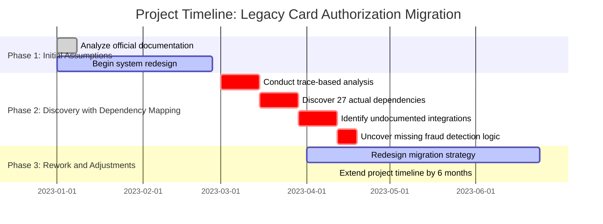

Key findings during the discovery phase revealed a drastically different system landscape. The legacy card authorization system actually interacted with twenty-seven different services, including:

- **Undocumented integrations** with ATM networks, third-party loyalty programs, and a legacy mainframe settlement system assumed to be decommissioned.
- **Critical fraud detection algorithms**, unexpectedly located in an unlisted middleware component, entirely outside the authorization service.

These surprises forced the project team to extend the timeline by six months and completely rework their migration strategy to align with the actual production architecture rather than the theoretical documentation. This situation highlights the risks of relying solely on outdated or incomplete documentation for critical infrastructure projects.

### SRE Best Practice: Evidence-Based Investigation

SRE teams should implement systematic dependency discovery through distributed tracing rather than relying solely on documentation or tribal knowledge. This approach begins with comprehensive instrumentation of customer-facing transaction flows, ensuring trace context propagates across all service boundaries. Once instrumentation is in place, teams should generate dependency maps based on actual production traffic patterns rather than controlled test scenarios, as many dependencies only emerge under specific production conditions or data patterns.

Evidence-based investigation requires covering multiple time windows (business hours, overnight processing, month-end, etc.) to capture the full dependency spectrum, as some integrations only activate during specific operational periods. Engineers should analyze traces from multiple transaction types, as different banking operations often involve completely different dependency chains despite appearing related from a customer perspective.

When discrepancies emerge between documented architecture and observed behavior, SREs should conduct collaborative verification sessions with service owners to understand the business purpose of unexpected dependencies rather than assuming they are erroneous. These sessions often reveal important historical context and business requirements that explain why unexpected connections exist, essential information for any modernization planning.

To guide teams in implementing evidence-based investigation, the following checklist outlines key steps:

#### Checklist: Evidence-Based Investigation for Dependency Mapping

1. **Instrument Transaction Flows**

   - Ensure trace context propagates across all service boundaries.
   - Focus on customer-facing transactions as a starting point.

2. **Capture Production Traffic**

   - Generate dependency maps based on real production data.
   - Avoid relying solely on test scenarios, which may miss critical dependencies.

3. **Analyze Multiple Time Windows**

   - Collect traces across different operational periods (e.g., business hours, overnight, month-end).
   - Identify dependencies that only activate under specific conditions.

4. **Evaluate Transaction Types**

   - Investigate traces for diverse transaction types to uncover unique dependency chains.
   - Treat seemingly related operations as distinct to avoid overlooking hidden dependencies.

5. **Collaborate on Discrepancy Analysis**

   - Review unexpected dependencies with service owners to understand their business context.
   - Document findings, including historical context and rationale, for future reference.

6. **Implement Continuous Validation**

   - Automate the comparison of expected and observed service interactions.
   - Set up alerts for undocumented dependencies or missing expected interactions.

By following this checklist, SRE teams can establish a structured and repeatable approach to uncovering the true service landscape, transforming dependency management into a proactive and ongoing capability.

### Banking Impact

The business consequences of inaccurate dependency understanding are severe and multifaceted in banking environments. Dependency-related issues affect financial performance, operational efficiency, customer satisfaction, and regulatory compliance. The table below summarizes the key impacts:

| **Category** | **Impact Description** | **Metrics/Examples** |
| ----------------------- | ----------------------------------------------------------------------------------- | --------------------------------------------------------------------------------------- |
| **Financial Impact** | Failed modernization initiatives due to missed dependencies. | Costs between **$3-7 million** for major systems. |
| | Prolonged reliance on legacy platforms increases operational expenses. | **15-30% higher operational costs** for legacy systems compared to modern alternatives. |
| **Customer Experience** | Disruptions caused by undocumented dependencies result in degraded service quality. | **3-5% increase in customer attrition** following a major disruption. |
| | Increased abandoned transactions due to unexpected service interactions. | Direct revenue loss from abandoned transactions. |
| **Regulatory Risk** | Undocumented dependencies create compliance gaps in critical systems. | Audit failures with penalties ranging from **$50,000 to several million dollars**. |
| | Prolonged compliance gaps increase financial and reputational risk. | Severity and duration determine penalty impact. |
| **Operational Risk** | Longer incident resolution times due to undocumented service relationships. | **35-45% longer MTTR** for incidents involving hidden dependencies. |
| | Outages in major payment platforms cause direct financial losses. | **$500,000 to $2 million per hour** of disruption. |

These impacts highlight the importance of accurate and evidence-based dependency mapping for managing financial, operational, and regulatory risks. By uncovering hidden dependencies and aligning architectural understanding with actual system behavior, banks can mitigate these risks and improve both system resilience and modernization outcomes.

### Implementation Guidance

#### Step-by-Step Process for Dependency Mapping Implementation

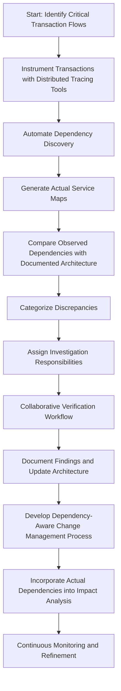

1. **Identify Critical Transaction Flows**\
   Begin with high-value customer journeys such as payments, account opening, and trading operations. These critical flows provide a focused starting point for mapping dependencies that impact core business functionality.

2. **Instrument Transactions with Distributed Tracing Tools**\
   Use distributed tracing tools to collect trace data with comprehensive context propagation across all service boundaries, ensuring end-to-end visibility of transaction flows.

3. **Automate Dependency Discovery**\
   Continuously analyze trace data using service mesh technologies (e.g., Istio, Linkerd) or specialized dependency analysis platforms. This step generates dynamic, evidence-based service maps that reflect the actual system behavior.

4. **Compare Observed Dependencies with Documented Architecture**\
   Reconcile the dynamically generated service maps with the current architectural documentation. Identify mismatches to uncover undocumented dependencies or deviations from the intended design.

5. **Categorize Discrepancies and Assign Responsibilities**\
   Systematically categorize discrepancies into documentation gaps, implementation shortcuts, or architectural issues. Assign investigation responsibilities to relevant teams for detailed analysis.

6. **Collaborative Verification Workflow**\
   Facilitate joint sessions between architecture teams and service owners to review unexpected dependencies. Ensure both technical and business contexts are understood and properly documented.

7. **Update Architecture Documentation**\
   Incorporate verified findings into the architectural documentation, ensuring it accurately reflects the production environment.

8. **Develop Dependency-Aware Change Management**\
   Embed real-world dependency relationships into change management processes. Assess the impact of proposed changes against the actual production landscape to mitigate risks associated with unexpected dependencies.

9. **Continuous Monitoring and Refinement**\
   Establish ongoing monitoring of dependency relationships using automated tools to ensure the architectural understanding remains accurate as the system evolves.

## Panel 2: Critical Path Analysis - Identifying Transaction Performance Bottlenecks

### Scene Description

A performance optimization workshop at a financial institution focused on improving securities trading transaction speeds. The central screen displays trace visualizations of trading transactions with the critical path highlighted in red—showing the exact sequence of dependent operations that determine overall transaction time. Engineers are analyzing how different services contribute to the total processing time, with a clear visualization showing that 70% of the transaction latency comes from just three services in the critical path, while optimization efforts had previously focused on non-critical components.

Below is a representation of the critical path visualization and timeline comparison discussed during the workshop:

#### Critical Path Visualization

```mermaid
graph TD
    Start[Start of Transaction] --> ServiceA[Service A (40ms)]
    ServiceA --> ServiceB[Service B (30ms)]
    ServiceB --> ServiceC[Service C (14ms)]
    ServiceC --> End[End of Transaction]
    subgraph Non-Critical Services
        Start --> ServiceX[Service X (5ms)]
        ServiceX --> ServiceY[Service Y (10ms)]
    end
    ServiceX --> ServiceB
```

In this diagram:

- The critical path is highlighted in red, showing the sequential operations (Service A → Service B → Service C) that determine the overall transaction time.
- Non-critical services (such as Service X and Service Y) run in parallel and do not contribute to the critical path latency.

#### Timeline Comparison

```plaintext
Original Latency Breakdown:          Optimized Latency Breakdown:
+--------------------------------+   +--------------------------------+
| Service A: 40ms                |   | Service A: 20ms                |
| Service B: 30ms                |   | Service B: 10ms                |
| Service C: 14ms                |   | Service C: 10ms                |
| Non-Critical Services: 36ms    |   | Non-Critical Services: 36ms    |
|                                |   |                                |
| Total: 120ms                   |   | Total: 40ms                   |
+--------------------------------+   +--------------------------------+
```

The timeline comparison highlights the dramatic improvements possible when optimization efforts are focused on reducing latencies within the critical path services. By addressing Service A, B, and C, transaction times could potentially be reduced from 120ms to just 40ms, while efforts on non-critical services yield minimal impact despite significant engineering effort.

### Teaching Narrative

Critical path analysis transforms performance optimization from broad-based improvement attempts to surgical precision in banking systems where milliseconds matter. Financial transactions like payments, trades, or loan applications follow complex paths through dozens of services, but not all services contribute equally to transaction time. The critical path—the longest sequence of dependent operations that cannot be parallelized—ultimately determines the minimum possible transaction duration. Distributed tracing reveals this critical path through precise timing of causal relationships between operations, showing exactly which services and dependencies actually determine overall transaction performance. This evidence-based approach transforms optimization strategy from intuitive guesswork to data-driven precision, ensuring engineering resources focus on the specific services actually constraining transaction completion. For financial institutions where performance directly impacts competitive advantage—particularly in time-sensitive domains like trading, payment processing, or real-time fraud detection—this critical path precision prevents the common anti-pattern of optimizing non-critical services that appear busy but contribute little to overall transaction time. Engineers can visualize exactly where each millisecond is spent, distinguish between parallel operations and truly sequential dependencies, and identify which specific services offer the greatest potential performance improvements. This targeted approach ultimately delivers maximum performance gains from limited engineering resources by focusing optimization efforts precisely where they will have the greatest customer and business impact.

### Common Example of the Problem

A leading investment bank was experiencing customer complaints about the slowness of their algorithmic trading platform, with execution times averaging 150ms—significantly higher than industry benchmarks of 50-80ms. The optimization team initially focused on the most resource-intensive components based on CPU and memory metrics, spending three months optimizing the market data processing service and order validation engine, reducing their internal latency by 60%. However, when the optimized system was deployed to production, overall transaction times improved by only 8ms—a negligible improvement despite significant engineering effort.

When the team finally implemented critical path analysis using distributed tracing, they discovered a completely different optimization target. While the market data and validation services consumed significant resources, most of their processing happened in parallel and wasn't on the critical path. The actual performance bottleneck was a seemingly trivial order ID generation service that added 65ms of sequential latency to every transaction through an inefficient database call. Additionally, an external credit check was being performed synchronously for every trade despite rarely changing during a trading session.

Below is a simplified timeline showing the before-and-after states of the critical path, illustrating the impact of the targeted optimizations:

#### Before Optimization

```
[Market Data Processing (50ms)] 
    └── [Order Validation (40ms)] 
        └── [Order ID Generation (65ms)] 
            └── [Credit Check (70ms)] 
                Total: 150ms
```

#### After Optimization

```
[Market Data Processing (50ms)] 
    └── [Order Validation (40ms)] 
        └── [Order ID Generation (10ms)] 
            └── [Cached Credit Check (2ms)] 
                Total: 72ms
```

By addressing these two critical path components—refactoring the ID service and implementing client-side caching for credit checks—the team reduced overall transaction times from 150ms to 72ms in just three weeks. This targeted approach achieved greater improvement through focused optimization than months of effort spent on non-critical components.

### SRE Best Practice: Evidence-Based Investigation

SRE teams should implement systematic critical path analysis based on distributed tracing rather than resource utilization metrics alone. The investigation should begin with comprehensive end-to-end instrumentation of transaction flows, ensuring every operation and dependency is captured with precise timing information. Special attention should be paid to ensuring trace context propagates through asynchronous operations and third-party dependencies to provide complete path visibility.

Once instrumentation is in place, teams should collect traces across various load conditions and transaction patterns, as critical paths often shift under different operational scenarios. Analysis should focus on identifying the longest chain of sequential operations that directly determine overall transaction time, distinguishing between operations that happen in series versus those occurring in parallel.

Evidence-based critical path analysis requires looking beyond individual service performance to understand dependency relationships—identifying where seemingly fast services create bottlenecks by blocking other operations or where optimization opportunities exist through increased parallelization rather than component tuning. Engineers should categorize operations based on their critical path contribution: primary bottlenecks directly on the critical path, secondary bottlenecks that occasionally impact the critical path, and non-critical operations that rarely or never determine overall transaction time.

The most mature SRE teams implement continuous critical path monitoring, automatically identifying when path patterns change due to code deployments, data volume shifts, or external dependency behavior changes. This ongoing analysis ensures optimization efforts remain focused on the actual transaction constraints rather than theoretical bottlenecks identified in previous analyses that may no longer represent current system behavior.

#### Checklist: Steps for Evidence-Based Critical Path Investigation

1. **Instrument the System**

   - Enable distributed tracing across all services, ensuring every operation and dependency is captured with precise timing.
   - Ensure trace context propagates through asynchronous tasks and third-party dependencies for complete visibility.

2. **Collect and Analyze Traces**

   - Gather traces from various transaction patterns and under different load conditions to capture critical path variations.
   - Identify the critical path by determining the longest sequence of dependent operations that cannot be parallelized.

3. **Categorize Operations**

   - Classify operations based on their critical path impact:
     - **Primary Bottlenecks**: Directly on the critical path and dominant contributors to transaction time.
     - **Secondary Bottlenecks**: Occasionally impact the critical path based on conditions.
     - **Non-Critical Operations**: Rarely or never affect overall transaction time.

4. **Investigate Dependency Relationships**

   - Look beyond individual service performance to evaluate how dependencies impact overall latency.
   - Identify bottlenecks caused by blocked operations or opportunities for increased parallelization.

5. **Implement Continuous Monitoring**

   - Set up automated systems to monitor critical path patterns for changes due to deployments, shifts in data volume, or external dependency behavior.
   - Regularly review and update optimization efforts based on current transaction constraints.

6. **Focus Optimization Efforts**

   - Prioritize improvements on primary bottlenecks with the greatest potential impact on reducing transaction time.
   - Avoid expending resources on optimizing non-critical operations that do not meaningfully affect performance.

By following this checklist, SRE teams can adopt an evidence-based approach to critical path analysis, ensuring their efforts are focused where they will deliver the most significant improvements to transaction performance.

### Banking Impact

The business consequences of unfocused performance optimization are substantial and multifaceted in banking environments. Misdirected engineering resources create direct financial waste, with large banks typically spending $500,000 to $2 million annually on performance initiatives that yield minimal customer impact due to focusing on non-critical path components.

A focused approach to optimizing the critical path has significant financial, operational, and customer experience impacts, as summarized below:

| **Category** | **Impact** | **Details** |
| -------------------------- | --------------------------------------------------------------------------- | --------------------------------------------------------------------------------------------------------- |
| **Financial Waste** | $500,000 to $2 million/year wasted on non-critical optimizations | Resources spent improving services that don't affect transaction latency or business outcomes. |
| **Revenue Gains** | $50,000 to $250,000/year per millisecond reduction in critical path latency | Faster trading execution enables competitive pricing, higher transaction volumes, and market share gains. |
| **Market Share** | 2-3% additional market share captured with 10ms faster trading execution | Faster platforms outperform competitors in time-sensitive domains like trading. |
| **Customer Retention** | 25% higher abandonment rates for payment/transfer times exceeding 3 seconds | Faster digital banking services improve user experience and reduce lost transactions. |
| **Trading Frequency** | 15-20% transaction increase on faster wealth management platforms | Faster portfolio loading times encourage more frequent customer interactions. |
| **Operational Efficiency** | 30-50% higher transaction throughput from existing infrastructure | Optimizing critical path bottlenecks maximizes utilization of current systems. |
| **CapEx Savings** | Infrastructure expansion deferred by 12-18 months | Avoids millions in unnecessary hardware investments by improving critical path efficiency. |

For trading platforms, execution speed directly impacts competitive position and revenue generation. Each millisecond of latency reduction in the critical path typically yields measurable financial benefits, enabling more competitive pricing and higher transaction volumes. Studies show that trading systems with 10ms faster execution times capture approximately 2-3% additional market share from slower competitors.

Customer experience and retention are also significantly affected by transaction speed in digital banking channels. Research indicates that mobile banking sessions with payment or transfer times exceeding 3 seconds experience 25% higher abandonment rates, directly reducing transaction revenue. For wealth management platforms, portfolio loading times correlating with critical path performance directly impact trading frequency, with customers on faster platforms executing 15-20% more transactions annually than those experiencing slower response times.

Operational capacity and infrastructure costs are further optimized through critical path efficiency. Banks report that optimizing critical path bottlenecks typically delivers 30-50% higher transaction throughput from existing infrastructure compared to general performance tuning, directly reducing the capital expenditure required to support business growth. For major payment processors, critical path optimization frequently defers infrastructure expansion cycles by 12-18 months, saving millions in unnecessary hardware investments.

### Implementation Guidance

1. **Implement Comprehensive Transaction Tracing**\
   Use distributed tracing tools, such as Jaeger or OpenTelemetry, to capture high-precision timing data and parent-child relationships across all services involved in critical transaction types. Below is an example of configuring OpenTelemetry for a Java-based microservice:

   ```java
   // OpenTelemetry Configuration Example
   import io.opentelemetry.api.GlobalOpenTelemetry;
   import io.opentelemetry.api.trace.Tracer;
   import io.opentelemetry.sdk.OpenTelemetrySdk;
   import io.opentelemetry.sdk.trace.SdkTracerProvider;
   import io.opentelemetry.sdk.trace.export.BatchSpanProcessor;
   import io.opentelemetry.exporter.otlp.trace.OtlpGrpcSpanExporter;

   public class OpenTelemetryConfig {
       public static Tracer initializeTracer() {
           // Configure OTLP exporter
           OtlpGrpcSpanExporter spanExporter = OtlpGrpcSpanExporter.builder()
                   .setEndpoint("http://otlp-collector:4317")
                   .build();

           // Configure Tracer provider with span processor
           SdkTracerProvider tracerProvider = SdkTracerProvider.builder()
                   .addSpanProcessor(BatchSpanProcessor.builder(spanExporter).build())
                   .build();

           // Set the global OpenTelemetry instance
           OpenTelemetrySdk.builder().setTracerProvider(tracerProvider).buildAndRegisterGlobal();

           // Return the configured tracer
           return GlobalOpenTelemetry.getTracer("com.example.trading");
       }
   }
   ```

2. **Develop Critical Path Visualization Capabilities**\
   Create tooling to generate waterfall diagrams from trace data. Use color-coding to highlight critical path operations (e.g., red for critical operations, green for parallelizable steps). The following pseudo-code illustrates how to process trace data for critical path calculation:

   ```python
   def calculate_critical_path(trace_data):
       # Parse trace data and identify dependencies
       operations = parse_trace(trace_data)
       critical_path = []
       max_duration = 0

       for operation in operations:
           if operation.is_sequential_dependency():
               critical_path.append(operation)
               max_duration += operation.duration

       return critical_path, max_duration
   ```

3. **Establish Systematic Bottleneck Identification**\
   Analyze trace data to categorize operations by their critical path impact. Use metrics such as operation duration and frequency on the critical path to derive a prioritized list of optimization targets. For example:

   | Service Name | Operation | Critical Path Impact (%) |
   | -------------- | ---------------- | ------------------------ |
   | OrderService | validateOrder | 35% |
   | PaymentService | authorizePayment | 25% |
   | Database | queryTrades | 10% |

4. **Create a Parallelization Opportunity Analysis**\
   Automate detection of sequential operations that could be parallelized. For instance, identify synchronous external calls or blocking I/O operations. Visualize these opportunities using a simple ASCII flowchart:

   ```
   [Service A] --> [Service B] --> [Service C]
       |             (sync)          (sync)
       v
   [Parallelization Candidate: Service A -> Service B]
   ```

   Focus optimization efforts on refactoring these areas for concurrency.

5. **Implement Continual Critical Path Monitoring**\
   Integrate monitoring tools that dynamically track critical path changes. Use alerts to notify engineers when new bottlenecks emerge. For example, with OpenTelemetry, you can export trace metrics to Prometheus and set alert thresholds:

   ```yaml
   # Prometheus Alert Example
   alert: CriticalPathLatencyHigh
   expr: histogram_quantile(0.95, rate(trace_duration_seconds_bucket{service="OrderService"}[5m])) > 100
   for: 1m
   labels:
     severity: critical
   annotations:
     summary: "Critical path latency for OrderService exceeds 100ms"
   ```

## Panel 3: Hidden Coupling Detection - Understanding Shared Banking Resources

### Scene Description

An incident review meeting is underway following a major disruption that unexpectedly affected multiple seemingly independent banking systems simultaneously. The investigation team is analyzing a specialized dependency visualization that highlights hidden coupling points discovered through trace analysis. These hidden dependencies reveal how separate business domains—consumer banking, wealth management, and lending—that appeared architecturally isolated actually share several critical components: a common customer authentication service, a shared reference data cache, and a legacy customer information database.

The following diagram illustrates the discovered dependencies and the cascading failure initiated by a configuration change to the authentication service. This change propagated across the shared dependencies, impacting all three business domains despite their apparent separation.

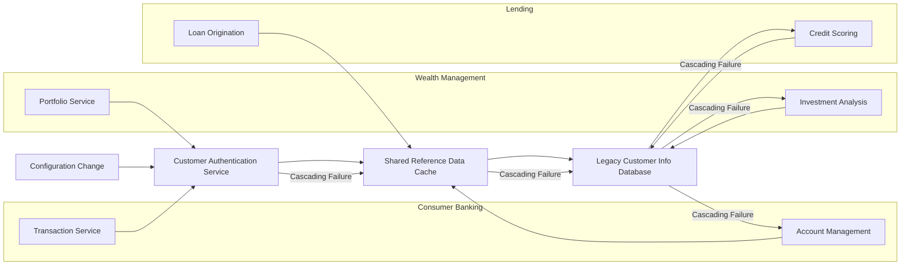

As the engineers discuss the visualization, they recognize how this hidden coupling detection will fundamentally reshape their approach to change management and isolation strategies. By uncovering these cross-domain dependencies, the team gains critical insights into how shared components can amplify risks and trigger cascading failures, enabling them to design more robust isolation mechanisms and mitigate cross-domain incidents in the future.

### Teaching Narrative

Hidden coupling detection transforms risk management from theoretical boundaries to empirical understanding of actual system relationships in banking environments. Financial institutions frequently organize systems into seemingly isolated business domains—retail banking, wealth management, commercial services, capital markets—with the assumption that issues in one domain won't affect others. Distributed tracing challenges this assumption by revealing hidden coupling points that create unexpected cross-domain dependencies despite formal architectural separation. These coupling points typically include shared services (authentication, reference data), common infrastructure (databases, message buses), or indirect dependencies (shared libraries, configuration systems) that create invisible connections between supposedly isolated domains. This empirical dependency discovery transforms risk assessment from documentation-based assumptions to evidence-based understanding of actual system relationships. For financial institutions where system failures can have immediate monetary and regulatory consequences, this hidden coupling visibility enables more effective isolation strategies, more accurate impact analysis for changes, and more realistic risk assessments based on actual rather than theoretical dependencies. Engineers can identify exactly which shared components could potentially create cross-domain incidents, implement targeted isolation mechanisms around critical coupling points, and design changes with full awareness of potential ripple effects across seemingly separate business systems. This coupling-aware approach ultimately reduces unexpected incidents by ensuring architectural decisions and operational practices reflect the empirical reality of system interdependencies rather than idealized but inaccurate separation models.

### Common Example of the Problem

A global bank experienced a severe incident when what should have been a routine configuration change to their retail banking authentication service unexpectedly triggered a complete outage of their wealth management platform and significant disruption to their mortgage origination system. The initial change was considered low-risk because it was limited to a simple timeout parameter adjustment in a service that, according to architecture diagrams, only supported retail banking applications. The bank's change management process followed standard domain isolation protocols, with approvals only from retail banking stakeholders and testing limited to retail banking functions.

When the change was implemented, it immediately became apparent that the supposedly isolated retail authentication service was actually a critical shared dependency for multiple business domains. The modified timeout parameters caused authentication failures that cascaded through a hidden web of dependencies, ultimately affecting seven apparently separate business systems. The incident lasted four hours and resulted in approximately $3.2 million in trading revenue loss from the wealth platform outage alone.

#### Summary Table of Hidden Dependencies and Impacts

| **Hidden Dependency** | **Cause of Failure** | **Impacted Domains** | **Cascading Effect** |
| ------------------------------------- | ----------------------------------- | -------------------------- | --------------------------------------------------------------------------- |
| Retail Banking Authentication Service | Timeout parameter misconfiguration | Wealth Management, Lending | Authentication failures blocked access to critical systems across domains. |
| Shared Reference Data Cache | Propagated misconfigured parameters | All Domains | Invalid configuration spread across systems, amplifying failures. |
| Common Customer Profile Database | Dependent on authentication service | Lending, Wealth Management | Database queries failed due to authentication issues, disrupting workflows. |

#### Cascading Impact Flow Diagram

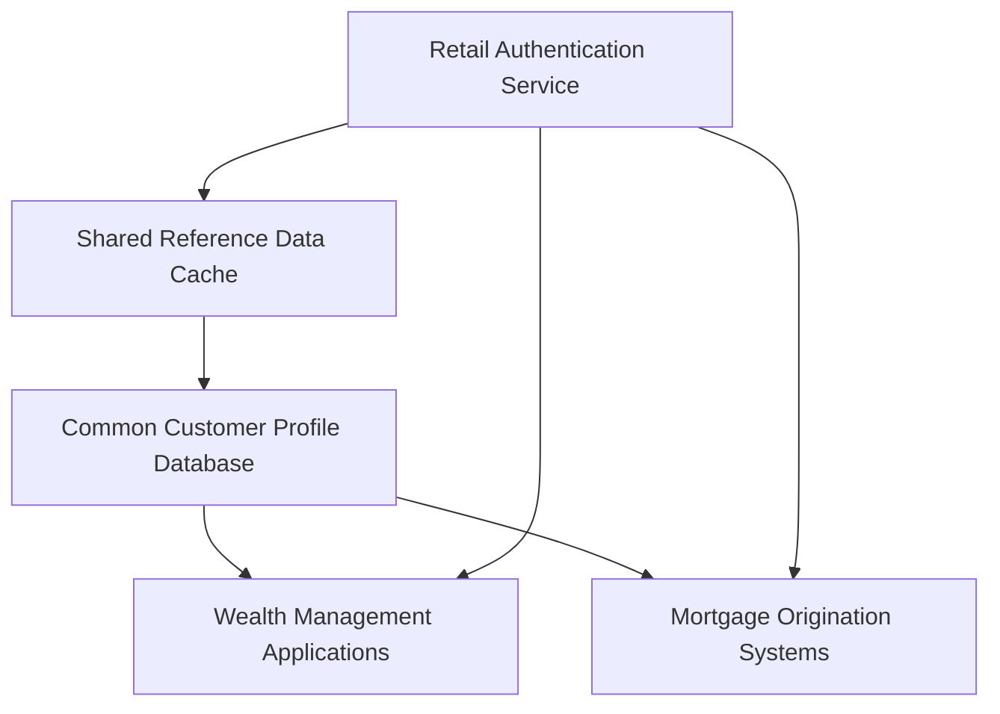

#### Key Lessons

- **Hidden Coupling Visibility**: The incident exposed undocumented dependencies between business domains, revealing the critical need for dependency mapping through trace analysis.
- **Enhanced Change Management**: The failure highlighted the inadequacy of domain-specific change risk assessments, emphasizing the importance of evaluating shared resources across the organization.
- **Proactive Isolation Strategies**: Identifying and isolating critical coupling points can prevent cascading failures, reducing the impact of localized changes.

Post-incident trace analysis revealed an extensive network of hidden coupling through shared services that weren't properly documented. The authentication service was directly used by wealth management applications despite being "owned" by retail banking, a shared reference data cache propagated authentication configuration changes across domains, and several systems unexpectedly depended on a common customer profile database that was affected by authentication failures. None of these relationships were visible in the formal architecture documentation that guided change risk assessment and testing scope.

### SRE Best Practice: Evidence-Based Investigation

SRE teams should implement systematic hidden coupling detection through distributed tracing rather than relying solely on architectural documentation for isolation assumptions. This investigation begins with comprehensive cross-domain instrumentation that ensures trace context propagates across business unit boundaries, revealing actual communication paths regardless of formal organizational separation.

Once instrumentation spans business domains, teams should analyze trace data to identify shared dependencies that create cross-domain coupling, focusing particularly on authentication services, data stores, message buses, and infrastructure components that may serve multiple business functions despite nominal isolation. Special attention should be paid to resource contention patterns where systems that appear independent in documentation actually compete for common resources—database connections, processing capacity, or network bandwidth.

Evidence-based coupling analysis requires testing failure hypotheses through targeted fault injection or chaos engineering experiments guided by trace-discovered dependencies. These controlled experiments verify whether theoretical isolation mechanisms actually prevent failure propagation in practice. Engineers should create comprehensive coupling maps that document both direct dependencies (explicit service calls) and indirect relationships (shared databases, common infrastructure) that could enable failure propagation across domain boundaries.

The most mature SRE teams implement continuous coupling detection by automatically analyzing trace patterns to identify new shared dependencies as they emerge through development activities or infrastructure changes. This ongoing monitoring transforms coupling detection from a point-in-time exercise to a continuous governance capability that maintains accurate isolation understanding as systems evolve.

#### Practical Checklist for Evidence-Based Investigation

To make evidence-based investigation actionable, SRE teams can follow this practical checklist:

1. **Set Up Cross-Domain Instrumentation**

   - Implement distributed tracing across all business domains.
   - Ensure trace context propagates across services, boundaries, and organizational silos.
   - Validate instrumentation coverage for critical shared services (e.g., authentication, data stores).

2. **Identify Hidden Dependencies**

   - Analyze trace data for shared components like databases, message buses, and infrastructure.
   - Pay attention to resource contention patterns and indirect dependencies.
   - Confirm that no critical communication paths are omitted in the trace data.

3. **Map Shared Dependencies**

   - Create a dependency map that includes:
     - **Direct Dependencies:** Services making explicit calls to one another.
     - **Indirect Dependencies:** Shared infrastructure or libraries that connect otherwise isolated domains.
   - Visualize the dependency map to clearly highlight high-risk coupling points.

4. **Test Failure Hypotheses**

   - Design fault injection or chaos engineering experiments targeting trace-identified dependencies.
   - Verify whether isolation mechanisms prevent cascading failures.
   - Document experiment results to validate or update the dependency map.

5. **Implement Continuous Monitoring**

   - Automate trace analysis to detect new shared dependencies as they emerge.
   - Set up alerts for significant changes in dependency patterns.
   - Regularly review and update coupling maps to reflect evolving system interdependencies.

6. **Integrate Findings into Change Management**

   - Use dependency maps to assess the potential impact of planned changes.
   - Implement targeted isolation mechanisms for high-risk coupling points.
   - Incorporate updated risk insights into operational practices and architectural decisions.

By following this checklist, teams can operationalize evidence-based investigation and proactively manage hidden coupling risks, reducing the likelihood of unexpected cross-domain incidents.

### Banking Impact

The business consequences of hidden coupling between nominally isolated domains are severe and multifaceted in banking environments. Cross-domain outages create amplified financial impact compared to isolated incidents, with banks reporting that multi-domain disruptions typically cause 3-5 times greater revenue loss than single-domain events of similar duration due to the broader impact on customer services and transactions.

Below is a summary of the key impacts:

| **Impact Area** | **Description** | **Metrics/Examples** |
| ---------------------- | ------------------------------------------------------------------------------------------------------------------------------------------------- | ---------------------------------------------------------------------------------------------------------- |
| **Financial Impact** | Cross-domain outages amplify revenue losses due to disruptions affecting multiple services and transactions simultaneously. | Multi-domain disruptions result in 3-5x higher revenue losses compared to single-domain incidents. |
| **Customer Trust** | Simultaneous failures across unrelated services erode trust, creating a perception of systemic instability rather than isolated issues. | Customers affected by multi-service disruptions are 40-60% more likely to reduce their relationship depth. |
| **Regulatory Impact** | Hidden coupling can trigger compliance failures across multiple regulated functions, increasing regulatory scrutiny and penalties. | Cross-domain compliance violations result in 2-3x higher penalties compared to isolated incidents. |
| **Operational Impact** | Incident resolution becomes more complex and time-consuming due to undocumented dependencies that must be discovered during the response process. | Mean time to resolution increases by 50-70% for incidents involving hidden coupling. |

Operational complexity during incidents increases dramatically when hidden coupling causes unexpected cross-domain impact. For major banking platforms, each additional hour of multi-domain disruption typically costs between $1-3 million in direct financial impact and recovery costs. By addressing hidden coupling, banks can reduce these impacts, enhance operational resilience, and ensure more predictable recovery from incidents.

### Implementation Guidance

To effectively detect and manage hidden coupling in banking systems, follow the steps below:

#### Checklist for Implementation

1. **Deploy Cross-Domain Tracing Infrastructure**

   - Ensure consistent instrumentation and context propagation across all business units.
   - Focus on shared services like authentication, customer data platforms, and reference data services that are likely to create hidden dependencies.

2. **Develop Coupling Visualization Capabilities**

   - Create specialized dependency views that highlight shared infrastructure, services, and data stores.
   - Emphasize potential failure propagation paths between isolated business domains.

3. **Establish Regular Coupling Analysis Processes**

   - Schedule systematic examination of trace data to identify shared resources and dependencies.
   - Generate comprehensive maps of both direct and indirect relationships across business domains, independent of organizational boundaries.

4. **Design and Perform Isolation Verification Testing**

   - Use trace-discovered dependency information to create targeted fault injection experiments.
   - Test whether theoretical isolation mechanisms effectively prevent cross-domain failure propagation in production environments.

5. **Implement Coupling-Aware Change Management**

   - Integrate hidden dependency data into the change impact analysis process.
   - Ensure changes to shared components involve appropriate stakeholder review and comprehensive testing across all affected business domains.

#### Key Considerations

- **Start Small:** Begin with critical shared services (authentication, customer data) and expand tracing and analysis capabilities incrementally.
- **Iterative Refinement:** Continuously refine visualization and analysis tools based on incident reviews and stakeholder feedback.
- **Cross-Domain Collaboration:** Engage engineers, architects, and domain experts from all business units to ensure shared understanding of dependencies and risks.

#### Example Workflow for Hidden Coupling Detection

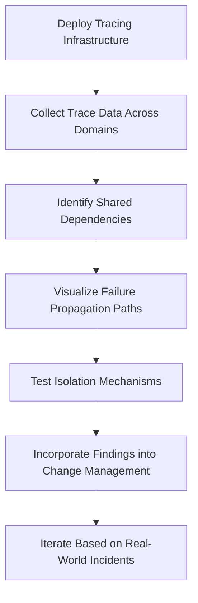

By following this structured approach, teams can transform their risk management and isolation practices to align with the empirical reality of system interdependencies, reducing unexpected incidents and improving overall system resilience.

## Panel 4: Third-Party Dependency Analysis - Managing External Banking Services

### Scene Description

A vendor management meeting at a large bank where technology and procurement teams are evaluating financial service providers. Unlike traditional reviews focused on contracts and SLAs, this session centers around empirical dependency analysis derived from trace data. Visualization screens show exactly how each third-party service integrates with internal systems, with detailed metrics on performance, error rates, and availability measured at the transaction level. Heatmaps highlight which external dependencies have the greatest impact on critical customer journeys, while trend analysis shows performance degradation patterns for specific providers. The procurement lead is using this evidence-based assessment to challenge a vendor's claimed 99.99% availability when trace data shows their actual impact on end-to-end transaction success is significantly lower due to subtle integration issues invisible in traditional monitoring.

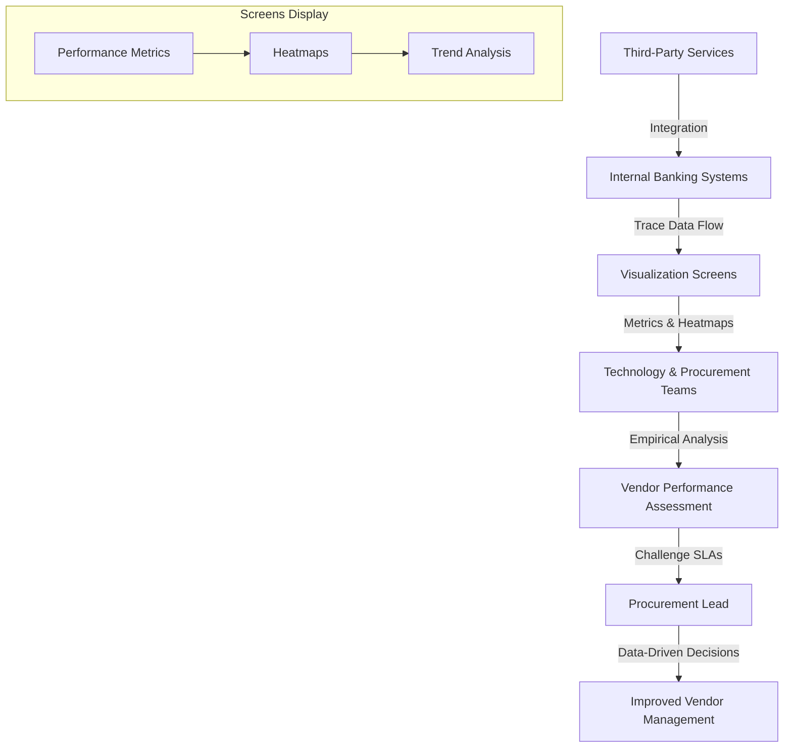

This diagram provides a visual representation of the vendor management meeting setup. It illustrates the flow of trace data from internal banking systems and third-party services to visualization screens, the role of metrics and heatmaps in analysis, and how this data informs vendor performance assessments and procurement decisions.

### Teaching Narrative

Third-party dependency analysis transforms vendor management from contractual enforcement to empirical performance understanding in banking ecosystems increasingly reliant on external services. Financial institutions depend on complex networks of third-party providers for functions ranging from payment processing to identity verification, credit scoring, market data, and regulatory services—creating critical dependencies outside direct institutional control. Distributed tracing extends observability across these organizational boundaries, providing objective evidence of exactly how external services perform in the context of actual banking transactions rather than isolated test environments. This empirical visibility transforms vendor relationships from subjective assessments to data-driven evaluations based on measured impact on customer journeys.

For banking operations where service integration issues often manifest in subtle ways invisible to traditional monitoring—intermittent latency, occasional timeouts, or inconsistent error handling—this transaction-level visibility enables more effective third-party governance. Financial institutions can identify precisely which external dependencies most directly impact customer experience, distinguish between vendor-caused issues and integration problems, measure actual performance against contractual SLAs using customer-centric metrics, and prioritize vendor management efforts based on business impact rather than vendor size or contract value.

This evidence-based approach ultimately improves both technology decisions and commercial relationships by replacing subjective vendor assessments with objective, transaction-level performance data that reveals the true customer impact of external dependencies.

#### Transformation Summary: Traditional Vendor Management vs. Empirical Performance Understanding

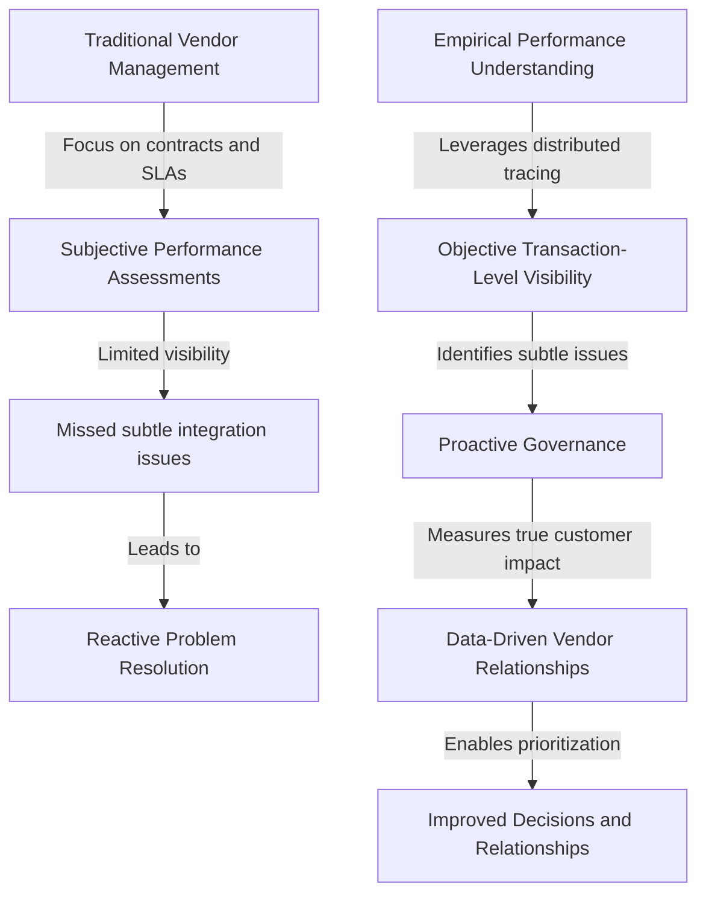

By shifting from traditional vendor management to empirical performance understanding, financial institutions gain actionable insights into third-party dependencies. This transformation enables proactive management of external services based on their real-world impact on customer journeys, ultimately driving better outcomes across technology and business functions.

### Common Example of the Problem

A major retail bank had integrated a third-party identity verification service into their digital account opening process to comply with Know Your Customer (KYC) regulations. The vendor consistently reported 99.97% availability according to their status page and monthly SLA reports, well above the contractually required 99.9%. However, the bank's new customer acquisition numbers showed a puzzling pattern—approximately 8% of digital account applications were being abandoned specifically during the identity verification step, significantly higher than other stages in the process.

When the bank implemented trace-based third-party dependency analysis, they discovered a dramatic disconnect between the vendor's reported performance and actual customer impact. While the identity verification API indeed responded successfully 99.97% of the time, trace data revealed several critical issues invisible to traditional monitoring:

| **Issue** | **Observed Impact** | **Customer Impact** |
| ----------------------------------------- | ------------------------------------------------------------------------- | ------------------------------------------------------------------------------------------------------- |
| Response times exceeding SLA (12%) | 8+ seconds response times vs. the sub-3-second SLA | Frustration and abandonment during the application process, particularly for time-sensitive customers |
| Mobile-specific integration failures (6%) | Failures specific to mobile platforms not captured in synthetic API tests | Poor mobile experience, leading to distrust and higher drop-off rates for mobile users |
| Peak hour success rate drop (89%) | Subtle rate limiting caused by retries during peak hours (evening) | High abandonment rates during periods of peak customer activity, directly impacting acquisition targets |

The trace data provided indisputable evidence of the actual customer impact, enabling the bank to engage the vendor with specific performance data rather than general complaints. The analysis also revealed that the bank's own integration approach contributed to the problem—their retry strategy during peak hours was actually triggering the vendor's rate limiting mechanisms.

Based on this evidence, the bank negotiated a 40% service credit for SLA violations while simultaneously optimizing their integration pattern. These actions improved verification success rates to 98.5% and reduced application abandonment by 65%, showcasing the transformative potential of trace-based dependency analysis.

### SRE Best Practice: Evidence-Based Investigation

SRE teams should implement systematic third-party dependency analysis through distributed tracing that spans organizational boundaries, ensuring trace context propagates across external service calls to provide complete visibility into vendor interaction patterns. This instrumentation should capture not just technical success/failure metrics but customer-impacting dimensions including response time distributions, error patterns, and retry behaviors that affect end-to-end transaction success.

Once instrumented, teams should analyze external dependency patterns across various dimensions: performance distribution rather than just averages, error types beyond basic availability, behavioral consistency across different request types, temporal patterns showing how vendor performance varies by time of day or day of week, and capacity consistency revealing how service quality degrades under peak load.

Evidence-based third-party analysis requires moving beyond basic uptime monitoring to transaction outcome measurement—evaluating not just whether an API responds but whether it successfully fulfills its business purpose in the context of end-to-end customer journeys. Engineers should correlate external dependency performance with customer experience metrics to understand the direct impact of vendor behavior on business outcomes like abandonment rates, transaction completions, and customer satisfaction.

The most mature SRE teams implement comparative dependency analysis, benchmarking similar vendors against each other using consistent transaction-based metrics rather than vendor-provided availability claims. This comparative data enables evidence-based vendor selection and commercial negotiations based on actual performance impact rather than marketing claims or contractual promises that may not reflect real-world behavior.

#### Checklist: Steps for Evidence-Based Third-Party Dependency Analysis

1. **Establish Distributed Tracing**

   - Ensure trace context propagates across external service boundaries.
   - Instrument critical transaction flows to capture end-to-end visibility.

2. **Define Key Metrics**

   - Focus on customer-impacting metrics such as response time distributions, error patterns, and retry behaviors.
   - Measure transaction outcomes, not just API uptime.

3. **Analyze Dependency Patterns**

   - Examine performance beyond averages, including error categories and temporal trends.
   - Identify behavioral inconsistencies across request types and peak load conditions.

4. **Correlate with Customer Experience**

   - Link vendor performance to customer-facing outcomes like completion rates, abandonment rates, and satisfaction scores.

5. **Perform Comparative Analysis**

   - Benchmark vendors against one another using transaction-based metrics.
   - Use objective data to evaluate vendor effectiveness beyond SLA claims or marketing promises.

6. **Iterate and Refine**

   - Continuously monitor trace data for new patterns or emerging issues.
   - Adjust instrumentation and metrics as customer needs or third-party dependencies evolve.

### Banking Impact

The business consequences of ineffective third-party dependency management are substantial and multifaceted in banking environments increasingly reliant on external services. The following table quantifies the financial, operational, and regulatory impacts of poorly managed third-party dependencies, providing actionable insights for decision-makers:

| **Impact Area** | **Metric** | **Example Consequences** | **Quantified Impact** |
| ----------------------- | ----------------------------------------------------------------------------------------- | ------------------------------------------------------------------------------------------------------------ | ----------------------------------------------------------------------------------------------------------------------------------------------------------------------- |
| **Financial** | Lost transactions and reduced straight-through processing rates | Revenue loss due to failed or incomplete transactions | Optimized integrations increase transaction completion rates by 3-7%, translating to millions in additional revenue annually for large banks. |
| **Customer Experience** | Increased application abandonment during onboarding journeys | Higher drop-off rates during digital account opening due to latency in third-party services | Each additional second of latency in identity verification increases abandonment by 5-10%; cumulative abandonment can reach 30-40%, costing $250-500 per lost customer. |
| **Operational** | Exception handling workloads caused by third-party failures | Increased manual intervention to resolve issues stemming from suboptimal integrations | Poorly managed integrations generate 15-20% higher workloads, with each manual intervention costing $25-75 in operational expenses. |
| **Regulatory** | Compliance-related failures due to inadequate monitoring of critical third-party services | Regulatory penalties for issues in areas like sanctions screening, fraud detection, or customer verification | Financial institutions have faced penalties ranging from $50,000 to several million dollars for compliance failures linked to third-party service issues. |

This structured analysis highlights the tangible impacts ineffective third-party management can have on banking operations:

- **Financial Impact**: Lost transaction revenue and diminished straight-through processing efficiency directly affect profitability.
- **Customer Experience**: Latency and error-prone onboarding services lead to customer attrition and erosion of potential lifetime value.
- **Operational Efficiency**: Increased manual intervention burdens resources and raises operational costs.
- **Regulatory Risk**: Lack of oversight on vendor-provided compliance functions exposes institutions to significant fines and reputational damage.

By leveraging empirical performance data through distributed tracing, banks can mitigate these risks, improve operational efficiency, and strengthen their vendor governance frameworks.

### Implementation Guidance

1. Implement comprehensive third-party service instrumentation that captures detailed interaction metrics beyond basic success/failure, including response time distributions, error patterns, retry behaviors, and business outcome impacts for all critical external dependencies. For example, use distributed tracing libraries to propagate trace context across service boundaries, ensuring visibility into external service interactions. Below is a code snippet demonstrating how to instrument a third-party HTTP request using OpenTelemetry in Python:

   ```python
   from opentelemetry import trace
   from opentelemetry.instrumentation.requests import RequestsInstrumentor
   import requests

   # Initialize and configure tracing
   trace.set_tracer_provider(trace.TracerProvider())
   tracer = trace.get_tracer(__name__)
   RequestsInstrumentor().instrument()

   # Instrumented third-party service interaction
   with tracer.start_as_current_span("external_service_call") as span:
       try:
           response = requests.get("https://api.thirdparty.com/resource")
           span.set_attribute("http.status_code", response.status_code)
           span.set_attribute("http.response_time_ms", response.elapsed.total_seconds() * 1000)
           if response.status_code != 200:
               span.set_attribute("error", True)
               span.set_attribute("error.message", f"Unexpected status code: {response.status_code}")
       except Exception as e:
           span.set_attribute("error", True)
           span.set_attribute("error.message", str(e))
   ```

   This example captures metrics such as response times, status codes, and error details, and propagates the trace context for end-to-end transaction visibility.

2. Develop vendor-specific SLI dashboards that measure third-party performance from the perspective of customer journey impact rather than isolated API metrics. These dashboards should highlight how external behavior affects end-to-end transaction success across different channels and customer segments. Use tools like Grafana or Kibana to visualize important SLIs such as availability, latency percentiles, and error rates tied to customer-facing workflows.

3. Establish systematic vendor performance review processes that use trace-based evidence to evaluate actual service quality against contractual SLAs. This enables data-driven commercial conversations supported by indisputable transaction-level metrics rather than general performance concerns. For example, aggregate and compare trace data over time to identify recurring issues and present evidence during vendor reviews.

4. Create dependency impact mapping that quantifies the business effect of each third-party service on critical customer journeys. Use visual representations, such as a service dependency graph, to identify high-impact areas. Below is a simple text-based example:

   ```
   Customer Journey: Online Payment
   ├── Internal Service: Payment Gateway
       ├── External Dependency: Card Processor A
       ├── External Dependency: Fraud Detection Service
   ```

   Prioritize vendor management efforts and optimization investments based on measured customer and revenue impact rather than technical assumptions or contract value.

5. Implement resilience pattern testing that uses trace-discovered dependency behavior to design appropriate circuit breakers, fallback mechanisms, and graceful degradation approaches. These should be specifically calibrated to the actual failure modes observed in each external service rather than generic resilience patterns. For instance, use the following pseudocode for a circuit breaker pattern:

   ```
   if failures_in_window > threshold:
       trigger_circuit_breaker()
   else:
       attempt_request()
   ```

   Combine this approach with trace data to fine-tune thresholds and fallback strategies based on observed performance trends and failure characteristics.

## Panel 5: Dependency Health Monitoring - Early Warning Systems for Banking Services

### Scene Description

A service operations center at a financial institution where teams monitor system health through a dependency-aware dashboard. Unlike traditional monitoring showing isolated service status, this view displays a dynamic dependency graph colored by health status. Each node represents a service with health indicators derived from trace data—not just basic availability but error rates, latency percentiles, and unusual patterns specific to each dependency type.

Below is a simplified representation of the dependency-aware dashboard using a dynamic graph:

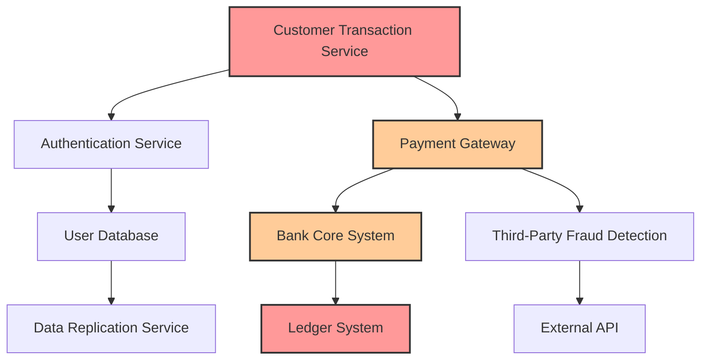

- **Key:** Nodes are colored by health status.
  - **Red:** Critical issues detected (e.g., `Customer Transaction Service`, `Ledger System`).
  - **Orange:** Warning thresholds exceeded (e.g., `Payment Gateway`, `Bank Core System`).
  - **Green (not shown):** Healthy services.

In this scenario, an alert notification highlights a developing problem in the `Third-Party Fraud Detection` service. While this service might seem minor on its own, the dependency visualization immediately reveals its criticality—it directly supports the `Payment Gateway`, which is essential for high-priority customer transactions. Engineers quickly prioritize this issue based on its impact on the dependency path, preventing a potential widespread disruption before customers are affected.

### Teaching Narrative

Dependency health monitoring transforms operational awareness from isolated service metrics to relationship-aware observability essential for complex banking systems. Traditional monitoring approaches track individual service health but often miss the critical context of how services depend on each other and which dependencies directly impact customer-facing transactions. Trace-based dependency monitoring fundamentally changes this perspective by continuously analyzing the health of service relationships rather than just individual components. This relationship-centric approach transforms incident detection from reactive alerts after customer impact to predictive warnings based on dependency patterns. For financial systems where the criticality of components often isn't apparent from their position in the architecture—seemingly minor services may be unexpected dependencies for critical transactions—this relationship awareness ensures appropriate prioritization based on actual impact potential rather than perceived service importance. Operations teams can distinguish between degradations in non-critical paths that can be addressed with normal priority versus issues in critical dependencies that require immediate attention regardless of which specific service is affected. This dependency-aware monitoring ultimately improves both system reliability and resource utilization by ensuring operational responses are proportional to actual business risk—immediately addressing issues in high-impact dependency paths while appropriately prioritizing problems in less critical components based on their actual transaction impact rather than general service classifications.

### Common Example of the Problem

A major financial services company experienced a critical incident with their mobile banking platform when routine maintenance on a seemingly minor reference data service unexpectedly triggered a complete outage of mobile payment functionality. The reference service was classified as "Tier 3" (low priority) in the bank's service catalog because it was considered a supporting backend system rather than a critical customer-facing component. Following this classification, the operations team scheduled maintenance during evening hours with minimal notification and standard change procedures.

The sequence of events unfolded as follows:

```mermaid
timeline
    title Incident Timeline: Hidden Dependency Outage
    section Maintenance Begins
        00:00 - Reference service taken offline for updates.
    section Issue Emerges
        00:05 - Monitoring shows unexpected payment transaction failures.
        00:10 - Operations team begins investigation.
    section Impact Escalates
        00:20 - All mobile payment channels affected; customer complaints spike.
        00:30 - Root cause identified: undocumented critical dependency.
    section Recovery
        00:40 - Emergency rollback initiated.
        00:47 - Reference service restored; payment functionality resumes.
```

When the reference service was taken offline for updates, the operations team was shocked when their monitoring dashboards suddenly showed payment transaction failures across all mobile channels. Despite extensive testing in lower environments, the production system had developed an undocumented critical dependency—the mobile payment authorization flow had been modified to synchronously check currency exchange reference data before processing domestic payments, creating an unexpected critical dependency on a supposedly ancillary service.

The incident lasted 47 minutes before emergency rollback procedures restored service, resulting in approximately 28,000 failed payment attempts and a significant spike in customer support contacts. Post-incident analysis revealed that traditional service-level monitoring had completely failed to identify this critical dependency relationship because each individual service was monitored in isolation without awareness of the dependency paths that connected them to customer transactions.

After implementing dependency-aware health monitoring, the bank discovered numerous similar "hidden critical path" relationships throughout their architecture. Within the first month, the new system automatically identified three potential incidents before customer impact by detecting early warning signals in services that, while seemingly minor themselves, were actually in the critical dependency path for important customer journeys.

### SRE Best Practice: Evidence-Based Investigation

SRE teams should implement dependency-aware health monitoring that continuously analyzes service relationships through distributed tracing, ensuring operational visibility reflects the actual dependency context rather than isolated component status. This approach begins with comprehensive dependency mapping based on trace data, identifying which services directly support critical customer journeys and which components, while technically "backend" systems, actually sit in critical dependency paths.

Once dependency maps are established, teams should implement health propagation analysis that examines how service degradations affect dependent systems—understanding which issues remain isolated versus those that cascade through dependency chains to impact customer-facing transactions. This propagation modeling enables early warning detection by identifying preliminary signals in dependency chains before they manifest as customer-visible failures.

Evidence-based dependency health monitoring requires moving beyond binary up/down status to dependency-specific health indicators tailored to each relationship type: synchronous dependencies should be monitored primarily for latency and error rates, data dependencies for consistency and freshness metrics, and capacity dependencies for utilization and saturation patterns that might affect dependent services under load.

The most sophisticated SRE teams implement predictive dependency health modeling that uses historical trace data to identify early warning patterns—subtle changes in dependency behavior that historically preceded customer-impacting incidents. These predictive models enable proactive intervention by recognizing the signature of developing problems before they fully manifest, particularly for complex failure modes that develop gradually through cascading dependency effects rather than sudden component failures.

#### Checklist for Implementing Evidence-Based Dependency Health Monitoring

1. **Establish Comprehensive Dependency Mapping:**

   - Use distributed tracing to identify all service relationships.
   - Highlight dependencies that directly support critical customer journeys.
   - Classify components by dependency type (e.g., synchronous, data, capacity).

2. **Implement Health Propagation Analysis:**

   - Analyze how service issues propagate through dependency chains.
   - Distinguish isolated degradations from cascading failures.
   - Align monitoring focus on dependencies critical to customer-facing transactions.

3. **Define Dependency-Specific Health Indicators:**

   - For synchronous dependencies: Monitor latency and error rates.
   - For data dependencies: Track consistency and freshness metrics.
   - For capacity dependencies: Observe utilization and saturation under load.

4. **Develop and Train Predictive Models:**

   - Leverage historical trace data to identify early warning patterns.
   - Detect subtle dependency behavior changes preceding incidents.
   - Continuously refine models for accuracy based on post-incident reviews.

5. **Integrate Alerts and Visualization:**

   - Use dynamic dashboards to visualize dependency health in real-time.
   - Ensure alerts are prioritized based on dependency criticality and impact potential.
   - Provide clear escalation paths for issues in high-impact dependencies.

6. **Conduct Regular Dependency Audits:**

   - Periodically reassess dependency maps for accuracy.
   - Validate health indicators align with current system behavior.
   - Update predictive models with new operational data and patterns.

By following this checklist, teams can systematically establish evidence-based dependency health monitoring, enabling proactive detection and resolution of issues before they affect customers.

### Banking Impact

The business consequences of dependency-blind monitoring are substantial and multifaceted in modern banking environments. Below is a summary of the quantitative benefits financial institutions have reported after implementing dependency-aware health monitoring:

| **Metric** | **Traditional Monitoring** | **Dependency-Aware Monitoring** | **Improvement** |
| ----------------------------------------------------------------- | ----------------------------------- | ------------------------------- | ---------------------------------------------------------------------------------------- |
| **Reduction in Customer-Impacting Incidents** | ~0% | 30-45% reduction | Early intervention prevents issue propagation to customer-facing services. |
| **Emergency Change Failure Rate** | 5-7x higher under incident pressure | Significantly reduced | Early detection reduces reactive firefighting cycles, enabling controlled interventions. |
| **Detection of Subtle Customer-Impacting Issues (Gray Failures)** | Limited detection (~15-25% missed) | Identifies 15-25% more issues | Captures subtle degradations affecting specific transactions or customer segments. |
| **Reduction in High-Priority Incident Volume** | Baseline | 20-35% reduction | Accurate prioritization downgrades non-critical alerts. |
| **Mean Time to Resolution (MTTR)** | Baseline | 25-40% improvement | Clear dependency insights accelerate diagnostics for high-impact incidents. |

Beyond these measurable impacts, dependency-aware monitoring transforms operational efficiency and customer experience. Unnecessary emergency changes, which create significant operational risk, are minimized. Teams can allocate resources effectively, focusing on issues with genuine business impact rather than reacting to generic alerts. This ensures that banking services maintain reliability and deliver consistent transaction quality, even under complex dependency conditions.

### Implementation Guidance

1. **Dynamic Dependency Graph Visualization**\
   Implement a dynamic dependency graph visualization using trace analysis data. This graph should represent services as nodes and their dependencies as edges, with health indicators such as error rates, latency percentiles, and anomaly patterns dynamically updating in real-time. Below is a sample workflow for generating and visualizing this graph:

   ```mermaid
   graph TD
       TraceData[Collect Trace Data] --> ProcessData[Process Trace Data]
       ProcessData --> DependencyGraph[Build Dependency Graph]
       DependencyGraph --> HealthOverlay[Overlay Health Metrics]
       HealthOverlay --> Visualization[Render Interactive Graph]
   ```

   - **Trace Data Collection**: Use distributed tracing tools (e.g., OpenTelemetry) to capture inter-service communication.
   - **Data Processing**: Parse trace data to identify service relationships and calculate dependency metrics.
   - **Graph Construction**: Dynamically build a node-edge representation of dependencies.
   - **Health Overlay**: Apply health indicators to nodes and edges to reflect real-time status.
   - **Interactive Visualization**: Use libraries like D3.js to create a graph that operators can interact with for detailed insights.

2. **Dependency-Aware Alerting**\
   Develop alerting logic that accounts for the position of a service within dependency chains. For instance, prioritize alerts for upstream services with high impact on critical transaction flows. Use a scoring system based on dependency depth and transaction criticality:

   ```plaintext
   Alert Priority = (Criticality of Impacted Transaction) x (Dependency Depth Weight)
   ```

   - Automate priority adjustments using trace-based dependency mappings.
   - Integrate with existing alerting platforms to ensure actionable notifications.

3. **Health Propagation Modeling**\
   Establish a model to analyze how issues in one service propagate to dependent components. Use graph traversal algorithms to simulate potential cascading failures:

   ```mermaid
   graph LR
       ServiceA[Service A] --> ServiceB[Service B]
       ServiceB --> ServiceC[Service C]
       ServiceA --> ServiceD[Service D]
       ServiceD --> ServiceE[Service E]
   ```

   - Monitor dependency paths dynamically.
   - Trigger early warnings when upstream anomalies indicate potential downstream impact.

4. **Transaction-Centric Health Indicators**\
   Design health metrics tailored to transaction flows rather than generic service metrics. For example, measure latency or error rates specifically for high-value transactions. Use the following steps to derive transaction-centric metrics:

   ```plaintext
   1. Identify critical transactions through business impact analysis.
   2. Map transactions to their underlying dependency paths using trace data.
   3. Continuously monitor and calculate dependency-specific metrics (e.g., P99 latency for transaction paths).
   4. Surface these metrics in dashboards and alerting systems.
   ```

   This ensures monitoring focuses on metrics that directly impact customer-facing operations.

5. **Dependency-Based Runbooks**\
   Develop runbooks that align resolution procedures with dependency positions. Each runbook should include:

   ```plaintext
   - Service Overview: Description of the service and its dependency relationships.
   - Impact Analysis: Details of how the service affects downstream components.
   - Recovery Steps: Specific actions based on dependency chain analysis.
   - Validation: Steps to confirm the resolution across all affected dependencies.
   ```

   By tailoring runbooks to dependency contexts, operators can address issues with full awareness of their impact on critical paths.

## Panel 6: Dependency Change Impact Analysis - Safe Banking System Evolution

### Scene Description

A change advisory board meeting at a bank where technology teams are reviewing a proposed middleware upgrade. Instead of the traditional approach relying on SME opinions and static documentation, the team is using dependency analysis derived from trace data to understand potential impacts. Visualization screens show all transaction flows that depend on the target middleware, with color-coding indicating criticality and transaction volumes. The analysis reveals several unexpected dependencies—an overnight batch process and a regulatory reporting service both rely on undocumented features being deprecated in the upgrade. The change manager adjusts the implementation plan based on this evidence, adding specialized testing for these previously unknown dependencies and modifying the rollback criteria to specifically monitor these newly identified impact points.

Below is a representation of the transaction dependency analysis as visualized during the meeting:

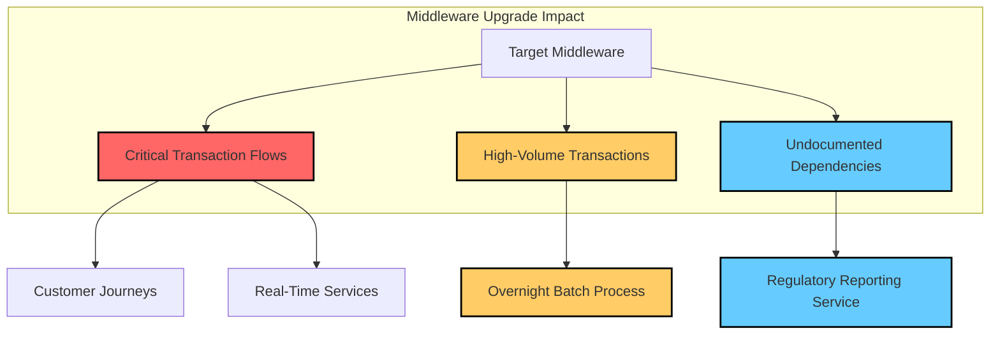

This diagram illustrates how the target middleware supports interconnected systems, emphasizing the criticality and transaction volumes of dependencies. Color-coded nodes highlight critical transaction flows, high-volume dependencies such as the overnight batch process, and undocumented dependencies such as the regulatory reporting service, enabling the team to focus their impact analysis and testing efforts effectively.

### Teaching Narrative

Dependency change impact analysis transforms change management from documentation-based assumptions to evidence-based risk assessment in banking environments where system relationships constantly evolve. Financial institutions face a fundamental challenge when modifying production systems: accurately predicting which business processes might be affected by changes to specific components. Traditional approaches rely heavily on static documentation and subject matter expert knowledge—both frequently incomplete or outdated in complex banking environments with decades of system evolution. Trace-based dependency analysis revolutionizes this approach by providing empirical evidence of actual system relationships derived from observed transaction flows. This evidence-based methodology transforms change risk assessment from educated guesswork to data-driven analysis based on comprehensive understanding of which transaction types actually depend on the target components, which customer journeys could potentially be impacted, and which unexpected dependencies might create surprising side effects. For financial institutions where change-related incidents can have immediate monetary and regulatory consequences, this empirical impact analysis enables more effective change strategies tailored to the actual risk profile of each modification. Change teams can implement targeted testing focused on the specific transaction flows demonstrating dependency relationships, design appropriate monitoring for the actual business processes potentially affected, and create precise rollback triggers based on observed impacts to critical dependencies rather than generic system metrics. This dependency-aware approach ultimately reduces change-related incidents by ensuring change management practices reflect the empirical reality of system relationships rather than potentially incomplete or outdated documentation.

### Common Example of the Problem

A regional bank planned what was considered a routine upgrade to their message queue middleware—moving from an older version to a newer release with improved performance and additional features. The change was classified as medium risk and scheduled for a standard weekend maintenance window, with testing focused on the direct integrations documented in the service catalog: payments processing, mobile banking, and customer alerts.

What the team didn't realize was that their regulatory reporting system—responsible for generating required Bank Secrecy Act (BSA) and Anti-Money Laundering (AML) reports—had been custom-integrated with the message queue using an undocumented feature that was deprecated in the new version. This dependency wasn't captured in any architecture diagrams or service documentation, and the regulatory reporting team wasn't included in the standard notification process for middleware changes.

The upgrade appeared successful during the weekend implementation, with all monitored systems functioning correctly. However, three days later, the compliance department discovered that suspicious activity reports required by federal regulations hadn't been filing correctly since the change, creating a significant regulatory compliance gap. The bank was forced to self-report the issue to regulators and conduct emergency remediation, ultimately resulting in a $175,000 regulatory penalty for failing to maintain consistent suspicious activity reporting.

The issue can be represented as the following dependency flow:

```
[Middleware] --> [Payments Processing]
              --> [Mobile Banking]
              --> [Customer Alerts]
              --> [Regulatory Reporting System (Undocumented Dependency)]
```

In this case:

1. The planned upgrade focused only on the documented dependencies (Payments Processing, Mobile Banking, Customer Alerts).
2. The Regulatory Reporting System, which relied on an undocumented feature of the middleware, was overlooked.
3. Post-upgrade, the undocumented dependency caused critical failures in compliance reporting.

Post-incident analysis revealed that traditional change impact assessment had completely failed to identify this critical dependency relationship because it relied on outdated service documentation rather than actual system interaction patterns. After implementing dependency-based change impact analysis, the bank was able to identify dozens of similar undocumented relationships throughout their environment, significantly reducing change-related incidents through more comprehensive risk assessment and targeted testing approaches based on observed dependency patterns.

### SRE Best Practice: Evidence-Based Investigation

SRE teams should implement dependency-based change impact analysis that uses distributed tracing data to create empirical maps of system relationships rather than relying solely on documentation or subject matter expertise. This approach begins with comprehensive transaction flow analysis to identify all business processes and technical operations that interact with the target change component, regardless of whether these relationships appear in formal architecture documentation.

Once dependencies are mapped, teams should conduct systematic impact evaluation that categorizes potential risks based on dependency patterns: direct dependencies where components explicitly call the target service, indirect dependencies where components rely on data or state managed by the target, and resource dependencies where components share infrastructure that might be affected during implementation activities.

Evidence-based change assessment requires examining not just which components depend on the target service but how they depend on it—identifying which specific features, interfaces, or behaviors are actively used in production rather than assuming documented interfaces match actual usage patterns. This detailed analysis enables teams to precisely predict how proposed changes might affect dependent systems, particularly when modifications involve deprecating features or changing interface behaviors.

The most mature SRE teams implement historical change correlation analysis, examining how previous modifications to similar components affected dependent systems and using this evidence to improve risk predictions for current changes. This learning approach progressively refines change impact models based on actual observed outcomes rather than theoretical projections, creating increasingly accurate risk assessments as the organization builds an empirical history of change impacts across its technology landscape.

#### Evidence-Based Investigation Checklist

To implement evidence-based change impact analysis effectively, follow these steps:

1. **Gather Distributed Tracing Data**

   - Collect comprehensive transaction flow data from production environments.
   - Ensure trace data includes metadata for identifying service interactions, transaction types, and criticality.

2. **Map Dependencies**

   - Create system relationship diagrams using trace data to identify direct, indirect, and resource dependencies.
   - Validate findings by comparing trace-based relationships with documentation and SME inputs.

3. **Categorize Dependency Risks**

   - Classify dependencies into categories (direct, indirect, resource) to assess potential impact dimensions.
   - Highlight undocumented or unexpected dependencies for targeted evaluation.

4. **Analyze Dependency Usage**

   - Identify specific features, interfaces, or behaviors actively used by dependent systems in production.
   - Confirm whether proposed changes will affect these dependencies, especially for deprecated features.

5. **Conduct Historical Change Analysis**

   - Review past changes to similar components and their impact on dependent systems.
   - Use historical outcomes to refine risk predictions and identify patterns.

6. **Plan Targeted Testing**

   - Develop test cases for critical dependencies identified in the analysis.
   - Include both functional and non-functional testing to ensure resilience under expected conditions.

7. **Define Rollback Criteria**

   - Establish rollback triggers based on observed impacts to critical dependencies during testing or production rollout.
   - Ensure monitoring focuses on the most sensitive transaction flows and business processes.

8. **Continuously Improve**

   - Update dependency maps and risk models after each change implementation.
   - Integrate lessons learned to improve future change impact assessments.

This checklist ensures SRE teams can systematically apply evidence-based investigation principles, reducing the likelihood of change-related incidents and improving overall system reliability.

### Banking Impact

The business consequences of inadequate dependency analysis during change management are severe and multifaceted in banking environments. The table below summarizes key impact categories, associated statistics, and observed outcomes to provide a concise reference for understanding the significance of dependency-aware change processes.

| **Impact Category** | **Description** | **Associated Statistics** | **Observed Outcomes** |
| -------------------------- | --------------------------------------------------------------------------------------------------- | --------------------------------------------------------------------------------------------------------- | -------------------------------------------------------------------------------------------------------------- |
| **Financial Impact** | Increased change failure rates lead to outages, revenue loss, and recovery costs. | Dependency-aware processes reduce failed changes by **35-50%**, directly mitigating financial losses. | Significant reduction in costs tied to incident resolution and downtime recovery. |
| **Regulatory Compliance** | Unexpected impacts on reporting, monitoring, or control systems result in compliance failures. | Regulatory penalties for such failures range from **$50,000 to several million dollars** per incident. | Enhanced visibility reduces risk of non-compliance and associated financial penalties. |
| **Opportunity Cost** | Uncertainty leads to overly restrictive change windows and slower innovation delivery. | Improved visibility accelerates low-risk changes by **40-60%**, enabling faster execution of innovations. | Reduced delays and faster time-to-market for new features and services. |
| **Customer Experience** | Changes inadvertently affect transaction quality or availability, causing customer dissatisfaction. | **22-35%** of customer-impacting incidents are directly linked to unexpected dependency-related issues. | Proactive testing and monitoring improve transaction reliability and customer satisfaction. |
| **Operational Efficiency** | Inefficient testing and monitoring waste resources on irrelevant systems. | Evidence-based approaches cut change effort by **25-40%** while improving success rates. | Streamlined processes focus resources on critical dependencies, increasing overall efficiency and reliability. |

Dependency-aware change management not only mitigates risks but also yields significant operational and business benefits. By relying on trace-driven analysis, banks can transform change processes from reactive and assumption-driven to proactive and evidence-based, addressing financial, regulatory, and customer impacts more effectively. This targeted approach ensures changes are implemented with precision, minimizing disruptions while maximizing efficiency and innovation.

### Implementation Guidance

1. **Change Impact Visualization**: Implement a visualization tool that presents all transaction flows dependent on target components. Leverage trace-based dependency data to highlight which business processes and technical operations interact with the systems undergoing modification. Use color-coded indicators to represent transaction criticality and volume for quick prioritization.

   ```python
   # Example: Extracting and visualizing trace dependencies
   import networkx as nx
   import matplotlib.pyplot as plt

   # Sample dependency data
   dependencies = [
       ("Middleware", "TransactionA"),
       ("Middleware", "TransactionB"),
       ("TransactionB", "BatchProcess"),
       ("TransactionA", "RegulatoryService")
   ]

   # Create a directed graph
   graph = nx.DiGraph()
   graph.add_edges_from(dependencies)

   # Visualization with criticality levels
   critical_nodes = {"RegulatoryService": "red", "BatchProcess": "orange"}
   node_colors = [critical_nodes.get(node, "green") for node in graph.nodes]

   nx.draw(graph, with_labels=True, node_color=node_colors, edge_color="blue")
   plt.show()
   ```

2. **Dependency-Aware Testing**: Design testing strategies that target specific transaction types with demonstrated dependency relationships. Focus verification efforts on these high-risk areas to ensure test coverage mirrors real-world system interactions.

   Example: Use dependency data to generate dynamic test cases for identified critical flows.

3. **Targeted Monitoring Plans**: Establish monitoring strategies that prioritize the services and transaction flows identified during dependency analysis. Configure alerts to detect anomalies in these critical areas during and after the change window.

   ```python
   # Example: Monitoring critical transaction flows
   critical_flows = ["TransactionA", "TransactionB"]
   def monitor_transactions(transaction_log):
       for transaction in transaction_log:
           if transaction["name"] in critical_flows and transaction["status"] == "error":
               alert_admin(transaction)

   def alert_admin(transaction):
       print(f"ALERT: Issue detected in {transaction['name']} - Status: {transaction['status']}")
   ```

4. **Evidence-Based Stakeholder Notification**: Automate stakeholder identification based on dependency data. Notify teams and business units whose services are directly impacted, replacing static ownership records with dynamic, trace-driven analysis.

   Example: Generate email notifications or Slack messages to relevant teams using dependency mappings.

5. **Precise Rollback Triggers**: Define rollback criteria specific to the transaction types and dependency patterns identified as highest risk. Use trace data to implement dynamic checks that evaluate customer-facing impacts in real time.

   ```python
   # Example: Dynamic rollback trigger based on dependency health
   def evaluate_rollback(transaction_health):
       risky_transactions = ["TransactionA", "TransactionB"]
       for transaction, status in transaction_health.items():
           if transaction in risky_transactions and status == "degraded":
               return True  # Trigger rollback
       return False

   # Sample transaction health status
   transaction_health_status = {
       "TransactionA": "degraded",
       "TransactionB": "healthy"
   }

   if evaluate_rollback(transaction_health_status):
       print("Rollback triggered due to critical dependency impact.")
   ```

## Panel 7: Architectural Refactoring - Breaking Problematic Banking Dependencies

### Scene Description

A system modernization workshop where a banking architecture team is planning dependency remediation for a critical payment processing platform. Large screens display dependency visualizations derived from trace data, with problematic patterns clearly highlighted. The visualizations include:

- **Circular Dependencies:** Services A, B, and C are locked in a feedback loop, causing deadlocks and cascading retries.
- **Excessive Coupling through Shared Databases:** Multiple services (e.g., Payments, Notifications, and Reporting) are directly querying a shared database, creating unintended dependencies and bottlenecks.
- **Synchronous Chains:** A linear dependency sequence (Service X → Service Y → Service Z) introduces fragility, as failures propagate downstream.
- **Bottleneck Services:** A single critical service (e.g., Auth Service) is overloaded with too many dependents, creating a high-risk failure point.

Below is a simplified text-based representation of one of the dependency visualizations displayed on the screens:

```
        [Service A] --> [Service B]
            ↑              ↓
            └--------- [Service C]
```

This diagram illustrates a circular dependency causing cascading retries.

The team is prioritizing remediation efforts based on trace-derived metrics showing which dependency issues most directly impact customer experience and system reliability. A senior architect is actively demonstrating how specific architectural changes—such as introducing message queues between tightly coupled services, replacing shared database access with APIs, and breaking monolithic components into focused microservices—would transform the dependency structure. These changes are designed to improve both reliability and performance by addressing actual transaction patterns rather than abstract architectural goals.

### Teaching Narrative

Architectural refactoring guided by dependency analysis transforms system evolution from abstract modernization goals to targeted improvements addressing empirically identified issues. Financial institutions often embark on modernization initiatives with broad objectives like "increase resilience" or "improve scalability" without precise understanding of which specific dependency relationships actually create reliability and performance constraints. Trace-based dependency analysis provides this crucial empirical foundation by revealing exactly which service relationships create operational problems in production: excessive synchronous chains that amplify failures, critical services with too many dependents creating single points of failure, circular dependencies causing deadlocks or cascading retries, and shared resources creating unintended coupling between transaction types. This evidence-based approach transforms modernization from general architectural aspirations to targeted interventions addressing specific, measured dependency problems. For banking systems where wholesale replacement is rarely feasible due to risk, cost, and regulatory constraints, this surgical approach enables incremental improvement focused on the specific dependency relationships demonstrating actual operational impact. Architecture teams can precisely identify which components would benefit most from queue-based decoupling, which synchronous chains should be broken through caching or eventual consistency patterns, which shared resources create the most problematic coupling, and which specific services represent the highest-value candidates for refactoring based on their position in dependency chains. This empirically guided approach ultimately delivers greater business value from limited modernization resources by ensuring architectural changes directly address the specific dependency patterns demonstrating measurable impact on customer experience and operational reliability, rather than pursuing theoretical architecture ideals that may not address the empirical constraints of actual transaction flows.

### Common Example of the Problem

A large commercial bank initiated a modernization program for their payment processing platform after experiencing several high-profile outages. The program initially followed a traditional approach—architects reviewed existing documentation, interviewed system owners, and developed a theoretical target architecture based on industry best practices for microservices. The bank allocated $15 million and 18 months to implement this new architecture, which promised improved reliability and performance based on general architectural principles.

Six months into the initiative, with limited progress and mounting costs, the bank implemented trace-based dependency analysis to better understand their current architecture. The results were eye-opening and completely shifted their modernization approach. The trace data revealed that their theoretical architecture models failed to identify the actual reliability constraints in production.

The most critical issue wasn't the monolithic design originally targeted for complete replacement, but rather four specific problematic dependency patterns:

| Problematic Dependency Pattern | Observed Impact | Targeted Solution |
| ----------------------------------------------------------------- | -------------------------------------- | ---------------------------------------------------------- |
| Payment validation service with 27 direct dependents | Critical single point of failure | Introduced an event bus to decouple dependents |
| Synchronous calls to a credit bureau | Cascading timeouts during peak periods | Implemented circuit breakers and caching mechanisms |
| Circular dependencies between fee calculation and account balance | Deadlock conditions under high load | Adopted event-driven architecture to break circular chains |
| Excessive shared database access | Contention between transaction types | Created purpose-specific data access services |

Based on this empirical analysis, the modernization team pivoted to a targeted approach focusing specifically on these identified dependency issues. Rather than a complete system rewrite, they implemented strategic architectural patterns addressing the actual constraints.

This targeted approach delivered 85% of the reliability improvement and 75% of the performance gains originally targeted, but with only 40% of the originally estimated cost and timeline. More importantly, business risk was dramatically reduced by making incremental, focused changes rather than wholesale replacement, with each modification delivering measurable improvement rather than requiring an all-or-nothing implementation.

### SRE Best Practice: Evidence-Based Investigation

SRE teams should implement dependency-guided architectural refactoring that uses distributed tracing data to identify specific structural issues rather than pursuing generic modernization patterns. This approach begins with comprehensive dependency pattern analysis to identify problematic architectural relationships: excessive fan-in services with too many dependents, lengthy synchronous chains creating cascading failure risks, circular dependencies causing deadlock or retry amplification, and excessive shared resource usage creating unintended coupling between transaction flows.

Once problematic patterns are identified, teams should conduct impact quantification to measure the actual operational consequences of each pattern: customer-visible incidents attributed to specific dependency structures, latency contributions from synchronous chains, error propagation patterns during partial outages, and resource contention measurements during peak periods. This quantification enables prioritization based on measured business impact rather than architectural theory.

Evidence-based refactoring requires developing targeted architectural solutions specifically designed for the actual constraint patterns identified in production rather than applying generic architectural patterns uniformly across all systems. This tailored approach might include selective decoupling of high-impact dependencies while leaving benign relationships unchanged, implementing resilience patterns specifically calibrated to observed failure modes, or introducing eventual consistency only where business requirements actually permit it.

The most effective SRE teams implement incremental verification through progressive deployment of architectural changes, using trace data to measure the actual improvement in dependency behavior after each modification rather than assuming theoretical benefits. This evidence-based verification enables course correction throughout the modernization journey, ensuring resources remain focused on changes delivering measurable improvement rather than pursuing architectural ideals that may not address the specific constraints of banking transaction flows.

#### Checklist for Evidence-Based Investigation

To apply evidence-based investigation effectively, follow these steps:

1. **Collect and Analyze Dependency Data**

   - Use distributed tracing tools to map service dependencies.
   - Identify problematic patterns such as excessive fan-in, circular dependencies, shared resource coupling, and long synchronous chains.

2. **Quantify Operational Impact**

   - Measure latency contributions of identified patterns.
   - Analyze historical incidents tied to problematic dependencies.
   - Assess error propagation during partial failures.
   - Evaluate resource contention under peak loads.

3. **Prioritize Based on Business Impact**

   - Rank dependency issues by their measurable impact on reliability, performance, and customer experience.
   - Focus on high-value targets with clear operational consequences.

4. **Design Targeted Architectural Solutions**

   - Develop tailored solutions for each identified problem:
     - Decouple high-impact dependencies (e.g., introducing message queues).
     - Apply resilience patterns aligned with observed failure modes.
     - Employ eventual consistency only when business requirements allow.

5. **Implement Incremental Changes**

   - Progressively deploy architectural modifications.
   - Use distributed tracing to validate improvements after each change.
   - Continuously measure and refine based on real-world outcomes.

6. **Verify and Iterate**

   - Monitor dependency behavior post-refactoring to ensure measurable improvements.
   - Adjust priorities and approaches based on updated trace data and observed results.

By following this evidence-based checklist, SRE teams can ensure architectural refactoring directly addresses the specific dependency problems impacting system reliability and performance, delivering measurable improvements aligned with business needs.

### Banking Impact

The business consequences of untargeted architectural modernization are substantial and multifaceted in banking environments. Direct financial impacts include excessive modernization costs without proportional benefits. Financial institutions implementing dependency-guided architectural approaches report achieving 70-80% of targeted performance and reliability improvements at 30-50% of the cost compared to wholesale replacement initiatives, representing tens of millions in potential savings for major systems.

Implementation risk increases dramatically with broader architectural changes, leading to greater potential for customer-impacting issues during deployment. Dependency-based modernization approaches, by contrast, experience 60-75% fewer customer-impacting incidents during implementation, directly reducing both revenue loss and reputational damage associated with migration activities.

Time-to-market for essential business capabilities is significantly affected by the modernization approach. Dependency-guided incremental improvements enable business functionality to be delivered alongside architectural enhancements rather than delayed until completion of multi-year transformation programs. Banks using targeted modernization strategies typically deliver new business capabilities 40-60% faster than those pursuing complete rewrites.

Operational resilience improves more rapidly with targeted dependency remediation, delivering progressive reliability enhancements throughout the modernization journey. Addressing specific dependency patterns identified through trace analysis typically results in a 40-60% reduction in customer-impacting incidents within the first six months, compared to two or more years for comparable improvements through comprehensive replacement approaches.

#### Summary of Key Statistics

Below is a summary of the business impact statistics from dependency-guided modernization:

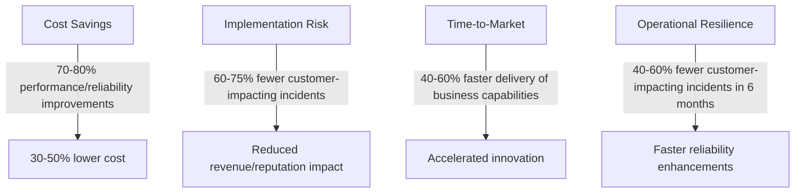

### Implementation Guidance

To effectively guide dependency remediation for problematic banking architectures, follow this structured, step-by-step process:

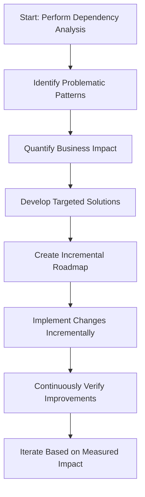

1. **Perform Dependency Analysis**\
   Leverage trace data to systematically identify problematic architectural relationships, focusing on:

   - Excessive fan-in creating bottleneck services.
   - Synchronous chains that amplify failures.
   - Circular dependencies causing deadlocks or cascading retries.
   - Shared resource coupling leading to unintended interdependencies.

2. **Identify Problematic Patterns**\
   Categorize the detected dependency issues by their specific operational constraints, such as latency contributions, error propagation, or resource contention.

3. **Quantify Business Impact**\
   Measure the consequences of each identified issue using trace-based metrics, including:

   - Error propagation patterns.
   - Latency contributions to critical transactions.
   - Impacts on the customer journey (e.g., transaction failures or delays).\
     Use this data to prioritize issues based on the severity of their impact on customer experience and operational reliability.

4. **Develop Targeted Solutions**\
   Design specific architectural solutions tailored to each dependency constraint:

   - Apply event-driven architecture to decouple high fan-in services.
   - Introduce circuit breakers for external dependencies.
   - Implement caching for shared reference data.
   - Replace shared database access with dedicated data access services.

5. **Create Incremental Roadmap**\
   Sequence the implementation of architectural changes based on:

   - Measured business impact.
   - Alignment with operational priorities.\
     Focus on addressing the most critical dependency relationships before less impactful ones.

6. **Implement Changes Incrementally**\
   Roll out changes progressively, ensuring minimal disruption to the existing system while addressing high-priority dependency issues.

7. **Continuously Verify Improvements**\
   After each change:

   - Use trace-based measurements to validate improvements in reliability and performance.
   - Monitor for unintended side effects or new bottlenecks introduced by the changes.

8. **Iterate Based on Measured Impact**\
   Refine the roadmap and solutions based on empirical results, ensuring modernization efforts remain targeted at delivering measurable business value rather than abstract architectural goals.
