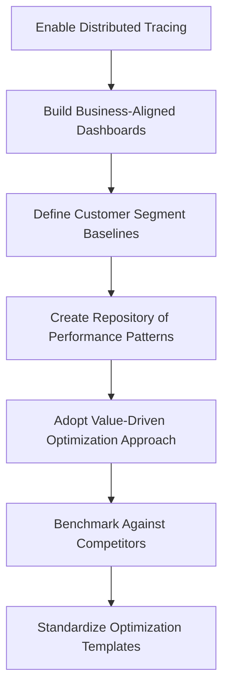
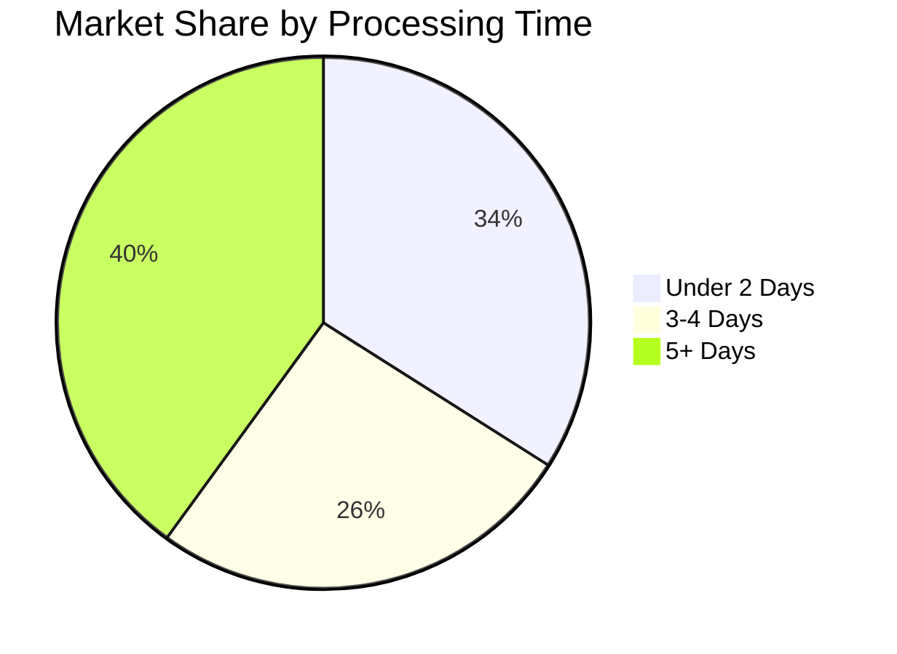
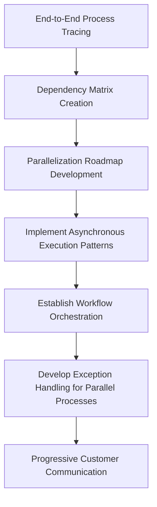
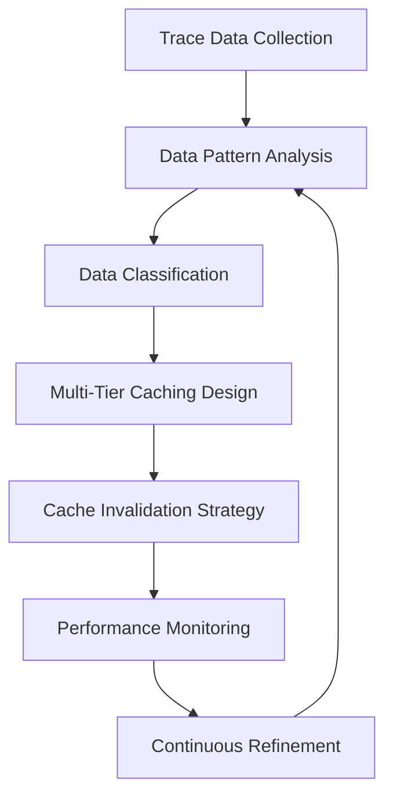
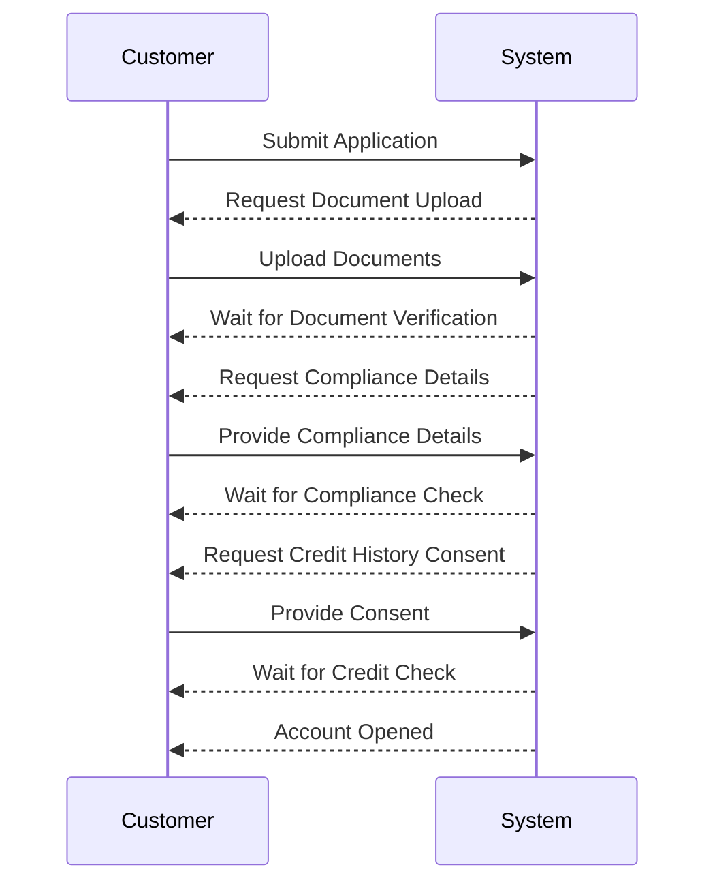
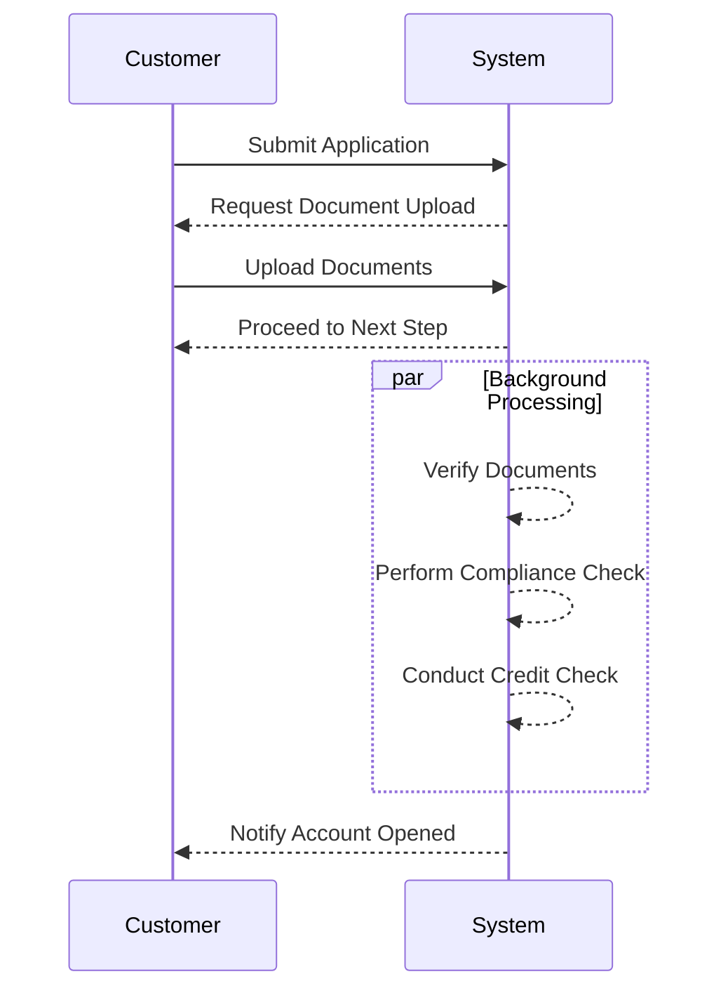
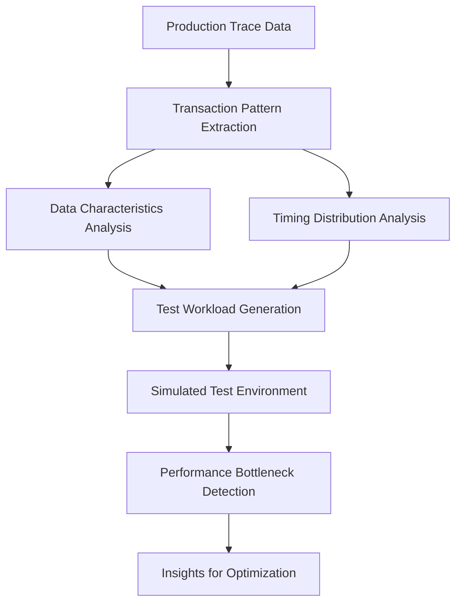

# Chapter 11: Performance Optimization for Banking Transactions

## Chapter Overview

Welcome to the high-stakes casino of banking performance, where milliseconds aren't just numbers—they're literal bags of money walking out the door. This chapter is a guided tour of how banks regularly lose millions by ignoring the difference between “technically fine” and “actually fast enough to beat the competition.” Here, we rip apart the fantasy that “good enough” monitoring, generic query tuning, or feel-good synthetic testing will save you when Wall Street sharks and impatient customers are circling your systems. We’ll drag you through the real-world trenches: exposing how “minor” inefficiencies metastasize into abandoned transactions, lost revenue, and customers defecting to whoever’s app doesn’t make them wait. Think of this as performance optimization with a spotlight and a sledgehammer—if you’re squeamish about finding out where the actual business pain lives, you’re in the wrong job.

______________________________________________________________________

## Learning Objectives

- **Diagnose** transaction-level performance bottlenecks using distributed tracing, not just guesswork or generic dashboards.
- **Correlate** technical latency with cold, hard business impact—so you stop optimizing for vanity metrics.
- **Map** system-wide database interactions to identify and kill the “death by a thousand queries” syndrome.
- **Design** and **implement** parallelization in process flows, slashing customer wait times without introducing chaos.
- **Construct** caching strategies based on real data access patterns, not tribal wisdom or copy-pasted StackOverflow advice.
- **Optimize** third-party integrations to minimize both cost and latency—even when the vendor’s API documentation looks like it was written under duress.
- **Apply** asynchronous patterns to workflows, breaking the tyranny of unnecessary customer waiting.
- **Run** performance tests that mimic the ugly realities of production, not the best-case fantasies of QA engineers.

______________________________________________________________________

## Key Takeaways

- If you’re profiling performance in banking and not using distributed tracing, you’re basically blindfolded and throwing darts at your bonus.
- “Acceptable” latency on your dashboards can still mean $3 million/year hemorrhaging to faster competitors. Hope your CFO isn’t reading those traces.
- Database “optimizations” that only look at individual queries are like rearranging deck chairs on the Titanic. Contention and redundant requests will sink you during real-world peaks.
- Parallelization isn’t a nice-to-have—it’s the difference between a mortgage approval and a customer rage-quitting for a fintech with a clue.
- Caching without empirical analysis is Russian roulette with consistency and performance. Guess wrong, and you’ll either slow down the app or break the trust of your best customers.
- Third-party dependencies are where latency, cost, and cascading outages go to breed. If you’re not consolidating, caching, and going asynchronous where possible, you’re just paying more to be slow.
- Forcing customers to wait while your backend makes tea is why your digital onboarding conversion rate is embarrassing. Asynchronous patterns aren’t optional if you want to keep customers in 2024.
- Synthetic performance tests that don’t use production trace patterns are just expensive fan fiction. The only “confidence” they deliver is false.
- Every millisecond matters, but not every millisecond is worth fixing. Evidence-based SRE means you chase the ones that actually move the business needle, not just the ones that make pretty graphs.
- If your team can’t trace, measure, and prove the business impact of optimizations, you’re not doing SRE—you’re just doing busywork.

______________________________________________________________________

## Panel 1: Performance Profiling - Where Banking Milliseconds Matter

### Scene Description

A trading floor optimization lab buzzing with activity, where engineers and business analysts collaborate to dissect transaction traces from the bank's equity trading platform. The room is dominated by multiple large screens, each displaying waterfall visualizations of the same trade execution flow, annotated with timing data at millisecond resolution.

Below is a simplified representation of a typical waterfall visualization for a single trade execution flow:

```mermaid
gantt
    title Trade Execution Flow - Waterfall Visualization
    dateFormat  X
    section Components
    API Call A         :a1, 0, 50ms
    Reference Data Lookup :a2, 50, 50ms
    Database Query      :a3, 100, 30ms
    Trade Confirmation  :a4, 130, 20ms
```



In these visualizations, engineers have highlighted a specific component - the "Reference Data Lookup" - where an unexpected 50ms delay consistently occurs. Surrounding this data, market analysts present a compelling case: during periods of market volatility, competitors execute similar trades 70-100ms faster. This disparity is visualized on a business impact chart prominently displayed on another screen, showing that this seemingly minor latency translates to an estimated $3.2 million in annual trading advantage lost to competitors with better-optimized systems.

The combination of these visuals - waterfall diagrams, latency annotations, and business impact graphs - transforms the lab into a hub of precision-driven performance analysis, where every millisecond counts.

### Teaching Narrative

Performance profiling in financial services transforms optimization from subjective prioritization to evidence-based precision in environments where milliseconds directly impact business outcomes. Unlike many industries where minor performance differences have minimal impact, banking transactions often operate in domains where microseconds translate directly to monetary value - particularly in trading, payment processing, fraud detection, and real-time credit decisions. Distributed tracing enables precise performance profiling by revealing exactly where time is spent within complex transaction flows, highlighting both obvious bottlenecks and subtle inefficiencies that cumulatively create competitive disadvantages. This precise visibility transforms optimization from intuitive guesswork to surgical targeting based on actual business impact. For financial institutions where engineers must constantly balance competing priorities, this evidence-based approach ensures optimization efforts focus on the specific components where performance improvements deliver measurable business value. Rather than pursuing generic performance improvements across all systems equally, engineering teams can precisely identify which particular services, database queries, API calls, or algorithms actually constrain business-critical operations - even when these constraints manifest as seemingly minor inefficiencies that would be considered acceptable in less time-sensitive domains. This business-aligned performance profiling ultimately ensures optimization resources target the specific banking transactions where milliseconds matter most to customers, competitive position, and financial outcomes.

### Common Example of the Problem

A major investment bank's high-frequency trading platform was experiencing subtle competitive disadvantages despite appearing technically sound. During equity trade executions under market volatility, their system consistently lagged behind competitors by 75-120ms. Traditional performance monitoring showed all systems operating within acceptable thresholds—CPU utilization below 60%, memory usage stable, network latency under 5ms, and all health checks passing. However, the root cause remained hidden until a detailed trace analysis was performed.

The analysis uncovered a key inefficiency: reference data for pricing calculations was being refreshed sequentially instead of in parallel. This sequential process introduced a consistent 50ms delay, which was invisible to traditional monitoring tools but directly impacted transaction times. In a domain where milliseconds determine competitive advantage, this "hidden" inefficiency resulted in approximately $2.8 million in annual trading position disadvantages. The following text diagram illustrates the difference:

#### Sequential vs. Parallel Data Refresh Process

**Sequential Refresh Process**

```
[Request Data A] --> [Receive Data A]
                       |
[Request Data B] --> [Receive Data B]
                       |
[Request Data C] --> [Receive Data C]
                       |
[Continue Execution]
Total Delay: 50ms (cumulative per request)
```

**Parallel Refresh Process**

```
[Request Data A] -\
[Request Data B] --- All Data Received Simultaneously
[Request Data C] -/
                       |
[Continue Execution]
Total Delay: 10ms (approximate overhead only)
```

By visualizing the sequential and parallel data refresh processes, the inefficiency becomes apparent. Without trace-based performance profiling capable of millisecond-resolution visibility across distributed systems, this critical business impact would have remained obscured behind technically "acceptable" performance metrics. This example underscores the importance of precise visibility and optimization in time-sensitive financial systems.

### SRE Best Practice: Evidence-Based Investigation

SRE teams must implement business-aligned performance profiling that identifies optimization targets based on actual customer and business impact rather than technical thresholds alone. This requires shifting from generic performance monitoring to transaction-specific profiling that measures exactly how time is distributed within critical business flows. Evidence-based performance investigation begins with comprehensive tracing of high-value business transactions, identifying precisely where time is spent across each service, database interaction, and external call.

Rather than relying on intuition or isolated component metrics, SREs should analyze complete transaction traces to identify both obvious bottlenecks and subtle inefficiencies that cumulatively impact critical operations. Performance patterns should be correlated with specific business outcomes—trading advantages, customer conversion rates, transaction abandonment—to quantify the actual business impact of technical optimizations. By collecting evidence of where time is actually spent in business-critical flows, SREs can target optimization efforts precisely where they will deliver maximum value rather than improving components that show high utilization but minimal impact on customer-facing performance.

#### Checklist: Steps for Evidence-Based Investigation

1. **Identify High-Value Transactions**: Select business-critical transaction flows (e.g., trades, real-time payments) where performance directly impacts competitive advantage or customer experience.
2. **Instrument Comprehensive Tracing**: Implement distributed tracing to capture detailed timing data across all services, database interactions, and external calls within the selected transaction flows.
3. **Analyze Transaction Traces**:
   - Pinpoint obvious bottlenecks (e.g., services with high response times).
   - Detect subtle cumulative inefficiencies (e.g., repeated small delays across multiple components).
4. **Correlate with Business Impact**:
   - Map identified inefficiencies to key business metrics (e.g., trade execution speed, transaction abandonment rates).
   - Quantify the financial or competitive impact of delays.
5. **Prioritize Optimization Targets**: Focus on the components with the highest combined technical inefficiency and business impact, ensuring alignment with organizational goals.
6. **Validate Improvements**:
   - Re-run transaction traces after optimizations.
   - Measure performance gains and verify improvements in business outcomes.
7. **Iterate Continuously**: Regularly revisit transaction profiling as business priorities, customer demands, and system architectures evolve.

### Banking Impact

The business consequences of suboptimal performance in time-sensitive banking operations are substantial and often underestimated. In trading operations, milliseconds of unnecessary latency directly translate to execution disadvantages worth millions annually—a major investment bank discovered each 10ms of latency reduction in their trading platform was worth approximately $440,000 in improved position acquisition.

For retail payments, seemingly minor performance issues significantly impact completion rates—a payment processor found that mobile payment abandonment increases 7% for every additional second of processing time, representing approximately $14.5M in lost transaction volume annually for every second of unnecessary latency. Consumer lending faces similar impacts, with mortgage application completion rates dropping 3.2% for each second of form submission latency, translating to approximately $2.7M in lost lending opportunity per second of performance degradation for a regional bank.

Performance issues also disproportionately impact high-value transactions—research shows that affluent banking customers have significantly lower patience thresholds, with 68% abandoning digital transactions that take more than 3 seconds to complete compared to 44% of mass-market customers, putting the most profitable relationships at highest risk from performance issues.

#### Performance Impact Summary Table

| **Banking Operation** | **Performance Impact** | **Financial Consequence** |
| -------------------------------- | ------------------------------------------------------------------------------------- | --------------------------------------------------------------------------------- |
| Trading Operations | 10ms latency reduction improves position acquisition by approximately 0.44M USD | $440,000 annual advantage for every 10ms reduction |
| Retail Payments | 7% increase in mobile payment abandonment per additional second of processing latency | $14.5M annual lost transaction volume for every second of unnecessary latency |
| Consumer Lending | 3.2% drop in mortgage application completion rates per second of form latency | $2.7M annual lost lending opportunity for every second of performance degradation |
| High-Value Customer Transactions | 68% affluent customer abandonment for transactions exceeding 3 seconds | Loss of the highest-value customer relationships |

This table encapsulates how even minor inefficiencies in performance can cascade into substantial financial consequences across various banking operations, emphasizing the criticality of precise performance profiling to mitigate these impacts.

### Implementation Guidance

To systematically implement distributed tracing and performance optimization within high-stakes banking environments, follow these structured steps:

#### 1. Enable Distributed Tracing

- **Action**: Deploy distributed tracing systems with millisecond resolution.
- **Scope**: Ensure coverage across customer-facing interactions, backend services, and third-party integrations.
- **Outcome**: Achieve end-to-end visibility into transaction flows and latency breakdowns.

#### 2. Build Business-Aligned Dashboards

- **Action**: Develop performance dashboards that relate latency metrics to business outcomes.
- **Metrics**: Focus on conversion rates, abandonment percentages, and revenue impacts.
- **Outcome**: Quantify the business value of performance improvements.

#### 3. Define Customer Segment Baselines

- **Action**: Establish performance baselines for different client tiers.
- **Focus**: Prioritize high-value client segments particularly sensitive to latency.
- **Outcome**: Tailor optimizations to meet diverse customer expectations and business impacts.

#### 4. Create a Repository of Performance Patterns

- **Action**: Document recurring trace-based performance patterns by transaction type.
- **Purpose**: Build institutional memory of common bottlenecks across banking functions.
- **Outcome**: Enable faster diagnosis and solution development.

#### 5. Adopt a Value-Driven Optimization Approach

- **Action**: Quantify the business impact of potential performance improvements.
- **Focus**: Prioritize bottlenecks with the highest business value.
- **Outcome**: Optimize where it matters most, avoiding wasted engineering effort.

#### 6. Benchmark Against Competitors

- **Action**: Perform regular comparative performance analyses for critical transaction flows.
- **Method**: Use synthetic transactions to benchmark against industry leaders.
- **Outcome**: Identify and address competitive disadvantages in transaction speed.

#### 7. Standardize Optimization Templates

- **Action**: Develop templates for common operations such as reference data lookups, payment processing, and authentication.
- **Based On**: High-performance implementations observed in production traces.
- **Outcome**: Accelerate future optimizations with reusable, proven patterns.

#### Implementation Flowchart

The following flowchart illustrates the step-by-step process:



By following these structured steps and leveraging the flowchart as a guide, teams can systematically implement distributed tracing and prioritize optimizations that deliver the greatest business impact.

## Panel 2: Database Interaction Optimization - Beyond Simple Query Tuning

### Scene Description

A database optimization session for a retail banking platform experiencing periodic slowdowns during peak hours. Trace visualizations on the main screen show customer account inquiry transactions with database interactions highlighted, revealing a pattern where seemingly efficient individual queries combine to create excessive database load. The optimization team has created specialized visualizations showing how apparently independent microservices create unintentional database contention by accessing the same tables with slightly different query patterns. Engineers are implementing trace-guided optimizations, with real-time performance metrics reflecting dramatic improvements as these changes are applied: reducing database load by 60% and cutting average transaction times from 900ms to 300ms without changing the underlying database infrastructure.

#### Optimization Flow Summary

Below is a text-based diagram summarizing the sequence of optimizations and their impact:

```
[Trace Analysis] 
      ↓
[Identify Redundant Queries Across Microservices]
      ↓
[Consolidate Redundant Queries]
      ↓
[Introduce Caching Layers for Reference Data]
      ↓
[Restructure Transaction Flows to Reduce Round Trips]
      ↓
[Real-Time Performance Gains]
      ↓
[60% Database Load Reduction + Transaction Times Reduced to 300ms]
```

This flow highlights the iterative process, starting with trace analysis to identify inefficiencies, followed by targeted optimizations (query consolidation, caching, and transaction restructuring), ultimately yielding significant performance improvements. The structured approach ensures that optimizations address system-level inefficiencies rather than isolated query-level issues.

### Teaching Narrative

Database interaction optimization guided by trace analysis transforms performance tuning from isolated query improvements to system-level efficiency in data-intensive banking environments. Imagine a bustling city with a complex road network during rush hour. At first glance, individual intersections may appear to be flowing smoothly, but when viewed from a traffic control center, a different picture emerges: multiple junctions are overburdened because vehicles from different neighborhoods converge on the same few highways, creating bottlenecks. Similarly, in a banking platform, seemingly efficient individual queries can converge at the database level, overwhelming resources and causing system-wide slowdowns.

Financial institutions face unique database challenges akin to managing traffic in a city with old, narrow streets that cannot be easily widened: massive datasets with complex relationships, strict consistency requirements, and mixed workloads spanning real-time transactions and analytical processing - often on legacy database platforms that cannot easily be replaced due to risk and regulatory constraints. Distributed tracing acts as a traffic control system for the database, revealing interaction patterns invisible to traditional monitoring. It highlights how well-tuned individual queries interact at the system level to create performance issues through cumulative load, connection pool exhaustion, or unintentional contention.

This comprehensive visibility shifts optimization from fixing isolated "traffic signals" to redesigning the "road network" for smoother flow. For example, engineers can introduce "express lanes" in the form of caching layers to divert frequently accessed reference data away from the database. They can also identify "choke points" where independent services inadvertently create contention by querying the same tables with slightly different patterns, or pinpoint "rush hour congestion" caused by inefficient transaction flows during peak loads. This approach allows for targeted interventions that reduce database load and streamline transaction flows without requiring risky infrastructure changes.

By addressing these system-level inefficiencies, engineers achieve dramatic performance improvements, reducing database load and transaction times without relying solely on individual query optimization or hardware scaling. Just as a well-managed traffic system can transform a city's rush hour chaos into smooth commutes, trace-guided database optimization enables financial platforms to deliver faster, more reliable customer experiences while maximizing the efficiency of their existing infrastructure.

### Common Example of the Problem

A major retail bank's digital platform experienced severe performance degradation during end-of-month periods when customer activity peaked. Despite extensive investment in database infrastructure and individual query optimization, account balance inquiries that normally completed in under 300ms were taking 3-5 seconds during peak periods, causing a 42% increase in customer support calls and a 28% drop in mobile app usage. Traditional database monitoring showed no obvious problems—CPU utilization remained below thresholds, memory was sufficient, and individual query execution plans appeared optimal. However, trace analysis revealed the actual issue: seven different microservices were independently querying the same customer profile tables with slightly different but overlapping queries, each efficiently designed in isolation but collectively creating lock contention and connection pool exhaustion. Additionally, reference data for currency conversion and transaction categorization was being repeatedly queried despite remaining static for hours. This system-level interaction pattern remained invisible to traditional query-level optimization approaches, despite creating significant customer impact during high-volume periods.

### SRE Best Practice: Evidence-Based Investigation

SRE teams must implement system-level database interaction analysis that examines how services collectively utilize database resources rather than focusing solely on individual query performance. This requires tracing that captures the complete database interaction pattern across service boundaries, revealing how seemingly isolated optimizations combine at scale. Evidence-based database optimization begins with comprehensive interaction mapping—identifying which services access which tables, with what frequency, and in what patterns during different operational periods.

Rather than relying on database execution plans alone, SREs should analyze trace data to identify opportunities for interaction-level improvements: reducing redundant queries across services, implementing appropriate caching layers, consolidating related data access, managing connection pools effectively, and restructuring transactions to minimize round trips. Database access patterns should be examined across complete business transactions, revealing how data access in one service affects resources available to others during peak periods. By collecting evidence about actual database interaction patterns rather than just individual query performance, SREs can implement optimizations that address system-level efficiency without requiring risky platform migrations or schema redesigns.

#### Checklist for Evidence-Based Investigation

To make evidence-based database optimization actionable, SREs can follow this checklist:

1. **Trace Data Collection:**

   - Enable distributed tracing across all services interacting with the database.
   - Ensure traces capture detailed query information, including execution times, table access, and connection usage.

2. **Interaction Mapping:**

   - Map service-to-database interactions to identify which services access which tables.
   - Document query frequency, patterns, and peak-period behaviors.

3. **Contention Analysis:**

   - Analyze trace data to uncover redundant queries or overlapping access patterns creating contention.
   - Identify hotspots where multiple services contend for the same database resources.

4. **Caching Strategy:**

   - Determine which frequently accessed reference data can be cached effectively.
   - Validate that caching reduces database load without compromising data consistency requirements.

5. **Query Consolidation:**

   - Group related queries from the same service into fewer, more efficient database calls.
   - Evaluate cross-service query patterns for opportunities to consolidate redundant data access.

6. **Connection Pool Management:**

   - Assess connection pool usage during peak loads to identify bottlenecks.
   - Adjust pool sizes and limits to balance resource availability and connection reuse.

7. **Transaction Flow Optimization:**

   - Restructure transaction flows to minimize database round trips.
   - Ensure transactions are designed to lock resources for the shortest possible time.

8. **Validation and Feedback Loop:**

   - Continuously monitor performance metrics after applying optimizations.
   - Use trace data to validate that changes have reduced database load and improved transaction times.

By systematically following this checklist, SRE teams can transform evidence into actionable optimizations that enhance system-level database efficiency, ultimately improving performance without necessitating disruptive infrastructure changes.

### Banking Impact

The business consequences of suboptimal database interactions extend far beyond technical performance metrics to directly impact customer experience, operational costs, and competitive position. Below is a summary of the key impacts observed across various banking institutions:

| **Impact Area** | **Metric** | **Business Impact** |
| -------------------------- | --------------------------------------------------------------------- | ----------------------------------------------------------------------- |
| **Customer Engagement** | Mobile app session length decreased by 34% during contention periods | $380,000 in lost transaction revenue per occurrence |
| | Transaction completion dropped by 28% | |
| **Customer Support Costs** | Call center volume increased by 42% during affected periods | $45,000 in additional support costs per incident |
| | Customer satisfaction scores reduced by 18 points | |
| **Digital Acquisition** | New account opening abandonment increased by 64% | $3.2 million in lost annual customer lifetime value for a regional bank |
| **High-Value Customers** | Affluent customers 3.2x more likely to reduce engagement after issues | Long-term revenue impact exceeding immediate transaction losses |

These impacts highlight the critical importance of optimizing database interactions. For example, during peak periods, database contention directly influences digital engagement metrics, such as session length and transaction completion rates, which cascade into measurable revenue losses. Similarly, customer service operations face increased costs and diminished satisfaction when database issues drive higher call center volumes.

Perhaps most concerning, affluent customers—who represent a disproportionately large share of revenue—are significantly more likely to disengage permanently after experiencing performance issues. This amplifies the long-term financial risk, making it imperative for banks to adopt holistic database optimization strategies that address systemic inefficiencies rather than focusing solely on isolated query tuning.

### Implementation Guidance

1. **Implement Comprehensive Database Interaction Tracing**\
   Capture all database access across services, including query patterns, frequency, timing, and resource utilization during different operational periods. Use distributed tracing tools to gather this data and visualize interaction patterns.

2. **Create a Database Interaction Map**\
   Develop a detailed map showing how different services access shared tables and resources. Identify potentially conflicting patterns and redundant queries across service boundaries to prioritize optimization efforts.

3. **Develop a Multi-Tier Caching Strategy**\
   Design caching at different layers based on the data's characteristics:

   - **Application-level caching**: Use in-memory caches (e.g., Redis, Memcached) for frequently accessed reference data.
   - **Distributed caching**: Implement semi-static data caching with proper invalidation policies.
   - **Caching invalidation**: Use time-to-live (TTL) settings and event-based invalidation for data that requires periodic updates.

   **Example Pseudo-Code for Application-Level Caching**:

   ```python
   import redis
   import hashlib

   # Initialize Redis client
   cache = redis.StrictRedis(host='localhost', port=6379, decode_responses=True)

   def get_account_balance(account_id):
       # Create a cache key from account_id
       cache_key = f"account_balance:{account_id}"

       # Check if data is cached
       cached_value = cache.get(cache_key)
       if cached_value:
           return float(cached_value)

       # Query the database if not cached
       db_value = query_database_for_balance(account_id)  # Replace with actual DB query logic

       # Cache the result with a TTL of 300 seconds (5 minutes)
       cache.setex(cache_key, 300, db_value)

       return db_value
   ```

4. **Establish Connection Pool Management Policies**\
   Prevent resource exhaustion during peak periods by configuring connection pool settings:

   - Use appropriate pool sizes to balance performance and resource limits.
   - Configure connection timeouts to avoid prolonged wait times.
   - Monitor connection pool usage to identify bottlenecks.

   **Mermaid Diagram Example for Connection Pool Lifecycle**:

   ```mermaid
   flowchart TD
       A[Service Request] --> B[Acquire DB Connection]
       B -->|Success| C[Execute Query]
       B -->|Timeout| D[Return Error]
       C --> E[Release Connection]
       D --> E
       E --> F[Response to Client]
   ```

5. **Implement Query Consolidation Patterns**\
   Combine related data access operations to reduce the total number of database roundtrips while maintaining service boundaries and data ownership.

   **Example Query Consolidation (SQL)**:

   ```sql
   -- Before: Two separate queries
   SELECT account_name FROM accounts WHERE account_id = 123;
   SELECT account_balance FROM accounts WHERE account_id = 123;

   -- After: Consolidated query
   SELECT account_name, account_balance FROM accounts WHERE account_id = 123;
   ```

6. **Develop Data Access Schedule Optimization**\
   Implement scheduling strategies to shift non-critical operations to lower-volume periods. Use priority-based resource allocation to ensure essential customer-facing transactions have adequate resources during peak times.

7. **Create a Database Interaction Review Process**\
   Establish a formal review process for new services or changes to data access patterns. Evaluate their system-level impact to ensure they do not introduce contention, redundancy, or excessive load during peak operations.

## Panel 3: Parallelization Opportunities - Accelerating Complex Banking Processes

### Scene Description

A process optimization workshop focused on mortgage loan processing. A large screen displays an end-to-end trace visualization of the current loan approval workflow, revealing numerous sequential operations—credit checks, income verification, property valuation, and compliance verification—that don't actually depend on each other but are executed in series due to legacy design. Engineers analyze this visualization to identify opportunities for parallel execution by isolating independent steps.

On side-by-side monitors, a before-and-after comparison of the mortgage application process is showcased. The "before" trace illustrates a linear sequence of tasks, resulting in a total processing time of 4 hours. In contrast, the "after" trace reveals a streamlined workflow where independent steps are executed in parallel, reducing the overall processing time to just 45 minutes. Below is a simplified representation of the transformation:

#### Before: Sequential Workflow

```
[Credit Check] --> [Income Verification] --> [Property Valuation] --> [Compliance Verification] --> [Decision]
```

#### After: Parallel Workflow

```
       [Credit Check]  
             |          
[Income Verification]         
             |          
[Property Valuation]  
             |          
[Compliance Verification]
             ↓
          [Decision]
```

Business stakeholders observe how this trace-driven redesign dramatically accelerates the loan approval process without additional resources or compromised risk assessment quality. The visualizations emphasize how dependency mapping enables targeted optimization, turning sequential bottlenecks into concurrent workflows that maximize efficiency.

### Teaching Narrative

Parallelization opportunity analysis transforms process optimization from intuitive workflow adjustments to evidence-based concurrency engineering in complex banking operations. Financial institutions manage numerous multi-step processes—loan approvals, account openings, trade settlements, fraud investigations—that often evolved organically over time without systematic optimization for concurrency. Distributed tracing reveals parallelization opportunities invisible to traditional process analysis by providing precise dependency mapping between operations, clearly showing which steps truly depend on previous results versus those executed sequentially purely due to historical process design. This dependency-aware visibility transforms process optimization from subjective redesign efforts to data-driven parallelization based on empirical workflow analysis. For banking operations where processing time directly impacts both customer satisfaction and operational efficiency, this approach enables dramatic performance improvements without additional resources or risky architecture changes. Process engineers can identify exactly which operations can safely execute concurrently, which sequential steps create the critical path determining minimum possible processing time, where artificial dependencies constrain parallelization potential, and which specific process flows would benefit most from redesign based on actual transaction volumes and business impact. This trace-guided approach ultimately delivers transformative efficiency improvements in complex banking processes by systematically converting unnecessary sequential operations to parallel execution based on empirical dependency analysis rather than theoretical process models or subjective SME opinions that may not accurately capture the true dependencies between operations in complex financial workflows.

### Common Example of the Problem

A major mortgage lender was struggling with loan processing times that averaged 6 days from application to decision, significantly longer than competitors' 2-3 day timeframes, causing a 38% application abandonment rate and substantial market share decline. Process analysis had been conducted multiple times, with incremental improvements to individual steps but minimal impact on overall completion time. Traditional process maps showed a seemingly optimal workflow based on subject matter expert input. However, trace-based analysis of actual application processing revealed the core issue: 85% of verification operations were being performed sequentially despite having no actual data dependencies between them.

#### Sequential vs. Parallel Workflow Comparison

| Step | Sequential Workflow: Time (mins) | Parallel Workflow: Time (mins) | Dependency? |
| --------------------------- | -------------------------------- | ------------------------------ | ----------- |
| Credit Check | 30 | 30 | No |
| Employment Verification | 45 | 45 | No |
| Property Appraisal Ordering | 90 | 90 | No |
| Compliance Screening | 60 | 60 | No |
| Document Validation | 60 | 60 | No |
| **Total Time** | **285 mins (4.75 hours)** | **90 mins (1.5 hours)** | |

Each step was individually efficient, but the sequential execution created an artificial critical path that extended processing time from a theoretical minimum of 6 hours to an actual average of 6 days. The table above illustrates how the original sequential workflow artificially ballooned processing time by forcing independent tasks into a linear sequence. By executing these steps in parallel, the processing time could be reduced dramatically, aligning closer to the theoretical minimum and improving customer satisfaction.

This unnecessary sequential processing remained invisible to traditional process analysis techniques that focused on individual step efficiency rather than dependency-based parallelization opportunities.

### SRE Best Practice: Evidence-Based Investigation

SRE teams must implement dependency-based process analysis that identifies actual data and logic relationships between operations rather than relying on historical workflow designs or subject matter expert opinions. This requires tracing that captures complete process execution across system boundaries, revealing which operations truly depend on previous results versus those executed sequentially due to implementation decisions rather than logical requirements. Evidence-based parallelization begins with comprehensive dependency mapping—documenting exactly what information each process step requires as input and produces as output.

Rather than accepting existing process flows, SREs should analyze trace data to identify operations that can safely execute concurrently based on actual data dependencies, not assumed workflow requirements. Process dependencies should be classified as mandatory (results from one operation are required inputs for another), regulatory (compliance requirements dictate a specific sequence), or implementation-based (sequential processing due to historical design decisions without logical necessity). By collecting evidence about actual operational dependencies rather than theoretical process flows, SREs can identify parallelization opportunities that dramatically reduce processing time without changing the fundamental business logic or compliance controls.

#### Checklist for Dependency-Based Process Analysis

To guide evidence-based investigation and parallelization efforts, SREs can follow this practical checklist:

1. **Capture End-to-End Traces**

   - Use distributed tracing tools to capture detailed execution data for the entire process across all system boundaries.
   - Verify trace completeness, ensuring all relevant operations and their execution times are recorded.

2. **Map Dependencies**

   - Document each process step’s inputs (required data) and outputs (produced data).
   - Identify direct and indirect dependencies between steps to create a dependency graph.

3. **Classify Dependencies**

   - Categorize each dependency as:
     - **Mandatory:** Data or results required for subsequent steps.
     - **Regulatory:** Sequence dictated by compliance or policy requirements.
     - **Implementation-Based:** Sequential steps stemming from historical design choices, not true logical necessity.

4. **Analyze Critical Paths**

   - Identify the critical path—the sequence of dependent steps that determines the minimum process duration.
   - Highlight operations artificially constrained by implementation-based dependencies.

5. **Simulate Parallelization**

   - Model potential parallel execution paths based on dependency data.
   - Evaluate the impact of parallelizing independent steps on overall process duration.

6. **Validate Feasibility**

   - Confirm that proposed parallelization changes maintain compliance and business logic integrity.
   - Ensure system capacity supports concurrent execution of identified steps.

7. **Implement and Monitor**

   - Update workflows to enable parallel execution of independent steps.
   - Continuously monitor performance metrics and trace data to validate improvements and detect regressions.

Using this checklist, SREs can systematically identify and implement parallelization opportunities, ensuring that process optimization efforts are rooted in empirical evidence rather than assumptions or legacy design constraints.

### Banking Impact

The business consequences of unnecessary sequential processing extend far beyond internal efficiency metrics to directly impact customer acquisition, competitive position, and market share. For mortgage lending, processing time directly determines application completion rates—a major lender discovered that each day of reduction in application-to-decision time increased completion rates by 9.3%, representing approximately $4.2 million in additional annual loan volume for each day saved through parallelization.

#### Processing Time vs. Market Share



Competitive position in lending markets is significantly influenced by processing speed—market analysis showed that lenders with processing times under 2 days captured 34% more market share than those averaging 5+ days, despite similar rates and products. This equates to tens of millions in potential revenue.

#### Customer Satisfaction Metrics

```mermaid
bar
    title Net Promoter Score by Processing Speed
    axis X Time to Decision (Days)
    axis Y NPS Score
    "1-2 Days": 72
    "3-4 Days": 49
    "5+ Days": 44
```

Customer satisfaction metrics are also heavily impacted. Institutions with rapid loan processing achieve Net Promoter Scores averaging 28 points higher than those with extended timeframes, driving long-term loyalty and referral growth.

#### Commercial Banking Impact

Commercial banking faces even greater impacts—corporate client acquisition success rates increase by 42% when account opening and credit facility establishment can be completed within 24 hours versus the industry average of 5 days. This efficiency represents millions in relationship value for commercial banking teams that can implement parallel processing effectively.

```mermaid
bar
    title Corporate Client Acquisition Success Rates
    axis X Processing Time (Days)
    axis Y Success Rate (%)
    "1 Day": 84
    "2-3 Days": 67
    "4-5 Days": 42
```

By leveraging parallelization opportunities, banks can optimize their processes to significantly improve key performance metrics, enhancing both customer outcomes and competitive positioning in the marketplace.

### Implementation Guidance

The following step-by-step workflow outlines the implementation process for optimizing parallelization in complex banking processes. Each step builds upon the previous, ensuring a systematic and effective transition from sequential to parallel execution paths.

#### Step-by-Step Workflow Diagram



1. **End-to-End Process Tracing**\
   Implement comprehensive tracing to capture the complete workflow execution across systems, teams, and manual activities. This forms the foundation for identifying inefficiencies and dependencies within the existing processes.

2. **Dependency Matrix Creation**\
   Construct a data dependency matrix to document:

   - Inputs and outputs of each process step.
   - True logical dependencies versus sequential constraints introduced by legacy design.\
     This matrix will serve as a blueprint for identifying parallelization opportunities.

3. **Parallelization Roadmap Development**\
   Develop a roadmap to categorize operations into:

   - Tasks that can immediately execute concurrently.
   - Tasks requiring minor system modifications for parallel execution.
   - Tasks with mandatory sequential dependencies.\
     Prioritize changes based on business impact and implementation effort.

4. **Implement Asynchronous Execution Patterns**\
   Redesign independent verification operations to execute asynchronously. Enable processes to initiate multiple independent checks simultaneously, with mechanisms to track their completion dynamically.

5. **Establish Workflow Orchestration**\
   Deploy orchestration mechanisms to dynamically manage parallel execution. Ensure the workflow tracks overall process state while allowing individual operations to proceed independently, guided by real data dependencies instead of predefined sequences.

6. **Develop Exception Handling for Parallel Processes**\
   Create robust exception handling to address potential failures in parallel execution paths. Ensure that issues in one verification step do not block unrelated operations while maintaining overall process integrity and compliance.

7. **Progressive Customer Communication**\
   Implement incremental status updates for customers as individual verification steps complete. This approach enhances transparency and customer satisfaction by providing real-time progress updates rather than waiting for the entire process to finish.

This structured approach ensures that parallelization opportunities are implemented systematically, reducing process time while maintaining operational accuracy and customer trust.

## Panel 4: Caching Strategy Optimization - Strategic Data Placement in Banking Systems

### Scene Description

A performance engineering session focused on optimizing the bank's mobile app experience is underway. Multiple screens display trace visualizations and heat maps analyzing repetitive data access patterns across thousands of customer sessions. These visualizations highlight which data elements—such as account balances, recent transactions, and reference data—are accessed most frequently and their distribution across different customer journeys.

Below is an example representation of a heat map that reflects data access frequency across three primary data categories:

```
Account Balances     ██████████████████████████████████  70%
Recent Transactions  ████████████████                   40%
Reference Data       █████████████████████████          60%
```

Engineers are leveraging this empirical usage data to implement a multi-tier caching strategy:

- **High-frequency reference data**: Cached at the API gateway level for rapid access.
- **Personalized but relatively static information**: Cached in the mid-tier with specific invalidation triggers to ensure freshness.
- **Real-time financial data**: Served directly from authoritative sources to guarantee absolute accuracy.

Performance dashboards vividly illustrate the impact of these changes, with mobile app response times dropping from seconds to milliseconds for most operations. Crucially, these optimizations maintain absolute accuracy for critical financial data, such as available balances, ensuring both speed and reliability in the banking app experience.

### Teaching Narrative

Caching strategy optimization guided by trace analysis transforms performance engineering from intuitive caching implementations to evidence-based data placement in banking environments where both speed and accuracy are essential. Financial institutions face a fundamental tension between performance and consistency—customers expect instant responses but also complete accuracy for financial information, creating complex trade-offs in caching design. Distributed tracing reveals actual data access patterns across entire customer journeys, showing precisely which data elements are accessed repeatedly, which information truly requires real-time accuracy, and which reference data could be cached for significant performance gains with minimal consistency risk. This empirical visibility transforms caching from general implementation patterns to tailored strategies aligned with actual usage patterns and business requirements. For banking platforms where inappropriate caching can create either performance issues or dangerous inconsistencies in financial data, this evidence-based approach ensures caching decisions reflect both technical patterns and business requirements. Engineers can identify exactly which data elements are accessed most frequently across services, which information has acceptable staleness tolerances versus requiring absolute real-time accuracy, where caching would be most effective in complex transaction flows, and which specific invalidation triggers are required to maintain appropriate consistency for different data types. This trace-guided approach ultimately delivers optimal balance between performance and consistency by implementing precisely the right caching strategy for each data element based on empirical access patterns and business requirements rather than general caching principles that may not address the specific consistency requirements of different financial data types.

### Common Example of the Problem

A major retail bank's mobile application was experiencing poor performance despite running on modern infrastructure. Common operations, such as checking account balances and viewing recent transactions, were taking 4-7 seconds to complete. This delay caused a 58% abandonment rate on transaction review screens and a 34% reduction in overall digital engagement.

Multiple optimization attempts—database query tuning, API endpoint improvements, and mobile app code optimization—were conducted but yielded minimal improvements despite significant investment. Trace analysis eventually uncovered the root cause: the application was making redundant backend requests throughout user sessions due to the absence of an effective caching strategy.

For example:

- Reference data such as transaction categories, merchant information, and currency conversion rates, which change infrequently, were being fetched from authoritative sources on every screen render.
- Account information was being fully refreshed for every user interaction, even when no significant changes occurred.
- There was no differentiation between data requiring real-time accuracy (e.g., available balances) and static or semi-static information, leading to unnecessary real-time lookups and excessive backend system load.

#### Summary of Issues and Impacts

| **Issue** | **Impact** |
| ------------------------------------------------ | -------------------------------------------------------------------- |
| Redundant backend calls for static data | Increased response times and backend system load |
| Lack of a caching strategy | Inefficient resource utilization and poor application performance |
| Unnecessary real-time lookups for static data | Delays in user interactions and reduced digital engagement |
| No distinction between real-time and static data | Overloading backend systems and underutilizing caching opportunities |

This lack of a tailored caching approach not only degraded performance but also highlighted the need for a nuanced strategy that aligns caching decisions with empirical data access patterns and business requirements.

### SRE Best Practice: Evidence-Based Investigation

SRE teams must implement data access pattern analysis that identifies caching opportunities based on actual usage characteristics rather than generic performance guidelines. This requires comprehensive tracing that captures data access patterns across complete user journeys, revealing which specific information is accessed repeatedly, by which services, and with what consistency requirements. Evidence-based caching strategy begins with data classification—categorizing different information types based on both access patterns and business requirements for accuracy and consistency.

#### Step-by-Step Guide to Evidence-Based Caching Strategy

1. **Enable Comprehensive Distributed Tracing**

   - Deploy tracing tools to capture detailed data access patterns across all customer journeys.
   - Ensure trace data covers service interactions, frequency of access, and data dependencies.

2. **Analyze Data Access Patterns**

   - Identify high-frequency data elements accessed across services (e.g., account balances, transactions, reference data).
   - Determine which data requires real-time accuracy versus tolerable staleness.

3. **Classify Data Types**

   - **Static Reference Data**: Non-sensitive, rarely updated (e.g., branch locations, interest rates).
   - **Semi-Static Personalized Data**: User-specific but infrequently updated (e.g., account settings, loyalty points).
   - **Critical Real-Time Data**: Requires absolute accuracy (e.g., available balances, transaction histories).

4. **Design Multi-Tier Caching Strategy**

   - **Edge Caching**: Cache static reference data at the API gateway or CDN level to minimize latency.
   - **Distributed Mid-Tier Caching**: Cache semi-static personalized data with invalidation triggers based on update patterns.
   - **Local Caching**: Use short time-to-live (TTL) caching for frequently accessed but non-critical personal data.
   - **Direct Authoritative Access**: Serve critical real-time financial data directly from the source to ensure accuracy.

5. **Define Cache Invalidation Triggers**

   - Base invalidation mechanisms on observed data update patterns from trace analysis.
   - Use event-driven invalidation where possible to minimize unnecessary cache refreshes.

6. **Validate and Monitor Caching Effectiveness**

   - Continuously monitor cache hit rates, latency improvements, and consistency metrics.
   - Use tracing and performance dashboards to validate that caching meets both performance and accuracy requirements.

7. **Iterate Based on New Insights**

   - Regularly review trace data to identify changes in data access patterns.
   - Refine caching strategies to align with evolving application usage and business requirements.

#### Example Data Placement Strategy Flow



By following this step-by-step guide, SRE teams can implement targeted caching strategies that dramatically improve performance while maintaining appropriate accuracy for different information types. This approach ensures caching decisions are grounded in actual usage patterns and aligned with business-critical requirements.

### Banking Impact

The business consequences of suboptimal caching strategies extend beyond technical performance metrics to directly impact customer engagement, transaction completion, and digital channel adoption. For retail banking platforms, mobile response time directly determines feature utilization—a major bank discovered that each second of improvement in common operation response times increased feature usage by 28%, representing significant opportunities for digital engagement and corresponding reductions in costly branch and call center interactions.

Transaction completion metrics show similar sensitivity to performance—analysis revealed that bill payment completion rates increased by 14% for each second of improvement in response time, representing approximately $3.8 million in additional annual payment volume for a regional bank. New customer acquisition through digital channels demonstrates even greater impact, with account opening completion rates increasing by 34% when response times improved from 3+ seconds to sub-second, representing tens of millions in customer lifetime value.

To illustrate this impact, the following chart shows the relationship between response time improvements and key business metrics:

```
graph TD
    A[Response Time Improvement] --> B[+28% Feature Usage]
    A --> C[+14% Transaction Completion]
    A --> D[+34% Account Opening]
    D --> E[Tens of Millions in Customer Lifetime Value]
    B --> F[Reduced Branch/Call Center Interactions]
    C --> G[$3.8M Additional Annual Payment Volume]
    F --> H[$4.20 Cost Savings Per Transaction Shifted to Digital]
```

Perhaps most significantly, performance directly affects channel preference—research shows that customers experiencing sub-second mobile banking response times conduct 58% more transactions through digital channels versus branch or phone, creating substantial operational cost advantages estimated at $4.20 per transaction for digital versus traditional channels. These insights demonstrate the critical role of caching optimization in driving both customer satisfaction and tangible financial benefits for banking institutions.

### Implementation Guidance

1. Implement comprehensive data access tracking that captures access patterns, frequency, and update characteristics for all information types across complete customer journeys.
2. Create a data classification matrix that categorizes different information types based on business characteristics: update frequency, consistency requirements, regulatory considerations, and performance sensitivity.
3. Develop a multi-tier caching architecture that provides appropriate mechanisms for different data types: browser/mobile caching for static resources, API gateway caching for reference data, distributed caching for shared information, and local service caching for high-frequency lookups.
4. Establish data-specific time-to-live policies based on actual update frequencies rather than arbitrary values, with appropriate safety margins for different information categories based on business impact of potential staleness.
5. Implement intelligent invalidation mechanisms triggered by actual data changes rather than time-based expiration alone, ensuring cache consistency without unnecessary refreshes.
6. Create cache warming strategies for predictable high-volume operations, proactively populating caches for known access patterns like morning balance checks or month-end statement generation.
7. Develop cache monitoring that measures both hit rates and business impact, tracking not just technical efficiency but actual customer experience improvements resulting from caching strategies.

## Panel 5: Third-Party Service Optimization - Managing External Banking Dependencies

### Scene Description

A vendor integration optimization review for a payment processing platform. The central display shows comprehensive trace visualization of customer payment journeys with third-party service calls highlighted and timed. The analysis reveals several critical performance issues: redundant calls to credit scoring services from different internal components, a fraud detection service being called synchronously when it could be asynchronous for most transaction types, and a payment network integration making separate authentication calls for each transaction rather than using session-based authentication.

#### Text Diagram: Before and After Optimization

**Before Optimization:**

```
Customer Payment Journey
  |
  +--> Credit Scoring Service (called redundantly by Component A, Component B)
  |
  +--> Fraud Detection Service (synchronous for all transaction types)
  |
  +--> Payment Network Integration (separate authentication call per transaction)
```

**After Optimization:**

```
Customer Payment Journey
  |
  +--> Credit Scoring Service (consolidated single call)
  |
  +--> Fraud Detection Service (asynchronous for non-critical transactions)
  |
  +--> Payment Network Integration (session-based authentication)
```

Engineers are implementing trace-guided optimizations: consolidating duplicate external calls, restructuring non-critical third-party interactions to asynchronous patterns, and implementing appropriate caching for stable external data. Performance metrics show these changes reducing payment processing times from 4.5 seconds to under 1 second while simultaneously reducing external service costs by eliminating unnecessary API calls.

### Teaching Narrative

Third-party service optimization based on trace analysis transforms external dependency management from contractual compliance to strategic integration in banking platforms increasingly dependent on external providers. Financial institutions rely on numerous third-party services—payment networks, credit bureaus, fraud detection providers, identity verification services, market data feeds—creating critical dependencies outside direct institutional control. Distributed tracing reveals exactly how these external services integrate into transaction flows, showing inefficient integration patterns invisible to traditional monitoring: redundant calls from different internal services, unnecessary synchronous dependencies, missed caching opportunities for relatively stable external data, and sub-optimal authentication patterns increasing latency. This comprehensive visibility transforms third-party integration from basic functional connectivity to optimized interaction patterns that minimize both latency and cost. For banking operations where external services often contribute significant portions of overall transaction time but cannot be directly modified, this approach enables substantial performance improvements through smarter integration rather than depending on vendor optimizations. Engineers can identify precisely where consolidated calling patterns would reduce redundant external requests, which third-party interactions can be safely moved from synchronous to asynchronous patterns, where appropriate caching would minimize unnecessary external calls, and which specific integration patterns create avoidable latency due to sub-optimal authentication or session management. This trace-guided approach ultimately improves both customer experience and operational efficiency by optimizing how banking systems interact with external dependencies—reducing latency, cost, and failure risk without requiring changes to the third-party services themselves.

### Common Example of the Problem

A major credit card issuer was experiencing excessive transaction processing times averaging 6.2 seconds for new purchase authorizations despite significant infrastructure investments. Customer abandonment during mobile purchases had reached 28%, and merchant complaints about authorization delays were increasing. Technical teams had optimized internal systems extensively, but transaction times remained stubbornly high. Trace analysis finally revealed the actual bottlenecks: inefficient integration patterns with external services were causing 78% of the total transaction time. Specifically, the authorization flow made redundant fraud detection calls from three different services, each independently contacting the same external provider with separate authentication handshakes. Additionally, the system was checking customer credit reports synchronously during every transaction despite this information changing infrequently. Most critically, merchant verification services were being queried repeatedly without caching stable data like merchant category codes and location information. These integration inefficiencies remained hidden in traditional monitoring, which showed only aggregate external call timing without revealing the redundant and unnecessary nature of many requests. The bank was spending approximately $860,000 annually in excessive API call costs while simultaneously delivering poor customer experience due to these inefficient integration patterns.

#### Summary of Inefficiencies and Impacts

| **Inefficiency** | **Impact** |
| ------------------------------------------------------ | ----------------------------------------------------------------------------------------------------------- |
| Redundant fraud detection calls from multiple services | Increased latency due to repeated authentication handshakes with the same provider. |
| Synchronous credit report checks for every transaction | Higher transaction times despite infrequent changes to credit data. |
| Lack of caching for stable merchant verification data | Excessive API call costs and repeated queries for static information such as merchant category codes. |
| Inefficient external integration patterns overall | 78% of total transaction time consumed by external service dependencies; over $860,000 in annual API costs. |

This table highlights how these inefficiencies collectively contributed to lengthy transaction times, poor customer experience, and rising operational expenses. By addressing these issues through smarter integration strategies, significant performance and cost improvements were achievable.

### SRE Best Practice: Evidence-Based Investigation

SRE teams must implement third-party integration analysis that examines how external services are utilized across transaction flows rather than focusing solely on individual API performance. This requires comprehensive tracing that captures all interactions with external dependencies, revealing inefficient patterns like redundant calls, inappropriate synchronous dependencies, and missed caching opportunities. Evidence-based third-party optimization begins with dependency mapping—documenting exactly how external services integrate into transaction flows, which data they provide, how frequently that data changes, and which internal components access these services.

Rather than treating external calls as black boxes, SREs should analyze trace data to identify optimization opportunities specific to each third-party integration: consolidating redundant calls through service aggregation, implementing appropriate caching based on data change frequency, moving non-critical operations from synchronous to asynchronous patterns, and optimizing authentication through session management rather than per-request handshakes. Interaction patterns should be evaluated against business requirements to distinguish between truly real-time dependencies and those included in synchronous flows due to implementation convenience rather than actual needs. By collecting evidence about how external services are actually integrated into transaction flows, SREs can implement targeted optimizations that dramatically improve performance without requiring changes to the third-party services themselves.

#### Checklist: Steps for Evidence-Based Investigation

Use the following checklist to guide your evidence-based investigation of third-party integrations:

1. **Capture Comprehensive Traces:**

   - Collect distributed trace data for all transaction flows involving third-party services.
   - Ensure traces include timing, dependency hierarchy, and request/response details.

2. **Map Dependencies:**

   - Document all external services involved in transaction flows.
   - Identify which internal components interact with each service and how frequently.

3. **Analyze Interaction Patterns:**

   - Look for redundant calls made by different internal components.
   - Assess synchronous dependencies to identify non-critical interactions that can be asynchronous.
   - Evaluate the frequency of external data changes to determine caching opportunities.

4. **Validate Business Requirements:**

   - Confirm whether synchronous calls are truly necessary for real-time processing.
   - Identify dependencies included in synchronous flows for convenience rather than functional necessity.

5. **Identify Optimization Opportunities:**

   - Consolidate redundant calls by implementing service aggregation.
   - Introduce caching mechanisms for external data with low volatility.
   - Transition non-critical synchronous calls to asynchronous patterns.
   - Optimize authentication by replacing per-request handshakes with session-based methods.

6. **Implement and Monitor:**

   - Apply optimization changes iteratively to minimize disruption.
   - Continuously monitor updated transaction flows to validate improvements and detect regressions.

By following this checklist, SREs can systematically uncover and address inefficiencies in third-party service integrations, leading to improved performance and cost savings while maintaining operational reliability.

### Banking Impact

The business consequences of suboptimal third-party integration extend far beyond technical performance metrics to directly impact transaction completion rates, customer experience, and operational costs. For payment processing, authorization time directly determines transaction completion—a major issuer discovered that each second of improvement in authorization time increased successful completion rates by 7%, representing approximately $14.8 million in additional annual transaction volume.

Direct cost implications are equally significant—analysis revealed that inefficient integration patterns typically generate 40-60% more API calls than necessary, with one institution reducing external API costs by $1.2 million annually by eliminating redundant and unnecessary service calls. Customer experience metrics show similar sensitivity to third-party integration efficiency, with digital satisfaction scores increasing 18 points when payment processing times dropped below 2 seconds, directly affecting retention and product utilization.

Operational resilience is also significantly impacted—institutions with optimized third-party integration patterns experience 74% fewer cascading failures during external service degradation, as asynchronous patterns and appropriate caching provide natural resilience against third-party availability issues. This improved stability represents both direct incident response savings and significant brand protection value.

#### Key Metrics Overview

```mermaid
barChart
    title Banking Impact Metrics
    xAxis Key Metrics
    yAxis Performance Improvements
    "Transaction Completion Rate Improvement (%)": 7
    "API Cost Reduction ($M)": 1.2
    "Digital Satisfaction Score Increase (points)": 18
    "Reduction in Cascading Failures (%)": 74
```

### Implementation Guidance

1. Implement comprehensive third-party dependency tracing that captures all external service interactions, including timing, frequency, data exchanged, and which internal components initiate these calls.
2. Create an external service inventory documenting integration characteristics for each third-party dependency: data change frequency, consistency requirements, authentication mechanisms, cost structure, and criticality to transaction completion.
3. Develop a service aggregation layer that consolidates redundant calls to the same external providers, ensuring each third-party service is accessed through a single coordinated interface rather than independently from multiple internal components.
4. Establish appropriate caching strategies for external data based on change frequency: long-term caching for reference data, short-term caching with validation for semi-stable information, and real-time access only for truly dynamic data.
5. Implement asynchronous patterns for non-critical external operations, ensuring that third-party services that don't directly determine transaction completion don't unnecessarily extend processing time for customer-facing operations.
6. Create optimized authentication mechanisms for high-frequency external services, implementing session management, token caching, or batch authentication rather than per-request credential exchange.
7. Develop circuit breaking and fallback mechanisms for external dependencies, ensuring that third-party service degradation doesn't unnecessarily impact customer experience for transactions that can proceed with reduced functionality.

## Panel 6: Asynchronous Pattern Implementation - Breaking Time Dependencies in Banking Workflows

### Scene Description

A digital banking transformation workshop focused on customer onboarding optimization. Engineers are analyzing trace visualizations of the current account opening process, which shows long synchronous chains where customers must wait for multiple sequential operations to complete before proceeding. The team is redesigning this flow based on trace analysis, converting appropriate steps to asynchronous patterns: document verification, compliance checking, and credit history verification now happen in the background while customers complete subsequent steps.

Below is a visual comparison of the customer journey before and after the implementation of asynchronous patterns:

#### Synchronous Process (Before)



#### Asynchronous Process (After)



The impact of this redesign is evident: the original synchronous process required customers to actively engage for 25 minutes to open an account, while the optimized asynchronous flow reduces active customer time to just 8 minutes, with remaining steps happening invisibly in the background. Business metrics show a 40% increase in completion rates for the redesigned process, demonstrating the effectiveness of asynchronous patterns in improving customer experience and reducing abandonment.

### Teaching Narrative

Asynchronous pattern implementation guided by trace analysis transforms customer-facing banking processes from rigid synchronous workflows to fluid experiences that respect both technical and human time constraints. Traditional banking processes often evolved from paper-based procedures characterized by sequential steps and explicit wait states—an approach that creates frustrating digital experiences when implemented directly as synchronous technical workflows. Distributed tracing reveals where these time dependencies constrain customer experiences by mapping exact wait times in user journeys and identifying operations that block customer progress despite not truly requiring immediate completion. This time-aware visibility transforms process design from technical implementation of business requirements to thoughtful orchestration of both system and human time. For financial institutions where digital experience directly impacts customer acquisition and retention, this approach enables significantly improved conversion rates without compromising necessary controls or verification steps. Customer experience designers and engineers can collaborate to identify precisely which operations truly require synchronous completion before customer progression, which verifications can happen asynchronously in the background, where status updates and notifications should be inserted to maintain customer confidence during asynchronous processing, and which specific journey points create abandonment risk due to avoidable wait times. This trace-guided approach ultimately delivers banking experiences that respect customer time while maintaining necessary controls by systematically transforming appropriate synchronous operations to background processing based on empirical analysis of actual customer journeys rather than theoretical process models that may not accurately reflect the actual time experience of customers in digital banking interactions.

### Common Example of the Problem

A major retail bank was experiencing a 68% abandonment rate for digital account opening, with analysis showing that only 32% of customers who began the process actually completed it. Customer feedback consistently highlighted excessive wait times during the application process as the primary friction point. Current systems required customers to actively wait while multiple verification processes completed sequentially.

The following table outlines the time breakdown for key steps in the synchronous process:

| Step | Time Per Step (Seconds) | Description |
| --------------------- | ----------------------- | ------------------------------------------ |
| Identity Verification | 30-45 | Checking customer identity details |
| Credit History Check | 20-30 | Retrieving and analyzing credit data |
| Fraud Screening | 15-20 | Scanning for potential fraud risks |
| Document Validation | 60-90 | Verifying uploaded documents |
| **Total Time** | **125-185** | **Over 2-3 minutes of explicit wait time** |

Combined with additional processing steps, customers faced over 4 minutes of explicit "please wait" screens during a typical application. Trace analysis revealed that this synchronous design was entirely implementation-based rather than a regulatory requirement—there was no actual business rule or compliance reason why customers couldn't proceed with subsequent application steps while these verifications happened in the background.

The system had been designed with a synchronous pattern simply because it matched the paper-based process flow familiar to the banking team, not because any technical or regulatory constraint required customers to wait for each verification to complete before continuing. This unnecessary time dependency remained invisible to traditional process analysis that focused on functional requirements rather than customer time experience.

### SRE Best Practice: Evidence-Based Investigation

SRE teams must implement time-dependency analysis that distinguishes between necessary synchronous operations and those that can be safely executed asynchronously without compromising business requirements or regulatory compliance. This requires comprehensive journey tracing that captures both technical operations and customer wait experiences, revealing where user progress is unnecessarily blocked by background processing. Evidence-based asynchronous transformation begins with dependency classification—categorizing operations as requiring true synchronous completion (results directly determine next customer steps), benefiting from asynchronous processing (verification can happen in parallel with other activities), or candidates for background completion (processes can finish after the customer journey completes).

To guide SREs in performing effective time-dependency analysis and implementing asynchronous patterns, the following checklist provides a structured approach:

#### SRE Checklist for Asynchronous Pattern Implementation

1. **Trace and Visualize the Current Workflow:**

   - Use distributed tracing tools to capture end-to-end customer journeys.
   - Identify and map synchronous operations, customer wait times, and technical dependencies.

2. **Classify Dependencies:**

   - Categorize each operation as:
     - **Synchronous:** Must complete before the customer can proceed.
     - **Asynchronous:** Can occur in parallel with other customer activities.
     - **Background:** Can complete after the customer journey finishes.
   - Validate classifications against business requirements and compliance needs.

3. **Identify Bottlenecks and High Wait-Time Areas:**

   - Focus on operations contributing the most to customer wait times.
   - Prioritize changes that have the highest impact on customer experience.

4. **Redesign Workflow with Asynchronous Patterns:**

   - Replace unnecessary synchronous steps with asynchronous operations.
   - Implement progressive disclosure to allow customers to proceed while verifications continue.
   - Define clear status updates and notifications for background processes to maintain customer confidence.

5. **Simulate and Validate Before Deployment:**

   - Test redesigned workflows in staging environments using real-world trace data.
   - Confirm that asynchronous changes do not introduce latency, race conditions, or other reliability issues.

6. **Monitor Post-Implementation Metrics:**

   - Use distributed tracing and telemetry to validate improved customer experience.
   - Track metrics such as active customer time, abandonment rates, and completion rates for continuous improvement.

7. **Iterate Based on Feedback:**

   - Collect feedback from customers and stakeholders.
   - Refine asynchronous implementations based on observed behaviors and business outcomes.

By following this checklist, SRE teams can systematically transform synchronous workflows into asynchronous patterns that optimize customer and system time. Journey designs should be evaluated against both technical requirements and human experience factors, recognizing that customer time perception directly impacts completion rates. By collecting evidence about actual time dependencies in customer journeys, SREs can implement targeted asynchronous patterns that dramatically improve completion rates without compromising necessary controls or verification quality.

### Banking Impact

The business consequences of unnecessary synchronous processing extend far beyond technical efficiency metrics to directly impact conversion rates, customer acquisition costs, and digital transformation success. For retail account opening, process completion rates directly determine acquisition efficiency—a major bank discovered that implementing asynchronous patterns increased application completion rates from 36% to 72%, effectively doubling conversion while reducing customer acquisition cost by 42%.

Digital channel adoption shows similar sensitivity to time efficiency. Institutions implementing asynchronous customer journeys achieved 58% higher digital channel utilization for account servicing versus those with traditional synchronous processes, representing significant operational cost advantages estimated at $18-24 per servicing interaction. Customer satisfaction metrics demonstrate equally strong correlation, with Net Promoter Scores averaging 34 points higher for institutions with time-efficient asynchronous processes versus traditional wait-based journeys.

The overall impact of asynchronous patterns can be summarized in key metrics:

```mermaid
barChart
    title Banking Impact of Asynchronous Patterns
    orientation vertical
    xAxisTitle Metrics
    yAxisTitle Percentage/Cost Impact
    data
        "Completion Rate Increase" 72
        "Acquisition Cost Reduction" 42
        "Digital Channel Utilization Increase" 58
        "Net Promoter Score Increase" 34
        "Operational Cost Savings per Interaction ($)" 18
```

Long-term relationship value is perhaps most significantly impacted—research shows that customers who experience efficient account opening processes increase their product adoption by 2.8 products per relationship over three years compared to those experiencing high-friction onboarding. This represents tens of millions in additional revenue for banks that optimize initial customer journeys by reducing unnecessary wait times and leveraging asynchronous workflows.

### Implementation Guidance

1. **Comprehensive Customer Journey Tracing**\
   Implement customer journey tracing that captures both technical operation time and the actual customer wait experience. Identify points where users are actively waiting versus progressing, and use distributed tracing tools to visualize these dependencies.

2. **Time Dependency Matrix**\
   Construct a matrix to classify process steps based on progression requirements:

   - **Blocking Operations**: Results directly determine the next steps and require synchronous completion.
   - **Parallelizable Verifications**: Can proceed asynchronously in the background while customers continue their journey.
   - **Deferred Completion Processes**: Can finalize after the customer journey ends (e.g., back-office validations).

3. **Asynchronous Processing Architecture**\
   Develop an architecture that enables background execution of non-blocking operations. Use state management to track the status of each process without requiring customer intervention. A high-level flow of the architecture is illustrated below:

   ```mermaid
   sequenceDiagram
       participant Customer
       participant Frontend
       participant AsyncService
       participant Backend

       Customer->>Frontend: Submit Onboarding Data
       Frontend->>AsyncService: Trigger Background Processes
       AsyncService->>Backend: Start Verification (e.g., credit check)
       Backend-->>AsyncService: Verification In Progress
       AsyncService-->>Frontend: Acknowledge Request
       Frontend-->>Customer: Allow Progression (e.g., next form step)
       Backend-->>AsyncService: Verification Complete
       AsyncService-->>Frontend: Update Completion Status
       Frontend-->>Customer: Notify Completion (e.g., via email/alert)
   ```

4. **Progressive Disclosure Patterns**\
   Design the customer interface to allow progression during asynchronous operations. Reveal additional fields, actions, or options dynamically as background processes complete. For example:

   - Allow customers to proceed to the next step while document verification runs in the background.
   - Display status indicators (e.g., "Verification in Progress") to maintain transparency and confidence.

5. **Notification Mechanisms**\
   Implement appropriate notifications for asynchronous completions. Use in-journey messages, emails, or mobile alerts to inform customers of process statuses without requiring them to remain engaged. Notifications should include context and next steps when applicable.

6. **Exception Handling and Recovery Paths**\
   Build robust exception handling for failed asynchronous processes. Develop customer recovery paths, such as:

   - Prompting customers to re-upload documents if verification fails.
   - Providing human assistance options for escalated cases.\
     Ensure these paths are communicated clearly to avoid customer frustration.

7. **Journey Analytics and Continuous Improvement**\
   Deploy analytics that measure both technical completion times and actual customer time investment. Analyze metrics like wait reduction and completion rates to quantify the impact of asynchronous patterns. Use these insights to iteratively refine the process for improved efficiency and customer satisfaction.

## Panel 7: Performance Testing with Production Patterns - Realistic Banking System Validation

### Scene Description

A pre-deployment verification lab for a critical update to a core banking platform. Unlike traditional performance testing with synthetic workloads, engineers are using production trace data to drive realistic test scenarios. Screens display how the system automatically extracted actual transaction patterns, data characteristics, and timing distributions from production traces to generate statistically representative test workloads.

Below is a simplified flowchart illustrating the process:



The test environment is visualized side-by-side with production conditions, highlighting how closely it mimics real-world scenarios. These include the afternoon payment processing spike, end-of-day batch operation overlap, and month-end reporting workloads that historically revealed performance issues only in production. Test results underscore a potential bottleneck in the updated code that only manifests under the specific data conditions common during month-end processing—a scenario that would have been missed by traditional synthetic testing but was automatically included based on production trace patterns.

### Teaching Narrative

Performance testing with production patterns derived from trace analysis transforms pre-deployment validation from artificial load testing to realistic simulation essential for high-reliability banking systems. Traditional performance testing relies heavily on synthetic workloads and idealized data patterns that often fail to replicate the complex conditions causing actual production performance issues—particularly the subtle interactions between transaction types, data characteristics, and timing distributions that emerge only in real-world operations. Trace-based performance testing fundamentally changes this approach by automatically extracting actual production patterns—transaction mixes, timing distributions, data characteristics, and concurrency profiles—to generate statistically representative test scenarios that accurately reflect real-world conditions. This reality-based approach transforms performance validation from checkbox testing to genuine confidence in production readiness.

The following table highlights key differences between traditional synthetic testing and trace-based performance testing:

| **Dimension** | **Traditional Synthetic Testing** | **Trace-Based Performance Testing** |
| --------------------------- | --------------------------------------------------------------------------------- | ------------------------------------------------------------------------- |
| **Workload Realism** | Relies on predefined, idealized workloads that often oversimplify real conditions | Uses production trace data to create workloads that mimic actual patterns |
| **Edge Case Coverage** | Limited ability to capture subtle, real-world interactions or rare edge cases | Automatically includes edge cases based on empirical production behaviors |
| **Failure Detection** | May miss issues that only occur under specific, real-world conditions | Detects performance bottlenecks unique to production-like environments |
| **Data Characteristics** | Uses generic or uniform data that may not replicate production data distributions | Reflects real-world data variations, timing, and concurrency profiles |
| **Adaptability** | Requires manual updates to reflect changing usage patterns | Dynamically adapts to evolving production usage patterns |
| **Confidence in Readiness** | Limited confidence due to artificial scenarios | High confidence based on realistic, production-calibrated conditions |

For financial institutions where system failures directly impact monetary operations and regulatory standing, this production-calibrated testing provides crucial assurance that updates will perform as expected under actual banking conditions—including the complex peak patterns, month-end processing spikes, and unique data characteristics that historically revealed performance issues only after deployment. Performance engineers can precisely simulate how changes will behave during morning authentication spikes, payment processing surges, end-of-day batch overlaps, month-end reporting crunches, and other complex real-world conditions derived directly from trace data rather than theoretical models. This trace-guided approach ultimately reduces production incidents by ensuring performance testing reflects the empirical reality of banking operations rather than simplified test scenarios that fail to capture the complexity of actual production workloads in financial systems.

### Common Example of the Problem

A major commercial bank experienced a severe production incident following a seemingly successful upgrade to their treasury management platform. Despite extensive performance testing showing excellent results across all test scenarios, the system experienced catastrophic slowdowns during the first month-end close after deployment. Transaction processing times increased from milliseconds to minutes and ultimately resulted in a full system outage that prevented corporate clients from executing critical month-end payments. The incident caused approximately $4.2 million in emergency response costs, compensation payments, and reputation damage.

Post-incident analysis revealed that traditional performance testing had used synthetic workloads with idealized data patterns and uniform transaction distribution throughout the day. This synthetic approach completely failed to replicate the actual conditions that caused the production failure: a unique combination of high-volume batch reporting coinciding with month-end payment processing, specific data distributions with unusually high numbers of multi-currency transactions, and authentication patterns showing 20x normal volume during end-of-month processing. These real-world conditions triggered a cascading failure in connection pool management that never manifested during controlled testing with simplified workloads. The performance testing approach had created a dangerously false confidence by showing excellent results for scenarios that didn't remotely resemble the actual production conditions that ultimately caused failure.

#### Timeline of Events Leading to the Incident

```mermaid
gantt
    title Month-End Failure Timeline
    dateFormat  HH:mm
    section Deployment
    New treasury management platform deployed :done, des1, 00:00
    Post-deployment monitoring shows no issues :done, des2, 01:00

    section Month-End Processing
    Month-end payment processing spike begins :active, des3, 12:00
    High-volume batch reporting starts :active, des4, 12:30
    Multi-currency transactions surge :active, des5, 13:00
    Authentication volume reaches 20x normal :active, des6, 13:15

    section System Impact
    Connection pool saturation begins :crit, des7, 13:30
    Transaction processing slows to minutes :crit, des8, 13:45
    Full system outage occurs :crit, des9, 14:00
    Emergency response initiated :active, des10, 14:15
```

This timeline illustrates the sequence of events leading to the production failure. Despite passing all pre-deployment performance tests, the system was unprepared for the complex conditions generated during month-end processing. The synthetic workloads used in testing failed to capture the critical interactions between high-volume batch operations, payment processing spikes, and authentication surges that ultimately caused the cascading failure. This incident underscores the importance of testing with production-calibrated scenarios to avoid costly outages in high-stakes financial systems.

### SRE Best Practice: Evidence-Based Investigation

SRE teams must implement production-calibrated performance testing that replicates actual operational patterns rather than relying on synthetic workloads that may miss critical edge cases. This requires comprehensive production tracing that captures the complex reality of banking operations: transaction mix variations throughout the day and month, actual data distributions rather than idealizations, precise timing patterns showing natural spikes and overlaps, and concurrency profiles revealing how different operation types interact under load. Evidence-based performance testing begins with production pattern extraction—analyzing trace data to identify statistically representative workloads that accurately reflect real-world conditions.

Rather than creating artificial test scenarios based on theoretical capacity requirements, SREs should analyze trace data to generate realistic test conditions that replicate observed production patterns: end-of-day processing overlaps, month-end volume spikes, seasonal transaction characteristics, actual data distributions with their natural outliers and variations, and authentic concurrency patterns showing how different banking operations interact in production. Test scenarios should specifically include the edge conditions historically associated with incidents—month-end processing, quarter-end reporting, peak trading hours, and batch processing windows—rather than focusing exclusively on steady-state operations that rarely reveal performance issues. By basing test scenarios on actual production evidence rather than idealized models, SREs can identify potential performance issues before deployment that would remain invisible under traditional synthetic testing approaches.

#### Checklist: Steps for Evidence-Based Performance Testing

1. **Capture Production Traces**

   - Collect detailed production trace data over a representative period, ensuring coverage of daily, weekly, and monthly operational cycles.
   - Include specific periods known for performance challenges, such as month-end processing or peak trading hours.

2. **Analyze Trace Data**

   - Extract key patterns, including transaction mixes, data distributions, timing characteristics, and concurrency profiles.
   - Identify critical edge cases and historical incident patterns.

3. **Generate Realistic Test Workloads**

   - Build test scenarios directly from production trace data, ensuring workloads reflect real-world transaction mixes, data variations, and timing spikes.
   - Include edge conditions and high-risk scenarios, such as overlapping batch operations and peak volume windows.

4. **Simulate Production Conditions**

   - Execute tests in environments configured to mimic production as closely as possible, including system configurations, data scales, and network conditions.
   - Validate that the test environment reproduces observed production patterns.

5. **Identify and Address Bottlenecks**

   - Analyze test results to identify performance bottlenecks, particularly under edge conditions.
   - Prioritize fixes for issues that align with historical production incidents.

6. **Iterate and Validate**

   - Refine test scenarios based on findings and re-test iteratively.
   - Continuously compare updated test results against real-world production patterns to ensure alignment.

7. **Document Findings and Improvements**

   - Maintain detailed documentation of trace analysis, test scenarios, results, and resolved bottlenecks.
   - Share findings with stakeholders to enhance system understanding and inform future updates.

This structured, checklist-driven approach ensures that performance testing is grounded in empirical evidence, enabling SREs to deliver robust, production-ready systems that can reliably handle the complexities of real-world banking operations.

### Banking Impact

The business consequences of inadequate performance testing extend far beyond technical incidents to directly impact financial operations, regulatory standing, and institutional reputation. For core banking platforms, production failures directly affect monetary operations—a major institution calculated that each hour of degraded system performance during peak periods costs approximately $1.8 million in delayed transaction processing, operational interventions, and opportunity costs.

Regulatory consequences create additional impact—performance incidents affecting financial reporting or regulatory submissions typically trigger mandatory disclosures and often result in increased supervisory attention, with one bank estimating compliance-related costs of $350,000-$500,000 for each significant performance incident. Reputation impacts create longer-term damage, with research showing that institutional clients reduce transaction volume by an average of 26% following significant platform performance incidents, often taking 9-12 months to return to previous levels if they return at all.

The following table summarizes the financial, regulatory, and reputational impacts of inadequate performance testing:

| **Impact Area** | **Details** | **Estimated Cost/Effect** |
| ------------------------ | -------------------------------------------------------------------------------------------- | ------------------------------------------------- |
| **Financial (Direct)** | Delayed transaction processing and operational interventions during performance degradation. | **$1.8M/hour** during peak periods |
| **Regulatory** | Compliance-related costs due to mandatory disclosures and increased supervisory attention. | **$350K-$500K** per significant incident |
| **Reputational** | Reduced institutional client transaction volume post-incident. | **26% average drop**, recovery in **9-12 months** |
| **Customer Retention** | Increased likelihood of existing clients evaluating competitors. | **3.4x** more likely post-incident |
| **Customer Acquisition** | Lower likelihood of acquiring prospective clients after publicized incidents. | **72% reduction** in likelihood |

This data underscores the critical importance of robust, production-calibrated performance testing. The cascading effects of performance failures—ranging from immediate monetary losses to long-term reputational damage—highlight why realistic testing methodologies are essential for high-reliability banking systems.

### Implementation Guidance

1. Implement comprehensive production pattern capture through distributed tracing, collecting detailed transaction characteristics, timing distributions, data profiles, and concurrency patterns across different operational periods.
2. Create a production pattern classification that identifies distinct operational modes: daily patterns (morning authentication spikes, payment processing surges), periodic events (end-of-day processing, weekend maintenance), and calendar-driven activities (month-end closing, quarter-end reporting).
3. Develop statistically representative test workloads derived directly from production traces, ensuring test scenarios accurately reflect actual transaction mixes, timing distributions, and data characteristics observed in production.
4. Establish a test scenario library that specifically includes edge conditions historically associated with incidents—month-end processing, regulatory reporting periods, seasonal transaction spikes—rather than focusing exclusively on steady-state operations.
5. Implement data characteristic replication that generates test data matching the actual distributions, outliers, and special cases observed in production rather than idealized synthetic data that masks potential issues.
6. Create calendar-aligned testing that simulates the specific conditions associated with different business cycles—daily peaks, monthly closings, quarterly reporting, year-end processing—based on observed production patterns during these periods.
7. Develop performance test validation that compares test environment behavior against production observations, ensuring test scenarios accurately reproduce the specific conditions that historically revealed performance issues in production.
