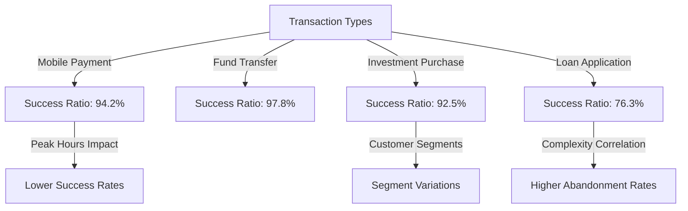
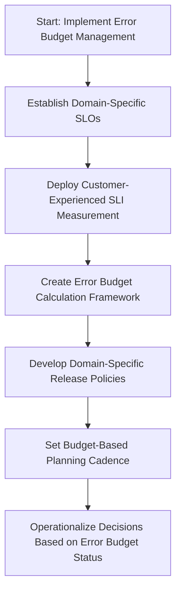
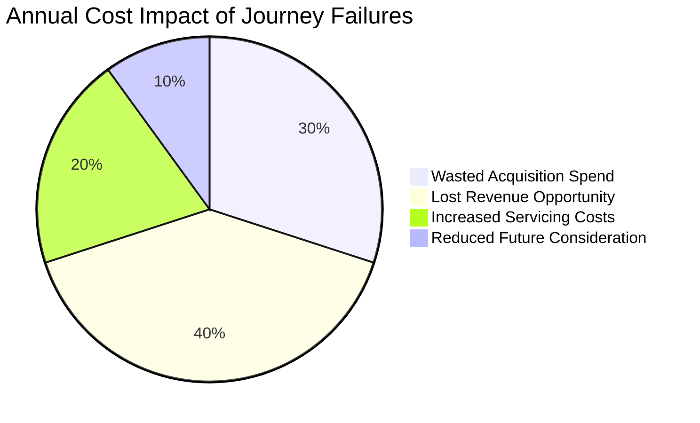
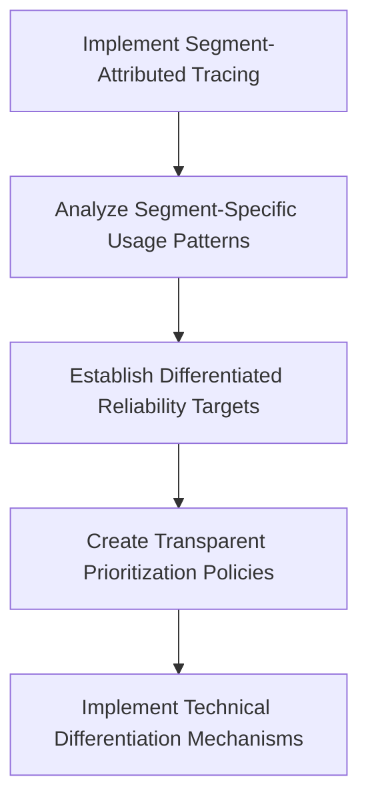
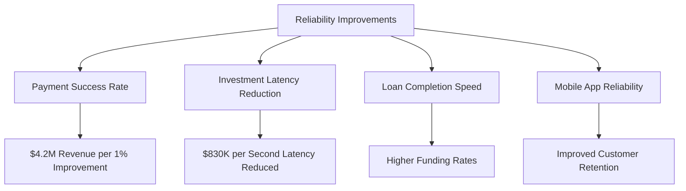

# Chapter 12: Trace-Based Banking SLIs and Customer Experience Metrics

## Chapter Overview

Welcome to the harsh reality of modern banking SRE: where your five-nines uptime badge means squat if customers are rage-quitting your app before their mortgage application even loads. This chapter drags banking SLIs out of their cozy server rooms and dumps them into the customer’s lap—where they belong. We’ll rip apart the fantasy that green dashboards equal happy customers, and show you how to weaponize trace data so your reliability metrics actually track with business outcomes, not just server heartbeats. By the end, you’ll know how to measure what matters, cut the “all customers are equal” nonsense, and stop leaking millions through the cracks between technical health and real-world experience. No more hiding behind averages, or pretending that all transaction failures are created equal. It’s time to make your SLIs as ruthless—and as valuable—as your CFO demands.

______________________________________________________________________

## Learning Objectives

- **Transform** technical monitoring by implementing customer-centric, trace-based SLIs that reflect real user experience.
- **Map** and **analyze** end-to-end customer journeys to pinpoint where business-critical friction and abandonment occur.
- **Correlate** transaction success ratios and latency percentiles with customer behavior to identify high-impact reliability gaps.
- **Establish** error budgets and operational policies that balance innovation velocity with domain-specific banking stability.
- **Segment** SLIs and reliability targets by customer tier, aligning technical investment with actual business value.
- **Quantify** the direct financial impact of reliability improvements so you can finally justify (or slash) those seven-figure budgets.
- **Engineer** dashboards and alerting systems that measure outcomes, not just process health, and actually inform business decisions.

______________________________________________________________________

## Key Takeaways

- If your dashboards say “all clear” while your app store rating tanks, you’re measuring the wrong things. Customers don’t care about your server uptime—they care about their money moving, fast and error-free.
- “Availability” is a fairy tale unless it covers the full customer journey. A perfect 200ms API response is worthless if the customer’s transfer gets stuck in retry hell.
- Transaction success ratio is the only reliability metric that matters to your CFO. Everything else is just noise unless it affects completed transactions and revenue.
- Latency percentiles aren’t just vanity metrics. Customers don’t abandon at the average—they bail at the 95th and 99th percentile. Know your abandonment cliffs, or watch your conversion rates bleed out.
- Error budgets are not bureaucratic busywork—they’re your only defense against reckless feature creep and innovation paralysis. Use trace data to enforce them, or prepare for the next outage blame-fest.
- Measuring single transactions in isolation is for amateurs. Complex banking relationships are won or lost in multi-stage journeys—if you’re not tracing from start to finish, you’re flying blind.
- Not all customers are equal, and pretending otherwise is business malpractice. Segment your SLIs—or keep subsidizing low-value users while your VIPs churn in frustration.
- If you can’t tie reliability improvements to actual dollars, your “investment” is just technical self-indulgence. Trace-driven business outcome correlation is how you get the CFO to sign the check (or at least stop cutting your budget).
- Evidence beats intuition. Gut feelings about “where the pain is” are usually wrong. Let trace data expose the ugly truths about your real customer experience.
- Uniform SLIs are for companies that enjoy wasting money and losing customers. Differentiate, prioritize, and optimize—because your competitors already are.

If you want your “reliability” to mean anything outside the dev basement, it’s time to start measuring like the business depends on it—because it does.

______________________________________________________________________

## Panel 1: Beyond Availability - Customer-Centric Banking SLIs

### Scene Description

A service level management workshop is underway at a major bank, where product owners and SRE teams are collaborating to redefine their monitoring approach. On the wall, two dashboards are displayed side by side, highlighting a dramatic shift in service level indicators:

- **Old Dashboard**: Focused on basic system availability metrics like 99.95% uptime. These metrics show a "green" status, presenting an illusion of overall system health.
- **New Dashboard**: Powered by trace-derived SLIs, this dashboard reveals customer experience metrics. It highlights critical issues: 23% of mobile payment attempts take more than 5 seconds to complete, and 12% of wealth management clients experience at least one failed transaction attempt per session.

Below is a simplified comparison to illustrate the contrast:

```
Old Dashboard (System-Centric)          | New Dashboard (Customer-Centric)
--------------------------------------- | ---------------------------------------
✅ Uptime: 99.95%                       | ❌ 23% of payments > 5s
✅ API Latency: 200ms                   | ❌ 12% of clients face failed transactions
✅ Server Health: All Green             | ✅ Tracking end-to-end customer journeys
```

Engineers explain how trace analysis uncovered these insights, demonstrating the limitations of traditional metrics in reflecting customer pain points. The CTO looks visibly concerned, realizing that excellent technical metrics can mask poor customer experience. Meanwhile, a product manager walks the team through the new dashboard, emphasizing how these trace-based SLIs directly measure what customers encounter, shifting the focus from internal system states to meaningful experience-driven metrics.

### Teaching Narrative

Customer-centric banking SLIs transform service level management from technical availability metrics to meaningful experience measures that directly reflect what customers actually encounter. Traditional banking monitoring approaches focus heavily on system-centric indicators—server uptime, CPU utilization, component availability—that often show "green" dashboards despite customers experiencing significant friction. Distributed tracing enables a fundamental shift to customer-centric SLIs by following actual user transactions end-to-end, measuring what matters to customers rather than what's convenient for engineering teams to monitor. This perspective transformation ensures that service levels reflect business reality rather than technical abstractions. For financial institutions where digital experience directly drives customer retention and revenue, this shift prevents the common anti-pattern of achieving technical SLAs while delivering poor customer outcomes. Engineering and product teams can define SLIs that directly measure critical customer journeys—successful payment completion rates, account opening completion times, trading execution speeds, or wealth management portfolio load times—rather than the underlying components that support these journeys. This customer-centric approach ultimately aligns technical operations with business outcomes by ensuring monitoring focuses on the actual experiences that determine customer satisfaction and loyalty, preventing the dangerous disconnect where all systems appear healthy while customers struggle with poor experiences that technical metrics fail to capture.

### Common Example of the Problem

A major European bank faced significant customer dissatisfaction and attrition despite meeting their technical SLAs. The issue became evident only after implementing distributed tracing across customer journeys, uncovering critical pain points invisible to traditional monitoring. Below is a breakdown of key findings:

| Issue Identified | Traditional Metric Observed | Customer Impact |
| ----------------------------------------- | -------------------------------- | ------------------------------------------------------------------------------- |
| **International wire transfers delayed** | 99.96% API availability | 38% of transfers took over 60 seconds due to cascading retries between services |
| **Incomplete investment portfolio data** | Sub-200ms backend response times | 27% of portfolio views showed missing data despite returning "success" codes |
| **High account opening abandonment rate** | Healthy infrastructure metrics | 42% abandonment due to excessive steps and repeated authentication challenges |

These findings highlighted a dangerous disconnect: technical metrics indicated a healthy system, yet customers were experiencing severe usability issues. This occurred because the monitoring focused on component-level health rather than end-to-end customer outcomes.

### SRE Best Practice: Evidence-Based Investigation

SRE teams must implement customer-journey SLIs derived directly from distributed tracing to replace or augment traditional infrastructure-centric metrics. This approach requires tracing customer transactions end-to-end and defining indicators that directly measure successful outcomes from the customer perspective. Evidence-based investigation starts with comprehensive journey mapping to identify the critical paths customers follow for key banking functions, then establishes appropriate SLIs that measure completion rates, end-to-end latency, error frequency, and consistency of experience for these journeys.

#### Checklist for Evidence-Based Investigation:

1. **Map Customer Journeys**

   - Identify critical customer paths for key banking functions (e.g., payments, account management, trading).
   - Break down each journey into its end-to-end transactional flow.

2. **Define Customer-Centric SLIs**

   - Measure success rates for critical customer actions (e.g., payment completion, trading execution).
   - Track end-to-end latency to ensure acceptable speed for customer transactions.
   - Monitor error frequency and consistency of experience across journeys.

3. **Analyze Trace Data**

   - Correlate trace-based insights with customer outcomes to uncover discrepancies between system health and user success.
   - Identify bottlenecks or failure points along the transaction path.

4. **Perform Segment-Specific Analysis**

   - Investigate how different customer segments (e.g., retail vs. wealth management) experience services.
   - Adapt SLIs to reflect unique needs and behaviors of each segment.

5. **Implement Continuous Monitoring**

   - Use real-time, trace-based monitoring to capture the full distribution of customer experiences.
   - Avoid reliance on averages that may obscure outliers or localized problems.

6. **Align SLIs to Business Outcomes**

   - Ensure SLIs directly reflect metrics that matter to customer satisfaction and retention.
   - Review and adjust SLIs based on evolving business priorities or customer needs.

Following this checklist ensures that SLIs transform from technical abstractions to business-aligned indicators. By leveraging distributed tracing and evidence-based techniques, SRE teams can directly measure and improve what customers actually experience, bridging the gap between technical operations and customer satisfaction.

### Banking Impact

The business consequences of misaligned SLIs extend far beyond technical metrics, directly impacting financial performance and customer relationships. Below is a summary of key data points highlighting the impact:

| **Impact Area** | **Statistic** | **Business Implication** |
| ----------------------------------- | ----------------------------------------------------------------------------------------------- | ----------------------------------------------------------------------------------------------------------------- |
| **Digital Transaction Abandonment** | 15-22% higher abandonment rates for banks with system-centric SLIs | Each 1% improvement in digital completion rates is worth approximately $5-8 million annually for mid-sized banks. |
| **Customer Trust Erosion** | 62% of customers experiencing multiple transaction failures reduce engagement within six months | Leads to diminished customer relationships, regardless of SLA compliance. |
| **Marketing Conversion Drop** | 30-40% lower conversion rates for campaigns targeting poorly measured journeys | Results in wasted marketing budgets and reduced ROI on customer acquisition efforts. |
| **Channel Shift Challenges** | 1% return to branch or call center due to digital friction costs $2-3 million annually | Increases operational expenses, undermining digital channel efficiency and profitability. |

This combination of revenue loss, relationship erosion, wasted marketing spend, and increased operational costs creates a substantial "misalignment tax" that directly impacts bottom-line performance. By aligning SLIs with customer experience, banks can mitigate these risks and ensure that their digital strategies drive both customer satisfaction and financial success.

### Implementation Guidance

1. **Map Critical Customer Journeys**: Document the complete end-to-end flow of your top 10-15 banking transactions (payments, account opening, loan applications, etc.) across all services and touchpoints, ensuring each journey is fully traced from customer initiation to completion. Use collaborative workshops with both business and technical stakeholders to identify all steps in each journey.

2. **Define Customer-Centric SLIs**: For each critical journey, establish SLIs that measure what customers actually experience: completion rates (percentage of started journeys successfully completed), end-to-end response times (full journey duration from customer perspective), error frequencies (rate of customer-impacting failures regardless of cause), and consistency metrics (variation in experience across channels, segments, and time periods).

3. **Implement Cross-Service Tracing**: Deploy consistent instrumentation across all services involved in customer journeys using OpenTelemetry or similar standards, ensuring trace context propagation between frontend interfaces, backend services, and third-party dependencies. Develop custom trace attributes to capture business-relevant information beyond technical details.

4. **Create Experience-Based Dashboards**: Develop visualization dashboards that display customer journey metrics prominently, organizing views by banking product and journey stage rather than by technical service. Include comparison views showing the gap between technical health metrics and actual customer experience measurements.

5. **Establish Alert Thresholds on Customer Outcomes**: Configure alerting based on customer experience thresholds rather than just technical metrics—alert on journey abandonment rates exceeding 10%, end-to-end latency crossing customer tolerance levels, or unexpected changes in journey patterns. Set different thresholds for different customer segments based on their expectations and business value.

## Panel 2: Transaction Success Ratio - The Foundation of Banking Reliability

### Scene Description

A digital banking operations center where engineers are analyzing trace-based transaction success ratios across different channels and customer segments. Large visualization screens show success-to-attempt ratios for critical banking functions: mobile payment completion (94.2%), fund transfer success (97.8%), investment purchase fulfillment (92.5%), and loan application submission (76.3%). The displays highlight concerning patterns: success rates dropping during peak hours for payments, notable differences between customer segments for investment operations, and a clear correlation between application complexity and abandonment rates for loans. A senior reliability engineer is implementing trace-based alerting thresholds that trigger when success ratios fall below customer expectation thresholds rather than when systems show technical failures, fundamentally shifting their operational focus from system health to transaction outcomes.

#### Transaction Success Relationships Overview



This diagram illustrates how different transaction types are analyzed based on their success ratios, highlighting key failure patterns such as peak hour impacts on payments, customer segment differences in investments, and abandonment trends in complex loan applications. Such relationships enable engineers to pinpoint failure modes and refine alerting thresholds to prioritize customer-centric outcomes.

### Teaching Narrative

Transaction success ratio derived from trace data transforms reliability measurement from system availability to customer outcomes in banking environments where completed financial operations matter more than technical uptime. Traditional reliability approaches often focus on whether systems are running rather than whether they're successfully fulfilling their financial purpose—creating dangerous blind spots where "available" systems fail to complete critical customer transactions. Trace-based transaction success ratios address this fundamental gap by directly measuring the proportion of attempted operations that successfully complete across all channels and customer segments. This outcome-centric approach transforms reliability engineering from component-focused maintenance to transaction-focused assurance. For financial institutions where completed transactions directly generate revenue and build customer trust, this shift ensures reliability efforts focus on the business-critical outcomes rather than technical indicators that may mask serious customer impact. Reliability engineers can measure success ratios for different transaction types (payments, transfers, trades, applications), identify patterns in failure modes across channels or customer segments, correlate external factors like peak hours with success variations, and pinpoint specific steps in complex journeys where abandonment or failure most frequently occurs. This trace-based approach ultimately improves both customer experience and business performance by ensuring reliability efforts directly target the transaction outcomes that matter most to customers and the business, rather than technical metrics that may have little correlation with actual financial operation success.

### Common Example of the Problem

A North American retail bank experienced a critical incident with their mobile check deposit system that perfectly illustrated the gap between technical and transaction success metrics. Their monitoring systems showed all check deposit services operating normally with 99.99% availability, sub-100ms API response times, and healthy database connections. However, customer complaints suddenly spiked, with hundreds of users reporting issues with deposits. Only when they implemented trace-based transaction success monitoring did they discover that while all technical components were functioning correctly, 47% of mobile check deposits were failing during the final confirmation step due to a subtle validation error in how check images were being processed. The system was correctly accepting the images and returning success status codes for the upload, but silently failing during the subsequent verification stage.

Despite all technical metrics showing green, nearly half of customers were experiencing failed deposits—many abandoning their attempts after multiple tries and reverting to branch visits. Traditional monitoring missed this entirely because each component was working correctly in isolation; only by measuring the complete transaction flow through distributed tracing could they identify that customers weren't achieving their actual banking goal despite interacting with technically "available" services.

In another case, a global financial institution faced an issue with their online loan application process. During a campaign to promote personal loans, the company saw a surge in application starts but, unexpectedly, a significant drop in completed submissions. Standard monitoring tools indicated no system outages or latency issues, and the application platform reported 100% uptime. However, trace-based transaction monitoring revealed that 62% of customers abandoned their applications at a specific step where income verification was required. The issue stemmed from a poorly designed user interface that made it difficult for applicants to upload supporting documents, combined with uninformative error messages when uploads failed. Customers, frustrated by repeated failures, chose to abandon the process entirely.

These examples highlight a critical blind spot in traditional monitoring: technical metrics alone cannot guarantee customer success. Without focusing on transaction outcomes, financial institutions risk losing revenue, eroding customer trust, and missing opportunities to improve their services. Trace-based transaction success monitoring bridges this gap by providing visibility into the end-to-end customer journey, enabling banks to identify and resolve issues that directly impact their customers' ability to complete critical financial operations.

### SRE Best Practice: Evidence-Based Investigation

SRE teams must implement comprehensive transaction success ratio monitoring derived from trace data to reveal the true customer experience beyond component health. This approach measures successful completion of entire business operations rather than just technical service availability, transforming reliability from infrastructure focus to customer outcome focus.

Evidence-based investigation requires mapping successful completion criteria for each transaction type from a customer perspective—not just technical completion but actual business outcomes. For payment transfers, this means funds successfully appearing in the recipient's account; for loan applications, successful submission with all required documents; for trading operations, orders actually executing at expected prices.

#### Investigation Methodologies Checklist:

- **Trace-Based Funnel Analysis**\
  Identify stages in the transaction journey where drop-offs occur, pinpointing the exact steps that contribute to abandonment or failure.
- **Segment-Specific Success Measurement**\
  Analyze success ratios across different customer segments (e.g., retail vs. corporate) to uncover variations in transaction reliability.
- **Comparative Channel Analysis**\
  Compare transaction success rates across multiple channels (e.g., mobile app, web portal, in-branch systems) to identify inconsistencies in customer experience.
- **Correlation Analysis**\
  Examine relationships between technical performance metrics (e.g., latency, error rates) and transaction success to determine which metrics directly impact customer outcomes.
- **Peak Period Analysis**\
  Investigate transaction success during high-traffic periods to identify scalability or performance bottlenecks that affect reliability.
- **Journey Complexity Assessment**\
  Map out and analyze complex transaction flows (e.g., multi-step loan applications) to identify high-friction steps leading to abandonment or failure.

This checklist empowers SRE teams to adopt a structured, evidence-based approach to investigation, ensuring reliability engineering efforts focus on metrics and actions that directly enhance customer success and business outcomes.

### Banking Impact

Transaction completion failures have direct, quantifiable impacts on banking business performance across multiple dimensions. The table below summarizes the financial and operational implications, providing a clear comparison of metrics and their associated effects:

| Impact Dimension | Key Metrics & Insights | Financial Implications |
| ---------------------- | -------------------------------------------------------------------------------------------------------------- | ------------------------------------------------------------------------------------------------------ |
| **Revenue Leakage** | - Incomplete payment transactions: ~$3.2M lost revenue annually per 1% failure rate (mid-sized banks). | - Abandoned loan applications: ~$12-15M lost lending opportunities annually per 1% submission failure. |
| **Customer Attrition** | - Customers experiencing failures are 3-5x more likely to reduce their banking relationship within 90 days. | - Each 1% attrition: ~$2.5-4M in lifetime value loss (mid-sized institutions). |
| **Operational Costs** | - 70% of customers with digital failures migrate to higher-cost channels. | - Branch visits: 20-25x more expensive than successful digital transactions. |
| | - Call center interactions: 7-10x more expensive than digital. | - Each 1% channel shift: ~$1.5-2M in additional operational costs annually (high-volume transactions). |
| **Regulatory Risks** | - Failures in compliance-related transactions (e.g., AML checks, KYC, reporting) increase regulatory exposure. | - Penalties can exceed tens of millions, along with reputational damage with supervisory authorities. |

This data highlights the critical need for outcome-driven reliability engineering. By reducing transaction failures, financial institutions can mitigate revenue losses, minimize customer attrition, control escalating operational costs, and reduce exposure to regulatory penalties. These improvements not only enhance customer trust but also directly contribute to the institution's financial health and operational efficiency.

### Implementation Guidance

1. **Define Success from the Customer Perspective**:\
   For each critical transaction type, clearly define what constitutes "success" from the customer's viewpoint—not just technical completion but actual business outcome achievement. Document these definitions with both technical teams and business stakeholders to ensure alignment on what truly matters to customers.

2. **Implement End-to-End Transaction Tracing**:\
   Deploy distributed tracing across all services involved in each transaction type, ensuring trace context propagation between frontend interfaces, backend services, and third-party dependencies. Extend traditional tracing with business context like transaction types, amounts, customer segments, and channels to enable business-relevant analysis. Below is an example of how to instrument and propagate trace context in a microservices-based architecture using popular open-source tools:

   ```python
   from opentelemetry import trace
   from opentelemetry.instrumentation.requests import RequestsInstrumentor
   from opentelemetry.sdk.trace import TracerProvider
   from opentelemetry.sdk.trace.export import BatchSpanProcessor, ConsoleSpanExporter
   from opentelemetry.sdk.resources import Resource

   # Define resources and tracer provider
   resource = Resource.create({"service.name": "payment-service"})
   tracer_provider = TracerProvider(resource=resource)
   trace.set_tracer_provider(tracer_provider)

   # Add a console exporter for simplicity
   span_processor = BatchSpanProcessor(ConsoleSpanExporter())
   tracer_provider.add_span_processor(span_processor)

   # Automatically instrument outgoing HTTP requests
   RequestsInstrumentor().instrument()

   tracer = trace.get_tracer("payment-service")

   # Example trace for a transaction
   with tracer.start_as_current_span("process_payment") as span:
       span.set_attribute("transaction.type", "payment")
       span.set_attribute("customer.segment", "retail")
       span.set_attribute("channel", "mobile")
       # Simulate calling a dependent service
       response = requests.get("http://backend-service/process")
       span.add_event("backend_response", {"status_code": response.status_code})
   ```

3. **Establish Transaction Success Dashboards**:\
   Create visualization dashboards that display success ratios prominently for each transaction type, with drill-down capabilities showing patterns by channel, customer segment, time period, and transaction characteristics. Include trend analysis to highlight degradation patterns before they become critical. Use tools like Grafana or Kibana to integrate trace data and success metrics into actionable insights.

4. **Configure Graduated Alert Thresholds**:\
   Implement alerting based on transaction success ratios with appropriate thresholds for different transaction types based on their business criticality—higher thresholds (e.g., 98%+) for payments and trading, potentially lower thresholds for complex multi-step processes like loan applications. Include trend-based alerts that trigger on unusual patterns even before absolute thresholds are crossed. An example pseudocode for configuring alert thresholds via a monitoring system is shown below:

   ```yaml
   alerts:
     - name: "Payment Success Ratio Alert"
       conditions:
         - metric: transaction_success_ratio
           filter: transaction_type == "payment"
           threshold: 0.98
           severity: critical
       actions:
         - notify: on_call_engineers
         - runbook: "https://internal.docs/runbooks/payment-failure"
     - name: "Loan Application Success Degradation"
       conditions:
         - metric: transaction_success_ratio
           filter: transaction_type == "loan_application"
           change_rate: -0.05
           severity: warning
       actions:
         - notify: reliability_team
         - runbook: "https://internal.docs/runbooks/loan-abandonment"
   ```

5. **Develop Failure Classification Mechanisms**:\
   Create systems to automatically categorize transaction failures based on root cause patterns: technical errors, user experience issues, third-party dependencies, or customer behavior. Use this classification to direct remediation efforts appropriately and measure improvement in specific failure categories over time. The following flowchart illustrates a high-level failure classification process:

   ```mermaid
   flowchart TD
       A[Transaction Failure Detected] --> B{Root Cause?}
       B --> C[Technical Error]
       B --> D[User Experience Issue]
       B --> E[Third-Party Dependency]
       B --> F[Customer Behavior]
       C --> G[Remediation: Fix Code/Infra]
       D --> H[Remediation: Improve UX]
       E --> I[Remediation: Escalate to Vendor]
       F --> J[Remediation: Customer Education]
   ```

## Panel 3: Latency Percentiles - When Banking Customers Abandon Transactions

### Scene Description

A user experience optimization session where product and engineering teams are analyzing the relationship between transaction latency and customer abandonment. Multiple screens display trace-based latency percentiles for mortgage application processes, with user behavior data overlaid to show the correlation between response times and customer actions.

The visualization highlights critical thresholds in customer behavior:

```
   Latency (seconds)   |  Abandonment Rate
   --------------------|-------------------
   0 - 3 seconds       |  Low (<10%)
   4 - 5 seconds       |  Moderate (~20%)
   6 - 7 seconds       |  High (~30%)
   8+ seconds          |  Very High (~40%)
```

Heat maps reveal which specific application steps are most sensitive to latency. For example:

- **High Sensitivity**: Identity verification and credit check screens exhibit sharp abandonment increases with delays beyond 4 seconds.
- **Moderate Sensitivity**: Document upload steps show a more gradual abandonment trend, with customers tolerating longer processing times.

Engineers are using this data to implement differentiated SLIs, setting stricter latency targets for high-abandonment-risk steps while allowing more flexibility for stages where customers expect and tolerate longer delays. This approach ensures performance enhancements are prioritized for the areas most critical to maintaining customer engagement.

### Teaching Narrative

Latency percentiles derived from trace analysis transform performance management from arbitrary technical targets to evidence-based thresholds aligned with actual customer behavior in banking digital experiences. Traditional performance approaches often apply uniform response time targets across all operations, missing the crucial reality that latency sensitivity varies dramatically across different banking functions and customer contexts. Trace-based latency percentiles address this nuance by providing comprehensive timing distributions across entire customer journeys, revealing precisely where and when speed matters most to customers. This behavior-aligned approach transforms performance engineering from technical opinion to data-driven decisions based on observed customer reactions. For financial institutions where digital abandonment directly impacts revenue and customer acquisition costs, this precision ensures performance investments target the specific transaction steps where speed most directly affects completion rates. Experience designers and engineers can identify exactly which percentile thresholds correlate with abandonment for different transaction types (p95 vs p99), which specific journey steps show highest latency sensitivity, how patience thresholds vary across customer segments and contexts, and which performance improvements would most directly impact overall completion rates. This evidence-based approach ultimately improves both customer experience and efficiency by ensuring performance targets reflect actual customer sensitivity rather than uniform technical standards—investing more in speed where it demonstrably matters while accepting appropriate trade-offs where customers clearly tolerate longer processing times for complex financial operations.

### Common Example of the Problem

A leading retail bank's mortgage application platform perfectly illustrated the problem of uniform latency targets disconnected from customer behavior. Their engineering team had established a global 2-second response time target for all mortgage application components, requiring substantial infrastructure investment to achieve this target across all 32 steps in their application process. Despite meeting this technical target, their mortgage application completion rate remained at a disappointing 58%.

When they implemented trace-based latency analysis with customer behavior correlation, they discovered their uniform approach was both overinvesting and underinvesting simultaneously. Customer abandonment data showed borrowers had near-zero latency sensitivity during document upload steps—willingly waiting 15+ seconds with no increased abandonment, making the 2-second target unnecessary overinvestment for these stages. Conversely, during initial rate quote and pre-approval steps, abandonment increased dramatically when responses exceeded 1.2 seconds, making the 2-second target actually too lenient for these critical early funnel stages.

Most critically, they discovered their identity verification step—while meeting the 2-second technical target—had a problematic pattern where responses typically came in just under 2 seconds but with high variability, causing occasional 3-4 second responses that triggered 30% of all application abandonments. Their uniform approach had masked this critical issue while wasting resources on stages where speed provided no customer benefit.

| **Process Step** | **Uniform Target (2s)** | **Trace-Based Target** | **Customer Sensitivity** | **Impact Observed** |
| --------------------- | ----------------------- | ------------------------ | ------------------------------- | ----------------------------------------------------------------------------------- |
| Initial Rate Quote | 2s | 1.2s | High | Abandonment increased sharply beyond 1.2s, requiring stricter latency targets. |
| Pre-Approval | 2s | 1.2s | High | Similar to rate quote, slower responses led to significant drop-offs. |
| Identity Verification | 2s | ≤2s with low variability | High (sensitive to variability) | High variability caused occasional 3-4s responses, resulting in 30% abandonment. |
| Document Upload | 2s | 15s | Low | Customers tolerated longer waits without increased abandonment, making 2s wasteful. |

This comparison highlights how uniform latency targets can misallocate resources, failing to address critical customer pain points while over-optimizing steps where speed holds little value. By adopting trace-based latency analysis, the bank realigned its performance investments, focusing on where speed truly mattered to customers, resulting in improved completion rates and optimized resource allocation.

### SRE Best Practice: Evidence-Based Investigation

SRE teams must implement percentile-based latency measurement derived from distributed tracing to replace simplistic average-based targets or uniform thresholds. This approach recognizes that different banking operations have fundamentally different customer sensitivity to latency, requiring evidence-based threshold setting rather than uniform technical standards.

Evidence-based investigation starts with comprehensive latency distribution analysis across customer journeys, measuring not just averages but full percentile distributions (p50, p90, p95, p99) to understand the complete performance profile customers experience. Critical investigation approaches include latency-to-abandonment correlation to identify precisely which performance thresholds trigger customer dropoff for different transaction types, segment-specific analysis to understand how different customer groups respond to performance variations, step-specific sensitivity measurement to identify which journey stages are most latency-critical, and variability impact assessment to determine whether consistency matters more than absolute speed for certain operations.

#### Checklist for Evidence-Based Investigation

- **Define the Scope of Analysis**

  - Identify key customer journeys to evaluate.
  - Determine which transactions are most business-critical or abandonment-sensitive.

- **Collect and Analyze Latency Data**

  - Gather percentile-based latency distributions (e.g., p50, p90, p95, p99).
  - Use distributed tracing to map performance across all transaction steps.

- **Correlate Latency with Customer Behavior**

  - Analyze abandonment rates across different latency thresholds.
  - Identify latency thresholds with the highest impact on customer dropoff.

- **Segment and Contextualize**

  - Perform segment-specific analysis (e.g., customer type, device, or region).
  - Evaluate how latency sensitivity varies by demographic or contextual factors.

- **Focus on Step-Specific Sensitivity**

  - Identify which transaction steps are most latency-critical.
  - Highlight steps where customers tolerate slower processing vs. those that require stricter targets.

- **Assess Consistency vs. Speed**

  - Evaluate if customers prioritize consistent response times over absolute speed for certain operations.
  - Identify operations where reducing variability is more impactful than improving peak performance.

- **Define Evidence-Based SLIs**

  - Use findings to create SLIs tailored to customer behavior and business priorities.
  - Set stricter latency targets for high-abandonment-risk steps while allowing flexibility where tolerance is higher.

This data-driven approach ensures performance engineering addresses the specific latency thresholds that actually matter to customers rather than technically convenient but behaviorally meaningless targets. By understanding where customers actually demonstrate sensitivity to performance—through observable abandonment or reduced engagement—teams can focus optimization efforts precisely where they deliver maximum business impact rather than pursuing uniform performance targets regardless of customer behavior.

### Banking Impact

Misaligned latency targets create substantial business impact through both direct revenue loss and wasted engineering investment. Transaction abandonment due to poorly optimized performance directly impacts conversion metrics—research indicates that each 100ms of improvement in latency-sensitive banking operations increases completion rates by 1.8-2.4% on average, representing approximately $7-10 million in additional annual transaction volume for mid-sized banks.

Customer perception impacts extend beyond immediate abandonment, with studies showing that customers who experience inconsistent performance are 2.5x more likely to explore competitor offerings within 30 days, even if they complete their immediate transaction. This perception-driven attrition risk represents approximately $3-5 million in annual lifetime value erosion per percentage point of customers who develop negative performance perceptions.

Engineering efficiency losses are equally significant when performance optimization targets the wrong operations—banks typically invest $2-3 million annually in performance engineering resources, with an additional $4-6 million in infrastructure costs specifically for performance optimization. When these investments target operations where customers demonstrate minimal latency sensitivity, this represents substantial wasted capital that could be redirected to higher-impact areas.

Competitive differentiation opportunities are also missed when banks fail to identify the specific latency thresholds that drive customer preference in key journeys. Research shows that banks delivering sub-second response times in truly latency-sensitive operations like balance checking, payment confirmation, and trading execution can achieve 5-8% market share gains in specific high-value customer segments, representing tens of millions in additional annual revenue opportunity.

#### Summary of Quantitative Data

| Impact Area | Key Metric | Financial Impact |
| ---------------------------------- | --------------------------------------------------------------------------------------------------------- | -------------------------------------------- |
| Transaction Abandonment | 100ms latency improvement increases completion rates by 1.8-2.4% | $7-10M annual transaction volume gain |
| Perception-Driven Attrition | 2.5x higher likelihood of exploring competitors due to inconsistent performance | $3-5M annual lifetime value erosion per 1% |
| Engineering Resource Misallocation | $2-3M in annual performance engineering costs wasted on non-critical operations | $2-3M in inefficient engineering spend |
| Infrastructure Inefficiency | $4-6M in annual infrastructure costs for misaligned performance optimization | $4-6M in avoidable infrastructure expenses |
| Market Share Gains | Sub-second latency in sensitive operations (e.g., balance checks, trading) increases market share by 5-8% | Tens of millions in potential annual revenue |

This table provides a clear summary of the quantitative data, enabling teams to quickly assess the financial impact of latency misalignment and prioritize optimization efforts.

### Implementation Guidance

1. **Implement Comprehensive Percentile Measurement**: Deploy distributed tracing with full percentile latency measurement (p50, p90, p95, p99) for all critical banking journeys, ensuring measurement captures the complete customer experience from initial interaction to final completion rather than just individual service performance.

2. **Correlate Latency with Customer Behavior**: Integrate trace-based performance data with customer behavior analytics to identify the specific latency thresholds that trigger abandonment or reduced engagement for different transaction types and journey stages. Use this data to create latency sensitivity maps for each major customer journey.

3. **Develop Journey-Stage Specific Targets**: Establish differentiated performance targets for each stage in customer journeys based on observed sensitivity—stricter targets (e.g., p95 < 1s) for highly sensitive operations like payment confirmation or trading execution, more relaxed targets (e.g., p95 < 5s) for stages where customers demonstrate high tolerance for processing time.

4. **Create Segment-Aware Performance Objectives**: Implement customer segment-specific performance measurement and targets, recognizing that different customer groups (retail, affluent, small business, etc.) often demonstrate different sensitivity to latency. Prioritize optimization for segments with both high sensitivity and high business value.

5. **Establish Variability-Based SLOs**: Develop service level objectives that specifically address performance consistency rather than just absolute speed for operations where customers demonstrate sensitivity to variability. Implement dual metrics tracking both median performance (p50) and worst-case experience (p95/p99) to ensure consistency across the entire customer base.

## Panel 4: Error Budget Management - Balancing Innovation and Banking Stability

### Scene Description

A quarterly planning session is underway, bringing together product, engineering, and operations leaders to assess the current error budget status based on trace-derived SLIs. The main screen prominently displays the remaining error budgets for key banking domains:

- Retail Payments: **62% remaining**
- Investment Platform: **8% remaining**
- Loan Origination: **95% remaining**
- Wealth Management: **44% remaining**

A visualized deployment calendar highlights the correlation between release cadence and error budget consumption. The calendar reveals a clear trend: **smaller, more frequent changes consume less error budget** compared to large, quarterly releases. This insight drives a pivotal discussion on release strategies.

Key decisions are being made based on this data:

- **Investment Platform Team**: Implementing a **feature freeze** to focus solely on reliability improvements, given their critically low error budget.
- **Loan Origination Team**: Leveraging their healthy error budget to prioritize **accelerated innovation** and implement new features.
- **Retail Payments and Wealth Management Teams**: Balancing reliability enhancements with controlled feature rollouts, aligned to their respective budget capacities.

The CTO is finalizing a **domain-specific release strategy**, informed by the trace data. The strategy emphasizes:

1. **Accelerating innovation** in domains with high error budget reserves.
2. **Focusing on reliability** in domains where budgets are depleted.
3. **Adjusting release patterns** to optimize error budget usage, favoring frequent, smaller deployments.

Below is a simplified representation of the deployment calendar and its impact on error budget consumption:

```
Deployment Cadence: 
+-------------------------------------------------+
| Large Quarterly Release |  ████████████████    | 
| Frequent Small Changes  |  ████               |
+-------------------------------------------------+

Error Budget Consumption: 
+-----------------------------------------------+
| High Impact (red) -> Low Impact (green)       |
| Investment Platform: ████████████████████████ | 
| Wealth Management:    ██████████              | 
| Retail Payments:       █████                  |
| Loan Origination:       ██                    |
+-----------------------------------------------+
```

This evidence-based, visual approach ensures that all stakeholders clearly understand how release decisions align with both customer experience priorities and the institution's overall innovation and stability goals.

### Teaching Narrative

Error budget management based on trace-derived SLIs transforms release strategy from subjective risk assessments to evidence-based decision frameworks in banking environments balancing innovation pressure against stability requirements. Traditional approaches to change management often rely on gut feelings about reliability or treat all domains with uniform caution despite vastly different stability profiles. Trace-based error budgets address this challenge by quantifying acceptable reliability margins based on customer-experienced SLIs, creating a data-driven mechanism for balancing innovation and stability across different banking domains. This quantified approach transforms release governance from opinion-based debates to objective decisions based on measured reliability capacity. For financial institutions where digital innovation drives competitive advantage but stability directly impacts customer trust, this framework ensures appropriate risk calibration across diverse banking functions with different reliability profiles and innovation needs. Technology leaders can make differentiated decisions based on domain-specific reliability data—accelerating feature delivery where error budgets remain healthy, focusing on reliability improvements where budgets are depleted, adjusting release patterns based on measured impact on customer experience, and setting appropriate risk thresholds for different banking functions based on their criticality and customer expectations. This evidence-based approach ultimately improves both innovation velocity and overall stability by ensuring release decisions reflect the actual reliability capacity of different domains rather than applying uniform caution across all banking functions regardless of their demonstrated stability profiles and innovation requirements.

### Common Example of the Problem

A global financial services firm experienced the classic tension between innovation and stability in their digital banking platform, but with a costly twist—their one-size-fits-all change management approach was simultaneously too restrictive in some areas and too permissive in others. Their enterprise release policy mandated uniform quarterly release cycles with identical change management procedures across all banking functions, regardless of reliability history or business context.

This approach created two equally damaging scenarios:

| **Domain** | **Reliability Metrics** | **Release Cycle** | **Key Outcomes** |
| ----------------------- | ------------------------------------ | -------------------------- | -------------------------------------------------------------------------------------------------------------------------------- |
| **Retail Payments** | 12 customer-impacting incidents/year | Uniform quarterly releases | **Delayed innovation**: Competitive features delayed by months, leading to a 3% market share loss to faster fintech competitors. |
| **Investment Platform** | 38 customer-impacting incidents/year | Uniform quarterly releases | **Stability issues**: Excessive change volume caused persistent reliability problems and complex root cause analysis. |

- In the **retail payments platform**, the application of overly cautious quarterly release cycles stifled innovation despite its strong reliability record. With only 12 customer-impacting incidents in the past year, the platform had the capacity to support faster, iterative releases. However, the restrictive policy delayed feature delivery, resulting in lost competitiveness and a notable decline in market share.

- On the other hand, the **investment platform** faced persistent reliability issues with 38 customer-impacting incidents in the same timeframe. Despite its demonstrated instability, the uniform quarterly release process allowed large, bundled releases, exacerbating reliability problems. Root cause analysis became nearly impossible due to the high volume of simultaneous changes, and customer trust was significantly impacted.

Without quantified error budgets based on trace-derived reliability data, the organization lacked an objective framework to apply appropriate risk tolerance across different functions. This resulted in innovation being stifled where stability supported it, while excessive change was permitted where reliability required caution. A domain-specific strategy informed by error budgets could have prevented both scenarios, enabling faster delivery for stable domains while enforcing stricter governance in areas with reliability challenges.

### SRE Best Practice: Evidence-Based Investigation

SRE teams must implement formal error budget frameworks based on trace-derived SLIs to transform change governance from subjective opinion to evidence-based decision-making. This approach requires establishing quantified reliability targets for different banking functions based on business requirements, then measuring actual customer-experienced reliability through comprehensive distributed tracing to determine the remaining "budget" for risk-taking.

To make the evidence-based investigation process actionable, practitioners can follow this step-by-step guide:

1. **Establish Domain-Specific SLOs**

   - Define reliability targets for each banking function (e.g., retail payments, investment platform) based on:
     - Customer expectations (e.g., acceptable downtime or latency).
     - Business criticality (e.g., regulatory requirements, revenue impact).
     - Competitive context (e.g., industry benchmarks).

2. **Measure Customer-Experienced Reliability**

   - Use distributed tracing and telemetry data to track SLIs (e.g., error rates, latency) against established SLOs.
   - Quantify the remaining error budget for each domain to determine the margin for risk-taking.

3. **Conduct Trend Analysis**

   - Analyze error budget consumption trends over time to identify patterns (e.g., steady depletion vs. sudden spikes).
   - Correlate trends with release activities to understand the impact of change cadence.

4. **Perform Impact Assessments**

   - Evaluate how specific release characteristics (e.g., size, frequency) affect error budget depletion.
   - Determine whether smaller, more frequent changes or larger, less frequent releases yield better reliability outcomes.

5. **Compare Across Domains**

   - Perform comparative analysis to identify systemic patterns or domain-specific outliers in reliability performance.
   - Use these insights to tailor risk governance strategies for each domain.

6. **Correlate Changes to Incidents**

   - Investigate incidents to map them to specific changes or deployments.
   - Identify characteristics of changes (e.g., code complexity, testing coverage) that frequently lead to reliability issues.

7. **Refine and Adjust Governance**

   - Use evidence from the analysis to adjust release policies, such as:
     - Enforcing feature freezes for domains with depleted error budgets.
     - Accelerating innovation in domains with healthy budgets.
   - Continuously refine SLOs to reflect evolving customer needs and business priorities.

By following this checklist, SRE teams can ensure that risk governance reflects the actual reliability profiles of different banking functions, driving decisions with objective, quantified data. This approach replaces subjective debates with evidence-based governance aligned to both stability requirements and innovation objectives.

### Banking Impact

Error budget implementation drives substantial business impact through enhanced stability and accelerated innovation, directly influencing financial and operational outcomes. Below is a summary table quantifying key impacts across critical dimensions:

| **Dimension** | **Metric** | **Impact Range (Mid-Sized Institution)** |
| ----------------------------- | ------------------------------------------------------------------------------------- | ----------------------------------------------------------- |
| **Revenue Protection** | Avoided customer-impacting incidents in high-value domains (e.g., payments, trading) | $3-5M per 1% improvement in availability |
| **Innovation Velocity** | Market share gain from 50% reduction in time-to-market for digital features | 2-3% (~$10-15M additional annual revenue) |
| **Engineering Efficiency** | Cost savings from targeted reliability engineering investments | 15-20% reduction (~$1.5-2.5M annual savings) |
| **Customer Satisfaction** | Net Promoter Score (NPS) increase from stability and innovation improvements | +8-12 points within 12 months |
| **Regulatory Risk Reduction** | Decrease in severity-one incidents in regulated functions (e.g., payments, reporting) | 30-40% reduction, avoiding penalties up to tens of millions |

#### Key Insights:

1. **Revenue Protection**: Improved stability in critical domains prevents transaction failures, directly correlating with transaction volume and revenue retention.
2. **Innovation Velocity**: Faster feature releases in domains with healthy error budgets capture competitive advantages and unlock market growth opportunities.
3. **Engineering Efficiency**: Resource allocation based on domain-specific error budgets optimizes reliability investments, reducing unnecessary costs.
4. **Customer Satisfaction**: Enhanced stability and innovation drive better customer experiences, increasing retention and product utilization.
5. **Regulatory Risk**: Reduced severity-one incidents in highly regulated areas decreases compliance exposure and avoids costly penalties.

This data-driven approach aligns technical reliability with business outcomes, ensuring that financial institutions achieve a balanced strategy of innovation and stability tailored to their specific operational and customer needs.

### Implementation Guidance

To implement an effective error budget management framework, follow the structured steps below. This checklist ensures a methodical approach to balancing innovation and stability across banking domains.

#### Step-by-Step Checklist

1. **Establish Domain-Specific SLOs**

   - Identify key banking domains (e.g., retail payments, loan origination, wealth management).
   - Define reliability targets (SLOs) tailored to each domain based on:
     - Customer expectations.
     - Business criticality.
     - Competitive context.
   - Example Targets:
     - Critical operations (e.g., retail payments): 99.95% success rate.
     - Non-critical or experimental domains: 99.5% success rate.

2. **Implement Customer-Experienced SLI Measurement**

   - Deploy distributed tracing to capture customer-impacting metrics.
   - Focus on SLIs such as:
     - Transaction success rates.
     - End-to-end latency compliance.
     - Error frequencies experienced by customers.
   - Ensure SLIs reflect actual customer experience, not just internal technical metrics.

3. **Create Error Budget Calculation Framework**

   - Define mechanics to calculate error budgets:
     - Use the gap between SLO targets and actual reliability to determine available margin.
   - Standardize consumption accounting:
     - Quantify the impact of incidents and degradations.
     - Measure impact based on customer-experienced magnitude and duration.

4. **Develop Domain-Specific Release Policies**

   - Design release strategies tied to error budget status:
     - Accelerated release cycles when budgets are healthy.
     - Conservative approaches where budgets are low or depleted.
   - Establish governance mechanisms to adjust:
     - Release approval requirements.
     - Testing standards.
     - Monitoring protocols based on budget consumption.

5. **Establish Budget-Based Planning Cadence**

   - Schedule regular error budget reviews:
     - Monthly for fast-moving domains.
     - Quarterly for broader enterprise assessments.
   - Standardize planning decisions:
     - Implement feature freezes when budgets are depleted.
     - Accelerate innovation where budgets are healthy.
     - Prioritize reliability investments for domains with consistently low budgets.

#### Flowchart Representation



- **A to B**: Define SLOs to set reliability targets.
- **B to C**: Measure SLIs to capture customer experience.
- **C to D**: Quantify error budgets to assess available margin.
- **D to E**: Adjust release policies based on budget health.
- **E to F**: Integrate reviews into planning cadence.
- **F to G**: Make data-driven decisions on innovation and stability.

By adhering to this structured approach, technology leaders can ensure their release strategies align with the reliability capacity of each banking domain while maintaining a balance between innovation and stability.

## Panel 5: Customer Journey SLIs - Measuring Multi-Stage Banking Experiences

### Scene Description

A digital banking strategy session where customer experience and reliability teams are analyzing end-to-end journey metrics derived from distributed tracing. The visualization screens display a funnel chart for each key banking process, illustrating customer progression and drop-off points:

- **Mortgage Application Journey**: From initial inquiry to closing.
- **Investment Account Opening**: From application to first trade.
- **Small Business Loan Processing**: From application to funding.

The funnel analytics reveal critical insights invisible to traditional monitoring:

- **Mortgage Applications**: 64% of abandoned applications occur during the document verification stage.
- **Investment Accounts**: Completion rates vary dramatically based on the initial funding method.
- **Business Loans**: A 40% drop-off occurs when credit verification exceeds 4 hours.

Below is a text-based representation of a typical funnel analysis for a mortgage application journey:

```
Mortgage Application Funnel:
1. Initial Inquiry: 100% (10,000 customers)
2. Application Submission: 80% (8,000 customers)
3. Document Verification: 36% (3,600 customers)
4. Final Approval: 30% (3,000 customers)
5. Closing: 28% (2,800 customers)
```

The trace data enables product managers to define journey-based SLIs that measure complete customer processes rather than individual transactions. This fundamentally shifts the focus from technical component performance to business process completion, ensuring reliability efforts directly address critical friction points and abandonment stages that impact customer success and business outcomes.

### Teaching Narrative

Customer journey SLIs derived from end-to-end trace analysis transform experience measurement from disconnected transaction metrics to comprehensive process analytics essential for complex banking relationships. Traditional SLI approaches often focus on individual transactions or technical operations, missing the crucial reality that customer satisfaction in banking depends on the successful completion of multi-stage journeys that may span days or weeks—mortgage applications, account openings, loan processing, or investment portfolio setup.

To better understand this, think of a multi-stage customer journey as a relay race. Each stage of the process—such as document verification in a mortgage application or credit checks in a business loan—is like a leg of the race, with the customer "baton" being handed off between teams, departments, or systems. Just as in a relay race, the success of the entire journey depends not only on the performance of individual runners but also on the smoothness of the hand-offs between them. A dropped baton—or in this case, a delay, error, or poor hand-off—can jeopardize the entire outcome, causing the customer to abandon the process entirely.

Trace-based journey SLIs address this limitation by connecting distributed traces across time, channels, and sessions to measure complete customer processes from initiation to completion. This journey-centric approach transforms reliability engineering from technical transaction focus to business process assurance. For financial institutions where relationship value depends on guiding customers through complex multi-stage processes, this comprehensive view ensures reliability efforts address the actual completion rates and friction points that determine business outcomes rather than technical metrics that provide limited insight into customer success.

Experience teams can identify precisely where abandonment occurs in complex journeys, how hand-offs between channels or departments affect completion rates, which verification or processing steps create the highest friction, and how timing expectations vary across different stages of the same journey. By focusing on the entire "relay race" of the customer experience, teams can target reliability efforts where they matter most, ensuring that each leg of the journey and every hand-off is optimized for success. This trace-based approach ultimately improves both customer acquisition efficiency and relationship development by ensuring reliability efforts directly target the end-to-end journey performance that drives business success rather than disconnected transaction metrics that fail to capture the actual customer experience of complex banking processes.

### Common Example of the Problem

A leading wealth management firm encountered the classic problem of journey fragmentation when launching their new digital onboarding process for high-net-worth clients. Their technical monitoring showed excellent performance for individual components: account creation services responded in under 300ms, document upload systems showed 99.99% availability, and identity verification APIs had 99.7% success rates. Based on these strong technical metrics, they expected their new digital channel to dramatically improve client acquisition efficiency.

Instead, they discovered only 23% of started applications ever resulted in funded accounts—despite every individual step working correctly from a technical perspective. Only when they implemented end-to-end journey tracing did they uncover the reality: their technically "successful" process was failing at the journey level due to multiple disconnection points invisible to transaction-level monitoring.

#### Key Metrics and Insights Summary

| Stage | Issue Identified | Impact |
| --------------------------------------------- | ------------------------------------------------------------------------------------ | ----------------------------------------------------------------------------------------- |
| **Account Creation to Document Verification** | Confirmation emails delayed by up to 12 hours despite system availability at 99.99%. | 40% abandonment during this hand-off stage. |
| **Document Upload Completion** | CRM notifications not consistently triggered after successful uploads. | 35% of clients completing uploads never received follow-ups from advisors. |
| **Account Funding** | Initial funding minimum disclosed only after significant application progress. | 25% of verified accounts were abandoned before funding due to unexpected minimum amounts. |

#### Root Cause Analysis Flow (Text-Based Representation)

```
[Account Creation] --> [Document Verification] --(40% Abandonment)--> [Document Upload]
[Document Upload] --(35% No Follow-Up)--> [CRM Notification] --> [Account Verification]
[Account Verification] --(25% Abandonment)--> [Funding Minimum Presented] --> [Completed Account]
```

None of these critical business failures appeared in their technical monitoring because each individual transaction was completing successfully—the journey was failing despite every component working correctly when measured in isolation.

### SRE Best Practice: Evidence-Based Investigation

To implement journey-based SLIs effectively, SRE teams must adopt a structured, evidence-based investigation process that transforms monitoring from isolated technical transactions to holistic business process completion. This approach recognizes that multi-stage banking processes span days or weeks and require fundamentally different measurement strategies to reflect customer experience accurately.

#### Checklist for Evidence-Based Investigation

1. **Map the Customer Journey**

   - Document the end-to-end process for key banking journeys, such as:
     - Mortgage applications
     - Account openings
     - Loan processing
     - Wealth management setup
   - Include all steps from initial customer interaction to final process completion.

2. **Perform Conversion Funnel Analysis**

   - Identify specific stages where customer abandonment occurs.
   - Quantify drop-off rates at each step to prioritize areas with the highest attrition.

3. **Measure Hand-Off Effectiveness**

   - Analyze transitions between departments or channels (e.g., digital-to-phone, in-person-to-digital).
   - Evaluate whether these hand-offs introduce delays, errors, or added friction that impact completion rates.

4. **Analyze Timing Patterns**

   - Measure elapsed time between stages of the journey.
   - Correlate delays with abandonment rates to determine where time-sensitive optimizations are needed.

5. **Compare Journey Performance Across Channels**

   - Evaluate completion patterns for the same journey across digital, phone, and in-person channels.
   - Identify inconsistencies or inefficiencies that could signal process misalignment or channel-specific friction.

6. **Identify Invisible Friction Points**

   - Use distributed tracing to uncover issues not visible at the transaction level.
   - Focus on technical and procedural bottlenecks that impact the overall journey success.

#### Key Outcomes of the Process

This journey-centric investigation enables SRE teams to:

- Shift focus from technical transaction success to business process completion.
- Pinpoint specific friction points that lead to customer abandonment.
- Develop SLIs that measure actual customer success, ensuring reliability initiatives align with business outcomes.

By following this structured approach, SRE teams can ensure their efforts address the real-world complexities of multi-stage banking processes, ultimately driving improved customer satisfaction and stronger financial relationships.

### Banking Impact

Journey completion failures create substantial business impact through both direct revenue loss and relationship development inhibition. The financial implications can be summarized as follows:

#### Financial Impacts Overview



1. **Wasted Acquisition Spend**:\
   Incomplete journeys represent wasted marketing investment. Financial institutions typically spend $300-500 per prospect driven to complex product applications. For mid-sized institutions with 60% journey abandonment rates, this equates to $3-5 million in wasted acquisition spend annually.

2. **Lost Revenue Opportunity**:\
   Incomplete account opening journeys result in significant revenue loss based on typical lifetime value models:

   - Wealth management products: $12-15 million per thousand abandoned applications annually.
   - Lending products: $5-8 million per thousand abandoned applications annually.
   - Deposit relationships: $2-4 million per thousand abandoned applications annually.

3. **Increased Servicing Costs**:\
   Approximately 40-60% of customers abandoning digital journeys attempt to continue through higher-cost channels. Each journey shift creates $200-350 in additional servicing costs, leading to $2.5-4 million in avoidable annual operational expenses for institutions processing thousands of applications monthly.

4. **Reduced Future Consideration**:\
   Market perception impacts long-term revenue. Research indicates 70% of prospects who abandon complex banking journeys develop negative perceptions of institutional competence. This results in future acquisition barriers across the product portfolio, with an estimated annual impact of $8-12 million in reduced consideration rates for mid-sized institutions.

By addressing these journey completion failures, financial institutions can significantly reduce costs, recover lost revenue opportunities, and improve customer satisfaction, ultimately driving business success.

### Implementation Guidance

1. **Map Complete Customer Journeys**: Document the end-to-end process for complex banking products from initial inquiry through completion, including all customer touchpoints, backend processing steps, hand-offs between departments, and typical timeframes. Ensure journey maps include all possible paths, exception handling, and cross-channel transitions.

2. **Implement Journey Correlation Identifiers**: Deploy consistent customer journey identifiers that persist across all touchpoints, channels, and sessions involved in complex processes. Ensure these identifiers propagate through all technical traces, enabling connection of distributed transactions into coherent journey visualizations spanning days or weeks.

3. **Deploy Funnel-Based Measurement**: Create journey analytics dashboards showing conversion rates between each major step in complex processes, with clear visualization of where customers abandon journeys. Implement cohort analysis to track completion rates for different customer segments, product variations, and marketing channels.

4. **Establish Journey-Based SLOs**: Define appropriate service level objectives for complete journeys rather than just component transactions—overall completion rate targets, maximum acceptable time-to-completion, consistent experience standards across channels, and hand-off effectiveness measures between journey stages.

5. **Create Experience Replay Capability**: Implement capabilities to "replay" individual customer journeys for analysis, showing exactly what specific customers experienced across all touchpoints and identifying whether abandonment resulted from technical failures, process complexity, or customer decisions. Use these replays to develop pattern recognition for common journey failure modes.

## Panel 6: Segmented SLIs - Different Reliability for Different Banking Customers

### Scene Description

A customer strategy meeting unfolds, with banking executives and technology leaders gathered around a table in a high-tech conference room. Large visualization screens dominate the room, displaying segmented reliability data derived from distributed tracing. The visuals highlight striking differences in experience metrics across customer segments:

- **Premium Banking Clients**: 99.8% payment success rates.
- **Mass Market Segments**: 97.3% payment success rates.
- **Wealth Management Clients**: 2.1-second average response times.
- **Retail Customers**: 3.8-second average response times.
- **Business Banking Customers**: Higher authentication failure rates compared to retail clients.

These metrics, presented in clear comparative charts and graphs, reveal uncomfortable truths about current reliability disparities, sparking discussions on opportunities for segmentation. Below is a simplified text-based representation of the key visualization:

```
+----------------------+-------------------+-----------------+-------------------------+
| Customer Segment     | Payment Success  | Avg. Response   | Authentication Failures |
|                      | Rates (%)        | Time (seconds)  | (Relative Comparison)   |
+----------------------+-------------------+-----------------+-------------------------+
| Premium Banking      | 99.8             | 2.1             | Low                     |
| Mass Market          | 97.3             | 3.8             | Medium                  |
| Wealth Management    | --               | 2.1             | Low                     |
| Retail Customers     | --               | 3.8             | Medium                  |
| Business Banking     | --               | --              | High                    |
+----------------------+-------------------+-----------------+-------------------------+
```

As the data is reviewed, the discussion pivots to defining segment-specific SLIs and targets. Leaders emphasize the importance of formally acknowledging different reliability requirements and business priorities across customer tiers. The meeting's focus is on creating explicit reliability differentiation strategies that align with their customer segmentation. This approach abandons the pretense of identical service levels for all users, instead embracing a transparent model that reflects business realities and ensures fair resource allocation.

### Teaching Narrative

Segmented SLIs derived from trace analysis transform reliability strategy from one-size-fits-all targets to differentiated objectives aligned with customer segmentation in banking environments where relationship value varies dramatically across client tiers. Traditional SLI approaches often apply uniform reliability targets across all customers, either ignoring the business reality that different segments have different expectations and values or creating unofficial "shadow prioritization" that happens during incidents without transparent goals. Trace-based segmented SLIs address this challenge by providing segment-specific reliability data and enabling explicit differentiation strategies aligned with business priorities. This segmented approach transforms reliability from a technical function to a business strategy enabler that appropriately calibrates investments across customer tiers. For financial institutions where client lifetime value may vary by orders of magnitude between segments, this explicit differentiation ensures appropriate resource allocation that reflects business priorities while maintaining acceptable service levels for all customers. Customer experience leaders can identify how reliability currently varies across segments (often revealing uncomfortable disparities), define appropriate differentiation strategies that balance business priorities against fairness considerations, establish explicit reliability targets for different customer tiers aligned with their expectations and value, and implement technical mechanisms that appropriately prioritize operations during capacity constraints rather than allowing implicit prioritization without governance. This transparent approach ultimately improves both business alignment and operational clarity by ensuring reliability investments explicitly reflect customer segmentation strategies rather than pretending all users receive identical service levels or allowing unofficial prioritization without appropriate business governance.

### Common Example of the Problem

A multinational bank encountered the segmentation challenge after implementing their first unified digital banking platform serving all customer segments through a single technology stack. Their platform operated with uniform reliability targets applied across all users: 99.9% availability, 3-second response time targets, and standardized error rates regardless of customer segment.

When they implemented segment-specific trace analysis, they discovered two contrasting problems hidden by their aggregate reliability metrics:

| Customer Segment | Key Operations | Reliability Metrics | Observations |
| ----------------------- | ----------------------- | ------------------- | ----------------------------------------------------------------------------------------------- |
| Private Banking Clients | Portfolio Management | 94.2% success rate | High-value operations experienced worse reliability than simpler, low-impact operations. |
| Mass Market Customers | Basic Balance Inquiries | 98.7% success rate | Simple operations had higher success rates but were overinvested in relative to business value. |
| All Segments | Basic Account Services | 99.99% availability | Excessive infrastructure investment was allocated to low-value operations. |

The most concerning discovery was the occurrence of "shadow prioritization" during capacity constraints. Engineers were making ad-hoc decisions about which functionality to prioritize during incidents without formal business guidance. This often led to inadvertent sacrifices of high-value operations, such as portfolio management for private banking clients, in favor of maintaining performance for basic services used by all segments.

Without explicit segment-based reliability objectives, the bank faced misaligned priorities, where investment strategies and incident responses were disconnected from their business segmentation strategy. This led to suboptimal outcomes: high-value clients faced disproportionate friction, low-value operations received excessive resources, and overall reliability investments were inefficiently distributed.

### SRE Best Practice: Evidence-Based Investigation

SRE teams must implement segment-specific reliability measurement derived from customer-attributed trace data to transform reliability strategy from uniform technical targets to business-aligned service levels. This approach recognizes that different customer segments have fundamentally different expectations, behaviors, and business value, requiring differentiated reliability objectives rather than one-size-fits-all targets.

Evidence-based investigation starts with segment-aware trace collection—ensuring all transaction traces include customer segment attribution enabling separate reliability analysis by customer tier. This enables targeted analysis and actionable insights for improving reliability strategies. To guide implementation, teams can follow this checklist:

#### Checklist for Evidence-Based Investigation

1. **Enable Segment-Aware Trace Collection**

   - Ensure all transaction traces include metadata for customer segment attribution.
   - Validate that trace data is complete and accurately reflects customer interactions.

2. **Conduct Segment-Comparative Analysis**

   - Compare reliability metrics (e.g., success rates, latency, error rates) across customer segments.
   - Identify disparities in reliability experiences between customer tiers.

3. **Perform Value-to-Investment Alignment**

   - Map reliability levels to business value for each customer segment.
   - Prioritize segments where reliability improvements yield the highest business returns.

4. **Assess Expectation-Matching**

   - Analyze how each customer segment reacts to reliability variations.
   - Ensure reliability targets align with customer expectations and tolerance levels.

5. **Execute Incident Impact Analysis**

   - Quantify the impact of service degradations on each customer segment.
   - Highlight segments with critical usage patterns or business dependencies.

6. **Develop Actionable Insights**

   - Document findings and highlight areas where reliability investments are misaligned with business priorities.
   - Propose adjustments to reliability objectives based on insights from the analysis.

This segmented approach ensures reliability strategy reflects business priorities and customer expectations rather than treating all operations with uniform importance regardless of who uses them. By understanding exactly how reliability experience differs across customer segments and which variations create material business impact versus acceptable trade-offs, organizations can develop explicit reliability differentiation strategies. This alignment ensures finite engineering resources are allocated appropriately to deliver maximum business value.

### Banking Impact

Misaligned segment reliability creates substantial business impact through both inappropriate investment allocation and customer experience mismatches. Below is a summary table that highlights key quantitative impacts, making the data easier to compare at a glance:

| **Impact Area** | **Metric** | **Details** |
| ------------------------------- | -------------------------------------------------- | ----------------------------------------------------------------------------------------------------------------- |
| **Revenue Risk** | Affluent customer sensitivity | 3.5x more sensitive to reliability issues compared to mass market customers |
| | Attrition by reliability degradation | 2.3% attrition per percentage point of reliability gap in premium segments vs. 0.7% in mass market segments |
| | Revenue risk for wealth management segments | $7-12 million annually per percentage point of reliability gap |
| **Opportunity Cost** | Overinvestment in non-critical reliability | 25-30% of reliability investments are misallocated, representing $4-7 million annually for mid-sized institutions |
| | Resource allocation for reliability assurance | 30-40% of infrastructure and engineering resources are typically spent on reliability assurance |
| **Competitive Positioning** | Premium competitor benchmarks | 99.95%+ availability and sub-second response times for high-value client services |
| | Risk of uniform targets | Competitive disadvantage when uniform reliability targets fail to meet segment-specific competitor benchmarks |
| **Shadow Prioritization Risks** | Incident decision-making without explicit guidance | Creates business risk and regulatory exposure when critical operations are de-prioritized ad hoc |
| | Regulatory and fiduciary obligations | Potential sacrifice of compliance-critical operations to maintain performance for less critical functions |

Revenue protection is directly affected in high-value segments—affluent customers exhibit heightened sensitivity to reliability issues, with disproportionate attrition risks translating into millions in annual revenue exposure. Opportunity cost from overinvestment in non-critical reliability is equally significant, as banks misallocate substantial resources to maintain extreme reliability for segments with low sensitivity to occasional degradation. Competitive positioning suffers when institutions fail to meet segment-specific benchmarks, while shadow prioritization during incidents introduces unmanaged business risks and regulatory exposure. Properly aligned reliability strategies address these challenges, ensuring both operational clarity and business alignment.

### Implementation Guidance

#### Step-by-Step Flow for Implementing Segmented SLIs



1. **Implement Segment-Attributed Tracing**\
   Enhance distributed tracing implementation to include customer segment attribution for all transactions, enabling separate reliability analysis by customer tier. Ensure consistent segment identification across channels, integrating with customer data platforms to maintain accurate segmentation regardless of access method.

2. **Analyze Segment-Specific Usage Patterns**\
   Develop comprehensive analysis of how different customer segments interact with banking services:

   - Identify which functions are used most frequently by each segment.
   - Determine operations unique to specific segments.
   - Compare usage patterns across tiers to identify differences in behavior and sensitivity to reliability variations.

3. **Establish Differentiated Reliability Targets**\
   Define explicit, segment-specific reliability objectives aligned with business value and customer expectations:

   - Premium segments and critical functions: Higher targets (e.g., 99.95% availability, p95 latency < 1s).
   - Mass market segments and non-critical operations: Acceptable service levels (e.g., 99.9% availability, p95 latency < 3s).

4. **Create Transparent Prioritization Policies**\
   Develop formal service prioritization policies that explicitly define:

   - How systems should behave during capacity constraints or partial outages.
   - Which functions and customer segments receive priority.
   - What acceptable degradation looks like for various operations.\
     Ensure these policies are documented and approved by business stakeholders.

5. **Implement Technical Differentiation Mechanisms**\
   Deploy technical capabilities to enable appropriate service differentiation during normal operations and incidents:

   - Request prioritization based on customer segment.
   - Dedicated infrastructure for high-value operations.
   - Capacity reservation for critical functions.
   - Graceful degradation patterns that preserve core capabilities for priority segments during constraints.

## Panel 7: Business Outcome Correlation - Linking Banking Reliability to Revenue

### Scene Description

A board-level technology review where executive leadership is examining the direct financial impact of reliability metrics. The main display shows a comprehensive correlation analysis between trace-derived SLIs and business outcomes across multiple dimensions. Key metrics include:

- **Payment Success Rates**: A 1% improvement drives $4.2M in annual revenue.
- **Investment Platform Latency**: Each second of latency reduction correlates with $830K in additional trading commissions.
- **Loan Application Completion Times**: Faster completion directly links to increased funding rates.
- **Mobile App Reliability Metrics**: Higher app reliability improves customer retention rates, driving sustained revenue growth.

Below is a simplified representation of the core correlations:



This visualization clearly quantifies reliability ROI, enabling the CFO to prioritize targeted reliability investments. Resources are allocated to the areas demonstrating the highest business impact, such as increasing payment success rates or reducing platform latency, rather than pursuing uniform stability targets across all platforms.

### Teaching Narrative

Business outcome correlation derived from trace data transforms reliability investments from technical expenses to strategic business initiatives in banking environments where performance directly impacts revenue and customer relationships. Traditional approaches to reliability often position stability improvements as technical necessities with vague business benefits, making it difficult to prioritize specific reliability investments against competing initiatives or to quantify appropriate investment levels. Trace-based business correlation addresses this challenge by directly connecting reliability metrics to financial outcomes—quantifying exactly how performance and reliability improvements translate to revenue, customer acquisition, retention, and relationship development. This quantified approach transforms reliability from a cost center to a revenue driver with measurable returns on investment. For financial institutions where digital experience directly determines transaction completion, customer satisfaction, and ultimately financial performance, this correlation ensures appropriate investment in the specific reliability improvements that most directly impact business results. Executive leaders can quantify the exact revenue impact of reliability metrics across different banking functions, identify which specific performance improvements deliver highest financial returns, allocate technology investments based on measured business impact rather than technical preference, and demonstrate clear ROI for reliability initiatives that might otherwise appear as pure cost. This evidence-based approach ultimately improves both business performance and technology investment efficiency by ensuring reliability resources target the specific improvements most directly connected to financial outcomes rather than pursuing technical excellence without clear business alignment.

### Common Example of the Problem

A regional bank faced the classic reliability investment challenge during their annual technology planning cycle. Their engineering team was requesting $4.2 million for platform reliability improvements, citing technical metrics like reduced error rates, improved response times, and higher availability percentages—all technically sound but disconnected from business metrics. The executive committee challenged the investment, noting that previous reliability improvements showed no clear correlation with business performance despite similar technical achievements.

The breakthrough came when the team implemented trace-based business correlation, revealing that their previous investments had focused on the wrong reliability metrics from a business perspective. Their analysis uncovered that while reducing average response times across all functions from 2.2 to 1.3 seconds (a significant technical achievement) produced negligible business impact, reducing payment failure rates by just 0.5% directly increased transaction volume by $8.7 million annually due to higher completion rates and customer confidence.

To summarize the key insights and actionable steps from this example:

| **Key Insight** | **Business Impact** |
| ------------------------------------------------------ | ------------------------------------------------------------------------------ |
| Reducing payment failure rates by 0.5% | Increased transaction volume by $8.7M annually due to higher completion rates. |
| Improving mobile app stability during account opening | 1% improvement in success rate increased conversion by 8%. |
| Enhancing authentication reliability during peak hours | Linked to a 1.3% increase in transaction volumes. |
| Ensuring sub-500ms performance for balance checks | Boosted mobile engagement by 22% for this specific operation. |

**Checklist for Applying Trace-Based Business Correlation:**

1. **Analyze Existing Metrics:** Identify which technical reliability metrics are currently being tracked and their alignment with business outcomes.
2. **Implement Trace-Based Correlation:** Use trace data to map reliability metrics (e.g., error rates, latencies) to business performance indicators (e.g., transaction volume, customer retention).
3. **Identify High-Impact Improvements:** Focus on the specific reliability metrics most strongly correlated with financial outcomes, such as transaction completion rates or peak-hour performance.
4. **Refocus Investment Proposals:** Reallocate resources toward reliability improvements with the highest quantified business impact, avoiding overinvestment in business-irrelevant optimizations.
5. **Validate and Iterate:** Continuously monitor the impact of implemented changes and refine correlations to reflect evolving business priorities.

These insights completely reoriented the bank's investment proposal, focusing exclusively on the reliability improvements with demonstrated business impact while eliminating technically sound but business-irrelevant optimizations.

### SRE Best Practice: Evidence-Based Investigation

SRE teams must implement formal business outcome correlation derived from distributed tracing data to transform reliability from a technical exercise into a strategic business investment. This approach connects reliability metrics to financial and customer outcomes, enabling quantified decision-making about where and how much to invest in different reliability dimensions.

To make evidence-based investigation actionable, SRE teams can follow this step-by-step framework:

1. **Define Business Objectives**

   - Identify key business outcomes (e.g., revenue, customer retention, transaction volume) that are impacted by reliability.
   - Align with stakeholders to prioritize which outcomes have the highest business value.

2. **Integrate Trace Data with Business Metrics**

   - Collect distributed tracing data from critical systems and correlate it with business performance indicators such as transaction success rates, feature adoption, abandonment rates, and customer lifetime value.
   - Ensure these metrics are granular and segmented by user demographics, platform, or geography.

3. **Perform Segmented Value Analysis**

   - Analyze reliability metrics across different customer groups to identify which segments are most affected by specific failure modes or performance degradations.
   - Use this analysis to prioritize the reliability improvements that will have the largest impact on high-value segments.

4. **Conduct Longitudinal Correlation Studies**

   - Measure how changes in reliability metrics over time correlate with variations in business performance.
   - Focus on trends that demonstrate causation rather than coincidental correlation.

5. **Quantify Incident Business Impact**

   - For each major incident, calculate the specific business cost (e.g., lost revenue, customer churn, reduced transaction volume).
   - Use this data to understand the financial risk associated with different types of failures.

6. **Calculate ROI for Reliability Improvements**

   - Based on historical correlation patterns, estimate the business return for proposed reliability investments.
   - Prioritize improvements that deliver the highest ROI and align with business objectives.

7. **Communicate Findings to Stakeholders**

   - Present quantified insights to executive leadership, highlighting the direct financial impact of reliability metrics.
   - Use these insights to build a shared understanding of reliability as a strategic business capability.

This structured approach ensures reliability investment decisions reflect measured financial impact rather than technical preference or intuition. By creating direct, quantified connections between reliability metrics and business outcomes, engineering teams can target efforts on the specific improvements that demonstrably drive business value. This evidence-based foundation transforms reliability from a technical cost center into a strategic enabler with clear, measurable ROI.

#### Checklist for Evidence-Based Investigation

- [ ] Align reliability goals with key business outcomes.
- [ ] Integrate tracing data with business performance metrics.
- [ ] Conduct segmented analysis to identify high-impact customer groups.
- [ ] Perform longitudinal studies to establish causation.
- [ ] Quantify the financial impact of incidents.
- [ ] Estimate ROI for proposed reliability investments.
- [ ] Present findings to stakeholders with clear business impact metrics.

### Banking Impact

Business-correlated reliability directly impacts financial performance through multiple mechanisms that can be precisely quantified through trace-based analysis. The table below provides a clear comparison of financial outcomes across different banking functions, highlighting the quantifiable benefits of targeted reliability improvements:

| **Banking Function** | **Reliability Metric** | **Business Impact** | **Financial Outcome** |
| ------------------------------ | --------------------------------------------- | --------------------------------------------------------------------------------------- | ------------------------------------------------------------------- |
| **Transaction Processing** | 1% improvement in payment success | 1.2-1.8% increase in transaction volume | $3-7 million additional annual processing revenue (mid-sized banks) |
| **Mortgage Applications** | 1 second reduction in latency | 2.3-3.1% increase in application completion rates | $5-12 million additional annual loan volume |
| **Investment Account Funding** | 1% improvement in account opening reliability | 4.5% increase in funding rates | $8-15 million additional managed assets annually |
| **Customer Retention** | 99.9%+ reliability for critical functions | 6.5% higher retention rates and 12% higher relationship growth | $3-5 million in annual lifetime value preservation |
| **Operational Efficiency** | Focused reliability investments | 15-25% reduction in total reliability spending while achieving better business outcomes | $2-4 million in annual efficiency gains |

This data demonstrates the direct correlation between reliability improvements and measurable financial outcomes across various banking functions. For example, a 1% improvement in payment success rates translates to millions in additional processing revenue, while reducing latency in mortgage applications directly drives higher loan volumes. Institutions can prioritize reliability investments in these high-impact areas, ensuring resources are allocated to improvements that deliver the greatest business value.

By shifting focus to business-impacting reliability dimensions, institutions not only enhance financial performance but also achieve operational efficiency, with reduced reliability spending and more targeted investment strategies. This approach ensures clear ROI for reliability initiatives and aligns technology resources with strategic business goals.

### Implementation Guidance

1. **Establish Integrated Data Infrastructure**: Create data pipelines that connect trace-derived reliability metrics directly to business performance indicators—transaction volumes, conversion rates, revenue production, customer acquisition costs, and retention patterns. Ensure consistent customer identification across technical and business systems to enable reliable correlation.

2. **Develop Multi-Dimensional Correlation Analysis**: Implement analytical models that identify relationships between specific reliability dimensions and business outcomes across different banking functions. Create separate correlation studies for transaction success rates, latency patterns, error frequencies, and consistency metrics to identify which specific reliability dimensions move the needle for different business outcomes.

3. **Create Business Impact Dashboards**: Deploy visualization tools that clearly display the financial impact of reliability variations, showing executive stakeholders exactly how technical metrics translate to business outcomes. Include predictive models showing expected business results from specific reliability improvements based on historical correlation patterns.

4. **Implement Value-Based Alerting**: Establish alerting thresholds based on business impact rather than technical significance—create different alert levels based on the financial damage expected from various reliability degradations rather than treating all technical issues with equal urgency regardless of business impact.

5. **Develop ROI-Based Investment Framework**: Create formal reliability investment mechanisms that allocate resources based on expected business return rather than technical preference. Implement regular review cycles that evaluate the actual business impact achieved from previous reliability investments and adjust future allocation based on demonstrated returns rather than theoretical improvements.
