# Chapter 13: Regulatory Compliance and Audit Trails with Distributed Tracing

## Chapter Overview

Welcome to the compliance jungle, where regulators prowl and audit trails are the only thing standing between your business and a multimillion-dollar mauling. This chapter rips the mask off traditional, panic-driven compliance and shows how distributed tracing turns compliance from a paper-pushing liability into a living, breathing force multiplier. Forget scrambling through haystacks of logs or praying your documentation matches reality—trace-based compliance means you show, not tell. Regulators want proof? You hit play. Your audit trails don’t just withstand scrutiny; they laugh in the face of tampering. We’ll dissect evidence capture, audit integrity, cross-border regulatory acrobatics, and real-time compliance monitoring—all with the cold-blooded efficiency your CFO and your sleep schedule crave. If you’re still duct-taping logs together or running reporting teams like medieval scribes, buckle up: this is your roadmap out of the dark ages.

______________________________________________________________________

## Learning Objectives

- **Implement** compliance-first tracing that automatically captures regulatory evidence as part of normal business operations.
- **Design** enriched trace instrumentation that documents regulatory context, not just technical events, for every transaction.
- **Construct** immutable, tamper-evident audit trails using cryptographic signatures and secure storage.
- **Orchestrate** cross-border compliance strategies that adapt trace evidence to satisfy conflicting regulations without breaking transaction visibility.
- **Deploy** continuous compliance monitoring for real-time detection of emerging risks, bypasses, and pattern anomalies.
- **Automate** regulatory reporting pipelines directly from trace data to eradicate manual reconciliation and inconsistency.
- **Collaborate** with compliance, engineering, and business teams to map regulatory requirements to trace attributes and evidence flows.
- **Evaluate** and remediate evidence gaps before they become regulatory nightmares.

______________________________________________________________________

## Key Takeaways

- Most “compliance” documentation is theater—distributed tracing forces you to show your work, not just write fiction for auditors.
- If you can’t reconstruct every regulatory control for a transaction, you’re one surprise audit away from a seven-figure shakedown.
- Audit trails that can be altered by privileged users are as trustworthy as a Ponzi scheme—cryptographic evidence or bust.
- Cross-border payment? Every regulator wants their pound of flesh in a different format. If your traces can’t adapt, enjoy the fines (and the paperwork).
- Sampling is for ice cream, not compliance. Real-time, full-population trace monitoring is the only way to spot systemic failures before your regulator does.
- Reporting from multiple systems guarantees inconsistent numbers and regulatory suspicion. If your reporting isn’t automated from a single trace source, you’re basically begging for a consent order.
- Compliance “remediation” isn’t just a slap on the wrist—it’s lost growth, frozen products, and enough overhead to make your CFO weep.
- Evidence gaps don’t just cost money—they torch your credibility with regulators, customers, and your own board. Good luck getting that back.
- The SRE who builds regulatory evidence into the system is the reason your bank lives to fight another day. The one who leaves it to after-the-fact log scraping? They’re why you’re hiring external consultants at $1,200/hour.
- Automated, trace-based compliance is the only way to stay ahead. Manual, post-hoc, or fragmented approaches are slow-motion suicide in today’s regulatory climate.

Welcome to compliance that actually works. Or, as the auditors call it: “about damn time.”

______________________________________________________________________

## Panel 1: From Reactive Documentation to Proactive Evidence - The Compliance Transformation

### Scene Description

Imagine a modern regulatory examination room at a major bank, redefined by technology and precision. Compliance officers and technology leaders are seated at a sleek conference table, facing a panel of financial regulators. In the center of the room, an interactive compliance portal is displayed on a large touchscreen, seamlessly built on the bank’s distributed tracing platform. Surrounding the room, wall screens project dynamic visualizations of payment transaction audit trails, captured in real time through distributed tracing. These screens showcase the complete lifecycle of regulatory checkpoints, verification steps, and compliance decisions, each clearly documented with timestamps and tamper-evident integrity.

The scene unfolds as the compliance officer selects a transaction from the portal. On one screen, a flowchart dynamically highlights the transaction's journey, with nodes representing regulatory checkpoints and edges illustrating verification steps. Adjacent screens display detailed logs and compliance evidence, showing how the system ensures adherence to anti-money laundering rules, sanctions screening, or other regulatory requirements. For additional clarity, a timeline view traces the sequence of events, emphasizing the proactive nature of the evidence-first approach.

The lead examiner, visibly impressed, reviews the demonstration. Instead of the familiar chaos of gathering fragmented documentation, the bank team confidently showcases a system that provides instant evidence of compliance. The flow of data, decisions, and controls is no longer theoretical—it is demonstrable, actionable, and transparent, transforming the regulatory process from reactive document gathering to proactive assurance.

### Teaching Narrative

Trace-based compliance evidence transforms regulatory management from reactive documentation to proactive demonstration in highly regulated financial environments. Traditional compliance approaches typically follow a predictable pattern: banks document theoretical control processes, examiners request evidence during reviews, and compliance teams scramble to reconstruct what actually happened from fragmented logs and databases—often discovering gaps between documented processes and actual system behaviors. Distributed tracing fundamentally changes this paradigm by automatically capturing comprehensive audit trails of actual transaction processing, including every regulatory checkpoint, verification step, and compliance decision as an integral part of normal operations. This evidence-first approach transforms compliance from a documentation exercise to a continuous demonstration of control effectiveness. For financial institutions where regulatory standing directly impacts business viability, this capability ensures examiners see actual evidence of controls in action rather than theoretical descriptions or reconstructed narratives. Compliance teams can instantly demonstrate adherence to specific regulations like anti-money laundering requirements, sanctions screening processes, consumer protection rules, or capital adequacy controls—showing not just that controls exist but how they actually function for every individual transaction. This evidence-based approach ultimately transforms the regulatory relationship from adversarial document requests to collaborative reviews of demonstrable compliance, dramatically reducing both examination stress and compliance risk by ensuring the bank can immediately prove adherence to regulatory requirements through comprehensive, tamper-evident transaction trails.

### Common Example of the Problem

A global bank recently faced a significant compliance challenge during an unexpected regulatory examination of their anti-money laundering (AML) controls. When regulators requested evidence showing how specific high-risk transactions were screened, the compliance team initiated an emergency process involving over 30 people working through the weekend. They manually extracted logs from five different systems, attempted to correlate timestamps that weren't synchronized between platforms, and created reconstructed timelines of what likely happened based on fragmented evidence. Despite this heroic effort, they couldn't fully demonstrate the actual decision sequence for several transactions because key details existed only in transient memory never captured in logs. The examination resulted in a "needs improvement" rating and a formal remediation requirement because the bank could prove controls existed but couldn't conclusively demonstrate they functioned correctly for specific transactions. This reactive approach left the institution vulnerable to regulatory findings despite having functional controls—the bank simply couldn't prove they worked as designed when challenged to provide evidence.

#### Timeline of the Manual, Reactive Process

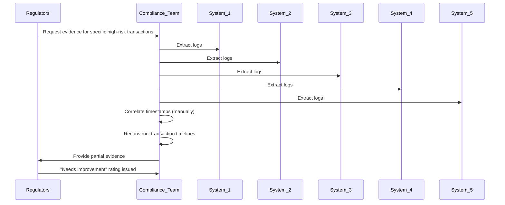

This timeline demonstrates the fragmented and error-prone nature of the manual compliance process. Each system operates in isolation, requiring manual extraction and correlation of data, which often leads to incomplete or inconsistent evidence. Critical details, such as transient memory not captured in logs, are irrecoverable, leaving the institution unable to fully demonstrate compliance when it matters most.

### SRE Best Practice: Evidence-Based Investigation

SRE teams should implement "compliance-first instrumentation" that automatically captures regulatory evidence as part of normal transaction processing rather than attempting to reconstruct it afterward. This approach focuses on three critical capabilities: comprehensive audit capture, context preservation, and evidentiary integrity. Below is a checklist to guide SREs in building and operating systems with these capabilities:

#### Checklist: Implementing Evidence-Based Investigation

1. **Comprehensive Audit Capture**:

   - Ensure every regulatory checkpoint emits trace spans with full decision context:
     - Data evaluated during the check.
     - Rules applied and their outcomes.
     - Authorizations for exceptions (including identities).
   - Instrument all critical points in the transaction lifecycle to guarantee visibility.

2. **Context Preservation**:

   - Propagate compliance context across service boundaries to maintain end-to-end traceability:
     - Use distributed tracing to attach regulatory metadata across microservices.
     - Ensure trace headers persist through asynchronous processes and retries.

3. **Evidentiary Integrity**:

   - Store evidence with tamper-evident protections:
     - Leverage cryptographic techniques (e.g., hashing) to ensure immutability.
     - Implement write-once storage for regulatory data to preserve verifiability.

4. **Dynamic Evidence Sampling**:

   - Configure dynamic sampling strategies to prioritize high-risk transactions:
     - Evaluate transaction characteristics such as amount thresholds, geographic indicators, customer risk scores, or anomalous patterns.
     - Capture 100% traces for transactions requiring extensive regulatory documentation.
     - Use lower sampling rates for routine, low-risk operations.

Additionally, here is a simplified code snippet to demonstrate compliance-first instrumentation in a microservice environment:

```python
from tracing_lib import Trace, emit_trace, hash_evidence
from storage_lib import tamper_evident_write

def process_transaction(transaction):
    # Start a new trace span for the transaction
    with Trace("transaction.processing") as trace:
        # Add regulatory checkpoint metadata
        trace.add_metadata({
            "checkpoint": "AML screening",
            "data_evaluated": transaction.customer_profile,
            "rule_applied": "CustomerRiskScore > Threshold",
            "outcome": "Approved",
            "authorized_by": "aml_officer_123"
        })

        # Perform business logic
        result = execute_transaction(transaction)

        # Hash and store evidence for tamper-evident protection
        evidence_hash = hash_evidence(trace.get_metadata())
        tamper_evident_write(evidence_hash, trace.get_metadata())

        # Emit the trace for compliance visibility
        emit_trace(trace)

    return result
```

This evidence-based approach transforms compliance from a separate, retroactive process to an inherent characteristic of the transaction processing system itself. By ensuring the evidence is captured, preserved, and verifiable before regulators ever request it, SRE teams can drive operational efficiency while reducing compliance risks.

### Banking Impact

The business consequences of reactive compliance documentation are severe and multifaceted. Direct regulatory impacts include formal findings, remediation requirements, and potential penalties—with recent anti-money laundering enforcement actions ranging from $30 million to over $1 billion for significant control failures. Beyond direct penalties, reactive compliance creates enormous operational costs: the average regulatory response requires 20-30 full-time staff diverted from normal operations for 2-4 weeks, creating opportunity costs exceeding $500,000 per significant examination.

To provide a clearer comparison of these impacts, the table below summarizes key direct and indirect consequences of reactive compliance:

| **Impact Type** | **Description** | **Estimated Cost/Effect** |
| ------------------------ | --------------------------------------------------------------------------------------------------- | ------------------------------------------- |
| **Direct Penalties** | Fines and enforcement actions for control failures. | $30M - $1B+ per incident |
| **Operational Costs** | Staff diverted to address regulatory responses, creating opportunity costs. | $500K+ per major examination |
| **Strategic Delays** | Launch delays for new products, restricted market entry, and pre-approval requirements for changes. | 6-12 months per initiative |
| **Capital Requirements** | Increased regulatory capital and risk ratings impacting funding costs. | Tens of millions annually in indirect costs |

More serious long-term impacts affect strategic flexibility: institutions with compliance deficiencies face enhanced scrutiny that can delay new product launches, restrict expansion into new markets, and require pre-approval for technology changes that would otherwise be routine operational decisions. Perhaps most significantly, compliance deficiencies impact regulatory capital requirements and institutional risk ratings—creating increased funding costs that directly affect competitiveness across all business lines. For major financial institutions, the difference between "satisfactory" and "needs improvement" compliance ratings can represent tens of millions in annual cost impact through these indirect channels, far exceeding the direct response costs or potential penalties.

### Implementation Guidance

To guide your transition toward trace-based compliance, follow the structured implementation process below. Each step ensures critical components are addressed and aligns with regulatory expectations. The flowchart provides a high-level overview of the process:

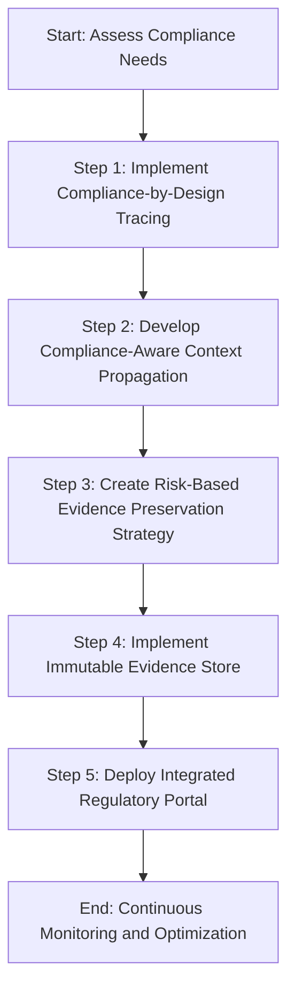

1. **Implement Compliance-by-Design Tracing**\
   Automatically capture all regulatory checkpoints during transaction processing. Map specific trace attributes to the exact evidence requirements of applicable regulations (e.g., BSA/AML, KYC, PSD2, GDPR). Ensure each transaction inherently documents its regulatory adherence without requiring manual intervention.

2. **Develop Compliance-Aware Context Propagation**\
   Build a framework that ensures regulatory evidence is preserved across system boundaries. Include specialized adapters for legacy systems to maintain compliance context when transactions transition between modern services and older platforms that lack native tracing capabilities.

3. **Create Risk-Based Evidence Preservation Strategy**\
   Design an automated strategy to identify high-risk transactions requiring enhanced documentation. Use factors such as transaction amounts, risk profiles, customer segments, and regulatory categories to dynamically adjust sampling rates and retention policies. Ensure complete evidence capture for high-scrutiny transactions.

4. **Implement an Immutable Evidence Store**\
   Use cryptographic techniques to create tamper-evident audit trails. Include custody chain documentation to track access and detect any modification attempts, ensuring the integrity of compliance evidence over time.

5. **Deploy an Integrated Regulatory Portal**\
   Transform trace data into examiner-friendly formats to simplify regulatory reviews. Implement visualization tools to demonstrate control execution across transaction types, filtering interfaces for targeted evidence retrieval, and exportable formats meeting regulatory submission requirements.

6. **Continuous Monitoring and Optimization**\
   Establish a feedback loop to continuously monitor compliance performance and improve evidence capture processes. Regularly assess the system’s effectiveness, adapt to new regulatory requirements, and refine workflows to maintain alignment with evolving standards.

## Panel 2: Regulatory Span Enrichment - Purpose-Built Compliance Tracing

### Scene Description

A compliance engineering workshop where regulatory specialists and SRE teams are designing specialized trace enrichment for financial compliance. On whiteboard screens, engineers map detailed compliance requirements from multiple regulations—PSD2 strong authentication, anti-money laundering verification, GDPR consent tracking, and securities trade reporting—to specific trace attributes and custom span types. A demonstration shows how their instrumentation automatically captures required compliance metadata: consent verification timestamps, authentication method strength, screening decision rationale, and regulatory reporting confirmation. Technical diagrams reveal their implementation approach: a specialized compliance SDK extending standard OpenTelemetry instrumentation with banking-specific regulatory context propagation ensuring compliance evidence flows seamlessly across service boundaries despite crossing different regulatory domains.

#### Compliance Metadata Flow Overview

```
Regulatory Requirements
   (PSD2, GDPR, AML, Securities Reporting)
            │
            ▼
  Mapped to Trace Attributes
(e.g., consent timestamps, 
 auth method strength, 
 screening rationale)
            │
            ▼
Custom Span Types Created
     (Regulatory-Specific)
            │
            ▼
Specialized Compliance SDK
  (Extends OpenTelemetry)
            │
            ▼
Regulatory Metadata Propagates
 Across Service Boundaries
            │
            ▼
    Compliance Evidence
  Generated Automatically
```

This flow illustrates how compliance metadata is systematically captured and propagated. It highlights the integration of regulatory requirements into trace attributes, the development of custom span types, and the role of the compliance SDK in ensuring consistent evidence generation across distributed systems. This process guarantees seamless compliance context propagation even when transactions span multiple regulatory domains.

### Teaching Narrative

Regulatory span enrichment transforms distributed tracing from a general-purpose observability tool to a compliance-specific evidence platform in highly regulated financial environments. Generic tracing implementations capture technical operation flows but typically miss the specialized regulatory context essential for compliance demonstration in banking—attributes like consent verification, authentication method strength, screening rationale, supervisory approvals, or reporting confirmations required by financial regulations. Purpose-built compliance tracing addresses this gap through specialized instrumentation extensions that automatically capture and propagate regulatory evidence as an integral part of normal transaction processing. This compliance-aware approach transforms tracing from a purely operational capability to a dual-purpose platform serving both technical and regulatory needs. For financial institutions where compliance demonstration is as important as operational monitoring, this purpose-built enrichment ensures every transaction automatically generates the specific evidence required by applicable regulations without separate compliance documentation systems. Compliance and technology teams can collaborate to define exactly which regulatory attributes must be captured for different transaction types, how compliance context should propagate across service boundaries spanning different regulatory domains, which verification points require immutable evidence preservation, and how regulatory metadata should be structured to facilitate both automated controls and examiner reviews. This specialized approach ultimately reduces both compliance risk and operational complexity by ensuring regulatory evidence generation occurs automatically as part of normal transaction processing rather than through separate compliance processes that may diverge from actual system behaviors.

### Common Example of the Problem

A European bank implementing PSD2 strong customer authentication requirements faced a significant challenge: while their authentication service correctly implemented the required multi-factor verification, they couldn't effectively prove compliance during audits. Their standard tracing captured that authentication occurred but failed to document critical compliance details, leaving significant gaps in regulatory evidence. These gaps included:

- **Authentication Factors**: Missing details on which specific factors were used (e.g., "something you know," "something you have," or "something you are").
- **Dynamic Linking**: Lack of evidence tying authentication to specific transaction amounts, as required to meet PSD2 dynamic linking requirements.
- **Exemption Tracking**: Absence of records indicating whether regulatory exemptions (e.g., low-value payments) were applied, and the rationale for their use.
- **Contextual Metadata**: Failure to capture how the authentication method met PSD2's strict requirements for factor strength and compliance thresholds.

When auditors selected sample transactions for review, compliance teams had to manually piece together evidence from multiple disconnected systems. This often led to inconclusive demonstrations of regulatory adherence, despite the bank following the technical requirements. The issue wasn't the execution of controls but the failure to preserve evidence: their generic tracing implementation captured technical operations but omitted the specific regulatory context needed to prove compliance.

#### Checklist: Identifying Compliance Gaps in Tracing

To help identify similar issues in your systems, consider the following checklist:

- [ ] Are all authentication factors (e.g., knowledge, possession, biometrics) explicitly logged in trace data?
- [ ] Does the trace include evidence of dynamic linking between authentication and transaction-specific details (e.g., amount, payee)?
- [ ] Are regulatory exemptions (if applied) clearly documented with justification and thresholds?
- [ ] Is metadata structured to show how authentication methods meet compliance requirements (e.g., factor strength or auditability)?
- [ ] Can the tracing implementation provide immutable, end-to-end evidence for audits without relying on external systems?

These gaps forced the bank to implement a separate compliance logging system to capture the missing regulatory attributes. However, this duplication created significant maintenance challenges, as the parallel systems often fell out of sync. By addressing these gaps through purpose-built compliance tracing, such challenges can be avoided, ensuring seamless integration of compliance evidence into standard transaction processing.

### SRE Best Practice: Evidence-Based Investigation

SRE teams should implement "regulation-aware instrumentation" that extends standard tracing frameworks with domain-specific compliance attributes tailored to financial service requirements. This approach begins with comprehensive regulatory mapping—analyzing each applicable regulation to identify exactly what evidence must be captured to demonstrate compliance. For each requirement, teams define specific trace attributes, custom span types, and specialized events that precisely document regulatory adherence. These extensions should be implemented as reusable compliance SDKs that augment standard instrumentation frameworks like OpenTelemetry, ensuring engineers can easily incorporate regulatory capture without manual compliance coding for each service.

Advanced implementations create tiered compliance enrichment patterns based on transaction context—automatically applying the appropriate regulatory attribute schema based on transaction type, jurisdiction, amount thresholds, or customer risk levels. The instrumentation should dynamically adapt as transactions cross regulatory boundaries, adding or transforming compliance attributes as needed when operations move between different jurisdictional requirements or business domains. This evidence-based approach ensures that transactions automatically document their own regulatory adherence through comprehensive metadata capture embedded directly in trace spans—creating a single, coherent record serving both operational and compliance purposes rather than maintaining separate systems that may diverge in behavior or accuracy.

#### Code Example: Defining Custom Span Attributes with OpenTelemetry

The following code snippet demonstrates how to define and use custom span attributes for regulatory compliance using OpenTelemetry in Python. These attributes can capture compliance-specific metadata such as consent verification timestamps, authentication method strength, and regulatory reporting confirmations.

```python
from opentelemetry import trace
from opentelemetry.sdk.trace import TracerProvider
from opentelemetry.sdk.trace.export import SimpleSpanProcessor, ConsoleSpanExporter
from opentelemetry.trace import SpanKind

# Set up the tracer provider and exporter
trace.set_tracer_provider(TracerProvider())
tracer = trace.get_tracer_provider().get_tracer(__name__)
span_processor = SimpleSpanProcessor(ConsoleSpanExporter())
trace.get_tracer_provider().add_span_processor(span_processor)

# Start a trace with custom attributes for compliance
with tracer.start_as_current_span(
    "transaction_process",
    kind=SpanKind.SERVER,
    attributes={
        "compliance.consent_timestamp": "2023-10-25T12:34:56Z",  # ISO 8601 format
        "compliance.auth_method_strength": "strong",  # PSD2 compliance
        "compliance.screening_decision": "approved",  # AML verification
        "compliance.reporting_confirmation": "submitted",  # Regulatory reporting
    }
) as span:
    # Simulate processing a transaction
    span.add_event(
        "compliance_checkpoint",
        attributes={
            "checkpoint_type": "KYC_verification",
            "status": "completed",
        },
    )
    print("Transaction processed with compliance attributes.")

# The above instrumentation automatically captures compliance evidence as part of the trace
```

This example demonstrates how SRE teams can embed compliance-specific context directly into trace spans. By standardizing such patterns in a compliance SDK, teams can ensure regulatory evidence is consistently captured across all services. The attributes are dynamically adjustable, allowing the instrumentation to adapt to different transaction types or regulatory domains as needed.

### Banking Impact

The business consequences of inadequate compliance instrumentation extend far beyond direct regulatory impacts. Financial institutions typically respond to evidence gaps by implementing separate compliance documentation systems that create significant operational inefficiencies. Below is a summary of the key quantified impacts:

| Impact Area | Metric/Observation | Quantified Effect |
| ------------------------------- | -------------------------------------------------------------------------------------- | -------------------------------------------------------------------------- |
| **Operational Inefficiencies** | Duplicate data capture due to separate compliance systems | 5-15% increase in transaction processing overhead |
| | Additional infrastructure costs to support parallel compliance systems | $1.2-2.5 million annually for large banks |
| | Specialized engineering complexity exceeding standard development resources | 30-50% higher resource requirements |
| **Customer Experience Impacts** | Verification delays adding time to critical operations like payments or trades | 1-3 second delays in compliance checks |
| | Increased payment abandonment rates | 7% increase in abandoned payments |
| | Reduction in trading activity during volatile markets | 12% drop in trading activity |
| | Measurable customer satisfaction reductions leading to competitive attrition | 3-5% annual customer relationship attrition in competitive segments |
| **Risk and Capital Impact** | Capital reserves required for regulatory penalty risks despite sound control execution | Additional regulatory capital allocations of $10-25 million |
| | Missed opportunities to reallocate capital for growth or shareholder returns | Reduced ability to support business expansion or enhance shareholder value |

Separate compliance systems also create risk asymmetry where institutions must maintain capital reserves against potential regulatory penalties, even when control execution is sound. For major financial institutions, closing these compliance instrumentation gaps can simultaneously improve customer experience, reduce operational costs, and optimize capital efficiency—creating competitive advantages across multiple dimensions.

### Implementation Guidance

To successfully implement purpose-built compliance tracing, follow these five key steps:

#### Checklist for Implementation

- [ ] **Regulatory Attribute Catalog**: Develop a comprehensive map of specific compliance requirements from applicable regulations (e.g., PSD2, GDPR) to standardized trace attributes. Establish a shared compliance vocabulary to ensure consistent evidence capture across all services and systems.
- [ ] **Regulation-Specific Instrumentation**: Extend standard OpenTelemetry SDKs with pre-built banking compliance libraries. These should automatically capture required regulatory context, enabling service teams to integrate compliance without needing deep expertise in regulations.
- [ ] **Adaptive Context Propagation**: Design mechanisms that dynamically adapt compliance metadata as transactions move across jurisdictional or regulatory boundaries. This ensures seamless evidence collection despite regional or regulatory variations.
- [ ] **Compliance Verification Services**: Implement real-time validation systems to check for missing or inconsistent regulatory attributes before transaction completion. These services should enable immediate remediation and reduce audit risks by ensuring evidence completeness.
- [ ] **Regulation-Focused Visualization**: Deploy dashboards and visualization tools tailored to compliance adherence patterns. These interfaces should provide unified visibility into control effectiveness across transaction types, helping teams identify gaps and drive continuous improvement.

#### Implementation Flow Overview

```text
1. Map regulations -> Trace attributes (Regulatory Attribute Catalog)
2. Extend OpenTelemetry -> Compliance libraries (Instrumentation)
3. Enable cross-boundary tracing -> Adaptive metadata propagation
4. Validate evidence in real-time -> Compliance verification services
5. Visualize compliance adherence -> Dashboards and insights
```

By systematically following this checklist and leveraging the flow overview, teams can streamline the integration of compliance-aware tracing into their systems, ensuring robust evidence generation aligns with both regulatory and operational goals.

## Panel 3: Transaction Reconstruction - The Complete Financial Story

### Scene Description

A fraud investigation room where financial crime analysts are deeply engaged in unraveling a complex money laundering case using trace-based transaction reconstruction. The room is illuminated by multiple screens displaying an interactive visualization of fund movements, seamlessly connecting accounts, institutions, and international boundaries. Central to the scene is a large digital dashboard that dynamically maps the complete money flow, reconstructed from distributed trace data, with key milestones highlighted.

The visualization vividly outlines the transaction lifecycle: originating from online transfers, passing through correspondent banks, temporarily parked in investment accounts, and culminating in ATM withdrawals across multiple countries. Analysts use timeline controls on the dashboard to replay the exact sequence and timing of these transfers, uncovering coordinated patterns that evade traditional transaction records.

To enhance their investigation, analytic overlays on the screens highlight anomalies detected in the trace data, such as unusual authentication events, irregular access patterns, and suspicious coordination across seemingly unrelated accounts. A secondary display shows a high-level flow diagram:

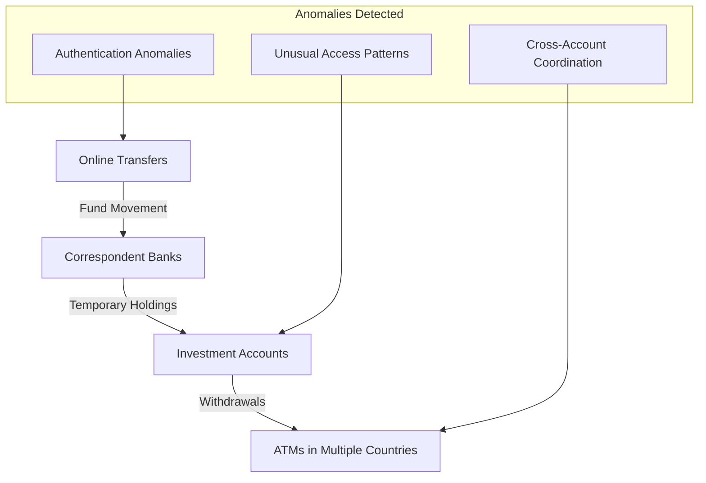

This automated reconstruction, supported by the advanced visualization and anomaly detection, reveals critical evidence—such as timing relationships and circumvention attempts—impossible to piece together manually. The result is a powerful investigative environment that transforms fragmented data into a cohesive financial story, empowering analysts to expose sophisticated money laundering operations with unprecedented clarity and speed.

### Teaching Narrative

Trace-based transaction reconstruction transforms financial investigation from fragmented data gathering to comprehensive money flow visualization essential for complex regulatory cases. Traditional forensic approaches to financial investigations typically require painstaking manual correlation across disconnected systems—online banking logs, core banking records, payment networks, and ATM transactions—often taking weeks to reconstruct complete money movement patterns. Distributed tracing fundamentally changes this paradigm by automatically connecting related operations across technical and organizational boundaries, enabling immediate visualization of complete transaction lifecycles regardless of how many systems or institutions they span. This comprehensive approach transforms financial investigations from tedious evidence gathering to immediate pattern analysis based on complete transaction visibility. For regulatory functions including fraud detection, anti-money laundering, sanctions compliance, and market abuse prevention, this reconstruction capability dramatically accelerates investigations while revealing sophisticated patterns that might remain hidden in fragmented data. Investigators can instantly visualize the complete lifecycle of suspicious transactions, identify coordination patterns across seemingly unrelated accounts or customers, analyze timing relationships that may indicate organized activity, and discover circumvention attempts designed to exploit visibility gaps between systems or institutions. This trace-based approach ultimately improves both investigation efficiency and effectiveness by providing comprehensive transaction visibility that captures the complete financial story rather than the partial views typically available through traditional system-specific investigation approaches.

### Common Example of the Problem

A multinational bank recently struggled to investigate a sophisticated fraud scheme involving business email compromise and cross-border payment fraud. The investigation began when a corporate customer reported unauthorized payments totaling $3.7 million that appeared legitimate in isolation but were actually part of a coordinated attack. The traditional investigation approach proved extremely challenging: four separate investigative teams spent over three weeks manually correlating data across twenty-seven different systems—including online banking logs, authentication records, payment processing systems, correspondent banking messages, and beneficiary bank records. The fragmented investigation created critical visibility gaps: investigators couldn't accurately reconstruct the precise timing sequence between account access, payment initiation, authorization bypass, and funds movement—details essential for understanding how the attackers operated and whether internal systems were compromised.

Below is a timeline summarizing the key events of the fraud investigation and the challenges faced due to fragmented data:

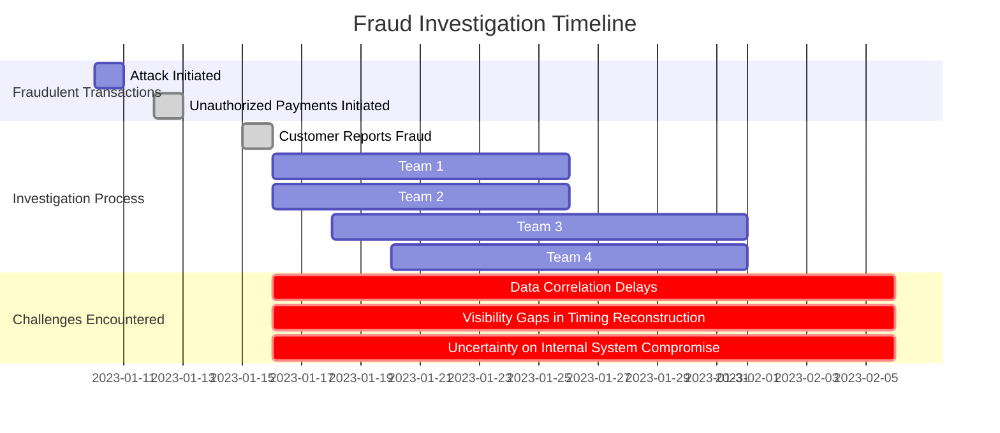

This timeline highlights the sequential nature of events and the inefficiencies inherent in the traditional investigation process. The inability to automatically correlate data across systems delayed both customer reimbursement and control remediation while still providing only partial visibility into the attack methodology. Despite eventually resolving the case, the bank couldn't conclusively determine whether internal systems had been compromised or if the attack was limited to social engineering, creating uncertainty about whether additional controls were needed to prevent recurrence.

### SRE Best Practice: Evidence-Based Investigation

SRE teams should implement "forensic-ready tracing" designed specifically to support complex financial investigations through comprehensive transaction reconstruction capabilities. This approach requires four essential components, summarized in the checklist below for clarity and practical application:

#### Checklist: Core Components of Forensic-Ready Tracing

- **Identity-Focused Correlation**: Maintain consistent customer and account identifiers across all systems, ensuring investigations can follow specific entities through complex transaction flows.
- **Cross-System Transaction Linking**: Deploy specialized connectors to bridge traditional payment systems and modern services, preserving trace context across technological boundaries that would otherwise fragment visibility.
- **Temporal Precision**: Ensure trace timing is precisely synchronized across systems to support accurate event sequencing, essential for understanding causality in complex fraud scenarios.
- **Pattern Analysis Enablement**: Extend trace attributes to include behavioral indicators beyond basic transaction data, such as device information, access patterns, and user behaviors to distinguish legitimate activity from potential fraud.

#### Advanced Implementation Features

| Feature | Description | Benefit |
| ------------------------------------ | ---------------------------------------------------------------------------------------------------------- | ------------------------------------------------------------------------------------------------- |
| **Cross-Institutional Correlation** | Secure sharing mechanisms to trace transactions across organizational boundaries while preserving privacy. | Follows money flows through correspondent banks or payment networks for comprehensive visibility. |
| **High-Fidelity Trace Preservation** | Automatically retain detailed trace data for transactions with elevated risk indicators. | Ensures complete evidence is available for high-priority investigations. |

By adopting these practices, SRE teams enable a fundamental shift in financial crime investigation from reactive data gathering to proactive, evidence-based pattern analysis. Comprehensive transaction reconstructions provide immediate visibility into suspicious activities across technical and organizational boundaries, revealing the full context of financial events. This approach dramatically enhances both investigation efficiency and effectiveness.

### Banking Impact

The business consequences of fragmented financial investigation capabilities extend far beyond operational inefficiency. Direct investigation costs are substantial, with complex cases requiring 3-5 full-time investigators for 2-4 weeks under traditional approaches. This results in personnel costs ranging from $50,000 to $100,000 per significant case, excluding technology expenses or external specialists. Investigation delays further compound the problem, as each day of delay in fraud cases reduces recovery probability by approximately 3-5%. After 7-10 days, funds are typically unrecoverable as they move through multiple institutions or are converted to untraceable assets.

Customer impact adds another layer of business consequences. Corporate customers experiencing significant fraud face average operational disruption costs of $40,000 to $120,000, independent of the stolen amount. Rapid resolution is critical to preserving these relationships. Delays in resolving fraud lasting more than 14 days lead to a 40-60% relationship termination rate within the following year, regardless of reimbursement, resulting in significant lifetime value loss. Beyond customer impacts, fragmented investigation capabilities elevate operational risk profiles, increasing regulatory capital requirements by 15-25 basis points, which could otherwise support lending or investment activities.

For clarity and impact, the key data is summarized in the table below:

| **Key Metric** | **Traditional Approach** | **Impact** |
| ----------------------------------------- | -------------------------------------- | ------------------------------------------------------------------------ |
| **Investigation Costs (per case)** | $50,000 - $100,000 | High personnel cost due to manual processes. |
| **Fraud Recovery Probability** | Decreases by 3-5% per day of delay | Funds unrecoverable after 7-10 days. |
| **Customer Operational Disruption Costs** | $40,000 - $120,000 | Independent of stolen amount; rapid resolution critical. |
| **Customer Retention (post-fraud)** | 40-60% termination rate after 14+ days | Significant lifetime value loss due to unresolved cases. |
| **Regulatory Capital Impact** | +15-25 basis points | Elevated risk profile reduces capital available for lending/investments. |

For major financial institutions handling thousands of investigations annually, comprehensive transaction reconstruction capabilities provide transformative benefits. These include improved recovery rates, enhanced customer retention, and optimized capital efficiency—creating multimillion-dollar business impacts through both direct cost reduction and indirect strategic advantages.

### Implementation Guidance

The following steps outline the implementation process for enabling trace-based transaction reconstruction. A flowchart representation is included to provide a visual guide to the sequence of activities and dependencies:

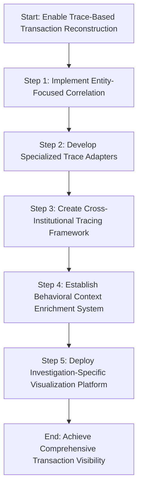

1. **Implement Entity-Focused Correlation**\
   Maintain consistent customer, account, and transaction identifiers across system boundaries. This ensures investigators can trace specific entities through complex financial flows, even when transactions span multiple technical platforms.

2. **Develop Specialized Trace Adapters**\
   Build custom adapters for legacy financial systems, such as payment networks, card processing platforms, and correspondent banking systems, which may lack native tracing capabilities. This step ensures comprehensive visibility across both modern and traditional banking infrastructures.

3. **Create Cross-Institutional Tracing Framework**\
   Establish a secure, privacy-preserving framework for correlating transactions across organizational boundaries. Ensure compliance with regulatory requirements and maintain appropriate information controls while enabling seamless cross-institutional tracking.

4. **Establish Behavioral Context Enrichment System**\
   Design a system to automatically augment trace data with risk-relevant attributes, including device fingerprints, access patterns, geographical indicators, and user behavior metrics. This enriched context provides investigators with crucial insights beyond basic transaction details.

5. **Deploy Investigation-Specific Visualization Platform**\
   Develop and implement a platform tailored for financial crime analysis. Include specialized capabilities such as timeline replay functions, relationship mapping across entities, pattern detection algorithms, and anomaly highlighting based on behavioral baselines derived from historical trace data.

By following these steps, organizations can achieve a robust trace-based transaction reconstruction capability, enabling comprehensive visibility and efficient investigation of complex financial activities.

## Panel 4: Immutable Audit Trails - Regulatory Evidence Preservation

### Scene Description

A regulatory architecture review where compliance and technology leaders are examining their evidence preservation framework built on distributed tracing. The session highlights their multi-layer approach to creating tamper-evident audit trails, integrating cryptographic and distributed ledger technologies to ensure evidence integrity. Trace data flows through a cryptographic pipeline that generates immutable hashes of each transaction's compliance evidence, with these verification signatures stored in both traditional databases and a permissioned blockchain for independent verification.

Below is a visual representation of their architecture:

```mermaid
graph TD
    subgraph Cryptographic Pipeline
        A[Transaction Data] --> B[Generate Immutable Hashes]
        B --> C[Store Hashes in Traditional Databases]
        B --> D[Store Hashes in Permissioned Blockchain]
    end

    subgraph Verification Subsystem
        E[Historical Data] --> F[Compare with Cryptographic Signatures]
        F --> G[Detect Inconsistencies]
        G --> H[Trigger Alerts]
        G --> I[Record Tampering Attempt]
    end

    Cryptographic Pipeline --> Verification Subsystem
```

A live demonstration showcases the system's response to potential evidence tampering. When someone attempts to modify historical transaction data, the verification subsystem immediately detects the inconsistency between stored traces and their cryptographic signatures. This triggers both real-time alerts and the creation of an immutable record of the tampering attempt itself. Compliance officers further explain how this architecture satisfies regulatory requirements for evidence integrity, offering verification mechanisms that both internal auditors and external examiners can independently validate.

### Teaching Narrative

Immutable audit trails based on distributed trace data transform compliance evidence from vulnerable records to tamper-evident histories essential for regulatory credibility in financial services. Traditional approaches to compliance evidence typically store transaction records in conventional databases vulnerable to modification—creating fundamental concerns about evidence integrity and potential manipulation, especially for high-risk transactions that might attract both internal and external tampering attempts. Trace-based immutable audit trails address this vulnerability through cryptographic evidence preservation that provides strong guarantees of historical accuracy. This tamper-evident approach transforms compliance evidence from "trust us" assertions to independently verifiable records with cryptographic integrity guarantees. For financial institutions where evidence credibility directly impacts regulatory standing and legal defensibility, this capability ensures transaction histories remain accurate and complete regardless of potential manipulation attempts.

Compliance architects can implement layered protections appropriate for different regulatory contexts. The table below summarizes these layers of protection, their mechanisms, and suitable use cases:

| Protection Layer | Mechanism | Use Case |
| ------------------------ | ---------------------------------------------------------- | ----------------------------------------------------------------------------------- |
| Cryptographic Signatures | Hashes and digital signatures applied to transaction data | Routine transactions requiring tamper-evident records |
| Append-Only Storage | Write-once, read-many (WORM) storage ensuring no deletions | Sensitive operations requiring a clear audit trail without risk of overwriting |
| Distributed Ledger | Permissioned blockchain with decentralized validation | High-risk activities where independent verification by multiple parties is required |

The system can automatically detect and alert on evidence tampering attempts, maintain cryptographic proof of original transaction details despite modification attempts, and provide irrefutable timelines of when changes were attempted and by whom. This cryptographically-sound approach ultimately enhances both regulatory confidence and legal defensibility by ensuring the integrity of compliance evidence through technical guarantees rather than procedural controls that may be circumvented during sophisticated manipulation attempts.

### Common Example of the Problem

A regional bank recently faced a significant regulatory challenge involving potential market manipulation by a trading desk. During the investigation, regulators discovered troubling evidence inconsistencies:

- **Timestamp mismatches:** Transaction timestamps in trading platform logs didn't align with the market data timestamps in surveillance systems, raising questions about the accuracy of event sequencing.
- **Conflicting reviewer identities:** Order approval records showed different reviewer identities between supervisory and audit systems, undermining confidence in the approval process.
- **Incomplete documentation chains:** Some high-risk trades lacked a complete chain of documentation despite policy requirements for comprehensive audit trails.

Further investigation revealed that a privileged administrator had modified historical records after compliance questions arose—creating uncertainty about which version of events reflected the true transaction history. This vulnerability allowed undetected alterations to critical evidence, even though no fraudulent trading was identified.

#### Checklist: Key Evidence Integrity Failures

- [ ] **Timestamp inconsistencies**: Are all system timestamps synchronized and consistent across platforms?
- [ ] **Unauthorized modifications**: Is there control and monitoring of privileged user actions to prevent undetected changes to historical data?
- [ ] **Incomplete audit trails**: Are all high-risk transactions fully documented with immutable evidence chains?
- [ ] **Cross-system discrepancies**: Are records in supervisory and audit systems consistent and reconcilable?
- [ ] **Tamper detection**: Is there a mechanism to detect and alert on any attempts to alter evidence?

Despite having no intentional manipulation scheme, the bank faced serious regulatory consequences due to these evidence integrity issues: a formal cease-and-desist order, $15 million in penalties, and trading restrictions that lasted over 18 months. This example highlights how traditional database systems, which allow privileged user modifications without detection, can transform routine regulatory inquiries into existential threats. Ensuring tamper-evident audit trails with cryptographic guarantees is essential to mitigating these risks.

### SRE Best Practice: Evidence-Based Investigation

SRE teams should implement "cryptographically-verifiable audit trails" that guarantee evidence integrity through technical mechanisms rather than procedural controls. This approach requires a comprehensive evidence integrity architecture with four key components: real-time signature generation, secure signature storage, automated verification processes, and tamper detection capabilities. As trace data capturing compliance-relevant operations is collected, the system should automatically generate cryptographic signatures (typically secure hashes) that uniquely identify the exact content and sequence of events. These signatures should be stored in separate, highly secured systems—ideally using write-once storage mechanisms physically separated from the primary trace data to prevent simultaneous tampering. The architecture should include automated verification processes that continually compare stored trace data against these signatures, ensuring any modifications are immediately detected regardless of how they were introduced.

Below is a Python code snippet demonstrating how to generate and verify cryptographic signatures using the `hashlib` library:

```python
import hashlib

# Generate a cryptographic hash for transaction data
def generate_signature(transaction_data: str) -> str:
    # Use SHA-256 for secure hashing
    sha256 = hashlib.sha256()
    sha256.update(transaction_data.encode('utf-8'))
    return sha256.hexdigest()

# Verify the integrity of transaction data against a stored signature
def verify_signature(transaction_data: str, stored_signature: str) -> bool:
    calculated_signature = generate_signature(transaction_data)
    return calculated_signature == stored_signature

# Example usage
transaction = "TransactionID:12345|Amount:1000.00|Timestamp:2023-10-15T10:00:00Z"
signature = generate_signature(transaction)

# Store the signature securely (e.g., in write-once storage)
print(f"Generated Signature: {signature}")

# Verification process
is_valid = verify_signature(transaction, signature)
print(f"Signature Valid: {is_valid}")
```

Advanced implementations extend these fundamentals with additional integrity layers: secure timestamping anchored to trusted third-party services that prevent backdating modifications, progressive evidence chaining that cryptographically links sequential operations to prevent selective deletion or insertion, and distributed verification mechanisms that enable independent validation by external parties like auditors or regulators without requiring direct system access. For example, progressive evidence chaining can be implemented using a simple Merkle tree structure to ensure cryptographic linkage between sequential transactions:

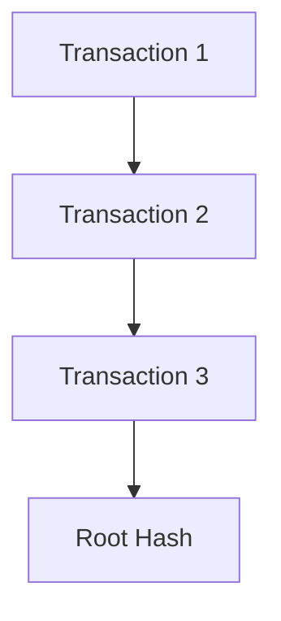

The most sophisticated approaches implement selective immutability based on regulatory risk—applying increasingly strong integrity guarantees as transaction risk or compliance sensitivity increases, ensuring appropriate protection without unnecessary performance or storage impacts for routine operations. This evidence-based approach transforms compliance proof from vulnerable assertions to cryptographically-verifiable facts, fundamentally changing the regulatory dynamic from skeptical examination to verifiable demonstration of control effectiveness.

### Banking Impact

The business consequences of evidence integrity vulnerabilities extend far beyond direct regulatory penalties. While enforcement actions for evidence manipulation can reach $50-100 million for significant cases, the indirect impacts create even greater business damage. Regulatory restrictions following evidence integrity concerns typically include heightened supervision requirements lasting 18-36 months, creating compliance costs averaging $3-7 million annually in additional documentation, third-party verification, and examiner support resources.

Operational impacts create significant competitive disadvantages: new product approvals typically face 6-12 month delays during heightened supervision periods, expansion activities require explicit regulatory pre-approval rather than standard notifications, and business line growth may be capped through formal limitation agreements. These restrictions directly impact revenue growth—institutions under evidence integrity remediation orders typically show 30-50% slower business line growth compared to peers despite equivalent market conditions.

The cascading effects of evidence integrity failures can be illustrated as follows:

```
Evidence Integrity Failure
        ↓
Regulatory Penalties ($50-100M for significant cases)
        ↓
Heightened Supervision (18-36 months)
        ↓
  ↑ Increased Compliance Costs ($3-7M/year)
  ↑ Delayed Product Approvals (6-12 months)
  ↑ Expansion Restrictions (Regulatory Pre-Approval Needed)
        ↓
Slower Business Line Growth (30-50% below peers)
        ↓
Prolonged Credibility Tax (3-5 years of enhanced scrutiny)
        ↓
    Lasting Competitive Disadvantages
```

Most seriously, evidence integrity issues dramatically affect institutional credibility with both regulators and customers—creating higher scrutiny for all regulatory interactions across the organization regardless of their connection to the original issue. This "credibility tax" typically extends supervisory oversight intensity for 3-5 years beyond formal restriction periods, creating lasting competitive disadvantages long after the technical issue is resolved.

For financial institutions, strong evidence integrity isn't merely a compliance necessity but a strategic imperative—trusted evidence preservation creates supervisory goodwill and flexibility worth tens of millions in operational efficiency and growth opportunity beyond any direct penalty avoidance.

### Implementation Guidance

1. Implement a real-time cryptographic signature pipeline that automatically generates tamper-evident hashes of compliance-relevant trace data, creating independent verification records as transactions occur rather than securing evidence after collection.

2. Establish a secure signature vault using dedicated write-once storage mechanisms physically or logically separated from primary trace data, ensuring verification signatures remain trustworthy even if primary systems are compromised.

3. Develop automated evidence verification processes that continuously compare stored trace data against cryptographic signatures, enabling immediate detection of any modifications regardless of source and triggering appropriate alerts and response protocols when discrepancies are found.

4. Create a progressive evidence chaining system that cryptographically links sequential operations, preventing selective deletion or modification by ensuring any change to historical records would invalidate all subsequent evidence in ways immediately detectable through verification processes.

5. Deploy independent verification mechanisms enabling external parties like auditors or regulators to validate evidence integrity without direct system access, including exportable proof packages with cryptographic verification tools that demonstrate evidence authenticity without exposing sensitive details beyond specific examination scope.

## Panel 5: Cross-Border Compliance - Navigating International Financial Regulations

### Scene Description

An international banking operations center bustling with compliance specialists and engineers, where global payment flows are monitored across multiple regulatory jurisdictions. Large visualization screens dominate the room, displaying transaction traces with specialized regulatory overlays that dynamically update as payments cross borders. Each transaction is shown as a flowing line segmented by jurisdictional boundaries, with color-coded spans indicating the compliance status in each region. Metadata annotations provide detailed insights into the compliance attributes required by each regulator—such as European PSD2 strong authentication, U.S. sanctions screening, Hong Kong monetary authority reporting, and Singapore currency controls.

Below is a simplified text-based representation of the system's visualization to enhance clarity:

```
Transaction Flow: [Origin] --> [EU (PSD2)] --> [US (Sanctions)] --> [HK (Reporting)] --> [SG (Currency Control)] --> [Destination]

Legend:
[Green Span] Compliant
[Yellow Span] Pending Compliance
[Red Span] Non-Compliant
```

A technical demonstration highlights how the tracing system adapts in real-time as transactions traverse jurisdictional boundaries. For example:

- **Data Residency Controls**: Automatically enforce regional storage requirements.
- **Privacy Masking**: Dynamically obscure sensitive fields based on local privacy laws.
- **Evidence Collection**: Continuously update audit logs to meet jurisdiction-specific standards.

This adaptive system ensures end-to-end transaction visibility while maintaining compliance with all applicable regulations, enabling seamless navigation of the complex landscape of cross-border financial operations.

### Teaching Narrative

Cross-border compliance tracing transforms international financial operations from regulatory fragmentation to unified visibility across jurisdictional boundaries. Global financial institutions face extraordinary complexity navigating diverse and sometimes conflicting regulations across different countries—requiring simultaneous compliance with multiple rule sets as transactions cross borders. Traditional approaches typically implement separate compliance systems for each jurisdiction, creating visibility gaps precisely at the regulatory boundaries where oversight is most crucial. Distributed tracing with regulatory awareness addresses this challenge by maintaining continuous transaction visibility across jurisdictional transitions while automatically adapting compliance controls and evidence collection to each region's specific requirements. This boundary-spanning approach transforms multi-jurisdictional compliance from disjointed regional processes to seamless global oversight with local regulatory adaptation. For international banks where cross-border transactions represent both significant business opportunities and elevated compliance risks, this capability ensures continuous regulatory adherence despite jurisdictional transitions. Compliance teams can implement trace-based controls that automatically adjust as transactions cross borders—applying appropriate regional rules for authentication requirements, screening obligations, reporting thresholds, data residency restrictions, privacy limitations, and evidence preservation—while maintaining complete end-to-end visibility of the entire transaction lifecycle regardless of how many jurisdictions it spans. This globally-aware approach ultimately reduces both compliance risk and operational friction by ensuring international transactions remain fully compliant with all applicable regulations throughout their complete lifecycle without requiring manual reconciliation across jurisdictional boundaries.

### Common Example of the Problem

A global bank operating across 30+ countries recently encountered severe compliance challenges processing cross-border payments between their European Union and Asia-Pacific operations. A corporate client's payment from Germany to suppliers in Singapore triggered multiple regulatory inconsistencies: the transaction properly implemented PSD2 strong authentication and consent requirements on the European side, but this evidence wasn't transferred to Singapore where local regulations required different documentation formats. Similarly, GDPR-compliant data practices in Europe restricted certain personal information that was simultaneously required for Bank Secrecy Act reporting in transit jurisdictions. The payment ultimately completed but created significant compliance exposure—each regional team could demonstrate adherence to their local regulations, but no single system captured the complete regulatory journey across all applicable jurisdictions. When regulators in Singapore requested evidence of GDPR-compliant consent for data transfer from Europe, the bank couldn't provide this documentation because their regional compliance systems operated in isolation. This jurisdictional fragmentation created a no-win situation: fully satisfying one region's requirements often meant violating another's restrictions, particularly regarding data residency, privacy requirements, and evidence documentation formats.

#### Comparison of Conflicting Regulatory Requirements

To better understand the complexity, the following table highlights the conflicting requirements encountered during the payment processing:

| **Aspect** | **European Union (PSD2/GDPR)** | **Singapore (Local Regulations)** | **Conflict** |
| ------------------------- | --------------------------------------------------------------------------------- | -------------------------------------------------------------------------------- | ------------------------------------------------------------------------------------------- |
| **Authentication** | PSD2 requires strong customer authentication (SCA) and explicit consent. | No direct equivalent; focuses on accurate documentation of payment origin. | Evidence of SCA is not recognized or required in Singapore, creating a gap in traceability. |
| **Data Privacy** | GDPR restricts sharing of personal data outside the EU without proper consent. | Singapore requires specific personal information for Bank Secrecy Act reporting. | GDPR limits data transfer, while Singapore mandates it, creating compliance contradictions. |
| **Documentation Format** | PSD2 mandates electronic, standardized formats for consent evidence. | Local regulations in Singapore require paper-based or region-specific formats. | Incompatible documentation formats prevent seamless evidence transfer. |
| **Data Residency** | GDPR emphasizes data localization within the EU unless adequate safeguards exist. | Singapore mandates storage of certain transaction data locally. | Dual residency requirements create operational inefficiencies and potential non-compliance. |
| **Evidence Availability** | Evidence retention policies align with GDPR and PSD2 timeframes. | Evidence must be accessible on-demand for regulatory audits in Singapore. | Mismatched evidence retention policies lead to gaps in compliance reporting. |

This table illustrates how regional compliance systems operating in isolation exacerbate cross-border regulatory challenges. Without unified visibility and adaptive compliance tracing, global financial operations risk regulatory exposure and operational inefficiencies across jurisdictional boundaries.

### SRE Best Practice: Evidence-Based Investigation

SRE teams should implement "jurisdiction-aware tracing" designed specifically to maintain regulatory continuity across international boundaries. This approach requires four essential components: regulatory context mapping, dynamic compliance adaptation, privacy-preserving evidence transfer, and jurisdictional transition management. Below is a checklist summarizing these components, followed by a sample code snippet to demonstrate implementation.

#### Checklist: Key Components of Jurisdiction-Aware Tracing

1. **Regulatory Context Mapping**:

   - Define compliance attributes for each jurisdiction.
   - Create explicit mappings between equivalent regulatory requirements across regions.
   - Maintain a centralized repository of jurisdictional rules and mappings.

2. **Dynamic Compliance Adaptation**:

   - Implement mechanisms to adjust data capture, privacy controls, and evidence formats dynamically.
   - Ensure transformations are automated and occur as transactions cross jurisdictional boundaries.

3. **Privacy-Preserving Evidence Transfer**:

   - Employ techniques like attribute-level data residency controls and contextual data transformation.
   - Use cryptographic methods (e.g., zero-knowledge proofs) to validate compliance without exposing sensitive data.

4. **Jurisdictional Transition Management**:

   - Automatically detect jurisdictional transitions within transaction flows.
   - Apply appropriate rules and transformations in real-time without requiring manual intervention.

#### Example Code Snippet: Jurisdiction-Aware Tracing

Below is a Python-based pseudocode example illustrating how jurisdiction-aware tracing can be implemented with dynamic compliance adaptation and jurisdictional transition detection:

```python
class JurisdictionAwareTracer:
    def __init__(self, jurisdiction_rules):
        self.jurisdiction_rules = jurisdiction_rules  # Load jurisdictional mappings
        self.current_jurisdiction = None

    def detect_jurisdiction_transition(self, transaction_metadata):
        """Detect if a transaction crosses into a new jurisdiction."""
        new_jurisdiction = transaction_metadata.get("jurisdiction")
        if new_jurisdiction != self.current_jurisdiction:
            self.current_jurisdiction = new_jurisdiction
            return True
        return False

    def apply_compliance_rules(self, transaction_data):
        """Dynamically adapt compliance controls based on jurisdiction."""
        rules = self.jurisdiction_rules.get(self.current_jurisdiction, {})
        # Apply data residency controls
        if rules.get("data_residency"):
            transaction_data = self.enforce_data_residency(transaction_data, rules["data_residency"])
        # Apply privacy controls
        if rules.get("privacy_controls"):
            transaction_data = self.mask_sensitive_data(transaction_data, rules["privacy_controls"])
        # Log compliance evidence
        self.log_compliance_evidence(transaction_data, rules)
        return transaction_data

    def enforce_data_residency(self, data, residency_rules):
        """Enforce data residency rules."""
        # Example transformation for residency requirements
        return data  # Pseudocode: Modify data to comply with residency rules

    def mask_sensitive_data(self, data, privacy_controls):
        """Mask sensitive information based on privacy controls."""
        # Example masking operation
        return {k: (v if k not in privacy_controls else "MASKED") for k, v in data.items()}

    def log_compliance_evidence(self, data, rules):
        """Log evidence to demonstrate compliance."""
        print(f"Logging compliance evidence: {data}, Rules applied: {rules}")

# Example usage
jurisdiction_rules = {
    "EU": {"data_residency": "EU_only", "privacy_controls": ["SSN", "DOB"]},
    "US": {"data_residency": "US_only", "privacy_controls": []}
}
tracer = JurisdictionAwareTracer(jurisdiction_rules)

transaction_metadata = {"jurisdiction": "EU"}
transaction_data = {"SSN": "123-45-6789", "DOB": "1990-01-01", "Amount": 1000}

if tracer.detect_jurisdiction_transition(transaction_metadata):
    transaction_data = tracer.apply_compliance_rules(transaction_data)
```

This evidence-based approach transforms cross-border compliance from a fragmented, jurisdiction-by-jurisdiction process to a continuous, adaptable framework. It ensures complete regulatory lifecycle visibility while respecting each region's specific requirements. By automating jurisdictional transitions and compliance adaptations, financial institutions can confidently demonstrate comprehensive adherence to regulations across all applicable jurisdictions.

### Banking Impact

The business consequences of fragmented cross-border compliance extend far beyond direct regulatory risks. Operational inefficiencies create substantial costs: global banks typically maintain 3-5 separate compliance platforms for different regions, requiring $15-40 million annually in redundant technology costs, specialized personnel for each regional system, and complex reconciliation processes attempting to maintain consistency across these isolated platforms.

To illustrate these impacts, consider the following data visualization:

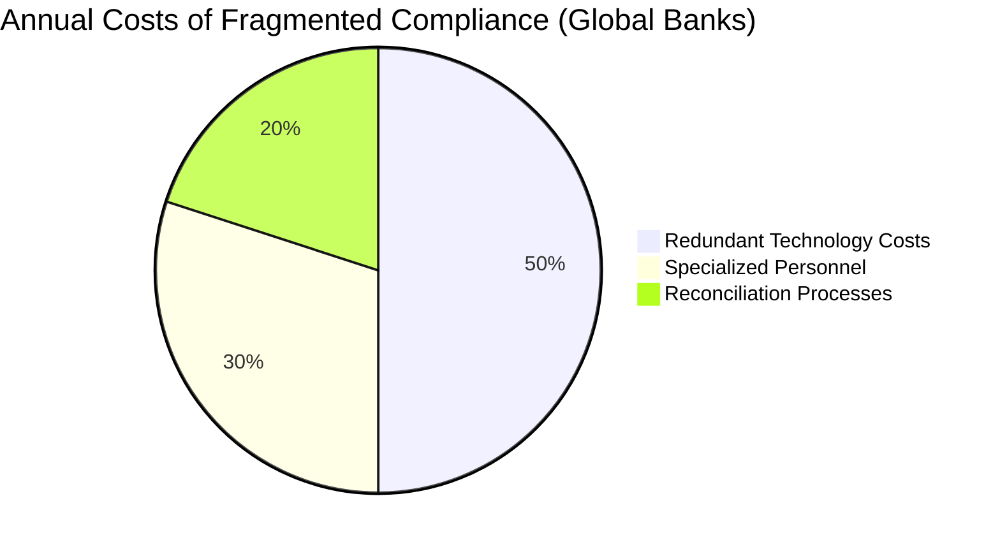

More significant impacts affect international business strategies:

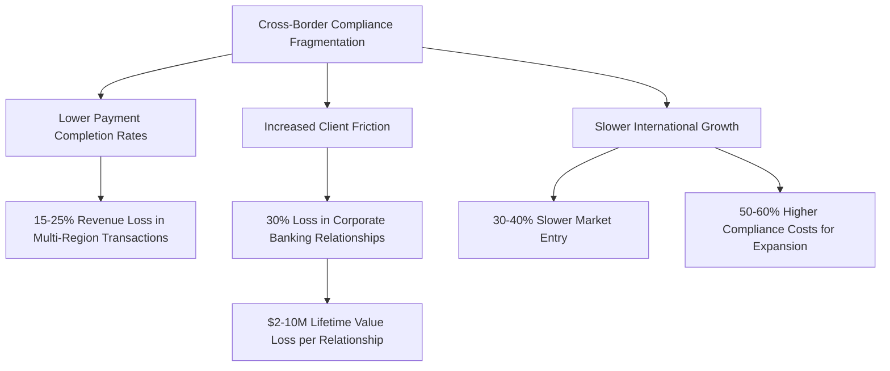

For global financial institutions, these inefficiencies represent both immediate financial losses and strategic limitations. Payment completion rates for complex multi-region transactions average 15-25% lower than domestic equivalents, resulting in lost revenue for global transaction services. Client acquisition and retention metrics show similar patterns—multinational clients cite cross-border compliance friction as a primary reason for relationship termination in approximately 30% of lost corporate banking relationships, with typical lifetime value losses of $2-10 million per relationship.

Perhaps most strategically significant, regional compliance fragmentation directly constrains international growth. Institutions with unified cross-border compliance capabilities demonstrate:

- **30-40% faster entry into new markets.**
- **50-60% lower compliance costs for new jurisdiction expansion.**

Integrated cross-border compliance represents both a risk mitigation necessity and a strategic enabler. By creating unified regulatory visibility, global financial institutions can simultaneously reduce operational costs, enhance customer experience, and accelerate international growth through streamlined regulatory processes that maintain compliance while minimizing jurisdictional friction.

### Implementation Guidance

To effectively implement cross-border compliance tracing, follow these structured steps. The process flow below provides a clear visualization of how these components interconnect to achieve seamless, jurisdiction-aware compliance.

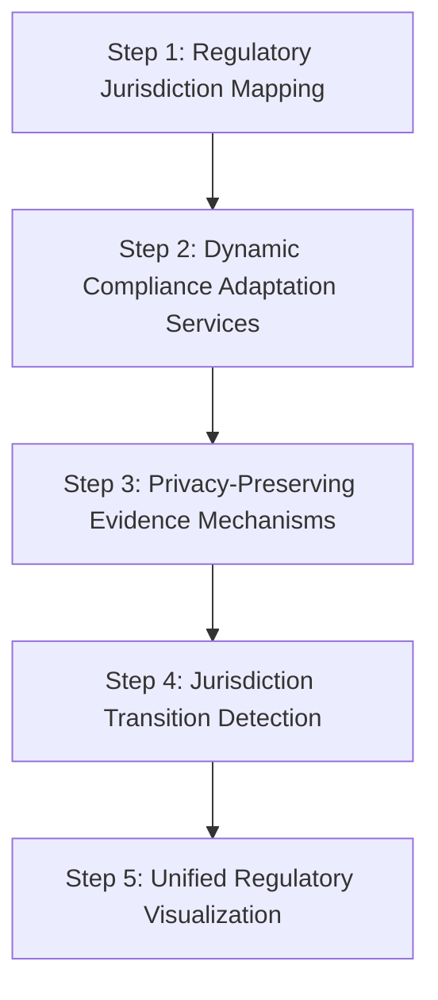

1. **Regulatory Jurisdiction Mapping**\
   Define a comprehensive mapping of compliance requirements across all applicable regions. Create translation matrices to connect equivalent controls across different regulatory frameworks, accounting for terminology and format differences. This foundational step ensures all subsequent processes are aligned with regional regulatory standards.

2. **Dynamic Compliance Adaptation Services**\
   Develop services that automatically adapt compliance controls as transactions cross borders. These services should transform regulatory evidence dynamically by adjusting data capture, privacy controls, and documentation formats to meet jurisdiction-specific requirements, while maintaining logical continuity throughout the transaction lifecycle.

3. **Privacy-Preserving Evidence Mechanisms**\
   Implement advanced cryptographic techniques to create mechanisms that preserve privacy. These mechanisms should enable regulatory proof without exposing sensitive information across jurisdictional boundaries, ensuring simultaneous compliance with data protection regulations and jurisdictional requirements.

4. **Jurisdiction Transition Detection**\
   Establish automated detection systems to identify when transactions cross regulatory boundaries. Trigger appropriate transformation rules to adapt compliance controls in real time, while preserving the jurisdictional context and maintaining continuous regulatory adherence despite geographical transitions.

5. **Unified Regulatory Visualization**\
   Deploy a unified visualization framework to present multi-jurisdictional compliance in interconnected, coherent views. This visualization should provide internal teams and external examiners with a clear understanding of the regulatory journey, highlighting jurisdiction-specific requirements at each transaction stage while maintaining end-to-end transparency.

## Panel 6: Continuous Compliance Monitoring - From Periodic Assessment to Real-Time Assurance

### Scene Description

A compliance operations center where regulatory specialists monitor real-time compliance dashboards powered by distributed tracing. Unlike traditional approaches with periodic sample testing, these screens display continuous compliance metrics for all transactions: AML screening coverage rates, strong authentication compliance percentages, consent verification completeness, and regulatory reporting timeliness—all derived directly from trace data across millions of daily transactions.

Below is a conceptual representation of the compliance dashboard:

```
+---------------------------------------------------------------+
|                      Compliance Dashboard                     |
+-----------------------+-----------------------+---------------+
| AML Screening         | Authentication       | Consent       |
| Coverage Rate: 98.7%  | Compliance: 95.3%    | Verification: |
|                       | Mobile Exceptions: ↑ | Completeness: |
|                       | (+1.2%)              | 99.8%         |
+-----------------------+-----------------------+---------------+
| Regulatory Reporting Timeliness                                |
| Cross-Border Payments: 92.1% (Delayed Alerts Active: 3)        |
+---------------------------------------------------------------+
| Emerging Risks                                               ▲ |
| - ↑ Authentication Exceptions in Mobile Transactions         | |
| - Unusual Screening Bypass Authorizations Detected           | |
| - Delayed Reporting: Cross-Border Payments                   | |
+---------------------------------------------------------------+
| Trace-Based Anomaly Detection                                 |
| High-Value Transfer Monitoring:                              ▼ |
| - Alternative Path Detected (Reduced Compliance Controls)     |
| - Immediate Intervention Recommended                          |
+---------------------------------------------------------------+
```

Alert panels highlight emerging compliance risks: a gradual increase in authentication exceptions for mobile transactions, unusual patterns in screening bypass authorizations, and delayed regulatory reporting for certain cross-border payments. A compliance officer demonstrates their trace-based anomaly detection that automatically identifies unusual patterns in regulatory controls—showing how the system detected a subtle change in how certain high-value transfers were being processed through an alternative verification path with reduced compliance controls, allowing immediate intervention before creating significant regulatory exposure.

### Teaching Narrative

Continuous compliance monitoring based on trace data transforms regulatory assurance from periodic sampling to comprehensive real-time oversight essential for proactive risk management in financial services. Traditional compliance approaches typically rely on retrospective testing of small transaction samples—reviewing perhaps a few hundred operations monthly from millions processed, often discovering issues days or weeks after they occur and with limited visibility into their scope or impact. Trace-based continuous monitoring fundamentally changes this paradigm by automatically evaluating every transaction against compliance requirements in real-time, providing comprehensive coverage rather than limited sampling. This real-time approach transforms compliance management from reactive issue discovery to proactive risk prevention before significant exposure develops. For financial institutions where regulatory violations can trigger severe penalties and reputation damage, this continuous visibility enables immediate intervention when compliance patterns change rather than discovering problems during later examinations. Compliance teams can monitor comprehensive metrics showing regulatory adherence across all transactions, identify emerging trends that may indicate evolving compliance risks, detect anomalous patterns like unusual increases in exceptions or authorizations, and receive immediate alerts when control effectiveness changes rather than discovering issues through customer complaints or regulatory findings. This trace-based approach ultimately reduces both regulatory risk and compliance cost by ensuring issues are identified and addressed immediately rather than discovered retrospectively through limited sampling that may miss emerging problems or systematic control weaknesses that affect only specific transaction types or customer segments.

### Common Example of the Problem

A mid-sized bank recently experienced a significant compliance failure despite having robust periodic testing procedures. Their anti-money laundering (AML) controls included a sophisticated risk-scoring engine applying regulatory screening to payment transactions. Their traditional compliance monitoring approach tested approximately 300 randomly-selected transactions monthly—less than 0.01% of their volume but exceeding regulatory expectations for sample coverage. For three consecutive months, these samples showed perfect compliance with all screening requirements, yet the bank subsequently received a regulatory action after examination revealed thousands of high-risk transactions had bypassed screening entirely.

The following timeline illustrates the sequence of events leading to the compliance failure:

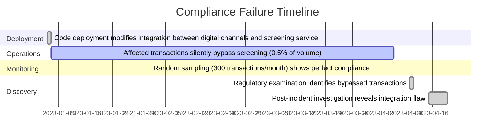

This timeline highlights how the issue went undetected for months due to the limitations of sample-based monitoring, despite the process exceeding regulatory expectations. Post-incident investigation discovered that a code deployment inadvertently modified the integration between digital channels and the screening service, causing properly formatted transactions to be screened while transactions with specific parameter patterns silently bypassed verification. These bypassed transactions represented only about 0.5% of total volume but included disproportionately high-risk activity, making random sampling ineffective in detecting the issue.

Ultimately, the bank paid $17 million in penalties and spent over $30 million on remediation. The fundamental problem wasn’t control design but visibility limitations—their sample-based approach created an illusion of comprehensive coverage while actually providing extremely limited assurance against systemic issues affecting specific transaction patterns.

### SRE Best Practice: Evidence-Based Investigation

SRE teams should implement "comprehensive compliance observability" that continuously monitors all transactions against regulatory requirements rather than relying on statistical sampling. This approach requires three essential components: universal coverage through lightweight monitoring, pattern-based analysis replacing random sampling, and risk-adaptive scrutiny that dynamically adjusts monitoring intensity.

#### Essential Components Checklist

- **Universal Coverage through Lightweight Monitoring**
  - Ensure tracing instrumentation is optimized for minimal performance impact.
  - Maintain comprehensive coverage so every transaction generates basic compliance signals regardless of type or channel.
- **Pattern-Based Analysis Replacing Random Sampling**
  - Continuously evaluate the full transaction population for anomalies, unexpected changes, or control bypasses.
  - Replace statistical sampling with real-time pattern analysis to detect compliance issues more effectively.
- **Risk-Adaptive Scrutiny**
  - Dynamically adjust monitoring intensity based on transaction risk characteristics.
  - Apply deeper scrutiny to transactions with elevated risk, compliance complexity, or unusual patterns.

#### Advanced Implementations Table

| Capability | Description | Benefits |
| -------------------------------- | ---------------------------------------------------------------------------------------------------- | ---------------------------------------------------------------------------------------------------------- |
| **Behavioral Baseline Tracking** | Establish normal compliance patterns across transaction types, customer segments, and channels. | Enables automatic detection of deviations from expected patterns, even if rules are technically satisfied. |
| **Meta-Pattern Monitoring** | Analyze control bypass rates, exception approval frequencies, and verification timing distributions. | Detect systematic compliance issues before specific violations occur. |
| **Proactive Anomaly Response** | Automate alerts and risk mitigation based on detected deviations or emerging compliance risks. | Facilitates immediate intervention to prevent regulatory exposure or operational disruption. |

This evidence-based approach transforms compliance assurance from statistical approximation based on samples to comprehensive oversight across the entire transaction population. By leveraging these components and advanced implementations, organizations gain visibility into emerging issues, ensuring proactive risk mitigation regardless of how compliance challenges manifest across the processing environment.

### Banking Impact

The business consequences of sample-based compliance monitoring extend far beyond direct regulatory penalties. While enforcement actions for control failures routinely reach $15-50 million for mid-sized institutions, the operational impacts create even greater costs: remediation programs typically require 25-50 full-time staff for 12-24 months, external consultants costing $10-30 million, and technology investments of $5-15 million to address identified weaknesses—collectively far exceeding the initial regulatory penalties.

To illustrate the stark differences between sample-based monitoring and continuous compliance monitoring, the following table compares their costs and impacts:

| **Aspect** | **Sample-Based Monitoring** | **Continuous Compliance Monitoring** |
| ------------------------------- | ------------------------------------------------------------- | -------------------------------------------------------- |
| **Regulatory Penalty Exposure** | High: $15-50M for mid-sized institutions | Low: 40-60% reduction in enforcement rates |
| **Remediation Costs** | $10-30M for external consultants, 25-50 FTEs for 12-24 months | 25-35% reduction in remediation costs |
| **Technology Investments** | $5-15M to address weaknesses | Proactive compliance systems reduce reactive investments |
| **Operational Delays** | 9-15 months product launch delays, geographic restrictions | Faster recovery of normal operating flexibility |
| **Compliance Overhead** | 15-25% higher operating costs for 3-5 years | Streamlined operations with calibrated controls |
| **Customer Impact** | 20-30% drop in digital account approvals | Improved customer experience via real-time adjustments |

Strategic impacts create more significant long-term consequences. Institutions under regulatory enforcement typically face approval restrictions delaying new product launches by 9-15 months compared to competitors, geographic expansion limitations constraining growth in key markets, and enhanced supervision requirements creating 15-25% higher compliance operating costs for 3-5 years beyond the initial issue resolution. Customer acquisition metrics show similar patterns—digital account opening approval rates typically decrease 20-30% during remediation periods as institutions implement overly conservative controls to address regulatory concerns, directly impacting growth trajectories and competitive positioning.

For financial institutions, continuous compliance monitoring represents both risk mitigation and strategic enablement. Institutions with comprehensive, real-time compliance visibility typically demonstrate 40-60% lower regulatory enforcement rates, 25-35% lower remediation costs when issues occur, and significantly faster recovery of normal operating flexibility compared to peers relying on traditional sampling approaches. These competitive advantages translate directly to enhanced growth opportunities, lower operating costs, and superior customer experience through appropriately calibrated controls rather than over-engineered restrictions implemented following enforcement actions.

### Implementation Guidance

To effectively transition to real-time compliance monitoring, the following step-by-step process can be followed. A flowchart is provided below to help visualize the implementation journey:

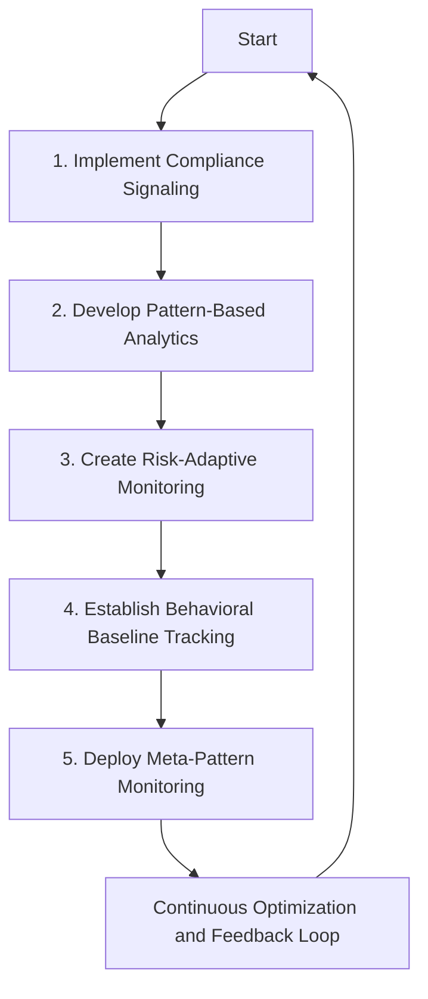

1. **Implement Compliance Signaling**\
   Deploy lightweight compliance signaling that captures essential regulatory checkpoints for every transaction, regardless of type or channel. Ensure comprehensive visibility with minimal performance impact by focusing instrumentation on compliance-relevant operations.

2. **Develop Pattern-Based Analytics**\
   Build analytics capabilities that continuously evaluate the entire transaction population. Replace random sampling with comprehensive anomaly detection to identify unexpected changes, control variations, or other compliance risks, regardless of their location in the processing environment.

3. **Create Risk-Adaptive Monitoring**\
   Introduce a risk-adaptive monitoring framework that dynamically adjusts trace detail, attribute capture, and analytical focus based on transaction risk characteristics, regulatory sensitivity, or detected anomalies. This ensures deeper scrutiny is applied where it matters most.

4. **Establish Behavioral Baseline Tracking**\
   Define and monitor normal compliance patterns across transaction types, customer segments, and channels. This allows the system to automatically detect deviations from established baselines—even when individual transactions meet rule-based requirements.

5. **Deploy Meta-Pattern Monitoring**\
   Implement monitoring for control effectiveness indicators rather than focusing solely on individual transactions. Track metrics like exception rates, approval patterns, and verification timing distributions to identify systematic issues before specific violations occur.

6. **Continuous Optimization and Feedback Loop**\
   Regularly review and refine the compliance monitoring system based on observed patterns, emerging risks, and regulatory updates. Use feedback loops to enhance instrumentation, refine analytics, and improve overall effectiveness.

By following these steps and utilizing the flowchart as a guide, technical teams can systematically implement robust, trace-based continuous compliance monitoring systems that transform regulatory assurance from periodic assessments to real-time oversight.

## Panel 7: Regulatory Reporting Automation - Evidence-Based Compliance Submissions

### Scene Description

A regulatory reporting center buzzes with activity as compliance teams prepare required submissions for financial authorities. Instead of relying on the traditional, manual approach—gathering and formatting data from multiple disconnected systems—their trace-based reporting platform automates the entire process. From comprehensive distributed trace data, the system generates regulatory submissions seamlessly.

Screens display key workflows of the platform, demonstrating its capabilities:

- Compiling required metrics and evidence for multiple regulations, such as:
  - Suspicious activity reporting for anti-money laundering (AML).
  - Transaction monitoring statistics for compliance effectiveness.
  - Cross-border payment reporting for currency controls.
  - Trade surveillance metrics for market manipulation prevention.
- Automatically adapting submissions to reflect system updates, ensuring continuous compliance as transaction processing evolves.
- Running automated validation checks, verifying reporting completeness against actual transaction volumes to prevent omissions.

A compliance officer walks through the process, highlighting how the platform maintains perfect alignment between actual system behavior and regulatory reporting. Below is a simplified workflow representation illustrating the automation process:

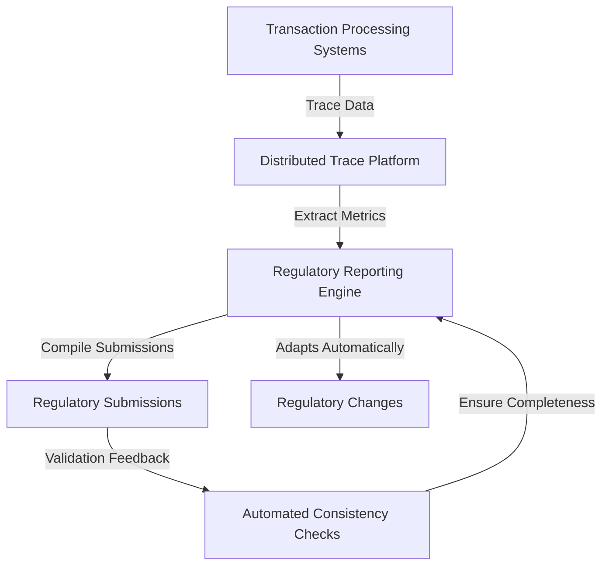

This automated flow ensures that any updates to transaction processing or regulatory requirements are immediately reflected in the reporting outputs without manual intervention. Validation panels further enhance trust by confirming that all operations are accounted for, eliminating the risk of inadvertent omissions. The result is a seamless and efficient process that bridges the gap between operational activity and compliance reporting with precision and reliability.

### Teaching Narrative

Regulatory reporting automation based on distributed tracing transforms compliance submissions from manual compilation to automated extraction directly from operational evidence. Traditional reporting approaches typically require labor-intensive processes to gather, format, and validate data from disparate systems—creating significant operational overhead while introducing risks of inconsistency between actual transaction processing and regulatory reporting. Trace-based reporting automation addresses these challenges by generating required regulatory submissions directly from the same trace data used for operational monitoring, ensuring perfect alignment between system behavior and compliance reporting. This automated approach transforms regulatory reporting from a separate, resource-intensive process to a natural byproduct of comprehensive operational observability. For financial institutions where reporting obligations span numerous regulations with different requirements, schedules, and formats, this automation dramatically reduces both compliance effort and regulatory risk. Compliance teams can implement reporting pipelines that automatically extract required metrics directly from trace data—suspicious activity statistics for anti-money laundering, authentication method distribution for strong customer authentication, cross-border volume reporting for monetary authorities, response time compliance for consumer protection rules, and transaction monitoring coverage for compliance effectiveness. The system can automatically validate reporting completeness against actual transaction volumes, detect potential reporting gaps before submission, and maintain continuous alignment between operational changes and regulatory reporting without manual intervention. This evidence-based approach ultimately improves both reporting efficiency and regulatory credibility by ensuring submissions accurately reflect actual system behavior rather than theoretical processes or manually gathered statistics that may diverge from operational reality.

### Common Example of the Problem

A large financial institution recently faced significant regulatory issues stemming from report inconsistencies across different compliance filings. Their traditional reporting process involved separate teams manually extracting and formatting data from multiple source systems—one group prepared suspicious activity reports, another handled currency transaction filings, while a third managed statistical compliance reporting.

During a routine examination, regulators identified troubling discrepancies:

| **Regulatory Report** | **Discrepancy Observed** | **Consequence** |
| ------------------------------- | ------------------------------------------------------------------------------------------- | ------------------------------------------------------------------------------------------------------- |
| Suspicious Activity Reports | Transaction volumes didn’t match corresponding financial crime statistics. | Raised questions about data accuracy and undermined confidence in anti-money laundering (AML) controls. |
| Cross-Border Payment Reports | Payment counts differed significantly between Treasury reports and Federal Reserve filings. | Triggered scrutiny over currency controls and compliance with cross-border regulations. |
| Transaction Monitoring Coverage | Coverage percentages were inconsistent across separate regulatory submissions. | Created doubts about the bank’s compliance effectiveness and monitoring methodology. |

#### Timeline of Escalation

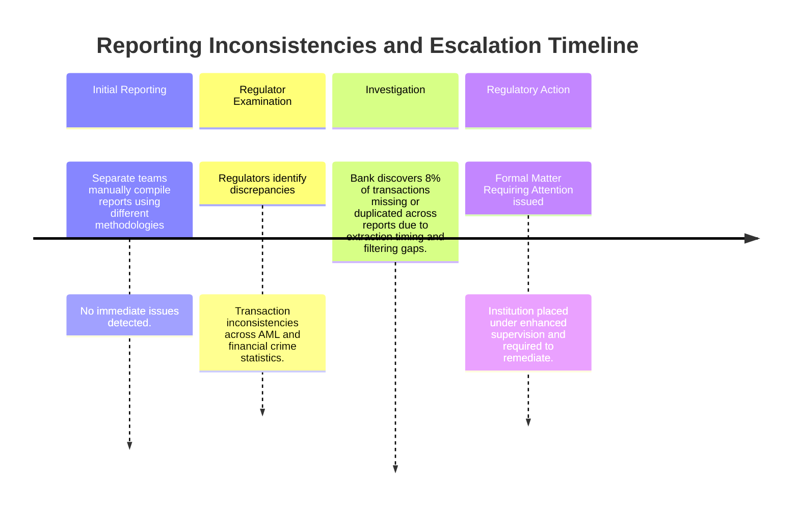

Although each report appeared reasonable in isolation, the inconsistencies between them raised fundamental questions about data accuracy and control effectiveness. Investigation revealed that each reporting team extracted data through different methodologies, applied different filtering criteria, and operated from different source systems. This led to structurally inconsistent results despite adherence to documented procedures.

Worse, reconciliation efforts uncovered approximately 8% of transactions appearing in some regulatory reports but not others due to extraction timing differences and system boundary issues. These reporting inconsistencies created the impression of deliberate obfuscation—despite being entirely unintentional—damaging regulatory trust and triggering enhanced supervision requirements across multiple business lines.

### SRE Best Practice: Evidence-Based Investigation

SRE teams should implement "unified regulatory reporting" based on a single, authoritative data source derived from comprehensive transaction tracing. This approach requires four essential components: consolidated evidence capture, standardized regulatory extraction, automated consistency validation, and continuous reporting reconciliation. To make these best practices actionable, the following checklist and step-by-step process can guide implementation:

#### Checklist for Evidence-Based Regulatory Reporting

- [ ] **Implement Comprehensive Tracing**: Ensure tracing instrumentation captures a complete, consistent record of all transactions with regulatory relevance.
- [ ] **Establish a Single Source of Truth**: Consolidate all trace data into a unified, authoritative repository for reporting.
- [ ] **Standardize Data Transformation**: Develop frameworks to extract regulatory-specific formats from trace data using consistent methodologies.
- [ ] **Automate Consistency Validation**: Implement automated checks to verify reporting completeness and coherence across different regulatory submissions.
- [ ] **Enable Continuous Alignment**: Design a system that dynamically adapts reporting to reflect changes in underlying transaction processes.
- [ ] **Track Data Lineage**: Maintain an auditable link between raw transaction events and regulatory submissions to ensure traceability and validation.

#### Step-by-Step Process

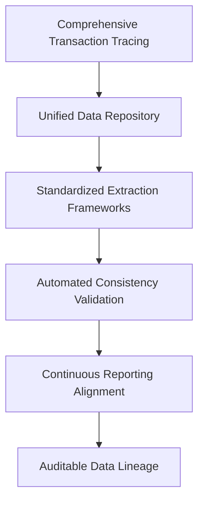

1. **Comprehensive Transaction Tracing**\
   Instrument all relevant systems to record a complete and consistent trace of every transaction with regulatory implications.

2. **Unified Data Repository**\
   Consolidate trace data into a centralized repository that serves as the single source of truth for all regulatory reporting activities.

3. **Standardized Data Transformation**\
   Develop a standardized set of extraction frameworks to convert trace data into regulatory-specific formats, ensuring consistent methodologies across all reports.

4. **Automated Consistency Validation**\
   Implement validation pipelines to automatically verify that transaction counts, financial totals, and other key metrics align across submissions, regardless of context or format.

5. **Continuous Reporting Alignment**\
   Design the system to automatically adapt regulatory submissions to reflect any engineering changes in transaction processing, eliminating the need for manual updates.

6. **Auditable Data Lineage**\
   Implement data lineage tracking that connects raw transaction events to final regulatory submissions, enabling real-time validation of reporting accuracy and completeness.

By following this checklist and step-by-step process, SRE teams can transform traditional, labor-intensive regulatory reporting into a unified, automated system. This evidence-based approach ensures consistent, accurate representations of institutional activity, meeting regulatory requirements with minimal overhead while maintaining full traceability and alignment with operational behavior.

### Banking Impact

The business consequences of fragmented regulatory reporting extend far beyond direct compliance risks. Operational inefficiencies create substantial costs: large financial institutions typically dedicate 30-50 full-time employees solely to regulatory report preparation, manually extracting, formatting, and reconciling data across different requirements at a fully-loaded annual cost of $4-8 million before considering technology expenses or external validation services.

More significant impacts affect regulatory relationships and strategic flexibility. Inconsistent reporting directly damages regulatory credibility—institutions with report discrepancies typically face 2-3x more intensive examination scrutiny across all business lines, not just the affected areas, creating significant additional compliance costs. Approval timelines show similar patterns—new product or service approvals take 40-60% longer for institutions with reporting inconsistencies as regulators apply higher skepticism to all submissions, directly impacting competitive agility. Perhaps most significantly, reporting inconsistencies elevate an institution's perceived risk profile—typically resulting in 10-20 basis point increases in regulatory capital requirements as supervisors apply higher safety margins to account for perceived data unreliability. For large financial institutions, these capital impacts alone can represent $50-200 million in opportunity cost beyond the direct operational expenses and competitive disadvantages.

Unified regulatory reporting represents both a compliance necessity and strategic enabler—creating a single, consistent representation of institutional activity that simultaneously reduces operational costs, enhances regulatory credibility, accelerates approval processes, and optimizes capital efficiency through demonstrably reliable compliance data aligned with actual operational reality.

#### Quantitative Summary of Banking Impacts

| **Impact Area** | **Fragmented Reporting** | **Unified Reporting** |
| ----------------------------- | ----------------------------------------------------- | --------------------------------------------------------- |
| **Compliance Staffing Costs** | $4-8M annually (30-50 FTEs) | $1-2M annually (5-10 FTEs) |
| **Examination Scrutiny** | 2-3x more intensive across all business areas | Standard scrutiny levels |
| **Approval Delays** | 40-60% longer (e.g., ~6 months for product approvals) | Standard approval timelines (e.g., ~3-4 months) |
| **Regulatory Capital Costs** | +10-20 basis points (~$50-200M in opportunity cost) | No additional capital requirements |
| **Operational Alignment** | Manual reconciliation, frequent inconsistencies | Automated, trace-based alignment with operational reality |

By automating reporting processes and ensuring alignment with operational data, financial institutions can mitigate these inefficiencies and risks, achieving substantial financial savings and enhanced regulatory credibility while improving their strategic agility.

### Implementation Guidance

The following steps outline the implementation process for automated, trace-based regulatory reporting. The workflow below provides a clear roadmap for teams to follow, ensuring a structured and effective deployment strategy.

#### Workflow Diagram

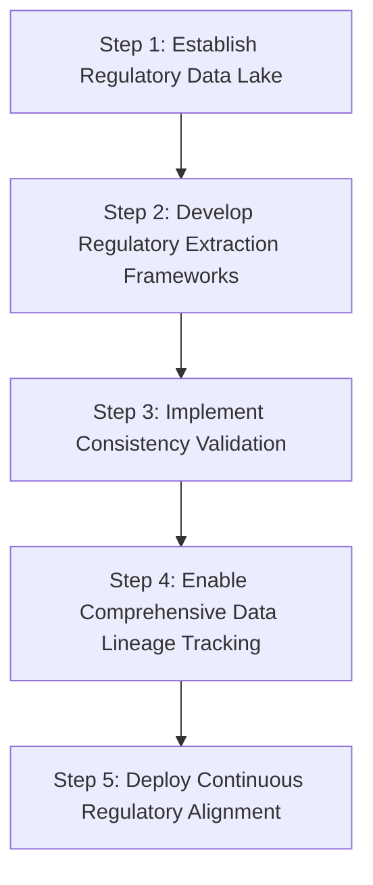

#### Step-by-Step Implementation

1. **Establish Regulatory Data Lake**\
   Implement a unified regulatory data lake based on comprehensive trace evidence. This serves as a single, authoritative source that captures all transaction details with regulatory relevance across every business domain, product type, and channel.

2. **Develop Regulatory Extraction Frameworks**\
   Create standardized frameworks to transform trace data into specific regulatory formats. Use consistent methodologies to ensure alignment across different reports, regardless of varying requirements, schedules, and submission formats.

3. **Implement Consistency Validation**\
   Deploy automated consistency validation to continuously verify reporting alignment across regulatory submissions. This ensures transaction counts, financial totals, and key metrics remain coherent, with alerts for potential discrepancies before submission.

4. **Enable Comprehensive Data Lineage Tracking**\
   Establish detailed data lineage tracking to maintain auditable connections between raw transaction events and final regulatory submissions. This allows point-in-time validation of reporting accuracy and provides documentation of how raw data transforms into regulatory metrics.

5. **Deploy Continuous Regulatory Alignment**\
   Implement mechanisms to automatically adapt reporting when underlying systems change. This ensures that engineering modifications to transaction processing propagate seamlessly to regulatory submissions without requiring manual updates, maintaining alignment between operational reality and compliance reporting.
