# Chapter 14: Integrating Traces with Banking Logs and Metrics

## Chapter Overview

Welcome to the observability arms race, where banks can’t afford to fumble in the dark while millions of dollars and their regulatory hide are on the line. This chapter drags you—kicking and screaming if necessary—into the future of integrated traces, logs, and metrics. Gone are the days of swivel-chair forensics and blame-shifting between siloed teams. If you still think context-switching is a noble engineering tradition, prepare to have that myth torched.

We’ll expose the tragic comedy of fragmented monitoring—where “all green” dashboards lull execs into disaster, regulatory requests turn into archaeological digs, and engineers waste career years correlating logs with nothing but caffeine and despair. Then, we’ll show you how to fight back: build unified health models, automate cross-signal correlation, and extract business gold from trace data without the usual instrumentation nightmares. By the end, you’ll see why disconnected observability isn’t just inefficient—it’s a slow-motion trainwreck for banks, their customers, and anyone who values sleep.

______________________________________________________________________

## Learning Objectives

- **Integrate** traces, logs, and metrics into a single, evidence-based investigation flow—so you stop playing “Guess the Root Cause” with half the deck missing.
- **Enrich** logs with trace context automatically, turning log spelunking from “needle-in-a-haystack” to “precision missile strike.”
- **Map** technical signals to actual customer journeys, building unified health models that finally make your monitoring mean something to the business.
- **Correlate** observability signals automatically, accelerating root cause analysis and eliminating the tribal blame games.
- **Extract** business-aligned metrics from trace data, so performance monitoring is about what matters (not just what’s easy to count).
- **Debug** incidents with synchronized log-trace views, slashing mean time to resolution and keeping your blood pressure in check.
- **Govern** observability data with lifecycle policies that satisfy both regulators and finance—no more “storage for everything, useful for nothing.”

______________________________________________________________________

## Key Takeaways

- Fragmented observability is a seven-figure recurring tax on your bank—paid in incident costs, lost customers, and regulatory ulcers.
- Swivel-chair investigations are not a rite of passage—they’re a sign your tooling is stuck in the past and your competitors are laughing.
- Context-aware log enrichment isn’t a nice-to-have; it’s the only way to make sense of billions of log lines when the regulator comes knocking.
- Unified health models finally kill the “all systems green, customers screaming” paradox. If your monitoring doesn’t map to business impact, it’s just noise.
- Cross-signal correlation is your only hope for root cause clarity before the business and regulators come breathing down your neck.
- Trace-derived metrics mean you can measure what actually matters to customers and the business—without the instrumentation tax that kills feature velocity.
- Integrated log-trace debugging should be mandatory. If your team is still copy-pasting trace IDs between tools, you’re hemorrhaging time and money.
- Observability data lifecycle management is a regulatory minefield—get it wrong, and you’ll spend millions storing useless junk while the crucial evidence is already deleted (or leaking PII).
- Evidence-based SRE isn’t just a buzzword. It’s how you turn observability from a cost center into a competitive weapon.

If you’re still thinking any of this is optional, remember: in banking, “we couldn’t find the logs” is not an acceptable answer—for auditors, customers, or your own job security.

______________________________________________________________________

## Panel 1: The Three Pillars of Observability - Unifying Banking Visibility

### Scene Description

A banking operations center transformation in progress is illustrated through a vivid comparison of past and future states:

#### **Past State: Fragmented and Isolated Tools**

- **Setup:** Separate monitoring stations with dedicated screens for logs, metrics, and traces.
- **Challenges:**
  - Engineers manually correlate information across disconnected systems during incidents.
  - High "context switching tax" due to frequent toggling between tools.
  - Limited visibility into the full scope of incidents, leading to frustration and inefficiency.

Example Workflow:

```plaintext
[Logs Screen] --(manual correlation)--> [Metrics Screen] --(manual correlation)--> [Traces Screen]
```

#### **Future State: Unified Observability Workstations**

- **Setup:** Centralized workstations integrating logs, metrics, and traces into a cohesive interface.
- **Benefits:**
  - Synchronized views of payment transaction journeys.
  - Contextually relevant logs and metrics appear alongside trace spans automatically.
  - Selecting a component in one view highlights related data across others.
  - Streamlined troubleshooting with seamless transitions between observability dimensions.

Example Workflow:

```plaintext
[Unified Interface]
   |--> Trace Waterfall View
   |--> Logs View (contextual to trace span)
   |--> Metrics Dashboard (aligned with transaction timeframe)
```

A central visualization highlights a payment transaction journey:

- **Center:** Trace waterfall chart showing distributed flow.
- **Side Panels:** Logs and metrics dynamically synchronized to specific spans and timeframes.
- **Interactivity:** An SRE demonstrates how selecting any component in one view automatically surfaces related insights across the others, creating a complete understanding that was previously impossible with isolated tools.

This transition from fragmented to unified observability workstations showcases how engineering teams can dramatically improve incident response efficiency and quality.

### Teaching Narrative

The integration of the three observability pillars—traces, logs, and metrics—transforms banking system visibility from fragmented data sources to unified understanding essential for complex financial environments. Historically, these observability types evolved as separate domains with different tools, teams, and approaches: logs providing detailed sequential events, metrics offering aggregated performance data, and traces showing distributed transaction flows. This separation created fundamental visibility gaps precisely during critical incidents when complete understanding was most crucial. A unified observability approach addresses this challenge by creating contextual relationships between these complementary data types, enabling each to enhance the others through correlation rather than competition. This integration transforms troubleshooting from swivel-chair investigation across disconnected tools to seamless navigation through different observability dimensions. For financial institutions where complex incidents often require understanding across multiple observability perspectives, this unified approach dramatically reduces mean time to resolution by eliminating the "context switching tax" between tools. Engineers can seamlessly transition from a high-level trace showing transaction flow to specific logs explaining detailed behavior at a problematic step, then to metrics revealing whether the issue represents a pattern or an anomaly—all within a single cohesive workflow rather than disconnected tools. This integrated approach ultimately improves both operational efficiency and incident response quality by ensuring engineers can easily access the most appropriate observability dimension for each stage of investigation without losing context between tools.

### Common Example of the Problem

A major retail bank experienced a critical incident when high-value client wire transfers began failing intermittently during peak hours. The operations team struggled to identify the root cause due to fragmented observability tools. Monitoring dashboards showed normal system metrics with occasional CPU spikes on authentication servers. Log analysis teams combed through millions of entries looking for error patterns but found only generic timeout messages. Meanwhile, the newly implemented tracing system showed transaction failures occurring during the payment execution phase, suggesting an entirely different component was at fault.

For over three hours, teams debated which data source was most reliable, with each group defending their own tooling rather than collaborating effectively. The disjointed investigation continued until a senior engineer manually correlated timestamps between systems, discovering that the authentication service was actually functioning correctly, but a misconfigured connection pool in the fraud detection system was causing silent failures that propagated to the payment execution service. The lack of integrated observability extended the incident by hours, resulting in dozens of failed high-value transfers, regulatory reporting issues, and significant customer frustration.

Below is a timeline diagram that illustrates the sequence of events and investigation steps during the incident, highlighting the gaps caused by fragmented tools:


This timeline highlights how the lack of integrated observability prolonged the incident. Each team focused on their own tools, leading to delayed root cause identification and significant operational impact. Unified observability would have allowed seamless correlation across metrics, logs, and traces, enabling faster detection of the connection pool misconfiguration and preventing prolonged disruption.

### SRE Best Practice: Evidence-Based Investigation

SRE teams must implement unified observability platforms that integrate traces, logs, and metrics into a cohesive investigation experience. This approach requires treating observability data as a connected knowledge graph rather than isolated repositories, with explicit linkage between related data points regardless of their type. To make evidence-based investigations actionable, follow this step-by-step guide:

#### Evidence-Based Investigation Checklist

1. **Start with Traces: Identify Transaction Flows**

   - Access the trace waterfall view to map the end-to-end transaction flow.
   - Identify spans or segments where errors, delays, or anomalies occur.
   - Determine the customer impact and the general failure pattern.

2. **Dive into Logs: Understand Failure Modes**

   - Select the problematic span or component within the trace.
   - Automatically surface the relevant logs linked to the selected span.
   - Examine log entries for error details, stack traces, or unusual behavior.
   - Look for timestamps, error codes, or patterns to pinpoint root causes.

3. **Correlate with Metrics: Assess Impact and Scope**

   - Transition to metrics dashboards for the affected system or service.
   - Analyze performance indicators (e.g., latency, throughput, resource utilization) during the timeframe of the trace.
   - Determine if the issue is isolated or part of a systemic trend by identifying anomalies or recurring patterns.

4. **Iterate Across Dimensions: Validate Findings**

   - Use bidirectional integration to move seamlessly between views:
     - From metrics anomalies to impacted transactions.
     - From logs back to associated trace spans.
   - Cross-check evidence across all three observability pillars to confirm hypotheses and refine conclusions.

5. **Document and Resolve**

   - Record findings, including root causes and affected components, in the incident report.
   - Use insights from traces, logs, and metrics to develop mitigation or resolution steps.
   - Verify resolution effectiveness by re-checking metrics and transaction flows.

#### Key Principles for Effective Evidence-Based Investigation

- **Bidirectional Integration**: Selecting a trace span should instantly surface relevant logs and metrics. Similarly, logs and metrics should offer one-click access to related traces.
- **Context-Aware Navigation**: Maintain investigation continuity by preserving context when switching between data types.
- **Automated Context Linking**: Eliminate manual searches by leveraging tools that automatically correlate traces, logs, and metrics.

This connected investigation process transforms troubleshooting from disjointed hypothesis testing across fragmented tools into a seamless evidence collection workflow. For complex banking systems with thousands of components and millions of transactions, this integration becomes essential, reducing hours of manual correlation to seconds of automated context linking and ensuring faster, more efficient incident response.

### Banking Impact

The business consequences of fragmented observability in banking environments are severe and multifaceted. Direct financial impacts include extended incident durations that increase transaction failure volumes—often measured in millions of dollars for payment processing issues affecting high-value transfers, trading operations, or settlement processes. Customer experience deteriorates rapidly when resolution times extend, with each additional hour of investigation delay causing exponential increases in support calls, reputational damage, and potential customer attrition.

Regulatory consequences are particularly concerning in financial services, as extended incidents may require formal reporting to multiple authorities, with resolution time and impact assessment being critical factors in regulatory evaluation. Studies indicate that banks with fragmented observability experience significantly longer incident resolution times compared to those with unified approaches, directly impacting both operational costs and regulatory standing.

The following table provides a quantitative comparison between fragmented and unified observability environments, highlighting key differences in operational and financial outcomes:

| **Metric** | **Fragmented Observability** | **Unified Observability** |
| -------------------------------------------- | ---------------------------------- | ------------------------- |
| **Average Incident Resolution Time** | 4.3x longer | Standard baseline |
| **Annual Incident Costs** | $15–20 million | Reduced by 50–70% |
| **Customer Attrition Risk** | High, due to prolonged disruptions | Significantly reduced |
| **Regulatory Penalties** | Frequent and severe | Minimized |
| **Correlation of Technical & Business Data** | Limited | Fully realized |

By addressing these challenges, unified observability unlocks the business intelligence potential of observability data, enabling banks to correlate technical performance with business outcomes and guide strategic investments. For a typical global bank, this shift not only improves operational efficiency but also mitigates financial losses, enhances customer retention, and strengthens regulatory compliance.

### Implementation Guidance

1. **Implement a unified data collection pipeline**\
   Build a centralized pipeline that captures all three observability signals—traces, logs, and metrics—while ensuring consistent correlation identifiers across them. For example, inject a unique `trace_id` and `span_id` into each log entry and link metrics to the relevant trace context. Below is a sample configuration snippet demonstrating how to configure OpenTelemetry for unified data collection:

   ```yaml
   # OpenTelemetry Collector Configuration
   receivers:
     otlp:
       protocols:
         grpc:
         http:
   processors:
     batch:
     resource:
       attributes:
         - key: service.name
           value: "payment-service"
           action: upsert
   exporters:
     logging:
       loglevel: debug
     otlp:
       endpoint: "http://otel-collector:4317"
   service:
     pipelines:
       traces:
         receivers: [otlp]
         processors: [batch, resource]
         exporters: [logging, otlp]
       metrics:
         receivers: [otlp]
         processors: [batch, resource]
         exporters: [logging, otlp]
       logs:
         receivers: [otlp]
         processors: [batch, resource]
         exporters: [logging, otlp]
   ```

   Ensure timestamp formats, service naming conventions, and trace propagation headers (e.g., W3C Trace Context) are standardized across all services.

2. **Develop context-aware data linking mechanisms**\
   Establish explicit relationships between observability data types. For example:

   - Use middleware libraries to automatically tag logs and metrics with `trace_id` and `span_id`.
   - Implement a mechanism to associate metrics time series with trace spans by aligning timestamps and service identifiers.
   - Below is a basic example of linking logs to traces in Python using an OpenTelemetry library:

   ```python
   from opentelemetry import trace
   from opentelemetry.instrumentation.logging import LoggingInstrumentor
   import logging

   # Initialize tracer
   tracer = trace.get_tracer("payment-service")

   # Instrument logging to include trace context
   LoggingInstrumentor().instrument(set_logging_format=True)
   logger = logging.getLogger(__name__)

   # Generate trace and span
   with tracer.start_as_current_span("process-payment") as span:
       logger.info("Processing payment request")
       # Log will automatically include trace_id and span_id
   ```

3. **Deploy integrated visualization dashboards**\
   Create dashboards that present traces, logs, and metrics in synchronized views. Use tools like Grafana or custom UI components to display these observability dimensions together. Below is an example JSON snippet for a Grafana dashboard integrating traces and metrics:

   ```json
   {
     "panels": [
       {
         "type": "traces",
         "title": "Trace Waterfall",
         "datasource": "Tempo",
         "options": { "showLabels": true }
       },
       {
         "type": "graph",
         "title": "Metrics Over Time",
         "datasource": "Prometheus",
         "targets": [
           { "expr": "http_requests_total{job='payment-service'}" }
         ]
       }
     ],
     "time": {
       "from": "now-1h",
       "to": "now"
     }
   }
   ```

   Ensure contextual filtering is enabled so selecting a trace span automatically filters logs and metrics for the same timeframe.

4. **Establish observability data mesh architecture**\
   Design a data mesh that maintains specialized storage for each observability type while providing a unified interface. For instance:

   - Use a time-series database like Prometheus for metrics.
   - Store structured logs in Elasticsearch or Loki.
   - Use a distributed trace backend like Tempo or Jaeger.
   - Implement a semantic layer to unify querying across these systems, such as by using OpenTelemetry’s collector with a shared exporter and query interface.

5. **Implement cross-signal correlation analysis**\
   Leverage machine learning models or rule-based systems to automatically correlate anomalies. For example:

   - Use log patterns to identify error-prone trace spans.
   - Highlight metrics anomalies linked to transaction failures.
   - Below is a simple rule-based pseudocode example for correlating signals:

   ```python
   def correlate_signals(trace_spans, logs, metrics):
       correlated_data = []
       for span in trace_spans:
           span_logs = [log for log in logs if log["trace_id"] == span["trace_id"]]
           span_metrics = [metric for metric in metrics if metric["timestamp"] in span["time_range"]]
           correlated_data.append({
               "span": span,
               "logs": span_logs,
               "metrics": span_metrics
           })
       return correlated_data
   ```

   Continuously improve correlation accuracy by incorporating feedback from resolved incidents into your models or rules.

## Panel 2: Trace-Context Enhanced Logging - Beyond Text-Based Troubleshooting

### Scene Description

A post-incident review unfolds where banking engineers are analyzing a complex authentication failure that disrupted mobile trading services. Instead of sifting through traditional unstructured logs, their screens display trace-enhanced log entries enriched with crucial context: each log line includes the trace identifier, span ID, customer identifier, session context, and transaction type extracted from the distributed tracing system. Engineers demonstrate how this enhancement revolutionized their troubleshooting process—when investigating the authentication issue, they could instantly filter logs to display only entries associated with the affected transactions, bypassing unrelated authentication events. This revealed a clear pattern: a particular authentication flow was failing due to a configuration mismatch between services.

Below is a timeline comparison illustrating how trace-enhanced logging reduced the mean time to resolution (MTTR) from hours to minutes by eliminating the need for manual correlation:

```mermaid
gantt
    title Incident Resolution Timeline Comparison
    dateFormat HH:mm
    section Traditional Logging
    Identify affected transactions: done, 00:00, 02:00
    Correlate logs across services: done, 02:00, 03:30
    Diagnose root cause: done, 03:30, 04:30
    Implement fix: done, 04:30, 05:00
    section Trace-Enhanced Logging
    Identify affected transactions: done, 00:00, 00:10
    Correlate logs across services: done, 00:10, 00:20
    Diagnose root cause: done, 00:20, 00:40
    Implement fix: done, 00:40, 01:00
```



The timeline demonstrates how trace-enhanced logging eliminates hours of manual correlation. Engineers can focus immediately on relevant diagnostic information, transforming logs from isolated technical records into transaction-aware insights. This approach not only accelerates resolution but also ensures a more targeted and efficient response, directly addressing customer-impacting issues with precision.

### Teaching Narrative

Trace-context enhanced logging transforms traditional text-based records from isolated events to transaction-aware insights in complex banking environments. Conventional logging approaches produce detailed but fundamentally disconnected records—each service or component generates its own logs without inherent relationships to the transactions flowing through them. This isolation creates a critical challenge during troubleshooting: engineers can see detailed behavior within individual services but cannot easily determine which log entries relate to specific customer transactions or how events in different services relate to each other. Trace-enhanced logging addresses this limitation by automatically enriching log entries with distributed tracing context—including trace identifiers, span references, customer contexts, and transaction attributes—creating explicit connections between detailed logs and the broader transaction flows they support. This contextual enhancement transforms logging from isolated technical records to transaction-centric evidence directly linked to customer experiences. For banking systems where understanding the specific customer impact of technical issues is crucial, this approach dramatically accelerates troubleshooting by enabling engineers to instantly filter massive log volumes to show only entries relevant to specific transactions, customer segments, or business operations. This targeting capability eliminates the traditional "needle in a haystack" challenge of log analysis, allowing immediate focus on relevant diagnostic information rather than manually searching through thousands of unrelated entries hoping to find connections between distributed events. This trace-enhanced approach ultimately reduces mean time to resolution from hours to minutes by providing the detailed diagnostic power of logs with the transaction-aware context of traces, eliminating the traditional compromise between depth and relationship visibility in banking system troubleshooting.

### Common Example of the Problem

An investment bank's trading platform experienced an intermittent authentication issue affecting only certain institutional clients during market volatility periods. Despite having robust logging across all services, the troubleshooting team struggled to identify patterns as they were faced with over 200GB of log data generated during the four-hour incident window. The logs contained detailed information about hundreds of thousands of authentication attempts, but without transaction context, engineers couldn't determine which log entries related to the affected clients versus the majority of successful operations.

To highlight the inefficiencies of the traditional approach compared to trace-context enhanced logging, the table below provides a side-by-side comparison of the two methods during this incident:

| Aspect | Traditional Troubleshooting Approach | Trace-Context Enhanced Logging Approach |
| --------------------- | --------------------------------------------------------------- | -------------------------------------------------------------------------------- |
| **Log Volume** | 200GB of unstructured logs across multiple services. | 200GB of logs enriched with trace IDs, span IDs, and transaction context. |
| **Analysis Scope** | Teams examined isolated service logs independently. | Engineers filtered logs to focus only on affected transactions. |
| **Pattern Detection** | No clear pattern without manual correlation across services. | Immediate identification of a pattern involving specific clients and auth flows. |
| **Team Coordination** | Multiple teams worked in silos, leading to redundant efforts. | Unified view of logs tied to transaction flows reduced duplication. |
| **Time to Diagnosis** | 18 hours to identify the root cause through manual correlation. | Root cause identified in minutes by pinpointing linked transaction failures. |

The inefficiencies of the traditional approach were evident: the authentication team found no obvious errors, the trading gateway team observed occasional timeouts but couldn't connect them to specific clients, and the session management team noticed token validation issues without tying them to the reported problems. After hours of manual investigation across multiple teams and time zones, they eventually discovered the root cause—a race condition in the multi-factor authentication service affecting clients using a specific combination of authentication methods and trading volumes.

With trace-context enhanced logging, this pattern would have been immediately visible, as the enriched logs would have linked the affected user sessions across different services in real-time, eliminating the need for manual correlation and dramatically reducing the time to resolution.

### SRE Best Practice: Evidence-Based Investigation

SRE teams must implement trace-context enhanced logging that automatically enriches log entries with distributed tracing identifiers and relevant business context. This approach transforms log analysis from general pattern searching to precise, transaction-focused investigation. The implementation should ensure every log entry contains, at minimum, the following fields:

- **Trace and Span Identifiers**: Links log entries to specific distributed trace spans.
- **Service Name**: Identifies the service generating the log.
- **Customer/Session Identifiers**: Associates the log with specific user sessions or customers.
- **Transaction Type**: Categorizes the nature of the transaction (e.g., authentication, payment, etc.).
- **Business Context**: Includes attributes such as transaction amounts, customer segments, or channels to connect technical issues to business impact.

#### Implementation Checklist

1. **Define Required Context Fields**: Identify the trace, span, and business context fields critical for troubleshooting in your system.
2. **Integrate Distributed Tracing SDKs**: Use tracing libraries (e.g., OpenTelemetry) in all services to propagate trace and span IDs.
3. **Enhance Log Emitters**: Modify log configurations to include trace, span, and contextual fields in every log entry.
4. **Ensure Context Propagation**: Implement middleware or interceptors to propagate tracing and business context across service boundaries.
5. **Validate Log Enrichment**: Periodically verify that logs from all services include the required context fields.
6. **Enable Targeted Queries**: Configure log aggregation tools (e.g., Elasticsearch, Splunk) to support filtering by trace ID, customer ID, or other context fields.
7. **Train Teams**: Educate engineering teams on using trace-context enriched logs for precise, transaction-focused investigations.

#### Example Code Snippet: Adding Trace Context to Logs (Python with OpenTelemetry)

```python
from opentelemetry import trace
from opentelemetry.trace import get_current_span
import logging

# Configure logging
logging.basicConfig(format='%(asctime)s %(message)s', level=logging.INFO)
logger = logging.getLogger("example-logger")

def log_with_context(message, customer_id=None, transaction_type=None):
    span = get_current_span()
    trace_id = span.get_span_context().trace_id
    span_id = span.get_span_context().span_id

    # Enrich log entry with trace context and custom fields
    log_entry = {
        "message": message,
        "trace_id": f"{trace_id:016x}",
        "span_id": f"{span_id:016x}",
        "customer_id": customer_id,
        "transaction_type": transaction_type,
    }
    logger.info(log_entry)

# Example usage
log_with_context(
    "Authentication failed due to configuration mismatch",
    customer_id="cust12345",
    transaction_type="authentication"
)
```

#### Workflow: Evidence-Based Investigation


Evidence-based investigation with context-enhanced logs follows a fundamentally different pattern than traditional approaches. Instead of searching for general error patterns across all logs, engineers begin with affected transaction traces, then use trace identifiers to filter log repositories for only the entries relevant to those specific transactions, regardless of which services generated them.

This targeted approach creates a comprehensive narrative of exactly what happened during specific failed transactions, including detailed error messages, state transitions, and service interactions that may not be visible in the trace spans themselves. For banking systems generating terabytes of logs daily, this context-enhanced approach is essential for effective troubleshooting—reducing log analysis from hours of speculative searching to minutes of precise investigation. By capturing business attributes alongside technical identifiers, engineers can directly connect technical issues to their business impact, enabling faster resolution and improved customer outcomes.

### Banking Impact

The business consequences of disconnected logging in banking environments extend far beyond technical inefficiency to directly impact financial outcomes and customer relationships. The following table summarizes the key financial, operational, and customer impacts of disconnected logging compared to trace-context enhanced logging:

| **Impact Area** | **Disconnected Logging** | **Trace-Context Enhanced Logging** |
| ---------------------------------- | ------------------------------------------------------------------------------------------------------------------------ | ---------------------------------------------------------------------------------- |
| **Mean Time to Resolution (MTTR)** | 3-5x longer for complex multi-service incidents, often exceeding hours. | Reduced to minutes by enabling instant transaction-specific filtering. |
| **Incident Labor Costs** | Higher due to prolonged troubleshooting and manual log correlation efforts. | Lower as engineers can focus directly on relevant data. |
| **Service Degradation** | Extended outage and degradation periods affecting critical services. | Rapid issue isolation minimizes customer-facing downtime. |
| **Financial Loss** | Missed trading opportunities, delayed payments, disrupted banking operations—annual impact of $5-8M for a regional bank. | Reduced impact by resolving issues before significant service disruptions occur. |
| **Customer Experience** | NPS scores drop by 18-26 points following incidents with extended resolution times. | Faster resolutions protect customer trust and satisfaction. |
| **Reputational Impact** | Institutional clients question operational competence after prolonged incidents. | Swift resolutions reinforce reliability and operational excellence. |
| **Regulatory Consequences** | Increased scrutiny from regulators for inefficient resolution processes. | Improved compliance through faster and more transparent root cause identification. |
| **Innovation Capacity** | Significant opportunity cost—engineering teams diverted from innovation to manual troubleshooting. | Engineers reclaim time for value-creating activities, boosting productivity. |

This comparison highlights how disconnected logging creates a cascading effect of inefficiencies and negative outcomes. By contrast, trace-context enhanced logging transforms troubleshooting into a streamlined, transaction-aware process, dramatically reducing operational costs, minimizing customer impact, and reclaiming engineering capacity for innovation. In high-stakes banking environments, this shift is not just a technical improvement but a critical enabler of business resilience and customer trust.

### Implementation Guidance

1. **Implement standardized trace context propagation**\
   Ensure every application, service, and component automatically includes trace identifiers (trace ID, span ID), service name, and timestamp in a consistent format with every log entry. Use OpenTelemetry standards for interoperability. For example, in Python, you can propagate trace context with OpenTelemetry as follows:

   ```python
   from opentelemetry import trace
   from opentelemetry.sdk.resources import Resource
   from opentelemetry.sdk.trace import TracerProvider
   from opentelemetry.sdk.trace.export import ConsoleSpanExporter, SimpleSpanProcessor

   # Set up the tracer
   resource = Resource.create({"service.name": "authentication-service"})
   provider = TracerProvider(resource=resource)
   trace.set_tracer_provider(provider)
   span_processor = SimpleSpanProcessor(ConsoleSpanExporter())
   provider.add_span_processor(span_processor)

   # Create a trace and log with the trace context
   tracer = trace.get_tracer(__name__)
   with tracer.start_as_current_span("process-authentication") as span:
       trace_id = span.get_span_context().trace_id
       span_id = span.get_span_context().span_id
       print(f"Log Entry: TraceID={trace_id}, SpanID={span_id}, Message='Authentication started'")
   ```

2. **Extend logging frameworks with business context enrichment**\
   Augment log entries with business attributes to enable meaningful filtering during investigations. For instance, include customer identifiers (appropriately masked for privacy), transaction types, channels, and amounts. Below is an example of enriching a log entry with business context in Java using SLF4J:

   ```java
   import org.slf4j.Logger;
   import org.slf4j.LoggerFactory;
   import org.slf4j.MDC;

   public class TransactionLogger {
       private static final Logger logger = LoggerFactory.getLogger(TransactionLogger.class);

       public void logTransaction(String customerId, String transactionType, String channel, double amount) {
           MDC.put("customerId", maskCustomerId(customerId));
           MDC.put("transactionType", transactionType);
           MDC.put("channel", channel);
           MDC.put("amount", String.valueOf(amount));
           logger.info("Transaction processed");
           MDC.clear();
       }

       private String maskCustomerId(String customerId) {
           return "****" + customerId.substring(customerId.length() - 4);
       }
   }
   ```

3. **Deploy log indexing and search infrastructure**\
   Use a log management system optimized for trace-context queries. Design specialized indexes on trace identifiers, transaction types, and customer segments to ensure sub-second query response times, even across billions of log entries. The following workflow illustrates the log indexing process:

   ```text
   [Log Entry Creation] --> [Trace Context Enrichment] --> [Log Collector]
           --> [Indexing Engine: Trace ID, Span ID, Transaction Type] --> [Search Interface]
   ```

4. **Develop integrated log-trace visualization interfaces**\
   Create seamless navigation between transaction traces and logs. Use a system that links logs and traces automatically, allowing engineers to view logs associated with a specific trace span or navigate from a log entry to its trace context. The following Mermaid diagram illustrates the workflow:

   ```mermaid
   graph LR
       A[Transaction Trace] --> B[Trace Span]
       B --> C[Log Entry with Trace Context]
       C --> D[Filtered Logs View]
       D --> E[Detailed Trace Navigation]
   ```

5. **Implement automated log analysis for traced transactions**\
   Automate the generation of transaction-centric summaries. Highlight key events, state transitions, and error conditions across logs associated with specific traces to reduce the cognitive load. For example, a script can parse logs and extract patterns:

   ```python
   import re

   def summarize_logs(log_entries, trace_id):
       relevant_logs = [log for log in log_entries if f"TraceID={trace_id}" in log]
       for log in relevant_logs:
           if "ERROR" in log:
               print(f"Error found: {log}")
           elif re.search(r"state transition", log, re.IGNORECASE):
               print(f"State transition: {log}")

   logs = [
       "Log Entry: TraceID=12345, Message='Authentication started'",
       "Log Entry: TraceID=12345, Message='State transition to AUTH_STEP_2'",
       "Log Entry: TraceID=12345, Message='ERROR: Configuration mismatch detected'"
   ]
   summarize_logs(logs, "12345")
   ```

## Panel 3: Unified Health Models - Customer-Centric Observability

### Scene Description

A service reliability planning session where banking SREs are implementing a unified health model across their observability data. On large screens, they're defining relationship mappings between different data types—connecting trace-based customer journeys to the specific logs they generate and the particular metrics that measure their performance and reliability. A demonstration shows how this unified model transforms monitoring and alerting: when payment processing metrics show degradation, the system automatically identifies which specific transaction types are affected based on trace patterns, then provides the exact logs from those transactions to explain the behavior. Engineers are configuring health scoring algorithms that combine signals across data types—using trace success rates, error log frequencies, and performance metrics together to create holistic health scores for each banking capability rather than isolated technical indicators.

#### Text Diagram: Unified Health Model Relationships

```
Customer Journey
       |
       v
   Trace Data
       |
       v
   Logs (Failures, Errors)
       |
       v
   Metrics (Performance, Capacity)
       |
       v
 Holistic Health Score
       |
       v
Customer-Focused Insights
```

This relationship mapping demonstrates how observability signals—such as trace data, logs, and metrics—are interconnected to represent customer journeys and drive customer-centric health scoring. Banking SREs use this unified model to ensure monitoring and alerting reflect the real-world impact on customer-facing services, transforming fragmented technical indicators into actionable business insights.

### Teaching Narrative

Unified health models spanning traces, logs, and metrics transform system monitoring from disconnected technical indicators to customer-centric observability essential for business-aligned operations in banking. Traditional monitoring approaches typically implement separate health models for each data type—metric thresholds, log error rates, and trace success ratios—without a cohesive understanding of how these signals relate to actual customer capabilities. This fragmentation creates fundamental challenges: alerts from different systems may conflict, technical indicators may show "green" while customers experience problems, and engineers must manually interpret how signals from different sources relate to actual banking services. A unified observability health model addresses these limitations by creating explicit relationships between data types based on their support for specific customer journeys or business capabilities. This relationship-based approach transforms monitoring from technical component health to banking service health directly aligned with customer experience. For financial institutions where alignment between technical operations and business capabilities is crucial, this unified model ensures monitoring and alerting reflect actual customer impact rather than isolated technical metrics that may have unclear business relevance. Operations teams can implement health scoring that combines multiple observability signals—using trace-based success rates to understand customer impact, logs to explain specific failure modes, and metrics to identify performance trends and capacity issues—creating holistic understanding of banking service health impossible with disconnected indicators. This unified approach ultimately improves both operational focus and business alignment by ensuring monitoring directly reflects the health of customer-facing banking capabilities rather than disconnected technical components whose relationship to business services may be unclear or indirect.

### Common Example of the Problem

Imagine a car dashboard showing all systems as "green"—engine temperature is normal, fuel levels are sufficient, and the battery is fully charged—but when you turn the key, the car doesn't start. The dashboard provides a fragmented view of individual components, but it fails to reveal that the starter motor isn't engaging because it's not designed to show how the components work together in real-time. This is analogous to what many organizations experience with traditional monitoring.

A large commercial bank faced a similar situation with its corporate banking platform. They had extensive monitoring in place, with separate teams responsible for infrastructure metrics, application logging, and newly deployed distributed tracing. During a quarterly business review, executives were shown dashboards indicating 99.8% system availability and all technical SLAs being met. Yet, business stakeholders presented conflicting data showing a significant drop in customer satisfaction scores, with corporate clients reporting frequent disruptions in payment initiation services.

This apparent contradiction created tension between business and technology teams until an investigation uncovered the root cause: while individual infrastructure components and services were operating within their technical SLAs, the end-to-end payment submission process was experiencing subtle failures at the integration points between services. These failures weren't triggering alerts on individual components since each was functioning within its isolated thresholds, but they were preventing customers from completing critical payment operations.

The siloed health models—each focused on separate observability signals without integration—gave the false impression of system health while masking the actual customer experience. Just like the car dashboard example, the monitoring tools failed to show how the "parts" were working together. Meanwhile, support teams were inundated with tickets they couldn't easily diagnose because each technical team's monitoring showed "all green," despite the very real business impact.

### SRE Best Practice: Evidence-Based Investigation

SRE teams must implement unified health models that integrate signals from all observability dimensions into cohesive, customer-centric health indicators. This approach requires redefining system health from infrastructure availability to business capability fulfillment, using transaction traces as the primary backbone that connects technical signals to customer outcomes. The implementation should define explicit mappings between customer-facing business capabilities (payment processing, account opening, trading, etc.) and the complete set of services, infrastructure components, and dependencies that support them.

Evidence-based health modeling begins with trace-driven service mapping—using actual transaction flows to discover the true dependencies supporting each business capability rather than relying on theoretical architecture documents. This empirical approach reveals the actual components involved in customer journeys, including unexpected dependencies often missing from static documentation. The model should then establish bidirectional relationships between these customer journeys and the metrics and logs generated by their supporting components, creating a multi-dimensional health definition for each business capability.

Advanced implementations use weighted algorithms that combine signals across observability types—using trace-based success rates to measure customer outcomes, correlated logs to identify specific failure modes, and underlying infrastructure metrics to detect capacity or performance trends that may impact future transactions. This holistic approach transforms monitoring from isolated technical thresholds to comprehensive business capability health, ensuring alerts reflect actual customer impact rather than arbitrary technical conditions. For banking systems where technical complexity often obscures business impact, this approach ensures monitoring remains firmly aligned with customer experience rather than diverging into technical minutiae disconnected from business outcomes.

#### Checklist: Implementing Evidence-Based Health Modeling

To help SREs apply this best practice effectively, the following checklist provides actionable steps for building evidence-based health models:

1. **Define Business Capabilities and Customer Journeys**

   - Identify key customer-facing capabilities (e.g., payment processing, account opening).
   - Map out customer journeys and their expected outcomes.

2. **Perform Trace-Driven Service Mapping**

   - Use transaction tracing to empirically discover service dependencies.
   - Update existing documentation with observed dependencies, including unexpected components.

3. **Establish Bidirectional Relationships**

   - Define mappings between customer journeys and their associated metrics and logs.
   - Ensure all observability signals contribute to a unified health definition for each capability.

4. **Develop Multi-Dimensional Health Indicators**

   - Combine traces, logs, and metrics into cohesive health scores for each business capability.
   - Use trace success rates to measure customer outcomes.
   - Incorporate logs to identify failure modes and metrics to monitor capacity and performance.

5. **Implement Weighted Health Scoring Algorithms**

   - Design algorithms that prioritize customer impact.
   - Test and refine weightings to ensure health scores reflect real-world service conditions.

6. **Validate Against Real Scenarios**

   - Conduct simulations or retrospectives to ensure health models align with actual customer experiences.
   - Adjust mappings and algorithms based on findings.

7. **Iterate and Evolve**

   - Continuously refine health models as systems and customer needs evolve.
   - Regularly review and update mappings, thresholds, and scoring logic.

Following these steps enables SRE teams to build robust, customer-centric health models that deliver actionable insights and maintain alignment between technical operations and business outcomes.

### Banking Impact

The business consequences of fragmented health models in banking environments extend across multiple dimensions, creating significant operational, financial, and reputational impacts. Below is a summary of these impacts with specific examples to illustrate their scope:

| **Impact Dimension** | **Description** | **Examples/Statistics** |
| ----------------------- | ----------------------------------------------------------------------------------------------------------------------- | -------------------------------------------------------------------------------------------------------------------------------------------------------------------------------------------------------------------------------------------- |
| **Operational** | Inefficiencies in detecting and resolving service degradations, leading to reactive incident management. | - Failed or delayed financial transactions often discovered via customer complaints rather than proactive monitoring.<br>- 30-40% higher engineering effort spent on incident remediation compared to unified observability implementations. |
| **Customer Experience** | Reduced satisfaction and retention due to undetected or poorly resolved service issues affecting reliability. | - 76% of corporate banking clients cite reliability and proactive issue management as primary factors in their banking relationship decisions. |
| **Financial** | Increased costs from transaction failures, extended incident resolution times, and regulatory penalties. | - 45-60% slower resolution times result in higher compliance risks for regulated services.<br>- Global banks face $10-15 million annually in combined direct incident costs and regulatory penalties. |
| **Strategic** | Misaligned technology investments driven by disconnected health signals that fail to address true customer pain points. | - Investments often prioritize improving isolated technical metrics (e.g., server uptime) rather than enhancing customer-facing capabilities.<br>- Opportunity costs from misallocated resources exacerbate financial losses. |

This table highlights the cascading effects of fragmented observability systems, underscoring the critical need for unified health models to align operational focus with business priorities. By adopting a relationship-based approach to observability, banks can mitigate these impacts, improve customer satisfaction, and achieve greater cost efficiency while aligning technological investments with strategic goals.

### Implementation Guidance

1. **Develop a business capability catalog** that formally defines each customer-facing banking service (payments, account management, trading, lending, etc.) and maps them to the complete set of technical components that support them, including APIs, services, databases, and third-party integrations, using trace data to validate and enhance these mappings.

2. **Implement a unified health data model** that creates explicit relationships between business capabilities and their supporting observability signals, defining how trace performance, log patterns, and infrastructure metrics combine to indicate the overall health of each customer-facing banking function.

3. **Deploy multi-signal health scoring algorithms** that calculate comprehensive health indicators for each business capability by weighting and combining metrics (for capacity and performance trends), logs (for error conditions and unusual patterns), and traces (for customer success rates and experience quality) into unified health scores.

4. **Create capability-centric dashboards and alerts** that organize monitoring around banking functions rather than technical components, showing the health of payment processing, account services, or trading capabilities based on integrated observability signals rather than isolated technical metrics.

5. **Implement automated impact analysis** capabilities that instantly translate technical incidents into business context, automatically determining which customer segments, transaction types, and business capabilities are affected by specific technical issues based on the dependency mappings and recent trace patterns, ensuring incident response immediately focuses on business impact.

## Panel 4: Cross-Signal Correlation - Root Cause Acceleration

### Scene Description

The incident response room is buzzing with activity during an ongoing issue affecting loan application processing. Rather than relying on the traditional approach of individual specialists manually examining separate systems, the team is utilizing an advanced correlation platform capable of automatically analyzing relationships between observability signals.

In the center of the room, large visualization screens dominate the space, displaying a dynamic dashboard of cross-signal analysis results. One screen highlights a timeline of events, showing the gradual increase in database latency metrics alongside specific error patterns in application logs. Another screen focuses on transaction traces, isolating the subset of loan processing traces for high-value applications that are being impacted. An additional screen displays the correlation engine's automated root cause hypothesis: a database index fragmentation issue affecting only certain transaction types. These visualizations bring clarity to the situation, revealing relationships between signals that would otherwise remain hidden when viewed in isolation.

Below is a conceptual representation of the incident room setup and the flow of information facilitated by the correlation platform:


The correlation platform reduced the time to identify the root cause by automatically synthesizing signals across observability dimensions. Engineers confirm that the automated assessment matches their manual investigation findings, noting how the cross-signal correlation pinpointed the database issue while traditional monitoring was still detecting only symptomatic anomalies. This integrated approach underscores the power of automated analysis in accelerating root cause identification for complex, high-stakes systems like loan processing.

### Teaching Narrative

Cross-signal correlation across observability types transforms root cause analysis from isolated data interpretation to integrated pattern recognition essential for complex banking systems. Traditional troubleshooting approaches typically examine each observability dimension separately—analyzing metrics for performance trends, logs for error patterns, and traces for transaction flows—requiring engineers to manually synthesize insights across these isolated sources. This fragmented approach creates fundamental inefficiency: the same underlying issue manifests differently in each observability dimension, but these manifestations are analyzed independently rather than as related signals of the same root cause. Advanced correlation techniques address this limitation through automated analysis of relationships between signals across observability types—identifying how specific metric patterns, log events, and trace behaviors actually represent different perspectives on the same underlying issue rather than separate problems. This integrated analysis transforms root cause identification from manual synthesis to automated pattern recognition that can detect subtle relationships invisible within any single observability dimension. For banking systems where incidents often manifest complex patterns across multiple subsystems, this correlation capability dramatically accelerates root cause identification by automatically connecting related signals that might take hours for engineers to associate manually. Incident response teams can immediately see how metric anomalies relate to specific log errors and affect particular transaction types, identify which specific customer journeys are impacted by system-level changes, and understand how errors propagate across distributed systems through automatically correlated evidence rather than manual investigation across disconnected tools. This correlated approach ultimately reduces mean time to resolution from hours to minutes by automatically surfacing the relationships between observability signals that traditional approaches would require extensive manual analysis to discover.

### Common Example of the Problem

A global investment bank experienced a critical incident affecting their wealth management platform during market hours. The sequence of events highlights the inefficiencies caused by siloed investigations:

#### Timeline of Events

```mermaid
gantt
    title Incident Timeline - Siloed Investigations
    dateFormat  HH:mm
    section Metrics
    09:00 :active, metrics1, 09:00, 1h
    10:00 Metrics team identifies increased API response times :done, metrics2, 10:00, 30m

    section Logs
    09:15 Elevated authentication error rates detected :active, logs1, 09:15, 1h
    10:15 Log analysis suggests code deployment issue :done, logs2, 10:15, 30m

    section Traces
    09:30 Portfolio viewing success rates drop for complex holdings :active, traces1, 09:30, 1h
    10:30 Trace team identifies client segment impact :done, traces2, 10:30, 30m

    section Cross-Team Investigations
    10:45 Incident teams hold conflicting theories :crit, cross1, 10:45, 2h
    12:45 Senior architect manually correlates root cause :crit, cross2, 12:45, 1h
    13:45 Resolution begins based on manual findings :done, cross3, 13:45, 30m
```

#### Incident Breakdown

1. **Metrics System**: At 09:00, metrics indicated increased API response times, though all components remained within SLA thresholds. The infrastructure team focused on potential network latency issues based on these observations.

2. **Log Monitoring**: By 09:15, logs showed elevated error rates in authentication services. The application team suspected a recent code deployment and began investigating this as the primary cause.

3. **Trace Analysis**: Starting at 09:30, traces revealed decreased success rates for portfolio viewing operations, specifically impacting clients with complex, multi-currency holdings. The customer experience team focused on this segment, suspecting client-specific issues.

#### Challenges with Siloed Investigations

Each team worked independently, leveraging their specialized observability tools but failing to correlate cross-signal patterns. Conflicting theories arose:

- The infrastructure team pursued network latency as the root cause.
- The application team focused on a suspected deployment issue based on logs.
- The customer experience team concentrated on client-specific transaction patterns.

For over four hours, these teams implemented isolated remediation attempts, none addressing the actual root cause. The lack of integrated analysis extended the incident duration significantly.

#### Final Resolution

At 12:45, a senior architect manually correlated metrics, logs, and traces, uncovering the true root cause: a database query optimization introduced in a recent release caused execution plan changes for complex, multi-currency portfolios. These changes triggered cascading effects across all three observability dimensions.

#### Impact

The absence of automated correlation delayed the resolution, affecting high-net-worth clients during critical trading periods. This resulted in significant financial and reputational damage, underscoring the need for advanced cross-signal correlation to prevent similar incidents in the future.

### SRE Best Practice: Evidence-Based Investigation

SRE teams must implement cross-signal correlation capabilities that automatically identify relationships between different observability data types, transforming isolated signals into integrated insight patterns. This approach requires treating observability data as a unified knowledge domain rather than separate technical silos, with explicit analysis of how issues manifest across metrics, logs, and traces. The implementation should include automated correlation engines that continuously analyze relationships between observability signals, identifying patterns that indicate common underlying causes despite manifesting differently across monitoring systems.

Evidence-based investigation using cross-signal correlation follows a fundamentally different pattern than traditional approaches: rather than analyzing each data type separately and manually synthesizing findings, engineers begin with automatically generated correlation patterns that highlight related anomalies across all observability dimensions, providing integrated hypotheses that consider all available evidence simultaneously. These correlation systems should analyze both temporal relationships (events occurring in sequence across monitoring types) and causal patterns (how metric changes relate to specific log errors and affect particular transaction types).

For banking systems with complex, interconnected components, this correlation capability isn't merely a convenience but a fundamental requirement for effective incident response—transforming root cause analysis from hours of manual data synthesis to minutes of hypothesis validation based on automatically correlated patterns. Advanced implementations enhance this capability with machine learning models that progressively improve correlation accuracy by learning from past incidents, continuously refining the relationship detection algorithms based on confirmed root causes to accelerate future investigations.

#### Checklist: Implementing Evidence-Based Investigation

To help SRE teams adopt evidence-based investigation practices using cross-signal correlation, follow this actionable checklist:

1. **Unify Observability Data**

   - Centralize metrics, logs, and traces into a shared observability platform.
   - Ensure all data sources are consistently tagged and aligned to common identifiers (e.g., services, transaction IDs).

2. **Deploy Correlation Engine**

   - Implement an automated correlation system capable of analyzing relationships across observability dimensions.
   - Configure the system to detect temporal relationships (e.g., sequential events) and causal patterns (e.g., metric anomalies triggering specific log errors).

3. **Define Incident Scenarios**

   - Identify common incident patterns and ensure the correlation engine is trained to recognize these scenarios.
   - Incorporate domain-specific insights (e.g., banking transaction types) for more accurate correlation results.

4. **Integrate with Alerting Systems**

   - Configure alerts to include correlated insights, providing engineers with pre-analyzed hypotheses rather than isolated signals.
   - Ensure alerts prioritize incidents based on business impact (e.g., high-value transactions).

5. **Enable Continuous Learning**

   - Use machine learning models to refine correlation accuracy over time by analyzing confirmed root causes from past incidents.
   - Regularly review and update correlation rules to reflect changes in system architecture or incident trends.

6. **Establish Incident Review Practices**

   - Incorporate cross-signal correlation findings into post-incident reviews.
   - Use these reviews to validate the accuracy of automated hypotheses and identify areas for improvement in the correlation engine.

By following this checklist, SRE teams can transition from manual, siloed investigations to automated, evidence-based root cause analysis—significantly reducing mean time to resolution and improving incident response efficiency.

### Banking Impact

The business consequences of disconnected observability analysis in banking environments create substantial operational, financial, customer, and regulatory impacts. The table below summarizes these impacts, providing specific examples and metrics for clarity.

| **Impact Type** | **Description** | **Examples/Key Metrics** |
| ----------------------- | -------------------------------------------------------------------------------------------------------------------------------------------------------------------------------------------------------------------------------------------------------------------------- | ----------------------------------------------------------------------------------------------------------------------------------------------------------------------------------------------------------------------------------------------------- |
| **Operational** | Extended mean-time-to-resolution (MTTR) for complex incidents due to manual correlation across observability signals. This prolongs service degradation periods, impacting critical banking functions. | - MTTR increased by 2.5-4x without automated correlation.<br>- Extended resolution times for trading platforms, payment processors, and wealth management systems.<br>- Service degradation spans critical hours during market or processing windows. |
| **Financial** | Prolonged incidents result in direct financial losses, as key banking operations are delayed or disrupted. Missed trading opportunities, delayed payment settlements, and impaired wealth management decisions directly affect revenue. | - Missed trading opportunities during volatile market hours.<br>- Payment settlements delayed beyond processing windows.<br>- Wealth management decisions impaired during high-stakes events, leading to potential client portfolio losses. |
| **Customer Experience** | Incident duration directly impacts client satisfaction, particularly for high-value and institutional customers. Poor incident resolution diminishes trust, impairs retention, and damages the bank's reputation, with effects persisting long after technical resolution. | - 30% of client satisfaction for wealth and institutional customers tied to rapid issue resolution.<br>- High attrition rates linked to unresolved technical issues.<br>- Reputational damage affecting customer acquisition metrics. |
| **Regulatory** | Financial authorities impose strict reporting and compliance requirements for incidents affecting regulated functions. Extended outages without clear root cause analysis lead to increased scrutiny, potential penalties, and intensified audit demands. | - Stricter incident reporting requirements based on duration and severity.<br>- Regulatory penalties for payment processing or securities trading outages.<br>- Aggregate annual impact often exceeds $20-30 million for global banks. |

By leveraging cross-signal correlation, banks can significantly mitigate these impacts, reducing MTTR, preserving client trust, minimizing financial loss, and ensuring regulatory compliance. This proactive approach transforms incident response efficiency, delivering measurable business value.

### Implementation Guidance

#### Implementation Flowchart

The following flowchart outlines the step-by-step process for implementing cross-signal correlation in your observability systems:


#### Step-by-Step Guidance

1. **Implement an observability data lake**\
   Collect and normalize data from all monitoring sources (metrics, logs, traces), ensuring consistent metadata, timestamp normalization, and entity resolution. This unified foundation enables cross-signal analysis regardless of the original data source.

2. **Deploy automated correlation engines**\
   Continuously analyze relationships between observability signals, identifying temporal patterns (events occurring in sequence), causal relationships (how one signal type affects others), and anomaly clusters spanning multiple observability dimensions.

3. **Develop correlation visualization interfaces**\
   Create integrated views that connect related signals across observability types. These interfaces should clearly show how metric anomalies link to specific log patterns and their impact on particular transaction types, with seamless navigation between related signals during investigations.

4. **Implement machine learning enhancement**\
   Enhance correlation accuracy by applying machine learning models that learn from past incidents. Use feedback from resolved cases to refine relationship models between observability signals and improve future correlation precision.

5. **Create automated root cause hypotheses generation**\
   Build capabilities to synthesize correlated signals into specific, testable theories about underlying causes. Automatically suggest potential root causes based on recognized patterns across observability dimensions, ranking them by confidence informed by historical accuracy.

## Panel 5: Metric Extraction from Traces - Performance Insights at Scale

### Scene Description

A performance engineering workshop where banking technologists are implementing trace-based metric generation for their payments platform. The workspace is filled with multiple screens, showing the flow of how their system automatically extracts targeted performance metrics directly from trace data without requiring separate instrumentation. These trace-derived metrics include latency distributions for each payment processing stage, success rates segmented by payment type and amount, retry patterns for external service calls, and transaction volume trends across different channels. Engineers demonstrate dashboards that reveal how this approach transformed their performance visibility—moving beyond generic service-level metrics to automatically generate business-aligned indicators. These indicators show exactly how different payment types perform across channels and customer segments.

The following text diagram illustrates the process of trace-based metric extraction and its mapping to business-aligned indicators:

```
[Distributed Traces] 
       |
       v
[Trace Data Extraction] --> [Latency, Success Rates, Retry Patterns, Volume Trends]
       |
       v
[Metric Mapping] --> [Business-Aligned Indicators]
       |
       v
[Dashboards and Insights]
       |
       v
[Actionable Performance Visibility]
```

This process enables insights that are impossible with traditional metrics: comparing performance patterns between high-value and standard transfers, identifying channels with higher failure rates, and measuring how external dependencies affect different payment corridors—all automatically derived from trace data without additional instrumentation. This visualized workflow highlights the transformation of performance monitoring into a precise, business-focused practice tailored to banking operations.

### Teaching Narrative

Metric extraction from trace data transforms performance monitoring from generic technical measurements to business-aligned indicators essential for banking-specific optimization. Traditional metric approaches typically focus on general technical indicators—CPU utilization, memory consumption, request rates—that provide limited insight into how specific banking transactions actually perform across customer segments, channels, or product types. These generic metrics create a fundamental gap between technical performance visibility and business-relevant insights crucial for prioritizing improvements that matter to customers. Trace-based metric extraction addresses this limitation by automatically generating targeted performance indicators directly from distributed trace data—deriving business-specific metrics that show exactly how different transaction types perform without requiring separate metric instrumentation for each dimension. This derivation capability transforms performance visibility from technical infrastructure focus to banking transaction focus precisely aligned with customer experience. For financial institutions where different transaction types have dramatically different business importance and performance requirements, this approach ensures monitoring directly reflects the specific operations that matter most to customers and the business. Performance engineers can automatically generate specialized metrics showing how payment processing varies by amount range, how trading operations perform during different market conditions, how lending applications progress through approval stages, and how different authentication methods affect various customer segments—all without implementing separate metric collection for each business dimension. This trace-derived approach ultimately improves both engineering focus and business alignment by providing rich, multi-dimensional performance visibility directly reflecting banking-specific operations rather than generic infrastructure metrics that may have unclear relationships to actual customer experiences.

### Common Example of the Problem

A regional bank implemented an extensive metrics monitoring system for their digital banking platform, with hundreds of technical indicators tracking infrastructure health, API response times, and general system performance. Despite this investment, they struggled to answer critical business questions during their quarterly performance reviews: why certain payment types experienced higher failure rates, which customer segments encountered more authentication issues, and how mobile app performance compared to web channels for specific banking functions.

The metrics team attempted to address these questions by implementing additional custom metrics for each business dimension, but this approach quickly became unsustainable—requiring extensive new instrumentation for each banking product, customer segment, and channel combination. The proliferation of custom metrics created significant overhead: increased development time for new features, expanded monitoring infrastructure costs, and growing complexity that made meaningful analysis increasingly difficult.

The disconnect between technical metrics and business insights became apparent when the bank launched a new wealth management feature that received poor customer feedback despite all technical metrics showing excellent performance. Only after weeks of investigation did they discover that while the feature performed well for typical account sizes, it experienced significant degradation for customers with complex portfolio structures—a pattern invisible in their general service-level metrics but would have been immediately apparent with transaction-centric visibility.

#### Comparison: Traditional Metrics vs. Trace-Based Metrics

| Aspect | Traditional Metrics | Trace-Based Metrics |
| -------------------------- | ----------------------------------------------------------------------- | ------------------------------------------------------------------------------------------------------------- |
| **Focus** | Infrastructure health (e.g., CPU, memory, API response times) | Business transactions (e.g., payment success rates, channel-specific performance, customer-segmented metrics) |
| **Customization Overhead** | Requires manual instrumentation for each business dimension | Automatically derives metrics from trace data without additional instrumentation |
| **Scalability** | Custom metrics lead to significant overhead and complexity | Scales effortlessly by leveraging existing trace data |
| **Visibility** | Limited to generic system-level indicators | Provides multi-dimensional insights (e.g., performance by transaction type, customer segment, or channel) |
| **Time to Insights** | Weeks of investigation required to identify specific performance issues | Immediate visibility into patterns and anomalies directly related to business transactions |
| **Example** | Poor performance for complex portfolios went unnoticed | Degradation for complex portfolios would have been visible immediately |

This comparison highlights why traditional metrics fail to bridge the gap between technical performance and business outcomes, and how trace-based metrics empower organizations with actionable, customer-focused insights.

### SRE Best Practice: Evidence-Based Investigation

SRE teams must implement trace-based metric extraction systems that automatically generate business-relevant performance indicators from distributed tracing data. This approach enables comprehensive business-aligned monitoring without requiring extensive custom instrumentation for each business dimension. The implementation should include automated extraction pipelines that continuously analyze trace data to generate derived metrics across multiple business dimensions: transaction types, customer segments, channels, amount ranges, product categories, and geographical regions.

To make this process actionable, follow the step-by-step guide below:

#### Step-by-Step Guide for Implementing Trace-Based Metric Extraction

1. **Understand Business Monitoring Goals**

   - Identify the key business outcomes and customer experience metrics that need to be monitored (e.g., transaction success rates, latency for premium transactions, channel-specific performance).
   - Collaborate with stakeholders to define the business dimensions to segment (e.g., product type, customer segment, region).

2. **Establish Distributed Tracing Across Services**

   - Ensure consistent distributed tracing is implemented across all critical services in the system.
   - Include trace identifiers and propagate relevant contextual information such as transaction type, customer segment, and channel.

3. **Set Up Trace Data Collection Pipelines**

   - Deploy a scalable trace collection system capable of ingesting high volumes of trace data in real-time.
   - Configure the system to store trace data in formats optimized for analysis (e.g., columnar databases or dedicated trace storage solutions).

4. **Define Derived Metric Extraction Rules**

   - Create rules or queries to extract targeted metrics from trace data, such as:
     - Latency distributions for distinct transaction types.
     - Failure rates segmented by customer tier.
     - Retry frequencies for external service calls.
   - Use tagging and metadata in traces to associate metrics with their respective business dimensions.

5. **Automate Metric Extraction**

   - Implement automated pipelines to continuously process trace data and generate derived metrics.
   - Schedule or trigger metric generation processes to run in near real-time or at defined intervals.

6. **Integrate Metrics into Dashboards**

   - Visualize the derived metrics in dashboards tailored for both technical and business stakeholders.
   - Include multi-dimensional filtering capabilities to allow dynamic exploration of the data (e.g., by transaction type, region, or channel).

7. **Enable Adaptive Metric Discovery**

   - Implement machine learning or rule-based systems to detect new transaction patterns and automatically generate metrics for emerging use cases.
   - Continuously refine metric extraction logic as the business evolves.

8. **Validate and Iterate**

   - Regularly validate derived metrics against business outcomes to ensure accuracy and relevance.
   - Gather feedback from stakeholders and refine the trace extraction pipelines to align with evolving monitoring needs.

#### Example Workflow Diagram


Using this evidence-based investigation approach, SRE teams can directly measure the specific banking operations customers actually experience, segmented by business dimensions critical for decision-making. This enables precise performance visibility for transaction types across different contexts—showing how mortgage applications perform compared to credit card payments, how premium customers experience authentication versus standard clients, or how mobile channels perform versus web interfaces for identical banking functions.

For financial institutions with diverse product offerings and customer segments, this transaction-centric approach transforms performance visibility from technical abstraction to business reality. Advanced implementations further enhance this capability by identifying and generating metrics for new transaction patterns as they emerge in trace data, ensuring performance monitoring evolves continuously alongside the business.

### Banking Impact

The business consequences of generic, non-segmented performance visibility in banking environments extend across multiple dimensions, creating significant strategic, operational, and customer impacts. Direct customer impacts include undetected performance disparities between transaction types, channels, and customer segments—often leading to poor experiences for specific banking operations despite overall metrics appearing healthy. Research indicates that customers typically evaluate banking performance based on their specific transaction patterns rather than overall platform reliability, making segmented visibility essential for accurate customer experience management.

Financial impacts include both direct consequences from unaddressed performance issues affecting high-value operations and opportunity costs from misallocated optimization resources. Banks with generic performance metrics typically invest optimization efforts based on overall transaction volumes rather than business value, often improving high-volume but low-value operations while neglecting critical but less frequent transactions with higher revenue impact. For example, a Tier 1 bank implemented trace-based metric extraction to analyze latency and failure rates for high-value international wire transfers—a revenue-critical operation accounting for only 12% of transaction volume but 48% of transaction-based revenue. Within six months of deploying this approach, the bank reported a 35% reduction in failure rates for these transactions, resulting in a $4.2 million increase in annual revenue from improved customer retention and transaction success rates.

Strategic impacts include inhibited product differentiation capabilities, as generic performance visibility prevents the specialized optimization of premium service offerings or tailored experiences for high-value segments. This limitation directly affects competitive positioning in markets where personalized banking experiences drive customer acquisition and retention. In another case, a regional bank used trace-based insights to optimize the performance of its premium wealth management services, identifying a 27% higher failure rate for authentication processes among high-net-worth users accessing the platform on mobile devices. Addressing these issues improved customer satisfaction scores by 22%, directly contributing to a 19% increase in new premium account signups over the following quarter. For a typical regional bank, the aggregate annual impact of adopting transaction-centric performance visibility often exceeds $5-8 million in recovered revenue, improved resource allocation, and reduced customer attrition resulting from enhanced segment-specific performance management.

### Implementation Guidance

1. **Implement automated metric extraction pipelines** that continuously analyze distributed trace data to generate derived metrics, using statistical aggregations (percentiles, averages, rates) applied to trace spans across multiple business dimensions including transaction types, customer segments, channels, and product categories.

2. **Develop a business dimension taxonomy** that formally defines the segmentation dimensions relevant for performance analysis—standardizing categories for transaction types, customer segments, channels, amount ranges, and geographical regions that will be applied consistently across all derived metrics.

3. **Deploy dimensional metric storage** optimized for high-cardinality data, capable of efficiently handling the increased dimensionality of business-segmented metrics without performance degradation, using technologies specifically designed for multi-dimensional time series with arbitrary label combinations.

4. **Create business-aligned dashboards** organized around banking products and customer journeys rather than technical services, showing performance patterns segmented by relevant business dimensions and enabling easy comparison between transaction types, customer segments, and channels.

5. **Implement automated threshold management** for segmented metrics that establishes appropriate performance expectations for different transaction types and customer segments, automatically generating baseline thresholds based on historical patterns for each specific business context rather than applying uniform thresholds across dissimilar operations.

## Panel 6: Log-Trace Debugging - Accelerated Banking Incident Resolution

### Scene Description

A hands-on troubleshooting session where support engineers are investigating an intermittent issue affecting wealth management portfolio displays. Their integrated observability platform shows a synchronized debugging view that has transformed their investigation approach. The center screen displays the distributed trace of an affected transaction, while contextually linked log entries automatically appear alongside each trace span without manual searching. As engineers explore the trace visualization, they can instantly see the detailed logs explaining exactly what happened within each service—revealing a pattern where specific investment types trigger a data formatting exception during certain market hours. The integrated view shows how the error propagates across services, with each span's logs providing detailed context about the specific data conditions triggering the issue. A senior engineer demonstrates how this integrated debugging approach reduced their mean time to resolution from days to hours by eliminating the traditional disconnect between high-level transaction flows and detailed service behaviors.

Below is a simplified flow diagram to illustrate the debugging process:


This flow highlights how the integrated platform seamlessly links the distributed trace with contextually relevant logs, enabling engineers to uncover patterns, identify errors, and visualize their propagation across services to rapidly resolve the issue.

### Teaching Narrative

Log-trace debugging integration transforms incident resolution from disconnected tool switching to seamless context navigation essential for complex banking systems. Traditional troubleshooting is like trying to find a needle in a haystack using only a flashlight—you can illuminate small sections at a time, but you constantly have to move the light around, losing sight of what you've already seen and where you need to look next. Engineers often switch between tools, examining traces to understand transaction flows, then manually searching logs to investigate specific service behaviors, and then returning to traces to follow impact propagation. This fragmented process slows resolution significantly as time is wasted correlating information between disconnected systems rather than solving the problem.

Integrated log-trace debugging changes this paradigm by acting like a powerful magnet—it automatically pulls the "needle" (relevant logs) into view whenever you examine a specific part of the "haystack" (trace spans). As engineers explore the trace visualization, the system surfaces the detailed logs explaining exactly what happened within each service, without requiring manual searching or losing context. This seamless integration transforms troubleshooting from disjointed tool navigation to fluid problem exploration where context is preserved automatically.

For banking systems, where incidents often require both the transaction-wide perspective of traces and the detailed execution context of logs, this approach dramatically accelerates resolution. Incident responders can seamlessly navigate from high-level transaction visualization to detailed execution logs and back without cognitive resets caused by tool switching. They can instantly see how errors propagate between services, identify the specific conditions triggering them, and maintain a continuous investigation flow.

This integrated approach ultimately reduces mean time to resolution and engineer cognitive load by offering the perfect observability granularity for each stage of investigation: trace-level flow for understanding transaction paths, log-level detail for diagnosing specific behaviors. By eliminating the traditional compromise between breadth and depth in banking system troubleshooting, this cohesive debugging experience ensures engineers can focus on solving problems rather than navigating tools.

### Common Example of the Problem

A major credit card processor experienced a complex incident affecting transaction authorizations for certain merchant categories. The initial investigation involved multiple teams using separate tools: the transactions team analyzed trace data to identify affected payment flows, the authorization team searched logs for decline reason codes, and the infrastructure team monitored system metrics for anomalies. Each team developed partial insights within their domain, but the complete picture remained elusive as they struggled to correlate findings across tools. The extended investigation resulted in approximately $2.3 million in declined transactions, causing significant customer frustration and merchant complaints that required executive-level response.

Below is a timeline summarizing the investigation steps, time taken, and outcomes, highlighting the inefficiencies of the traditional approach:

| **Step** | **Team Involved** | **Actions Taken** | **Time Taken** | **Outcome** |
| ------------------------------------ | ------------------- | ------------------------------------------------------------------------------------------------ | -------------- | -------------------------------------------------------------------------------------------- |
| Initial incident detection | Transactions Team | Analyzed trace data to identify affected payment flows. | 1 hour | Determined only certain retail merchants were affected but couldn't pinpoint the reason. |
| Parallel log analysis | Authorization Team | Searched logs for decline reason codes and anomalous patterns. | 1.5 hours | Found unusual response codes but couldn't correlate them to transaction types or merchants. |
| Infrastructure monitoring | Infrastructure Team | Monitored system metrics for anomalies and potential root causes. | 1 hour | No clear root cause identified. |
| Multi-team hand-offs and discussions | All Teams | Held meetings to share findings and attempted to manually correlate data from different systems. | 2 hours | Partial insights shared, but no unified understanding of the issue emerged. |
| Manual cross-system tracing | Senior Engineer | Manually reconstructed failed transactions across systems to identify patterns. | 1.5 hours | Discovered a risk model update incorrectly flagging specific merchant category codes. |
| Issue resolution | All Teams | Implemented a fix for the risk model and validated transaction flows. | 1 hour | Transactions normalized, but $2.3M in declined transactions and customer frustration ensued. |

This disjointed process illustrates the inefficiencies caused by tool silos and manual correlation. Integrated log-trace debugging would have immediately revealed the pattern—a risk model improperly flagging merchant category codes in transactions with specific optional fields—dramatically reducing both investigation time and impact.

### SRE Best Practice: Evidence-Based Investigation

SRE teams must implement integrated log-trace debugging capabilities that automatically connect distributed traces with their corresponding log entries, eliminating manual correlation during incident investigation. This approach requires bidirectional linkage between observability systems—enabling navigation from traces to related logs and from log entries to their transaction context without manual searching or context loss. The implementation should include both data integration (ensuring log entries contain trace identifiers) and interface integration (presenting contextually relevant logs alongside trace visualizations).

#### Checklist for Implementing Integrated Debugging:

1. **Establish Trace-Log Correlation:**

   - Ensure all log entries include trace identifiers (e.g., trace IDs, span IDs) to enable seamless correlation.
   - Validate that trace data and log data are timestamp-synchronized for accurate alignment.

2. **Integrate Observability Platforms:**

   - Enable bidirectional navigation between traces and logs in your observability tools.
   - Configure the interface to display contextually relevant logs alongside trace spans.

3. **Automate Context Preservation:**

   - Implement automatic linkage that surfaces related logs when a trace span is selected.
   - Ensure engineers can navigate from a specific log entry back to its transaction trace without manual effort.

4. **Incorporate Contextual Intelligence:**

   - Leverage machine learning or rule-based systems to highlight the most relevant log entries for failure patterns.
   - Continuously train and refine the system using historical incident data to improve log relevance.

5. **Test End-to-End Workflows:**

   - Simulate real-world incident scenarios to verify that integrated debugging enables smooth transitions between traces and logs.
   - Validate that the system reduces context-switching time and accelerates root cause identification.

6. **Monitor and Iterate:**

   - Use metrics such as mean time to resolution (MTTR) and tool usage patterns to evaluate the effectiveness of the integration.
   - Gather feedback from incident responders to identify further usability improvements.

#### Step-by-Step Investigation Process:

1. **Start with Transaction Traces:**

   - Identify affected transactions using distributed tracing to understand the overall flow and pinpoint failure locations.

2. **Drill Down into Logs:**

   - Access the detailed logs for specific trace spans to investigate execution details and diagnose error conditions.

3. **Analyze Error Propagation:**

   - Follow the trace to observe how the issue propagates across services, using logs to uncover the underlying causes.

4. **Leverage Contextual Intelligence:**

   - Use highlighted log entries or suggested patterns to focus on the most relevant factors contributing to the failure.

5. **Iterate and Validate:**

   - Cross-reference logs and traces to confirm hypotheses and validate the resolution once changes are applied.

This evidence-based, integrated debugging approach transforms troubleshooting from disjointed system navigation to fluid problem exploration, maintaining continuous context at every stage. For banking systems, where incidents often require both macro-level transaction views and micro-level execution insights, this method eliminates the context-switching tax that traditionally consumes 30-50% of investigation time and dramatically accelerates resolution.

#### Flowchart of Integrated Debugging Workflow:


This checklist and workflow provide SRE teams with a practical framework to implement and leverage integrated log-trace debugging, ensuring faster and more efficient incident investigation.

### Banking Impact

The business consequences of fragmented debugging approaches in banking environments extend far beyond technical inefficiency to directly impact financial outcomes, customer experience, and regulatory standing. Direct operational impacts include dramatically extended mean-time-to-resolution (MTTR) for complex incidents—typically 2-3x longer when requiring manual correlation between traces and logs—directly translating to increased downtime for critical banking functions. For payment processing, trading platforms, and digital banking services, these extended outages create measurable financial losses per minute, with high-volume systems often experiencing impact measured in hundreds of thousands of dollars per hour of additional downtime.

Customer experience impacts compound with incident duration, as resolution delays affect more customers and degrade satisfaction metrics. Research indicates that customer perception of incident handling deteriorates exponentially after the first hour, with NPS scores showing average drops of 20-30 points following incidents with extended resolution times compared to quickly resolved issues of similar severity. For institutional and high-net-worth clients particularly, the perception of operational competence directly influences relationship decisions, with studies showing 64% citing incident response efficiency as a key factor in banking relationship evaluations.

Regulatory consequences also escalate with resolution time, as financial authorities require increasingly detailed incident analysis and impact assessment for extended outages affecting regulated services. The inability to quickly determine and document root causes often triggers additional regulatory scrutiny and potential penalties, particularly for incidents affecting payment systems, trading operations, or customer data access.

#### Impact Breakdown:


For a typical banking organization, the aggregate annual impact of fragmented debugging approaches often exceeds $8-12 million. This includes extended outage costs, customer attrition, regulatory consequences, and excessive labor expenses—all of which could be substantially reduced through integrated debugging capabilities. By minimizing MTTR and improving operational transparency, banking institutions can protect critical revenue streams, enhance customer satisfaction, and mitigate regulatory risks.

### Implementation Guidance

1. **Implement bidirectional data linking** between traces and logs, ensuring all log entries contain trace context identifiers (trace ID, span ID) while trace spans include references to the number and types of logs generated, creating a complete navigable relationship between these observability types.

2. **Develop integrated visualization interfaces** that automatically display relevant logs alongside trace visualizations, showing the specific log entries generated during each span execution without requiring manual searches or queries, with synchronized timeline views that maintain temporal context.

3. **Deploy contextual relevance algorithms** that automatically highlight the most important logs for each span based on error conditions, unusual patterns, or specific types of operations, reducing information overload by prioritizing the log entries most likely to explain observed behavior.

4. **Implement cross-tool state preservation** that maintains investigation context when navigating between observability dimensions, keeping consistent filters, time ranges, and focus points when moving between trace views and log details to eliminate context reset during troubleshooting.

5. **Create integrated search capabilities** that allow querying across both traces and logs simultaneously with unified syntax, enabling engineers to find all transactions and related logs matching specific criteria—such as error types, customer identifiers, or transaction characteristics—without executing separate searches in multiple systems.

## Panel 7: Observability Data Lifecycle Management - The Banking Regulatory Balance

### Scene Description

A data governance workshop where compliance, security, and SRE leaders are defining lifecycle policies for their unified observability data. Visualization screens display their differentiated management approach across observability types, summarized as follows:


- **Traces**: Contain sensitive customer data and follow strict privacy controls with appropriate masking and a standard retention period of 30 days.
- **Metrics**: Undergo progressive aggregation, where high-precision data is retained short-term, and aggregated statistics preserve long-term trends.
- **Logs**: Implement selective preservation, with most entries aged out quickly. However, compliance-relevant events receive extended tamper-evident storage.

A compliance officer demonstrates how their unified governance model ensures complete investigative capabilities for recent incidents while satisfying financial regulations for specific transaction types. Specific examples highlight areas where certain payment traces and related logs receive extended retention to meet regulatory requirements, minimizing overall data storage and privacy risk.

### Teaching Narrative

Unified observability lifecycle management transforms data governance from disconnected policies to cohesive strategies that balance operational needs against regulatory requirements in banking environments. Traditional approaches often enforce separate retention and privacy policies for each observability type, leading to inconsistent governance where crucial relationships between data types are disrupted by misaligned lifecycles. This fragmentation creates significant challenges: investigations spanning multiple observability dimensions may encounter missing data in some sources, privacy controls may vary across related data types, and compliance requirements may be only partially satisfied despite high storage costs.

Integrated lifecycle management addresses these issues through coordinated governance across observability types—establishing consistent policies based on business context instead of technical data categories. This unified approach elevates data governance from a technical administrative function to a strategic capability aligned with both operational and regulatory needs. Financial institutions with complex requirements—such as operational troubleshooting, privacy regulations, cost management, and transaction-specific retention mandates—benefit from this cohesive approach by preserving necessary relationships between observability dimensions while minimizing overall data footprint and privacy risks.

To support practical implementation, use the following checklist to guide the adoption of unified lifecycle management:

#### Checklist: Implementing Unified Observability Lifecycle Management

1. **Map Business Context to Observability Data Types**

   - Identify key business objectives (e.g., operational troubleshooting, compliance, cost management).
   - Map how traces, metrics, and logs intersect with these objectives.
   - Classify sensitive data elements subject to privacy or regulatory requirements.

2. **Define Unified Retention and Privacy Policies**

   - Establish consistent retention periods across related data types to preserve relationships.
   - Apply masking, encryption, or access controls to sensitive data across all observability dimensions.
   - Define transaction-specific retention policies for compliance-critical data.

3. **Implement Context-Aware Data Transformation**

   - Retain high-precision data (e.g., raw traces and detailed metrics) for short-term operational needs.
   - Aggregate or summarize older data to maintain long-term trends while reducing storage.
   - Ensure transformations maintain key relationships between observability data types.

4. **Incorporate Regulatory Requirements into Governance**

   - Identify and document compliance mandates for transaction evidence and related data types.
   - Apply tamper-evident storage for compliance-critical logs and traces with extended retention.
   - Regularly audit policies to ensure regulatory alignment.

5. **Enable Cross-Dimensional Investigative Capabilities**

   - Ensure observability tools can correlate data across traces, metrics, and logs.
   - Validate that all dimensions retain sufficient context for recent incidents.
   - Test the retrieval of compliance-relevant data to confirm investigative completeness.

6. **Monitor Data Footprints and Storage Costs**

   - Track storage usage by observability type and adjust policies to optimize costs.
   - Identify and remediate redundant or unnecessary long-term storage.
   - Regularly review aggregated data accuracy and utility for trend analysis.

7. **Maintain Governance Consistency Across Teams**

   - Provide training on unified policies for compliance, SRE, and security teams.
   - Establish centralized oversight to resolve policy conflicts or inconsistencies.
   - Use governance tools to enforce policy adherence automatically.

This checklist ensures organizations can implement unified lifecycle management effectively, preserving operational and compliance-critical data relationships while minimizing overall risk and storage costs. By aligning policies with business context, financial institutions can meet complex regulatory and operational demands without compromising efficiency and governance integrity.

### Common Example of the Problem

A multinational bank implemented observability systems across their global payment operations, with each technology team establishing independent data policies. The metrics team retained 13 months of data for capacity planning, the logging infrastructure kept 60 days of full data with limited samples beyond that, and the newly implemented tracing system preserved just 14 days of transaction data due to volume concerns. This fragmented approach created serious issues during a regulatory examination following a significant payment incident.

When regulators requested comprehensive evidence of specific international transfers from two months prior, the team discovered they had partial but inconsistent data: summary metrics showing the volume and general performance of these transactions existed, but the detailed traces had been purged after 14 days, while critical log entries necessary for root cause determination were only selectively preserved based on error levels rather than transaction criticality. Simultaneously, they were retaining complete high-resolution metrics for non-critical systems consuming substantial storage resources while providing limited compliance or operational value.

The investigation revealed their disconnected policies had created a worst-case scenario: they were spending millions annually on observability data storage while still failing to maintain the specific evidence required for regulatory compliance and incident forensics. Additionally, they discovered inconsistent privacy controls across systems—the logging platform preserved sensitive customer details in plaintext while trace data was appropriately anonymized, creating potential privacy compliance issues despite significant investment in data protection.

To better illustrate these issues, the table below compares the fragmented policies and their consequences:

| **Observability Type** | **Retention Policy** | **Privacy Controls** | **Consequences** |
| ---------------------- | -------------------------------------------- | ---------------------------------------------- | -------------------------------------------------------------------------- |
| Metrics | Retained for 13 months for capacity planning | Appropriately anonymized | High storage costs for non-critical systems with minimal compliance value |
| Logs | 60 days full data, selective sampling after | Stored sensitive customer details in plaintext | Inconsistent critical data retention and privacy risk due to unmasked data |
| Traces | 14 days retention due to volume concerns | Appropriately anonymized | Missing key transaction details for forensic and regulatory investigations |

This example underscores how fragmented observability policies fail to align with business or regulatory needs, leading to operational and compliance risks alongside excessive costs. A unified lifecycle management approach would enable consistent retention, privacy controls, and prioritization of critical data based on context rather than technical silos.

### SRE Best Practice: Evidence-Based Investigation

SRE teams must implement unified observability data lifecycle management that coordinates retention, privacy, and compliance controls across all data types based on business context rather than technical categories. This approach requires explicit governance that maintains appropriate relationships between related observability signals throughout their lifecycles while optimizing overall storage and risk profiles. The implementation should include coordinated policies that preserve complete investigative capabilities for recent incidents across all observability dimensions while applying targeted retention for specific transaction types with regulatory or business significance.

Evidence-based lifecycle management begins with business-aligned data classification—categorizing observability data based on its business importance, regulatory requirements, and privacy sensitivity rather than its technical type. This context-aware approach ensures critical transaction evidence is preserved consistently across metrics, logs, and traces regardless of general retention policies. The strategy should include progressive transformation techniques that maintain essential insights while reducing storage requirements—including intelligent sampling of historical traces based on business significance, aggregation of high-precision metrics into statistical summaries over time, and selective log preservation focusing on explanatory entries rather than routine operations.

To make this approach actionable, automated pipelines can streamline data classification and transformation processes. Below is a simplified pseudocode example for implementing an automated observability data lifecycle pipeline:

```python
from observability import classify_data, apply_retention_policy, transform_data

# Example configuration for business-aligned data classification and retention
CONFIG = {
    "traces": {
        "sensitive": {"retention_days": 30, "masking": True},
        "transactional": {"retention_days": 90, "masking": False},
        "default": {"retention_days": 15, "sampling_rate": 0.1},
    },
    "metrics": {
        "high_precision": {"retention_days": 7},
        "aggregated": {"retention_days": 365, "aggregation_window": "1h"},
    },
    "logs": {
        "compliance": {"retention_days": 180, "tamper_evident": True},
        "default": {"retention_days": 14},
    },
}

def lifecycle_pipeline(observability_data):
    for data_point in observability_data:
        # Step 1: Classify data based on business context
        data_class = classify_data(data_point, CONFIG)

        # Step 2: Apply retention and privacy policies
        apply_retention_policy(data_point, CONFIG[data_class])

        # Step 3: Perform progressive transformation if applicable
        transform_data(data_point, CONFIG[data_class])

# Example invocation
observability_data_stream = load_observability_data()
lifecycle_pipeline(observability_data_stream)
```

This pipeline illustrates how observability data can be automatically classified, governed, and transformed in alignment with business requirements. By integrating such pipelines into observability platforms, financial institutions can enforce consistent lifecycle policies at scale.

For financial institutions balancing operational needs against significant regulatory requirements, this unified approach transforms data governance from a cost center to a strategic capability that simultaneously reduces storage costs, improves compliance posture, and maintains investigative capabilities. Advanced implementations enhance this capability with automated classification that intelligently identifies high-value observability data based on transaction patterns, regulatory categories, and business context, ensuring appropriate retention without requiring manual tagging of each data point.

### Banking Impact

The business consequences of fragmented observability lifecycle management in banking environments are akin to maintaining a disorganized filing system. Imagine a bank storing mountains of paper documents in separate rooms without a unified indexing system. Despite the significant storage costs, critical documents needed for audits or investigations are often misplaced, while non-essential records consume valuable space. This analogy reflects the operational, regulatory, and financial impacts faced by banks with disconnected observability governance.

Direct regulatory impacts include compliance failures during examinations when inconsistent retention policies result in incomplete transaction evidence, much like an auditor finding crucial financial records missing despite overflowing archives. Financial authorities increasingly require end-to-end transaction documentation spanning multiple observability dimensions. Fragmented governance frequently leads to situations where banks retain terabytes of non-critical data while failing to preserve the specific evidence required for regulatory demonstrations—similar to storing irrelevant paperwork while losing essential contracts.

Financial impacts include both the direct costs of excessive data retention—with uncoordinated policies typically resulting in 30-50% storage waste—and the potential regulatory penalties from compliance failures due to inconsistencies. For global banks subject to multiple regulatory jurisdictions, these penalties can escalate into millions of dollars for serious compliance gaps. Operationally, the unnecessary preservation of non-critical data often incurs $1-2 million annually in direct storage and management costs, comparable to maintaining an oversized, cluttered archive that hinders efficiency.

Security and privacy impacts mirror the risks of a filing system where sensitive documents are inconsistently locked away. Inconsistent protection across related data types creates potential regulatory exposure under GDPR, PCI-DSS, and other privacy frameworks, despite significant investments in data protection mechanisms. Research indicates organizations with fragmented observability governance experience 40-60% higher privacy incident rates due to inconsistent controls. For a typical global bank, the aggregate annual impact of this uncoordinated approach often exceeds $3-5 million in excessive storage costs, compliance penalties, privacy exposures, and operational inefficiencies. Unified observability governance, like a well-organized and indexed filing system, ensures that critical data is preserved, irrelevant data is efficiently discarded, and sensitive information is consistently protected—delivering both operational efficiency and regulatory compliance.

### Implementation Guidance

1. **Develop business-aligned data classification** that categorizes observability data based on transaction types, regulatory requirements, and business importance rather than technical categories, creating consistent governance rules that apply appropriate lifecycle policies across all related observability dimensions.

2. **Implement unified retention management** that coordinates preservation policies across observability types, maintaining complete multi-dimensional evidence for recent incidents (typically 30-60 days) while applying transaction-specific retention for regulatory requirements, ensuring related traces, logs, and metrics follow consistent lifecycle rules.

3. **Deploy progressive transformation pipelines** that evolve observability data through multiple stages as it ages—maintaining high-fidelity recent data for operational needs while automatically transforming older data to storage-efficient formats through aggregation, summarization, and intelligent sampling based on business significance.

4. **Create consistent privacy controls** across all observability types that implement appropriate data protection based on content sensitivity rather than technical category, ensuring PII masking, tokenization, and access controls apply uniformly across related traces, logs, and metrics regardless of their storage systems.

5. **Implement regulatory evidence preservation** capabilities that automatically identify and apply extended retention to transaction evidence required for compliance demonstration, creating immutable audit trails for specific operation types that preserve complete observability context (traces, logs, and metrics) for regulated banking functions while allowing standard lifecycle policies for routine operations.
