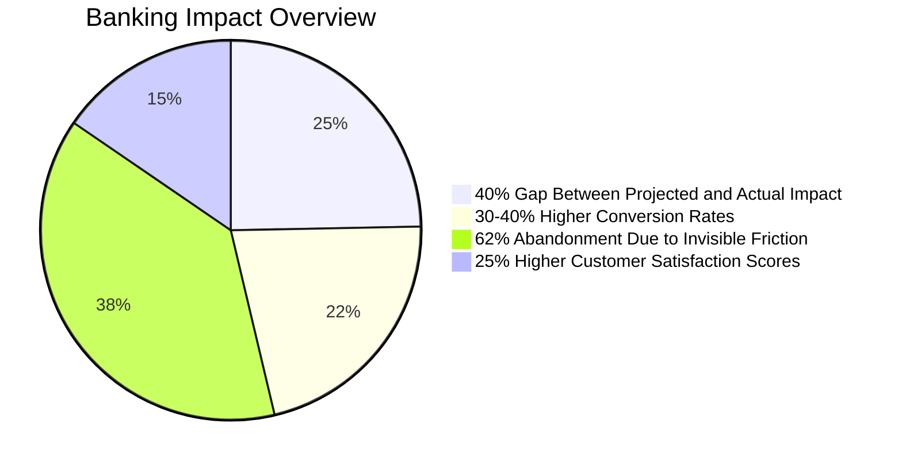
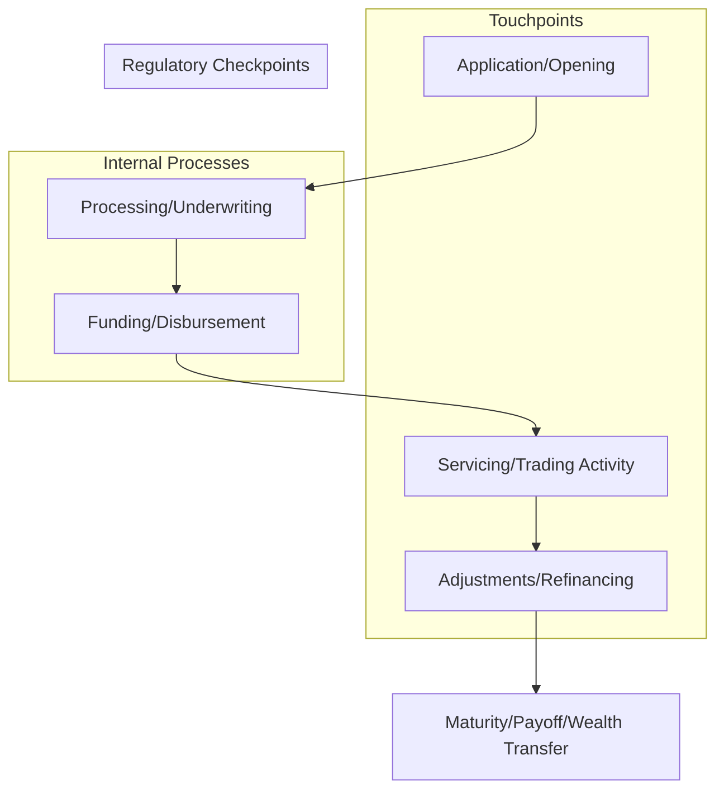
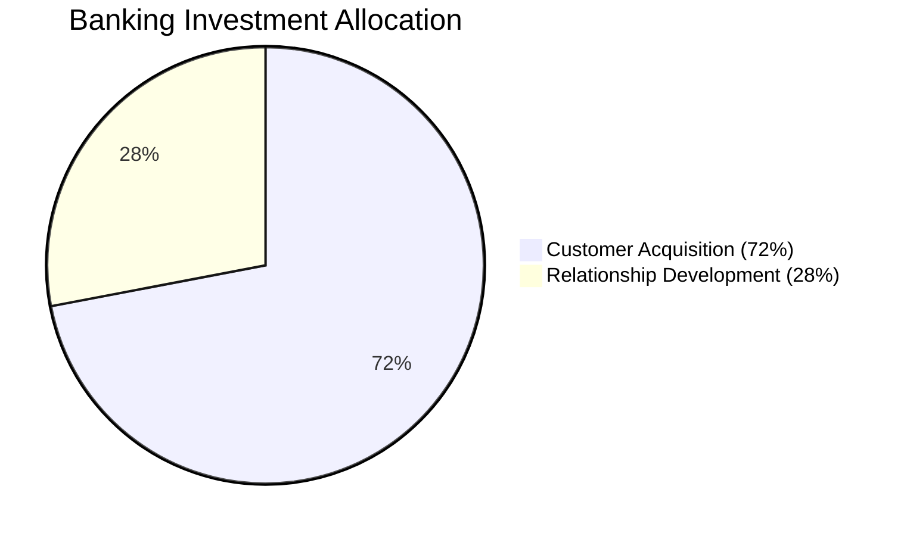
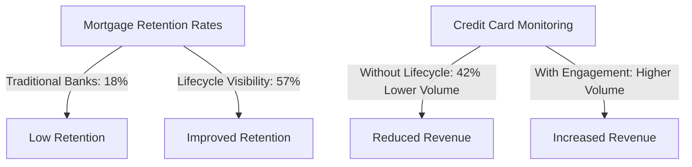
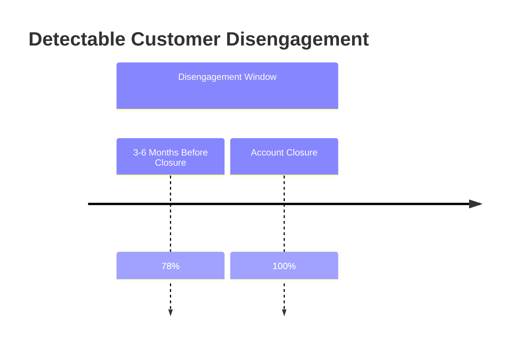
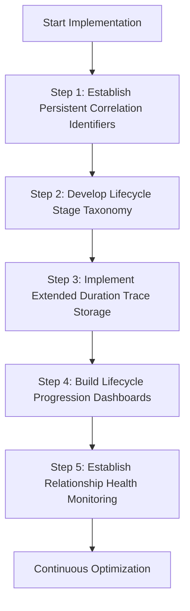
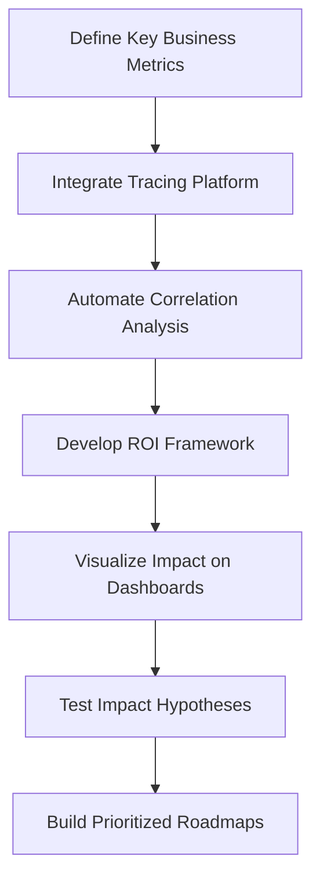
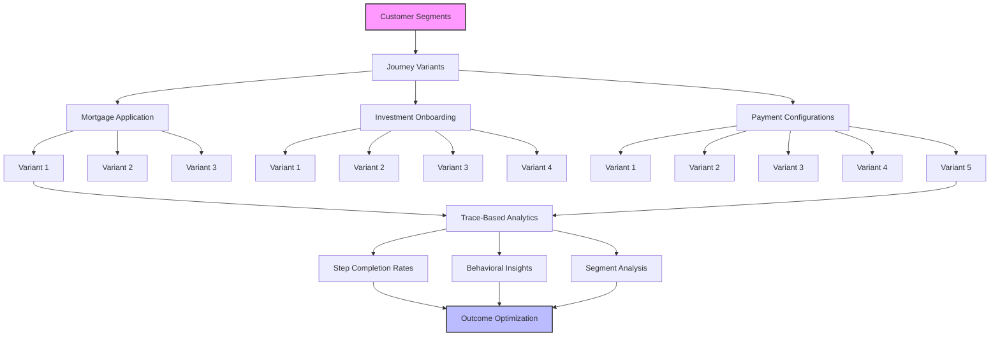
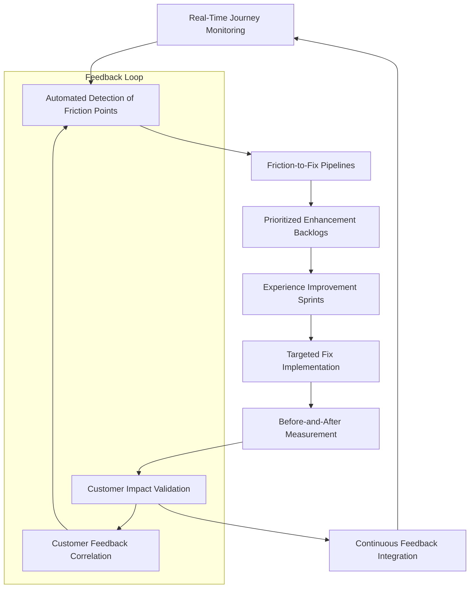

# Chapter 15: Business Transaction Tracing for Financial Products

## Chapter Overview

Welcome to the dark heart of SRE for banking: the art (and agony) of actually tracing business transactions, not just packets and microservices. If you thought distributed tracing was a technical flex, wait until the CFO asks why your “blazing fast” API didn’t budge application completion rates or revenue. This chapter rips off the technical blinders and exposes what really matters—mapping every click, signature, and phone call through the labyrinthine world of financial products, all the way from “please upload your passport” to “congrats, here’s your loan... and our sales pitch for a wealth portfolio.”

This isn’t your typical tracing fairy tale. Here, we force engineers and business folks into the same (occasionally padded) room and make them look at the same data—just from different, mutually unintelligible perspectives. You’ll learn how to build tracing that translates between TCP/IP and EBITDA, how to spot multimillion-dollar mistakes hiding behind pretty latency graphs, and why “single pane of glass” is a myth unless your glass includes business context. Bring your skepticism, your scars, and your best “I told you so” face—because this is where SRE finally meets the bottom line.

______________________________________________________________________

## Learning Objectives

- **Map** technical traces to business transactions, so your optimizations actually matter to the people who fund your salaries.
- **Implement** business-context enrichment in your tracing, making your dashboards intelligible to non-engineers (and useful to yourself).
- **Correlate** technical metrics with real business outcomes—think revenue, not just response time.
- **Diagnose** invisible friction points across entire product journeys, not just isolated endpoints.
- **Unify** multi-channel, multi-system customer journeys into a coherent trace, even when your backend looks like Frankenstein’s monster.
- **Analyze** customer segments and personalize banking experiences based on real user behavior, not marketing personas.
- **Experiment** at the component level, isolating what actually moves the needle (because “version B is better” is for amateurs).
- **Establish** rapid feedback loops that turn real-time trace data into continuous improvement, not quarterly postmortems.

______________________________________________________________________

## Key Takeaways

- Business transaction tracing is not optional—without it, you’re optimizing for vanity metrics while bleeding revenue.
- Technical improvements that don’t move business metrics are just expensive science projects.
- If your tracing stops at the API, you’re blind to 80% of the ways customers actually get frustrated and leave.
- Most customer friction isn’t a “bug”—it’s a process kink invisible to pure tech monitoring.
- Want to waste millions? Optimize backend services while ignoring where customers actually abandon your process. (Spoiler: it happens early and often.)
- Omnichannel means omnichaos without cross-system correlation. Your “mobile is fine” mantra is worthless if the branch and call center can’t see what happened online.
- Aggregate metrics are a trap. Segment analysis is how you stop losing your most profitable customers while patting yourself on the back for “average” improvements.
- Black-box A/B testing breeds feature bloat and hidden regression. Trace the journey, not just the outcome.
- Quarterly release cycles are for dinosaurs. If your feedback loop isn’t continuous, you’re already losing to fintech upstarts.
- Evidence-based SRE means dollars, not just nines or milliseconds. If you can’t tie it to a business impact, don’t expect budget for your next “critical” refactor.
- Most “confusing process” complaints come from context lost at channel boundaries. If you’re not tracing the handoffs, you’re not seeing the real problem.
- The only thing worse than no observability is observability that tells the wrong story. Business context is the difference between “we’re fine” and “we’re bleeding out.”
- Build tracing that speaks both JSON and CFO. Anything less is just technical comfort food.

Welcome to the SRE endgame: tracing that gets you invited to the boardroom (and maybe even listened to).

______________________________________________________________________

## Panel 1: Beyond Technical Flows - The Business Transaction Perspective

### Scene Description

A digital banking strategy session unfolds in a collaborative workspace where product leaders and SRE teams are gathered around two prominently displayed screens. Both screens represent the same mortgage application process but from two dramatically distinct perspectives:

- **Left Screen:** A traditional technical trace visualization depicts service calls, API requests, and database operations. This view is dense with technical details—highly useful for engineers but opaque to business stakeholders.
- **Right Screen:** A business transaction view translates the same underlying data into a customer-centric journey. It highlights key stages like "application submission," "document verification," "underwriting," and "decision," paired with actionable business metrics such as completion rates, average times, and customer drop-off points.

Below is a conceptual representation of the two perspectives:

```
+----------------------------+   +----------------------------------------+
| Technical Trace View       |   | Business Transaction View              |
+----------------------------+   +----------------------------------------+
| Service Call A -> Service B|   | Application Submission: 90% complete  |
| API Request X -> Database Y|   | Document Verification: 70% complete   |
| Service Call C -> Service D|   | Underwriting: Avg time = 3 days       |
|                            |   | Decision: Drop-off rate = 15%         |
+----------------------------+   +----------------------------------------+
```

As the session progresses, a product executive excitedly points to the right screen, identifying clear friction points in the customer journey—critical insights that were entirely invisible in the technical view. Meanwhile, engineers demonstrate how they can seamlessly shift back to the technical trace on the left screen to pinpoint the root causes of these customer experience issues. This dynamic interaction showcases the power of dual-perspective visualization in bridging the gap between technical operations and business outcomes.

### Teaching Narrative

Business transaction tracing transforms distributed tracing from a technical troubleshooting tool to a strategic business capability by creating a shared visual language between technology and business teams. Traditional tracing approaches focus exclusively on technical operations—showing service calls, API requests, and infrastructure interactions that remain impenetrable to business stakeholders despite directly supporting critical customer journeys. This technical-only perspective creates a fundamental translation gap: business leaders cannot see how technical operations impact customer experiences, while engineers struggle to connect technical optimizations to business outcomes. Business transaction tracing addresses this gap by creating a dual-perspective capability—maintaining the technical detail engineers need while providing a parallel business view that translates technical operations into customer-meaningful stages and business-relevant metrics. This translation capability transforms cross-functional collaboration from frustrating miscommunication to shared understanding based on common visibility. For financial institutions where digital experience directly drives business outcomes, this shared perspective ensures technology and product teams can work from identical data while viewing it through the lens most meaningful to their respective responsibilities. Product leaders can identify friction points in customer journeys, recognize where abandonment occurs, understand processing bottlenecks in business terms, and prioritize improvements based on customer impact rather than technical metrics—all while maintaining perfect alignment with the engineering teams who must implement these improvements. This unified approach ultimately accelerates digital transformation by eliminating the traditional disconnect between customer experience design and technical implementation, ensuring both perspectives remain perfectly synchronized through a common observability foundation that speaks both technical and business languages fluently.

### Common Example of the Problem

A major retail bank recently invested $3 million in optimizing their digital account opening platform, focusing on technical improvements identified by engineering teams: database query optimization, API response time reduction, and microservice refactoring. Post-implementation metrics showed impressive technical improvements—API latency reduced by 65%, database efficiency improved by 40%, and overall system resource utilization decreased significantly. However, business metrics revealed a disturbing disconnect: account opening completion rates improved by only 2%, far below the projected 15% increase, and customer satisfaction scores for the process remained virtually unchanged.

The issue stemmed from a misalignment between technical optimizations and customer experience priorities. Engineers had focused on backend services that processed already-submitted applications, while the actual abandonment occurred during the initial document upload phase due to confusing instructions and slow upload confirmations. Without a business transaction context overlaid on their technical traces, the engineering teams had invested millions optimizing the wrong components from a customer experience perspective, despite achieving their technical performance targets.

| **Technical Improvements** | **Business Outcomes** |
| ----------------------------------- | ----------------------------------------------------------------------------- |
| API latency reduced by 65% | Account opening completion rates improved by only 2% |
| Database efficiency improved by 40% | Customer satisfaction scores for account opening remained virtually unchanged |
| System resource utilization reduced | High abandonment during document upload phase due to confusing instructions |

This example highlights how a lack of shared visibility between technical and business perspectives can lead to costly missteps. By integrating business transaction tracing, teams could have identified the document upload phase as the primary friction point, aligning technical efforts directly with customer-impacting outcomes.

### SRE Best Practice: Evidence-Based Investigation

SRE teams must implement business transaction tracing that maps technical operations to customer-meaningful journeys, creating a common observability language across business and technical domains. This approach requires extending traditional distributed tracing beyond technical spans to include business context layers that transform technical operations into recognizable customer process steps. Evidence-based investigation starts with trace augmentation—enriching technical spans with business attributes like transaction type, customer segment, process stage, and expected business outcomes. These enriched traces enable multidimensional analysis that connects technical behavior directly to business impact.

Rather than investigating incidents through purely technical dimensions, SREs should consistently overlay business context on trace data—analyzing completion rates by journey stage, identifying drop-off points in customer processes, comparing performance across different transaction types, and correlating technical metrics with business outcomes. This evidence-based approach transforms troubleshooting from technical problem-solving disconnected from business reality to targeted improvement of specific customer journeys. By implementing business-aware observability that spans organizational boundaries, SREs create a shared understanding that aligns technical operations directly with customer experiences and business results.

#### Checklist for Implementing Evidence-Based Investigation

To apply evidence-based investigation effectively, SREs can follow this actionable checklist:

1. **Trace Augmentation**

   - Enrich distributed traces with business-relevant attributes:
     - Include transaction type (e.g., "mortgage application," "credit card payment").
     - Add customer segment metadata (e.g., "first-time applicant," "returning customer").
     - Capture process stage (e.g., "submission," "underwriting," "approval").
     - Attach expected business outcomes or SLAs for each stage.

2. **Overlay Business Context**

   - Combine technical spans with business context for analysis:
     - Map trace data to customer journey stages.
     - Identify metrics like completion rates, average duration, and abandonment rates.
     - Highlight key drop-off points or delays in the process.

3. **Perform Multidimensional Analysis**

   - Investigate issues using both technical and business perspectives:
     - Correlate error rates or latency spikes with affected customer stages.
     - Compare performance metrics across different transaction types or segments.
     - Analyze how technical behaviors (e.g., retries, timeouts) impact business KPIs.

4. **Collaborate Across Teams**

   - Use shared visualizations to align investigations:
     - Present friction points in customer journeys to product teams.
     - Share technical root causes and their business implications with stakeholders.
     - Prioritize improvements based on customer impact rather than purely technical metrics.

5. **Iterate and Refine**

   - Continuously improve the observability framework:
     - Expand trace augmentation to cover additional business attributes.
     - Incorporate feedback from both technical and business teams.
     - Regularly validate metrics and mappings against real-world outcomes.

By applying this checklist, SRE teams ensure that their investigations remain tightly aligned with business priorities, bridging the gap between technical troubleshooting and customer-centric decision-making.

### Banking Impact

The business consequences of maintaining purely technical observability extend far beyond inefficient optimization. When engineering teams lack business transaction context, digital transformation initiatives consistently underdeliver despite meeting technical requirements—a pattern that ultimately costs the banking industry billions in wasted investment annually. Average digital banking projects experience a 40% gap between projected and actual business impact, primarily because technical improvements fail to address actual customer friction points.

For specific banking processes like mortgage applications, loan origination, account opening, and wealth management onboarding, the business impact is direct and measurable. Banks with business-contextual observability consistently achieve:

- **30-40% higher conversion rates** for complex financial journeys.
- **25% higher customer satisfaction scores** compared to competitors relying solely on technical monitoring.

Critically, the absence of business transaction visibility often leads to invisible friction points that silently erode completion rates. Research shows that:

- **62% of abandoned banking applications** occur at steps where technical metrics appear normal but business context would reveal usability issues.
- Each abandoned mortgage application represents **$2,500-$5,000 in lost revenue**.
- Each incomplete wealth management onboarding represents **$10,000+ in lifetime value** lost.

#### Summary of Key Statistics



Invisible friction points create substantial revenue leakage that traditional technical monitoring cannot detect. By adopting business-contextual observability, financial institutions can bridge this gap, unlocking measurable improvements in conversion rates, customer satisfaction, and revenue retention.

### Implementation Guidance

1. Implement a business transaction metamodel that defines how your organization conceptualizes customer journeys—identifying standard journey stages, success metrics, and business attributes that should consistently appear in trace data regardless of the specific transaction type.

2. Extend your distributed tracing instrumentation to include business context attributes, using specialized middleware or instrumentation libraries that automatically enrich spans with customer journey stages, transaction types, customer segments, and business metrics.

3. Develop dual-visualization dashboards that allow seamless toggling between technical and business views of the same underlying trace data, with the business view using language and metrics immediately comprehensible to non-technical stakeholders.

4. Create automated trace classification systems that recognize pattern signatures for common customer journeys like loan applications, account opening, or payment processing—enabling systematic analysis of completion rates, bottlenecks, and friction points across business process stages.

5. Establish cross-functional observability ceremonies that gather engineering, product, and business teams around shared business transaction visualizations—using the common visual language to jointly identify improvement opportunities, prioritize enhancements, and measure success through both technical and business lenses.

## Panel 2: Financial Product Journey Mapping - From Application to Maturity

### Scene Description

A product lifecycle workshop where banking strategists and technology leaders are analyzing complete product lifecycles through trace-based journey mapping. Wall-sized displays show end-to-end visualizations of financial products across their entire lifespan, showcasing key stages such as:

- **Mortgage**: Application → Closing → Servicing → Refinancing → Payoff
- **Investment Account**: Opening → Funding → Trading Activity → Portfolio Adjustments → Wealth Transfer
- **Commercial Loan**: Initial Discussion → Underwriting → Disbursement → Covenant Monitoring → Maturity

Each visualization integrates:

1. **Customer Touchpoints**: Interactions customers have throughout the lifecycle.
2. **Internal Processing**: Backend operations supporting the product.
3. **Regulatory Checkpoints**: Compliance and risk management milestones.
4. **Periodic Servicing Activities**: Maintenance and ongoing support actions.

Below is a conceptual representation of how financial product journeys are mapped:



During the workshop, product managers identify critical lifecycle stages that shape long-term customer relationships, while engineers demonstrate how their distributed tracing platform connects hundreds of individual technical transactions into coherent, long-duration business contexts. This enables participants to see how customer experience evolves over months or years, uncovering opportunities to improve satisfaction and retention at specific lifecycle moments.

### Teaching Narrative

Financial product journey mapping extends distributed tracing from isolated transactions to comprehensive product lifecycles essential for understanding complete customer relationships. Traditional tracing approaches focus on individual technical transactions—capturing payment processing, account inquiries, or application submissions as disconnected events without the broader context of the customer relationships and financial products they support. This transaction-focused approach creates a fundamental visibility gap: financial products and customer relationships exist over months, years, or decades, spanning hundreds of individual transactions that collectively create the actual customer experience. Lifecycle-aware business tracing addresses this limitation by connecting related transactions into coherent product journeys spanning the entire customer relationship—from initial application through ongoing servicing to eventual closure or maturity. This extended perspective transforms product understanding from fragmented transactions to comprehensive journeys aligned with how customers actually experience financial relationships. For banking leaders focused on relationship development rather than just transaction processing, this capability provides unprecedented visibility into how products actually perform across their entire lifespan rather than just during initial acquisition. Product teams can identify which specific stages most directly impact long-term customer satisfaction and retention, recognize patterns in relationship development across different customer segments, understand where friction in early stages affects lifetime product performance, and design targeted interventions at the specific lifecycle points with greatest relationship impact. This comprehensive approach ultimately improves both product design and customer experience by ensuring financial institutions understand complete relationship journeys rather than just isolated transactions, creating products optimized for lifetime customer value rather than just initial acquisition metrics.

### Common Example of the Problem

A regional bank launched a comprehensive digital wealth management platform focused on attracting millennials with lower initial investment requirements than traditional wealth services. The initial onboarding process was extensively tested and optimized, resulting in strong early metrics—account creation completion rates reached 78%, initial funding success hit 82%, and first-month retention appeared strong at 91%.

Six months after launch, however, the program was struggling with alarming trends:

| Metric | Initial Performance | Six-Month Performance | Key Insights |
| -------------------------------- | ------------------- | --------------------- | ------------------------------------------ |
| Account Creation Completion Rate | 78% | N/A | Strong early onboarding performance. |
| Initial Funding Success | 82% | N/A | Customers successfully started accounts. |
| First-Month Retention | 91% | N/A | Early retention was promising. |
| Minimal Activity Post-Onboarding | N/A | 68% | Majority of users had limited engagement. |
| Minimum Balance Maintenance Only | N/A | 47% | Many users only held the required balance. |
| Recurring Deposit Establishment | N/A | 3% | Poor adoption of recurring deposits. |

The investigation revealed a critical visibility gap—all observability had focused on the initial onboarding transaction without extending to the complete product lifecycle. When the team implemented long-duration journey tracing, they identified several hidden issues:

- **Lifecycle Progression Gaps**: Most customers never advanced beyond the basic investment stage due to lack of guidance after onboarding.
- **Technical Barriers**: The portfolio review process displayed significant technical errors, making it unusable on mobile devices (where 76% of millennial customers attempted to access it).
- **Complexity in Goal Setting**: The goal-setting functionality had an abandon rate of 94% due to its complexity.

These critical lifecycle issues, invisible to monitoring focused solely on initial transactions, ultimately determined the actual business success of the entire product offering. By addressing these gaps through lifecycle-aware journey tracing, the bank could identify and resolve these friction points, improving engagement and long-term customer satisfaction.

### SRE Best Practice: Evidence-Based Investigation

SRE teams must implement long-duration trace correlation that connects isolated technical transactions into coherent financial product lifecycles, creating visibility spanning the complete customer relationship. This approach requires extending distributed tracing beyond individual requests to maintain persistent context across multiple customer interactions over extended timeframes. Evidence-based lifecycle investigation starts with relationship identifiers—implementing consistent correlation mechanisms like customer identifiers, account references, and product journey stages that span individual transactions to create a unified view of the complete product experience.

#### Implementation Checklist for Long-Duration Trace Correlation:

1. **Define Correlation Identifiers**:

   - Use globally unique keys such as `CustomerID`, `AccountID`, or `ProductJourneyID`.
   - Ensure identifiers are consistently propagated across all systems involved in the transaction lifecycle.

2. **Establish Persistent Context**:

   - Implement mechanisms to persist lifecycle context across sessions, such as attaching metadata to trace headers or leveraging distributed context propagation frameworks (e.g., OpenTelemetry).
   - Use a time-to-live (TTL) strategy to manage the lifecycle of trace contexts appropriately.

3. **Capture Product Lifecycle Milestones**:

   - Instrument critical touchpoints such as application submission, underwriting, servicing events, and maturity.
   - Annotate traces with specific lifecycle stages to enable milestone-based tracking.

4. **Enable Cross-System Trace Aggregation**:

   - Configure distributed tracing tools to aggregate traces across microservices, databases, and external APIs.
   - Use span linking to correlate individual technical transactions with broader lifecycle events.

5. **Monitor Lifecycle Patterns**:

   - Track progression through lifecycle stages and identify anomalies such as abandonment or dormancy.
   - Correlate early-stage behaviors (e.g., delayed onboarding) with long-term outcomes (e.g., customer retention or churn).

6. **Validate and Iterate**:

   - Regularly review trace data to ensure lifecycle visibility remains accurate and actionable.
   - Incorporate feedback loops to refine correlation mechanisms based on observed gaps or customer feedback.

#### Example Code Snippet: Trace Context Propagation with OpenTelemetry

```python
from opentelemetry import trace
from opentelemetry.sdk.trace import TracerProvider
from opentelemetry.sdk.trace.export import BatchSpanProcessor, ConsoleSpanExporter

# Initialize TracerProvider
trace.set_tracer_provider(TracerProvider())
tracer = trace.get_tracer(__name__)

# Add a span processor and exporter
span_processor = BatchSpanProcessor(ConsoleSpanExporter())
trace.get_tracer_provider().add_span_processor(span_processor)

# Example of creating a trace with persistent lifecycle context
with tracer.start_as_current_span("ProductJourneyStage") as span:
    # Set lifecycle-specific attributes
    span.set_attribute("CustomerID", "12345")
    span.set_attribute("AccountID", "67890")
    span.set_attribute("LifecycleStage", "Underwriting")
    span.set_attribute("Timestamp", "2023-10-16T10:00:00Z")

    # Simulate a downstream transaction
    with tracer.start_as_current_span("DatabaseQuery") as child_span:
        child_span.set_attribute("QueryType", "SELECT")
        child_span.set_attribute("Table", "LoanApplications")
```

By implementing the above checklist and leveraging tools like OpenTelemetry, SREs can transform product monitoring from disconnected transaction snapshots to comprehensive relationship visibility. Persistent journey contexts enable teams to align technical operations with the actual long-term customer experience, driving better product outcomes and customer satisfaction.

### Banking Impact

The business consequences of transaction-limited visibility extend beyond immediate operational issues to fundamentally undermine relationship banking strategies. Financial institutions lose an estimated $215 billion annually in unrealized customer lifetime value due to focusing optimization efforts exclusively on acquisition transactions while neglecting the subsequent relationship stages that determine long-term profitability.

#### Key Statistics Highlighting the Impact



- **Investment Mismatch**: Research shows that 72% of digital banking investment targets customer acquisition while only 28% supports relationship development, despite acquisition representing just 21% of potential lifetime profit.

#### Product-Specific Business Impacts



- **Mortgage Servicing**: Retention rates average just 18% at traditional banks, compared to 57% at institutions with lifecycle journey visibility.
- **Credit Cards**: Products without lifecycle monitoring show 42% lower average transaction volume compared to cards with active engagement monitoring and intervention.

#### The Hidden Cost of Relationship Degradation



- **Invisible Relationship Deterioration**: Research indicates that 78% of banking customers who ultimately close accounts show detectable disengagement patterns 3-6 months before closing, but these patterns remain invisible to transaction-limited monitoring approaches.

#### Financial Implications

- **Acquisition Costs**: The cost for acquiring new banking relationships averages $300-$1,500 depending on the product type.
- **Lifetime Value**: The potential lifetime value of a customer is 4-7 times the initial acquisition cost.
- **Revenue Loss**: Without lifecycle visibility, the inability to detect and address early disengagement results in substantial lost revenue and diminished long-term profitability.

### Implementation Guidance

#### Step-by-Step Workflow for Implementing Lifecycle Tracing

A structured approach ensures successful implementation of lifecycle-aware business tracing, connecting fragmented transactions into comprehensive product journeys. Follow these steps:



1. **Establish Persistent Correlation Identifiers**\
   Implement unique, consistent identifiers that span individual transactions. Use customer IDs, account references, and relationship markers to seamlessly connect discrete interactions into coherent lifecycle journeys. Ensure these identifiers maintain context across extended timeframes such as weeks, months, or years.

2. **Develop Lifecycle Stage Taxonomy**\
   Define a standard taxonomy for each financial product type. This includes identifying the key stages of progression (e.g., application, funding, servicing, maturity), expected activities within each stage, and success metrics that align with relationship goals.

3. **Implement Extended Duration Trace Storage**\
   Design a tiered data strategy to support lifecycle analysis. Retain detailed transaction data for recent activities while summarizing journey markers and key progression indicators for long-term storage. This ensures traceability across the entire customer relationship lifespan without overwhelming storage resources.

4. **Build Lifecycle Progression Dashboards**\
   Create dashboards that visualize customer movement through lifecycle stages. Highlight key milestones, detect dormancy patterns, deviations from expected journeys, and early signals of friction points or relationship deterioration. Use these insights to inform proactive interventions.

5. **Establish Relationship Health Monitoring**\
   Develop automated monitoring to identify concerning patterns in customer lifecycle progression. Detect activity drop-offs, engagement reductions, or irregular usage trends. Use these indicators to predict potential relationship attrition and trigger timely remediation efforts.

6. **Continuous Optimization**\
   Regularly analyze lifecycle tracing data to refine products and processes. Identify specific lifecycle stages that impact long-term customer satisfaction, improve friction points, and design targeted interventions to maximize lifetime customer value.

By following this workflow, financial institutions can shift from fragmented transaction tracing to complete journey mapping, unlocking actionable insights into customer relationships and product lifecycles.

## Panel 3: Integrated Channel Experiences - The Omnichannel Banking Reality

### Scene Description

A customer experience optimization session where digital strategy and technology teams are analyzing omnichannel banking journeys through enhanced trace visualization. The screens display a complex wealth management transaction that spans multiple channels: initiated on a mobile app, continued through a web portal, advanced via phone call with a financial advisor, and completed through in-person signature at a branch location. Traditional monitoring would show these as disconnected events, but their enhanced business tracing capability visualizes the complete cross-channel journey with clear handoff points between interaction methods. The visualization highlights friction in channel transitions—showing exactly where context was lost between digital and human channels, creating customer frustration despite each individual channel functioning correctly. Engineers demonstrate how they've extended distributed tracing to maintain consistent business context across channel boundaries by implementing specialized correlation mechanisms that bridge the gaps between digital interactions, call center platforms, and branch systems despite their radically different technical architectures.

#### Customer Journey Flow

Below is a simplified text diagram illustrating the customer journey across channels, highlighting transition points and potential friction areas:

```plaintext
Mobile App (Start Transaction)
   │
   ▼
Web Portal (Continue Transaction)
   │
   ▼
Call Center (Financial Advisor Assistance)
   │
   ▼
Branch Location (Complete with In-Person Signature)
```

Key Transition Points:

1. **Mobile App → Web Portal**: Potential for context loss if session data is not synchronized.
2. **Web Portal → Call Center**: Risk of customer frustration if the advisor lacks visibility into prior digital interactions.
3. **Call Center → Branch Location**: Finalization delays if in-person staff are unaware of earlier interactions or decisions.

This flow emphasizes the importance of seamless context transfer across channels to minimize friction and ensure a smooth customer experience throughout complex financial transactions.

### Teaching Narrative

Integrated channel tracing transforms omnichannel visibility from disconnected monitoring to seamless journey tracking essential for modern banking experiences. Traditional observability approaches monitor channels independently—measuring mobile app performance, website functionality, call center operations, and branch activities as separate domains despite customers flowing freely between these interaction methods during complex financial journeys. This channel-centric perspective creates dangerous blind spots precisely at the transition points between channels—the handoffs where context and customer information is most frequently lost despite being critical to satisfaction with complex financial services. Cross-channel business tracing addresses this fragmentation by implementing specialized correlation capabilities that maintain consistent business context regardless of how customers choose to interact—creating continuous visibility across channel boundaries despite the technical challenges of connecting these often siloed systems. This integrated perspective transforms experience management from optimizing individual channels in isolation to understanding and improving the complete customer journey across all interaction methods. For financial institutions where complex products like wealth management, mortgage lending, or business banking inherently span multiple channels, this capability provides crucial visibility into the actual customer experience rather than just isolated interactions within individual channels. Experience designers can identify precisely where handoffs between digital and human channels create friction, understand how context loss during transitions affects customer satisfaction, recognize which channels customers prefer for different activities, and design more seamless transitions between interaction methods based on actual customer behavior patterns. This integrated approach ultimately improves overall customer experience by ensuring financial institutions understand and optimize complete journeys rather than just individual channel interactions, eliminating the disconnects that frequently frustrate customers during complex financial product interactions that naturally span multiple touchpoints.

### Common Example of the Problem

A national bank recently invested $12 million in upgrading its mortgage application platform, creating state-of-the-art experiences within each channel: a streamlined mobile app for initial applications, an advanced web portal for document uploads, a redesigned call center experience for consultations, and updated branch procedures for closings. Despite these improvements, customer satisfaction scores for mortgage applications declined by 8 points after implementation, and completion rates dropped from 62% to 56%.

The investigation revealed that while each individual channel functioned effectively in isolation, the cross-channel handoffs created significant friction. Customer data captured in the mobile application wasn't properly transferred to the web portal, requiring customers to re-enter information they'd already provided. Call center representatives couldn't see document upload status from the digital channels, providing incorrect guidance that contradicted what customers had already completed online. Branch officers had no visibility into discussions with call center advisors, forcing customers to repeat explanations about their financial situations.

When the bank implemented cross-channel tracing, they discovered that 74% of mortgage applications involved at least two different channels, with 42% spanning three or more. However, their existing channel-specific monitoring provided no visibility into these transitions, which ultimately determined the overall customer experience despite excellent performance metrics within each isolated channel.

#### Key Metrics Before and After Cross-Channel Tracing Implementation

| Metric | Before Cross-Channel Tracing | After Cross-Channel Tracing | Improvement |
| ---------------------------------------- | ---------------------------- | --------------------------- | ----------- |
| Customer Satisfaction Score (out of 100) | 72 | 80 | +8 |
| Completion Rate (%) | 56 | 68 | +12 |
| Multi-Channel Journeys (%) | 74 | 74 | No change |
| Journeys with Friction Identified (%) | 0 | 92 | +92 |
| Average Time to Completion (days) | 35 | 28 | -7 |

The table above illustrates how cross-channel tracing transformed the bank's visibility into customer journeys, enabling them to identify and address the root causes of friction at channel handoff points. By correlating customer data across systems, the bank reduced redundant interactions, improved context continuity, and optimized transitions between channels. This resulted in higher satisfaction scores, better completion rates, and faster processing times for mortgage applications, demonstrating the value of integrated omnichannel visibility.

### SRE Best Practice: Evidence-Based Investigation

SRE teams play a critical role in implementing cross-channel context propagation to maintain consistent business context as customers transition between interaction methods. This ensures seamless visibility regardless of how customers engage with the system. Achieving this requires extending distributed tracing beyond digital-only workflows, incorporating correlation mechanisms that bridge technical gaps between online services, call center platforms, branch systems, and partner touchpoints.

Evidence-based omnichannel investigation begins with unified customer journey identifiers—leveraging consistent correlation tokens that persist across channel boundaries to maintain context continuity despite transitions between disparate technology stacks. This enables a holistic view of the customer journey, critical for identifying and addressing friction points.

To guide implementation, SRE teams can follow this actionable checklist:

#### Checklist: Implementing Cross-Channel Context Propagation

1. **Define Unified Identifiers**: Establish a consistent customer journey identifier that persists across all channels (e.g., mobile app, web portal, call center, branch systems).
2. **Extend Distributed Tracing**: Expand tracing capabilities to include non-digital workflows and integrate correlation mechanisms across all interaction methods.
3. **Enable Context Propagation**: Implement mechanisms to propagate identifiers and key information seamlessly across all systems and communication layers.
4. **Monitor Channel Transitions**: Track and measure handoff effectiveness during channel transitions, identifying where context is lost or degraded.
5. **Correlate Metrics**: Link customer journey data with satisfaction and completion metrics to identify patterns and areas for improvement.
6. **Analyze Context Loss**: Investigate where and how information is lost during transitions, focusing on both technical and operational gaps.
7. **Iterate on Observability**: Continuously refine observability tools to improve context tracking and ensure robust end-to-end visibility.
8. **Collaborate Across Teams**: Work with digital strategy, product, and customer experience teams to validate that tracing outputs align with real-world customer behavior.

By following these steps, SREs can implement boundary-spanning observability that transitions from channel-specific monitoring to comprehensive journey visibility. This evidence-based approach measures context preservation during transitions, enables the identification of friction points, and correlates channel-switching behavior with customer satisfaction metrics. Ultimately, seamless context propagation across technical boundaries empowers financial institutions to align monitoring practices with how customers actually interact across multiple channels, elevating the overall banking experience.

### Banking Impact

The business consequences of fragmented channel monitoring resemble a poorly executed relay race. Imagine a team of runners, each individually fast and well-trained, but repeatedly dropping the baton during handoffs. No matter how strong the individual runners are, the race is lost if the transitions fail. Similarly, in banking, even when individual channels—like mobile apps, web portals, call centers, and branches—perform optimally, poor handoffs between these channels lead to significant business losses.

Financial institutions lose an estimated $5.6 billion annually due to abandoned transactions and unnecessary service costs caused by inadequate channel transitions, despite heavy investments in optimizing each channel independently. Research highlights that 67% of complex banking transactions involve multiple channels, yet most organizations lack visibility into these cross-channel journeys that ultimately determine customer satisfaction and transaction success.

For instance, mortgage applications with channel transitions experience 2.3 times higher abandonment rates compared to single-channel experiences, resulting in millions of dollars in lost revenue. Similarly, investment account opening processes incur 48% higher service costs when customers are forced to switch channels, often due to redundant assisted service requirements caused by context loss. These operational inefficiencies are compounded by invisible experience gaps: studies reveal that 83% of customer complaints about "confusing processes" or "having to repeat information" are directly tied to channel transitions that appear seamless in channel-specific monitoring systems.

Each dropped "baton" in this relay race has measurable costs. An abandoned mortgage application represents $2,500-$5,000 in lost revenue, while redundant assisted service interactions cost $18-$75 depending on the channel. Without cross-channel visibility, financial institutions remain blind to these transition failures, leaving substantial revenue on the table and frustrating customers during their most critical financial journeys.

### Implementation Guidance

1. **Implement Channel-Spanning Correlation Tokens**\
   Use a consistent journey identifier to link interactions across all channels. These identifiers should be embedded in URLs, API calls, customer communications, call center systems, and branch platforms to maintain unbroken context as customers transition between channels. Below is an example pseudocode for generating and propagating correlation tokens:

   ```python
   import uuid
   import datetime

   # Generate a unique correlation token
   def generate_correlation_token():
       token = {
           "journey_id": str(uuid.uuid4()),
           "timestamp": datetime.datetime.utcnow().isoformat(),
           "source_channel": "mobile_app"  # Example source channel
       }
       return token

   # Example usage: Embed the token in an API request
   def embed_token_in_request(request, token):
       request.headers["X-Correlation-Token"] = token["journey_id"]
       request.headers["X-Correlation-Timestamp"] = token["timestamp"]
       request.headers["X-Source-Channel"] = token["source_channel"]

   # Generate and propagate token
   correlation_token = generate_correlation_token()
   api_request = {}  # Placeholder for a request object
   embed_token_in_request(api_request, correlation_token)
   ```

2. **Develop a Unified Customer Context Store**\
   Maintain a centralized repository that stores the current transaction state, previously provided information, and next expected actions. This context store should be accessible across all interaction methods to prevent repetitive information requests or contradictory guidance. Use APIs to synchronize this data in real time across systems.

3. **Create Cross-Channel Handoff Visualizations**\
   Build visualizations that highlight transition points in customer journeys. These should display details such as:

   - Context preservation success.
   - Quality of information transfer.
   - Customer behavior during transitions.

   Example of a flowchart representation for visualizing a common handoff:

   ```plaintext
   [Mobile App] --> [Web Portal]
   [Web Portal] --> [Call Center]
   [Call Center] --> [Branch]
   ```

4. **Build Channel-Switching Pattern Analytics**\
   Implement analytics tools to identify common channel transition patterns. Measure:

   - Frequency of different channel combinations.
   - Transition impacts on completion rates.
   - High-friction handoff types.

   Example pseudocode for analyzing channel-switching patterns:

   ```python
   from collections import Counter

   # Sample journey data
   journeys = [
       ["mobile_app", "web_portal", "call_center"],
       ["web_portal", "branch"],
       ["mobile_app", "call_center", "branch"]
   ]

   # Count channel transition sequences
   transition_counter = Counter()
   for journey in journeys:
       transitions = zip(journey, journey[1:])
       for transition in transitions:
           transition_counter[transition] += 1

   # Print transition patterns and their frequencies
   for transition, count in transition_counter.items():
       print(f"Transition {transition} occurred {count} times")
   ```

5. **Establish Specialized Monitoring for Human-Digital Transitions**\
   Instrument call center platforms, branch systems, and advisor tools with custom monitoring capabilities to bridge the gap between human-assisted and digital channels. Ensure these systems capture and propagate the same journey context available in digital channels. For example, include the correlation token in call center session logs and advisor tools to ensure traceability.

   Example of an ASCII flow diagram for human-digital transitions:

   ```plaintext
   [Mobile App] --> [Call Center (Token: 12345)]
   [Call Center] --> [Branch (Token: 12345)]
   ```

   These monitoring tools should provide insights into how effectively context is preserved and identify areas for improvement in human-digital interaction workflows.

## Panel 4: Business Impact Correlation - Connecting Technical Performance to Financial Results

### Scene Description

An executive strategy session where senior leadership is reviewing a new business intelligence capability built on their distributed tracing platform. The central display showcases a comprehensive correlation analysis between technical performance metrics and business outcomes across multiple dimensions. Below is a text diagram summarizing these relationships:

```
Technical Metric                      →  Business Outcome
----------------------------------------------------------
Mobile App Response Time              →  Application Completion Rate
  - 100ms improvement                 →  +2.7% completion rate
                                      →  ~$4.2M annual loan volume
----------------------------------------------------------
Payment Processing Reliability        →  Customer Retention
----------------------------------------------------------
Investment Platform Load Time         →  Trading Volume & Revenue
  - 1 second reduction                →  ~$830K annual commissions
----------------------------------------------------------
Authentication Experience             →  Cross-Selling Success
```

The visualization quantifies these relationships precisely, such as how each 100ms of improvement in mortgage application response time correlates with a 2.7% increase in completion rate, representing approximately $4.2M in annual loan volume. Similarly, investment portfolio load time improvements directly correlate with trading activity, generating an estimated $830K in additional annual commissions per second reduced.

In response to these insights, the CFO is approving targeted performance investments based on this analysis, allocating resources specifically to the technical improvements demonstrating the highest business impact. This approach ensures the organization focuses on strategic improvements that connect technical optimization with measurable financial outcomes, rather than prioritizing technical metrics in isolation.

### Teaching Narrative

Business impact correlation transforms performance optimization from technical tuning to strategic investment by directly connecting system behavior to financial outcomes. Traditional performance approaches focus on technical metrics—response times, throughput, availability—without explicitly quantifying how these technical characteristics translate to business results. This disconnected approach creates a fundamental investment challenge: technology leaders struggle to justify performance initiatives without clear business cases, while business executives cannot effectively prioritize technical investments without understanding their specific financial impact. Impact-correlated business tracing addresses this gap by systematically analyzing the relationships between technical performance and business outcomes—quantifying exactly how system behavior affects customer conversion, transaction completion, revenue generation, and relationship development. This quantified approach transforms performance from a technical discipline to a business investment with measurable returns. For financial institutions where digital capabilities directly drive business results, this correlation ensures technology investments target the specific improvements with greatest business impact rather than pursuing technical excellence without clear financial justification. Executive leaders can make precise investment decisions based on measured business impact—determining exactly how much latency reduction is worth investing in for different banking functions, which reliability improvements would generate greatest revenue protection, how performance variations affect different customer segments, and which technical metrics most directly correlate with strategic business goals. This evidence-based approach ultimately improves both business performance and investment efficiency by ensuring technology resources focus on the specific improvements most directly connected to financial outcomes rather than technical metrics that may have limited or unclear business impact.

### Common Example of the Problem

A global investment bank recently completed a $15 million technical optimization initiative for their retail trading platform, focusing on general performance improvements across the entire system. Engineers delivered impressive technical results: overall platform latency reduced by 45%, API response times improved by 60%, and system throughput capacity increased by 300%. Despite these significant technical achievements, business results disappointed stakeholders—trading volume increased by only 4% against a projected 20% improvement, and active trader retention saw minimal change despite performance being a frequently cited concern in customer feedback.

Post-implementation analysis through business impact correlation revealed the fundamental disconnect: the engineering team had applied uniform optimization across all platform functions, but business impact varied dramatically by specific operation. Portfolio balance display improvements showed negligible impact on trading behavior, while order confirmation latency had exponential effects on transaction completion—yet both received equal optimization investment. Market data refresh speed demonstrated direct correlation with trading frequency among active traders, but received minimal attention despite having 7x greater business impact than other optimized functions. Without business impact correlation, the bank had allocated millions in engineering resources based on technical considerations alone, missing the opportunity to target investments specifically toward the performance characteristics that actually drove trading behavior and revenue generation.

#### Summary Table: Technical Optimizations vs. Business Outcomes

| **Function** | **Optimization Focus** | **Improvement Achieved** | **Business Impact** | **Cost of Optimization** | **Observations** |
| -------------------------- | ------------------------- | ------------------------ | ----------------------------------------- | ------------------------ | -------------------------------------------------------------------------------------- |
| Portfolio Balance Display | Latency Reduction | 50% | Negligible impact on trading behavior | $3M | Received significant investment despite low correlation with revenue-driving actions. |
| Order Confirmation | Latency Reduction | 40% | High impact on transaction completion | $2M | Strong business impact but under-prioritized relative to less impactful optimizations. |
| Market Data Refresh Speed | Throughput Increase | 30% | Direct correlation with trading frequency | $500K | Demonstrated 7x greater business impact but received minimal investment. |
| General API Performance | Response Time Improvement | 60% | Limited impact on business outcomes | $5M | Improvements were broad but lacked a targeted focus on high-value operations. |
| System Throughput Capacity | Scalability Enhancement | 300% | No immediate effect on trading volume | $4.5M | Investment driven by technical goals without measurable near-term business benefit. |

This table highlights the misalignment between technical improvements and business outcomes, underscoring the importance of business impact correlation. By systematically analyzing the relationship between system behavior and financial results, the bank could have reallocated resources to the functions with the greatest potential to drive revenue and customer engagement.

### SRE Best Practice: Evidence-Based Investigation

SRE teams must implement systematic business impact correlation that quantifies the relationships between technical performance characteristics and business outcomes, creating an evidence-based foundation for investment prioritization. This approach requires extending observability beyond technical metrics to include continuous correlation analysis between system behavior and business results at a granular level. Evidence-based impact investigation starts with controlled experiments—implementing systematic A/B testing that varies specific technical characteristics while measuring resulting business metrics to establish causal relationships rather than just observing correlations.

Rather than assuming uniform value from technical improvements, SREs should implement differentiated value analysis—measuring the actual business impact of performance variations across different functions, transaction types, customer segments, and usage contexts to identify where technical investments generate the greatest returns. This evidence-based approach transforms performance optimization from technical excellence pursuits to ROI-driven investment targeting the specific improvements most directly affecting business outcomes. By implementing continuous correlation between technical characteristics and business results, SREs create an objective foundation for prioritization decisions that aligns engineering resources directly with financial impact rather than subjective technical preferences or uniform optimization approaches that ignore differing business value across functions.

#### Checklist: Implementing Evidence-Based Investigation

To apply evidence-based investigation effectively, follow these steps:

1. **Extend Observability**\
   Ensure your observability platform includes both technical metrics (e.g., latency, throughput) and business metrics (e.g., conversion rates, revenue impact).

2. **Identify Key Metrics**\
   Collaborate with business stakeholders to determine which business outcomes are most critical (e.g., customer retention, transaction completion) and align them with relevant technical metrics.

3. **Perform Controlled Experiments**\
   Use A/B testing or other experimental methods to vary specific technical variables (e.g., response time, system reliability) and measure the resulting impact on business metrics.

4. **Analyze Differentiated Value**\
   Break down results by function, transaction type, customer segment, and usage context to identify areas where technical improvements yield the highest business returns.

5. **Correlate Data Continuously**\
   Implement automated correlation analysis to monitor how technical performance impacts business outcomes over time, ensuring results remain relevant as system behavior and customer needs evolve.

6. **Quantify ROI**\
   Calculate the financial impact of specific technical changes (e.g., revenue generated per second of latency reduced) to prioritize investments based on measurable business value.

7. **Align Prioritization with Business Goals**\
   Use the quantified correlations to guide resource allocation and focus on areas where technical improvements deliver the greatest impact on strategic business objectives.

By following this checklist, SRE teams can transform technical performance optimization into a data-driven, ROI-focused discipline that directly supports business success.

### Banking Impact

The business consequences of disconnected technical optimization extend beyond immediate inefficiency to significant opportunity costs that affect competitive position and shareholder value. Financial institutions waste an estimated 40-60% of their performance optimization investments on improvements with minimal business impact, while simultaneously underinvesting in high-impact areas where technical performance directly drives revenue and customer retention. This misalignment represents billions in ineffective technology spending annually across the industry.

#### Misaligned Investment Flow and Opportunity Costs

To better visualize the inefficiencies and their financial implications, consider the following flow of misaligned investments and their resulting impacts:

```text
[Technical Investments] 
       |
       v
[No Impact Correlation Analysis]
       |
       |--> [Overinvestment in Low-Impact Areas]
       |          - General platform capacity
       |          - Administrative functions
       |          - Redundant optimizations
       |
       |--> [Underinvestment in High-Impact Areas]
                  - Payment processing UX moments
                  - Trading execution performance
                  - Business-critical functions
```

- Overinvestment in **low-impact areas** results in diminishing returns, where technical improvements contribute little to revenue, customer retention, or competitive differentiation.
- Underinvestment in **high-impact areas**, such as payment processing UX or trading execution, leads to missed opportunities for revenue growth and customer satisfaction, creating invisible value leakage.

#### Quantified Business Impact of Disconnect

For specific banking functions, the disconnect between technical optimization and business impact results in wasted investment and missed opportunity:

- **Payment Processing**: Institutions overspend on general platform capacity while underinvesting in targeted moments that directly affect transaction completion rates, leading to stalled revenue growth.
- **Wealth Management Platforms**: Banks often prioritize optimizations of administrative functions with minimal revenue impact while neglecting trading execution performance that drives commission revenue.
- **High-Impact Functions**: Research demonstrates that performance improvements in the top 10% of business-critical functions generate 4-7 times greater revenue impact than similar improvements in other areas. Without correlation analysis, these high-value opportunities remain hidden, draining potential ROI.

#### ROI Comparison of Targeted vs. Misaligned Investments

```text
[High-Impact Functions]
       |--> Targeted Investments
       |        ROI: 300-1200%
       |
       |--> Misaligned Investments
                ROI: 20-50%
```

The absence of impact correlation leads to substantial opportunity costs, as institutions fail to prioritize investments with the greatest potential returns. Properly targeted performance investments, guided by impact correlation analysis, ensure that resources focus on areas where technical improvements directly drive business outcomes, thereby maximizing shareholder value and competitive advantage.

### Implementation Guidance

To ensure effective adoption of business impact correlation practices, follow this step-by-step checklist:

#### Checklist for Implementation

1. **Set Up Continuous Correlation Analysis**

   - Establish automated systems that measure relationships between technical performance metrics and business outcomes.
   - Ensure analysis operates at granular levels, tracking function-specific and transaction-specific correlations.

2. **Develop a Technical Investment ROI Framework**

   - Create a standardized methodology to quantify the expected business impact of performance improvements.
   - Include calculations for projected returns from latency reductions, reliability enhancements, or capacity increases across key business functions.

3. **Build Business Impact Dashboards**

   - Design real-time visualizations that display correlations between technical performance and financial metrics.
   - Include key metrics such as conversion rates, transaction volumes, revenue generation, and customer retention.

4. **Implement Experimental Infrastructure**

   - Deploy controlled A/B testing systems to validate hypotheses about the impact of technical changes.
   - Systematically vary specific performance characteristics and measure resulting business outcomes to establish causal relationships.

5. **Prioritize with Impact-Driven Optimization Roadmaps**

   - Develop roadmaps that allocate engineering resources based on proven business value.
   - Sequence optimizations to target high-impact areas, prioritizing functions, transactions, and customer segments with the greatest financial returns.

#### Example Workflow



By following this structured approach, teams can systematically connect technical performance to financial results, ensuring that every optimization effort delivers measurable business value.

## Panel 5: Customer Segment Analysis - Personalized Banking Experiences Through Tracing

### Scene Description

A targeted experience optimization session where product teams are using segment-specific trace analysis to personalize banking services. Visualization screens display comparative journey analysis across distinct customer segments. Below is a summary table illustrating the behavioral differences and expectations across these segments:

| Customer Segment | Key Behavioral Insights | Unique Expectations |
| ------------------------- | ------------------------------------------------------------------------------------------------------------------------ | ----------------------------------------------------------------------------------------------- |
| High-Net-Worth Clients | - Abandon transactions 2x faster at authentication friction points<br>- Show patience with complex investment operations | - Seamless authentication processes<br>- High-quality support for investment-related activities |
| Retail Customers | - Moderate session frequency<br>- Tend to prefer straightforward, simplified workflows | - Reliable and simplified banking interfaces |
| Digital Natives | - 5x more frequent app interactions<br>- Shorter session durations | - Quick, intuitive interactions<br>- High responsiveness during peak usage |
| Traditional Banking Users | - Lower app interaction frequency<br>- Longer session durations | - Consistent, familiar experiences<br>- Clear guidance for feature usage |
| Small Business Owners | - Attempt complex operations outside normal business hours | - Flexible support availability<br>- Streamlined tools for business-specific tasks |
| Corporate Clients | - Perform high-value, detailed operations with lower frequency | - Robust, secure services for large-scale operations<br>- Dedicated support for corporate needs |

The trace data reveals striking differences in behavior and expectations across these segments. For example, wealthy clients abandon transactions twice as quickly at authentication friction points but show more patience during complex investment operations. Digital natives interact with banking apps five times more frequently than traditional users, but their sessions are shorter in duration. Meanwhile, business clients consistently attempt complex operations outside normal business hours when support resources are limited.

Product managers use these behavioral insights to define segment-specific experience optimizations, tailoring services to the needs of each group. Engineers demonstrate how their tracing platform automatically identifies customer segments based on behavioral patterns and adapts both technical performance measurement and business journey analysis to align with the specific expectations and behaviors of different user groups.

### Teaching Narrative

Segment-specific business tracing transforms customer experience optimization from one-size-fits-all approaches to personalized banking journeys based on behavioral patterns. Traditional experience analysis typically examines aggregate customer behavior across entire user populations—treating all customers as a homogeneous group despite dramatic differences in expectations, behaviors, and value across different segments. This generalized approach creates fundamental experience gaps: optimizations that improve journeys for some segments may actively harm experiences for others, while aggregate metrics often mask serious problems affecting high-value customer groups if they represent a small percentage of overall users. Segment-aware business tracing addresses this limitation by analyzing journey patterns across distinct customer groups—revealing how different segments actually experience banking services and where their specific pain points and opportunities differ. This segmented perspective transforms experience design from generic optimization to targeted personalization aligned with segment-specific expectations and behaviors. For financial institutions where customer lifetime value may vary by orders of magnitude between segments, this precision ensures experience investments focus on the specific improvements most relevant to strategically important customer groups. Product teams can identify precisely where different segments encounter friction in banking journeys, how behavioral patterns and expectations vary across customer types, which features and functions different groups actually use versus ignore, and how technical performance sensitivity differs between segments with different expectations and financial relationships. This targeted approach ultimately improves both customer satisfaction and business efficiency by ensuring experience optimizations reflect the actual behavior patterns and expectations of specific customer segments rather than generic approaches that may not effectively serve any group's particular needs despite appearing adequate in aggregate metrics.

### Common Example of the Problem

A leading retail bank recently completed a comprehensive redesign of their digital banking platform, applying a standardized experience framework based on industry best practices and aggregate usability testing. While initial feedback appeared positive, with overall satisfaction scores increasing by 5 points and general task completion rates improving by 12%, a deeper segment-specific analysis revealed critical issues concealed within the aggregate metrics. The following breakdown highlights the key findings and their implications:

**Aggregate Metrics:**

- Overall satisfaction: +5 points
- General task completion: +12%

**Segment-Specific Insights:**

- **High-Value Customers (8% of users, 42% of profits):**

  - Satisfaction: ↓ 9 points
  - Active feature usage: ↓ 14%
  - Key Issue: Authentication redesign caused excessive friction, deviating from expectations for streamlined private banking experiences.
  - Key Issue: Advisor connection process removed immediate access, critical for real-time needs during market volatility.

- **Millennial Users:**

  - Engagement with wealth-building tools: ↓ 23%
  - Key Issue: Simplified financial management tools eliminated advanced features, misaligning with the needs of sophisticated users and strategic goals for long-term relationship growth.

**Root Causes (Revealed by Segment-Specific Trace Analysis):**

1. Authentication changes met general security standards but introduced friction for specific segments (e.g., wealthy clients).
2. Redesign prioritized average user preferences, neglecting critical needs of high-value customers (e.g., real-time advisor access).
3. Simplification of tools satisfied basic users but alienated advanced users requiring more robust functionality.

**Key Takeaway:**
Without segment-specific journey analysis, these targeted experience degradations remained hidden beneath generally positive aggregate metrics. This oversight created significant risks to the bank’s most profitable customer relationships, demonstrating the critical need for segment-aware optimization to avoid unintended harm while improving overall outcomes.

### SRE Best Practice: Evidence-Based Investigation

SRE teams play a critical role in enabling segment-aware journey analysis to uncover how different customer groups experience banking services. By moving beyond aggregate metrics, SREs can ensure that optimization efforts are tailored to the unique needs and behaviors of each customer segment. To make this approach actionable, here is a step-by-step guide to implementing evidence-based investigation for segment-specific experience optimization:

#### Step-by-Step Guide for Evidence-Based Segment Investigation

1. **Extend Observability with Automated Segmentation**

   - Implement mechanisms to classify traces automatically based on customer attributes, behavioral patterns, and relationship characteristics.
   - Ensure observability tools are configured to recognize segment-specific identifiers or metadata.

2. **Define Segment-Specific Performance Baselines**

   - Establish separate performance benchmarks for distinct customer segments (e.g., high-net-worth clients, digital natives, small business owners).
   - Use historical data to identify typical behavior patterns, expectations, and thresholds for each segment.

3. **Perform Comparative Journey Analysis**

   - Systematically measure how the same banking functions perform across different customer groups.
   - Identify variations in behavior, such as abandonment rates, usage intensity, and session durations.
   - Highlight friction points or pain areas unique to specific segments.

4. **Correlate Technical Metrics with Satisfaction and Business Outcomes**

   - Map technical performance data (e.g., latency, error rates) to satisfaction indicators and business KPIs for each segment.
   - Look for correlations between technical bottlenecks and negative customer experiences.

5. **Monitor Segment-Specific Abandonment Patterns**

   - Analyze where and why different customer groups abandon banking journeys.
   - Pay special attention to high-value segments and critical touchpoints, such as authentication or transaction flows.

6. **Iterate and Optimize**

   - Use analysis findings to prioritize segment-specific optimizations, addressing the highest-impact issues for each group.
   - Continuously monitor the impact of changes to ensure improvements align with segment-specific expectations.

#### Checklist for SRE Teams

- [ ] Enable trace classification based on customer attributes and behavioral data.
- [ ] Configure observability tools to support segment-aware performance monitoring.
- [ ] Establish unique performance baselines for each key customer segment.
- [ ] Conduct comparative analysis to identify segment-specific patterns and friction points.
- [ ] Correlate technical performance metrics with business and satisfaction outcomes.
- [ ] Track segment-specific abandonment trends and behavior variations.
- [ ] Prioritize targeted optimizations and validate improvements for each segment.
- [ ] Continuously refine segment-aware observability to reflect evolving customer behaviors.

By following this guide, SRE teams can transform generalized experience optimization into precise, segment-specific enhancements. This evidence-based approach ensures that banking services meet the distinct needs of all user groups, improving customer satisfaction and delivering measurable business value.

### Banking Impact

The business consequences of segment-agnostic monitoring extend far beyond missed optimization opportunities to fundamental strategic risks that threaten long-term institutional sustainability. Financial institutions lose an estimated $24 billion annually in high-value customer attrition and reduced relationship development due to experience decisions based on aggregate metrics that fail to address segment-specific expectations. Research shows that 68% of banking customers who close high-value relationships cite poor digital experiences specifically misaligned with their particular needs and expectations despite satisfying general usability standards.

For specific customer segments, the business impact manifests in relationship attrition and missed growth opportunities. The table below highlights key statistics that illustrate the segment-specific challenges and their associated business risks:

| **Customer Segment** | **Behavioral Insight** | **Business Impact** |
| ---------------------------- | ------------------------------------------------------------------------------------- | ----------------------------------------------------------------------------------------------------------- |
| **High-Net-Worth Clients** | 3.2x higher sensitivity to authentication friction compared to mass-market customers. | Streamlined security experiences correlate directly with increased assets under management and referrals. |
| **Business Banking Clients** | 74% higher abandonment rates for multi-session processes versus retail customers. | Significant revenue losses from interrupted commercial relationships. |
| **Silent Attrition** | Primary driver: digital experience misalignment. | Gradual disengagement leads to asset transfers without explicit complaints, making issues harder to detect. |

With customer lifetime value varying by 50-800 times between banking segments, and acquisition costs for high-value segments typically 5-10 times higher than mass-market customers, the absence of segment-specific visibility represents a substantial business risk. Aggregate monitoring approaches fail to detect or address these invisible yet critical experience degradations, reinforcing the need for precise, segment-aware tracing to sustain long-term customer relationships and institutional success.

### Implementation Guidance

1. Implement automated segment classification that categorizes transaction traces by customer attributes, applying consistent segmentation models based on relationship value, behavioral patterns, demographic characteristics, and strategic importance to enable systematic comparison across customer groups.

2. Develop segment-specific experience baselines for key banking functions, establishing differentiated performance targets and expected behavior patterns for distinct customer segments rather than relying on one-size-fits-all metrics that mask segment-specific expectations.

3. Create comparative journey visualizations that highlight experience variations across segments, providing side-by-side analysis of how the same banking functions perform for different customer groups to identify segment-specific friction points and optimization opportunities.

4. Build segment sensitivity analysis that quantifies how different customer groups respond to specific experience characteristics, measuring the business impact of performance variations, feature availability, process complexity, and other factors across distinct segments.

5. Establish segment-aware alerting and monitoring that automatically detects experience degradation for high-value customer groups, implementing specialized thresholds and triggers that provide early warning when strategically important segments experience journey friction that might remain invisible in aggregate metrics.

## Panel 6: Financial Product Experimentation - Trace-Driven Experience Optimization

### Scene Description

A digital product innovation lab where banking experience designers and engineers are conducting A/B testing of new customer journeys. The lab features multiple screens displaying real-time comparative analysis of different experience variations being tested simultaneously: three alternative mortgage application flows, four different investment onboarding approaches, and five distinct payment configuration experiences.

Below is a visual representation of the experimentation setup and journey analytics process:



This setup demonstrates how the trace-based experimentation platform provides comprehensive journey analytics for each variant. It reveals exactly where customers advance more quickly, where they encounter confusion, which steps show improved completion rates, and how the complete experience performs across different customer segments.

Product managers use these insights to identify specific journey elements driving improved outcomes rather than just determining which overall variant performs better. Engineers leverage the platform to enable multivariate testing, isolating the impact of individual experience components instead of merely comparing complete journeys. This approach creates a combinatorial understanding of customer behavior that traditional experimentation methods cannot achieve, facilitating precise and targeted optimization of digital financial products.

### Teaching Narrative

Trace-driven experimentation transforms product innovation from black-box testing to transparent journey optimization essential for complex financial products. Traditional experimentation approaches typically treat customer journeys as opaque processes—measuring only inputs (experience variations) and outputs (conversion rates) without visibility into how different journey elements specifically contribute to overall outcomes. This limited approach creates fundamental understanding gaps: teams can identify which experience performs better but cannot determine why it succeeds or which specific elements are responsible for improved outcomes.

To illustrate this, imagine diagnosing a car issue. Traditional experimentation is like starting the car, noticing it won't start, and then swapping out the entire engine to see if it works better—focusing solely on the outcome without understanding the root of the problem. In contrast, trace-driven experimentation is akin to running diagnostics on every individual component of the car—examining the battery, spark plugs, fuel system, and wiring to pinpoint the exact issue. This method not only identifies which part is causing the problem but also reveals how each component interacts with others, enabling precise and targeted fixes rather than trial-and-error replacements.

Business transaction tracing with experimental correlation works similarly, addressing the limitations of traditional experimentation by providing comprehensive visibility into exactly how customers progress through each journey variant. It reveals precisely where different approaches affect customer behavior at each step rather than just measuring final outcomes. This transparent approach transforms experimentation from result measurement to causal understanding based on detailed journey analytics. For financial institutions where digital experiences directly impact billions in transaction volume, this precision enables dramatically more effective optimization by isolating exactly which experience elements drive improved outcomes rather than just which overall variants perform better.

Product teams can identify precisely where customers advance more quickly in different variants, which specific steps show increased completion rates, how behavior patterns differ across journey alternatives, and which experience elements create the greatest impact when combined across variants—enabling targeted optimization of individual journey components rather than just selection between complete alternatives. This granular approach ultimately accelerates digital evolution by generating deeper causal understanding of customer behavior rather than just comparative performance data, enabling financial institutions to systematically improve digital experiences based on specific journey insights rather than repeatedly testing complete alternatives without understanding why certain approaches outperform others.

### Common Example of the Problem

A digital-first bank recently conducted extensive A/B testing of their small business loan application process, creating three complete journey variants with different approaches to information collection, document requirements, and approval workflows. After eight weeks of testing with thousands of applicants, the data showed Variant B outperforming others with a 23% higher completion rate and 18% faster average processing time—clear evidence for implementation. However, post-launch performance proved disappointing, showing only a 7% improvement over the original process rather than the expected 23%.

The subsequent investigation through trace-based journey analysis revealed why traditional experiment results misled the team: while Variant B performed better overall, its success came from just two specific elements—a streamlined document upload interface and a progressive information disclosure approach for compliance requirements. The remaining elements of Variant B actually underperformed the original in isolation, but their negative impact was masked by the substantial improvements from the two successful components. Most critically, when implemented as a complete package, Variant B created unexpected interaction effects not visible during testing—the combination of the new eligibility checker with the revised document requirements created confusion that wasn't apparent when measuring only final completion rates.

To illustrate the findings more clearly, the table below summarizes the performance of each variant, highlighting key metrics and the specific journey components that contributed to or detracted from success:

| **Journey Variant** | **Completion Rate Improvement** | **Processing Time Improvement** | **Successful Elements** | **Underperforming Elements** | **Interaction Issues** |
| ------------------- | ------------------------------- | ------------------------------- | ------------------------------------------------------------------------- | ------------------------------------------------------ | ------------------------------------------------------------ |
| Variant A | +5% | +10% | Simplified approval workflow | Static document upload interface | None |
| Variant B | +23% | +18% | Streamlined document upload interface, progressive compliance information | New eligibility checker, revised document requirements | Confusion from eligibility checker and document requirements |
| Variant C | +12% | +8% | Enhanced eligibility checker | Overly complex compliance requirements | None |

Without trace-based experimentation showing the performance of specific journey components and their interactions, the bank implemented an overall experience that included several underperforming elements alongside the truly valuable improvements. This diluted the potential impact and introduced new friction points, which traditional black-box experimentation—focused only on overall conversion metrics—failed to reveal.

### SRE Best Practice: Evidence-Based Investigation

SRE teams must implement component-level experimentation analysis that measures the performance of individual journey elements rather than just complete experiences, creating granular visibility into exactly which specific components drive improved outcomes. This approach requires extending observability to include controlled variance testing that systematically modifies discrete experience elements while maintaining comprehensive journey tracking across variants. Evidence-based experimentation starts with multivariate analysis—implementing experimental designs that isolate the impact of specific components through systematic variation rather than just comparing complete journey alternatives.

Rather than treating customer journeys as black boxes, SREs should implement transparent funnel analysis—measuring progression metrics at each journey stage across variants, identifying exactly where specific design elements affect customer behavior, detecting interaction effects between components that may create unexpected outcomes, and isolating the precise elements driving overall performance differences. This evidence-based approach transforms experimentation from broad variant comparison to precise component optimization based on causal understanding of how each element affects customer behavior. By implementing granular journey tracking within experimental frameworks, SREs create detailed visibility into exactly why certain approaches outperform others, ensuring optimization efforts can target specific high-impact journey elements rather than implementing complete variants that may include both beneficial and detrimental components.

#### Checklist for Evidence-Based Experimentation:

01. **Define Experiment Goals**: Clearly articulate the specific outcomes the experiment aims to measure (e.g., improved completion rates, reduced confusion points).
02. **Identify Key Journey Components**: Break down the customer journey into discrete elements and pinpoint which components require optimization or testing.
03. **Implement Controlled Variance Testing**: Design experiments that systematically vary individual components while maintaining consistency across other variables.
04. **Extend Observability**: Ensure comprehensive journey tracking, enabling detailed measurement of progression metrics at every stage and across all variants.
05. **Use Multivariate Analysis**: Apply experimental designs that isolate the effects of individual elements, capturing both direct impacts and interaction effects between components.
06. **Perform Funnel Analysis**: Analyze progression metrics to identify stages where variants differ in customer behavior, locating bottlenecks or areas of confusion.
07. **Correlate Component Impact with Outcomes**: Map individual component performance to broader journey outcomes to determine their influence on key metrics.
08. **Iterate Based on Insights**: Leverage findings to refine or re-test specific components, ensuring continuous optimization of high-impact journey elements.
09. **Document Findings**: Maintain detailed records of experimental designs, observations, and causal insights for future reference and cross-team collaboration.
10. **Monitor for Unexpected Results**: Detect and investigate any unanticipated interaction effects or anomalies during experimentation to ensure robust conclusions.

By following this checklist, SREs can systematically implement evidence-based experimentation, creating actionable insights and ensuring targeted optimizations that drive meaningful improvements in customer journeys.

### Banking Impact

The business consequences of black-box experimentation extend beyond immediate suboptimal implementation to systemic innovation inefficiency that significantly impairs digital transformation velocity and effectiveness. Financial institutions waste an estimated 40-70% of design and development resources implementing experience components that provide minimal value or actively create friction, due to experimentation approaches that identify winning variants without revealing which specific elements drive success. This inefficiency represents billions in misallocated technology investment annually across the industry.

#### Comparative Resource Utilization and Optimization Efficiency

```mermaid
barChart
    title Optimization Efficiency and Resource Utilization
    x-axis Testing Approaches
    y-axis Percentage (%)
    Traditional Black-Box : 70, 3.7, 62
    Trace-Driven : 40, 1.8, 25
```

- **Resource Waste**: Traditional experimentation results in 40-70% of wasted design and development resources compared to trace-driven approaches, which reduce inefficiencies to 25-40%.
- **Testing Cycles**: Mortgage and investment optimizations require an average of 3.7 cycles to achieve optimal performance with black-box testing, while trace-driven methods reduce this to 1.8 cycles—accelerating time-to-value by over 50%.
- **Interaction Effects**: Research shows 62% of underperforming banking initiatives result from undetected negative interactions between components during black-box testing, compared to only 25% with enhanced trace-driven analysis.

For specific banking products, the business impact manifests in both diluted improvement and extended optimization cycles. Mortgage application improvements typically achieve only 30-40% of their potential impact due to implementing complete experience packages containing both beneficial and detrimental elements identified through black-box testing. Investment platform enhancements require significantly fewer cycles with trace-driven experimentation, enabling faster realization of benefits. Most critically, the absence of component-level visibility in traditional approaches leaves negative interaction effects undetected, a critical gap that trace-driven experimentation addresses directly.

With digital channel optimization directly influencing billions in transaction volume and customer acquisition/retention, the ability to pinpoint and optimize individual experience components provides exponential returns. Trace-driven experimentation enables financial institutions to systematically reduce waste, accelerate innovation cycles, and uncover hidden interaction effects, ensuring that all implemented experience elements contribute positively to business outcomes.

### Implementation Guidance

1. Implement component-level journey tracking that measures progression metrics at each step of the customer experience, creating granular visibility into exactly where different variants affect user behavior rather than just measuring overall conversion or completion rates.

2. Develop multivariate testing frameworks that systematically isolate the impact of specific experience elements, implementing experimental designs that can measure the individual contribution of distinct components and their interactions rather than just comparing complete journey alternatives.

3. Create component impact dashboards that visualize the specific contribution of each journey element to overall performance, highlighting which individual components drive improved outcomes and which may actually detract from performance despite being part of an overall winning variant.

4. Build interaction analysis capabilities that automatically detect unexpected effects between components, measuring how combinations of journey elements perform differently together than they do in isolation to identify both positive and negative synergies invisible in overall metrics.

5. Establish progressive optimization workflows that systematically improve experiences through iterative component refinement, implementing a continuous process that identifies, validates, and combines high-performing elements rather than repeatedly testing complete journey alternatives.

## Panel 7: Continuous Experience Improvement - The Banking Feedback Loop

### Scene Description

A digital banking improvement center where product, engineering, and customer support teams are engaged in continuous experience refinement based on their integrated feedback platform. Wall displays show their closed-loop improvement process in action: real-time business traces highlighting current customer friction points feed directly into prioritized enhancement backlogs, while recently implemented improvements show before-and-after journey analytics measuring actual customer impact. The system automatically identifies emerging experience issues through real-time trace analysis—showing when payment flow completion rates drop below thresholds, where new application abandonment patterns emerge, or when specific customer segments encounter increased friction. Support teams demonstrate how customer feedback is now automatically correlated with the specific journey traces experiencing issues, creating immediate connections between customer sentiment and technical behavior that previously required intensive manual investigation. Engineering leaders show how this continuous feedback loop has transformed their development approach—moving from quarterly release cycles to weekly experience enhancements directly targeting the specific friction points identified through ongoing trace analysis rather than waiting for aggregate reports to reveal problems.

#### Closed-Loop Feedback Process Summary:

```mermaid
graph TD
    A[Real-Time Business Traces] --> B[Identify Customer Friction Points]
    B --> C[Prioritize Enhancement Backlogs]
    C --> D[Implement Targeted Improvements]
    D --> E[Measure Customer Impact (Before & After Analytics)]
    E --> A[Continuous Refinement]
```

This process enables rapid detection of emerging issues, direct prioritization of impactful enhancements, and iterative improvement cycles, ensuring banking experiences evolve in response to customer behavior in real time.

### Teaching Narrative

Continuous experience improvement powered by business transaction tracing transforms banking product development from periodic releases to ongoing refinement based on real-time customer insights. Traditional improvement approaches typically follow extended cycles—gathering feedback over weeks or months, analyzing patterns, developing enhancements, and releasing major updates on quarterly or even annual schedules despite rapidly evolving customer expectations. This extended cycle creates dangerous response gaps: customer frustration with identified issues persists for months while improvements slowly progress through development processes, often resulting in enhancements that address yesterday's problems rather than current needs.

Trace-driven continuous improvement addresses this limitation by creating closed-loop systems that automatically identify experience issues through real-time journey analysis, immediately prioritize enhancements based on customer impact, rapidly implement targeted improvements, and measure actual results through before-and-after journey analytics. Think of this process like a real-time GPS navigation system for banking experiences: just as a GPS continuously monitors your progress, identifies traffic jams ahead, and recalculates your route instantly to keep you moving efficiently, trace-driven feedback systems monitor customer journeys, detect friction points in real time, and prioritize targeted enhancements to keep the experience on track. Without this continuous recalibration, the journey stalls, much like being stuck in traffic with no clear path forward.

This accelerated approach transforms product evolution from periodic updates to ongoing refinement directly responsive to current customer needs. For financial institutions competing in rapidly evolving digital markets, this responsiveness ensures banking experiences continuously improve based on actual customer behavior rather than theoretical design cycles disconnected from real-world feedback. Product teams can identify emerging friction points as they develop rather than after they become established problems, understand exactly which journey elements create the greatest customer impact, implement targeted enhancements addressing specific pain points rather than complete redesigns, and measure the precise customer impact of each improvement through comparative journey analytics. This continuous approach ultimately creates superior customer experiences by ensuring banking products evolve in direct response to actual customer behavior patterns rather than theoretical design cycles, creating digital experiences that continuously improve through ongoing refinement rather than deteriorating between major updates as customer expectations and behaviors evolve.

### Common Example of the Problem

A major financial institution followed traditional product development cycles for their commercial banking platform, with comprehensive design and usability research culminating in major quarterly releases. Their most recent update incorporated six months of customer feedback and usability findings into a significant platform enhancement addressing the top ten reported issues. Despite this substantial investment, post-release customer satisfaction actually decreased by 3 points, and several key commercial clients expressed frustration with unresolved issues despite the update. Investigation revealed a critical temporal disconnect: in the six months between initial research and final implementation, customer needs and expectations had evolved substantially. Two major fintech competitors had released streamlined payment approval workflows during the bank's development cycle, changing commercial client expectations about this process. Market volatility had increased the importance of real-time cash position visibility—a feature not prioritized during initial research but now critical to clients. Most significantly, the bank had experienced three minor but visible service disruptions during the development period, creating heightened client sensitivity about system reliability status that wasn't addressed in the update. Without a continuous feedback mechanism connecting real-time customer experience data to development priorities, the bank delivered an objectively improved platform that nonetheless failed to address the current needs of their clients, leading to dissatisfaction despite significant investment and technically successful delivery of the planned enhancements.

### SRE Best Practice: Evidence-Based Investigation

SRE teams must implement continuous customer experience monitoring that provides real-time visibility into journey performance, creating immediate feedback loops rather than periodic assessment cycles. This approach requires extending observability to include automated friction detection that constantly analyzes transaction patterns to identify emerging issues, changing behaviors, and evolving expectations. Evidence-based continuous improvement starts with real-time journey analytics—implementing comprehensive monitoring of customer progression through business processes to immediately identify developing friction points rather than relying on periodic reviews or customer reporting.

Rather than assessing experience quality through scheduled evaluations, SREs should implement persistent journey observability—tracking completion rates across all customer processes, measuring abandonment patterns in real-time, detecting emerging behavioral changes that indicate shifting expectations, and correlating technical performance with customer feedback as it occurs. This evidence-based approach transforms experience improvement from periodic release cycles to continuous enhancement based on current customer behavior. By implementing automated detection of emerging friction points from trace data, SREs create immediate visibility into customer experience issues as they develop, ensuring enhancement efforts address current needs rather than historical problems that may no longer represent primary customer concerns.

#### Checklist: Implementing Evidence-Based Investigation

To help SRE teams operationalize evidence-based investigation, follow these key steps:

1. **Establish Real-Time Journey Analytics**

   - Implement tools to monitor customer progression through business processes in real-time.
   - Enable visibility into key metrics such as transaction completion rates and abandonment patterns.

2. **Extend Observability for Friction Detection**

   - Automate the detection of emerging issues by analyzing trace data for anomalies and trends.
   - Monitor for signs of changing customer behaviors, such as shifts in journey paths or increased failure rates.

3. **Correlate Technical and Sentiment Data**

   - Integrate customer feedback systems with technical monitoring tools.
   - Automatically link sentiment data with specific journey traces to identify areas of friction.

4. **Prioritize Based on Customer Impact**

   - Evaluate the significance of identified issues by assessing their impact on customer journeys.
   - Focus on addressing the most critical friction points first.

5. **Enable Continuous Improvement Cycles**

   - Transition from periodic evaluations to ongoing analysis of experience quality.
   - Use trace data to measure the impact of implemented changes in real-time.

6. **Measure and Validate Enhancements**

   - Conduct before-and-after journey analytics to confirm the effectiveness of refinements.
   - Ensure that adjustments resolve current issues and improve the overall experience.

By following this checklist, SRE teams can implement a structured, evidence-based approach that ensures customer experience improvements are data-driven, timely, and aligned with evolving expectations.

### Banking Impact

The business consequences of delayed improvement cycles extend beyond temporary customer frustration to significant competitive vulnerability in rapidly evolving financial services markets. Financial institutions lose an estimated 3-7% market share annually to more agile competitors specifically due to experience enhancement cycles that fail to keep pace with evolving customer expectations. This agility gap represents substantial growth limitation for traditional institutions relying on extended release cycles versus digital-native competitors employing continuous improvement approaches.

For specific banking functions, the business impact manifests in both customer attrition and reduced relationship growth. The table below summarizes key statistics illustrating the competitive and financial challenges faced by traditional banks compared to those employing continuous improvement strategies:

| **Metric** | **Traditional Banks (Quarterly Updates)** | **Continuous Improvement Banks** | **Impact** |
| --------------------------------- | ----------------------------------------- | -------------------------------- | --------------------------------------------------------------------------- |
| **Customer Churn Rate** | 2.3x higher | Lower | Millions in lost lifetime value from departing customers. |
| **Transaction Growth (Payments)** | 26% lower | Higher | Reflects customer preference for responsive, continuously improved options. |
| **Market Share Loss** | 3-7% annually | Minimal | Attributed to agility gaps versus digital-native competitors. |
| **Experience Expectation Reset** | Every 90-120 days | Continuously aligned | Traditional banks accumulate experience debt, leading to competitive loss. |
| **Customer Acquisition Costs** | $300-$1,500 per new customer | Lower due to retention | High churn increases acquisition costs to replace lost relationships. |

Critically, the absence of continuous improvement leads to invisible competitive degradation. Research indicates that customer experience expectations in digital banking reset approximately every 90-120 days based on innovations across the broader digital ecosystem. This creates a continuous experience debt accumulation for institutions on extended enhancement cycles. Combined with increasingly frictionless relationship migration in digital banking, these extended improvement cycles amplify competitive vulnerability. Periodic assessment approaches cannot adequately address the rapidly evolving expectation landscape, leaving traditional institutions at a significant disadvantage.

### Implementation Guidance



1. **Implement Real-Time Journey Monitoring**\
   Continuously analyze customer transaction patterns to create automated detection systems that identify emerging friction points, changing behaviors, and evolving expectations without relying on scheduled assessments.

2. **Develop Friction-to-Fix Pipelines**\
   Establish direct connections between detected customer experience issues and development workflows. Streamline processes to automatically translate identified journey problems into prioritized enhancement tasks based on customer impact.

3. **Create Experience Improvement Sprints**\
   Design sprints specifically for rapid, targeted enhancements. Dedicate capacity and establish accelerated workflows to address specific customer friction points identified through real-time journey analysis.

4. **Build Before-and-After Measurement Capabilities**\
   Quantify the actual customer impact of implemented enhancements by automating the comparison of journey metrics before and after changes. Use this data to verify improvement effectiveness and identify any unintended consequences.

5. **Establish Customer Feedback Correlation Systems**\
   Automatically connect sentiment data—such as customer comments, ratings, and support interactions—to specific journey patterns. Implement mechanisms to associate subjective feedback with objective behavior data, enabling immediate alignment of customer sentiment with technical issues.
