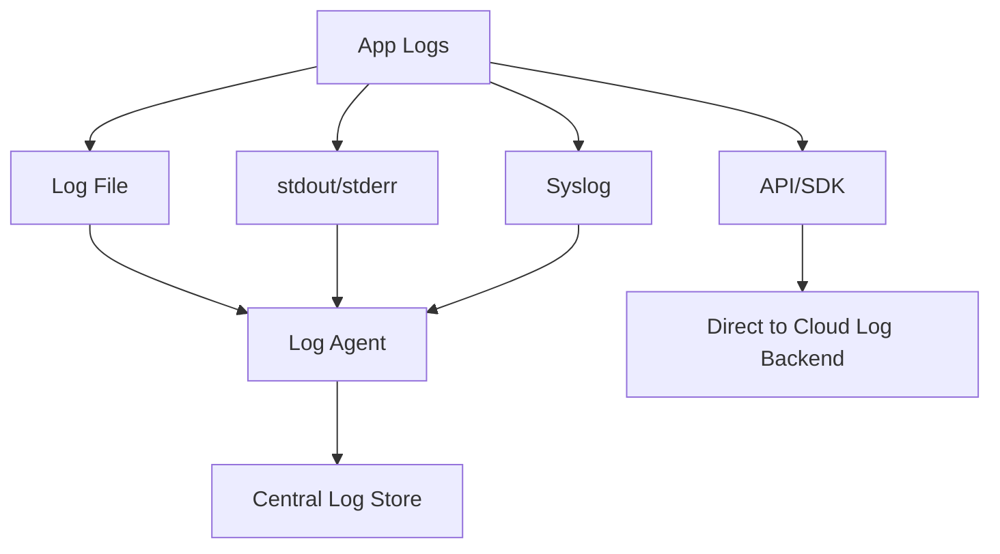
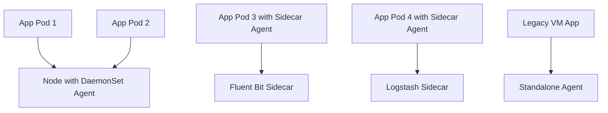

# **Log Collection, Centralization & Analysis**  
> *For engineers shifting from production support to SRE roles, with Johan narrating in his usual dry-witty, detail-rich style.*

---

## ✅ Module Overview

This section will:

- Explain **why centralized logging is critical** for distributed systems
- Break down the **common log collection methods** used in modern infrastructure
- Introduce key **log shipper technologies** (Fluent Bit, Logstash, etc.)
- Explore **agent deployment patterns** (sidecar, DaemonSet, standalone)
- Use **diagrams**, **JSON examples**, and **Johan’s commentary** to guide understanding
- Stay within a **~3500+ word target**, rich in applied SRE relevance

---

## 🧩 Intermediate Module: Log Collection, Centralization & Analysis

---

### 🧭 Introduction: “If a log falls in a pod and no one ships it...”

> **Johan’s Thought**  
> *“Having a perfect log message on a forgotten node is like shouting into a void. Centralization is survival.”*

Modern systems don’t just produce logs—they scatter them.

Across:
- Bare metal servers
- Docker containers
- Lambda functions
- Kubernetes pods
- Serverless runtimes

Which means: if you want to **search logs**, **alert on logs**, or **correlate logs with traces**, you need to **move those logs to a central, queryable location**. That’s the purpose of this phase in your SRE journey.

---

## 🚚 Log Collection: Getting Logs Off the Ground

Before you can analyze a log, it has to *leave the system where it was born*. There are four primary ways to pull logs into your centralized pipeline:

---

### 1. **Log Files**

The oldest and still most reliable source:
- Applications write logs to files (e.g., `/var/log/app.log`)
- Agents **tail** those files and **ship entries line-by-line**

Common in:
- Monoliths
- Stateful VMs
- Older server-based architectures

🧾 **Sample Log File Snippet:**

```bash
2025-04-21 14:30:12 ERROR [checkout-service] Payment failed for user: 42
```

**Downside:** If the app crashes and rotates logs poorly, you can lose data.

---

### 2. **Standard Output / Standard Error (stdout/stderr)**

Especially common in:
- Docker containers
- Kubernetes pods
- Serverless environments

Logs emitted via `stdout` or `stderr` are automatically captured by the container runtime or orchestration layer.

> **Johan’s Thought**  
> *“If you’re still writing logs to files inside containers, we need to talk.”*

🧾 **Pseudocode Example:**

```python
print("INFO: Payment success for user 42")
```

In K8s, this goes to the pod's stdout stream → picked up by the container runtime → log collector.

---

### 3. **Direct API Calls**

Applications can send logs directly to:
- A logging backend (e.g., Datadog, Loggly, Elastic)
- Via a log ingestion API or SDK

Useful for:
- Real-time logs
- Enriched telemetry
- Mobile or edge devices

🧾 **JSON Example (Direct Log Event):**

```json
{
  "level": "warn",
  "service": "checkout",
  "msg": "payment latency high",
  "trace_id": "abc123",
  "timestamp": "2025-04-21T14:32:01Z"
}
```

**Downside:** Adds coupling. If the network fails, your logs may disappear—unless you buffer.

---

### 4. **Syslog Protocol**

Still used in:
- Traditional IT environments
- Network devices, routers, firewalls
- Some cloud-native legacy bridges

Logs sent via UDP/TCP to a **Syslog server**, which then forwards or stores the data.

---

### 📈 Mermaid Diagram: Collection Paths



---

## 🔌 Log Shippers and Agents

Here’s where log **collection becomes architecture**.

Log shippers (also called **agents**) are tools that:
- **Collect logs** from various sources
- **Parse and transform** them (e.g., JSON decode, field extraction)
- **Buffer logs** in memory or disk
- **Route** them to the right destinations

---

### ⚙️ Common Log Shippers

| Tool | Best For | Highlights |
|------|----------|------------|
| **Fluent Bit** | Lightweight edge logging | C-native, great for K8s |
| **Fluentd** | Versatile, Ruby-based | Complex routing, filtering |
| **Logstash** | ELK stack users | Powerful transforms, heavier footprint |
| **Datadog Agent** | Datadog native users | Built-in integrations |
| **CloudWatch Agent** | AWS environments | Seamless with EC2, ECS |
| **Splunk Forwarder** | Enterprise search logs | Optimized for Splunk indexing |

---

> **Johan’s Thought**  
> *“Your logs are only as searchable as your agents are reliable. Parse with care, buffer with caution.”*

---

## 🧠 Deployment Patterns: Sidecar vs DaemonSet vs Standalone

Now that you know what ships logs, let’s look at **where to deploy the shipper**.

---

### 1. **Sidecar Containers**

**Pattern:** One log agent container runs **alongside** your app in the same pod.

🧩 Ideal for:
- Fine-grained log separation
- Apps that emit custom formats
- Teams with per-service logging needs

**Drawbacks:**
- Duplicates resources per pod
- Harder to maintain at scale

---

### 2. **DaemonSet (Kubernetes)**

**Pattern:** One log agent runs **per node**, collecting logs from **all containers**.

🧩 Ideal for:
- Uniform cluster-wide logging
- Streaming container stdout/stderr
- Minimal footprint with Fluent Bit or similar

**Trade-off:** Less granularity, shared pipeline for many apps

---

### 3. **Standalone Agents (VMs, Legacy)**

**Pattern:** Log agent runs on the host OS, watching files or system logs.

🧩 Ideal for:
- VM-based apps
- Bare metal or non-Kubernetes workloads
- Monoliths with well-known log files

---

### 📈 Mermaid Diagram: Agent Deployment Options



---

## 🧪 SRE Relevance: Why This Matters

### 🔍 1. Root Cause Detection

- You need all logs **centralized** to correlate services
- Distributed systems don’t fail in one place—they ripple
- Having logs available from **API, DB, and queue** in one search window is crucial

---

### 📉 2. Sampling, Throttling, and Retention

- Some logs are noisy
- You might want to **drop debug logs**, keep errors
- Shippers help you **filter, tag, and route** appropriately (e.g., send warnings to long-term storage, errors to PagerDuty)

---

### 🧪 3. Parsing Structure for Queries

- Structured logging allows **log queries like metrics**
- You can write queries like:  
  `level: error AND service: inventory AND trace_id: *`
- That’s impossible with raw, unstructured strings

---

### 🔗 4. Linking Logs to Traces

- Log agents can **extract Trace IDs** from logs and **inject them into metadata**
- Enables UIs to **jump from trace → logs** or **logs → trace**

---

> **Johan’s Thought**  
> *“If your logs and traces aren’t linked by ID, your tools are just lonely islands in a sea of latency.”*

---

### 🛡️ 5. Security & Compliance

- Centralizing logs makes them:
  - Tamper-proof
  - Retention-policy compliant
  - Searchable for audits

Shippers also help redact, hash, or anonymize sensitive fields before transmission.

---

## ✅ Summary: What You Now Know

| Concept | Why It Matters |
|--------|----------------|
| **Log Collection** | Brings observability to life — from file to platform |
| **stdout/stderr vs files** | Containers log differently than VMs |
| **Log Shippers** | Collect, parse, route, buffer |
| **Deployment Models** | Sidecar = granular, DaemonSet = scalable, Standalone = legacy |
| **SRE Impact** | Enables alerting, debugging, trace linking, audits, and cost control |

---

> **Johan’s Final Thought**  
> *“Shipping logs isn’t glamorous. But it’s what turns unknowns into insights.”*
