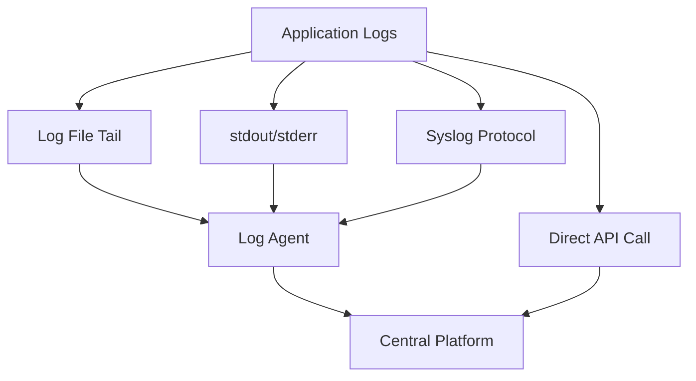
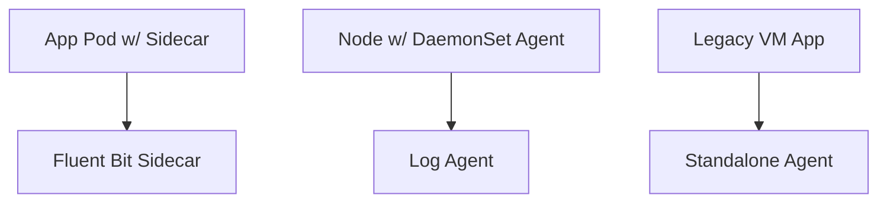
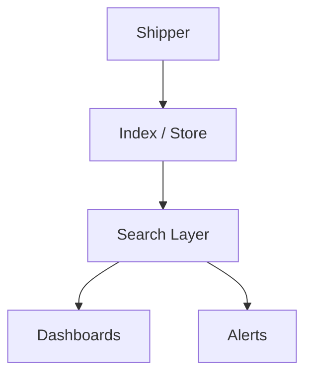

# 📚 From Emission to Insight: Building Reliable Log Pipelines

*Intermediate SRE Logging Module: Collection, Centralization & Analysis*

*By Johan – your guide through structured chaos.*

---

> **Johan's Thought:**
> *"Logs are like receipts. They tell you what happened – if you can find them, and if you printed them in the first place."*

---

## 📅 Module Overview

This module breaks down the complete lifecycle of logs in a modern distributed system:

**Part 1:** Log Collection & Shipping  
**Part 2:** Centralized Platforms & Analysis

Each section includes visuals, scenario-driven prompts, Johan's reflections, and a glossary.

---

## 📊 Part 1: Log Collection & Shipping

### 🚚 Why Collection Matters

In distributed systems, logs are born everywhere:
- Containers
- VMs
- Serverless functions
- Routers, firewalls, cloud proxies

To analyze anything, they must be **shipped** reliably to a **central platform**. Otherwise, your logs are lost in the noise.

> **Johan's Thought:**  
> *"A perfect log line, lost on a container that died 5 minutes ago, is a tragedy."*

---

### 🚗 Methods of Log Collection

| Source | Description | Use Case |
|--------|-------------|----------|
| **Log Files** | Applications write to disk, agents tail and ship | Legacy systems, VMs |
| **stdout/stderr** | Common in containers/Kubernetes | Cloud-native workloads |
| **API/SDK** | App sends logs directly to a log backend | Edge, mobile, serverless |
| **Syslog** | Logs sent via network to collector | Network infra, appliances |

#### 📂 Mermaid: Collection Flow


---

### 🔧 What Do Log Agents Do?

Log shippers like Fluent Bit, Fluentd, and Logstash:
- **Collect**: from files, streams, APIs
- **Parse**: raw strings into structured fields
- **Buffer**: data in memory or disk
- **Route**: logs to backends or indexes

#### 🔹 Concrete Transformation Example

**Raw log line:**
```
[INFO] 2025-04-21 cart Payment succeeded for user=42
```

**Logstash Grok pattern:**
```
\[%{LOGLEVEL:level}\] %{TIMESTAMP_ISO8601:timestamp} %{WORD:service} %{GREEDYDATA:message}
```

**Parsed Output:**
```json
{
  "level": "INFO",
  "timestamp": "2025-04-21",
  "service": "cart",
  "message": "Payment succeeded for user=42"
}
```

---

### 📁 Buffering: Memory vs. Disk

| Buffer Type | Pros | Cons |
|-------------|------|------|
| **Memory** | Fast, low latency | Volatile – logs lost on crash |
| **Disk** | Durable | Slower, uses I/O + storage |

> **Johan's Thought:**  
> *"If your agent can't hold logs during an outage, it's just a fancy pipe with no bucket."*

---

### 🧬 Deployment Patterns

| Pattern | Description | Ideal For |
|---------|-------------|-----------|
| **Sidecar** | Agent runs in same pod as app | Per-service control, debugging |
| **DaemonSet** | One agent per node (K8s) | Cluster-wide logs |
| **Standalone** | Agent runs on host OS | VMs, legacy workloads |

#### 📊 Mermaid: Agent Deployment


---

### 🔒 Security & Redaction

**Problem:** Logs may contain PII, secrets, or sensitive metadata.

#### 🔹 Example: Redacting API keys

**Fluent Bit Lua Filter:**
```lua
function redact_key(msg)
  return string.gsub(msg, "(apikey=)[^& ]+", "%1[REDACTED]")
end
```

#### 🔹 Logstash Field Removal:
```bash
mutate {
  remove_field => ["password", "credit_card"]
}
```

> **Johan's Thought:**  
> *"Audit logs are like resumes: redact early, redact often."*

---

### 🔹 ☑️ Self-Check
**Which of the following is best suited for collecting logs from Kubernetes pods?**
- A) Sidecar containers
- B) Syslog
- C) Log file rotation

> **Answer:** A (Sidecars or DaemonSets are K8s-native methods)

---

## 📊 Part 2: Centralized Logging Platforms & Analysis

### ❓ Why Centralize?

- Unified search across services
- Real-time incident triage
- Access controls and audit trails
- Query performance at scale

> **Johan's Thought:**
> *"Distributed logs without a platform are like books with no library."*

---

### 📊 Logging Platform Stack

#### Components:
- **Storage & Indexing**: Elasticsearch, Loki, Splunk
- **Query Engine**: Kibana, Grafana Explore, Splunk Search, CloudWatch Insights
- **Visualization**: Dashboards, histograms, time series

#### 📊 Mermaid: Platform Flow


---

### 🔬 Common Queries (Structured Logs)

#### Elasticsearch/Kibana:
```text
level: "error" AND service: "payments"
```
#### LogQL (Loki):
```text
{job="orders", level="warn"} |= "timeout"
```
#### CloudWatch Insights:
```sql
fields @timestamp, @message
| filter service="api" and status="500"
| sort @timestamp desc
```

---

### 💡 Scenario-Based Exercise — Boxed Prompt

> **📆 Incident: High 500 errors on /checkout**  
> You’re given a trace ID: `abc123`. 
>
> ✍️ Which of the following queries would help investigate?
> - A) `level:error AND path:/checkout`
> - B) `trace_id:abc123`
> - C) `service:frontend`

> **Answer:** B (Get all logs from the request path using trace ID linkage.)

---

### 🔬 Visualization & Dashboards

Use structured log data to:
- Plot error volume over time
- Alert on surge conditions
- Build real-time observability boards

> **Johan's Thought:**
> *"Dashboards should be boring. That means your logs are predictable."*

---

## 🔹 Summary Table

| Layer | Purpose |
|-------|---------|
| **Shippers** | Collect, parse, buffer |
| **Storage** | Retain, index, tier logs |
| **Query** | Search, filter, correlate |
| **Visualization** | Spot trends, debug faster |

---

## 📖 Glossary

| Term | Definition |
|------|------------|
| **Grok** | Pattern syntax used in Logstash to parse text logs |
| **DaemonSet** | K8s construct to deploy one pod per node |
| **Trace ID** | Unique identifier linking logs and traces from the same request |
| **Fluent Bit** | Lightweight log shipper for edge nodes and containers |
| **LogQL** | Query language used in Grafana Loki |
| **SPL** | Splunk Processing Language for searching log events |

---

> **Johan’s Final Thought:**  
> *"If you treat your log platform as a dumping ground, expect it to treat your problems the same way."*

---

📅 **End of Module**