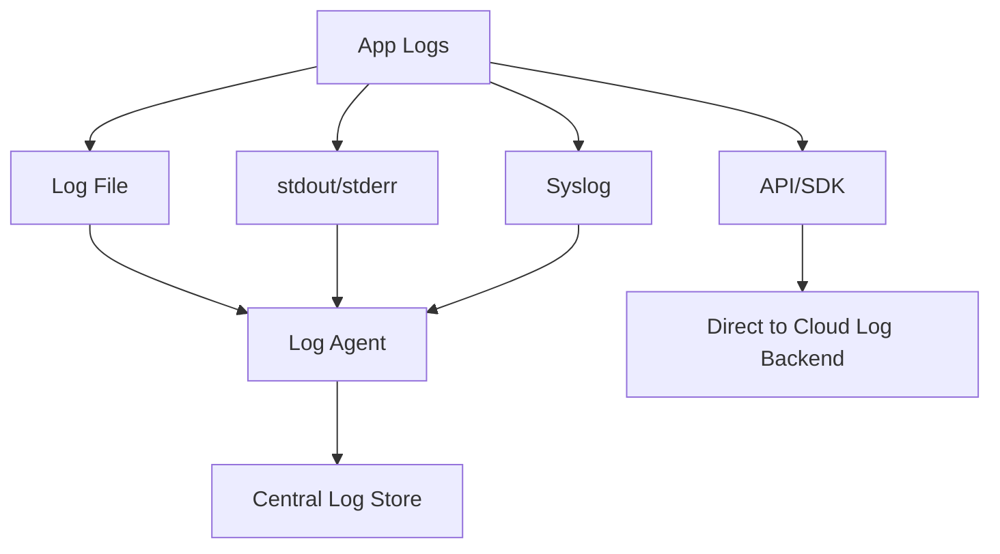
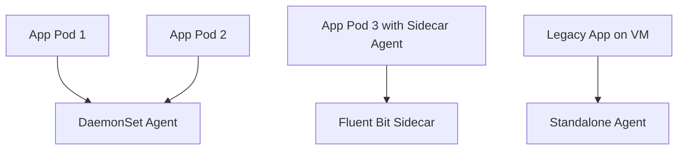

# 🧩 **Intermediate Level – Log Collection, Centralization & Analysis**

---

## 🧭 Introduction: “If a log falls in a pod and no one ships it...”

> **Johan’s Thought**  
> *“Having a perfect log message on a forgotten node is like shouting into a void. Centralization is survival.”*

---

### 🚨 Why This Matters

Logs are the SRE’s breadcrumbs. But unlike a fairy tale, the forest is made of distributed systems, and the breadcrumbs vanish without proper collection. This module shows you how to centralize those breadcrumbs—accurately, securely, and scalably.

---

## 🚚 Getting Logs Off the Ground

---

### 1. **Log Files**
🧩 Legacy but reliable. Applications append logs to files (e.g., `/var/log/app.log`), which agents **tail** and ship.

**Common in:** Stateful apps, monoliths, traditional VMs

🧾 Example:
```
2025-04-21 14:30:12 ERROR [checkout-service] Payment failed for user: 42
```

---

### 2. **Standard Output / Error (stdout/stderr)**

🧩 The modern container-native method.

**Common in:** Docker, Kubernetes, serverless functions  
**Advantage:** Easily picked up by orchestrators or log collection layers

```go
fmt.Println("INFO: cart service started successfully")
```

> **Johan’s Thought:**  
> *“In Kubernetes, stdout isn’t just a habit—it’s a pipeline entry.”*

---

### 3. **Direct API Calls**

Some applications log by sending data directly to a logging backend.

🧾 Example:
```json
{
  "level": "warn",
  "service": "checkout",
  "msg": "payment latency high",
  "trace_id": "abc123",
  "timestamp": "2025-04-21T14:32:01Z"
}
```

**Risks:**
- Adds latency
- Prone to loss if the backend is unreachable
- Requires buffering

---

### 4. **Syslog Protocol**

Still used by:
- Network devices
- Legacy systems
- Some security appliances

Sends messages over UDP/TCP to a centralized **Syslog collector**.

---

### 📈 Mermaid Diagram: Collection Paths



---

## 🔌 Shippers, Agents & Transformation

---

### 🔄 What Shippers Do

Shippers aren’t just taxis—they’re intelligent intermediaries. A good agent:
- **Collects** from multiple inputs
- **Parses** unstructured lines into structured fields
- **Buffers** in case of network failure
- **Routes** based on logic
- **Secures** by filtering or redacting

---

### ⚙️ Common Shippers

| Tool | Strength | Use Case |
|------|----------|----------|
| **Fluent Bit** | Lightweight, C-based | Containers, edge nodes |
| **Fluentd** | Flexible plugin model | Kubernetes, cloud-native apps |
| **Logstash** | Powerful transformations | ELK Stack, large data pipelines |
| **Datadog Agent** | Deep integration | Datadog-native environments |
| **CloudWatch Agent** | AWS first-party | EC2, ECS, hybrid infra |
| **Splunk Forwarder** | Enterprise-grade ingestion | High-volume, compliance-heavy environments |

---

> **Johan’s Thought:**  
> *“Parsing logs is like prepping a witness. You want structure without embellishment.”*

---

## 🧪 **Parsing & Transformation: Concrete Examples**

---

### ✅ Logstash Example: Grok Pattern

From raw string to structured JSON:

**Raw Log:**
```
[INFO] 2025-04-21 14:32:01 checkout Payment succeeded for user=42
```

**Grok Pattern:**
```bash
\[%{LOGLEVEL:level}\] %{TIMESTAMP_ISO8601:timestamp} %{WORD:service} %{GREEDYDATA:message}
```

**Parsed Output:**
```json
{
  "level": "INFO",
  "timestamp": "2025-04-21 14:32:01",
  "service": "checkout",
  "message": "Payment succeeded for user=42"
}
```

---

### ✅ Fluent Bit Filter: JSON Extraction

```ini
[FILTER]
    Name parser
    Match app.*
    Key_Name log
    Parser json
```

Extracts inner JSON from this:
```json
{ "log": "{\"level\":\"error\",\"msg\":\"payment failed\",\"user\":\"42\"}" }
```

Into:
```json
{
  "level": "error",
  "msg": "payment failed",
  "user": "42"
}
```

---

## 💾 Buffering: Memory vs Disk

No log pipeline is perfect. That’s why agents **buffer** data before forwarding.

| Type | Pro | Con |
|------|-----|-----|
| **Memory** | Fast, low latency | Volatile; logs lost if crashed |
| **Disk** | Durable, crash-resistant | Slower, requires clean-up and space planning |

🧠 SRE Relevance:
- Disk buffering is essential for environments with **intermittent connectivity** (e.g., remote sites, direct API loggers)
- Use memory buffering for high-speed clusters with **reliable uplinks**

---

> **Johan’s Thought:**  
> *“A buffer isn’t just a queue. It’s an insurance policy against bad days and broken Wi-Fi.”*

---

## 🧱 Deployment Patterns

---

### ✅ Sidecar Agents

- **Per pod** agent
- Close to the application
- Can inspect private filesystem or socket output

🧩 Ideal for:
- Unique log formats
- High-security workloads
- Debug-heavy services

---

### ✅ DaemonSets (Kubernetes)

- One agent per node
- Collects all pod logs
- Great for `stdout`/`stderr`

🧩 Ideal for:
- Homogeneous workloads
- Simplicity
- Lightweight agents like Fluent Bit

---

### ✅ Standalone Agents

- Installed directly on hosts (VMs, bare metal)
- Watches known file paths

🧩 Ideal for:
- Legacy apps
- On-prem servers
- Baked-in system logging

---

### 📈 Mermaid Diagram: Agent Patterns



---

## 🛡️ Security, Redaction & Anonymization

---

Logs often contain:
- **PII** (emails, usernames)
- **Secrets** (API keys, tokens)
- **Sensitive metadata** (IP, session IDs)

**An SRE’s responsibility:** Ensure logs are useful—but safe.

---

### ✅ Redaction via Pattern Matching

**Example: Fluent Bit Lua Filter:**

```lua
function redact_key(msg)
  return string.gsub(msg, "(apikey=)[^& ]+", "%1[REDACTED]")
end
```

Transforms:
```
GET /api?apikey=12345678 → GET /api?apikey=[REDACTED]
```

---

### ✅ Field Drop Example (Logstash)

```bash
filter {
  mutate {
    remove_field => [ "password", "credit_card_number" ]
  }
}
```

Removes fields from structured logs before they’re shipped.

---

> **Johan’s Thought:**  
> *“If you can grep your logs for ‘token=’, so can attackers. Sanitize or suffer.”*

---

## 🧠 SRE Use Cases

---

### 🛠️ 1. Triage in Seconds

You get paged for 5xx spikes. Instead of ssh-ing into five boxes, you:
- Query all logs in a central viewer
- Filter for `level:error AND path:/checkout`
- Correlate with trace IDs

---

### 📉 2. Reduce Volume Without Losing Meaning

Use agents to:
- **Drop debug logs** in production
- **Buffer error logs** longer
- **Route structured vs. unstructured logs** to different storage

---

### 🔗 3. Link Logs to Traces

Use shared `trace_id` field:
- Jump from span to logs
- Run queries across both data sets
- Enrich logs with span-level context

---

### 🛡️ 4. Meet Compliance

You can:
- Retain logs by policy
- Redact PII on ingestion
- Audit log access and forward copies to SIEMs

---

> **Johan’s Final Thought:**  
> *“Great logs are structured, secured, searchable—and someone else’s problem to ship.”*

---

## ✅ Recap

| Topic | Key Takeaway |
|-------|---------------|
| **Log Collection Methods** | Tail files, watch stdout, send via API, syslog |
| **Agents** | Fluent Bit, Fluentd, Logstash, native agents |
| **Transformation** | Parse unstructured → JSON, apply filters |
| **Buffering** | Memory = fast, Disk = durable |
| **Security** | Redact PII, drop secrets, enforce access controls |
| **SRE Role** | Triage, alerting, compliance, and cost-efficient logging. |
