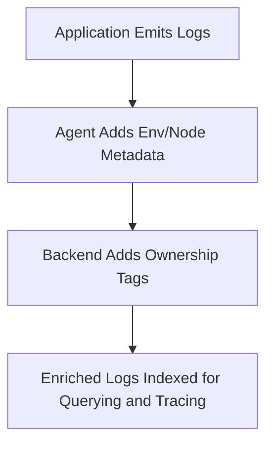

# 🧠 Log Enrichment & Contextualization

*Intermediate SRE Logging Module: Making Logs Smarter, Not Just Louder*

*With Johan—who knows that observability without context is just noise.*

---

> **Johan's Thought:**
> *"A log line without context is like a medical chart missing the patient’s name. Might be informative, but not helpful."*

---

## 🧭 Module Purpose

This module teaches how to make logs more useful and actionable by:
- Attaching relevant metadata at emit, ship, or ingest time
- Correlating logs with traces using trace/span IDs
- Standardizing fields and implementing consistent tagging across services

By the end, learners will understand how to:
- Select and apply appropriate metadata to logs
- Use enrichment to enable effective querying, alerting, and incident response
- Prevent common operational issues caused by poor log context

---

## 🔎 What is Log Enrichment?

**Log enrichment** adds structured metadata to each log line, enabling meaningful filtering, correlation, and search.

| Metadata | Purpose |
|----------|---------|
| `env` | Distinguish between prod, staging, dev |
| `service` | Isolate logs to microservices or components |
| `version` | Correlate issues with code deployments |
| `region` | Identify affected cloud/data center zones |
| `trace_id`, `span_id` | Link logs to traces and spans |
| `team`, `owner` | Direct ownership and alerting |

> **🧪 Practice:**
> You receive this raw log:
> ```json
> {"message": "payment failed"}
> ```
> ❓ How would you enrich this to enable correlation with an incident trace?

**✅ Answer:**
```json
{
  "message": "payment failed",
  "service": "payment-processor",
  "env": "prod",
  "trace_id": "a1b2c3d4...",
  "span_id": "e5f6g7h8...",
  "region": "us-east-1",
  "team": "payments"
}
```
> `trace_id` and `span_id` are key to stitching this log into a trace timeline.

---

## 🧱 Where Enrichment Happens (3 Phases)

### 1. Emit Time – Inside the App
**Context Type:**
- Business logic (user_id, order_id)
- Request scope (trace_id, span_id)

```python
log.info("user login failed", extra={"user_id": user.id, "trace_id": trace_id})
```

### 2. Ship Time – Agent-level Injection
**Context Type:**
- Infrastructure (node_name, pod_id)
- Deployment (env, region)

```ini
[FILTER]
  Name record_modifier
  Match *
  Record env production
  Record region us-west-2
```

### 3. Ingest Time – In the Platform
**Context Type:**
- Organizational (team, compliance_tag)
- Ownership enforcement

```logstash
filter {
  if [service] == "checkout" {
    mutate { add_field => { "team" => "payments" } }
  }
}
```

> **Johan's Prompt:**
> “If you only add `env` in your app but forget it in your backend, will all logs be searchable by it?”

**✅ Answer:** No. Not all services may log `env`, but enrichment at ingest time enforces consistency across the fleet.

---

## 🔗 Linking Logs to Traces

### The Problem
You receive a 500 error in logs—but have no context about what happened before or after.

### The Solution
Propagate `trace_id` and `span_id` in logs to stitch them to distributed traces.

### Example with OpenTelemetry:
```python
from opentelemetry.trace import get_current_span
span = get_current_span()
log.info("checkout failed", extra={"trace_id": span.get_span_context().trace_id})
```

### Benefits:
- Jump from a log line to the trace in UI
- Filter logs to a specific request across services
- Analyze trace performance alongside logs

> **Johan's Tip:**
> *"No trace_id? No timeline. You’re just guessing where the body is buried."*

---

## 🧬 Designing a Tagging Schema

### Why Schema Matters
- **Snake_case** vs **camelCase**: snake_case is preferred for consistency across most JSON-based pipelines and easier parsing in tools like Logstash.
- **trace_id** format: usually UUID or OpenTelemetry-compatible hex string.

### Example Schema:
| Field | Format | Required? |
|-------|--------|-----------|
| `env` | string (e.g., "prod") | ✅ |
| `service` | string | ✅ |
| `trace_id` | UUID/hex | ✅ |
| `region` | string | ✅ |
| `team` | string | ✅ |
| `version` | semver | ❌ |

> **🧪 Practice:**
> You log: `"cache miss"` from service `inventory` in staging. Suggest a complete log line with appropriate enrichment fields.

**✅ Answer:**
```json
{
  "message": "cache miss",
  "service": "inventory",
  "env": "staging",
  "region": "us-west-2",
  "trace_id": "uuid-trace...",
  "span_id": "uuid-span...",
  "team": "fulfillment"
}
```

---

## 🔍 Real-World Scenario: Ownership Breakdown

> **Scenario:** You find an error log in production, but there's no `team` or `owner` field. No one claims it. The on-call rotates across 3 teams before it lands.

**What went wrong:**
- Missing ownership tag
- No enrichment at ingest

**Fix:**
- At the Logstash layer, enrich logs based on `service` field:
```logstash
filter {
  if [service] == "checkout" {
    mutate { add_field => { "team" => "payments" } }
  }
}
```

**Result:**
- Errors are now queryable by `team="payments"`
- Incident routing is direct and accountable

> **Johan’s Prompt:**
> “Could this have been prevented at emit time? Or is ingest the only reliable layer for enforcement?”

**✅ Answer:** Emit time allows precise context, but Ingest time offers consistency—especially when developers forget or misconfigure local loggers.

---

## 📈 Visual Flow: Enrichment Lifecycle



---

## 📘 Glossary

| Term | Definition |
|------|------------|
| **Enrichment** | Attaching metadata to log lines |
| **Trace ID** | A unique ID representing a distributed trace (usually UUID or hex) |
| **Emit time** | When the log is created in code |
| **Ship time** | When the log leaves the node |
| **Ingest time** | When the log enters a central store |
| **Tagging schema** | A defined structure for log fields |
| **Span ID** | Identifier for a single operation in a trace |

---

> **Johan’s Final Thought:**
> *“A log with a message is a story. A log with a trace ID, env, region, and owner? That’s a full report.”*

---

📅 **End of Module – Log Enrichment & Contextualization**

