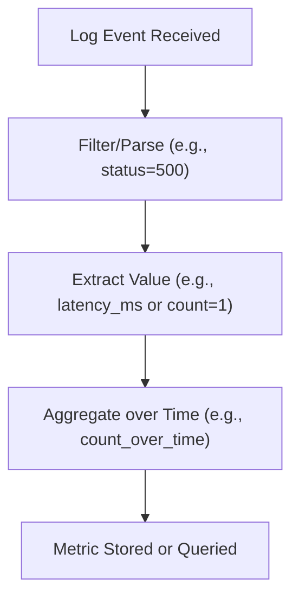
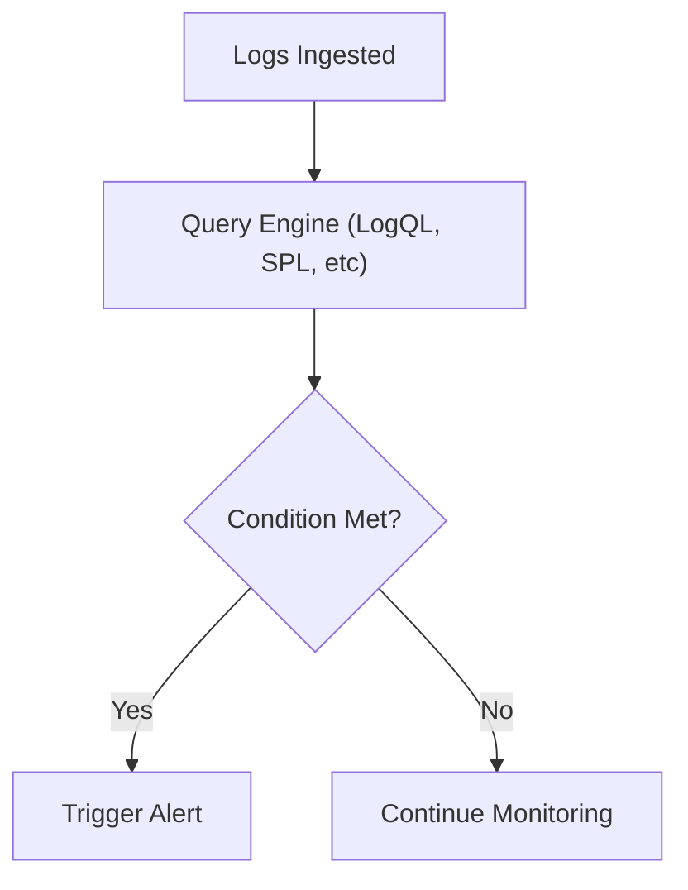
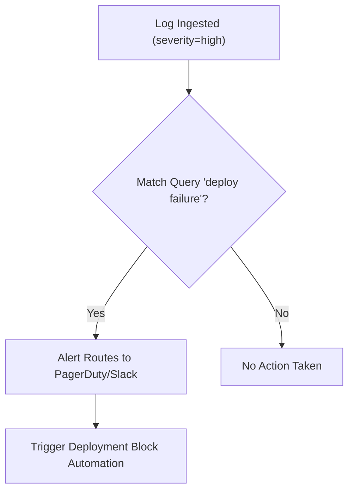

# ⚙️ Advanced Logging: Optimization, Automation & Integration

*Advanced SRE Logging Module: Transforming Logs into Real-Time Intelligence*

*With Johan—because logs aren't just data, they're your system's heartbeat.*

---

> **Johan's Thought:**
> *"Observability isn’t about watching everything. It’s about watching what matters—at the moment it matters."*

---

## 🧭 Module Purpose

In this advanced module, you’ll learn how to:
- Derive actionable metrics from logs
- Set up log-based alerting systems
- Understand trade-offs between log- and metric-based detection
- Integrate logs into automated workflows

By the end, you’ll treat logs as structured, reactive telemetry—not just record-keeping.

---

## 📈 From Log Lines to Metrics

Logs aren’t just for forensics—they’re real-time signal sources.

### 🔍 Use Case: HTTP 500 Tracking
You want to count every HTTP 500 error without waiting for metric emitters to catch up.

**Log Sample:**
```json
{
  "level": "error",
  "status": 500,
  "service": "checkout",
  "message": "payment processor unavailable"
}
```

### 🔢 Derived Metric Example (Grafana Loki):
```logql
count_over_time({service="checkout", status="500"}[5m])
```

### 🔢 CloudWatch Metric Filter:
```json
{ "filterPattern": "500", "metricName": "HTTP500Errors", "metricNamespace": "App/Errors" }
```

> **Johan’s Tip:**
> *“The moment you can count structured errors in real time—you’ve built a metric out of a message.”*

### 📈 Flowchart – Transforming Log to Metric


---

## 📦 Tools That Turn Logs Into Metrics

| Platform | Feature |
|----------|---------|
| **Grafana Loki** | LogQL aggregation (e.g., `rate`, `count_over_time`) |
| **Splunk** | `stats count by` or `timechart avg()` |
| **CloudWatch** | Metric filters (JSON or plain text patterns) |
| **Datadog** | Log-based metrics via facets (i.e., indexed fields exposed for filtering, aggregation, or alerting) |

### 🎯 Practical Example: Latency from Logs
Extract response times from structured logs:
```json
{
  "message": "checkout complete",
  "latency_ms": 847,
  "user": "u-418"
}
```

#### Datadog Log Metric:
- Extract `latency_ms`
- Create a metric: `avg(latency_ms) by service`
- Alert if `p95(latency_ms) > 1200` for 5 minutes

---

## 🚨 Log-Based Alerting

### 🧪 Sample Alert Scenario
> You want to know if 10 or more payment failures occur within 5 minutes.

### LogQL (Loki):
```logql
count_over_time({service="payment", level="error"} |= "payment failed" [5m]) > 10
```

### CloudWatch Filter:
- Metric from logs: `PaymentFailed`
- Alarm: `threshold = 10 over 5m`

### Splunk:
```spl
index=prod_logs "payment failed"
| stats count by _time
| where count > 10
```

### 📈 Flowchart – Log-Based Alert Flow


> **Johan’s Prompt:**
> *“Would you rather alert on logs or metrics? Logs give detail. Metrics give clarity. Pick what you can act on fastest.”*

---

## ⚖️ Trade-offs: Log-Based Alerts vs. Metric Alerts

| Criteria | Log-Based | Metric-Based |
|---------|-----------|---------------|
| **Latency** | Higher | Lower |
| **Detail** | High (can show message) | Low (numeric) |
| **Cost** | Higher at scale | Lower (aggregated) |
| **Use Case** | Rare events, custom formats | Known behaviors, performance thresholds |

> **Scenario Prompt:**
> You’re tracking an intermittent bug only visible in logs. Metric emits are normal. What alerting method makes sense?

✅ **Answer:** Log-based alerting. It catches signal hidden in the narrative.

---

## 🔄 Logs in Automated Workflows

Logs can trigger actions via:
- Webhooks
- Lambda functions
- PagerDuty/Slack integrations
- CI/CD pipeline blockers

These automations are often implemented through **log monitoring platforms**, which detect matching patterns and use **webhook URLs, serverless functions (like AWS Lambda), or API Gateway endpoints** to route log events to downstream automation.

### Example:
```json
{
  "message": "deploy failure",
  "pipeline": "release-2025.04.22",
  "team": "infra",
  "severity": "high"
}
```

### 📈 Flowchart – Automation Trigger Flow


> **Johan’s Thought:**
> *“Why wait for someone to read a log when you can act on it directly?”*

---

## 🔐 Common Pitfalls to Avoid

- Over-alerting on common errors without scoping by `env`, `region`, or `user_type`
- Regex-based filters prone to **false positives** (due to overly broad patterns, greedy matching, or ambiguous log formats)
- Poor query performance from inefficient regex in high-traffic environments
- Misconfigured time windows (e.g., 1m windows on 5m pipelines = alert noise)
- Missing enrichment fields (`env`, `team`, `trace_id`) limits routing or deduplication

> **🧪 Practice Prompt:**
> You get 5 alerts a day for “failed auth” but most are test traffic. How would you refine this alert?

✅ **Answer:**
- Filter by `env != "test"` or `env = "prod"`
- Add user group or IP filters to exclude test accounts
- Adjust thresholds or suppress known benign patterns

---

## 📘 Glossary

| Term | Definition |
|------|------------|
| **LogQL** | Grafana Loki’s query language for logs |
| **Metric Filter** | A pattern that extracts metrics from log messages |
| **Facet** | A log field exposed for filtering/metrics in Datadog (typically indexed) |
| **Aggregation Window** | Time interval over which logs are counted/analyzed |
| **Webhook** | A callback mechanism triggered by log events, often hitting an API or automation endpoint |

---

> **Johan’s Final Thought:**
> *“Logs are real-time telemetry waiting to be unlocked. Don’t just read them—respond to them.”*

---

📅 **End of Module – Optimization, Automation & Integration**

