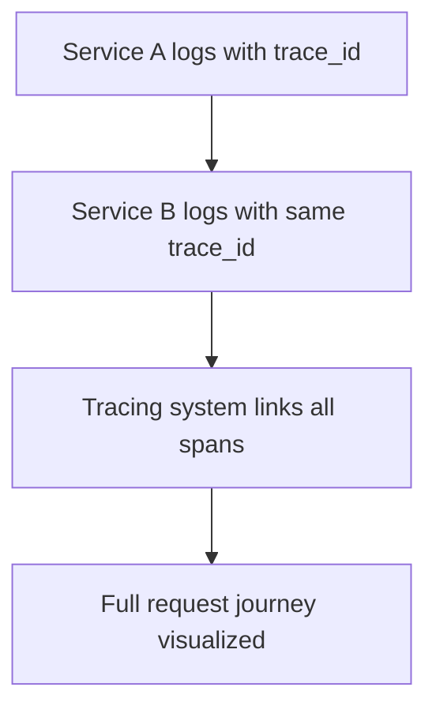
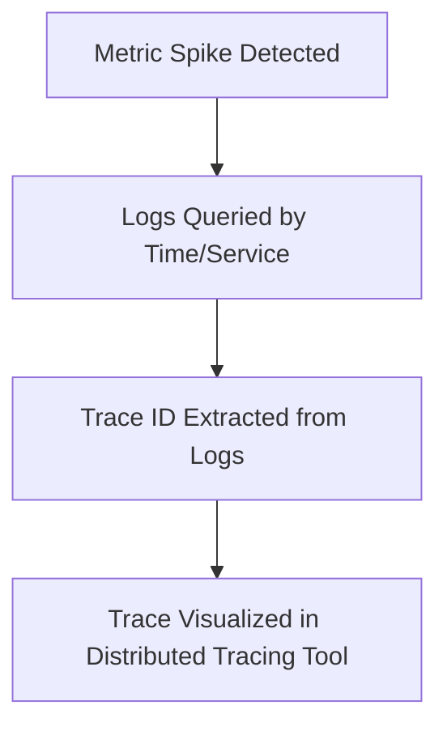

# 🔗 Advanced Logging: Correlation & Observability

*Advanced SRE Logging Module: Linking Logs, Metrics, and Traces for Full-System Visibility*

*With Johan—because finding the problem is faster when all the clues are connected.*

---

> **Johan's Thought:**
> *“When systems fail, they don’t send a single message—they scatter breadcrumbs. Your job is to follow the trail.”*

---

## 🧭 Module Purpose

In this advanced module, you’ll learn how to:
- Correlate metrics, logs, and traces for end-to-end visibility
- Use trace IDs to stitch together events from multiple services
- Drill down from high-level indicators to root causes using log-trace-metric workflows

You’re not just learning how to read logs—you’re learning how to read your system like a crime scene, with every log and metric a potential witness.

---

## 🧩 Connecting to Day 1: Revisiting the Pillars

Back in Day 1, you learned:
- **Metrics** = What is happening?
- **Logs** = What exactly happened?
- **Traces** = Where did it happen, and in what order?

Advanced correlation links these together:
1. Metric spike triggers investigation
2. Logs confirm time, pattern, and root message
3. Trace ID ties multiple services together

> **Johan’s Prompt:**
> *“If a metric spike doesn’t lead to a trace or logs, you’re debugging blindfolded.”*

### 🧠 A Quick Story: The Checkout That Cried Wolf
A dashboard lit up red at 2 a.m.—`p95 latency` for the `checkout` service was peaking above threshold. The on-call engineer opened the dashboard and saw the spike. Logs confirmed a few timeouts—but they were from different pods.

What stitched the problem together? A `trace_id`.

It revealed a request that traversed `frontend → api-gateway → checkout → payment`, where the real issue lived: a third-party timeout at the payment gateway. None of the services had failed independently—but the chain was slow.

That trace ID didn’t just reduce time-to-diagnosis—it **gave the team the exact line of sight** into what users experienced.

---

## 🧬 Trace IDs: The Glue Between Services

### 🔍 Use Case: Payment Flow Fails Midway

- Metric shows `p95 latency > 1.2s`
- Logs from `checkout` and `payments` mention errors
- Both logs include the same `trace_id`

**Example Log Entry (from checkout):**
```json
{
  "timestamp": "2025-04-22T15:31:08Z",
  "service": "checkout",
  "level": "error",
  "message": "payment timeout",
  "trace_id": "9e2c4f3d-ab12-4d7b-8f01-ef42a3e3bb90"
}
```

### 📈 Diagram – Trace ID Correlation Flow


> **🧠 Quick Primer:**
> A **trace** is the story of a request across services. Each piece of work inside that story—an HTTP call, DB query, or background task—is a **span**. Spans have start and end times and are linked together to form the trace. 

### 🛠️ Instrumentation Basics
To generate spans and propagate `trace_id` across services, code must be **instrumented**:
- Add tracing libraries (e.g., OpenTelemetry SDK)
- Auto-instrument common frameworks (HTTP, gRPC, SQL)
- Manually insert spans in custom code
- Inject trace context into headers and log entries

> **Johan’s Tip:**
> *“Trace IDs don’t just appear. If your code isn’t instrumented, your logs stay lonely.”*

---

## 🔎 Linking Logs → Metrics → Traces

### Scenario: Spike in Latency
1. **Metric Dashboard** shows high latency in `checkout`
2. Filter logs to time window: `earliest=-10m latest=now service="checkout"`
3. Find log with `trace_id`
4. Use trace viewer (e.g., Jaeger, Tempo) to visualize full request path

### 📈 Flowchart – Observability Drill-Down


### 🧠 Knowledge Drop: The Timeline that Saved a Launch
During a feature rollout in a European region, users reported that the `/pay` endpoint was intermittently failing. Metrics were normal in North America, but logs in EU showed scattered `504 Gateway Timeout` messages. Someone noticed the `trace_id` of a failed request appeared in both regions.

When the trace was pulled, it showed cross-region replication delays in the session DB were causing the timeout. Logs alone didn’t tell the story. Metrics hinted. But the trace, stitched with the `trace_id`, **told the full narrative**.

### 🧰 What If You Don’t Have Full Observability Tools?
For those coming from traditional support backgrounds:
- You can still **correlate** logs manually using shared IDs (e.g., `request_id`, `user_id`, `session_id`)
- Timestamp-based searching across logs from multiple servers can still reveal cause-effect patterns
- Even tailing multiple log files in parallel (via `grep`, `multitail`, etc.) is a **form of correlation**

> **Johan's Insight:**
> *“Tools help—but method matters. Correlation is a mindset. Trace IDs just make it faster.”*

---

## 🔗 Tool-Based Examples

### 🟢 Splunk + Jaeger
- Search SPL logs for `trace_id="xyz"`
- Paste into Jaeger to view spans

### 🟡 Datadog
- View metric anomaly
- Switch to related logs tab
- Extract trace from tagged logs
- Jump to APM view

### 🔵 Grafana Loki + Tempo
- `logql` query by `trace_id`
- Use `trace_id` in URL path to open Tempo trace view

---

## ⚠️ Common Pitfalls in Correlation

- Logs missing `trace_id` due to bad instrumentation (no tracing library, no context propagation)
- Timestamps misaligned due to NTP drift or time zones
- Logs exist but not indexed in searchable timeframe
- Trace IDs not exposed in UIs (hidden in JSON or trace context headers)

### 🧠 Johan’s Postmortem Memoir:
> "We had logs. We had metrics. We even had traces. But none of them agreed on what time it was. Turns out half the pods didn’t have NTP. Lesson learned: no timestamp, no trust.”

> **🧪 Scenario Drill:**
> You find an error log from `service B`, but it lacks a `trace_id`. What’s your strategy to find the rest of the request?

✅ **Answer:**
- Look backward in time from service B logs
- Search for matching user ID, session, or path in service A
- Trace visually using spans if available; if not, reconstruct from timestamp and sequence

---

## 📘 Glossary

| Term | Definition |
|------|------------|
| **Trace ID** | Unique identifier across logs, metrics, and spans for a request |
| **Span** | A unit of work in a trace (e.g., HTTP call, DB query) |
| **Drill-down** | Workflow that moves from a metric signal to root log and trace |
| **Distributed Trace** | Linked spans showing how a request moved across services |
| **Instrumentation** | Adding code/libraries to generate traces and propagate IDs across services |

---

> **Johan’s Final Thought:**
> *“When you connect logs to traces and traces to metrics—you don’t debug. You investigate.”*

---

📅 **End of Module – Correlation & Observability**

