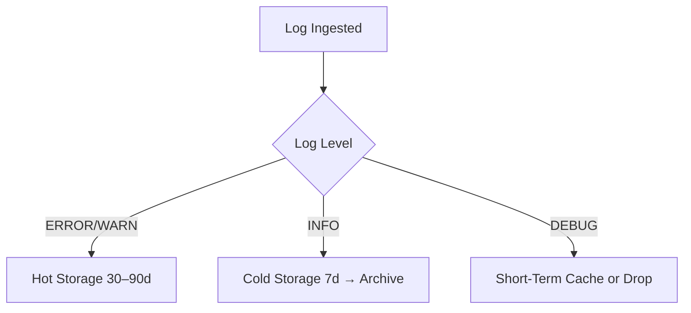

# 💸 Log Volume, Cost Management & Sampling

*Advanced SRE Logging Module: Practical Techniques for Reducing Noise and Managing Cost*

*With Johan—because infinite logs mean infinite costs, not infinite insight.*

---

> **Johan’s Thought:**
> *“A noisy log is a lazy engineer’s crutch. A clean log is a system whisperer’s tool.”*

---

## 🧭 Module Purpose

As systems scale, logs can become one of the largest drivers of observability costs and one of the biggest obstacles to signal clarity. This module helps production support professionals—especially those transitioning into SRE roles—understand:

- Why log volume and retention strategies matter
- How to filter, sample, and store logs intelligently
- How to reduce cost while maintaining valuable observability

You’ll walk away with strategies for scaling your logging footprint without ballooning your budget, and how to identify wasteful or misleading log patterns in your environment.

---

## 🔥 Why Log Volume Matters

When a system emits thousands or millions of log lines per minute, you’re no longer dealing with useful observability—you’re managing a firehose. Here’s what often happens in real-world systems:

- Log ingestion outpaces search performance
- Logging costs exceed storage costs
- Teams are flooded with irrelevant data in dashboards and alert streams
- Debug logs from non-critical components drown out real errors

Logs don’t just tell stories—they consume infrastructure and cost money at every step:
- **Generation:** Every log line consumes CPU and memory
- **Transmission:** Shippers and agents batch and push them over the network
- **Storage:** They’re indexed, replicated, and retained
- **Search:** They affect latency for queries and dashboards

> **Johan’s Analogy:**
> *“Imagine writing down every conversation in an airport terminal. Might be useful. Definitely noisy. Absolutely expensive.”*

This is where **cost-aware observability** begins—not by shutting off logging, but by making sure every log line earns its keep.

---

## 🎚️ Strategy 1: Use Log Levels Wisely

One of the simplest and most overlooked ways to manage volume is to control **log verbosity**. All major logging frameworks (Java, Python, Go, etc.) use log levels.

| Level | Purpose | Should You Use in Production? |
|-------|---------|------------------------------|
| `DEBUG` | Verbose, low-level diagnostics | ❌ Only in dev/test or temporarily during incident investigation |
| `INFO` | Routine operations, request logs | ✅ But monitor volume closely |
| `WARN` | Unexpected but recoverable issues | ✅ |
| `ERROR` | Failures that require investigation | ✅ |
| `FATAL` | Crashes, system-halts | ✅ |

> **Example:**
> A service that logs every request at `INFO` may emit 100x more logs than it needs. Consider downgrading routine success logs, or using sampling for high-frequency routes.

### 🔁 Runtime Adjustability
Modern frameworks let you dynamically change log levels (via flags, config maps, or environment variables) without redeploying.

> **Johan’s Insight:**
> *“Production is not your journal. It’s your dashboard. Log like someone is watching—and billing you for every line.”*

---

## 🚦 Strategy 2: Filter at the Source

Sending logs to a backend without filtering is like sending spam to your own inbox. **Filtering at the edge** saves network, processing, and indexing costs.

### Implementation:
Use log agents like Fluent Bit, Vector, or Logstash to exclude high-volume, low-value logs.

```ini
[FILTER]
  Name grep
  Match *
  Exclude log "GET /healthz"
```

> ⚠️ **Heads-up:** Filtering and sampling configurations can be tool-specific and infrastructure-dependent. You may need to work with platform, SRE, or DevOps teams who manage shared logging agents and Kubernetes DaemonSets. Always check documentation and deployment constraints.

### Typical Candidates for Filtering:
- Container health checks (`/readyz`, `/livez`)
- Static content requests (CDN cache hits)
- Debug logs from low-priority internal jobs

> **Johan’s Rule:**
> *“If it’s not actionable and doesn’t describe a state change—drop it.”*

---

## 🔁 Strategy 3: Log Sampling

Sampling allows you to keep a statistically useful portion of logs while discarding the rest. This is essential for:
- High-frequency events
- Services that generate massive routine traffic (e.g., load balancers, auth gateways)

### Use Case:
You don’t need 10,000 logs saying `200 OK`. You might want 100 samples. But you want 100% of `500 Internal Server Errors`.

### Example: Fluent Bit Sampling Filter
```ini
[FILTER]
  Name sample
  Match *
  Rate 0.1   # Keep 10% of logs
```

### Table: Sampling Scenarios
| Event Type | Sampling Rate |
|------------|----------------|
| HTTP 200 OK | 10% |
| HTTP 500 Error | 100% |
| Debug Info | 1% or disabled |

> **Johan’s Tip:**
> *“If the event is boring and frequent—sample it. If it’s rare and critical—capture it all.”*

---

## 📁 Strategy 4: Retention Policies

Every log should come with an expiration date. By setting **retention policies**, you control the cost and compliance of your data.

### Realistic Tiering:
- Keep `ERROR` and `WARN` logs for 30–90 days (hot)
- Cold-store `INFO` logs after 7–14 days
- Drop `DEBUG` logs after 1–3 days (if at all stored)

### 📈 Mermaid Diagram – Retention Flow


> **🧪 Scenario:**
> Your logs are growing by 500GB/month. Most of it is `INFO` from batch jobs. What’s your move?

✅ **Answer:**
- Adjust log levels to emit fewer `INFO` entries
- Sample or filter `INFO` at the edge
- Shift cold-bound `INFO` logs to S3, Glacier, or BigQuery

---

## 🏷️ Strategy 5: Cost-Optimized Storage

Modern observability stacks let you control how much you pay by **where you store logs**.

| Storage Type | When to Use | Pros | Cons |
|--------------|-------------|------|------|
| Hot (e.g., Elastic, Loki) | Real-time ops, alerts | Fast | Expensive |
| Cold (e.g., S3 + Athena, GCS + BigQuery) | Compliance, audits | Cheap | Slower search |
| Archive (e.g., Glacier, Nearline) | Legal retention | Very cheap | Long retrieval times |

### 💰 Cost Example:
Assume you're retaining 1TB of logs:
- Hot (Elasticsearch): ~$100–150/month
- Cold (S3): ~$20–30/month
- Archive (Glacier): ~$5–10/month

Multiply that by 12 months and 10TB of data, and your annual savings from tiering alone can hit thousands of dollars.

> **Johan’s Recommendation:**
> *“Pay to know what’s breaking. Archive the rest in case someone asks later.”*

---

## 📘 Glossary

| Term | Definition |
|------|------------|
| **Sampling** | Logging only a fraction of certain types of events |
| **Retention Policy** | Rule for how long different logs are stored |
| **Hot Storage** | Fast, high-cost, searchable logs |
| **Cold Storage** | Cheap, less searchable logs |
| **Log Level** | Classification of log importance (e.g., DEBUG, INFO, ERROR) |
| **Filtering** | Removing logs at the shipper or ingestion point |

---

> **Johan’s Final Thought:**
> *“Smart logging isn’t about saying less—it’s about saying the right things, to the right people, at the right time, for the right cost.”*

---

📅 **End of Module – Log Volume, Cost Management & Sampling**

