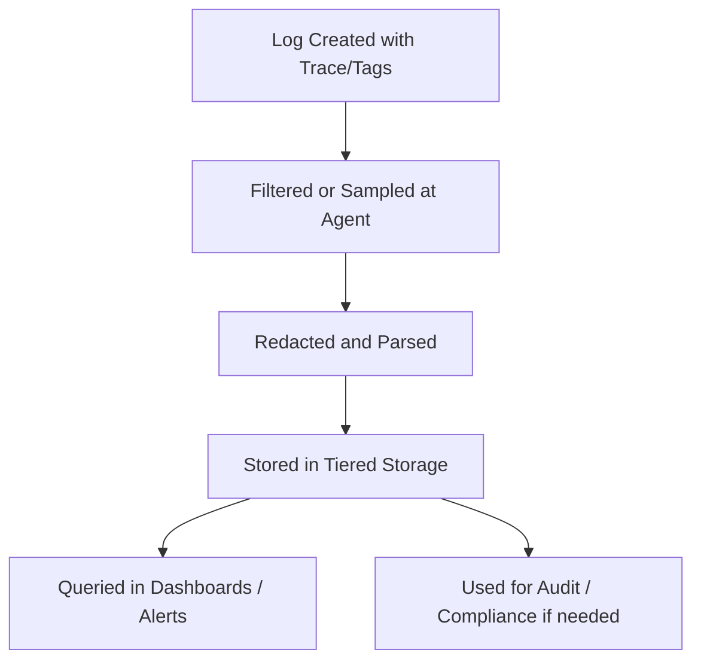

# 🔐 Security, Compliance, and Logging Integrity

*Advanced SRE Logging Module: Protecting Data While Keeping Logs Useful*

*With Johan—because observability without security is a liability, not a feature.*

---

> **Johan's Thought:**
> *“A great log helps you debug. A reckless log helps attackers. Respect the boundary.”*

---

## 🧭 Module Purpose

This final section of the advanced logging series explores how to:
- Log safely in environments where PII, credentials, or sensitive metadata may appear
- Use audit logging effectively for security and regulatory visibility
- Recap everything learned across the series: clarity, efficiency, and responsible observability

---

## 🚫 PII & Sensitive Data: What Not to Log

Logging is visibility—but it can also be exposure. Personal data must be handled carefully, especially in regulated environments.

### Examples of what **should not** appear in logs:
- Passwords (even hashed!)
- Credit card numbers
- Government IDs (SSNs, passport numbers)
- Authentication tokens / secrets
- Customer email addresses
- Anything covered under GDPR, HIPAA, or PCI-DSS

### ⚠️ Common Mistakes:
- Logging request/response bodies without filtering out secrets
- Including entire JWTs or OAuth tokens in debug logs
- Concatenating logs from structured inputs without sanitization

### ✅ Mitigation Techniques
| Technique | Description |
|-----------|-------------|
| **Masking** | Replace sensitive fields with `****` or placeholder text |
| **Redaction** | Use regex filters to strip fields at ingest time |
| **Anonymization** | Hash user identifiers (e.g., user_id, IP) before logging |
| **Validation Libraries** | Prevent certain data from reaching logs at all |

#### Example: Fluent Bit Redaction
```lua
function redact(msg)
  return string.gsub(msg, "(password=)[^& ]+", "%1[REDACTED]")
end
```

> **Johan’s Tip:**
> *“Never log something you wouldn’t want published in a breach report.”*

---

## 📜 Audit Logging: Evidence, Not Overhead

Audit logs document:
- Access to sensitive systems
- Data changes (user updates, deletions)
- Role or permission modifications
- Login success/failure events

These logs are:
- **Immutable** (should not be altered post-write)
- **Timestamped** (with sync accuracy)
- **Structured** (machine-parseable)
- **Accessible only to authorized personnel**

### Why Audit Logs Matter:
| Benefit | Why It’s Critical |
|--------|------------------|
| **Security Investigations** | Establishes chain of activity |
| **Compliance Audits** | Proves accountability |
| **Postmortems** | Clarifies who did what and when |
| **Anomaly Detection** | Patterns of misuse or automation failure |

> **Johan’s Insight:**
> *“Audit logs aren’t for you. They’re for future-you, and legal.”*

---

## 🧩 Wrapping It All Together: Log as Signal, Not Noise

Over this training series, you’ve learned that effective logging is more than verbosity—it’s:
- **Structured**: Every log has searchable fields
- **Correlated**: Logs link to traces, metrics, and context
- **Filtered**: Only relevant logs make it to the backend
- **Sampled**: Volume is controlled, signal preserved
- **Enriched**: Tags provide team, env, service info
- **Governed**: Logs are secure, compliant, and retained with purpose

### 📈 Final Diagram – The Lifecycle of an Effective Log


> **Johan’s Final Prompt:**
> *“Is your logging system helping you solve problems—or creating new ones?”*

---

## ✅ Key Takeaways

| Concept | Takeaway |
|--------|----------|
| **Don't log everything** | Log what matters. Drop what doesn't. |
| **Structure your logs** | Searchability and parsing depend on it. |
| **Use levels and sampling** | Control volume and cost. |
| **Protect user data** | Assume every log might leak. |
| **Audit what matters** | Don’t just observe—record with integrity. |

> **Johan’s Closing Thought:**
> *“Logging isn’t just output. It’s evidence. It’s trust. Log like someone else will have to explain it later.”*

---

📅 **End of Advanced Logging Training – Security, Compliance & Wrap-Up**

