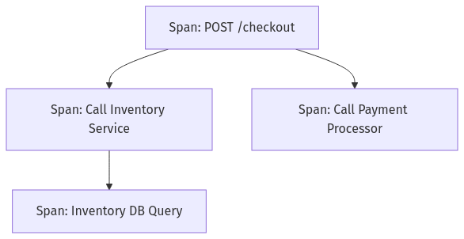
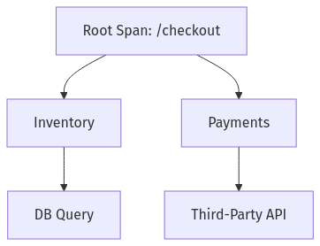
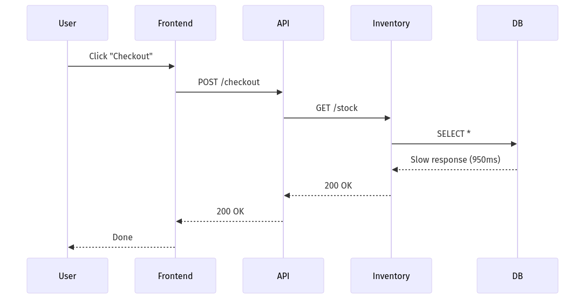

# **What is Distributed Tracing?**
*By Johan, your pragmatic and dry-witty SRE guide*

---

> **Johan’s Thought**  
> *“Every user request is a mystery novel. The better you trace, the sooner you solve the whodunit before customers file a bug report.”*

---

## 📦 Introduction: The Chaos of Distributed Systems

Modern production systems are a patchwork of services: stateless APIs, function calls, databases, queues, caches, downstream providers, and pipelines. And a single user interaction—say, placing an order—may call into **dozens** of these.

In monoliths, logs could follow the call stack. In distributed systems, we don’t have a single stack. We have *many stacks*—running in different containers, machines, and clouds, often in parallel.

So how do you follow the journey of a request?

**Distributed tracing** is the answer.

---

## 🧭 Definition: What Is Distributed Tracing?

**Distributed tracing** is the practice of tracking a request's journey across services in a distributed system.

It tells you:
- What services were involved in handling a request
- What operations were performed
- How long each step took
- How these steps relate to one another

---

> **Analogy:** It’s like tracking a package.  
> You don’t just want to know that it’s “in transit.” You want to see:  
> - **Where it was** (spans)  
> - **When it was there** (duration)  
> - **How it moved** (causality)  
> - **And if anything went wrong** (errors, retries, etc.)

---

## 🔑 Core Concepts and Terminology

Let’s explore the **five essential tracing terms**, using both concept, diagram, and JSON.

---

### 1. **Trace**

A **trace** is the **complete journey of a single request** across system boundaries.

- It has a unique **Trace ID**.
- It is composed of **spans**, each representing an operation.
- It is hierarchical—like a tree.

---

#### 🧾 Example: JSON Representation of a Trace

```json
{
  "traceId": "abc123",
  "spans": [
    {
      "spanId": "span1",
      "name": "POST /checkout",
      "startTime": 1680000000000,
      "durationMs": 1200
    },
    {
      "spanId": "span2",
      "parentSpanId": "span1",
      "name": "Call Inventory Service",
      "startTime": 1680000001000,
      "durationMs": 500
    }
  ]
}
```

---

> **Johan's Thought**  
> *“Traces are the forensic logs of your system. But unlike logs, they’re structured, ordered, and blame-friendly.”*

---

### 2. **Span**

A **span** is a **single unit of work**—a function call, a database query, an HTTP request.

Each span includes:
- A **Span ID**
- A reference to its **parent** (if it has one)
- **Start time**
- **Duration**
- **Tags** (key-value pairs)
- **Events** (optional log-like data)

---

#### 🧾 JSON: Span Breakdown

```json
{
  "spanId": "span2",
  "traceId": "abc123",
  "parentSpanId": "span1",
  "name": "Call Inventory Service",
  "startTime": 1680000001000,
  "durationMs": 500,
  "attributes": {
    "http.method": "GET",
    "http.url": "/inventory?id=42",
    "http.status_code": 200
  }
}
```

---

#### 📈 Mermaid Diagram – Trace & Span Relationship


<div style="max-width: 650px; margin: 1em auto; text-align: center;">
    
</div>


---

> **Johan's Thought**  
> *“Spans are units of time. And time is the one thing you’ll always be out of during an incident.”*

---

### 3. **Parent/Child Span Relationships**

Spans form a **tree**, not a flat list. This hierarchy shows **causality**:
- Span A triggered Span B
- Span B triggered Span C
- You now have **structured causality**, not just order

This structure is critical when:
- Diagnosing **fan-out** requests
- Debugging **cascading failures**
- Understanding **bottlenecks**

---

#### 📈 Mermaid Diagram – Span Tree View


<div style="max-width: 650px; margin: 1em auto; text-align: center;">
    
</div>


---

> **Johan's Thought**  
> *“Parent-child spans reveal who started the fire. Logs just tell you everything’s burning.”*

---

### 4. **Root Span**

The **root span** is the first operation in the trace—typically:
- The inbound HTTP request
- A message received from a queue
- A cron-triggered job

Root spans are useful for:
- **User-experience measurement** (they usually wrap the entire flow)
- **SLO tracking** (latency of root = latency of experience)
- **Tag anchoring** (e.g., customer ID, endpoint)

---

#### 🧾 Pseudocode: Creating a Root Span (OpenTelemetry-style)

```python
from opentelemetry import trace

tracer = trace.get_tracer(__name__)

with tracer.start_as_current_span("POST /checkout") as root_span:
    root_span.set_attribute("user.id", "u-123")
    process_checkout()
```

---

### 5. **Time and Duration**

Every span captures:
- **Start time** (in high-resolution epoch or ISO format)
- **Duration** (in ms or µs)

This lets you:
- Visually **layer spans** in waterfall diagrams
- **Compare parallel operations**
- Detect **slowest components**

---

#### 🧾 Example: Duration Comparison

```json
{
  "spanId": "db_query",
  "durationMs": 950
}
```

If your checkout took 1200ms, and the DB took 950ms—you know where the latency lives.

---

> **Johan's Thought**  
> *“Every extra millisecond hides somewhere. Your job? Be the latency detective.”*

---

## 💡 Why Does This Matter for SREs?

This is where we go beyond definition—and into **SRE relevance**.

---

### 🎯 1. Incident Response: Tracing Speeds Time to Resolution

You get paged for high latency on `/checkout`.

With logs, you grep and scroll through three services.

With metrics, you see a spike.

With tracing?  
You **see the exact request** that took 17 seconds, with:

- Which service was slow (Inventory)
- Which operation (DB query)
- How it cascaded to retries
- What downstream was affected

---

#### 📈 Mermaid – Timeline (Conceptual)


<div style="max-width: 550px; margin: 1em auto; text-align: center;">
    
</div>


---

### 🎯 2. Debugging: Reconstruct the Flow

With logs, you can’t always tell the **path** of a request.

But with a trace, you know:
- It started in API
- Called Inventory
- Hit DB
- Then retried

If you’re chasing a bug that *only* shows up under load, tracing **preserves causality** without relying on “log stitching.”

---

### 🎯 3. Performance Engineering: Optimize What Hurts

Not all latency is equal.

With tracing, you can:
- Identify slow endpoints across all traces
- Rank span durations (e.g., 95th percentile of `db.query`)
- Drill into spans tagged with `"cache_miss": true`

Now you’re not guessing—you’re **targeting bottlenecks**.

---

### 🎯 4. SLOs and Error Budgets: Measure What Matters

You define an SLO:
> “99% of `POST /checkout` requests complete in < 500ms”

You can:
- Pull **root span durations** tagged `/checkout`
- Track which span paths break the SLO
- Link it to your **error budget burn rate**

This ties directly into SRE practices:
- Monitoring
- Reliability targets
- Prioritized remediation

---

### 🎯 5. Cross-Team Debugging and Ownership

In a microservice world, one team owns Checkout, another owns Inventory, another owns Payments.

When a trace breaks across those services:
- The **Trace ID** binds them
- Everyone sees **their piece of the puzzle**
- No finger-pointing—just causality

It becomes possible to **own the customer journey**, not just your code.

---

> **Johan’s Thought**  
> *“You don’t own just your service. You own your role in the story. Tracing shows you your chapter—and the ones that came before and after.”*

---

## 🔚 Summary

### 📘 Core Concepts Recap

| Concept | Definition |
|--------|------------|
| **Trace** | Entire request journey |
| **Span** | One unit of work |
| **Root Span** | The initial trigger operation |
| **Parent/Child** | Shows which span triggered which |
| **Duration** | Tells you where the time went |

---

### 🧠 What You’ve Learned

- Distributed tracing is not a luxury—it’s foundational for observability in complex systems.
- It goes beyond logs and metrics by capturing **what happened**, **when**, and **why it matters**.
- It empowers SREs to:
  - Troubleshoot faster
  - Understand failure paths
  - Measure real user experience
  - Meet SLOs
  - Collaborate across services

---

> **Final Thought from Johan:**  
> *“Tracing isn’t just a tool—it’s a mindset. Think like a request. Trace like a forensic pathologist. Debug like a system whisperer.”*

---

✅ **End of Module — “What is Distributed Tracing?”**
